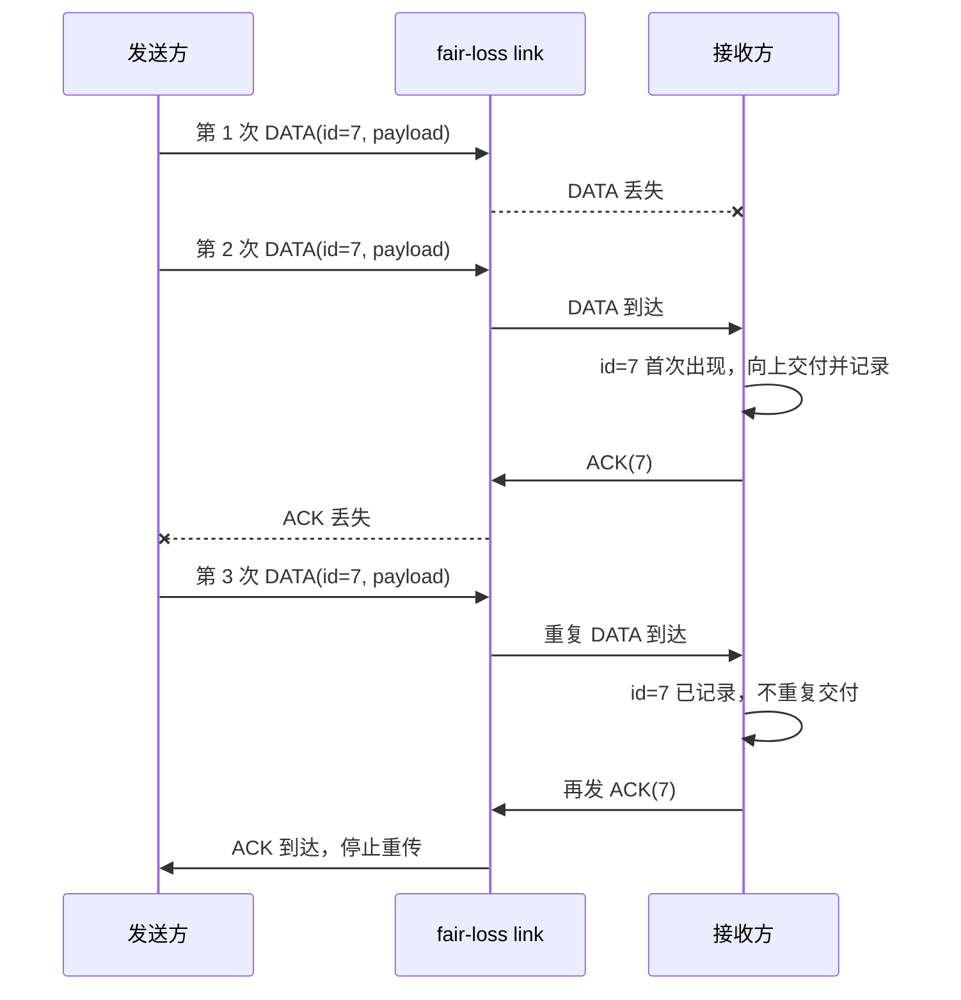
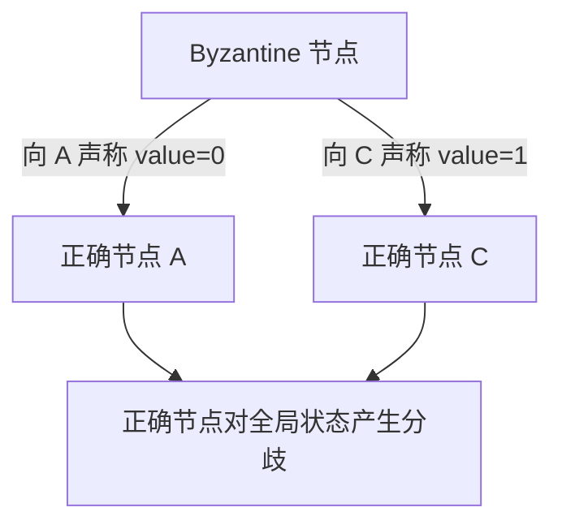
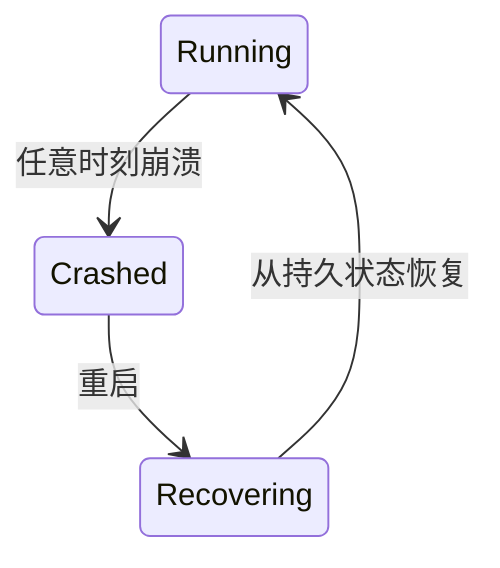
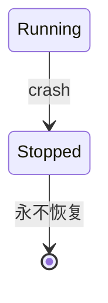
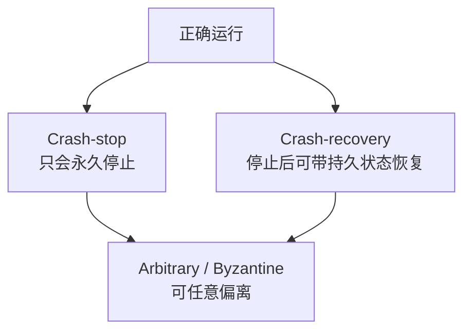
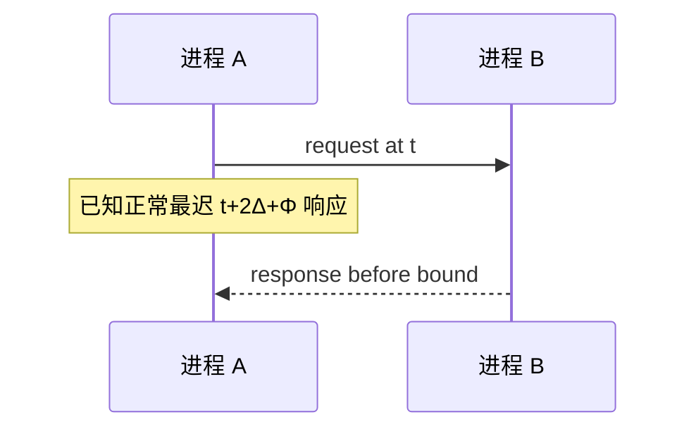
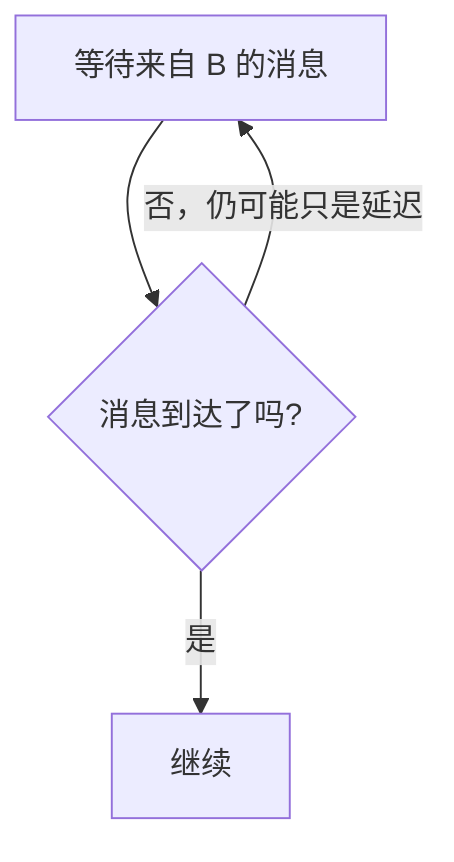
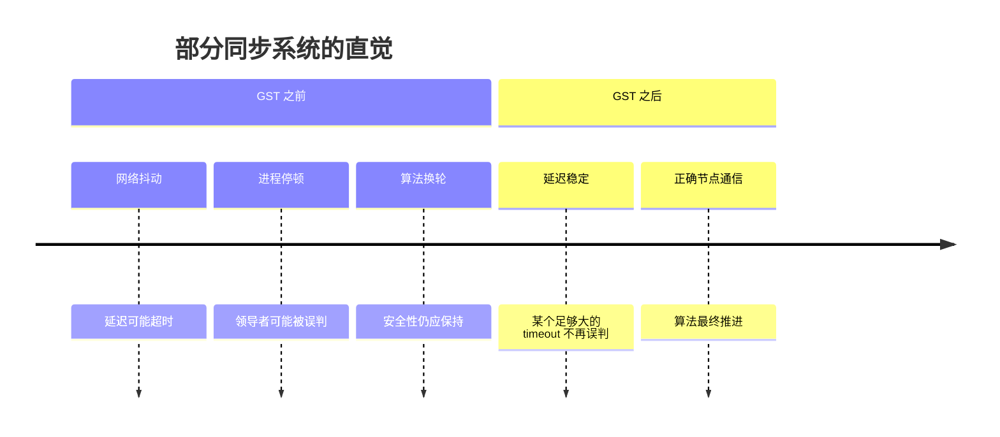
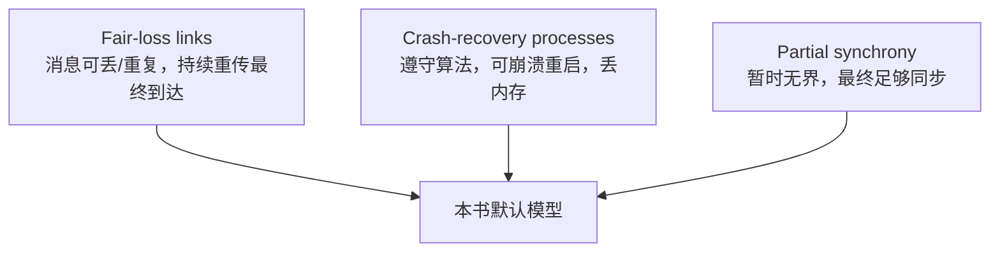
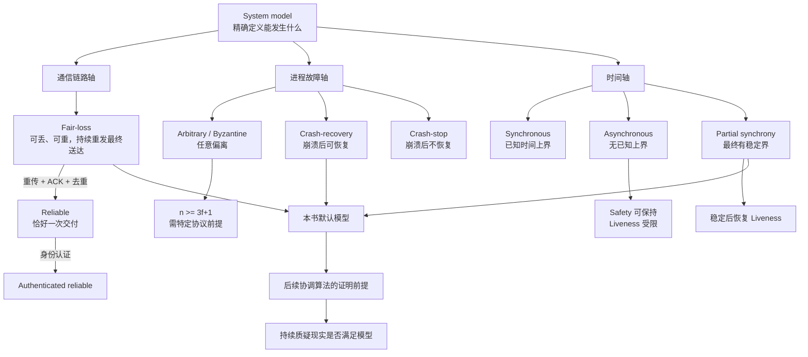

> 本文严格沿原章顺序展开：先说明为什么需要系统模型，再依次讨论通信链路模型、进程故障模型和时间模型，最后分析全书采用的 `fair-loss links + crash-recovery processes + partial synchrony` 组合及模型边界。原章篇幅很短、以概念分类为主；文中的可靠链路构造、$n\ge 3f+1$ 推导、安全性/活性辨析、伪代码和标准 C 示例用于展开前提与直觉，不应误认为原书给出的完整协议或无条件定理。

## 0. 本章定位：先规定“世界可能怎样坏”，再证明算法

### 0.1 为什么进入 Coordination 后首先讲模型

Part I 解决了通信的工程基础：TCP、TLS、DNS 和 API。Part II 的目标更进一步：让多个进程协调行动，对用户表现得像一个连贯的整体。

协调算法会遇到大量不确定性：

- 消息是否会永久丢失；
- 消息是否可能重复或伪造；
- 进程崩溃后会不会恢复；
- 恢复后还保留哪些状态；
- 网络延迟是否存在上界；
- 超时能否证明远端失败；
- 某些进程是否会恶意发送矛盾消息。

如果不先回答这些问题，“算法正确”没有明确含义。同一个算法在一种世界里正确，在更恶劣的世界里可能错误或永远不推进。

### 0.2 系统模型是什么

作者给出的核心定义是：

> **系统模型是一组关于进程、通信链路和时间行为的假设。它让我们忽略具体技术细节，用可控的抽象推理分布式算法。**

可以把模型写成假设集合 $M$，算法写成 $A$，目标性质写成 $P$：

$$
M \land A \Longrightarrow P
$$

这句话不是说 $A$ 在现实中无条件保证 $P$，而是：**当现实满足模型 $M$，且实现符合算法 $A$ 时，才能推出性质 $P$。**

一旦现实违反模型，例如算法假设消息最终送达，但防火墙永久丢弃全部消息，证明链条就断了。

### 0.3 模型为何能让问题更简单

真实网络包含网卡、驱动、交换机、路由器、队列、内核、虚拟化、云平台和各种故障。若证明每一步都展开这些细节，问题几乎无法处理。

模型通过三步简化：

1. 只保留影响算法正确性的行为；
2. 把复杂实现归纳为少数允许事件；
3. 在这些事件集合上证明算法性质。


抽象不是逃避现实，而是把“证明核心”与“实现是否满足前提”分成两个可管理问题。

### 0.4 三条正交建模轴

原章依次建立三类模型：

| 轴 | 核心问题 | 本章模型 |
| --- | --- | --- |
| 通信链路 | 消息怎样丢失、重复、送达或认证 | fair-loss、reliable、authenticated reliable |
| 进程故障 | 进程能怎样偏离算法、崩溃和恢复 | arbitrary-fault、crash-recovery、crash-stop |
| 时间 | 消息与操作耗时是否有上界 | synchronous、asynchronous、partially synchronous |

它们可以组合。例如，“可靠链路”并不说明进程是否 Byzantine，“crash-recovery”也不说明网络延迟是否有上界。完整算法前提必须在三条轴上分别声明。

## 1. Communication link models：通信链路模型

### 1.1 链路模型描述什么

链路模型规定一个正确发送进程和正确接收进程之间，消息可能发生什么：

- 是否可能丢失；
- 是否可能重复；
- 是否保证最终送达；
- 是否恰好交付一次；
- 接收方能否确认发送者身份。

它不是描述物理线缆，而是描述算法可依赖的逻辑通信语义。

## 2. Fair-loss link：公平丢失链路

### 2.1 定义

原章对 fair-loss link 的概括是：

- 消息可能丢失；
- 消息可能重复；
- 若发送方持续重传同一消息，它最终会被送达。

原书这句话是便于入门的非正式概括。形式化资料通常用三项性质定义 fair-loss：

1. **公平丢失**：若正确发送方把同一消息无限次发送给正确接收方，接收方会无限次交付该消息；
2. **有限重复**：若消息只发送有限次，就不会被交付无限次；
3. **无创造**：链路不会交付从未发送过的消息。

第一项可写为：

$$
\operatorname{send}(m)\ \text{infinitely often}
\Longrightarrow
\operatorname{deliver}(m)\ \text{infinitely often}
$$

这当然蕴含“最终至少到达一次”，也是原章建立可靠链路直觉所需的部分。“公平”不表示每次发送成功概率相同，也不表示在固定时间内送达；它排除了“同一消息无限重发却永远全部被网络针对性丢弃”的不公平执行。

### 2.2 它允许哪些执行

一次发送：

```text
send(m) -> lost forever
```

允许，因为模型不保证单次发送成功。

多次发送：

```text
send(m), lost
send(m), delivered
send(m), delivered again
```

允许，因为消息可丢失、可重复；最终至少一次到达。

无限重发全部丢失：

```text
send(m), lost
send(m), lost
... forever
```

不符合 fair-loss 假设。

### 2.3 “最终”没有截止时间

fair-loss 的 eventual delivery 不给出时间上界：

$$
\exists t_{deliver}<\infty
$$

但模型不提供已知常数 $\Delta$ 使得：

$$
t_{deliver}-t_{send}\le\Delta
$$

因此它能支撑“持续重试最终有机会成功”，却不能单独支撑“5 秒没到就证明链路永久失败”。后者需要时间模型或故障检测假设。

### 2.4 现实对应

不可靠数据报、会丢包的网络加上“故障最终恢复”的环境，可以近似 fair-loss。它仍是理想化假设：

- 永久网络分区会违反最终送达；
- 错误路由或 ACL 可永久丢弃；
- 发送方可能在成功前崩溃；
- 无限重试需要无限时间和资源，现实系统必须设置截止时间。

模型用来证明“只要持续尝试且链路公平”，不是要求生产客户端真的无限重试。

## 3. Reliable link：可靠链路

### 3.1 定义

原章把 reliable link 描述为：消息恰好送达一次，不丢失、不重复。

通常可拆成三项性质：

1. **有效性（validity）**：正确发送方发送给正确接收方的消息最终交付；
2. **无重复（no duplication）**：同一消息最多交付一次；
3. **无创造（no creation）**：接收方只交付某个发送方实际发送过的消息。

其中“恰好一次交付”是：

$$
\text{at least once} + \text{at most once}
=\text{exactly once}
$$

它是链路交付语义，不等于业务操作 exactly-once。应用重新发出两个不同请求时，链路可以各自准确交付一次，业务仍可能重复执行。

### 3.2 如何在 fair-loss 上构造可靠链路

作者点出关键方法：接收端去重。完整直觉还需要发送端重传与消息 ID：



发送方：

```text
为消息分配唯一 ID
重复发送 DATA(id, payload)，直到收到 ACK(id)
```

接收方：

```text
收到 DATA(id, payload)：
  如果 id 尚未见过：
    记录 id
    向上层交付 payload
  无论是否重复，都回复 ACK(id)
```

### 3.3 为什么重复消息也要 ACK

若第一次数据已交付，但 ACK 丢失，发送方会重传。接收方必须：

- 不再向应用交付，保证 at-most-once；
- 再次 ACK，让发送方停止重传。

只丢弃重复消息而不 ACK 会让发送方永久重试。

### 3.4 构造成立的隐含前提

“fair-loss + 去重 = reliable”不是无条件等式，还依赖：

- 发送方持续重传，直到确认；
- DATA 与 ACK 链路最终公平；
- 消息 ID 在有效范围内唯一；
- 接收方的已见集合不会在需要去重时丢失；
- 接收方不会在记录 ID 与向上交付之间留下错误崩溃窗口；
- 发送/接收进程足够长时间保持正确运行。

crash-recovery 下，若去重集合只在内存中，接收方重启后会忘记已交付 ID，再次交付旧重传。若要求跨重启保持 exactly-once delivery，需要持久化发送 outbox 与接收去重状态，并让去重记录和应用副作用原子提交。incarnation/epoch 只能把 ID 空间分代；若不保留旧代的交付事实，它最多把保证限制在单次进程 incarnation 内，不能替代跨重启的持久去重。

### 3.5 可靠链路与 TCP

原章说 TCP 实现 reliable transmission，并且还提供更多能力。TCP 的主要语义是连接内可靠、有序、无重复的字节流，还包含流量和拥塞控制。

对应关系不是一一相同：

- 抽象模型讨论 message delivery；
- TCP 对应用暴露 byte stream，不保留消息边界；
- TCP 连接永久断开时会向应用报告失败，而不是保证在所有现实故障下永远交付；
- 应用跨连接重试仍需要自己的幂等语义。

因此 TCP 是可靠链路思想的工程实现近似，不应把形式模型的每个词直接等同于 socket API。

## 4. Authenticated reliable link：认证可靠链路

### 4.1 定义

authenticated reliable link 保留 reliable link 的交付保证，并增加：

> 接收方能够认证消息发送者。

攻击者不能让接收方把伪造消息错误归因给一个正确发送者。可以抽象为：

$$
deliver(sender,m)\Longrightarrow
m\text{ 确由 }sender\text{ 发送}
$$

### 4.2 为什么可靠不等于认证

一条链路可能完整交付攻击者注入的消息。可靠性回答“数据是否丢失/重复”，认证回答“数据是谁发的”。

| 性质 | 可靠链路 | 认证可靠链路 |
| --- | --- | --- |
| 最终交付 | 是 | 是 |
| 不重复 | 是 | 是 |
| 不凭空创造 | 是 | 是 |
| 发送者身份可验证 | 不一定 | 是 |

### 4.3 TLS 的位置

原章指出 TLS 实现 authentication，并提供更多能力。TLS 通过证书、数字签名、握手 transcript 和记录认证建立对端身份与消息完整性，同时提供机密性。

但 TLS 认证对象取决于配置：

- 普通 HTTPS 通常只认证服务器；
- mTLS 双向认证；
- 禁用证书验证的 TLS 不能认证期望身份，无法抵御主动中间人；
- TLS 终止代理之后，后端链路需要重新定义认证边界。

还要区分点对点认证与可转移证明：TLS/MAC 可以让当前接收方确认对端，但接收方不能总把这份认证转交第三方作为证明；数字签名则可由持有公钥的第三方验证。Byzantine 协议是否需要可转移签名取决于具体设计。

### 4.4 三种链路模型的强弱关系


越往右，算法可依赖的保证越强，但实现成本和前提也越多。

## 5. 标准 C11 示例：fair-loss 上的接收端去重

### 5.1 示例目标

下面的程序模拟同一消息因为 DATA 或 ACK 丢失而重复到达。接收端用 ID 集合保证每个消息只向应用交付一次，并对所有副本返回 ACK。

它只实现可靠链路包装器的接收侧核心，不包含真实网络、定时器、持久存储或并发。

### 5.2 完整代码

```c
#include <stdbool.h>
#include <stddef.h>
#include <stdio.h>

enum { MAX_MESSAGE_ID = 16 };

typedef struct {
    bool delivered[MAX_MESSAGE_ID];
    unsigned int application_deliveries;
    unsigned int acknowledgments;
} ReliableReceiver;

static void receive_data(ReliableReceiver *receiver,
                         size_t message_id,
                         const char *payload) {
    if (message_id >= MAX_MESSAGE_ID) {
        fprintf(stderr, "invalid message id: %zu\n", message_id);
        return;
    }

    if (!receiver->delivered[message_id]) {
        receiver->delivered[message_id] = true;
        receiver->application_deliveries++;
        printf("deliver id=%zu payload=%s\n", message_id, payload);
    } else {
        printf("suppress duplicate id=%zu\n", message_id);
    }

    receiver->acknowledgments++;
    printf("ack id=%zu\n", message_id);
}

int main(void) {
    ReliableReceiver receiver = {0};

    receive_data(&receiver, 7, "create-order");
    receive_data(&receiver, 7, "create-order");
    receive_data(&receiver, 7, "create-order");
    receive_data(&receiver, 8, "reserve-stock");

    printf("application deliveries=%u acknowledgments=%u\n",
           receiver.application_deliveries,
           receiver.acknowledgments);
    return 0;
}
```

预期输出：

```text
deliver id=7 payload=create-order
ack id=7
suppress duplicate id=7
ack id=7
suppress duplicate id=7
ack id=7
deliver id=8 payload=reserve-stock
ack id=8
application deliveries=2 acknowledgments=4
```

### 5.3 代码与模型的对应关系

| 代码 | 模型含义 |
| --- | --- |
| `message_id` | 识别重传副本属于同一逻辑消息 |
| `delivered[]` | 接收端已交付集合 |
| 首次已到达的 ID 调用应用 | 到达副本只向上交付一次；at-least-once 仍依赖未实现的发送端重传与 fair-loss |
| 重复 ID 不调用应用 | at-most-once / no duplication |
| 每次到达都 ACK | ACK 丢失后帮助发送方停止重传 |

### 5.4 为什么它不是生产可靠链路

示例有意省略：

- 发送端持续重传；
- ACK 丢失；
- 消息 ID 生成与回绕；
- 进程重启后的去重持久化；
- 记录 ID 与业务副作用的原子性；
- 数据损坏和身份认证；
- 无限消息的状态清理。

尤其是业务操作：若先执行 `create-order` 再记录 `delivered[7]`，中间崩溃会重复创建；若先记录再执行，中间崩溃会漏创建。它与 Chapter 5 幂等键遇到的是同一个原子性问题。

## 6. Process failure models：进程故障模型

### 6.1 为什么进程模型与链路模型分开

消息未返回可能因为：

- 链路丢包；
- 对端进程崩溃；
- 对端极慢；
- 对端故意不响应；
- 对端返回错误或矛盾结果。

链路模型规定传输行为，进程模型规定计算参与者如何失效。二者组合决定算法需要防御什么。

## 7. Arbitrary-fault / Byzantine model：任意故障模型

### 7.1 定义

arbitrary-fault model 允许进程以任意方式偏离算法：

- 崩溃；
- 返回错误结果；
- 给不同接收者发送矛盾消息；
- 伪造内部状态；
- 与其他故障进程串谋；
- 因 bug、硬件错误或恶意行为执行任意动作。

由于拜占庭将军问题的历史，这也称 Byzantine model。

### 7.2 它为何比 crash 模型难

crash 故障进程停止提供信息；Byzantine 进程却会主动提供误导信息：



正确节点不仅要判断“谁没响应”，还要在多个互相冲突的声明中达成一致。

### 7.3 “最多三分之一”怎样准确表述

原章说系统理论上可以容忍最多 $1/3$ 故障进程并正确运行。经典结论需要附带具体问题和假设。对经典 Byzantine consensus/state machine replication，在常见网络与认证条件下，若要容忍 $f$ 个 Byzantine 节点，通常需要：

$$
n\ge 3f+1
$$

等价地：

$$
f<\frac{n}{3}
$$

为什么在最小配置中是 $3f+1$？系统需要让两个冲突决策 quorum 的交集大于全部 Byzantine 节点数。一般地，总节点数为 $n$、quorum 大小为 $q$ 时：

$$
|Q_1\cap Q_2|\ge 2q-n
$$

要让交集中至少有一个正确节点，需要：

$$
2q-n>f
\quad\Longleftrightarrow\quad
q>\frac{n+f}{2}
$$

在最小配置 $n=3f+1$ 中，常取 $q=2f+1=n-f$，于是：

$$
|Q_1\cap Q_2|
\ge 2(2f+1)-(3f+1)
=f+1
$$

交集中至多有 $f$ 个 Byzantine 节点，因此至少有一个正确节点。正确节点不会为冲突决定背书，从而帮助保证安全性。若 $n>3f+1$，不能仍机械使用固定 $2f+1$；应按协议和上述交集条件选择 quorum。

### 7.4 数值例子

| 容忍 Byzantine 数 $f$ | 最少总节点 $n=3f+1$ | 常见 quorum $2f+1$ |
| ---: | ---: | ---: |
| 1 | 4 | 3 |
| 2 | 7 | 5 |
| 3 | 10 | 7 |

例如 4 个节点容忍 1 个 Byzantine 节点；不是“4 个节点中可以有 $4/3$ 个故障”，而是必须取整数并满足严格少于三分之一。

### 7.5 定理边界

$n\ge3f+1$ 不是所有 Byzantine 系统、所有时间模型和所有密码学假设下的统一结论：

- 同步系统配合数字签名可能有不同可解条件；
- 异步 randomized protocol 与部分同步协议的活性条件不同；
- 点对点认证信道与可转移数字签名提供的证据能力不同；
- 安全性与活性可能需要不同假设；
- 客户端、网络与密钥基础设施也在威胁模型中；
- quorum 公式取决于具体协议。

因此，引用“容忍三分之一”时必须说明协议、网络、认证和进度假设。原章在这里建立的是 Byzantine 模型成本的直觉。

### 7.6 适用场景

原章列出：

- 飞机发动机等安全关键系统；
- 核电站；
- 单一实体不能完全控制全部进程的系统；
- Bitcoin 等数字加密货币系统。

这些场景不能只假设节点“要么正确要么安静崩溃”。不过作者明确说它们超出本书后续算法范围。

### 7.7 Byzantine 不等于只有恶意攻击

任意故障也可以来自：

- 软件 bug 导致不同副本计算不同结果；
- 内存或硬件错误；
- 配置分裂；
- 证书或身份错误；
- 协议实现不一致。

“Byzantine”描述可观察行为集合，不判断主观恶意。

## 8. Crash-recovery model：崩溃恢复模型

### 8.1 定义

crash-recovery 假设：

- 进程运行时遵守算法；
- 可以在任意时刻崩溃；
- 之后可以重启；
- 崩溃会丢失内存状态。



### 8.2 持久状态为什么成为正确性边界

若关键状态只在内存中：

- 已投票任期可能忘记；
- 已处理请求 ID 可能忘记；
- 已确认日志位置可能回退；
- 重启后可能重复做出冲突决定。

所以算法必须明确：

| 状态类型 | 崩溃后结果 | 用途 |
| --- | --- | --- |
| volatile state | 丢失 | 缓存、可重建索引、临时计时器 |
| persistent state | 恢复后仍存在 | 任期、日志、承诺、幂等记录 |

“写入持久存储后再回复”常是安全性要求，不只是性能选择。

### 8.3 recovery 不是回到崩溃前瞬间

重启进程可能需要：

- 读取日志或快照；
- 重放事务；
- 从其他副本追赶；
- 获得新 epoch/incarnation；
- 在恢复完成前拒绝服务。

如果外部把“进程端口重新监听”立即视为完全健康，可能让尚未恢复状态的节点参与协调。

### 8.4 全书为何采用该模型

作者明确说后续算法一般假设 crash-recovery。本文对这一选择的工程解释是：它适合单一组织控制的普通后端系统，节点可能因进程崩溃、机器重启或发布而离开和回来，但通常不假设它们恶意伪造协议消息。

它比 crash-stop 更现实，又比 Byzantine 更简单。

## 9. Crash-stop model：崩溃停止模型

### 9.1 定义

crash-stop 假设进程遵守算法，但一旦崩溃就永不返回。



### 9.2 为什么不现实却有用

软件进程通常会重启，因此 crash-stop 看似不现实。但它可以：

- 模拟无法恢复的硬件损坏；
- 让算法不用处理旧进程带着过期状态回来；
- 简化证明和教学；
- 作为更复杂模型的第一步。

若真实系统会重启，却直接部署只在 crash-stop 下正确的算法，恢复节点可能破坏假设。工程上可以用新身份把每次重启视为新进程，但仍要处理旧消息和持久状态。

### 9.3 crash-stop 与 crash-recovery 对比

| 问题 | Crash-stop | Crash-recovery |
| --- | --- | --- |
| 崩溃后回来吗 | 不会 | 可以 |
| 内存状态 | 不再 relevant | 丢失 |
| 持久状态 | 常不讨论恢复 | 决定恢复正确性 |
| 旧消息 | 节点不再处理 | 可能在重启后到达 |
| 算法复杂度 | 较低 | 较高 |
| 现实适配 | 永久硬件故障 | 常见服务进程 |

## 10. 三种进程模型的关系

不能简单把它们排成单一直线，因为 crash-stop 和 crash-recovery 对“是否恢复”做不同世界假设；但从故障行为丰富度看：



Byzantine 包含崩溃行为，还允许错误和恶意消息，因此防御面更大。算法声称容忍 crash 并不自动容忍 Byzantine。

## 11. Timing models：时间模型

### 11.1 时间模型规定什么

时间模型回答：

- 一条消息最多传多久；
- 一个本地操作最多执行多久；
- 进程调度停顿是否有界；
- 算法能否根据超时做确定推理。

它不只是性能模型。延迟有无已知上界会改变某些协调问题是否可解、何时可推进。

## 12. Synchronous model：同步模型

### 12.1 定义

同步模型假设存在已知有限上界，例如：

$$
d_{message}\le\Delta
$$

$$
d_{operation}\le\Phi
$$

其中 $\Delta$ 是消息延迟上界，$\Phi$ 是操作执行上界。算法知道这些界，可以设置：

$$
timeout>2\Delta+\Phi+\text{margin}
$$

这里按 request 和 response 各传输一次计算。若只等待单向消息，则相应公式才只包含一次 $\Delta$。

### 12.2 为什么同步假设强大

若 request 和 response 都保证可靠送达、每次传输不超过 $\Delta$，正确进程在 $\Phi$ 内响应，那么等待超过 $2\Delta+\Phi$ 后，可以把“仍没响应”当作模型违例或故障证据。仅有 fair-loss 还不够：它允许某一次 request 或 response 永久丢失，必须由可靠链路或协议重传补足。

这让轮次、超时和故障检测更容易证明：



### 12.3 为什么对普通后端不现实

原章指出网络消息可能非常慢，进程还会受：

- garbage collection pause；
- page fault；
- CPU 调度；
- 磁盘和网络排队；
- 资源争用；
- 虚拟化停顿。

即使平常 p99 很小，也难以证明绝对上界永不被打破。SLO 百分位数不是同步模型的确定性上界。

## 13. Asynchronous model：异步模型

### 13.1 定义

异步模型假设消息传输和进程操作可以花费无上界时间。这里的“asynchronous”不是编程语言的 async/await，而是形式模型中 **没有已知有限时间上界**。

$$
\nexists\ \text{known finite }\Delta,\Phi
$$

一个响应延迟一年仍未违反模型；算法不能仅凭等待时间区分：

- 进程崩溃；
- 网络分区；
- 消息仍在路上；
- 正确进程只是非常慢。

### 13.2 为什么算法可能永远不推进

若算法要求收到某进程消息才能继续，而模型允许该消息延迟无界，那么存在合法执行让算法永远等待。



更精确地说，FLP 针对确定性共识、完全异步系统、可靠点对点链路和至多一个 crash-stop 故障：对任何这类算法，都存在一条合法、可接受的执行使其永不决定。受损的是“所有执行都保证终止”；agreement 与 validity 等 safety 性质仍可保持。原章没有展开 FLP，但“许多问题无法在此假设下解决”指向这类限制。

### 13.3 异步模型为什么仍有用

作者指出它比带时间假设的模型简单，基于它的算法也可能更易实现。这里要区分性质：

- 不依赖时钟的 **安全性** 往往更稳健；
- 在纯异步下的 **活性** 可能无法保证；
- 可以引入 randomized algorithm、failure detector 或最终时间假设恢复进度。

异步模型的价值是迫使算法不把“慢”等同于“坏”。

## 14. Partially synchronous model：部分同步模型

### 14.1 定义直觉

原章用“系统大多数时候表现同步”建立直觉。经典部分同步理论通常采用两个标准变体：

1. 消息和进程步骤的有限上界从一开始就存在，但算法不知道上界值；
2. 有限上界已知，但只在一个算法不知道的 global stabilization time（GST）之后持续成立。

这两个变体相关但不是同一个定义，哪些参数已知不同。以第二种为例，可以写成：

$$
\exists\ \mathrm{GST}<\infty,\quad
t\ge\mathrm{GST}
\Longrightarrow
d_{message}(t)\le\Delta
\land d_{operation}(t)\le\Phi
$$

算法知道 $\Delta$、$\Phi$，但不知道 GST 何时到来；一旦 GST 到来，界在之后持续成立。第一种变体没有 GST 切换点，但算法不知道实际 $\Delta$、$\Phi$。

### 14.2 为什么它兼顾现实与可解性



它不要求系统从启动起就同步；在 GST 变体中，要求的是 GST 之后一直满足界，而不只是一次有限稳定窗口。实际工程有时只假设“窗口足够长便能完成一轮”，那是较弱的实践直觉，不能与上面的经典 GST 公式混为一谈。

### 14.3 递增 timeout 如何适应未知上界

若算法不知道真实 $\Delta$，可以在超时后扩大等待：

```text
timeout = initial
每次因超时无法推进：
  timeout = min(timeout * 2, configured_cap)
  开始下一轮
```

在“界存在但未知”的变体中，当 timeout 最终大于实际延迟界，正确消息能在超时前到达；在 GST 变体中，还要等 GST 到来。之后算法不再因过短 timeout 反复换轮。

这解释为什么 exponential backoff 不只是减负，还可以帮助算法适应未知时间尺度。生产实现通常仍有 cap、deadline 和可观测告警，不会数学意义上无限等待。

### 14.4 部分同步不等于“网络通常很快”

它是算法活性前提：经典 GST 变体要求最终持续稳定。若系统永久分区，跨分区协调就不能靠等待自行完成；算法可能保持安全但停止推进。

## 15. Safety 与 liveness：理解时间模型的关键补充

### 15.1 Safety

安全性表示“坏事永不发生”，例如：

- 两个正确节点不会决定冲突值；
- 已提交日志不会被不同值覆盖；
- 同一消息不会向应用重复交付。

更一般地说，任何违反 safety 的行为都存在一个有限“坏前缀”，并且后续执行无法修复已经发生的违规。许多常见 safety 性质可以表现为状态不变量。

### 15.2 Liveness

活性表示“好事最终发生”，例如：

- 请求最终得到响应；
- 正确提议最终被决定；
- leader 最终被选出。

### 15.3 为什么二者分开证明

一个永远不做决定的算法不会决定错误值，因此可能满足 safety，却不满足 liveness。网络不稳定或纯异步期间，正确协调算法通常优先保持 safety，等待部分同步恢复后再获得 liveness。


“系统不可用”有时是避免错误状态的有意选择，而不是算法毫无作用。

## 16. 三种时间模型对比

| 维度 | Synchronous | Asynchronous | Partially synchronous |
| --- | --- | --- | --- |
| 已知延迟上界 | 有 | 无 | 最终有，或上界初始未知 |
| 超时能否作强判断 | 可以依赖模型界 | 不能 | 稳定后可用于推进 |
| 现实贴合度 | 普通后端通常较低 | 覆盖最坏不确定性 | 通常较高 |
| 算法难度 | 较易 | 安全可做，活性受限 | 折中 |
| 永久分区下进度 | 取决于是否违反模型 | 不保证 | 不保证 |

## 17. 全书采用的默认系统模型

### 17.1 三项默认假设

原章明确说，后续一般假设：

```text
fair-loss links
+ crash-recovery processes
+ partial synchrony
```



### 17.2 这个组合允许什么

- 暂时丢包和重复消息；
- 暂时网络分区或高延迟；
- 进程崩溃和重启；
- 内存状态丢失；
- timeout 在不稳定期误判；
- 系统稳定后，在足够多正确进程持续存活并被调度、协议持续重传且满足具体 quorum 等额外活性前提时，可以最终推进。

### 17.3 它排除什么

- 正确重传无限次却永久全部丢失；
- 进程任意撒谎或恶意发矛盾消息；
- 永久没有稳定窗口却仍要求算法终止；
- 持久存储无条件任意损坏；
- 身份密钥被攻击者控制；
- 操作系统和网络所有现实细节。

排除不等于现实不会发生，而是后续证明通常不覆盖这些事件。生产系统若面临更强威胁，需要额外机制或不同模型。

### 17.4 为什么选择这个组合

它符合普通后端系统常见取舍：

- 网络不完美，但故障通常会恢复；
- 进程会重启，但组织控制代码和身份，不按 Byzantine 设计；
- 延迟没有永远可靠的硬上界，但大多数时候存在可用稳定期。

它足够真实，又不必为安全关键或敌对开放网络承担 Byzantine 协议成本。

## 18. 模型是抽象，不是现实本身

### 18.1 “所有模型都是错的”是什么意思

原章最后提醒：模型不包含现实全部细节。模型的价值不在完美复制现实，而在于对特定问题足够有用。

一个模型可以忽略：

- 相关机架故障；
- 磁盘静默损坏；
- 时钟跳变；
- 软件部署产生版本分裂；
- 操作员误配置；
- 密钥泄露；
- 资源耗尽；
- 性能长尾。

算法证明正确后，工程工作才进入另一半：检查实现和部署是否真的满足模型前提。

### 18.2 假设债务

每个强假设都像一笔“假设债务”：实现必须用机制偿还。

| 算法假设 | 工程机制 |
| --- | --- |
| 消息最终可达 | 重试、路由冗余、故障恢复 |
| 不重复交付 | 唯一 ID、持久去重、原子事务 |
| 发送者可认证 | TLS/mTLS、证书和密钥管理 |
| 崩溃后恢复状态 | WAL、快照、fsync、恢复流程 |
| 最终同步 | timeout 调整、退避、网络恢复 |
| 非 Byzantine | 访问控制、单一管理域、软件供应链 |

如果没有对应机制，“模型假设”只是未经验证的愿望。

### 18.3 如何质疑模型

阅读每个算法时，依次问：

1. 消息可以丢、重、乱、伪造吗？
2. 链路故障可以永久持续吗？
3. 进程是 crash-stop、crash-recovery 还是 Byzantine？
4. 哪些状态必须持久化？
5. 是否假设延迟上界或最终稳定？
6. safety 在所有时期都成立吗？
7. liveness 需要哪些额外条件？
8. 现实中哪些事件会越过模型？
9. 如何监控模型正在被违反？

## 19. 容易混淆的概念与常见误区

### 19.1 Fair-loss 不等于“丢包概率公平”

它表达无限重传下的最终交付性质，不要求独立同分布概率，也不提供具体成功率。

### 19.2 Reliable link 不等于网络永不失败

它是向上层提供的抽象，可由重试和去重构造。底层仍会丢包，连接也可能在现实永久故障时失败。

### 19.3 Exactly-once delivery 不等于 exactly-once business effect

链路去重消息副本，业务还需事务和幂等键处理跨连接、跨进程重试。

### 19.4 Authenticated 不等于 encrypted

认证确认来源，机密性隐藏内容。TLS 通常同时提供，但概念上不同。

### 19.5 Byzantine 不等于 crash

崩溃节点停止，Byzantine 节点可以主动欺骗。容 crash 的多数派算法不能自动容 Byzantine。

### 19.6 Crash-recovery 不等于完整状态自动恢复

模型明确内存状态丢失。只有算法选择持久化的状态才能回来。

### 19.7 Asynchronous model 不等于异步编程

前者是时间无上界的形式假设；后者是程序不阻塞线程的执行方式。

### 19.8 Partial synchrony 不等于固定 SLA

经典 GST 变体假设最终持续满足时间界，不保证从启动起每个请求都低于某个百分位延迟。

### 19.9 Timeout 不等于故障证明

在异步或 GST 前，正确慢节点与故障节点不可区分。timeout 是怀疑信号，不是客观事实。

### 19.10 更强模型不总是更好

假设越强，算法可能越简单，但现实越难满足；故障模型越强，算法更鲁棒，但成本更高。应选择与威胁和环境匹配的最弱充分模型。

## 20. 本章知识结构



## 21. 核心结论

1. **算法正确性总是相对于系统模型。** 应写成 $M\land A\Rightarrow P$，而不是脱离前提声称“算法正确”。
2. **系统模型沿通信链路、进程故障和时间三条轴定义世界。** 三轴相互独立，必须组合声明。
3. **fair-loss 链路允许丢失和重复，但持续重发最终送达。** 它不提供单次成功或时间上界。
4. **reliable link 提供恰好一次消息交付。** 可用 ID、重传、ACK 和接收端去重在 fair-loss 上构造。
5. **可靠链路构造仍依赖持久状态和原子性。** crash-recovery 后忘记去重集合会重新交付旧消息。
6. **authenticated reliable link 在可靠交付上增加发送者认证。** 可靠性、认证和加密是不同性质。
7. **TCP/TLS 是抽象模型的工程近似。** TCP 提供可靠字节流，TLS 提供认证、完整性和机密性，但具体边界取决于连接和配置。
8. **Byzantine 进程可以任意偏离算法。** 它不仅包括恶意攻击，也包括产生矛盾行为的 bug 或硬件错误。
9. **经典 Byzantine 容错常要求 $n\ge3f+1$。** 该结论依赖具体共识、认证和时间前提，不能无条件推广。
10. **crash-recovery 是本书后续的主要进程模型。** 进程可重启但丢内存，因此安全关键状态必须持久化。
11. **crash-stop 假设崩溃后永不返回。** 它不完全现实，却能简化算法并模拟永久硬件故障。
12. **同步模型提供已知时间上界。** 对普通后端，GC、page fault、排队和网络长尾使绝对界难以保证。
13. **异步模型没有已知时间上界。** timeout 无法区分故障与极慢，许多问题的确定性活性无法保证。
14. **部分同步最贴近常见工程现实。** 经典变体要么假设未知有限界始终存在，要么假设已知界在未知 GST 后持续成立；再满足协议的其他活性前提，算法才可推进。
15. **Safety 与 liveness 必须分开。** 不稳定期可停止推进来保护安全，稳定后再恢复活性。
16. **全书默认 fair-loss + crash-recovery + partial synchrony。** 后续结论一般不覆盖 Byzantine 进程或永久无稳定窗口。
17. **模型有用但不完整。** 证明结束后必须验证实现、持久化、身份和部署是否兑现模型假设。

## 22. 从本章提炼出的通用解题方法

### 第一步：写出目标性质

明确要保证 safety、liveness、exactly-once delivery，还是身份认证。目标不清，无法选择模型。

### 第二步：分别声明三条轴

用一张表写出链路、进程和时间假设，避免只说“网络不可靠”或“节点会失败”这种无法证明的模糊描述。

### 第三步：选择最弱充分假设

不要为了简化证明假设现实永远同步，也不要在封闭可信后端无理由承担 Byzantine 成本。选足以完成目标、又能由环境兑现的模型。

### 第四步：将强抽象分解为可实现机制

例如把 reliable link 分解为唯一 ID、重传、ACK、持久去重和原子交付。每项机制都应对应一项模型性质。

### 第五步：寻找崩溃窗口

在每两步之间插入 crash：记录前崩溃怎样、记录后执行前怎样、回复前怎样。crash-recovery 正确性常隐藏在这些间隙。

### 第六步：分开证明 safety 和 liveness

先证明任何网络调度下都不做冲突决定，再列出最终送达、正确多数和部分同步等进度前提。

### 第七步：给定理标注量词和边界

“容忍三分之一”要写成在何种协议和假设下，对多少节点、多少故障、保证什么。没有前提的数字没有工程意义。

### 第八步：把假设映射到生产机制

链路公平靠重试和网络恢复，恢复状态靠 WAL/快照，认证靠证书和密钥管理，部分同步靠适应性 timeout 和退避。

### 第九步：测试模型违例

注入丢包、重复、延迟、进程重启、状态回滚和永久分区，观察系统是保持安全、停止推进，还是产生错误状态。

### 第十步：持续检查现实是否越界

监控网络分区时长、重试积压、恢复耗时、持久化错误、时钟与调度停顿。模型不是文档开头写一次就结束，而是运行期需要验证的契约。

本章最重要的方法论是：**先精确定义系统允许怎样失败，再讨论算法如何正确；证明给出的不是无条件真理，而是“假设成立时，结论才成立”的可审查契约。**
