> 本文严格沿原章顺序展开：先分析请求没有响应时的三种不可区分原因，再讨论 timeout 的必要性与阈值权衡，最后依次解释 ping、heartbeat、恢复检测，以及何时应主动维护成员可用性、何时按通信时机检测即可。原章篇幅很短且没有正式算法；文中的 accuracy/completeness、自适应 timeout、概率模型、fencing 与标准 C 示例用于展开作者的直觉，不应误认为原书逐字给出的协议。

## 0. 本章定位：判断远端失效，本质上是在不确定性中做决策

### 0.1 从系统模型到故障检测

Chapter 6 规定了本书常用模型：

- fair-loss links：消息可能丢失或重复；
- crash-recovery processes：进程可能崩溃并重启；
- partial synchrony：延迟可能暂时任意大，但最终进入可用的同步时期。

这些假设立即导出一个难题：当客户端没有及时收到服务器响应时，它无法直接观察“故障发生在哪里”。Failure detector（故障检测器）只能根据消息和时间线索，推测远端当前是否可用。

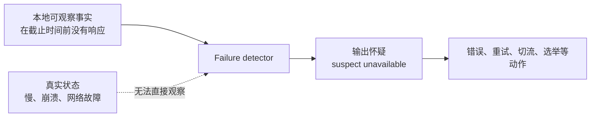

### 0.2 故障检测器不是什么

它不是读取一枚绝对准确的“远端存活位”。分布式系统没有统一观察点：

- A 访问不到 B，不代表 C 也访问不到 B；
- B 不响应，不代表 B 已停止执行；
- B 进程存在，不代表它能完成业务请求；
- 一次成功响应，不代表下一时刻仍健康。

因此，更准确的措辞是：

> **观察者在某时刻怀疑目标不可用。**

而不是：

> **观察者证明目标已经死亡。**

### 0.3 为什么必须检测

若没有任何 timeout 或检测机制，客户端可能永远等待一个不会到来的响应，导致：

- 线程、协程或连接长期占用；
- 请求队列积压；
- 上游 deadline 被耗尽；
- 用户看不到失败结果；
- leader 或副本故障后无人接替；
- 资源无法释放。

故障检测不消除不确定性，而是让系统在“不可能无限等待”的现实约束下做出受控选择。

## 1. 请求无响应：图 7.1 的三个不可区分场景

### 1.1 正常路径

最理想的请求-响应时序为：

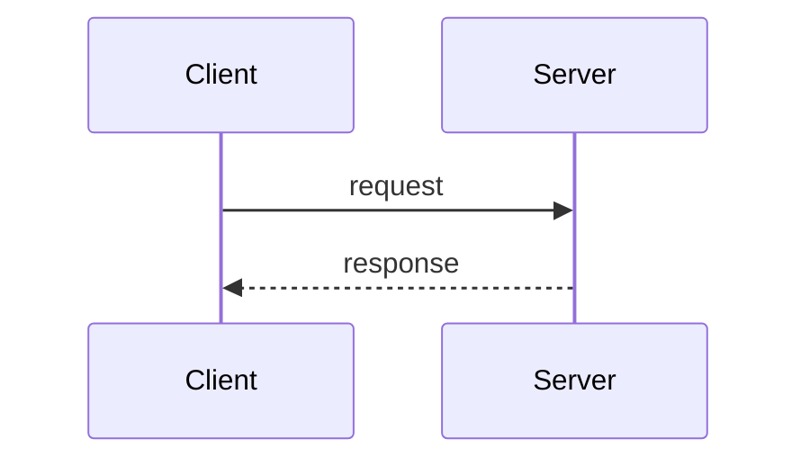

客户端观察到响应，可以确认这次交互完成。但若响应没有按时返回，至少有以下三类解释。

### 1.2 场景一：网络消息延迟或丢失

请求可能根本没有到服务器：

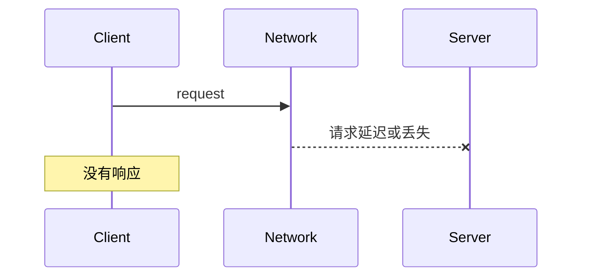

也可能服务器处理成功，但响应在返回途中丢失：

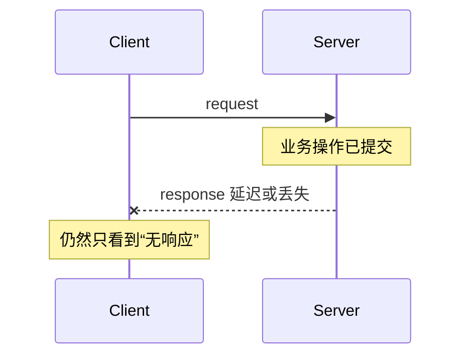

第二种情况尤其重要：timeout 后重试可能重复业务副作用，因此需要 Chapter 5 的幂等方法或 idempotency key。

### 1.3 场景二：服务器崩溃

服务器可能：

- 在收到请求前崩溃；
- 处理过程中崩溃；
- 提交结果后、发送响应前崩溃；
- 发出部分响应后崩溃。

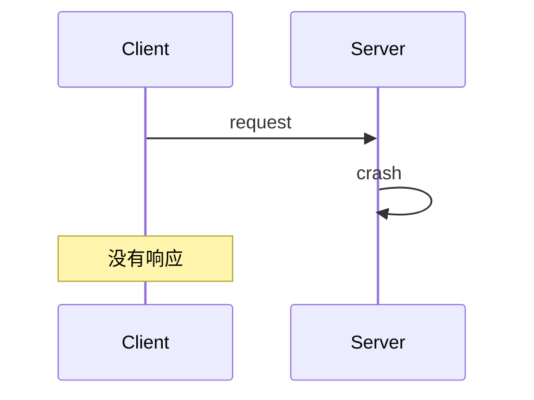

客户端无法仅根据沉默判断服务器是否处理了请求。

### 1.4 场景三：服务器只是很慢

服务器仍正确运行，却可能因为：

- CPU 排队或过载；
- garbage collection pause；
- page fault 或 swap；
- 锁竞争；
- 数据库或下游调用变慢；
- 调度暂停；
- 网络重传。

在响应真正到达前，慢与崩溃具有相同本地观察：没有消息。

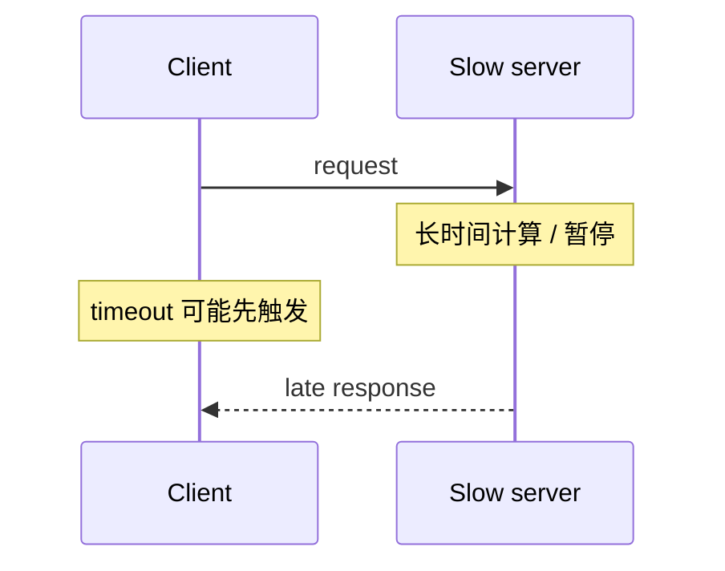

### 1.5 图 7.1 的核心结论

三种现实状态映射到同一个观察：

$$
\{\mathrm{network\ issue},\mathrm{crash},\mathrm{slow}\}
\longrightarrow
\mathrm{no\ timely\ response}
$$

反向推理不唯一：

$$
\mathrm{no\ timely\ response}
\not\Longrightarrow
\mathrm{server\ crashed}
$$

这叫 **观测不可区分性**。故障检测难，不是因为工程师还没找到足够聪明的 `isAlive()` API，而是因为不同世界会产生同一组本地证据。

### 1.6 “不可达”是关系，而非目标的绝对属性

假设网络分区：

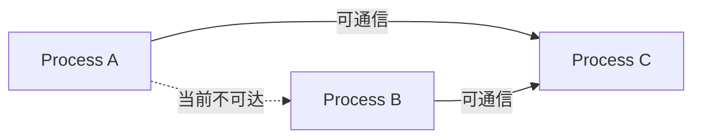

A 认为 B unavailable，C 却能访问 B。故障检测输出通常相对于：

- 哪个观察者；
- 哪条网络路径；
- 哪个时间点；
- 哪种请求/健康条件。

不要把单一观察者的怀疑立即升级为全局事实。

## 2. Timeout：不再无限等待

### 2.1 timeout 是什么

客户端发出请求后设置 deadline 或 timeout。若截至某个时间仍没有响应，就停止等待，并把目标视为当前不可用或这次尝试失败。

```text
send request
start timer T

if response arrives before T:
    cancel timer
    process response
else:
    suspect destination unavailable
    return error or retry according to policy
```

timeout 将无限等待变成有限决策：

$$
W\le T
$$

其中 $W$ 是本次调用最多愿意等待的时间，$T$ 是 timeout。

### 2.2 timeout 触发后可以做什么

原章列出两种基本动作：

- 抛出/返回错误；
- 重试请求。

实际系统还可能：

- 尝试另一个副本；
- 打开 circuit breaker；
- 把节点移出负载均衡；
- 发起 leader election；
- 降级为缓存或陈旧数据；
- 记录指标和告警。

动作越强，误判成本越高。一次读取 timeout 可以重试；错误驱逐 leader 或把健康副本隔离则可能引发系统震荡。

### 2.3 timeout 不是取消或回滚

客户端停止等待，并不会自动：

- 撤回已经送达的请求；
- 中止服务器正在执行的操作；
- 回滚已提交事务；
- 阻止迟到响应；
- 保证重试不会重复执行。

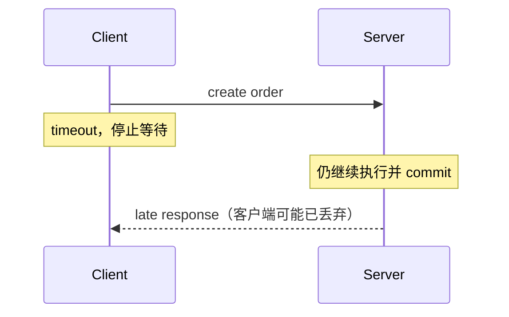

如果协议支持 cancellation，它也通常是另一条尽力而为消息，无法撤销已经提交的副作用。

### 2.4 timeout 太短：假阳性

先把真值定义为“目标进程尚未崩溃”，并在检测时刻观察。若目标正确但响应在阈值后到达，检测器把健康节点误判为不可用，这称为 false positive（误报）。相应条件概率是 false-positive rate：

$$
\mathrm{FPR}=P(\mathrm{suspect}\mid\mathrm{target\ healthy})
$$

后果：

- 不必要重试放大负载；
- 连接和缓存被反复重建；
- 健康节点被移出服务；
- leader 频繁切换；
- 原系统稍慢演化成真正过载。

### 2.5 timeout 太长：检测迟缓与假阴性窗口

若目标已崩溃，但检测器仍等待很久，核心代价是 detection latency。只有指定崩溃后的观察时刻 $t$ 或时间窗，才能把“此时仍未怀疑”定义成 false negative，其条件概率为：

$$
\mathrm{FNR}(t)=P(\mathrm{not\ suspect\ at\ }t
\mid\mathrm{target\ crashed})
$$

若把真值改成“观察者当前不可达”而不是“进程已崩溃”，FPR/FNR 的含义也会变化，必须先声明检测目标。

后果：

- 用户等待无效响应；
- 请求占用线程和连接；
- failover 延迟；
- 上游时间预算被耗尽；
- 队列和资源逐步累积。

### 2.6 阈值选择的基本权衡

设健康响应时间随机变量为 $R$，固定 timeout 为 $T$。忽略丢包与重试时，健康请求误报概率约为：

$$
P(\mathrm{false\ suspicion})=P(R>T)=1-F_R(T)
$$

其中 $F_R$ 是健康响应时间的累积分布函数。

增大 $T$：

- $P(R>T)$ 降低；
- 真故障检测时间增加。

减小 $T$：

- 故障更快被怀疑；
- 健康长尾请求更容易被误判。

这就是作者所说“太短误判，太长浪费等待”的量化形式。

### 2.7 用百分位选择初始值

若健康请求 p99 为 200 ms，直接设置 200 ms 意味着约 1% 健康请求在稳定分布下超时。若每秒 10,000 请求：

$$
10{,}000\times 1\%=100\ \mathrm{timeouts/s}
$$

若每个 timeout 自动重试一次，仅误报就可能增加约 100 requests/s；尾部抖动时会更高。

初始 timeout 可以参考高百分位，再加网络、排队和测量余量，但必须服从调用方总 deadline。不能只为了减少误报把 timeout 设置到超过用户请求预算。

### 2.8 Deadline budget 的层层分配

若顶层请求总预算 $D=1000$ ms，服务 A 还要调用 B 和 C，A 不应分别给 B、C 都设置 1000 ms。必须预留：

- 本地处理；
- 多次调用；
- 有界重试；
- 返回上游；
- 安全余量。

```text
total deadline 1000 ms
  A local work       100 ms
  call B             300 ms
  call C             300 ms
  one bounded retry  200 ms
  response margin    100 ms
```

deadline 应沿调用链传播，避免下游在上游已经放弃后继续消耗资源。

### 2.9 为什么不能构造完美故障检测器

Chapter 6 的异步/部分同步模型已经给出原因：在未知延迟上界时，任何有限 timeout 都可能早于一个正确但极慢的响应。

假设检测器在等待 $T$ 后宣布 crash。对手构造一个合法执行，让健康服务器在 $T+\epsilon$ 才响应；检测器误判。若检测器为了避免误判而永远等待，又无法检测真正 crash。

```text
有限等待 -> 可能误判健康慢节点
无限等待 -> 可能永远发现不了崩溃
```

所以原章结论是：**不可能构造 perfect failure detector。** 工程目标是管理错误概率和后果，而不是消灭所有错误。

### 2.10 wall clock 与 monotonic clock

timeout 应使用 monotonic clock 测量经过时间，而不是 wall clock。系统时钟可能被 NTP 或管理员向前/向后调整，导致：

- 计时器提前触发；
- timeout 被延后；
- elapsed time 变成负数。

单机 monotonic clock 只向前推进，适合计算：

$$
elapsed=now_{mono}-start_{mono}
$$

这是 Chapter 8 会深入的时间问题；在本章只需记住 timeout 是经过时间测量，不是日历时间比较。

## 3. Failure detector 的两个理论维度

经典 completeness/accuracy 分类针对 crash-stop 进程。若采用本书常见的 crash-recovery 模型，应把每次启动视为 `(node, incarnation)`，或另行定义恢复后如何撤销怀疑；否则“崩溃后被永久怀疑”与“恢复后重新 available”会自相矛盾。

### 3.1 Completeness：最终怀疑真正故障者

完备性回答：真正崩溃的进程是否最终会被怀疑。

- strong completeness：每个崩溃进程最终被所有正确进程永久怀疑；
- weak completeness：每个崩溃进程最终至少被某个正确进程永久怀疑。

工程直觉：检测器不能永远漏掉真实故障。

### 3.2 Accuracy：不要错误怀疑正确者

准确性回答：正确进程是否会被误判。

- strong accuracy：任何正确进程从不被怀疑；
- weak accuracy：至少有一个正确进程从不被怀疑；
- eventual strong accuracy：存在某个时刻，此后任何正确进程都不再被怀疑；
- eventual weak accuracy：存在某个时刻，此后至少有一个正确进程不再被任何正确进程怀疑。

部分同步环境通常更现实地追求 eventual accuracy：稳定前网络抖动可以误判，最终及时后足够大的 timeout 让正确心跳及时到达。这里的“eventual”是从某时刻起不再发生相应误判，不只是误判频率降低或“不再持续”。

常用的 eventually perfect failure detector，记为 $\Diamond P$，组合：

- strong completeness；
- eventual strong accuracy。

它的实现还需要 crash-stop（或固定 incarnation）语义、最终及时且可靠的链路或重传抽象，以及正确进程最终得到调度等假设。仅写“fair-loss + partial synchrony”而没有这些进度条件，并不能自动推出 $\Diamond P$。

### 3.3 完美检测器为何不可得

perfect failure detector 同时要求 strong completeness 和 strong accuracy。纯异步系统中，沉默的正确慢进程与崩溃进程不可区分，所以两者无法同时保证。

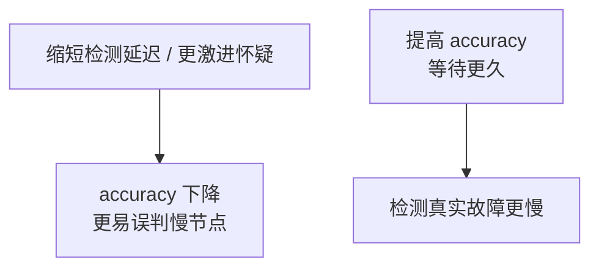

failure detector 的理论分类是原章“只能做 educated guess”的形式化表达。

## 4. Ping：拉取式主动探测

### 4.1 定义与时序

原章定义：ping 是一个进程定期向另一进程发送的请求，要求在特定时间内得到响应。

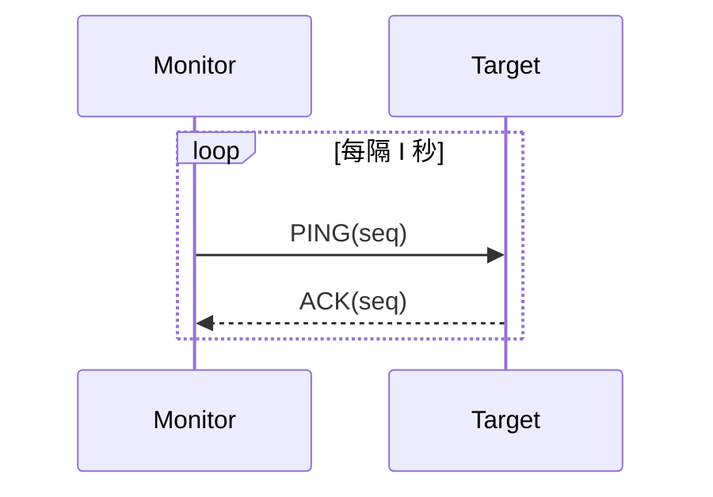

若 ACK 未在 timeout 内到达，monitor 怀疑 target unavailable。

### 4.2 ping 的状态机

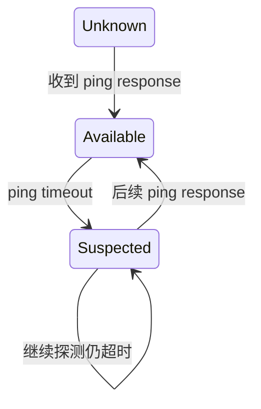

原章特别强调：判 unavailable 后仍继续发送 ping，以发现目标何时回来。若停止探测，就只能发现“曾经失败”，无法自动发现 crash-recovery 后恢复。

### 4.3 ping 检测了什么

最小 ping 通常证明：

- 网络往返当前可达；
- 目标进程能接收请求；
- 目标能调度一小段处理并响应。

它不一定证明：

- 业务线程池有容量；
- 数据库可用；
- 写请求能提交；
- 所有依赖健康；
- 目标对其他客户端也可达。

健康检查过浅会产生 false healthy；过深则把一个下游故障扩散成所有实例都被摘除。

### 4.4 ping 周期、timeout 与检测时间

设：

- ping 周期为 $I$；
- 每次等待 timeout 为 $T$；
- 连续 $k$ 次失败后怀疑故障。

在固定发送节拍、同一目标最多一个 outstanding ping、通常 $I\ge T$ 的简化实现中，若故障刚好发生在一次成功 ping 之后，最坏检测时间近似：

$$
D_{max}\approx kI+T
$$

具体值取决于“周期从发送时刻还是完成时刻计算”等实现。若只需一次 timeout（$k=1$），故障发生时相对下一次 ping 的等待约在 $[0,I]$，则平均检测延迟近似：

$$
E[D]\approx\frac{I}{2}+T
$$

减小 $I$ 和 $T$ 可更快检测，却增加探测负载和误报。

### 4.5 ping 流量估算

一个 monitor 监控 $n$ 个目标，每 $I$ 秒 ping 一次，在目标健康、每次都有 response 的稳态下，消息率约为：

$$
M\approx\frac{2n}{I}\ \mathrm{messages/s}
$$

例如监控 1000 个目标、周期 5 秒：

$$
M=\frac{2\times1000}{5}=400\ \mathrm{messages/s}
$$

若每个节点都直接 ping 其他所有节点，总消息率约为：

$$
M_{all-to-all}\approx\frac{2n(n-1)}{I}=O(n^2)
$$

Chapter 7 没有展开大规模成员协议，但这个估算说明全互联 ping 无法无限扩展。大集群会采用分层监控、随机探测、间接探测或 gossip 类协议。

### 4.6 ping 与业务请求探测

专用 ping endpoint 便宜、频繁，但可能与真实业务路径不同。另一种方式是把正常请求成功当作健康证据，只在一段时间无业务流量时发 ping。

混合策略可以降低探测开销，同时避免空闲节点长期无状态。

## 5. Heartbeat：推送式存活声明

### 5.1 定义与时序

原章定义：目标进程周期性向观察者发送 heartbeat。观察者若在规定时间内没有收到，就怀疑目标 unavailable。

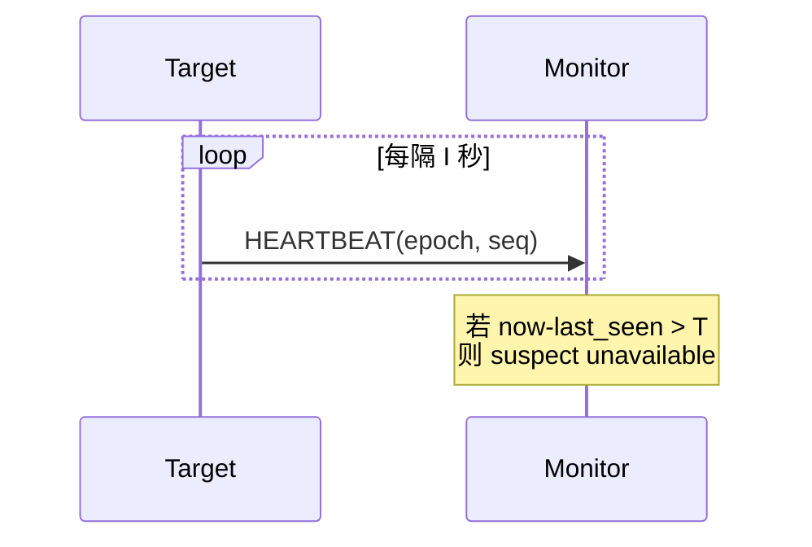

与 ping 相比，heartbeat 不要求每次请求-响应往返；它是目标主动发布“我仍在运行”的证据。

### 5.2 heartbeat 状态

monitor 维护：

```text
last_seen[target]
last_epoch[target]
last_sequence[target]
status[target]
```

收到有效 heartbeat：

```text
last_seen = monotonic_now
status = AVAILABLE
```

定时扫描：

```text
if monotonic_now - last_seen > timeout:
    status = SUSPECTED
```

### 5.3 heartbeat 与 ping 的方向差异

| 维度 | Ping | Heartbeat |
| --- | --- | --- |
| 发起者 | 观察者 | 被观察目标 |
| 消息模式 | 请求 + 响应 | 单向周期消息 |
| 直接测量 | 往返可达性 | 目标向观察者的单向可达与调度 |
| 每周期消息 | 通常 2 条 | 通常 1 条 |
| 目标恢复 | 后续 ping 成功 | 恢复后重新发 heartbeat |
| 状态核心 | outstanding probe | last_seen |

heartbeat 消失可能是目标停发，也可能是目标到 monitor 的单向路径故障。ping timeout 可能是任一方向出错。

### 5.4 epoch 与 sequence 的作用

heartbeat 携带 sequence 可以：

- 忽略重复或乱序 heartbeat；
- 发现明显缺口；
- 观察发送进度。

crash-recovery 后 sequence 可能从 0 重启。使用持久单调 epoch 可以排序新旧 incarnation：

```text
(epoch=17, seq=100)
(epoch=18, seq=1)  // 新进程 incarnation
```

epoch 必须保证新 incarnation 不被旧消息混淆。单纯进程启动时间依赖 wall clock，时钟回拨会有风险。持久单调计数可以直接判断哪个 incarnation 更新；随机 UUID 只能区分身份，不能排序，必须先通过注册或握手确定“当前 UUID”，再拒绝其他 UUID 的迟到消息。

### 5.5 heartbeat 线程也可能“说谎”

若 heartbeat 由独立高优先级线程发送，它可能继续正常，而业务线程已经死锁或完全过载。检测器看到的是进程外壳存活，而不是业务可服务。

反过来，heartbeat 与业务线程共享执行资源时，过载会延迟心跳，使 monitor 摘除过载节点；这可能保护用户，也可能把流量转移到其他节点并触发级联失败。

健康定义必须与动作匹配：

- 进程 liveness；
- readiness（是否可接新流量）；
- dependency health；
- 业务 correctness。

它们不是同一个布尔值。

## 6. 恢复检测：从 unavailable 回到 available

### 6.1 为什么故障后仍要探测

本书采用 crash-recovery 模型。目标可能暂时崩溃后重启，所以检测器不能把 unavailable 当作永久墓碑。

原章分别说明：

- ping monitor 会继续发 ping，后续响应让目标重新 available；
- heartbeat target 恢复发送，monitor 最终重新 available。

### 6.2 恢复判定也可能抖动

网络处于边缘状态时，状态可能反复变化：

```text
AVAILABLE -> SUSPECTED -> AVAILABLE -> SUSPECTED -> ...
```

称为 flapping。后果包括：

- 反复增删负载均衡成员；
- leader 频繁切换；
- 连接和缓存重建；
- 告警风暴。

可以使用 hysteresis（滞回）：

- 连续 $k_f$ 次失败才标 unavailable；
- 连续 $k_s$ 次成功才恢复 available；
- 状态变化后设置最小驻留时间；
- 将 SUSPECTED 与 CONFIRMED_UNAVAILABLE 分开。

这增加检测延迟，换取稳定性。

### 6.3 恢复可达不等于恢复完成

进程重启后可能仍在：

- 重放 WAL；
- 加载缓存；
- 追赶复制日志；
- 等待租约或 fencing token；
- 预热连接池。

所以可区分：

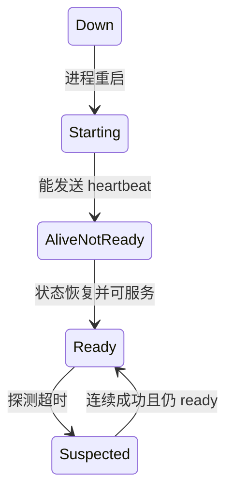

只检测进程存活可能过早把未恢复节点加入业务流量。

## 7. 主动检测还是按需检测

### 7.1 原章的选择原则

作者最后指出：

- 进程频繁交互，且一旦不可达需要立刻行动时，使用 ping/heartbeat；
- 其他场景在真正通信时发现失败即可。

这是一项收益与成本权衡，不是所有依赖都必须每秒健康检查。

### 7.2 主动检测适用场景

- leader/follower 需要快速触发选举；
- 负载均衡器要移除不可达实例；
- 集群成员表需要近实时更新；
- 主备系统要尽快 failover；
- 长连接双方需要发现半开连接；
- 基于租约的系统需要及时发起接管；接管安全性仍依赖 lease 协议、fencing token 或资源端条件写，不能依赖旧持有者及时收到停止通知。

主动检测成本：

- 周期流量；
- 每目标状态和计时器；
- 误报与状态抖动；
- 检测器本身故障域；
- 大集群中的扩展问题。

### 7.3 按需检测适用场景

- 调用非常少；
- 失败后只需让当前请求报错；
- 没有后台 failover 动作；
- 主动探测成本超过收益；
- 下次调用前的状态很快会过期。

例如，每天调用一次的报表导出服务没有必要每秒 ping；请求时设置连接/读取 timeout 可能足够。

### 7.4 新鲜度问题

即使刚刚 ping 成功，目标也可能下一毫秒崩溃。因此健康状态只是带时间戳的证据：

$$
confidence\downarrow\quad\text{as}\quad now-last\_evidence\uparrow
$$

主动检测不能替代真实请求的 timeout。负载均衡器成员表说“healthy”，每次业务调用仍需处理连接失败。

### 7.5 选择矩阵

| 问题 | 倾向主动 ping/heartbeat | 倾向按通信检测 |
| --- | --- | --- |
| 交互频率 | 高 | 低 |
| 故障后是否需立即动作 | 是 | 否 |
| 可接受检测延迟 | 短 | 可等到下次请求 |
| 集群规模 | 需设计可扩展协议 | 简单 |
| 误判代价 | 需用多级状态/确认控制 | 当前请求失败即可 |
| 探测成本 | 可接受 | 不划算 |

## 8. 固定 timeout 与自适应检测

### 8.1 固定 timeout 的局限

同一个阈值难以适配：

- 同城与跨洲 RTT；
- 白天与夜间负载；
- 正常与 GC pause；
- 稳定网络与抖动网络；
- 不同硬件和请求类型。

太保守检测慢，太激进误报多。

### 8.2 基于均值与波动的阈值

可以对 ping/heartbeat 间隔维护平滑均值与偏差：

$$
\mu_t=(1-\alpha)\mu_{t-1}+\alpha x_t
$$

$$
v_t=(1-\beta)v_{t-1}+\beta|x_t-\mu_t|
$$

设置：

$$
T_t=\mu_t+k v_t+margin
$$

其中：

- $x_t$ 是新观测延迟或心跳间隔；
- $\alpha,\beta$ 控制对新样本的敏感度；
- $k$ 控制保守程度。

网络变慢或抖动增大时，timeout 自动放宽；稳定后逐步收紧。TCP RTO 也采用类似“均值 + 波动”的思想。

### 8.3 冷启动与异常样本

自适应检测器还要处理：

- 样本太少时用什么初始值；
- timeout 样本是否参与统计；
- 故障期长延迟是否把阈值永久拉大；
- 不同目标是否共享分布；
- 部署或网络切换后是否重置；
- 最小/最大阈值。

自适应不是自动正确，只是比单一常数更能反映路径行为。

### 8.4 Accrual failure detector

二元检测器直接输出 available/unavailable。accrual detector 可以输出连续 suspicion score：

$$
\phi(t)=-\log_{10}P(X>t)
$$

其中 $X$ 是根据历史估计的下一心跳间隔，$t$ 是自上次心跳起经过时间。

直觉：若健康情况下“这么久还没心跳”的尾概率为 $10^{-4}$，则：

$$
\phi=4
$$

不同调用者可按风险选择阈值：

- 告警在 $\phi>3$；
- 暂停分流在 $\phi>5$；
- 触发高风险接管要求更高阈值或额外 quorum。

连续分数把“证据强度”与“采取什么动作”解耦，但概率分布若不匹配长尾现实，分数仍可能误导。

## 9. 从“怀疑”到“采取动作”的安全边界

### 9.1 单点 detector 不应独自创造全局事实

A timeout B 后，若立即认为 B 永久失败并接管其资源，可能出现：

- B 仍运行，只是 A 到 B 网络分区；
- A 和 B 同时认为自己是 leader；
- 两者同时写共享存储；
- 形成 split brain。


故障检测只是协调算法的输入，不能单独保证互斥或一致性。

### 9.2 Quorum

多个观察者可以共同形成决策，降低单条路径异常的影响。例如多数派能互通的一侧继续工作，少数派停止高风险操作。

quorum 仍不是“证明某节点死亡”，而是让有重叠的决策集合保持安全。它依赖成员配置和具体共识协议。

### 9.3 Lease 与 fencing token

旧 leader 即使被别人判死，也可能稍后恢复并继续写。新 leader 获得单调递增 fencing token：

```text
old leader token = 41
new leader token = 42
```

共享资源只接受比已见 token 更新的操作：

```text
if request.token < highest_seen_token:
    reject stale owner
```

fencing 在资源端阻止被误判/暂停的旧持有者恢复后产生陈旧写入。仅依赖“旧 leader 应该已经收到停止消息”不安全，因为消息也可能丢失。

### 9.4 Detector 动作应按风险分级

| 证据 | 低风险动作 | 高风险动作所需附加条件 |
| --- | --- | --- |
| 一次请求 timeout | 重试另一副本 | 不应直接重配集群 |
| 一次 ping timeout | 标记 suspect | 连续失败/间接探测 |
| 多观察者均不可达 | 摘除流量 | quorum/共识确认 |
| lease 到期 | 尝试选新 owner | fencing token 阻止旧 owner |

证据越弱，动作越应可逆。

## 10. 标准 C11 示例：ping timeout 与恢复状态机

### 10.1 示例目标

下面程序模拟 monitor：

- 每 5 秒发送一次 ping；
- 3 秒未收到响应则增加连续失败次数；
- 连续 2 次 timeout 后标记 `SUSPECTED`；
- 即使 suspected 仍继续 ping；
- 连续 2 次成功后恢复 `AVAILABLE`。

它使用传入的单调时间戳模拟时钟，不实现真实网络或线程。

### 10.2 完整代码

```c
#include <stdbool.h>
#include <stdio.h>

typedef enum {
    STATUS_UNKNOWN,
    STATUS_AVAILABLE,
    STATUS_SUSPECTED
} Status;

typedef struct {
    Status status;
    long next_ping_at;
    long outstanding_deadline;
    bool ping_outstanding;
    unsigned long next_sequence;
    unsigned long outstanding_sequence;
    unsigned int consecutive_failures;
    unsigned int consecutive_successes;
} Detector;

enum {
    PING_INTERVAL = 5,
    PING_TIMEOUT = 3,
    FAILURES_TO_SUSPECT = 2,
    SUCCESSES_TO_RECOVER = 2
};

static const char *status_name(Status status) {
    switch (status) {
        case STATUS_UNKNOWN:
            return "UNKNOWN";
        case STATUS_AVAILABLE:
            return "AVAILABLE";
        case STATUS_SUSPECTED:
            return "SUSPECTED";
    }
    return "INVALID";
}

static void send_ping(Detector *detector, long now) {
    detector->ping_outstanding = true;
    detector->next_sequence++;
    detector->outstanding_sequence = detector->next_sequence;
    detector->outstanding_deadline = now + PING_TIMEOUT;
    detector->next_ping_at = now + PING_INTERVAL;
    printf("t=%ld send ping seq=%lu\n",
           now,
           detector->outstanding_sequence);
}

static void receive_response(Detector *detector,
                             long now,
                             unsigned long sequence) {
    if (!detector->ping_outstanding ||
        sequence != detector->outstanding_sequence ||
        now >= detector->outstanding_deadline) {
        printf("t=%ld ignore late/unmatched response seq=%lu\n",
               now,
               sequence);
        return;
    }

    detector->ping_outstanding = false;
    detector->consecutive_failures = 0;
    detector->consecutive_successes++;

    if (detector->status == STATUS_UNKNOWN ||
        detector->consecutive_successes >= SUCCESSES_TO_RECOVER) {
        detector->status = STATUS_AVAILABLE;
    }

    printf("t=%ld response seq=%lu status=%s successes=%u\n",
           now,
           sequence,
           status_name(detector->status),
           detector->consecutive_successes);
}

static void tick(Detector *detector, long now) {
    if (detector->ping_outstanding &&
        now >= detector->outstanding_deadline) {
        const unsigned long timed_out_sequence =
            detector->outstanding_sequence;
        detector->ping_outstanding = false;
        detector->consecutive_successes = 0;
        detector->consecutive_failures++;

        if (detector->consecutive_failures >= FAILURES_TO_SUSPECT) {
            detector->status = STATUS_SUSPECTED;
        }

         printf("t=%ld timeout seq=%lu status=%s failures=%u\n",
               now,
             timed_out_sequence,
               status_name(detector->status),
               detector->consecutive_failures);
    }

    if (!detector->ping_outstanding && now >= detector->next_ping_at) {
        send_ping(detector, now);
    }
}

int main(void) {
    Detector detector = {0};

    tick(&detector, 0);       /* ping 1 */
    receive_response(&detector, 1, 1);

    tick(&detector, 5);       /* ping 2 */
    receive_response(&detector, 6, 1); /* old response: ignored */
    tick(&detector, 8);       /* timeout 1 */
    tick(&detector, 10);      /* ping 3 */
    receive_response(&detector, 11, 2); /* old response: ignored */
    tick(&detector, 13);      /* timeout 2 -> suspected */

    tick(&detector, 15);      /* ping 4 while suspected */
    receive_response(&detector, 16, 4);
    tick(&detector, 20);      /* ping 5 */
    receive_response(&detector, 21, 5); /* recovered */

    printf("final status=%s\n", status_name(detector.status));
    return 0;
}
```

预期输出的关键状态：

```text
t=6 ignore late/unmatched response seq=1
t=11 ignore late/unmatched response seq=2
t=13 timeout seq=3 status=SUSPECTED failures=2
t=16 response seq=4 status=SUSPECTED successes=1
t=21 response seq=5 status=AVAILABLE successes=2
final status=AVAILABLE
```

### 10.3 代码与原理的对应关系

| 代码 | 原理 |
| --- | --- |
| `PING_INTERVAL` | 探测频率与流量成本 |
| `PING_TIMEOUT` | 单次怀疑阈值 |
| `outstanding_sequence` | 只把响应归给对应 ping，拒绝旧世代响应 |
| `outstanding_deadline` | deadline 时刻及之后的响应不再算成功；相等时 timeout 优先 |
| `consecutive_failures` | 防止一次抖动立即摘除 |
| `consecutive_successes` | 恢复滞回，防止 flapping |
| suspected 后继续 `tick` | 检测 crash-recovery 后重新可达 |
| `STATUS_SUSPECTED` | 输出怀疑而非证明死亡 |

### 10.4 示例局限

- 一个时刻只允许一个 outstanding ping；
- sequence 只在进程内递增，没有处理 monitor 重启或整数回绕；
- 时间戳由测试输入，真实实现应使用 monotonic clock；
- 没有并发与锁；
- 没有网络发送失败、退避或 jitter；
- 没有区分 alive 与 ready；
- 没有 quorum、lease 或 fencing；
- 固定 timeout 不适应延迟分布。

示例只展示 Chapter 7 的最小状态变化，不是生产成员协议。

## 11. 运行与调优：看什么指标

### 11.1 基础指标

- probe latency 分布；
- timeout 数量与比率；
- suspect transitions；
- recovery transitions；
- status flapping；
- heartbeat inter-arrival 分布；
- late responses；
- retry amplification；
- detector 自身 CPU、队列和 event-loop lag。

### 11.2 如何识别 timeout 太短

- timeout 多但迟到响应紧随其后；
- suspect 节点很快恢复且业务并未崩溃；
- GC/调度停顿与误报高度相关；
- 重试流量明显放大尾延迟。

### 11.3 如何识别 timeout 太长

- 真实进程退出后很久才 failover；
- 大量调用卡到上层 deadline；
- 连接/线程在故障期间长期占用；
- 用户先于 detector 感知不可用。

### 11.4 故障注入

应分别测试：

- 只丢 request；
- 只丢 response；
- 延迟大于 timeout；
- 进程崩溃并恢复；
- event loop / GC pause；
- 单向网络分区；
- detector 与被监控者同时过载；
- 旧 heartbeat 乱序到达；
- 多节点对同一目标看法不同。

测试目标不是让 detector 每次猜对，而是验证误判时系统仍保持安全、恢复时不会抖动、重试不会造成级联故障。

## 12. 容易混淆的概念与常见误区

### 12.1 Crash、unreachable、unavailable、unhealthy

- crash：进程停止运行；
- unreachable：某观察者当前无法通过路径联系目标；
- unavailable：目标无法按要求提供服务；
- unhealthy：健康策略认为目标不满足条件。

它们可能重叠但不等价。进程未 crash 也可能 unavailable；网络分区会让某观察者认为 unreachable。

### 12.2 Failure detection 与 health checking

failure detection 关注是否应怀疑远端不可达/失效；health check 可进一步检查 readiness 和依赖。过深的 health check 会扩大故障域，过浅则不能反映业务能力。

### 12.3 Ping 与 heartbeat

- ping 是观察者拉取并等待 response；
- heartbeat 是目标周期推送；
- 两者都依赖 timeout，都可能误判；
- ICMP `ping` 只是“ping”概念的一种实现，应用层 ping 也很常见。

### 12.4 Timeout 与 deadline

- timeout 常表示某一步最多等待多久；
- deadline 表示整个操作的绝对截止时刻或剩余总预算；
- 多层调用应传播 deadline，局部 timeout 必须小于剩余预算。

### 12.5 Failure 与 suspicion

检测器输出 suspicion。只有协调协议、quorum、lease 和 fencing 等机制才能把怀疑安全地转化为接管动作。

### 12.6 Liveness 与 readiness

- liveness：进程是否活着，是否需要重启；
- readiness：当前能否接收业务流量；
- 把 readiness 失败当 liveness 失败反复重启，可能阻止系统恢复。

### 12.7 更频繁探测不一定更可靠

频率提高会加快检测，也增加网络和目标负载；过载时探测本身可能延迟，形成更多误报。

### 12.8 一次成功不代表持续健康

健康证据会随时间老化，每个真实请求仍要设置 timeout 并处理失败。

## 13. 本章知识结构

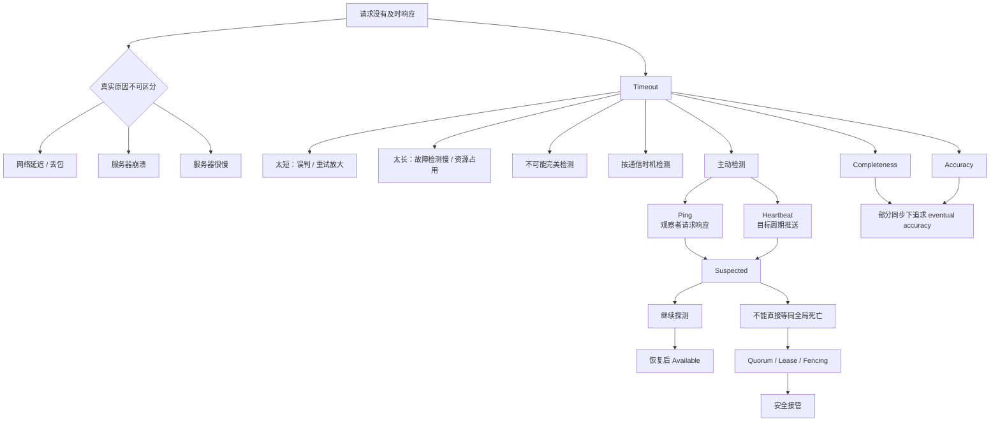

## 14. 核心结论

1. **无响应有多种不可区分原因。** 请求/响应可能延迟或丢失，服务器可能崩溃，也可能只是很慢。
2. **failure detector 只能输出怀疑，不能证明远端死亡。** 不可达是观察者、路径和时间相关的关系。
3. **没有 timeout，客户端最坏会永久等待。** timeout 把等待变成有限决策，使错误、重试或切换成为可能。
4. **timeout 不会取消或回滚远端操作。** 响应超时后服务器仍可能提交，因此重试必须结合幂等性。
5. **timeout 太短会误判健康长尾，太长会延迟真实故障处理。** 阈值在 accuracy 与 detection latency 之间权衡。
6. **纯异步或未知延迟上界下不存在 perfect failure detector。** 有限 timeout 总能被正确但更慢的执行击穿。
7. **完备性要求最终怀疑真实故障，准确性要求少怀疑正确进程。** 部分同步常支持 eventual accuracy，而非从启动起零误判。
8. **ping 是观察者周期请求并等待 response。** timeout 后仍继续 ping，才能发现 crash-recovery 后恢复。
9. **heartbeat 是目标周期推送存活消息。** monitor 根据 last_seen 判断，恢复发送后重新可用。
10. **ping 与 heartbeat 方向不同，但都不能区分所有故障原因。** 它们只提供特定路径和时刻的证据。
11. **主动检测适合频繁交互且需快速行动的进程。** 低频依赖在真实通信时检测可能已经足够。
12. **健康证据会过期。** 刚刚成功的探测不能保证下一次业务请求成功。
13. **固定 timeout 难以适配动态网络。** 可用延迟均值、波动或 accrual score 调整怀疑强度。
14. **误判必须被当作正常事件设计。** hysteresis、多级状态和持续恢复探测减少 flapping。
15. **故障检测不能单独保证安全接管。** quorum、lease、共识和 fencing 防止 split brain 与陈旧 owner。
16. **健康有多个层次。** alive、ready、依赖健康和业务正确性不应压成一个未经定义的布尔值。

## 15. 从本章提炼出的通用解题方法

### 第一步：枚举同一症状的所有原因

看到 timeout，不要立即归因于服务器 crash。列出 request 丢失、response 丢失、慢处理、下游慢和本地调度问题。

### 第二步：定义 detector 的观察对象

明确观察者、目标、路径、探测类型和“健康”定义。进程 liveness 与业务 readiness 要分开。

### 第三步：从动作风险反推证据强度

当前请求报错可以基于一次 timeout；驱逐节点、选 leader 或接管写权限需要连续证据、quorum 和 fencing。

### 第四步：把 timeout 放进总 deadline

从用户总预算反向分配每一跳，预留本地处理、返回和有限重试时间。不要让所有下游 timeout 等于顶层 deadline。

### 第五步：同时估算误报与检测延迟

用健康延迟分布估算 $P(R>T)$，用探测周期和连续失败次数估算 $D_{detect}$；只优化一边会伤害另一边。

### 第六步：选择主动或按需检测

根据交互频率、动作时效、集群规模和误判成本决定。避免为了“看起来更可靠”而给所有依赖高频 ping。

### 第七步：设计恢复与防抖

suspected 后继续探测；定义连续成功阈值、最小驻留时间和 ready 条件，防止恢复节点过早接流量。

### 第八步：使用单调时钟和自适应统计

elapsed time 用 monotonic clock；动态路径可根据均值、波动或 suspicion score 调整阈值，并设置合理上下限。

### 第九步：将怀疑接入安全协调机制

不要让一个 detector 的 timeout 直接创造新 leader。用 quorum 确认、lease 管理所有权、fencing token 阻止旧 owner。

### 第十步：用故障注入验证误判后果

分别注入丢请求、丢响应、慢节点、崩溃恢复、单向分区和 event-loop pause。验证系统在 detector 猜错时仍安全，在恢复时能稳定收敛。

本章最重要的方法论是：**故障检测不是发现一个客观的“死亡事实”，而是根据不完整、会迟到的证据做风险决策；设计重点应从追求零误判转向约束误判后果、保证安全接管并支持恢复。**
