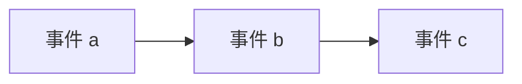
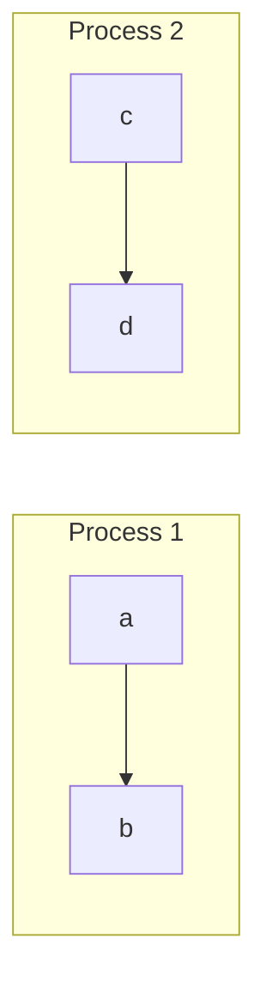
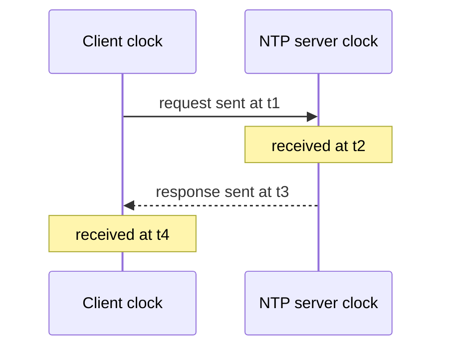
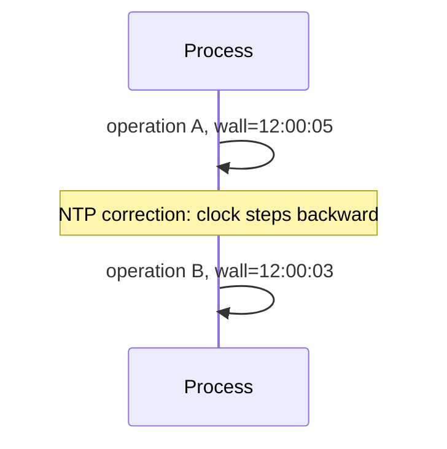
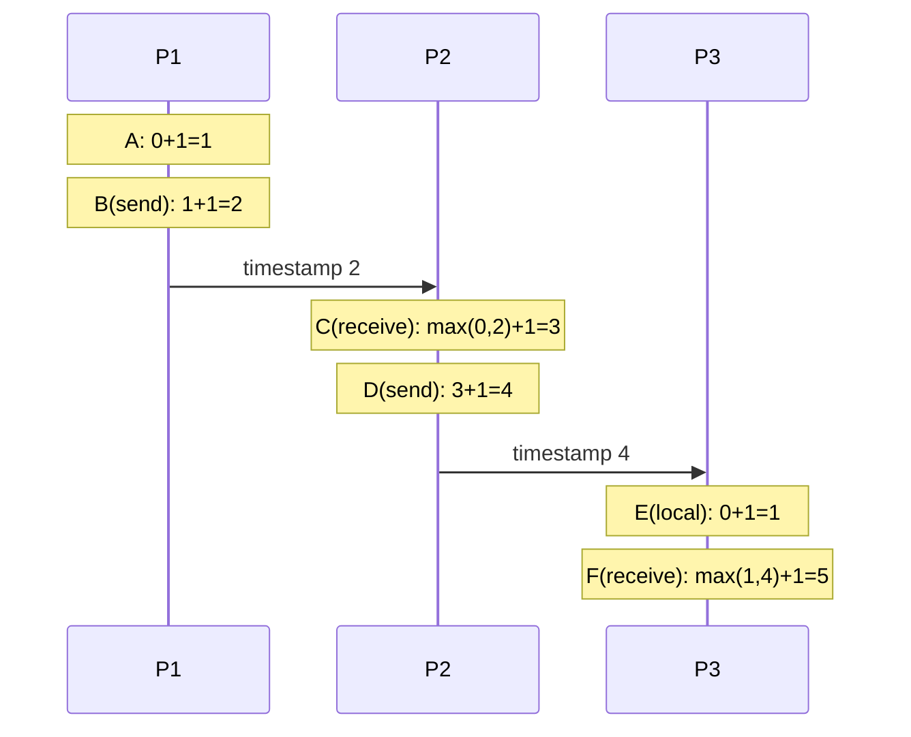
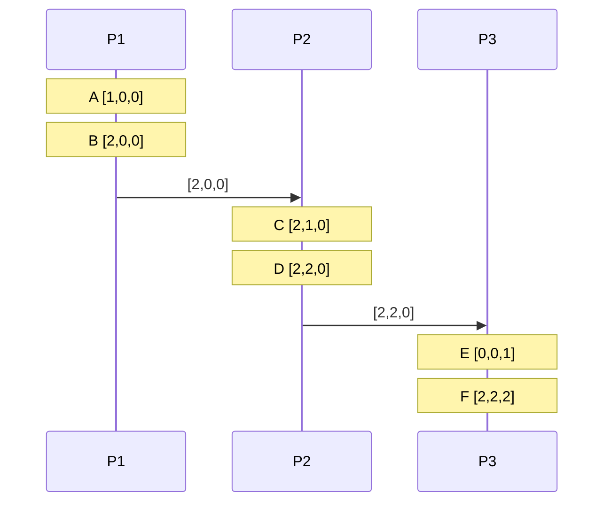
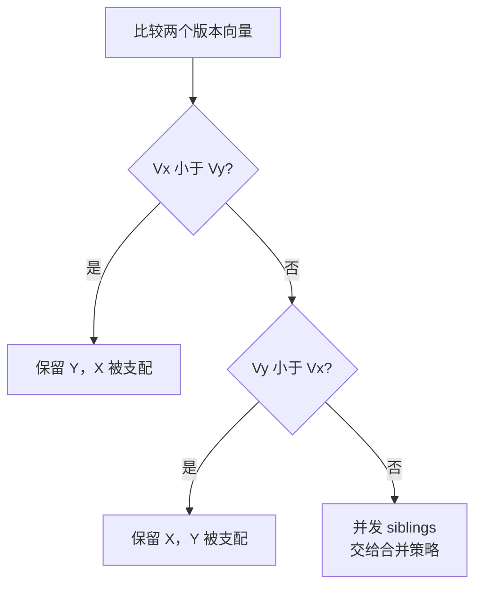
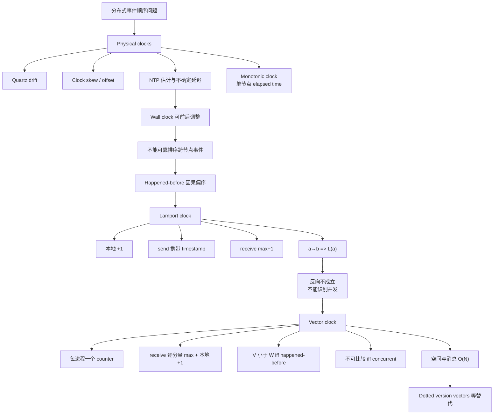

> 本文严格按照原章顺序展开：先说明分布式系统为什么难以排序事件，再依次讲解 Physical clocks、Logical clocks 和 Vector clocks。原章以建立核心直觉为主；文中的 drift/skew 公式、NTP 四时间戳推导、因果关系形式化、偏序证明、冲突示例和标准 C11 实现用于展开原理，不应误认为原书逐字给出的协议规范或完整生产代码。

## 0. 本章定位：物理时间不可靠，事件顺序仍必须可推理

### 0.1 时间在前文已经出现在哪里

时间不是本章突然出现的新概念：

- DNS 用 TTL 决定缓存新鲜期；
- TCP 用 timer 与 RTT 估计触发重传；
- failure detector 用 timeout、ping 和 heartbeat 怀疑故障；
- TLS 证书有生效与过期时间；
- API deadline 限制调用链等待。

本章引入另一个更深的问题：**怎样判断两个事件谁先发生？**

这个问题关系到：

- 一个写是否应覆盖另一个写；
- 消息是否在某次状态变化后产生；
- 日志中的错误与请求是否存在因果关系；
- 两个副本更新是先后依赖还是并发冲突；
- 分布式算法如何建立一致决策顺序。

### 0.2 单线程顺序为何简单

单线程进程一次只执行一个操作。若事件 $a$ 在程序顺序中先于 $b$：

$$
a\rightarrow b
$$

$a$ 的副作用可以影响 $b$，所以存在自然的因果顺序。



### 0.3 分布式顺序为何困难

多个进程并发执行：



若两条执行线之间没有消息或其他同步关系，仅看本地顺序无法判断 $b$ 和 $c$ 谁“真正先发生”。更麻烦的是：

- 没有所有进程完美共享的全局时钟；
- 本地时钟速率不同；
- 网络同步带有不确定延迟；
- wall clock 可能向前或向后跳；
- 并发事件本来就可能不存在因果顺序。

### 0.4 三类时钟回答不同问题

| 时钟 | 主要问题 | 能否跨节点比较 | 能否直接表示因果 |
| --- | --- | --- | --- |
| wall clock | 现在大约是什么日期和时刻 | 可粗略比较，但有误差 | 不能可靠推导 |
| monotonic clock | 本节点经过了多久 | 不能比较不同节点的起点 | 不表示跨节点因果 |
| Lamport clock | 因果发生时怎样保证时间戳递增 | 可以比较标量 | $a\to b\Rightarrow L(a)<L(b)$，反向不成立 |
| vector clock | 两事件是因果先后还是并发 | 可以按偏序比较 | 在标准规则和固定参与者下刻画 happened-before |

本章的推理路线是：


## 1. Physical clocks：物理时钟

### 1.1 Wall-time clock 是什么

wall-time clock 给出人类日历时间，例如：

```text
2026-08-12T09:30:00Z
```

它试图逼近 UTC 等外部时间标准。日志时间、证书期限、审计和业务日期都需要它。

普通机器的物理时钟常基于石英晶体振荡。石英钟便宜，但振荡频率受制造差异、温度、电压和老化影响，不会与理想时间完全同速。

### 1.2 Clock drift：走时速率误差

clock drift 描述本地时钟走得比参考时间快或慢多少。设真实时间为 $t$，本地时钟读数为 $C(t)$，理想速率为 1，则相对漂移率可写为：

$$
\rho(t)=\frac{dC(t)}{dt}-1
$$

- $\rho>0$：时钟走快；
- $\rho<0$：时钟走慢；
- $\rho=0$：速率理想。

工程上常用 ppm（parts per million）表示。若时钟快 20 ppm：

$$
20\ \mathrm{ppm}=20\times10^{-6}
$$

一天可能累积偏差：

$$
86400\ \mathrm{s}\times20\times10^{-6}
=1.728\ \mathrm{s}
$$

drift 是“速率”问题，会随时间积累。

### 1.3 Clock skew / offset：某一时刻的读数差

原章把两个时钟在某一时刻的差称为 clock skew。设节点 A/B 的读数为 $C_A(t)$、$C_B(t)$：

$$
skew_{A,B}(t)=C_A(t)-C_B(t)
$$

有些资料用 **offset** 表示某时钟相对参考钟的读数差，用 **skew** 表示频率差或读数差；术语并不完全统一。阅读系统文档时应看公式和定义，而不是只看单词。

核心区分：

| 概念 | 问题 | 单位 |
| --- | --- | --- |
| drift / rate error | 走得快还是慢 | ppm、秒/秒 |
| offset/skew（本章口径） | 此刻相差多少 | 秒、毫秒 |

### 1.4 为什么要周期同步

即使某时刻校准为完全相同，只要速率略有差异，之后仍会分开。若两个时钟最大相对漂移率分别不超过 $\rho$，最坏相对偏差增长约为：

$$
|C_A(t)-C_B(t)|\le |C_A(t_0)-C_B(t_0)|+2\rho(t-t_0)
$$

因此要周期性向更准确的时间源同步，限制偏差增长。

### 1.5 原子钟为何更准确

原章指出原子钟利用原子的量子力学性质测量时间，成本比石英钟高得多，精度可达约 300 万年误差 1 秒。

平均相对误差量级为：

$$
\frac{1\ \mathrm{s}}
{3{,}000{,}000\times365.25\times86400\ \mathrm{s}}
\approx1.06\times10^{-14}
$$

普通服务器不会各自安装昂贵原子钟，而是通过时间协议从层级时间源获得校准。

## 2. NTP：通过不确定网络估计时钟偏移

### 2.1 NTP 要解决什么

Network Time Protocol（NTP）让客户端通过网络向时间服务器获取时间，并估计自身时钟偏移。难点是：收到的服务器 timestamp 已经在网络中传播了一段未知时间。

只做：

```text
local_clock = server_timestamp
```

会把单程网络延迟直接写入本地时钟误差。

### 2.2 四时间戳模型

用四个时间戳展开 NTP 的核心估计：

- $t_1$：客户端发送请求的本地时间；
- $t_2$：服务器收到请求的服务器时间；
- $t_3$：服务器发送响应的服务器时间；
- $t_4$：客户端收到响应的本地时间。



估计 round-trip delay：

$$
\delta=(t_4-t_1)-(t_3-t_2)
$$

减去服务器处理时间后，剩余部分近似网络往返。

估计服务器相对客户端的 clock offset：

$$
\theta=\frac{(t_2-t_1)+(t_3-t_4)}{2}
$$

推导隐含了前向与反向网络延迟近似对称。若两条路径严重不对称，$\theta$ 会带偏差。

### 2.3 数值例子

假设：

$$
t_1=1000\ \mathrm{ms},\quad
t_2=1060\ \mathrm{ms},\quad
t_3=1070\ \mathrm{ms},\quad
t_4=1040\ \mathrm{ms}
$$

这些值来自两套不同本地时钟，服务器读数更大并不矛盾。

往返延迟：

$$
\delta=(1040-1000)-(1070-1060)=30\ \mathrm{ms}
$$

offset：

$$
\theta=\frac{(1060-1000)+(1070-1040)}{2}
=45\ \mathrm{ms}
$$

客户端估计自己的 clock 比服务器慢约 45 ms。

### 2.4 为什么 NTP 不能完美同步

主要误差来源：

- 前后向延迟不对称；
- 排队延迟变化；
- 客户端和服务器取 timestamp 的软件路径延迟；
- 本地 oscillator 在同步后继续 drift；
- 时间服务器自身有误差；
- 网络或时间源遭攻击。

NTP 会结合多次样本、多个服务器、层级和过滤算法改善估计，但无法把不确定网络变成绝对同时的全局时钟。

### 2.5 Step 与 slew

获得 offset 估计后，可有两种校正方式。

#### Step：直接跳变

```text
12:00:05 -> 12:00:03
```

快速纠正，却可能向后跳。于是后执行的事件获得更早 timestamp。

#### Slew：逐渐调速

暂时让时钟略快或略慢，逐步消化偏差。它避免突然大跳，但校准需要时间，期间 wall clock 仍带误差。

原章用“调整造成时钟前后跳”说明危险。实际操作系统/时间服务可能根据偏差大小和策略选择 step 或 slew；不能假设 wall clock 永远单调。

### 2.6 Wall clock 回拨怎样破坏排序



真实执行顺序是：

$$
A\rightarrow B
$$

wall timestamp 却满足：

$$
timestamp(B)<timestamp(A)
$$

因此，不能把 wall timestamp 的数值顺序无条件当作因果顺序。

## 3. Monotonic clock：测量本节点经过时间

### 3.1 定义

monotonic clock 从任意起点（常见为启动附近）度量 elapsed time，并保证不向后走：

$$
t_2>t_1\Longrightarrow C_{mono}(t_2)\ge C_{mono}(t_1)
$$

它的绝对数值通常没有日历意义：

```text
monotonic = 532814.271 seconds since arbitrary origin
```

### 3.2 适合什么

- timeout；
- latency；
- lease duration 的本地部分；
- benchmark；
- heartbeat 间隔；
- 定时器调度。

经过时间：

$$
elapsed=C_{mono}(end)-C_{mono}(start)
$$

不受 wall clock 手工/NTP 回拨影响。

### 3.3 不适合什么

不同机器的 monotonic clock：

- 起点不同；
- 速率仍可能略有差异；
- 数值不共享 epoch；
- 重启后起点变化。

所以不能比较：

```text
node A monotonic=1000
node B monotonic=900
```

并据此得出 A 的事件比 B 晚 100 秒。

### 3.4 Monotonic 不等于精确

单调只承诺“不向后”，不承诺：

- 与真实秒完全同速；
- 不受 suspend/平台语义影响；
- 不同节点可比较；
- 永不溢出。

选择 API 时应确认它是否包含机器休眠时间、分辨率和调整语义。

## 4. 为什么物理钟不能可靠推出跨节点事件顺序

### 4.1 带误差区间的物理时间

若节点读到时间 $T$，并知道最大误差为 $\epsilon$，真实时间只能落在：

$$
[T-\epsilon,T+\epsilon]
$$

两个事件区间不重叠时，才能安全建立物理先后。若：

$$
T_A+\epsilon_A<T_B-\epsilon_B
$$

则可推出 A 在 B 前。若区间重叠，顺序不确定。

普通 NTP 部署通常难以为每个应用 timestamp 提供足够严格的误差界，所以原章结论是：一般不能依赖 wall clock 准确排序跨节点操作。

### 4.2 物理先后与因果先后不同

事件 A 可能在物理时间上早于 B，但若两者没有信息传递，A 不会影响 B。分布式协调更关心：

> B 是否可能观察到或依赖 A 的结果？

这引出 happened-before 关系。

## 5. Happened-before：从时间问题转向因果问题

### 5.1 定义

Lamport 的 happened-before 关系记作：

$$
a\rightarrow b
$$

它是满足以下规则的最小关系：

1. **进程内顺序**：同一进程中，若 $a$ 在 $b$ 前执行，则 $a\rightarrow b$；
2. **消息顺序**：若 $a$ 是发送消息，$b$ 是接收同一消息，则 $a\rightarrow b$；
3. **传递性**：若 $a\rightarrow b$ 且 $b\rightarrow c$，则 $a\rightarrow c$。

### 5.2 邮件例子的直觉

原章举例：你喝咖啡后发邮件，朋友收到邮件后执行某动作。


由传递性：

$$
A\rightarrow B\rightarrow C\rightarrow D
\Longrightarrow A\rightarrow D
$$

不是墙上钟表创造了这个顺序，而是程序顺序与消息传递建立了信息可影响路径。

### 5.3 并发的定义

若：

$$
a\not\rightarrow b
\quad\land\quad
b\not\rightarrow a
$$

则称 $a$ 与 $b$ concurrent，记作：

$$
a\parallel b
$$

并发不是“物理上恰好同一纳秒发生”，而是因果偏序中不可比较。两个事件即使 wall clock 相差几秒，只要没有因果信息路径，仍可能是并发。

### 5.4 Happened-before 是偏序

$\rightarrow$ 是严格偏序：它非自反（$a\not\rightarrow a$）、非对称（$a\rightarrow b$ 时不可能 $b\rightarrow a$）且具有传递性。它不是 total order，因为某些事件不可比较。其自反闭包才是自反、反对称、传递的非严格偏序。偏序恰好保留“必须有序”的因果关系，同时不伪造独立事件之间的因果。

## 6. Logical clocks：逻辑时钟

### 6.1 为什么不再测量秒

logical clock 不回答“现在几点”，而是用逻辑操作推进时间，以捕获事件顺序。最简单形式是本地 counter：

```text
counter = 0
每次事件前 counter += 1
timestamp(event) = counter
```

同一进程中，每个事件得到不同且递增的 timestamp。但不同进程 counter 独立，需要通过消息同步。

## 7. Lamport clock

### 7.1 四条规则

每个进程 $P_i$ 维护标量 $L_i$：

1. 初始化：

   $$
   L_i=0
   $$

2. 本地事件前：

   $$
   L_i\leftarrow L_i+1
   $$

3. 发送消息前，先递增，并携带 timestamp：

   $$
   L_i\leftarrow L_i+1,\qquad send(m,L_i)
   $$

4. 收到带 timestamp $t_m$ 的消息时：

   $$
   L_i\leftarrow\max(L_i,t_m)+1
   $$

### 7.2 为什么 receive 取 max 再加 1

接收事件必须晚于：

- 接收者此前所有本地事件；
- 发送者发送消息时已经知道的所有事件。

因此先取两个知识前沿的最大值，再加 1，保证接收事件严格晚于二者。

若本地 $L_i=7$，收到 $t_m=12$：

$$
L_i=\max(7,12)+1=13
$$

若本地已经是 20，收到旧消息 12：

$$
L_i=\max(20,12)+1=21
$$

本地逻辑时间永不倒退。

### 7.3 图 8.1 的完整计算

原图有三个进程：



| 事件 | 进程 | 类型 | Lamport timestamp |
| --- | --- | --- | ---: |
| A | P1 | local | 1 |
| B | P1 | send | 2 |
| C | P2 | receive | 3 |
| D | P2 | send | 4 |
| E | P3 | local | 1 |
| F | P3 | receive | 5 |

由于：

$$
D\rightarrow F
$$

所以：

$$
L(D)=4<L(F)=5
$$

### 7.4 Lamport clock 保证什么

Clock condition：

$$
a\rightarrow b\Longrightarrow L(a)<L(b)
$$

证明分三类：

1. 同一进程中 counter 每事件递增，因此程序顺序保持；
2. send timestamp 为 $t$，receive 至少为 $t+1$，因此消息边保持；
3. 数值小于具有传递性，因此 happened-before 的传递闭包也保持。

### 7.5 反向为什么不成立

以下命题错误：

$$
L(a)<L(b)\not\Longrightarrow a\rightarrow b
$$

图 8.1 中：

$$
L(E)=1<L(C)=3
$$

但 E 与 C 之间没有消息因果路径，所以：

$$
E\parallel C
$$

标量 counter 压缩了因果历史，不足以区分“确实先于”和“只是数字较小”。

### 7.6 相同 Lamport timestamp

独立进程可以产生同值。例如原图：

$$
L(A)=L(E)=1
$$

相同值不意味着同一物理时刻，也不意味着两个事件相同，只说明独立 counter 恰好相等。

### 7.7 用 process ID 构造 total order

若系统需要每个事件都可比较，可用二元组：

$$
T(e)=(L(e),process\_id)
$$

按字典序：

$$
(l_1,p_1)<(l_2,p_2)
$$

当且仅当：

- $l_1<l_2$；或
- $l_1=l_2$ 且 $p_1<p_2$。

若 P1 ID=1、P3 ID=3：

$$
T(A)=(1,1)<T(E)=(1,3)
$$

原章按进程 ID 1、2、3 打破平局，所以 E 的 total-order timestamp 大于 A。

这里要求 process ID 唯一且在参与期间稳定。crash-recovery 后若 ID 可能复用，应把持久 incarnation/epoch 纳入身份，避免不同进程世代使用同一个 tie-break 值。

### 7.8 Total order 不等于 causality

tie-break 只是确定性裁决：

$$
A<E
$$

并不创造：

$$
A\rightarrow E
$$

total order 可用于让所有节点按同一规则排序候选事件，但不能回答两个事件是否独立并发。

### 7.9 Crash-recovery 与持久化

原章指出 Lamport clock 默认可按 crash-stop 理解；支持 crash-recovery 可把 counter 持久化。

若进程重启后从 0 开始：

```text
崩溃前最新 timestamp = 100
重启后首个 timestamp = 1
```

会破坏“本进程后续事件 timestamp 更大”。可选方案：

- 每次递增持久化，成本高；
- 批量预留 timestamp 区间并持久化上界；
- 用持久 epoch + 本地 counter 组成二元 timestamp；
- 从持久日志恢复最大值。

无论哪种方案，都必须保证新 incarnation 的 timestamp 不回退。

持久化 counter、epoch 或预留区间必须发生在相应消息或副作用对外可见之前；否则进程可能先暴露高 timestamp 事件、再在持久化前崩溃，恢复后仍会回退。

## 8. Vector clocks：向量时钟

### 8.1 为什么需要更丰富的时间戳

Lamport clock 只保留一个标量，满足因果的必要方向，却不能从数值顺序反推因果。vector clock 为每个参与进程保存一个因果知识分量，使时间戳可以按偏序比较。

### 8.2 数据结构

系统有 $N$ 个进程 $P_1,\ldots,P_N$。每个进程维护：

$$
V_i=[v_1,v_2,\ldots,v_N]
$$

$v_j$ 表示 $P_i$ 已知的 $P_j$ 事件进度。

原章三个进程时：

$$
[C_{P1},C_{P2},C_{P3}]
$$

实际动态成员系统常用 map/dictionary：

```text
{process_id -> counter}
```

只存出现过的参与者，但成员 churn 与垃圾回收会更复杂。

### 8.3 四条更新规则

每个进程 $P_i$：

1. 初始化：

   $$
   V_i=[0,\ldots,0]
   $$

2. 本地事件前，递增自己的第 $i$ 个分量：

   $$
   V_i[i]\leftarrow V_i[i]+1
   $$

3. 发送消息前，递增本地分量并携带整个向量副本；

4. 收到消息向量 $V_m$ 后，逐分量取最大值，再递增自己的分量：

   $$
   V_i[j]\leftarrow\max(V_i[j],V_m[j]),\quad \forall j
   $$

   $$
   V_i[i]\leftarrow V_i[i]+1
   $$

### 8.4 为什么逐分量 max

每个分量代表对某个进程历史的知识。接收消息后，接收方同时拥有：

- 自己此前知道的因果历史；
- 发送方随消息带来的因果历史。

逐分量 max 计算两份知识的并集前沿；再递增自己的分量，记录新的 receive 事件。

例如：

$$
V_{local}=[2,5,1],\quad V_m=[4,3,2]
$$

在 P2 接收：

$$
max(V_{local},V_m)=[4,5,2]
$$

再递增 P2 分量：

$$
V_{new}=[4,6,2]
$$

### 8.5 图 8.2 的完整计算

事件关系与图 8.1 相同：B 向 P2 发送，D 向 P3 发送。

| 事件 | 更新 | Vector timestamp |
| --- | --- | --- |
| A@P1 | P1 本地 +1 | `[1,0,0]` |
| B@P1 send | P1 +1 | `[2,0,0]` |
| C@P2 receive B | max(`[0,0,0]`,`[2,0,0]`)，P2 +1 | `[2,1,0]` |
| D@P2 send | P2 +1 | `[2,2,0]` |
| E@P3 local | P3 +1 | `[0,0,1]` |
| F@P3 receive D | max(`[0,0,1]`,`[2,2,0]`)，P3 +1 | `[2,2,2]` |



### 8.6 向量偏序定义

给定 $V$ 与 $W$，定义：

$$
V\le W
\Longleftrightarrow
\forall i,\ V[i]\le W[i]
$$

严格偏序：

$$
V<W
\Longleftrightarrow
(V\le W)\land(V\ne W)
$$

等价于：每个分量都不大于，且至少一个分量严格小于。

### 8.7 Vector clock 的双向因果性质

在标准向量时钟规则、固定进程集合和正确携带/合并 timestamp 的前提下：

$$
a\rightarrow b
\Longleftrightarrow
V(a)<V(b)
$$

这比 Lamport clock 强：

$$
a\rightarrow b\Longrightarrow L(a)<L(b)
$$

Lamport 只有单向蕴含，vector clock 可以由偏序反推 happened-before。

### 8.8 图 8.2 中的因果判断

B：

$$
V(B)=[2,0,0]
$$

C：

$$
V(C)=[2,1,0]
$$

逐分量：

$$
2\le2,\quad0<1,\quad0\le0
$$

所以：

$$
V(B)<V(C)\Longrightarrow B\rightarrow C
$$

### 8.9 图 8.2 中的并发判断

E：

$$
V(E)=[0,0,1]
$$

C：

$$
V(C)=[2,1,0]
$$

比较：

- E 的前两个分量小于 C；
- E 的第三分量大于 C。

因此既没有：

$$
V(E)<V(C)
$$

也没有：

$$
V(C)<V(E)
$$

所以二者不可比较：

$$
E\parallel C
$$

这不是信息不足导致的“暂时不知道”，而是 timestamp 明确表示两者没有 happened-before 关系。

### 8.10 Equal、before、after、concurrent 四种结果

比较两个向量应得到四类：

| 关系 | 条件 |
| --- | --- |
| equal | 所有分量相等 |
| before | $V<W$ |
| after | $W<V$ |
| concurrent | 两边都有更大的分量，互不可比 |

在本文固定成员、每个事件都递增自身分量的标准模型中，两个不同事件不会获得完全相同的向量。`equal` 分支主要用于比较同一时间戳的副本、持久快照或版本上下文；相等说明因果知识前沿相同，但仍不证明所附业务值相同。

## 9. 标准 C11 示例：复现图 8.1 与图 8.2

### 9.1 示例目标

下面程序同时实现：

- Lamport 本地/send/receive 更新；
- 三进程 vector clock 更新；
- vector before/after/equal/concurrent 比较；
- 原图 A–F 的 timestamp；
- B before C、E concurrent C 的断言。

### 9.2 完整代码

```c
#include <assert.h>
#include <stdbool.h>
#include <stddef.h>
#include <stdio.h>

enum { PROCESS_COUNT = 3 };

typedef struct {
    unsigned long value;
} LamportClock;

typedef struct {
    unsigned long value[PROCESS_COUNT];
} VectorClock;

typedef enum {
    VECTOR_EQUAL,
    VECTOR_BEFORE,
    VECTOR_AFTER,
    VECTOR_CONCURRENT
} VectorRelation;

static unsigned long lamport_event(LamportClock *clock) {
    clock->value++;
    return clock->value;
}

static unsigned long lamport_receive(LamportClock *clock,
                                     unsigned long received) {
    if (clock->value < received) {
        clock->value = received;
    }
    clock->value++;
    return clock->value;
}

static VectorClock vector_event(VectorClock *clock, size_t process) {
    assert(process < PROCESS_COUNT);
    clock->value[process]++;
    return *clock;
}

static VectorClock vector_receive(VectorClock *clock,
                                  size_t process,
                                  const VectorClock *received) {
    size_t index;
    assert(process < PROCESS_COUNT);

    for (index = 0; index < PROCESS_COUNT; ++index) {
        if (clock->value[index] < received->value[index]) {
            clock->value[index] = received->value[index];
        }
    }
    clock->value[process]++;
    return *clock;
}

static VectorRelation vector_compare(const VectorClock *left,
                                     const VectorClock *right) {
    bool left_less = false;
    bool left_greater = false;
    size_t index;

    for (index = 0; index < PROCESS_COUNT; ++index) {
        if (left->value[index] < right->value[index]) {
            left_less = true;
        } else if (left->value[index] > right->value[index]) {
            left_greater = true;
        }
    }

    if (left_less && left_greater) {
        return VECTOR_CONCURRENT;
    }
    if (left_less) {
        return VECTOR_BEFORE;
    }
    if (left_greater) {
        return VECTOR_AFTER;
    }
    return VECTOR_EQUAL;
}

static void print_vector(const char *event, const VectorClock *clock) {
    printf("%s=[%lu,%lu,%lu]\n",
           event,
           clock->value[0],
           clock->value[1],
           clock->value[2]);
}

int main(void) {
    LamportClock lamport[PROCESS_COUNT] = {0};
    VectorClock vector[PROCESS_COUNT] = {0};
    unsigned long la, lb, lc, ld, le, lf;
    VectorClock va, vb, vc, vd, ve, vf;

    la = lamport_event(&lamport[0]);
    lb = lamport_event(&lamport[0]);
    lc = lamport_receive(&lamport[1], lb);
    ld = lamport_event(&lamport[1]);
    le = lamport_event(&lamport[2]);
    lf = lamport_receive(&lamport[2], ld);

    va = vector_event(&vector[0], 0);
    vb = vector_event(&vector[0], 0);
    vc = vector_receive(&vector[1], 1, &vb);
    vd = vector_event(&vector[1], 1);
    ve = vector_event(&vector[2], 2);
    vf = vector_receive(&vector[2], 2, &vd);

    assert(la == 1 && lb == 2 && lc == 3);
    assert(ld == 4 && le == 1 && lf == 5);
    assert(vector_compare(&vb, &vc) == VECTOR_BEFORE);
    assert(vector_compare(&ve, &vc) == VECTOR_CONCURRENT);
    assert(vector_compare(&vd, &vf) == VECTOR_BEFORE);

    printf("Lamport: A=%lu B=%lu C=%lu D=%lu E=%lu F=%lu\n",
           la, lb, lc, ld, le, lf);
    print_vector("A", &va);
    print_vector("B", &vb);
    print_vector("C", &vc);
    print_vector("D", &vd);
    print_vector("E", &ve);
    print_vector("F", &vf);
    printf("B before C; E concurrent C\n");
    return 0;
}
```

预期输出：

```text
Lamport: A=1 B=2 C=3 D=4 E=1 F=5
A=[1,0,0]
B=[2,0,0]
C=[2,1,0]
D=[2,2,0]
E=[0,0,1]
F=[2,2,2]
B before C; E concurrent C
```

### 9.3 为什么代码正确

`lamport_receive` 实现：

$$
L\leftarrow\max(L,L_m)+1
$$

`vector_receive` 先逐分量 max，再增加接收进程自身分量。`vector_compare` 记录：

- 是否存在 left 分量更小；
- 是否存在 left 分量更大。

两者都存在即不可比，为 concurrent；只有更小为 before；只有更大为 after；都不存在为 equal。

### 9.4 示例局限

- 固定三个进程；
- counter 不处理整数溢出；
- 没有序列化和网络消息；
- 没有 crash-recovery 持久化；
- 没有动态成员、进程删除和向量压缩；
- assert 在定义 `NDEBUG` 时会关闭，不应成为生产校验；
- 逻辑 timestamp 不等于 wall time。

## 10. Vector clock 的成本与局限

### 10.1 空间复杂度

$N$ 个参与者的完整向量需要：

$$
Space=O(N)
$$

每条携带 timestamp 的消息也可能带 $O(N)$ 元数据，merge 时间为：

$$
Time_{merge}=O(N)
$$

节点数量固定且较小时可接受；大量客户端、动态成员或高频消息下成本明显。

### 10.2 数值例子

若有 10,000 个参与者，每个 counter 为 8 字节，稠密向量仅 counter 就需要：

$$
10{,}000\times8=80{,}000\ \mathrm{bytes}
\approx78.125\ \mathrm{KiB}
$$

每条消息携带约 78 KiB timestamp 通常不可接受，还没计算进程 ID、编码和协议首部。

### 10.3 动态成员问题

原章脚注指出实际常用 dictionary 而不是 array。稀疏 map 只保存已知参与者，却引入：

- 进程 ID 生命周期；
- 节点离开后何时删除分量；
- 重启 incarnation；
- 垃圾回收时如何不丢因果信息；
- map 编码开销。

不能仅把数组替换为 map 就宣称解决了动态规模问题。

### 10.4 Dotted version vectors

原章提到 dotted version vectors 可缓解大量客户端下的向量增长问题。其核心思路是把“一个新事件的 dot”与“此前因果上下文”分开表示，适合版本跟踪和副本协调。在稳定副本身份等特定架构下，它可以避免元数据按每个客户端扩张；这不表示任意 $N$ 进程事件系统都能无条件降为常数空间。

本章不展开其算法；重要结论是：vector clock 不是逻辑时钟的终点。不同场景会在精确因果信息、元数据大小和成员动态之间取舍。

### 10.5 Vector clock 也不能解决什么

- 不能给并发事件自动选赢家；
- 不能合并业务值；
- 不能提供物理时间；
- 不能替代共识建立唯一全局决定；
- 不能处理遗漏 timestamp 的外部通信；
- 不能在没有稳定身份的情况下免费支持无限成员。

它告诉系统“这两个版本并发”，冲突如何处理仍由应用或数据类型决定。

## 11. 从因果判定到冲突处理

### 11.1 三种版本关系

两个版本 $X,Y$：

1. $V_X<V_Y$：Y 因果地包含 X，Y 可替代 X；
2. $V_Y<V_X$：X 因果地包含 Y，X 可替代 Y；
3. $V_X\parallel V_Y$：并发，二者都不能仅凭时钟丢弃。



### 11.2 一个并发购物车例子

初始版本由两个副本共同知道：

```text
cart = {book}
context = [1,1]
```

网络分区后：

- P1 加入 pen，产生 `[2,1]`；
- P2 加入 cup，产生 `[1,2]`。

两向量不可比，所以两次更新并发。若简单用 wall timestamp 做 last-write-wins，可能丢掉 pen 或 cup；vector clock 至少保留冲突事实，允许合并为：

```text
{book, pen, cup}
```

集合并集是否正确取决于业务；删除、数量和支付状态需要更严谨的数据类型或冲突策略。

## 12. 物理时钟、Lamport clock 与 vector clock 对比

| 维度 | Wall clock | Monotonic clock | Lamport clock | Vector clock |
| --- | --- | --- | --- | --- |
| 值的含义 | 近似日历时间 | 本机经过时间 | 逻辑事件进度 | 每参与者因果进度 |
| 单节点 elapsed time | 不可靠（可跳） | 适合 | 不表示秒 | 不表示秒 |
| 跨节点粗略时间 | 可以，有误差 | 不可以 | 不可以 | 不可以 |
| 因果必要方向 | 不保证 | 不保证 | 保证 | 保证 |
| 从 timestamp 反推因果 | 不可靠 | 不可以 | 不可以 | 可以 |
| 识别并发 | 不可靠 | 不可以 | 不可以 | 可以 |
| 元数据 | $O(1)$ | $O(1)$ | $O(1)$ | $O(N)$ |
| 典型用途 | 日志、证书、业务日期 | timeout、latency | 确定性逻辑排序 | 版本并发检测 |

## 13. 物理时钟什么时候“足够好”

原章最后没有否定所有物理时钟用途。若日志 timestamp 只用于调试，少量偏差和偶尔回拨可能可以接受。

适合 wall clock：

- 人类可读日志；
- 审计显示（配合误差和事件 ID）；
- 证书/令牌有效期；
- 业务日历规则；
- 粗粒度运营统计。

不应单独依赖 wall clock：

- 跨节点证明因果；
- 无条件 last-write-wins；
- 生成绝不重复的 ID；
- 精确分布式互斥；
- 在无误差界时判断谁先提交。

改进调试日志的方法：

- 同时记录 wall timestamp 和 monotonic elapsed；
- 记录 trace/span ID；
- 记录 Lamport/版本号/日志 offset；
- 监控 NTP offset 与同步状态；
- 不把日志排序结果当作完整因果证明。

## 14. 容易混淆的概念与常见误区

### 14.1 Drift 与 skew

drift 是速率偏差，skew/offset 是某时刻读数差。修正 offset 后，drift 仍会让它重新增长。

### 14.2 Wall clock 与 monotonic clock

wall clock 可映射日历但会调整；monotonic clock 适合 elapsed time 但跨节点不可比。不要用 wall clock 做 timeout，也不要把 monotonic 值写成全球时间。

### 14.3 Physical time 与 logical time

物理时钟近似“几点”，逻辑时钟表达事件顺序。Lamport timestamp 100 不表示 100 秒，也不表示比 timestamp 90 晚 10 个真实时间单位。

### 14.4 Happened-before 与物理先发生

$a\rightarrow b$ 表示存在程序/消息因果路径。A 在 wall time 上早于 B，却没有信息路径时，二者在因果关系中仍可并发。

### 14.5 Lamport 小于与因果先于

只有：

$$
a\rightarrow b\Rightarrow L(a)<L(b)
$$

没有反向。用 process ID 打破平局得到 total order，也不会创造因果。

### 14.6 Vector 小于与字典序

vector clock 比较是逐分量偏序，不是数组字典序或 counter 总和：

```text
[2,0] 与 [1,3]
```

前者第一分量大，后者第二分量大，所以 concurrent；不能比较总和 2 与 4 后宣布前者更早。

### 14.7 Concurrent 与 simultaneous

concurrent 表示 happened-before 不可比较，不要求物理同时发生。

### 14.8 Total order 与 partial order

total order 每对元素都可比较，适合确定性排列；partial order 保留并发。强行 total order 会隐藏“两个更新独立发生”的信息。

### 14.9 Timestamp 与版本值

时钟描述元数据，不自动决定业务值。检测到并发后仍需合并、保留 siblings、CRDT 或人工冲突处理。

## 15. 本章知识结构



## 16. 核心结论

1. **分布式系统没有所有进程完美共享的全局时钟。** 并发、drift 和网络不确定性使跨节点排序困难。
2. **drift 是走时速率误差，skew/offset 是某时刻读数差。** 一次校准不能消除持续漂移。
3. **NTP 用网络 timestamp 与延迟估计修正 wall clock。** 路径不对称和抖动意味着同步始终有误差。
4. **Wall clock 可能 step 前跳或后跳。** 后执行事件可以得到更小 timestamp，不能无条件用它排序。
5. **Monotonic clock 适合本节点 timeout 和 latency。** 它没有共享 epoch，不能比较不同节点事件。
6. **happened-before 从程序顺序、消息发送/接收和传递性定义因果。** 无双向因果关系的事件称为 concurrent。
7. **Lamport clock 在本地/send 前加 1，receive 时取 max 再加 1。** 这保证因果事件 timestamp 递增。
8. **Lamport clock 只有单向保证。** $a\to b\Rightarrow L(a)<L(b)$，但 $L(a)<L(b)$ 不能推出因果。
9. **Process ID 可以把 Lamport timestamp 扩展为 total order。** 该顺序是确定性裁决，不是因果事实。
10. **Crash-recovery 下逻辑时钟不能回退。** 必须持久化 counter、预留区间或加入持久 epoch。
11. **Vector clock 为每个参与者维护因果进度。** send 携带向量，receive 逐分量 max 后递增本地分量。
12. **Vector timestamp 采用逐分量偏序。** 每分量不大于且至少一项更小，才是 before。
13. **标准 vector clock 可双向刻画 happened-before。** 不可比较的向量对应 concurrent 事件。
14. **Vector clock 能发现冲突，但不能决定如何合并。** 业务语义仍需 siblings、合并策略或 CRDT。
15. **精确因果信息有 $O(N)$ 成本。** 大量动态客户端下需要 map、压缩或 dotted version vectors 等方案。
16. **物理时钟有其适用范围。** 调试日志可接受粗略 wall time，但不能把其排序当作因果证明。

## 17. 从本章提炼出的通用解题方法

### 第一步：先问需要的是“几点”还是“谁影响谁”

业务日期和审计需要 wall clock；timeout 需要 monotonic；因果顺序需要 logical clock。不要用一个时钟解决所有问题。

### 第二步：明确可接受的时间误差

若使用物理时间比较跨节点事件，必须带上误差区间。区间重叠时承认顺序未知，不要假装 timestamp 精确。

### 第三步：画出程序顺序和消息边

先构造 happened-before 图，再选择逻辑时钟。因果来自信息路径，不来自数值大小。

### 第四步：按需求选择 Lamport 或 vector

只需确定性排序或保证因果不逆序，可用 Lamport；必须判断并发冲突，使用 vector clock 或等价因果元数据。

### 第五步：逐条验证 clock update rule

本地事件递增、send 携带副本、receive 合并后递增。遗漏任何一步都可能破坏因果性质。

### 第六步：检查 crash-recovery

重启后 timestamp 是否回退？进程 ID 是否复用？持久状态与事件副作用是否一致？逻辑钟正确性也有崩溃窗口。

### 第七步：不要把 total order 当作 causality

tie-break 可以让结果可重复，却不能判断冲突是否独立。需要因果信息时保留 partial order。

### 第八步：量化元数据成本

计算参与者数量、每 counter 大小、每消息携带频率和 merge CPU。$O(N)$ 在小集群合理，在百万客户端中不可行。

### 第九步：把时钟输出接到业务规则

before 可淘汰旧版本，concurrent 需要合并。时钟只提供关系，最终决策必须由领域语义给出。

### 第十步：用原图事件和反例测试

至少验证：同进程递增、send-before-receive、传递性、Lamport 反向不成立、vector 并发不可比、重启不回退。

本章最重要的方法论是：**不要试图从不完美物理钟中强行恢复精确全局顺序；先识别真正需要的因果关系，再用最小充分的逻辑时钟表示它。**
