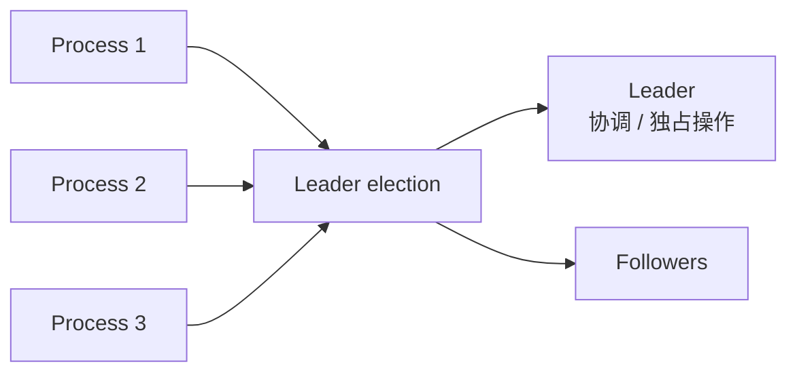
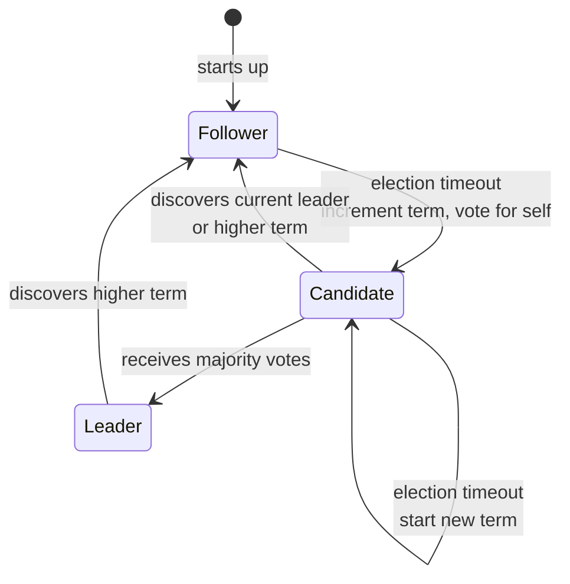
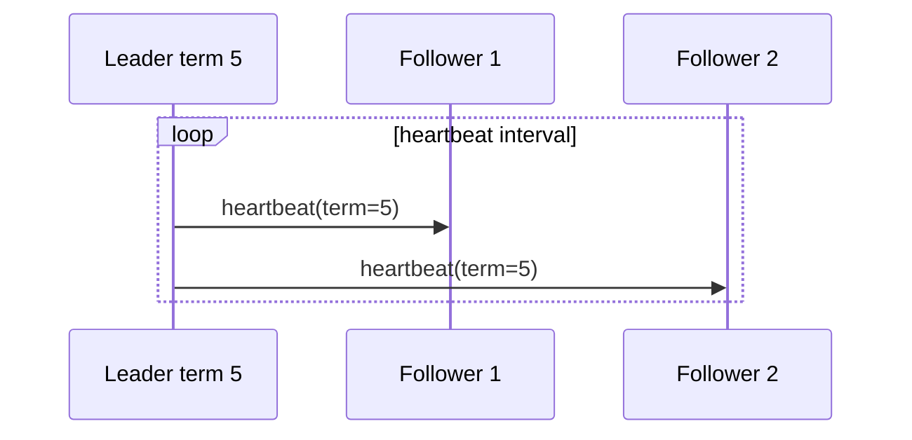
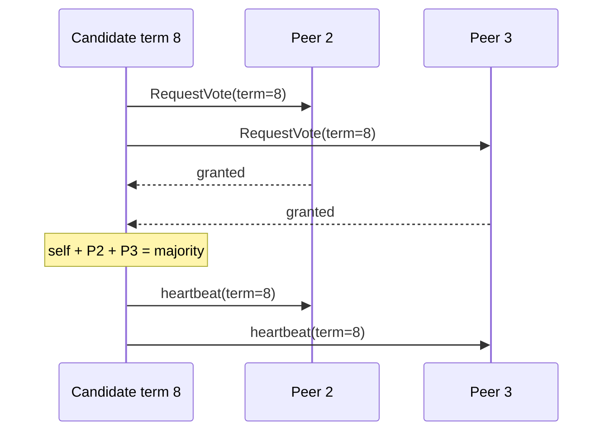
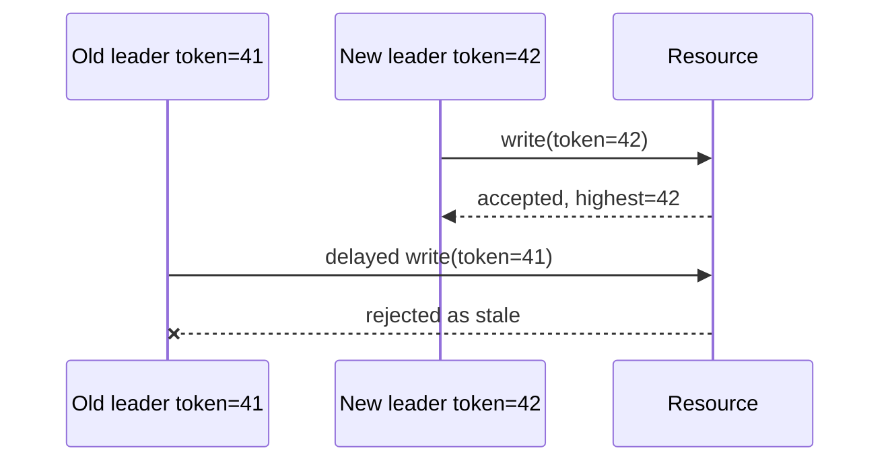
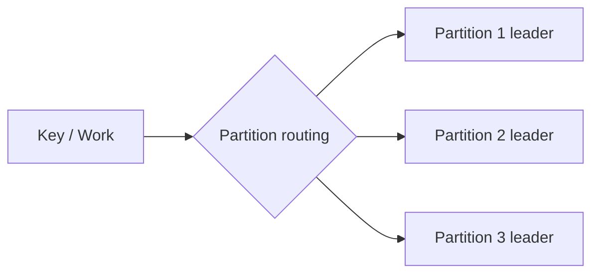
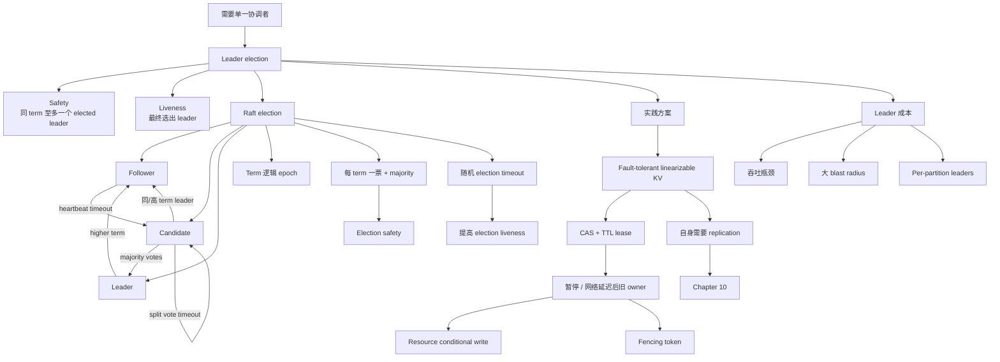

> 对应原文：Understanding Distributed Systems 2nd edition.md
>
> 本文严格按照原章顺序展开：先说明为什么需要 leader 以及 safety/liveness 目标，再讲 Raft leader election 的 follower/candidate/leader 状态机、term、heartbeat、投票、多数派和 split vote，最后讨论用线性一致 CAS+TTL 实现租约、租约为何不能单独保证互斥、conditional write/fencing、leader 瓶颈与故障域，以及租约存储自身的容错要求。原章只介绍选举子协议；文中的 quorum 推导、概率示例、fencing token 和标准 C11 模拟用于展开原理，不应误认为完整 Raft 共识实现。

## 0. 本章定位：把特殊权力安全地交给一个进程

### 0.1 为什么系统需要 leader

有些工作需要一个进程拥有特殊权限：

- 独占访问共享资源；
- 给其他节点分配任务；
- 决定操作顺序；
- 协调配置变更；
- 代表集群对外提供写入口；
- 推进复制日志。

若所有节点都能同时执行这些操作，会出现竞争、重复分配或冲突写。leader election 从候选进程中选出一个负责人；它保持角色直到主动放弃或被认为不可用，随后其余进程重新选举。



### 0.2 Leader 消除哪类复杂度

leader 把并发决策集中为单一序列：

```text
多个节点竞争决策
        ->
leader 决定顺序，其他节点跟随
```

这可简化：

- 谁能写共享状态；
- 谁分配工作；
- 哪个更新先发生；
- 故障恢复由谁协调。

但它不会免费消除并发。网络分区和进程暂停可能让多个进程在不同时刻或不同视图中自认为 leader，外部资源仍需防止 stale leader 写入。

### 0.3 两个目标：safety 与 liveness

原章明确提出：

- **Safety**：任何给定时刻至多有一个 leader；
- **Liveness**：即使发生故障，选举最终也能完成。

可以用更贴近 Raft 证明边界的方式表达：

#### Election safety

$$
\forall term,\quad
\#\{\mathrm{elected\ leaders\ in\ term}\}\le1
$$

即同一 term 至多一个候选人获得多数票。

#### Election liveness

当足够多节点可通信、正确运行，网络最终及时，且 timeout 随机化打破冲突时，最终某个候选人获得多数票。

Safety 是“坏事不发生”，liveness 是“好事最终发生”。一个永远不选 leader 的算法可能满足 safety，却不满足 liveness。

### 0.4 “同一时刻一个 leader”需要理解层次

原章用“at most one leader at any given time”建立目标。Raft 选举的精确安全性质是 **每个 term 至多一位被选出的 leader**。旧 term leader 因网络分区或长暂停，可能暂时不知道新 term 已产生，仍在本地自认为 leader。


Raft 协议中的 term、消息校验和多数派提交限制旧 leader 的有效影响；若 leader 直接操作协议外共享资源，则还需要 fencing 或 conditional write。**角色认知可以重叠，有效授权不能重叠。**

## 1. Raft leader election

### 1.1 本章讲的是 Raft 的哪一部分

Raft 是复制状态机/共识算法。完整 Raft 还包含日志复制、安全限制、成员变更等。本章只讲 leader election 的核心状态机。

选举与后续复制相关：候选人的日志是否足够新会影响投票，但原章暂未展开该条件。阅读本章的“first-come-first-served 投票”时，应理解为聚焦选举骨架；完整 Raft RequestVote 还检查候选日志新旧。

## 2. 三种状态

### 2.1 Follower

follower 承认其他进程为 leader：

- 正常情况下接收 leader heartbeat；
- 响应投票请求；
- election timeout 到期后可发起选举；
- 看到更高 term 时更新 term 并保持/转为 follower。

所有进程启动时都是 follower。

### 2.2 Candidate

candidate 是正在竞选 leader 的进程：

- election timeout 到期；
- current term 加 1；
- 转为 candidate；
- 给自己投票；
- 向所有其他进程发送 RequestVote；
- 等待获胜、发现其他 leader 或本轮超时。

### 2.3 Leader

leader 是获得多数票的 candidate：

- 向 followers 周期发送 heartbeat；
- 维持领导权并阻止 followers 自行超时；
- 完整 Raft 中还负责接收客户端请求和复制日志。

### 2.4 图 9.1 状态机



图 9.1 的关键不是三种标签，而是：**状态转换总由 term、heartbeat、投票或 timeout 证据驱动。**

## 3. Term：选举轮次也是逻辑时间

### 3.1 定义

Raft 把时间划分为连续整数编号的 election terms：

$$
0,1,2,3,\ldots
$$

term 长度不固定。一个 term 从新选举开始，可能：

- 成功选出 leader，并持续较长时间；
- split vote，没有 leader，很快进入下一 term。

### 3.2 Term 为什么是 logical timestamp

term 不测量秒，只表达协议世代：

$$
term_{new}>term_{old}
$$

节点看到更高 term，就知道自己的领导权、候选资格或消息已经陈旧。term 类似单调 epoch，把旧领导者和旧消息隔离在过去世代。

### 3.3 Term 必须持久化

crash-recovery 下，`currentTerm` 和 `votedFor` 是安全关键状态。若节点重启后忘记本 term 已投票，可能在同一 term 给第二位 candidate 投票，破坏 election safety。

```text
收到 RequestVote(term=7)
-> 持久化 currentTerm=7, votedFor=A
-> 再回复 vote granted
```

必须在票对外可见前持久化。先回复、后落盘会留下崩溃窗口。

### 3.4 更高 term 的优先级

任何节点收到更高 term 的有效 Raft 消息时，应更新 current term 并成为 follower。原章特别指出：candidate 收到 term 大于等于自身的 leader heartbeat 时接受该 leader；leader 收到更高 term 也退位。

细分：

- heartbeat term 高于本地：更新 term，退为 follower；
- candidate 收到同 term 的合法 leader AppendEntries：接受本 term leader并退为 follower；
- leader 不会接受另一个同 term leader；election safety 本应阻止这种情况；
- 低 term 消息被拒绝或忽略。

## 4. 什么触发选举

### 4.1 启动与 heartbeat

所有节点启动为 follower。正常 leader 周期发送包含其 election term 的 heartbeat。heartbeat 在完整 Raft 中通常是空的 AppendEntries RPC。



follower 收到有效 heartbeat 后重置 election timer。

### 4.2 Election timeout

若 follower 在 election timeout 内没有收到有效 leader heartbeat，它 **推测** leader 失效：

- leader 可能崩溃；
- 网络可能分区；
- heartbeat 可能延迟或丢失；
- follower 自己可能经历 GC pause。

正如 Chapter 7，timeout 是 suspicion，不是死亡证明。Raft 不需要完美检测器；错误怀疑会触发新 term，但 term 和多数投票仍保护 safety。

### 4.3 发起新一轮

timeout 后 follower：

```text
currentTerm += 1
state = CANDIDATE
votedFor = self
persist(currentTerm, votedFor)
send RequestVote(currentTerm) to peers
```

自投一票很重要：候选人本身属于 quorum。在单节点集群中，自票已经是多数。

## 5. 投票与多数派

### 5.1 每 term 至多投一票

每个进程在同一个 term 最多给一个 candidate 投票。原章以 first-come-first-served 描述选举骨架。

若 term 增加，可以在新 term 再投票；因此 `votedFor` 必须和 `currentTerm` 一起解释。

### 5.2 多数票门槛

$n$ 个投票节点所需多数：

$$
q=\left\lfloor\frac{n}{2}\right\rfloor+1
$$

| 节点数 $n$ | 多数 $q$ | 最多可缺少仍能选举的节点 |
| ---: | ---: | ---: |
| 1 | 1 | 0 |
| 3 | 2 | 1 |
| 5 | 3 | 2 |
| 7 | 4 | 3 |

要获得 leader，candidate 收到的 granted votes（含自票）必须达到 $q$。

### 5.3 为什么两个 candidate 不能同 term 都获多数

任意两个多数集合 $Q_1,Q_2$ 必然相交：

$$
|Q_1|+|Q_2|>n
\Longrightarrow
Q_1\cap Q_2\ne\varnothing
$$

若两个 candidate 同 term 都获多数，交集中的至少一个节点必须给两者都投票；但规则禁止同 term 多投，所以矛盾。

```mermaid
flowchart LR
    Q1[Candidate A votes<br/>{P1,P2,P3}] --> I[交集至少一节点]
    Q2[Candidate B votes<br/>{P3,P4,P5}] --> I
    I --> X[若都获胜，P3 必须投两票<br/>违反每 term 一票]
```

因此同一 term 至多一位 **elected leader**。

### 5.4 5 节点例子

P1/P2 几乎同时竞选 term 8：

```text
P1 自票 + P3 = 2
P2 自票 + P4 + P5 = 3
```

多数为 3，所以 P2 获胜，P1 不能获胜。P1 收到 P2 的 term 8 heartbeat 后退回 follower。

### 5.5 多数派同时决定可用性边界

选举需要多数节点通信并运行：

$$
available\ voters\ge q
$$

5 节点可容忍 2 个不可用仍选 leader；若只有 2 个可互通，谁也不能获多数。系统宁可没有 leader，也不允许少数派独自创造合法 leader，这体现 safety 优先。

## 6. Candidate 的三种结果

### 6.1 结果一：赢得选举

candidate 获得多数票：

```text
CANDIDATE -> LEADER
```

随后立即/周期发送 heartbeat，向其他节点宣布领导权并阻止新选举。



### 6.2 结果二：另一个进程赢得选举

candidate 可能因长 GC pause 停顿。恢复时，其他 candidate 已获胜。

若收到 term 大于或等于自身的合法 leader heartbeat：

```text
CANDIDATE -> FOLLOWER
```

低 term heartbeat 不应让它退位，因为发送者已陈旧。

### 6.3 结果三：一段时间没有赢家

多个 follower 同时 timeout，分别成为 candidate，票被分散：

```text
5 nodes, majority=3
Candidate A gets 2
Candidate B gets 2
one vote unavailable/other
=> no winner
```

candidate election timeout 后：

```text
currentTerm += 1
vote for self again
start a new election
```

### 6.4 Split vote 不破坏 safety

split vote 的结果是没有 leader，而不是两个 leader。它影响 liveness，不影响 election safety。


## 7. 随机 election timeout

### 7.1 为什么固定 timeout 容易反复冲突

若所有 followers：

- 同时收到最后 heartbeat；
- 使用同一个固定 timeout；
- 调度和网络相近；

它们可能每轮同时成为 candidate，反复 split vote。

### 7.2 随机化如何打破对称性

每轮从固定区间随机选择 timeout：

$$
T_i\sim Uniform(T_{min},T_{max})
$$

较早 timeout 的节点先发 RequestVote，其他节点仍是 follower，更可能把票集中给它。随机化不改变 safety，只提高打破平局、获得 liveness 的概率。

### 7.3 简化碰撞概率

下面是直觉模型，不是 Raft 的精确 liveness 证明。假设 $m$ 个 followers 独立从 $K$ 个离散 timeout 槽位均匀选择，所有 timeout 值互不相同的概率为：

$$
P(\mathrm{all\ distinct})=
\frac{K(K-1)\cdots(K-m+1)}{K^m}
$$

至少一次任意槽位碰撞：

$$
P(\mathrm{collision})=1-P(\mathrm{all\ distinct})
$$

若 $m=3,K=10$：

$$
P(\mathrm{collision})
=1-\frac{10\times9\times8}{10^3}
=0.28
$$

0.28 是“任意两个节点选中同一离散槽位”的概率，不是 split vote 概率；真正更相关的是最早 timeout 是否并列，以及后续网络传播、节点日志资格和票分布。连续随机时间在数学上精确相等的概率为 0，离散槽位只是把“落入同一竞争窗口”近似成相等。扩大随机区间/分辨率通常降低同步 timeout 概率，但也可能增加故障转移延迟。

### 7.4 Timeout 参数关系

经验上应满足：

$$
heartbeat\ interval
< election\ timeout
$$

更完整的直觉是 election timeout 要显著大于正常 heartbeat 往返、调度和持久化长尾。太短会频繁误选举，太长会让 leader 故障恢复慢。

这仍依赖 partial synchrony：网络最终需要足够稳定，让一个 candidate 在 timeout 前收集多数票，并让新 leader heartbeat 持续到达。

## 8. 图 9.1 的完整事件驱动表

| 当前状态 | 事件 | 动作 | 下一状态 |
| --- | --- | --- | --- |
| startup | 启动 | 初始化 timer | follower |
| follower | election timeout | term+1，自投票，发送 RequestVote | candidate |
| candidate | 获多数票 | 开始 heartbeat | leader |
| candidate | election timeout | term+1，重启选举 | candidate |
| candidate | 发现同/高 term leader | 接受 leader | follower |
| leader | 发现更高 term | 更新 term，退位 | follower |
| 任意状态 | 收到更高 term | 更新 term、清空旧 term 投票 | follower |

完整 Raft 还有更多消息处理细节；表格重建的是原章 Figure 9.1 主线。

## 9. Safety 与 liveness 的前提边界

### 9.1 Election safety 依赖什么

- term 单调且持久；
- 每节点每 term 至多投一票并持久化；
- 获胜必须得到同一配置下多数票；
- 节点身份和成员配置一致；
- 节点遵守 crash-recovery 而非 Byzantine 模型。

若节点重启忘记票、两个网络分区使用不同成员配置，简单多数交集证明可能失效。

### 9.2 Liveness 依赖什么

- 多数节点存活且可互通；
- 消息最终及时；
- 正确节点得到调度；
- timeout 足够长；
- 随机化最终产生有利时序；
- 完整 Raft 中候选日志满足投票资格。

永久分区下少数派不能选 leader；这是安全设计，不是 bug。

## 10. 标准 C11 示例：term、投票和状态转换

### 10.1 示例目标

下面模拟 5 节点中的一个 Raft 节点：

- follower timeout 后成为 candidate；
- term 增加并自投票；
- 收到 3 票成为 leader；
- 收到更高 term heartbeat 后退回 follower；
- 同一 term 不给两个 candidate 投票；
- split vote timeout 后进入新 term。

它不实现网络、日志新旧检查、持久化或完整 Raft。

### 10.2 完整代码

```c
#include <assert.h>
#include <stdbool.h>
#include <stdio.h>

typedef enum {
    FOLLOWER,
    CANDIDATE,
    LEADER
} Role;

typedef struct {
    unsigned int node_id;
    unsigned int current_term;
    unsigned int voted_for;
    unsigned int votes_received;
    bool vote_seen[5];
    Role role;
} Node;

enum { NO_VOTE = 0, CLUSTER_SIZE = 5 };

static const char *role_name(Role role) {
    switch (role) {
        case FOLLOWER:
            return "FOLLOWER";
        case CANDIDATE:
            return "CANDIDATE";
        case LEADER:
            return "LEADER";
    }
    return "INVALID";
}

static unsigned int majority(void) {
    return CLUSTER_SIZE / 2U + 1U;
}

static void observe_higher_term(Node *node, unsigned int term) {
    if (term > node->current_term) {
        node->current_term = term;
        node->voted_for = NO_VOTE;
        node->votes_received = 0;
        for (unsigned int index = 0; index < CLUSTER_SIZE; ++index) {
            node->vote_seen[index] = false;
        }
        node->role = FOLLOWER;
    }
}

static void start_election(Node *node) {
    node->current_term++;
    node->role = CANDIDATE;
    node->voted_for = node->node_id;
    node->votes_received = 1;
    for (unsigned int index = 0; index < CLUSTER_SIZE; ++index) {
        node->vote_seen[index] = false;
    }
    node->vote_seen[node->node_id - 1U] = true;
}

static void receive_vote(Node *node,
                         unsigned int voter_id,
                         unsigned int term,
                         bool granted) {
    if (term > node->current_term) {
        observe_higher_term(node, term);
        return;
    }
    if (node->role != CANDIDATE ||
        term != node->current_term ||
        !granted ||
        voter_id == 0 ||
        voter_id > CLUSTER_SIZE ||
        node->vote_seen[voter_id - 1U]) {
        return;
    }

    node->vote_seen[voter_id - 1U] = true;
    node->votes_received++;
    if (node->votes_received >= majority()) {
        node->role = LEADER;
    }
}

static bool request_vote(Node *voter,
                         unsigned int candidate_id,
                         unsigned int term) {
    if (term < voter->current_term) {
        return false;
    }
    observe_higher_term(voter, term);

    if (voter->voted_for == NO_VOTE ||
        voter->voted_for == candidate_id) {
        voter->voted_for = candidate_id;
        return true;
    }
    return false;
}

static void receive_heartbeat(Node *node,
                              unsigned int leader_id,
                              unsigned int term) {
    (void)leader_id;
    if (term < node->current_term) {
        return;
    }

    if (term > node->current_term) {
        observe_higher_term(node, term);
    } else if (node->role == CANDIDATE) {
        node->role = FOLLOWER;
        node->votes_received = 0;
    }
}

int main(void) {
    Node candidate = {.node_id = 1, .role = FOLLOWER};
    Node voter = {.node_id = 2, .role = FOLLOWER};

    start_election(&candidate);
    assert(candidate.current_term == 1);
    assert(candidate.votes_received == 1);
    receive_vote(&candidate, 2, 1, true);
    receive_vote(&candidate, 2, 1, true); /* duplicate: ignored */
    receive_vote(&candidate, 4, 1, false); /* rejected: ignored */
    assert(candidate.role == CANDIDATE);
    assert(candidate.votes_received == 2);
    receive_vote(&candidate, 3, 1, true);
    assert(candidate.role == LEADER);
    printf("term 1: node 1 became %s with %u votes\n",
           role_name(candidate.role),
           candidate.votes_received);

    receive_heartbeat(&candidate, 3, 2);
    assert(candidate.role == FOLLOWER);
    assert(candidate.current_term == 2);
    printf("term 2: higher-term heartbeat -> %s\n",
           role_name(candidate.role));

    assert(request_vote(&voter, 1, 3));
    assert(!request_vote(&voter, 3, 3));
    printf("term 3: voter grants at most one candidate\n");

    start_election(&candidate); /* term 3 */
    assert(candidate.role == CANDIDATE);
    start_election(&candidate); /* split vote timeout -> term 4 */
    assert(candidate.current_term == 4);
    assert(candidate.role == CANDIDATE);
    printf("split vote: retry as %s in term %u\n",
           role_name(candidate.role),
           candidate.current_term);
    return 0;
}
```

预期输出：

```text
term 1: node 1 became LEADER with 3 votes
term 2: higher-term heartbeat -> FOLLOWER
term 3: voter grants at most one candidate
split vote: retry as CANDIDATE in term 4
```

### 10.3 代码与原理的对应关系

| 代码 | 原理 |
| --- | --- |
| `current_term` | 单调 election epoch |
| `voted_for` | 每 term 至多一票 |
| `start_election` | term+1、自票、candidate |
| `majority()` | $\lfloor n/2\rfloor+1$ |
| `vote_seen` / `receive_vote` | 按 voter ID 去重 granted response，多数后转 leader |
| `observe_higher_term` | 看到新 term 后清旧票并退 follower |
| `receive_heartbeat` | candidate 接受同/高 term leader |

### 10.4 示例局限

- 没有把 `current_term`/`voted_for` 持久化；
- 没有候选日志新旧检查；
- 完全没有实现 election timer、heartbeat 周期和 timer reset；
- 没有网络丢包、重复、重排和认证；
- 固定成员配置；
- 不实现 Raft 日志复制和提交规则。

生产实现还必须持久化安全状态并实现定时器、RPC 和日志检查；该示例只展示原章状态机骨架。

## 11. Practical considerations：实践中不要轻易重写选举

### 11.1 为什么选择 Raft

作者说明选择 Raft 的原因：

- 简单、容易理解；
- 在实践中广泛使用。

现实中很少需要从零实现 leader election。分布式选举包含持久化、成员变化、消息重放、时序和崩溃窗口，错误可能产生双 leader 或永久无 leader。

只有零外部依赖等特殊约束，才可能值得自实现；原章预告后续复制场景会遇到这种情况。

### 11.2 使用现成协调存储

可以使用具备以下能力的 fault-tolerant key-value store：

- linearizable compare-and-swap；
- key expiration/TTL；
- 容忍单节点故障。

例如 etcd/Consul/ZooKeeper 等系统提供的具体原语不同；选型时要验证其一致性与租约语义，而不是看到“CAS API”就假设安全。

## 12. Compare-and-swap

### 12.1 定义

CAS 接受：

- key $K$；
- expected old value $V_o$；
- new value $V_n$。

原子执行：

$$
CAS(K,V_o,V_n)=
\begin{cases}
success, & current(K)=V_o\text{，并写入 }V_n\\
failure, & current(K)\ne V_o\text{，不修改}
\end{cases}
$$

“比较 + 写入”必须是一个线性一致原子操作，不能由客户端先 GET 再普通 PUT 拼成：

```text
read K
if K == old:
    write new
```

两个客户端可能同时读到 old 并都写入。

### 12.2 Linearizable 为什么重要

linearizable CAS 对外看起来在调用与返回之间某一瞬间生效，所有客户端观察同一个原子顺序。若存储只是 eventual consistency，不同副本可能同时让两个 contender 成功“创建 leader key”。

这里不展开 Chapter 10 的正式线性一致性定义；只需知道 lease 权威点必须给竞争者一个唯一、实时一致的胜者。

## 13. CAS + TTL：获取和续租 leader lease

### 13.1 获取

竞争进程尝试：

```text
CAS("leader", EMPTY, owner=A, ttl=10s)
```

只有第一位成功者成为 lease holder。

### 13.2 续租

holder 在 TTL 到期前，用当前 lease revision/owner 条件续期：

```text
CAS("leader", expected=(A,revision=17),
              new=(A,revision=18), ttl=10s)
```

若它崩溃或停止续租，key 过期，其他进程可以竞争。

### 13.3 为什么需要 TTL

没有 TTL，holder 崩溃后 key 永久占用，需要人工删除。TTL 让所有权在缺少续租时自动释放，提供 liveness。

### 13.4 客户端实现 expiration 更复杂

原章指出也可以让客户端管理过期时间，但仍要求 data store 有 CAS。客户端方案必须处理：

- 时钟偏差；
- 多客户端对过期时刻看法不同；
- 读写延迟；
- 原子条件更新；
- 崩溃恢复。

让协调存储管理 lease/TTL 通常更安全，因为权威时间和状态在同一系统内。

## 14. 为什么 lease 不能单独保证互斥

### 14.1 原章共享文件案例

多个进程要更新共享文件：

```text
if lease.acquire():
    try:
        content = store.read(filename)
        new_content = update(content)
        store.write(filename, new_content)
    except:
        lease.release()
```

直觉是持有 lease 才进入 critical section。但进程可能在读取后被 OS preempt 或经历长 GC pause。

### 14.2 暂停竞态

```mermaid
sequenceDiagram
    participant A as Process A
    participant LS as Lease store
    participant B as Process B
    participant FS as File store

    A->>LS: acquire lease
    LS-->>A: success
    A->>FS: read file version=7
    Note over A: long pause; lease expires
    B->>LS: acquire expired lease
    LS-->>B: success
    B->>FS: update version 7 -> 8
    Note over A: resumes, still thinks it may write
    A->>FS: stale write based on version 7
```

此时 A/B 在真实时间上曾先后持有 lease，但 A 的旧工作跨越 lease 边界，产生并发效果。

### 14.3 本地检查 expiration 为什么不够

A 可以写前检查本地时钟：

```text
if local_time < lease_expiration:
    write
```

仍不可靠：

- 本地钟与 lease store 时钟不完美同步；
- 检查后进程可再次暂停；
- 写请求在网络中延迟，真正到达时 lease 已过期；
- expiration 读取可能陈旧。

即使预留安全余量，也只能降低概率，不能给出绝对互斥保证。

## 15. Conditional write：用资源版本阻止旧写

### 15.1 原章方案

共享文件带单调版本：

```text
content, version = read(file)       // version=7
new_content = update(content)
CAS(file, expected_version=7,
          new_content,
          new_version=8)
```

若 B 已把 version 更新到 8，A 的 expected=7 条件失败。资源存储在原子写入点判断，而不是信任 A 对 lease 的本地认识。

### 15.2 为什么有效

所有从同一 version 7 读取的竞争者最多一个能成功将它推进到 8：

$$
CAS(version=7\rightarrow8)
$$

第一个成功后，其他 expected=7 全部失败。这是 optimistic concurrency control。

### 15.3 失败后怎么办

进程必须：

- 放弃旧计算；
- 重新读取新版本；
- 根据业务决定重算/合并/报错；
- 不能把 CAS failure 当作网络故障盲目重发同一旧写。

## 16. Fencing token：让每代 leader 的权限单调递增

### 16.1 与原章 version number 的关系

原章直接用文件 version 做 conditional write。更一般的工程模式是：每次成功获取 lease 时得到单调 fencing token：

```text
leader A token=41
leader B token=42
```

资源端保存 `highest_seen_token`：

```text
if token < highest_seen_token:
    reject stale leader
else:
    accept and update highest_seen_token
```

### 16.2 为什么资源端必须配合

token 放在客户端内存但资源端不校验，毫无保护作用。安全边界在共享资源的条件写处。



### 16.3 Version CAS 与 fencing 的差别

- resource version CAS 防止基于旧资源版本覆盖新内容；
- fencing token 防止旧 owner 世代在新 owner 之后继续操作；
- 旧 owner 若重新读取到最新 resource version，单靠 version CAS 仍可能成功写；它没有直接证明该 owner 的 lease 世代仍有效；
- fencing token 必须由成功获取新一代所有权的权威协调系统单调产生，不能把任意资源 revision 或本地 term 直接当作有效 token；
- 资源尚未看到更高 token 前，旧 token 仍可能被接受，因此新 owner 应先携带新 token 到达资源端，再依靠 `highest_seen_token` 阻止迟到旧写；
- 某些系统经过专门设计，可以让一个权威单调 revision 同时参与资源版本与 fencing 检查，但两项语义仍需分别证明；
- 多步骤或非版本化外部副作用仍需针对性保护。

## 17. 如果资源不支持 conditional write

原章给出务实结论：若 file store 不支持条件写，只能围绕偶发 race 设计。

### 17.1 什么时候可能接受

- 两位 leader 执行完全相同的幂等更新；
- 业务明确允许的 commutative、单调或 last-write-wins 更新；
- 重复结果可检测并修复；
- 操作只是刷新缓存；
- 临时重叠不会破坏安全或资产。

### 17.2 什么时候不可接受

- 扣款；
- 分配唯一资源；
- 非幂等外部操作；
- 生成冲突配置；
- 删除不可恢复数据。

此时应更换支持条件写的资源、引入中介状态机，或重新设计操作。不能用“租约大多数时候有效”冒充安全保证。

## 18. Leader 的成本

### 18.1 可扩展性瓶颈

若所有操作都必须经过单 leader，其容量上限受 leader 资源约束：

$$
Throughput_{system}\le Throughput_{leader}
$$

leader 可能成为 CPU、网络、磁盘或连接热点。即使 followers 很空闲，也不能突破关键串行路径。

### 18.2 单点故障与 blast radius

leader 崩溃本可通过选举恢复，但在 failover 窗口内服务可能停止。更严重的是：

- election 失效，永久无 leader；
- leader 逻辑错误，把错误广播给整个集群；
- leader 过载拖慢所有请求；
- lease store 故障阻止获取/续租；
- 错误切换产生双 owner。

leader 是逻辑单点，不一定是无法替换的物理单点，但影响面很大。

### 18.3 分区 leader

可把数据/工作划分为多个 partition，每个 partition 有不同 leader：



收益：

- 写负载分散；
- 单 leader 故障影响一个 partition；
- 容量可随 partition 扩展。

代价：

- partition mapping；
- 每分区选举和监控；
- 热点；
- rebalancing；
- 跨 partition 操作与事务。

许多分布式数据存储本来就需分区容纳超单机数据，因此使用 per-partition leader。

### 18.4 原章经验法则

> 如果必须使用 leader，就尽量减少 leader 的工作，并准备好偶尔出现多于一个 leader。

原文更直接地说“准备好偶尔出现多于一个 leader”。这里可理解为旧进程可能仍自认为 leader，或基于 lease 的外部角色暂时重叠，而不是放弃 Raft 同 term election safety。有效副作用必须通过协议内的 term/quorum，或协议外资源的 conditional write/fencing，收敛为一个权威结果。

## 19. 租约存储也必须容错

### 19.1 隐藏的递归依赖

使用 KV store 做 leader election，看似把选举外包了，但依赖变成：


如果 KV store 只有单节点：

- 节点失败后无法获取 lease；
- 无法续租；
- 它成为真正单点故障。

### 19.2 为什么需要 replication

协调存储要在单节点故障后继续提供线性一致 CAS，必须把状态复制到多个节点，并协调一致顺序。这正是 Chapter 10 Replication 的入口。

“不要自己实现选举”不表示选举问题消失，而是把它交给专门、经过验证的复制协调系统。

## 20. 容易混淆的概念与常见误区

### 20.1 Leader election 与 distributed lock

leader 是较长期协调角色，lock 常保护某段临界区；二者都可基于 lease，但生命周期和职责不同。无论叫什么，跨 lease 的旧操作都需要资源端保护。

### 20.2 Election timeout 与 heartbeat interval

heartbeat interval 是 leader 正常发送频率；election timeout 是 follower 多久没见有效 heartbeat 就竞选。二者若太接近，会频繁误选举。

### 20.3 Term 与 wall-clock time

term 是逻辑 epoch，不是秒。term 100 不表示运行了 100 秒，只表示经历了选举世代。

### 20.4 Majority 与所有节点

Raft 选举只需多数，不需全员；这允许少数节点故障。但少数派不能独立选 leader。

### 20.5 获得 lease 与始终持有 lease

acquire 成功只证明原子点上获得 lease。之后可能暂停、过期或失联，不能把过去的成功当作当前权限。

### 20.6 本地检查时间与资源端条件写

本地时钟检查存在 clock skew 和 check-to-use 竞态。资源 version CAS 在副作用发生点拒绝旧快照；资源端 fencing 检查才直接拒绝低世代 stale owner，两者保证不同。

### 20.7 一个 elected leader 与一个自认为 leader

同一 term 最多一个 candidate 获多数；旧 term 节点可能暂时自认为 leader。若资源属于该 Raft 状态机，协议日志/term 规则约束其效果；若是协议外资源，必须由资源端验证权威 fencing token 或等价条件，不能假设 term/quorum 自动生效。

### 20.8 Random timeout 与随机正确性

随机 timeout 只改善 liveness，减少重复 split vote；election safety 仍由 term、每 term 一票和 quorum 交集确定。

### 20.9 CAS API 与线性一致 CAS

名称叫 CAS 不够。若不同存储副本可各自成功，不能作为唯一租约权威点。必须确认一致性保证和故障语义。

## 21. 本章知识结构



## 22. 核心结论

1. **Leader 为共享资源访问和协调提供单一决策点。** 它简化并发，却引入瓶颈和大故障域。
2. **Leader election 同时追求 safety 与 liveness。** 同一 term 至多一位 elected leader；满足多数可达和最终及时等前提时，选举最终完成。
3. **Raft 节点有 follower、candidate、leader 三种状态。** 转换由 heartbeat、timeout、投票和 term 驱动。
4. **Term 是单调逻辑 epoch。** 高 term 使旧角色和消息失效；`currentTerm` 必须持久化。
5. **Follower timeout 后 term+1、自投票并广播 RequestVote。** Timeout 是怀疑 leader，不是死亡证明。
6. **每节点每 term 最多一票，多数集合必相交。** 这保证同一 term 不可能有两个 candidate 都获多数。
7. **Candidate 有三种结果：获多数成为 leader、发现同/高 term leader 后退位、split vote 后进入新 term。**
8. **随机 election timeout 用于打破候选人对称性。** 它提高 liveness 概率，不负责 safety。
9. **完整 Raft 投票还要检查候选日志新旧。** 本章的 first-come-first-served 是选举骨架，不是全部 RequestVote 条件。
10. **实践中应优先使用成熟、容错、线性一致的协调存储。** 不应轻易从零实现 leader election。
11. **CAS 必须原子且线性一致。** 客户端 GET+PUT 或最终一致 CAS 不能提供唯一 lease winner。
12. **TTL 让崩溃 holder 停止续租后自动释放 lease。** 它帮助 liveness，却不能单独保证所有外部副作用互斥。
13. **进程可能暂停到 lease 过期后恢复。** 本地时钟检查受 skew、网络延迟和 check-to-use 竞态影响。
14. **资源端 version conditional write 可拒绝基于旧快照的写。** 旧 owner 若读到最新版本仍可能成功，因此它不等同于所有权 fencing。
15. **Fencing token 把成功获取的 leader/lease 世代变成单调权限。** 资源端见过新 token 后，拒绝更低 token 的 stale leader；任意 term/revision 不能未经协议绑定就充当 token。
16. **若资源不支持条件写或 fencing，就必须接受并设计偶发竞态。** 幂等、可修复、交换或单调操作才可能安全容忍。
17. **Leader 吞吐受单节点限制，故障影响面大。** 减少 leader 工作，必要时按 partition 分散 leadership。
18. **偶尔存在多个自认为 leader 的进程是现实。** 安全目标是确保只有最新授权者的效果生效。
19. **租约存储自身必须 fault-tolerant。** 它要复制状态并维持线性一致 CAS，由此引出下一章 replication。

## 23. 从本章提炼出的通用解题方法

### 第一步：先确认是否真的需要 leader

能否用 partitioning、commutative operation、CRDT 或幂等任务分配避免单一协调点？leader 带来的简单性必须值得瓶颈和故障域。

### 第二步：分别写 safety 与 liveness

Safety 明确“哪些双重授权绝不能同时生效”；liveness 明确在多少节点可达、何种时间假设下必须最终选出 leader。

### 第三步：使用单调 term/epoch

每次新选举递增并持久化 term；所有消息携带 term；看到更高 term 立即放弃旧角色。

### 第四步：用 quorum 证明唯一获胜者

写出多数门槛和集合交集，确认成员配置一致、每 term 投票持久。不要只靠“大家应该只选一个”的直觉。

### 第五步：用随机 timeout 解决活性对称

让 candidate 不会稳定地同时重试；根据 heartbeat 长尾和故障恢复目标调节区间，并测试 GC pause 和网络抖动。

### 第六步：把“获选”与“有权产生副作用”分开

获得角色不等于外部资源接受写。应由权威所有权获取操作产生单调 fencing token，并在资源端原子校验；不能简单把任意本地 term 或资源 revision 改名为 token。

### 第七步：在每一步之间插入暂停与过期

特别测试 read 后暂停、lease 过期、新 leader 写入、旧 leader 恢复的时序。只检查本地 expiration 无法关闭竞态。

### 第八步：验证协调存储语义

确认 CAS 是否 linearizable、TTL 由谁计时、续租失败如何报告、session/lease 是否与连接绑定、单节点故障时能否继续。

### 第九步：控制 leader 工作量与 blast radius

把能并行的 data-plane 工作移出 leader；监控 leader CPU/IO/队列；大规模时按 partition 分 leader，并处理 rebalancing 和热点。

### 第十步：故障注入验证双角色后果

注入 split vote、丢 heartbeat、长 pause、时钟调整、lease store 分区、重复 vote response、旧 leader 迟到写。目标不只是“快速选新 leader”，而是任何误判下仍拒绝 stale 副作用。

本章最重要的方法论是：**选出一个 leader 只解决了协议内部的角色问题；真正的互斥必须把单调世代带到副作用发生的资源端，由资源端原子拒绝过期所有者。**
