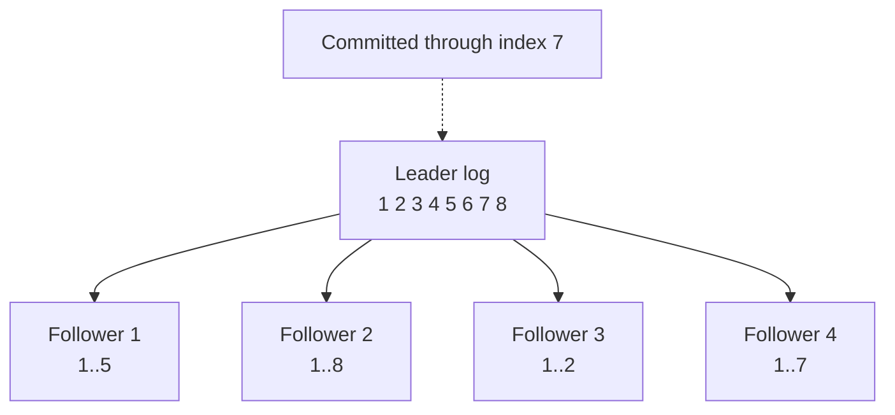
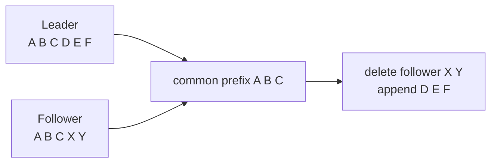
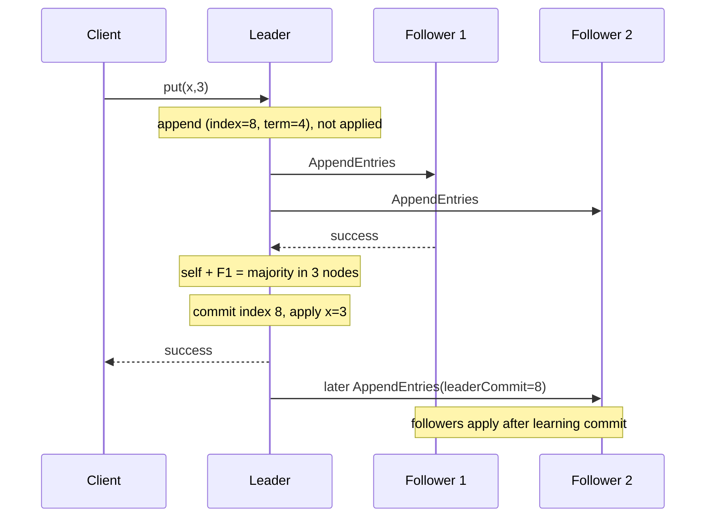
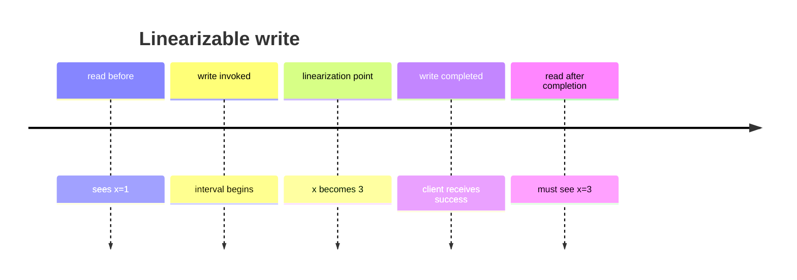
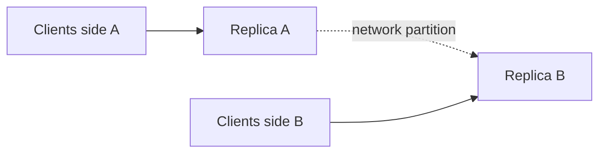
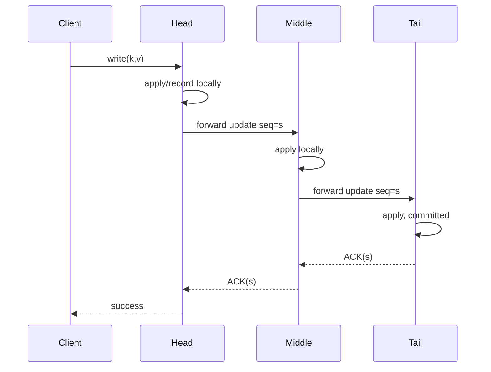
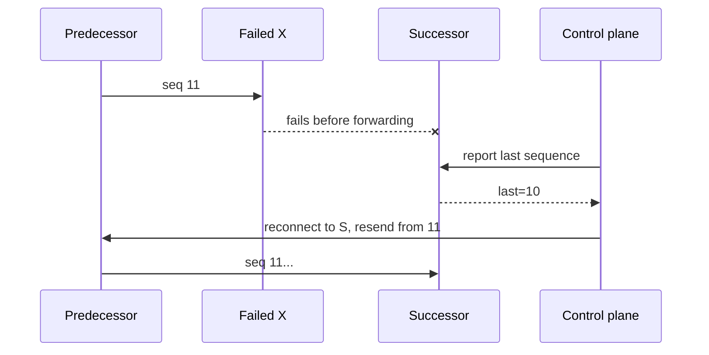
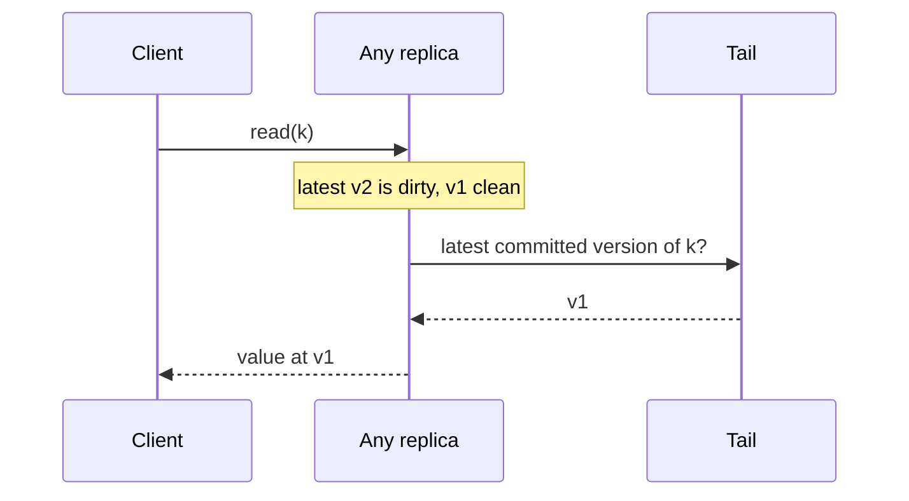
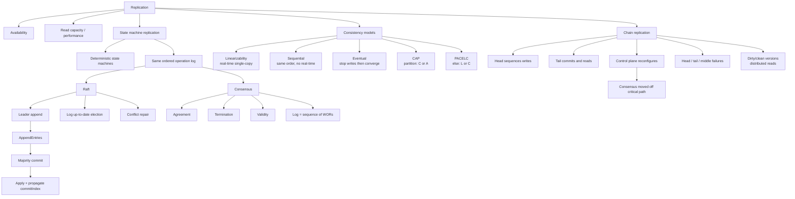

> 本文严格按照原章顺序展开：先说明复制的动机与困难，再依次讲解 State machine replication、Consensus、Consistency models（linearizability、sequential consistency、eventual consistency、CAP、PACELC）和 Chain replication。原章以建立完整机制图景为主；文中的 Raft 精确边界、quorum 推导、历史判定、延迟模型、CRAQ 读路径与标准 C11 模拟用于展开原理，不应误认为原书逐字给出的完整 Raft/chain replication 规范或生产实现。

## 0. 本章定位：复制数据容易，让副本表现成一份数据很难

### 0.1 为什么复制

原章给出两类核心动机。

#### 提高可用性

若数据只在一个进程上：

```text
single node fails -> data unavailable
```

复制后，客户端可切换到仍存活副本。冗余把单节点故障从“数据不可访问”变成“需要故障检测与切换”。

#### 提高可扩展性与性能

多个副本可以并行承担更多客户端访问，尤其是读取：

$$
ReadCapacity_{ideal}\approx N\times ReadCapacity_{one}
$$

这是理想上界。真实增益还受协调、负载均衡、热点和副本滞后限制。

### 0.2 复制引入的新问题

复制不是简单 `copy(data)`：

- 写应以什么顺序到达所有副本；
- 部分副本未收到写时能否返回成功；
- leader 崩溃后谁接管；
- 新 leader 是否包含已承诺数据；
- 重试怎样避免重复日志；
- 落后或冲突日志怎样修复；
- 读从 leader 还是 follower 返回；
- 客户端可看到多旧的数据；
- 网络分区时选择一致性还是可用性。

因此复制的核心不是存储多份字节，而是 **在故障和并发下定义并维护副本的可观察语义**。

### 0.3 本章路线


## 1. State machine replication：状态机复制

### 1.1 核心思想

Raft 使用 leader 向 followers 广播改变状态的操作。若所有副本：

1. 从相同初始状态开始；
2. 接收完全相同的操作序列；
3. 以完全相同顺序执行；
4. 状态转移是确定性的；

则最终状态相同。

原章选择讲 Raft 而不是更知名的 Paxos，因为 Raft 更容易理解；两者都属于解决强一致复制/共识的经典协议家族。

设状态转移函数为 $\delta$：

$$
S_i=\delta(S_{i-1},op_i)
$$

对于任意副本 $r$：

$$
S_0^{(r)}=S_0
$$

且应用相同 $op_1,\ldots,op_k$，则：

$$
S_k^{(1)}=S_k^{(2)}=\cdots=S_k^{(N)}
$$

### 1.2 为什么称为 state machine

每个进程被建模成确定性状态机：输入一个操作，从旧状态转到新状态。


复制的不是某一瞬间内存快照，而是 **决定状态演化的有序输入历史**。

### 1.3 KV store 例子

状态是 dictionary。日志 command 可以很简单，也可以是确定性的 CAS，或包含多个操作的事务；复杂度本身不破坏 SMR，关键是同一输入在所有副本上产生同一结果。

```text
{}
```

依次执行：

```text
put(x, 3)
put(y, 1)
put(y, 9)
```

所有节点最终：

```text
{x: 3, y: 9}
```

`get(k)` 通常是查询，不改变 replicated state；`put(k,v)` 是需要排序和复制的命令。

### 1.4 确定性为何不可缺少

若操作为：

```text
set(x, random())
set(created_at, wall_clock_now())
read_local_file_and_store_result()
```

不同副本执行会得到不同结果。解决方式通常是 leader 在形成日志前固定非确定结果：

```text
set(x, 731)
set(created_at, 2026-08-12T...)
```

日志包含决定后的输入，而不是让每个副本独立访问随机数、wall clock 或外部服务。

### 1.5 相同操作但顺序不同也会分歧

```text
put(x,1); put(x,2) -> x=2
put(x,2); put(x,1) -> x=1
```

所以 replication 需要 **总序广播（total-order broadcast / atomic broadcast）** 风格的顺序，不只是“最终每个节点都收到”。

## 2. Raft replicated log

### 2.1 Leader 是唯一写入排序者

系统先用 Chapter 9 的 Raft election 选 leader。leader 是唯一可以改变 replicated state 的进程。客户端写通常路由到 leader；其他节点重定向或拒绝。

leader 把每个状态变更操作先追加到本地 log，再复制给 followers。

### 2.2 Log entry 的三个字段

原章 Figure 10.1 中每条日志包含：

| 字段 | 含义 |
| --- | --- |
| command/operation | 要应用的确定性状态转移，如 `x=3` |
| index | 在日志中的位置，从而定义全局顺序 |
| term | 创建该 entry 的 leader election term |

抽象：

```text
Entry(index=7, term=3, command="x=5")
```

`(term,index)` 同时用于比较日志历史和发现冲突，但 index 不是 wall-clock time。

### 2.3 Figure 10.1 的信息

原图显示 leader 有 index 1–8，followers 处于不同追赶位置：

- follower 2 与 leader 一样到 8；
- follower 4 到 7；
- follower 1 到 5；
- follower 3 只到 2；
- committed boundary 到 index 7。



副本不必时刻完全同步；协议必须确保已经 committed 的前缀不会丢失，并让落后节点最终追上。

## 3. Append、replicate、commit、apply 四个阶段

### 3.1 为什么先写日志，不立即执行

leader 收到操作后：

1. append 到本地 log；
2. 此时尚未 apply 到状态机；
3. 复制给 followers；
4. 获得足够确认后 commit；
5. 再 apply 并返回结果。


区分四个词非常重要：

- appended：写入某节点日志；
- replicated：出现在多个节点日志；
- committed：协议保证不会被未来 leader 丢弃；
- applied：状态机已经执行该 command。

### 3.2 AppendEntries 也是 heartbeat

leader 向 followers 发送 AppendEntries：

- 有新 entries 时复制日志；
- 无新 entry 时周期发送空请求，充当 heartbeat；
- 携带 leader term 与 commit index；
- 携带前一日志位置的 term/index，检查连续性。

### 3.3 Follower 收到 entry 后为什么不立即执行

entry 可能尚未 committed。leader 在只复制给少数节点后崩溃，该未提交 entry 可能被未来 leader 覆盖。如果 follower 已把它暴露为最终业务状态，就产生无法回滚的错误。

所以 follower 先 durable append，回复成功；只有得知 `leaderCommit` 已覆盖该 index，才按序 apply。

### 3.4 Commit index

leader 维护最高 committed index：

$$
commitIndex=\max\{i\mid entry_i\ \mathrm{is\ committed}\}
$$

它在未来 AppendEntries 中传播。follower 更新：

$$
commitIndex_f=\min(leaderCommit,lastMatchedIndex_{RPC})
$$

其中 `lastMatchedIndex` 是本次 AppendEntries 已经验证与 leader 一致的最高位置，而不是 follower 整个本地日志的末尾。这样可避免把本次匹配范围之后的冲突 entry 错误提交。然后 follower 依次 apply 尚未应用的 committed entries，不能跳序。

## 4. Quorum commit 与容错

### 4.1 多数门槛

$N$ 个 Raft voting members 的 quorum：

$$
q=\left\lfloor\frac{N}{2}\right\rfloor+1
$$

leader 自己也是一个 member。通常说“leader 等待 majority of cluster”，等价于等待总计 $q$ 个副本（含自己）存储。

原书写“majority of followers”并给出 $2f+1$ followers 的表述，这不是标准 Raft 的准确 quorum 口径：多数应按整个 voting cluster（包含 leader）计算。以下公式和示例采用标准口径。

### 4.2 容忍多少 crash

若：

$$
N=2f+1
$$

则 quorum：

$$
q=f+1
$$

可容忍最多 $f$ 个 voting members 不可用，仍保留 quorum。

| N | quorum | 可容忍不可用数 |
| ---: | ---: | ---: |
| 3 | 2 | 1 |
| 5 | 3 | 2 |
| 7 | 4 | 3 |

### 4.3 多数交集为何保护 committed entry

任意两个 majority 必相交：

$$
|Q_1\cap Q_2|\ge2q-N\ge1
$$

但仅有集合交集还不够；Raft 还用：

- 日志匹配性质；
- RequestVote 的 up-to-date 检查；
- leader 对冲突日志的修复；
- current-term commit rule；

确保 committed 前缀进入未来 leader。

### 4.4 精确 commit 规则边界

原章简化为“多数成功 append 后 committed”。标准 Raft 中，leader 通过副本计数 **直接提交当前 term 创建的 entry**。设候选日志位置为 $k$，需要：

$$
\left|\{r\mid matchIndex[r]\ge k\}\right|\ge q
$$

并且：

$$
log[k].term=currentTerm
$$

此时可推进 commitIndex 到 $k$。过去 term 的 entry 不能仅凭当前 leader 观察到多数副本就直接提交；它们会随着某个当前 term entry 提交而间接 committed。这一限制避免特定 leader 变更场景中的安全问题。

### 4.5 Durable 与 eventually applied

一旦 committed：

- 未来合法 leader 必须包含它；
- 它不会被覆盖；
- 所有仍参与/恢复的正确副本最终收到并 apply；
- 原始 commit quorum 之外的节点可以滞后。

“eventually all processes”默认排除永久损坏且不再恢复的节点，并依赖网络/进程最终可用。

## 5. 新 leader 为什么必须日志足够新

### 5.1 问题

只需要多数即可 commit，所以某些 followers 可能落后。leader 崩溃时若选出落后 follower，它可能缺少 committed entries。

### 5.2 RequestVote up-to-date 规则

比较 candidate 与 voter 的最后日志：

1. lastLogTerm 更高者更新；
2. 若 lastLogTerm 相同，lastLogIndex 更大者更新。

candidate 至少与 voter 一样新，voter 才可能 grant：

```text
candidate.lastTerm > voter.lastTerm
or
(candidate.lastTerm == voter.lastTerm
 and candidate.lastIndex >= voter.lastIndex)
```

### 5.3 为什么获多数的 candidate 包含 committed entries

已 committed entry 存在于一个旧多数 $Q_c$。新 leader 必须从多数 $Q_e$ 获票。二者相交：

$$
Q_c\cap Q_e\ne\varnothing
$$

交集 voter 拥有 committed entry，并拒绝日志比自己旧的 candidate。结合 Raft 日志性质，获胜者不会缺少 committed prefix。

注意：单靠“最后 entry 比较”这句话不足以独立证明全部性质，完整证明还依赖 election restriction 与 log matching；这里给出原章层级直觉。

## 6. AppendEntries 重试为什么幂等

### 6.1 重复 delivery

网络可丢响应。follower 已 append，ACK 丢失，leader 重试同一 entry。

follower 根据 index/term 发现该 entry 已存在，不重复追加或 apply。因此相同 AppendEntries 重试可安全收敛。

### 6.2 “无限重试”的模型边界

原章说 leader 会一直重试直到 majority 成功。生产实现中：

- leader 只在自己仍是 leader 时重试；
- 看见更高 term 立即退位；
- 对每 follower 独立维护 `nextIndex`/`matchIndex`；
- 永久不可达 follower 不阻塞 quorum；
- 整体客户端请求仍受 deadline 与 leadership 变化约束。

### 6.3 幂等不等于无成本

重复 RPC 仍消耗网络、磁盘检查和 CPU；需要退避、批处理与流量控制。幂等保证 correctness，不保证 efficiency。

## 7. 落后与冲突 follower 的修复

### 7.1 Previous log check

AppendEntries 携带：

```text
prevLogIndex
prevLogTerm
entries[]
leaderCommit
```

follower 必须在 `prevLogIndex` 找到相同 `prevLogTerm`，否则拒绝。这防止日志出现 gap 或接在不同历史后。

### 7.2 回退寻找共同前缀

简化过程：

```text
leader sends suffix starting at i
if follower rejects:
    move i backward
    retry with a longer suffix
```

直到找到双方最后一致 entry：



### 7.3 删除冲突 suffix

若相同 index 处 term 不同，follower 删除该 entry 及之后所有 entries，再 append leader suffix。

未 committed entries 可以被删除；committed entries 受 election/log safety 保护，不应出现在要删除的冲突 suffix 中。

### 7.4 实际优化

原章脚注指出可减少消息数。常见做法是 follower 返回冲突 term 和该 term 首 index，leader 一次跳过整段，而不是每次只减 1。

## 8. 一次写的完整时序



若客户端响应丢失，客户端重试仍需 API idempotency；Raft 保证 replicated log，不自动识别两个不同客户端请求是同一逻辑操作。

## 9. 标准 C11 示例：简化三副本日志提交

### 9.1 示例目标

程序模拟：

- leader append 当前 term command；
- follower 按 `(prevIndex,prevTerm)` 验证连续性；
- 重复 AppendEntries 不重复写入；
- leader 收到总计多数副本后 commit/apply；
- follower 收到 leaderCommit 后 apply；
- 冲突 suffix 被截断并修复。

它不实现选举、持久化、网络、完整 commit rule 或并发。

### 9.2 完整代码

```c
#include <assert.h>
#include <stdbool.h>
#include <stddef.h>
#include <stdio.h>
#include <string.h>

enum { MAX_LOG = 8, REPLICA_COUNT = 3 };

typedef struct {
    unsigned int term;
    int value;
} Entry;

typedef struct {
    Entry log[MAX_LOG];
    size_t log_length;
    size_t commit_index;
    size_t last_applied;
    int state_value;
} Replica;

static void apply_committed(Replica *replica) {
    while (replica->last_applied < replica->commit_index) {
        replica->last_applied++;
        replica->state_value = replica->log[replica->last_applied - 1U].value;
    }
}

static bool append_entry(Replica *follower,
                         size_t prev_index,
                         unsigned int prev_term,
                         Entry entry,
                         size_t leader_commit) {
    size_t target_index = prev_index + 1U;

    if (prev_index > follower->log_length) {
        return false;
    }
    if (prev_index > 0U &&
        follower->log[prev_index - 1U].term != prev_term) {
        return false;
    }

    if (target_index <= follower->log_length) {
        Entry *existing = &follower->log[target_index - 1U];
        if (existing->term != entry.term || existing->value != entry.value) {
            follower->log_length = prev_index;
        } else {
            if (follower->commit_index < leader_commit) {
                follower->commit_index = leader_commit < target_index
                    ? leader_commit : target_index;
                apply_committed(follower);
            }
            return true;
        }
    }

    if (follower->log_length >= MAX_LOG ||
        target_index != follower->log_length + 1U) {
        return false;
    }
    follower->log[follower->log_length++] = entry;
    if (follower->commit_index < leader_commit) {
        follower->commit_index = leader_commit < target_index
            ? leader_commit : target_index;
        apply_committed(follower);
    }
    return true;
}

int main(void) {
    Replica replicas[REPLICA_COUNT] = {0};
    Replica guard = {0};
    Replica *leader = &replicas[0];
    Entry command = {4, 3};
    unsigned int stored_copies = 1;
    bool appended;

    leader->log[leader->log_length++] = command;
    assert(leader->state_value == 0); /* append is not apply */

    if (append_entry(&replicas[1], 0, 0, command, 0)) {
        stored_copies++;
    }
    appended = append_entry(&replicas[1], 0, 0, command, 0);
    assert(appended);
    assert(replicas[1].log_length == 1); /* duplicate is harmless */

    if (stored_copies >= REPLICA_COUNT / 2U + 1U) {
        leader->commit_index = 1;
        apply_committed(leader);
    }
    assert(leader->state_value == 3);

    appended = append_entry(&replicas[1], 0, 0, command, 1);
    assert(appended);
    assert(replicas[1].state_value == 3);

    replicas[2].log[0] = (Entry){2, 99}; /* conflicting uncommitted entry */
    replicas[2].log_length = 1;
    appended = append_entry(&replicas[2], 0, 0, command, 1);
    assert(appended);
    assert(replicas[2].log_length == 1);
    assert(replicas[2].log[0].term == 4);
    assert(replicas[2].state_value == 3);

    guard.log[0] = (Entry){4, 3};
    guard.log[1] = (Entry){4, 7};
    guard.log[2] = (Entry){2, 99}; /* unmatched conflicting suffix */
    guard.log_length = 3;
    appended = append_entry(&guard, 1, 4, (Entry){4, 7}, 3);
    assert(appended);
    assert(guard.commit_index == 2); /* index 3 was not matched */
    assert(guard.last_applied == 2);
    assert(guard.state_value == 7);

    printf("copies=%u leader_commit=%zu states=%d,%d,%d\n",
           stored_copies,
           leader->commit_index,
           replicas[0].state_value,
           replicas[1].state_value,
           replicas[2].state_value);
    return 0;
}
```

预期输出：

```text
copies=2 leader_commit=1 states=3,3,3
```

### 9.3 代码边界

- command 只是“把 state_value 设为 value”；
- 只模拟一个 entry 和当前 term 的 majority commit；
- follower 冲突修复只覆盖最小场景；
- 假设 AppendEntries 来自合法 current leader，且被截断 suffix 全部未 committed；
- 没有磁盘原子性、term 更新、vote、snapshot、membership change；
- 没有按 follower ID 去重 ACK；
- 不代表完整 Raft 安全证明。

## 10. Consensus：从复制日志到一次性决定

### 10.1 Consensus 的三个目标

原章定义：一组进程决定一个值，使：

1. 每个 non-faulty 进程最终决定某个值（termination）；
2. 所有 non-faulty 进程决定相同值（agreement）；
3. 决定值由某个进程提出（validity）。

常见形式还包括 integrity：每个进程最多决定一次。

### 10.2 Write-once register 直觉

Consensus 可看成 thread-safe、linearizable 的 write-once register：

```text
initial: EMPTY
propose(v): 在线性化顺序中首个成功写入决定 v
read(): 之后永远返回同一个 v
```

多个 contender 可以提案，但最终只有一个决定值。

### 10.3 Raft log 是一串 consensus instances

每个 log index 像一个 WOR：

```text
slot 1 decides command A
slot 2 decides command B
slot 3 decides command C
...
```

Raft 不只决定一个值，而是反复决定每个日志槽位，形成有序命令序列。

### 10.4 实际应用

- leader/lease 的唯一所有者；
- 配置版本；
- 元数据主记录；
- replicated log；
- 分布式协调。

etcd、ZooKeeper 等协调服务内部用 consensus 复制状态，向客户端提供 KV、watch、lease 等接口。

原章举出具体 lease 做法：协调服务暴露层级化 KV；客户端尝试创建带 TTL 的特定 key，若 key 已存在则创建失败。这个“唯一创建”操作必须由内部 consensus 复制，才能在节点故障下仍保持单一 lease winner。

### 10.5 为什么不要自行实现

共识实现要处理持久化、重配置、快照、长尾、磁盘错误和协议边界。理论算法正确不等于工程实现正确。优先使用成熟系统，并理解它们的线性一致 API 和故障语义。

## 11. Consistency models：定义客户端允许观察什么

### 11.1 Replica consistency 与 client consistency

复制协议内部关注日志怎样一致；consistency model 关注外部 observers 可看到哪些历史。

同一复制机制可以暴露不同读模式：

- leader read；
- follower stale read；
- session-pinned follower read；
- quorum/lease read。

因此“用了 Raft”不自动说明每个 API read 都 linearizable。

### 11.2 Operation interval

一次操作有 invocation 和 response：

$$
I(op)=[invoke(op),complete(op)]
$$

理想图 10.2 把写画成瞬时点；现实图 10.3 是一段区间。linearizability 要求能在该区间内选一个逻辑生效点（linearization point）。

## 12. Strong consistency / Linearizability

### 12.1 定义

存在一个等价 sequential history，使：

1. 每个操作像在 invocation 与 completion 之间某点原子执行；
2. 保持 real-time order：若 A 完成后 B 才开始，则 A 必须排在 B 前。

$$
complete(A)<invoke(B)\Longrightarrow A<_{linearized}B
$$

并发重叠操作可以按任一符合对象规范的顺序排列。

### 12.2 Figure 10.4

初始 $x=1$，client A 执行 `write(x,3)`。写的 linearization point 位于调用和返回之间；在点之前的 read 可见 1，点之后开始/生效的 read 应可见 3。



### 12.3 为什么只读 leader 仍不能随便本地返回

进程可能仍自认为 leader，但已因分区失去多数，新 leader 已在更高 term 当选。旧 leader 本地状态可能过期。

原章方案：presumed leader 先联系多数确认自己仍有领导权，再读本地状态。标准 ReadIndex 路径还要满足：leader 已知本 term 至少有一个 entry committed；记录安全的 `readIndex`；完成 quorum heartbeat/leadership confirmation；最后等待本地状态机 `lastApplied >= readIndex` 才返回。否则它虽确认身份，却可能从尚未 apply 到该 index 的旧状态读取。Raft 也可在满足严格时钟和租约前提时优化读取。

### 12.4 Linearizable read 的成本

若每次 read 需 quorum confirmation：

$$
Latency_{read}\gtrsim RTT_{quorum}+local\ read
$$

leader 成为读瓶颈，网络往返增加 tail latency。这是 consistency 的 coordination tax。

### 12.5 “Strong consistency”术语边界

原章把 strong consistency 等同 linearizability。行业中 strong 有时泛指多种较强模型；技术讨论最好直接说 linearizable，并说明对象/事务范围。

Linearizability 是单对象操作的最强常用实时一致性；多对象事务还需要 serializability 等执行隔离概念，二者维度不同。

## 13. Sequential consistency

### 13.1 定义

存在一个所有进程共同认可的 sequential order，并保持每个进程自己的 program order，但不要求这个顺序尊重跨进程 real-time order。

若 client A 的操作为 $A_1,A_2$：

$$
A_1<_{program}A_2
$$

全局 sequential history 必须保持它；但 A 的写已经在 wall time 完成，不意味着另一 observer 立即看到。

### 13.2 与 linearizability 的唯一关键差异

$$
Linearizability=Sequential\ Consistency+RealTime\ Order
$$

这是概念公式，不是代数运算。

### 13.3 Figure 10.5

followers 以相同顺序处理：

```text
x=1 -> x=3 -> x=4
```

但时间不同：follower 1 可能已经看到 4，follower 2 还停在 3。若客户端固定查询各自 follower，各自观察同一有序序列，只是滞后不同。

### 13.4 Queue producer/consumer

producer 写入：

```text
A, B, C
```

consumer 稍后读取：

```text
A, B, C
```

顺序一致，但 consumer 有 lag；没有 real-time visibility 保证。

### 13.5 Pinning 的局限

原章用 client pin follower 建立顺序视图。若固定 follower 失败，client 失去访问；切到更落后的 follower 可能读到旧状态。要保持 session guarantees 还需记录至少已见版本并等待新副本追上。

## 14. Eventual consistency

### 14.1 定义

若停止新写，并且通信/副本恢复，所有 replicas 最终收敛到同一最终状态：

$$
\mathrm{writes\ stop}\land\mathrm{delivery\ continues}
\Longrightarrow
\exists T,\forall t\ge T,\forall i,j:S_i(t)=S_j(t)
$$

它不保证何时收敛，也不单独保证中间读的顺序。

### 14.2 为什么任意 follower 提高可用性

客户端可访问任意可达 follower，不必等待 leader/固定 replica。代价是 follower 2 可能比 follower 1 更旧：

```text
read follower1 -> x=4
read follower2 -> x=3
```

出现 non-monotonic read：客户端“回到过去”。

### 14.3 Eventual 不等于无一致性

它仍有 convergence 条件，但很弱。系统可额外提供：

- read-your-writes；
- monotonic reads；
- monotonic writes；
- causal consistency；
- bounded staleness。

后续章节会明确展开 causal consistency；其他 session/bounded-staleness 保证在不同产品和资料中也很常见，但不都属于本书下一章的展开范围。

### 14.4 适用例子

原章给出网站访问人数：稍旧计数通常可接受。其他例子需按业务判断：

- 点赞数、浏览数；
- 缓存；
- 推荐统计；
- 非关键状态展示。

库存扣减、lease、唯一用户名等通常不能只靠无附加约束的 eventual consistency。

### 14.5 难调试的原因

- 错误依赖时序和路由；
- 切换副本才出现；
- 生产延迟分布难复现；
- 日志 wall clock 不等于因果顺序；
- 旧值可能合法而非故障。

应用必须显式接受 stale、并发和收敛语义。

## 15. 三种一致性对比

| 模型 | 全局操作顺序 | 保持程序顺序 | 保持实时顺序 | 可读滞后/回退 |
| --- | --- | --- | --- | --- |
| Linearizability | 有 | 有 | 有 | 完成后不能读旧 |
| Sequential consistency | 有 | 有 | 无 | 可延迟可见，但共同顺序 |
| Eventual consistency | 不单独保证 | 不单独保证 | 无 | 可旧、可回退，最终收敛 |

强弱不是“数据正确/错误”二分，而是允许的 history 集合不同。模型越强，合法 history 越少，实现协调越多。

## 16. CAP theorem

### 16.1 三个字母的精确含义

- C：linearizable/atomic consistency；
- A：每个发给 non-failing node 的请求最终得到非错误响应；
- P：网络可丢失任意多消息形成 partition，系统仍满足所选保证。

CAP 的 availability 不是日常 uptime 百分比；慢到最终返回在形式上仍可能“available”，返回错误则不算。

### 16.2 分区时为什么必须选择

两个分区无法通信：



若两边都接受冲突写，无法保证 single-copy linearizability；若只允许有权一侧工作，另一侧请求必须失败/等待，牺牲 CAP availability。

### 16.3 “Pick two”为什么容易误导

网络分区不可由软件彻底禁止，所以发生 P 时实际是在 C 与 A 之间选择。无 partition 时，系统可以同时 consistent 且 available，但仍有 latency 与故障概率。

更准确的问题：

> 当特定通信链路中断时，哪些操作继续返回、返回什么语义、哪些必须拒绝？

### 16.4 CAP 的实践局限

原章指出其定义非常精确但应用范围有限：

- availability 是全请求终止，不反映延迟 SLO；
- consistency 指 linearizability，不是所有一致性；
- partition 是消息永久/任意丢失模型；
- 真实系统可按操作、数据、地域做不同选择；
- consistency/availability 常是连续谱而非单个标签。

## 17. PACELC

### 17.1 定义

PACELC 扩展 CAP：

```text
if Partition: choose Availability or Consistency
Else: choose Latency or Consistency
```

简写：

$$
P\Rightarrow A/C,\qquad E\Rightarrow L/C
$$

### 17.2 为什么无分区也有权衡

数据中心内部 network partition 通常比日常正常运行少见，但无分区时期占据系统绝大多数时间，因此只讨论 CAP 故障期不够。

linearizable read 可能需要 leader/quorum confirmation；strong write 需要等待 quorum durable。较弱 read 可就近从 follower 返回。

```text
local follower read -> low latency, possibly stale
quorum/leader read -> stronger consistency, extra coordination
```

### 17.3 Coordination tax

跨节点协调至少受网络 RTT、最慢 quorum member 和持久化影响：

$$
Latency_{coordinated}\ge
network\ rounds+quorum\ tail+storage\ cost
$$

增加 coordination 通常缩小可观察 history 集合，却提高延迟并扩大故障依赖。

### 17.4 不是二元开关

Cosmos DB、Cassandra 等都提供可调一致性，但具体选项、名称和保证并不相同。常见系统可能提供：

- linearizable/strong；
- bounded staleness；
- session；
- causal；
- eventual。

“数据库是 AP/CP”常过于粗糙，应问具体 operation、configuration 和 failure mode。

## 18. Chain replication

### 18.1 拓扑

$N$ 个 processes 排成 chain：

```text
head -> replica 2 -> ... -> tail
```

- writes 只发给 head；
- reads 只由 tail 服务；
- updates 逐节点向右传播；
- ACK 从 tail 向左返回 head。

### 18.2 Write path



原章说明此流程略不同于原始 chain replication，采用 CRAQ 扩展式 ACK 回传描述。

### 18.3 Read path

正常 reads 只发 tail：


tail 是 commit point：到达 tail 的 update 必然已经经过链中每一节点。tail 交错处理 update 和 read，从而提供单一线性顺序。

### 18.4 为什么强一致

无故障稳定配置下：

- 所有 write 由 head 排序；
- 每个 write 按相同链顺序传播；
- 到 tail 才 commit；
- 所有 read 由 tail 返回。

因此 read 不会跳过已确认 write，操作可在 tail 处理点 linearize。

## 19. Control plane 与唯一拓扑

### 19.1 配置管理器职责

control plane：

- 监控 chain health；
- 检测故障；
- 删除失败节点；
- 连接 predecessor/successor；
- 通知 clients 新 head/tail；
- 添加并同步替代节点；
- 保证所有节点同意唯一 topology view。

### 19.2 为什么 control plane 需要共识

若不同节点同时相信不同 chain 拓扑，会产生双 head/tail 或遗漏更新。配置本身需要 state machine replication，如 Raft。

因此 chain data plane 避开每请求 quorum，并没有消灭 consensus；它把 consensus 移到低频 topology change 路径。

### 19.3 容错数量的边界

长度 $N$ 的 data chain 理论上可在 control plane 逐次正确重配置后容忍最多 $N-1$ 节点故障，退化为单节点。不是说 $N-1$ 同时故障时仍总能恢复：若故障/分区使最新 committed state 和控制面不可获得，保证受前提限制。

control plane 有 $C$ 个 replicas 时，标准 majority crash tolerance：

$$
f_{control}=\left\lfloor\frac{C-1}{2}\right\rfloor
$$

原书排版写作约 $C/2$，精确整数形式如上。

## 20. Chain 三种故障模式

### 20.1 Head failure

control plane 删除 head，让 successor 成为新 head并通知 clients。

若旧 head 本地接受 write，但未 forward：

- write 未到 tail，因此未 commit；
- client 未收到 ACK，只看到 timeout；
- 其他 client 只读 tail，未看到该 write；
- client 可安全按幂等语义重试。

### 20.2 Tail failure

predecessor 成为新 tail。旧 tail 收到的每个 update 必先经过 predecessor，所以 predecessor 至少拥有相同候选更新。

精确协议仍需处理 ACK/commit 边界与重配置同步；原章给出的是顺序拓扑带来的核心直觉。

### 20.3 Intermediate failure

若 X 失败：

```text
P -> X -> S
```

重配为：

```text
P -> S
```

但 X 可能收到某些 updates 尚未 forward 给 S。按原章口径，S 向 control plane 报告自己最后看到的 **committed update sequence number**，control plane 再让 P 重传缺失 suffix。



### 20.4 替换失败节点

随着 chain 变短，剩余冗余下降。新节点通常：

1. 与现有副本同步 state/history；
2. 加入为新 tail；
3. control plane 原子发布新 topology。

同步期间不能让它提供尚未拥有的 committed read。

## 21. Chain 为什么容易推理

write commit 必须到达 tail，因此必经全部 chain nodes。相比 quorum replication 中 committed write 只存在于某 subset，chain 对故障恢复的可能状态更少。

这不是说实现简单到没有边界；配置切换、重放、并发 reconfiguration 仍需严格协议。但拓扑将数据路径约束为一条线，减少组合。

## 22. Raft 与 chain replication 性能权衡

| 维度 | Raft-style quorum | Chain replication |
| --- | --- | --- |
| 写入口 | leader | head |
| 读入口（强一致） | leader + leadership confirmation | tail 本地 |
| write commit | quorum | 到达所有 chain nodes/tail |
| 慢副本影响 | 非 quorum 慢副本可落后 | 任一 chain 节点可拖慢写 |
| 单节点失败 | quorum 尚在可继续写 | 需 control plane 先摘除 |
| read/write 负载 | leader 集中 | head 写、tail 读分工 |
| write latency | quorum tail | 全链传播 + ACK 回传 |
| throughput | leader 瓶颈 | writes 可 pipeline |

### 22.1 Write pipeline

虽然单 write latency 随链长增加，多个 writes 可同时位于不同链段：

```text
time t:   w1 at tail, w2 at middle, w3 at head
```

steady-state throughput 由最慢链段服务速率决定，不必等一条 write 完整 ACK 后再发送下一条。

### 22.2 Head/tail 分工

head 排序 writes，tail 服务 reads；热点分成两个节点。相比 Raft leader 同时承担写和强读，有更高吞吐潜力。

### 22.3 Slow replica

chain write 必经所有节点：

$$
Throughput_{write}\le\min_i Capacity_i
$$

Raft 只等待最快 quorum，更能绕开一个暂时慢 follower。

## 23. CRAQ：任意 replica 的 linearizable read

### 23.1 Dirty / clean version

每个 replica 保存对象多个 versions：

- update 从 head 向 tail 传播时标记 dirty；
- tail 收到后该 version committed；
- ACK 向前传播，replicas 将对应 version 标 clean。

### 23.2 Read rule

```text
if latest local version is clean:
    return it immediately
else:
    ask tail for latest committed version number
    return that committed local version
```

### 23.3 Figure 10.7

某 replica 已有 `v2 dirty`，但 `v1 clean`。若直接返回 v2，可能暴露未 committed update；它先问 tail，tail 告知当前 committed 仍是 v1，于是返回 v1。



若 latest local version clean，可直接返回，不联系 tail。

### 23.4 为什么仍 linearizable

tail 提供 authoritative committed frontier。dirty 只说明本地存在更晚但未确认的候选版本；向 tail 查询确保不返回未 committed state，也不落后于 tail 已知的相关 committed frontier（实现还需完整协议保证版本可用）。

## 24. Data plane / Control plane 分离

### 24.1 Data plane

处理每个 client request 的关键路径：

- head 写排序/转发；
- tail 或 CRAQ replicas 读；
- 目标是 throughput 与 latency。

### 24.2 Control plane

只在较少发生的 topology/failure 事件中协调：

- health；
- reconfiguration；
- membership；
- state transfer。

它可用 Raft leader/consensus，因为不在每个正常请求关键路径。

### 24.3 一般设计原则

将强协调从高频 data path 移到低频 control path：

$$
PerRequestCoordination\downarrow
\Longrightarrow Capacity_{data\ plane}\uparrow
$$

代价是控制面必须正确管理 epoch/topology，并防止旧配置 data-plane 节点继续工作。

## 25. 容易混淆的概念与常见误区

### 25.1 Replicated、committed、applied

某 entry 在一个 follower 上 replicated 不代表 committed；committed 不代表每个 follower 已 applied；客户端可见性取决于读路径和 consistency model。

### 25.2 Majority of followers 与 majority of cluster

标准 Raft quorum 按 voting cluster（含 leader）计算。3 节点 leader + 1 follower 即多数，不需要 2 followers 都确认。

### 25.3 Deterministic command 与 deterministic result

不能让每个副本独立 `now()`/`random()`；应在 leader 决定输入后把确定值写日志。

### 25.4 Consensus 与 replication

consensus 决定一个值；SMR 反复运行有序 consensus 决定命令日志；replication 还包括状态传输、apply 和读取语义。

### 25.5 Linearizability 与 serializability

linearizability 是单对象实时可见顺序；serializability 是事务并发执行等价于某串行顺序。两者正交，可同时要求 strict serializability。

### 25.6 Sequential consistency 与 eventual consistency

sequential consistency 要所有 observer 认可一个保持程序顺序的全局顺序；eventual 仅承诺停止写后最终收敛，不自动给共同中间顺序。

### 25.7 CAP availability 与 uptime

CAP A 是形式化“每个请求最终非错误响应”，不是 99.99% uptime；CAP 不直接讨论实用 latency SLO。

### 25.8 Partition tolerance 不是可选网络功能

软件无法保证网络永不分区。真正选择是分区发生时操作怎样响应。

### 25.9 Chain tail 与 Raft follower

tail 是 chain 的 commit/read 端点，不是普通滞后 follower。正常强读只从 tail，正因为所有 committed writes 到此排序。

### 25.10 Control plane 不等于不重要

它不在每请求 critical path，却决定拓扑安全。错误 control plane 可造成双 head/tail 或数据缺失。

### 25.11 能否完全不用 consensus

原章结尾提出下一步问题：是否能在不使用 consensus 的情况下复制数据、进一步减少协调？Chain replication 只是把 consensus 移到 control plane，并未消除它。下一章将从 coordination avoidance 继续探索这个问题。

## 26. 本章知识结构



## 27. 核心结论

1. **复制提高可用性与读取容量，但真正困难是故障下保持可定义的一致性。**
2. **状态机复制依赖相同初态、相同有序输入和确定性执行。** 非确定结果应由 leader 固定后写日志。
3. **Raft leader 是唯一写排序者，复制的是带 index/term 的 command log。**
4. **Append、replicate、commit、apply 是不同阶段。** Follower 不能在未 commit 时把 entry 当最终状态。
5. **标准 Raft quorum 按整个 voting cluster 计算。** $N=2f+1$ 可容忍 $f$ 个节点不可用。
6. **当前 term entry 获多数后可直接 commit。** 旧 term entry 随当前 term entry 提交而间接 committed。
7. **新 leader 的日志必须至少与 voter 一样新。** lastLogTerm 优先，term 相同再比 lastLogIndex。
8. **AppendEntries 重试幂等，prevLogIndex/prevLogTerm 防止 gap。** 冲突 suffix 被截断并替换为 leader history。
9. **Committed entry 进入未来 leader 并最终由恢复的正确副本 apply。** 这依赖 quorum 交集与 Raft 日志安全规则。
10. **Consensus 要求 agreement、termination 和 validity。** Replicated log 可看作一串 write-once registers。
11. **Consistency model 定义客户端允许观察的 histories。** 同一 Raft 系统可按读路径暴露不同保证。
12. **Linearizability 要求原子点位于调用区间并保持 real-time order。** Presumed leader 读前必须确认领导权。
13. **Sequential consistency 保持共同顺序和进程程序顺序，但无实时可见性。**
14. **Eventual consistency 只承诺停止写且通信恢复后最终收敛。** 客户端可读旧值甚至回退。
15. **CAP 在 network partition 时迫使 linearizability 与形式 availability 取舍。** “pick two”不是日常配置菜单。
16. **PACELC 指出正常无分区时也有 latency 与 consistency 权衡。** 本质是 coordination tax。
17. **Chain replication 让 writes 从 head 走到 tail，ACK 反向返回，reads 由 tail 服务。** Tail 是 commit/linearization 点。
18. **Chain data plane 需先后处理三类故障：head、tail、middle。** Middle failure 需要按 sequence 补缺失更新。
19. **Chain write 必经所有节点，容易推理但受最慢节点影响。** Raft 只等 quorum，更能绕过慢 follower。
20. **Writes 可 pipeline，head/tail 分工提升吞吐。** 单 write latency 仍随全链传播增加。
21. **CRAQ 用 dirty/clean 多版本让任意 replica 服务读。** Dirty 时询问 tail 的 committed version。
22. **Chain replication 没有消灭 consensus。** 它把拓扑协调移到低频 control plane，减少每请求协调。

## 28. 从本章提炼出的通用解题方法

### 第一步：先定义复制目标

是容节点故障、提高读容量、跨地域，还是降低延迟？目标不同，复制拓扑和 consistency 要求不同。

### 第二步：把状态建模为确定性命令序列

列出所有非确定输入，确保随机数、时间和外部结果在日志前被固定；验证所有副本同序执行得到同态。

### 第三步：严格区分日志阶段

为 appended、replicated、committed、applied、client-visible 分别记录 index/指标。不要把“写到 follower”误报成“已提交”。

### 第四步：用 quorum 与 term 证明 durability

写出 cluster size、majority、交集和 leader election restriction；检查 crash-recovery 后 term/vote/log 是否持久。

### 第五步：在每个 RPC 插入丢失、重复和重排

测试 entry 已 append 但 ACK 丢失、leader commit 后响应丢失、落后 follower、冲突 suffix 和 leader change。

### 第六步：先选择 consistency model，再设计读路径

需要 linearizable 就走 leader/quorum/lease；可接受 stale 才从 follower 读。不要先做性能优化，后用“强一致”标签补文档。

### 第七步：用 history 而非单值讨论一致性

画 operation invocation/completion 区间，检查 real-time order、program order、回退读和收敛条件。

### 第八步：按具体故障解释 CAP/PACELC

分区哪条链路？哪些请求继续？返回错误还是旧值？无分区时一次强读多付多少 RTT？避免只贴 CP/AP 标签。

### 第九步：比较 quorum 与 chain 关键路径

计算 write 等 fastest quorum 还是 all chain nodes，read 是否需协调，最慢副本如何影响 tail latency，故障前是否能继续。

### 第十步：把高频 data plane 与低频 control plane 分开

把拓扑/故障协调移出每请求路径，但为 control plane 本身使用成熟复制系统，并用 epoch 防止旧拓扑继续工作。

本章最重要的方法论是：**复制协议决定状态怎样安全收敛，一致性模型决定客户端允许看到什么；只有把内部 commit 机制与外部观察语义同时说清，才能真正理解一个 replicated system。**
