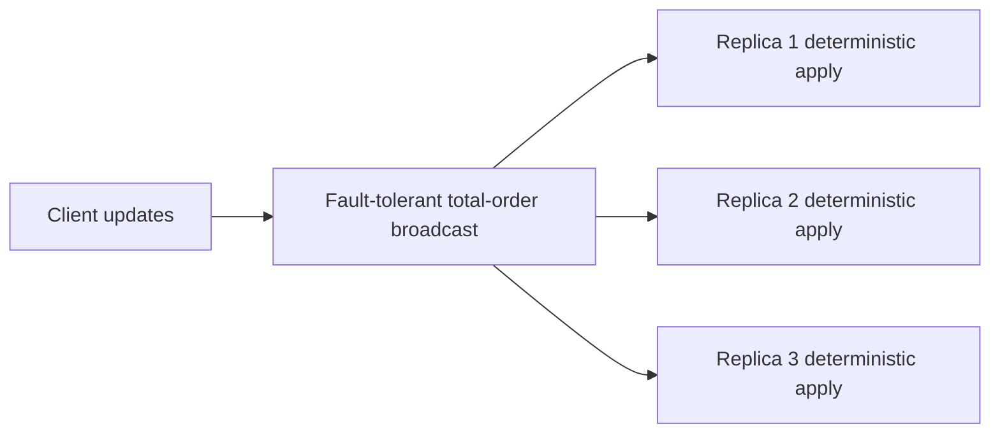
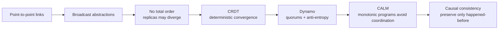
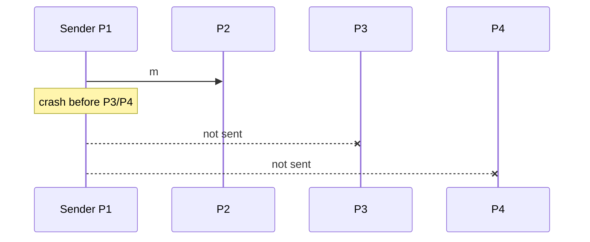
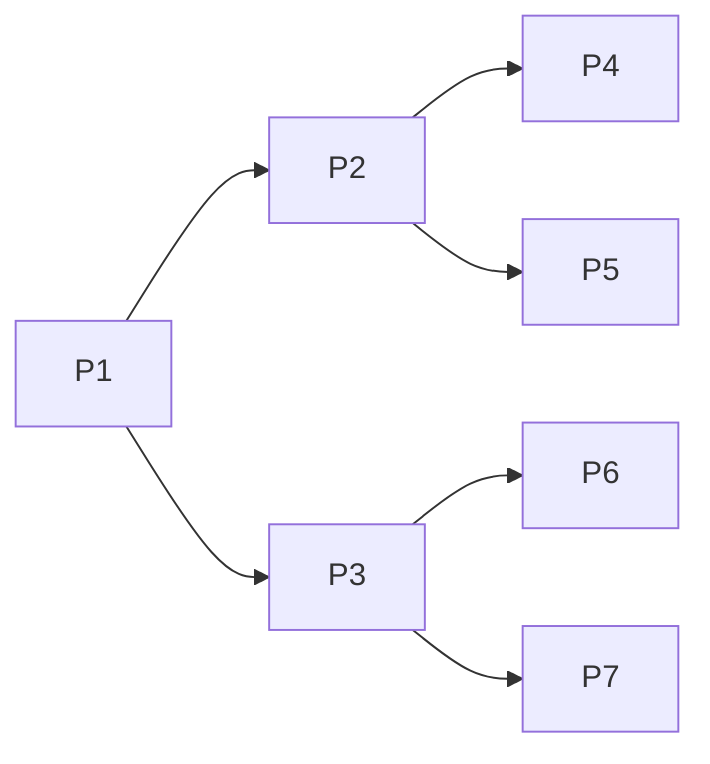
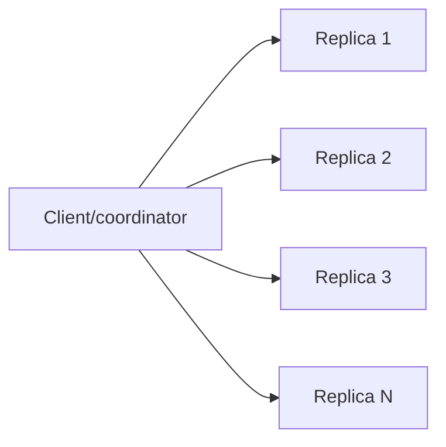
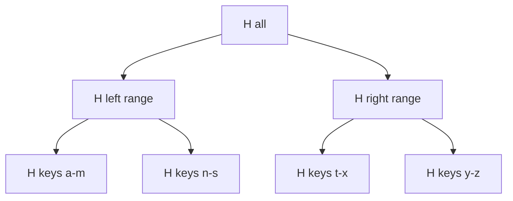
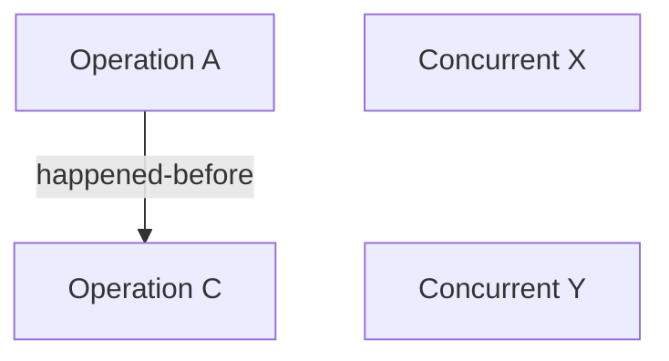

> 对应原文：Understanding Distributed Systems 2nd edition.md
>
> 本文严格按照原章顺序展开：先说明为什么 total-order broadcast 形成协调瓶颈，再依次讲解 Broadcast protocols、Conflict-free replicated data types、Dynamo-style data stores、The CALM theorem、Causal consistency 和 Practical considerations。原章以建立概念链条为主；文中的消息复杂度、半格/LUB 证明、quorum 反例、Merkle tree、COPS 依赖算法与标准 C11 示例用于展开原理，不应误认为原书逐字给出的完整生产协议。

## 0. 本章定位：不是所有正确性都需要全局总序

### 0.1 从 Chapter 10 的状态机复制出发

State machine replication 可以拆成两个核心部件：

1. fault-tolerant total-order broadcast：所有副本以相同顺序收到相同 updates；
2. deterministic state transition：每个副本对同一 update 得到同一结果。



total order 的收益是简单：所有副本执行同一串行历史。代价是：

- fault-tolerant total-order broadcast 与 consensus 等价；
- writes 通常经单 leader 排序；
- 协调进入每个 update 的关键路径；
- partition 时无法同时保持 total order 与 CAP availability；
- 吞吐受到排序点和网络往返限制。

### 0.2 本章核心问题

> 如果放弃所有 updates 的全局 total order，能否仍获得有用、可证明的 consistency？

答案不是“完全不要顺序”，而是：

- 只保留业务真正需要的顺序；
- 让可交换/单调操作无序传播；
- 用 deterministic merge 让 replicas 收敛；
- 只为非单调或因果相关操作支付协调成本。

### 0.3 Coordination avoidance 不等于零通信

副本仍要：

- broadcast updates；
- retry 或 anti-entropy；
- merge state；
- 跟踪 version/causal dependencies；
- 修复遗漏数据。

避免的是 **同步全局协调和 total order**，不是避免网络消息或所有元数据。

### 0.4 全章路线



## 1. Broadcast protocols

### 1.1 为什么需要 broadcast

互联网基础传输主要是 point-to-point unicast：一个 sender 对一个 receiver。若消息要送到 group 中所有进程，需要在 unicast 之上构造 multicast/broadcast。

困难来自：

- 多个 senders/receivers；
- sender 中途 crash；
- receiver crash/recovery；
- 消息丢失、重复和乱序；
- group size 增长带来的消息成本。

Broadcast protocol 由它提供的 guarantees 定义，而不是由某个固定网络 API 定义。

## 2. Best-effort broadcast

### 2.1 保证

若 sender 不 crash，消息送达 group 中所有 non-faulty processes。

可写成：

$$
sender\ correct\land broadcast(m)
\Longrightarrow
\forall p\in Correct:\ eventually\ deliver_p(m)
$$

### 2.2 最小实现

sender 通过 reliable links 依次向每个进程发送：

```text
for p in group:
    send(p, message)
```

对应 Figure 11.1。若 sender 在发给 P2 后 crash，P3/P4 永远收不到。



### 2.3 适用边界

适合：

- sender failure 可由上层重试；
- 丢一部分接收者可接受；
- 存在后续 anti-entropy；
- 低成本优先于确定性 delivery。

它不是 unreliable point-to-point 的同义词：实现可以使用 reliable links，但 sender crash 仍让 group delivery 不完整。

## 3. Eager reliable broadcast

### 3.1 保证

即使原 sender 在只发出一部分后 crash，只要某个 non-faulty process 首次收到消息，消息最终传播给所有 non-faulty processes。

经典 reliable broadcast 还包含 validity、agreement、integrity/no-duplication 等性质；原章聚焦 sender crash 下的 group-wide eventual delivery。

### 3.2 实现

每个进程第一次收到 $m$ 时：

```text
if m.id not in delivered:
    delivered.add(m.id)
    deliver_to_application(m)
    for p in group:
        send(p, m)
```

对应 Figure 11.2：P1 只发到 P2 就 crash，P2 再向其余节点 retransmit。

```mermaid
sequenceDiagram
    participant P1
    participant P2
    participant P3
    participant P4

    P1->>P2: m
    Note over P1: crash
    P2->>P3: first-delivery rebroadcast m
    P2->>P4: first-delivery rebroadcast m
    P3->>P4: may also rebroadcast; duplicate suppressed
```

### 3.3 为什么需要 ID 和去重

多个节点会 rebroadcast 同一消息，网络也可能重复。没有唯一 ID，消息可能被无限重复应用。每个 process 需要：

```text
seen_message_ids
```

首次到达才向上交付，但重复到达可以忽略或帮助协议传播。

### 3.4 消息复杂度

$N$ 个进程，每个首次收到后向近 $N$ 个目标发送：

$$
M_{eager}=O(N^2)
$$

若不向自己发送，最大有序点对数：

$$
N(N-1)
$$

原章简写 $N^2$ 次，表达二次增长。$N=1000$ 时约 999,000 次 peer sends，难以扩展。

## 4. Gossip broadcast

### 4.1 基本思想

每个首次收到消息的 process 不向所有节点转发，只随机选择 fanout $f$ 个 peers。多个 rounds 后，消息像流言一样扩散。

Figure 11.3 使用 fanout 2。



### 4.2 概率性 guarantee

gossip 不确定性保证每个 process 收到；它把 miss probability 调到很低，而不是降为数学 0。

参数包括：

- fanout；
- rounds；
- retry/anti-entropy；
- peer selection；
- failure rate；
- group size。

fanout 越大、rounds 越多，覆盖概率提高，消息成本也增加。

### 4.3 简化传播模型

忽略重复选择与故障，若每个已感染节点每 round 感染 $f$ 个新节点：

$$
I_r\approx(1+f)^r
$$

达到 $N$ 节点所需 rounds 量级：

$$
r=O(\log_{1+f}N)
$$

现实后期大量 peer 已收到，增长不再理想指数；这是直觉模型而非 delivery guarantee。

### 4.4 为什么适合大 group

相比 eager $O(N^2)$，gossip 把每个节点每 round 工作限制在 $O(f)$，没有集中 sender 热点，对节点 crash 和动态成员较鲁棒。

## 5. Reliable broadcast 与 total-order broadcast

### 5.1 Reliable 不保证 order

两个节点都收到 $a,b$：

```text
P1 observes: a, b
P2 observes: b, a
```

reliable broadcast 仍可成立，因为它只保证 delivery，不保证同序。

### 5.2 Total order 增加什么

若任意正确 processes 都交付 $a,b$，交付顺序相同：

$$
deliver_p(a)<deliver_p(b)
\Longrightarrow
deliver_q(a)<deliver_q(b)
$$

Fault-tolerant total-order broadcast 需要 consensus，因此代价更高，partition 下可能停止。

## 6. Conflict-free replicated data types

### 6.1 放弃 total order 后发生什么

允许任何 replica 接受 write，并用非 total-order broadcast 传播：

- 本地立即可用；
- partition 两侧都可写；
- updates 到达顺序不同；
- replicas 暂时 diverge。

Figure 11.4 中，同一 object 在 A/B 被并发改成不同值；两个 update 交叉传播，产生 conflict。

### 6.2 Eventual consistency 的两项要求

原章形式化为：

1. eventual delivery：某 replica 应用的每个 update 最终在所有 replicas 应用；
2. convergence：应用相同 updates 的 replicas 最终得到相同 state。

普通 eventual consistency 允许在收敛前出现较大分歧，也不要求一旦 update 集合相同就立即状态相同。

### 6.3 用 consensus 事后解决 conflict

可让 replicas 先本地接受 writes，再在后台用 consensus 决定冲突 winner。相比每写 total-order，它把 coordination 移出 critical path，提高可用性和 latency；但 reconciliation 复杂，且冲突期间状态不统一。

### 6.4 设计上消除 conflict

若对任何并发 updates 定义 deterministic merge，所有 replicas 无需 consensus 即可独立得出同一结果。

这产生 strong eventual consistency（SEC）：

- eventual delivery；
- strong convergence：拥有相同 update 集合的 replicas state 相同。

精确地说，strong convergence 不表示“每个 update 立即在所有副本持久化”；它表示副本只要处理了同一组 updates，就立即可由 deterministic merge 得出相同逻辑 state。

## 7. Semilattice 与 least upper bound

### 7.1 State-based convergent CRDT 模型

原章描述的是 state-based CRDT（CvRDT）：

```text
query -> 读 local state
update -> 单调推进 local state，broadcast state
receive -> merge(remote_state, local_state)
```

### 7.2 Join-semilattice

状态集合 $S$ 配有 partial order $\sqsubseteq$。任意两个状态 $x,y$ 有 least upper bound（join）：

$$
x\sqcup y
$$

满足：

- $x\sqsubseteq x\sqcup y$；
- $y\sqsubseteq x\sqcup y$；
- 对任意共同上界 $z$，有 $x\sqcup y\sqsubseteq z$。

update 必须 inflationary：

$$
s\sqsubseteq update(s)
$$

merge 取 join：

$$
merge(x,y)=x\sqcup y
$$

### 7.3 三个代数性质

join 必然：

#### Commutative

$$
x\sqcup y=y\sqcup x
$$

处理顺序不同不影响结果。

#### Associative

$$
(x\sqcup y)\sqcup z=x\sqcup(y\sqcup z)
$$

分组/传播路径不同不影响结果。

#### Idempotent

$$
x\sqcup x=x
$$

重复 delivery 不影响结果。

三者分别吸收乱序、重组和重复；eventual delivery 保证不永久遗漏，于是 replicas 收敛。

### 7.4 Max-register 示例

状态为非负整数，partial order 是 $\le$，merge 是 max：

$$
x\sqcup y=\max(x,y)
$$

Replica A/B：

```text
A: 3 -> 8
B: 3 -> 5
merge: max(8,5)=8
```

无论：

- A 先收 B；
- B 先收 A；
- 消息重复多次；

最终都为 8。

这个类型只能单调增大，不能表达任意 assignment/decrement；限制操作语义是获得无协调收敛的代价。

### 7.5 Unreliable broadcast + anti-entropy

即使单次 broadcast 不可靠，只要 replicas 周期交换/merge state，并最终让每个 update 的信息到达所有正确 replicas，仍可收敛。

naive 全状态交换可能昂贵，需要摘要、delta-state、Merkle tree 或其他同步优化。

## 8. Registers：LWW 与 MV

### 8.1 Register 问题

register 存一段 opaque bytes，支持 assignment。普通 assignment 覆盖旧值，不是 inflationary；并发赋值需要确定 merge。

## 9. Last-writer-wins register

### 9.1 状态与顺序

LWW state：

$$
(timestamp,value)
$$

timestamp 可用：

$$
(LamportClock,ReplicaId)
$$

按 lexicographic total order 比较，ReplicaId 打破 ties。

merge：

$$
merge(a,b)=\max_{timestamp}(a,b)
$$

### 9.2 Figure 11.5

- A 写 `x=44,t=1`；
- B 写 `x=48,t=3`；
- 依据 total order，B timestamp 更大；
- 传播后两边都保留 48，丢弃 44。

原图以逻辑 timestamp 排序。若用 wall clock，skew 可能让较旧写错误获胜。

### 9.3 优点与代价

优点：

- state 小；
- merge 简单；
- deterministic convergence。

代价：

- 并发 writes 中某些值静默丢失；
- winner 是 arbitrary total-order winner，不必符合业务意义；
- “last”是 logical order，不一定真实物理最后。

LWW 适合覆盖语义可接受的配置、缓存或可重建值，不适合无声丢写会造成资产错误的场景。

## 10. Multi-value register

### 10.1 核心思想

MV register 用 vector/version clock 检测 causal dominance 和 concurrency：

- 若 version A happened-before B，保留 B；
- 若 A/B concurrent，保留两个 siblings；
- client/application 后续合并。

### 10.2 Figure 11.6

- A 写 `44, vector=[2,1]`；
- B 写 `48, vector=[1,3]`；
- 两向量不可比；
- merge 返回 `{44,48}`；
- 两 replicas 最终都持有同一 sibling set。

### 10.3 Merge 规则

对于 versions 集合，删除被其他 version 因果支配的值，保留 maximal concurrent versions：

```text
merge(X,Y):
  U = X union Y
  remove v if exists w in U with clock(v) < clock(w)
  return U
```

### 10.4 冲突交给应用

应用可以：

- union shopping cart；
- 请求用户选择；
- 使用领域规则合并；
- 写入新 version 覆盖已解析 siblings。

MV 不消除业务 conflict，只防止系统未经授权静默丢值。

## 11. CRDT composition

CRDT 可以组合：dictionary 的 values 是 LWW/MV registers，或 set/counter/map 嵌套。组合正确性要求容器和嵌套类型的 update/merge 规则保持相应 CRDT 性质；不能仅因组件都叫 CRDT 就任意组合 mutation。

Dynamo-style KV store 可视为 key 到 convergent register 的 dictionary。

## 12. 标准 C11 示例：Max-register 与 MV merge

### 12.1 示例目标

程序实现：

- max-register 的 commutative/associative/idempotent merge；
- 两分量 version vector 偏序；
- MV register 删除 dominated versions、保留 concurrent siblings；
- Figure 11.6 的 44/48 并发 merge。

### 12.2 完整代码

```c
#include <assert.h>
#include <stdbool.h>
#include <stddef.h>
#include <stdio.h>

enum {
    REPLICA_COUNT = 2,
    MAX_INPUT_SIBLINGS = 4,
    MAX_MERGED_SIBLINGS = 2 * MAX_INPUT_SIBLINGS
};

typedef struct {
    unsigned int counter[REPLICA_COUNT];
} Version;

typedef struct {
    int value;
    Version version;
} Sibling;

typedef struct {
    Sibling item[MAX_MERGED_SIBLINGS];
    size_t count;
} MVRegister;

static int max_merge(int left, int right) {
    return left > right ? left : right;
}

static bool version_before(const Version *left, const Version *right) {
    bool strictly_less = false;
    size_t index;

    for (index = 0; index < REPLICA_COUNT; ++index) {
        if (left->counter[index] > right->counter[index]) {
            return false;
        }
        if (left->counter[index] < right->counter[index]) {
            strictly_less = true;
        }
    }
    return strictly_less;
}

static bool same_sibling(const Sibling *left, const Sibling *right) {
    size_t index;
    if (left->value != right->value) {
        return false;
    }
    for (index = 0; index < REPLICA_COUNT; ++index) {
        if (left->version.counter[index] != right->version.counter[index]) {
            return false;
        }
    }
    return true;
}

static bool contains_sibling(const MVRegister *register_value,
                             const Sibling *sibling) {
    size_t index;
    for (index = 0; index < register_value->count; ++index) {
        if (same_sibling(&register_value->item[index], sibling)) {
            return true;
        }
    }
    return false;
}

static bool add_candidate(MVRegister *result,
                          const Sibling *candidate,
                          const MVRegister *all) {
    size_t index;

    for (index = 0; index < all->count; ++index) {
        if (version_before(&candidate->version, &all->item[index].version)) {
            return true;
        }
    }
    for (index = 0; index < result->count; ++index) {
        if (same_sibling(candidate, &result->item[index])) {
            return true;
        }
    }
    if (result->count >= MAX_MERGED_SIBLINGS) {
        return false;
    }
    result->item[result->count++] = *candidate;
    return true;
}

static bool mv_merge(const MVRegister *left,
                     const MVRegister *right,
                     MVRegister *result) {
    MVRegister all = {0};
    size_t index;

    if (left->count > MAX_INPUT_SIBLINGS ||
        right->count > MAX_INPUT_SIBLINGS ||
        left->count + right->count > MAX_MERGED_SIBLINGS) {
        return false;
    }
    result->count = 0;
    for (index = 0; index < left->count; ++index) {
        all.item[all.count++] = left->item[index];
    }
    for (index = 0; index < right->count; ++index) {
        all.item[all.count++] = right->item[index];
    }
    for (index = 0; index < all.count; ++index) {
        if (!add_candidate(result, &all.item[index], &all)) {
            return false;
        }
    }
    return true;
}

int main(void) {
    MVRegister a = {.item = {{44, {{2, 1}}}}, .count = 1};
    MVRegister b = {.item = {{48, {{1, 3}}}}, .count = 1};
    MVRegister merged = {0};
    MVRegister merged_reverse = {0};
    MVRegister dominated = {.item = {{40, {{1, 1}}}}, .count = 1};
    MVRegister full_left = {
        .item = {
            {10, {{1, 4}}}, {11, {{2, 3}}},
            {12, {{3, 2}}}, {13, {{4, 1}}}
        },
        .count = 4
    };
    MVRegister full_right = {
        .item = {
            {20, {{5, 8}}}, {21, {{6, 7}}},
            {22, {{7, 6}}}, {23, {{8, 5}}}
        },
        .count = 4
    };
    MVRegister full_merged = {0};
    MVRegister self_merged = {0};
    bool merged_ok;

    merged_ok = mv_merge(&a, &b, &merged);
    if (!merged_ok) {
        return 1;
    }
    merged_ok = mv_merge(&b, &a, &merged_reverse);
    if (!merged_ok) {
        return 1;
    }
    merged_ok = mv_merge(&full_left, &full_right, &full_merged);
    if (!merged_ok) {
        return 1;
    }
    merged_ok = mv_merge(&full_left, &full_left, &self_merged);
    if (!merged_ok) {
        return 1;
    }

    assert(max_merge(8, 5) == 8);
    assert(max_merge(8, 8) == 8); /* idempotent */
    assert(max_merge(8, 5) == max_merge(5, 8)); /* commutative */
    assert(max_merge(max_merge(3, 8), 5) ==
           max_merge(3, max_merge(8, 5))); /* associative */

    assert(merged.count == 2);
    assert(merged_reverse.count == 2);
    if (!contains_sibling(&merged_reverse, &merged.item[0]) ||
        !contains_sibling(&merged_reverse, &merged.item[1])) {
        return 1;
    }
    assert(full_merged.count == 4); /* right versions dominate left */
    assert(self_merged.count == 4); /* duplicates removed */
    assert(!version_before(&a.item[0].version, &b.item[0].version));
    assert(!version_before(&b.item[0].version, &a.item[0].version));
    merged_ok = mv_merge(&merged, &dominated, &self_merged);
    if (!merged_ok) {
        return 1;
    }
    assert(self_merged.count == 2); /* dominated version removed */

    printf("max replicas converge to %d\n", max_merge(8, 5));
    printf("MV siblings after merge: {%d,%d}\n",
           merged.item[0].value,
           merged.item[1].value);
    return 0;
}
```

预期输出：

```text
max replicas converge to 8
MV siblings after merge: {44,48}
```

### 12.3 示例局限

- 固定 2 replicas；单个输入最多 4 siblings，两输入 merge buffer 最多 8；
- 没有动态成员、version garbage collection 或 write API；
- merge 通过显式 `bool` 报告容量错误；`assert` 仅验证测试结果；
- merge 输出顺序随输入顺序变化，但 sibling set 语义相同；
- 演示容量仍是人为上限，不是可处理任意 sibling 数的完整 MV-register；
- 不实现网络、eventual delivery 或持久化。

## 13. Dynamo-style data stores

### 13.1 架构目标

Dynamo 是经典 highly available、eventually consistent KV 设计，启发 Cassandra 与 Riak KV。任何 replica 可接收 reads/writes，避免单 leader 成为 availability chokepoint。

### 13.2 N、W、R

- $N$：一项数据的 replicas 数；
- $W$：write 返回成功前等待的 acknowledgments；
- $R$：read 返回前等待的 replies。

客户端/协调者并行请求 $N$ replicas：



### 13.3 Quorum intersection

若：

$$
W+R>N
$$

则任意 write set 与 read set 必相交：

$$
|Q_W\cap Q_R|\ge W+R-N\ge1
$$

Figure 11.7 展示两个 quorum 至少共享一个 replica。

### 13.4 为什么 intersection 不等于 linearizability

相交只说明至少一个 reply 可能带某次 write 的较新 version，还需要：

- 正确比较 versions；
- 已完成 write 确实在至少 W replicas；
- read 读到并选择最新 version；
- concurrent/partial writes 被原子定义或正确 merge；
- read/write overlaps 的语义明确；
- sloppy quorum 等机制不破坏预期集合。

原章给出 partial write 反例：write 在少于 W replicas 成功，整体操作报告失败，却留下新值。之后一些 reads 看到新值，另一些看不到。若要求原子 read/write register，需要把 write 作为 atomic transaction 或使用更强协议，不能只看 $W+R>N$。

### 13.5 参数权衡

在保持 $W+R>N$ 时：

- 小 $R$：read 更快/可用，需大 $W$，writes 更慢；
- 小 $W$：write 更快/可用，需大 $R$，reads 更慢；
- majority $R,W$：常见对称选择；
- $R=W=1$：性能/availability 高，但 $W+R\le N$ 时两个 quorum 可能不相交，consistency 弱。

例：$N=3$：

| W | R | W+R>N | 直觉 |
| ---: | ---: | --- | --- |
| 2 | 2 | 是 | 对称 quorum |
| 3 | 1 | 是 | 慢写快读 |
| 1 | 3 | 是 | 快写慢读 |
| 1 | 1 | 否 | 最高局部性能，可能读旧 |

### 13.6 Availability 数值直觉

若每个 replica 独立可用概率为 $p$，至少 $W$ 个可用的 write availability：

$$
A_W=\sum_{k=W}^{N}\binom{N}{k}p^k(1-p)^{N-k}
$$

$N=3,p=0.99$：

$$
A_{W=2}=3p^2(1-p)+p^3\approx0.999702
$$

$$
A_{W=3}=p^3\approx0.970299
$$

这是独立故障简化模型，现实区域/网络故障高度相关。

## 14. Anti-entropy

### 14.1 为什么 quorum 不保证所有 replicas 收敛

write 只等待 W；其余请求可能永久丢失。若之后没有机制补写，落后 replica 永远不会收敛。

Dynamo-style 可看成：

```text
best-effort broadcast + read/write quorums + anti-entropy
```

### 14.2 Read repair

read 收到 R replies，比较 versions。若某些旧：

```text
return newest/merged value to client
send repair write to stale replicas
```

优点：热门 key 在读取中自然修复。

局限：冷 key 永远不读，就永远不 repair；所以不能单独保证 convergence。

### 14.3 Replica synchronization

后台 replicas 周期比较 key ranges，发现 X 的 K 比 Y 旧，就拉取新 version。

它不依赖客户端读取，能覆盖冷数据。

### 14.4 Merkle tree

Merkle tree 叶子是数据块/key range hashes，父节点 hash children：



若 root 相同，树覆盖数据相同（在 hash collision 可忽略前提下）；若不同，递归比较只传输/修复不同 subtree，避免发送全量数据。

可用 gossip 交换摘要，分散同步负载。

## 15. The CALM theorem

### 15.1 问题

怎样判断 application logic 是否必须协调？CALM（Consistency As Logical Monotonicity）给出判据：

> 一个程序存在 consistent、coordination-free 的 distributed implementation，当且仅当它是 monotonic。

这个结论属于特定逻辑/分布式实现语境，不能脱离模型无限推广。

### 15.2 Monotonic program

新输入只能扩展/refine 输出，不能撤回此前 output。若输入事实集合：

$$
I\subseteq J
$$

monotonic query $Q$ 满足：

$$
Q(I)\subseteq Q(J)
$$

集合 union 是例子：元素一旦输出，不因新输入撤回。

### 15.3 Non-monotonic program

新输入可能让旧结论失效：

- assignment 覆盖旧值；
- “确认不存在某项”；
- count 是否恰好为 0；
- 选全局最小值后遇到更小输入；
- 删除。

否定和完成判断经常需要知道“不会再有新输入”，这需要 coordination/barrier。

### 15.4 Counter 例子

用 assignment：

```text
write(1), write(2), write(3) => 3
write(3), write(1), write(2) => 2
```

结果依赖 order。

用 increment abstraction：

```text
inc(1), inc(1), inc(1) => 3
```

increments 可交换，顺序不影响总和；重复 delivery 仍需唯一 operation ID 或幂等 CRDT 表示，不能仅靠整数加法。

### 15.5 CALM consistency 与 CAP C

CALM consistency 指：无论 inputs 以何顺序到达、如何交错，program 最终输出相同，不因 conflict 得出不一致结论。

CAP C 指 linearizability of read/write register。

两者研究对象不同：

| CALM | CAP |
| --- | --- |
| program output confluence | read/write history linearizability |
| monotonicity 判协调需求 | partition 时 C/A 取舍 |
| 可用高层 operation semantics | 聚焦 register observations |

### 15.6 用 logical clock 让 assignment 单调化

普通 assignment 会撤回旧值。但将 state 扩展为 `(logical_timestamp,value)`，只接受更大 timestamp：

$$
(t_1,v_1)\sqsubseteq(t_2,v_2)\iff t_1\le t_2
$$

这里 $t$ 必须是唯一、全序的 version，例如 `(LamportClock,ReplicaId)`，并约定相同 version 只能对应同一次 write 和同一 value；否则两个不同 value 共用同一 $t$ 会破坏偏序的反对称性。merge=max version，使 metadata state 单调增长。这就是 LWW 的思路。

注意：它让实现 deterministically converge，不代表业务上没有信息丢失。

## 16. Causal consistency

### 16.1 Eventual consistency 缺少什么

eventual consistency 允许 effect 先于 cause 可见。

原章社交网络例子：

1. A：上传 picture；
2. B：读取 picture 成功；
3. C：基于 B，把 picture reference 加入 gallery。

因果链：

$$
A\rightarrow B\rightarrow C
\Longrightarrow A\rightarrow C
$$

另一个 replica 若先看到 C、后看到 A，gallery 暂时出现 missing image。

### 16.2 强一致为何自然保持因果

linearizable global order 尊重 real-time/happened-before，所以 cause 在 effect 前可见。但为只保留 causality，无需为所有 concurrent operations 建 total order。

### 16.3 定义

causal consistency 要求所有 processes 对 causally related operations 的顺序一致；concurrent operations 可在不同 replicas 以不同顺序观察。



- 所有 observer 必须 A before C；
- 有的 observer 可 X before Y；
- 另一些可 Y before X。

它建立 partial order，不是 global total order。

### 16.4 强度位置

就 ordering safety 而言，linearizability 强于 causal consistency。但 causal ordering 与 eventual delivery/convergence 属于不同维度，不能无条件写成 `Causal => Eventual`。在本章 replicated-store 另外满足最终传播和 deterministic convergence 的语境下，可以直觉地排列为“linearizable 比 causal+ 强，causal+ 比 plain eventual 提供更多顺序保证”。原章讨论的 causal+ 同时用 LWW 保证 concurrent conflicts 收敛。

### 16.5 为什么有吸引力

- 比 eventual 更符合用户因果直觉；
- 比 linearizable 少协调；
- 理论上是可与 availability、partition tolerance 同时实现的最强模型之一（在相应模型定义下）；
- concurrent operations 不必统一顺序。

## 17. Causal+ 与 COPS

### 17.1 Causal+ 为什么加 convergence

纯 causal consistency 允许 replicas 对 unrelated concurrent operations 顺序不同，可能使最终状态分歧。Causal+ 加 conflict convergence；原章用 LWW register 让 concurrent writes deterministic winner。

### 17.2 COPS 环境

COPS 面向跨地域 clusters：

- 每个 cluster 内是 strong consistent partitioned store；
- 本章把 cluster 简化成 logical single replica；
- clients 使用最近 local replica；
- 跨 cluster async replication；
- 任意 replica 接受 reads/writes。

### 17.3 Client dependency context

client 维护：

```text
dependencies: key -> version
```

read(k)：

1. local replica 返回本地最新 `(value,version)`；
2. client 把 `k -> version` 加入 dependency dictionary。

write(k,v)：

1. client 附带 dependencies 副本；
2. local replica 分配新 logical version；
3. 本地应用并返回 version；
4. client 执行 `dependencies[k] = returned_version`，让后续 writes 继承自身 write 的 program order；
5. local replica async broadcast 到 remote replicas。

### 17.4 Remote apply rule

remote replica 收到 write $w$：

```text
for each (key, required_version) in w.dependencies:
    wait until local committed_version[key] >= required_version
apply w using LWW merge
```

Figure 11.8：B depends on A。replica 2 即使先收到 B，也必须等 A 被本地 committed 后才 apply B。

```mermaid
sequenceDiagram
    participant C as Client
    participant R1 as Local replica 1
    participant R2 as Remote replica 2

    C->>R1: write A
    R1-->>C: version A1
    C->>R1: write B, deps={A:A1}
    R1-->>C: version B1
    R1->>R2: replicate B(deps A1)
    Note over R2: hold B; A1 missing
    R1->>R2: replicate A1
    Note over R2: commit A1, then apply B1
```

### 17.5 为什么保持 causality

client 先前 reads 和 writes 得到的 versions 都成为未来 writes 的 dependencies；remote replica 在 dependencies 满足前不暴露 effect。传递依赖由 context 带上，因此 happened-before closure 被保护。

### 17.6 Partition 下 availability

local replica 可立即接受 read/write，不等待跨地域 remote ACK。partition 后各 cluster 继续服务；恢复后 async replication 和 dependency checks 收敛。

### 17.7 Durability tradeoff

原章明确指出：local replica 可能在本地 commit 后、broadcast 前 crash，导致 update 丢失。COPS 接受该风险，以避免 client write 等待长距离 remote replication。

这说明：

- available 不等于 durable；
- causal ordering 不等于每个 acknowledged write 永不丢；
- durability 需要本地多副本或等待更多确认，增加 latency/coordination。

## 18. Practical considerations

### 18.1 全章结论

Consistency、availability、performance 存在基本权衡。要构建 scalable/available system，需要最小化 coordination，但不能盲目删除业务必需的 ordering/invariants。

### 18.2 Cosmos DB 例子

原章指出 Azure Cosmos DB 提供 5 种 consistency models，从 eventual 到 strong。weaker models 通常提供更高 throughput，因为读写等待的 coordination 较少。

具体产品版本与语义会演化；实践中应阅读当前 SLA、session scope、region/failure behavior，而不是只按“5 档”选名称。

### 18.3 选择 consistency 的问题清单

1. 哪些 operations 有 happened-before 依赖？
2. 哪些 concurrent updates 可交换/合并？
3. 允许读到多旧？允许读回退吗？
4. acknowledged write 可否丢失？
5. partition 时哪些 side 继续写？
6. conflict 由系统还是 application 处理？
7. 需要哪些 session guarantees？
8. coordination latency 与吞吐预算是多少？

## 19. 容易混淆的概念与常见误区

### 19.1 Broadcast、multicast、replication

broadcast 是 group delivery abstraction；replication 用 broadcast/anti-entropy 传播 state，但还需 merge、durability 和 read semantics。

### 19.2 Reliable broadcast 与 total order

reliable 只保证所有正确节点最终收到；total order 还保证交付顺序相同。前者不自动需要 consensus，后者 fault-tolerant 实现需要。

### 19.3 Eventual 与 strong eventual consistency

- eventual：停止写后最终收敛；
- SEC：相同 update 集合立即决定相同 state，并要求 eventual delivery。

SEC 不是 linearizability，也不提供 real-time reads。

### 19.4 CRDT 与“无冲突”

conflict-free 指 merge 按定义 deterministic、无需 consensus；业务上仍可能出现多个 concurrent intentions，LWW 甚至会丢一个。

### 19.5 Commutative/associative/idempotent

- commutative 抵抗乱序；
- associative 抵抗合并分组；
- idempotent 抵抗重复；
- eventual delivery/anti-entropy 抵抗永久遗漏。

缺一项可能不收敛。

### 19.6 W+R>N 与 linearizability

交集只保证读集合碰到写集合，不保证 partial write 原子性、最新版本选择、并发顺序或 real-time history。

### 19.7 Read repair 与 replica sync

read repair 只修热门读取 key；background replica synchronization 才覆盖冷 key。两者互补。

### 19.8 CALM consistency 与 CAP C

CALM 讨论 program output confluence；CAP C 是 linearizable register。不能用 CALM 证明任意读写 API linearizable。

### 19.9 Monotonic program 与 monotonic read

CALM monotonicity 指新 inputs 不撤回 outputs；monotonic reads 是 client session 不读回更旧 version。名字相似，概念不同。

### 19.10 Causal 与 sequential consistency

causal 只统一 causally related operations 的顺序；sequential 要所有 operations 存在共同 total order，但不保 real-time。

### 19.11 Available 与 durable

COPS local write 可快速 ACK 并保持 availability，但 broadcast 前 crash 可能丢数据。响应成功、可继续服务和数据耐久是不同性质。

## 20. 本章知识结构

```mermaid
flowchart TD
    A[Coordination avoidance] --> B[Broadcast protocols]
    B --> B1[Best effort<br/>sender correct 才全送达]
    B --> B2[Eager reliable<br/>首次收到即全转发 O(N²)]
    B --> B3[Gossip<br/>随机 fanout，概率覆盖]
    B --> B4[Total order<br/>同序交付，需要 consensus]

    A --> C[CRDT / SEC]
    C --> C1[Eventual delivery]
    C --> C2[Join-semilattice]
    C2 --> C3[LUB merge<br/>ACI]
    C --> C4[LWW register<br/>deterministic winner]
    C --> C5[MV register<br/>保留 concurrent siblings]

    A --> D[Dynamo-style]
    D --> D1[N replicas]
    D --> D2[W write quorum]
    D --> D3[R read quorum]
    D2 --> D4[W+R>N intersects<br/>not automatically linearizable]
    D3 --> D4
    D --> D5[Read repair]
    D --> D6[Merkle/gossip anti-entropy]

    A --> E[CALM]
    E --> E1[Monotonic programs<br/>coordination-free]
    E --> E2[Non-monotonic<br/>may require coordination]
    E --> E3[Program confluence<br/>not CAP C]

    A --> F[Causal consistency]
    F --> F1[Preserve happened-before]
    F --> F2[Concurrent order may differ]
    F --> F3[Causal+ adds convergence]
    F --> F4[COPS dependency context]
    F4 --> F5[Delay remote effect until deps visible]
```

## 21. 核心结论

1. **State machine replication 的 total-order broadcast 需要 consensus，并形成顺序瓶颈。** Coordination avoidance 的目标是只协调真正需要排序的操作。
2. **Best-effort broadcast 在 sender crash 时可能只送达部分节点。** Reliable broadcast 通过首次接收者 retransmit 补足 sender failure。
3. **Eager reliable broadcast 消息成本为 $O(N^2)$。** Gossip 用随机 fanout 换取可扩展性，但 guarantee 变成概率性。
4. **Reliable broadcast 不保证同序。** Fault-tolerant total-order broadcast 额外要求所有正确进程同序交付，因而需要 consensus。
5. **放弃 total order 会暂时 diverge。** Eventual consistency 需要 eventual delivery 和 convergence。
6. **Strong eventual consistency 要求 eventual delivery 与 strong convergence。** 拥有相同 updates 的 replicas 必须得到相同 state。
7. **State-based CRDT 的 states 形成 join-semilattice，update inflationary，merge 取 LUB。** Join 的交换、结合、幂等性吸收乱序、分组和重复。
8. **Max-register 通过 max merge 无协调收敛。** 它只能单调增大，操作能力受限。
9. **LWW 用 `(Lamport timestamp, replica ID)` 给 concurrent writes deterministic total order。** 收敛但可能静默丢业务意图。
10. **MV register 用 version vectors 识别并发，保留 siblings。** 它把冲突显式交给应用，而非擅自选 winner。
11. **Dynamo-style stores 允许任意 replica 读写。** $N/W/R$ 控制 latency、availability 与 consistency 权衡。
12. **$W+R>N$ 只保证 read/write quorum 相交，不自动保证 linearizability。** Partial write、concurrency 和 sloppy quorum 仍需处理。
13. **Quorum 不保证所有 replicas 最终收到 write。** Read repair 修热门 key，background sync/Merkle anti-entropy 修冷数据。
14. **CALM 判据是 monotonicity。** 新 input 不撤回旧 output 的程序可有 consistent coordination-free implementation。
15. **CALM consistency 是 program output confluence，不是 CAP linearizability。** 高层 operation abstraction 会改变协调需求。
16. **Causal consistency 保持 happened-before partial order。** Concurrent operations 不必由所有 replicas 同序观察。
17. **Causal consistency 比 linearizable 弱、比 plain eventual 更符合因果直觉。** 在相应模型下可同时保持 availability 和 partition tolerance。
18. **Causal+ 用 convergent conflict handling 消除 concurrent ordering disagreement。** 原章用 LWW register。
19. **COPS client 通过 read versions 构建 dependency context。** Remote replica 在 dependencies committed 前不能 apply effect。
20. **COPS local write 不等 remote durability。** 本地 ACK 后、broadcast 前 crash 可能丢 update，这是换取低 WAN latency 的代价。
21. **Consistency、availability、performance 是连续权衡。** 产品 knobs 只能有意识地选择语义，不能消灭基本约束。

## 22. 从本章提炼出的通用解题方法

### 第一步：找出真正需要排序的关系

画 happened-before 和业务 invariants。Concurrent 且可交换的 operations 不必进入 total order。

### 第二步：选择 broadcast guarantee

sender crash 是否必须全送达？能否接受概率 miss？是否已有 anti-entropy？不要默认所有消息都需要 total-order broadcast。

### 第三步：把操作设计成 monotonic/mergeable

优先使用 add、increment、union、max 等不会撤回结果的 abstraction，而不是暴露任意 assignment。

### 第四步：证明 merge 代数性质

检查 commutative、associative、idempotent 与 inflationary update；用乱序、重复、分组反例测试。

### 第五步：决定并发业务意图如何处理

LWW 是否可安全丢 loser？若不可，用 MV/siblings、领域 merge 或 CRDT set/counter。

### 第六步：不要把 quorum intersection 当完整一致性证明

逐一检查 partial write、failed write residue、version comparison、read/write overlap、sloppy quorum 和 read repair。

### 第七步：为永久遗漏设计 anti-entropy

热门 key 用 read repair；全量冷数据用 background sync；大数据集用 Merkle tree/delta 减少传输。

### 第八步：用 CALM 检查否定与撤回

凡是“确认没有”“选唯一”“删除”“覆盖”都可能 non-monotonic。问是否能改成可增长 facts 或把协调限制在最终确认点。

### 第九步：显式传播 causal context

client/session 记录 read versions，write 附 dependencies，replica 等依赖可见后再暴露 effect。

### 第十步：分开定义 consistency、availability、durability

说明 ACK 在几副本后返回、partition 时何处可写、何时 causal effect 可见、local crash 是否丢已 ACK write。不要用一个“最终一致”标签掩盖全部语义。

本章最重要的方法论是：**协调不是越少越好，而应只用于无法通过单调性、可交换操作和确定性 merge 解决的地方；先改变 operation abstraction，往往比优化 consensus 更能提高可用性与性能。**
