> 对应原文：Understanding Distributed Systems 2nd edition.md
>
> 本文严格按照原章顺序展开：先从银行转账引出 ACID，再依次讲解 Isolation、Atomicity 和 NewSQL。Isolation 部分沿原文解释并发异常、隔离级别、2PL、OCC、MVCC 与对象级 CAS；Atomicity 部分从 WAL 推导跨存储 2PC；NewSQL 部分拆解 Spanner 如何组合分区、复制、2PL、2PC、MVCC 与 TrueTime。原章以建立机制全景为主；文中的形式化 history、冲突图、故障矩阵、延迟估算、伪代码和标准 C11 示例用于展开原理，不应误认为原书逐字给出的完整数据库实现。

## 0. 本章定位：把一组可能部分失败的操作包装成一个可靠整体

### 0.1 事务提供什么幻觉

事务把多步操作包装成一个逻辑整体：

```text
全部成功并 commit
        或
全部失败且不留下可见副作用
```

对调用者而言，这组操作像一个不可分割的原子操作。

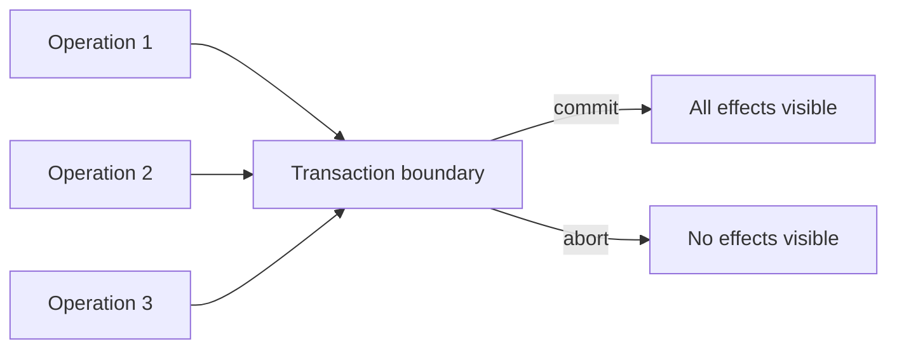

这不是说数据库内部真的瞬间完成所有步骤，而是通过日志、并发控制和恢复协议，限制外部能观察到的结果。

### 0.2 单数据库与分布式事务的差别

同一个关系数据库内部：

- 一个 transaction manager；
- 一个 WAL/恢复系统；
- 一个 concurrency-control domain；
- 一个 commit decision。

跨多个 data stores/services：

- 每个参与者独立 crash/recover；
- 网络消息可能丢失、延迟、重复；
- 某参与者成功时另一个可能失败；
- 没有天然共享日志与锁管理器；
- commit decision 必须传播且不可反悔。

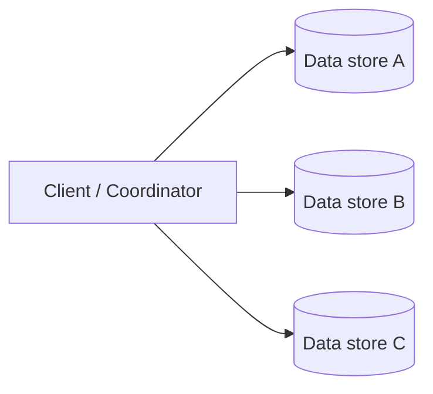

分布式事务的核心难题是：**怎样让多个独立故障域共同表现为一次原子决定。**

### 0.3 本章的四层问题

| 层次 | 主要问题 | 机制 |
| --- | --- | --- |
| 业务正确性 | 转账不能凭空创造/销毁资金 | transaction 中的 invariant 检查 |
| 并发隔离 | 并发事务不能产生非法 race | isolation level、2PL、OCC、MVCC |
| 单参与者恢复 | crash 后如何 undo/redo | WAL |
| 跨参与者原子决定 | 所有参与者 commit 或全部 abort | 2PC + durable state |

NewSQL 再把这些层与 partitioning、state machine replication 和分布式时间组合。

## 1. ACID

### 1.1 银行转账案例

从账户 A 向账户 B 转账 $m$：

```text
withdraw(A, m)
deposit(B, m)
```

若 withdraw 成功而 deposit 失败，资金消失；若重试 deposit 两次，资金被创造。正确结果只有：

```text
(A-m, B+m)  // commit
or
(A, B)      // abort
```

因此两步必须置于同一个 transaction。

### 1.2 Atomicity

Atomicity 保证 transaction 不留下 partial effects：

$$
Outcome(T)\in\{Commit(AllEffects),Abort(NoEffects)\}
$$

无论失败来自：

- 应用异常，如除零；
- 约束检查失败；
- 进程 crash；
- 主机重启；
- 执行到一半主动 abort；

数据库都要撤销未提交变化，或在恢复时完成已提交变化。

Atomicity 不是“操作不并发”；那是 isolation。它也不是“数据写入磁盘不丢”；那是 durability。

### 1.3 Consistency

ACID C 表示 application-level invariants 在 committed transaction 边界保持成立。若事务前 committed state 合法，且事务逻辑与约束正确，则 commit 后状态仍合法；数据库不会自动理解任意业务 invariant：

$$
Invariant(S_{before})\land CorrectTransaction
\Longrightarrow Invariant(S_{after})
$$

转账 invariant：

$$
A_{before}+B_{before}=A_{after}+B_{after}
$$

数据库可以通过 constraints 辅助：

- primary/foreign key；
- unique；
- check；
- not null。

但很多业务 invariant 仍由开发者定义和维护。

### 1.4 ACID C 与 consistency model C 不同

| ACID consistency | Distributed consistency model |
| --- | --- |
| 应用 invariant 是否保持 | observers 允许看到哪些 histories |
| 依赖 transaction logic 与约束 | 如 linearizability、causal、eventual |
| “正确状态到正确状态” | “读写可见顺序” |

原章指出两者没有直接关系，后续不再把 ACID C 作为机制重点。

### 1.5 Isolation

Isolation 让并发 transaction 的效果看起来像彼此隔离，避免 race conditions。最强常见目标 serializability 要求并发 history 等价于某个串行 history。

Isolation 不要求数据库真的逐个执行事务；它允许内部并发，只限制可观察结果。

### 1.6 Durability

transaction 一旦向客户端报告 committed，变化在 crash 后仍存在。

单磁盘持久化只能防进程 crash，不能防：

- 磁盘永久损坏；
- 主机丢失；
- 机房故障；
- 静默数据损坏。

原章因此联系 Chapter 10：更强 durability 需要 replication、校验与恢复副本。

### 1.7 ACID 四项如何配合

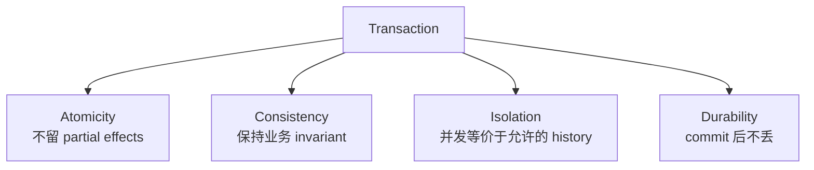

它们是不同承诺：一个系统可以 durable 地保存违反 invariant 的数据，也可以 atomic 地执行一个非 serializable history。

## 2. Isolation：为什么不能简单串行执行

### 2.1 Global lock 的正确与低效

最简单隔离方案：整个数据库同一时刻只运行一个事务。

```text
lock(database)
run transaction
unlock(database)
```

它容易推理，却让吞吐近似受平均串行执行时间（或全局锁平均持有时间）限制。忽略调度开销时：

$$
Throughput\lesssim\frac{1}{AverageSerialExecutionTime}
$$

端到端 transaction latency 可能还包含排队等待，不能直接拿它作服务时间分母。

事务访问互不相关数据时也无法并行，资源利用率很差。

### 2.2 并发控制的目标

允许 transaction interleave，同时使结果等价于某个合法顺序：

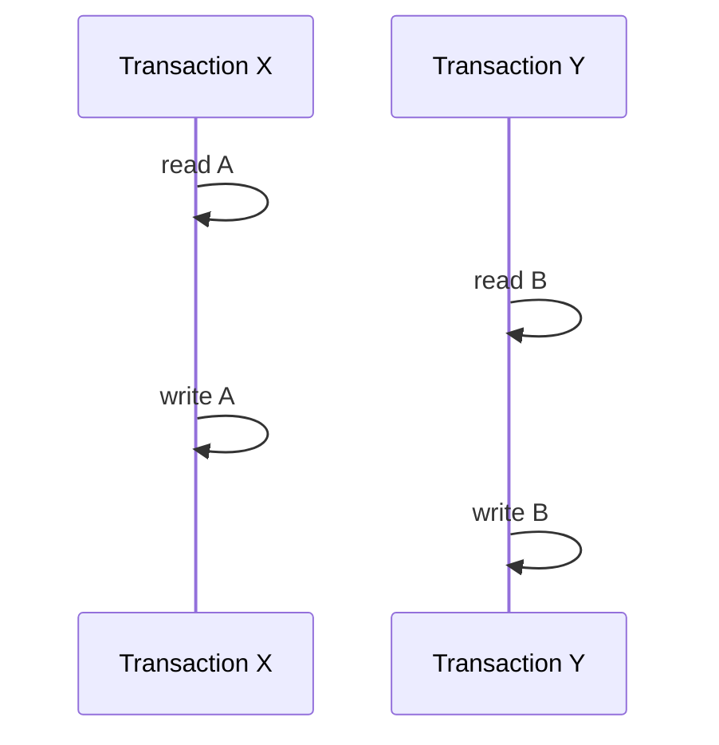

若访问集合不冲突，并发应带来吞吐；若冲突，protocol 必须等待、排序或 abort。

## 3. 四类并发异常

### 3.1 Dirty write

事务 Y 覆盖事务 X 尚未 commit 的写：

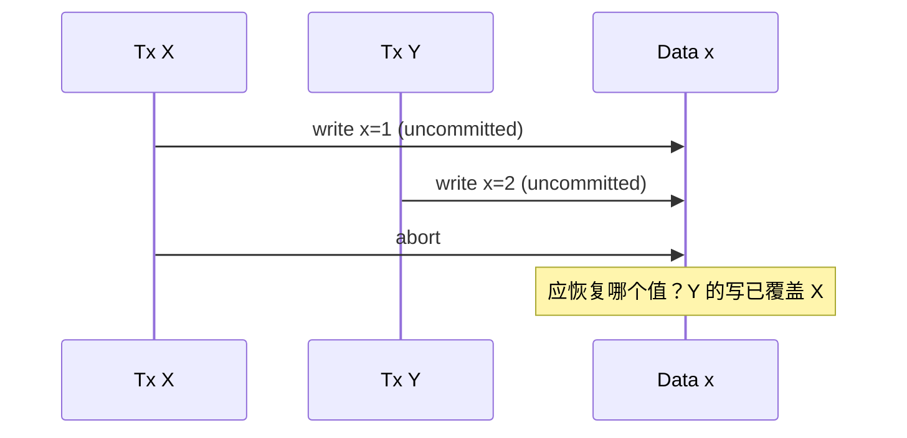

问题：rollback X 可能误删 Y 的更新，恢复语义混乱。最低隔离层通常也应禁止 dirty write。

### 3.2 Dirty read

Y 读到 X 尚未 commit 的值，随后 X abort：

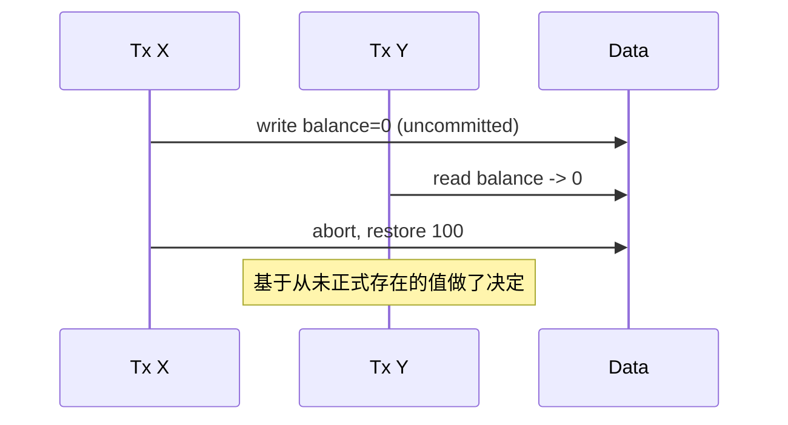

若 Y 已进一步写数据，X abort 可能迫使 Y 也 abort，形成 cascading abort。

### 3.3 Fuzzy / non-repeatable read

同一 transaction 两次读取同一 object 得到不同值：

```text
X: read product.price -> 100
Y: update price -> 120; commit
X: read product.price -> 120
```

X 的计算可能混用两个时点的 state。

### 3.4 Phantom read

X 两次执行 predicate query，中间 Y 增删/修改满足条件的 rows：

```sql
SELECT SUM(salary) FROM employees WHERE department = 'A';
```

Y 删除一名 department A employee 后，X 第二次 query 的 row set 改变，像出现/消失“phantom”。

它与 fuzzy read 的区别：

- fuzzy read：同一已读 object 的 value 改变；
- phantom：predicate 匹配的 object 集合改变。

## 4. Isolation levels

### 4.1 Figure 12.1 的层级

原图按逐步禁止异常排列：

| Isolation level | 禁止的异常（在图 12.1 简化模型中） |
| --- | --- |
| No guarantees | 无保护 |
| Read uncommitted | dirty write |
| Read committed | 再禁止 dirty read |
| Repeatable read | 再禁止 fuzzy read |
| Serializable | 再禁止 phantom，并排除所有不符合串行历史的异常 |

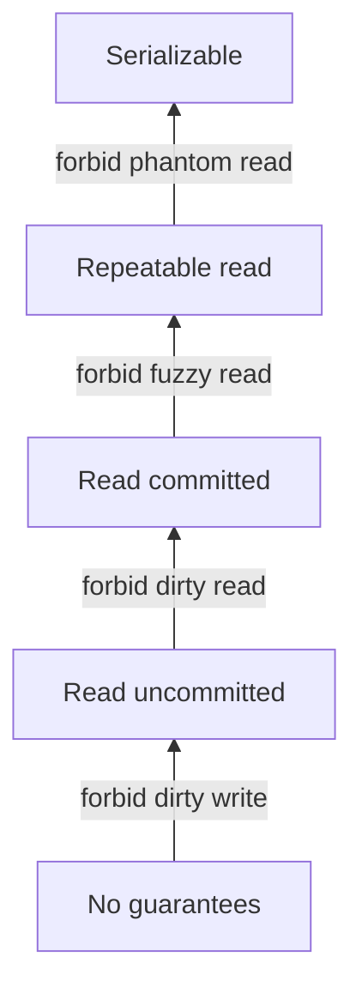

### 4.2 标准名称不保证所有产品语义相同

SQL 标准用异常定义隔离级别，但数据库实现和文档可能：

- 对同名级别提供更强/更弱保证；
- 使用 snapshot isolation；
- 允许 write skew 等图中未列异常；
- 将 repeatable read 映射为 MVCC snapshot。

不能只看到名称就推断形式语义；应查产品文档和独立验证。

### 4.3 Serializability

并发 transactions 的 committed outcome 等价于某个串行顺序：

$$
H_{concurrent}\equiv H_{serial}
$$

若 X/Y 并发，即使 X wall-clock 上先 commit，合法 serial order 仍可能是：

```text
Y then X
```

Serializability 不要求遵守 real-time order。

### 4.4 Strict serializability

Strict serializability = serializability + real-time order。若 X 完成后 Y 才开始：

$$
complete(X)<invoke(Y)\Longrightarrow X<_{serial}Y
$$

它可理解为 transaction-level serializability 与 linearizability 的实时约束结合。

### 4.5 为什么强隔离更慢

实现可能需要：

- 等锁；
- 检测 conflict；
- abort/retry；
- 跨节点协调；
- 维护更多 versions；
- 验证 serialization graph。

强模型减少合法 histories，也减少并发调度自由。

### 4.6 如何选择

原章建议有意识选择，否则数据 store 会替你默默决定。例如 PostgreSQL 默认是 read committed。原章经验法则是：不确定时选择 strict serializability。

实践还需评估产品是否支持、性能预算和 workload；不能为了吞吐降级后仍假设强语义。

## 5. Concurrency control：悲观与乐观

Concurrency-control protocol 的任务是在尽量并发的同时，保证目标 isolation。原章分两大类：

- pessimistic：先阻止可能 conflict；
- optimistic：先执行，commit 前验证。

## 6. Two-phase locking（2PL）

### 6.1 锁类型

#### Shared/read lock（S）

- 多个 readers 可同时持有；
- 阻止 writer 获得 exclusive lock。

#### Exclusive/write lock（X）

- 同一 object 只能一个 transaction 持有；
- 阻止其他 read/write locks。

兼容矩阵：

| Existing / requested | S | X |
| --- | --- | --- |
| S | compatible | conflict |
| X | conflict | conflict |

### 6.2 Lock manager

维护：

- 已授予 locks；
- owner transactions；
- waiting queues；
- wait-for graph；
- timeout/deadlock victim。

### 6.3 两个阶段

#### Growing phase

只能 acquire，不能 release。

#### Shrinking phase

只能 release，不能再 acquire。


遵守 2PL 可保证 conflict serializability。原章把它概括为 strict serializability；更精确地说，普通 2PL 主要保证 conflict serializability，是否满足 strict schedule 和 real-time external order还取决于锁释放规则与系统语义。

### 6.4 Strict 2PL

实际常至少把 write locks 持有到 commit/abort；更强实现把所有 locks 持有到结束。

收益：

- uncommitted write 不被其他 transaction 读取/覆盖；
- abort 不触发 cascading abort；
- recovery 更易推理；
- 结合 transaction admission/commit 语义可提供严格 schedule。

### 6.5 Deadlock


wait-for graph 有 cycle：

$$
X\rightarrow Y\rightarrow X
$$

两者不会自行推进。一般处理：

1. 构建/检查 wait-for graph；
2. 检测 cycle；
3. 选 victim；
4. abort victim、释放 locks；
5. 由应用/数据库重试。

还可用 lock timeout 或预防策略，但 timeout 不能精确区分 deadlock 与慢事务。

### 6.6 2PL 适合什么

冲突多、abort 后重做成本高时，提前阻塞可避免大量 wasted work。代价是 lock 管理、等待、deadlock 与 convoy。

## 7. Optimistic concurrency control（OCC）

### 7.1 假设

- conflicts 稀少；
- transactions 短；
- 先执行比先阻塞更划算。

### 7.2 三阶段直觉

1. Read/work phase：从 store 读，writes 放 local workspace；
2. Validation phase：检查 read/write sets 与并发 transactions 是否冲突，确定 serialization order；
3. Write phase：验证成功才原子发布 workspace，否则 abort/retry。

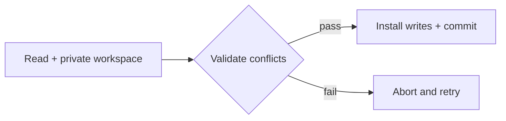

### 7.3 Timestamp 的用途

系统为 transactions 分配逻辑 timestamps/顺序，validation 判断当前 read/write sets 是否能嵌入该 serial order。不是简单比较 wall-clock 谁早。

### 7.4 OCC 为什么仍使用锁/latch

OCC 不要求 transaction 长期持有逻辑 record locks，但数据库内部结构仍并发共享。Validation/install 时需要短期 physical locks/latches：

- 保护 transaction table；
- 原子检查版本；
- 安装 writes；
- 更新 indexes。

Logical lock 保护 transaction semantics；latch 保护内存/存储引擎数据结构，生命周期短且通常不参与用户 deadlock 语义。

### 7.5 适合与不适合

适合：

- read-heavy；
- write sets 分散；
- conflict 概率低；
- transaction 短、重试便宜。

高冲突时，很多 transaction 做完大部分工作才 abort，吞吐可能崩塌。

若单次成功概率为 $1-p$，每次尝试成本近似 $C$，独立重试下期望尝试数：

$$
E[Attempts]=\frac{1}{1-p}
$$

期望工作量：

$$
E[Cost]\approx\frac{C}{1-p}
$$

$p=0.5$ 时平均两次；$p=0.9$ 时平均十次。现实 conflict 并不独立，重试可能同步冲突，需 backoff/jitter。

## 8. MVCC

### 8.1 为什么读事务不该被写阻塞/中止

原文有一处上下文显然应为“2PL 中 read-only transaction 可能等 shared lock”，而不是“2PC”；2PC 是原子提交协议，不负责本地锁隔离。

OCC 中 read-only transaction 也可能因所读值被覆盖而 validation fail。由于读事务通常很多，理想目标是读稳定 snapshot，不阻塞 writers，也不因 writer conflict abort。

### 8.2 多版本思想

每次 write 创建新 version，而不原地销毁旧 version：

```text
x@T1 = 10
x@T2 = 20
x@T3 = 30
```

read-only transaction 在 start timestamp $TS_j$ 读取：

$$
visible(x,TS_j)=\max\{version(x,t)\mid t\le TS_j\land committed\}
$$

它看到 immutable consistent snapshot。

### 8.3 与 writers 的关系

MVCC 主要优化 readers。Write transactions 仍需：

- 2PL；或
- OCC；或
- serialization validation；

处理 write/write、predicate 和 invariant conflicts。MVCC 本身不自动保证 serializability；常见 snapshot isolation 仍可能 write skew。

### 8.4 原章 MVCC + 2PL 例子

write transaction：

- 用 2PL 锁住要 read/write 的 objects；
- commit 时获得唯一 $TC_i$；
- 新 versions 标记 $TC_i$。

read-only transaction 获得 $TS_j$，读取所有：

$$
commitTimestamp\le TS_j
$$

的最新 committed versions。

若：

$$
TS_j\ge TC_i
$$

则 snapshot 应包含 transaction $i$ 的全部 committed changes，而不是只看到其中一部分。

原章用“同一时刻只有一个 transaction commit”简化 timestamp 分配；现代 MVCC 可并发 commit，但必须保证 timestamp/visibility 与 atomic commit 一致。

### 8.5 Version garbage collection

旧 versions 不能永久保留。删除前必须确认：

- 没有 active snapshot 仍可能读取；
- replication/recovery 不再需要；
- long-running transaction 有上限或受监控。

长事务会阻止 vacuum，导致 storage amplification。

## 9. 对象级 OCC：version + CAS

原章强调这是分布式应用中应掌握的有限 OCC。

### 9.1 流程

```text
value, version = read(key)          // version 42
new_value = compute(value)
CAS(key, expected_version=42,
         new_value,
         new_version=43)
```

成功条件：

$$
currentVersion=42
$$

比较与写入必须原子。否则 read-check-write 仍有 race。

### 9.2 失败处理

CAS fail 表示 state 已变化：

- 重新读取；
- 重新计算；
- 有界重试；
- 或向用户返回 conflict。

不能在不重读的情况下盲目重发旧 computed value。

### 9.3 ABA 问题

只比较 value 可能经历 A→B→A，误以为没变化。单调 version 42→43→44 能发现中间更新，即使最终 value 又回 A。

## 10. Isolation 方法对比

| 机制 | 冲突策略 | 读路径 | 高冲突表现 | 主要代价 |
| --- | --- | --- | --- | --- |
| 2PL | 先锁后执行 | 可能等锁 | 避免重做但等待多 | deadlock、lock manager |
| OCC | 先执行后验证 | 无长期锁 | 大量 abort/retry | wasted work |
| MVCC | 读旧 version snapshot | 通常不阻塞 | writers 仍需 2PL/OCC | 多版本存储与 GC |
| Version CAS | 单对象 commit 时验证 | 普通 read | 热 key 冲突重试 | 只覆盖单对象/有限操作 |

## 11. Atomicity：单数据库如何恢复

### 11.1 两种 transaction outcome

```text
COMMIT -> all changes remain
ABORT  -> all changes rolled back
```

Atomicity 要在进程随时 crash 的情况下维持该二分。

### 11.2 Write-ahead log（WAL）

write-ahead 的核心规则不是“修改内存 page 前必须 flush WAL”。数据库可以先修改 buffer page；但在该 data page 落盘前，描述它的 WAL 必须先 durable。向客户端报告 commit 前，commit record 也必须 durable。

概念 log entry 包含：

- transaction ID；
- object/page ID；
- old value（undo）；
- new value（redo）；
- record type/LSN。

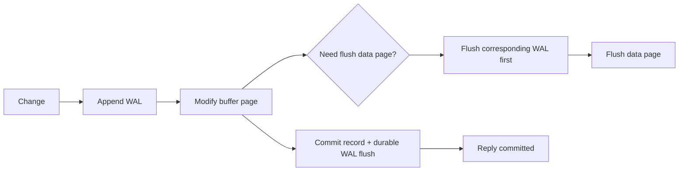

实际数据库可能使用 physiological logging、steal/no-force buffer policy 等，原章用 old/new value 建立 undo/redo 直觉。

### 11.3 Undo 与 redo

- uncommitted transaction 的 data page 已落盘：recovery 用 old value undo；
- committed transaction 的 data page 尚未落盘：recovery 用 new value redo；
- commit record 未 durable：不能向客户端宣称 durable commit。

WAL 支持 Atomicity 和 Durability，但只覆盖该数据库管理的状态。

## 12. 跨存储原子性问题

银行 A/B 各有独立数据库：

```text
DB_A: withdraw 30 -> commit
DB_B: deposit 30  -> failure
```

两个本地 ACID transactions 各自正确，组合仍不原子。需要一个 atomic commit protocol 让两者做同一决定。

## 13. Two-phase commit（2PC）

### 13.1 角色

- coordinator：发起并记录全局决定；
- participants：各自管理本地 transaction/resource；
- client 可以充当 coordinator，但生产系统通常需要 durable/recoverable coordinator。

### 13.2 Phase 1：prepare / voting

coordinator：

```text
send PREPARE(tx) to all participants
```

participant 收到后：

1. 执行本地 transaction 到可提交点；
2. 检查 constraints/locks/resources；
3. durable 记录 PREPARED；
4. 保留 commit 所需 locks/state；
5. 回复 YES；

或 durable abort/reply NO。

### 13.3 Phase 2：decision

若所有 participants YES：

```text
coordinator durably records COMMIT
send COMMIT to all
```

若任一 NO 或 prepare timeout：

```text
coordinator durably records ABORT
send ABORT to all
```

participants durable 执行决定、释放 locks、回复 DONE；coordinator 重试 decision 直到送达。

### 13.4 Figure 12.2

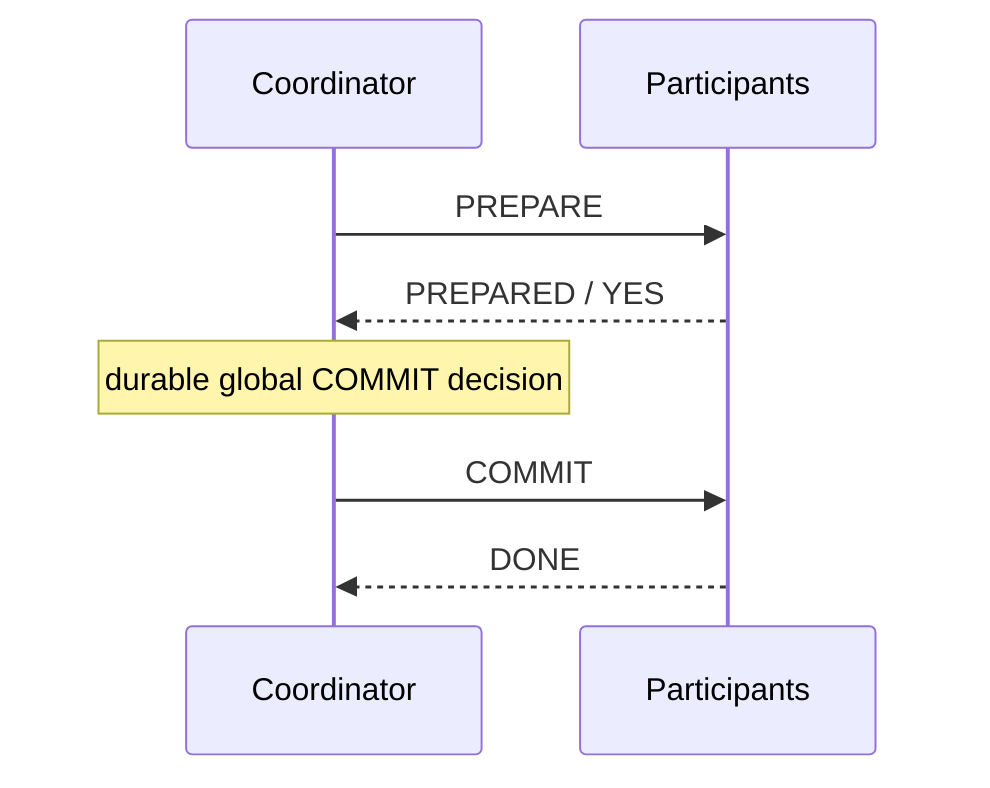

abort 路径在任一 NO/timeout 后发送 ABORT。

## 14. 两个 point of no return

### 14.1 Participant prepared

participant 回复 YES 前必须 durable 保存足够状态。从此：

- 不能自行 abort；
- 必须有能力将来 commit；
- locks/resources 不能随意释放；
- coordinator 失联时只能等待或通过恢复协议查决定。

这是 2PC blocking 的根源。

### 14.2 Coordinator decision

coordinator durable 写下 COMMIT/ABORT 后不能改变。即使某 participant 暂时 down，也必须持续重发同一 decision。

若 coordinator 在决定持久化前 crash，可以按日志恢复并重新收集/选择允许决定；若决定已持久化，恢复后只能继续传播。

### 14.3 为什么 decision 必须 durable 后再发

若先发 COMMIT 给 P1，再 crash 丢失内存决定，恢复后发 ABORT 给 P2，就产生 split outcome。正确顺序：

```text
persist decision -> send decision
```

## 15. 2PC 故障矩阵

| 故障点 | 可恢复行为 |
| --- | --- |
| participant prepare 前 crash | coordinator timeout，决定 abort |
| participant 回复 NO | coordinator abort all |
| participant YES 后 crash | recovery 读 PREPARED，等待同一决定 |
| coordinator 收齐 YES 前 crash | 从 durable state 恢复；未决定 participants 可能等待 |
| coordinator durable COMMIT 后 crash | 恢复后继续广播 COMMIT |
| COMMIT message 丢失 | coordinator retry；participant decision idempotent |
| DONE 丢失 | coordinator 重发；participant 重复确认 |

### 15.1 2PC 为什么慢

无故障网络粗略至少：

$$
Latency_{2PC}\gtrsim RTT_{prepare}+RTT_{decision}+DurableLogFlushes
$$

参与者还可能长时间持锁，增加 contention。

### 15.2 为什么会阻塞

prepared participant 不知道全局决定：

```text
all YES? -> perhaps COMMIT
someone NO? -> ABORT
coordinator decided but message lost? -> unknown
```

为保证 atomicity，它不能猜。coordinator/相关参与者恢复前，事务可能阻塞。

### 15.3 2PC 与 2PL 不同

| 2PC | 2PL |
| --- | --- |
| atomic commit protocol | concurrency-control protocol |
| prepare + decision phases | growing + shrinking lock phases |
| 保证 participants 同一 commit/abort | 保证 serializable schedule |
| 可能因 coordinator failure 阻塞 | 可能 deadlock |

分布式 transaction 常同时使用两者：2PL 持有隔离 locks，2PC 决定全局 commit。

### 15.4 参与者必须实现协议

不能把任意两个不支持 prepare/durable decision 的 stores 拼成 2PC。participants 必须支持：

- prepare state；
- durable recovery；
- idempotent commit/abort；
- lock/resource retention；
- transaction ID 查询。

## 16. 标准 C11 示例：两参与者 2PC 状态机

### 16.1 示例目标

程序模拟：

- 两个账户参与 transfer；
- participants stage delta 并 prepare；
- 全部 YES 才 commit；
- 不足余额导致全局 abort；
- 重复 COMMIT decision 幂等，不重复扣款；
- prepared participant 不能自行改为 abort。

它只模拟协议状态，不实现 WAL、网络、锁和 coordinator replication。

### 16.2 完整代码

```c
#include <assert.h>
#include <stdbool.h>
#include <limits.h>
#include <stdio.h>

typedef enum {
    PARTICIPANT_IDLE,
    PARTICIPANT_PREPARED,
    PARTICIPANT_COMMITTED,
    PARTICIPANT_ABORTED
} ParticipantState;

typedef enum {
    DECISION_UNDECIDED,
    DECISION_COMMIT,
    DECISION_ABORT
} Decision;

typedef struct {
    int balance;
    int staged_delta;
    unsigned int transaction_id;
    ParticipantState state;
} Participant;

typedef struct {
    Decision decision;
    bool source_delivered;
    bool destination_delivered;
} TransactionOutcome;

static bool checked_add(int left, int right, int *result) {
    if ((right > 0 && left > INT_MAX - right) ||
        (right < 0 && left < INT_MIN - right)) {
        return false;
    }
    *result = left + right;
    return true;
}

static bool prepare(Participant *participant,
                    unsigned int transaction_id,
                    int delta) {
    int resulting_balance;
    if (participant->state == PARTICIPANT_PREPARED &&
        participant->transaction_id == transaction_id &&
        participant->staged_delta == delta) {
        return true;
    }
    if (transaction_id == 0 ||
        participant->state != PARTICIPANT_IDLE ||
        participant->transaction_id != 0) {
        return false;
    }

    participant->transaction_id = transaction_id;
    if (!checked_add(participant->balance, delta, &resulting_balance) ||
        resulting_balance < 0) {
        participant->staged_delta = 0;
        participant->state = PARTICIPANT_ABORTED;
        return false;
    }
    participant->staged_delta = delta;
    participant->state = PARTICIPANT_PREPARED;
    return true;
}

static bool apply_decision(Participant *participant,
                           unsigned int transaction_id,
                           Decision decision) {
    if (participant->transaction_id != transaction_id) {
        return false;
    }
    if (decision == DECISION_COMMIT) {
        if (participant->state == PARTICIPANT_COMMITTED) {
            return true;
        }
        if (participant->state != PARTICIPANT_PREPARED) {
            return false;
        }
        if (!checked_add(participant->balance,
                         participant->staged_delta,
                         &participant->balance)) {
            return false;
        }
        participant->state = PARTICIPANT_COMMITTED;
        return true;
    }
    if (decision == DECISION_ABORT) {
        if (participant->state == PARTICIPANT_ABORTED) {
            return true;
        }
        if (participant->state != PARTICIPANT_IDLE &&
            participant->state != PARTICIPANT_PREPARED) {
            return false;
        }
        participant->staged_delta = 0;
        participant->state = PARTICIPANT_ABORTED;
        return true;
    }
    return false;
}

static TransactionOutcome transfer(Participant *source,
                                   Participant *destination,
                                   unsigned int transaction_id,
                                   int amount) {
    TransactionOutcome outcome = {DECISION_UNDECIDED, false, false};
    bool source_ready;
    bool destination_ready;

    if (amount <= 0 || amount == INT_MIN) {
        return outcome;
    }
    source_ready = prepare(source, transaction_id, -amount);
    destination_ready = prepare(destination, transaction_id, amount);
    outcome.decision = source_ready && destination_ready
        ? DECISION_COMMIT : DECISION_ABORT;

    outcome.source_delivered =
        apply_decision(source, transaction_id, outcome.decision);
    outcome.destination_delivered =
        apply_decision(destination, transaction_id, outcome.decision);
    /* A durable coordinator would retry any failed delivery. */
    return outcome;
}

int main(void) {
    Participant source = {.balance = 100};
    Participant destination = {.balance = 50};
    Participant poor_source = {.balance = 20};
    Participant other_destination = {.balance = 10};
    TransactionOutcome outcome;
    bool delivered;

    outcome = transfer(&source, &destination, 1, 30);
    if (outcome.decision != DECISION_COMMIT ||
        !outcome.source_delivered || !outcome.destination_delivered ||
        source.balance != 70 || destination.balance != 80) {
        return 1;
    }

    delivered = apply_decision(&source, 1, DECISION_COMMIT);
    if (!delivered) {
        return 1;
    }
    delivered = apply_decision(&destination, 1, DECISION_COMMIT);
    if (!delivered) {
        return 1;
    }
    if (source.balance != 70 || destination.balance != 80) {
        return 1;
    }

    outcome = transfer(&poor_source, &other_destination, 2, 30);
    if (outcome.decision != DECISION_ABORT ||
        !outcome.source_delivered || !outcome.destination_delivered ||
        poor_source.balance != 20 || other_destination.balance != 10) {
        return 1;
    }

    printf("tx1=COMMIT balances=%d,%d\n",
           source.balance,
           destination.balance);
    printf("tx2=ABORT balances=%d,%d\n",
           poor_source.balance,
           other_destination.balance);
    return 0;
}
```

预期输出：

```text
tx1=COMMIT balances=70,80
tx2=ABORT balances=20,10
```

### 16.3 代码局限

- prepare/decision 没有 durable log；
- coordinator 不保存 decision；
- 无网络消息、timeout、retry loop 和 duplicate transaction GC；
- participant 只支持一个 transaction；
- `transfer` 同步调用 participants，不能模拟 crash；
- 生产 2PC 必须先 durable decision 再传播；
- `TransactionOutcome` 分开表示 global decision 与每个 participant 的 delivery status；真实 coordinator 要持久化这些 delivery progress 并持续重试；
- 代码用 assert 测试纯结果，不把 protocol mutation 放进 assert。

特别地，若某 participant prepare 成功、另一个 prepare 失败，coordinator 可以决定 abort；已 prepared 者只能按照 coordinator 的 durable ABORT 释放资源，不能擅自改变决定。

## 17. Replication 如何改善 2PC 可恢复性

2PC coordinator 是单进程时，crash 会让 prepared participants 等待。可用 Raft/Paxos 复制 coordinator state：

```text
transaction id
participant list
prepare votes
global decision
delivery acknowledgments
```

新 leader 从 replicated log 恢复并继续发送同一 decision。

participants 也可各自复制 PREPARED/COMMITTED/ABORTED 状态。这样单节点故障不等于 participant 故障。

复制并不移除 2PC 的同步 round 和 lock duration，只减少单节点崩溃造成的不可恢复/长阻塞。

## 18. Atomic commit 与 uniform consensus

原章指出 atomic transaction commit 是 uniform consensus 的一种形式：即使某进程随后 faulty，已经做出的决定也必须与所有决定一致；普通 consensus 定义通常只要求 non-faulty processes 的决定一致。

这个关系依赖具体 failure/model 定义。核心工程结论：

- commit/abort 是不可反悔的全局决定；
- faulty/recovered participant 也不能得出冲突决定；
- atomic commit 的 failure requirements 不比普通 agreement 更简单；
- general consensus 可以复制 coordinator/participant state，提高整体韧性。

不要把 2PC 误称为 consensus algorithm：基础 2PC 在 coordinator failure 下会阻塞，不提供独立 non-blocking consensus liveness。

## 19. NewSQL

### 19.1 历史背景

2000 年代末许多 NoSQL stores 优先：

- horizontal scalability；
- availability；
- flexible schema；
- partitioning。

代价常是弱化传统 relational guarantees，如跨记录/分区 ACID。之后 distributed stores 开始重新加入 SQL/ACID 能力，形成 NewSQL 类别：同时追求 relational transaction semantics 与 scale-out architecture。

### 19.2 Spanner 的层次

Google Spanner：

1. key-value data 按 range/partition 分片；
2. 每个 partition 用跨数据中心 Paxos group 复制；
3. 每组一个 leader 处理 writes；
4. leader 把 write 复制到 group majority 后 apply；
5. leader 兼 lock manager，用 2PL 隔离 write transactions；
6. 跨 partitions 用 2PC；
7. MVCC 让 read-only transaction 读取 consistent snapshot；
8. TrueTime 提供带不确定界的时间；
9. commit wait 支持 external consistency/strict serializability。

## 20. Figure 12.3：四种机制各管一层

原图三 partitions、每 partition 三 replicas。一个 partition leader 是 2PC coordinator，其余 partition leaders 是 participants。

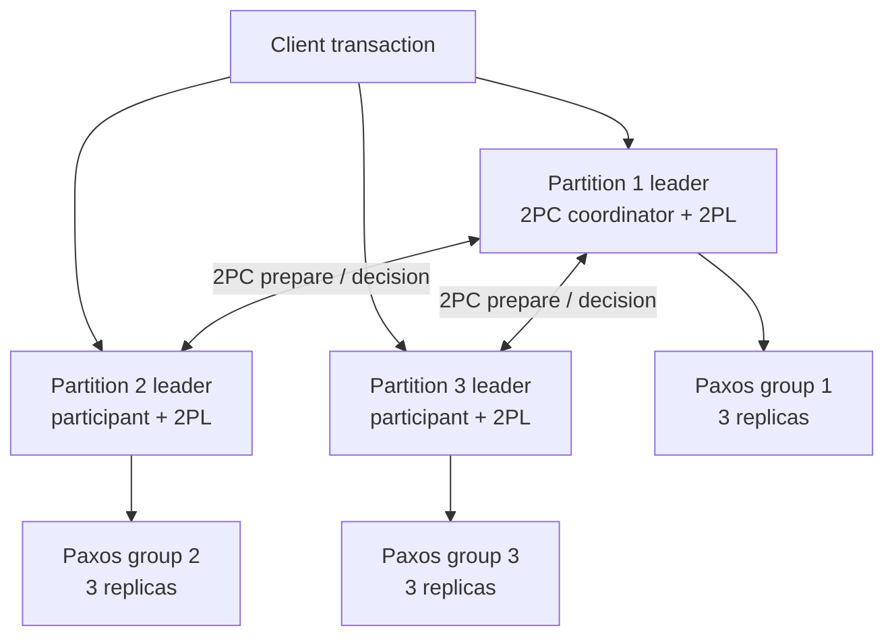

| 机制 | 解决的问题 |
| --- | --- |
| Partitioning | 数据和负载超过单机 |
| Paxos/SMR | 每个 participant/coordinator 单节点故障 |
| 2PL | 并发 write transactions 的 isolation |
| 2PC | 跨 partitions 的 atomic commit |
| MVCC | lock-free consistent snapshot reads |
| TrueTime + commit wait | transaction real-time order |

这些机制互补，不能相互替代。

## 21. Replicated coordinator 与 participants

coordinator 把 transaction state 写入本地 WAL，而 WAL 由其 Paxos group 复制。leader crash 后：

```text
group elects new leader
-> replay replicated transaction state
-> resume 2PC coordinator
```

participant 同样把 PREPARED/decision 写进本组 replicated log。新 leader 恢复本 participant 职责。

这把“process failure”转化为“replication group 仍有 quorum 时角色切换”，显著降低基础 2PC 的单节点阻塞风险。

## 22. Spanner isolation：MVCC + 2PL

### 22.1 Read-only transactions

- 选择 snapshot timestamp；
- 读取不晚于该 timestamp 的 committed versions；
- 不需要获取 write locks；
- 不与 concurrent writers 相互阻塞；
- 多 partition 看到同一个 consistent snapshot。

### 22.2 Read-write transactions

- partition leaders 使用 2PL 获取 locks；
- 在 2PC prepare 后继续保留 locks；
- 全局 commit/abort 后释放；
- 为新 versions 分配 commit timestamp。

2PC blocking 与 2PL lock retention 叠加，是跨分区长事务昂贵的原因之一。

## 23. TrueTime uncertainty interval

### 23.1 API 语义

TrueTime 不声称返回一个精确瞬间，而返回：

$$
TT.now()=[t_{earliest},t_{latest}]
$$

并保证真实绝对时间位于区间：

$$
t_{earliest}\le t_{real}\le t_{latest}
$$

区间总宽度记为 $w$：

$$
w=t_{latest}-t_{earliest}=2\epsilon
$$

Spanner 论文/资料常用 $\epsilon$ 表示围绕中心估计的半宽，而原章直接讨论 $t_{latest}-t_{earliest}$ 这一等待区间。原章指出 clock uncertainty 通常小于 10 ms；引用具体数值时必须先确认采用半宽还是总宽口径。

### 23.2 为什么 centralized timestamp oracle 有瓶颈

单一 timestamp service 可以分配全序，但：

- 所有 transaction 依赖一个服务；
- 跨地域 RTT；
- 容量和故障域集中。

TrueTime 用各数据中心 GPS/atomic clocks 和频繁同步，让节点本地获得有界 uncertainty。

## 24. Commit timestamp 与 commit wait

### 24.1 选择 timestamp

沿原章的概念化描述，coordinator 选择：

$$
s\ge TT.now().latest
$$

实际协议还要满足 participant prepare timestamps 等下界；这里强调 $s$ 不早于当前真实时间估计的上界。

### 24.2 等待不确定性过去

不能选择 $s$ 后立即对外报告 commit。应等待直到：

$$
TT.now().earliest>s
$$

此时真实时间确定已越过 $s$，再释放 locks/返回 commit。原章把等待近似描述为：

$$
t_{latest}-t_{earliest}
$$

更精确实现以 `TT.after(s)`/当前区间判断，因 uncertainty 可能随时间变化。

### 24.3 为什么保持 real-time order

若 transaction $T_1$ 已向 client 返回 committed，之后 $T_2$ 才开始，则 commit wait 保证真实时间已经超过 $s_1$。$T_2$ 获得的 timestamp 必须晚于 $s_1$：

$$
complete(T_1)<invoke(T_2)\Longrightarrow s_1<s_2
$$

因此 serial order 与 external real-time order 一致，即 strict serializability/external consistency。

### 24.4 性能代价

uncertainty 越宽，commit wait 越长。但 commit wait 可与 Paxos/2PC 的一部分工作重叠，不能无条件把两者全部相加。若 $C_{nonoverlap}$ 是不能重叠的协调成本，$C_{overlap}$ 是可与等待并行的协调路径，则粗略关键路径可写为：

$$
CommitLatency\gtrsim C_{nonoverlap}
+\max(C_{overlap},CommitWait)
$$

所以 Spanner 投资 GPS、atomic clocks 和同步基础设施，尽量缩小 uncertainty；原章给出的典型数值是小于 10 ms，但具体口径和运行状态应以系统指标为准。

### 24.5 Hybrid logical clocks

原章提到 CockroachDB 等系统使用 HLC：

```text
(physical component, logical component)
```

physical 部分贴近 wall time，logical 部分在时钟重叠/回退时保持因果单调。HLC 并不意味着没有时钟误差或无需并发控制；具体 external consistency 机制应按产品协议理解。

## 25. 机制关系总表

| 机制 | Atomicity | Isolation | Durability | Real-time order | Scale/fault tolerance |
| --- | --- | --- | --- | --- | --- |
| WAL | 单库恢复 | 否 | 单设备 crash recovery | 否 | 否 |
| 2PL | 否 | 普通 2PL：conflict serializability；strict 2PL：strict schedule | 否 | 视完整系统 | contention |
| OCC | 否 | Validation 后 serializable | 否 | 视完整系统 | 低冲突有效 |
| MVCC | 否 | Snapshot；writers 需额外协议 | 否，持久性依赖 WAL/存储 | 否 | 提高读并发 |
| 2PC | 跨 participants commit | 否 | 依赖参与者日志 | 否 | blocking |
| Paxos/Raft | 复制决定 | 间接 | 副本容错 | 否 | quorum |
| TrueTime wait | 否 | 辅助 strict serializable | 否 | 是 | 增加 latency |

## 26. 容易混淆的概念与常见误区

### 26.1 Atomicity 与 isolation

Atomicity 解决 partial failure；isolation 解决 concurrent interference。一个事务可 atomic 但与另一个产生 write skew。

### 26.2 ACID consistency 与 linearizability

前者是 invariant，后者是 real-time read/write history。名字相同，不是同一保证。

### 26.3 2PL 与 2PC

2PL 的两阶段是 acquire/release locks；2PC 的两阶段是 prepare/decision。一个保证隔离，一个保证跨参与者原子决定。

### 26.4 Serializability 与 strict serializability

Serializable 只需等价某串行顺序；strict 还尊重事务实际完成/开始的 real-time order。

### 26.5 Strict 2PL 与“两个 phase”

Strict 指 locks 持有到 commit/abort，避免 dirty/cascading；不是第三个网络 phase，也不是 2PC。

### 26.6 OCC 与 CAS

完整 OCC 验证 transaction read/write sets；CAS 是单对象有限形式，只保护一个 expected version 条件。

### 26.7 MVCC 与 serializability

MVCC 是多版本框架，不自动保证 serializability。Snapshot isolation 可能允许 write skew；writers 仍需 2PL/OCC/SSI 等。

### 26.8 WAL 与 replication

WAL 让一个 database crash 后恢复；replication 防单设备/节点永久丢失。WAL 本身不是跨 store 原子协议。

### 26.9 Prepare success 与 commit success

YES 只表示 participant 已 durable prepared、承诺服从未来决定；transaction 尚未 commit，locks 通常仍持有。

### 26.10 Timeout 与 abort

prepare 阶段 coordinator 可因 NO/timeout 决定 abort；participant 一旦 YES，不能因本地 timeout 自行 abort，否则可能与 coordinator COMMIT 冲突。

### 26.11 2PC 与 consensus

2PC 在 coordinator failure 下会阻塞，不是独立 non-blocking consensus；复制 coordinator 可以用 consensus 提升恢复能力。

### 26.12 TrueTime 与精确时钟

TrueTime 的价值是显式返回 uncertainty interval，而不是假装时钟无误差；commit wait 把时间不确定性转化为 latency。

## 27. 本章知识结构

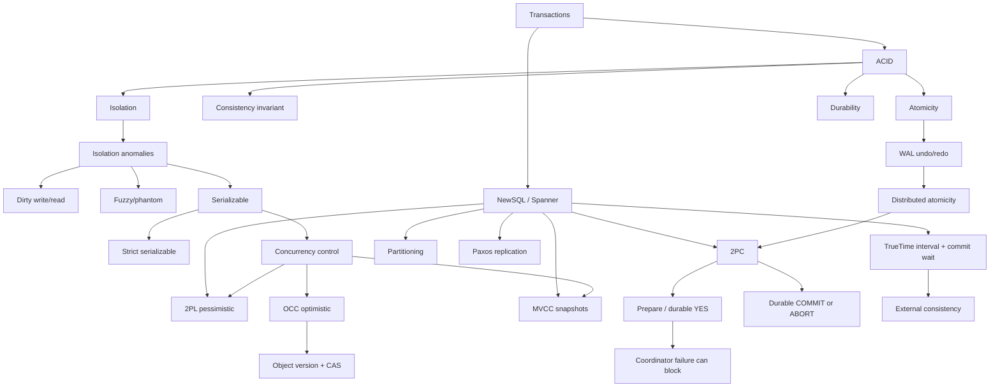

## 28. 核心结论

1. **Transaction 把多步操作包装成 commit-all 或 abort-all 的逻辑单元。** 跨独立 stores 时实现显著更难。
2. **Atomicity、Consistency、Isolation、Durability 是不同承诺。** 不能相互替代。
3. **ACID C 指业务 invariant，不是 linearizability/eventual consistency。**
4. **并发会产生 dirty write/read、fuzzy read 和 phantom read。** Isolation level 通过禁止不同异常定义保护强度。
5. **Serializability 等价于某串行执行，但不要求 real-time order。** Strict serializability 再加入 real-time。
6. **2PL 用 shared/exclusive locks 和 growing/shrinking phases 保证 conflict serializability。** Strict 2PL 持锁到结束，避免 cascading abort。
7. **2PL 可能 deadlock。** 需检测 wait-for cycle 并 abort victim。
8. **OCC 先执行到 private workspace，commit 时验证。** 低冲突高效，高冲突浪费重做。
9. **OCC 仍使用短期 physical latches。** 它避免的是长期逻辑 locks，不是所有互斥。
10. **MVCC 保存多个 committed versions，让 read-only transaction 读取 immutable snapshot。** Writers 仍需 2PL/OCC 等。
11. **MVCC 不自动等于 serializable。** Snapshot isolation 仍可能 write skew。
12. **对象 version + CAS 是常用有限 OCC。** 版本不匹配必须重读重算。
13. **WAL 要求 data page 落盘前对应日志先 durable，commit 回复前 commit record durable。** 它提供单 database atomicity/durability 恢复基础。
14. **两个本地 ACID transactions 不等于一个分布式 atomic transaction。**
15. **2PC 第一阶段收集 durable PREPARED votes，第二阶段传播 durable global decision。**
16. **Participant 回复 YES 后不能自行 abort；coordinator durable 决定后不能反悔。** 这是两个 point of no return。
17. **2PC 是 blocking protocol。** Prepared participants 在 coordinator 不可达时可能长期持锁等待。
18. **Decision messages 必须幂等并持续重试。** Coordinator 必须先 durable 记录决定再发送。
19. **2PC 不提供 isolation。** 实际分布式事务常用 2PL 隔离、2PC 原子提交。
20. **复制 coordinator/participants 可容忍单节点 crash。** 它不移除两轮网络和锁等待。
21. **Spanner 每 partition 用 Paxos 复制并由 leader 管锁，跨 partitions 用 2PC。**
22. **Spanner 用 MVCC 提供 lock-free snapshot reads，用 2PL 隔离 writes。**
23. **TrueTime 返回包含真实时间的不确定区间。** Commit timestamp 取上界，并等待真实时间确定越过它。
24. **Commit wait 将时钟 uncertainty 转化为 latency，以保持 external consistency。** 不确定区间越小，事务越快。
25. **NewSQL 的复杂性来自多机制组合。** Partitioning、replication、isolation、atomic commit 和 time ordering 各自解决不同问题。

## 29. 从本章提炼出的通用解题方法

### 第一步：先写业务 invariant 与失败边界

明确哪些变化必须同成同败，状态位于一个 database 还是多个 services，partial effect 会造成什么损失。

### 第二步：枚举并发异常

构造 dirty write/read、non-repeatable、phantom、write skew history，确认选定 isolation 明确禁止哪些。

### 第三步：区分 serial order 与 real-time order

只需 serializable，还是必须 strict serializable？不要把 commit wall-clock 顺序自动当 serial order。

### 第四步：按 conflict 选择并发控制

高冲突/重做昂贵倾向 2PL；低冲突/短事务倾向 OCC；大量 reads 用 MVCC，writers 再配合正确协议。

### 第五步：在每个写步骤插入 crash

WAL 是否先 durable？commit record 是否 durable 后才回复？recovery 应 undo 还是 redo？用崩溃点验证 atomicity。

### 第六步：为跨 store 画 2PC 状态机

标出 PREPARED 与 global decision 的 durable point，列出 coordinator/participant crash、消息丢失和恢复动作。

### 第七步：不要让 prepared participant 猜决定

YES 后持有资源并等待权威决定；用 replicated coordinator 降低阻塞，而不是 timeout 后自行 abort。

### 第八步：把 mutation、隔离、commit、复制分层

2PL/OCC 管并发，2PC 管 atomic decision，Paxos/Raft 管 participant durability，MVCC 管 snapshot reads。逐层验证，不用一个缩写概括全部正确性。

### 第九步：量化协调成本

计算 lock hold time、prepare/decision RTT、WAL fsync、quorum replication、abort rate 与 commit wait；跨地域事务尤需控制参与 partitions。

### 第十步：验证产品真实语义

数据库同名 isolation level 可能与形式定义不同。用文档、history tests、fault injection 和生产指标确认，不依赖默认值与营销标签。

本章最重要的方法论是：**事务不是单一算法，而是把并发控制、故障恢复、原子决定、复制和时间顺序组合成一个端到端承诺；每一层都必须在自己的故障边界内持久、原子且可恢复。**
