> 本文严格按照原章顺序展开：先说明 2PC 为什么不适合长事务，再依次讲解 Outbox pattern、Sagas 和 Isolation，最后总结 Part II Coordination。原章把异步事务描述为通过持久消息与补偿获得原子效果；本文保留该论证主线，同时明确工程边界：消息通常是 at-least-once delivery 配合 idempotent processing，而 saga compensation 是业务补偿，不是隐藏所有中间状态的 ACID rollback。文中的状态机、容量公式、故障矩阵、伪代码和标准 C11 示例用于展开原理，不应误认为原书逐字给出的生产实现。

## 0. 本章定位：长时间跨服务操作不能一直持锁等待

### 0.1 从 Chapter 12 的 2PC 出发

2PC 是 synchronous blocking atomic-commit protocol：

- coordinator 发 PREPARE；
- participants durable 进入 PREPARED 并持有资源；
- coordinator durable 决定 COMMIT/ABORT；
- participants 收到决定后结束。

若 coordinator、participant 或网络很慢，transaction 无法推进。若同时用 2PL 提供 isolation，prepared participants 会长期持锁，其他 transactions 也被阻塞。

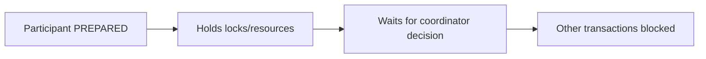

### 0.2 2PC 隐含的适用前提

原章指出：

- coordinator 和 participants 应大体可用；
- transaction 应短暂；
- participants 愿意实现 prepare/commit 协议；
- participants 愿意让外部 transaction 阻塞自己的资源。

这些假设对数据库内部、毫秒到秒级 transaction 尚可；对持续小时、天甚至人工审批的 workflow 不可接受。

State machine replication 可以改善 coordinator/participant 的节点可用性，却不能消除长事务本身的锁持有时间和跨组织阻塞，因此无法解决这一根本问题。

### 0.3 长事务为什么不能持普通数据库锁

若一个 booking workflow 持锁 24 小时：

- lock owner 可能重启或迁移；
- 数据库连接不应保持 24 小时；
- 其他用户无法访问相同资源；
- deadlock 和故障恢复成本巨大；
- 跨组织 participant 不愿被别人长期锁住；
- 运维无法安全部署和扩缩容。

事务时长由 $T$ 增长时，锁占用的并发资源数按 Little 定律近似：

$$
L=\lambda T
$$

若每秒启动 10 个 workflow，每个平均 1 小时，若全程持资源：

$$
L=10\times3600=36{,}000
$$

个平均 in-flight workflows 可能同时占锁（稳态、到达率与平均时长稳定的 Little 定律口径）。它不是最大并发数。异步设计把“等待”改成持久状态，而不是持有线程、连接和数据库锁。

### 0.4 现实世界的 cashier's check 类比

银行 A 向银行 B 转账：

1. A 从 source account 扣款并签发 cashier's check；
2. check 被物理运输；
3. B 收到后向 destination account 入账。

关键要求：

- check 不能丢；
- 同一 check 不能兑付多次；
- 两家银行不必在运输期间互相阻塞。

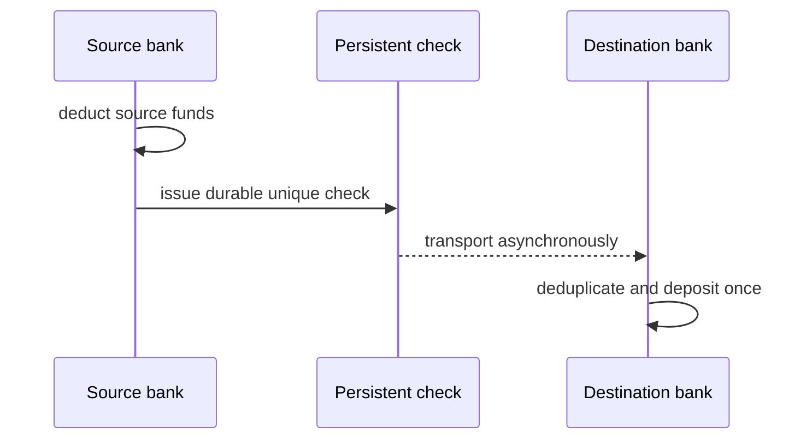

代价是运输期间：source 已扣款，destination 尚未入账，系统处于业务中间状态。

### 0.5 异步事务获得和放弃什么

获得：

- participants 不必同时在线；
- 临时故障通过 retry 吸收；
- workflow 可持续很久；
- 不需要跨系统长时间持锁；
- 每一步可独立扩展和恢复。

放弃或弱化：

- ACID isolation；
- instant visibility；
- 内部中间状态不可见；
- 统一数据库 rollback；
- 简单的单点 commit 时刻。

更准确地说，saga/outbox 追求 **eventual business completion 或 compensation**，而不是把整个 workflow 伪装成严格隔离的单数据库事务。

## 1. Persistent messages 与 exactly-once effect

### 1.1 Check 是一条 durable message

将现实类比一般化：

```text
check -> persistent message
bank -> service / participant
transport -> message channel
deposit once -> idempotent consumer
```

### 1.2 “Guaranteed exactly once” 的工程分解

原章用“messages guaranteed to be processed exactly once”建立目标。现实中常见实现是：

```text
at-least-once delivery
+ stable message ID
+ durable deduplication
+ atomic business effect + dedup record
= observable effect once
```

网络无法让 sender 知道 ACK 丢失前 message 是否已处理，所以 retry 会产生 duplicate delivery。可靠目标通常不是“处理函数物理只运行一次”，而是重复尝试只产生一次可观察业务效果。

### 1.3 三种消息语义

| 语义 | 可能丢 | 可能重复 | 典型实现 |
| --- | --- | --- | --- |
| At-most-once | 是 | 否 | 不重试或先去重 |
| At-least-once | 否（最终条件下） | 是 | 持久化 + retry + ACK |
| Exactly-once effect | 最终不丢效果 | delivery 可重复，效果一次 | at-least-once + idempotency/transaction |

### 1.4 去重记录也要和副作用原子提交

consumer 错误实现：

```text
mark message processed
crash
apply business effect
```

会漏处理；反向顺序则可能重复 effect。正确边界：

```text
BEGIN local transaction
  if message_id already processed:
      return stored result
  apply business effect
  insert processed_message(message_id, result)
COMMIT
```

这与 Chapter 5 idempotency key 是同一个原理，但只在 business effect 和 dedup record 能放入同一个原子事务时直接成立。若 effect 是 Elasticsearch 等外部系统写入，常用确定性 document ID、source aggregate version 条件写和周期 reconciliation，使重复/乱序写收敛；不能假设一个独立 inbox table 能与外部 effect 原子提交。

## 2. Outbox pattern

### 2.1 产品目录与搜索索引

原章案例：

- source of truth：关系数据库中的 product catalog；
- derived view：Elasticsearch full-text search index；
- product create/update/delete 后，两者都要更新。

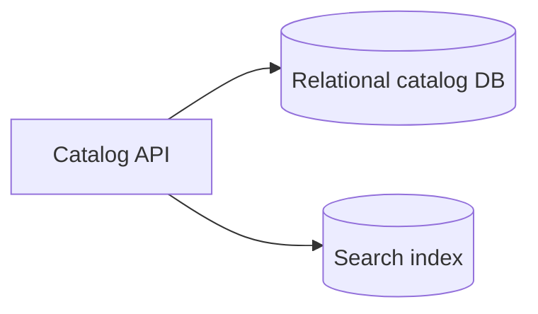

关系数据库擅长事务和权威状态，搜索系统擅长倒排索引和高级检索。复制同一数据到专用 store 是常见架构。

### 2.2 Naive dual write 的两个失败窗口

#### 先写数据库，再写搜索

```text
DB update succeeds
process crashes
search update never happens
```

#### 先写搜索，再写数据库

```text
search update succeeds
DB transaction aborts
search exposes nonexistent state
```

无论顺序如何，两次独立 remote writes 之间都有 crash window。

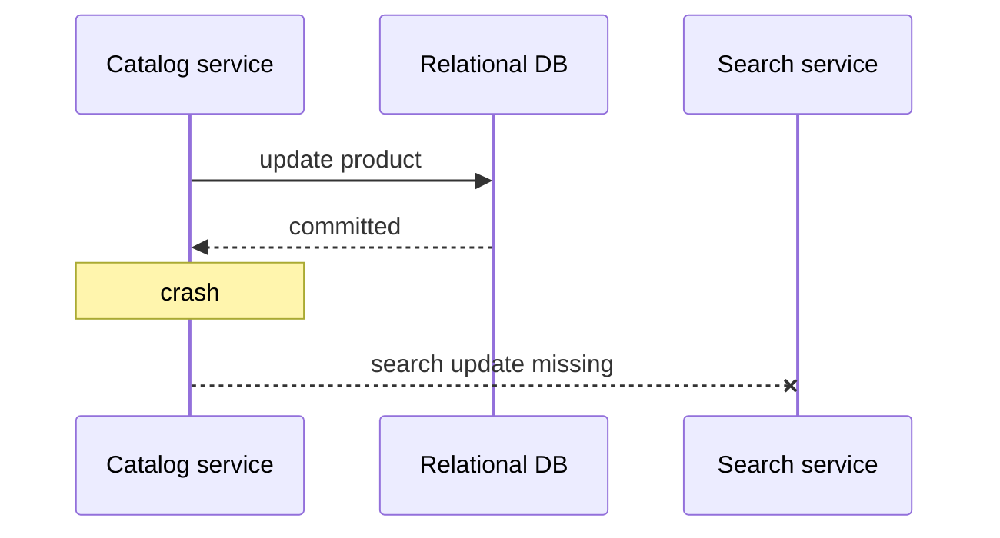

### 2.3 为什么不直接使用 2PC

- 关系数据库可能支持 XA；
- 搜索服务通常不作为 XA participant；
- 自行为搜索服务实现 prepare/recovery 很复杂；
- search 暂时 unavailable 不应阻塞 catalog writes；
- 该业务可接受 search 短暂滞后。

需求不是瞬时强一致，而是 catalog commit 后 search **最终**追上。

### 2.4 Outbox 的原子边界

在关系数据库同一个 local ACID transaction 中：

```text
UPDATE products ...
INSERT INTO outbox(message_id, aggregate_id, type, payload, created_at)
COMMIT
```

因此：

$$
Commit(ProductChange)\Longleftrightarrow Commit(OutboxMessage)
$$

如果 transaction abort，两者都不存在；如果 commit，两者都 durable 存在。

Outbox 没有原子更新 search。它原子保证的是：**权威业务变化与“将来必须传播这项变化”的意图共同提交。**

### 2.5 Outbox schema

典型字段：

```text
message_id       unique
aggregate_type   Product
aggregate_id     42
event_type       ProductUpdated
payload          serialized event
created_at
published_at / status
attempt_count
```

payload 应包含 consumer 应用 update 所需的信息，或让 consumer 能可靠回源。Schema 也需要 version/evolution。

对同一 aggregate 还应包含单调 `aggregate_version`，供 relay/consumer 检测乱序并拒绝旧 projection update。

### 2.6 Relay 工作流程

```text
loop:
  rows = claim unpublished outbox rows
  for row in rows:
    send row to destination/channel
    wait for ACK
    mark/delete row as published
```

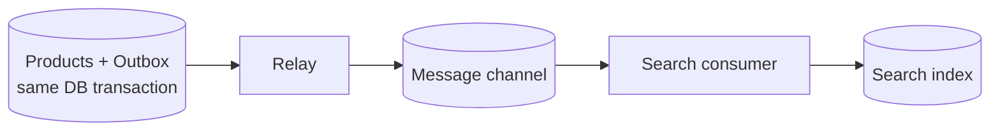

### 2.7 为什么不能发送后立即无条件删除

只有收到 durable ACK 后才能 mark/delete。否则 message 在网络/consumer 前丢失时，relay 已失去重试依据。

但 ACK 也可能丢失：

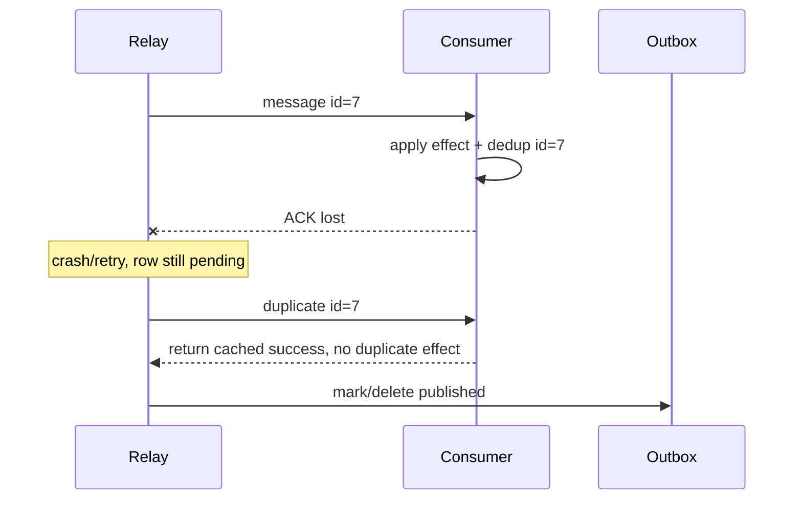

因此 relay 是 at-least-once，consumer 必须 idempotent。

### 2.8 Delete 与 mark-published

- delete row：表小，但审计和重放信息消失；
- mark published：便于审计/恢复，但需归档和清理；
- claim/lease：避免多个 relay 同时发送同一 row，但 lease 失效仍可能重复；
- `SELECT ... FOR UPDATE SKIP LOCKED` 等可做批量 worker 分工。

无论内部如何分配，都不能以为“只会一个 relay 发送”就不做 consumer dedup。

### 2.9 Message channel

实践中 relay 常不直接调用 search，而是发到 Kafka、Azure Event Hubs 等 channel：

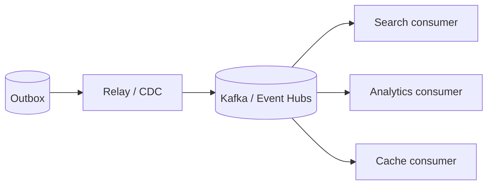

收益：

- producer 与 consumers 解耦；
- consumer 临时 down 时消息积压；
- 一条 event 支持多个 projections；
- channel 负责持久化、分区和重放。

顺序通常只在 partition/key 范围内保证，不应假设全局总序。将同一 aggregate 的 events 路由到同一 partition 只是必要条件；relay 还必须按该 aggregate 的 outbox/version 顺序发布，不能让多个 workers 先发送较新 row。Consumer 应以 `aggregate_version` 拒绝旧版本或等待缺口。

### 2.10 Relay 实现方式

#### Polling publisher

定期查询 outbox table。简单，但会增加数据库 query/load，并有 polling latency。

#### Transaction-log tailing / CDC

Debezium 等读取 database change log，把 committed outbox rows 发布。减少业务轮询，但引入 connector、offset 和 schema 运维。

二者都必须处理 duplicate、restart 和 checkpoint。

### 2.11 与 state machine replication 的关系

原章指出概念相似：

- catalog products 是 state；
- outbox 是改变 state 的 operation/event log；
- consumers 按 log 更新 derived state。

区别：outbox 通常不提供 Raft 式全副本 consensus/linearizability；它更像权威状态到异步 projection 的可靠 change propagation。

### 2.12 Outbox backlog 与恢复时间

若 relay/channel outage 持续 $T_o$ 秒，事件到达率 $\lambda$：

$$
Backlog\approx\lambda T_o
$$

恢复后消费能力 $\mu>\lambda$，排空时间近似：

$$
DrainTime\approx\frac{Backlog}{\mu-\lambda}
$$

例如 $\lambda=100$/s，down 10 分钟：

$$
Backlog=100\times600=60{,}000
$$

恢复消费 500/s，净排空 400/s：

$$
DrainTime=60{,}000/400=150\ \mathrm{s}
$$

恢复后系统仍需 2.5 分钟追平。容量规划不能只看正常流量。

## 3. Outbox 的保证与局限

### 3.1 能保证

- 本地业务变化与 outbox intent 原子提交；
- relay crash 后消息仍在；
- destination 暂时不可用时可重试；
- 配合 dedup 获得一次可观察 effect；
- 只有在 relay/channel/consumer 最终恢复、消息可被正确处理、ordering/version 规则正确且 reconciliation 可修复遗漏时，source 与 projections 才会逐步趋同。

### 3.2 不能自动保证

- search 与 DB 在每个瞬间相同；
- global event order；
- consumer 业务逻辑无 bug；
- schema 永远兼容；
- message 永远不重复；
- poison message 自动解决；
- source update 与任意 external side effect 原子完成。

### 3.3 Search API 如何面对 lag

可选策略：

- UI 显示“索引处理中”；
- 创建后详情读 primary DB，搜索允许延迟；
- 读请求携带最低 version，等待 projection 追到；
- 管理操作提供 reindex/reconcile；
- 监控 outbox age 与 consumer lag。

Eventual consistency 必须进入产品语义，而不是只在架构图上标注。

## 4. Sagas

### 4.1 为什么 outbox 还不够

旅行预订要：

```text
book flight
book hotel
```

任一步可因业务或技术原因失败。若 flight 成功、hotel 失败，需要 cancel flight。Outbox 只保证一条 change 最终传播，不表达多步骤条件分支和补偿流程。

### 4.2 Saga 定义

Saga 是 local transactions 序列：

$$
T_1,T_2,\ldots,T_n
$$

每个可能需要撤销的 $T_i$ 有 compensating transaction $C_i$。

若全部成功：

$$
T_1T_2\cdots T_n
$$

若 $T_k$ 失败，通常按逆序补偿已成功步骤：

$$
T_1T_2\cdots T_{k-1}
C_{k-1}C_{k-2}\cdots C_1
$$

逆序不是纯形式要求，但常因后续步骤依赖前面资源，逆序更易恢复。

### 4.3 Compensation 不是数据库 rollback

数据库 rollback 把未提交变化隐藏并恢复旧 state。Saga compensation 是新的、可见的业务 transaction：

```text
book flight -> booking visible
cancel flight -> cancellation visible
```

它可能：

- 收取取消费；
- 无法恢复原座位/价格；
- 触发通知；
- 自身失败；
- 需要人工处理。

所以 saga 的“atomicity”是最终业务语义：成功完成所有步骤，或执行预定义补偿达到可接受终态；不是 ACID all-or-nothing 的不可见中间状态。

### 4.4 “先假设成功，失败时道歉”

每个 $T_i$ 乐观地假设后续步骤会成功。猜错后，$C_i$ 是 apology。

现实例子：航班 overbooking 后通过改签、退款、补偿券修复。它不能抹去用户已经看到的确认，但能恢复业务可接受状态。

### 4.5 Compensability 分类

设计 saga 时可区分：

- **compensable step**：可通过业务操作抵消，如 reserve/cancel；
- **pivot step**：一旦成功就难以补偿，之后流程应只含可重试步骤；
- **retryable step**：最终必须成功，可安全重复，如幂等通知/状态推进。

原章未使用这些分类，但它们帮助安排步骤顺序：不可逆动作尽量晚做。

## 5. Travel booking saga

### 5.1 参与者

- coordinator/orchestrator：travel booking service；
- participant 1：flight service；
- participant 2：hotel service。

Local transactions：

- $T_1$：book flight；
- $T_2$：book hotel；
- $C_1$：cancel flight。

### 5.2 Figure 13.1 workflow

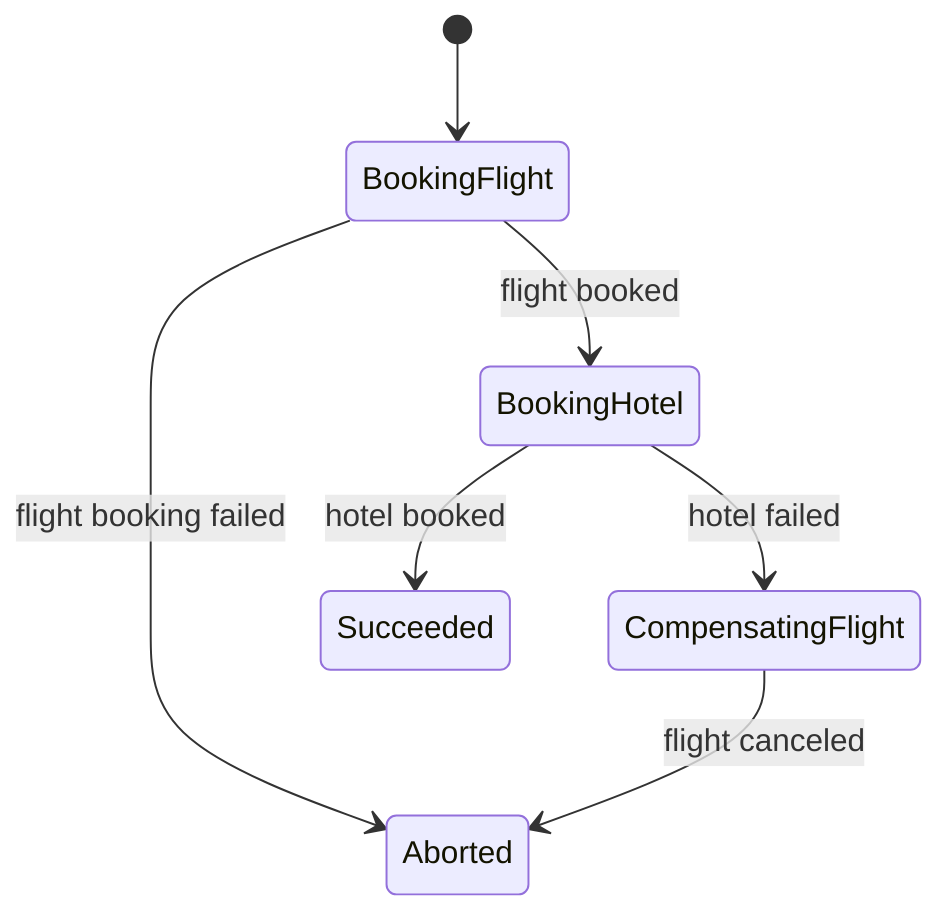

### 5.3 三步流程

1. 发送 $T_1$ 给 flight service。失败则没有之前副作用，直接 ABORTED；
2. $T_1$ 成功后发送 $T_2$ 给 hotel service。成功则 SUCCEEDED；
3. $T_2$ 失败，发送 $C_1$ cancel flight；补偿成功后 ABORTED。

### 5.4 为什么 coordinator 必须持久化状态

Workflow 跨多个消息和时间段，coordinator 可随时 crash。每次 transition 要 durable checkpoint：

```text
saga_id
current_state
completed_steps
pending_command_id
participant results
retry counters
compensation status
```

恢复时从最后 checkpoint 继续，而不是从头猜测。

### 5.5 State 与 outgoing message 仍需原子

若 coordinator：

```text
save state = BOOKING_HOTEL
crash before send T2
```

可能漏消息；若先 send 后存 state，crash 后会重发。常见解法是 coordinator 自己也用 transactional outbox：

```text
BEGIN
  update saga checkpoint
  insert outgoing command
COMMIT
```

Relay at-least-once 发送，participant dedup。

### 5.6 Crash/timeout 为什么导致 duplicate

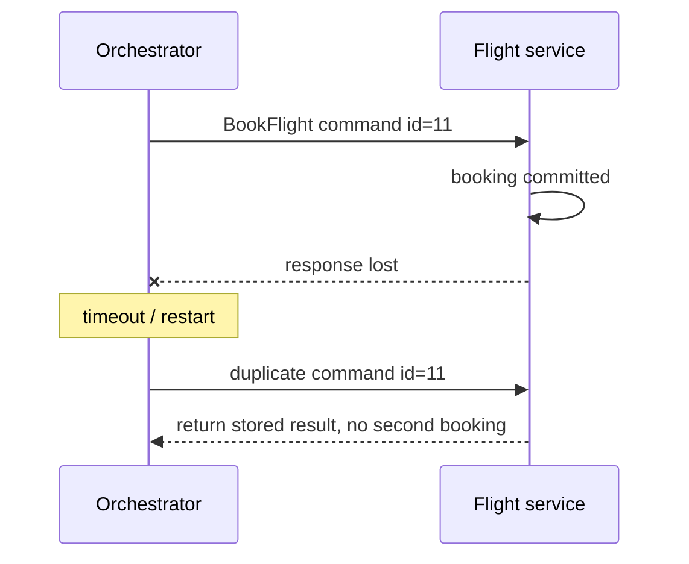

所有 forward 和 compensation commands 都必须 idempotent。`CancelFlight` 也可能重复。

### 5.7 Compensation 失败怎么办

不能假设 $C_i$ 永远成功。策略：

- persistent retry with backoff；
- idempotent compensation ID；
- deadline 后转人工队列；
- 告警与运营 dashboard；
- 保留足够状态对账；
- 设计 alternative compensation。

Saga 的完成条件可能是：

```text
SUCCEEDED
COMPENSATED
MANUAL_INTERVENTION_REQUIRED
```

不要把补偿永久失败悄悄标成“已 abort”。

## 6. Orchestration 与 choreography

### 6.1 Orchestration

原章采用 orchestrator：中央 workflow state machine 明确命令 participants。

优点：

- 流程可见；
- 状态和 retry 集中；
- 补偿顺序明确；
- 易于审计。

代价：

- orchestrator 复杂；
- 需要高可用持久状态；
- 可能成为流程耦合中心。

### 6.2 Choreography

服务通过 events 相互触发，无中央流程控制器：

```text
FlightBooked -> Hotel service books
HotelBookingFailed -> Flight service cancels
```

优点：局部自治；代价：全局 workflow 隐藏在事件订阅中，循环、版本和排障更难。

本章原图是 orchestration，不能把两种模式混为一谈。

### 6.3 Managed workflow engines

原章建议无需从零实现 orchestration engine，可用 AWS Step Functions、Azure Durable Functions 等。选择时仍要检查：

- activity delivery semantics；
- replay/determinism；
- state retention；
- timeout/retry policy；
- workflow versioning；
- compensation 与人工介入；
- vendor limits/cost。

## 7. Saga isolation 问题

### 7.1 为什么 saga 不 isolated

每个 $T_i$ 是独立 local commit。其他 transactions 在整个 saga 完成前可看到：

- 已订 flight、未订 hotel；
- inventory reserved、payment 未完成；
- order created、shipment 未安排；
- compensation 尚未完成。

这些状态在 ACID transaction 中本应隐藏或原子出现。

### 7.2 典型 anomaly

#### Saga intermediate-state read

其他 workflow 读取已由某个 local transaction commit、但整个 saga 尚未完成的中间状态并据此行动。这不同于数据库标准术语 dirty read，后者读取的是未提交 local transaction。

#### Lost update

两个 sagas 修改同一资源，后者覆盖前者。

#### Write skew / invariant violation

每个 local transaction 单独合法，组合后破坏跨服务 invariant。

#### Compensation interference

另一个 transaction 已依赖某个临时成功步骤，随后原 saga compensation 撤销它。

### 7.3 Saga isolation 不会自动出现

outbox、broker、idempotency 解决消息可靠性/重复；它们不保证 transaction isolation。必须额外设计业务状态与并发规则。

## 8. Semantic locks

### 8.1 原章方案

Saga 修改的数据标记 dirty/pending，直到 workflow 结束才清除。

```text
booking.status = PENDING
...
booking.status = CONFIRMED or CANCELED
```

其他 transaction 访问 dirty record 时：

- fail/rollback；或
- wait/retry，直到 flag cleared。

### 8.2 为什么叫 semantic

它不是数据库 engine 对 row 的短期 X lock，而是业务 state：

- 可跨进程重启；
- 可持续小时；
- 对 API 可见；
- 访问策略由业务定义；
- 可通过 timeout/人工恢复。

### 8.3 Semantic lock 状态机

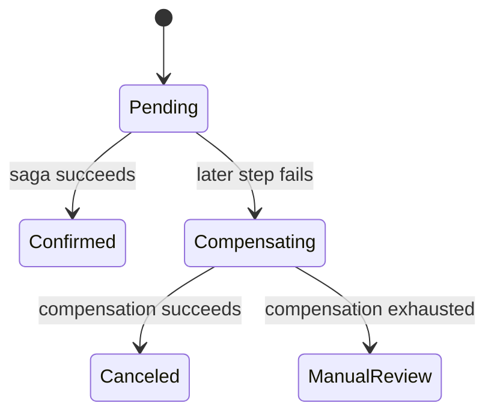

### 8.4 Dirty flag 的风险

- saga crash 后 flag 永远不清；
- 旧 coordinator 恢复后误清新 workflow 的 flag；
- 用户不知道 pending 含义；
- polling/waiting 造成负载；
- 所有权转移需要 version/fencing；
- timeout 不等于安全自动取消。

应携带：

```text
saga_id
state_version
owner_epoch
updated_at
```

并用 conditional update，防 stale coordinator 修改新状态。

## 9. 其他隔离设计策略

原章只展开 semantic lock；以下是同一思路的常见补充。

### 9.1 Commutative updates

把冲突操作改成可交换，例如追加事实、CRDT counter，而不是覆盖 state。

### 9.2 Escrow / reservation

先原子预留有限资源，再在 saga 中 consume/release：

```text
available inventory -> reserved -> sold/released
```

不让多个 saga 同时承诺同一份库存。

### 9.3 Version check

每一步写入 expected version；若状态被其他 workflow 修改，abort/replan，而不是覆盖。

### 9.4 Reread before commit/pivot

关键不可逆步骤前重新验证 invariant 和 dependencies，减少基于陈旧中间状态行动。

### 9.5 Read policy

API 明确：

- 是否返回 pending record；
- 默认隐藏还是展示；
- 下游是否可基于 pending 做不可逆动作；
- 用户能否取消；
- SLA 何时转人工。

## 10. Outbox 与 Saga 的关系

| 维度 | Outbox | Saga |
| --- | --- | --- |
| 主要问题 | local DB change 与 message dual write | 多个 local transactions 的整体 workflow |
| 状态 | outbox rows + consumer dedup | durable workflow state machine |
| 失败处理 | retry delivery | retry forward step 或 compensation |
| 一致性 | source 与 projection eventual | 业务最终成功/补偿 |
| Isolation | 不提供 | 不提供，需 semantic controls |
| 常见组合 | 作为可靠 event publication | 每次 transition 用 outbox 发 command |

Saga 通常建立在 outbox/inbox、broker 和 idempotent participants 之上。

## 11. 标准 C11 示例：Outbox 重投与 Saga 补偿

### 11.1 示例目标

程序模拟 Figure 13.1，并加入真实故障窗口：

1. 以内存模拟 coordinator 的 durable state + outbox command；
2. relay 把 `BOOK_FLIGHT` 送达后在删除 outbox 前 crash；
3. 重启后重复发送，flight consumer 按 message ID 返回缓存结果，不重复订票；
4. hotel booking 失败；
5. coordinator 发 `CANCEL_FLIGHT`；
6. compensation 成功，saga 进入 ABORTED，flight reservation 为 0。

### 11.2 完整代码

```c
#include <stdbool.h>
#include <stddef.h>
#include <stdio.h>

enum { MAX_MESSAGES = 8, MAX_MESSAGE_ID = 32 };

typedef enum {
    BOOK_FLIGHT,
    BOOK_HOTEL,
    CANCEL_FLIGHT
} CommandType;

typedef enum {
    RESULT_SUCCESS,
    RESULT_FAILURE
} CommandResult;

typedef enum {
    SAGA_NEW,
    SAGA_BOOKING_FLIGHT,
    SAGA_BOOKING_HOTEL,
    SAGA_COMPENSATING_FLIGHT,
    SAGA_SUCCEEDED,
    SAGA_ABORTED
} SagaState;

typedef struct {
    unsigned int id;
    CommandType type;
} Message;

typedef struct {
    Message message;
    bool pending;
} OutboxEntry;

typedef struct {
    OutboxEntry entry[MAX_MESSAGES];
    size_t count;
} Outbox;

typedef struct {
    bool seen[MAX_MESSAGE_ID];
    CommandResult cached_result[MAX_MESSAGE_ID];
    int flight_reservations;
} Services;

typedef struct {
    SagaState state;
    unsigned int expected_message_id;
    unsigned int next_message_id;
    Outbox outbox;
} Coordinator;

static bool enqueue(Coordinator *coordinator, CommandType type) {
    OutboxEntry *entry;
    if (coordinator->outbox.count >= MAX_MESSAGES ||
        coordinator->next_message_id + 1U >= MAX_MESSAGE_ID) {
        return false;
    }

    coordinator->next_message_id++;
    entry = &coordinator->outbox.entry[coordinator->outbox.count++];
    entry->message.id = coordinator->next_message_id;
    entry->message.type = type;
    entry->pending = true;
    coordinator->expected_message_id = entry->message.id;
    return true;
}

static bool start_saga(Coordinator *coordinator) {
    if (coordinator->state != SAGA_NEW) {
        return false;
    }
    if (!enqueue(coordinator, BOOK_FLIGHT)) {
        return false;
    }
    coordinator->state = SAGA_BOOKING_FLIGHT;
    return true;
}

static CommandResult process_once(Services *services,
                                  const Message *message) {
    CommandResult result;
    if (message->id == 0 || message->id >= MAX_MESSAGE_ID) {
        return RESULT_FAILURE;
    }
    if (services->seen[message->id]) {
        return services->cached_result[message->id];
    }

    switch (message->type) {
        case BOOK_FLIGHT:
            services->flight_reservations++;
            result = RESULT_SUCCESS;
            break;
        case BOOK_HOTEL:
            result = RESULT_FAILURE; /* deterministic failure for demo */
            break;
        case CANCEL_FLIGHT:
            if (services->flight_reservations > 0) {
                services->flight_reservations--;
            }
            result = RESULT_SUCCESS;
            break;
        default:
            result = RESULT_FAILURE;
            break;
    }

    services->seen[message->id] = true;
    services->cached_result[message->id] = result;
    return result;
}

static bool handle_result(Coordinator *coordinator,
                          unsigned int message_id,
                          CommandResult result) {
    if (message_id != coordinator->expected_message_id) {
        return true; /* duplicate response from an old step */
    }

    switch (coordinator->state) {
        case SAGA_BOOKING_FLIGHT:
            if (result == RESULT_FAILURE) {
                coordinator->state = SAGA_ABORTED;
                return true;
            }
            if (!enqueue(coordinator, BOOK_HOTEL)) {
                return false;
            }
            coordinator->state = SAGA_BOOKING_HOTEL;
            return true;
        case SAGA_BOOKING_HOTEL:
            if (result == RESULT_SUCCESS) {
                coordinator->state = SAGA_SUCCEEDED;
                return true;
            }
            if (!enqueue(coordinator, CANCEL_FLIGHT)) {
                return false;
            }
            coordinator->state = SAGA_COMPENSATING_FLIGHT;
            return true;
        case SAGA_COMPENSATING_FLIGHT:
            if (result == RESULT_SUCCESS) {
                coordinator->state = SAGA_ABORTED;
                return true;
            }
            return false;
        case SAGA_NEW:
        case SAGA_SUCCEEDED:
        case SAGA_ABORTED:
            return true;
    }
    return false;
}

static bool relay(Coordinator *coordinator,
                  Services *services,
                  size_t index,
                  bool crash_after_delivery) {
    OutboxEntry *entry;
    CommandResult result;
    if (index >= coordinator->outbox.count) {
        return false;
    }
    entry = &coordinator->outbox.entry[index];
    if (!entry->pending) {
        return true;
    }

    result = process_once(services, &entry->message);
    if (crash_after_delivery) {
        return true; /* no ACK handling; outbox row stays pending */
    }

    if (!handle_result(coordinator, entry->message.id, result)) {
        return false;
    }
    entry->pending = false;
    return true;
}

int main(void) {
    Coordinator coordinator = {0};
    Coordinator full = {0};
    Services services = {0};

    if (!start_saga(&coordinator)) {
        return 1;
    }
    if (!relay(&coordinator, &services, 0, true)) {
        return 1;
    }
    if (services.flight_reservations != 1 ||
        !coordinator.outbox.entry[0].pending) {
        return 1;
    }

    if (!relay(&coordinator, &services, 0, false)) {
        return 1;
    }
    if (services.flight_reservations != 1 ||
        coordinator.state != SAGA_BOOKING_HOTEL) {
        return 1;
    }

    if (!relay(&coordinator, &services, 1, false) ||
        coordinator.state != SAGA_COMPENSATING_FLIGHT) {
        return 1;
    }
    if (!relay(&coordinator, &services, 2, false)) {
        return 1;
    }
    if (coordinator.state != SAGA_ABORTED ||
        services.flight_reservations != 0) {
        return 1;
    }

    full.state = SAGA_BOOKING_FLIGHT;
    full.expected_message_id = 1;
    full.next_message_id = MAX_MESSAGES;
    full.outbox.count = MAX_MESSAGES;
    full.outbox.entry[0].message.id = 1;
    full.outbox.entry[0].pending = true;
    if (handle_result(&full, 1, RESULT_SUCCESS) ||
        full.state != SAGA_BOOKING_FLIGHT ||
        !full.outbox.entry[0].pending ||
        full.outbox.count != MAX_MESSAGES) {
        return 1;
    }

    printf("flight message deliveries=2, effects=1\n");
    printf("hotel=FAILED compensation=SUCCESS final=ABORTED\n");
    printf("flight reservations=%d outbox messages=%zu\n",
           services.flight_reservations,
           coordinator.outbox.count);
    return 0;
}
```

预期输出：

```text
flight message deliveries=2, effects=1
hotel=FAILED compensation=SUCCESS final=ABORTED
flight reservations=0 outbox messages=3
```

### 11.3 代码与原理对应

| 代码 | 原理 |
| --- | --- |
| `OutboxEntry.pending` | ACK 前不删除/标记完成 |
| `Message.id` | idempotency/dedup key |
| `Services.seen` | consumer durable inbox 的内存模拟 |
| `cached_result` | duplicate command 返回第一次结果 |
| `expected_message_id` | coordinator 忽略旧 step duplicate response |
| `SagaState` | durable workflow checkpoint 的内存模拟 |
| `CANCEL_FLIGHT` | compensating transaction $C_1$ |

### 11.4 示例局限

- 所有 state 只在内存，不耐 crash；
- outbox append 与 state transition 在函数中顺序执行，不是真实数据库 atomic transaction；
- service dedup 与副作用也不是数据库 transaction；
- 只模拟一个 saga，固定 hotel failure；
- compensation 永远成功；
- 不实现 broker、并发 worker、ordering、backoff、poison message；
- 固定容量并显式返回错误。

满容量回归验证：无法写入下一条 command 时，coordinator 保留旧 state，当前 outbox row 也保持 pending，以便扩容/修复后重试。真实实现必须通过同一个本地 transaction 原子完成 response 去重、checkpoint 更新、outbox append 和当前 message ACK。

生产实现需要把 coordinator checkpoint 与 outgoing outbox row 原子提交，把 participant dedup record 与业务 effect 原子提交。

## 12. 故障矩阵

| 故障点 | 必须保持的事实 | 恢复行为 |
| --- | --- | --- |
| 业务 update 前 crash | 无 outbox row | client retry |
| DB commit 后 relay 前 crash | outbox row durable | relay later sends |
| destination apply 后 ACK 丢失 | effect + dedup durable | duplicate returns cached result |
| relay send 后删除前 crash | outbox still pending | resend |
| coordinator transition 前 crash | old state durable | retry old idempotent command |
| state transition 后 send 前 crash | command 必须在同事务 outbox | relay later sends |
| compensation timeout | 不可猜成功/失败 | same compensation ID retry |
| compensation 永久失败 | workflow 不得假装完成 | manual intervention |

## 13. Part II Coordination 总结

原章在此结束 Part II，并强调两个核心洞见。

即使工程师很少从零实现 Raft、replication 或 transaction engine，亲自理解一次它们的模型和故障边界，仍能让我们更正确地使用数据库、broker 和 workflow engine 提供的抽象，而不是把复杂性误认为已经消失。

### 13.1 Failures are unavoidable

Raft、chain replication、2PC、outbox 和 saga 的复杂度主要来自：

- process 随时 crash；
- network 丢失/重复/延迟；
- response timeout 后结果未知；
- participant 独立恢复；
- old coordinator/leader 可能回来；
- partial effect 必须修复。

若网络永远可靠、进程永不 crash，算法会简单很多；但真实系统不能采用这种模型。

Fault tolerance 贯穿整个技术栈，原书将在 Part IV Resiliency 继续深入其工程实践。

### 13.2 Coordination is expensive

协调增加：

- network round trips；
- durable logging；
- locks 和 contention；
- availability dependencies；
- tail latency；
- state-machine complexity。

应在业务允许时减少 coordination，但不能删除 invariant 所必需的协调。

### 13.3 原章三种减协调策略

1. **把 coordination 移出 critical path**：chain replication 把 topology consensus 放 control plane；
2. **先无协调推进，发现 inconsistency 后 apology**：saga 用 compensation；
3. **用无需协调仍收敛的 protocol**：CRDT 通过 monotonic merge。

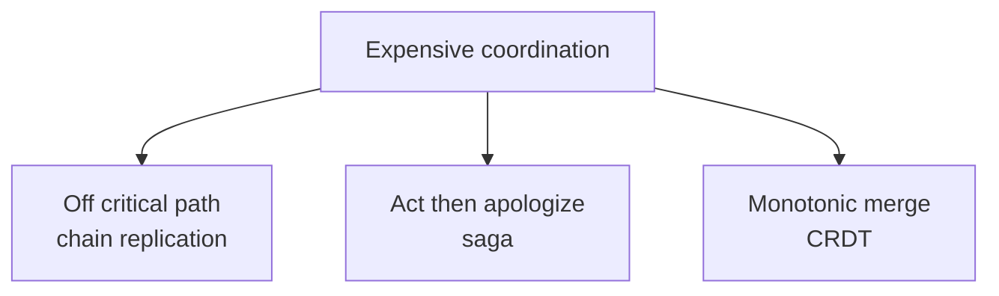

这三者不是通用替代：是否可用取决于业务 invariant、可见中间状态和冲突语义。

## 14. 容易混淆的概念与常见误区

### 14.1 Asynchronous transaction 与 async/await

本章 asynchronous 指步骤通过 durable message 跨时间推进，不要求调用线程同步等待；不是仅把函数改成 `async`。

### 14.2 Outbox 与普通 event log

Outbox 的关键是业务 row 与 message intent 在同一 local transaction commit。另建一张表但分两次写不构成 transactional outbox。

### 14.3 At-least-once 与 exactly-once effect

Relay 可能重复 delivery。Exactly-once effect 来自 consumer durable dedup + atomic effect，不是网络绝不重复。

### 14.4 Idempotent 与 commutative

- idempotent：$f(f(x))=f(x)$，重复同一操作无额外效果；
- commutative：$f(g(x))=g(f(x))$，不同操作顺序可交换。

消息重试需要 idempotency；并发无序处理还可能需要 commutativity。

### 14.5 Saga compensation 与 rollback

Rollback 隐藏未提交变化；compensation 是新业务操作，可能可见、不完全逆转且会失败。

### 14.6 Saga atomicity 与 ACID atomicity

Saga 保证最终 success 或执行补偿流程；中间状态对其他事务可见。它不是 strict all-or-nothing isolation。若业务无法接受中间可见和补偿，应使用更强 transaction boundary 或重新设计。

### 14.7 Orchestration 与 choreography

Orchestrator 持久管理全局 workflow；choreography 由 events 驱动服务自治。不要同时没有权威 workflow state、又期待容易恢复和审计。

### 14.8 Semantic lock 与数据库 lock

Semantic lock 是持久业务状态，可跨小时/重启；数据库 lock 是 concurrency-control primitive，通常随 transaction 短暂持有。

### 14.9 ACK 与业务成功

必须定义 ACK 表示：broker durable、consumer 收到、业务 transaction commit，还是 projection 已更新。不同层 ACK 不能互换。

### 14.10 Eventual consistency 与最终一定成功

Eventual consistency 依赖 retry、修复和最终通信；poison message、永久业务 rejection 和 schema incompatibility 不会靠等待自动消失。

## 15. 本章知识结构

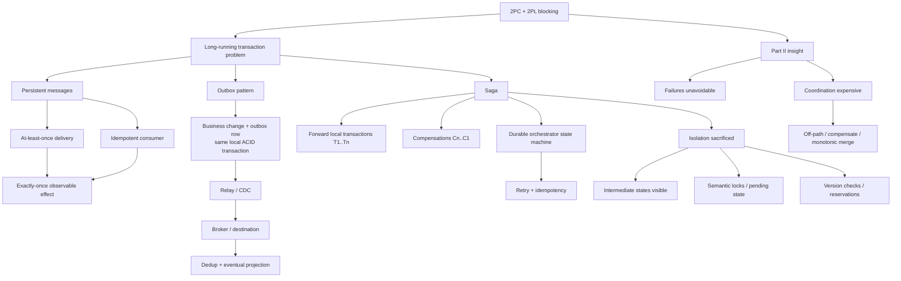

## 16. 核心结论

1. **2PC 是同步阻塞协议，常与 2PL 同时使用。** Prepared participants 持锁等待，因而不适合小时/天级 workflow。
2. **跨组织 participants 通常不会允许外部 transaction 长期阻塞自己的系统。** 长事务需要持久状态和异步推进。
3. **Cashier's check 展示了非阻塞转账。** Durable unique message 不能丢、不能重复兑付，但运输期间账户状态暂时不一致。
4. **工程上的 exactly-once 通常是 at-least-once delivery + durable idempotency + atomic effect。**
5. **Outbox 解决 local DB 与 message publication 的 dual-write 问题。** 业务变化和 outbox intent 在同一 ACID transaction 中提交。
6. **Outbox 不让 destination 瞬时同步。** Relay/consumer 通过 retry 最终更新 projection。
7. **Relay 必须 ACK 后才删除/标记 row。** Send 后删除前 crash 会重复 delivery，因此 consumer 必须 dedup。
8. **实践中 relay 常把 events 发到 Kafka/Event Hubs 等 channel。** Channel 解耦并支持多个 consumers，顺序范围要明确。
9. **Read repair 不属于 outbox；reconciliation/reindex 仍应作为 projection 修复机制。** Eventual pipeline 需要监控 lag 和 poison messages。
10. **Saga 是 local transactions 与 compensations 的 durable workflow。** 所有 forward steps 成功，或已完成步骤按策略补偿。
11. **Compensation 不是 rollback。** 它是新的可见业务操作，可能不完全逆转且可能失败。
12. **Travel saga 中 hotel 失败后必须 cancel 已订 flight。** Figure 13.1 的 workflow 需要持久化每个 transition。
13. **Coordinator checkpoint 与 outgoing command 也有 dual-write。** 应使用自身 transactional outbox。
14. **所有 forward/compensation commands 都必须幂等。** Crash 和 timeout 会造成 duplicate。
15. **Managed workflow engine 可处理持久状态、retry 和 timer。** 仍需业务定义 compensation 和 idempotency。
16. **Saga 牺牲 isolation。** 其他 transactions 可看到部分完成状态并与之交互。
17. **Semantic lock 用 pending/dirty 业务状态限制中间记录访问。** 它是持久业务协议，不是长持数据库 lock。
18. **异步事务的完成状态不应只有 success/abort。** Compensation 永久失败时需要 manual intervention 和审计。
19. **Outbox 与 saga 常组合。** Outbox 提供可靠命令/事件发布，saga 提供多步骤状态机和补偿逻辑。
20. **Part II 的两大结论是 failures unavoidable、coordination expensive。** 减协调的方法包括移出关键路径、事后补偿和 monotonic/CRDT 设计。

## 17. 从本章提炼出的通用解题方法

### 第一步：先判断 transaction 是否真的能短时阻塞

若涉及人工、外部组织、小时级任务或不支持 XA 的服务，不要用长持锁 2PC 模拟单库 transaction。

### 第二步：画出所有 dual-write crash windows

对任意“先写 A 再写 B”，分别在两步前后插入 crash。若结果不一致，用同库 outbox 把业务 state 与传播 intent 原子化。

### 第三步：定义每层 delivery 和 ACK

区分 DB commit、broker durable、consumer receipt、business effect commit。明确 retry 从哪一层开始。

### 第四步：给每个 message/command 稳定 ID

同一 logical step 的所有 retries 复用 ID；consumer 把 dedup 与业务 effect 放在一个 local transaction。

### 第五步：把 workflow 建成 durable state machine

列出 states、forward transitions、failure transitions、compensations、terminal/manual states。每次 checkpoint 与 outgoing command 原子提交。

### 第六步：为每个 forward step 定义 compensation

判断是否真的可逆、是否有费用/外部观察、补偿失败如何处理。不可逆 pivot 尽量放后面。

### 第七步：显式处理 isolation loss

列出其他 transaction 在每个中间 state 能看到/能做什么。使用 pending state、semantic lock、reservation、version check 或 commutative operation。

### 第八步：设计 retry、backoff 与人工兜底

区分 transient technical failure 与 permanent business rejection；poison message 不应无限热重试。

### 第九步：监控 lag 与 stuck workflows

监控 oldest outbox age、relay throughput、consumer lag、dedup hit、saga state age、compensation retry 和 manual queue。

### 第十步：用故障注入验证恢复

在 local commit 后、send 后、ACK 前、checkpoint 前、compensation 中逐点 crash；验证无丢 message、无重复 effect、workflow 可恢复且 stale coordinator 被拒绝。

本章最重要的方法论是：**长事务不能靠长时间持锁获得安全；应把等待变成持久状态，把跨边界动作变成可重试的唯一消息，再用幂等处理、补偿和显式中间状态恢复业务一致性。**
