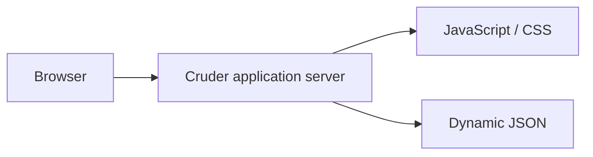
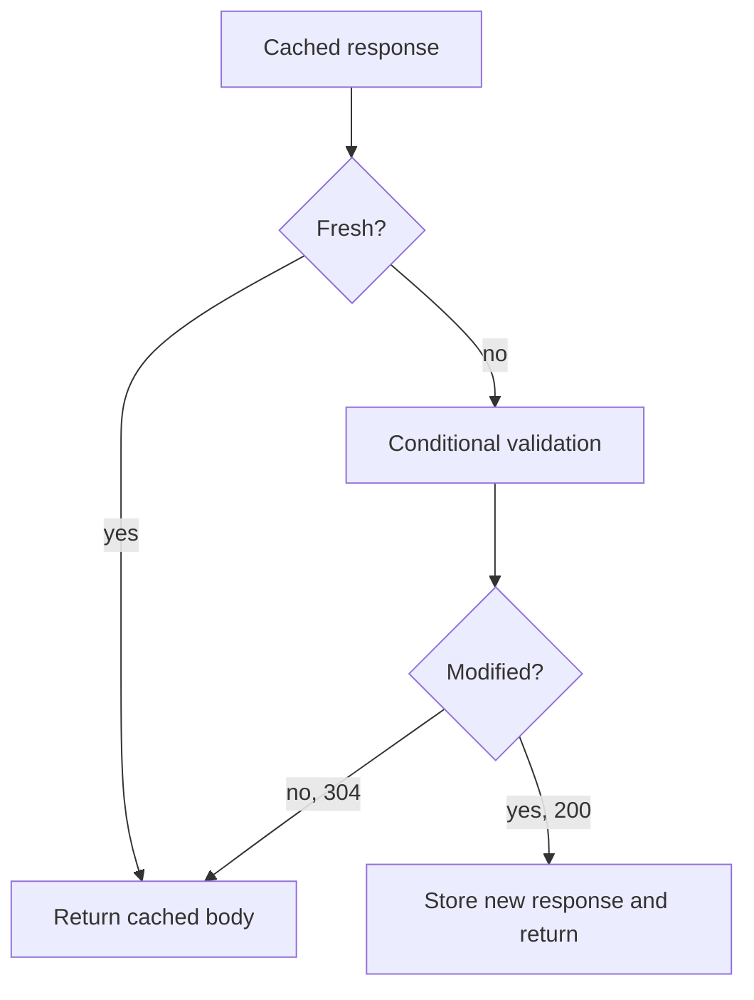
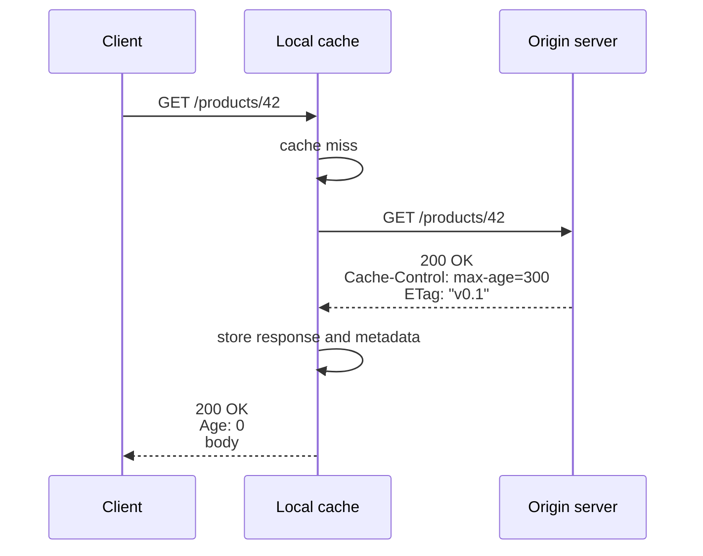
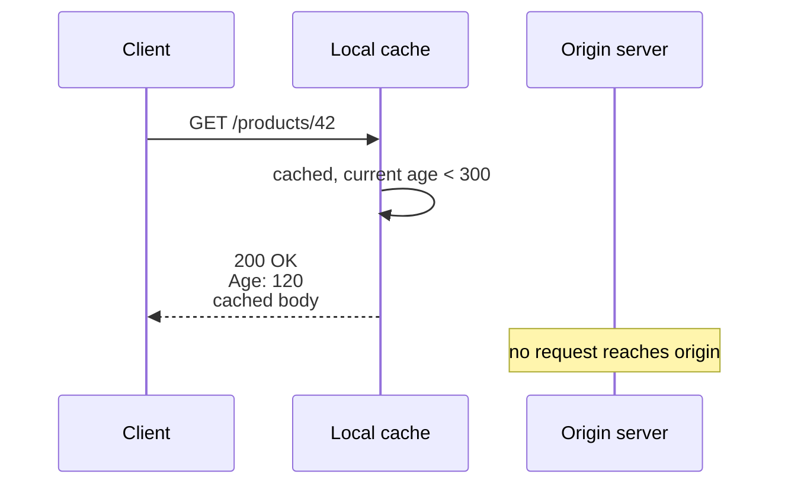
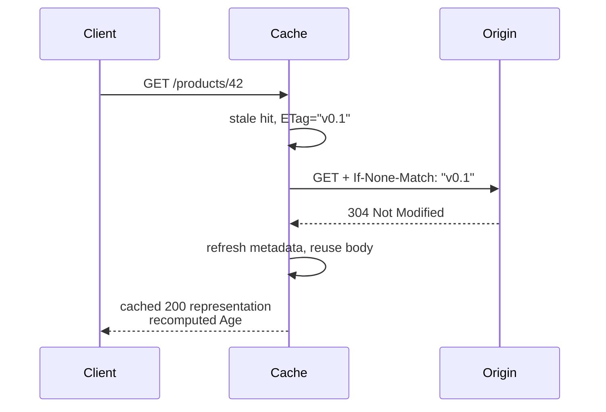
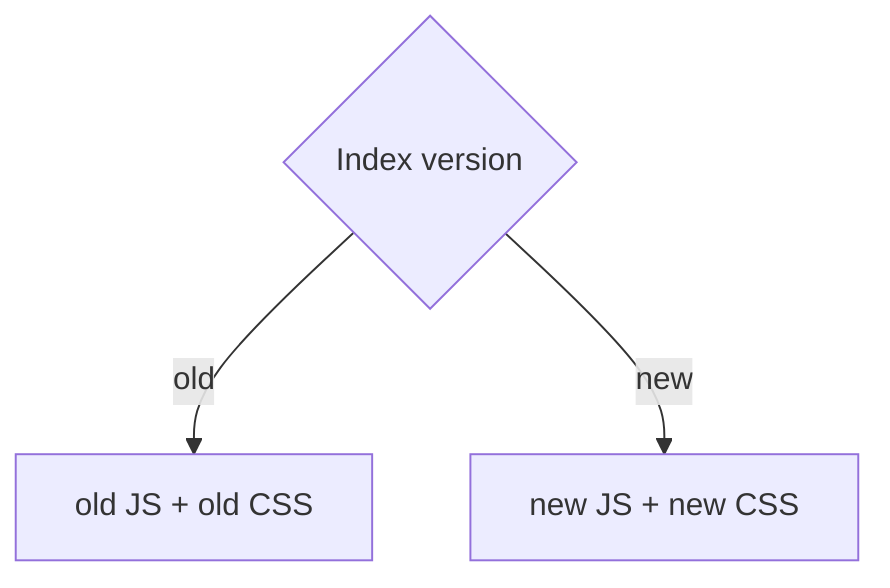
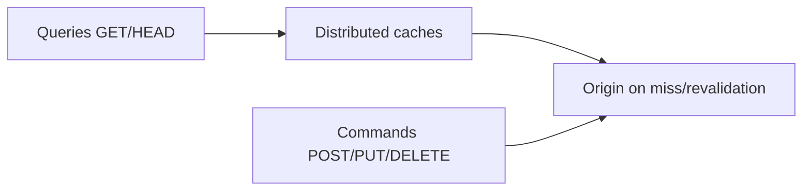
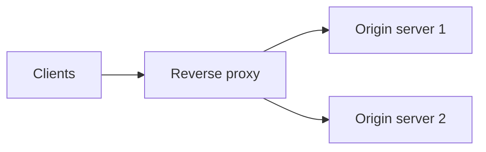
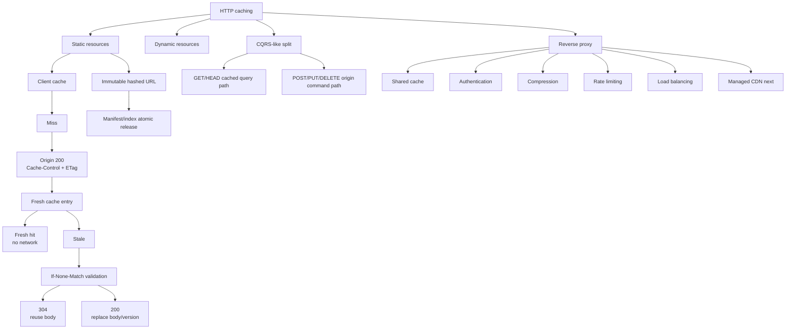

> 本文严格按照原章顺序展开：先区分静态/动态资源，再依次分析首次 cache miss、fresh cache hit、stale conditional revalidation、immutable URL 与多资源原子发布、CQRS 读写分离，最后讨论 Reverse proxies 及其认证、压缩、限流和负载均衡职责。原章主要用 HTTP headers 建立机制直觉；文中的 freshness 公式、命中率模型、validator 边界、`Vary`/授权风险、stampede 与标准 C11 模拟用于展开原理，不应误认为原书逐字给出的完整 RFC 算法或生产代理配置。

## 0. 本章定位：最便宜的请求，是根本不用发到服务器的请求

### 0.1 从 Cruder 的单机架构出发

Part III 通过扩展 CRUD 应用 Cruder 展开。当前 application server 同时处理：

- static resources：JavaScript、CSS、图片等；
- dynamic resources：实时生成的用户 profile JSON 等。



若每次加载相同 bundle 都请求 origin：

- 重复消耗 server CPU/network；
- 增加用户 RTT；
- 建立/复用连接仍有协议开销；
- 大量客户端重复下载相同 bytes。

### 0.2 Static 与 dynamic 的本质区别

| 维度 | Static resource | Dynamic resource |
| --- | --- | --- |
| 内容变化 | 通常低频或由发布产生新版本 | 可按用户/时间/状态实时变化 |
| 例子 | `.js`、`.css`、字体、图片 | profile、余额、实时库存 |
| cache key | 常由 URL 唯一标识版本 | 还受身份、query、headers 影响 |
| stale 风险 | 较低，可内容寻址 | 可能影响业务正确性/隐私 |

“static”不表示文件永不改变，而是同一资源表示在缓存有效期内通常稳定。Dynamic 也不是绝对不可缓存；只要能定义正确 cache key、freshness 和隐私边界，也可缓存。但原章先聚焦静态资源。

### 0.3 Client-side cache 是 replication

浏览器保存 origin resource 的副本：

```text
origin representation -> client cache replica
```

收益来自把 reads 移到客户端；代价是副本可能 stale。这与前文 replication 的一致性/性能权衡相同，只是副本位于 browser。

### 0.4 HTTP cache 的两个核心问题

1. **Freshness**：已缓存 response 还能否不联系 origin 直接使用？
2. **Validation**：stale response 是否与 origin 当前版本相同？



## 1. HTTP caching 的适用请求

### 1.1 Safe methods

原章说 HTTP caching 限于不改变 server state 的 safe methods，如 GET/HEAD。原因是 cache replay 不应重复业务副作用。

- GET：获取 representation；
- HEAD：只获取与 GET 类似的 headers，不返回 body。

POST 请求本身不能由 cache 直接满足；POST response 只有在显式提供 freshness，且 `Content-Location` 与 POST target URI 相同时，才可被存储并用于后续 GET/HEAD。成功的 POST/PUT/DELETE 等 unsafe request 还会使沿途 cache 中相应 target URI 失效。由于条件严格、生态支持有限，本章的扩展性设计应把 GET/HEAD 作为主要 cacheable read path。

### 1.2 Safe、idempotent、cacheable 不同

- safe：客户端没有请求改变资源状态；
- idempotent：重复相同请求的预期效果不变；
- cacheable：response 可按明确规则复用。

DELETE 是 idempotent 但不 safe，不应由 cache 代替执行。GET 通常 safe/idempotent，但 response 若含 `no-store` 或用户私密数据，也不能缓存。

## 2. 第一次访问：cache miss

### 2.1 时序

client 请求从未访问的 `/products/42`，local cache 查找失败，于是代 client 向 origin 请求。



这重建 Figure 14.1。

### 2.2 Server 怎样声明可缓存

原章使用：

```http
Cache-Control: max-age=300
ETag: "v0.1"
```

- `max-age=300`：response 最多 fresh 300 秒；
- `ETag`：representation version validator；
- cache 存 body、status、headers、存储时刻等 metadata。

`Cache-Control` 不只是 TTL，还可表达 `no-store`、`private`、`public`、`must-revalidate`、`immutable` 等策略。

### 2.3 Age header

Figure 14.1 用 `Age: 0` 直观表示 response 刚进入 cache。更精确地说，Age 估计的是 response 自 origin 生成或成功验证以来经过的时间，包含传输和多级 cache 驻留，而不只是当前 cache 内停留时间。共享 cache 返回后续 response 时，Age 通常增长。

Age 不是资源自创建起的年龄，也不是客户端页面停留时间；它参与当前 response 的缓存年龄计算。

RFC 9111 的简化组合可写为：

$$
current\_age=
\max(apparent\_age,Age+response\_delay)+resident\_time
$$

其中 `apparent_age` 由 `Date` 与接收时间估计，`response_delay` 是请求到响应的时间，`resident_time` 是 response 进入当前 cache 后经过的时间。

### 2.4 Freshness lifetime

在简化 `max-age` 模型中：

$$
FreshnessLifetime=maxAge
$$

$$
Fresh\iff CurrentAge<FreshnessLifetime
$$

真实 RFC 算法还考虑 `Date`、`Age`、传输时间和启发式 freshness；本章用 `max-age` 足以建立主线。

### 2.5 首次请求没有减少 origin load

cache miss 仍访问 origin，甚至多了 cache lookup。缓存收益来自后续复用；若每个 URL 只访问一次或 cache key 高基数，缓存可能没有价值。

## 3. 再次访问：fresh cache hit

### 3.1 Fresh hit 时序



收益：

- network call 归零；
- origin CPU/network load 归零；
- latency 变为 local lookup + body delivery；
- origin 故障时 fresh cache 仍可服务。

### 3.2 Fresh 不等于最新

origin 可能在 cache 存储后更新 resource，但 cache 仍在 300 秒 freshness 内。此时客户端合法读取旧值。

在没有 `stale-while-revalidate`、`stale-if-error` 等 stale-serving，且只考虑单层 `max-age` 的简化模型中，HTTP freshness 是 contractual staleness window：

$$
MaxUnvalidatedStaleness\lesssim maxAge
$$

实际上发布时刻与缓存获取时刻不同，且中间 cache/clock 会影响观察；这个式子只是直觉上界。

原章明确接受 reads 非 strongly consistent，以换取性能与容量。

### 3.3 Cache hit ratio

设命中率 $h$，总请求率 $Q$，origin 请求率近似：

$$
Q_{origin}=Q(1-h)
$$

若 $Q=10{,}000$/s、$h=0.95$：

$$
Q_{origin}=10{,}000\times0.05=500/s
$$

origin load 降低 95%。这是假设每个 hit 完全不 revalidate 的简化模型。

### 3.4 平均响应时间

若 hit latency $L_h$、miss latency $L_m$：

$$
E[L]=hL_h+(1-h)L_m
$$

$h=0.95,L_h=5$ ms，$L_m=100$ ms：

$$
E[L]=0.95\times5+0.05\times100=9.75\ \mathrm{ms}
$$

平均值改善明显，但 miss path 和 revalidation 的 tail latency 仍需监控。

## 4. Expired：stale response 与条件验证

### 4.1 Stale 的含义

当 current age 达到/超过 freshness lifetime：

$$
CurrentAge\ge FreshnessLifetime
$$

response stale。Stale 不表示 body 一定改变，只表示 cache 不能再无条件假定它可用。

### 4.2 If-None-Match

cache 用已存 ETag 发送：

```http
GET /products/42 HTTP/1.1
If-None-Match: "v0.1"
```

含义：若当前 selected representation 的 ETag 仍匹配，请不要重发完整 body。

### 4.3 未修改：304

origin 当前仍是 `"v0.1"`：

```http
HTTP/1.1 304 Not Modified
Cache-Control: max-age=300
ETag: "v0.1"
```

304 不包含正常完整 representation body。cache 用 304 携带的适用字段更新已存 response metadata，通常替换对应同名字段，但不会用 304 自身的 `Content-Length` 覆盖已存 representation body 长度；随后把已存 body 作为 cached response 返回 client。`If-None-Match` 存在时优先于 `If-Modified-Since`。



对应 Figure 14.2。

### 4.4 已修改：200 新表示

若 origin 当前 ETag 是 `"v0.2"`：

```http
HTTP/1.1 200 OK
Cache-Control: max-age=300
ETag: "v0.2"

new body
```

cache 替换 body/metadata 并返回新 response。

### 4.5 Revalidation 省了什么

304 路径仍支付：

- network RTT；
- origin conditional lookup；
- headers bytes；
- TLS/connection resources。

节省：

- 大 body 传输；
- body 生成/读取成本（视实现）；
- 客户端下载时间。

Fresh hit 最便宜；304 比 200 miss 便宜，但不是零成本。

## 5. Validators：ETag 与 Last-Modified

### 5.1 ETag

ETag 是 selected representation 的 opaque validator，不应让客户端自行解析。可以来自：

- content hash；
- row/version ID；
- build fingerprint；
- origin 生成的 opaque token。

Strong validator 必须在可观察 representation data 变化时变化。Weak validator 可以跨字节变化保持不变，只要旧 representation 仍可作为语义等价替代；当不再可接受为等价表示时才必须变化。

### 5.2 Strong 与 weak ETag

- strong ETag：representation data 字节级等价，可用于 range 等强比较；
- weak ETag：`W/"..."`，表示语义等价但字节可不同。

`If-None-Match` 的 cache revalidation 使用 weak comparison；并发条件更新中的 `If-Match` 通常需要 strong comparison。不要把缓存 validator 与业务 idempotency key 混为一谈。

### 5.3 Last-Modified / If-Modified-Since

时间 validator：

```http
Last-Modified: Wed, 12 Aug 2026 10:00:00 GMT
If-Modified-Since: Wed, 12 Aug 2026 10:00:00 GMT
```

局限：

- 时间精度；
- 多次快速更新；
- clock semantics；
- representation variant。

ETag 通常能表达更精确版本。

### 5.4 ETag 不是 cache lifetime

- `max-age` 决定多久可不验证；
- `ETag` 决定 stale 后怎样验证。

没有 ETag 仍可 fresh cache；有 ETag 但 `max-age=0` 则每次都需 revalidate。

## 6. Immutable static resources

### 6.1 为什么理想静态资源应 immutable

若同一 URL 内容永不改变，可给很长 freshness，例如：

```http
Cache-Control: public, max-age=31536000, immutable
```

原章沿用“最大一年”的历史规则；31,536,000 秒也是常见 immutable asset 配置。现行 RFC 9111 不禁止更长 freshness lifetime。`immutable` 只承诺 representation 在本次 freshness lifetime 内不会改变，并允许普通 reload 避免验证；过期后仍按正常规则 revalidate，它不表示 URL 永久无需验证。

### 6.2 修改资源要修改 URL

不要覆盖：

```text
/app.js
```

而是内容寻址/版本化：

```text
/app.4f3a9c.js
/styles.92bd1e.css
```

新 bytes -> 新 fingerprint -> 新 URL -> 必然 cache miss；旧 URL 可永久返回旧 bytes。

### 6.3 Cache busting 的本质

Cache invalidation 很难，因为无法主动控制所有浏览器。Immutable URL 把 invalidation 转化为 naming：

```text
do not invalidate old object
publish a new object under a new name
```

这是 content-addressed storage 的直觉。

### 6.4 多资源“原子发布”

假设旧 index：

```html
<script src="/app.old.js"></script>
<link href="/styles.old.css">
```

新 index：

```html
<script src="/app.new.js"></script>
<link href="/styles.new.css">
```

先上传所有新 immutable assets，最后切换 index。客户端读取哪个 index，就加载一整套对应 URLs：



避免 old JS + new CSS 混搭。

### 6.5 “原子”的边界

这不是数据库 transaction：

- index 自身可能被缓存；
- 用户可能在导航期间跨版本；
- service worker 有独立 cache；
- API/schema compatibility 仍需设计；
- assets 必须先发布且不能过早删除。

它提供的是 manifest/index 级 release consistency。

### 6.6 发布/回滚流程

1. build hashed assets；
2. 上传并验证 assets；
3. 发布引用新 URLs 的 index；
4. 保留旧 assets；
5. 监控 errors；
6. 回滚时恢复旧 index；
7. 经过安全期后 GC 无引用 assets。

## 7. HTTP caching 与 CQRS

### 7.1 Read path 与 write path 不对称

原章观察：reads 通常比 writes 多几个数量级，因此：

- GET：允许复制、cache、stale window；
- POST/PUT/DELETE：走 origin 权威 write path。



### 7.2 CQRS 类比

Command Query Responsibility Segregation 把修改 state 的 commands 与读取 state 的 queries 分开建模/优化。HTTP caching 是轻量实例：

- write model 维护权威资源；
- read replicas 位于 browsers/proxies；
- read 可牺牲即时 consistency 获得容量。

原章把这种 query/command 职责分离同时视为 functional decomposition。把缓存职责进一步放到 reverse proxy 也可看成类似的工程分解，但这是本文据此作出的推论。

### 7.3 不是所有系统都需要完整 CQRS 架构

设置正确 HTTP headers 并不意味着必须引入 event sourcing、独立 read database 等复杂架构。这里强调的是 read/write workload 和语义不同，应分别优化。

## 8. Cache correctness：cache key 与变体

### 8.1 URL 不是总是完整 cache key

同一 path/资源的 response 可能受完整 target URI（query 本身属于 URI）以及以下 request headers/context 影响：

- `Accept-Encoding`；
- `Accept-Language`；
- `Authorization`/Cookie；
- device/tenant；
- experiment headers。

若 cache 忽略这些维度，会把错误 representation 返回给其他请求。

### 8.2 Vary

origin 可声明：

```http
Vary: Accept-Encoding, Accept-Language
```

shared cache 把这些 request headers 纳入 variant key。

`Vary: *` 通常阻止通用复用。高基数 Vary 会降低 hit ratio。

### 8.3 Private 与 public

```http
Cache-Control: private
```

允许 browser private cache，禁止 shared cache 复用。

```http
Cache-Control: public
```

明确允许 shared cache（仍需满足其他规则）。

用户 profile 若共享 cache 隔离错误，reverse proxy 可能向别的用户泄露数据。对带 `Authorization` 的 request，shared cache 默认不得复用 response，除非 response 用 `public`、`s-maxage` 或 `must-revalidate` 等 directive 明确许可；不应简单依赖 `Vary: Authorization`，规范也不要求把 Authorization 加入 `Vary`。敏感内容可用 `private` 或 `no-store`。

### 8.4 no-cache 与 no-store

- `no-store`：不要存 response；
- `no-cache`：可存，但每次复用前必须 revalidate。

`no-cache` 不等于“不缓存”，这是常见误区。

## 9. Reverse proxies

### 9.1 什么是 reverse proxy

server-side intermediary，拦截 client 与 origin 的通信。客户端把它视为目标 server，不需要知道后端拓扑。



Figure 14.3 原图只有一个 server；上图在其“client -> reverse proxy -> server”关系上加入第二个 origin，用于同时展示原章随后提到的 load-balancing 扩展。

### 9.2 Forward proxy 与 reverse proxy

| Forward proxy | Reverse proxy |
| --- | --- |
| 代表 clients | 代表 servers |
| server 看到 proxy | client 看到 proxy/origin identity |
| 控制出站访问 | 控制入站访问 |
| 例：企业代理 | 例：NGINX、HAProxy、CDN edge |

### 9.3 Shared server-side cache

Browser cache 每个用户各自 warm：

```text
1000 browsers -> each may cause first miss
```

Reverse-proxy cache 由所有 clients 共享：

```text
first shared miss -> populate once -> many clients hit
```

因此它更显著降低 origin load，尤其对热门公共资源。

### 9.4 两层 cache 组合


请求率层层削减。若 browser hit ratio $h_b$、proxy 对剩余请求 hit ratio $h_p$：

$$
Q_{origin}=Q(1-h_b)(1-h_p)
$$

$h_b=0.8,h_p=0.9$：

$$
Q_{origin}=Q\times0.2\times0.1=0.02Q
$$

origin 只见约 2%。这里 $h_p$ 已定义为 browser miss 后剩余请求的条件命中率，因此乘法无需额外独立性假设；流量分布仍会决定两个命中率的实际数值。

## 10. Reverse proxy 的其他职责

原章列出四项。

### 10.1 Authentication

proxy 验证 token/certificate，把可信 identity context 传给 origin。必须：

- 防止客户端伪造内部 identity headers；
- 明确 proxy-to-origin trust；
- origin 不可绕过 proxy 暴露；
- 授权仍可能属于业务服务。

### 10.2 Compression

根据 `Accept-Encoding` 返回 gzip/br，减少传输 bytes。压缩 variant 需正确 `Vary: Accept-Encoding`，并考虑 CPU 与小对象开销。

### 10.3 Rate limiting

按 IP/user/API key 限制请求，保护 origin。Proxy 是集中入站点，但需处理 distributed counters、误伤和绕过路径。

### 10.4 Load balancing

把 requests 分配给多个 backend servers，增加容量与故障韧性。健康检查、连接池、算法和 session affinity 在后续章节展开。

### 10.5 NGINX、HAProxy 与 managed service

原章列举 NGINX、HAProxy。自建提供控制，但需：

- 高可用部署；
- 配置、升级和监控；
- cache storage/capacity；
- TLS 和安全补丁；
- purge/invalidation。

许多需求已由 managed CDN commoditize；Chapter 15 转向 CDN。

## 11. Reverse-proxy cache 的故障与运维

### 11.1 Cache stampede

热门 object 到期时，许多并发 misses 同时回源：

$$
OriginBurst\approx ConcurrentRequestsForKey
$$

缓解：

- request coalescing/single-flight；
- stale-while-revalidate；
- TTL jitter；
- proactive refresh；
- origin rate limit。

### 11.2 Cache poisoning

若 cache key、Host、Vary 或代理 headers 处理错误，攻击者可能让恶意 response 被其他用户复用。需规范化 key、限制可缓存 response、验证 origin 和敏感 headers。

### 11.3 Invalidation/Purge

动态内容紧急修复可能需要 purge，但：

- purge 本身是分布式操作；
- 各 proxy 节点完成时间不同；
- browser private caches 不受 server purge 完全控制；
- 失败时会有 stale 副本。

静态 hashed URL 比 purge 更可靠。

### 11.4 Stale serving

`stale-while-revalidate` 可在后台刷新时返回 stale；`stale-if-error` 可在 origin 故障时兜底。它提高可用性和 tail latency，但扩大 stale window，需按数据风险选择。

## 12. 标准 C11 示例：miss、fresh hit 与 ETag revalidation

### 12.1 示例目标

模拟：

1. 第一次 GET miss，origin 返回 v1 + `max-age=300`；
2. t=100 fresh hit，不访问 origin；
3. t=301 stale，`If-None-Match: v1`，origin 仍 v1，返回 304 并刷新 freshness；
4. t=602 stale，origin 已 v2，返回 200 新 body；
5. 验证 origin calls 只有 3 次，而 client GET 有 4 次。

### 12.2 完整代码

```c
#include <stdbool.h>
#include <stdio.h>
#include <string.h>

enum { BODY_CAPACITY = 64, ETAG_CAPACITY = 16 };

typedef struct {
    char etag[ETAG_CAPACITY];
    char body[BODY_CAPACITY];
    unsigned long max_age;
} Origin;

typedef struct {
    bool present;
    char etag[ETAG_CAPACITY];
    char body[BODY_CAPACITY];
    unsigned long stored_at;
    unsigned long max_age;
} Cache;

typedef enum {
    ORIGIN_OK,
    ORIGIN_NOT_MODIFIED,
    ORIGIN_ERROR
} OriginStatus;

static bool copy_text(char *destination,
                      size_t capacity,
                      const char *source) {
    const int written = snprintf(destination, capacity, "%s", source);
    return written >= 0 && (size_t)written < capacity;
}

static OriginStatus origin_get(const Origin *origin,
                               const char *if_none_match,
                               char *etag,
                               char *body,
                               unsigned long *max_age) {
    *max_age = origin->max_age;
    if (!copy_text(etag, ETAG_CAPACITY, origin->etag)) {
        return ORIGIN_ERROR;
    }
    if (if_none_match != NULL &&
        strcmp(if_none_match, origin->etag) == 0) {
        return ORIGIN_NOT_MODIFIED;
    }
    if (!copy_text(body, BODY_CAPACITY, origin->body)) {
        return ORIGIN_ERROR;
    }
    return ORIGIN_OK;
}

static bool cache_get(Cache *cache,
                      const Origin *origin,
                      unsigned long now,
                      unsigned int *origin_calls,
                      const char **result,
                      const char **path) {
    unsigned long age;
    unsigned long max_age;
    char etag[ETAG_CAPACITY] = {0};
    char body[BODY_CAPACITY] = {0};
    OriginStatus status;

    if (cache->present) {
        if (now < cache->stored_at) {
            return false; /* elapsed-time input must be monotonic */
        }
        age = now - cache->stored_at;
        if (age < cache->max_age) {
            *result = cache->body;
            *path = "fresh-hit";
            return true;
        }
    }

    (*origin_calls)++;
    status = origin_get(origin,
                        cache->present ? cache->etag : NULL,
                        etag,
                        body,
                        &max_age);
    if (status == ORIGIN_ERROR) {
        return false;
    }
    if (status == ORIGIN_NOT_MODIFIED) {
        cache->stored_at = now;
        cache->max_age = max_age;
        *result = cache->body;
        *path = "revalidated-304";
        return true;
    }

    cache->present = true;
    cache->stored_at = now;
    cache->max_age = max_age;
    if (!copy_text(cache->etag, sizeof cache->etag, etag) ||
        !copy_text(cache->body, sizeof cache->body, body)) {
        return false;
    }
    *result = cache->body;
    *path = "origin-200";
    return true;
}

static bool request(Cache *cache,
                    const Origin *origin,
                    unsigned long now,
                    unsigned int *origin_calls,
                    const char *expected_path,
                    const char *expected_body) {
    const char *result;
    const char *path;
    if (!cache_get(cache, origin, now, origin_calls, &result, &path)) {
        return false;
    }
    printf("t=%lu path=%s etag=%s body=%s\n",
           now, path, cache->etag, result);
    return strcmp(path, expected_path) == 0 &&
           strcmp(result, expected_body) == 0;
}

int main(void) {
    Origin origin = {"v1", "body-v1", 300};
    Cache cache = {0};
    unsigned int origin_calls = 0;

    if (!request(&cache, &origin, 0, &origin_calls,
                 "origin-200", "body-v1")) {
        return 1;
    }
    if (!request(&cache, &origin, 100, &origin_calls,
                 "fresh-hit", "body-v1")) {
        return 1;
    }
    if (!request(&cache, &origin, 301, &origin_calls,
                 "revalidated-304", "body-v1")) {
        return 1;
    }

    if (!copy_text(origin.etag, sizeof origin.etag, "v2") ||
        !copy_text(origin.body, sizeof origin.body, "body-v2")) {
        return 1;
    }
    if (!request(&cache, &origin, 602, &origin_calls,
                 "origin-200", "body-v2")) {
        return 1;
    }
    if (origin_calls != 3) {
        return 1;
    }
    if (request(&cache, &origin, 601, &origin_calls,
                "fresh-hit", "body-v2") || origin_calls != 3) {
        return 1; /* reject non-monotonic elapsed time */
    }

    printf("client_requests=4 origin_calls=%u\n", origin_calls);
    return 0;
}
```

预期输出：

```text
t=0 path=origin-200 etag=v1 body=body-v1
t=100 path=fresh-hit etag=v1 body=body-v1
t=301 path=revalidated-304 etag=v1 body=body-v1
t=602 path=origin-200 etag=v2 body=body-v2
client_requests=4 origin_calls=3
```

### 12.3 示例边界

- 只模拟一个 cache key 和 strong opaque ETag；
- 省略 Date/Age 完整算法、Vary、authorization 和 directives；
- origin 永远可用；
- 没有 stale-if-error、并发、single-flight 和 persistence；
- `stored_at` 代表简化 freshness reset 时刻；
- checked `snprintf` 拒绝超长 ETag/body；
- `now` 必须来自同一 monotonic elapsed-time domain，回拨输入会被拒绝；
- production 应使用成熟 HTTP cache/library。

## 13. 关键概念辨析

### 13.1 Fresh、stale、invalid

- fresh：可不联系 origin 复用；
- stale：需 revalidate 或按 stale policy 使用；
- invalid/corrupt：不应使用。

Stale 不等于内容已变，304 正是证明它仍可复用。

### 13.2 Validation 与 invalidation

- validation：问 origin 当前版本是否仍相同；
- invalidation：主动删除/标记 cache 不可用。

ETag 条件 GET 是 validation；purge 是 invalidation。

### 13.3 304 与 200

304 是给 conditional request 的 metadata response，不携带完整资源 body；最终 client 通常仍得到 cache 组合出的 representation。

### 13.4 Browser cache 与 reverse-proxy cache

- browser：private、靠近单用户、减少所有网络调用；
- reverse proxy：shared、减少 origin 调用，但 client 到 proxy 仍有网络。

### 13.5 Cache consistency 与 database consistency

HTTP cache freshness 允许 bounded stale window，不自动满足 linearizability。ETag 验证只能在 revalidation 时确认版本。

### 13.6 Immutable 与不删除旧文件

同一 URL immutable 要求旧 bytes 持续可取；过早删除 hashed asset 会让缓存 miss/新用户失败。GC 必须晚于所有 index 引用与安全保留期。

## 14. 本章知识结构



## 15. 核心结论

1. **Client-side HTTP cache 是 replication。** 它把静态 resource 副本放到 browser，以 stale 风险换取 latency 和 origin capacity。
2. **HTTP caching 主要服务 safe GET/HEAD。** Safe、idempotent、cacheable 是不同性质。
3. **第一次 miss 仍访问 origin。** Origin 用 `Cache-Control` 定义 freshness，用 ETag 定义 version validator。
4. **Fresh response 可直接复用，无网络请求。** Fresh 不保证 origin 当前没有更新，只表示协议允许暂不验证。
5. **Stale 不表示内容一定改变。** Cache 用 `If-None-Match` 条件 GET 询问 origin。
6. **未修改时 origin 返回 304，cache 复用已有 body。** 已修改则返回 200 + 新 representation/ETag。
7. **`max-age` 和 ETag 职责不同。** 前者决定何时验证，后者决定怎样验证。
8. **ETag 是 representation 的 opaque validator。** 强/弱 ETag 和 `If-Match`/`If-None-Match` 语义不可混用。
9. **Immutable hashed URL 把 invalidation 转为 naming。** 新内容新 URL，旧资源可长期缓存。
10. **先发布 assets、后切换 index，可获得 manifest 级版本一致性。** 必须保留旧 assets 供旧 index 使用。
11. **HTTP caching 体现 CQRS 思想。** 高频 query path 可复制/cache，低频 command path 走权威 origin。
12. **Cache key 必须覆盖 representation 变体。** `Vary`、身份和 query 处理错误会返回错误内容甚至泄露数据。
13. **`no-cache` 允许存储但要求 revalidate；`no-store` 才是不存。**
14. **Reverse proxy 是代表 server 的中间层。** Client 不感知内部 origin topology。
15. **Shared reverse-proxy cache 比各 browser 独立 warm 更能削减 origin load。** 两层 cache 命中率可相乘估算。
16. **Reverse proxy 还能统一认证、压缩、限流和负载均衡。** 它是 functional decomposition，但自身需高可用。
17. **缓存引入 stampede、poisoning、purge 和 stale-serving 风险。** 需要显式 cache policy、监控和保护 origin。
18. **Managed CDN 将 reverse proxy/cache/网络优化商品化。** 这是 Chapter 15 的起点。

## 16. 从本章提炼出的通用解题方法

### 第一步：分类资源和读写语义

识别 static/dynamic、public/private、safe/unsafe、可接受 stale window。不要先开启缓存再猜正确性。

### 第二步：定义完整 cache key

列出 URL、query、encoding、language、tenant、identity 和实验维度；用 `Vary` 或明确 key 防止 variant 混用。

### 第三步：分别设计 freshness 与 validation

为 `max-age` 选择业务可接受 staleness；为 ETag/Last-Modified 保证每次表示变化都更新 validator。

### 第四步：优先使用 immutable content-addressed assets

新 bytes 产生新 URL；设置一年 `max-age` + `immutable`；index/manifest 使用较短 cache 或 revalidation。

### 第五步：计算命中收益

用 $Q(1-h)$ 估 origin load，用加权 latency 估用户收益；分别观察 browser、proxy、304 和 origin 200。

### 第六步：设计 miss/stale 故障路径

Origin down 时是否 serve stale？热门 key 到期是否 single-flight？revalidation timeout 如何处理？不要只测试 hit path。

### 第七步：保护共享 cache 隔离

敏感 response 使用 private/no-store；清除客户端可伪造内部 headers；测试跨用户、跨语言、跨压缩 variant。

### 第八步：把发布做成 manifest 切换

先上传、验证所有 immutable assets，再发布新 index；保留旧版本并让 rollback 只切 index。

### 第九步：监控缓存而非只看服务器

监控 hit/miss/revalidation ratio、Age、stale serve、eviction、origin latency、stampede、cache bytes 和 purge completion。

### 第十步：选择自建 reverse proxy 还是 managed CDN

评估控制需求、全球分布、DDoS、TLS、运维团队、成本和 purge 语义。不要把单 reverse proxy 变成新单点。

本章最重要的方法论是：**缓存的本质是复制读取结果；先定义副本可以陈旧多久、怎样验证和怎样隔离，再用 headers、immutable naming 与共享代理把重复网络调用从关键路径移除。**
