> 本文严格沿原章顺序展开：先定义 CDN 与一次请求的基本流程，再讨论 Overlay network，最后讨论多层 Caching 与集群内内容分区。原章只有 4 页，主旨非常集中；文中的传播时延、带宽时延积、分层命中率、Poisson 请求模型、容量估算、安全边界和 C11 模拟用于补足推导与工程应用，不应误认为原书逐字给出的协议或厂商实现。

## 0. 导读与本章定位：把“离用户更近”从缓存策略扩展为网络架构

### 0.1 从 Chapter 14 到 Chapter 15

Chapter 14 讨论 HTTP caching：

- browser cache 可以直接复用 fresh response；
- stale response 可以通过 ETag/Last-Modified revalidate；
- reverse proxy 可以在 server side 统一做缓存、认证、压缩、限流和负载均衡。

但单个 reverse proxy 仍有两个明显限制：

1. 它通常只部署在 origin 附近，远距离用户仍要跨越公共互联网；
2. 它是需要自行采购、部署、扩缩容和运维的基础设施。

CDN 将 reverse proxy 做成托管的、地理分布式的网络：

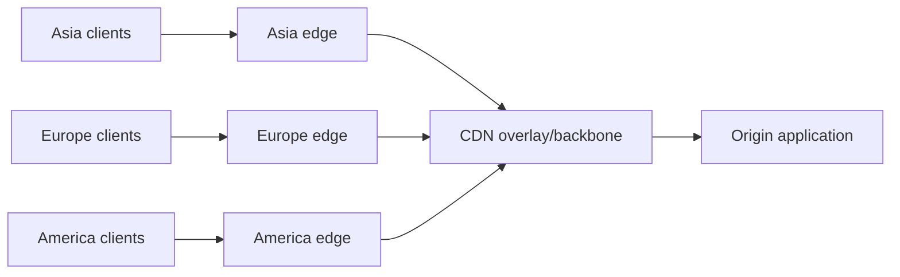

因此，本章不是简单重复“缓存有什么用”，而是回答两个新的扩展性问题：

- **Network problem**：如何降低全球用户到服务的 RTT，并提高跨地域传输的有效带宽与可靠性？
- **Cache topology problem**：边缘节点越来越多时，如何避免缓存被过度分散、origin load 反而升高？

### 0.2 本章最重要的反直觉观点

人们容易认为 CDN 的首要价值是 cache。作者明确指出，更基础的价值其实是它的 **underlying network substrate**，即覆盖在公共互联网之上的网络能力。

即使 response 完全不可缓存，CDN 仍可能通过以下方式加速请求：

- 让 client 连接附近 edge，缩短 client-side RTT；
- 在 CDN 节点之间复用 persistent connections；
- 通过持续测量选择低 latency、低 congestion 的内部路径；
- 调整传输窗口，使高带宽长距离链路得到充分利用；
- 把 CDN 作为 application frontend，吸收和过滤恶意流量。

缓存是在这套网络基础上进一步减少传输和 origin work。

### 0.3 本章在 Part III 中的位置

Part III 讨论 scalability 的三类通用模式：

| 模式 | 本章对应 | 解决的问题 |
| --- | --- | --- |
| Functional decomposition | 托管 CDN 承担网络入口、缓存和防护 | 将通用职责从 application 拆出 |
| Replication | edge/mid-tier 保存 content 副本 | 让 read 靠近 client，减少 origin work |
| Partitioning | cluster 内服务器只负责部分 content | 单机装不下全部对象时水平扩展 |

本章结尾自然引出 Chapter 16：CDN cluster 内不能让每台服务器保存全部数据，必须 partition content。

---

## 1. Content delivery network 是什么

### 1.1 原章定义

CDN 是一个由地理分布式 caching servers，也就是 reverse proxies，组成的 overlay network。它围绕互联网底层协议的设计限制构建。

这个定义包含三层意思：

1. **Geographically distributed**：节点部署在多个地理位置，不只在 origin data center；
2. **Caching reverse proxies**：节点代表 origin 接收请求，必要时缓存 response；
3. **Overlay network**：节点之间形成一层由 CDN 控制的逻辑网络，但底层仍使用公共互联网、专线、互联点等物理链路。

典型的 managed CDN 包括原章列举的 AWS CloudFront 和 Akamai。

### 1.2 一次请求的基本流程

使用 CDN 后，client 访问的 URL 会解析到 CDN 的 caching server：

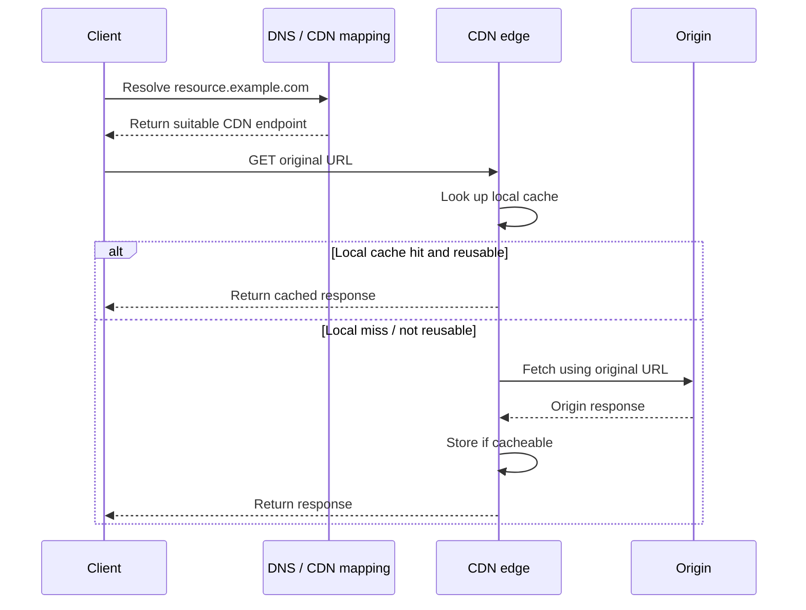

这里的 transparently 意味着：

- client 仍按普通 HTTP semantics 请求资源；
- edge 在 miss 时代表 client 向 origin fetch；
- origin response 经 edge 返回；
- cache behavior 由 URL、headers、policy 和 CDN 配置共同决定。

它不表示整个过程对 operator 完全“零配置”。Operator 仍需配置：

- DNS 或域名接入；
- origin 地址与认证；
- cache key、TTL、bypass 和 purge policy；
- TLS certificate；
- health check、日志、监控和安全策略。

### 1.3 CDN 是 reverse proxy，不是 client-side proxy


| 概念 | 代表谁 | 典型用途 |
| --- | --- | --- |
| Forward proxy | 代表 client | 企业出口、匿名访问、访问控制 |
| Reverse proxy | 代表 server/origin | 缓存、TLS termination、路由、防护 |
| Browser cache | client 本地副本 | 避免发出网络请求 |
| CDN edge cache | 共享的 server-side 副本 | 服务某个地理区域的许多 client |

CDN edge 是共享基础设施，因此比 browser cache 更需要关注 tenant、identity、Cookie、Authorization 与 `Vary` 的隔离。

### 1.4 Cache hit 与 miss

- **Cache hit**：需要的数据能从相应 cache 层获得；
- **Cache miss**：该层没有可用对象，需要访问下一层或 origin。

“有 key”不必然等于可直接返回：对象可能 expired、被 purge、validator 不匹配，或 policy 要求 bypass。不同厂商对 revalidated hit、stale hit 的指标命名也可能不同，所以观察指标前必须先读定义。

---

## 2. 15.1 Overlay network

### 2.1 为什么公共互联网路径不等于低延迟路径

#### 2.1.1 Internet 是 network of networks

公共互联网由数以千计的 autonomous systems（AS）组成，例如：

- ISP；
- cloud provider；
- enterprise network；
- content provider；
- research/education network。

网络之间使用 BGP 传播 reachability，并根据本地 policy 选择 route。作者用一个简化说法指出：互联网核心路由并非以端到端 performance 为首要目标，不会直接以实时 latency 或 congestion 为全局优化目标。

#### 2.1.2 对原章“hop count”的精确理解

原章说 BGP 主要用 hop 数衡量路径成本。这里应理解为教学性简化：

- BGP 的 `AS_PATH` 长度是 route selection 的一个因素；
- 但 BGP 不是普通 link-state shortest-path protocol；
- local preference、商业关系、policy、MED、hot-potato routing 等都可能先于或影响路径选择；
- BGP route 也不携带一个可信的、全互联网统一的实时 latency/congestion cost。

所以作者真正要表达的是：

> 默认 interdomain route 以 reachability、policy 和自治为核心，不保证得到 application 眼中的最低 latency、最低 loss 或最高 throughput 路径。

#### 2.1.3 路径为什么可能“可达但不快”

两条路径可以有不同目标：

| 路径选择目标 | 可能偏好的路径 |
| --- | --- |
| 商业 policy | 成本更低的 transit/peer |
| AS path | AS 数更少的路径 |
| Latency | 传播距离和排队更短的路径 |
| Throughput | 瓶颈带宽更高、loss 更低的路径 |
| Reliability | 故障率低、有冗余的路径 |

这些目标并不总是一致。AS hop 少的路径可能物理绕远；地理距离近的路径也可能因 peering 关系绕行。

### 2.2 为什么远距离 latency 无法靠更快 server 消除

#### 2.2.1 传播时延的物理下界

设 client 与 server 沿实际光纤路径的单程距离为 $d$，光在光纤中的传播速度约为：

$$
v\approx 2\times 10^8\ \mathrm{m/s}
$$

仅考虑传播，不考虑 router、queue、serialization 和 protocol processing，RTT 下界为：

$$
RTT_{prop}\ge \frac{2d}{v}
$$

若实际光纤路径长 $9{,}000\ \mathrm{km}$：

$$
RTT_{prop}\ge
\frac{2\times 9{,}000\times 10^3}{2\times 10^8}
=0.09\ \mathrm{s}=90\ \mathrm{ms}
$$

现实 RTT 还要加上：

$$
RTT=Propagation+Transmission+Queueing+Processing
$$

因此，origin 即使在 $1\ \mathrm{ms}$ 内生成 response，全球另一端的 client 也可能等超过 $100\ \mathrm{ms}$。优化 server CPU 无法突破传播速度。

#### 2.2.2 一个请求可能消耗多个 RTT

首次访问常包含：

1. DNS resolution；
2. transport handshake；
3. TLS handshake；
4. HTTP request/first-byte；
5. response body transfer。

现代协议可复用连接、合并握手或使用 0-RTT，但“RTT 高会放大协议轮次成本”这一事实不变。把 frontend 放在 client 附近，会同时缩短这些 client-facing round trips。

#### 2.2.3 长距离不仅慢，也扩大故障暴露面

经过更多网络、设备和拥塞点，通常意味着：

- packet loss/reordering 的机会增加；
- transient outage 的影响更明显；
- TCP retransmission 的代价更高；
- jitter 更大，tail latency 更难控制。

这不是“距离必然导致错误”的严格定律，而是路径更长、跨域更多时的工程风险。CDN 的目标是缩短 public-internet segment，并通过受测量和控制的网络承载长距离部分。

### 2.3 Overlay network 到底“覆盖”了什么

Overlay network 是建立在另一张网络上的逻辑网络：

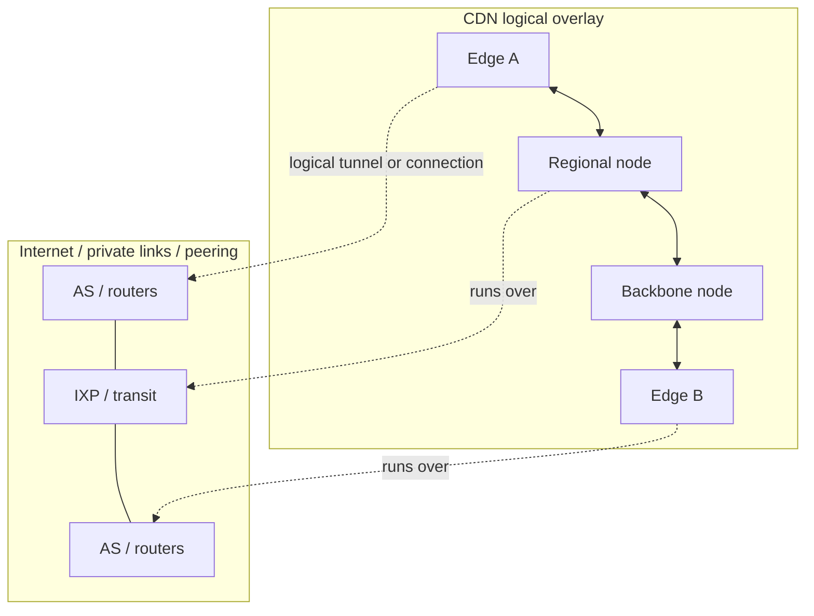

Overlay 不改变光速，也不神奇地替代所有 underlay。它获得优势的原因是 CDN 可以：

- 选择 PoP/cluster 的部署位置；
- 建立 peering、专线或高质量 transit；
- 持续测量节点间 latency、loss、congestion 和 health；
- 在可选入口和内部路径中进行 application-aware routing；
- 复用跨地域 transport connections；
- 在 edge 提前终止 client connection。

简化地看，原本的一条不可控长路径：

```text
client ---------------- public internet ---------------- origin
```

变成：

```text
client -- short access -- edge == measured overlay/backbone == origin
```

### 2.4 把 CDN cluster 放到 client 附近

#### 2.4.1 PoP 与 edge cluster

- **PoP（Point of Presence）**：CDN 在某个网络/地点的接入存在点；
- **Edge cluster**：在边缘位置提供代理、缓存等服务的一组服务器；
- **Edge server**：cluster 中的一台具体机器。

工程文档常混用 edge location、PoP 和 cluster，但设计时要区分：一个 PoP 可有多台服务器，也可能有多层 routing/cache 组件。

#### 2.4.2 “最近”不只指地理距离

作者介绍 global DNS load balancing：根据从 client IP 推断的位置，为 client 返回地理上接近的 healthy cluster，同时考虑 network congestion 和 cluster health。

合适的 cluster 应优化的是实际网络结果，而不是地图直线距离：

$$
SelectedCluster=
\operatorname*{arg\,min}_{c\in HealthyClusters}
EstimatedCost(client,c)
$$

`EstimatedCost` 可综合：

- measured RTT；
- packet loss；
- route/ISP；
- cluster load/capacity；
- current health；
- regulatory or residency constraints；
- monetary cost。

#### 2.4.3 Global DNS load balancing 的限制

DNS mapping 很实用，但不是完美的逐请求定位：

- authoritative DNS 常看到 recursive resolver IP，而非最终 client IP；
- EDNS Client Subnet 可传递部分 client network 信息，但有 privacy 和 cache fragmentation 代价；
- DNS answer 会被 resolver/client 按 TTL cache，故障切换不是瞬时的；
- mobile client 的网络位置可能变化；
- 一个 answer 可能返回多个 endpoint，由 client/transport 再选择。

这说明“global DNS 返回最近集群”是系统目标，不是绝对保证。

> 补充：现代 CDN 也常结合 Anycast，让多个 PoP 宣告同一 IP，再由 BGP 将 client 带到网络拓扑上合适的入口。原章此处明确讲的是 global DNS load balancing，不能把 Anycast 当成原文机制。

### 2.5 为什么把 CDN 放在 Internet exchange point

Internet exchange point（IXP）是多个 ISP/network 互联和交换流量的地点。CDN 在 IXP 或 ISP 网络内部部署节点，可以：

- 直接靠近大量 access networks；
- 减少昂贵或拥塞的 transit；
- 缩短 client 到 edge 的 public path；
- 让 origin 到 edge 的长距离部分更多经过 CDN 可优化的 links。

作者描述的理想结构是：

- client 到 CDN：brief, short-distance hops；
- CDN 内部：高质量、可观测、可选路的网络；
- CDN 到 origin：尽量短且稳定的末端连接。

不能把它理解为“整个路径从此完全不经过公共互联网”。具体比例取决于 CDN 的 peering、backbone、PoP 覆盖和 origin 接入方式。

### 2.6 基于实时 telemetry 的 overlay routing

默认 BGP 给出 reachability 后，CDN 可以在自己的节点之间维护多个候选路径，并持续观察：

- latency；
- packet loss；
- jitter；
- available bandwidth；
- congestion；
- node/link health。

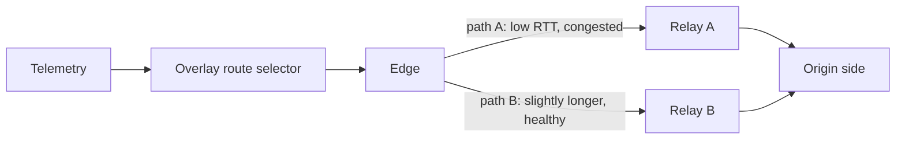

一个抽象 cost function 可以写成：

$$
Cost(p)=
w_l L(p)+w_q Q(p)+w_e E(p)+w_c C(p)
$$

其中：

- $L(p)$：latency；
- $Q(p)$：loss/jitter penalty；
- $E(p)$：error/unavailability penalty；
- $C(p)$：capacity 或 monetary cost；
- $w_*$：业务权重。

这不是原书指定的 CDN algorithm。真实厂商算法和 topology 通常是专有实现；这个模型用于说明为什么“最好路径”是多目标、动态决策。

### 2.7 TCP optimization：连接池和合适窗口

原章点出两项优化：

1. CDN servers 之间使用 persistent connection pools，避免反复 setup connections；
2. 使用合适的 TCP window size，最大化 effective bandwidth。

#### 2.7.1 Persistent connection 为什么有效

若每次 origin fetch 都新建连接，会重复承担：

- transport handshake；
- TLS handshake；
- congestion control 从较小发送速率开始；
- certificate/crypto processing；
- socket 和 kernel state 建立。

连接池把许多 client-facing requests multiplex/reuse 到较少的 warm origin connections：

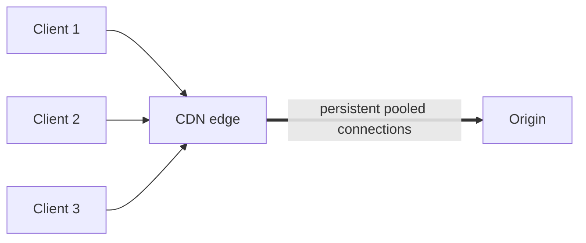

这不等于所有用户共享同一条无限容量连接。连接池仍需限制并发、处理 connection draining、failure、TLS identity 和 load balancing。

#### 2.7.2 带宽时延积的直觉

一条链路中“正在飞行”的数据量约为：

$$
BDP=Bandwidth\times RTT
$$

假设 backbone bandwidth 为 $1\ \mathrm{Gb/s}$，RTT 为 $80\ \mathrm{ms}$：

$$
BDP=10^9\ \mathrm{bit/s}\times 0.08\ \mathrm{s}
=80\ \mathrm{Mbit}=10\ \mathrm{MB}
$$

若 sender 在收到 acknowledgment 前最多只能保有 $1\ \mathrm{MB}$ 未确认数据，则理想 throughput 上界近似为：

$$
Throughput\le \frac{Window}{RTT}
=\frac{1\ \mathrm{MB}}{0.08\ \mathrm{s}}
=12.5\ \mathrm{MB/s}\approx 100\ \mathrm{Mb/s}
$$

虽然链路标称 $1\ \mathrm{Gb/s}$，却只用到约十分之一。足够的 receive/congestion window 才能填满高 BDP 路径。

这个估算的前提是忽略 loss、protocol overhead、sender limits 和 competing traffic。真实 TCP 会动态控制 congestion window，不能简单“把窗口设得越大越好”。

### 2.8 Figure 15.1：网络收益与缓存收益同时存在

原书 Figure 15.1 表达三点：

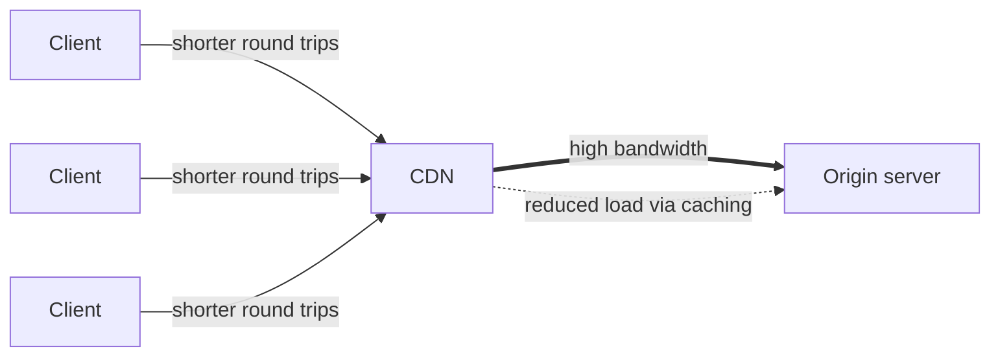

1. Client 到 CDN 的 round trip 更短；
2. CDN 到 origin 的通道有较高 effective bandwidth；
3. Cache hit 使请求不再到达 origin，从而 reduced load。

前两项即使对 dynamic, uncacheable content 仍可能成立；第三项依赖 cacheability 和 hit ratio。

### 2.9 Dynamic resources 为什么也能被 CDN 加速

Dynamic resource 可能因为以下原因不能共享缓存：

- 每个用户内容不同；
- 数据要求实时；
- response 带 `private`/`no-store`；
- request 有 Authorization/Cookie，且没有明确共享策略；
- request/response 具有副作用或不可复用。

但 CDN 仍可作为 frontend：

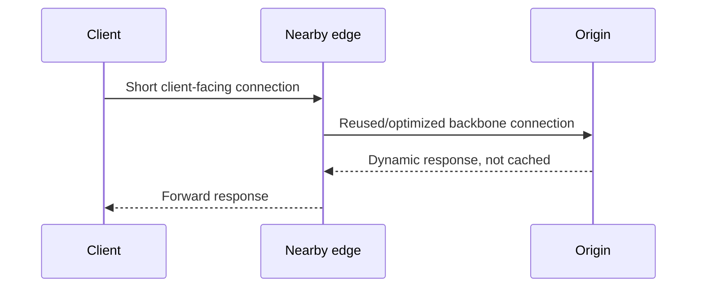

收益包括：

- shorter client-side handshakes；
- warm connection to origin；
- optimized route and transport；
- TLS offload or termination；
- protocol translation/multiplexing；
- request filtering and rate limiting。

因此，“CDN 只适合 static files”是常见误区。

### 2.10 CDN 作为 DDoS shield

当 CDN 成为公开 frontend，攻击流量先到 CDN，而不是直接到 origin。CDN 可以利用：

- globally distributed capacity 吸收流量；
- Anycast/DNS mapping 分散攻击；
- edge filtering、WAF、bot management；
- per-client/per-key rate limit；
- known attack signature 和 anomaly detection；
- challenge 或 connection validation；
- cache hit 避免把每个请求转给 origin。

但“用了 CDN”不等于自动免疫 DDoS：

- origin IP 若可被直接访问，攻击者可绕过 CDN；
- expensive dynamic request 仍可能穿透 edge；
- application-layer attack 看似合法，识别更难；
- CDN 与 origin 的 allowlist、mTLS/signed request、capacity 和 timeout 必须正确配置；
- 攻击可能带来显著 CDN 流量费用。

安全目标应是：**only CDN can reach origin, edge rejects as early and cheaply as possible, origin has bounded work per accepted request**。

---

## 3. 15.2 Caching

### 3.1 为什么只有 edge cache 还不够

CDN 顶层由地理分布的 edge clusters 构成。热门对象通常能在 edge 命中，但低频对象可能不在某个 edge：

- 从未在该 edge 被请求；
- 已 expired 或被 evicted；
- cluster storage 不够；
- cache key 过度细分；
- 被 purge 或 policy bypass。

若每次 edge miss 都直达 origin，edge 数量越多，冷 cache 越多，origin 可能承受大量重复 fill。原章由此引出 intermediary caching clusters。

### 3.2 Edge miss 仍受益于 overlay network

即使 edge 没有对象，它通过 CDN overlay fetch origin，通常仍比任意 public-internet path 更高效、更可靠：


这再次说明 CDN 有两层独立收益：

$$
CDNBenefit=NetworkAcceleration+CacheOffload
$$

第一项不要求命中；第二项在命中时进一步消除 origin fetch。

### 3.3 Edge cluster 数量与 cache hit ratio 的冲突

#### 3.3.1 为什么更多 edge 有利

更多 edge clusters 意味着：

- 覆盖更多地理区域；
- client 到 edge RTT 更低；
- 单个 cluster 故障影响范围可缩小；
- attack/traffic 可分散到更多位置。

#### 3.3.2 为什么更多 edge 可能降低命中率

同一个对象的 request stream 被分散到更多独立 cache：

- 每个 cache 看到的 request rate 下降；
- low-frequency object 更难在每个位置保持 warm；
- 每个 edge 都可能各自发生一次 compulsory miss；
- 相同对象被重复存储，占用更多总容量；
- 更低频对象更容易被 eviction。

这就是 locality 与 duplication 的 tradeoff：

```text
more edges
  -> closer to clients
  -> request stream fragmented
  -> lower per-edge popularity
  -> more misses / duplicated fills
  -> potentially higher origin load
```

这个结论不是“增加 edge 必然降低所有对象 hit ratio”。超热门内容在所有 edge 仍可持续命中；下降最明显的是 long-tail content，并且结果还受 cache capacity、TTL、prefetch 和 request routing 影响。

### 3.4 用 Poisson + TTL 模型解释 cache fragmentation

为了把直觉写成可计算模型，假设：

- 某对象的请求服从 rate 为 $\lambda$ 的 Poisson process；
- cache miss 后对象立即写入；
- 对象固定 fresh $T$ 秒，hit 不刷新 TTL；
- cache 不提前 eviction；
- 所有请求均匀分散到 $N$ 个独立 edges。

对单个 edge，请求率是 $\lambda/N$。一个 renewal cycle 包含：

1. 一次 miss，填入对象；
2. 接下来 $T$ 秒内期望有 $\lambda T/N$ 次 hit；
3. 过期后的下一次请求成为下个 cycle 的 miss。

因此每周期的期望请求数为：

$$
1+\frac{\lambda T}{N}
$$

hit ratio 为：

$$
H_N=
\frac{\lambda T/N}{1+\lambda T/N}
=\frac{\lambda T}{N+\lambda T}
$$

当 $\lambda T$ 固定时，$N$ 增大，$H_N$ 下降。

例如 $\lambda=0.1/s$，$T=300s$，所以 $\lambda T=30$：

| Edge 数 $N$ | 模型命中率 $H_N$ |
| ---: | ---: |
| 1 | $30/31\approx 96.8\%$ |
| 10 | $30/40=75\%$ |
| 100 | $30/130\approx 23.1\%$ |

这个模型的用途是解释方向，不是预测生产 CDN：

- real traffic 往往是 bursty、regional、非均匀的；
- cache 有容量 eviction；
- cache key 和 TTL 因对象而异；
- request collapsing/prefetch 会改变 miss 数；
- mid-tier 会聚合 edge misses。

### 3.5 Intermediary caching clusters：重新聚合 locality

为缓解 edge fragmentation，CDN 可在较少的地理位置部署一层或多层 intermediary cache，也常称 regional cache、parent cache 或 origin shield。

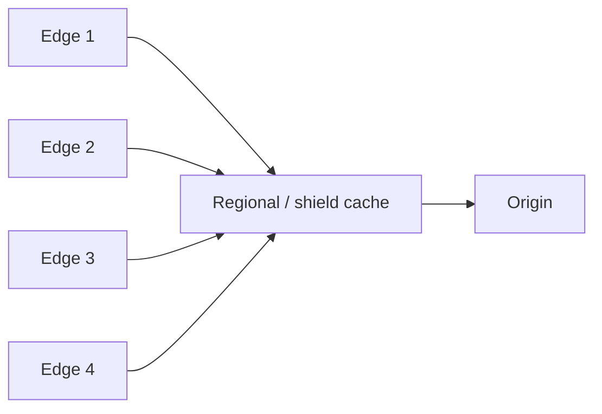

它为什么有效：

- 多个 edges 的 miss stream 在中间层重新聚合；
- 中间层看到更高 object request rate；
- 中间层数量较少，可保存更大比例的 origin content；
- 同一对象无需从 origin 向每个 edge 分别传输；
- origin 只需面对少量 shield endpoints，连接和防护更容易管理。

代价是：

- miss path 多一层 lookup/hop；
- 中间层可能成为 bottleneck 或 failure domain；
- 需要处理 cache consistency、purge propagation 和 capacity；
- topology/routing 更复杂。

### 3.6 分层命中率公式

设：

- edge local hit ratio 为 $h_e$；
- 在 edge miss 的请求中，mid-tier conditional hit ratio 为 $h_m$。

则总 hit ratio：

$$
H=h_e+(1-h_e)h_m
$$

到达 origin 的请求比例：

$$
P_{origin}=(1-h_e)(1-h_m)=1-H
$$

注意 $h_m$ 是 **conditional hit ratio**：只以到达 mid-tier 的 edge misses 为分母，不能直接把两个无条件比例相加。

若：

$$
h_e=0.75,\qquad h_m=0.80
$$

则：

$$
H=0.75+0.25\times 0.80=0.95
$$

$$
P_{origin}=0.25\times 0.20=0.05
$$

即 edge 自己命中 75%，mid-tier 再消化剩余请求的 80%，最终只有 5% 到 origin。

#### 3.6.1 多层一般式

若有 $k$ 层，各层对进入该层请求的 conditional miss ratio 为 $m_i=1-h_i$，则：

$$
P_{origin}=\prod_{i=1}^{k}m_i
$$

$$
H=1-\prod_{i=1}^{k}(1-h_i)
$$

该公式假设请求沿固定层级向下，并把 bypass/error 暂时视为 miss。生产指标还要单列 stale serve、revalidation、uncacheable 和 error。

### 3.7 Origin load 的容量估算

若 client request rate 为 $\lambda_c$，则简化的 origin request rate：

$$
\lambda_o=\lambda_c(1-h_e)(1-h_m)
$$

若：

- $\lambda_c=100{,}000$ requests/s；
- $h_e=75\%$；
- $h_m=80\%$；

则：

$$
\lambda_o=100{,}000\times 0.25\times 0.20
=5{,}000\ requests/s
$$

origin offload 为 95%。但容量规划不能只按平均值：

- purge 会突然把 hit ratio 降到接近 0；
- new release 可能产生 cold-cache wave；
- regional failure 会把流量转移；
- hot key expiration 会触发 stampede；
- attack traffic 可能主要是 uncacheable requests。

Origin 需要能承受受控的 miss burst，CDN 也应提供 request collapsing、stale serving、prefetch 或渐进 warmup。

### 3.8 分层 latency 的期望值

设：

- edge hit latency 为 $T_e$；
- edge miss、mid hit 的端到端 latency 为 $T_m$；
- 两层都 miss、访问 origin 的 latency 为 $T_o$。

则：

$$
E[T]=h_eT_e+(1-h_e)h_mT_m+(1-h_e)(1-h_m)T_o
$$

例如：

$$
h_e=0.75,\quad h_m=0.80
$$

$$
T_e=20ms,\quad T_m=45ms,\quad T_o=180ms
$$

所以：

$$
E[T]
=0.75\times20
+0.25\times0.80\times45
+0.25\times0.20\times180
=33ms
$$

相比所有请求都直达 origin 的 $180ms$，平均值显著下降。

局限：平均 latency 会掩盖 tail。设计时还需看 p50/p95/p99，并分别观察 hit、mid-hit 和 origin-miss latency。

### 3.9 Cache hierarchy 的完整读取路径

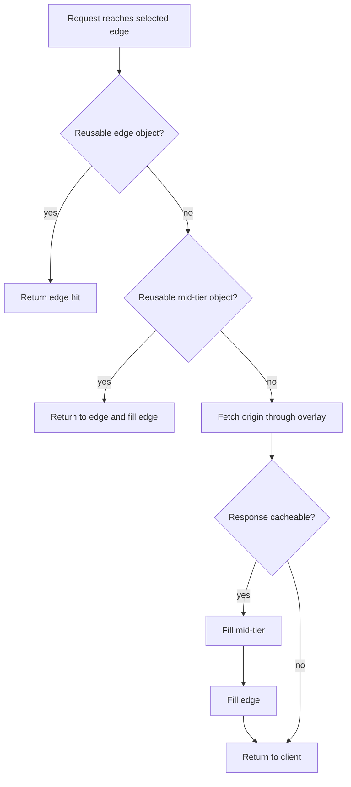

图中是教学性简化。真实系统还可能：

- revalidate stale object；
- stale-while-revalidate；
- stale-if-error；
- bypass based on Cookie/header/path；
- request collapsing；
- negative caching；
- range caching；
- compressed variants；
- asynchronous fill/prefetch。

这些 HTTP semantics 已在 Chapter 14 建立，本章重点是把 cache 扩展成地理和层级 topology。

### 3.10 Cache stampede 与 request collapsing

分层 cache 不能自动消除 hot-key stampede。若一个热门对象同时在多个 edge 过期：

```text
many clients -> many edge misses -> many mid-tier misses -> origin burst
```

常见缓解方法：

- **Request collapsing/coalescing**：同一 key 只允许一个 fetch in flight，其余等待；
- **TTL jitter**：让对象不要在同一时刻批量过期；
- **stale-while-revalidate**：一边返回 stale，一边由单个 worker 更新；
- **stale-if-error**：origin 故障时保留可接受的旧副本；
- **prefetch/warmup**：发布或预测热门内容时主动填充；
- **shield cache**：把多个 edge fill 合并到更少的 parent。

这些是本章 tradeoff 的工程延伸，不是原文逐项展开的机制。

### 3.11 CDN cluster 内为什么还要 partition

原章最后指出：一个 CDN cluster 内，content 会分布到多台 servers，每台只服务一个 subset。原因很直接：

$$
TotalContentSize>SingleServerCapacity
$$

若全部复制到每台 server：

- storage 成本随 server 数线性重复；
- long-tail content 仍装不下；
- fill bandwidth 和 purge work 被重复；
- 单机 capacity 限制整个 cluster 可保存的 catalog。

所以通常先 partition，再根据 availability/popularity 做有限 replication：

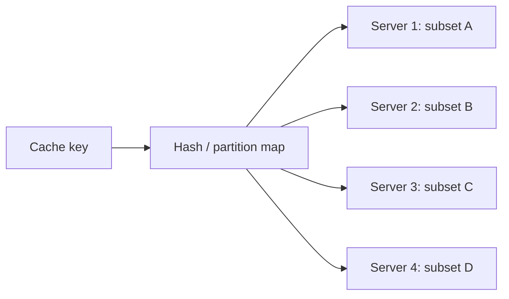

#### 3.11.1 Partitioning 与 replication 不是二选一

- Partitioning 决定“哪个 node 负责哪个 key”；
- Replication 决定“同一个 key 有多少副本”。

实际 cluster 常把每个 partition 放到多个 nodes，以应对：

- node failure；
- hot object；
- rolling maintenance；
- rebalance。

Chapter 16 将系统讨论 range/hash partitioning。本章只建立需求：单台 server 不可能保存 CDN 的全部 data。

---

## 4. 把 Overlay 与 Caching 放进同一个性能模型

### 4.1 三类请求路径

| 路径 | 是否访问 origin | 主要收益 | 主要成本 |
| --- | --- | --- | --- |
| Edge hit | 否 | 最低 RTT、最大 offload | edge storage/freshness |
| Mid-tier hit | 否 | 聚合 locality、保护 origin | 多一层 lookup/transfer |
| Origin miss/dynamic | 是 | 仍可用 overlay/connection pool | origin compute + long path |

因此不能只用一个 global hit ratio 解释 CDN 体验。至少需要拆分：

- edge hit ratio；
- shield/mid-tier conditional hit ratio；
- origin fetch ratio；
- cacheable vs uncacheable traffic；
- 每条路径的 latency distribution；
- bytes offload，而不只是 request offload。

### 4.2 Request hit ratio 与 byte hit ratio

设总请求数为 $R$，cache-served 请求数为 $R_h$：

$$
RequestHitRatio=\frac{R_h}{R}
$$

设总 response bytes 为 $B$，cache-served bytes 为 $B_h$：

$$
ByteHitRatio=\frac{B_h}{B}
$$

二者可差异很大：

- 大量小 API response 命中，可使 request hit ratio 高但节省 bytes 少；
- 少量超大 video objects 命中，可使 byte hit ratio 高；
- range requests 和 partial objects 会让统计更复杂。

Origin CPU 更关心 request/work offload，network egress 更关心 byte offload。

### 4.3 Bandwidth savings

若对象 $i$ 的平均大小为 $s_i$、client request rate 为 $\lambda_i$、最终 origin miss probability 为 $m_i$，则 origin egress 近似：

$$
OriginBandwidth\approx\sum_i \lambda_i m_i s_i
$$

这个式子忽略 header、compression、range、revalidation 304 和 request collapsing，但能说明：应优先提高“大对象、高频对象”的 hit ratio，而不是只追求一个无权平均指标。

### 4.4 Cost model

CDN 不是免费性能。简化总成本可写为：

$$
TotalCost=
CDNEgress+Requests+ShieldTransfer+Invalidation+OriginResidual
$$

决策时需要把收益货币化：

- latency/availability 对 conversion 或 user retention 的影响；
- origin compute 和 network savings；
- DDoS/WAF 运维价值；
- global deployment 的替代成本；
- vendor lock-in 与 observability 成本。

---

## 5. 可运行 C11 模拟：两层 CDN cache

### 5.1 模拟目标

下面程序刻意只模拟本章新增的 topology，不重复实现完整 HTTP freshness：

- 两个 edge clusters；
- 一个共享 mid-tier cache；
- 三个 objects；
- edge hit 直接返回；
- edge miss、mid hit 后回填 edge；
- 两层都 miss 才访问 origin，并回填两层；
- 检查分层 hit ratio 恒等式；
- 用固定节点数下的确定性 hash 展示 cluster 内 object partition owner。

请求序列设计成可以观察 edge fragmentation：同一对象第一次出现在另一个 edge 时，local edge miss，但 shared mid-tier hit，避免第二次访问 origin。

### 5.2 状态转换伪代码

```text
serve(edge, object):
    if edge_cache[edge][object]:
        edge_hits += 1
        return EDGE_HIT

    edge_misses += 1
    if mid_cache[object]:
        mid_hits += 1
        edge_cache[edge][object] = true
        return MID_HIT

    mid_misses += 1
    origin_calls += 1
    mid_cache[object] = true
    edge_cache[edge][object] = true
    return ORIGIN
```

### 5.3 完整程序

```c
#include <stdbool.h>
#include <stddef.h>
#include <stdint.h>
#include <stdio.h>

enum {
    EDGE_COUNT = 2,
    OBJECT_COUNT = 3,
    CACHE_SERVER_COUNT = 4
};

typedef enum {
    EDGE_HIT,
    MID_HIT,
    ORIGIN_FETCH,
    INVALID_REQUEST
} Result;

typedef struct {
    bool edge[EDGE_COUNT][OBJECT_COUNT];
    bool mid[OBJECT_COUNT];
    unsigned int edge_hits;
    unsigned int edge_misses;
    unsigned int mid_hits;
    unsigned int mid_misses;
    unsigned int origin_calls;
} Cdn;

typedef struct {
    size_t edge;
    size_t object;
} Request;

static const char *const OBJECT_NAMES[OBJECT_COUNT] = {
    "app.js",
    "logo.png",
    "manual.pdf"
};

static Result serve(Cdn *cdn, size_t edge, size_t object) {
    if (cdn == NULL || edge >= EDGE_COUNT || object >= OBJECT_COUNT) {
        return INVALID_REQUEST;
    }

    if (cdn->edge[edge][object]) {
        cdn->edge_hits++;
        return EDGE_HIT;
    }

    cdn->edge_misses++;
    if (cdn->mid[object]) {
        cdn->mid_hits++;
        cdn->edge[edge][object] = true;
        return MID_HIT;
    }

    cdn->mid_misses++;
    cdn->origin_calls++;
    cdn->mid[object] = true;
    cdn->edge[edge][object] = true;
    return ORIGIN_FETCH;
}

static const char *result_name(Result result) {
    switch (result) {
        case EDGE_HIT:
            return "edge-hit";
        case MID_HIT:
            return "mid-hit";
        case ORIGIN_FETCH:
            return "origin";
        case INVALID_REQUEST:
            return "invalid";
    }
    return "invalid";
}

static uint32_t fnv1a(const char *value) {
    uint32_t hash = UINT32_C(2166136261);
    const unsigned char *cursor = (const unsigned char *)value;

    while (*cursor != '\0') {
        hash ^= *cursor;
        hash *= UINT32_C(16777619);
        cursor++;
    }
    return hash;
}

static size_t partition_owner(const char *key) {
    return (size_t)(fnv1a(key) % CACHE_SERVER_COUNT);
}

int main(void) {
    const Request requests[] = {
        {0, 0}, /* edge 0, app.js: origin */
        {0, 0}, /* local edge hit */
        {1, 0}, /* another edge, shared mid hit */
        {1, 1}, /* logo.png: origin */
        {0, 1}, /* another edge, shared mid hit */
        {1, 1}, /* local edge hit */
        {0, 2}, /* manual.pdf: origin */
        {1, 2}  /* another edge, shared mid hit */
    };
    const size_t request_count = sizeof requests / sizeof requests[0];
    Cdn cdn = {0};
    size_t index;

    for (index = 0; index < request_count; index++) {
        const Request request = requests[index];
        const Result result = serve(&cdn, request.edge, request.object);
        if (result == INVALID_REQUEST) {
            return 1;
        }
        printf("request=%zu edge=%zu object=%s path=%s\n",
               index + 1,
               request.edge,
               OBJECT_NAMES[request.object],
               result_name(result));
    }

    if (cdn.edge_hits != 2 ||
        cdn.edge_misses != 6 ||
        cdn.mid_hits != 3 ||
        cdn.mid_misses != 3 ||
        cdn.origin_calls != 3) {
        return 1;
    }

    if (cdn.edge_misses != cdn.mid_hits + cdn.mid_misses ||
        cdn.mid_misses != cdn.origin_calls) {
        return 1;
    }

    printf("edge_hits=%u mid_hits=%u origin_calls=%u total=%zu\n",
           cdn.edge_hits,
           cdn.mid_hits,
           cdn.origin_calls,
           request_count);
    printf("effective_hit_ratio=%.3f origin_ratio=%.3f\n",
           (double)(cdn.edge_hits + cdn.mid_hits) / (double)request_count,
           (double)cdn.origin_calls / (double)request_count);

    for (index = 0; index < OBJECT_COUNT; index++) {
        printf("partition object=%s server=%zu\n",
               OBJECT_NAMES[index],
               partition_owner(OBJECT_NAMES[index]));
    }

    return 0;
}
```

编译运行：

```bash
gcc -std=c11 -Wall -Wextra -Werror -pedantic cdn_cache.c -o cdn_cache
./cdn_cache
```

关键输出应包括：

```text
request=1 edge=0 object=app.js path=origin
request=3 edge=1 object=app.js path=mid-hit
edge_hits=2 mid_hits=3 origin_calls=3 total=8
effective_hit_ratio=0.625 origin_ratio=0.375
```

### 5.4 代码与公式如何对应

本次 workload 中：

$$
h_e=\frac{2}{8}=0.25
$$

到达 mid-tier 的请求有 6 个，其中 3 个命中：

$$
h_m=\frac{3}{6}=0.5
$$

所以：

$$
H=h_e+(1-h_e)h_m
=0.25+0.75\times0.5
=0.625
$$

$$
P_{origin}=(1-0.25)(1-0.5)=0.375
$$

与程序的 5 次 cache-served requests、3 次 origin calls 完全一致。

若删除 mid-tier，跨 edge 的 `app.js`、`logo.png` 和 `manual.pdf` 都会再次访问 origin。共享 parent cache 正是通过聚合 edge misses 消除这些重复 fetch。

### 5.5 代码有意省略的生产问题

- 没有 TTL、Age、ETag、304 和 purge；
- 没有 capacity eviction；
- 没有 concurrent request collapsing；
- 没有 node failure 和 partition replication；
- 没有 cache key variants；
- 没有 dynamic/bypass request；
- hash modulo 在 server 数改变时会大量 remap，生产系统通常考虑 consistent/rendezvous hashing；
- 所有对象大小和请求成本被视为相同。

因此，这段代码只验证本章的层级 flow 与 conditional hit ratio，不是 CDN implementation。

---

## 6. 容易混淆的概念

### 6.1 CDN 与 cache

**错误：** CDN 就是一个大 cache。

**正确：** CDN 是 geographically distributed overlay network；cache 是它的重要能力之一。Dynamic cache miss 也能受益于网络和 connection optimization。

### 6.2 BGP route 与最快 route

**错误：** BGP 一定选择物理距离或 latency 最短路径。

**正确：** BGP 首先解决跨自治网络 reachability 和 policy；AS_PATH 长度只是因素之一，也没有以实时 congestion 为统一 cost。

### 6.3 地理最近与网络最近

**错误：** 直线距离最近的 PoP RTT 必然最低。

**正确：** Peering、routing、congestion、ISP topology 和 cluster health 都可能改变最优入口。

### 6.4 DNS load balancing 与 Anycast

**DNS mapping：** 不同查询可获得不同 endpoint，受 resolver location 和 TTL 影响。

**Anycast：** 多个地点宣告同一 IP，由 routing 把 client 引到一个入口。

二者可组合，但原章这里讲 global DNS load balancing，不能互相替换概念。

### 6.5 Edge cluster、PoP 与 cache server

- PoP 是网络存在/接入位置；
- edge cluster 是该位置的一组服务节点；
- server 是具体实例；
- content partition 是 server 负责的 key subset。

把它们都叫“edge”会隐藏 capacity 和 failure-domain 分析。

### 6.6 Edge hit ratio 与 total hit ratio

总命中率不是简单的 $h_e+h_m$。Mid-tier 只看到 edge misses：

$$
H=h_e+(1-h_e)h_m
$$

忽略条件分母会重复计算请求。

### 6.7 Request hit ratio 与 byte hit ratio

前者衡量省掉多少 requests，后者衡量省掉多少 response bytes。必须按目标选择指标。

### 6.8 Partitioning 与 replication

- Partitioning 让不同 server 保存不同 subsets，以突破单机容量；
- Replication 为同一 subset 提供多个 copies，以提高 availability/read capacity。

CDN cluster 通常同时使用两者。

### 6.9 Persistent connection 与永久连接

Persistent 表示跨多个请求复用，不表示永不关闭。连接仍会因 idle timeout、load balancing、certificate rotation、failure 和 deploy 被更新。

### 6.10 DDoS shield 与绝对安全

CDN 提供分布式容量和过滤点，但若 origin 可绕过、dynamic work 无界或 policy 配错，攻击仍能击穿。

---

## 7. 常见误区与失败模式

### 7.1 “PoP 越多一定越好”

PoP 越多通常降低 access RTT，但也 fragment request locality、增加 duplicated storage/fill 和运维成本。需要用 regional cache/shield、capacity 和 workload 分布共同权衡。

### 7.2 “高 hit ratio 就代表用户很快”

若 DNS mapping 错误、edge overloaded、object 很大或 client last-mile 很差，hit 仍可能慢。必须联合观察 hit-path latency。

### 7.3 “低 hit ratio 一定是缓存太小”

还可能是：

- cache key 包含高基数无关参数；
- `Cache-Control` 禁止共享或 TTL 太短；
- Cookie/Authorization 导致 bypass；
- query normalization 不一致；
- frequent purge；
- request traffic 分散；
- variants 太多；
- 对象本身属于 one-hit long tail。

### 7.4 “Purge 后 origin 能自然扛住”

Global purge 可能制造同步 cold-cache event。需要 staggered invalidation、versioned URL、prewarm、request collapsing 和 origin rate protection。

### 7.5 “所有 dynamic content 都不能 cache”

Dynamic 只表示生成方式，不直接决定 cacheability。公开、可版本化、具有明确 freshness 的 API response 也可共享缓存；personalized response 则必须正确隔离。

### 7.6 “所有 edge 都应预装所有内容”

大 catalog + long tail 会使 storage 和 fill cost 爆炸。通常按 demand fill，热门内容可 pre-position，cluster 内再 partition。

### 7.7 “CDN 能修复慢 origin”

Cacheable hit 可以隐藏 origin latency，但 uncacheable request 和 miss 仍暴露 origin 问题。CDN 不能替代 database/index/application 优化。

### 7.8 “只要隐藏 DNS 记录就保护了 origin”

Origin IP 可能从历史 DNS、certificate transparency、response、邮件或扫描中泄露。应在 network layer 只允许 CDN egress，必要时使用 mTLS 或 signed origin requests。

### 7.9 “缓存副本越多，可用性必然越高”

副本只有在 routing、metadata、purge 和 dependency 正常时才有用。Control plane 故障、错误 purge 或 poisoned response 可能全局传播。

---

## 8. 如何设计和评估 CDN：一套可复用方法

### 第一步：分类 traffic

按以下维度统计，而不是先购买 CDN 再猜：

- static vs dynamic；
- public vs personalized；
- cacheable vs uncacheable；
- object size；
- request frequency/popularity；
- geography/ISP；
- freshness requirement；
- request/byte/compute cost。

### 第二步：建立 direct-origin baseline

测量各区域：

- DNS latency；
- connection/TLS latency；
- TTFB；
- download throughput；
- p50/p95/p99；
- packet loss/error；
- origin CPU/RPS/egress。

没有 baseline，就无法区分 CDN 网络收益与缓存收益。

### 第三步：设计 endpoint mapping

决定：

- DNS-based mapping、Anycast 或组合；
- health/capacity signal；
- TTL 与 failover expectation；
- data residency/geofencing；
- multi-CDN 是否必要。

用实际 ISP/region probes 验证，不只看地图距离。

### 第四步：设计 origin connectivity

明确：

- CDN 到 origin 走 public internet、private backbone 还是 direct connect；
- connection pool 和 timeout；
- retry budget；
- TLS/mTLS；
- origin allowlist；
- failover origin；
- 最大并发和 load shedding。

Retry 必须有界，否则 CDN failure/timeout 会放大 origin load。

### 第五步：定义 cache key 与 policy

逐类定义：

- scheme/host/path/query normalization；
- `Vary` headers；
- encoding/language/device variants；
- Cookie/Authorization behavior；
- TTL/validator；
- negative caching；
- bypass/no-store；
- size limit。

Cache key 少字段会混淆 response，多字段会 fragment hit ratio。

### 第六步：决定 cache hierarchy

根据 edge count、catalog、popularity 和 origin capacity 决定：

- 只用 edge；
- edge + regional cache；
- edge + dedicated origin shield；
- 多级 hierarchy；
- 哪些对象 prewarm/prefetch。

用公式先估算：

$$
\lambda_o=\lambda_c\prod_i(1-h_i)
$$

再用真实 trace replay/canary 验证。

### 第七步：设计 cluster partition 与 failure handling

确定：

- key-to-server mapping；
- replication factor；
- node add/remove 时 remapping；
- hot partition；
- node/zone failure；
- rebalance bandwidth；
- metadata/control plane availability。

这是本章通往 Chapter 16 的接口。

### 第八步：设计 freshness 与 invalidation

优先使用：

- immutable versioned URL；
- bounded TTL；
- validator/revalidation；
- purge only when necessary；
- stale policy with explicit business bound。

测试 global purge、rollback 和 partial propagation，而不只测试正常 hit。

### 第九步：保护 origin

组合：

- shield cache；
- request collapsing；
- concurrency limit；
- rate limit；
- retry budget；
- stale-if-error；
- circuit breaker/load shedding；
- network allowlist/mTLS。

关键问题不是“平均 miss 有多少”，而是“最坏 miss wave 有多大”。

### 第十步：建立 observability

至少按 region/PoP/path/cache-status 观察：

- request/byte hit ratio；
- edge/mid conditional hit ratio；
- origin fetch rate；
- TTFB 和 transfer time；
- p95/p99；
- cache age/eviction；
- fill/revalidation/purge；
- origin connection reuse/error；
- DDoS/WAF actions；
- cost per request/GB。

### 第十一步：做 failure and cost drills

主动演练：

- 一个 PoP 不健康；
- DNS answer 仍被 cache；
- mid-tier failure；
- origin slow/down；
- global purge；
- cache poisoning；
- traffic spike/DDoS；
- CDN config rollback；
- vendor/control-plane outage。

同时核算 redirect traffic、miss egress 和 attack traffic 的账单上界。

---

## 9. 作者的问题分析路径

本章虽短，但推理链很清楚：

### 9.1 先挑战表面答案

表面答案：CDN 的价值是 caching。

作者先指出更底层的问题：公共互联网 route 不以 application performance 为核心目标，长距离还有传播时延物理下界。

### 9.2 再从物理限制推导部署方式

既然远端 server 再快也消除不了 propagation latency，就把 clusters 部署到 client 附近，并用 global load balancing 找到合适 cluster。

### 9.3 从部署位置扩展到网络控制

只放近还不够。CDN 进入 IXP、构建 overlay、持续测量 path，并优化 TCP connection/window，使长距离段更可控。

### 9.4 用 uncacheable dynamic resource 验证核心观点

若 dynamic content 无法 cache 仍能加速，说明 CDN 的网络 substrate 确实是独立价值，不只是缓存的附属品。

### 9.5 再回到 cache，并暴露新规模问题

地理 edge 越多，request stream 越分散，cache hit ratio 可能下降、origin load 上升。

### 9.6 用层级化解决局部性冲突

少量 intermediary caches 聚合多个 edges 的 misses，在“边缘靠近用户”和“集中提高 locality”之间取得平衡。

### 9.7 最后暴露单机容量限制

Cluster 要缓存大量 content，单台 server 装不下，于是必须 partition。这自然引出下一章，而不是在本章展开全部分片算法。

整条推理可概括为：

```text
physical/network limit
  -> geographic edge
  -> overlay routing + transport optimization
  -> dynamic acceleration and shielding
  -> many-edge cache fragmentation
  -> hierarchical caches
  -> intra-cluster partitioning
```

---

## 10. 知识结构

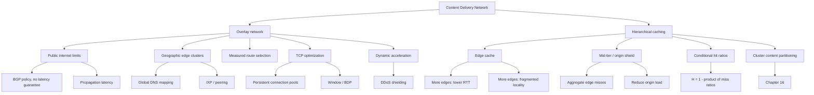

---

## 11. 核心结论

1. **CDN 是地理分布式 caching reverse proxies 构成的 overlay network。**
2. **CDN 的基础价值是 network substrate，不只是 cache。**
3. **公共互联网 interdomain routing 关注 reachability/policy，不保证最低 latency 或 congestion。**
4. **全球距离带来不可消除的传播时延；server CPU 再快也不能突破光速。**
5. **Global DNS load balancing 可结合位置、网络状态和 health 选择 cluster，但受 resolver、TTL 和映射精度限制。**
6. **部署在 IXP/ISP 附近可缩短 access path，并改善 peering 和 transit。**
7. **Overlay 可基于实时 telemetry 选择路径，连接池和合适 TCP window 可提高有效 bandwidth。**
8. **Dynamic uncacheable resources 仍可受益于 nearby frontend 和 optimized origin path。**
9. **CDN 可作为 DDoS shield，但必须防止 origin bypass，并限制穿透到 application 的 work。**
10. **更多 edge clusters 降低 client RTT，却会 fragment request locality，可能降低 long-tail hit ratio。**
11. **Intermediary cache/origin shield 聚合 edge misses，在地理分散与缓存 locality 之间折中。**
12. **分层总命中率为 $H=1-\prod_i(1-h_i)$，其中每层 $h_i$ 都是进入该层请求的 conditional hit ratio。**
13. **Origin capacity 必须按 cold cache、purge、failure 和 attack 的 miss burst 规划，不能只看平均 hit ratio。**
14. **Request hit ratio、byte hit ratio和 latency 是不同指标，应按 origin CPU、egress 和 user experience 分别优化。**
15. **Cluster 内 content 必须 partition；partitioning 突破容量，replication 提升 availability，两者通常组合。**

---

## 12. 一般化的解决问题思路

本章给出的不只是 CDN 配方，而是一种可复用的分布式系统分析法：

### 12.1 找到无法靠局部优化消除的下界

先问：瓶颈是 code、machine，还是 propagation、coordination、capacity 等结构性下界？若是光速导致的 RTT，就不能只优化 origin handler。

### 12.2 把工作或副本移动到需求附近

当远程访问成本占主导时，把 frontend/cache/compute 靠近 client，把长距离交互变成短 access path。

### 12.3 不要只优化 data plane 的一个维度

同时考虑：

- routing；
- latency/loss/bandwidth；
- connection setup/reuse；
- cache locality；
- origin capacity；
- failure/security/cost。

### 12.4 识别 scale-out 引入的反作用

增加 nodes/locations 常带来 fragmentation、coordination、duplication 和 control-plane complexity。Scale-out 不是单调收益。

### 12.5 用 hierarchy 同时保留“近”和“聚合”

Edge 提供 proximity，mid-tier 提供 locality aggregation。这个模式也出现在：

- DNS recursive hierarchy；
- multi-level CPU caches；
- log aggregation；
- storage gateways；
- regional service architecture。

### 12.6 用条件概率拆解端到端结果

不要直接相加局部命中率。沿请求路径写出每一步到达概率：

$$
P(reach\ layer\ i)=\prod_{j<i}(1-h_j)
$$

再计算 latency、load 和 cost，避免重复计数。

### 12.7 在平均情况之外设计最坏情况

问清：cache 全冷、批量 purge、一个 region down、origin slow、attack 到来时会怎样？很多 CDN 事故不是 steady-state hit ratio 不够高，而是 failure transition 没有边界。

### 12.8 明确抽象边界，再进入下一层

本章把 cluster 看成 cache；当发现单机放不下全部对象时，再打开 cluster 内部讨论 partitioning。好的系统分析会逐层暴露限制，而不是一开始把所有复杂度混在一起。

最终方法可压缩为：

```text
measure the physical/end-to-end bottleneck
-> separate network acceleration from cache offload
-> place edge capacity near demand
-> aggregate fragmented locality with hierarchy
-> quantify conditional hit/load/latency
-> partition beyond single-node capacity
-> test cold, failure, purge, attack, and cost boundaries
```
