> 本文严格沿原章顺序展开：先说明为何要 partition、gateway 与 metadata mapping、分区带来的复杂度及 cache 为何适合分区；再依次讨论 Range partitioning 的边界、热点、静态/动态再均衡，以及 Hash partitioning、modulo reshuffle、consistent hashing 和有序扫描损失。原章正文约 7 页；文中的容量/吞吐模型、scatter-gather 可靠性、分位点边界、负载方差、virtual nodes、迁移状态机和 C11 穷举实验用于补足直觉与工程边界，不应误认为原书逐字给出的生产算法。

## 0. 导读：当一台机器装不下、也扛不住时

### 0.1 Chapter 15 留下的问题

Chapter 15 的最后一句指出：一个 CDN cluster 的 content 太多，不可能由单台 server 全部保存，因此需要把 content 分散到多台 servers，每台只负责一个 subset。

这就是 partitioning（分区），也常称 sharding（分片）：

```text
one logical dataset
    -> partition by a key-to-partition rule
    -> place partitions on multiple nodes
```

它解决两类彼此相关但不完全相同的问题：

1. **Capacity scaling**：总数据量超过单机 storage/memory 上限；
2. **Throughput scaling**：单机 CPU、disk、network 或 request concurrency 饱和。

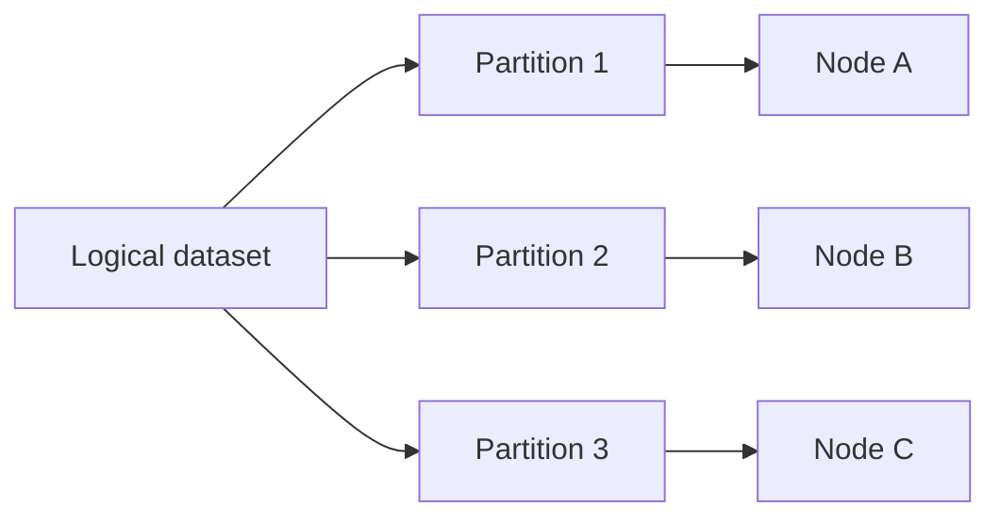

若请求能均匀落到各 partition，多个 nodes 可并行服务；但如果所有热门请求仍落到一个 partition，增加其他 nodes 并不能解除瓶颈。本章反复出现的核心问题因此是：

> 不仅要把 data 分开，还要把 data size、request load、迁移成本与有序访问需求分得合适。

### 0.2 Partition 是逻辑单位，node 是物理执行单位

这两个概念不能混用：

| 概念 | 含义 | 是否通常变化 |
| --- | --- | --- |
| Key | 一条记录或对象的定位值 | 随业务写入 |
| Partition/shard | Key space 的一个逻辑子集 | 可 split/merge 或固定 |
| Node/server | 承载 partition 的机器/进程 | 会扩缩容、故障、替换 |
| Replica | 同一 partition 的冗余副本 | 随复制策略变化 |

一个 node 可承载多个 partitions，一个 partition 也可有多个 replicas。原章为了突出映射逻辑，图中把 partition server 画得较直接；生产系统通常还要叠加 replication。

### 0.3 本章的两条主线

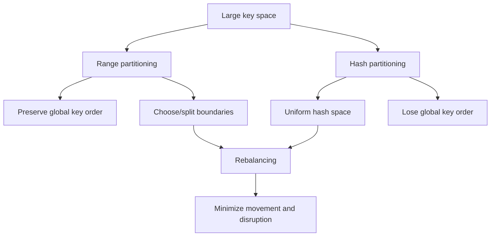

- Range partitioning 保留 key order，擅长 range scan，但边界和顺序热点难处理；
- Hash partitioning 打散 key，通常更易均衡条目数，但丢失跨 partition 的排序 locality；
- 两者都必须面对 rebalancing、hot partition、routing metadata 与跨 partition 操作。

---

## 1. Partitioning 是什么，为什么要引入

### 1.1 从单机容量上限推导分区

设：

- 总数据量为 $D$；
- 单 node 可安全用于数据的容量为 $C$；
- 预留系数为 $0<u<1$，用于 compaction、temporary files、growth 和 failure recovery；
- 暂不考虑 replication。

至少需要：

$$
N_{capacity}\ge
\left\lceil\frac{D}{uC}\right\rceil
$$

例如：

- $D=40\ \mathrm{TB}$；
- 每台机器有 $C=8\ \mathrm{TB}$ 可用 disk；
- 只允许使用 $u=0.7$，避免满盘；

则：

$$
N_{capacity}\ge
\left\lceil\frac{40}{0.7\times8}\right\rceil
=\lceil7.143\rceil=8
$$

若 replication factor 为 $r$，粗略物理存储需求变为 $rD$：

$$
N_{storage}\ge
\left\lceil\frac{rD}{uC}\right\rceil
$$

但 replicas 是否能独立承担 read、写入是否要同步到 quorum，还会影响 throughput，不能只乘一个容量系数就结束设计。

### 1.2 从请求吞吐上限推导分区

设 node $i$ 的稳定服务能力为 $\mu_i$，若请求完全可按 partition 并行且没有其他瓶颈，系统总吞吐上界近似：

$$
Throughput\le\sum_{i=1}^{N}\mu_i
$$

若所有 nodes 同构，每台能力为 $\mu$：

$$
Throughput\lesssim N\mu
$$

这是理想上界，成立需要：

- 请求分布均匀；
- gateway、coordination service、network 不先饱和；
- 大部分操作是单 partition；
- replication/transaction overhead 可控；
- 没有一个 hot key 限制整体进度。

若最热 partition 的到达率为 $\lambda_{max}$，其所在 node 能力为 $\mu_{owner}$，稳定条件至少要求：

$$
\lambda_{max}<\mu_{owner}
$$

即使其他 nodes 全部空闲，只要这个条件失败，热门请求仍会排队。Partitioning 提供并行机会，但不会自动创造均衡 workload。

### 1.3 Partition key 决定系统的局部性

Partition key 是用于决定记录归属的 key 或 key tuple。例如：

- `user_id`；
- `(tenant_id, user_id)`；
- `timestamp`；
- `hash(object_url)`；
- `(random_bucket, current_date)`。

选择 partition key 等于提前回答：

1. 哪些数据应在同一 partition？
2. 哪些请求必须单 partition 完成？
3. 哪些 workload 可以均匀分散？
4. 哪些查询会变成 scatter-gather？
5. 热 key 能否继续拆分？

错误 partition key 往往比错误机器规格更难修，因为它会进入数据布局、API、transaction boundary 和 migration protocol。

## 2. Request routing：client 如何找到正确 partition

### 2.1 Figure 16.1 的结构

Client 面对的是一个逻辑系统，不应自行猜测数据在哪台 node。原章引入 gateway service，也就是 reverse proxy，根据 partition mapping 把请求路由给负责节点：

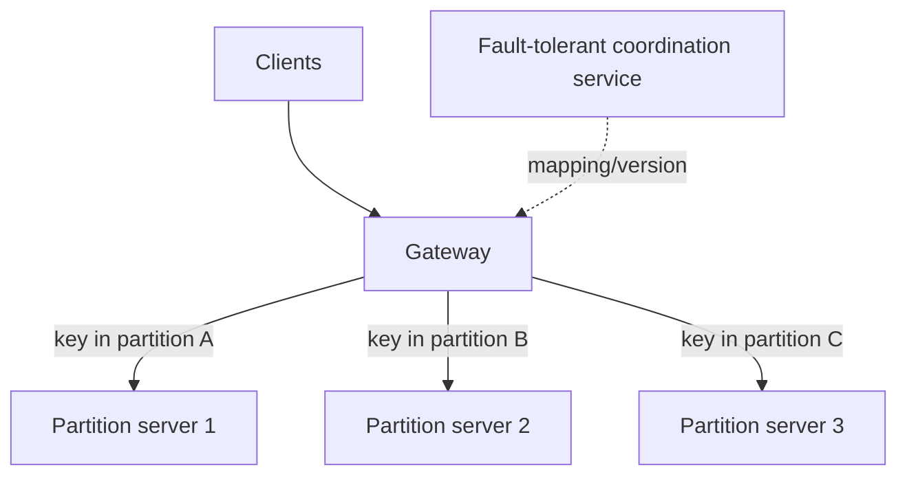

Mapping 可能包含：

```text
partition -> leader / replicas / health / placement epoch
```

或：

```text
key range / hash interval -> partition -> node replicas
```

### 2.2 为什么 mapping 需要 fault-tolerant coordination service

原章列举 etcd 和 ZooKeeper。原因是 mapping 属于 control-plane metadata：

- node 会故障、扩容、缩容；
- partition 会迁移、split、merge；
- replica leader 会切换；
- 多个 gateways 必须对当前 owner 达成一致；
- 旧 mapping 可能把写发送给不再负责的 node。

若 metadata store 单点故障，data nodes 即使健康也可能无法正确路由。因此 mapping 通常需要：

- consensus-backed replication；
- monotonic version/epoch；
- watch/notification；
- atomic metadata update；
- durable ownership state。

协调服务不应承载每个 data request。Gateway 一般本地 cache mapping，只在版本变化、cache miss 或 redirect 时更新，否则 coordination service 会成为 data-plane bottleneck。

### 2.3 Stale mapping 如何处理

一种稳健流程是：

```text
1. Gateway sends request with mapping epoch e.
2. Node verifies that it still owns the partition at epoch e.
3. If yes, process the request.
4. If no, reject/redirect with a newer epoch or owner hint.
5. Gateway refreshes metadata and retries within a bounded budget.
```

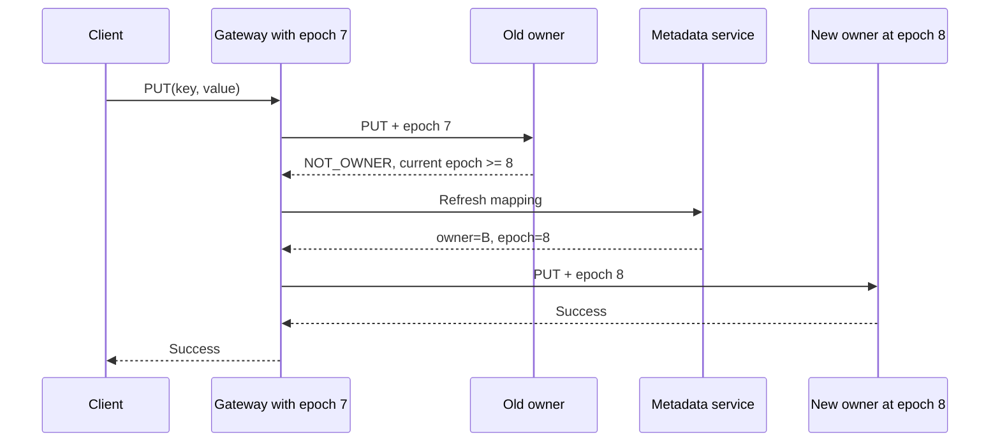

Retry 写请求还必须结合 idempotency key、request ID 或 conditional write，避免“旧 owner 已成功但 reply 丢失”后重复副作用。

### 2.4 Gateway 不是唯一 routing 方式

原章使用 gateway 作为常见结构。生产系统还可能：

- client library 直接持有 partition map；
- 任意 node 接收请求后 forward；
- load balancer 先到 gateway pool，再由 gateway 路由；
- database coordinator 拆解 query 并访问多个 shards。

| 方式 | 优点 | 代价 |
| --- | --- | --- |
| Gateway routing | Client 简单、策略集中 | 多一跳，gateway 要扩展和高可用 |
| Smart client | 少一层转发 | Client 复杂、版本和语言生态难维护 |
| Any-node forwarding | 接入简单 | 内部流量多，node 同时承担 routing |

无论采用哪种形式，都绕不开“谁持有 mapping、如何版本化、迁移时如何拒绝 stale owner”。

---

## 3. Partitioning 不是 free lunch

作者在介绍具体算法前，先列出复杂度。这一顺序很重要：先知道代价，才不会把“加 shards”误当成无条件线性扩展。

### 3.1 代价一：必须正确路由

未分区时，一个 endpoint 可以访问完整数据；分区后，每个请求都依赖 key-to-partition-to-node mapping。

Routing path 新增：

- metadata lookup/cache；
- owner health check；
- topology change handling；
- stale route redirect；
- gateway scaling；
- retry 与 duplicate control。

因此 partition metadata 是正确性数据，不只是 performance hint。

### 3.2 代价二：跨 partition 聚合

例如全局：

```sql
SELECT country, COUNT(*)
FROM users
GROUP BY country;
```

若 `users` 按 `user_id` 分区，每个 partition 只有一部分国家数据。Coordinator 必须执行 scatter-gather：

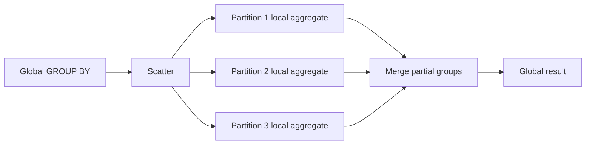

有效做法是先在每个 partition 做 local aggregation，再合并 partial results，避免传输所有 rows：

$$
GlobalCount(g)=\sum_{i=1}^{m}LocalCount_i(g)
$$

但不是所有 operation 都能简单合并。例如：

- exact global median 不能只合并各 shard median；
- global top-$k$ 要考虑候选集大小和 tie；
- arbitrary join 可能触发 data shuffle；
- distinct count 可能需要大集合或近似 sketch。

### 3.3 Scatter-gather 的 latency 与可靠性

若 query 必须等待 $m$ 个 partitions，全局 latency 近似：

$$
T_{query}\approx
\max_{1\le i\le m}(T_i)+T_{merge}
$$

不是平均 shard latency，而是最慢 shard 加 merge。Fan-out 越大，遇到 tail latency 的概率越高。

若每个 partition 独立成功概率为 $1-p$，且必须全部成功，则：

$$
P(all\ succeed)=(1-p)^m
$$

若 $p=0.001$、$m=100$：

$$
P(all\ succeed)=0.999^{100}\approx90.48\%
$$

也就是说，单 shard 99.9% 的成功率，在 100-way fan-out 下不足以给出 99.9% 的全局成功率。现实故障往往相关，独立假设甚至可能过于乐观。

缓解方式包括：

- 减少 fan-out；
- 让常见 query 与 partition key 对齐；
- partial result/approximation；
- deadline propagation；
- hedged read（谨慎使用，避免放大 load）；
- materialized aggregate/index；
- 分层聚合。

### 3.4 代价三：跨 partition transaction

如果一个业务 invariant 涉及多个 partitions，例如从 shard A 的账户扣款并向 shard B 加款，atomic update 需要 distributed transaction 或重构业务语义。

前文 Chapter 12 已说明 2PC 的协调和 failure-recovery 代价。分区越多、跨 shard transaction 越常见：

- lock/intent 覆盖更多 nodes；
- commit latency 受最慢 participant 限制；
- failure window 增大；
- coordination 限制 horizontal scalability。

最有效的优化通常不是“让 2PC 更快”，而是选 partition key，使强 invariant 所需数据尽量 co-locate：

```text
transaction boundary ~= partition boundary
```

无法 co-locate 时再选择 2PC、Saga、escrow、reservation、outbox 或 eventual reconciliation，并明确 consistency tradeoff。

### 3.5 代价四：hot partition 限制 scale-out

设 partition $i$ 的 load 为 $L_i$，平均 load：

$$
\overline{L}=\frac{1}{P}\sum_{i=1}^{P}L_i
$$

可用简单 skew ratio 描述最坏倾斜：

$$
Skew=\frac{\max_i L_i}{\overline{L}}
$$

- $Skew\approx1$：负载接近均匀；
- $Skew\gg1$：某个 partition 远热于平均值。

Hot partition 可能来自：

- 条目数更多；
- 单条记录更大；
- 某个 key 极热门；
- query cost 不均匀；
- sequential key 把新写集中到末端；
- tenant 大小差异；
- 一台 node 恰好承载多个热门 partitions。

“Entry count 均匀”因此不等于“load 均匀”。

### 3.6 代价五：在线增删 partitions 需要移动数据

Rebalancing 的目标不是只算出新 mapping，还要在持续服务时安全搬迁：

- copy 大量 data 消耗 network/disk；
- migration 与 foreground request 竞争资源；
- copy 期间还有 concurrent writes；
- gateway mapping 不能提前或过晚切换；
- failure 后必须知道从哪个 phase 恢复；
- old copy 最终要安全删除。

一个简化迁移状态机：

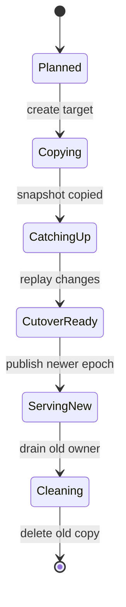

核心不变量是：

1. Cutover 前，old owner 仍是 authoritative；
2. Cutover 时，target 已包含 snapshot 与之后的 writes；
3. Mapping epoch 原子推进；
4. Old owner 不接受新 epoch 的写；
5. 确认无 stale traffic 后才能删除 old copy。

具体系统可能用 dual-write、change log、snapshot + WAL catch-up 或 replica promotion。原章只强调最小化 disruption 和 transfer amount；上述状态机是工程展开。

## 4. 为什么 cache 特别适合 partitioning

作者紧接 Chapter 15 讨论 partitioning 不是巧合。Cache 通常避开许多最困难的跨 partition 操作：

- 不需要全局 `GROUP BY`；
- 很少需要跨 keys 的 atomic update；
- object 可由 origin 重新 fetch；
- 某个 cache node 丢失往往表现为 miss，而不是 durable data loss；
- key lookup 天然可独立路由。

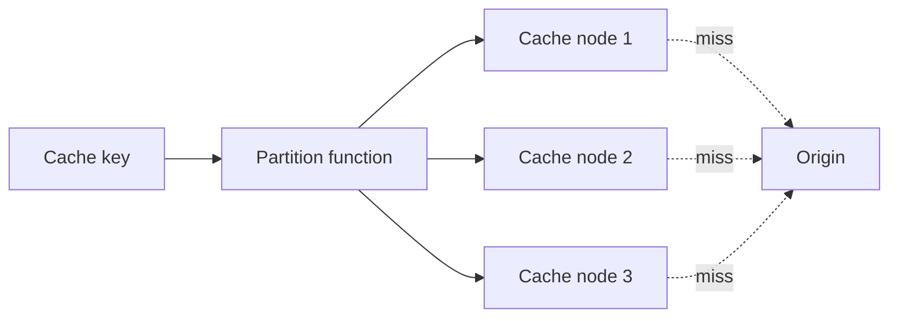

但“cache 好分区”不表示没有风险：

- hot object 仍会压垮单 owner；
- node loss 会引起 cache miss storm；
- remapping 会造成大面积 cold cache；
- cache stampede 会穿透 origin；
- large object 会造成容量偏斜。

一致性要求较低，主要是让 failure consequence 从“数据丢失”降为“性能退化”；origin 是否能承受这种退化仍需验证。

## 5. Key space 的前提

作者在进入两种方法前给出共同前提：possible keys 必须足够多。

若 partition key 是 boolean，只有 `{false,true}` 两种值，则按该 key 最多形成两个非空 groups。即使创建 100 个 partitions，也只有两个能收到数据。

一般地，若 partition key 的 distinct cardinality 为 $K_d$：

$$
NonEmptyPartitions\le\min(P,K_d)
$$

其中 $P$ 是目标 partition 数。

低 cardinality 字段（如 `country`、`status`、`plan_type`）不一定完全不能用，但必须结合：

- composite key；
- hash suffix；
- tenant/user ID；
- hierarchy；
- region-specific placement。

例如 `(country, hash(user_id) mod 64)` 能在保留 country grouping 的同时继续拆分，但查询一个 country 时可能 fan-out 到 64 buckets。

---

## 6. 16.1 Range partitioning

### 6.1 定义：按连续 key range 切分

Range partitioning 把 key space 按 lexicographic order 切成相邻区间。Figure 16.2 的英文单词例子：

```text
[A, I)   -> P1: A-H
[I, Q)   -> P2: I-P
[Q, +inf)-> P3: Q-Z
```

`be`、`for`、`have` 都落在 A-H partition。

形式化地，给定有序 boundaries：

$$
b_0<b_1<\cdots<b_P
$$

partition $i$ 可定义为半开区间：

$$
P_i=[b_i,b_{i+1})
$$

半开区间避免 boundary key 同时属于两个 partitions。最后一个区间可用 $+\infty$ 作上界。

### 6.2 Lexicographic order 是什么

Lexicographic order 类似字典序，但实际比较规则取决于 key encoding/collation：

- byte order；
- Unicode code point/collation；
- case sensitivity；
- locale；
- composite-key encoding；
- numeric value vs numeric string。

例如按字符串比较时：

```text
"10" < "2"
```

因为先比较字符 `'1'` 与 `'2'`。若业务想按数值排序，必须使用保持数值 order 的 encoding，而不是随意把 integer 转成 decimal string。

### 6.3 为什么每个 partition 内也要有序存储

作者指出，为了快速 range scan，每个 partition 通常在 disk 上保持 sorted order。

查询：

```sql
WHERE key >= 'cat' AND key < 'fox'
```

可以：

1. 通过 boundaries 找到起始 partition；
2. 在 partition 内 seek 到 `'cat'`；
3. 顺序读取到 partition end；
4. 必要时继续下一个相邻 partition；
5. 到 `'fox'` 停止。

如果 partition 内无序，即使 partition range 正确，也可能必须扫描整个 partition。

典型有序结构包括 B-tree/B+tree、LSM-tree 的 sorted runs/SSTables。具体 storage engine 不在原章范围，但“range layout + local sorted structure”共同提供 scan locality。

### 6.4 Point lookup 与 range scan

有序 boundaries 数量为 $P-1$ 时，可用 binary search 找 owner：

$$
T_{route}=O(\log P)
$$

若 metadata 使用树形索引，range scan 访问 $q$ 个 partitions、返回 $R$ 条记录，粗略成本为：

$$
T_{scan}\approx
O(\log P)+\sum_{i=1}^{q}Seek_i+O(R)
$$

Range partitioning 的优势不是 point lookup 一定比 hash 快，而是邻近 keys 保持邻近，能顺序遍历和做 ordered merge。

## 7. Range challenge 1：如何选择 boundaries

### 7.1 等宽边界何时有效

如果 numeric key 在 $[L,U)$ 近似均匀，切成 $P$ 个等宽区间：

$$
b_i=L+i\frac{U-L}{P}
$$

每个 partition 期望条目数接近 $K/P$。

但 uniform key space 不等于 uniform observed keys。英文词典就是作者的反例：不同首字母下单词数量差异很大，把 A-Z 每 8/9 个字母切一段不会得到相同条目数。

### 7.2 用 quantile 选择等量边界

设 key distribution 的 cumulative distribution function 为 $F(x)$。若目标是让每个 partition 条目数近似相等，可选择：

$$
b_i=F^{-1}\left(\frac{i}{P}\right),
\qquad i=1,\ldots,P-1
$$

即用 quantile 而不是 key-space 等宽位置。

例：10,000 个 keys 的 quartile 为：

```text
Q25 = "d..."
Q50 = "m..."
Q75 = "s..."
```

边界应接近 `[A,d) [d,m) [m,s) [s,Z]`，而不是机械按 `[A,G) [G,M) ...`。

前提与局限：

- 需要 sample/statistics；
- distribution 会随时间变化；
- 相同 key 不能从中间切开；
- 条目大小可能不同；
- 等条目数仍可能不等 request load。

### 7.3 按 data size 或 access work 选边界

若记录大小差异大，目标可改成每个 range 的 bytes 接近：

$$
Bytes(P_i)\approx\frac{TotalBytes}{P}
$$

若 query cost 主导，则应按 work weight：

$$
Work(P_i)=\sum_{k\in P_i}\lambda_k c_k
$$

其中 $\lambda_k$ 是 key 的访问率，$c_k$ 是单次处理成本。

这说明“balanced”必须先定义：按 entries、bytes、requests、CPU、disk I/O，还是组合指标？不同目标可能给出不同 boundaries。

## 8. Range challenge 2：顺序访问热点

### 8.1 按日期分区为何会 hot

若按 date range 分区：

```text
old dates -> old partitions
today     -> current partition
future    -> empty
```

所有当天 writes/reads 都集中到一个 owner：

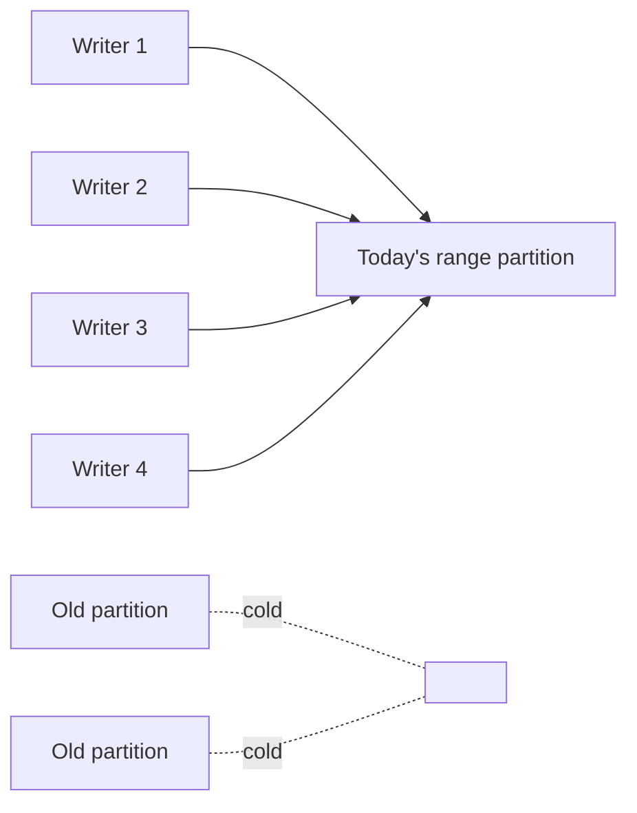

这类问题称为 append hotspot 或 monotonically increasing key hotspot。Data size 可能均匀，但 current load 极不均匀。

### 8.2 Random prefix 如何打散热点

原章给出一种办法：在 partition key 前添加 random prefix。

原 key：

```text
2026-08-13T10:20:30Z
```

加 $B=4$ 个 buckets：

```text
0#2026-08-13T10:20:30Z
1#2026-08-13T10:20:30Z
2#2026-08-13T10:20:30Z
3#2026-08-13T10:20:30Z
```

若 writes 独立均匀选择 prefix，单 bucket 期望 write rate：

$$
E[\lambda_b]=\frac{\lambda}{B}
$$

### 8.3 为什么 random prefix 有代价

原来“今天的所有记录”是一个连续 range；加 prefix 后分散为 $B$ 个 ranges。读取当天全部记录需要：

1. 向每个 prefix range 发请求；
2. 得到 $B$ 个有序 streams；
3. 做 $B$-way merge；
4. 处理 partial failure、pagination 和 duplicate。

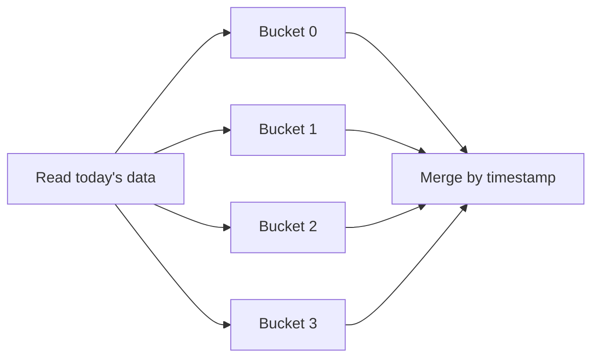

所以 random prefix 是用 read fan-out 和查询复杂度换 write distribution。Bucket 数也不是越多越好：更多 buckets 降低单 bucket load，却增加 read fan-out、metadata 与小 partition overhead。

### 8.4 其他热点缓解方法

补充的工程选项包括：

- `(time_window, hash(entity_id) mod B)` composite key；
- 动态 split 当前 hot range；
- 为 hot key 建多个 read replicas；
- 写入先进入 partitioned log，再异步按时间归并；
- 隔离超大 tenant；
- 对 hot key 使用 application-level subkeys；
- adaptive routing/replication。

选择依据是 workload：read-heavy hot key 适合 replication，write-heavy single key 往往需要语义拆分，单纯加 replicas 不能让冲突写无限并行。

---

## 9. Rebalancing：扩缩容时如何保持服务

### 9.1 定义与目标

作者把增删 nodes、重新平衡系统 load 的过程称为 rebalancing。

触发原因：

- data growth/shrink；
- request load growth/drop；
- node failure/replacement；
- hot partition；
- hardware heterogeneity；
- maintenance 或 zone evacuation。

目标不只是最终 balanced，还包括迁移期间：

- system continues serving requests；
- correctness 不被破坏；
- moved bytes 尽量少；
- foreground latency 可控；
- recovery 可重复、可观测。

### 9.2 为什么移动量必须最小

设总数据量 $D$，迁移比例 $f$，可用于后台迁移的有效 bandwidth 为 $B_m$，理想最短迁移时间：

$$
T_{move}\ge\frac{fD}{B_m}
$$

若 $D=100\ \mathrm{TB}$、$f=0.25$、后台限速 $B_m=500\ \mathrm{MB/s}$：

$$
T_{move}\ge
\frac{25\times10^6\ \mathrm{MB}}{500\ \mathrm{MB/s}}
=50{,}000s\approx13.9h
$$

这还没计入 replication、protocol overhead、concurrent writes、checksum 和 retry。移动比例从 25% 变为 75%，迁移窗口大约扩大三倍，并长期干扰前台 workload。

## 10. Static partitioning

### 10.1 方法

系统初始化时创建远多于当前 nodes 的 logical partitions，并让每个 node 承载多个 partitions：

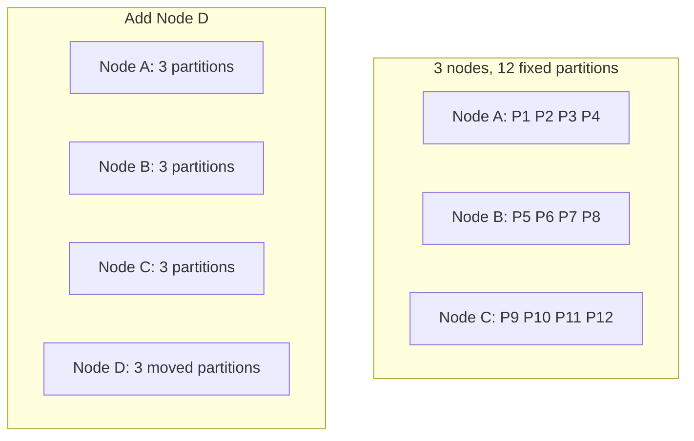

新增 node 时，只需把一些完整 partitions 从旧 nodes 搬到新 node；partition key-space boundaries/IDs 不变。

### 10.2 为什么叫 static

Static 的是 logical partition count，而不是 node count、placement 或数据内容：

- $P$ 个 logical partitions 固定；
- $M$ 个 physical nodes 可变化；
- placement `partition -> node` 可重排。

理想情况下每 node 承载约：

$$
\frac{P}{M}
$$

个 partitions。若 partitions 足够细，就能用迁移少数单位近似均衡 nodes。

### 10.3 Partition 数太少

若 $P=16$：

- physical nodes 不可能有效扩到远超 16 个 data owners；
- 每次迁移粒度大；
- hot partition 难继续拆；
- heterogenous nodes 难按容量细调。

### 10.4 Partition 数太多

若 $P$ 极大，会增加：

- metadata 数量；
- per-partition file/index/memory overhead；
- compaction/flush scheduling；
- heartbeat/replication state；
- recovery task 数；
- tiny partition 效率损失。

所以 static partitioning 需要提前估计未来 scale。作者强调“太多有 overhead、降低 performance；太少限制 scalability”，这不是能靠一个普适常数解决的问题。

### 10.5 Static partitions 仍会 hot

即使 entries 按 hash 均匀，某些 partitions 仍可能因为 hot keys 更忙。固定 partition 无法直接 split，只能：

- 把整个 hot partition 移到独占/更强 node；
- 增加 read replicas；
- application-level split hot key；
- 改变 partitioning scheme；
- 预留足够多且足够细的 partitions。

---

## 11. Dynamic partitioning

### 11.1 方法

Dynamic partitioning 按需要创建 partitions：

1. 系统可从一个 partition 开始；
2. Partition 超过 size threshold 或变得 too hot；
3. 将其 split 为两个 sub-partitions；
4. 两边各含约一半 data/work；
5. 把一个 sub-partition 移到新 node；
6. 相邻 partitions 足够小或 cold 时可 merge。

```mermaid
flowchart LR
    P[[A, Z)] -->|split at M| P1[[A, M)]
    P -->|split at M| P2[[M, Z)]
    P1 --> N1[Old node]
    P2 --> N2[New node]
```

### 11.2 Split point 如何选择

“一半”可能指：

- 一半 key range；
- 一半 entries；
- 一半 bytes；
- 一半 request rate；
- 一半 weighted work。

若数据倾斜，key-space midpoint 不等于 data median；若访问倾斜，data median 也不等于 load median。

一个 practical score 可写成：

$$
Score(x)=
w_b\left|Bytes(left_x)-Bytes(right_x)\right|
+w_q\left|QPS(left_x)-QPS(right_x)\right|
$$

在可选 key boundary 中寻找 score 较小的 split point。这是解释性模型，不是原书指定算法。

### 11.3 Merge 为什么要求 adjacent

Range partitions 必须保持覆盖连续且互不重叠。只有相邻 ranges：

$$
[a,b)\quad\operatorname{and}\quad[b,c)
$$

能自然合并为：

$$
[a,c)
$$

若合并不相邻 partitions，会得到不连续 key set，破坏简单 boundary routing 和 ordered scan。

### 11.4 Split/merge 需要 hysteresis

若 split threshold 和 merge threshold 相同，load 在边界附近波动会导致反复 split/merge（thrashing）。应设：

$$
MergeThreshold<SplitThreshold
$$

并结合：

- sustained duration；
- cooldown；
- migration budget；
- minimum partition size；
- forecasted growth。

例如：超过 100 GB 持续 30 分钟才 split；两个相邻 partitions 都低于 30 GB 且 cold 一天才 merge。

### 11.5 Static 与 dynamic 对比

| 维度 | Static partitioning | Dynamic partitioning |
| --- | --- | --- |
| Logical partition count | 初始化后固定 | 按需 split/merge |
| 扩容动作 | 移动现有 partitions | split 后移动 sub-partition |
| 规划难度 | 要预估未来 partition 数 | 要设计在线 split/merge |
| Metadata | 数量较稳定 | 持续变化、版本更复杂 |
| 热点适应 | 固定粒度，能力有限 | 可按 size/load 拆分 |
| Overhead | 取决于预建数量 | 取决于动态操作频率 |
| Ordered range | 可支持 | 天然适配相邻 split/merge |

---

## 12. 16.2 Hash partitioning

### 12.1 定义

Hash function 将 key 确定性映射为某个有限范围内看似随机的整数：

$$
h=H(key),\qquad 0\le h<2^w
$$

原章以 $w=64$ 为例，即：

$$
0\le h\le2^{64}-1
$$

再把 hash space 的 subsets 分配给 partitions。最简单的方法是：

$$
partition(key)=H(key)\bmod N
$$

其中 $N$ 是 partition 数。

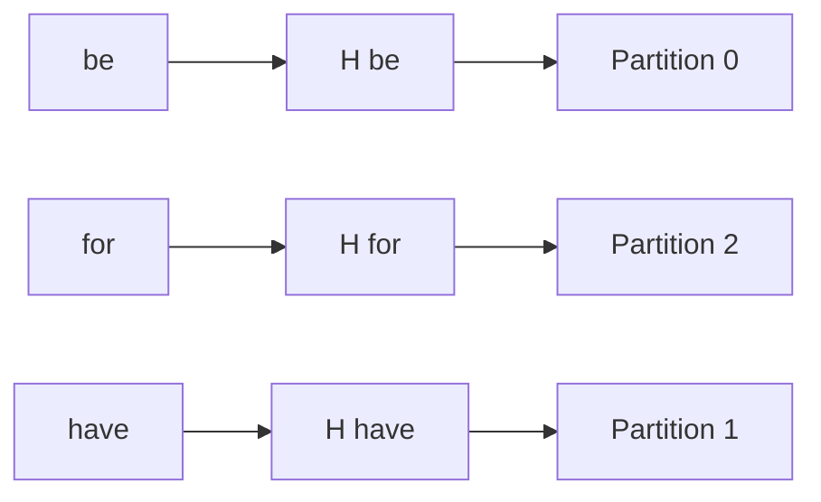

与 range 不同，语义相近或相邻的 keys 会被刻意打散。

### 12.2 Hash function 需要哪些性质

Partition hash 通常需要：

- **Deterministic**：相同 key 和算法总得到相同 hash；
- **Uniform enough**：业务 key pattern 不应集中到 hash space 小区域；
- **Stable specification**：不同 clients/nodes 对 encoding、seed、version 一致；
- **Fast**：routing 位于 hot path；
- **Sufficient width**：减少 collision/偏斜风险。

Partitioning 通常不要求 cryptographic collision resistance，但若攻击者可控制 keys，弱 hash 可能被 adversarially 制造 collision/hotspot，需要 keyed hash 或安全防护。

“Hash guarantees uniform”应理解为：在合适 hash function 和 input assumptions 下，输出近似均匀；没有任何函数能让一个反复出现的相同 key 变成多个不同 owners。

### 12.3 条目数为何趋于均匀

假设 $K$ 个 distinct keys 的 hashes 独立均匀落到 $N$ 个 partitions。对某个 partition，条目数 $X$ 近似：

$$
X\sim Binomial\left(K,\frac{1}{N}\right)
$$

期望：

$$
E[X]=\frac{K}{N}
$$

方差：

$$
Var(X)=K\frac{1}{N}\left(1-\frac{1}{N}\right)
$$

当 $K\gg N$ 时，相对随机波动通常较小，所以 partitions 的 entry counts 大致接近。

前提：

- keys 足够多；
- hash 近似均匀；
- entry sizes 相近；
- 不考虑 hot-key access weights。

若少数 values 很大，条目数均匀仍可能 bytes 不均匀。

## 13. Hash 均匀不等于访问负载均匀

作者立即指出 hash partitioning 不能消除 non-uniform access pattern。

设 key $k$ 的请求率为 $\lambda_k$，partition $j$ 的总请求率：

$$
L_j=\sum_{k:H(k)\mapsto j}\lambda_k
$$

Hash 只随机组合 keys，无法改变某个 $\lambda_k$。如果一个 single key 占全站 30% 流量，它最终仍只落到一个 partition，这个 owner 至少承受 30%。

### 13.1 增加 partitions 的作用与边界

原章提出：可增加总 partitions，进一步 split hot partition。

这对“很多 moderately hot keys 恰好聚在一起”有效，因为重新细分后它们可分散；但对“一个 indivisible hot key”无效：无论 $N$ 多大，该 key 的 hash 仍只有一个 owner。

### 13.2 将 hot key 拆成 subkeys

作者给出 random prefix：

```text
hot-key -> 0#hot-key, 1#hot-key, ..., B-1#hot-key
```

这需要业务能把 state 分解。例如 counter 可将 increments 分到 $B$ 个 partial counters，读取时求和：

$$
Counter=\sum_{b=0}^{B-1}Counter_b
$$

它不适用于所有语义：一个必须线性化更新的唯一余额不能随意拆成随机子余额，否则会破坏 invariant。Key splitting 是数据模型变化，不只是 routing trick。

---

## 14. Modulo rebalancing 的灾难性 reshuffle

### 14.1 为什么 `hash mod N` 简单

优点：

- 无需保存复杂 boundaries；
- $O(1)$ 计算；
- 固定 $N$ 时大致均匀；
- client/gateway 易实现。

问题出在 $N$ 变化。

### 14.2 从 $N$ 扩到 $N+1$

旧映射：

$$
p_{old}=h\bmod N
$$

新映射：

$$
p_{new}=h\bmod(N+1)
$$

绝大多数 $h$ 的余数会变化。

因为 $N$ 与 $N+1$ 互质，在一个长度为 $N(N+1)$ 的完整周期内，只有 $N$ 个 hash values 满足两个余数相同，所以 unchanged fraction 为：

$$
P(unchanged)=\frac{N}{N(N+1)}=\frac{1}{N+1}
$$

Moved fraction 为：

$$
P(moved)=1-\frac{1}{N+1}=\frac{N}{N+1}
$$

从 3 个 partitions 增至 4 个，约：

$$
P(moved)=\frac{3}{4}=75\%
$$

而理想情况只需给新 partition 约四分之一数据。这就是 modulo 扩容会造成 massive shuffle 的原因。

### 14.3 Shuffle 为何昂贵

大量 keys 改 owner 会同时造成：

- network copy；
- source disk read 和 target disk write；
- replication rebuild；
- cache invalidation/cold miss；
- metadata/version churn；
- foreground request contention；
- 更长的 dual-ownership window。

因此作者提出理想目标：新增一个 partition 时，仅移动新 partition 应获得的 key share。若扩容后总数为 $N$，期望约移动：

$$
\frac{K}{N}
$$

个 keys；若用 $N$ 表示扩容前数量，则同一数量写作 $K/(N+1)$。明确约定可避免把原章公式误解成 off-by-one。

---

## 15. Consistent hashing

### 15.1 核心思想：把 partitions 和 keys 放到同一个环

Consistent hashing 将 partition identifiers 与 keys 都 hash 到一个首尾相接的空间。每个 key 归属于从 key 位置顺时针遇到的第一个 partition。

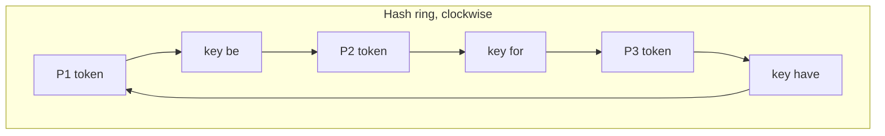

若 partition tokens 按升序：

$$
t_1<t_2<\cdots<t_N
$$

key hash 为 $h$：

1. 找最小的 $t_i\ge h$；
2. 若存在，owner 为 $t_i$ 对应 partition；
3. 若不存在，wrap around 到 $t_1$。

Lookup 可对 sorted tokens binary search：

$$
T_{lookup}=O(\log N)
$$

### 15.2 Partition 拥有哪个区间

顺时针 successor rule 意味着 token $t_i$ 拥有：

$$
(t_{i-1},t_i]
$$

环首节点还拥有从最后 token 到 ring end、再从 ring start 到自己的 wrap-around 区间。

这是容易说反的地方：新增 token 不会抢“它到 successor”的区间，而是抢“predecessor 到它”的区间，原 owner 是它的 clockwise successor。

### 15.3 Figure 16.4 的例子

原图中 P1、P2、P3 和 `be`、`for`、`have` 随机分布在环上：

- `be` 顺时针遇到 P2，归 P2；
- `for` 顺时针遇到 P3，归 P3；
- `have` 顺时针遇到 P3，归 P3。

Hash order 与 lexicographic order 无关，`for` 与 `have` 靠近只是图中 hash 结果。

### 15.4 Figure 16.5：新增 P4 时只移动局部区间

P4 插入 `for` 与 P3 之间后：

- `for` 顺时针先遇到 P4，从 P3 改归 P4；
- `have` 仍先遇到 P3；
- `be` 仍归 P2；
- 其他不落在 P4 新取得区间的 keys 不变。

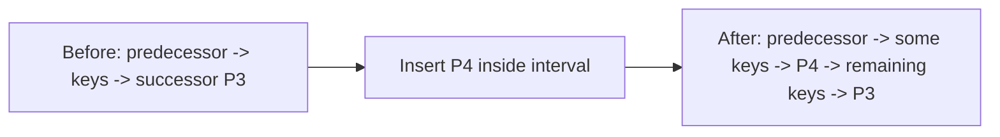

这就是 consistency：membership 小变化只使一小部分 keys remap，而不是表示数据一致性模型中的 linearizability 或 causal consistency。

### 15.5 期望移动量

假设：

- 旧有 $N$ 个 partition tokens 独立均匀分布；
- 新 token 也独立均匀；
- keys 在 ring 上均匀；

新增第 $N+1$ 个 partition 后，它在对称性下期望获得：

$$
E[f_{new}]=\frac{1}{N+1}
$$

所以期望移动 keys：

$$
E[K_{moved}]=\frac{K}{N+1}
$$

删除一个 partition 时，只有它原有区间的 keys 迁给 clockwise successor，期望也是约 $K/N$（删除前有 $N$ 个 partitions）。

注意这是 expectation。Basic consistent hashing 中单个随机 interval 可能很大或很小，并不保证每个 partition 恰好获得 $1/N$。

### 15.6 Consistent hashing 不自动保证均衡

如果每个 physical node 只有一个 random token，ring intervals 长度随机，可能出现：

- 一个 node 获得很大区间；
- 一个 node 获得很小区间；
- node capacity 不同却获得相似随机份额；
- hot keys 仍集中。

因此“consistent”描述的是 remapping stability，不是 load balance guarantee。

### 15.7 Virtual nodes（补充）

常见改进是让一个 physical node 在 ring 上拥有多个 virtual nodes/tokens：

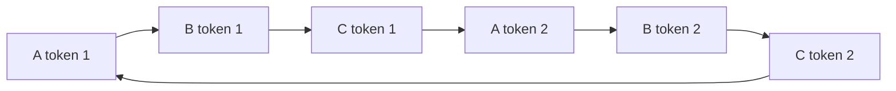

收益：

- 每个 physical node 汇总多个小 intervals，随机不平衡被平均；
- 添加 node 时可从许多 old nodes 各取少量 ranges；
- 可按机器 capacity 分配不同 token 数；
- failure load 更分散给多个 successors（视 placement/replication 而定）。

在一个简化随机模型中，$N$ 个 physical nodes、每个 $V$ 个独立 tokens，单 node ring share 的 coefficient of variation 约为：

$$
CV\approx
\sqrt{\frac{N-1}{NV+1}}
\approx\frac{1}{\sqrt{V}}
$$

前提是 token/random-key 均匀且忽略 hot-key、data-size 差异。增加 $V$ 降低随机区间 skew，但会增加 metadata、routing table 和 migration unit 数。

### 15.8 Consistent hashing 与 rendezvous hashing

Rendezvous/highest-random-weight hashing 是另一类减少 membership change remapping 的方法：对每个 `(key,node)` 算 score，选择最高者。它无需显式环，且易做 weighted placement。

原章只介绍 consistent hashing；这里提及 rendezvous hashing 是为了避免误以为“生产系统只能用 hash ring”。选择取决于：

- membership size；
- lookup cost；
- weighted nodes；
- replication placement；
- implementation ecosystem。

---

## 16. Hash partitioning 的主要缺点：全局顺序丢失

### 16.1 为什么不能高效全局 range scan

Range partitioning 中相邻 keys 位于相邻 ranges；hash 后：

```text
H("apple"), H("apricot"), H("banana")
```

在 hash space 中没有保持字典顺序。查询：

```sql
WHERE key >= 'apple' AND key < 'banana'
ORDER BY key
```

可能需要：

1. fan-out 到所有 hash partitions；
2. 每个 partition 过滤并 local sort；
3. coordinator 做 $N$-way merge；
4. 处理 pagination 和 partial failure。

因此 hash partitioning 以 order locality 换 distribution simplicity。

### 16.2 Partition 内仍可按 secondary key 排序

作者特别说明：虽然跨 partitions 的 global sort order 丢失，单个 partition 内仍可基于 secondary key 排序。

例如按 `hash(tenant_id)` 分区，在每个 partition 内按 `(tenant_id, timestamp)` 排序：

- 查询单 tenant 的 timeline 可路由到一个 partition 并有序扫描；
- 查询所有 tenants 的全局 timestamp order 仍需 fan-out/merge。

```text
partition key decides placement
secondary/clustering key decides local order
```

二者职责不同。

### 16.3 Range 与 Hash 的完整对比

| 维度 | Range partitioning | Hash partitioning |
| --- | --- | --- |
| Mapping | Ordered boundaries | Hash-space subsets |
| Point lookup | Boundary search | Hash + lookup/modulo |
| Global range scan | 高效、只访问相交 ranges | 通常 fan-out 全部 partitions |
| Sequential key writes | 易产生末端热点 | 通常被打散 |
| Uneven key distribution | 需选 quantile/dynamic split | Good hash 下条目较均匀 |
| Hot single key | 仍 hot | 仍 hot |
| Rebalance | Move/split adjacent ranges | Modulo 很差；consistent hash 局部移动 |
| Metadata | Boundaries + placement | Partition count/ring tokens + placement |
| Local sort | 自然按 partition key | 可按 secondary key |
| 典型适用 | Time series scan、ordered KV、tablets | Cache、point lookup、distributed KV |

不存在“hash 总比 range 均衡”这一绝对结论：hash 更容易均衡 distinct key count，但 range 可按 observed work 动态切边界；两者都无法自动拆开单一 hot key。

---

## 17. 可运行 C11 实验：Modulo 与 Consistent Hashing 的迁移量

### 17.1 实验目的

程序穷举全部 $2^{16}=65{,}536$ 个 16-bit hash values，比较：

1. Modulo 从 3 partitions 扩到 4 partitions；
2. Consistent ring 从 3 tokens 增加一个 token；
3. 检查 consistent hashing 中所有 changed hashes 是否只从 new token 的旧 successor 移给 new owner；
4. 统计 ring 扩容前后各 partition 的 hash-space share。

为得到可手算结果，ring tokens 人工放在：

```text
P1 = 0
P2 = 16384
P3 = 32768
P4 = 49152  (new)
```

这不是在模拟随机 token distribution，而是在验证 successor rule 与最小迁移性质。

### 17.2 完整代码

```c
#include <stdbool.h>
#include <stddef.h>
#include <stdint.h>
#include <stdio.h>

enum {
    HASH_SPACE_SIZE = 65536,
    OLD_PARTITION_COUNT = 3,
    NEW_PARTITION_COUNT = 4
};

typedef struct {
    uint32_t token;
    unsigned int partition;
} RingEntry;

static unsigned int ring_owner(uint32_t hash,
                               const RingEntry *ring,
                               size_t ring_size) {
    size_t index;

    for (index = 0; index < ring_size; index++) {
        if (hash <= ring[index].token) {
            return ring[index].partition;
        }
    }
    return ring[0].partition;
}

int main(void) {
    const RingEntry old_ring[] = {
        {0, 0},
        {16384, 1},
        {32768, 2}
    };
    const RingEntry new_ring[] = {
        {0, 0},
        {16384, 1},
        {32768, 2},
        {49152, 3}
    };
    unsigned long old_load[OLD_PARTITION_COUNT] = {0};
    unsigned long new_load[NEW_PARTITION_COUNT] = {0};
    unsigned long modulo_moved = 0;
    unsigned long ring_moved = 0;
    uint32_t hash;
    unsigned int partition;

    for (hash = 0; hash < HASH_SPACE_SIZE; hash++) {
        const unsigned int old_modulo =
            hash % OLD_PARTITION_COUNT;
        const unsigned int new_modulo =
            hash % NEW_PARTITION_COUNT;
        const unsigned int old_owner =
            ring_owner(hash, old_ring,
                       sizeof old_ring / sizeof old_ring[0]);
        const unsigned int new_owner =
            ring_owner(hash, new_ring,
                       sizeof new_ring / sizeof new_ring[0]);

        if (old_modulo != new_modulo) {
            modulo_moved++;
        }

        old_load[old_owner]++;
        new_load[new_owner]++;
        if (old_owner != new_owner) {
            ring_moved++;
            if (old_owner != 0 || new_owner != 3) {
                return 1;
            }
        }
    }

    if (modulo_moved != 49150 || ring_moved != 16384) {
        return 1;
    }

    if (old_load[0] != 32768 ||
        old_load[1] != 16384 ||
        old_load[2] != 16384) {
        return 1;
    }

    for (partition = 0; partition < NEW_PARTITION_COUNT;
         partition++) {
        if (new_load[partition] != 16384) {
            return 1;
        }
    }

    printf("hashes=%d\n", HASH_SPACE_SIZE);
    printf("modulo_moved=%lu ratio=%.6f\n",
           modulo_moved,
           (double)modulo_moved / HASH_SPACE_SIZE);
    printf("ring_moved=%lu ratio=%.6f\n",
           ring_moved,
           (double)ring_moved / HASH_SPACE_SIZE);
    printf("old_ring_loads=%lu,%lu,%lu\n",
           old_load[0], old_load[1], old_load[2]);
    printf("new_ring_loads=%lu,%lu,%lu,%lu\n",
           new_load[0], new_load[1],
           new_load[2], new_load[3]);

    if (ring_owner(40000, old_ring,
                   sizeof old_ring / sizeof old_ring[0]) != 0 ||
        ring_owner(40000, new_ring,
                   sizeof new_ring / sizeof new_ring[0]) != 3) {
        return 1;
    }

    return 0;
}
```

编译运行：

```bash
gcc -std=c11 -Wall -Wextra -Werror -pedantic partitioning.c -o partitioning
./partitioning
```

关键输出：

```text
hashes=65536
modulo_moved=49150 ratio=0.749969
ring_moved=16384 ratio=0.250000
old_ring_loads=32768,16384,16384
new_ring_loads=16384,16384,16384,16384
```

### 17.3 为什么 modulo 不是恰好 49,152

$65{,}536$ 不是 12 的整数倍：

$$
65{,}536=5{,}461\times12+4
$$

在每个完整 12-value period 中，`mod 3` 与 `mod 4` 有 3 个结果相同、9 个不同。最后 4 个 values 中有 1 个不同，因此：

$$
Moved=5{,}461\times9+1=49{,}150
$$

比例接近理论 $3/4$：

$$
\frac{49{,}150}{65{,}536}\approx0.749969
$$

### 17.4 Ring movement 为什么恰好 25%

新增 P4 token 49,152，位于 P3 token 32,768 与 wrap-around P1 token 0 之间。按 successor rule，P4 取得：

$$
(32768,49152]
$$

区间 hash 数：

$$
49152-32768=16384
$$

所以：

$$
MovedRatio=\frac{16384}{65536}=25\%
$$

其余 75% owner 不变。代码还逐项检查 changed owner 必须是 `P1 -> P4`，若有无关区间改变便失败。

### 17.5 旧 ring 为何不均匀

旧 tokens 为 0、16,384、32,768：

- P2 拥有 $(0,16384]$：16,384 hashes；
- P3 拥有 $(16384,32768]$：16,384 hashes；
- P1 拥有 $(32768,65535]$ 加 hash 0：32,768 hashes。

这故意暴露 basic ring 的限制：consistent hashing 能减少 remapping，却不自动均衡。新增恰当位置的 P4 后，四份才各占 16,384。

### 17.6 示例的适用范围

- 输入已是 hash values，没有测试具体 hash function；
- tokens 人工等距补齐，不代表随机 node token 总会这么均匀；
- 没有 virtual nodes、replicas、weighted capacity；
- 没有 concurrent migration、metadata epoch 或 failure；
- 比较的是 key ownership，不是实际 bytes/QPS；
- `ring_owner` 线性扫描便于阅读，生产 routing table 应 binary search 或用更合适结构。

因此程序验证的是最小 remapping 和 clockwise ownership，不是完整 distributed store。

---

## 18. 容易混淆的概念

### 18.1 Partition 与 replica

- Partition：把不同 keys 分开；
- Replica：复制同一 partition。

Partitioning 提升总 capacity；replication 提升 availability/read capacity。只分区不复制，任一 node 故障会让其 key subset 不可用；只复制不分区，每份 replica 仍必须装下全量数据。

### 18.2 Logical partition 与 physical node

Static partitioning 中 partition count 可固定而 node count 变化。说“加一台机器等于加一个 partition”会掩盖 placement 和迁移粒度。

### 18.3 Balanced entries 与 balanced load

Hash 可让 entry count 大致均匀，但 hot key、large value、expensive query 仍造成 load/bytes skew。

### 18.4 Range width 与 range data size

等宽 key intervals 只有在 key distribution 均匀时才近似等量。应基于 quantile、bytes 或 work 选 boundaries。

### 18.5 Repartitioning 与 rebalancing

- Repartitioning：改变 key-space 切分或 key mapping；
- Rebalancing：为了均衡而迁移/重新放置 partitions。

Static scheme 可只改 placement 而不改 partition boundaries；dynamic split 同时改变切分和 placement。

### 18.6 Consistent hashing 与 consistency model

Consistent hashing 的 consistent 指 membership 变化时 mapping 稳定；它不提供 linearizability、serializability 或 causal consistency。

### 18.7 Hash collision 与同 partition

不同 keys 落到同一 partition 是正常目标，不叫需要解决的 hash collision。真正 collision 是完整 hash value 相同；KV store 仍必须保存和比较 original key，不能仅凭 hash 认定 key 相同。

### 18.8 Random prefix 与 cryptographic salt

Random prefix 是为拆分 load/partition；password salt 是防预计算攻击。名称相似但目标完全不同。

### 18.9 Hot partition 与 hot key

- Hot partition 可能由许多 moderately hot keys 聚集，可通过 split/rebalance 缓解；
- Hot key 是单一 key 过热，普通 partition split 不能拆开，需 replication、subkey 或业务重构。

### 18.10 Static partitioning 与固定 placement

Static 仅表示 logical partition count 不随时间变化；partitions 仍会在 nodes 间迁移。

---

## 19. 常见误区与失败模式

### 19.1 “数据超过单机后再临时加 sharding”

Partition key、global ID、transaction boundary、query pattern 和 migration tooling 都需要提前设计。等单机已满再切分，迁移空间和性能余量最小，风险最高。

### 19.2 “Hash 后一定均匀”

要检查：

- hash function/seed/version；
- distinct key cardinality；
- key popularity；
- value size；
- node capacity；
- partition-to-node co-location。

均匀 hash values 只解决其中一部分。

### 19.3 “Partition 越多越能扩展”

过多 partitions 产生 metadata、files、connections、replication 和 scheduling overhead。需要以 future scale 与 per-partition overhead 共同定量。

### 19.4 “加 node 后立即切 mapping”

Target 尚未 copy/catch up 就发布新 owner 会读到缺失数据；永远不切又无法完成迁移。必须有 epoch 和明确 cutover protocol。

### 19.5 “Dual write 足以保证迁移正确”

Dual write 可能部分成功、乱序或重试。仍需 authoritative owner、change ordering、deduplication、checkpoint 和 reconciliation。

### 19.6 “Modulo hash 扩容只移动新节点那一份”

`mod N` 的 divisor 改变会重算几乎所有 assignments。从 $N$ 到 $N+1$，长期 moved fraction 约为 $N/(N+1)$。

### 19.7 “Consistent hashing 完美均衡”

它保证期望上的有限 remapping，不保证单 token intervals 均匀，也不消除 access skew。Virtual nodes/weighted placement 只是改善，不是绝对保证。

### 19.8 “按 timestamp 分区最适合 time-series”

它适合 range retention/scan，却可能使当前 writes 集中。常用 `(time_bucket, hash(entity))` 在 time locality 与 write fan-out 之间折中。

### 19.9 “Global query 并行后一定更快”

Fan-out 会受最慢 shard、network、merge、partial failure 和 coordinator memory 限制。小数据集的分布式 overhead 可能超过并行收益。

### 19.10 “Cache 分区丢节点没关系”

数据可重取不等于系统无风险。大面积 miss 可压垮 origin，需要 request collapsing、rate limit、stale serving、warmup 和恢复预算。

### 19.11 “只监控 node CPU 即可发现 skew”

Node-level average 会隐藏：

- 单 partition queue；
- hot key；
- tail latency；
- value-size skew；
- migration traffic。

必须有 per-partition/per-key heavy-hitter telemetry。

---

## 20. 如何设计一个 partitioned system

### 第一步：列出增长维度与硬上限

量化：

- current/forecast data bytes；
- request/byte rates；
- read/write ratio；
- value-size distribution；
- retention；
- per-node safe capacity；
- replication factor；
- p95/p99 latency target。

明确是 capacity、throughput，还是两者都要求 partitioning。

### 第二步：从 query 与 invariant 反推 partition key

收集 top queries/commands：

- point lookup key；
- range condition；
- join/group-by；
- transaction participants；
- tenant isolation；
- hot entities。

优先让高频 query 和强 invariant 单 partition 完成，而不是只追求均匀散列。

### 第三步：定义“均衡”的指标

分别看：

- entries；
- bytes；
- QPS；
- CPU time；
- disk IOPS；
- network bytes；
- p99 queueing。

用 max/mean、percentiles 和 headroom 衡量，不能只看平均 partition size。

### 第四步：在 Range 与 Hash 之间选择

选择 Range，如果：

- ordered scan 是核心；
- time/key locality 有价值；
- boundaries 可动态调整；
- 能处理 sequential hotspot。

选择 Hash，如果：

- point lookup 为主；
- key distribution 复杂；
- range scan 不重要或可由 secondary index 支持；
- 希望打散 sequential keys。

也可组合：先按 tenant/range，再在 range 内 hash buckets。

### 第五步：选择 static 或 dynamic lifecycle

Static 需要预测：

$$
P\ge FutureNodeCount\times PartitionsPerNodeTarget
$$

并验证 metadata overhead。

Dynamic 需要定义：

- split/merge trigger；
- split point；
- hysteresis/cooldown；
- migration concurrency；
- rollback/recovery。

### 第六步：设计 routing metadata

Metadata 至少包括：

- partition ID/range/token；
- replicas/leader；
- placement epoch；
- migration state；
- health/lease or ownership proof。

决定由 gateway、smart client 还是 any-node routing，并为 stale map 设计 redirect 与 bounded retry。

### 第七步：设计 replication 与 failure domain

决定：

- replication factor；
- leader/follower 或 leaderless；
- replicas 是否跨 rack/zone/region；
- failover 时谁接管；
- read/write quorum；
- re-replication bandwidth。

Partitioning 没有替代 Chapter 10 的 replication；两者正交组合。

### 第八步：设计在线迁移 protocol

写清状态机：

```text
plan -> snapshot -> copy -> catch up -> cut over epoch
     -> drain stale traffic -> verify -> delete old copy
```

对每一步定义：

- authoritative owner；
- concurrent-write handling；
- idempotency；
- retry/restart；
- checksum/verification；
- rate limit；
- abort/rollback。

### 第九步：控制跨 partition 操作

为每个 query/transaction 标记 fan-out：

- single partition；
- bounded partitions；
- all partitions。

对 global operations 使用 local partial aggregation、materialized view、asynchronous pipeline 或 approximate algorithm，避免把 OLTP 变成全量 scatter-gather。

### 第十步：处理 hotspots

建立：

- heavy-hitter detection；
- per-key/per-partition rate；
- split or isolate workflow；
- read replication/cache；
- subkey strategy；
- tenant quota；
- load shedding。

Hot key remediation 必须保留业务 invariant。

### 第十一步：容量规划最坏迁移

验证：

- 一个 node loss 后剩余 nodes 的 headroom；
- 同时 re-replicate/migrate 的 bytes；
- background throttle；
- cache cold-start；
- hotspot 与 rebalance 重叠；
- coordination service outage。

Steady-state 70% 使用率可能在 failure rebalance 时瞬间超过 100%。

### 第十二步：做可观测性与演练

监控：

- partition bytes/entries/QPS；
- max/mean skew；
- queue/p99；
- scatter fan-out；
- cross-shard transaction rate；
- mapping epoch mismatch；
- moved bytes/progress/ETA；
- split/merge frequency；
- coordination service health。

演练 node add/remove、hot key、stale gateway、迁移中断、partial copy、coordinator failover 和 rollback。

---

## 21. 作者如何形成解决思路

### 21.1 从不可跨越的单机限制开始

Data 最终装不下一台机器，所以必须 split；request load 分散后又获得 throughput benefit。这先建立“为什么必须做”。

### 21.2 立即补上路由和 control plane

数据一旦分开，请求必须找 owner。作者用 gateway + fault-tolerant coordination service 表明：partitioning 不是纯数学 hash，而是 data plane 与 metadata plane 的组合。

### 21.3 在讲算法前先列代价

Gateway、aggregation、transaction、hotspot、runtime movement 五类复杂度说明：分区会把单机内的便宜操作变成网络协调。

### 21.4 用 cache 说明何时值得选择

Cache 的 key operations 独立、可重建、少聚合/跨 shard transaction，因此收益大、复杂度相对低。这给出选择技术的原则：不是方法“先进”，而是 workload 与其约束匹配。

### 21.5 把 mapping 归纳成两类

- Range：保留 order；
- Hash：打散 order。

这两者代表 locality 与 uniformity 的根本权衡。

### 21.6 Range 路线从边界走向 lifecycle

先指出 uneven distribution 和 temporal hotspot，再引出 rebalancing，继而比较预建固定 partitions 与按需 split/merge。

### 21.7 Hash 路线从均匀走向反例

Hash 先均衡 entries，但 hot key 反例说明 access pattern 仍决定 load；随后 modulo 扩容又暴露 reshuffle 问题。

### 21.8 用 consistent hashing 解决“局部变化应局部迁移”

Hash ring 将 membership change 限制到相邻 interval。最后再明确代价：global order 丢失，不能高效全局 scan。

整条推理是：

```text
single-node capacity/load limit
-> partition and route
-> expose cross-partition complexity
-> choose range or hash by access pattern
-> rebalance while serving
-> minimize moved data
-> accept and manage the remaining tradeoffs
```

---

## 22. 知识结构

```mermaid
flowchart TD
    P[Partitioning / sharding]
    P --> W[Why]
    W --> C[Capacity beyond one node]
    W --> T[Parallel request throughput]

    P --> RT[Routing]
    RT --> G[Gateway]
    RT --> M[Fault-tolerant mapping metadata]
    RT --> E[Epoch / stale-route handling]

    P --> X[Complexity]
    X --> A[Cross-partition aggregation]
    X --> TX[Distributed transactions]
    X --> HP[Hot partitions]
    X --> RB[Online rebalancing]

    P --> R[Range partitioning]
    R --> O[Ordered ranges and scans]
    R --> B[Boundary selection]
    R --> RH[Sequential hotspots]
    R --> S[Static partitions]
    R --> D[Dynamic split / merge]

    P --> H[Hash partitioning]
    H --> U[Uniform hash space]
    H --> HK[Hot key remains hot]
    H --> MOD[Modulo: massive reshuffle]
    H --> CH[Consistent hashing]
    CH --> HR[Hash ring / clockwise successor]
    CH --> LM[Limited remapping]
    CH --> VN[Virtual nodes: supplement]
    H --> LO[Global order lost]

    P --> PR[Partition + replication]
    P --> N[Next systems build on this pattern]
```

---

## 23. 核心结论

1. **Partitioning 将一个逻辑 dataset 拆成多个 key subsets，以突破单机容量并提供并行吞吐。**
2. **Partition 是逻辑数据单位，node 是物理承载单位；partitioning 与 replication 是正交能力。**
3. **Gateway 根据 mapping 路由，mapping 通常由 etcd/ZooKeeper 一类容错协调服务维护。**
4. **Mapping 必须版本化；stale owner 应拒绝旧 epoch，gateway 再有界刷新重试。**
5. **分区把聚合、transaction、热点和在线迁移变成分布式问题，不是 free lunch。**
6. **Scatter-gather latency 受最慢 partition 控制，fan-out 还会放大 failure probability。**
7. **好的 partition key 应让高频 query 和强 invariant 尽量局部，同时保持 data/work 分布。**
8. **Cache 因 key 独立、可重建、少跨 partition 原子操作，尤其适合分区。**
9. **Partition key 必须有足够 cardinality；boolean key 最多形成两个非空 groups。**
10. **Range partitioning 保留 lexicographic order，适合 range scan，但 boundary 必须反映真实 distribution/work。**
11. **按递增 date/time 分区会产生当前 range 热点；random/hash prefix 用 read fan-out 换 write balance。**
12. **Rebalancing 必须在持续服务时最小化 moved bytes，并安全处理 concurrent writes 与 mapping cutover。**
13. **Static partitioning 固定 logical partition count，规划过多有 overhead，过少限制未来 scalability。**
14. **Dynamic partitioning按 size/load split、按小/cold merge，需要合理 split point、hysteresis 和迁移协议。**
15. **Hash partitioning 在适当假设下均匀 distinct key count，却不保证 bytes、QPS 或 hot-key load 均匀。**
16. **`H(key) mod N` 在固定 $N$ 时简单，但从 $N$ 改到 $N+1$ 约有 $N/(N+1)$ keys 改 owner。**
17. **Consistent hashing 让 key 归属顺时针 successor，membership change 只影响新/旧 token 的相邻区间。**
18. **新增第 $N+1$ 个均匀 token 时，期望只移动 $K/(N+1)$ keys；这是期望而非每次严格保证。**
19. **Consistent hashing 的 consistent 是 mapping stability，不是 consistency model，也不保证负载完美均匀。**
20. **Virtual nodes 可平均随机 interval skew，但增加 metadata，并不能拆开 single hot key。**
21. **Hash partitioning 丢失全局 key order；partition 内仍可用 secondary key 排序。**
22. **Range 与 Hash 的选择本质是 locality、ordered access、distribution 和 rebalance cost 的权衡。**

---

## 24. 一般化的解决问题方法

本章可抽象出一套适用于 distributed storage、cache、queue 和 stream 的方法。

### 24.1 先证明单机限制，而不是先分片

量化 data、QPS、bytes、CPU、IOPS 与 growth，确认瓶颈是否真的需要 partitioning。Vertical scaling、index、cache 或 archive 可能先解决问题。

### 24.2 以 workload 定义 locality

问清哪些 keys 要一起读、一起写、一起 transaction。Partition boundary 是业务 locality boundary，不只是 hash 函数输出。

### 24.3 把 mapping 当作版本化状态

任何动态 ownership 都需要：

```text
mapping + epoch + authority check + retry semantics
```

这个模式也适用于 leader lease、job ownership 和 routing table。

### 24.4 区分均匀的对象

分别度量 entries、bytes、QPS、work 和 tail latency。“数量均匀”不能推出“容量和性能均匀”。

### 24.5 用反例测试 partition key

至少测试：

- monotonically increasing keys；
- one giant tenant；
- one hot key；
- variable-size objects；
- global range scan；
- cross-shard transaction；
- low-cardinality keys。

### 24.6 将扩缩容视为在线 protocol

不要只计算最终 owner。写出 snapshot、catch-up、cutover、drain、cleanup 状态机，逐阶段定义 authority 和 failure recovery。

### 24.7 最小化 topology change 的影响范围

Modulo reshuffle 的教训可推广为：小规模 membership change 不应触发全局 data movement、cache invalidation 或 reconnect storm。选择支持局部变更的 mapping。

### 24.8 在局部性与打散之间做显式交换

- Range 保留 locality，但会继承 key distribution；
- Hash 打散 distribution，也打散 order；
- Prefix/bucket 能拆热点，也增加 fan-out。

不存在同时免费获得所有性质的 key transform。

### 24.9 把 hot partition 与 hot key 分开诊断

前者可能用 split/rebalance 解决；后者需要 replication、subkeys、aggregation 或业务 invariant 重构。诊断层级错了，扩容只会移动热点而不会消除热点。

### 24.10 按 failure transition 规划 headroom

正常状态均衡不够。Node failure、rebalance、cache cold start 和 retry 会同时增加 surviving nodes load，必须限速、留 headroom 并演练。

最终可压缩为：

```text
quantify the single-node limit
-> choose a high-cardinality partition key from query/invariant locality
-> define balance in entries, bytes, and work
-> choose range or hash deliberately
-> version routing metadata
-> make split/move/cutover an online recoverable protocol
-> minimize remapping
-> detect partition skew and indivisible hot keys separately
-> validate fan-out, failure, and rebalance worst cases
```
