> 本文严格沿原章顺序展开：先从 Cruder 本地磁盘的容量限制引出 managed file store 与 CDN 回源，再分析 Azure Storage 的 global namespace、Location Service、storage cluster，以及 stream、partition、front-end 三层。原章正文约 5 页；文中的容量/耐久性估算、control plane/data plane、故障域、上传发布协议、校验和、成本模型和 C11 状态机用于补足直觉与工程边界，不应误认为原书逐字给出的 Azure 当前实现或云厂商 API 规范。

## 0. 导读：把大文件从应用服务器的本地磁盘中拆出去

### 0.1 从 Chapter 15 到 Chapter 17

Chapter 15 用 CDN 显著减少了到达 Cruder application server 的请求，但 cache 解决的是“重复读取离用户太远”问题，不解决 origin 的持久容量问题：

- 图片、视频等文件持续增长；
- application server 的 local disk 有上限；
- 扩展或替换 application instances 时，本地文件难共享；
- 单机 disk 故障可能丢失文件；
- CDN miss、purge 或过期后仍需要可靠 origin。

因此本章把大体积 static files 移到 managed file store，例如 AWS S3 或 Azure Blob Storage：

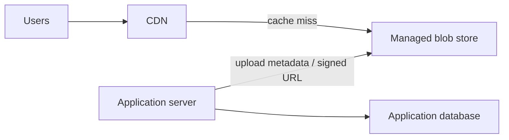

Application server 不再承担文件 bytes 的主要 storage 和 serving，CDN 可以直接以 blob store 为 origin。

### 0.2 本章解决的核心问题

一个 managed blob store 需要同时满足：

1. **Scalability**：对象总量和请求量超过单机；
2. **Availability**：node/rack 故障时仍可服务；
3. **Durability**：已确认写入的 bytes 不应因少数故障永久丢失；
4. **Consistency**：写入或更新后，后续读取看到怎样的版本；
5. **Global routing**：全球 namespace 如何定位到 cluster；
6. **Local routing**：cluster 如何定位文件 metadata 和 data extents；
7. **Rebalancing**：负载变化或故障时如何移动 account、partition 和 replica。

作者选择 Azure Storage（AS）作为具体案例，不是为了列举 API，而是展示前文模式如何组合成真实系统：

- functional decomposition；
- partitioning；
- replication；
- reverse proxy；
- control plane/data plane separation；
- load balancing；
- failure-domain-aware placement。

### 0.3 Blob/file abstraction 的含义

原章把讨论聚焦在 file abstraction，也称 blob store。Blob 通常是 opaque byte sequence：

```text
object name -> metadata + bytes
```

与传统 POSIX filesystem 相比，对象存储往往：

- 通过 HTTP API 和 global URL 访问；
- namespace 较扁平，目录常是名称前缀的表现；
- 不提供任意 in-place byte mutation，常以 whole-object PUT 或 append/block API 为主；
- 强调海量对象、durability 和服务化访问；
- 不保证与本地 filesystem 相同的 rename、locking、hard link 语义。

本章原文用 file/blob 作为简化抽象，不应据此推断 Azure Blob API 与 POSIX 完全等价。

---

## 1. 为什么 managed file store 能解除本地磁盘限制

### 1.1 本地磁盘的结构性问题

若静态文件只存在 application server 的 disk：

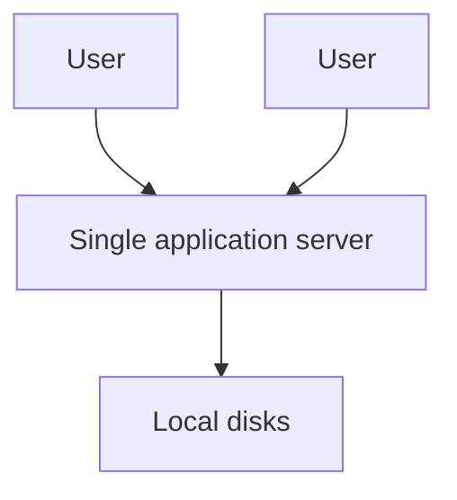

会遇到：

- **Capacity coupling**：文件量与 application machine 规格绑定；
- **Lifecycle coupling**：deploy/reimage/scale-in 可能影响文件；
- **Routing coupling**：多 application nodes 要共享或复制文件；
- **Failure coupling**：server 故障同时损失 compute 与 storage access；
- **Bandwidth coupling**：静态 bytes 与动态 API 竞争 NIC；
- **Operational burden**：备份、repair、scrub、rebalancing 由应用团队承担。

Managed store 把这些职责交给专门服务，但不会让复杂性消失；复杂性被集中到 storage system，由其 control planes 和 data planes 处理。

### 1.2 容量估算

设：

- 每天上传对象数为 $n$；
- 平均对象大小为 $s$；
- 保留天数为 $T$；
- replication/storage overhead factor 为 $r$；
- metadata 和 filesystem overhead 比例为 $o$。

物理存储需求粗略为：

$$
Capacity\approx n\times s\times T\times r\times(1+o)
$$

例如每天 100 万张平均 $4\ \mathrm{MB}$ 图片，保留 365 天，三副本，暂按 5% 额外开销：

$$
Logical=10^6\times4\ \mathrm{MB}\times365
=1.46\ \mathrm{PB}
$$

$$
Physical\approx1.46\times3\times1.05
=4.599\ \mathrm{PB}
$$

这还不含版本、缩略图、multipart 临时块、删除延迟和 repair headroom。单机或一组手工管理的 disks 很快变成独立分布式系统问题。

### 1.3 Managed 不等于无限或无需设计

云存储提供可扩展容量和托管运维，但应用仍需负责：

- object naming；
- authorization；
- lifecycle/retention；
- cache headers；
- upload retry/idempotency；
- data classification/encryption；
- region 与 disaster-recovery policy；
- cost 和 quota；
- orphan cleanup；
- database metadata 与 object lifecycle 的一致性。

“Managed”表示供应商管理底层集群，不表示业务数据模型和安全责任也被外包。

## 2. CDN 可以直接回源 blob store

### 2.1 原章的 offload 路径

Managed store 中的文件可配置为允许任何获得 URL 的人访问，于是 CDN 可直接指向它：

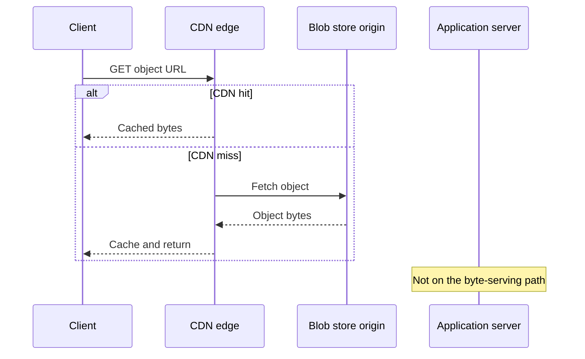

收益：

- application CPU/NIC 不再传大文件；
- local disk 不再是 capacity bottleneck；
- blob store 提供 durable origin；
- CDN 提供 geographic cache 和 network acceleration；
- application tier 更接近 stateless，后续更容易 horizontal scale。

### 2.2 “知道 URL 即可访问”的安全边界

原章说文件可被配置为允许知道 URL 的任何人访问。关键是 **configured**：

- Public object/container 可匿名读取；
- Private object 需要 authenticated request、signed URL/SAS 或 CDN-origin authorization；
- URL 难猜不等于访问控制；
- CDN cache key 和 authorization 配错可能泄露 private bytes；
- Signed URL 有 expiry、scope 和 replay 边界；
- Origin 最好只允许 CDN 或受控身份访问。

对公开 immutable assets，public read + content-hashed URL 很合适；对用户照片、合同或导出文件，默认 private，并用短期授权 URL 或应用鉴权。

### 2.3 Control request 与 byte transfer 分离

常见实践是应用只授权上传/下载，而 client 与 blob store 直接传 bytes：

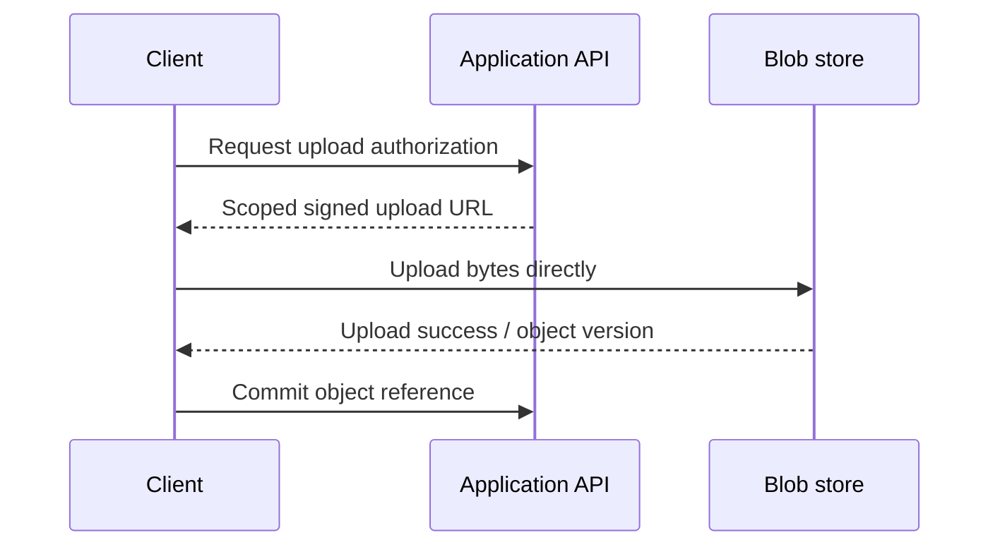

这是本章 offload 思想的工程延伸，不是原文逐步给出的 API。它避免大文件经过 application server，但必须防止：

- Client 获得超宽权限；
- 上传后未提交形成 orphan；
- 声称的 object 与实际 bytes/version 不一致；
- content type/size/checksum 未校验；
- 回调或 commit 被伪造。

---

## 3. 17.1 Blob storage architecture：为什么看 Azure Storage

### 3.1 Azure Storage 的范围

原章以 Azure Storage（AS）为例。AS 是 scalable cloud storage system，并提供 strong consistency。历史系统支持 file/blob、queue、table 等 abstractions；为简化，本章只讨论 blob/file abstraction。

这意味着后面的 stream/partition/front-end 三层是底层共享架构视角，不应把每个细节机械映射成今天 Azure Blob 的公开产品术语。

### 3.2 Strong consistency 的直觉

在本章语境中，strong consistency 的核心直觉是：成功提交的更新不会在后续正常读取中任意退回旧版本。一个简化的 read-after-write expectation：

```text
PUT object = v2 returns success
then GET object
=> observes v2 (subject to documented API semantics)
```

实现它需要协调：

- metadata owner；
- stream append/replication；
- commit point；
- failure recovery；
- stale route rejection。

不能只把 bytes 异步发送到多台机器就宣称 strong consistency。后文的同步 chain replication 与 partition ownership 是重要基础。

### 3.3 Strong consistency 与 durability 不同

| 性质 | 回答的问题 |
| --- | --- |
| Consistency | Read 会看到哪个版本？ |
| Availability | 请求此刻能否成功？ |
| Durability | 已成功的数据未来是否永久丢失？ |
| Replication | 用什么冗余机制支撑上述目标？ |

一个系统可以读到最新版本但只有一份 copy，consistency 强而 durability 弱；也可以有很多异步副本但短时间读到旧值。多个概念不能用“有三副本”一并替代。

## 4. 全球 storage clusters 与故障域

### 4.1 多 region、多 cluster

AS 由分布在全球多个 regions 的 storage clusters 组成。一个 cluster 包含多个 racks，每个 rack 是独立建设单元，并有冗余 networking 和 power。

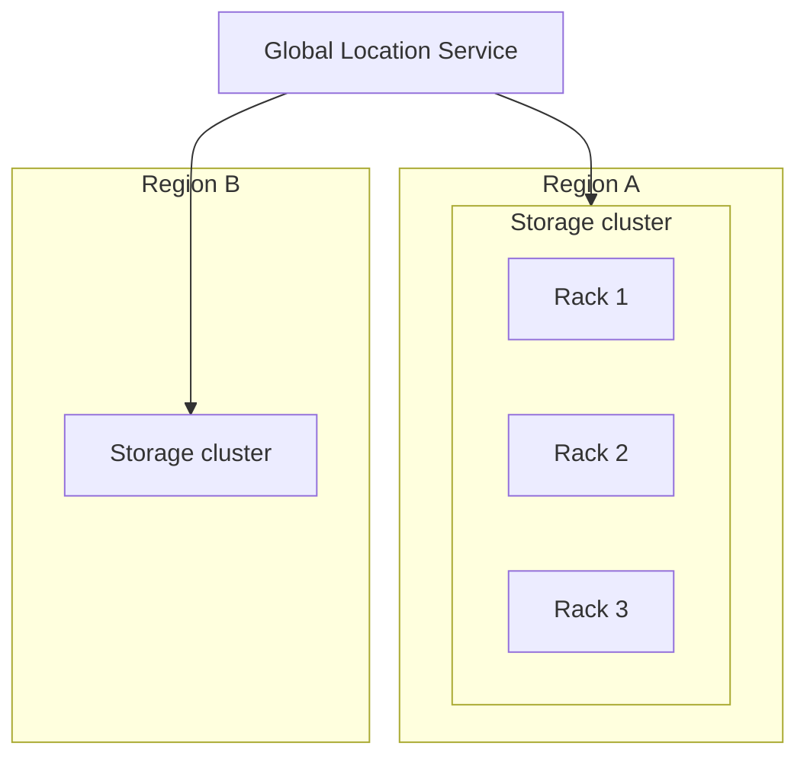

### 4.2 Rack 为什么是重要 failure domain

同一 rack 内 nodes 可能共享：

- top-of-rack switch；
- power distribution；
- cooling/physical enclosure；
- maintenance event；
- uplink path。

如果三个 replicas 都放在同一 rack，单 rack 故障可能同时失去全部。故障域感知 placement 要尽量使 copies 跨 racks：

```text
extent E replicas -> rack A, rack B, rack C
```

原章说明 racks 有冗余网络和电力，但 Figure 17.2 只抽象为 storage servers；“副本具体跨哪些故障域”必须以系统 placement policy 为准，不能从图中自动推出所有副本跨 region。

### 4.3 Replication factor 与独立故障模型

若单副本在某时间窗内永久失败概率为 $p$，有 $r$ 个真正独立 replicas，且 repair 前必须全部失败才丢失数据，简化概率为：

$$
P_{loss}\approx p^r
$$

若 $p=10^{-3}$、$r=3$：

$$
P_{loss}\approx10^{-9}
$$

但这个计算高度理想化：

- rack/power/software bug 会产生 correlated failures；
- latent corruption 可能长期未发现；
- operator error 可删除所有 copies；
- repair window 和检测时间很重要；
- region disaster 不是 node-independent event。

所以 durability 不应只靠“副本数”，还依赖 failure-domain placement、checksums、scrubbing、repair、versioning 和 geo-redundancy。

---

## 5. Global namespace：从 URL 定位 storage cluster

### 5.1 两段式名称

原章描述的 global namespace 基于 domain names，由 account name 和 file name 两部分组成：

```text
https://ACCOUNT_NAME.blob.core.windows.net/FILE_NAME
```

- Customer 配置 account name；
- AS DNS server 用 account name 找到存储该 account 的 cluster；
- Cluster 内再用 file name 定位负责该数据的 node。

这是分层路由：


### 5.2 为什么不用一个全球平面索引直接找 node

两级 mapping 隔离规模和变更：

1. Global level 只管理 account -> cluster；
2. Cluster level 管 file/index partition -> partition server；
3. Stream level 管 extent -> storage-server chain。

若全球 DNS 直接记录每个 file/node：

- record 数与所有 objects 同规模；
- node migration 会造成全球控制面 churn；
- internal topology 暴露；
- DNS 不适合表达精细 replica/extent metadata；
- cache TTL 使频繁 owner change 难生效。

层级化让不同时间尺度的信息由不同 control planes 管理。

### 5.3 Namespace 与物理位置解耦

Stable object URL 不应包含具体 storage server。Account 可从 cluster A 迁到 cluster B，只需更新 account placement/DNS，不必改每个 file name。

抽象关系：

```text
stable logical name
  -> mutable account placement
  -> mutable partition placement
  -> mutable extent replica placement
```

每层 indirection 都增加 lookup，但让下层能够 reconfigure、repair 和 rebalance，而不破坏 client-visible identity。

### 5.4 DNS cache 与迁移边界

Account 从 cluster A 移到 B 时，DNS answer 可能因 TTL 暂时仍指向 A。生产迁移需考虑：

- 先在 B 准备完整 account copy；
- 切换权威 placement；
- A 在 TTL/drain window 内 redirect/forward 或继续服务；
- 防止 A、B 双方同时接受冲突写；
- 等旧 DNS/cache traffic 排空后清理 A。

原章只说 Location Service 会迁移 account 并创建/更新 DNS；上述步骤是从 stale routing 问题推导的工程要求，不代表原文给出的具体 Azure migration protocol。

---

## 6. Location Service：全球 control plane

### 6.1 职责

Central Location Service 是 global control plane，负责：

- 创建新 accounts；
- 将 accounts 分配给 clusters；
- 为 load distribution 把 account 从一个 cluster 移到另一个；
- 协调 DNS/account placement。

Figure 17.1 的顶层结构：

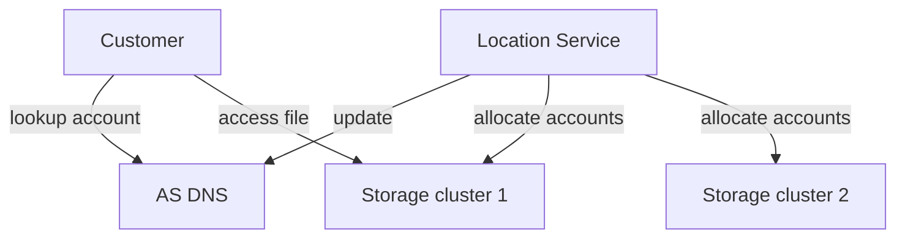

### 6.2 创建 account 的三步

客户选择特定 region 创建 account 时，Location Service：

1. 根据 load information 选择合适 cluster；
2. 更新 cluster configuration，使其开始接收新 account 请求；
3. 创建 DNS record，把 account name 映射到 cluster public IP。

顺序体现一个重要原则：**先让 destination ready，再公布 route**。若先发布 DNS，client 可能在 cluster 尚不认识 account 时得到错误。

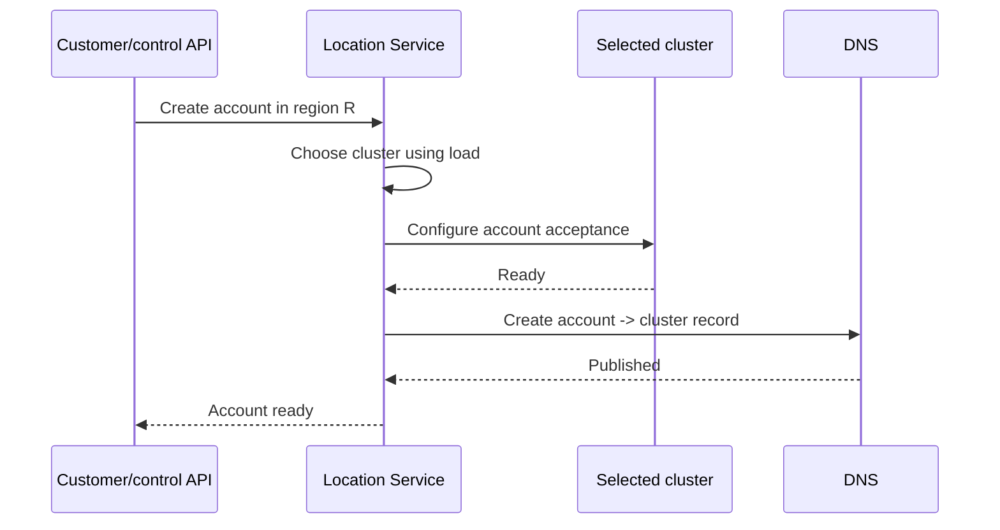

### 6.3 为什么 Location Service 不应在每次读写热路径

它管理低频 placement changes，而不是每个 object read/write：

- DNS/cache 承担 account-level discovery；
- cluster front-end 承担 request-level routing；
- partition/stream servers 承担 data operations。

若每次 GET 都同步调用 global Location Service：

- global latency 进入热路径；
- control plane 成为吞吐瓶颈；
- service outage 阻断所有 data plane；
- regional independence 降低。

Control plane outage 仍可能阻止新 account、迁移和 topology change，但已有 cached mapping/data path 应尽可能继续工作。

### 6.4 Cluster placement 不是只按平均 load

原章明确说 based on load information。工程上适合度还可能包括：

- free storage capacity；
- request/byte throughput；
- tenant/account size forecast；
- rack/failure-domain headroom；
- region/compliance；
- migration/repair activity；
- hardware generation；
- network egress/cost。

一个说明性的 score：

$$
Score(c)=
w_s StorageUtil(c)+w_q QPSUtil(c)+w_b BandwidthUtil(c)+w_r Risk(c)
$$

在满足 region 和 policy 约束的 healthy clusters 中选较低 score。真实 Azure 策略并非原章公开内容，此式仅解释 multi-resource placement。

---

## 7. Storage cluster 的三层架构

原章将一个 storage cluster 分为：

1. **Stream layer**：durable bytes 与 extent replication；
2. **Partition layer**：高层 file operation、metadata index 与 partitioning；
3. **Front-end layer**：stateless authentication 和 routing。

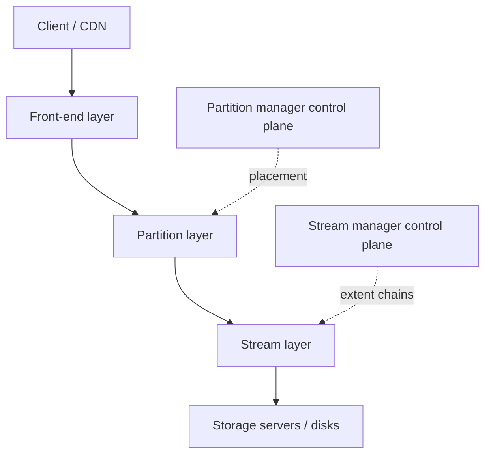

### 7.1 为什么分三层

不同层解决不同问题：

| 层 | 主要 key/单位 | 主要职责 | 典型变化速度 |
| --- | --- | --- | --- |
| Front end | Account/file request | Auth、protocol、route | 每请求 |
| Partition | File metadata/index range | File semantics、index、load balance | 中等 |
| Stream | Extent/append | Durable bytes、replication | 高频 data I/O + repair |

这样做的好处：

- Blob/file API 不必直接管理磁盘副本；
- Stream layer 不必理解 account/file policy；
- Metadata 可 independently partition/rebalance；
- Front ends 可 stateless horizontal scale；
- Replication repair 不改变 client URL。

代价是跨层协议与 failure state 更复杂，必须清楚 commit point、pointer visibility 与 retry semantics。

### 7.2 Control plane 与 data plane

本章有三个明显 control planes：

- Location Service：account -> cluster；
- Partition Manager：index ranges -> partition servers；
- Stream Manager：extent -> storage-server chain。

Data plane：

- Front end 处理 client request；
- Partition server 执行 file operation；
- Storage servers 存取 extent bytes。

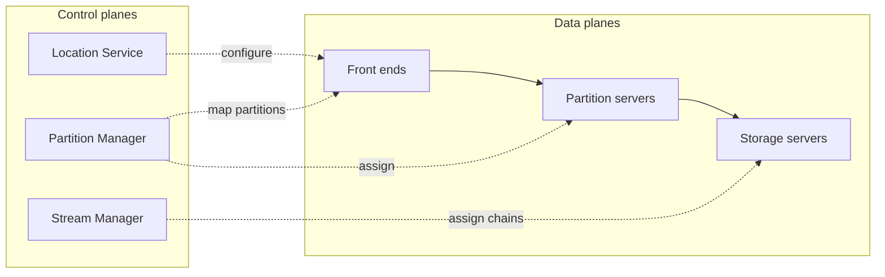

核心模式：control plane 决定“应该在哪里”，data plane 高频执行“按当前决定读写”。

---

## 8. Stream layer：append-only streams 与 extents

### 8.1 Stream 是什么

Stream layer 实现 distributed append-only filesystem，数据存在 streams 中。

Append-only 意味着主要操作是：

```text
append(bytes) -> offset
read(offset, length) -> bytes
```

相较任意 in-place update，append-only 有利于：

- 顺序写 disk/network；
- 复制操作排序；
- crash recovery；
- immutable data verification；
- 将逻辑更新转换为“写新 bytes + 更新 metadata pointer”。

它不表示空间永远不回收。删除或覆盖后，旧 extents 中的 bytes 可能成为 garbage，需要后台 compaction/GC；原章未展开该过程。

### 8.2 Extent 是什么

一个 stream 内部由 extent sequence 表示：

```text
Stream S = E1 || E2 || E3 || ...
```

Extent 是 allocation 和 replication unit。它把无限增长的逻辑 stream 切成可管理 chunks：

- 单个 extent 有 bounded size；
- 可独立分配 storage-server chain；
- 满后创建新 extent；
- 故障时可按 extent repair；
- Metadata 可用 `(extent, offset, length)` 指向 bytes。

Extent 不是 application blob 的同义词：

- 一个 blob 可能跨多个 extents；
- 一个 extent 也可能容纳多个 blobs 的片段；
- Partition metadata 把逻辑 file 与物理 stream segments 连接起来。

### 8.3 为什么 extent 适合作为 replication unit

如果整个 stream 是一个复制单位：

- Stream 越来越大，repair/migration 粒度无限增长；
- 新 server 难接管一小段；
- 热点与 placement 无法细分。

如果每个 tiny write 都是一个复制单位：

- metadata 爆炸；
- placement/repair 操作过多；
- 小 I/O 效率低。

Extent 是 coarse enough for efficiency、fine enough for placement 的折中。

### 8.4 Extent 大小的权衡

设总 logical bytes 为 $D$，extent target size 为 $E$，extent metadata 平均为 $m$ bytes，extent 数近似：

$$
N_e\approx\left\lceil\frac{D}{E}\right\rceil
$$

Metadata overhead：

$$
M\approx N_e m
$$

- $E$ 大：metadata 少、顺序吞吐好，但 repair/move 粒度大；
- $E$ 小：placement/repair 细，但 metadata、open files 和 control work 多。

真实系统还受 object size distribution、disk layout 和 replication protocol 影响，不能只最小化上述一个式子。

---

## 9. 同步 chain replication

### 9.1 原章机制

Extent writes 使用 chain replication 同步复制。Chapter 10 已介绍 chain replication：replicas 排成 chain，write 沿 chain 传播，通常由 tail 确认完成；read policy 取决于实现。

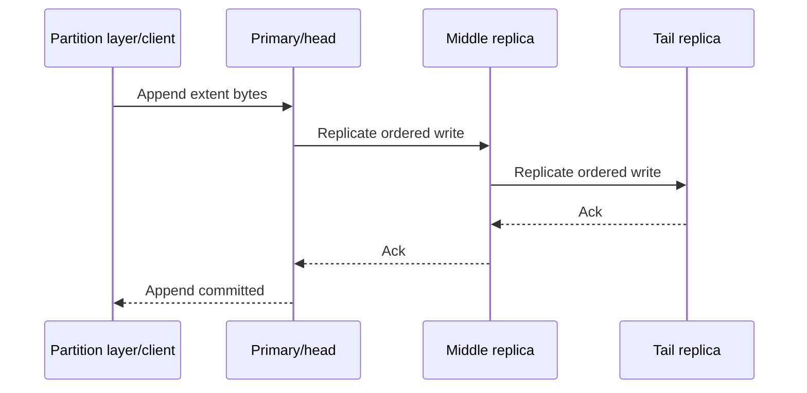

原章 Figure 17.2 画出了 partition layer 的 append/write、stream manager 分配 extent replicas，以及三个 storage servers 的 chain。

### 9.2 为什么同步复制

如果 primary 写 disk 后立即回复、replicas 后台异步接收：

```text
primary ack -> primary fails before replication -> acknowledged data lost
```

同步 chain 把 success point 推迟到要求的 replicas 已按协议接收写之后，从而提高已确认数据的 durability，并建立一致的 write order。

代价：

- Write latency 至少包含 chain 网络/disk 路径；
- 任一 required replica 慢会拖累 tail latency；
- Failure 时需 reconfigure chain；
- Throughput 受最慢 link/server 与 pipeline 能力限制。

### 9.3 简化 latency 模型

若 chain 有 $r$ 个 replicas，相邻 hop 单程网络加处理时间为 $d_i$，尾部 durable write 时间为 $w_i$，串行、不考虑 pipeline 的粗略确认延迟：

$$
T_{ack}\gtrsim
\sum_{i=1}^{r-1}d_i+w_{tail}+T_{ackback}
$$

真实 chain 可 pipeline 多个 writes，steady-state throughput 与单次 latency 的关系不同：pipeline 能提高并发吞吐，却不能让一条 write 的物理传播和持久化延迟消失。

### 9.4 “Primary server”的精确理解

原章说 client 缓存 storage-server list，未来 writes 发给 primary server。这里的 client 是 stream service 的内部使用方（例如 partition layer），不是最终浏览器用户直接持有 extent topology。

Final client：

```text
browser/CDN -> front end -> partition server -> stream chain
```

不能把内部 primary 地址暴露成稳定 public object URL。

---

## 10. Stream Manager：extent placement control plane

### 10.1 分配新 extent

Stream Manager 负责将 extent 分配给 cluster 中一条 storage-server chain。当 partition layer 需要新 extent：

1. 请求 Stream Manager allocate extent；
2. Manager 根据 placement/capacity 选 storage servers；
3. 建立 replication chain；
4. 返回持有新 extent copies 的 server list；
5. Client 缓存 list，后续 writes 直接发 primary/head。

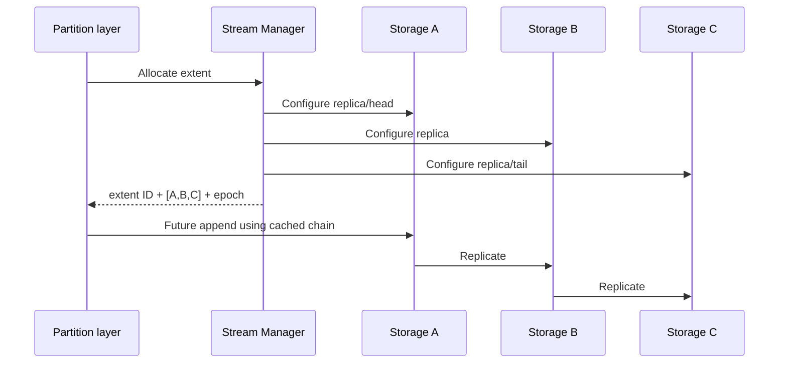

原章没有明确写 epoch，但 topology cache 若可过期，工程上需要 generation/version，防止 client 在 reconfiguration 后继续写旧 chain。

### 10.2 为什么 client 缓存 placement

若每次 append 都问 Stream Manager：

- Manager 进入 write hot path；
- control plane QPS 与 data QPS 同规模；
- Manager latency/failure 直接阻塞所有 writes。

Cache placement 后，Manager 只处理：

- extent creation；
- fault repair；
- reconfiguration；
- placement change。

Data writes 直接进入 storage servers。这是 control/data plane separation 的典型收益。

### 10.3 Cache stale 如何处理

Storage server 应验证 extent chain generation：

```text
append(extent_id, generation, offset, bytes)
```

如果 generation 旧：

1. 拒绝 `STALE_CHAIN`；
2. Client 刷新 Stream Manager mapping；
3. 在 idempotency/offset precondition 下重试。

否则故障后旧 primary 重新联网，可能接受 split-brain writes。原章只描述 client cache 与 reconfigure；generation 是保证两者安全衔接的补充机制。

### 10.4 故障修复与 chain reconfiguration

Stream Manager 还负责 unavailable/faulty replicas：

- 检测 extent replica 不可用；
- 从健康 copy 创建新 replica；
- 验证复制完成；
- 重构 replication chain；
- 发布新 topology；
- 让旧 generation 失效。

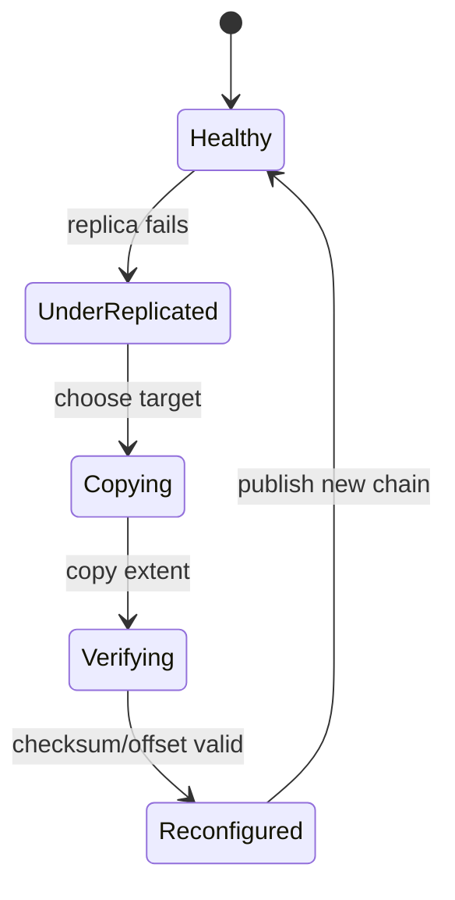

Repair bandwidth 需限速但不能太慢：太快影响 foreground traffic，太慢延长 reduced-durability window。

---

## 11. Partition layer：从 file operation 到 stream operation

### 11.1 层的职责

Partition layer 把高层 file operations 转为低层 stream operations。例如概念上的：

```text
PUT(account, file, bytes)
  -> allocate/append extents
  -> create file metadata pointing to extents

GET(account, file)
  -> read metadata
  -> read extent slices
  -> assemble bytes
```

它隔离两种 namespace：

- Logical namespace：account + file name；
- Physical namespace：stream/extent + offset + length。

### 11.2 File index 的 entry

Partition Manager 管理 cluster 中所有 files 的大索引。每条 entry 包含：

- account name；
- file name；
- 指向 stream service 实际数据的 pointer；
- pointer 是 extent list 加 offset/length。

一个说明性 metadata：

```text
key: (account="alice", file="video.mp4")
value:
  length: 18 MiB
  segments:
    - extent E17, offset 4 MiB, length 8 MiB
    - extent E23, offset 0 MiB, length 10 MiB
```

File 不必与 extent 一一对应。Pointer 让 logical file 可跨 physical extents，也让 stream layer 共享顺序 append space。

### 11.3 Read path

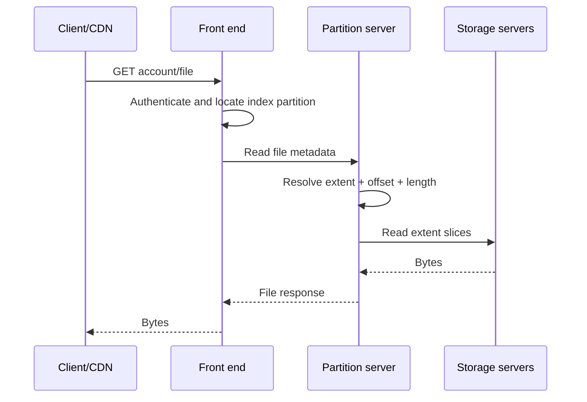

原图 Figure 17.3 简化画成 front end 与 partition server 读写；Figure 17.2 再展示 partition layer 与 stream servers。把两图连接起来才得到完整 request path。

### 11.4 Write path 与 publish point

为避免 metadata 指向未完整复制的 bytes，一个安全的抽象顺序是：

1. Allocate extent；
2. Append bytes，经同步 chain replication 成功；
3. 验证 length/checksum；
4. Atomically publish/update file metadata pointer；
5. 返回 operation success。

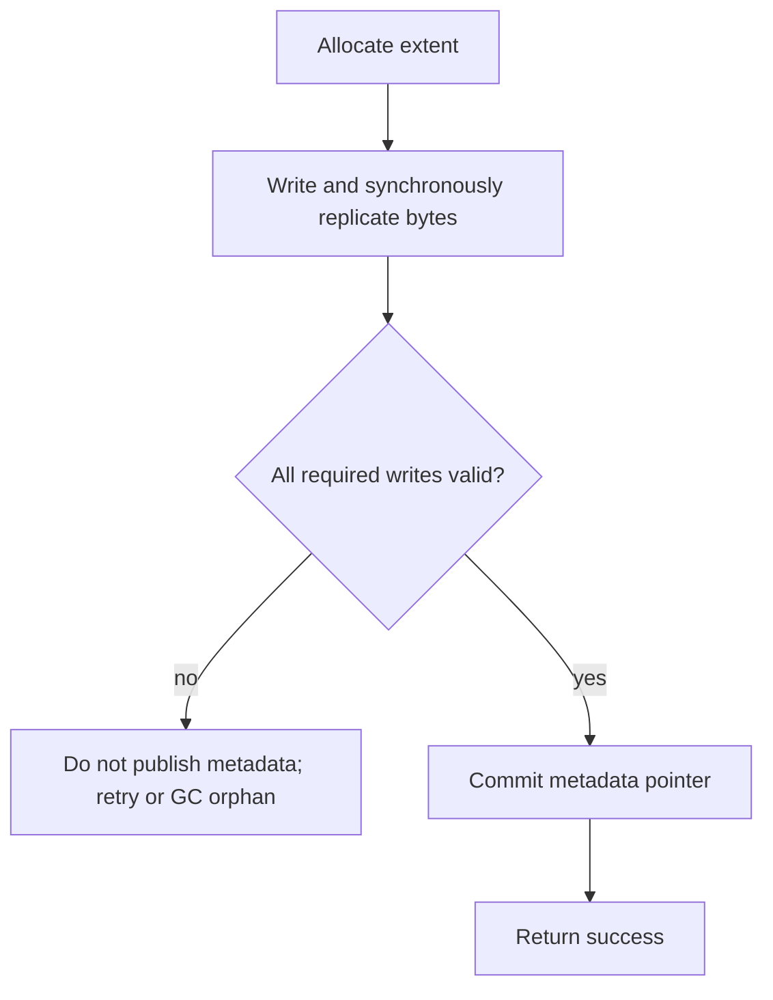

如果先 publish pointer 再写完 data，reader 可能看到 dangling/partial file。具体 Azure commit protocol 不在原章范围；这个顺序是从 metadata/data 分层推导的必要不变量。

### 11.5 Update 与 orphan data

Append-only stream 中更新 file 常是：

```text
write new bytes -> atomically swap metadata pointer -> reclaim old bytes later
```

Failure cases：

- Bytes 成功，metadata commit 失败：新 bytes 是 orphan，可重试或 GC；
- Metadata commit 成功，reply 丢失：client retry 必须 idempotent，避免重复版本；
- Old pointer 清理过早：并发 reader 可能读失败；
- GC 未识别 active snapshot/version：误删仍被引用数据。

因此需要 operation ID/version、reference liveness、deferred reclamation 和 reconciliation。

---

## 12. Partition Manager：索引的 control plane

### 12.1 Range-partition file index

Partition Manager 对 file index 做 range partitioning，并把每个 range 映射给 partition server。

假设 composite key 为：

```text
(account_name, file_name)
```

可以按 lexicographic ranges 切分：

```mermaid
flowchart LR
    I[Global file index] --> P1[[a..., h...)]
    I --> P2[[h..., q...)]
    I --> P3[[q..., end)]
    P1 --> S1[Partition server 1]
    P2 --> S2[Partition server 2]
    P3 --> S3[Partition server 3]
```

Range partitioning 的价值：

- Point lookup 可由 boundaries 定位；
- 相同 account/prefix 的 files 有 locality；
- Listing by account/prefix 可扫描相邻 ranges；
- Partition 可在 key boundary split/merge。

代价与 Chapter 16 一致：large/hot account 可能集中，顺序名称可能热点，range scan 会跨多个 partitions。

### 12.2 Figure 17.3 的角色关系

Figure 17.3 表达：

- Front-end layer 查询 partition index；
- Partition Manager 更新 index；
- Manager 把 partitions 分配给 partition servers；
- Front end 把 reads/writes 直接路由到 owner；
- Manager 不代理每个 data operation。

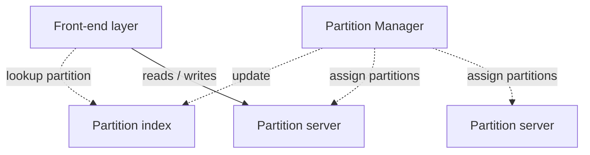

虚线代表 control/metadata interaction，实线代表 data requests。这种区分是阅读原图的关键。

### 12.3 Load balancing、split 与 merge

Partition Manager 负责：

- 在 servers 间 load-balance partitions；
- Partition 太 hot 时 split；
- Cold/small adjacent partitions 时 merge。

一个 partition 的 load 不只看 file count：

$$
Load_i=
w_q QPS_i+w_b BytesPerSecond_i+w_c CPU_i+w_s Size_i
$$

说明性 split policy：

```text
if size > size_limit OR sustained_qps > qps_limit:
    choose key boundary near work median
    split range
    move one child to another server
```

Merge 应有更低 threshold 和 cooldown，避免反复 split/merge：

$$
MergeThreshold<SplitThreshold
$$

原章给出职责，不给具体 score 或 threshold；这里沿 Chapter 16 展开其工作原理。

### 12.4 一个 large account 的挑战

若 key order 以 account name 开头，同一 account 的 files 连续。好处是 account listing/locality；风险是单 account 可能大到跨 range 或成为 hotspot。

可选策略：

- 允许在同一 account 的 file-name range 内 split；
- 将超大 account 隔离到多个 partitions；
- 对纯 point lookup 另加 hash bucket；
- 对 listing 做 bounded fan-out/merge；
- rate limit noisy tenant。

这是 locality 与 load distribution 的再次权衡。

### 12.5 Stale partition mapping

Front ends cache mapping 后，partition split/move 会使 cache stale。需要：

- partition map epoch/version；
- owner 检查；
- `NOT_OWNER` redirect；
- bounded refresh/retry；
- write request idempotency。

与 Chapter 16 gateway 一样，mapping 是 correctness metadata，不只是性能 hint。

---

## 13. 跨 cluster 异步 account replication

### 13.1 原章机制

Partition layer 还会在后台异步把 accounts 复制到其他 clusters，用于：

- account 从一个 cluster 迁到另一个以 load balance；
- disaster recovery。

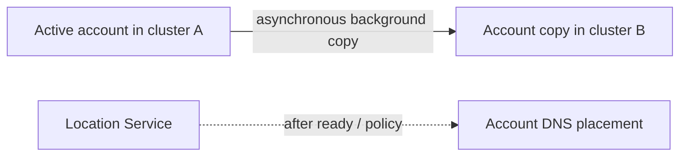

### 13.2 与 extent chain replication 的区别

这是本章最容易混淆的两种 replication：

| 维度 | Extent chain replication | Cross-cluster account replication |
| --- | --- | --- |
| 范围 | Cluster 内 storage servers | Clusters 之间 |
| 单位 | Extent writes/copies | Account data |
| 时机 | 同步 write path | 异步 background |
| 目标 | 当前写 durability/consistency | Migration、disaster recovery |
| 延迟 | 影响 write acknowledgment | 形成 replication lag |

同步 extent replication 成功不代表 remote cluster 已同步；异步 geo copy 存在 recovery point gap。

### 13.3 RPO 与 RTO

- **RPO（Recovery Point Objective）**：灾难后最多可接受丢失多新的数据；
- **RTO（Recovery Time Objective）**：恢复服务最多可接受多久。

若 remote replication lag 为 $L$，突然失去 active cluster 时，潜在数据缺口上界与 $L$ 相关：

$$
PotentialDataGap\approx WriteRate\times L
$$

例如写入 $50\ \mathrm{MB/s}$、lag 120 秒：

$$
PotentialDataGap\approx6{,}000\ \mathrm{MB}=6\ \mathrm{GB}
$$

这是简化估算；真实恢复取决于 replication ordering、ack policy、journal 和 failover semantics。原章只说 asynchronous replication 用于 DR，不声称 remote copy 对所有 acknowledged writes 零 RPO。

### 13.4 Account migration 的正确性难点

Load-balance migration 要处理：

1. Initial bulk copy；
2. Concurrent changes catch-up；
3. Destination validation；
4. Authoritative owner cutover；
5. DNS/cache stale traffic；
6. Source drain；
7. Cleanup/rollback。

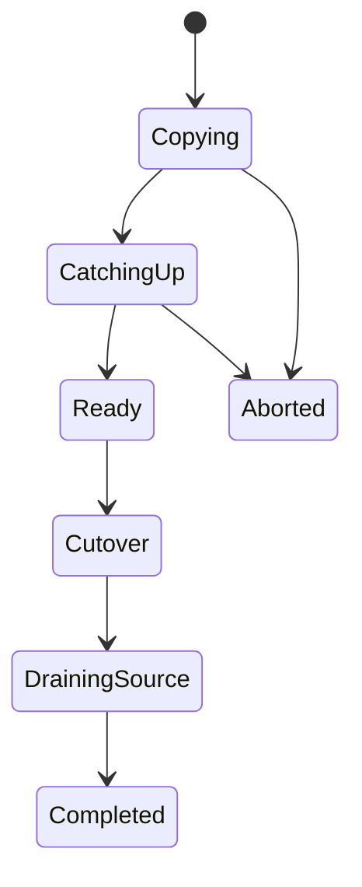

必须避免两个 clusters 在没有 coordination 的情况下同时接受写，否则会产生 divergent account histories。

---

## 14. Front-end layer：无状态 reverse proxy

### 14.1 原章职责

Front-end service 是 stateless reverse proxy，负责：

- authenticate requests；
- 使用 Partition Manager 维护的 mapping；
- route 到适当 partition server。

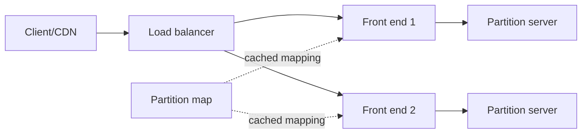

### 14.2 Stateless 的精确含义

Stateless 不表示 front end 没有任何 memory/cache，而是：

- 不持有唯一、不可重建的 durable user data；
- 任意 healthy instance 可处理下一个 request；
- Mapping/cache 可从 control plane 重建；
- Instance failure 不需要迁移 client file state。

因此 front ends 易于：

- horizontal scale；
- rolling deploy；
- health-based replacement；
- load balancing。

### 14.3 Authentication 为什么放 front end

在入口统一认证可以：

- 在昂贵 storage I/O 前拒绝非法请求；
- 隐藏内部 partition/extent topology；
- 统一 account policy、signature 和 expiry；
- 记录 audit/logging；
- rate limit 和 request normalization。

但下游不能盲目信任任意网络请求。生产系统还需 service identity、authenticated internal channel 和 least privilege，防止绕过 front end 直达 partition server。

### 14.4 Front end 仍可能成为瓶颈

Stateless 只让扩展更容易，不保证自动无限扩展。需要监控：

- request QPS；
- authentication CPU；
- TLS/network bandwidth；
- mapping cache hit；
- routing retry；
- large body proxy strategy；
- connection count；
- tail latency。

大文件 data path 若完全经过 front end，其 NIC 仍可能吃紧；系统可采用 streaming、zero-copy、direct storage path 等优化，但必须保持 authorization 和 topology encapsulation。

---

## 15. 三层端到端工作流

### 15.1 新建文件

将原章各层连接起来，一个抽象 create flow：

```mermaid
sequenceDiagram
    participant C as Client
    participant F as Front end
    participant P as Partition server
    participant SM as Stream Manager
    participant H as Chain head
    participant T as Chain tail

    C->>F: PUT account/file + bytes
    F->>F: Authenticate; map file partition
    F->>P: Create/replace file
    P->>SM: Allocate extent if needed
    SM-->>P: Extent chain + generation
    P->>H: Append bytes
    H->>T: Synchronous chain replication
    T-->>P: Durable/committed ack
    P->>P: Publish metadata pointer
    P-->>F: Success
    F-->>C: Success/version
```

这里将 chain 中间 replicas 省略，并用“publish after bytes”表达安全不变量；不是 Azure 论文中全部细节。

### 15.2 读取文件

```text
URL/DNS -> cluster front end
-> authenticate
-> file key maps to partition server
-> metadata maps to extent slices
-> storage reads
-> bytes returned / CDN cached
```

### 15.3 覆盖文件

安全 replacement 的抽象：

```text
write new immutable extent slices
-> verify replicated bytes
-> compare expected object version
-> atomically swap metadata to new pointer/version
-> retire old pointer after readers are safe
```

Conditional version 防止两个 writers lost update：

```text
PUT if version == v7 -> commit v8
```

若实际 API 使用 ETag/version ID，其作用类似；原章未展开公开 API 条件写。

### 15.4 删除文件

Delete 往往先删除/标记 metadata visibility，再异步回收 physical extents：

```mermaid
flowchart LR
    D[Delete logical file] --> M[Remove/tombstone metadata]
    M --> R[Readers no longer resolve pointer]
    M --> G[Background GC]
    G --> E[Reclaim unreferenced extent space]
```

立即擦除每个物理 copy 可能昂贵，且与 versioning/retention/legal hold 冲突。安全性与合规要求必须由产品语义明确。

---

## 16. 可运行 C11 模拟：先复制 bytes，再发布 metadata

### 16.1 模拟目标

下面程序用一个最小状态机验证本章最重要的跨层不变量：

- 一个 blob 被切为两个 extents；
- 每个 extent 同步写入三台 chain replicas；
- 第二个 extent 首次写入故意在 middle replica 失败；
- 只要任一 extent 未完成全链复制，file metadata 不得发布；
- 修复并重试后，metadata 才指向完整 extents；
- Read 通过 extent pointer 重组原始 payload；
- Checksum 和 replica equality 被显式验证；
- 损坏的 extent count/total length 会被拒绝，失败读取不会发布半成品 output；
- 所有状态变化使用普通错误检查，不依赖 `assert`。

它模拟的是“stream bytes commit 在前、partition metadata publish 在后”，不是 Azure Storage 源码。

### 16.2 完整代码

```c
#include <stdbool.h>
#include <stddef.h>
#include <stdint.h>
#include <stdio.h>
#include <string.h>

enum {
    REPLICA_COUNT = 3,
    EXTENT_COUNT = 2,
    EXTENT_CAPACITY = 8,
    BLOB_CAPACITY = EXTENT_COUNT * EXTENT_CAPACITY
};

typedef struct {
    unsigned char bytes[EXTENT_CAPACITY];
    size_t length;
    uint32_t checksum;
    bool committed;
} Replica;

typedef struct {
    Replica replicas[REPLICA_COUNT];
} Extent;

typedef struct {
    size_t extent_ids[EXTENT_COUNT];
    size_t extent_lengths[EXTENT_COUNT];
    size_t extent_count;
    size_t total_length;
    bool visible;
} FileMetadata;

static uint32_t checksum_bytes(const unsigned char *bytes,
                               size_t length) {
    uint32_t hash = UINT32_C(2166136261);
    size_t index;

    for (index = 0; index < length; index++) {
        hash ^= bytes[index];
        hash *= UINT32_C(16777619);
    }
    return hash;
}

static bool replicate_extent(Extent *extent,
                             const unsigned char *bytes,
                             size_t length,
                             size_t fail_replica) {
    const uint32_t checksum = checksum_bytes(bytes, length);
    size_t replica_index;

    if (extent == NULL || bytes == NULL ||
        length == 0 || length > EXTENT_CAPACITY) {
        return false;
    }

    for (replica_index = 0;
         replica_index < REPLICA_COUNT;
         replica_index++) {
        Replica *replica = &extent->replicas[replica_index];

        if (replica_index == fail_replica) {
            return false;
        }
        memcpy(replica->bytes, bytes, length);
        replica->length = length;
        replica->checksum = checksum;
        replica->committed = false;
    }

    for (replica_index = 0;
         replica_index < REPLICA_COUNT;
         replica_index++) {
        extent->replicas[replica_index].committed = true;
    }
    return true;
}

static bool extent_is_committed(const Extent *extent,
                                size_t expected_length) {
    const Replica *first;
    size_t replica_index;

    if (extent == NULL || expected_length == 0 ||
        expected_length > EXTENT_CAPACITY) {
        return false;
    }

    first = &extent->replicas[0];
    if (!first->committed || first->length != expected_length ||
        first->checksum !=
            checksum_bytes(first->bytes, first->length)) {
        return false;
    }

    for (replica_index = 1;
         replica_index < REPLICA_COUNT;
         replica_index++) {
        const Replica *replica =
            &extent->replicas[replica_index];
        if (!replica->committed ||
            replica->length != first->length ||
            replica->checksum != first->checksum ||
            memcmp(replica->bytes,
                   first->bytes,
                   first->length) != 0) {
            return false;
        }
    }
    return true;
}

static bool publish_file(FileMetadata *metadata,
                         const Extent *extents,
                         const size_t *lengths,
                         size_t extent_count) {
    size_t index;
    size_t total_length = 0;

    if (metadata == NULL || extents == NULL || lengths == NULL ||
        extent_count == 0 || extent_count > EXTENT_COUNT) {
        return false;
    }

    for (index = 0; index < extent_count; index++) {
        if (!extent_is_committed(&extents[index], lengths[index]) ||
            lengths[index] > BLOB_CAPACITY - total_length) {
            return false;
        }
        total_length += lengths[index];
    }

    for (index = 0; index < extent_count; index++) {
        metadata->extent_ids[index] = index;
        metadata->extent_lengths[index] = lengths[index];
    }
    metadata->extent_count = extent_count;
    metadata->total_length = total_length;
    metadata->visible = true;
    return true;
}

static bool read_file(const FileMetadata *metadata,
                      const Extent *extents,
                      unsigned char *output,
                      size_t output_capacity) {
    unsigned char reconstructed[BLOB_CAPACITY];
    size_t output_length = 0;
    size_t index;

    if (metadata == NULL || extents == NULL || output == NULL ||
        !metadata->visible ||
        metadata->extent_count == 0 ||
        metadata->extent_count > EXTENT_COUNT ||
        metadata->total_length > BLOB_CAPACITY ||
        metadata->total_length > output_capacity) {
        return false;
    }

    for (index = 0; index < metadata->extent_count; index++) {
        const size_t extent_id = metadata->extent_ids[index];
        const size_t length = metadata->extent_lengths[index];
        const Replica *replica;

        if (extent_id >= EXTENT_COUNT ||
            !extent_is_committed(&extents[extent_id], length) ||
            output_length > metadata->total_length ||
            length > metadata->total_length - output_length ||
            length > BLOB_CAPACITY - output_length) {
            return false;
        }
        replica = &extents[extent_id].replicas[0];
        memcpy(reconstructed + output_length, replica->bytes, length);
        output_length += length;
    }
    if (output_length != metadata->total_length) {
        return false;
    }
    memcpy(output, reconstructed, output_length);
    return true;
}

int main(void) {
    static const unsigned char payload[] = "distributedblob";
    const size_t payload_length = sizeof payload - 1;
    const size_t lengths[EXTENT_COUNT] = {8, 7};
    const size_t no_failure = REPLICA_COUNT;
    Extent extents[EXTENT_COUNT] = {0};
    FileMetadata metadata = {0};
    FileMetadata invalid_metadata;
    unsigned char output[BLOB_CAPACITY + 1] = {0};
    unsigned char guarded_output[BLOB_CAPACITY];
    size_t index;

    if (payload_length != lengths[0] + lengths[1]) {
        return 1;
    }

    if (!replicate_extent(&extents[0], payload,
                          lengths[0], no_failure)) {
        return 1;
    }

    if (replicate_extent(&extents[1], payload + lengths[0],
                         lengths[1], 1)) {
        return 1;
    }
    if (publish_file(&metadata, extents,
                     lengths, EXTENT_COUNT) || metadata.visible) {
        return 1;
    }
    printf("first_attempt=replication_failed metadata_visible=%d\n",
           metadata.visible ? 1 : 0);

    memset(&extents[1], 0, sizeof extents[1]);
    if (!replicate_extent(&extents[1], payload + lengths[0],
                          lengths[1], no_failure) ||
        !publish_file(&metadata, extents,
                      lengths, EXTENT_COUNT) ||
        !read_file(&metadata, extents,
                   output, sizeof output - 1)) {
        return 1;
    }

    output[metadata.total_length] = '\0';
    if (metadata.total_length != payload_length ||
        memcmp(output, payload, payload_length) != 0) {
        return 1;
    }

    memset(guarded_output, 0xA5, sizeof guarded_output);
    invalid_metadata = metadata;
    invalid_metadata.extent_count = EXTENT_COUNT + 1;
    if (read_file(&invalid_metadata, extents,
                  guarded_output, sizeof guarded_output)) {
        return 1;
    }

    invalid_metadata = metadata;
    invalid_metadata.total_length--;
    if (read_file(&invalid_metadata, extents,
                  guarded_output, sizeof guarded_output)) {
        return 1;
    }
    for (index = 0; index < sizeof guarded_output; index++) {
        if (guarded_output[index] != 0xA5) {
            return 1;
        }
    }

    printf("retry=committed metadata_visible=%d extents=%zu bytes=%zu\n",
           metadata.visible ? 1 : 0,
           metadata.extent_count,
           metadata.total_length);
    printf("read=%s replicas_per_extent=%d\n",
           output, REPLICA_COUNT);
    return 0;
}
```

编译运行：

```bash
gcc -std=c11 -Wall -Wextra -Werror -pedantic blob_layers.c -o blob_layers
./blob_layers
```

关键输出：

```text
first_attempt=replication_failed metadata_visible=0
retry=committed metadata_visible=1 extents=2 bytes=15
read=distributedblob replicas_per_extent=3
```

### 16.3 代码与架构的对应关系

| 代码对象 | 架构概念 |
| --- | --- |
| `Replica` | Storage server 上一个 extent copy |
| `Extent` | Stream layer replication unit |
| `replicate_extent` | 简化同步 chain write |
| `FileMetadata` | Partition index 中 extent pointers |
| `publish_file` | Bytes 完整后发布逻辑 file |
| `read_file` | Metadata resolve 后读取 extent slices |

第一次写第二 extent 时在 replica 1 失败。前面的 replica 可能已有 bytes，但所有 replicas 的 `committed` 都不会变成 true，因此 `publish_file` 拒绝 visible metadata。重试清理 partial state 后，两个 extents 都完整，metadata 才发布。

### 16.4 为什么不能把“写到 primary”当作成功

程序要求三个 replicas 内容和 checksum 一致才 publish，表达了同步复制的保守模型。真实 chain replication 的 commit/ack 状态可能不需要 client 每次读取三份比较；一致性由 protocol、tail/commit index 和 recovery 维护。程序用全量检查只是把不变量显式化。

### 16.5 示例的局限

- 固定两个 extents、三 replicas；
- 无真正 network/disk/concurrency；
- 没有 chain pipeline、generation 或 leader failure；
- Failure 后直接清空 partial extent，未实现 log-based recovery；
- Metadata 只在单进程内更新，没有 consensus/transaction；
- 无 offset sharing、GC、versioning 和 concurrent readers；
- FNV-1a 仅作示例 checksum，不是抗碰撞 content digest；
- Read 固定选 replica 0，没有 failover。

因此代码验证 publish ordering 与 pointer reconstruction，不是 durability 证明或生产 blob store。

---

## 17. 用公式理解可靠性、吞吐和成本

### 17.1 Availability 与 durability 不应混算

设一次 read 需要 metadata partition 和至少一个 extent replica：

$$
P(read\ success)=
P(metadata\ available)\times
P(at\ least\ one\ data\ replica\ available)
$$

若 $r$ 个 data replicas 独立不可用概率为 $q$：

$$
P(at\ least\ one\ available)=1-q^r
$$

这是瞬时 availability 模型，不是长期 durability。Metadata 也必须复制，否则 data copies 完整却找不到 pointer。

### 17.2 Metadata-to-data amplification

一个很小的 file metadata lookup 可触发大 byte transfer。设平均 file size 为 $S$，read QPS 为 $\lambda$：

$$
DataBandwidth\approx\lambda S
$$

若 $\lambda=2{,}000/s$、$S=8\ \mathrm{MB}$：

$$
Bandwidth=16{,}000\ \mathrm{MB/s}=16\ \mathrm{GB/s}
$$

这说明 partition layer 可能受 QPS/metadata IOPS 限制，stream/front-end 更可能受 bytes/network 限制。分层后可分别扩展。

### 17.3 CDN offload

若 CDN byte hit ratio 为 $h_b$，client 总下载 bandwidth 为 $B_c$，blob origin egress 近似：

$$
B_{origin}\approx(1-h_b)B_c
$$

例如 $B_c=100\ \mathrm{Gb/s}$、$h_b=0.95$：

$$
B_{origin}\approx5\ \mathrm{Gb/s}
$$

Blob store 仍需按 cold cache、purge 和 regional failure 规划更高 burst，不能只按 steady-state 5%。

### 17.4 Repair bandwidth 与 vulnerability window

Extent size 为 $E$，需要修复的 extents 数为 $n$，repair bandwidth 为 $B_r$：

$$
T_{repair}\ge\frac{nE}{B_r}
$$

提高 $B_r$ 缩短 reduced-redundancy window，但与 foreground I/O 竞争。系统需在 user latency 与 durability risk 之间动态调度。

### 17.5 Storage cost

简化月成本：

$$
Cost=
C_s\times StoredGB
+C_e\times EgressGB
+C_r\times Requests
+C_o\times Operations
$$

常见成本陷阱：

- 未清理 multipart/orphan data；
- 版本和 soft delete 无限保留；
- 跨 region replication/egress；
- 小对象 request cost 高；
- CDN miss 或 cache-key fragmentation；
- 读取低频/归档层触发 retrieval fee。

---

## 18. Strong consistency 的历史注释

作者总结：Azure Storage 从头构建时就提供 strong consistency；AWS S3 后来也提供同类 guarantee。原书正文写“in 2021”，引用的是 2021 年的深度解析文章；AWS 实际在 2020 年 12 月公开宣布 S3 对 PUT/DELETE 后的 GET、LIST 等提供 strong read-after-write consistency。

这条历史信息的技术意义不是比较品牌，而是说明：

- 对象存储不必天然 eventual consistency；
- 强 consistency 可以与高 scale 共存，但底层要投入 partition ownership、replication 和 metadata coordination；
- 使用者必须以当前、具体 API 文档确认语义，不能沿用旧印象；
- “Strong”仍需明确 operation scope、region scope、conditional updates 和 multi-object atomicity。

单对象 strong consistency 不自动提供跨多个 objects 的 transaction。例如先上传 image 再更新 manifest，两者的原子发布仍需 versioned names、indirection 或业务 transaction protocol。

---

## 19. 容易混淆的概念

### 19.1 File/blob 与 extent

- File/blob：client-visible logical object；
- Extent：stream layer 的 internal allocation/replication unit。

二者可多对多地通过 `(extent, offset, length)` 关联，不是一一对应。

### 19.2 Account partition 与 file-index partition

- Location Service 把 account 分配到 cluster；
- Partition Manager 在 cluster 内 range-partition file index；
- Stream Manager 再分配 extents。

这是三个不同粒度的 placement。

### 19.3 Stream Manager 与 Partition Manager

| Manager | 管理对象 | 输出 mapping |
| --- | --- | --- |
| Stream Manager | Extents/replica chains | Extent -> storage servers |
| Partition Manager | File-index ranges | Partition -> partition server |

前者保证 durable bytes placement，后者保证 logical metadata placement。

### 19.4 Partition server 与 storage server

- Partition server 处理 file metadata/high-level operation；
- Storage server 保存 extent bytes。

把它们合称“存储节点”会看不清 metadata 与 bulk data 的独立扩展和故障。

### 19.5 同步 extent 复制与异步 account 复制

前者在 cluster 内 write path，后者跨 clusters 后台运行。一个成功 write 何时进入 remote DR copy，取决于异步 lag 与产品 guarantee。

### 19.6 Strong consistency 与 multi-object transaction

单 object 的读写一致性不等于多个 objects 原子更新。Manifest、database row 和 blob 之间仍可能出现 partial success。

### 19.7 Public URL 与 signed URL

- Public URL：无需认证即可读取；
- Signed URL：URL 携带有限期、有限 scope 的授权；
- Private stable URL：请求需单独身份/代理认证。

“URL 很长难猜”不是安全模型。

### 19.8 Stateless front end 与无缓存

Front end 可缓存 partition mapping；stateless 指 cache 可丢弃重建，不持有唯一 durable truth。

### 19.9 Availability 与 durability

- Temporary timeout 是 availability 失败；
- 所有 copies 永久丢失是 durability 失败；
- 数据存在但 metadata 损坏，可能同时表现为不可用并威胁可恢复性。

### 19.10 Replication 与 backup

Replication 会快速复制删除、corruption 或 application mistake。Backup/versioning 提供独立时间点恢复；二者互补。

---

## 20. 常见误区与失败模式

### 20.1 “用了 blob store，application 就完全 stateless”

Application 仍可能持有 session、job、local cache、temporary upload 和 database transaction state。需要逐项外置或设计为可重建。

### 20.2 “CDN 中有副本，所以 blob origin 不必 durable”

CDN cache 会 eviction、expire、purge，也不承诺作为 authoritative backup。Origin 必须独立 durable。

### 20.3 “知道 URL 才能访问，所以 private”

URL 会出现在 logs、referrer、browser history、analytics 和截图中。敏感对象必须鉴权、短期签名和限制 cache。

### 20.4 “上传返回 200 就能立即把数据库标记完成”

要确认 checksum、object version/key 和业务 commit。Database 成功而 blob 失败会产生 dangling reference；blob 成功而 DB 失败会产生 orphan。

### 20.5 “三副本就等于备份和灾备”

同 cluster 副本可能受 region outage、software bug 或错误删除影响。需要跨故障域、versioning/backup 和演练过的 DR。

### 20.6 “Async geo replication 也属于 write success”

除非产品明确把 remote durability 纳入 acknowledgment，异步 copy 可能落后。必须按 RPO/RTO 选择 SKU 和 failover policy。

### 20.7 “Metadata 很小，不会成为瓶颈”

海量小 files 使 metadata entry 数、QPS、listing、partition split 和 memory/index 成本巨大。Small-object workload 常由 metadata/request cost 主导。

### 20.8 “Extent 越大越高效”

大 extent 降低 metadata，却扩大 repair/move 粒度和 hotspot。应按 workload 与 failure recovery 共同选。

### 20.9 “Control plane 不在热路径，所以不重要”

Control plane 故障会阻止 account creation、extent repair、partition movement 和 topology update。Data plane 可短期继续，不代表系统能长期健康。

### 20.10 “直接重试所有失败的 PUT”

Timeout 不代表服务端未成功。没有 idempotency key、conditional version 或 deterministic object key，重试可能创建重复版本或覆盖并发写。

### 20.11 “删除 metadata 后 bytes 已安全擦除”

Physical replicas、version、backup、CDN 和 logs 可能仍存在。Privacy erasure 要明确每层 retention 和 purge completion。

### 20.12 “Front end 无状态就不会单点故障”

还需要多个 instances、load balancing、health checks、capacity 和 mapping cache fallback。架构属性不替代部署冗余。

---

## 21. 如何设计 managed blob storage 的应用接入

### 第一步：分类对象和访问模式

记录：

- Object size distribution；
- Daily growth/retention；
- Read/write QPS；
- Public/private；
- Mutable/immutable；
- Sequential/range read；
- Region/residency；
- Durability、RPO、RTO；
- CDN suitability。

不要用平均对象大小掩盖大量 tiny files 或少量 giant files。

### 第二步：设计 object namespace

Object key 应：

- 全局/tenant 内唯一；
- 避免冲突和路径遍历；
- 支持 immutable version；
- 不泄露敏感 PII；
- 兼顾 listing/prefix 与热点；
- 在 retry 时可 deterministic 重用。

常见形式：

```text
tenant/date/content-hash-or-random-id/version
```

### 第三步：选择 region、redundancy 和 DR

明确：

- Local/zone/geo redundancy；
- 同步还是异步；
- Region outage 下 RPO/RTO；
- Failover 是否手动；
- Data residency；
- Repair/restore 演练。

不要只看“11 个 9 durability”一类汇总数字，需理解 failure scope 和操作语义。

### 第四步：设计 authorization

遵循：

- Container/account 默认 private；
- Least-privilege service identity；
- Signed URL 限制 method、key、size、expiry；
- CDN 到 origin 使用受控身份；
- Encryption key 权限分离；
- Audit access；
- 防止 user-controlled content 在可信域执行。

### 第五步：设计上传 protocol

一个稳健 direct-upload flow：

```text
create upload intent in DB
-> issue scoped upload authorization
-> client uploads with checksum/size precondition
-> storage returns version/checksum
-> application verifies exact object
-> atomically mark intent committed
-> background cleanup expired intents/orphans
```

Large object 使用 multipart 时还要记录 part IDs/checksums，complete operation 应幂等。

### 第六步：设计数据库与 blob 的一致性

Database transaction 无法通常与云 blob PUT 做单个 ACID transaction。可用：

- Upload intent + finalization；
- Outbox/async verification；
- Deterministic key；
- Idempotent commit；
- Periodic orphan/dangling-reference reconciliation；
- Versioned object + atomic DB pointer swap。

核心是让 partial failure 可检测、可重试、可补偿。

### 第七步：设计 CDN 和 cache policy

- Immutable asset 使用 content hash URL 和长 freshness；
- Mutable object 使用 version/ETag 和 bounded TTL；
- Private content 防止 shared-cache 泄露；
- Purge 要考虑 cold-origin burst；
- Range request/video 要验证 CDN 与 origin 行为；
- 监控 request hit ratio 与 byte hit ratio。

### 第八步：校验完整性

至少使用：

- Transport integrity；
- Upload checksum；
- Stored checksum/version；
- Download verification（按风险）；
- Background scrub；
- Repair 后 checksum；
- End-to-end content digest（需要时）。

Checksum mismatch 应隔离坏 copy，而不是把 corruption 复制给其他 replicas。

### 第九步：设计 lifecycle 与删除

定义：

- Transition 到 cool/archive tier；
- Version retention；
- Soft-delete window；
- Legal hold；
- Orphan cleanup；
- Multipart abort；
- CDN purge；
- Encryption-key destruction policy；
- Compliance deletion proof。

### 第十步：容量、quota 与成本

按 tenant/object class 设置：

- Maximum object size；
- Upload/download QPS；
- Stored bytes；
- Egress；
- Concurrent multipart uploads；
- Signed URL lifetime；
- Budget alert。

防止单 tenant 或攻击者把 storage/egress bill 变成系统故障。

### 第十一步：建立可观测性

监控：

- PUT/GET/DELETE/list QPS；
- p50/p95/p99 latency；
- bytes and object count；
- error by status/retry；
- checksum failure；
- replication lag；
- under-replicated extents；
- partition skew/split/merge；
- CDN hit/egress；
- orphan/multipart age；
- auth denial and abuse；
- cost per tenant/product。

### 第十二步：演练 failure

至少测试：

- Upload timeout after server commit；
- One storage replica failure；
- Metadata partition move；
- Stale front-end mapping；
- Cluster migration with stale DNS；
- Region outage and geo lag；
- Accidental delete/corruption；
- CDN purge + origin surge；
- Control plane unavailable；
- Restore from version/backup。

---

## 22. 作者如何分析和形成架构

### 22.1 从应用的具体资源上限开始

CDN 已减少请求，却无法扩大 application server local disks。作者先找出上一章方案未解决的瓶颈，而不是把 CDN 当万能解。

### 22.2 用托管服务做 functional decomposition

将 static file storage/serving 从 application 拆给 managed store，再让 CDN 直接回源，application 退出 bulk-byte path。

### 22.3 选择真实系统展示通用模式

Azure Storage 同时要求 global scale、high availability、durability 和 strong consistency，适合观察前文 partitioning、replication、reverse proxy 如何组合。

### 22.4 先从全球 namespace 缩小问题

Account name 先定位 cluster，file name 再定位 cluster 内 owner。Hierarchical mapping 避免一个全球平面索引承担所有对象和 topology churn。

### 22.5 把 cluster 分成三个职责层

- Stream layer 管 durable replicated bytes；
- Partition layer 管 logical file metadata 和索引；
- Front end 管 authentication/routing。

每层按不同 unit 独立 scale 和 rebalance。

### 22.6 为每个 data plane 配一个 control plane

- Stream Manager 分配/修复 extent chain；
- Partition Manager 分配/split/merge index partitions；
- Location Service 分配/迁移 accounts。

Manager 不代理每次 data I/O，而是发布 mapping，让 data plane 直接通信。

### 22.7 区分本地同步复制与远程异步复制

Cluster 内 chain replication 支撑当前写；cluster 间 account replication 服务迁移和 DR。不同目标选择不同 latency/durability tradeoff。

### 22.8 以历史 consistency 对比结束

作者用 Azure 与 S3 的历史演进指出，强 consistency 是可实现的架构选择，不是对象存储规模下必然放弃的性质。

整条推理链：

```text
local disk capacity limit
-> managed blob store + CDN origin
-> global account namespace
-> account-to-cluster control plane
-> front-end / partition / stream decomposition
-> range-partition metadata
-> extent-level synchronous replication
-> asynchronous cross-cluster migration/DR
-> scalable, durable, strongly consistent service
```

---

## 23. 知识结构

```mermaid
flowchart TD
    FS[Managed file/blob storage]
    FS --> O[Offload application]
    O --> CDN[CDN directly fetches blobs]
    O --> ST[More stateless application tier]

    FS --> GN[Global namespace]
    GN --> URL[Account + file URL]
    GN --> DNS[DNS: account to cluster]
    GN --> LS[Location Service]
    LS --> AC[Create/move accounts]

    FS --> SC[Storage cluster]
    SC --> FE[Front-end layer]
    FE --> AU[Authentication]
    FE --> RT[Route to partition server]

    SC --> PL[Partition layer]
    PL --> FI[File metadata index]
    FI --> PTR[Extent + offset + length]
    PL --> PM[Partition Manager]
    PM --> RP[Range partition]
    PM --> SMG[Split/merge/rebalance]
    PL --> GEO[Async cross-cluster account copy]

    SC --> SL[Stream layer]
    SL --> STR[Append-only streams]
    STR --> EX[Extents]
    EX --> CR[Synchronous chain replication]
    SL --> STM[Stream Manager]
    STM --> PA[Place/repair chains]

    FS --> SP[Scalability patterns]
    SP --> PAR[Partitioning]
    SP --> REP[Replication]
    SP --> FD[Functional decomposition]
    SP --> CP[Control/data plane separation]
```

---

## 24. 核心结论

1. **CDN 降低 origin request，却不解决 application local disk 的容量、durability 和共享问题。**
2. **Managed file store 将大文件 storage/serving 从 application 拆出，CDN 可直接以它为 origin。**
3. **Managed store 提供 scalable、highly available、durable 基础设施，但 authorization、lifecycle、retry 和业务一致性仍由应用设计。**
4. **Public object 必须显式配置；知道 URL 不是 private access control。**
5. **Azure Storage 案例提供 strong consistency，并把 blob/file 作为本章简化抽象。**
6. **Storage clusters 跨 regions 分布；cluster 内 racks 是应被 placement 感知的故障域。**
7. **Global URL 由 account name 和 file name 构成：DNS 先用 account 找 cluster，cluster 再用 file 找 owner。**
8. **Location Service 是全球 control plane，创建/分配/迁移 accounts，并在 destination ready 后发布 DNS。**
9. **一个 cluster 分为 front-end、partition、stream 三层，分别处理入口、逻辑 metadata 和 durable bytes。**
10. **Stream layer 是 distributed append-only filesystem，stream 由 extents 组成，extent 是 replication unit。**
11. **Extent write 使用同步 chain replication，以 write latency 换取已确认数据的 durability 和有序复制。**
12. **Stream Manager 将 extent 分配给 storage-server chain，并在副本故障时 repair/reconfigure。**
13. **Client 缓存 extent placement，使 control plane 不进入每次 append 热路径；缓存必须有 generation/stale rejection。**
14. **Partition layer 把 file operation 翻译为 stream operation；index entry 用 extent、offset、length 指向物理 data。**
15. **Bytes 应完整复制后再发布 metadata pointer，避免 reader 看到 partial/dangling file。**
16. **Partition Manager range-partition file index，把 partitions 分配给 servers，并 split hot、merge cold、做 load balance。**
17. **Front-end service 是 stateless reverse proxy，统一 authentication 和 routing，因此可 horizontal scale。**
18. **Cluster 内 extent replication 是同步 data-path 复制；跨 cluster account replication 是异步 migration/DR 机制，语义不同。**
19. **Metadata 与 data 都必须可靠：有 bytes 无 pointer、或有 pointer 无 bytes，都不能构成可读 durable object。**
20. **Strong single-object consistency 不自动提供 database + blob 或 multi-object transaction。**
21. **Replication 不等于 backup；correlated failure、错误删除和 corruption 需要 versioning、scrub、repair 与 DR。**
22. **Azure Storage 展示了 partitioning、replication、functional decomposition、reverse proxy 与 control-plane separation 的组合。**

---

## 25. 一般化的解决问题方法

### 25.1 找出上一层优化仍未解除的资源所有权

CDN 解决 delivery，不拥有 authoritative durability；cache 解决重复读取，不扩大 origin storage。每引入一层都要问：谁仍是 source of truth，谁仍承担容量和恢复？

### 25.2 用 stable logical name 隔离 mutable placement

使用：

```text
logical object name -> placement metadata -> physical replicas
```

让 client identity 不随 node、partition 或 extent migration 变化。这一模式也适用于 database shard、message partition 和 compute task。

### 25.3 按数据粒度分层

- Account 适合 global cluster placement；
- File-index range 适合 metadata partition；
- Extent 适合 byte replication/repair。

不要用一个超大或超小 unit 同时承担 namespace、routing、replication 和 repair。

### 25.4 分离 control plane 与 data plane

Control plane 低频决定 mapping，data plane 高频按 mapping 执行。需要同时设计：

- Mapping cache；
- Epoch/generation；
- Stale owner rejection；
- Control-plane outage 下 data-plane continuity；
- Reconfiguration recovery。

### 25.5 先写 data，再原子发布 reference

对 immutable/append-only data，通用安全模式是：

```text
prepare durable data
-> verify
-> atomically publish metadata/reference
-> reclaim old/orphan data later
```

它适用于 blob upload、SSTable manifest、container image、static-site release 和 model artifact。

### 25.6 将同步复制用于当前承诺，将异步复制用于远程弹性

同步范围越大，write latency 和 availability cost 越高；异步范围越大，RPO gap 越大。明确 acknowledgment 到底承诺了哪些 failure domains。

### 25.7 把 metadata 当作一级数据

Metadata 小但决定 data 可达性、版本和权限。它需要 partition、replication、consistency、backup 和 corruption detection，不能只保护 bulk bytes。

### 25.8 用 failure domain 而不是机器数量评估冗余

三个 replicas 若共享 rack/power/software fate，不等于三个独立 copies。逐层枚举 disk、node、rack、cluster、region 和 operator/software failure。

### 25.9 让 partial failure 可检测、可重试、可回收

Blob 与 database、metadata 与 extents、source 与 destination cluster 都可能部分成功。每个 protocol 需要：

- operation ID；
- idempotency；
- version/precondition；
- checksum；
- timeout ambiguity handling；
- reconciliation；
- orphan cleanup。

### 25.10 同时验证 steady state 与 repair state

正常读写性能不是全部。还要验证：

- Replica rebuild；
- Partition split/move；
- Account migration；
- Region failover；
- CDN cold origin surge；
- Control-plane outage；
- Restore 与 deletion。

最终方法可压缩为：

```text
identify the authoritative capacity/durability bottleneck
-> offload bulk bytes behind a stable namespace
-> route hierarchically from account to cluster to partition to extent
-> separate front end, metadata, and byte storage
-> separate control planes from data paths
-> synchronously replicate before acknowledging the local write contract
-> atomically publish metadata only after data is ready
-> asynchronously copy across distant failure domains with explicit RPO/RTO
-> version every mutable mapping
-> test repair, migration, stale routing, and partial failure
```
