> 本文严格沿原章顺序展开：先从 Cruder 的单 application server 引出 stateless horizontal scaling，再讨论 availability、request-selection algorithm、service discovery、主动/被动 health check 与 watchdog；最后依次分析 DNS、transport/L4、application/L7 load balancing，以及 sidecar/service mesh。原章正文约 11 页；文中的容量与可用性模型、power-of-two 理论、探测窗口、NAT/DSR 流量估算、L4/L7 产品语义修正、排队直觉和 C11 模拟用于补足推导与现代工程边界，不应误认为原书逐字给出的协议标准或云厂商当前实现。

## 0. 导读：状态外置以后，计算层终于可以横向扩展

### 0.1 Chapter 17 留下的瓶颈

此前 Cruder 已经：

- 用 CDN 减少 static reads；
- 用 managed file store 承担大文件 bytes；
- 用 database 保存持久业务 state。

Application server 的压力大幅下降，但它仍只有一个实例。只要动态请求继续增长，这个实例最终仍会达到 CPU、memory、network 或 concurrency 上限。

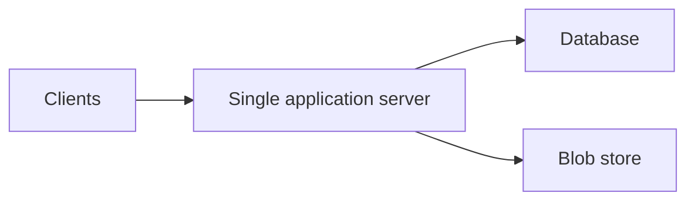

本章解决方案：运行多个可互换的 application servers，再由 load balancer（LB）把 traffic 分发到 pool：

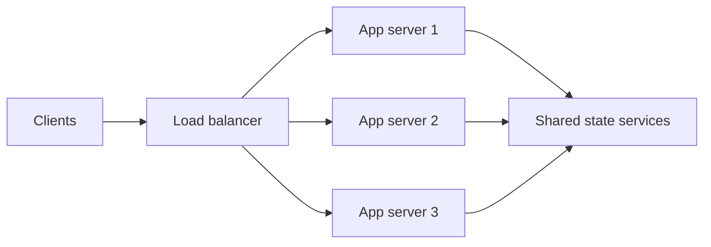

### 0.2 本章的核心问题

Load balancing 不只是“平均分请求”。一个完整方案要回答：

1. Pool 里现在有哪些 servers？
2. 哪些 servers healthy/ready？
3. 新 request 或 connection 应选哪一个？
4. Server 加入、离开或失败时，mapping 如何变化？
5. LB 自身如何扩展和容错？
6. 决策粒度是 DNS endpoint、TCP connection，还是 HTTP request？
7. Session、retry、drain、DDoS 与 observability 如何处理？

### 0.3 三种实现的控制粒度

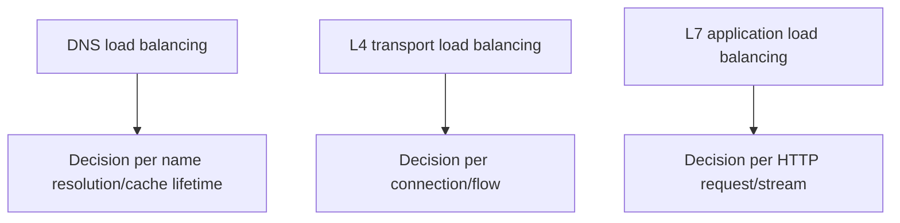

| 方式 | 看得见什么 | 一般决策单位 | 主要优势 | 主要限制 |
| --- | --- | --- | --- | --- |
| DNS | Name、client/resolver location | DNS resolution | 全球分流、无集中 byte path | Cache 导致变更慢、控制粗 |
| L4 | IP、port、transport flow | TCP connection/flow | 快、吞吐高 | 不理解 HTTP semantics |
| L7 | Method、host、path、headers、cookie | HTTP request/stream | 路由/鉴权/限流灵活 | CPU/memory/代理复杂度更高 |

它们不是互斥替代关系。常见链路是：

```text
global DNS -> regional L4 -> L7 reverse proxies -> application servers
```

---

## 1. 从单机到 horizontal scaling

### 1.1 Scale up 与 scale out

- **Scale up / vertical scaling**：给一台机器更多 CPU、RAM、NIC；
- **Scale out / horizontal scaling**：增加可并行服务的机器数量。

作者说一台 server 有某个 capacity，理论上两台可有两倍。这是 idealized model：

$$
C_{ideal}(N)=N\times C_1
$$

实际 capacity：

$$
C_{actual}(N)\le
\min(NC_1,C_{LB},C_{DB},C_{network},C_{shared})
$$

其中：

- $C_{LB}$：负载均衡层容量；
- $C_{DB}$：数据库容量；
- $C_{network}$：网络瓶颈；
- $C_{shared}$：其他共享依赖。

还要扣除 coordination、imbalance、retry 和 cache-warmup overhead，因此 scale-out 通常不是完美线性。

### 1.2 为什么 stateless application 容易扩展

Cruder 已将 state 推到 database 和 managed file store。任意 application server 都可处理任意 request，不需要先取得某台旧 server 的私有状态。

这里的 stateless 是：

- 没有只存在本机、不可重建的 durable user state；
- Request processing 所需 authoritative state 位于共享服务或 request 中；
- Instance 丢失不会丢失业务真相；
- 新实例可通过 config/secret/cache warmup 加入 pool。

Stateless 不表示 process 内完全没有 memory。它仍可有：

- connection pool；
- read cache；
- compiled template；
- metrics；
- bounded in-flight request state。

关键是这些 state 可重建或在 request 结束后消失。

### 1.3 为什么 stateful service 更难 scale out

Stateful service 必须：

- partition state；
- replicate state；
- 维护一致性和 leader/ownership；
- repair/rebalance；
- 处理 failover 与 stale routes。

这需要 coordination，可能成为 latency 和 throughput bottleneck。作者因此建议：应用尽量 stateless，将 state 交给有经验团队维护的专门服务。

这个建议不是“第三方服务永远更好”。仍要评估：

- dependency capacity；
- availability/SLA；
- latency/data locality；
- lock-in；
- cost；
- compliance；
- failure isolation。

### 1.4 Load balancer 带来的解耦

Client 只知道稳定 endpoint，不知道 individual servers：

```text
stable VIP/name -> changing backend pool
```

因此 operator 可以透明地：

- add/remove instances；
- autoscale；
- rolling deploy；
- replace failed machines；
- mix capacity with weights；
- drain a server before maintenance。

这个 indirection 与 Chapter 16 的 gateway、Chapter 17 的 front end 属于同一模式：稳定 logical endpoint 隔离 mutable placement。

---

## 2. Availability：为什么冗余 servers 有帮助

### 2.1 Availability 定义

作者回顾 Chapter 1：availability 是系统能够 service requests、做 useful work 的时间比例；也可理解为随机 request 成功的概率。

如果 server $i$ 的 availability 为 $A_i$，failure probability 为：

$$
q_i=1-A_i
$$

在以下强假设下：

- Servers 可互换；
- 只要一个 server 正常就能服务；
- Failures independent；
- LB 能即时、正确找到 healthy server；
- Surviving capacity 足够；
- LB 和 dependencies 永不失败；

所有 servers 同时失败的概率：

$$
P_{all\ down}=\prod_{i=1}^{N}q_i
$$

Backend pool 理论 availability：

$$
A_{pool}=1-\prod_{i=1}^{N}(1-A_i)
$$

### 2.2 两台 99% server 的例子

两台独立 servers：

$$
A_1=A_2=0.99,\qquad q_1=q_2=0.01
$$

$$
A_{pool}=1-(0.01\times0.01)=0.9999=99.99\%
$$

两个“9”加成四个“9”的直觉，只在 independent failure 和 perfect failover 模型下成立。

### 2.3 为什么现实不会直接得到 99.99%

#### 假设一：failure 独立

现实有 shared fate：

- 同一个 deploy bug；
- 同一个 rack/zone/power；
- 同一个 database；
- 同一个 certificate/config；
- traffic spike；
- health-check bug；
- shared LB/control plane。

Correlated failure 使乘法公式过于乐观。

#### 假设二：故障即时摘除

Health check 有 detection window。在摘除前，部分 traffic 仍发给坏 server。

若总 request rate 为 $\lambda$、共有 $N$ 个等权 servers、一个 server 故障、检测耗时 $T_d$，粗略失败请求数：

$$
E[failed]\approx\frac{\lambda T_d}{N}
$$

例如 $\lambda=10{,}000/s$、$N=10$、$T_d=15s$：

$$
E[failed]\approx15{,}000
$$

实际值受 passive detection、retry、connection stickiness 和 health threshold 影响。

#### 假设三：剩余 capacity 足够

一个 server 被移除后，其 load 转移给其余 servers。故障前每台 utilization 为 $u$，$N$ 台中失去 1 台，理想新 utilization：

$$
u'=u\frac{N}{N-1}
$$

若两台各 60%，失去一台后，另一台需要承受约 120%，系统会 overload。此时“冗余”没有提供可用性。

要容忍 $f$ 台失效，正常状态总负载 $L$ 至少满足：

$$
L<(N-f)C_1
$$

并留出 queueing、retry 和 skew headroom。

#### 假设四：LB 自身可靠

端到端 availability 还受串联组件限制。简化为：

$$
A_{system}\approx
A_{DNS}\times A_{LB}\times A_{pool}\times A_{dependencies}
$$

所以 LB 也要多实例、跨故障域、健康路由，并避免 control plane 故障立即拖垮 data plane。

### 2.4 Load balancing 提高的是 theoretical availability，不是 durability

多 application servers 可在 instance failure 时继续处理 request，但它们通常不保存 authoritative state。它们提高 compute availability，不等于复制 database/blob，也不提高业务数据 durability。

---

## 3. Load balancer 的共同能力

原章在具体实现前介绍三项 core features：

1. Load-balancing/routing algorithm；
2. Service discovery；
3. Health checks。

它们分别回答：

```text
who exists?      -> discovery
who can serve?   -> health/readiness
who should get this traffic? -> selection algorithm
```

顺序很重要：再好的 algorithm 也不能在过期 pool 和错误 health state 上做出正确选择。

---

## 4. Request-selection algorithms

### 4.1 Round robin

依次选择 servers：

```text
A -> B -> C -> A -> B -> C -> ...
```

优点：

- $O(1)$；
- 简单可预测；
- 同权、等成本短请求下较均匀。

局限：

- Request cost 不同；
- Long-lived connection 使 connection count 均匀但 work 不均；
- Backend capacity 可能异构；
- Server 刚恢复时未 warm 仍得到同样 traffic。

Weighted round robin 可按 capacity 分配比例，但 weight 仍需正确估计。

### 4.2 Random

每次在 eligible pool 中均匀随机选 server。它不需要所有 LB instances 共享一个 global counter，分布式实现简单。

对于大量独立 requests，均值会趋近 $m/N$，但短窗口有随机波动。Random 的重要价值是避免多个 balancers 因相同 stale metric 同时追逐同一个“最空闲”server。

### 4.3 Consistent hashing

按 client/session/connection key 映射 server：

$$
server=CH(key,pool)
$$

用途：

- Connection affinity；
- Session stickiness；
- Cache locality；
- Server membership 变化时减少 remapping。

局限：

- Key popularity 不均会 hotspot；
- Server removal 使其 keys 瞬间转给其他 servers；
- Stickiness 可能妨碍 load balance；
- Stateless application 一般不应无理由引入 affinity。

### 4.4 Least connections / least load

直觉：选择当前最空闲 server。但“当前 load”是 distributed observation：

- 指标采样有延迟；
- 查询所有 servers 成本高；
- 多 LB instances 看到不同 snapshot；
- CPU 可能不能代表 queue、memory 或 request cost；
- 决策本身改变 load。

这使调度形成 feedback loop。

## 5. Delayed load metric 为什么会振荡

### 5.1 作者的例子

假设新 server 加入 pool，reported load 为 0。LB 缓存 metrics，在下一次采样前不断把 requests 发给它：

```text
sample: server A load = 0
-> herd traffic to A
-> next sample: A overloaded
-> stop traffic to A
-> A drains and reports low
-> herd traffic to A again
```

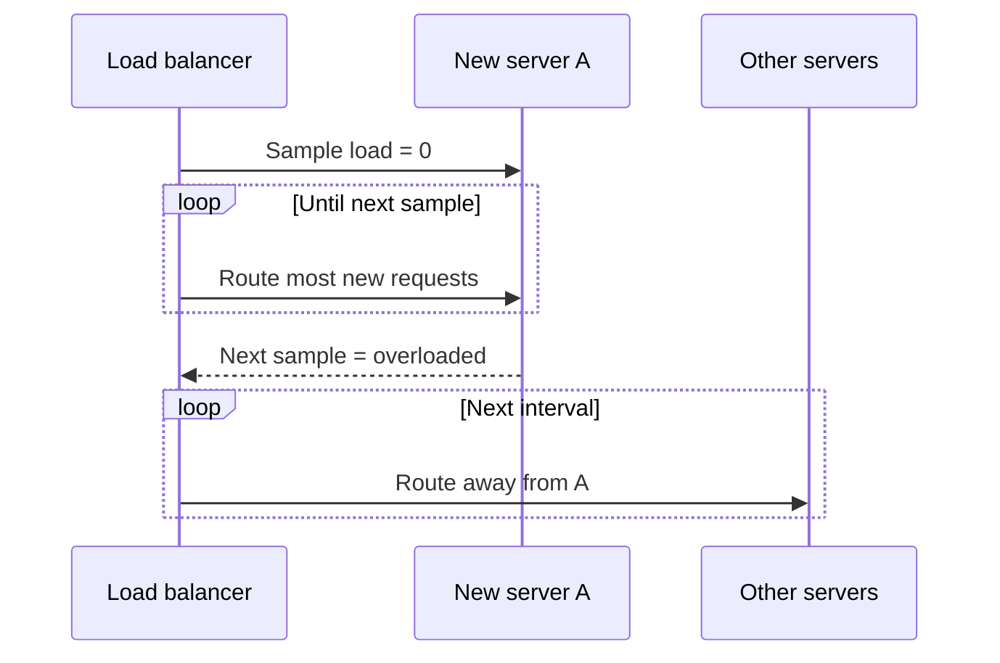

这是 stale feedback + synchronized decision 造成的 herd/oscillation。提高采样频率只能缩短 delay，也增加 telemetry cost，不能完全消除分布式决策的同步效应。

### 5.2 为什么纯随机可能更好

随机不追逐同一个看似最优目标。多个 independent decisions 自然分散，因此在 stale metrics 很严重时，简单 random 可能比 global least-load 更稳定。

这不是说 random 永远优于 accurate least-load。如果有可靠 local queue/connection state，least-connections 可很有效；作者针对的是 delayed distributed metric 的反直觉问题。

## 6. Power of two random choices

### 6.1 算法

作者给出的修正：随机选两个 servers，再把 request 发给其中 load 较低者。

```text
candidate_a = random(pool)
candidate_b = random(pool, different from a)
return lower_load(candidate_a, candidate_b)
```

它结合：

- Randomness：不同 decisions 看不同 candidates，避免全局 herd；
- Load signal：在局部候选中倾向较空闲者；
- Constant work：每次只比较两个，不扫描全 pool。

### 6.2 为什么两个选择产生巨大改善

经典 balls-into-bins 模型中，把 $n$ 个单位 tasks 分给 $n$ 个 servers：

- One random choice 的最大 load 高于平均约 $\Theta(\log n/\log\log n)$；
- Two choices 并选较轻者，超出平均约降至 $\Theta(\log\log n)$。

这是 asymptotic high-probability 结果，假设：

- Tasks 独立、同成本；
- Candidate 均匀随机；
- 能观察候选 load；
- 没有 affinity 和 server heterogeneity。

真实系统可用 weighted P2C、outstanding requests、EWMA latency 或 queue depth，但 delayed/noisy metric 仍需谨慎。

### 6.3 Tie-breaking

如果两个 candidates load 相同，必须随机或稳定地打破平局。若永远选 ID 较小者，会重新引入 bias。多 LB instances 也应使用不同 random streams。

### 6.4 Request cost 不均时

计数每个 request 为 1 可能错误。可用：

- In-flight requests；
- Estimated work；
- EWMA latency；
- Queue delay；
- Endpoint/class weights。

但越复杂的 metric 越容易 delay、noise 和 gaming。先从最小稳定信号开始。

---

## 7. Service discovery

### 7.1 定义

Service discovery 是 LB 发现可路由 server pool 的机制。

最简单是 static config：

```text
10.0.0.11:8080
10.0.0.12:8080
10.0.0.13:8080
```

问题：

- 手工更新易错；
- Deploy/scale 变化频繁；
- Config 在多个 LB instances 间不一致；
- Dead address 可能长期残留；
- Automation 需要额外 reload/rollout。

### 7.2 Coordination service + TTL

原章建议由 fault-tolerant coordination service，例如 etcd 或 ZooKeeper，管理 server list。

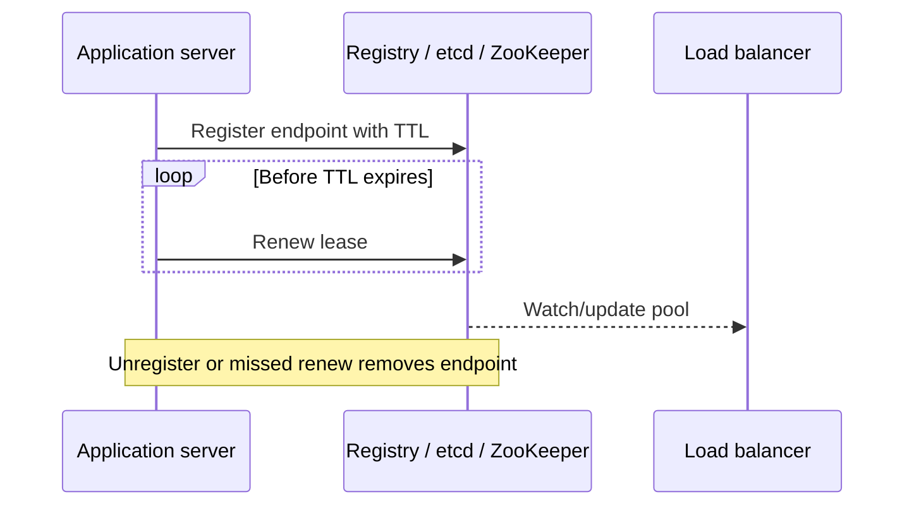

Registration 至少包含：

- Service/endpoint address；
- Instance ID；
- Zone/version/capacity labels；
- Lease/TTL；
- Optional readiness metadata。

### 7.3 TTL 的取舍

- TTL 短：故障/关机后 stale endpoint 消失快，但 renew QPS 高，对 registry 短暂故障敏感；
- TTL 长：control overhead 低，但 stale membership 保留更久。

TTL expiration 只表示 lease 未续，不一定证明 process 已死：network partition、GC pause 或 registry outage 都可能导致误删。Health check 与 discovery 应互补，而不是互相当作绝对真相。

### 7.4 Discovery 与 health 是不同状态

- **Discovered**：实例宣称存在；
- **Healthy/ready**：实例此刻适合接受 traffic。

一个 instance 可仍注册但正在 drain；也可能 health endpoint 可达但尚未完成 registration。LB 的 eligible set：

$$
Eligible=Discovered\cap Ready\cap PolicyAllowed
$$

### 7.5 Autoscaling

Cloud autoscaling 依赖动态 add/remove：

```text
load rises -> create server -> warm -> register -> receive traffic
load falls -> mark draining -> stop new traffic -> complete in-flight -> unregister -> terminate
```

错误顺序会：

- 新 server 未 warm 就被 hammer；
- Scale-in 直接中断 in-flight；
- Terminated endpoint 仍在 stale caches；
- Autoscaler 与 LB health loop 互相振荡。

---

## 8. Health checks

### 8.1 目标

Health check 检测 server 是否还能服务，并在不适合时临时从 pool 移除。

需要区分：

- **Liveness**：process 是否活着，需要重启吗？
- **Readiness**：此刻是否应接收新 traffic？
- **Startup**：是否完成初始化/warmup？

原章用统一 health endpoint 建立直觉；生产 orchestrator/LB 可能分别支持这些语义。

### 8.2 Passive health check

LB 在转发真实 traffic 时观察：

- Connection refused/unreachable；
- Timeout；
- Connection reset；
- 5xx/503；
- Protocol error。

优点：

- 观测真实 request path；
- 无额外 probe traffic；
- 可发现 endpoint 返回错误。

局限：

- 没有 traffic 时无法探测；
- 第一个真实 client 承担失败；
- 慢失败要等 timeout；
- Application error 不一定代表整个 server bad；
- Retry 非幂等 request 可能有副作用。

原文把 503 作为会触发摘除的示例。HTTP 503 通常表示暂时不可用，并不天然“不可重试”；能否 retry 要看 method 是否幂等、body 是否已发送、`Retry-After` 和 retry budget。Health decision 与当前 request retry decision应分开。

### 8.3 Active health check

LB 周期调用 dedicated endpoint：

```http
GET /health/ready
```

- `200 OK`：可服务；
- 5xx：overloaded/degraded，不应接收；
- Timeout：计为 error。

通常不会单次失败就 eject，而是阈值状态机：

```text
healthy --k consecutive failures--> unhealthy
unhealthy --m consecutive successes--> healthy
```

这提供 hysteresis，减少瞬时抖动。

### 8.4 Health endpoint 应检查多少

最简单 handler 永远返回 200，只证明 event loop/process 能响应。原章指出严重 degraded server 的普通 request 往往会 timeout，因此简单 check 也有价值。

更深检查可看：

- CPU；
- Available memory；
- Concurrent requests/queue；
- Thread pool；
- Critical dependency；
- Disk/error state。

但 deep health 有风险：如果共享 database 短暂失败，所有 application servers 同时报 unhealthy，LB 清空 pool，使原本可降级的系统完全不可用。

### 8.5 Fail-open / aggregate sanity guard

作者建议：如果大比例 servers 同时 unhealthy，LB 应怀疑 health checks 自身不可靠，而不是天真清空 pool。可采取：

- Ignore failing signal temporarily；
- Keep last known good pool；
- Fail open to all endpoints；
- Preserve minimum healthy capacity；
- Alert/operator intervention；
- Use dependency-specific degradation instead of full unready。

这不是万能规则。对会 corrupt data 或违反安全约束的 failure，fail open 可能更危险。Policy 应区分：

- Safety-critical failure：fail closed；
- Capacity/dependency uncertainty：可能 fail open/degrade。

### 8.6 Detection time

若 active probe interval 为 $I$，timeout 为 $T_o$，需连续 $k$ 次失败，在最坏对齐下粗略摘除时间：

$$
T_{detect,max}\approx kT_o+(k-1)I+I
$$

具体 scheduler 是“每次开始间隔”还是“上次结束后间隔”会改变公式。更通用地说，检测时间受 probe interval、timeout、failure threshold 和 phase alignment 共同决定。

缩短它们提高检测速度，却可能误判 transient failure 并增加 probe load。

---

## 9. Health checks 用于无停机更新与 drain

### 9.1 Rolling update

更新一小批 servers 时：

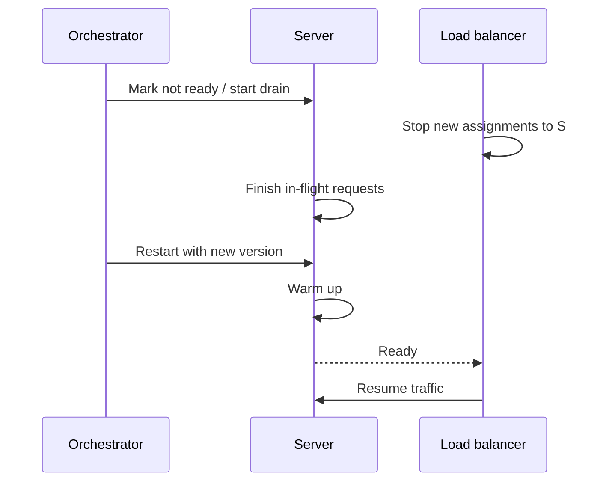

Drain 与立即 kill 不同：

- 不再接收 new work；
- 允许 existing connections/requests 在 deadline 内完成；
- Deadline 后才强制终止；
- Long-lived connections 需 connection age/GOAWAY 等机制。

### 9.2 Capacity during rollout

若一次 drain $d$ 台，总共 $N$ 台，剩余 capacity：

$$
C_{remaining}=(N-d)C_1
$$

Rolling batch size 必须满足当前 load、failure headroom 和 warmup。Deploy 与意外 node failure 可同时发生，不能把全部冗余都用于 rollout。

### 9.3 Readiness 与 graceful shutdown 顺序

安全顺序：

```text
mark unready
-> wait for LB/discovery propagation
-> drain in-flight
-> close resources
-> terminate
```

先 terminate 再从 pool 删除会制造 client-visible failures。

---

## 10. Gray failure、memory leak 与 watchdog

### 10.1 Gray failure

Server 未完全 crash，却严重 degraded：

- Memory leak 导致 swap thrashing；
- Thread deadlock/stall；
- Connection pool exhaustion；
- GC pause；
- Disk latency spike；
- Event loop starvation。

Binary process-up signal可能仍为“健康”，而真实 requests 已超时。

### 10.2 作者的 memory-leak 例子

Rare memory leak 让 available physical memory 缓慢下降，最终频繁 swap，server performance 急剧恶化。随着 leak 影响多数 servers，整个应用逐渐 degrade。

修复 root cause 最重要，但在诊断期间可让严重 degraded server 自行 restart，使系统 self-heal 并给 operators 时间。

### 10.3 Watchdog

独立 background thread 周期监控 metrics。若某 metric 超 threshold 持续一段时间，deliberately crash/restart：

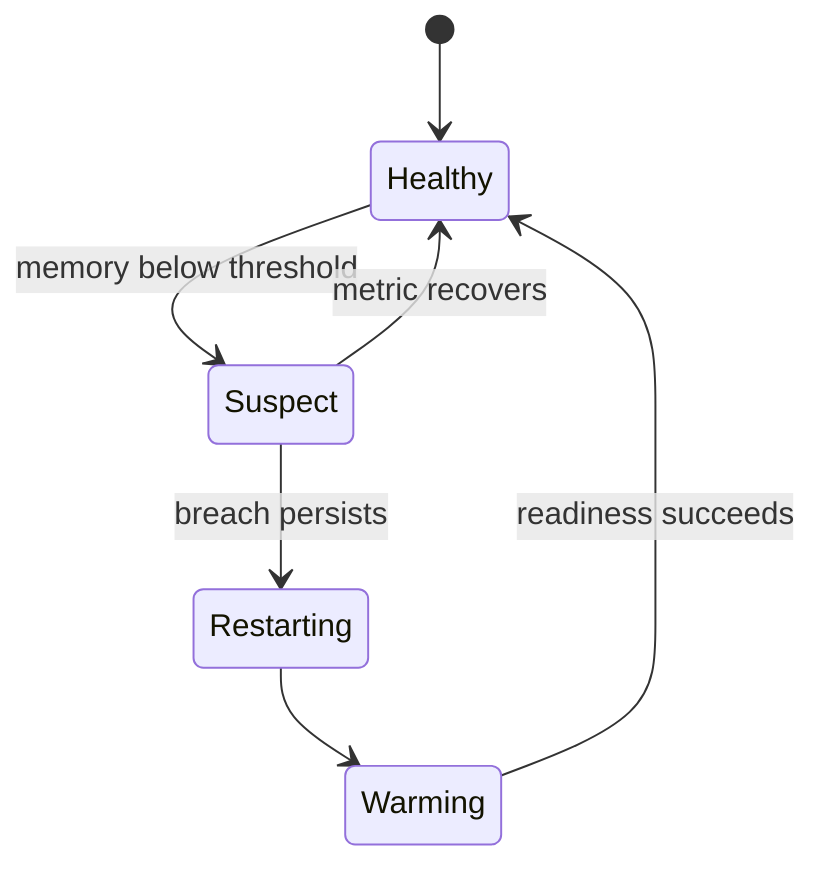

持续时间要求与 cooldown 防止瞬时 spike 触发重启。

### 10.4 Watchdog 的风险

- Bug 造成 restart loop；
- 所有 instances 同时达到阈值并一起重启；
- Restart 掩盖 root cause；
- Stateful process 重启可能影响 correctness；
- Memory threshold 未考虑 page cache/容器 limit；
- Warmup 后立即重新触发。

因此 watchdog 要：

- Well-tested；
- Observable；
- Jittered；
- Rate-limited；
- 有 global disruption budget；
- 保存 crash diagnostics；
- 与 readiness/drain 协调。

---

## 11. 18.1 DNS load balancing

### 11.1 基本机制

为一个 DNS name 配置多个 public IP addresses：

```dns
app.example.com. 60 IN A 100.140.0.1
app.example.com. 60 IN A 100.140.0.2
```

Resolver 返回列表，由 client/resolver 选择一个 endpoint。Figure 18.1：

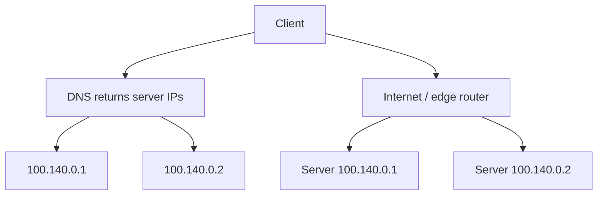

DNS 不在每个 byte/request 的 data path，因此吞吐本身不经过一个 proxy bottleneck。

### 11.2 为什么 failure resilience 较弱

如果 server 1 down：

- Authoritative DNS 未必知道；
- Resolver/client 仍 cache 旧 answer；
- Client 可能持续选择坏 IP；
- 即使 DNS record 自动删除，变更传播受 TTL/cache 影响；
- 某些 resolver/application 可能 cache 超过预期。

DNS TTL 降低只缩短名义 cache 窗口，不提供瞬时 failover，还增加 DNS query load。

### 11.3 Load distribution 不精确

DNS answer 的一个“选择”可能代表：

- 一个 client；
- 一个 recursive resolver 后的许多 clients；
- 一个应用持有很久的 connection pool；
- 一个大流量 NAT network。

因此 IP 数量均匀返回不等于 request/byte load 均匀。DNS 的决策粒度太粗，无法看到实时 connection/request cost。

### 11.4 适用场景：global DNS load balancing

作者指出 DNS 实践中常用于把 traffic 分到不同 regions/data centers，Chapter 15 CDN 已见：

- 根据 client/resolver location；
- Region health；
- Network condition；
- Capacity/policy；
- Data residency。

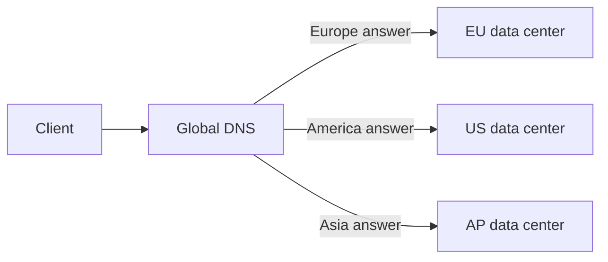

DNS 适合 region-level coarse steering；region 内通常再用 L4/L7 做细粒度、快速 failure handling。

### 11.5 DNS 与 service discovery 的关系

DNS 本身也可作为 discovery interface，但要区分：

- Public/global DNS：把 client 引向 region/VIP；
- Internal service registry/DNS：发现 service instances；
- LB backend watch：维护高频 health/ready pool。

它们的 TTL、consistency、规模和安全边界不同。

---

## 12. 18.2 Transport layer load balancing（L4）

### 12.1 定义

L4 load balancer 在 transport/TCP 层工作，client 与 backend 之间的 traffic 通过它。它主要看：

- Source IP/port；
- Destination IP/port；
- Protocol；
- Connection state/flags。

原章用 TCP connection 的四元组：

$$
(srcIP,srcPort,dstIP,dstPort)
$$

若一个 LB 同时处理多种 protocol，常说 five-tuple，再加 protocol。对于已知 TCP listener，四元组足以标识 connection。

### 12.2 VIP 与 backend pool

Network LB 有 physical NICs，映射一个或多个 Virtual IP（VIP）。一个 VIP 关联一个 server pool。Client 只看到 VIP：

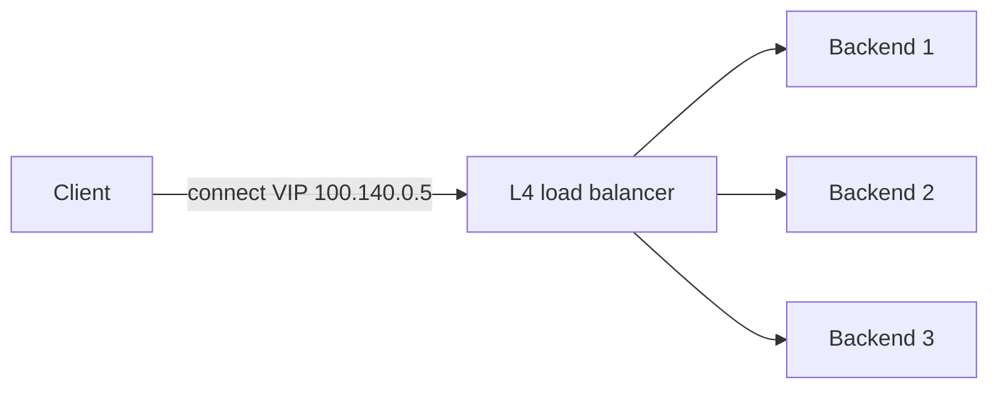

Figure 18.2 用 DNS 返回 VIP，再由 edge router 到 L4 LB，最后到 servers。

### 12.3 Connection-level selection

Client 新建 TCP connection 时：

1. LB 从 healthy pool 选择 backend；
2. 记录或可重算 flow mapping；
3. 此 connection 后续 packets 必须到同一 backend；
4. Connection 结束/timeout 后释放 state。

不能对同一 TCP byte stream 的不同 packets 随意轮询到不同 servers，否则 sequence state 不一致。

### 12.4 Connection hashing

典型映射：

$$
backend=H(srcIP,srcPort,dstIP,dstPort,pool)
$$

Membership 变化时使用 consistent/resilient hashing 可减少 flows remap。Active TCP connection 若被重映射到无 state 的 backend 仍可能 reset；“减少 disruption”不等于 live connection 无缝迁移。

### 12.5 Connection count 不等于 request load

一条 connection 可能：

- 只发一个短 request；
- 持续传视频；
- HTTP keep-alive 发很多 requests；
- HTTP/2 multiplex 大量 streams；
- 长时间 idle。

L4 把 connection 作为决策单位，因此 connection distribution 均匀不保证 work distribution 均匀。

## 13. NAT packet translation

### 13.1 下行 client -> backend

原章描述 LB 翻译：

- Source：client address -> LB address；
- Destination：VIP -> backend address。

这是 full NAT/proxy-like flow，使 backend reply 返回 LB。

```text
before: clientIP:clientPort -> VIP:443
after:  LBIP:translatedPort -> backendIP:443
```

### 13.2 上行 backend -> client

LB 做反向翻译：

```text
before: backendIP:443 -> LBIP:translatedPort
after:  VIP:443 -> clientIP:clientPort
```

Client 始终认为 peer 是 VIP，backend 不直接暴露。

### 13.3 NAT state 与容量

Stateful NAT 通常为每个 connection 维护：

- Original/translated tuple；
- Backend choice；
- TCP timeout/state；
- Counters。

若 concurrent connections 为 $M$，每 flow state 为 $s$ bytes：

$$
Memory\approx M\times s
$$

例如 500 万 connections、每 flow 256 bytes，仅核心 state：

$$
5\times10^6\times256
=1.28\ \mathrm{GB}
$$

真实开销还包含 hash table、allocator、timers 和 packet buffers。

### 13.4 Source IP visibility

Source NAT 后 backend 看到的 peer 可能是 LB，而非原 client。需要：

- Proxy Protocol；
- Transparent proxying；
- DSR；
- L7 `Forwarded`/`X-Forwarded-For`（只能由 trusted proxy 写入）。

不要直接信任 client 可伪造的 forwarding header。

---

## 14. Direct Server Return（DSR）

### 14.1 为什么需要

很多 workload response bytes 大于 request bytes，例如图片、视频和 downloads。普通 symmetric path 让 LB 同时承载 ingress 和 egress。

设 inbound request traffic 为 $B_{in}$，outbound response traffic 为 $B_{out}$：

$$
B_{LB,normal}\approx B_{in}+B_{out}
$$

DSR 中 backend response 绕过 LB 直接到 client：

$$
B_{LB,DSR}\approx B_{in}
$$

若 request $1\ \mathrm{Gb/s}$、response $20\ \mathrm{Gb/s}$，LB data throughput 从约 $21\ \mathrm{Gb/s}$ 降到约 $1\ \mathrm{Gb/s}$。

### 14.2 路径

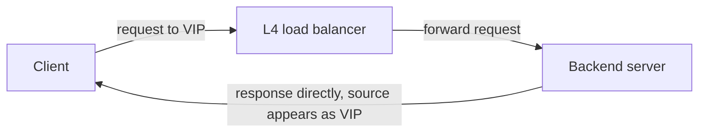

### 14.3 DSR 的复杂度

- Backend 要能以 VIP 作为 response source；
- Network routing/ARP/neighbor behavior 要配置；
- LB 看不到 response，难做双向 observability；
- 某些 stateful firewall/NAT 假设 symmetric path；
- Backend 必须正确处理 MTU、return route；
- TLS/application state仍在 backend。

DSR 用更复杂的 network setup 换 LB egress capacity。

---

## 15. 扩展 L4：Anycast 与 ECMP

### 15.1 为什么单 L4 LB 不够

所有 packets 经过一个 instance，它会成为：

- Throughput bottleneck；
- Connection-state bottleneck；
- Failure point；
- Maintenance constraint。

原章说明可在 commodity machines 上构建多个 LB instances，并组合 Anycast 与 ECMP scale out。

### 15.2 Anycast VIP

多个 LB instances/locations 宣告同一个 VIP prefix。Routers 根据 routing policy 选择一个可达实例/路径。

原章用“lowest BGP weight”建立直觉。更精确地说，BGP route selection 涉及 local policy、local preference、AS path 等；`weight` 不是跨互联网统一传递的标准 metric。Anycast 的核心是多个地点宣告同一地址，由 routing 选一条 best path。

### 15.3 ECMP

在 data center 内若多条 next hops 具有 equal cost，router 可用 ECMP 分发 flows：

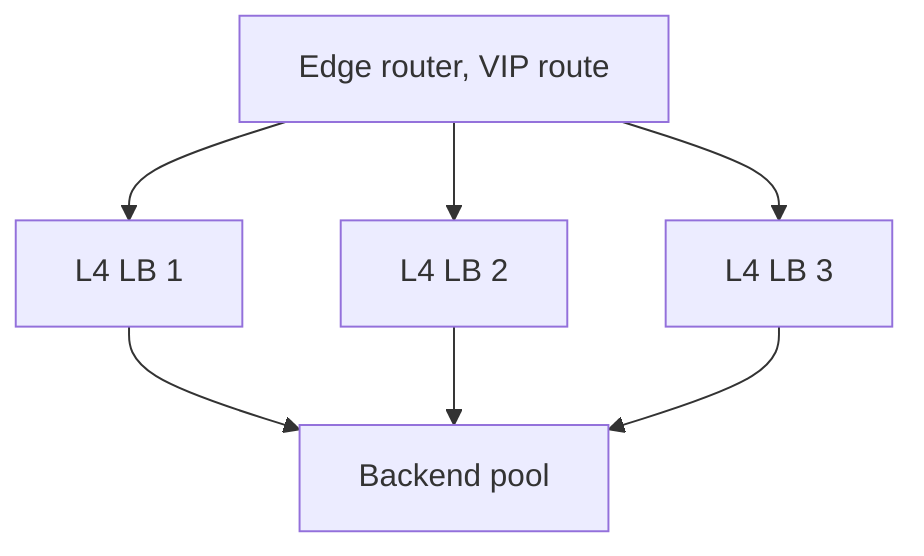

Router 通常对 flow tuple hash，使同一 flow 的 packets 大体保持同一路径。原章称 ECMP 使用 consistent hashing；现代设备可能提供 resilient hashing 以减少 membership change remap，但普通 ECMP flow hash 不必然具有完整 consistent-hash guarantee，具体以实现为准。

### 15.4 Flow symmetry 与 LB state

若 LB 是 stateful NAT，同一 flow 的双向 packets 需到持有 state 的 instance。解决思路：

- ECMP symmetric hash；
- State replication；
- Stateless deterministic mapping；
- DSR；
- Connection synchronization/failover。

Instance failure 仍可能中断现有 connections，即使新 connections 很快转移。

### 15.5 Managed network load balancer

原章列举 AWS Network Load Balancer 与 Azure Load Balancer。Managed service 隐藏 LB fleet、route announcement、health 和 scale，但应用仍需配置：

- Listener/VIP；
- Backend pool；
- Health check；
- Cross-zone/region policy；
- Connection timeout；
- Source-IP preservation；
- Security groups/firewall；
- Metrics and quotas。

---

## 16. L4 的能力边界

L4 packet/connection balancer 不理解 HTTP bytes 的语义，因此纯 L4 data plane 无法根据以下信息路由：

- Host/path；
- Header/cookie；
- HTTP method；
- Status/body；
- Logical session；
- gRPC method。

原章说 L4 generally 不支持需要高层 protocol 的能力，例如 TLS termination。精确边界是：**纯 transport passthrough** 不能终止和理解 TLS；某些名为“Network Load Balancer”的现代产品可提供 TLS listener/termination，但那是产品附加 proxy/crypto capability，不能由“L4”标签自动推导。

L4 的优势是工作更少：

- 无 HTTP parsing；
- 可接近 packet-forwarding speed；
- Protocol-agnostic；
- 更适合很高 connection/packet throughput。

需要 application-aware 功能时进入 L7。

---

## 17. 18.3 Application layer load balancing（L7）

### 17.1 定义

L7 LB 是 HTTP reverse proxy：接收 client HTTP request、检查它，再发送给 backend。

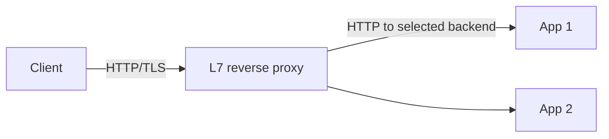

它代表 server-facing service，client 看不到 individual backends。

### 17.2 两条 TCP connections

不是 packet 透明转发，而是：

1. Client <-> L7 LB connection；
2. L7 LB <-> Backend connection。

```text
client TCP/TLS state terminates at LB
LB parses HTTP
LB selects/reuses backend connection
```

这使两侧可以独立：

- Connection pool/reuse；
- TLS termination/re-encryption；
- HTTP version translation；
- Timeout/retry；
- Backpressure；
- Header normalization。

代价是 LB 要维护两侧 state、buffer 和 protocol correctness。

### 17.3 HTTP request de-multiplexing

L7 可在同一 client TCP connection 上，把不同 HTTP requests 分给不同 backends。尤其 HTTP/2：一条 TCP connection 上有多个 concurrent streams，且 streams cost 差异大。

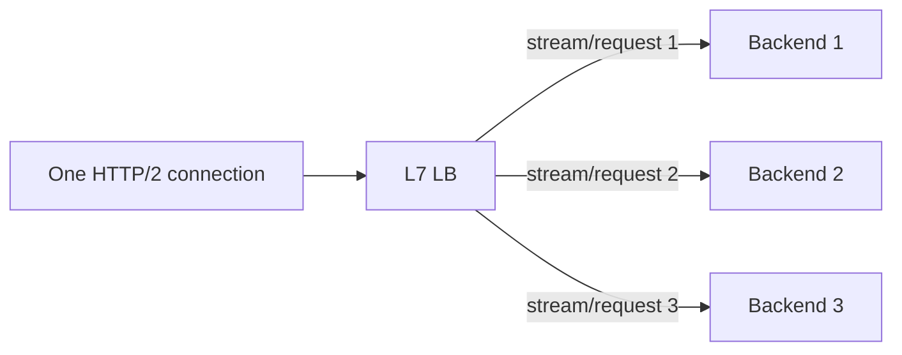

L4 只能把整条 connection 固定给一个 backend，无法把内部 streams 分开。这是 request-level balancing 的关键优势。

### 17.4 L7 可以做什么

- Route by host/path/method/header；
- TLS termination；
- Header-based rate limiting；
- Authentication/authorization；
- Compression；
- Request/response size limit；
- Retry/circuit breaking；
- Canary/weighted routing；
- Observability/tracing；
- Session affinity；
- Protocol translation。

功能越多，配置和 failure modes 越多。Retry、buffer、timeout、header trust 等都可能改变 application semantics。

---

## 18. Sticky sessions

### 18.1 机制

L7 LB 可用 cookie 识别 logical session，再用 consistent hashing 映射 server：

$$
backend=CH(sessionID,pool)
$$

这样 server 可在 local memory cache session data，减少每次访问 shared store。

### 18.2 收益

- Cache locality；
- 减少 session-store read；
- 对 legacy in-memory session 应用提供迁移路径；
- WebSocket/long workflow affinity。

### 18.3 代价

作者强调 hotspot：不同 sessions cost 差异大。即使 session count 均匀，也可能一个 heavy session 占大量 CPU。

其他问题：

- Server failure 使 session remap/cache cold；
- Scale changes 引起 remapping；
- Drain 长时间被 sticky traffic 阻碍；
- Session local state 若不 durable 会丢；
- Cookie 安全与伪造；
- Capacity imbalance。

优先保持 application stateless。只有证实 locality 收益明显、且能容忍 remap 时才使用 stickiness。

### 18.4 Sticky 不等于 state replication

Affinity 只是尽量路由到同一 server，不保证 server 永远存在。Authoritative session 仍应位于 shared/durable store，或明确接受丢失。

---

## 19. L4 与 L7 组合

### 19.1 典型架构

原章指出 L7 pool 可作为 L4 backend：

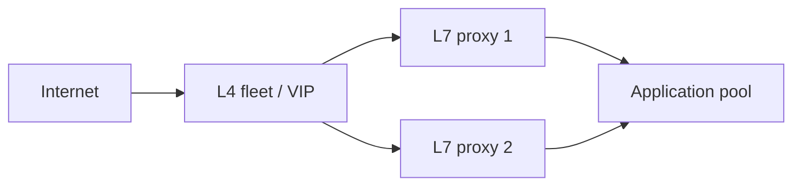

职责：

- L4：高 packet/connection throughput、粗粒度分流、SYN protection；
- L7：TLS/HTTP semantics、request-level routing 和 policy。

### 19.2 Throughput tradeoff

L7 需要：

- Accept/terminate client connections；
- TLS crypto；
- Parse HTTP；
- Apply policy；
- Maintain backend pools；
- Possibly buffer/retry body。

所以每 byte/request CPU 和 memory 通常高于 L4。L4 capabilities 少，但吞吐更高。

### 19.3 SYN flood

SYN flood 快速发起 TCP connection 却不完成 handshake，耗尽 connection/state resources。L4 更靠近 transport 层，可用 SYN cookies、stateless filtering、connection rate controls 和大规模 packet capacity，更适合作第一道防线。

这不表示 L7 能防所有 application attacks，也不表示 L4 能理解合法但昂贵的 HTTP request。DDoS defense 是分层的。

### 19.4 两层 health 与 retry 放大

L4 检查 L7 proxy，L7 检查 application server。若每层都独立 retry $r$ 次，最坏尝试数可能乘法放大。应定义：

- 哪一层有 retry authority；
- Idempotent methods；
- Per-request retry budget；
- Deadline propagation；
- Outlier ejection；
- Avoid retry storms under overload。

---

## 20. Dedicated LB 的故障域

所有 application traffic 经过 dedicated LB；若它 down，后端全 healthy 也不可达。

```text
client -> LB -> backend
          ^ single logical choke point
```

解决方案不是删除 load balancing，而是把 LB 本身做成 replicated service：

- Multiple L4/L7 instances；
- Anycast/ECMP or upstream LB；
- Cross-zone placement；
- Stateless config distribution；
- Health/failover；
- Capacity headroom；
- Control-plane independence。

Logical endpoint 可以是单个 VIP，但实现不能是单台机器。

---

## 21. Sidecar pattern 与 service mesh

### 21.1 将 balancing 委托给 client side

对于 organization 内部 clients，可在每台 client machine/pod 旁运行 sidecar proxy，所有 outbound traffic 经过它：

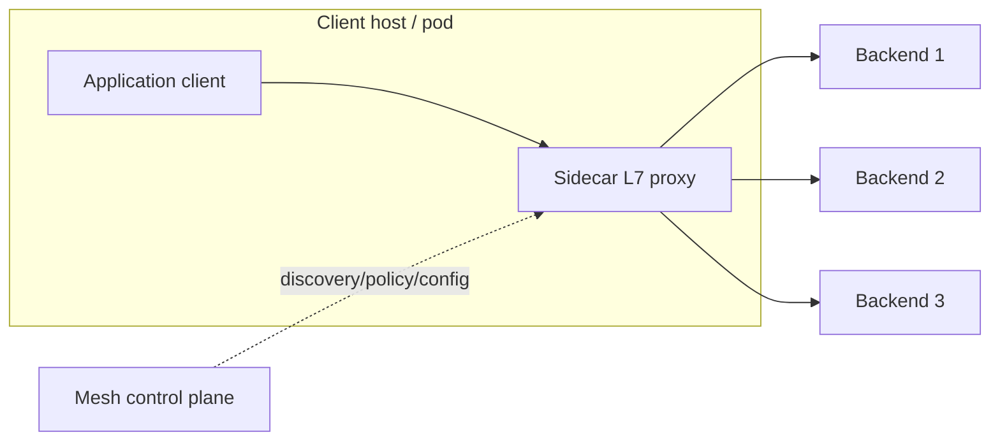

Sidecar 作为 L7 LB，还可做：

- Rate limiting；
- Authentication/mTLS；
- Monitoring/tracing；
- Retry/timeout；
- Circuit breaking；
- Traffic policy。

### 21.2 为什么称 service mesh

大量 microservices 互相通信，每个 workload 都有 proxy data plane，由 central control plane 管理 discovery、identity、routing 和 policy，形成 service-to-service communication mesh。

作者写作时列举 NGINX、HAProxy、Envoy 作为 popular sidecar proxy load balancers。具体 service-mesh ecosystem 会演进，不能把品牌列表当成永久定义。

### 21.3 优势

- Load balancing 分散到 clients；
- 避免一个 dedicated L7 fleet 承担全部 internal traffic；
- 各语言应用共享统一 network policy；
- Consistent observability/security；
- Local proxy 可快速使用 endpoint list。

### 21.4 代价

作者强调 control plane 和整体复杂度：

- 每个 workload 多一个 process/resource footprint；
- Config rollout/version compatibility；
- Certificate/identity management；
- Sidecar startup ordering；
- Debug path 更长；
- Control-plane outage/stale config；
- Retry multiplication；
- Proxy bug blast radius；
- CPU/memory/latency tax。

Sidecar 消除了 dedicated LB 的集中 data path，却没有消除 load balancing system；它将系统分布到每个 client，并新增 control plane。

### 21.5 Sidecar 与 smart client

| 方式 | LB logic 所在 | 优点 | 缺点 |
| --- | --- | --- | --- |
| Smart client library | Application process | 少一跳、语言内控制 | 每种语言重复实现/升级 |
| Sidecar proxy | Co-located process | 语言无关、统一 policy | 多一跳和运营复杂度 |
| Dedicated proxy | Central/regional fleet | Client 简单 | 集中 capacity/failure domain |

---

## 22. 可运行 C11 模拟：stale metric、random 与 P2C

### 22.1 模拟目标

程序比较三个 scheduler 将 512 个单位 requests 分到 8 台 servers：

1. **Stale global least-load**：每 64 requests 才采样一次，整批都发给 snapshot 中最空闲 server；
2. **One random choice**：每 request 随机选一台；
3. **Power of two choices**：每 request 随机选两台，把它发给当前 assignments 较少者。

它还验证一个说明性的 health-policy guard：

- 少数 unhealthy 时，只使用 healthy servers；
- 3/4 同时 unhealthy 时，怀疑 health signal，fail open 保留全部 endpoints。

Fail-open policy 是对原章建议的最小演示，不适用于 safety/corruption failure。

### 22.2 完整代码

```c
#include <stdbool.h>
#include <stddef.h>
#include <stdint.h>
#include <stdio.h>

enum {
    SERVER_COUNT = 8,
    REQUEST_COUNT = 512,
    SAMPLE_BATCH = 64
};

typedef struct {
    unsigned int loads[SERVER_COUNT];
    unsigned int peak_batch;
} Simulation;

static uint32_t next_random(uint32_t *state) {
    *state = *state * UINT32_C(1664525) + UINT32_C(1013904223);
    return *state;
}

static size_t random_server(uint32_t *state) {
    return (size_t)((next_random(state) >> 16) % SERVER_COUNT);
}

static size_t least_loaded(const unsigned int *loads) {
    size_t best = 0;
    size_t index;

    for (index = 1; index < SERVER_COUNT; index++) {
        if (loads[index] < loads[best]) {
            best = index;
        }
    }
    return best;
}

static void simulate_stale(Simulation *simulation) {
    size_t batch_start;

    for (batch_start = 0;
         batch_start < REQUEST_COUNT;
         batch_start += SAMPLE_BATCH) {
        const size_t selected = least_loaded(simulation->loads);
        unsigned int assigned = 0;
        size_t offset;

        for (offset = 0; offset < SAMPLE_BATCH; offset++) {
            simulation->loads[selected]++;
            assigned++;
        }
        if (assigned > simulation->peak_batch) {
            simulation->peak_batch = assigned;
        }
    }
}

static void simulate_random(Simulation *simulation, uint32_t seed) {
    size_t request;

    for (request = 0; request < REQUEST_COUNT; request++) {
        const size_t selected = random_server(&seed);
        simulation->loads[selected]++;
    }
}

static void simulate_two_choices(Simulation *simulation,
                                 uint32_t seed) {
    size_t request;

    for (request = 0; request < REQUEST_COUNT; request++) {
        size_t first = random_server(&seed);
        size_t second = random_server(&seed);
        size_t selected;

        while (second == first) {
            second = random_server(&seed);
        }

        if (simulation->loads[first] < simulation->loads[second]) {
            selected = first;
        } else if (simulation->loads[second] <
                   simulation->loads[first]) {
            selected = second;
        } else {
            selected = (next_random(&seed) & UINT32_C(1)) != 0
                ? first
                : second;
        }
        simulation->loads[selected]++;
    }
}

static unsigned int minimum_load(const Simulation *simulation) {
    unsigned int minimum = simulation->loads[0];
    size_t index;

    for (index = 1; index < SERVER_COUNT; index++) {
        if (simulation->loads[index] < minimum) {
            minimum = simulation->loads[index];
        }
    }
    return minimum;
}

static unsigned int maximum_load(const Simulation *simulation) {
    unsigned int maximum = simulation->loads[0];
    size_t index;

    for (index = 1; index < SERVER_COUNT; index++) {
        if (simulation->loads[index] > maximum) {
            maximum = simulation->loads[index];
        }
    }
    return maximum;
}

static size_t build_eligible_pool(const bool *healthy,
                                  size_t server_count,
                                  size_t *eligible) {
    size_t healthy_count = 0;
    size_t index;

    if (healthy == NULL || eligible == NULL || server_count == 0) {
        return 0;
    }

    for (index = 0; index < server_count; index++) {
        if (healthy[index]) {
            healthy_count++;
        }
    }

    if (healthy_count > server_count / 2) {
        size_t output_count = 0;
        for (index = 0; index < server_count; index++) {
            if (healthy[index]) {
                eligible[output_count++] = index;
            }
        }
        return output_count;
    }

    for (index = 0; index < server_count; index++) {
        eligible[index] = index;
    }
    return server_count;
}

int main(void) {
    Simulation stale = {0};
    Simulation random = {0};
    Simulation two_choices = {0};
    const bool one_unhealthy[] = {true, true, true, false};
    const bool three_unhealthy[] = {true, false, false, false};
    size_t eligible[4] = {0};
    size_t normal_count;
    size_t fail_open_count;
    unsigned int random_spread;
    unsigned int two_choice_spread;

    simulate_stale(&stale);
    simulate_random(&random, UINT32_C(7));
    simulate_two_choices(&two_choices, UINT32_C(7));

    random_spread = maximum_load(&random) - minimum_load(&random);
    two_choice_spread =
        maximum_load(&two_choices) - minimum_load(&two_choices);

    if (stale.peak_batch != SAMPLE_BATCH ||
        two_choice_spread >= random_spread ||
        maximum_load(&two_choices) > 66) {
        return 1;
    }

    normal_count = build_eligible_pool(
        one_unhealthy, 4, eligible);
    if (normal_count != 3 ||
        eligible[0] != 0 || eligible[1] != 1 || eligible[2] != 2) {
        return 1;
    }

    fail_open_count = build_eligible_pool(
        three_unhealthy, 4, eligible);
    if (fail_open_count != 4 ||
        eligible[0] != 0 || eligible[1] != 1 ||
        eligible[2] != 2 || eligible[3] != 3) {
        return 1;
    }

    printf("stale_peak_batch=%u stale_range=%u..%u\n",
           stale.peak_batch,
           minimum_load(&stale),
           maximum_load(&stale));
    printf("random_range=%u..%u spread=%u\n",
           minimum_load(&random),
           maximum_load(&random),
           random_spread);
    printf("two_choices_range=%u..%u spread=%u\n",
           minimum_load(&two_choices),
           maximum_load(&two_choices),
           two_choice_spread);
    printf("eligible_normal=%zu eligible_fail_open=%zu\n",
           normal_count, fail_open_count);
    return 0;
}
```

编译运行：

```bash
gcc -std=c11 -Wall -Wextra -Werror -pedantic load_balancing.c -o load_balancing
./load_balancing
```

输出由固定 PRNG seed 决定：

```text
stale_peak_batch=64 stale_range=64..64
random_range=54..84 spread=30
two_choices_range=63..65 spread=2
eligible_normal=3 eligible_fail_open=4
```

### 22.3 代码如何对应原理

`simulate_stale` 每批只读取一次 load snapshot，然后把 64 个 requests 全发给同一“最空”server，直接表现 feedback delay 的 herd。八批后累计值可能看似均匀，但每个短窗口都把一台 server 打满；只看长期平均会掩盖 oscillation。

`simulate_random` 不看 load，因此没有同步追逐，但短期仍有统计波动。

`simulate_two_choices` 每次只看两个随机 candidates，并使用当前 assignment count；它用很少 telemetry 显著压低 spread。程序并未模拟 request completion、heterogeneous cost 或 delayed candidate metric，所以只验证经典单位-task 直觉。

### 22.4 Health guard 对应关系

`build_eligible_pool` 是说明性 policy：

- 3/4 healthy：过滤一个 bad server；
- 只有 1/4 healthy：判定“大多数同时失败”可能是 health signal 问题，返回全部 pool。

生产系统不能硬编码“过半就 fail open”。应按 failure type、dependency、安全约束、last-known-good state 和 operator policy 决定。

### 22.5 示例局限

- Unit requests，不模拟 service time 和 queue；
- 单 scheduler，不模拟多个 LB instances；
- P2C 使用即时 assignment count，不是 stale CPU；
- Fixed homogeneous servers；
- 无 connection affinity、weight、autoscaling；
- Fail-open 只是 policy illustration；
- LCG 只用于 deterministic simulation，不用于安全随机；
- 没有并发和 packet/HTTP data path。

因此代码验证 delayed-global-choice 与 randomized-local-choice 的方向，不是 production LB。

---

## 23. DNS、L4、L7 的完整对比

| 维度 | DNS | L4 | L7 |
| --- | --- | --- | --- |
| Decision unit | DNS resolution | Connection/flow | HTTP request/stream |
| Data path | 不经过 DNS | 通常经过 LB，DSR 可绕回程 | 经过 proxy |
| Visibility | Name/location | Tuple/TCP | HTTP/TLS semantics |
| Failure reaction | 受 TTL/cache 限制 | 快速 health/flow selection | 快速 health/request selection |
| TLS | 返回 endpoint | Passthrough；产品可能附加 termination | 常 terminate/re-encrypt |
| Routing | Region/IP | VIP/port/flow | Host/path/header/cookie |
| Stickiness | Client/cache dependent | Flow hash/source affinity | Cookie/session/request key |
| Throughput | 无集中 byte path | 高 | 相对较低 |
| Global use | 很合适 | Anycast/regional entry | Region/internal request routing |
| Main risk | Stale DNS、粗粒度 | Flow state、packet capacity | Proxy complexity、retry/buffer |

### 23.1 选择不是“层数越高越好”

- 只需 TCP pass-through 和极高吞吐：优先 L4；
- 需要 HTTP routing/TLS/auth/rate limit：使用 L7；
- 跨 regions 定位：DNS/Anycast；
- 大规模 public service：常组合三者。

每增加一层都引入新的 availability、latency、configuration 和 observability 责任。

---

## 24. 容易混淆的概念

### 24.1 Load balancing 与 autoscaling

- LB 分配已有 capacity；
- Autoscaler 增删 capacity。

LB 不能凭空产生 server；autoscaler 也需要 discovery/readiness 才能安全接流量。

### 24.2 Service discovery 与 health check

- Discovery 回答实例是否注册/存在；
- Health 回答实例此刻能否接收 traffic。

TTL expiration 不是完整 health diagnosis，health 200 也不等于已注册。

### 24.3 Liveness 与 readiness

- Liveness false 常触发 restart；
- Readiness false 只应停止新 traffic。

把依赖波动放入 liveness 会造成所有 instances 同时重启。

### 24.4 Server availability 与 system availability

$1-\prod q_i$ 只描述理想 backend pool。端到端还包括 LB、DNS、dependencies、detection delay 和 capacity。

### 24.5 Request balancing 与 connection balancing

L4 均匀 connections 不保证 HTTP requests/streams 均匀；L7 能按 request 分配。

### 24.6 Round-robin DNS 与 proxy LB

DNS 只返回 addresses，不转发 bytes，也无法逐请求快速摘除；proxy LB 在 data path，可实时执行 policy。

### 24.7 Anycast 与 ECMP

- Anycast：多个地点/instances 宣告同一 address，routing 选 best path；
- ECMP：同一 router 对多条 equal-cost next hops 分 flow。

两者可组合，但作用层次不同。

### 24.8 NAT 与 DSR

- Full NAT：往返都经 LB，便于 state/observability；
- DSR：response 直返 client，减轻 LB egress，network setup 更复杂。

### 24.9 Consistent hashing 与 perfect balance

它减少 membership change remapping，不保证 session/key popularity 均匀，也不保证 live connection 迁移。

### 24.10 Sticky session 与 durable session

Sticky 只提高同一 backend 命中概率，server down 后 affinity 可失效；authoritative state 仍需 durable/shared。

### 24.11 Sidecar 与 dedicated LB

Sidecar 去中心化 data path，却新增每 host proxy 和 central control plane；不是“没有 LB”。

### 24.12 503 与 retry

503 是 unavailable signal，是否 retry 由 operation semantics、deadline、attempt budget 决定。对 non-idempotent request 盲目 retry 可重复副作用。

---

## 25. 常见误区与失败模式

### 25.1 “加两倍 servers 就有两倍 throughput”

Database、LB、network 和 shared lock 可能先饱和；load skew 与 coordination 也降低线性度。

### 25.2 “有多个 servers 就自动四个 9”

独立故障、即时摘除和剩余 capacity 是强假设。Shared dependency/deploy 会让全部一起失败。

### 25.3 “始终选 CPU 最低的 server 最聪明”

Stale metrics 和多 balancer 同步决策会 herd。Random/P2C 往往更稳定。

### 25.4 “Health check 越深越安全”

共享 dependency failure 可让全 pool 同时 unhealthy。Health endpoint 应检查本实例能否合理服务，并设计 aggregate guard/degradation。

### 25.5 “一次 health failure 就立即 eject”

Transient packet loss 会频繁 flap。使用 consecutive thresholds、hysteresis 和 slow start。

### 25.6 “Fail open 永远提高 availability”

对 overload/uncertain signal 可能有用；对 corruption、auth 或 safety failure 会放大损害。

### 25.7 “DNS TTL=0 就能即时 failover”

Resolver/client cache、connection reuse 和 propagation 都可能忽略预期；DNS 不是 request-level health router。

### 25.8 “L4 看到 TCP，所以可以按 URL 路由”

URL 在 HTTP/application layer，TLS 下还被加密。纯 L4 不解析它。

### 25.9 “ECMP 会让每个 packet 随机走不同 LB”

通常按 flow hash 保持 connection path；per-packet spraying 会造成重排并破坏 stateful LB。

### 25.10 “DSR 没有代价”

它减少回程 LB bandwidth，却增加 asymmetric routing、source VIP、observability 和 network config 复杂度。

### 25.11 “Sticky sessions 能解决 stateful app 扩展”

它只是绕开一部分 state access，并制造 hotspot/failover 问题。优先外置 authoritative state。

### 25.12 “Retry 能隐藏 backend failure”

Retry 会增加 load；在 overload 时可能形成 retry storm。必须有 idempotency、budget、backoff/jitter 和 deadline。

### 25.13 “LB 是 managed service，所以无限容量”

仍有 quota、new-flow rate、bandwidth、TLS handshakes、IP/port exhaustion、health-check 和 cross-zone cost。

### 25.14 “Watchdog restart 后就不必修 bug”

Restart 是 containment/self-healing，不是 root-cause fix。必须保留 heap/core/metrics 并持续修复。

### 25.15 “Service mesh 自动降低复杂度”

它把 cross-cutting networking 集中标准化，却增加 distributed proxy fleet 和 control plane；收益取决于组织规模与运营能力。

---

## 26. 如何设计 load-balancing system

### 第一步：定义 traffic 和 decision unit

收集：

- Protocols；
- Connections/s 与 concurrent connections；
- Requests/s and request cost；
- Request/response bytes；
- Long-lived/HTTP2/WebSocket；
- Global regions；
- Affinity needs；
- DDoS threat；
- TLS termination location。

先决定要平衡 endpoint、connection 还是 request。

### 第二步：验证 application 是否真正 stateless

检查：

- Session；
- Local upload/temp file；
- Cron/job ownership；
- WebSocket state；
- In-memory cache；
- File/database dependencies。

明确 instance death 后哪些 state 可重建、哪些必须迁移。

### 第三步：建立 capacity model

分别测：

- Per-server QPS/CPU；
- Memory/concurrency；
- Network；
- Dependency limits；
- LB new connections/s；
- TLS handshakes/s；
- p95/p99 under load。

按 $N-f$ capacity 规划 failure headroom，不按全部 $N$ 台满载。

### 第四步：设计 discovery lifecycle

状态应是：

```text
starting -> warming -> ready/registered -> serving
-> draining -> unregistered -> terminated
```

定义 TTL、renew、watch、stale cache、registry outage 和 instance identity。

### 第五步：设计 health semantics

分离：

- Liveness；
- Readiness；
- Startup；
- Passive outlier signal。

设置 interval、timeout、consecutive failure/success、ejection duration、max ejection percent 和 fail-open/closed policy。

### 第六步：选择 algorithm

- Equal short work：round robin/random；
- Dynamic heterogeneous work：P2C/least outstanding；
- Heterogeneous capacity：weighted choices；
- Locality/session：consistent hash（有明确理由）；
- Long connections：least connections/connection-aware。

用 trace/simulation 验证 skew，不凭名称选择。

### 第七步：选择 DNS/L4/L7 topology

常见方案：

```text
Global DNS/Anycast
-> regional managed L4
-> replicated L7 proxies
-> stateless app pool
```

删除不需要的层，保留每层独有职责。

### 第八步：定义 timeout、retry 和 deadline

建立一个端到端 budget：

$$
T_{client}\ge
T_{LB}+\sum Attempts(T_{connect}+T_{backend})
$$

要求：

- Retry 只针对安全/idempotent operation 或有 idempotency key；
- Attempt timeout 小于 total deadline；
- Exponential backoff + jitter；
- Per-layer shared retry budget；
- Overload 时不无限重试。

### 第九步：设计 drain 与 rollout

定义：

- Mark-unready propagation delay；
- Connection/request drain timeout；
- HTTP/2 GOAWAY/keepalive age；
- Batch size；
- Warmup/slow start；
- Rollback；
- Failure during deploy。

### 第十步：保护 LB 自身

- Multi-instance/cross-zone；
- DDoS/SYN protection；
- Connection/state limits；
- Config validation/canary；
- Last-known-good config；
- Control-plane outage continuity；
- Per-tenant quota；
- Capacity alarms。

### 第十一步：建立 observability

分层观察：

- DNS answer/region；
- L4 flows, SYN, reset, NAT table；
- L7 request/status/latency/retry；
- Per-backend QPS, in-flight, queue, errors；
- Discovery membership age；
- Health transition/ejection；
- Load spread/max-to-mean；
- Drain/warmup；
- Dependency saturation；
- End-to-end success/p99。

### 第十二步：做 failure drills

测试：

- One backend crash；
- Shared dependency outage；
- Health endpoint bug marks all bad；
- Registry partition/TTL expiry；
- LB instance loss；
- DNS stale answer；
- L4 flow remap；
- L7 proxy overload；
- Retry storm；
- Rolling deploy + simultaneous failure；
- Region outage/DDoS。

---

## 27. 作者如何形成解决思路

### 27.1 从上一章 offload 后的剩余瓶颈开始

File store/CDN 降低了负担，但 single application server 仍有硬 capacity limit。因此从 offload 转向 horizontal replication of compute。

### 27.2 先说明 stateless 是前提

状态已移到专门 services，多 app instances 才能 interchangeably 处理 requests。作者同时预告下一章 stateful data store scale-out 更难。

### 27.3 先论证收益，再拆穿理想公式

多个 independent servers 理论上容量线性、availability 指数改善；紧接着指出 detection delay、correlated failure 和 surviving overload，使读者不会把公式当 SLA。

### 27.4 在实现之前定义共同职责

Selection、discovery、health 是任何 LB 都要解决的 control problem。作者用 stale metric oscillation 和 P2C 展示：分布式调度难点不只在算法公式，还在 observation delay。

### 27.5 用 health check 连接 availability 与 operations

Health 不只 eject failed node，还支持 drain、rolling restart 和 watchdog self-healing。Availability 是运行时机制，不只是副本数量。

### 27.6 按网络栈逐层增加控制力

- DNS：最简单，但 cache 导致 failure reaction 慢；
- L4：进入 data path，按 connection 快速分流，但不理解 bytes；
- L7：终止 HTTP，可按 request/session 处理，但成本更高。

### 27.7 用组合架构避免单层承担所有目标

L4 提供高吞吐入口和 SYN protection，L7 提供语义；二者可叠加。

### 27.8 最后把集中代理分散为 sidecars

Internal clients 可自己旁挂 L7 proxy，消除 dedicated data-path bottleneck，但换来管理所有 sidecars 的 control-plane complexity。

整条推理链：

```text
single stateless server limit
-> replicated application pool
-> ideal capacity/availability and real caveats
-> selection + discovery + health
-> DNS coarse global steering
-> L4 connection/packet steering
-> L7 request/application steering
-> L4 + L7 composition
-> sidecar-distributed data plane + control plane
```

---

## 28. 知识结构

```mermaid
flowchart TD
    LB[Network load balancing]
    LB --> HS[Horizontal scaling]
    HS --> ST[Stateless app replicas]
    HS --> CAP[Capacity]
    HS --> AV[Availability]
    AV --> IND[Independent failure model]
    AV --> REAL[Detection, correlation, headroom]

    LB --> CORE[Core functions]
    CORE --> ALG[Selection algorithms]
    ALG --> RR[Round robin / random]
    ALG --> CH[Consistent hashing]
    ALG --> P2C[Power of two choices]
    CORE --> SD[Service discovery + TTL]
    CORE --> HC[Health checks]
    HC --> PASS[Passive]
    HC --> ACTIVE[Active]
    HC --> DRAIN[Drain / rolling update]
    HC --> WD[Watchdog self-healing]

    LB --> DNS[DNS LB]
    DNS --> GLOBAL[Global region steering]
    DNS --> CACHE[TTL / stale failure]

    LB --> L4[L4 transport LB]
    L4 --> VIP[VIP + connection tuple]
    L4 --> NAT[NAT]
    L4 --> DSR[Direct server return]
    L4 --> AE[Anycast + ECMP]

    LB --> L7[L7 application LB]
    L7 --> RP[HTTP reverse proxy]
    L7 --> H2[Request / HTTP2 stream balancing]
    L7 --> TLS[TLS / header / rate limit]
    L7 --> SS[Sticky sessions]

    L4 --> STACK[L4 fronts L7]
    L7 --> STACK
    LB --> MESH[Sidecar / service mesh]
    MESH --> DP[Distributed proxy data plane]
    MESH --> CP[Central control plane]
```

---

## 29. 核心结论

1. **当 authoritative state 外置后，application instances 可互换，horizontal scaling 才简单。**
2. **理想 capacity 随 server 数线性增长，但 LB、database、network、shared dependencies 和 skew 会成为上限。**
3. **理想 backend availability 为 $1-\prod_i(1-A_i)$，前提是独立故障、即时 failover 和 surviving capacity 足够。**
4. **Load balancer 通过稳定 endpoint 解耦 clients 与动态 server pool，支持 scale、repair 和 rollout。**
5. **共同核心能力是 selection、service discovery 和 health checks。**
6. **Round robin 简单；consistent hashing 提供 locality；least-load 容易受 stale distributed metrics 影响。**
7. **Delayed global least-load 会 herd/oscillate；randomness 能解同步，P2C 以两个候选获得显著平衡改善。**
8. **Service registry 的 TTL 支持动态 membership/autoscaling，但 discovery 与 readiness 是不同事实。**
9. **Passive health 观察真实 traffic；active health 主动探测；两者都需要 threshold、hysteresis 和正确语义。**
10. **大量 servers 同时 unhealthy 可能是 check/dependency 故障；fail-open/closed 必须按安全边界决定。**
11. **Health/readiness 可支持 drain、rolling update 和 graceful restart。**
12. **Watchdog restart 能 containment gray failure，但必须防 restart storm 并保留诊断。**
13. **DNS load balancing 适合 region-level global steering，却因 cache/TTL 不适合快速逐实例 failover。**
14. **L4 LB 用 VIP 和 flow tuple 按 connection 选 backend，吞吐高但不理解 HTTP。**
15. **NAT 让往返经过 LB；DSR 让大 response 直返 client，以网络复杂度换 egress capacity。**
16. **Anycast + ECMP 可扩展 L4 fleet；flow hashing 和 membership-change 行为取决于 router implementation。**
17. **纯 L4 passthrough 不能按 URL/header 路由；产品名称为 NLB 不代表永远不能附加 TLS termination。**
18. **L7 LB 是 HTTP reverse proxy，有 client-side 和 backend-side 两条 connections，可按 request/HTTP2 stream 分流。**
19. **L7 可做 TLS、header routing、rate limit 和 sticky session，但 throughput/复杂度成本更高。**
20. **Sticky session 提供 locality，不提供 durability，并会因 heavy session 产生热点。**
21. **L4 可作为 L7 pool 的入口：L4 负责高吞吐和 SYN defense，L7 负责语义。**
22. **Dedicated LB 是逻辑 choke point，必须自身 scale out；managed 不等于无限容量。**
23. **Sidecar/service mesh 将 L7 balancing 委托到 clients，消除集中 data path，却新增 proxy fleet 和 control plane。**
24. **端到端正确性取决于 discovery、health、drain、retry、capacity 和 LB 自身 availability，而不只是选路算法。**

---

## 30. 一般化的解决问题方法

### 30.1 先消除不可互换状态，再复制计算

若 instance 拥有唯一 session/file/job state，简单加 LB 会产生 affinity 和 failover 问题。先让 state durable/shared 或可重建。

### 30.2 将 endpoint 与实例身份解耦

使用：

```text
stable endpoint -> discovered healthy pool -> selected instance
```

让 scale、failure 和 deploy 不改变 client contract。

### 30.3 把理想乘法公式拆成真实假设

每看到 $NC$ 或 $1-q^N$，逐项检查：

- Independence；
- Shared bottleneck；
- Detection delay；
- Failover capacity；
- Control-plane/data-plane availability；
- Traffic skew。

### 30.4 对 delayed feedback 引入 randomness

全局最优但过期的 metric 可能比局部随机更差。P2C 展示通用原则：

```text
sample a small random subset
-> use local signal
-> avoid synchronized global optimization
```

它也适用于 queue selection、cache placement 和 replica reads。

### 30.5 分离 existence、readiness 与 selection

Discovery、health、algorithm 是三个状态机。混在一个 TTL 或一个 CPU 数字里，会让 failure diagnosis 和 rollout 不可靠。

### 30.6 按最小必要语义选择网络层

- 只需 global endpoint：DNS；
- 只需 flow forwarding：L4；
- 需要 HTTP semantics：L7。

不要用昂贵高层 proxy 处理所有问题，也不要期待低层转发理解高层语义。

### 30.7 把 drain 视为 protocol

安全移除不是删除 IP：

```text
stop new assignments
-> wait propagation
-> drain bounded in-flight work
-> close/terminate
```

该模式适用于 server deploy、partition move、leader transfer 和 queue consumer shutdown。

### 30.8 为保护机制设计保护机制

Health check、retry、watchdog 和 autoscaler 都是 feedback controllers，也会故障或振荡。为它们添加 hysteresis、jitter、budget、max-ejection、last-known-good 和 observability。

### 30.9 计算 failure transition，而不只 steady state

Failure 后 traffic 会重新分配、retry 增加、cache 变冷。Capacity 规划必须覆盖 $N-f$、rolling deploy、regional failover 和 DDoS。

### 30.10 将集中瓶颈 scale out 或分散，但承认 control cost

Dedicated LB 可复制并由 Anycast/ECMP 前置；sidecar 可分散 data path。两种方案都需要可靠 control plane、config rollout 和 debugging。

最终方法可压缩为：

```text
externalize authoritative state
-> replicate interchangeable compute
-> expose a stable endpoint
-> separate discovery, readiness, and selection
-> use randomness when load observations are delayed
-> choose DNS, L4, and L7 by decision granularity
-> make load balancers redundant and capacity-aware
-> drain before removal
-> bound retry, health, watchdog, and autoscaling feedback
-> validate correlated failure and surviving-capacity worst cases
```
