> 本文严格沿原章顺序展开：先从 Cruder 的单机关系数据库瓶颈出发，讨论 leader-follower replication、同步/异步复制、读扩展、故障转移和复制边界；再说明 application-layer partitioning 为何困难；最后沿 NoSQL 的历史、数据模型、一致性、事务、DynamoDB partition/sort key、单表访问模式、secondary indexes 和 NewSQL 展开。原章正文约 9 页；文中的容量/延迟/滞后模型、fencing、read-your-writes、反规范化更新协议、访问模式工作表和 C11 模拟用于补足推导与现代工程边界，不应误认为原书逐字给出的 PostgreSQL、DynamoDB、Cosmos DB 或 NewSQL 当前产品规范。

## 0. 导读：无状态计算层扩展后，瓶颈会沿依赖链下移

### 0.1 Chapter 18 的成功制造了新瓶颈

Cruder application server 已经 stateless，可以在 load balancer 后运行多个实例：

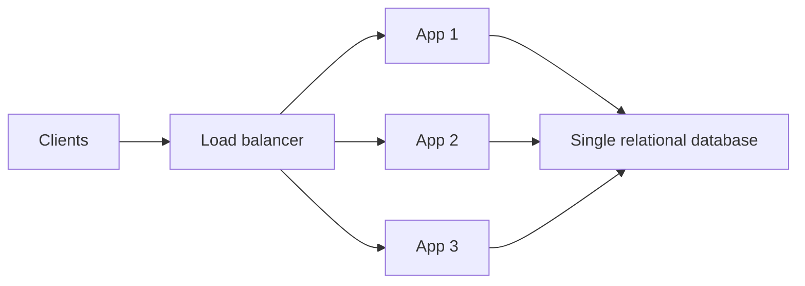

Application capacity 增加后，更多 requests 会到达同一 database。数据库仍在一台机器上，因此会依次碰到：

- CPU/lock contention；
- Buffer cache/memory limit；
- Disk IOPS/throughput；
- WAL bandwidth；
- Connection/concurrency；
- Dataset capacity；
- Backup/maintenance window。

这是分布式系统常见现象：

```text
remove bottleneck at layer i
-> throughput rises
-> bottleneck moves to dependency i+1
```

### 0.2 本章的三步扩展路径

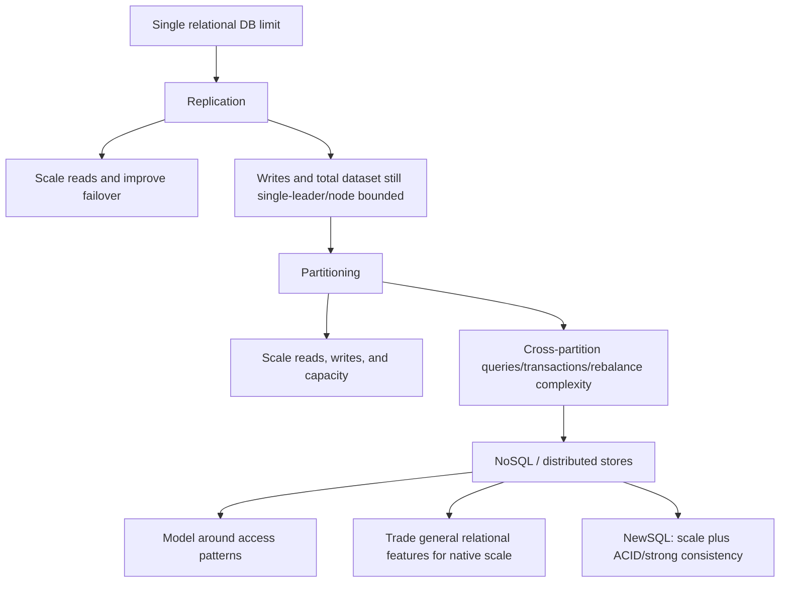

三种选择不是简单替代：

- Replication 与 partitioning 常组合；
- NoSQL 也需要 replication 和 partitioning；
- NewSQL 也不能消除 network partition、hot key 和 distributed transaction cost；
- Relational database 也可通过现代 distributed architecture 横向扩展。

### 0.3 本章真正的问题

本章不是问“SQL 还是 NoSQL 哪个更先进”，而是问：

1. Workload 是 read-heavy 还是 write-heavy？
2. Dataset 是否必须超过单 node？
3. 哪些 invariants 必须 transactionally 保持？
4. 哪些 query 依赖 join、ad hoc filter、range scan？
5. 可以接受多大 replication lag/staleness？
6. Access patterns 是否已知且稳定？
7. Availability、consistency、latency、operational complexity 如何取舍？

---

## 1. 19.1 Replication：先扩展 reads

### 1.1 Single-leader topology

最常见关系数据库复制模型是 leader-follower：

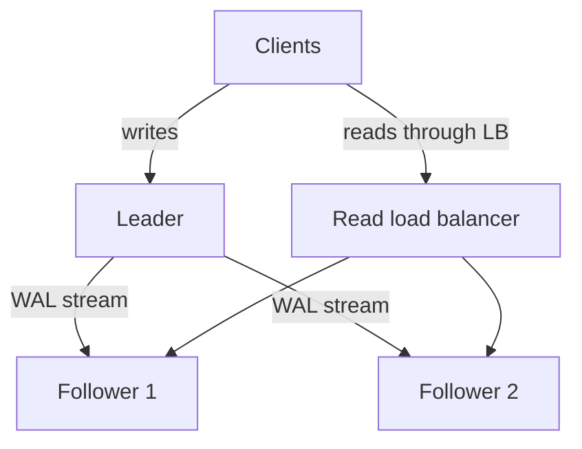

原书 Figure 19.1 的核心：

- `INSERT`、`UPDATE`、`DELETE` 全部发给 leader；
- Leader 持久化 changes 到 write-ahead log（WAL）；
- Followers 连接 leader，stream log entries；
- Followers 在本地 replay/commit entries；
- Read-only followers 放在 LB 后扩展 read capacity。

### 1.2 为什么 writes 先进入 WAL

WAL 的基本原则：描述修改的 log record 必须在相应 data page 被视为 durable 前落入持久介质。抽象顺序：

```text
transaction changes
-> append ordered WAL record
-> establish commit durability
-> apply/flush data pages now or later
```

作用：

- Crash recovery 可 replay committed changes；
- Replication 可传有序 logical/physical changes；
- Follower 无需逐页比较整个 database；
- Sequence/position 可表示复制进度。

不同数据库可能使用 LSN、binlog position、GTID、transaction ID 等名称。原章只要求理解“有序 log + sequence number”，不应把所有产品实现视为相同 WAL 格式。

### 1.3 Sequence number 为什么重要

设 leader committed log：

$$
e_1,e_2,\ldots,e_n
$$

每个 entry 有单调 sequence $s_i$。Follower 保存最后处理位置 $a$，重连时告诉 leader：

```text
last_applied = a
```

Leader 发送：

$$
e_{a+1},e_{a+2},\ldots,e_n
$$

这样 follower 可断开、恢复后增量 catch up，而不是重新复制全库。

必须满足：

- Entries 有稳定 total/order semantics；
- Follower 不跳过 gap；
- Duplicate delivery 可检测或 replay 幂等；
- Leader 保留 follower 所需 log，或提供 snapshot/base backup；
- Failover 后 log lineage 可识别，避免接到错误 timeline。

### 1.4 Gap 检查

Follower 当前 applied sequence 为 $a$，只应直接应用：

$$
s_{next}=a+1
$$

若收到 $a+2$：

- 不能假设中间 entry 无关；
- 应请求缺失 log、重新同步或 snapshot；
- 否则 state machine 顺序被破坏。

Sequence number 不是 wall-clock timestamp，也不自动跨不同 leaders/global partitions 可比较。

---

## 2. Read replicas 如何扩容量

### 2.1 理想 read capacity

设：

- Leader 可服务 read throughput $C_L$；
- 第 $i$ 个 follower 可服务 $C_i$；
- Replication、network 和 shared storage 不先饱和；
- Queries 可发给任意 follower；

理想总 read capacity：

$$
C_{read}\lesssim C_L+\sum_{i=1}^{F}C_i
$$

若 leader 专注 writes、reads 全发 followers：

$$
C_{read}\lesssim\sum_{i=1}^{F}C_i
$$

现实不完全线性，因为：

- Leader 要生成/发送 WAL；
- Followers replay 与 reads 竞争 CPU/I/O；
- Long query 会延迟 replay；
- LB 可能不均衡；
- Data/cache locality 不同；
- Connection pool/metadata 有上限。

### 2.2 Read load balancer

Follower pool 可由 Chapter 18 的 LB 管理：

- Service discovery 找 replicas；
- Health checks 摘除故障 node；
- Lag-aware policy 排除过旧 replica；
- Least-connections/P2C 分散 reads；
- Query class 可定向特定 replica。

只检查 process alive 不够。一个 follower 可能返回 200/接受连接，却落后数小时。Readiness 应包含可接受 lag：

$$
EligibleReadReplica_i=
Healthy_i\land Lag_i\le L_{max}
$$

其中 $L_{max}$ 由业务 query 决定，而非全库统一常数。

### 2.3 Workload isolation

作者指出可把 expensive analytics query 放到特定 follower，避免影响 leader 和其他 replicas：

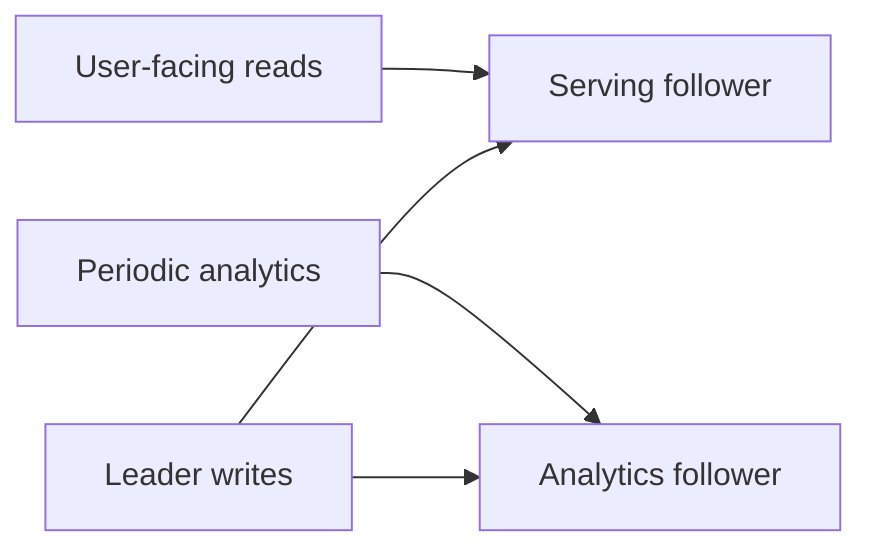

收益：

- Analytics CPU/memory/I/O 与 OLTP 隔离；
- 可设置不同 index/config；
- 避免长 query 持有 leader resources；
- Maintenance/reporting 有专门容量。

局限：

- Analytics follower replay 可能落后；
- 一条超重 query 仍可拖垮该 follower；
- Schema/index 差异增加运维复杂度；
- Query 需要多新数据必须明确 freshness。

### 2.4 Read-after-write anomaly

异步复制时：

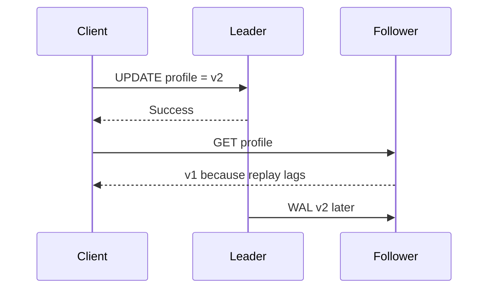

用户会看到“保存成功后刷新却变旧”。可选方法：

- 写后一定时间读 leader；
- Response 返回 commit position $s$，read replica 只有 `applied >= s` 才服务；
- Session stick to leader until follower catches up；
- 对强 freshness query 始终读 leader；
- Client 接受 bounded staleness。

Monotonic read 也需处理：如果第一次读到较新 follower，下一次被 LB 分到更旧 follower，结果可能倒退。

---

## 3. Replication 如何提高 availability

### 3.1 Follower failure

Read LB 检测 faulty/unavailable follower 后将其从 pool 移除。只要剩余 read capacity 足够，client 不必知道 individual node failure。

但 follower 摘除后：

$$
LoadPerRemainingReplica
\approx\frac{TotalReadLoad}{HealthyFollowerCount}
$$

如果正常状态已接近满载，一个 follower failure 会造成 cascade overload。Availability 仍依赖 headroom。

### 3.2 Leader failure

需要把一个 follower promote 为新 leader：

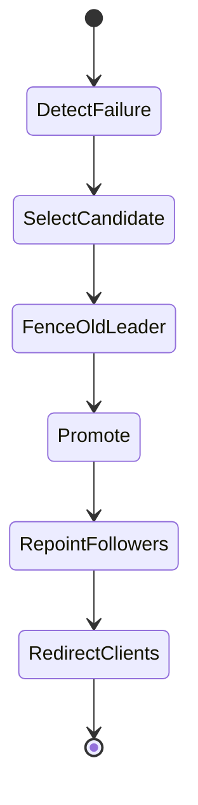

原章概括三步：

1. Detect leader failure；
2. Promote synchronous follower，其他 replicas 改为 follow 它；
3. Client requests 发往新 leader。

工程上还必须显式处理 fencing：旧 leader 可能只是 network partition，并未真正死。若旧、新 leaders 同时接受 writes，会 split brain。

### 3.3 Fencing epoch

一种抽象方案：每次 leader term/epoch 单调增加：

```text
write(term, transaction)
```

Storage/replicas 只接受当前 term。新 leader 获得 term $t+1$ 后，旧 leader 的 term $t$ 写被拒绝。

Leader election、lease、STONITH、quorum/fencing token 的具体实现不同，但不变量一致：

> 在任何能提交写的时刻，只有一个 authoritative leader。

### 3.4 Candidate 必须足够新

若异步 follower 落后，直接 promote 会丢失它没收到的 committed writes。Candidate selection 应考虑：

- Last received/applied WAL position；
- 是否属于正确 timeline/term；
- Data integrity；
- Region/zone；
- Synchronous status；
- Recovery time。

“最健康”不等于“最完整”。

### 3.5 Managed database 的价值

原章列举 AWS RDS、Azure SQL Database 等 managed solutions，提供 read replicas、automated failover、patching、backups。

托管减少底层运维，但用户仍需验证：

- Failover detection/typical RTO；
- Endpoint/DNS behavior；
- Synchronous guarantee and RPO；
- Read-replica lag；
- Cross-region semantics；
- Connection retry；
- Transaction ambiguity；
- Backup restore drills；
- Quota/cost。

“Automated failover”不表示 failover 瞬时，也不表示 in-flight transactions 自动安全重试。

---

## 4. Fully asynchronous replication

### 4.1 Acknowledgment point

Leader 本地 commit 后立即回复，不等待 follower acknowledgments：

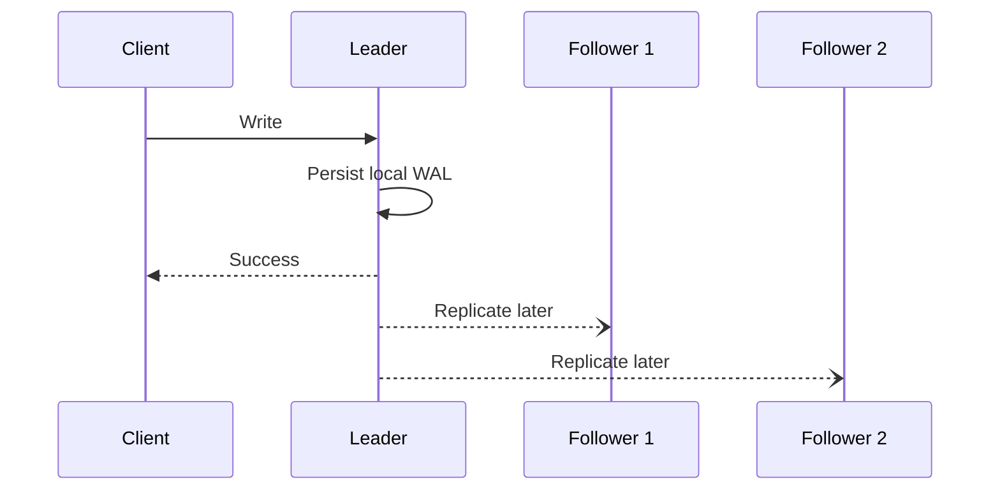

简化 latency：

$$
T_{async}\approx T_{leader\ local\ commit}
$$

收益：

- 最低 write latency；
- Followers slow/down 不阻塞 leader；
- 可扩很多 read replicas；
- 跨 region 复制可容忍大 RTT。

### 4.2 数据丢失窗口

Leader 回复后、followers 收到前 crash，已确认 write 可能丢失。若 write rate 为 $\lambda_w$，复制 lag 为 $L$ 秒，潜在未复制 writes 数量近似：

$$
UnreplicatedWrites\approx\lambda_w L
$$

例如 $\lambda_w=2{,}000/s$、lag $0.5s$：

$$
UnreplicatedWrites\approx1{,}000
$$

这是 snapshot 式近似，不表示每次 failover 必丢 1000 条；实际取决于 WAL flush、network、candidate 和 failure time。

### 4.3 Fault tolerance 的精确边界

原章说 fully async “not fault-tolerant”，指它不能保证 acknowledged write 在 leader failure 下不丢。它仍可提高 read availability，并在多数故障不发生于 lag window 时保留大量数据。要明确 fault-tolerance 对象：

- Service availability；
- Acknowledged-write durability；
- Read freshness；
- Disaster recovery。

这些不是同一性质。

---

## 5. Fully synchronous replication

### 5.1 Acknowledgment point

Leader 等所有 configured followers acknowledge 后才回复：

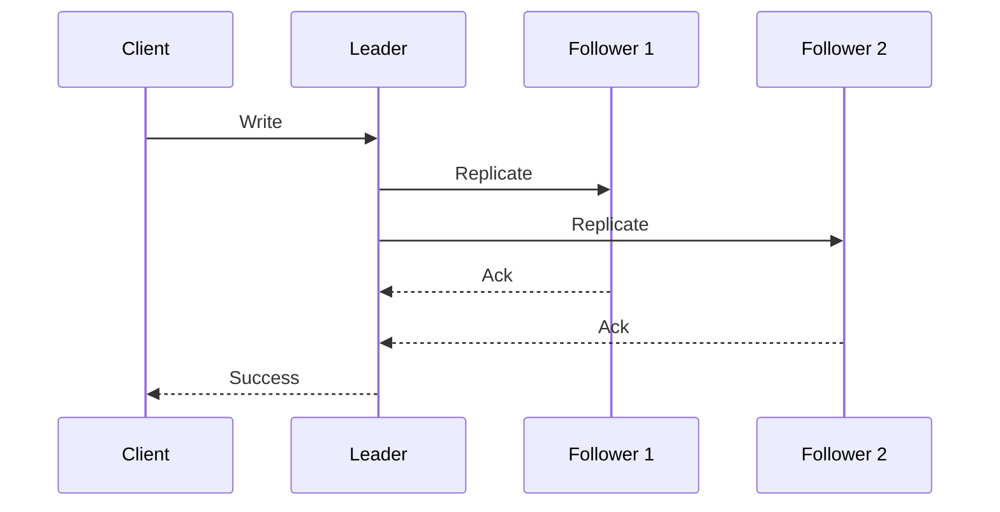

简化 latency：

$$
T_{sync-all}\gtrsim
T_{leader}+\max_i(T_{replica_i})
$$

由最慢 required follower 决定，而不是平均 follower。

### 5.2 Availability 随 follower 数下降

若所有 $F$ followers 都必须可用，每个 follower 独立 availability 为 $a$，忽略 leader/LB：

$$
P(write\ available)=a^F
$$

若 $a=0.999$、$F=10$：

$$
0.999^{10}\approx99.0045\%
$$

一个 follower unreachable，write store unavailable。Follower 越多，至少一个 slow/down 的概率越高：

$$
P(any\ unavailable)=1-a^F
$$

故 fully synchronous to all 不可扩展。

### 5.3 Slowest-tail amplification

即使没有 hard failure，等待全部 replicas 会让 write p99 受所有 tail samples 最大值影响。Replica 数增加，遇到一个慢样本的机会增加。

可用：

- Quorum/required subset；
- One synchronous standby + others async；
- Timeout and degradation policy；
- Region-aware topology；
- Fast durable log layer。

但任何降低 required acknowledgments 的做法都必须重新定义 durability contract。

---

## 6. 混合同步/异步复制

### 6.1 原章的 PostgreSQL 例子

Relational databases 常允许部分 followers synchronous、其余 asynchronous。原章示例：

- 一个 synchronous follower，作为 leader 的 up-to-date backup；
- 其他 followers async，扩 reads；
- Leader failure 时 failover 到 synchronous follower，目标是不丢 acknowledged writes。

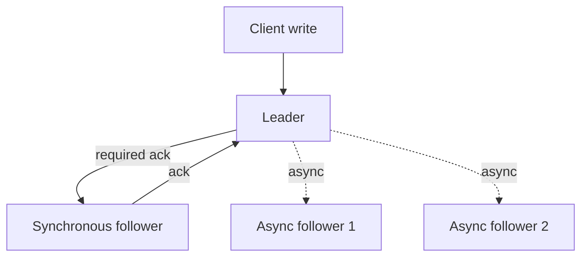

### 6.2 Latency/availability 折中

简化 acknowledgment：

$$
T_{hybrid}\gtrsim
\max(T_{leader},T_{sync\ follower})
$$

而不等待所有 async followers。相比 fully async：

- Write latency 增加；
- 同步 standby 不可达可能阻塞或降级；
- Acknowledged-write durability 更强。

相比 sync-all：

- 不受每个 read replica tail 限制；
- 更容易增加 async replicas；
- 只有 required subset 参与 availability contract。

### 6.3 “零数据丢失”的前提

要实现原章描述的 failover without data loss，至少要求：

- Leader 只有在 synchronous follower 达到规定 durable state 后 ack；
- Candidate 正是这个最新 follower 或同等最新；
- Old leader 被 fence；
- No acknowledged write 只存在 old leader；
- Storage corruption/common-mode failure 不同时破坏 copies；
- Client 能处理 ambiguous in-flight transaction。

Timeout 后 client 不知道 transaction 是否 committed 时，不能盲目重复 non-idempotent operation。

### 6.4 Semi-synchronous 的术语陷阱

不同产品对 “synchronous” 的 ack 定义不同：

- Received in memory；
- WAL written；
- WAL flushed durable；
- Replayed/applied；
- Visible to reads。

使用者必须读产品文档，不应只看同步/异步标签。

---

## 7. Replication 的边界

### 7.1 只扩 reads，不扩 single-leader writes

所有 writes 仍进入 leader：

$$
C_{write}\le C_{leader\ write\ path}
$$

增加 followers 甚至会增加 leader replication/network overhead。Read-heavy workload 很适合；write-heavy workload 最终仍受限。

### 7.2 整个 database 仍需放进单 node

每个 full follower 保存整个 dataset，所以：

$$
DatabaseSize\le SingleNodeCapacity
$$

Vertical scale、compression、archive 能推迟极限，但不能从结构上突破。

### 7.3 拆 tables 到不同 databases 只是粗粒度 functional partitioning

可以把 users、orders、analytics 移到不同 DB instances：

```text
table groups -> independent databases
```

短期有效，但：

- 单张大 table 仍可能超单机；
- Cross-database join/transaction 复杂；
- Placement 与 routing 进入 application；
- Hot table 仍无法细分；
- Schema relationship 被 network boundary 切断。

这只是把 inevitable partitioning 推迟或以粗粒度实现。

---

## 8. 19.2 Partitioning：同时扩 reads、writes 与容量

### 8.1 基本收益

Partitioning 将 rows 按 key 分到多个 database instances：

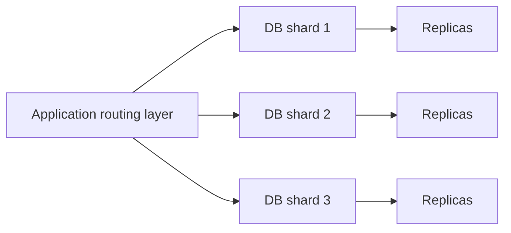

若 data/load 均匀：

$$
Capacity_{data}\approx N\times C_{node}
$$

$$
Capacity_{write}\approx\sum_{i=1}^{N}C_{write,i}
$$

Reads 还可在每个 shard 内由 replicas 扩展。

### 8.2 Application-layer sharding

传统 centralized relational DB 通常不原生暴露自动 distributed partitioning；应用原则上可自行实现：

```text
shard = route(partition_key)
connection = pool[shard]
execute SQL on that shard
```

但 routing function 只是最简单部分。作者随后列出真正难点。

### 8.3 难点一：选择 partition scheme

需要决定：

- Partition key；
- Range/hash；
- Shard count；
- Tenant placement；
- Hot key strategy；
- Query locality；
- Rebalance protocol。

若按 `customer_id`：customer 内操作局部，但跨 customers analytics fan-out；若按 `order_id`：order lookup 均匀，但 customer orders 查询跨 shards。

Partition key 是 transaction/query boundary。

### 8.4 难点二：hot/big partition 与 rebalance

Shard 太大或太热，需要 split/move。在线迁移同时面对：

- Bulk copy；
- Concurrent writes；
- Dual ownership；
- Mapping epoch；
- Cutover；
- Rollback；
- Replicas rebuild；
- Foreground load interference。

Chapter 16 已详述 range/hash 和 consistent hashing。本章强调：自己给 relational DB 加 sharding，意味着应用团队要承担这些 control-plane protocol。

### 8.5 难点三：跨 partition query

Query 要拆成 subqueries，再 combine：

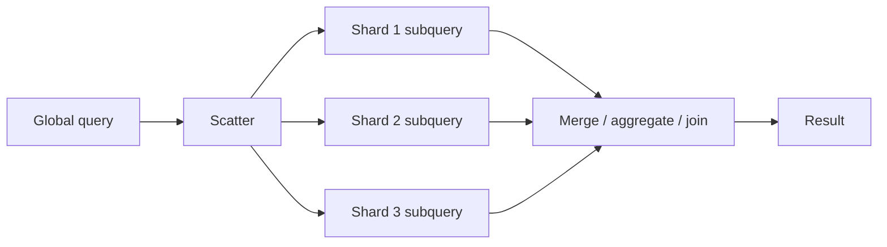

全局 count 可合并：

$$
Count=\sum_i Count_i
$$

Global average 不能平均 shard averages；必须合并 sum/count：

$$
Average=
\frac{\sum_i Sum_i}{\sum_i Count_i}
$$

Join 可能需要：

- Broadcast small table；
- Repartition/shuffle rows；
- Co-locate by same partition key；
- Precompute/materialize；
- Application fan-out。

### 8.6 难点四：跨 partition atomic transaction

若 transaction 涉及多个 shards，需要 2PC 或其他 distributed protocol：

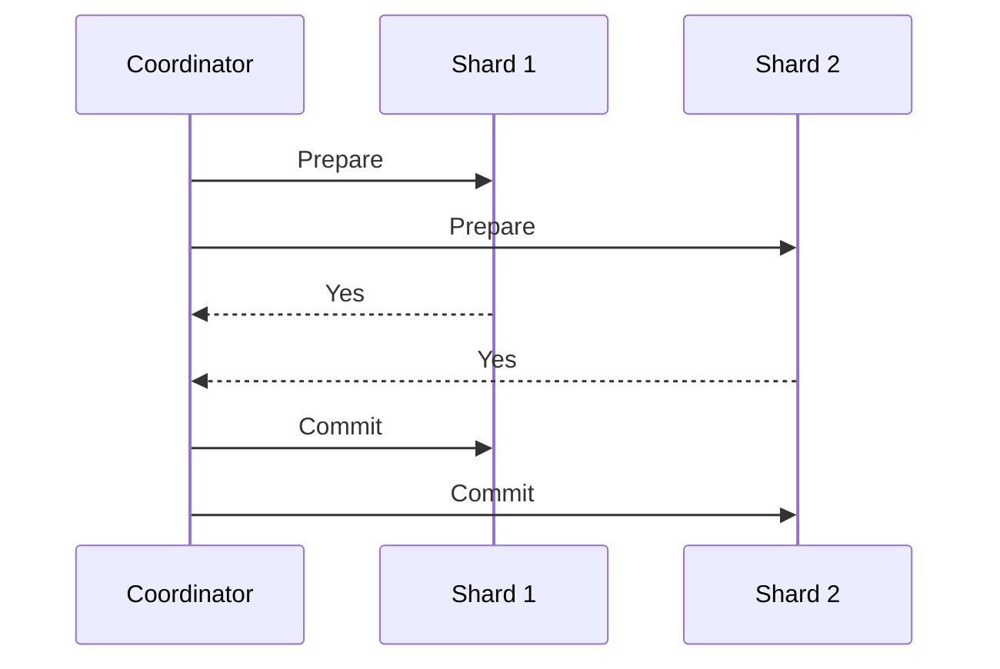

代价：

- 多网络 RTT；
- Locks/intents 持有更久；
- Coordinator log/recovery；
- Partial failure；
- Tail latency；
- Availability 受所有 participants 影响。

最有效策略常是让 invariant 与 shard boundary 对齐，减少 cross-shard transaction，而不是让所有操作默认走 2PC。

### 8.7 难点五：partitioning 与 replication 组合

若有 $P$ shards，每 shard $R$ replicas，系统至少管理约：

$$
P\times R
$$

个 data copies，以及：

- 每 shard leader election/failover；
- Replica lag；
- Cross-shard query；
- Rebalance 时 replica placement；
- Backup/schema migration；
- Routing metadata。

这就是作者称 application-layer partitioning “daunting”的原因：它把 database product 内部职责搬进应用架构。

---

## 9. 传统关系数据库为何难横向扩展

### 9.1 原章的历史视角

作者指出传统 centralized relational databases 假设运行于一台强大机器，因此提供难以分布式扩展的能力：

- ACID transactions；
- Joins；
- General SQL/ad hoc query；
- Global indexes/constraints。

这些能力在单机共享 memory/disk 下便宜得多；跨 nodes 后需要 messaging、coordination、data movement 和 failure handling。

### 9.2 “ACID 和 join 难 scale”不等于不能 scale

Modern distributed SQL/NewSQL 已证明它们可以 scale，但成本不会消失：

- Distributed consensus；
- Timestamp/order；
- 2PC；
- Query optimizer with data placement；
- Shuffle；
- Clock/transaction metadata；
- Cross-region latency。

所以原章是在解释 architecture cost，不是宣称 relational algebra 在分布式系统中不可能。

### 9.3 Normalization 的历史动机

作者提到早期 disk 昂贵，normalization 减少 duplicated data footprint；query 时通过 join “恢复”关联数据。

但脚注明确补充：节省 storage 不是唯一收益，normalization 还维护 data integrity。

若客户姓名只存一处：

```text
Customer(customer_id, full_name)
Order(order_id, customer_id, ...)
```

改名只更新 Customer。若每个 order 都复制 full name，更新必须覆盖多个 rows/copies，否则 inconsistency。

### 9.4 Storage cheap、CPU/time expensive 的含义

早 2000s 大型公司开始构建从一开始面向 availability/scalability 的 bespoke stores，愿意用：

- Denormalized copies；
- Precomputed views；
- Restricted query API；
- Partition-local operations；
- Relaxed consistency；

换取低 latency 和 horizontal scale。

“Storage cheap”不是 bytes 免费，也不是 denormalize 越多越好。复制会增加 write amplification、repair、network、index 和 consistency cost。

---

## 10. 19.3 NoSQL：历史名称与设计目标

### 10.1 Bigtable 与 Dynamo 的影响

早期 scalable stores 通常不支持 SQL，只实现传统 relational database 的部分功能。Bigtable 与 Dynamo 论文推动了 industry，衍生出 HBase、Cassandra 等 systems。

两条重要思想路线：

- Bigtable：wide-column、sorted distributed map、range partitioning；
- Dynamo：key-value、high availability、consistent hashing、eventual consistency。

具体产品混合演化，不能仅按祖先论文推断当前架构。

### 10.2 NoSQL 名称为何误导

第一代因不支持 SQL 被叫 NoSQL。如今许多 stores 支持 SQL-like dialect、transactions、secondary indexes；关系数据库也支持 JSON/document。

因此 NoSQL 更像一个历史 umbrella term，不能单靠名字判断：

- Query language；
- Data model；
- Consistency；
- Transactions；
- Partitioning；
- Indexes；
- Operational guarantees。

应比较 concrete product semantics，而不是 SQL/NoSQL 标签。

### 10.3 关系数据库与 NoSQL 的一致性概括

原章概括：relational databases 常支持 strict serializability 等更强 model；NoSQL 常采用 eventual/causal consistency 支持 high availability。

精确边界：

- 不是所有关系数据库默认 strict serializable；
- 不是所有 NoSQL 都 eventual；
- 很多 systems 提供 per-operation consistency choice；
- CAP tradeoff 只在 network partition 语境下；
- Strong consistency 与 SQL language 正交。

所以这里是历史/常见设计倾向，不是分类定律。

---

## 11. Key-value 与 document model

### 11.1 Pure key-value store

映射：

$$
OpaqueBytesKey\longrightarrow OpaqueBytesValue
$$

Store 主要理解 key，用它：

- Partition；
- Lookup；
- Replicate；
- Version。

Value 内部结构对 store 不透明，application 自己 serialize/deserialize。

优点：API 简单、point lookup 易 scale。局限：不能自然按 value 内字段 query/index，除非另建 index。

### 11.2 Document store

映射：

$$
Key\longrightarrow HierarchicalDocument
$$

Document 可是 JSON-like structure。Store 解释其 fields，因此可：

- Index internal field；
- Filter/query nested value；
- Partial update；
- Validate optional schema。

原章说 document 没有 strictly enforced schema。精确理解是 schema flexibility 取决于产品；application 仍需要 versioning/validation。Schema-on-read 不表示没有 schema，而是 schema contract 更可能由应用维护。

### 11.3 Key-value 与 document 的核心差异

| 维度 | Key-value | Document |
| --- | --- | --- |
| Value 是否被 store 解释 | 通常否 | 是 |
| Query | 主要按 key | 可按内部字段/index |
| Schema | Application-owned | Flexible/product validation |
| Update | Whole value 常见 | Field/patch 可能支持 |
| Index cost | 手工/外部 | Product secondary index |

### 11.4 Unnormalized data

NoSQL 常把 query 所需数据预先放在一起：

```text
customer summary + order summary in same item collection
```

收益：

- Query 单 partition；
- 避免 runtime join；
- Latency 可预测；
- Scale-out 简单。

代价：

- Duplicate data；
- Multi-copy update；
- Eventual index/view lag；
- Storage/write amplification；
- Access pattern 变化要迁移 model。

---

## 12. NoSQL 的 transaction 边界

### 12.1 为什么 native partitioning 限制 transaction scope

Single-partition transaction 可由一个 leader/replica group local commit。跨 partitions 需要 distributed transaction：

$$
T_{cross}\approx
T_{coordination}+\max_i(T_{participant_i})
$$

还降低 availability。因此许多 NoSQL 历史上限制或弱化 transactions。

原章以 Azure Cosmos DB 为例：transactions scope 到 individual partition。按现代产品文档应进一步精确为 logical partition key scope，具体 API（stored procedure、transactional batch）和当前限制需查对应版本。

### 12.2 Denormalization 减少 transaction/join 需求

如果一个 aggregate 的读取所需 fields 已共置在同一 partition：

- 不需要跨 partition join；
- 更新可设计为单 aggregate transaction；
- Query 一次返回完整 view。

但 denormalization 不是让 consistency 问题消失，而是把它转移到：

- 多副本/view 更新；
- Event propagation；
- Repair/reconciliation；
- Stale data tolerance。

### 12.3 Aggregate boundary

适合把必须原子更新的数据建模为一个 aggregate，并确保：

```text
aggregate boundary ~= partition key boundary ~= transaction boundary
```

例如 shopping cart 内 items 与 total 可同 partition；跨 customers 的 global uniqueness 仍需专门 coordination/index。

---

## 13. 不要把 NoSQL 当关系数据库使用

作者警告：NoSQL 可以 model relational data，但若把它当传统 relational DB 使用，会得到 worst of both worlds。

典型反模式：

1. 在不同 collections/tables 正规化 entities；
2. 每次 request 在 application 发多次 point reads；
3. Application 手工 join；
4. 跨 partition 更新模拟 transaction；
5. 失去 SQL optimizer/constraints；
6. 同时承担 distributed fan-out 和 consistency logic。

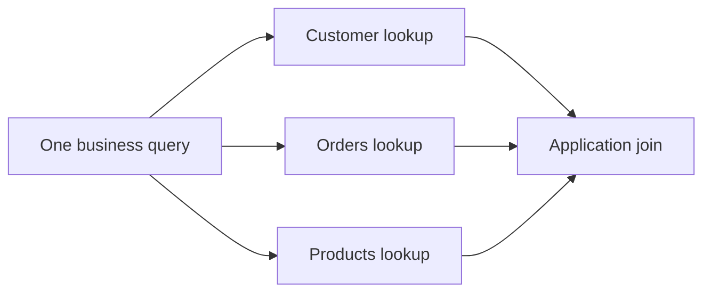

这既没有 relational DB 的 general query/transaction convenience，也没有 NoSQL 按 access pattern 单次读取的效率。

正确方向：为 concrete access patterns materialize query-shaped data。

---

## 14. 访问模式必须预先识别

### 14.1 本章最重要结论

作者明确给出 takeaway：

> 高效使用 NoSQL，必须 upfront 识别 access patterns，并据此 model data。

Access pattern 应写成可测 contract：

| 项 | 示例 |
| --- | --- |
| Operation | 获取客户最近订单 |
| Key | `customer_id` |
| Sort/range | `created_at DESC`, latest 50 |
| Filter | status optional |
| Consistency | read-your-writes |
| Expected QPS | 20k/s |
| Item count/size | 10k orders/customer, 2 KB/item |
| Latency target | p99 < 20 ms |
| Atomicity | Single order update |

若无法回答这些问题，无法正确选 partition/sort key、index 或 denormalized copies。

### 14.2 为什么关系模型更灵活

Normalized relational schema 表达 facts 和 relationships，SQL optimizer 在 query time 选择 plan。新 access pattern 常可通过 query/index 支持，而不用重写全部 data layout。

NoSQL layout 与 query 紧耦合：

- 新 query 可能没有可用 key；
- Scan 全表昂贵；
- 需要新 secondary index/materialized copy；
- Backfill/dual-write/migration；
- Consistency lag 增加。

因此 “schemaless = 不用建模” 是错误的。NoSQL 往往需要更多 upfront modeling。

### 14.3 设计步骤

```text
enumerate reads/writes
-> rank by QPS/criticality
-> define exact keys, ranges, order, limits
-> co-locate each high-value pattern
-> identify duplicated attributes
-> define update propagation and repair
-> test hot keys and growth
```

不要先设计 entities/table，再希望所有 queries 自然高效。

---

## 15. DynamoDB 的 table 与 primary key

### 15.1 Item 与 attributes

DynamoDB 的主要抽象是 table，包含 items。每个 item：

- 可有不同 attributes；
- 必须有唯一 primary key；
- Item schema 可异构，但 key contract 固定。

### 15.2 两种 primary key

1. Simple primary key：只有 partition key；
2. Composite primary key：partition key + sort key。

唯一性：

- Simple：partition key 全表唯一；
- Composite：pair `(PK,SK)` 唯一，同 PK 可有多个 items。

### 15.3 Partition key

Partition key 决定 data 如何 hash/partition/distribute：

$$
PhysicalPlacement\approx H(PK)
$$

它同时形成 query locality：DynamoDB Query 以 partition key equality 为核心。

好的 PK 需要：

- 高 cardinality；
- 请求/bytes 分布足够均匀；
- 把一起读取的数据共置；
- 单 logical partition 不无限增长/过热；
- 与 transaction boundary 对齐。

### 15.4 Sort key

同一 PK 内按 SK 排序，支持 efficient range conditions：

```text
PK = customer_id
SK between 2025-01-01 and 2025-12-31
```

Composite key 可理解为：

```text
PK chooses neighborhood
SK orders/searches within neighborhood
```

Sort key 不决定全表 global order，也不能跨所有 PK 做便宜 ordered scan。

### 15.5 Hot partition

如果某 customer 极热门，所有该 PK requests 仍集中。可采用 write sharding：

```text
PK = customer_id#bucket
```

但读取 customer 全部数据要 fan-out 多 buckets。与 Chapter 16 一样，这是 locality 与 load balance 的交换。

---

## 16. DynamoDB replication 与读一致性

### 16.1 原章描述

原章基于当时公开架构材料描述：

- 每 partition 三 replicas；
- State machine replication 保持同步；
- Writes 路由 leader；
- 2/3 replicas 收到 write 后 ack client；
- Eventually consistent read 可选任意 replica；
- Strongly consistent read 查询 leader。

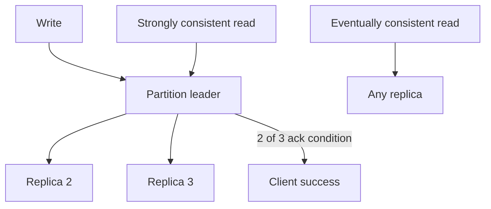

这些内部细节应视为原章/公开演讲所述架构模型，不是永久产品 API contract。用户应依赖当前 DynamoDB consistency、availability 和 durability 文档，而不是绑定内部 replica 数或 leader 实现。

### 16.2 2-of-3 的 quorum intersection 直觉

在三副本模型中，任意两个 size-2 quorum 必相交：

$$
2+2>3
$$

一般 quorum 条件：

$$
W+R>N
$$

可使 write quorum 与 read quorum 至少相交，但“相交”还需版本/order/protocol 才能提供 strong read。不能仅凭公式推断完整 consistency。

### 16.3 Eventually consistent read

从任意 replica 读取：

- Latency/availability 更好；
- 可分散 load；
- 可能在 replication apply 前看到旧 value。

适合：

- Feed/list；
- Product catalog（允许短暂旧）；
- Analytics；
- 非关键 cache-like reads。

不适合无额外 protocol 的：

- 写后立即确认状态；
- Balance/limit enforcement；
- Uniqueness decision；
- Security revocation。

### 16.4 Strongly consistent read

原章将其抽象为 query leader，获得最新 committed state。代价通常包括：

- 更少 routing freedom；
- Leader load；
- Failure/failover window；
- 可能更高 latency/capacity cost。

Strong read scope、global table/cross-region 行为和计费是具体产品语义，需查当前文档。

### 16.5 DynamoDB 与 Dynamo 论文不是同一架构

作者特别提醒：DynamoDB architecture 与 Chapter 11.3 的 Dynamo paper 很不同。

| 维度 | Dynamo paper（简化） | 原章所述 DynamoDB |
| --- | --- | --- |
| Coordination | Leaderless-style quorum/vector versions | Per-partition leader/state-machine replication |
| Conflict | Concurrent versions/client reconciliation | Service-defined ordered replication |
| Product | Internal shopping-cart-inspired system | Managed database service |

名字相似不意味着可以套用同一 consistency/failure model。

---

## 17. DynamoDB API 的三个主要访问形态

原章概括：

1. Single-item CRUD；
2. Query 同一 partition key 的多个 items，可带 sort-key condition；
3. Scan 整个 table。

### 17.1 Single-item CRUD

已知完整 primary key，直接定位 item：

```text
GetItem(PK, SK)
PutItem(PK, SK, attributes)
UpdateItem(PK, SK, condition)
DeleteItem(PK, SK)
```

这是最可预测、最易 scale 的访问。

### 17.2 Query

Query 需要 partition-key equality，并在同一 PK 内：

- Sort key range/prefix；
- Asc/desc order；
- Limit/pagination；
- Optional filter（filter 常在读取后筛，不能代替 key design）。

Query 的高效来自访问一个 logical key neighborhood，而不是全表搜索。

### 17.3 Scan

Scan 遍历 table/segments：

- 消耗与扫描 items/bytes 成正比；
- Filter 不一定减少底层读取 cost；
- 大表 latency/capacity 昂贵；
- Parallel scan 会加速但放大 load；
- 通常不适合 user-facing hot path。

Scan 的存在不是建模逃生口。应为重要 pattern 创建 key/index/materialized view。

### 17.4 为什么没有 join

Distributed join 需要跨 partitions shuffle/coordination，难以提供稳定低 latency。DynamoDB 选择受限 API，使 operations 可按 key route 和水平扩展。

作者明确说：不应把 join 搬到 application；应重新 model data，使 query 不需要 join。

---

## 18. 示例一：按客户查询日期排序的订单

### 18.1 Access pattern

```text
Given customer ID
return that customer's orders
sorted by creation date
```

自然 key design：

- Partition key：Customer ID；
- Sort key：Order creation date。

原书示例：

| Partition Key | Sort Key | Attribute | Attribute |
| --- | --- | --- | --- |
| `jonsnow` | `2021-07-13` | `OrderID: 1452` | `Status: Shipped` |
| `aryastark` | `2021-07-20` | `OrderID: 5252` | `Status: Placed` |
| `branstark` | `2021-07-22` | `OrderID: 5260` | `Status: Placed` |

### 18.2 为什么有效

Query `PK = jonsnow`：

- 直接路由到对应 partition；
- Items 在该 PK 下按 date 排序；
- 可做 date range；
- 不扫描其他 customers；
- Pagination 沿 sort order。

### 18.3 Sort-key collision

如果同一 customer 在同一 timestamp 创建多个 orders，单纯 date/timestamp 可能不唯一。Composite primary key 要求 `(PK,SK)` 唯一，可用：

```text
SK = ORDER#2021-07-13T10:11:12.123Z#1452
```

既保留时间顺序，也加 order ID tie-breaker。这是工程补充，原书表格为概念简化。

### 18.4 这个模型支持和不支持什么

高效：

- Customer 的全部/最近 orders；
- Customer + date range；
- 按日期排序。

不直接高效：

- 按 `OrderID` 查但不知道 customer；
- 查询所有 `Status=Placed`；
- Global date order；
- 按 product 聚合。

这些 pattern 需要 secondary index、额外 item/materialized view 或 analytics pipeline。

---

## 19. 示例二：客户与订单共置，消除 join

### 19.1 新需求

订单列表还要显示 customer full name。在 normalized relational model：

```sql
SELECT o.*, c.full_name
FROM orders o
JOIN customers c ON c.id = o.customer_id
WHERE c.id = ?
ORDER BY o.created_at;
```

NoSQL 不应在 application 先 Query orders 再 Get customer 并手工 join。作者将 customer item 和 order items 放在同一 table、同一 PK。

### 19.2 原书单表结构

| Partition Key | Sort Key | Attribute | Attribute |
| --- | --- | --- | --- |
| `jonsnow` | `2021-07-13` | `OrderID: 1452` | `Status: Shipped` |
| `jonsnow` | `jonsnow` | `FullName: Jon Snow` | `Address: ...` |
| `aryastark` | `2021-07-20` | `OrderID: 5252` | `Status: Placed` |
| `aryastark` | `aryastark` | `FullName: Arya Stark` | `Address: ...` |

一个 `PK = jonsnow` Query 同时返回 customer 与 orders。

### 19.3 Entity type encoding

生产设计通常在 sort key 加 type prefix，避免不同 entity key space 冲突并明确 range：

```text
PK = CUSTOMER#jonsnow
SK = CUSTOMER#jonsnow

PK = CUSTOMER#jonsnow
SK = ORDER#2021-07-13#1452
```

然后：

```text
Query PK = CUSTOMER#jonsnow
```

可返回整个 aggregate；或 `begins_with(SK, "ORDER#")` 只取 orders。

### 19.4 为什么比 runtime join 易 scale

数据已按 query shape 共置：

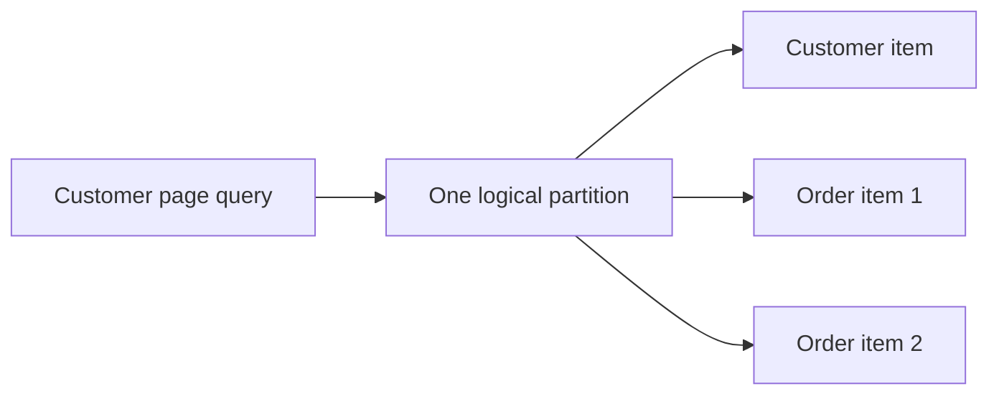

没有跨 partition data movement，latency 与单 partition read 相关。

### 19.5 反规范化的一致性代价

若 full name 只存在 customer item，order list query 一次返回两类 items，application 合并显示，未重复 name。若为每个 order 复制 full name，则改名需要更新所有 order copies。

更新模式可能是：

- 同 logical partition transaction；
- Async event 更新 materialized copies；
- 读取时接受旧 display name；
- Store immutable historical name（业务语义）。

必须先定义复制字段是当前 truth 还是历史 snapshot。

### 19.6 Unbounded item collection

一个 customer 可能有百万 orders：

- Logical partition 热/大；
- Query 必须 pagination；
- Old orders 可 time-bucket：`CUSTOMER#id#YYYY-MM`；
- Current summary 与 archive 分开；
- Large tenant 需特殊 sharding。

“Same PK 一次 query”不意味着一次 response 可无限大。

---

## 20. Secondary indexes

### 20.1 Local secondary index（LSI）

原章定义：在 same table、same partition key 下提供 alternate sort key。

概念：

```text
Base: PK=customer, SK=created_at
LSI:  PK=customer, alternate SK=status_or_total
```

适合仍以同 customer 为查询边界、只改变排序/range 的 pattern。

限制与 exact consistency/capacity semantics 需查当前产品文档；核心是不改变 partition-key locality。

### 20.2 Global secondary index（GSI）

可使用不同 partition key 和 sort key：

```text
Base: PK=customer_id, SK=created_at
GSI:  PK=status, SK=created_at
```

支持按 status 查询，但创建一份独立 projection/index layout。

### 20.3 为什么 GSI 是异步、eventually consistent

原章指出 GSI updates asynchronous/eventually consistent。Base item committed 后，index update 可能稍后可见：

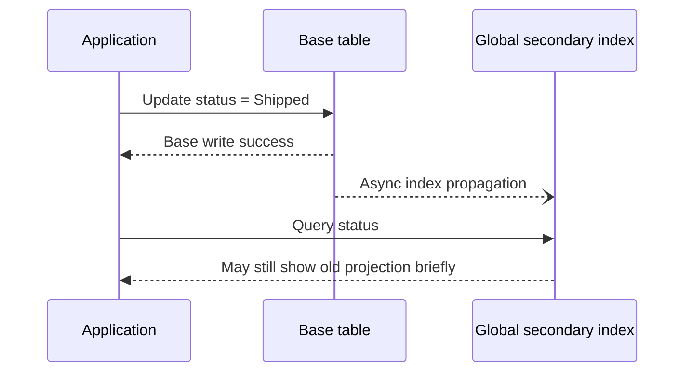

因此 GSI 不能直接作为需要同步 uniqueness 或 immediate authorization 的唯一真相。

### 20.4 Index 不是免费 query flexibility

每个 index 增加：

- Storage；
- Write amplification；
- Backfill；
- Capacity/cost；
- Eventual lag；
- Hot index key；
- Schema evolution。

Index partition key 若低 cardinality（如只有几个 status），可能热点。可加 bucket，但 Query 又需 fan-out。

### 20.5 Access-pattern matrix

| Pattern | Base/Index | PK | SK | Consistency |
| --- | --- | --- | --- | --- |
| Customer recent orders | Base | customer ID | date#order ID | RYW/strong if needed |
| Order by ID | GSI/materialized item | order ID | optional | Eventual or explicit |
| Orders by status/date | GSI | status#bucket | date | Eventual |
| Customer profile + orders | Base | customer ID | entity-prefixed SK | Same partition |

每个新增 pattern 都要回答由哪个 layout 服务及其 update consistency。

---

## 21. NoSQL 的“灵活性”误区

### 21.1 Schemaless 不等于 model-less

Document/items 可有不同 fields，不需要 ALTER TABLE 才增加 attribute；这叫 representation flexibility。

但 scalable access 仍受：

- Partition key；
- Sort key；
- Indexes；
- Item size；
- Transaction scope；
- Hot-key capacity；
- Consistency model。

这是 access rigidity。两者可同时存在：字段灵活，但 query pattern 不灵活。

### 21.2 为什么 NoSQL 反而需要更多 upfront attention

Relational DB 可在未知 query 出现后写 join/filter，加 index 优化。NoSQL 若没有 matching key/index，常只剩 scan 或重建 data layout。

新 pattern 的 lifecycle：

```text
define new item/index shape
-> backfill historical data
-> dual write old and new
-> validate parity
-> switch reads
-> retire old shape
```

这是一场 online data migration，不只是新增 SQL。

### 21.3 作者的唯一必记概念

> Identify access patterns upfront and model data accordingly.

这比“什么时候用 document、什么时候用 key-value”的标签更重要。

---

## 22. NewSQL：重新组合 scale 与 ACID

### 22.1 动机

Scalable stores 持续演化，目标是同时获得：

- NoSQL-style horizontal partition/replication；
- Relational schema/SQL；
- ACID transactions；
- Strong consistency。

这类 systems 常称 NewSQL/distributed SQL。原章列举 CockroachDB 和 Spanner。

### 22.2 CAP 取舍

原章概括：

- NoSQL 在 network partition 时常 prioritize availability；
- NewSQL prefer consistency；
- 强一致性导致的 availability reduction 对许多应用可很小；
- 100% availability 本就不可能，因而愿意用少量不可用换强 guarantee。

精确理解：CAP 在发生 partition 时要求在 consistency 与 availability 之间选择。CP system 在无法确认 quorum/leader 时拒绝某些操作，避免 divergent committed state。

### 22.3 “几乎不可察觉”依赖设计

Availability impact 取决于：

- Replica placement；
- Quorum size；
- Failure domains；
- Network latency/reliability；
- Leader locality；
- Repair/election speed；
- Transaction footprint；
- Multi-region topology。

不是选择 NewSQL 品牌就自动获得高 availability + 低 latency + 强一致性。

### 22.4 NewSQL 没有消除 distributed cost

Cross-shard transaction 仍需：

- Consensus within shards；
- 2PC/transaction coordinator；
- Timestamp/order；
- Conflict detection/locking；
- Retry；
- Failure recovery。

优势是 database product 原生承担这些复杂度，并对 application 提供较统一 SQL/transaction abstraction。

### 22.5 NoSQL、NewSQL、relational 的选择

| 需求 | 倾向 |
| --- | --- |
| 单 node 可容纳、事务/joins/ad hoc query 强 | Traditional relational |
| 极高 key-based scale、patterns 稳定、可容忍受限事务 | NoSQL |
| Horizontal scale + SQL + strong transactions | NewSQL/distributed SQL |
| Search/text/relevance | Search engine |
| Analytics/column scan | Warehouse/OLAP store |

Polyglot persistence 可以让不同 workload 使用不同 store，但每增加一种 store 都增加 consistency、backup、security 和 skill cost。

---

## 23. 可运行 C11 模拟：2-of-3 提交、stale read 与 sequence catch-up

### 23.1 模拟目标

程序实现一个极小的 per-partition replicated register：

- 三 replicas，replica 0 初始为 leader；
- Leader 维护 committed WAL，sequence 从 1 递增；
- Write 只有至少 2 replicas available/ack 才 commit；
- 第一次 write 时 replica 2 unavailable，因此它仍读到旧 value；
- Replica 2 恢复后按 `last_applied + 1` replay WAL catch up；
- 只有 applied sequence 等于 committed sequence 的 follower 才可 promote；
- 只剩 leader 可用时，第二次 write 被拒绝且不发布部分 state；
- 所有变更使用显式检查，不依赖 `assert`。

这段代码借用原章所述 DynamoDB 2/3 模型来展示 quorum/lag，同时也对应关系数据库 follower 的 sequence catch-up。它不是 PostgreSQL、DynamoDB 或共识协议实现。

### 23.2 完整代码

```c
#include <stdbool.h>
#include <stddef.h>
#include <stdio.h>
#include <string.h>

enum {
    REPLICA_COUNT = 3,
    REQUIRED_ACKS = 2,
    LOG_CAPACITY = 8,
    VALUE_CAPACITY = 32
};

typedef struct {
    unsigned long sequence;
    char value[VALUE_CAPACITY];
} LogEntry;

typedef struct {
    bool available;
    bool leader;
    unsigned long applied_sequence;
    char value[VALUE_CAPACITY];
} Replica;

typedef struct {
    Replica replicas[REPLICA_COUNT];
    LogEntry committed_log[LOG_CAPACITY];
    size_t committed_count;
    unsigned long committed_sequence;
} Store;

static bool copy_value(char *destination, const char *source) {
    const int written = snprintf(destination, VALUE_CAPACITY,
                                 "%s", source);
    return written >= 0 && written < VALUE_CAPACITY;
}

static bool apply_entry(Replica *replica, const LogEntry *entry) {
    if (replica == NULL || entry == NULL || !replica->available ||
        entry->sequence != replica->applied_sequence + 1) {
        return false;
    }
    if (!copy_value(replica->value, entry->value)) {
        return false;
    }
    replica->applied_sequence = entry->sequence;
    return true;
}

static bool write_value(Store *store, const char *value) {
    LogEntry candidate;
    bool acknowledged[REPLICA_COUNT] = {false};
    size_t available_count = 0;
    size_t leader_count = 0;
    size_t replica_index;

    if (store == NULL || value == NULL ||
        store->committed_count >= LOG_CAPACITY) {
        return false;
    }

    for (replica_index = 0;
         replica_index < REPLICA_COUNT;
         replica_index++) {
        const Replica *replica = &store->replicas[replica_index];
        if (replica->leader) {
            leader_count++;
            if (!replica->available ||
                replica->applied_sequence !=
                    store->committed_sequence) {
                return false;
            }
        }
        if (replica->available) {
            available_count++;
        }
    }
    if (leader_count != 1 || available_count < REQUIRED_ACKS) {
        return false;
    }

    candidate.sequence = store->committed_sequence + 1;
    if (!copy_value(candidate.value, value)) {
        return false;
    }

    for (replica_index = 0;
         replica_index < REPLICA_COUNT;
         replica_index++) {
        Replica *replica = &store->replicas[replica_index];
        if (replica->available &&
            replica->applied_sequence == store->committed_sequence) {
            acknowledged[replica_index] = true;
        }
    }

    available_count = 0;
    for (replica_index = 0;
         replica_index < REPLICA_COUNT;
         replica_index++) {
        if (acknowledged[replica_index]) {
            available_count++;
        }
    }
    if (available_count < REQUIRED_ACKS) {
        return false;
    }

    store->committed_log[store->committed_count] = candidate;
    store->committed_count++;
    store->committed_sequence = candidate.sequence;

    for (replica_index = 0;
         replica_index < REPLICA_COUNT;
         replica_index++) {
        if (acknowledged[replica_index] &&
            !apply_entry(&store->replicas[replica_index],
                         &candidate)) {
            return false;
        }
    }
    return true;
}

static bool catch_up(Store *store, size_t replica_index) {
    Replica *replica;

    if (store == NULL || replica_index >= REPLICA_COUNT) {
        return false;
    }
    replica = &store->replicas[replica_index];
    if (!replica->available ||
        replica->applied_sequence > store->committed_sequence) {
        return false;
    }

    while (replica->applied_sequence < store->committed_sequence) {
        const unsigned long next = replica->applied_sequence + 1;
        const size_t log_index = (size_t)(next - 1);
        if (log_index >= store->committed_count ||
            store->committed_log[log_index].sequence != next ||
            !apply_entry(replica,
                         &store->committed_log[log_index])) {
            return false;
        }
    }
    return true;
}

static bool promote(Store *store, size_t replica_index) {
    size_t index;

    if (store == NULL || replica_index >= REPLICA_COUNT ||
        !store->replicas[replica_index].available ||
        store->replicas[replica_index].applied_sequence !=
            store->committed_sequence) {
        return false;
    }

    for (index = 0; index < REPLICA_COUNT; index++) {
        store->replicas[index].leader = false;
    }
    store->replicas[replica_index].leader = true;
    return true;
}

int main(void) {
    Store store = {0};
    unsigned long sequence_before_failed_write;

    store.replicas[0].available = true;
    store.replicas[0].leader = true;
    store.replicas[1].available = true;
    store.replicas[2].available = false;
    if (!copy_value(store.replicas[0].value, "v0") ||
        !copy_value(store.replicas[1].value, "v0") ||
        !copy_value(store.replicas[2].value, "v0")) {
        return 1;
    }

    if (!write_value(&store, "v1") ||
        store.committed_sequence != 1 ||
        strcmp(store.replicas[0].value, "v1") != 0 ||
        strcmp(store.replicas[1].value, "v1") != 0 ||
        strcmp(store.replicas[2].value, "v0") != 0) {
        return 1;
    }
    printf("commit_seq=%lu leader=%s sync_follower=%s "
           "stale_follower=%s\n",
           store.committed_sequence,
           store.replicas[0].value,
           store.replicas[1].value,
           store.replicas[2].value);

    if (promote(&store, 2)) {
        return 1;
    }
    store.replicas[2].available = true;
    if (!catch_up(&store, 2) ||
        strcmp(store.replicas[2].value, "v1") != 0 ||
        !promote(&store, 1) ||
        !store.replicas[1].leader) {
        return 1;
    }
    printf("catch_up_seq=%lu recovered_follower=%s "
           "new_leader=1\n",
           store.replicas[2].applied_sequence,
           store.replicas[2].value);

    store.replicas[0].available = false;
    store.replicas[2].available = false;
    sequence_before_failed_write = store.committed_sequence;
    if (write_value(&store, "v2") ||
        store.committed_sequence != sequence_before_failed_write ||
        strcmp(store.replicas[1].value, "v1") != 0) {
        return 1;
    }
    printf("insufficient_acks=rejected committed_seq=%lu value=%s\n",
           store.committed_sequence,
           store.replicas[1].value);

    store.replicas[0].available = true;
    store.replicas[1].available = false;
    store.replicas[2].available = true;
    if (write_value(&store, "v2") ||
        store.committed_sequence != sequence_before_failed_write) {
        return 1; /* two followers cannot commit without the leader */
    }
    return 0;
}
```

编译运行：

```bash
gcc -std=c11 -Wall -Wextra -Werror -pedantic data_store.c -o data_store
./data_store
```

关键输出：

```text
commit_seq=1 leader=v1 sync_follower=v1 stale_follower=v0
catch_up_seq=1 recovered_follower=v1 new_leader=1
insufficient_acks=rejected committed_seq=1 value=v1
```

### 23.3 代码与原理的对应

| 代码 | 概念 |
| --- | --- |
| `committed_log` | Leader 的有序 WAL/committed entries |
| `applied_sequence` | Follower last processed sequence |
| `catch_up` | 重连后从断点增量 replay |
| `REQUIRED_ACKS=2` | 原章所述 2/3 write ack 模型 |
| Single available leader check | Quorum followers 不能绕过 leader 提交 |
| Replica 2 返回 `v0` | Eventually consistent stale read |
| `promote` sequence check | 只 promote 已追上 committed state 的 follower |
| Insufficient ack rejection | 未满足 durability contract 不 publish 新 value |

### 23.4 模型的重要简化

- 将 “ack” 抽象成 available 且 sequence 对齐；没有 network/disk；
- Commit 后 apply 不会失败的前提由固定容量和预校验保证；
- 没有 term/fencing、election、concurrent writers；
- Log array 假设 sequence 从 1 连续映射到 index；
- 没有 snapshot/log truncation；
- 没有 read quorum、transaction 或 multiple partitions；
- Replica 0 不可用后只用 bool 表示，不模拟旧 leader split brain；
- `snprintf` 只接受小文本 value；
- 2/3 架构来自原章的说明性 DynamoDB 内部模型，不是 API guarantee。

因此代码只验证 sequence/catch-up、stale read 和 commit threshold，不是 consensus 或 database implementation。

---

## 24. 容易混淆的概念

### 24.1 Replication 与 partitioning

- Replication：同一 data 多份，扩 read/availability；
- Partitioning：不同 data 分开，扩 total capacity/write。

生产 distributed store 通常每个 partition 再 replicate。

### 24.2 Read replica 与 backup

Replica 会快速复制错误 delete/corruption；backup 提供历史恢复点。Follower 不能替代 backup。

### 24.3 Synchronous receipt、durability 与 apply

Follower 收到 bytes、写 WAL、flush disk、replay/visible 是不同阶段。“同步”必须说明 ack point。

### 24.4 Replication lag 与 query latency

- Lag：replica 落后 leader 的 data position/time；
- Query latency：一次 read 响应耗时。

Follower 可很快返回很旧数据，也可很慢但数据最新。

### 24.5 High availability 与 zero data loss

系统可快速 failover 但丢最近 async writes；也可零 RPO 设计但 quorum 丢失时暂时 unavailable。RTO 与 RPO 不同。

### 24.6 SQL 与 relational model

SQL 是 query language；relational 是 data model。NoSQL 可提供 SQL-like dialect，SQL system 也可查询 JSON。

### 24.7 Schemaless 与无 schema

数据仍有 application contract/version。缺少 database-enforced schema 会把 validation/migration 责任交给 application。

### 24.8 Denormalization 与 cache

Denormalized copy 是持久 query model；cache 是可丢弃、可重建副本。两者都可能 stale，但恢复与 source-of-truth 语义不同。

### 24.9 Partition key 与 sort key

- PK 决定共置/分布与 Query 边界；
- SK 决定同 PK 内 order/range；
- SK 不提供 global sort。

### 24.10 Query 与 Scan

- Query 有 partition key 定位；
- Scan 遍历大量/全部 data；
- Filter 不能把 Scan 变成 key lookup。

### 24.11 LSI 与 GSI

- LSI 保持 base PK，alternate SK；
- GSI 可改变 PK/SK，是异步 materialized index，原章强调 eventual consistency。

### 24.12 Dynamo 与 DynamoDB

Dynamo 论文的 leaderless/versioned design 与原章所述 DynamoDB per-partition leader/state-machine architecture 不同。

### 24.13 NoSQL 与 eventual consistency

NoSQL 不必然 eventual；具体系统/operation 可 strong。分类标签不能代替 guarantee 文档。

### 24.14 NewSQL 与“没有 CAP”

NewSQL 仍受 network partition；它通常选择 consistency，无法形成 quorum 时拒绝一部分 operations。

---

## 25. 常见误区与失败模式

### 25.1 “加 read replicas 后 database 就扩完了”

Writes、WAL generation、dataset size 仍受 single leader/node 限制。

### 25.2 “Follower healthy 就可以承接所有 reads”

还要检查 lag、query freshness、replay conflict 和 capacity。Health 与 freshness 是不同维度。

### 25.3 “异步复制不会丢数据，因为最终会同步”

Leader 可在 replication 前永久故障。Eventually 只有在 source 和 path 继续存在时成立。

### 25.4 “Fully synchronous replicas 越多越安全且无代价”

等待全部会放大 tail，并使任一 follower down 阻塞 writes。需要明确 required ack subset。

### 25.5 “自动 failover 就不会 split brain”

错误 failure detection 可同时存在两 leaders。必须 fencing/term/quorum。

### 25.6 “Application sharding 只是多建几个 connection pools”

真正成本是 query split/merge、2PC、rebalance、metadata、replication 与 migrations。

### 25.7 “Normalization 只是为了省 disk”

它也减少 update anomalies、维护 integrity。Denormalization 要设计多 copy update/repair。

### 25.8 “NoSQL 自动 scale，所以不用做 data modeling”

恰好相反：partition/sort key 与 access patterns 紧耦合，错误模型会 scan、hot partition 或迁移。

### 25.9 “没有 join API，就在 application join”

这会制造多 round trips、partial failure 和 fan-out。优先 query-shaped co-location/materialization。

### 25.10 “一个 table 只能放一种 entity”

Single-table design 可让不同 entity types 共置，以一个 Query 服务 aggregate；必须用 key convention 清楚区分类型。

### 25.11 “同一个 PK 能放无限 items”

Hot/large item collection 仍有 throughput、size、pagination 和 operational limits。

### 25.12 “GSI 让任何 query 都免费”

GSI 增加 write/storage/cost、传播 lag 和新热点。重要 pattern 才值得 materialize。

### 25.13 “Strong read 等于 multi-item transaction”

Strong read 只描述观察版本；多个 items 原子更新是另一 guarantee。

### 25.14 “2/3 ack 自然等于 linearizability”

还需 leader/order、commit rule、read path、term 和 failure recovery。Quorum intersection 只是必要组成。

### 25.15 “NewSQL 同时免费获得 C、A、低延迟”

Partition 下不能同时保证 CAP 的 C/A；跨 region consensus 和 transaction 有 latency/availability cost。

### 25.16 “Managed database 不需要容量和故障演练”

仍需掌握 quota、failover endpoint、lag、connection storm、backup restore、region outage 与账单。

---

## 26. 如何选择和设计数据存储

### 第一步：量化 workload

收集：

- Data size/growth/retention；
- Read/write QPS；
- Item/row size distribution；
- Read/write ratio；
- Hot keys/tenants；
- Query latency p95/p99；
- Batch/analytics；
- Region placement。

不要只按平均 QPS 选数据库。

### 第二步：列出 invariants 与 consistency

对每个 operation 标记：

- Atomic fields/items；
- Uniqueness；
- Referential integrity；
- Read-your-writes；
- Monotonic read；
- Serializability need；
- Acceptable staleness；
- Conflict resolution。

先定义 correctness，再选 consistency level。

### 第三步：列出所有 access patterns

用表记录：

```text
operation -> key -> sort/range -> filter -> result size
-> QPS -> latency -> consistency -> atomicity
```

区分 user-facing hot path、background、admin 和 analytics。

### 第四步：先判断单机 relational 是否足够

若 dataset/throughput 在可预见期内单机可承载，relational DB 提供：

- Transactions；
- Constraints；
- Joins/ad hoc query；
- Mature tooling；
- Simpler operations。

不要为了假想 scale 提前承担 distributed complexity。

### 第五步：用 replication 解决 read/HA

定义：

- 哪些 reads 可 stale；
- Lag threshold；
- Read-after-write routing；
- Sync standby count/ack point；
- Failover fencing；
- RPO/RTO；
- Analytics isolation；
- Backup/restore。

### 第六步：判断是否必须 partition

触发条件：

- Dataset 超 single node；
- Write path 饱和；
- Tenant isolation；
- Maintenance/recovery window 不可接受。

若必须，选择 partition key 使高频 query/invariant local，并规划 rebalance、hot key 与 mapping epoch。

### 第七步：若选 NoSQL，按 pattern 反向建模

对每个 pattern 指定：

- Base table/index/materialized item；
- PK/SK；
- Entity type encoding；
- Pagination；
- Hot key strategy；
- Consistency；
- Duplicate update path；
- Backfill/reconciliation。

无法被 layout 服务的 pattern 不应留给 production Scan。

### 第八步：设计 denormalization 更新协议

常用：

- Same-partition transaction；
- Outbox + event-driven projection；
- Idempotent consumer；
- Version/checkpoint；
- Periodic reconciliation；
- Rebuildable materialized view。

定义哪份是 source of truth，哪份可重建。

### 第九步：评估 secondary indexes

量化：

- Additional writes/bytes；
- Lag；
- Backfill time；
- Index key skew；
- Query selectivity；
- Cost；
- Failure/rebuild。

不要用低 cardinality index key 制造 global hot partition。

### 第十步：若需要 distributed ACID，评估 NewSQL

测试真实 workload：

- Single-region vs multi-region；
- Single-shard vs cross-shard transactions；
- Leader locality；
- Contention；
- Failure/election；
- Schema changes；
- Hot ranges；
- Operational maturity。

SQL compatibility 不等于原单机 query 的性能模型不变。

### 第十一步：规划 migrations

包括：

- Schema/data backfill；
- Dual read/write；
- Change-data-capture；
- Verification；
- Cutover；
- Rollback；
- Old-store retirement。

Database migration 是 protocol，不是一次 copy command。

### 第十二步：可观测性与演练

监控：

- Leader write/WAL rate；
- Replica byte/time lag；
- Read route/RYW violations；
- Failover count/RTO；
- Shard size/QPS/skew；
- Cross-shard query/transaction rate；
- P2C/2PC retry；
- DynamoDB throttling/hot key；
- GSI lag/backfill；
- Scan consumption；
- Cost per access pattern。

演练 leader loss、sync follower loss、lag spike、split brain fencing、hot partition、index delay、region partition 和 restore。

---

## 27. 作者如何形成解决思路

### 27.1 从 dependency bottleneck 开始

Application stateless scale-out 后，所有 instances 共享 single relational DB；作者先定位新的最窄资源。

### 27.2 先选择最小改动：replication

Leader-follower 不改变 write API 和 relational model，就能增加 read capacity、read availability 和 workload isolation。

### 27.3 立刻分析 replication mode

Async 优先 latency/availability但可能丢 acknowledged write；sync-all 优先 durability却被最慢/故障 follower 阻塞；hybrid 选一个同步 standby，是现实折中。

### 27.4 指出 replication 的硬边界

Single leader 仍限制 writes，每个 follower 仍要装下全库。由此自然引出 partitioning，而不是继续盲目加 replicas。

### 27.5 先展示 application sharding 的完整成本

Routing、rebalance、scatter-gather、join、2PC、replication 组合，使“自己分库分表”成为 database system construction。

### 27.6 回到 relational design 的历史假设

Single-machine environment 让 ACID/join/normalization 经济合理；distributed scale 改变了 CPU、storage 与 coordination cost。

### 27.7 用 NoSQL 解释另一种选择

限制 general features、native partition、relax consistency、denormalize query shape，以更直接获得 availability/scalability。

### 27.8 用 DynamoDB 把抽象落到 key design

Partition key 负责分布与共置，sort key 负责局部 order。Customer-orders 示例说明：data model 的起点是 query，而非 entity list。

### 27.9 用 secondary index 和灵活性反例收束

新 access pattern 需要新 index/layout，且 GSI async；NoSQL 不是免建模，而是更 tightly coupled。

### 27.10 用 NewSQL 展示技术回摆

Industry 试图让 database product 内部承担 distributed coordination，重新提供 SQL/ACID，同时在 partition 时偏 consistency。

整条推理链：

```text
single relational database bottleneck
-> leader/follower read scaling
-> sync/async durability-latency tradeoff
-> write/dataset limits remain
-> partition reads and writes
-> application-layer distributed DB complexity
-> NoSQL restricts features and models access patterns
-> DynamoDB PK/SK and join-free single-table design
-> secondary indexes expose new-pattern cost
-> NewSQL recombines horizontal scale with ACID
```

---

## 28. 知识结构

```mermaid
flowchart TD
    DS[Data storage scaling]
    DS --> R[Replication]
    R --> LF[Leader-follower]
    LF --> WAL[WAL sequence and catch-up]
    R --> RC[Read capacity]
    R --> HA[Availability/failover]
    R --> ISO[Analytics isolation]
    R --> AS[Async: low latency, possible loss]
    R --> SY[Sync-all: slowest/unavailable follower]
    R --> HY[Hybrid: synchronous standby]
    R --> LIM[Write and single-node size limits]

    DS --> P[Partitioning]
    P --> RW[Scale reads/writes/data]
    P --> RB[Rebalance/hot partitions]
    P --> SQ[Split/merge cross-shard query]
    P --> TX[2PC transactions]
    P --> PR[Per-shard replication]

    DS --> N[NoSQL]
    N --> KV[Key-value]
    N --> DOC[Document]
    N --> EC[Eventual/causal tendency]
    N --> DEN[Denormalization]
    N --> AP[Access patterns upfront]
    AP --> PK[Partition key]
    AP --> SK[Sort key]
    AP --> ST[Single-table co-location]
    AP --> IDX[LSI/GSI]
    IDX --> GSI[Async eventual index]

    DS --> NS[NewSQL]
    NS --> SQL[SQL/relational]
    NS --> ACID[Distributed ACID]
    NS --> CP[Consistency during partitions]
```

---

## 29. 核心结论

1. **Stateless application scale-out 会把瓶颈推到共享 relational database。**
2. **Leader-follower 中 writes 只到 leader，followers 按有序 WAL/sequence stream 并可断点续传。**
3. **Read replicas 可扩 read capacity、隔离 analytics，并在 LB 摘除故障 replica 后提高 availability。**
4. **Replica health 必须包含 lag/freshness；alive 不等于适合业务读取。**
5. **异步复制 write latency 低，却可能在 leader crash 时丢 acknowledged writes。**
6. **Fully sync-all 等待最慢 follower，任一 unavailable 都可阻塞 writes，因此不随 follower 数扩展。**
7. **Hybrid replication 用少量 synchronous standbys 定义 durability contract，其余 async 扩 reads。**
8. **安全 failover 需要 failure detection、最新 candidate、fencing、replica reconfiguration 和 client redirect。**
9. **Replication 主要扩 reads，不突破 single-leader write 和 single-node dataset 上限。**
10. **Partitioning 同时扩 reads、writes 和容量，但把 routing、rebalance、query merge、2PC 与 replication 组合交给系统。**
11. **传统 relational features 可以分布式实现，但 ACID、join、global index 的 coordination/data-movement cost 不会消失。**
12. **Normalization 不只省 storage，也减少 update anomalies、维护 integrity。**
13. **NoSQL 是历史 umbrella term；SQL language、data model、consistency 与 partitioning 不应由标签推断。**
14. **Key-value store 不解释 value；document store 解释并可索引内部 structure。**
15. **NoSQL 常用 denormalization 与 partition-local operations 换 horizontal scale，代价是复制更新和 access-pattern rigidity。**
16. **高效使用 NoSQL 的首要要求是 upfront 识别 access patterns 并据此建模。**
17. **DynamoDB partition key 决定分布/共置，sort key 决定同 partition 内 order/range。**
18. **Query 同一 PK 可高效返回 items；Scan 遍历大量 data，不能替代 key design。**
19. **Customer 与 orders 共置可消除 runtime join，但必须管理 entity encoding、growth 和 denormalized consistency。**
20. **LSI 提供同 PK alternate sort，GSI 可改变 PK/SK，但原章强调其异步、eventually consistent 更新。**
21. **DynamoDB 与 Dynamo 论文架构不同，不能因名称相似混用 failure/consistency model。**
22. **Consistent/strong read 不等于 multi-item transaction，2/3 quorum 也不自动证明 linearizability。**
23. **NoSQL 的字段 schema 可能灵活，但 physical access pattern 更刚性；新 query 常需要 index/backfill/migration。**
24. **NewSQL 将 horizontal scale 与 SQL/ACID 组合，在 network partition 时通常偏 consistency，但仍支付 consensus/transaction cost。**

---

## 30. 一般化的解决问题方法

### 30.1 沿 request path 找下一个饱和点

扩展 frontend 后测 database，不要假设 end-to-end capacity 已线性提高。对每层记录 CPU、I/O、queue、lock、network 和 tail latency。

### 30.2 用最小结构性改动先解决主导 workload

Read-heavy 且 dataset 可单机：先 read replicas；不要立即 sharding。复杂度应随已证实瓶颈增加。

### 30.3 把 acknowledgment point 写成 durability contract

明确 success 时 data 已在：

```text
leader memory? leader durable WAL? one standby? quorum? remote region?
```

标签“sync”不够。

### 30.4 为 stale read 建 session protocol

若业务要求 read-your-writes，携带 commit position、读 leader 或等待 replica catch up。不要把偶然低 lag 当 guarantee。

### 30.5 将 failover 设计为 state machine

```text
detect -> select complete candidate -> fence old
-> promote -> repoint replicas -> redirect clients -> reconcile
```

每一步处理 timeout、retry 和 rollback。

### 30.6 在 shard 之前定义 invariant/query locality

让频繁 join、transaction 和 range query 尽量在一个 partition；同时测试 hot key、large tenant 与 future growth。

### 30.7 将数据建模从 entity-first 改为 access-pattern-first

对 scalable key-based store：

```text
critical query
-> exact PK/SK/index
-> item shape
-> update propagation
-> consistency/repair
```

Entity relationship 仍重要，但不是 physical layout 的唯一驱动。

### 30.8 对每份重复数据指定 source of truth

定义谁 authoritative、如何更新、多久可 stale、如何 rebuild/reconcile。Denormalization 没有消除一致性，只把 join-time work 前移到 write/update time。

### 30.9 将新 access pattern 当作 migration

新增 index/materialized view 要 backfill、dual write、验证、切换和回滚，不能只改一条 query。

### 30.10 按 concrete guarantee 选产品

比较：

- Data/query model；
- Consistency per operation；
- Transaction scope/isolation；
- Partition/hot-key limit；
- Index lag；
- Region/failover；
- Backup/restore；
- Operational maturity/cost。

不要根据 SQL、NoSQL、NewSQL 名称做架构推理。

最终方法可压缩为：

```text
measure the database bottleneck
-> add replicas for read-heavy scale and HA
-> define replication acknowledgment, lag, and failover contracts
-> partition only when writes or data exceed one node
-> co-locate transactions and high-value queries
-> if using NoSQL, model every critical access pattern upfront
-> use PK/SK and denormalized items to avoid runtime joins
-> treat indexes and duplicate views as asynchronous products with repair
-> choose distributed SQL when cross-shard ACID is worth its coordination cost
-> validate hot keys, stale reads, failover, and migration paths
```
