> 本文严格沿原章顺序展开：先从 Cruder 对 data store 的热点读取引出 cache、hit ratio、高层缓存收益与“缓存只是优化”；再依次讨论 side/inline cache、eviction、TTL、stale serving 和 invalidation；最后比较 local cache 与 external cache 的容量、重复、一致性、thundering herd、request coalescing、分区复制、再均衡和故障级联。原章正文约 6 页；文中的命中率/延迟/容量模型、cache-aside 竞态、版本化失效、singleflight、negative caching、TTL jitter、分层缓存、过载保护和 C11 模拟用于补足推导与现代工程边界，不应误认为原书逐字给出的 Redis、Memcached、RocksDB 或云托管服务规范。

## 0. 导读：缓存把昂贵的重复工作换成廉价的近端副本

### 0.1 Chapter 19 留下的压力

Chapter 19 用 replication、partitioning、NoSQL/NewSQL 扩展 data store，但数据库访问仍比进程内内存读取昂贵。若大部分 requests 反复访问少量热门 entries：

```text
large request stream
-> small hot working set
-> repeated origin reads
```

在 application 与 data store 之间增加 cache：


可同时：

- 降低 read latency；
- 减少 origin QPS、CPU、I/O 和 connection pressure；
- 吸收 hot-key traffic；
- 在 origin 短暂故障时提供有限 stale data；
- 推迟昂贵的 data-store scale-out。

### 0.2 Cache 的原章定义

Cache 是高速 storage layer，暂时缓冲 origin response，使未来 requests 可直接从 cache 服务。

关键词：

- **High-speed**：访问成本比 origin 低；
- **Temporary**：entry 可过期或被淘汰；
- **Derived**：内容来自 authoritative origin；
- **Best effort**：state disposable，可从 origin rebuild；
- **Optimization**：正确性不能依赖 cache 永不丢失。

DNS resolver cache、browser HTTP cache、CDN edge cache 都是此前案例；本章把同一思想应用到 application data-store reads。

### 0.3 Source of truth 与 cache copy

```text
origin = authoritative truth
cache  = disposable derived copy
```

若 cache 丢失后数据无法从 origin 重建，它就不再只是 cache，而成为持久 state store。此时 durability、backup、transaction 和 recovery contract 都必须升级。

### 0.4 本章最重要的不变量

> Cache 可以让系统更快，但 cache miss、cold start 或 outage 时，系统必须仍能以受控方式存活；允许变慢，不应整体崩溃。

这比“命中率越高越好”更重要。高 hit ratio 可能长期掩盖 origin 容量不足，一旦缓存失效便造成 cliff failure。

---

## 1. Cache 什么时候经济有效

### 1.1 Hit、miss 与 hit ratio

- **Hit**：request 可从 cache 直接获得可用 object；
- **Miss**：cache 没有 key、entry expired/invalid，或 policy 要求 bypass；
- **Hit ratio**：cache-served requests 占可观察 requests 的比例。

$$
H=\frac{Hits}{Hits+Misses}
$$

Miss ratio：

$$
M=1-H
$$

需要先统一 metrics 口径：stale hit、revalidated hit、negative hit、bypass、error 是否计入 hit，各产品可能不同。

### 1.2 Origin load

若 client request rate 为 $\lambda$，所有 miss 都访问 origin，忽略 refresh/prefetch/retry：

$$
\lambda_{origin}=\lambda(1-H)
$$

例如：

$$
\lambda=50{,}000/s,\qquad H=0.96
$$

则：

$$
\lambda_{origin}=50{,}000\times0.04=2{,}000/s
$$

缓存失效时 $H\to0$，origin 会从 2,000/s 突升到 50,000/s，即 25 倍。Capacity plan 若只按 steady-state miss load，会立即过载。

### 1.3 平均 latency

设 cache lookup latency 为 $T_c$，origin fetch latency 为 $T_o$。Side-cache miss 先查 cache 再查 origin：

$$
E[T]=H T_c+(1-H)(T_c+T_o)
$$

化简：

$$
E[T]=T_c+(1-H)T_o
$$

若：

$$
T_c=1ms,\quad T_o=40ms,\quad H=0.95
$$

则：

$$
E[T]=1+0.05\times40=3ms
$$

这个模型忽略 queueing、network variance、cache timeout 和 retry。Origin overload 时 $T_o$ 会随 miss 增加而非保持常数，真实退化可能远大于线性估算。

### 1.4 Hit ratio 的三个原章因素

作者列出：

1. **Cachable-object universe**：可缓存对象全集越小越好；
2. **Temporal reuse**：同一对象被重复访问概率越高越好；
3. **Cache size**：容量越大越好。

可以用 working set 理解：在某时间窗内频繁访问的 unique objects 若能装入 cache，就容易命中；若访问几乎都是一次性的 long tail，再大 cache 也可能收益有限。

### 1.5 Popularity skew

实际 workload 常近似 Zipf-like：少数 keys 占大部分 traffic。若排名 $i$ 的 object 请求概率：

$$
p_i\propto\frac{1}{i^\alpha}
$$

$\alpha$ 越大，热点越集中，小 cache 越能覆盖高比例 requests。若 $\alpha$ 很小、访问接近均匀，cache 需要更大容量才能得到相同 hit ratio。

这是说明性 workload 模型，不是原章给出的分布假设。

### 1.6 Request hit ratio 与 byte/work hit ratio

Request hit ratio 高不一定节省最多资源：

$$
ByteHitRatio=\frac{CacheServedBytes}{TotalResponseBytes}
$$

$$
WorkOffload=\frac{AvoidedOriginWork}{TotalOriginWorkWithoutCache}
$$

大量廉价小 objects 命中，可能 request hit ratio 高但 CPU/bytes savings 小；少量昂贵 query 命中，可能业务价值更大。应按 origin bottleneck 选 metric。

### 1.7 Cost effectiveness

缓存经济性可粗略写成：

$$
NetBenefit=
OriginCostSaved+LatencyValue
-CacheInfrastructureCost
-ConsistencyAndOperationsCost
$$

不能只看 $H$。若 object 极易变化、invalidations 复杂、cache network latency 接近 origin，收益可能不足以抵消 complexity。

---

## 2. 为什么越靠近调用栈上层越省资源

作者给出 rule of thumb：cache 放得越高，越多 downstream work 可被跳过。

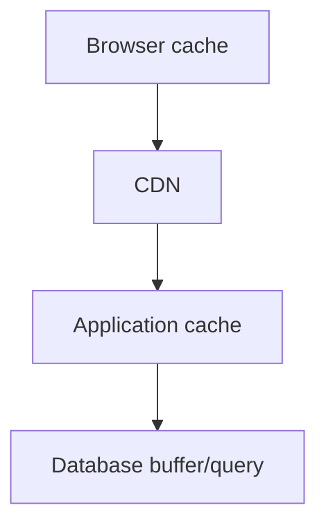

Browser hit 可省：

- Internet/CDN transfer；
- CDN request；
- Application execution；
- Database query。

Application cache hit 通常只省 database work，仍支付：

- Client network；
- Load balancer；
- TLS/HTTP；
- Application CPU；
- Cache lookup。

### 2.1 高层缓存并非总能使用

越高层越接近用户，也越可能：

- 包含 personalized data；
- 难集中 invalidation；
- 分散在许多 clients；
- 受 privacy/security policy 限制；
- 版本不一致。

所以“越高越好”是资源节省直觉，不是无条件架构规则。

### 2.2 多层缓存

若 local hit ratio 为 $h_l$，在 local miss 中 external conditional hit ratio 为 $h_e$：

$$
H=h_l+(1-h_l)h_e
$$

Origin fraction：

$$
P_{origin}=(1-h_l)(1-h_e)
$$

例如：

$$
h_l=0.70,\qquad h_e=0.90
$$

$$
P_{origin}=0.30\times0.10=0.03
$$

只有 3% 到 origin。注意 $h_e$ 的分母是进入 external cache 的 local misses，不能直接将两个无条件比例相加。

---

## 3. Cache 是优化，不是可扩展性的遮羞布

### 3.1 原章的警告

如果 origin 无法承受没有 cache 时的流量，架构不具备稳健 scalability。以下事件会让 hit ratio 突降：

- Access pattern 改变；
- Cache restart/flush；
- Deployment creates new keys；
- Node failure/rebalance；
- TTL 同时过期；
- Cache service outage；
- Bad invalidation/purge；
- Hot object 突然出现。

系统可以变慢，但不能失控地倒下。

### 3.2 Cache dependency inversion

设计者把 cache 当 optional optimization，但 origin 长期按 miss load 缩容后，cache 事实上成为 mandatory dependency：

```text
cache outage -> full load to origin -> origin outage
-> retries -> wider outage
```

这叫隐藏的 capacity dependency。判断方法：

$$
BypassLoad\le OriginSafeCapacity?
$$

若答案是否定，必须有 load shedding、stale fallback、rate limit、priority 或 gradual recovery，而不是盲目 bypass。

### 3.3 Survival contract

缓存失效时要明确：

- 哪些请求继续访问 origin；
- 哪些返回 stale；
- 哪些被 shed/429/503；
- 哪些使用 local fallback；
- 哪些 features 降级；
- Origin 最大并发/QPS；
- Recovery 时如何避免 refill storm。

---

## 4. 20.1 Policies：cache miss 的两种路径

### 4.1 Side cache / cache-aside

Application 先查 cache，miss 后自己访问 origin，再更新 cache：

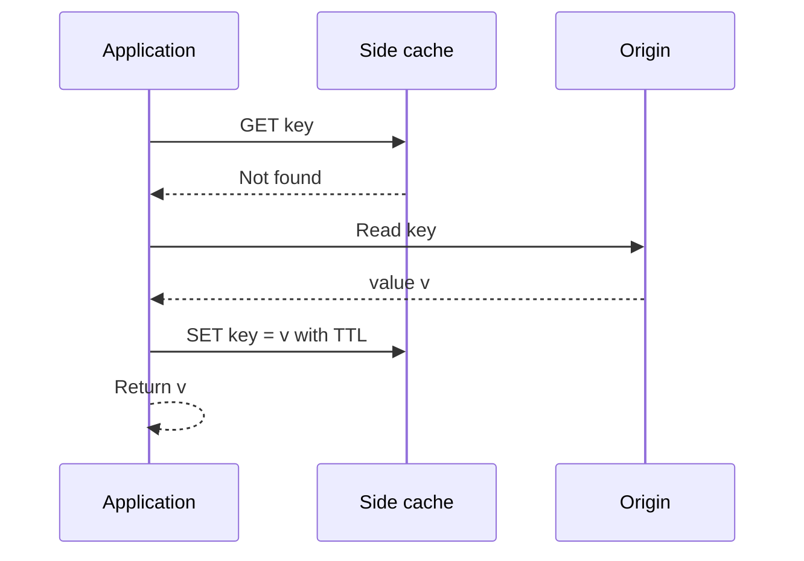

Application 通常把 cache 当 key-value store。

优点：

- Cache unavailable 时可由 application 选择 bypass/degrade；
- 只缓存实际读取的数据；
- 与任意 origin 配合；
- Policy 灵活。

代价：

- Application 承担 miss logic；
- Read path 多一次 cache lookup；
- Race/invalidation 容易出错；
- 多语言服务重复实现；
- Cache key/schema/serialization 成为 application contract。

#### 4.1.1 Cache-aside 伪代码

```text
get(key):
    value = cache.get(key)
    if value exists and is acceptable:
        return value

    value, version = origin.read(key)
    cache.set_if_newer(key, value, version, ttl)
    return value
```

`set_if_newer` 是补充的防竞态手段；最简单实现常直接 `SET`。

### 4.2 Inline cache / read-through

Application 只访问 cache，cache 在 miss 时代表 application 请求 origin：

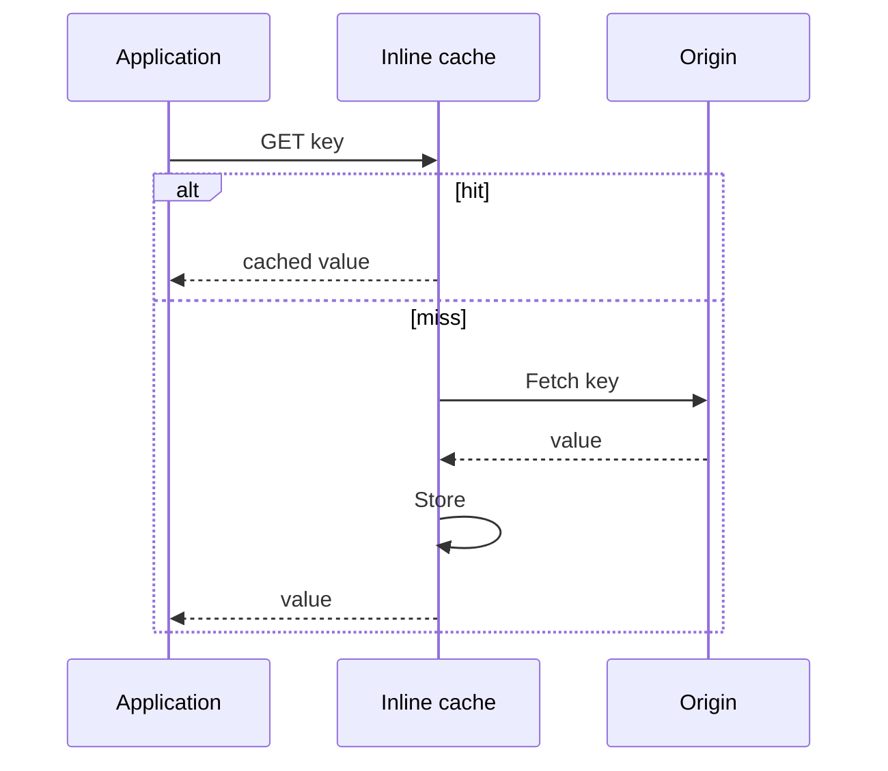

HTTP cache 是此前 inline cache 案例。

优点：

- Application path 统一；
- Miss/fill/coalescing 可集中实现；
- 多 clients 共享 policy；
- Cache 可隐藏 origin topology。

代价：

- Cache 必须理解 origin fetch；
- Cache 在所有 reads path 上；
- Outage/failure semantics 更耦合；
- Generic cache 未必知道业务 freshness；
- Inline proxy 自身需 scale/HA。

### 4.3 Read-through、write-through、write-back

原章这里主要讨论 read miss。工程上常见术语：

| Pattern | Write path | 主要特性 |
| --- | --- | --- |
| Cache-aside | Application 写 origin 并 invalidate/update cache | 常见、灵活、竞态多 |
| Read-through | Cache 负责 miss fetch | Read logic 集中 |
| Write-through | 先经 cache，同步写 origin | Cache/origin 同步但 write latency 增加 |
| Write-back/behind | 先写 cache，异步写 origin | Write 快，但 cache 变成 durability-critical |

Write-back 若 cache 丢失会丢 authoritative writes，已超出“disposable best-effort cache”定义，需要 durable log/replication/recovery。

### 4.4 Side 与 inline 不是 local/external 的同义词

- Side/inline 描述 miss 时谁访问 origin；
- Local/external 描述 cache 部署位置和共享范围。

External Redis 常被 application 当 side cache；CDN 是 external inline cache；进程内 library 也可封装 read-through。

---

## 5. Eviction policy：容量满时淘汰谁

### 5.1 为什么必须 eviction

Cache capacity 有限。新 object 进入而空间不足时，需移除一个或多个 entries。

目标不是保留“最重要”的抽象对象，而是最大化未来收益：

$$
ExpectedBenefit_i\approx
FutureAccessProbability_i\times MissCost_i
$$

真实未来未知，policy 用历史/频率/大小等信号近似。

### 5.2 LRU

原章列举 Least Recently Used：淘汰最久未访问 entry。

直觉：recently used object 更可能再次使用，利用 temporal locality。

典型 $O(1)$ 结构：

- Hash table：key -> entry；
- Doubly linked list：MRU 到 LRU；
- Hit 时移到 MRU；
- Full 时删除 LRU tail。

```text
MRU [A] <-> [D] <-> [B] <-> [C] LRU
new E -> evict C
```

### 5.3 LRU 的局限

- 一次大 scan 可把真正 hot working set 全部冲掉（cache pollution）；
- 不考虑 access frequency；
- 不考虑 object size；
- 不考虑 miss recomputation cost；
- 精确 LRU 在高并发 distributed cache 中 metadata 更新昂贵。

常见替代/近似：

- FIFO；
- LFU；
- CLOCK/second chance；
- Segmented LRU；
- TinyLFU/admission policy；
- Random eviction；
- Size/cost-aware policy。

原章只用 LRU 建立概念，不能由此推断 LRU 对所有 workload 最佳。

### 5.4 Eviction 与 expiration 不同

- **Eviction**：通常因容量/内存压力移除；
- **Expiration**：entry 超过 freshness lifetime 后逻辑失效。

未过期 entry 也可被 eviction；已过期 entry 可能尚未物理删除，只是在读取时视为 invalid。

### 5.5 Admission policy

每个 miss 都写 cache 可能让一次性 objects 污染空间。Admission policy 决定“新 object 是否值得缓存”；eviction policy 决定“需要空间时删谁”。

例如：

- 只在第二次访问后 admission；
- 大于阈值不缓存；
- Scan traffic bypass；
- 按 estimated frequency/admission sketch。

这是原章之外的实用补充。

---

## 6. Expiration policy 与 TTL

### 6.1 TTL 定义

Entry 写入时记录：

```text
expires_at = stored_at + TTL
```

在单调 elapsed-time 模型中：

$$
Fresh\iff now-storedAt<TTL
$$

当 age 达到 TTL：

$$
Expired\iff age\ge TTL
$$

边界要明确；不能一处用 `<`、另一处用 `<=`。

### 6.2 TTL 的核心权衡

作者指出：

- TTL 越长，hit ratio 通常越高；
- TTL 越长，serve stale/inconsistent data 概率越高。

```text
long TTL -> fewer origin reads -> more staleness
short TTL -> fresher -> more misses/load
```

TTL 应由业务 stale tolerance 推导，而不是统一设成一个方便数字。

### 6.3 固定 TTL 的简化命中模型

假设单 object requests 是 rate $\lambda$ 的 Poisson process，miss 后固定缓存 $T$ 秒，hit 不续期、无 capacity eviction。一个 cycle 有 1 次 fill miss，fresh window 内期望 $\lambda T$ 次 hits：

$$
H\approx\frac{\lambda T}{1+\lambda T}
$$

当 $T$ 增大，$H$ 上升；但该模型不包含 writes/staleness、LRU、多 object competition 或 burst traffic，只用于解释方向。

### 6.4 Freshness budget

若业务允许最多 $S_{max}$ 秒未验证旧数据，在无 invalidation 的简单模型中：

$$
TTL\le S_{max}
$$

但 clock skew、fill delay、replica lag 和 multi-level cache 会扩大端到端 age。最好携带 source version/updated time，并监控实际 object age。

### 6.5 TTL jitter

同一批 entries 同时以 TTL $T$ 写入，会一起过期，形成 expiry wave。可添加随机 jitter：

$$
TTL'=T+U(-j,j)
$$

或只减少：

$$
TTL'=T\times U(1-j,1)
$$

目的不是改变平均 freshness，而是把 refresh load 分散到时间轴。Jitter 边界仍必须符合最大 staleness。

---

## 7. Lazy expiration 与 stale-on-error

### 7.1 Expired 不必立即物理删除

作者指出 expiry 可以延迟到下次访问：

1. Entry 到期；
2. 不立即扫描删除；
3. 下次 GET 发现 expired；
4. Refresh、evict 或按 policy stale serve。

这叫 lazy expiration。优点：

- 无需每秒扫描所有 entries；
- 删除 work 按访问分摊；
- Cold expired entries 可在容量压力下自然回收。

缺点：

- Expired data 暂占内存；
- 首个访问承担 refresh latency；
- 需要额外 active sampling/eviction 避免大量永不访问的垃圾。

### 7.2 Origin unavailable 时返回 expired object

原章提出：origin 暂时不可用时，返回 expired object 可能比 error 更 resilient。

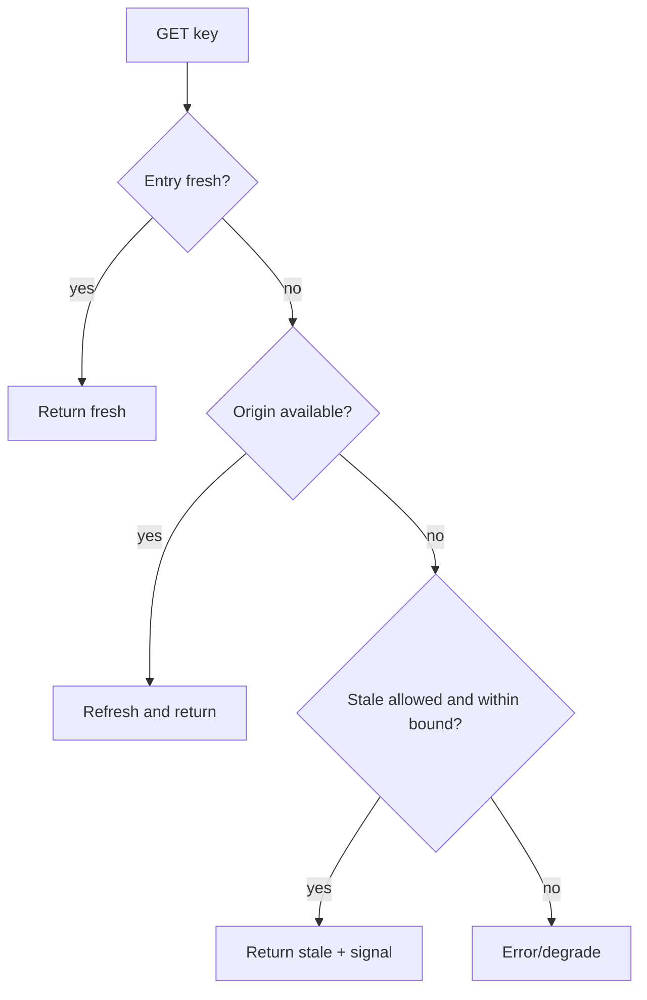

### 7.3 Stale-on-error 的条件

不应把任意 expired data 永久返回。至少定义：

- Maximum stale age；
- Allowed object classes；
- Error types；
- Security/revocation exceptions；
- Client-visible warning/metric；
- Background refresh；
- Recovery behavior。

适合：

- Product catalog；
- Public profile；
- Configuration with safe old default；
- Non-critical recommendation。

不适合无额外保障的：

- Authorization/revocation；
- Account balance；
- Inventory reservation；
- Safety limit；
- Legal/compliance state。

Availability 与 semantic correctness 必须共同评估。

### 7.4 Stale-while-revalidate

另一补充策略：expired 后立即返回 bounded stale，同时仅一个 worker refresh：

```text
serve stale quickly
-> refresh in background
-> atomically replace on success
```

它降低 tail latency 和 herd，但接受短暂 stale。

---

## 8. Cache invalidation 为什么困难

### 8.1 TTL 是 invalidation 的 workaround

作者说 TTL-based expiry 是对 cache invalidation 的 workaround，因为准确 invalidation 很难。

TTL 不知道 origin 是否更新；它只是给 stale lifetime 一个上界：

- Origin 没更新：TTL 到期造成不必要 miss；
- Origin 刚更新：cache 仍可在剩余 TTL 内 stale。

### 8.2 Query-result invalidation

缓存 query：

```sql
SELECT ... FROM orders
WHERE customer_id = ? AND status = 'PLACED';
```

任何会改变结果集或字段的 write 都应 invalidate：

- Existing row status 变化；
- New matching row inserted；
- Matching row deleted；
- Joined customer/product row changes；
- Permission/visibility changes。

一个 query 可能依赖数千 records，反向追踪 `record -> affected cache keys` 昂贵且易漏。

### 8.3 Invalidation 的三个难点

1. **Dependency discovery**：哪些 source changes 影响哪些 derived entries？
2. **Delivery**：invalidation message 会否丢失、重复、乱序？
3. **Race**：read-fill 与 write-invalidate 并发时，谁最后覆盖？

### 8.4 Cache-aside 经典竞态

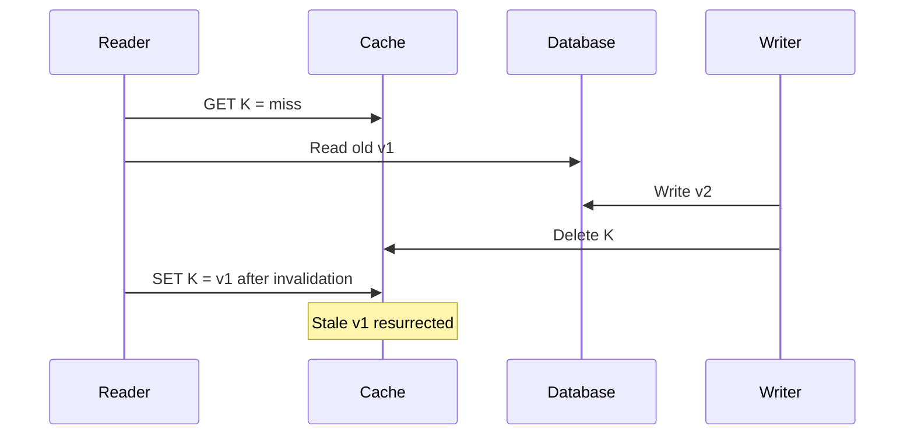

即使 writer 采用“先写 DB，再删 cache”，仍可能被更早开始的 reader 把旧值写回来。

### 8.5 缓解策略

- Cache entry 带 monotonic source version，`set_if_newer`；
- CDC/outbox 发布有序 invalidation/update；
- Short TTL 约束 stale window；
- Writer delayed second delete（仅缓解，不是严格证明）；
- Per-key serialization/singleflight；
- Write-through with transactional integration；
- Versioned cache key：`object:id:version`；
- Read source after acquiring fill ownership；
- Accept eventual consistency and repair。

没有通用银弹，选择由 consistency requirement 和 write/read pattern 决定。

### 8.6 Delete 还是 update cache

Writer 修改 origin 后：

- **Invalidate/delete**：简单，下一 read refill；会产生 miss；
- **Update**：立即 fresh，但 dual-write partial failure、ordering 更难。

Cache-aside 常偏 delete，因为 cache disposable，减少同时维护两份 authoritative-looking state。

---

## 9. 20.2 Local cache

### 9.1 定义与 Figure 20.1

最简单 cache 与 client co-locate：

- In-process hash table；
- Embedded key-value store，例如 RocksDB；
- 每个 application instance 有自己的 cache。

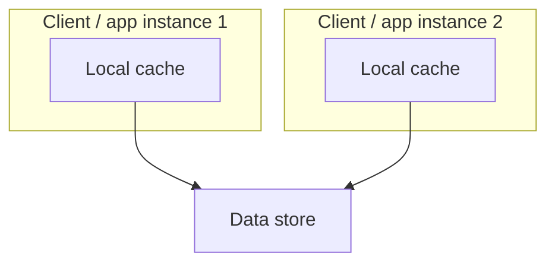

这对应 Figure 20.1。

### 9.2 优势

- 无 network round trip；
- 极低 latency；
- Failure 与 instance 隔离；
- 无 external cache service 运维；
- 可存 process-specific/parsed object；
- Origin/cache outage 时可保留少量 local fallback。

In-memory hash table 最快但随 process restart 丢失；RocksDB 等 embedded store 可容纳更大/持久 local data，但 disk、compaction、lifecycle 更复杂。

### 9.3 重复容量

每个 client cache 独立，相同 hot objects 被重复存储。

若有 $N$ 个 clients、每个物理容量 $C$：

$$
AggregatePhysicalMemory=N C
$$

但如果每个 cache 都存相同 top working set，有效 unique capacity 可能仅约：

$$
EffectiveUniqueCapacity\approx C
$$

原章“每个 1 GB，不论 clients 数总 cache size 仍是 1 GB”是在强调后者的有效 unique working set；物理分配内存显然是 $N$ GB。

### 9.4 重复 fill

若一个 key 首次被每个 client 请求，每个 local cache 都各自 miss：

$$
OriginFillsPerKey\le N
$$

External shared cache 理想情况下只需一次 fill（忽略 race/failure）。所以 local cache 数随 clients 增长，origin cold-fill load 也增长。

### 9.5 不同 clients 看到不同版本

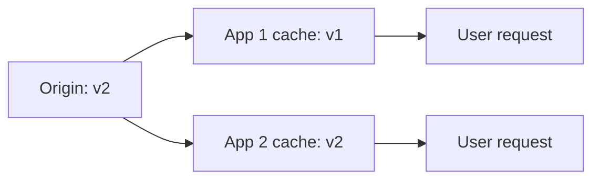

同一用户经 LB 落到不同 instances，可能观察 value 倒退：

```text
request 1 -> app 2 -> v2
request 2 -> app 1 -> v1
```

这会破坏 monotonic-read expectation。TTL 最终收敛，但不能保证请求间一致。

### 9.6 Local invalidation

更新后要通知所有 clients：

- Broadcast invalidation；
- Pub/sub；
- Version polling；
- Short TTL；
- Versioned keys；
- Avoid caching mutable critical data。

Message 可能丢失，restarted client 可能错过 event，所以 TTL/version reconciliation 仍有价值。

---

## 10. Thundering herd

### 10.1 触发场景

作者列出：

- Clients 数增长；
- Clients restart/new instances online，cache cold；
- 以前冷门 object 突然热门。

还包括：

- 同一 TTL 同时过期；
- Global invalidation；
- Cache node failure/remap；
- Deployment changes cache-key version；
- External cache outage。

大量 requests 同时 miss 并打 origin，即 thundering herd/cache stampede。

### 10.2 Amplification

若一个 hot key 在窗口内有 $R$ 个 concurrent requests，未 coalesce 时 origin burst：

$$
OriginRequests\approx R
$$

若每个 origin query cost 为 $c$：

$$
OriginWork\approx R c
$$

Origin 变慢后 requests overlap 更多，形成正反馈：

```text
miss burst -> origin queue -> latency rises
-> more concurrent misses/timeouts -> retries
-> larger burst
```

### 10.3 Per-client request coalescing

原章给出：每个 client 对某 key 任一时刻最多一个 outstanding fetch，其余等待同一个结果。

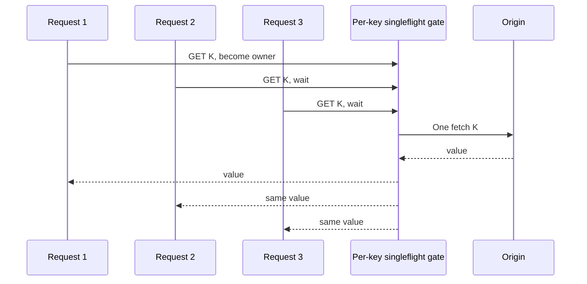

在单 client 内：

$$
ConcurrentOriginFetchesPerKey\le1
$$

### 10.4 Coalescing 的边界

若有 $N$ 个 independent local caches，每个都 singleflight，仍可能：

$$
GlobalConcurrentFetchesPerKey\le N
$$

External shared cache 可把 collapse 范围扩大到所有 clients，但需要 distributed lock/fill ownership，并处理 owner crash、lease expiry 和 fencing。

### 10.5 其他缓解方法

- TTL jitter；
- Stale-while-revalidate；
- Early refresh/probabilistic refresh；
- Prefetch/warmup；
- Negative caching；
- Origin concurrency limit；
- Request queue + deadline；
- Load shedding；
- Backoff/jitter；
- Hot-key replication。

### 10.6 Negative caching

若不存在的 key 被频繁查询，每次 miss 都访问 origin。可短期缓存 `NOT_FOUND`：

```text
K -> negative marker, short TTL
```

风险：object 随后创建，negative entry 会暂时隐藏它；权限错误不能随意作为全局 negative value；不同错误需不同 policy。

---

## 11. 20.3 External cache

### 11.1 定义与 Figure 20.2

External cache 是专门缓存 objects 的 service，通常以内存为主，多个 clients 共享：

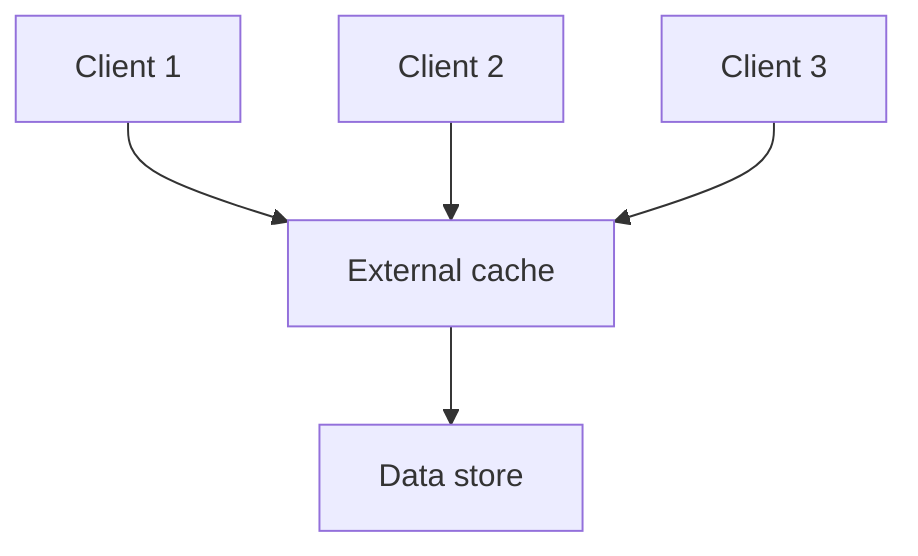

原章例子：Redis、Memcached，以及 AWS/Azure 上的 managed services。

### 11.2 共享带来的收益

- 一个 client fill，其他 clients 可复用；
- Unique working set 集中，不在每个进程重复；
- Origin fill 数不随 client 数线性增长；
- Policy/metrics/invalidation 更集中；
- 可独立扩容量和 throughput；
- Application instances 更轻量。

### 11.3 “单一版本”的精确边界

原章说 shared cache 在不复制时任一时刻每 object 只有一个 version，减少 consistency issues。需要补充：

- 它仍可能相对 origin stale；
- Concurrent fills/writes 仍可 race；
- Partitioning 后一个 key 通常有一个 owner，但 owner change 有迁移窗口；
- Replication 后 replicas 可有 lag；
- Client-side/local layers 仍可能保存旧 copy。

External cache 缩小副本分散范围，不自动提供 strong consistency。

### 11.4 Local 与 external 对比

| 维度 | Local cache | External cache |
| --- | --- | --- |
| Latency | Process/machine local，最低 | Network call，较高 |
| Sharing | 每 client 独立 | Clients 共享 |
| Duplicate objects | 多 | 少 |
| Cold fill | 每 client | 可全局复用 |
| Scale | 随 process memory，独立碎片化 | 可 partition/replicate |
| Consistency | 多份 divergent copies | 较集中但仍可能 stale |
| Failure | 单 instance 局部 | Shared failure blast radius |
| Operations | 简单/随 app | 独立 service 成本 |

---

## 12. External cache 的 partitioning 与 replication

### 12.1 为什么要 scale out

External cache 解耦 clients 与 origin，但 load 只是移到 cache。最终会碰到：

- Memory capacity；
- Network bandwidth；
- QPS/CPU；
- Hot key；
- Connection count；
- Single-node failure。

因此用 Chapter 16/19 的模式：

- Partition keys across nodes；
- Replicate each partition；
- Route clients to owner；
- Rebalance membership。

原章以 Redis 自动分区并用 leader-follower 复制每个 partition 为例。具体 Redis Cluster consistency/failover/slot 语义应以当前文档为准。

### 12.2 Partitioning

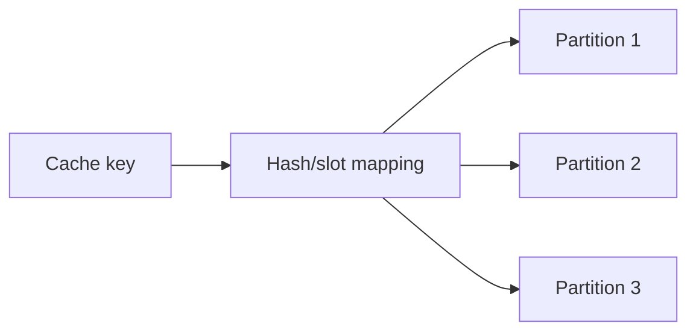

收益：总 memory/QPS 横向扩展。代价：

- Multi-key operation 可能跨 partitions；
- Routing metadata；
- Rebalance/migration；
- Hot key 仍在一个 owner；
- Node failure 造成一批 keys cold/unavailable。

### 12.3 Replication

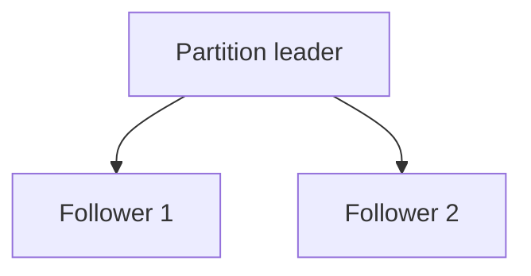

收益：failover/read capacity；代价：memory duplication、replication lag、failover inconsistency 和 write overhead。

由于 cache disposable，可接受的 durability/consistency 通常弱于 database，但 failover cold miss 对 origin 的压力仍是系统级风险。

### 12.4 Hot key

Partitioning 打散许多 keys，不能拆分一个超热门 key：

$$
Load(partition_j)=\sum_{k\mapsto j}\lambda_k
$$

单 key $\lambda_h$ 很大时，其 owner 至少承受 $\lambda_h$。可用：

- Local L1 copies；
- Read replicas；
- Key replication；
- Request coalescing；
- Response embedding/batching；
- CDN/browser cache；
- Split semantic key（若可合并）。

---

## 13. Rebalancing 与 consistent hashing

### 13.1 为什么迁移量影响 hit ratio

Membership 改变时，若大量 keys remap：

- 新 owner cache cold；
- 旧 owner data 即使还在也不再被路由；
- Origin fills 激增；
- Cache network/CPU 同时忙于 migration；
- Hit ratio 下降、latency 上升。

### 13.2 Modulo 的问题

$$
owner=H(key)\bmod N
$$

$N\to N+1$ 时约 $N/(N+1)$ keys 改 owner。Chapter 16 已推导。

### 13.3 Consistent hashing

原章建议 consistent hashing 或类似 partitioning 技术，目标是 membership change 时尽量少 shuffle/drop data。

新增第 $N+1$ 个均匀节点，期望移动约：

$$
\frac{K}{N+1}
$$

而不是大多数 $K$。

Consistent hashing 减少 remap，不保证：

- Perfect load balance；
- Hot key 消失；
- Migrated entries 不丢；
- Active requests 无影响；
- Replica consistency。

Virtual nodes/weighted rendezvous hashing 等可进一步改善 placement。

### 13.4 Move 还是 drop

Cache data 可重建，因此 rebalance 可：

- Copy entries 到 new owner；
- Continue serving old owner during migration；
- Drop and lazy refill；
- Hybrid：迁 hot entries、丢 cold entries。

若 origin 很强、cache 小，drop 简单；若 origin 脆弱、working set 大，迁移/预热更安全。必须按 refill cost 决策。

---

## 14. External cache 的成本

### 14.1 Network latency

Local cache 是 function/memory/disk access；external cache 需要 network call：

$$
T_{external}=T_{queue}+T_{network}+T_{server}+T_{serialization}
$$

即使同 zone 只有亚毫秒/毫秒级，也比 in-process map 慢，并增加 tail/failure mode。

### 14.2 Operational cost

又一个 service 意味着：

- Provisioning/autoscaling；
- Partition/replication；
- Failover/upgrade；
- Backup（若业务误把 cache 当 truth）；
- Security/network policy；
- Connection management；
- Metrics/alerts；
- Cost/quota；
- Client compatibility。

Managed service 转移部分操作，但不消除 architecture、capacity 和 failure responsibility。

### 14.3 Serialization 与 schema evolution

跨进程 cache value 是 protocol：

- Encoding/version；
- Compression；
- Max size；
- Backward compatibility；
- Class/type changes；
- Poisoned/corrupt entry handling。

Deploy 新代码读旧 cached bytes 必须安全。Cache key 可带 schema version：

```text
user:v3:123
```

### 14.4 Security

External shared cache 可能包含：

- PII；
- Auth/session data；
- Database query results；
- Internal config。

需要：network isolation、TLS/auth、least privilege、tenant-aware keys、safe logging、bounded TTL 和避免 key collision。Cache poisoning/tenant leakage 是 correctness 和 security failure。

---

## 15. External cache outage 与 cascading failure

### 15.1 天真的 bypass

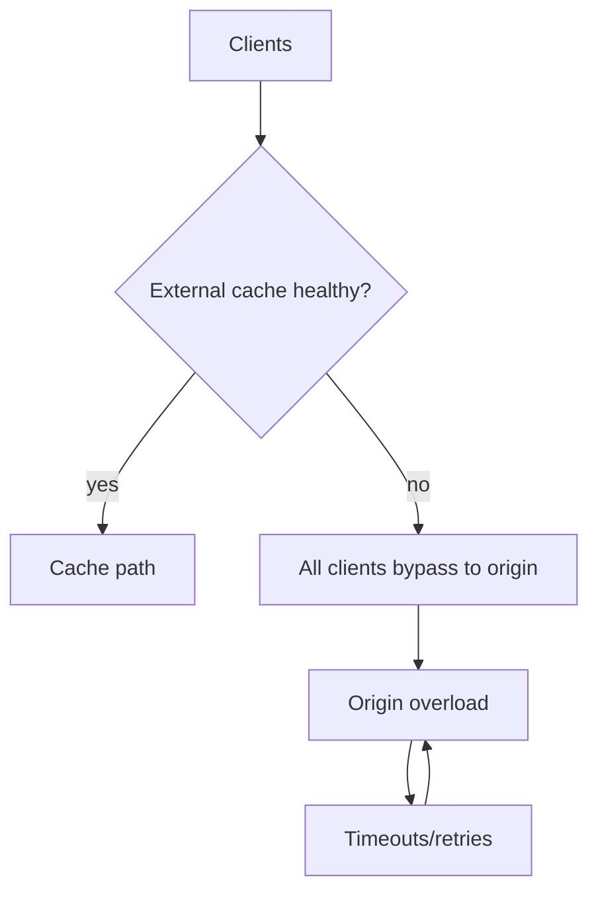

Origin 若只按 steady miss load provisioning，cache outage 的 full traffic 会将其击垮。于是：

```text
cache failure -> origin failure -> application failure
```

### 15.2 Load multiplier

正常 hit ratio $H$，origin 正常流量 $\lambda(1-H)$；cache 全失效变 $\lambda$。Multiplier：

$$
Amplification=\frac{1}{1-H}
$$

$H=0.99$ 时：

$$
Amplification=100
$$

一个 99% hit cache outage 可给 origin 100 倍正常 load。

### 15.3 Timeout 与 retry 进一步放大

External cache degraded 而不是快速失败时，每 request 先等待 cache timeout，再访问 origin：

$$
T\approx T_{cacheTimeout}+T_{origin}
$$

若 client retry $r$ 次，尝试数可增到：

$$
Attempts\le1+r
$$

多层各自 retry 会乘法放大。Cache timeout 应短、有 circuit breaker 和 shared retry budget。

### 15.4 Local cache 作为防线

作者建议 clients 使用 in-process cache 防 external outage：


L2 down 时：

- L1 fresh/stale hits 不访问 origin；
- Hot working set 仍有副本；
- 每 client 独立容量限制 blast；
- 但 L1 cold/miss 仍可能打 origin。

### 15.5 Origin 必须 load shed

原章还强调 origin 应准备应对突然“攻击”，例如 shedding requests。保护手段：

- Per-client/tenant rate limit；
- Global concurrency limit；
- Priority queue；
- Reject low-priority work；
- Bounded queue/deadline；
- Circuit breaker；
- Adaptive load shedding；
- Serve degraded response；
- Admission control。

目标不是让所有 requests 在 outage 时成功，而是保护核心请求和系统恢复能力。

### 15.6 Recovery storm

Cache service 恢复后仍可能：

- 所有 clients 同时 refill；
- Rebalance 造成 cold slots；
- Retry backlog 一起释放；
- Origin 尚未恢复。

需：

- Gradual traffic ramp；
- Warmup hot keys；
- Singleflight；
- Jitter；
- Per-key/global refill limit；
- Preserve stale entries；
- Reset retry budget。

---

## 16. 可运行 C11 示例：LRU、TTL 与 stale-on-error

### 16.1 模拟目标

下面实现一个容量为 2 的 cache-aside state machine：

- Origin 存 `A/B/C` 三个 key；
- 首次 `A` miss，从 origin fill；
- TTL 内 `A` fresh hit，不访问 origin；
- TTL 到期且 origin down 时，bounded policy 返回 stale `A`；
- Origin 恢复并把 `A` 更新为 `v2`，expired entry refresh；
- 随后访问 `B`、`C`，LRU 淘汰最久未访问的 `A`；
- 再读 `A` 必须回源；
- Clock rollback、oversize value、未知 key 和超出 stale bound 都被拒绝；
- 所有状态变化使用显式错误检查，不依赖 `assert`。

程序只验证本章 policy 交互，不包含并发 request coalescing。

### 16.2 完整代码

```c
#include <stdbool.h>
#include <stddef.h>
#include <stdio.h>
#include <string.h>

enum {
    CACHE_CAPACITY = 2,
    ORIGIN_COUNT = 3,
    KEY_CAPACITY = 8,
    VALUE_CAPACITY = 16
};

typedef struct {
    const char *key;
    char value[VALUE_CAPACITY];
} OriginEntry;

typedef struct {
    bool present;
    char key[KEY_CAPACITY];
    char value[VALUE_CAPACITY];
    unsigned long stored_at;
    unsigned long last_access;
} CacheEntry;

typedef struct {
    CacheEntry entries[CACHE_CAPACITY];
    unsigned long ttl;
    unsigned long max_stale;
    unsigned long origin_calls;
} Cache;

typedef enum {
    PATH_FRESH,
    PATH_ORIGIN,
    PATH_STALE,
    PATH_ERROR
} Path;

static bool copy_text(char *destination,
                      size_t capacity,
                      const char *source) {
    const int written = snprintf(destination, capacity, "%s", source);
    return written >= 0 && (size_t)written < capacity;
}

static const char *path_name(Path path) {
    switch (path) {
        case PATH_FRESH:
            return "fresh";
        case PATH_ORIGIN:
            return "origin";
        case PATH_STALE:
            return "stale";
        case PATH_ERROR:
            return "error";
    }
    return "error";
}

static const OriginEntry *find_origin(const OriginEntry *origin,
                                      const char *key) {
    size_t index;
    for (index = 0; index < ORIGIN_COUNT; index++) {
        if (strcmp(origin[index].key, key) == 0) {
            return &origin[index];
        }
    }
    return NULL;
}

static CacheEntry *find_cache(Cache *cache, const char *key) {
    size_t index;
    for (index = 0; index < CACHE_CAPACITY; index++) {
        if (cache->entries[index].present &&
            strcmp(cache->entries[index].key, key) == 0) {
            return &cache->entries[index];
        }
    }
    return NULL;
}

static CacheEntry *select_slot(Cache *cache) {
    size_t index;
    size_t lru_index = 0;

    for (index = 0; index < CACHE_CAPACITY; index++) {
        if (!cache->entries[index].present) {
            return &cache->entries[index];
        }
        if (cache->entries[index].last_access <
            cache->entries[lru_index].last_access) {
            lru_index = index;
        }
    }
    return &cache->entries[lru_index];
}

static bool store_entry(CacheEntry *entry,
                        const char *key,
                        const char *value,
                        unsigned long now) {
    char checked_key[KEY_CAPACITY] = {0};
    char checked_value[VALUE_CAPACITY] = {0};

    if (!copy_text(checked_key, sizeof checked_key, key) ||
        !copy_text(checked_value, sizeof checked_value, value)) {
        return false;
    }
    memcpy(entry->key, checked_key, sizeof checked_key);
    memcpy(entry->value, checked_value, sizeof checked_value);
    entry->stored_at = now;
    entry->last_access = now;
    entry->present = true;
    return true;
}

static Path cache_get(Cache *cache,
                      const OriginEntry *origin,
                      bool origin_available,
                      const char *key,
                      unsigned long now,
                      const char **value) {
    CacheEntry *entry;
    unsigned long age = 0;

    if (cache == NULL || origin == NULL || key == NULL || value == NULL) {
        return PATH_ERROR;
    }

    entry = find_cache(cache, key);
    if (entry != NULL) {
        if (now < entry->stored_at || now < entry->last_access) {
            return PATH_ERROR;
        }
        age = now - entry->stored_at;
        if (age < cache->ttl) {
            entry->last_access = now;
            *value = entry->value;
            return PATH_FRESH;
        }
        if (!origin_available &&
            age - cache->ttl <= cache->max_stale) {
            entry->last_access = now;
            *value = entry->value;
            return PATH_STALE;
        }
    }

    if (!origin_available) {
        return PATH_ERROR;
    }

    {
        const OriginEntry *source = find_origin(origin, key);
        CacheEntry *slot;
        if (source == NULL) {
            return PATH_ERROR;
        }
        slot = entry != NULL ? entry : select_slot(cache);
        if (!store_entry(slot, source->key, source->value, now)) {
            return PATH_ERROR;
        }
        cache->origin_calls++;
        *value = slot->value;
        return PATH_ORIGIN;
    }
}

static bool expect(Cache *cache,
                   const OriginEntry *origin,
                   bool origin_available,
                   const char *key,
                   unsigned long now,
                   Path expected_path,
                   const char *expected_value) {
    const char *value = NULL;
    const Path path = cache_get(cache, origin, origin_available,
                                key, now, &value);
    if (path != expected_path || value == NULL ||
        strcmp(value, expected_value) != 0) {
        return false;
    }
    printf("t=%lu key=%s path=%s value=%s origin_calls=%lu\n",
           now, key, path_name(path), value, cache->origin_calls);
    return true;
}

int main(void) {
    OriginEntry origin[ORIGIN_COUNT] = {
        {"A", "A-v1"},
        {"B", "B-v1"},
        {"C", "C-v1"}
    };
    Cache cache = {0};
    const char *ignored = NULL;
    size_t index;

    cache.ttl = 10;
    cache.max_stale = 5;

    if (!expect(&cache, origin, true, "A", 0,
                PATH_ORIGIN, "A-v1") ||
        !expect(&cache, origin, true, "A", 5,
                PATH_FRESH, "A-v1") ||
        !expect(&cache, origin, false, "A", 12,
                PATH_STALE, "A-v1")) {
        return 1;
    }

    for (index = 2; index < KEY_CAPACITY; index++) {
        if ((unsigned char)cache.entries[0].key[index] != 0) {
            return 1;
        }
    }
    for (index = 5; index < VALUE_CAPACITY; index++) {
        if ((unsigned char)cache.entries[0].value[index] != 0) {
            return 1;
        }
    }

    if (!copy_text(origin[0].value, sizeof origin[0].value, "A-v2") ||
        !expect(&cache, origin, true, "A", 13,
                PATH_ORIGIN, "A-v2") ||
        !expect(&cache, origin, true, "B", 14,
                PATH_ORIGIN, "B-v1") ||
        !expect(&cache, origin, true, "C", 15,
                PATH_ORIGIN, "C-v1") ||
        find_cache(&cache, "A") != NULL ||
        !expect(&cache, origin, true, "A", 16,
                PATH_ORIGIN, "A-v2")) {
        return 1;
    }

    if (cache.origin_calls != 5 ||
        cache_get(&cache, origin, false, "B", 30, &ignored) !=
            PATH_ERROR ||
        cache_get(&cache, origin, true, "A", 15, &ignored) !=
            PATH_ERROR ||
        cache_get(&cache, origin, true, "missing", 31, &ignored) !=
            PATH_ERROR) {
        return 1;
    }

    printf("final_origin_calls=%lu capacity=%d\n",
           cache.origin_calls, CACHE_CAPACITY);
    return 0;
}
```

编译运行：

```bash
gcc -std=c11 -Wall -Wextra -Werror -pedantic cache_policy.c -o cache_policy
./cache_policy
```

关键输出：

```text
t=0 key=A path=origin value=A-v1 origin_calls=1
t=5 key=A path=fresh value=A-v1 origin_calls=1
t=12 key=A path=stale value=A-v1 origin_calls=1
t=13 key=A path=origin value=A-v2 origin_calls=2
t=14 key=B path=origin value=B-v1 origin_calls=3
t=15 key=C path=origin value=C-v1 origin_calls=4
t=16 key=A path=origin value=A-v2 origin_calls=5
final_origin_calls=5 capacity=2
```

### 16.3 LRU 为什么淘汰 A

在 $t=13$ refresh A，$t=14$ fill B，cache 为 `{A(last=13), B(last=14)}`。$t=15$ fill C 时容量满，A 是 LRU，因此被淘汰。$t=16$ 再读 A 必须 origin fetch。

### 16.4 TTL/stale 边界

- TTL = 10；
- $t=5$：age 5，fresh；
- $t=12$：age 12，expired 2 秒，origin down，且 `2 <= max_stale=5`，返回 stale；
- B 在 $t=14$ 存入，$t=30$ age 16，超 TTL 6 秒，大于 max stale 5，origin down 时拒绝。

代码要求 `now` 对每个 entry 的 stored/access time 单调，避免 clock rollback 被误判为 fresh。

### 16.5 Mutation safety

`store_entry` 先复制到临时 fixed buffers，确认 key/value 不截断后才一次性更新 entry metadata，避免一半 key 已改、一半 value 失败的 partial cache entry。

### 16.6 示例局限

- 单线程，无 request coalescing；
- 固定 2 entries、3 origin records；
- LRU timestamp 相同时取较早 array slot，不含随机 tie-break；
- 无 invalidation/version race；
- 无 external network/cache failure timeout；
- 无 negative caching、jitter 和 background refresh；
- Stale policy 用统一数字，生产应按 data class；
- Cache entry 指针只在同步调用内使用；
- Origin call counter 只计成功找到 object 的 fetch。

因此代码验证 policy 状态转换，不是 concurrent production cache。

---

## 17. 容易混淆的概念

### 17.1 Cache 与 source of truth

Cache 可丢弃并重建；source of truth 承担 durability 和 authoritative update。Write-back 会模糊边界，必须升级保证。

### 17.2 Hit、fresh hit 与 stale hit

Object 在 cache 中不等于可用：可能 expired、version 错或 policy 禁止。Metrics 应拆分 fresh/stale/negative/revalidated。

### 17.3 Eviction 与 invalidation

- Eviction：容量 policy 决定删除；
- Expiration：时间 policy 使其失效；
- Invalidation：origin change 主动使 copy 不可用；
- Purge：显式批量删除/失效。

### 17.4 Side/inline 与 local/external

前者是 miss ownership，后者是 deployment topology，两个维度正交。

### 17.5 LRU 与 LFU

- LRU 看最近一次时间；
- LFU 看访问频率。

最近访问不等于长期热门，频率高也可能已过时。

### 17.6 TTL 与 consistency guarantee

TTL 只约束未验证缓存时间，不保证读取最新。Origin 可在 fill 后立即更新。

### 17.7 Lazy expiry 与 stale serving

Lazy expiry 只是延迟物理删除；stale serving 是明确返回 expired value 的业务 policy。前者不自动允许后者。

### 17.8 Local cache aggregate memory 与 unique capacity

$N$ 个 1 GB caches 物理共 $N$ GB；若内容相同，有效 unique working set 约 1 GB。不要混淆。

### 17.9 Request coalescing 与 batching

- Coalescing：相同 key 的并发 requests 共享一次 fetch；
- Batching：多个不同 keys 合并一次 bulk fetch。

### 17.10 Coalescing 与 distributed lock

In-process singleflight 只在一个 client 内；global collapse 需要跨 clients 协调、lease 和 owner failure recovery。

### 17.11 External cache 与 database

External cache 也是 distributed service，但 state 应可重建；不能因 Redis/Memcached 可持久化/复制，就默认为业务数据库。

### 17.12 Replication 与 cache coherence

Cache replication 增 availability；同时增加 versions/lag。更多 copies 不自动减少 consistency 问题。

### 17.13 Consistent hashing 与 consistency

Consistent hashing 减少 membership-change remapping，不提供 linearizability 或 cache coherence。

### 17.14 Cache outage bypass 与 graceful degradation

Bypass 是一个动作；只有 origin 有 capacity/limit、requests 有 priority 时才是 graceful degradation。

---

## 18. 常见误区与失败模式

### 18.1 “Hit ratio 高，架构就 scalable”

高 hit ratio 会隐藏 origin 不足。必须做 cache-disabled/cold-start load test。

### 18.2 “缓存数据反正可丢，错误无所谓”

丢失影响性能；错误/跨 tenant value 会破坏 correctness/security。Disposable 不等于无需验证。

### 18.3 “TTL 越长越好”

Hit 增加，但 stale window、revocation delay 和 schema compatibility 风险上升。

### 18.4 “TTL 到期必须立刻扫描删除”

Lazy expiry 常更经济；物理回收与逻辑 freshness 可分离。

### 18.5 “Origin down 时总应该返回 stale”

旧授权、余额或库存可能比 error 更危险。按语义设置 stale bound。

### 18.6 “写 DB 后删 cache 就没有竞态”

并发 reader 可在 delete 后重新写回旧 value。需要 version/order/TTL/reconciliation。

### 18.7 “LRU 一定是最佳 policy”

Scan 可污染 LRU，object size/cost/frequency 也重要。用 workload trace 比较。

### 18.8 “每个实例 1 GB cache，100 个实例就能缓存 100 GB unique data”

如果访问相似，100 份都装同一热点，有效 unique capacity 仍接近 1 GB。

### 18.9 “Singleflight 已消除全局 herd”

每个实例仍可发一次，$N$ instances 仍有 $N$ concurrent fills。需 shared collapse 或 origin limit。

### 18.10 “External cache 只有一个版本，所以强一致”

它仍可能相对 origin stale、发生 fill race，复制/多层还会增加 copies。

### 18.11 “Cache miss 后无条件 retry”

Origin overload 时 retry 放大压力。使用 deadline、budget、backoff/jitter 和 load shedding。

### 18.12 “Cache down 就直接 bypass”

这是最常见 cascading failure 路径。先算 amplification 和 origin capacity。

### 18.13 “Consistent hashing 扩容完全不降命中率”

仍有一部分 keys 移动，新 owner cold；hot key、migration bandwidth 和 replicas 也会影响。

### 18.14 “Managed cache 无需运维”

仍需容量、shard、failover、client timeout、security、cost 和 outage plan。

### 18.15 “Cache key 只要拼字符串”

遗漏 tenant、locale、permission、query 参数会返回错误或泄露；加入无关高基数维度又会 fragment hit ratio。Cache key 是 correctness boundary。

### 18.16 “Cache warmup 越快越好”

无限并发 prefill 会攻击 origin。Warmup 需 priority、限速和真实 hot-set 选择。

---

## 19. 如何设计应用缓存

### 第一步：证明值得缓存

测量：

- Origin QPS/latency/cost；
- Key popularity/reuse distance；
- Object size；
- Read/write ratio；
- Query compute cost；
- Acceptable staleness；
- Expected hit/byte/work ratio。

一次性 reads、频繁 writes 或超低 origin latency 可能不值得。

### 第二步：定义 source of truth

写清：

- Authoritative store；
- Cache 是否可完全丢弃；
- Rebuild path；
- Cache outage correctness；
- Prohibited write-back behavior。

### 第三步：设计 cache key

包含所有影响 response 的 dimensions：

- Resource ID；
- Tenant/user/permission；
- Locale；
- Query/filter/version；
- Schema/serialization version。

同时 canonicalize order/encoding，避免等价 query 产生不同 keys。

### 第四步：选择 side 或 inline

Side cache 适合应用掌握业务 freshness、需要自主 fallback；inline 适合通用、集中代理和共享 coalescing。定义 timeout、miss 和 error contract。

### 第五步：选择 local、external 或两层

- 极低 latency、小 hot set：local；
- 大共享 working set、多 clients：external；
- 兼顾 outage/hot key：local L1 + external L2。

计算重复内存、network latency、blast radius 和 origin fills。

### 第六步：定义 TTL/freshness

按 data class 记录：

- Fresh TTL；
- Max stale-on-error；
- Jitter；
- Refresh strategy；
- Security-sensitive exceptions；
- Clock/time source。

### 第七步：设计 invalidation/update

选择：

- TTL only；
- Write invalidate；
- Write update；
- CDC/event invalidation；
- Versioned key；
- Rebuildable projection。

画出 read/write races，定义 version/order 和 lost event reconciliation。

### 第八步：选择 admission/eviction

用 trace 测：LRU、LFU、TinyLFU、size-aware 等。限制：

- Max entry size；
- Scan bypass；
- Negative-cache TTL；
- Per-tenant quota；
- Serialization overhead。

### 第九步：防 stampede

组合：

- Per-key singleflight；
- TTL jitter；
- Early/background refresh；
- Stale-while-revalidate；
- Warmup；
- Origin concurrency limit；
- Retry budget。

同时测试 singleflight owner crash 和 waiter deadline。

### 第十步：设计 external scale

定义：

- Partition function；
- Replication/failover；
- Hot key；
- Rebalance movement；
- Multi-key operation；
- Client mapping/version；
- Connection pools；
- Memory fragmentation。

### 第十一步：设计 outage mode

建立 cache circuit breaker：

```text
healthy -> degraded -> open/bypass-limited
-> probe -> gradual recovery
```

明确 local fallback、stale、priority、rate/concurrency limits 和 origin shedding。不要全量瞬时 bypass。

### 第十二步：可观测性

按 cache layer/key class/tenant 监控：

- Hit/miss/stale/negative/bypass；
- Lookup/fill latency；
- Eviction/expiration；
- Entry age/size；
- Origin QPS/latency；
- Coalesced waiters；
- Hot keys；
- Memory/fragmentation；
- Rebalance/moved keys；
- External errors/timeouts；
- Amplification during outage。

### 第十三步：故障演练

测试：

- Cache flush/restart；
- Whole external cache down；
- One shard down/rebalance；
- Hot key sudden spike；
- Synchronized TTL expiry；
- Invalidation lost/out-of-order；
- Poisoned/wrong-tenant entry；
- Origin slow during refill；
- Deploy changes key/schema；
- Cold autoscaling fleet。

---

## 20. 作者如何形成解决思路

### 20.1 从 workload locality 开始

作者先给出必要条件：大量 requests 集中在小 pool entries。Cache 只有在 reuse 足够高时才经济。

### 20.2 先定义 disposable best-effort 性质

这确定 cache 不是 truth，所有后续 failure 设计都应能回到 origin。

### 20.3 用 hit ratio 连接 workload、容量与收益

对象全集、重复访问概率、cache size 三因素说明：性能不是由“用了 Redis”决定，而由 workload 与 policy 决定。

### 20.4 先给最高层原则，再设置安全底线

Cache 越高越省 downstream work；紧接着强调 origin 必须能在 cache 失效时存活，避免只看 steady-state 成绩。

### 20.5 从 miss ownership 分类 policy

- Side：application fetch/fill；
- Inline：cache fetch origin。

这先确定责任边界，再讨论 entry lifecycle。

### 20.6 从有限容量引出 eviction，从变化引出 expiration

LRU 回答空间竞争；TTL 回答 freshness/invalidation 的近似。作者随后允许 origin down 时 serve stale，体现 availability 与 freshness 的显式交换。

### 20.7 用 query invalidation 暴露根本困难

Derived result 依赖大量 records，精准 coherence 难以维护，因此 TTL 是 workaround 而非完美解决。

### 20.8 先看最简单 local cache，再暴露规模反作用

Local 极快，但每 client 重复容量、版本分裂、cold fill 随 clients 增长，并形成 herd。Per-client coalescing 只能局部减压。

### 20.9 用 external cache 聚合 locality

共享 cache 降低重复和 origin fill，并可 partition/replicate；但 load 和 failure dependency 转移到新 service。

### 20.10 以 cascading failure 收束

External cache down 后 blind bypass 会攻击 origin。最终结论回到开头：cache 是 optimization，系统必须能以更慢或降级方式在没有它时生存。

整条推理链：

```text
small hot working set
-> cache may reduce latency and origin work
-> hit ratio must justify cost
-> cache is disposable optimization
-> choose side or inline miss ownership
-> manage capacity with eviction
-> manage freshness with TTL/stale policy
-> invalidation remains hard
-> local cache is fast but duplicates and herds
-> external cache shares and scales but adds a service
-> cache outage must not cascade into origin outage
```

---

## 21. 知识结构

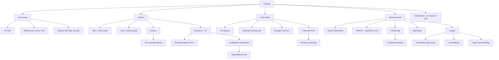

---

## 22. 核心结论

1. **Cache 是高速、临时、best-effort 的 derived storage；state 可从 origin 重建。**
2. **缓存适合小 hot working set 被大量重复访问的 workload。**
3. **Hit ratio 受可缓存对象全集、重复访问概率和 cache size 影响，但还应看 byte/work offload。**
4. **Origin load 近似 $\lambda(1-H)$；高 hit ratio 会放大 cache outage 的流量 cliff。**
5. **越靠上层 cache，越能跳过更多 downstream work，但 privacy/invalidation 更分散。**
6. **Cache 是 optimization；cache miss/outage 时系统应存活，允许变慢或 shed。**
7. **Side cache 由 application 处理 miss/fill；inline cache 代表 application 访问 origin。**
8. **Side/inline 与 local/external 是两个正交分类维度。**
9. **Eviction 解决容量压力；expiration 解决时间 freshness；invalidation 响应 source change。**
10. **LRU 利用 temporal locality，但 scan、频率、大小和 miss cost 可使它非最优。**
11. **TTL 越长通常 hit 越高、stale 风险越高；TTL 是 invalidation 的时间上界 workaround。**
12. **Expired entry 可 lazy delete；origin down 时可按业务和最大 stale bound 返回旧值。**
13. **Query-result invalidation 难在依赖发现、消息 delivery 和并发 fill/write race。**
14. **Local cache latency最低，却重复 working set，并让不同 clients 观察不同 versions。**
15. **$N$ 个 1 GB local caches 物理占 $N$ GB；内容高度重复时 unique capacity 可能约 1 GB。**
16. **Thundering herd 来自 cold start、同步过期、hot key、failure 和 purge。**
17. **Per-client request coalescing 将单 client 每 key outstanding fetch 限为 1，但全局仍可有 $N$ 次。**
18. **External cache 共享 entries/fills，减少重复，可通过 partitioning/replication 扩展。**
19. **共享 cache 只缩小副本分散，并不自动强一致；它仍可相对 origin stale。**
20. **Consistent hashing 减少 rebalance remapping，从而降低 cold-cache 和 origin refill 冲击。**
21. **External cache 增加 network latency、serialization、维护成本和共享故障域。**
22. **External cache outage 后全量 bypass 可将 origin load 放大为 $1/(1-H)$ 倍。**
23. **Local L1 可防 external L2 outage，但 origin 仍需 concurrency/rate limit 与 load shedding。**
24. **Recovery 也要渐进 warmup、singleflight 和 jitter，避免 refill storm。**

---

## 23. 一般化的解决问题方法

### 23.1 先找重复工作，再引入副本

证明相同结果被高频重复计算/读取，并量化 reuse、cost 和 stale tolerance。没有 locality，cache 只是新复杂度。

### 23.2 明确 authoritative state

每个副本系统先问：谁能接受 writes，谁可丢弃，谁负责恢复。Cache 与 replica/database 的边界由 contract 而非产品名决定。

### 23.3 将性能公式转成 failure multiplier

命中率不仅是收益：

$$
NormalOriginFraction=1-H
$$

$$
OutageMultiplier=\frac{1}{1-H}
$$

优化越成功，失效 cliff 可能越陡。

### 23.4 分离四个 policy 问题

```text
admission: should it enter?
eviction: what leaves for capacity?
expiration: when is it no longer fresh?
invalidation: what source change makes it obsolete?
```

不要用一个 TTL 代替全部 reasoning。

### 23.5 把 stale 当业务语义，而不是技术布尔值

对 catalog，旧一分钟可能可接受；对权限撤销，旧一秒也可能危险。按数据类别定义 freshness 和 stale-on-error。

### 23.6 对所有 fill 路径做并发分析

画出 miss、origin read、write、invalidate、SET 的 interleaving。分布式 cache 最难的 bug 往往不是 lookup，而是 race。

### 23.7 用 hierarchy 同时获取低延迟和共享 locality

Local L1 提供速度/outage buffer，external L2 提供共享容量和 global collapse。用 conditional hit ratio 计算 origin load，不重复计数。

### 23.8 将 cache miss 当作受限资源

Miss 会消耗 origin capacity。为它设置 per-key singleflight、global concurrency、priority、deadline 和 retry budget，就像管理 thread/connection pool。

### 23.9 将 rebalancing 视为 cache-coherence 事件

Membership change 不只搬 memory，还改变 hit ratio和 origin load。最小化 remap，预热 hot set，并限速 recovery。

### 23.10 先设计无 cache 模式，再上线 cache

做 cold-cache、flush、outage load test；定义 stale、shed、fallback 和 gradual recovery。Cache-disabled path 很少运行，更需要演练。

最终方法可压缩为：

```text
measure repeated expensive reads and working-set locality
-> define origin truth and acceptable staleness
-> estimate hit, latency, work savings, and outage multiplier
-> choose side/inline and local/external topology
-> define admission, eviction, expiration, and invalidation separately
-> coalesce concurrent fills and jitter expiry
-> version entries and analyze write/read races
-> partition/rebalance with minimal remapping
-> protect the origin with stale fallback, limits, and shedding
-> test cold start, cache outage, and gradual recovery
```
