> 本文严格沿原章顺序展开：先从 Cruder monolith 随业务和团队增长产生的耦合出发，说明 independently deployable services、API boundary、small-team ownership 和独立 data model；再逐项讨论 tech stack、remote communication、distributed monolith、resource provisioning、testing、operations、observability 和 eventual consistency；最后分析 API gateway 的 routing、composition、translation、GraphQL、cache/rate limit、session、authentication/authorization、opaque/transparent token、JWT、API key 与 gateway caveats。原章正文约 11 页；文中的团队通信边数、组合调用可用性/延迟、服务边界判据、契约演化、故障预算、安全边界和 C11 gateway 模拟用于补足推导与现代工程边界，不应误认为原书逐字给出的组织设计、JWT 标准细节或生产 gateway 配置。

## 0. 导读：Microservices 首先扩展的是组织，而不是请求吞吐

### 0.1 从技术扩展转向开发扩展

Part III 前几章主要扩展运行时：

- CDN/file store 减少 application 工作；
- Load balancer 复制 stateless compute；
- Database replication/partitioning 扩展 data layer；
- Cache 减少重复读取。

即使系统能服务更多 traffic，单一 codebase 和 release train 仍可能限制开发速度。Chapter 21 改问：

> 当业务组件和开发团队持续增加时，如何让多个团队独立理解、修改、部署和运营系统？

### 0.2 Monolith 与 microservices 解决的是不同维度

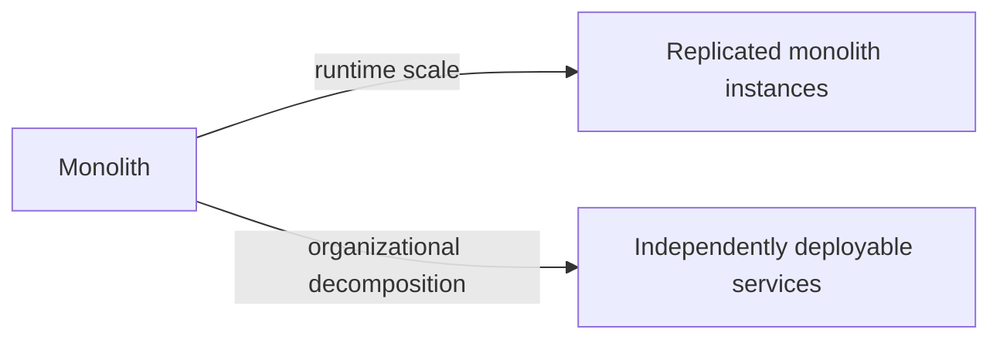

- 负载均衡后的 monolith 也能 horizontal scale；
- Microservices 不自动提高单请求性能，remote calls 往往更慢；
- Microservices 的主要价值是 ownership、release independence 和边界；
- 只有边界真的解耦时，团队才可并行演化。

### 0.3 本章的核心判断

采用 microservices 不是把每个 class/module 变成 network service，而是判断：

$$
OrganizationalBenefit>
DistributedSystemsComplexity+OperationalOverhead
$$

当只有一个小团队、领域仍在探索、边界频繁变化时，右侧通常更大；当许多团队需要独立发布成熟业务能力时，左侧可能更大。

### 0.4 一条贯穿全章的因果链

```text
business and team growth
-> monolith coupling and shared release contention
-> services create hard API boundaries
-> small teams gain ownership and autonomy
-> network, data, testing, operations complexity rises
-> API gateway hides internal decomposition from external clients
-> gateway itself becomes coupled infrastructure that must scale
```

---

## 1. Monolith 随业务增长发生什么

### 1.1 Figure 21.1：多个组件仍在一个 application 中

原书以 Cruder 为例。业务成功后不断加入 components：

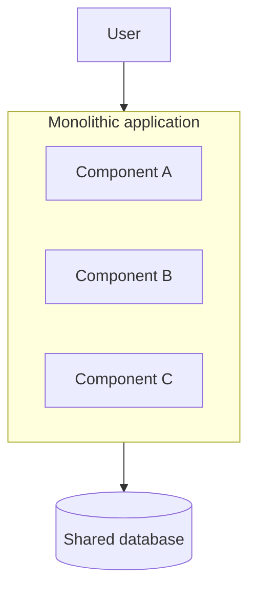

Figure 21.1 不是说 componentization 无价值，而是说明 logical modules 仍共享：

- Process/address space；
- Build artifact；
- Deployment schedule；
- Failure resources；
- Often one data model/store；
- Organization-wide release coordination。

### 1.2 理解成本上升

Components 随时间 increasingly coupled：

- Developer 修改 A，却触发 B/C assumptions；
- Hidden call/data dependencies；
- Shared utilities 变成全局耦合点；
- Tests/build 变慢；
- Nobody fully understands the whole system；
- New feature/bug fix lead time 增长。

这不是“代码行数大就一定坏”。一个 modular monolith 若边界清楚、tests 快、ownership 明确，可能比同规模 distributed system 更容易理解。

### 1.3 Shared deployment 的 blast radius

Monolith 中 component change 可能要求整套 rebuild/deploy。新版本若有 memory/socket leak：

- 同 process 的无关 components 共享 CPU/memory/file descriptors；
- 整个 application performance 下降；
- Rollback 撤销所有 teams 同批 changes；
- Release train 被一个 defect 阻塞；
- Developer velocity 的影响跨团队传播。

可把 deployment blast radius 写成：

$$
BlastRadius(change)\approx
ComponentsSharingArtifactAndRuntime
$$

Microservices 试图缩小这个集合，但会新增 network/dependency blast radius。

### 1.4 Monolith 的真实优势

原章聚焦 growing pains；做决策时也要看到 monolith 的收益：

- In-process call 低 latency、类型/transaction boundary 简单；
- 一次本地 debug 可跨 modules；
- 一个 deploy pipeline；
- Refactor boundary 较容易；
- 单 database transaction/constraints；
- Integration tests 更直接；
- 较少 service discovery、network policy 和 telemetry。

因此作者最后建议从 monolith 开始，而非默认从 microservices 开始。

---

## 2. Functional decomposition 为 independently deployable services

### 2.1 Figure 21.2

缓解 monolith growing pains 的方法：按功能拆成 services，通过 APIs 通信：

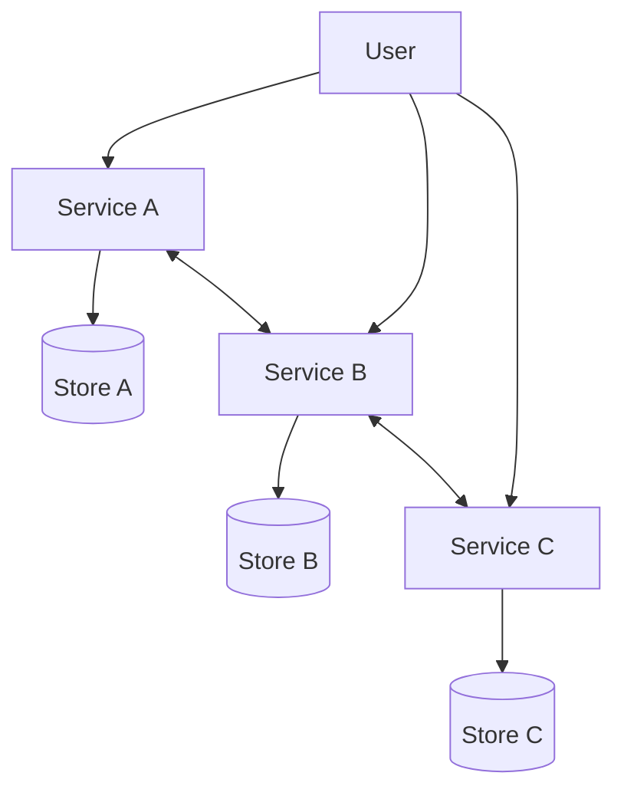

Figure 21.2 强调：

- Services independently deployable；
- APIs 是明确 boundary；
- Each service 可有自己的 data store；
- User/client 暂时直接面对多个 services，后文 gateway 会隐藏它们。

### 2.2 API boundary 为什么比进程内 boundary 硬

同 process 中，developer 容易：

- 直接 import 内部 class；
- 访问另一个 module 的 table/object；
- 共享 global state；
- 跨层调用；
- 通过一次 refactor 同时改所有 callers。

Service API 强迫调用跨 serialization/network/protocol：

```text
private implementation | stable contract | remote consumers
```

越过边界更昂贵，因此更难无意违反。但“难违反”不等于无法违反：shared database、shared library、fragile API 和 lockstep deploy 仍能制造紧耦合。

### 2.3 Independently deployable 的含义

一个 service 真正独立部署至少要求：

- Compatible API evolution；
- 不要求 consumers 同时升级；
- Own release pipeline；
- Own runtime/config；
- Data/schema migration 不依赖全系统停机；
- Failure 不要求其他 services 一起 restart；
- Team 有 deploy/rollback authority。

若每次发布 Service A 都必须先发布 B/C，只有多个 repositories/processes，没有获得独立性。

### 2.4 Functional decomposition 不是任意切割

Service boundary 应围绕 cohesive business capability 和 ownership，而不是纯技术 layer：

```text
prefer: Orders service owns order lifecycle
avoid:  Controller service -> Logic service -> Data service for every request
```

后者将一次 local call chain 变成多次 remote calls，却没有减少共同变化，容易成为 distributed monolith。

---

## 3. Small-team ownership 与通信成本

### 3.1 一个 service 由一个小团队 owned and operated

作者强调 team 不只写代码，还运营 service：

- Design/implementation；
- Tests；
- Deploy/rollback；
- On-call/incident；
- Capacity/security；
- API lifecycle；
- Data ownership。

Ownership 如果分散或模糊，service failure 会变成跨团队协调事件，独立性无法兑现。

### 3.2 通信 channel 为何二次增长

一个 $n$ 人 team 中，两两沟通关系数：

$$
E=\binom{n}{2}=\frac{n(n-1)}{2}
$$

例：

| Team size $n$ | Possible pairs $E$ |
| ---: | ---: |
| 5 | 10 |
| 10 | 45 |
| 20 | 190 |

人数从 5 增到 20（4 倍），possible pairs 从 10 增到 190（19 倍）。这解释了“communication overhead grows quadratically”的结构，但不是说每对人每天都沟通，也不能把 formula 当精确 productivity model。

### 3.3 Small service surface 更易理解

Service surface 通常小于整个 application：

- Developer 需要加载的 domain context 少；
- New hire onboarding 较聚焦；
- Tests/build/deploy 较小；
- Ownership 和责任更明确。

但 service 太碎会让理解一个 user flow 必须跨许多 repos/dashboards，局部 cognitive load 降低、全局 cognitive load 上升。

### 3.4 Release autonomy 减少跨团队同步

如果 Team A 控制自己的 codebase/release schedule：

- 不等全公司 release train；
- Bug rollback 只影响 A；
- Experiment/canary 局部进行；
- Change cadence 可按 domain 调整。

前提是 API backward compatible 且 consumers 不 lockstep。

---

## 4. 技术和数据自治

### 4.1 Tech stack freedom

API consumers 不关心内部实现，团队原则上可选择适合的：

- Language/runtime；
- Hardware；
- Database/data model；
- Deployment cadence；
- Internal architecture。

例如 image processing 可用 GPU/C++，billing 可用 relational transaction，search 可用 inverted index。

### 4.2 Polyglot persistence

每个 service 可选择最匹配 use case 的 data store：

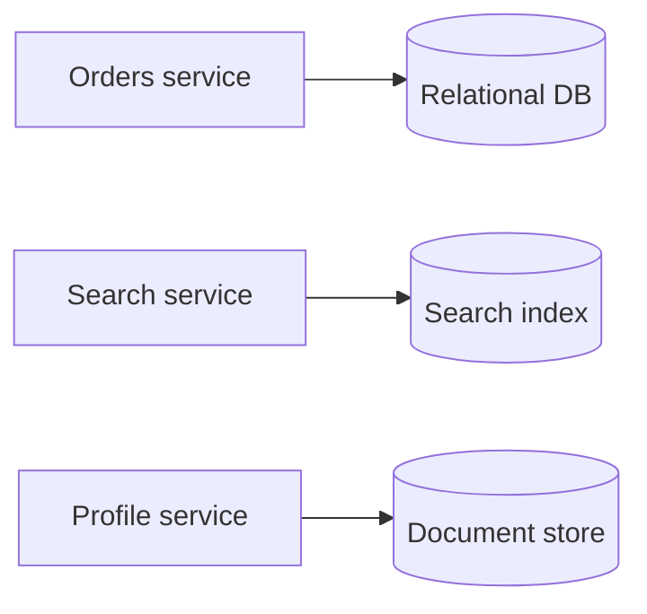

收益是 local fit；成本是：

- 多种 backup/restore；
- Security/patching；
- Driver/library；
- Observability；
- Operator skill；
- Cross-store consistency。

Autonomy 应受 organization 的 platform capability 约束。

### 4.3 “Micro”是误导性的

作者明确说 service 不需要很小。Service 若 functionality 太少，只增加 operational overhead。

Rule of thumb：

- API surface small；
- Encapsulated functionality significant。

这接近“deep module”原则：简单 contract 背后隐藏足够复杂和 cohesive 的实现。

### 4.4 Size 不应按代码行衡量

更有用的边界指标：

- 一个团队能否拥有；
- 业务概念是否 cohesive；
- Change 是否常共同发生；
- Data/invariant 是否局部；
- 能否独立部署；
- 调用是否稳定；
- Failure/capacity 是否需要独立隔离。

一个代码量大的 cohesive service 可能比十个互相锁步的小服务更“microservice-like”。

---

## 5. 21.1 Caveats：复杂度何时值得

作者先总结：拆分 services 为整体增加大量 complexity，只有它能在 many development teams 间 amortize 时才值得。

可用一个概念模型：

$$
Value=
TeamAutonomy+ReleaseIsolation+DomainFocus
-NetworkDataOperationsComplexity
$$

小组织通常没有足够 autonomy benefit 覆盖固定平台成本。

---

## 6. Caveat 1：Tech stack

### 6.1 无限制 polyglot 的代价

每个 service 用不同语言会让 developer 换 team 更难。共同 capability 需要每个语言一套 library：

- Logging；
- Metrics/tracing；
- Authentication；
- Service discovery；
- Retry/timeouts；
- Configuration；
- Serialization；
- Security updates。

若有 $L$ 种 languages、$K$ 项 common capabilities，粗略 integration surface：

$$
SupportUnits\propto L\times K
$$

实际复用/standards 会降低成本，但方向明确：自由度不是免费。

### 6.2 Standardization 与 autonomy 的折中

作者建议一定程度标准化，同时保留自由。方法不是简单禁止，而是提供 recommended portfolio 和更好的 developer experience：

```text
supported paved road
-> templates, libraries, CI/CD, dashboards, security defaults
-> exceptions allowed with explicit ownership
```

团队仍可选择其他技术，但自行承担缺失 platform support 的成本。

### 6.3 Golden path 的边界

标准化应覆盖 cross-cutting interfaces，而不是强迫所有 domain 用同一种 database/algorithm。好的 paved road：

- 默认安全；
- 容易升级；
- Observability built in；
- Escape hatch 清楚；
- Deprecation 有迁移工具。

坏的标准化会成为 central platform bottleneck。

---

## 7. Caveat 2：Communication

### 7.1 Local call 与 remote call 的根本差异

Local function call：

- 同 failure domain/process；
- 通常微秒/纳秒级；
- Typed memory objects；
- Call/return failure 较清楚。

Remote call：

- Serialization/network；
- DNS/discovery/LB；
- Queueing/timeout；
- Partial failure；
- Duplicate/late response；
- Version skew；
- Retry ambiguity。

```text
remote call != slower local call
remote call = distributed protocol
```

### 7.2 Latency amplification

串行调用 $m$ 个 dependencies：

$$
T_{serial}=T_{gateway}+\sum_{i=1}^{m}T_i
$$

可并行时：

$$
T_{parallel}\approx T_{gateway}+\max_i(T_i)+T_{compose}
$$

并行降低 latency，却同时增加 fan-out load、并发、tail/failure exposure。

### 7.3 Availability amplification

若所有 $m$ calls 都 required、独立成功概率为 $a_i$：

$$
A_{composed}=\prod_{i=1}^{m}a_i
$$

若每项 99.9%，10 个 required calls：

$$
0.999^{10}\approx99.0045\%
$$

独立假设不一定成立；shared network/config 会 correlated failure。公式仍说明 fan-out 增加故障面。

### 7.4 Monolith 也不是隔离真空

作者提醒 monolith 仍服务 external requests，也依赖 third-party APIs/database，所以也需 timeout/retry/observability，只是 network edges 较少、scale 较小。

### 7.5 Remote-call budget

每条 user request 应有：

- End-to-end deadline；
- Per-hop timeout；
- Retry budget；
- Concurrency limit；
- Idempotency；
- Backpressure；
- Cancellation propagation。

否则深 call chain 的每层 timeout/retry 会放大 latency 与 load。

---

## 8. Caveat 3：Coupling 与 distributed monolith

### 8.1 Loose coupling 的判据

Service A 的 change 不应要求 B/C 同时 change/deploy。Loose coupling 需要：

- Stable contract；
- Additive evolution；
- Consumer compatibility；
- No shared mutable database；
- No lockstep library update；
- Dynamic discovery；
- Independent release/test。

### 8.2 Distributed monolith

若服务仍 lockstep：

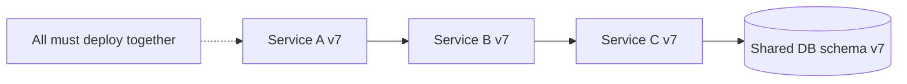

它同时拥有：

- Monolith 的耦合和共同发布；
- Distributed system 的 network/failure/operations complexity。

作者称其比 monolith 复杂一个数量级，是必须避免的失败状态。

### 8.3 Tight coupling 的原章例子

1. Fragile APIs：一改就要求 clients 更新；
2. Shared libraries：多个 services lockstep 升级；
3. Static IP：external service 地址变化即 break。

补充常见原因：

- Shared database tables；
- Synchronous deep call chains；
- Shared deployment pipeline；
- Cross-service transactions everywhere；
- Leaking internal data model；
- Chatty APIs。

### 8.4 API 演化

安全演化倾向：

- Add optional field/endpoint；
- Tolerant reader；
- Explicit deprecation window；
- Consumer-driven contract tests；
- Version only for incompatible change；
- Observe old-field usage；
- Expand/migrate/contract database schema。

“有 API”不等于 decoupled；contract evolution 才决定耦合。

---

## 9. Caveat 4：Resource provisioning

大量独立 services 需要快速、安全地 provision：

- Compute；
- Database/cache/queue；
- Network/DNS/certificate；
- Secret/identity；
- Logging/metrics；
- Backup/quota；
- Environments。

每个 team 自创脚本会造成不可审计 snowflakes。作者因此要求大量 automation。

### 9.1 Platform automation

典型手段：

- Infrastructure as code；
- Service template/scaffolding；
- Self-service portal/API；
- Policy as code；
- Standard CI/CD；
- Managed data services；
- Automatic identity/telemetry。

Provisioning 不只是创建 resource，还要配置、patch、rotate、scale、backup 和 destroy。

### 9.2 Platform team 不应变成 ticket queue

Microservice autonomy 若每次 database/certificate/deploy 都等 central approval，只是把 bottleneck 从 monolith release 移到 platform team。目标是 guarded self-service，而非人工集中控制。

---

## 10. Caveat 5：Testing

### 10.1 单服务测试不一定更难

Service surface 小，可做：

- Unit tests；
- Component tests with local dependencies；
- API contract tests；
- Property tests；
- Fault injection at boundaries。

### 10.2 Integration 更难

微妙行为只在 many services、version skew、production scale 下出现：

- Timeout/retry interaction；
- Event reordering/duplication；
- Partial deploy；
- Schema mismatch；
- Queue backlog；
- Race/eventual consistency；
- Resource saturation；
- Correlated failure。

全系统 end-to-end environment 昂贵、慢且 flaky，也难覆盖所有组合。

### 10.3 分层测试策略

```text
many unit/component tests
-> provider/consumer contract tests
-> focused integration tests
-> few critical end-to-end tests
-> production canary/observability
```

Contract tests 证明接口兼容，不证明生产规模下所有 emergent behavior；两者需结合。

### 10.4 Version matrix

$S$ 个 services、每个允许当前/前一版本两种，理论组合：

$$
2^S
$$

不可能穷举。必须依赖 backward compatibility、contract、incremental rollout 和 telemetry，而不是测试所有全局版本组合。

---

## 11. Caveat 6：Operations 与 observability

### 11.1 Common delivery/deployment path

每个 team 不应重复发明：

- Build/package；
- Vulnerability scan；
- Config/secret；
- Canary/rolling deploy；
- Health/readiness；
- Rollback；
- Audit/change tracking。

Continuous delivery 是独立部署的基础设施，而非附属工具。

### 11.2 为什么 local debugger 不够

一个失败 request 可能经过：

```text
gateway -> service A -> service B -> cache -> database -> queue
```

问题可能只在特定 traffic、versions、timeouts 和 state 下出现，无法把生产整体放到 laptop 单步。

### 11.3 Observability 三支柱和上下文

- Metrics：rates/errors/duration/saturation；
- Logs：structured events；
- Traces：跨服务 causal path。

都需要 common context：

- Request/trace ID；
- User/tenant（安全处理）；
- Service/version/zone；
- Deadline/retry attempt；
- Upstream/downstream status。

没有 correlation ID，日志只是分散文本。

### 11.4 关键 SLO 分解

End-to-end SLO 不能简单分给每个 service 同一值。要看 request graph 和 dependency criticality：

- Required dependency 影响整体 success；
- Optional dependency 可 degrade；
- Cached fallback 改变 failure semantics；
- Shared dependency blast radius 大。

Observability 的目标不是“收集一切”，而是解释 user-visible symptom 与 dependency state 的关系。

---

## 12. Caveat 7：Eventual consistency

### 12.1 Data ownership 分散

Monolith 常有一个 data store；拆分后每个 service own its data：

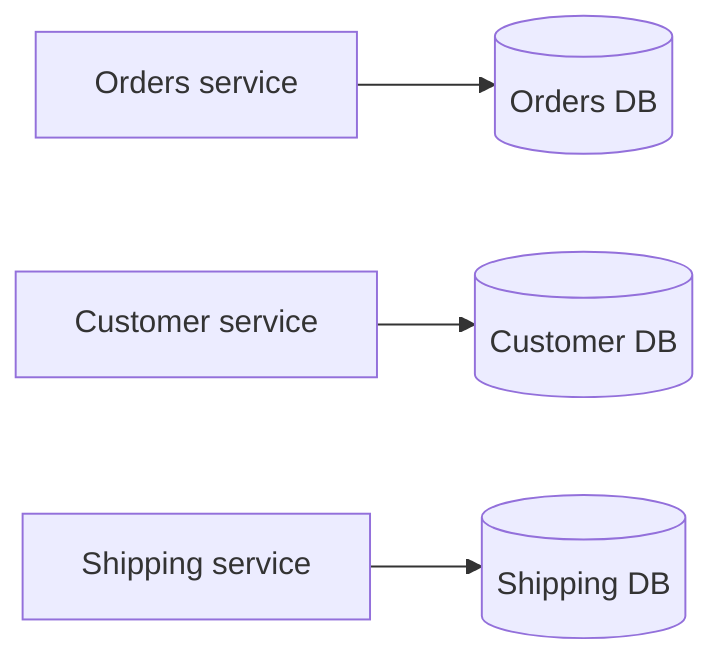

优点是独立 schema/scale；代价是一个 business operation 跨 stores。

### 12.2 为什么不能随意跨库 ACID

Atomic update across services 需要 distributed transaction/2PC，带来：

- Coordination RTT；
- Locks/intents；
- Failure recovery；
- Availability coupling；
- Ownership violation；
- Operational complexity。

作者因此说 microservice architecture 通常需要 embrace eventual consistency。

### 12.3 Eventual consistency 的精确含义

它不是“随便不一致”。需要定义：

- Source of truth per fact；
- Event/command delivery；
- Idempotency/deduplication；
- Ordering/version；
- Acceptable convergence time；
- Conflict/compensation；
- User-visible intermediate states；
- Reconciliation。

### 12.4 前文模式的复用

- Transactional outbox 保证 local state + event atomicity；
- Saga 协调多服务步骤/compensation；
- Semantic lock 暴露 pending state；
- Idempotency key 安全重试；
- Materialized view/query composition 提供 reads。

### 12.5 什么时候仍应强一致

涉及 money、inventory、authorization、uniqueness 等 invariant 时：

- 将 invariant 所需 state 放在同一 service/store；
- 或显式使用 distributed coordination；
- 不要用“microservices 必须 eventual”作为 correctness 借口。

Service boundary 应尽量与 transactional invariant boundary 对齐。

---

## 13. 从 monolith 开始，再逐步 peel off

### 13.1 作者的最终建议

一般最好从 monolith 开始，只有 good reason 时才 decompose。

原因：

- Early domain boundaries 不稳定；
- 小团队不需要跨团队 release independence；
- Distributed platform fixed cost 高；
- Monolith 内移动边界容易；
- 先积累真实 coupling/access/scale evidence。

### 13.2 Modular monolith

在单 deployable 内仍可 componentize：

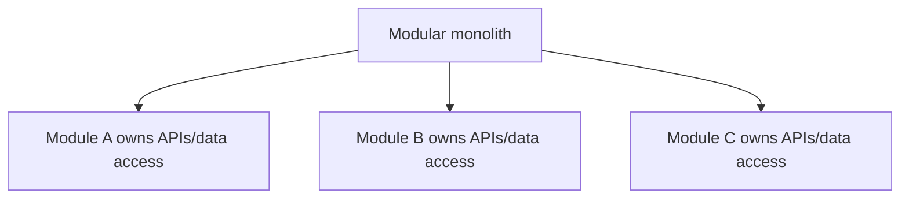

约束：

- Modules 通过 public interfaces；
- 禁止跨 module table/internal import；
- Ownership/tests 清楚；
- Dependency direction enforced。

它让未来 extraction 有 seam，同时保留 local call/transaction simplicity。

### 13.3 何时 peel off

Good reason 可能是：

- 一个 domain/team 需要独立 release cadence；
- Different scale/resource profile；
- Failure isolation；
- Security/compliance boundary；
- Mature stable API boundary；
- Monolith build/deploy contention 已可测；
- 独立 data ownership 已明确。

不好的理由：trend、简历技术、每个 module 都“应该 micro”。

### 13.4 Strangler-style extraction

```text
identify cohesive capability
-> define internal API
-> separate data ownership
-> route selected traffic to new service
-> observe/compare
-> migrate callers
-> delete old implementation
```

一次 peel 一个，控制风险并从真实 extraction 学习 platform needs。

---

## 14. 21.2 API gateway：为什么需要公共 facade

### 14.1 Decomposition 泄露给 client 的问题

若 external client 直接调用 services：

- 一项页面/操作需多 requests；
- Mobile 每次 network call 消耗 battery/radio；
- Client 必须知道 internal DNS/services；
- Internal topology change 要更新 clients；
- 不受控 clients 无法快速升级；
- Public API 一旦发布需维护很久。

### 14.2 加一层 indirection

API gateway 是对 internal services 暴露 stable public API 的 facade/reverse proxy：

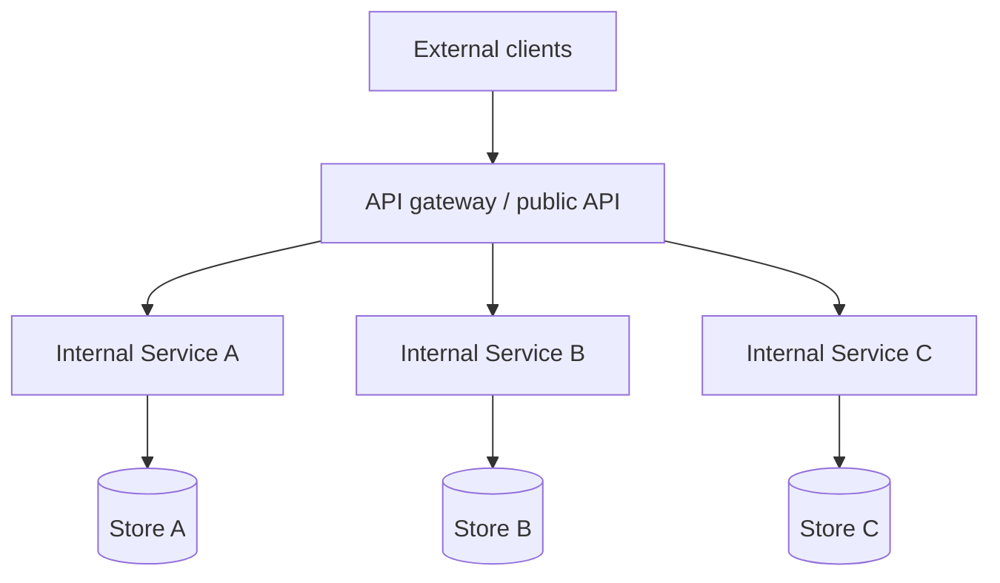

这对应 Figure 21.3。Client contract 与 internal topology 解耦：

```text
stable external endpoint
-> mutable routing/composition/translation
-> internal services
```

### 14.3 Gateway 与 load balancer 的关系

- L4/L7 LB 主要在同一 service 的 instances 间分流；
- API gateway 在不同 service APIs 之间做 public facade、composition/policy；
- 一个产品可同时承担 L7 LB 和 gateway capability；
- Gateway 后每个 service 仍需要自己的 LB/discovery。

---

## 15. 21.2.1 Core responsibility 1：Routing

### 15.1 Routing map

```text
public method/path -> internal service/method/path
```

例如：

```text
GET /v1/customers/{id}
-> CustomerService.GetProfile
```

Internal endpoint 以后改名/拆分，external clients 仍用原 public endpoint；只更新 gateway mapping/adaptor。

### 15.2 Routing dimensions

可按：

- Host/path/method；
- Header/version；
- Tenant/region；
- Experiment/canary；
- Client type；
- Auth scope。

Routing map 是 production correctness config，需要 version、validation、canary、rollback 和 last-known-good。

### 15.3 Indirection 的代价

- 多一 network/proxy hop；
- Gateway config 与 internal APIs 耦合；
- Wrong route blast radius；
- Public compatibility burden；
- Gateway throughput/availability requirement。

Indirection 隐藏变化，不会消除变化成本。

---

## 16. Core responsibility 2：Composition

### 16.1 为什么需要 composition

数据分散在 service-owned stores。Gateway 可提供 high-level API，并行查询多个 services 后 compose response：

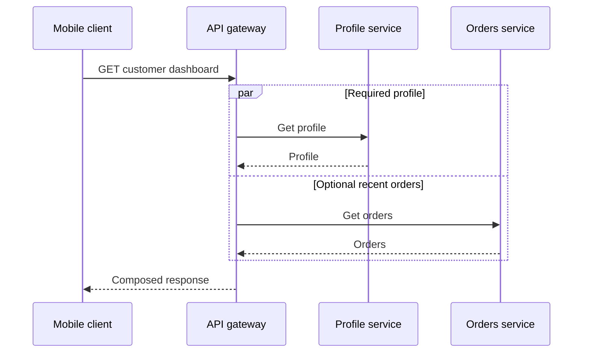

Client 从多次 WAN calls 降为一次，且不知 internal topology。

### 16.2 Availability 下降

若所有 $m$ dependencies 都 required：

$$
A_{compose}=A_G\prod_{i=1}^{m}A_i
$$

若 gateway 和 3 services 各 99.9%：

$$
0.999^4\approx99.6006\%
$$

单个看似三个 9 的组件组合后，API 不再三个 9。

### 16.3 Required 与 optional dependencies

不要默认 all-or-nothing：

- Profile required，失败则 API 失败；
- Recommendations optional，失败可省略；
- Orders 可返回 cached/stale summary；
- Deadline 到时 partial response 带明确标记。

这样整体 semantic availability 高于所有调用都 required，但 client contract 必须允许 degraded response。

### 16.4 Latency

串行：

$$
T_{serial}=T_G+T_P+T_O
$$

并行：

$$
T_{parallel}\approx T_G+\max(T_P,T_O)+T_{compose}
$$

并行需 bounded concurrency，避免一个 request fan-out 数十 calls，造成 gateway memory/connection 和 downstream load amplification。

### 16.5 Data inconsistency

作者指出 updates 可能尚未传播到所有 services，gateway 收到互相矛盾的数据。例如：

```text
Customer service: address=v2
Shipping view: address=v1
```

Gateway 不能凭空知道“正确合并”规则。策略：

- Show version/timestamp；
- Choose authoritative service per field；
- Wait/read-after-write token；
- Return partial/pending state；
- Reconcile asynchronously；
- Avoid composition requiring impossible snapshot consistency。

Gateway 不应成为所有 domain inconsistency 的中央修复器；规则属于 owning domain。

---

## 17. Core responsibility 3：Translation

### 17.1 IPC translation

原章例子：external RESTful HTTP -> internal gRPC。

Gateway 可转换：

- Protocol；
- Serialization JSON/Protobuf；
- Public/internal error model；
- Authentication context；
- Pagination/version；
- Streaming/batching。

### 17.2 Semantic translation 比语法 translation 更难

REST status、gRPC status、timeout/cancellation/retry semantics 不完全一一对应。Gateway 必须保留：

- Idempotency；
- Deadline；
- Error classification；
- Partial response；
- Trace context；
- Client disconnect cancellation。

只做 JSON-to-Protobuf 字段转换不等于 protocol correctness。

### 17.3 Client-specific APIs

Desktop 可显示更多数据；mobile screen 较小、network/battery 更敏感，需要 batching/精简 payload。

可提供：

- Backend for frontend（BFF）；
- Client-type route；
- Versioned representations；
- Field selection；
- Graph-based API。

太多 hand-written client APIs 会复制 logic，因此原章引出 graph-based API。

---

## 18. Graph-based API 与 GraphQL

### 18.1 Schema

Graph API 暴露由 types、fields、relationships 构成的 schema。Client 声明所需数据：

```graphql
query CustomerDashboard($id: ID!) {
  customer(id: $id) {
    fullName
    recentOrders(limit: 5) {
      id
      status
    }
  }
}
```

Gateway/resolvers 将 query 翻译成 internal calls。

### 18.2 收益

- Client 精确取字段，减少 over/under-fetching；
- 不为每种 screen 手写 endpoint；
- Typed discoverable schema；
- Desktop/mobile 自选 shape；
- Gateway 集中 composition。

### 18.3 Restricted query 仍是 API

作者强调 GraphQL 不是“没有 API”：

- Schema 是 contract；
- Query language 受 schema/resolvers 限制；
- Breaking change 仍需治理；
- Authorization 仍按 field/resource；
- Backend cost 仍需限制。

### 18.4 GraphQL 风险

- N+1 backend calls；
- Deep/wide query cost；
- Resolver waterfall；
- Field-level auth；
- Cache key complexity；
- Partial errors；
- Query complexity/DoS；
- Schema ownership。

需要 batching/DataLoader、depth/cost limit、persisted queries、deadline 和 per-field telemetry。原章只介绍基本价值，这些是工程补充。

---

## 19. 21.2.2 Cross-cutting concerns

Gateway 是 reverse proxy，可集中每个 service 否则都要实现的功能：

- Cache frequent resources；
- Rate limit；
- Authentication；
- Request normalization；
- TLS termination；
- Logging/tracing；
- Quota；
- WAF/size limits。

### 19.1 适合集中什么

适合 protocol/edge-wide policy：

- Validate credential/token；
- Per API key quota；
- Header/trace propagation；
- Generic request size/rate limit；
- Public API version/routing。

不宜集中 rich domain logic：

- “这个用户能否退款此订单”；
- Inventory invariant；
- Pricing rule；
- Service-specific data access。

否则 gateway 变成新 monolith。

### 19.2 Rate limiting

Rate limit 保护 internal services。常见 token-bucket 参数：

- Refill rate $r$ requests/s；
- Burst capacity $B$ tokens。

长度 $t$ 的窗口最多允许约：

$$
Allowed(t)\le B+rt
$$

应按 principal/tenant/API/cost，而非只按 source IP；还要防止 gateway 多实例间计数不一致。原章只列出职责，此公式是机制补充。

### 19.3 Gateway caching

Gateway cache 可减少 service calls，但需正确 key：

- Principal/tenant；
- Query/fields；
- Locale/version；
- Authorization visibility；
- Freshness/invalidation。

尤其 GraphQL response cache key 复杂，不能把不同字段集或权限的响应混用。

---

## 20. Authentication 与 authorization

### 20.1 定义

- **Authentication（AuthN）**：验证 principal 是谁；
- **Authorization（AuthZ）**：决定该 principal 能对特定 resource 做什么。

Principal 可是 human 或 application。Roles/scopes/policies 向 principal 授予 permissions。

### 20.2 为什么必须分开

```text
authenticated != authorized
```

知道“这是 Alice”不等于 Alice 可删除任何 order。AuthN 通常跨 API 通用；AuthZ 依赖 resource ownership、state 和 domain rule。

---

## 21. Monolith 中的 session

### 21.1 HTTP stateless 与 application session

HTTP request 本身不记住前一次。Monolith 常创建 session object：

1. 生成 cryptographically strong random session ID；
2. Session object 存 memory cache/external store；
3. ID 通过 HTTP cookie 返回；
4. Client 后续自动携带 cookie；
5. Application 根据 ID 取 principal/roles。

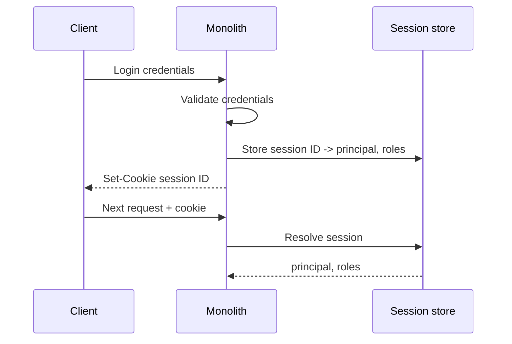

### 21.2 Session security 补充

Cookie 应考虑：

- `Secure`；
- `HttpOnly`；
- `SameSite`；
- Expiry/rotation；
- CSRF；
- Session fixation；
- Logout/revocation；
- Store availability。

原章只建立 session flow，不展开 Web security 全貌。

---

## 22. Microservices 中的安全职责

### 22.1 问题

一个 external request 可能跨多个 services：谁 authentication，谁 authorization？如果每个 service 都重复支持 OAuth/session/API keys，逻辑分散；如果 gateway 决定所有权限，又与每个 domain 深度耦合。

### 22.2 作者的划分

- Gateway authenticate external requests，因为它是入口；
- Individual services authorize domain operations，避免 gateway 耦合 domain logic。

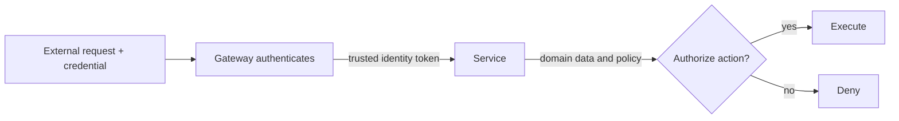

### 22.3 Gateway 不是唯一 trust boundary

Internal services 仍需：

- 验证 token signature/issuer/audience/expiry；
- Authenticate service-to-service channel；
- Reject direct untrusted traffic；
- Least privilege identity；
- Domain authorization；
- Audit decisions。

只因请求来自 internal network 就信任 header 会让 gateway bypass 成为 privilege escalation。

---

## 23. Security token propagation

Gateway authentication 成功后创建/取得 security token，随 request 传给 internal service，service 再按需传 downstream。

Token 应携带或可解析：

- Principal identity；
- Roles/scopes；
- Issuer；
- Audience；
- Expiration；
- Token ID/version；
- Optional tenant/context。

### 23.1 Opaque token

Token 本身不含可用 principal 信息，service 需调用 auth service introspection：

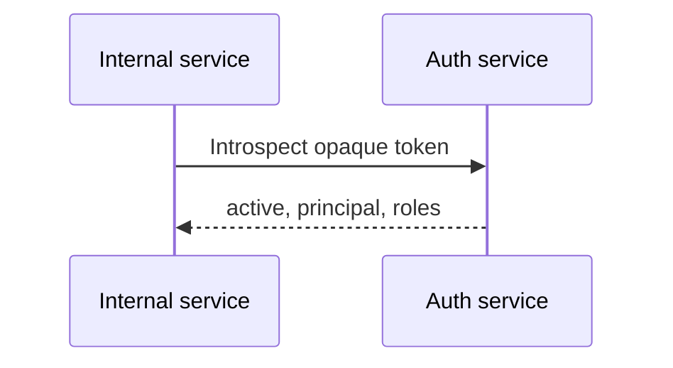

优点：

- Central revocation/current policy；
- Client 不读 claims；
- Token 小/不泄露 details。

代价：

- 每次/缓存后的 external call；
- Auth service latency/availability；
- Introspection cache staleness。

### 23.2 Transparent token

Token 内嵌 claims，service 本地验证 signature 和 claims，无 introspection call。

优点：

- 低 latency；
- Auth service outage 时已签 token 可继续验证；
- 易跨 services propagation。

代价：

- Compromised token 难即时 revoke；
- Claims 在 expiry 前可能 stale；
- Key rotation/distribution；
- Token size/header overhead；
- Sensitive data 暴露给持有者。

### 23.3 Revocation 与 expiry 折中

短 token lifetime 减少 revocation window，但增加 refresh/auth load。常见组合：

- Short-lived access token；
- Longer-lived refresh credential 仅给 client/auth service；
- Key rotation；
- Revocation list/version for high-risk cases；
- Service checks current domain state for critical authorization。

---

## 24. JSON Web Token（JWT）的精确理解

原章将 JWT 作为最常见 transparent token：JSON payload 含 expiration、identity、roles 和 metadata，并由 internal services 信任的 credential 签名，因此可本地验证。

### 24.1 JWT 结构

典型 JWS compact form：

```text
base64url(header).base64url(payload).base64url(signature)
```

### 24.2 “用 certificate 签名”的精确说法

Cryptographic signature 由 private key 生成；certificate 通常绑定 public key 和 issuer identity，services 用可信 public key/certificate 验证。Certificate 本身不是执行签名的秘密。

对称 HMAC JWT 则由 shared secret 签/验，但会让每个 verifier 都持有可签发 token 的 secret，trust boundary 更大。

### 24.3 JWT 不默认加密

Payload base64url encoded，不是 secret。持有 token 的人可读取 claims。不要放 password、secret 或不必要 PII。若需要 confidentiality，要使用合适 encryption/token design。

### 24.4 必须验证的 claims

- Signature algorithm allowlist；
- Signature/key；
- `iss` issuer；
- `aud` audience；
- `exp` expiration；
- `nbf` not-before（若用）；
- Tenant/scope；
- Clock-skew allowance；
- Key ID/rotation policy。

只 decode payload 不叫 validation。

### 24.5 Roles 不是最终 domain authorization

JWT 里 `role=customer` 不能回答“是否拥有 order 123”。Service 仍需读取 domain state，执行 resource-level AuthZ。

---

## 25. API keys

API key 是 custom credential，让 gateway 识别调用 principal/application，并限制其能力。常用于 GitHub/Twitter 一类 public APIs。

### 25.1 典型用途

- Identify developer/application；
- Associate quota/plan；
- Rate limiting/usage metering；
- Revoke/rotate access；
- Scope endpoints。

### 25.2 安全边界

API key 通常是 bearer secret：拿到即可使用。需要：

- TLS；
- Secret storage；
- Hash at rest where possible；
- Prefix/key ID 与 secret 分离；
- Scope/least privilege；
- Rotation/revocation；
- 不写 logs/URLs；
- Abuse detection。

API key 识别 calling application，不一定代表最终 human user；有时仍需 user token。

---

## 26. 21.2.3 API gateway Caveats

### 26.1 Development bottleneck

Gateway 与被保护的 internal APIs 紧密相关。Internal API change 可能要求 gateway mapping/composition 同步变更：

```text
service teams -> gateway team queue -> delayed releases
```

缓解：

- Declarative self-service routes；
- Federated ownership；
- Generated adapters/contracts；
- Backward-compatible internal APIs；
- BFF/domain gateways；
- Policy guardrails rather than central manual coding。

### 26.2 Another service to maintain

Gateway 需要：

- Deploy/patch；
- Config/security；
- Scaling；
- On-call；
- Observability；
- Certificate/key rotation；
- Dependency/timeouts；
- Disaster recovery。

Managed gateway 也不消除 route/policy/security ownership。

### 26.3 Aggregate scale requirement

所有 external request 都经过 gateway：

$$
\lambda_G=\sum_{e\in PublicEndpoints}\lambda_e
$$

这里 $\lambda_e$ 是各 public endpoint 的外部到达率，不能拿 backend service 的调用率直接相加，因为一次 gateway request 可能不调用、调用一个或 fan-out 到多个 services。若平均每个 external request 产生 $f$ 次 internal calls，则 backend 总调用率近似：

$$
\lambda_{backend}\approx f\lambda_G
$$

Gateway 要处理 TLS、auth、parse、rate limit、body、composition，因此 capacity 不只看 request count，还看 bytes、concurrency 和 crypto。

### 26.4 Availability（前瞻补充：原书 Chapter 22）

Chapter 21 只明确指出 gateway 必须承载所有后端 API 的 aggregate request rate；原书到 Chapter 22 开头才进一步指出它是 single logical point of failure，必须 highly available。作为工程上的直接延伸，gateway 不能是 single physical instance：

- Multi-instance/cross-zone；
- L4/L7 LB；
- Stateless data plane；
- Replicated config/control plane；
- Last-known-good config；
- Graceful degradation；
- Capacity headroom。

### 26.5 Build or buy

原章给出：

- 从 NGINX 等 reverse proxy 自建；
- Azure API Management；
- Amazon API Gateway。

选择依据：

- Required protocol/composition；
- Latency/throughput；
- Auth/policy；
- Deployment model；
- Extensibility；
- Managed limits/cost；
- Portability/operations。

当 services/APIs 很多时，作者认为 gateway 通常值得；小系统可能无需提前支付这层成本。

---

## 27. 可运行 C11 示例：Gateway routing、AuthN/AuthZ 与组合降级

### 27.1 模拟目标

程序实现一个最小 public endpoint `/v1/dashboard`：

- Public route 固定，内部 profile route 可从 v1 改到 v2，client contract 不变；
- Gateway 先验证 transparent token 的 issuer、audience、expiry 和 signature flag；
- Profile service 是 required dependency；
- Orders service 是 optional，failure 返回 degraded response；
- Gateway 只做 AuthN，Profile service 根据 subject 做 domain AuthZ；
- Token invalid/unauthorized 时不调用 downstream；
- Required dependency failure 使 composition 失败；
- 所有 output mutation 在完整验证后一次 publish；
- 显式检查字符串截断，不依赖 `assert`。

代码不实现真实 JWT crypto；`signature_valid` 代表合格库已经完成 signature verification，用来聚焦责任边界。

### 27.2 完整代码

```c
#include <stdbool.h>
#include <stddef.h>
#include <stdio.h>
#include <string.h>

enum { TEXT_CAPACITY = 64 };

typedef struct {
    const char *issuer;
    const char *audience;
    const char *subject;
    unsigned long expires_at;
    bool signature_valid;
} Token;

typedef struct {
    const char *owner;
    const char *display_name;
    bool available;
    unsigned int calls;
} ProfileService;

typedef struct {
    const char *summary;
    bool available;
    unsigned int calls;
} OrdersService;

typedef struct {
    char profile_route[TEXT_CAPACITY];
    unsigned int authenticated_requests;
} Gateway;

typedef struct {
    char body[TEXT_CAPACITY];
    bool degraded;
} Response;

typedef enum {
    GATEWAY_OK,
    GATEWAY_UNAUTHENTICATED,
    GATEWAY_FORBIDDEN,
    GATEWAY_UNAVAILABLE,
    GATEWAY_ERROR
} GatewayStatus;

static bool copy_text(char *destination,
                      size_t capacity,
                      const char *source) {
    size_t length;
    if (destination == NULL || source == NULL || capacity == 0) {
        return false;
    }
    length = strlen(source);
    if (length >= capacity) {
        return false;
    }
    memcpy(destination, source, length + 1);
    return true;
}

static bool authenticate(const Token *token, unsigned long now) {
    return token != NULL && token->signature_valid &&
        token->issuer != NULL &&
        strcmp(token->issuer, "https://auth.example") == 0 &&
        token->audience != NULL &&
        strcmp(token->audience, "cruder-api") == 0 &&
        token->subject != NULL && token->subject[0] != '\0' &&
        now < token->expires_at;
}

static GatewayStatus get_profile(ProfileService *service,
                                 const char *subject,
                                 const char **display_name) {
    if (service == NULL || subject == NULL || display_name == NULL) {
        return GATEWAY_ERROR;
    }
    service->calls++;
    if (!service->available) {
        return GATEWAY_UNAVAILABLE;
    }
    if (service->owner == NULL || service->display_name == NULL) {
        return GATEWAY_ERROR;
    }
    if (strcmp(subject, service->owner) != 0) {
        return GATEWAY_FORBIDDEN;
    }
    *display_name = service->display_name;
    return GATEWAY_OK;
}

static bool get_orders(OrdersService *service, const char **summary) {
    if (service == NULL || summary == NULL) {
        return false;
    }
    service->calls++;
    if (!service->available) {
        return false;
    }
    if (service->summary == NULL) {
        return false;
    }
    *summary = service->summary;
    return true;
}

static GatewayStatus dashboard(Gateway *gateway,
                               ProfileService *profile,
                               OrdersService *orders,
                               const Token *token,
                               unsigned long now,
                               Response *response) {
    const char *display_name = NULL;
    const char *order_summary = NULL;
    char composed[TEXT_CAPACITY];
    int written;
    GatewayStatus profile_status;
    bool orders_ok;

    if (gateway == NULL || profile == NULL || orders == NULL ||
        response == NULL || gateway->profile_route[0] == '\0') {
        return GATEWAY_ERROR;
    }
    if (!authenticate(token, now)) {
        return GATEWAY_UNAUTHENTICATED;
    }
    gateway->authenticated_requests++;

    profile_status = get_profile(profile, token->subject,
                                 &display_name);
    if (profile_status != GATEWAY_OK) {
        return profile_status;
    }

    orders_ok = get_orders(orders, &order_summary);
    if (orders_ok) {
        written = snprintf(composed, sizeof composed,
                           "name=%s orders=%s route=%s",
                           display_name, order_summary,
                           gateway->profile_route);
    } else {
        written = snprintf(composed, sizeof composed,
                           "name=%s orders=unavailable route=%s",
                           display_name, gateway->profile_route);
    }
    if (written < 0 || (size_t)written >= sizeof composed) {
        return GATEWAY_ERROR;
    }

    if (!copy_text(response->body, sizeof response->body, composed)) {
        return GATEWAY_ERROR;
    }
    response->degraded = !orders_ok;
    return GATEWAY_OK;
}

static const char *status_name(GatewayStatus status) {
    switch (status) {
        case GATEWAY_OK:
            return "ok";
        case GATEWAY_UNAUTHENTICATED:
            return "unauthenticated";
        case GATEWAY_FORBIDDEN:
            return "forbidden";
        case GATEWAY_UNAVAILABLE:
            return "unavailable";
        case GATEWAY_ERROR:
            return "error";
    }
    return "error";
}

int main(void) {
    Gateway gateway = {{0}, 0};
    ProfileService profile = {
        "alice", "Alice", true, 0
    };
    OrdersService orders = {"2-recent", true, 0};
    const Token alice = {
        "https://auth.example", "cruder-api", "alice", 100, true
    };
    const Token bob = {
        "https://auth.example", "cruder-api", "bob", 100, true
    };
    const Token expired = {
        "https://auth.example", "cruder-api", "alice", 10, true
    };
    Response response = {{0}, false};
    GatewayStatus status;

    if (!copy_text(gateway.profile_route,
                   sizeof gateway.profile_route,
                   "ProfileService.GetV1")) {
        return 1;
    }

    status = dashboard(&gateway, &profile, &orders,
                       &alice, 20, &response);
    if (status != GATEWAY_OK || response.degraded ||
        strcmp(response.body,
               "name=Alice orders=2-recent "
               "route=ProfileService.GetV1") != 0) {
        return 1;
    }
    printf("first status=%s degraded=%d body=%s\n",
           status_name(status), response.degraded ? 1 : 0,
           response.body);

    if (!copy_text(gateway.profile_route,
                   sizeof gateway.profile_route,
                   "ProfileService.GetV2")) {
        return 1;
    }
    orders.available = false;
    status = dashboard(&gateway, &profile, &orders,
                       &alice, 21, &response);
    if (status != GATEWAY_OK || !response.degraded ||
        strcmp(response.body,
               "name=Alice orders=unavailable "
               "route=ProfileService.GetV2") != 0) {
        return 1;
    }
    printf("optional_failure status=%s degraded=%d body=%s\n",
           status_name(status), response.degraded ? 1 : 0,
           response.body);

    status = dashboard(&gateway, &profile, &orders,
                       &expired, 20, &response);
    if (status != GATEWAY_UNAUTHENTICATED ||
        profile.calls != 2 || orders.calls != 2) {
        return 1; /* invalid token is rejected at the edge */
    }

    status = dashboard(&gateway, &profile, &orders,
                       &bob, 22, &response);
    if (status != GATEWAY_FORBIDDEN ||
        profile.calls != 3 || orders.calls != 2) {
        return 1; /* service owns resource authorization */
    }

    profile.available = false;
    status = dashboard(&gateway, &profile, &orders,
                       &alice, 23, &response);
    if (status != GATEWAY_UNAVAILABLE || profile.calls != 4 ||
        orders.calls != 2) {
        return 1; /* optional call is skipped after required failure */
    }

    printf("guards expired=%s unauthorized=%s required_down=%s "
           "authenticated=%u profile_calls=%u order_calls=%u\n",
           status_name(GATEWAY_UNAUTHENTICATED),
           status_name(GATEWAY_FORBIDDEN),
           status_name(GATEWAY_UNAVAILABLE),
           gateway.authenticated_requests,
           profile.calls, orders.calls);
    return 0;
}
```

### 27.3 编译运行

```bash
gcc -std=c11 -Wall -Wextra -Werror -pedantic gateway.c -o gateway
./gateway
```

关键输出：

```text
first status=ok degraded=0 body=name=Alice orders=2-recent route=ProfileService.GetV1
optional_failure status=ok degraded=1 body=name=Alice orders=unavailable route=ProfileService.GetV2
guards expired=unauthenticated unauthorized=forbidden required_down=unavailable authenticated=4 profile_calls=4 order_calls=2
```

### 27.4 代码与原理的对应

| 代码 | 架构概念 |
| --- | --- |
| `profile_route` | Public endpoint 背后的 mutable routing map |
| `authenticate` | Gateway edge AuthN |
| `get_profile` subject check | Service-owned domain AuthZ |
| Profile status | Required dependency |
| Orders boolean | Optional dependency/degraded response |
| `Response` temporary composition | 验证完整后才 publish output |
| Call counters | Guard/failure 后是否错误 fan-out |

Internal profile route 从 V1 改为 V2，模拟 public `/v1/dashboard` 不变而 implementation mapping 演化。Orders failure 不拖垮 required profile；profile failure 后不再调用 orders。

### 27.5 代码局限

- 无真实 HTTP/gRPC/network/parallelism；
- 无真实 JWT parsing/signature crypto；
- `signature_valid` 只代表 trusted validation result；
- 无 roles/scopes、key rotation、clock skew；
- 无 timeout/deadline/retry/circuit breaker；
- Composition string 只是教学 payload；
- Optional failure policy 固定；
- Single process，不模拟 gateway scale/HA；
- 无 data-version inconsistency；
- 无 rate-limit/cache/GraphQL。

因此程序验证 responsibility boundary 与 failure policy，不是 production API gateway。

---

## 28. 容易混淆的概念

### 28.1 Microservices 与 horizontal scaling

Monolith 可多实例 scale；microservices 首要解决 independent ownership/deployment，不自动提高 runtime throughput。

### 28.2 Modular monolith 与 distributed monolith

- Modular monolith：一个 deployable，内部边界清楚；
- Distributed monolith：多个 deployables，但 API/data/release 锁步。

前者常是好起点，后者是两边缺点的组合。

### 28.3 Service size 与 API depth

“Micro”不要求少量代码。Small API + significant encapsulated functionality 比服务数量更重要。

### 28.4 Team autonomy 与技术无政府状态

Autonomy 在 supported platform/standards 上运作；无限 tech stacks 会让 shared capability 和人才流动昂贵。

### 28.5 Service API 与 loose coupling

Network endpoint 只是形式。Fragile contract、shared DB、lockstep library/deploy 仍是 tight coupling。

### 28.6 API gateway 与 service mesh

- Gateway 主要 north-south external/public API；
- Service mesh 主要 east-west service-to-service traffic；
- 两者可共享 proxy 技术，但 trust、routing 和 ownership 不同。

### 28.7 API gateway 与 load balancer

LB 在 replicas 间选 instance；gateway 在 service APIs 间做 facade/composition/policy。产品可组合两者。

### 28.8 Composition 与 distributed transaction

Composition 拼 read responses，不保证跨 services snapshot/atomicity。2PC/Saga 是 update coordination。

### 28.9 Translation 与 tunneling

Translation 理解并映射两种 protocol semantics；简单转发 bytes 不等于 REST/gRPC 正确转换。

### 28.10 Authentication 与 authorization

AuthN 是身份，AuthZ 是 resource/action permission。Gateway 认证后，service 仍需 domain 授权。

### 28.11 Opaque 与 encrypted token

Opaque 表示 consumer 不解释，不一定加密；transparent JWT payload 通常可读，也不一定加密。

### 28.12 JWT 与 session

JWT 可减少 central lookup，但不是天然比 session 安全。Revocation、size、claim staleness 与 key rotation不同。

### 28.13 API key 与 user identity

API key 常识别 calling application；不一定证明某个人类用户身份。

### 28.14 Eventual consistency 与无一致性

Eventual 需要 convergence/order/idempotency/reconciliation contract，不是忽略冲突。

---

## 29. 常见误区与失败模式

### 29.1 “Microservices 天然更 scalable”

它可能增加 network calls 和 shared dependency pressure。按 service 独立 scale 是能力，不是自动结果。

### 29.2 “一张表/一个 class 对应一个 service”

过细 CRUD services 缺乏 significant functionality，制造 chatty calls 和 distributed transaction。

### 29.3 “每个团队自由选技术就是自治”

没有 paved road 会产生 unsupported stacks、security lag 和 duplicated libraries。

### 29.4 “把 function call 改 HTTP 就完成拆分”

Remote call 有 timeout、retry、partial failure、version 和 observability，必须重设 protocol。

### 29.5 “Shared library 能统一所有 services”

频繁 breaking shared library 会要求 lockstep upgrade。稳定 protocol/client 或 sidecar/platform service 更适合部分 cross-cutting concern。

### 29.6 “每个 service own repo 就解耦”

如果 shared DB、release 或 API 仍锁步，repo 数不改变 coupling。

### 29.7 “E2E tests 可以保证整个 microservice system”

Version/failure/state 组合爆炸，E2E 会慢和 flaky。需要 contract、component、canary 和 production telemetry。

### 29.8 “有 logs 就有 observability”

没有 traces/context/SLO，无法从 user failure 找到跨服务 causal path。

### 29.9 “Eventual consistency 会自己收敛”

Lost event、poison message、ordering 和 non-idempotent handler 会阻止收敛。需 repair/reconciliation。

### 29.10 “一开始就拆 microservices 为未来做准备”

未知边界会高成本固化；先 modular monolith，等真实 team/scale pain 再拆。

### 29.11 “API gateway 隐藏所有内部变化”

Semantic breaking change、data ownership 和 gateway adaptor 仍需迁移。Indirection 不是免费兼容。

### 29.12 “Gateway composition 总比 client 多请求快”

Gateway 可并行和靠近 services，但 fan-out、tail 和 composition CPU 也可能更慢。需测量。

### 29.13 “GraphQL 让 client 想查什么就查什么”

Schema/resolvers/cost/auth 都是 API boundary；无限 query 会 DoS backend。

### 29.14 “在 gateway 写 authorization 最集中”

Gateway 不拥有 domain state，会与每个 service logic 紧耦合。入口可做 coarse scope，最终 AuthZ 留 service。

### 29.15 “JWT 签名意味着 payload 保密”

签名提供 integrity/authenticity，不提供 confidentiality。Payload 常可读取。

### 29.16 “JWT 不需要 revocation”

Compromise 时仍需短 expiry、rotation、revocation/version 或 domain check。

### 29.17 “Gateway 是 managed service，所以无限容量/可用”

仍有 quota、region、config error、dependency、cost 和 latency；需 capacity/failure plan。

### 29.18 “Gateway 应实现所有 cross-cutting 和业务逻辑”

会形成新的 edge monolith/development bottleneck。只集中 truly generic edge policy。

---

## 30. 如何设计 microservice architecture

### 第一步：证明组织/交付瓶颈

量化：

- Team/repository ownership conflict；
- Build/deploy lead time；
- Release coordination；
- Change failure blast radius；
- Onboarding/cognitive load；
- Independent scale/security need。

如果瓶颈只是慢 query，不要用 microservices 治疗。

### 第二步：先模块化 monolith

建立：

- Module API；
- Dependency rule；
- Data ownership；
- Tests；
- Ownership；
- No cross-module internals。

验证 boundary 是否稳定且 meaningful。

### 第三步：选择 extraction boundary

优先：

- Cohesive business capability；
- 独立团队；
- 独立 release/scale；
- Clear data ownership；
- Few stable dependencies；
- 可接受 consistency boundary。

### 第四步：定义 API contract

记录：

- Request/response schema；
- Version/evolution；
- Errors；
- Idempotency；
- Deadline/retry；
- Pagination；
- Consistency；
- AuthN/AuthZ；
- Deprecation。

### 第五步：分离数据所有权

一个 fact 一个 authoritative owner。禁止其他 services 直接访问其 table；通过 API/events/materialized views 共享。

### 第六步：设计 consistency workflow

对跨服务 operation：

- Invariant 是否可重划边界；
- Saga/compensation；
- Outbox；
- Idempotency；
- Pending user state；
- Reconciliation；
- Strong coordination when required。

### 第七步：建立 paved road

提供 service template、CI/CD、identity、discovery、secrets、telemetry、health、deployment 和 standard libraries。

### 第八步：设计 failure contract

每个 dependency 定义：

- Required/optional；
- Timeout/deadline；
- Retry budget；
- Circuit breaker；
- Fallback/stale；
- Load shedding；
- Cancellation。

### 第九步：建立测试策略

Unit/component 为主，contract 保兼容，focused integration 验证边界，少量 E2E 验证 critical journeys；canary 和 observability 捕获 scale emergence。

### 第十步：设计 API gateway

列出：

- Public routes/lifecycle；
- Composition graph；
- Required/optional dependencies；
- Protocol translation；
- AuthN/token propagation；
- Generic rate/cache policy；
- Capacity/HA；
- Ownership/self-service config。

### 第十一步：保护 security boundary

验证 token signature、issuer、audience、expiry；internal channel 身份；service domain AuthZ；key rotation；API key scope；audit；防 header spoofing。

### 第十二步：控制 gateway coupling

使用 declarative route、service-owned adapter/config、backward-compatible API 和 federated ownership，避免 central team queue。

### 第十三步：可观测性与 SLO

统一 trace context；按 service/dependency/version/tenant 观察 rate、error、duration、saturation；对 composed APIs 拆 required/optional failure。

### 第十四步：渐进迁移和演练

Canary traffic、shadow compare、rollback；演练 service/gateway/auth/control-plane failure、version skew、event lag、retry storm 和 partial composition。

---

## 31. 作者如何形成解决思路

### 31.1 从业务增长引出认知和发布问题

不是先宣称 microservices 更现代，而是观察 components/teams 增长导致理解、build、deploy 和 rollback 共享成本。

### 31.2 用 API 创造难以越过的边界

Functional decomposition 将软 module boundary 变成 independently deployable service contract。

### 31.3 将 architecture 与 team ownership 对齐

Small team own/operate service，减少 release coordination；通信 channel 二次增长解释为什么不能只扩大同一个团队。

### 31.4 立即否定“越小越好”

Small API 应封装 significant functionality，否则只产生运营开销。

### 31.5 系统列出复杂度税

Tech stack、communication、coupling、provisioning、testing、operations 和 consistency 表明 microservices 是以 distributed complexity 换 team scale。

### 31.6 给出保守 adoption strategy

从 modular monolith 开始，等成熟 boundary 和真实 growing pain，再一次 peel 一个 service。

### 31.7 发现 external client 被内部拆分绑架

Client 多次调用、知道 DNS/topology、难升级，因此引入 public facade。

### 31.8 按职责展开 gateway

Routing 隐藏 endpoint；composition 隐藏 data scatter；translation 隐藏 protocol/client differences；cross-cutting concern 集中 edge policy。

### 31.9 在安全上划清 domain boundary

Gateway AuthN，service AuthZ；opaque token用 lookup 换 revocation，transparent token用 local validation 换 revocation difficulty。

### 31.10 再次用 caveat 收束

Gateway 会成为 development bottleneck、维护对象和 aggregate scale point。服务多时收益可能超过代价，但它不是免费层。

---

## 32. 知识结构

```mermaid
flowchart TD
    M[Microservices]
    M --> WHY[Why decompose]
    WHY --> GC[Growing monolith coupling]
    WHY --> ID[Independent deployment]
    WHY --> T[Small-team ownership]
    T --> Q[Quadratic communication channels]

    M --> B[Boundaries]
    B --> API[Small API surface]
    B --> DEEP[Significant encapsulated functionality]
    B --> DATA[Service-owned data]

    M --> C[Caveats]
    C --> TS[Tech-stack standardization]
    C --> NET[Remote-call nondeterminism]
    C --> DM[Distributed monolith]
    C --> PROV[Provisioning automation]
    C --> TEST[Integration testing]
    C --> OPS[Delivery + observability]
    C --> EC[Eventual consistency]
    C --> START[Start modular monolith]

    M --> G[API gateway]
    G --> R[Routing]
    G --> COMP[Composition]
    COMP --> AV[Availability/tail/data mismatch]
    G --> TR[REST/gRPC/client translation]
    TR --> GRAPH[GraphQL schema/query]
    G --> CC[Cross-cutting concerns]
    CC --> CACHE[Cache/rate limit]
    CC --> AUTH[Authentication]
    AUTH --> OPAQUE[Opaque token]
    AUTH --> JWT[Transparent JWT]
    G --> AZ[Services authorize domain actions]
    G --> GCAV[Gateway bottleneck/scale/HA]
```

---

## 33. 核心结论

1. **Microservices 首要扩展团队独立交付能力，不自动提高运行时吞吐。**
2. **Monolith 随增长会出现认知、shared build/deploy、resource 和 rollback blast-radius 问题。**
3. **Microservice 是 independently deployable service，通过 API 建立比进程内 module 更硬的边界。**
4. **真正独立要求兼容 API、独立 release/data/operations，而不只是多个进程或 repositories。**
5. **一个小团队应 own and operate 一个 cohesive service；$n$ 人最多有 $n(n-1)/2$ 对沟通关系。**
6. **Service 可有独立 tech/data stack，但无限 polyglot 会放大 library、人才和运营成本。**
7. **“Micro”不要求小代码量；small API 应封装 significant functionality。**
8. **Microservice complexity 只有能在许多 teams 间摊销时才值得。**
9. **Remote call 是有 partial failure、timeout、retry 和 version 的 protocol，不是慢一点的 function call。**
10. **所有 required fan-out 的 composed availability 近似为各依赖 availability 的乘积。**
11. **Fragile API、lockstep shared library、static address 和 shared DB 会制造 distributed monolith。**
12. **大量 services 需要 self-service provisioning、standard CI/CD 和 paved road。**
13. **Integration/version/failure 组合无法穷举，需要 component、contract、focused E2E、canary 和 observability。**
14. **数据分散使跨服务强 transaction 昂贵；eventual consistency 仍需 outbox、idempotency、ordering 和 reconciliation。**
15. **通常应从 modular monolith 开始，边界成熟且有真实 growing pain 时逐个 peel off。**
16. **API gateway 是 stable public facade/reverse proxy，隐藏 internal services 和 topology。**
17. **Routing map 让 internal endpoint 演化而不破坏 external clients，但 gateway config 本身是 correctness state。**
18. **Composition 减少 client calls，却放大 dependency failure/tail，并可能拼出跨服务不一致数据。**
19. **Gateway 可做 REST/gRPC 和 client-specific translation；GraphQL schema 仍是受限 API contract。**
20. **Generic edge concerns 如 cache、rate limit、AuthN 可集中；rich domain logic/AuthZ 应留在 owning service。**
21. **Authentication 证明身份，authorization 决定对具体 resource/action 的权限。**
22. **Opaque token 用 introspection 换集中 revocation；transparent token 用本地验证换 revocation difficulty。**
23. **JWT signature 通常由 private key 产生、public key/certificate 验证；签名不加密 payload。**
24. **API key 常识别 calling application并绑定 quota/scope，不一定代表 human user。**
25. **Chapter 21 指出 gateway 会成为 development bottleneck、aggregate traffic point 和新运维服务，因此必须 scalable；其 highly available 要求是原书 Chapter 22 开头的前瞻结论。**
26. **服务/API 足够多时 gateway 往往值得；自建 NGINX 或 managed gateway 都不消除 contract/policy ownership。**

---

## 34. 一般化的解决问题方法

### 34.1 先识别要扩展的维度

区分 runtime QPS、data capacity、team throughput、release isolation、security boundary。不同问题需要不同 decomposition。

### 34.2 用 coupling 而不是代码量找边界

观察哪些 capabilities/data/invariants 一起变化，哪些团队需要独立 release/scale。Boundary 应减少跨边界共同变化。

### 34.3 将每个 remote edge 当 protocol

为每条 edge 定义 schema、compatibility、deadline、retry、idempotency、auth、consistency 和 observability。

### 34.4 用乘法检查 fan-out

对 composed call graph 计算 required dependency availability 和 max/sum latency，主动将非关键 dependency 设计为 optional/degraded。

### 34.5 将 autonomy 建在平台上

用 paved road 自动提供安全、部署、identity、telemetry 和资源；允许例外但让 owner 承担完整 lifecycle。

### 34.6 将 transactional boundary 与 service boundary 对齐

把必须强一致的数据放在同一 owner。跨服务流程用 saga/outbox/pending state，强 invariant 必要时协调。

### 34.7 先 modularize，再 distribute

在 monolith 内验证 boundary，等待成熟证据，再 strangler extraction。Network 不会自动修复错误 module design。

### 34.8 用 indirection 稳定 external contract

Gateway 隐藏 topology，但必须限制它的职责：edge policy/facade，而非中央 domain brain。

### 34.9 安全职责分层

入口验证外部 credential，token 携带受限 identity context；每个 service 验证 token/channel并执行 resource AuthZ。

### 34.10 保护新集中点

Gateway/platform/auth/control plane 都会成为共享 dependency。多实例、容量、last-known-good config、rate limit、degradation 和 drills 必不可少。

最终方法可压缩为：

```text
measure organizational and release coupling
-> modularize around cohesive business capabilities
-> extract only mature boundaries with independent ownership
-> treat every remote call as a failure-prone protocol
-> provide paved-road provisioning, delivery, and observability
-> align service, data, and invariant ownership
-> expose a stable public facade through an API gateway
-> make composition dependencies explicitly required or optional
-> authenticate at the edge and authorize in the domain
-> keep gateway logic generic and make the gateway itself scalable
-> validate version skew, partial failure, eventual convergence, and rollback
```
