> 对应原文：Understanding Distributed Systems 2nd edition.md
>
> 本文严格沿原章顺序展开：先从 API gateway 的高可用、高吞吐服务请求与低吞吐、强一致管理请求之间的冲突，引出 data plane/control plane 分离；再分析 hard dependency、static stability 和 scale imbalance；随后依次讨论经 file store 发布全量 snapshot、由 control plane 主动 push、versioned delta 与 snapshot+delta 混合方案；最后用 control theory 的 monitor-compare-action 闭环解释 chain replication 和 CI/CD rollout。原章正文约 7 页；文中的可用性/传播延迟/带宽模型、版本与 epoch、backpressure、constant work、配置安全性、控制器稳定性和 C11 状态机用于补足推导与工程边界，不应误认为原书逐字给出的控制系统算法或生产配置协议。

## 0. 导读：把“决定怎么运行”与“执行每个请求”分开

### 0.1 从 Chapter 21 的 API gateway 继续

API gateway 是所有外部请求的入口：

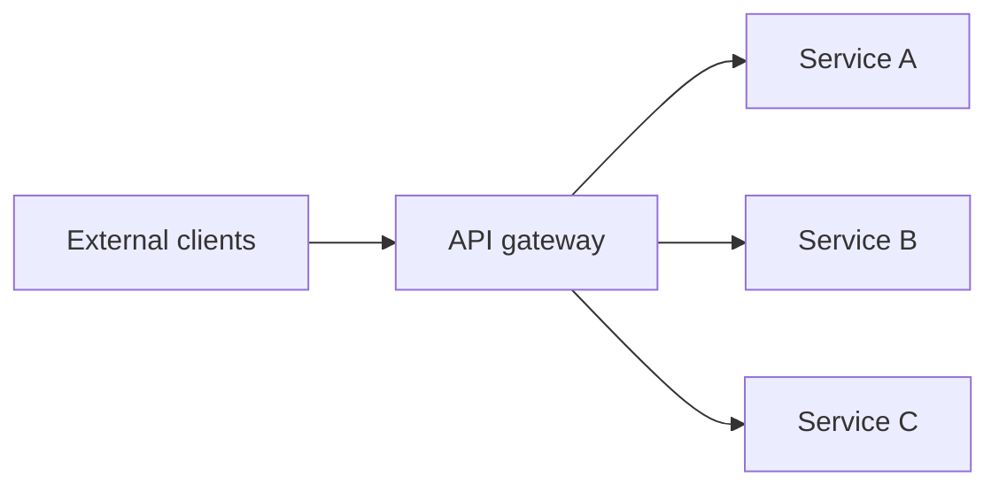

它是 single logical point of failure：gateway 不可用，即使内部 services 全部健康，Cruder 也不可达。因此 gateway 必须：

- highly available；
- fast；
- scalable to all external traffic；
- 在每个 request 的 critical path 上稳定运行。

但 gateway 还有另一类低频工作：添加、删除、配置用于 rate limiting 的 API keys。两类请求的目标不同：

| 维度 | 外部业务请求 | 管理/配置请求 |
| --- | --- | --- |
| 请求量 | 很高 | 很低 |
| Critical path | 是 | 否 |
| 首要目标 | Availability、latency、throughput | Consistency、correctness |
| 典型操作 | Route、authenticate、rate-limit | Add/remove key、change quota |
| 可接受状态 | 短期使用旧配置 | 不应并发写出冲突配置 |

若用同一服务、同一存储和同一一致性路径处理两类工作，会让彼此竞争：高频 data traffic 可能压垮管理状态；强一致管理协调也可能拖慢每个业务请求。

### 0.2 分离方案

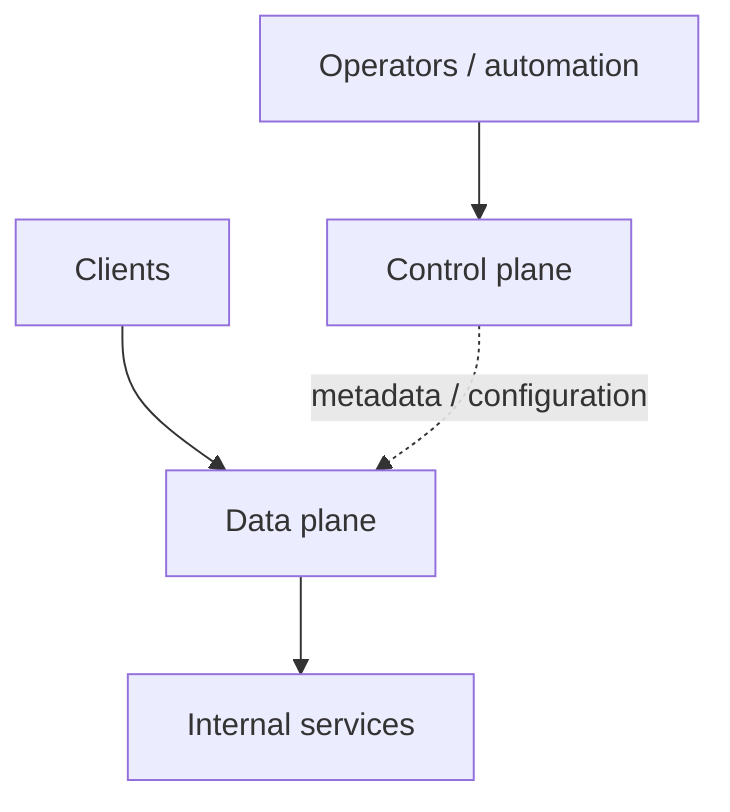

- **Data plane**：执行每个 client request 所需的 critical-path functionality；
- **Control plane**：管理 metadata/configuration，协调复杂、低频 operations，帮助 data plane 工作。

### 0.3 本章最重要的不变量

> Control plane 告诉 data plane 应该如何工作，但不应成为 data plane 每个请求的同步前置条件。

可靠分离要求：

```text
control plane unavailable
-> configuration may temporarily stop evolving
-> data plane continues with last-known-good state
-> serving may be stale or degraded, but does not stop
```

如果 control plane 一失效，data plane 立即停止，物理上虽拆成两个组件，availability 上仍是串联 hard dependency。

### 0.4 本章的完整推理链

```text
serving and management have competing scale/consistency needs
-> separate data and control planes
-> avoid hard dependency with static stability
-> data-plane fleet can overwhelm smaller control plane
-> buffer full snapshots in a scalable file store
-> or let the smaller control plane push at its own pace
-> version and send deltas to reduce latency/load
-> combine startup snapshot with steady-state deltas
-> monitor, compare, and act to close the feedback loop
```

---

## 1. Data plane 与 control plane 是什么

### 1.1 Data plane

原章给出一般定义：任何必须为每个 client request 运行、位于 critical path 的 functionality，都属于 data plane。

典型职责：

- Packet/request forwarding；
- API routing；
- Authentication/token validation；
- Rate-limit decision；
- Storage read/write；
- Cache lookup；
- Applying current policy/configuration。

因为每个 request 都经过它，data plane 必须：

- scale with request rate；
- low latency；
- highly available；
- bounded work per request；
- 尽量少做全局 coordination。

若 client rate 为 $\lambda$，每 request data-plane work 为 $w_d$：

$$
Work_{data}\approx\lambda w_d
$$

所以每个 request 增加一点固定成本，都会在大流量下被放大。

### 1.2 Control plane

Control plane 不在每个 client request 的 critical path。它主要：

- 管理 metadata/configuration；
- 维护 desired state；
- 分配 ownership/placement；
- 协调 failover、rebalance、rollout、scale；
- 向 data plane 发布状态；
- 监控 data plane 是否执行成功。

典型请求量远小于 data plane，但单个操作可能复杂，并需要：

- strong consistency；
- serialization/consensus；
- validation；
- audit；
- durable history；
- conflict prevention。

### 1.3 为什么 control plane 偏 consistency

API key quota 若两个 operators 并发修改，control plane 应提供一个一致、可审计的最终版本。若两个 control-plane replicas 各自接受冲突更新，data-plane instances 可能获得不同策略，造成：

- 不同用户限额；
- 安全策略分裂；
- 路由到错误 backend；
- 同一 partition 出现两个 owners。

因此 control plane 往往在 network partition 时宁可拒绝部分 management writes，也不发布冲突 truth。

这不是说 control plane 可以随意低可用。它仍需容错；只是短期不可修改配置通常比发布矛盾配置更安全。

### 1.4 Plane 是职责，不等于固定进程

Control/data plane 是 architectural role：

- 可由不同 services 实现；
- 也可在同一 binary 中有逻辑分离；
- 一个 application 可有多个独立 planes；
- 同一 component 对一个 workflow 是 control plane，对另一个可能在 data path。

判断标准不是名称，而是：

1. 是否为每个 client request 执行？
2. 是否管理 desired/configuration state？
3. 它失败是否立即阻止 serving？
4. 它的 scale、一致性和 latency 要求是什么？

---

## 2. API gateway 的 plane 分离

### 2.1 Data plane service

Gateway data plane：

- 接收 external request；
- 用已加载的 route/API-key/quota configuration；
- 执行 auth/rate-limit/routing；
- 转发 internal service；
- 返回 response。

它应使用 local/in-memory compiled state 作 hot-path decision，而不是每个 request 调 control-plane database。

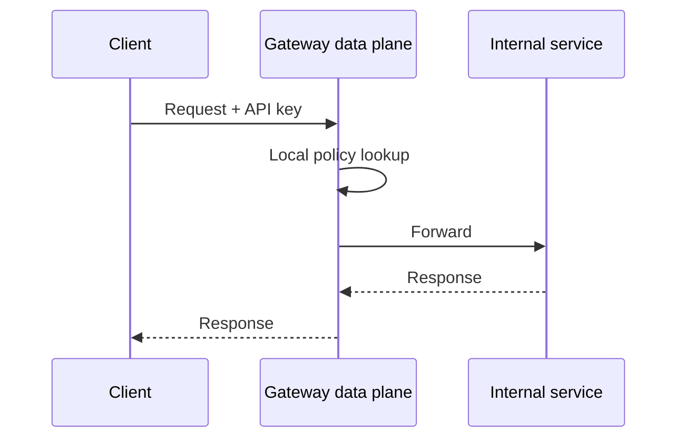

### 2.2 Control plane service

Gateway control plane：

- 创建/删除 API key；
- 修改 quota；
- 编辑 routes/policies；
- 验证 configuration；
- 分配 version；
- 发布到 fleet；
- 观察 rollout status；
- audit/rollback。

### 2.3 为什么不能每请求查询 control plane

若每个 client request 都同步读取 API-key truth：

$$
\lambda_{control}=\lambda_{client}
$$

那么 control plane 被迫与 data plane 同规模，并成为 end-to-end hard dependency。更糟的是，control plane 为一致性使用的 quorum/transaction latency 会进入每个 request。

更好的模式：

```text
control plane validates and versions configuration
-> asynchronously publishes immutable state
-> data plane validates and atomically installs
-> each request reads local installed state
```

### 2.4 配置 stale 的安全边界

Static stability 不意味着任何旧配置都安全。例如：

- Routing old backend：可能暂时可接受；
- Old quota：可能只影响资源公平；
- Revoked credential 仍有效：可能是安全风险；
- Deleted destination 仍被路由：可能大量失败；
- Old encryption policy：可能违反合规。

因此每类 config 要定义：

- Maximum acceptable age；
- Emergency revocation path；
- Fail-open/fail-closed；
- Expiry semantics；
- Safe default；
- Rollback version。

---

## 3. 本书前面已经出现的 control planes

原章用两个例子说明这不是 API gateway 特有模式。

### 3.1 Chain replication

Chapter 10 中：

- Control plane 保存 chain configuration；
- 决定 head、tail、replica order；
- Failure 时 reconfigure chain；
- Data plane 沿当前 chain 处理每个 read/write。

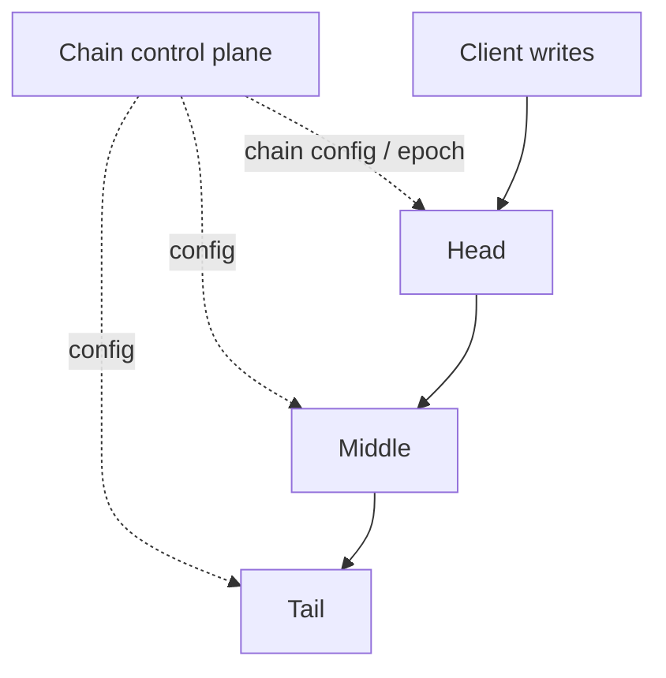

Data plane 不应为每个 write 向 control plane 请求“下一跳是谁”，而应缓存 versioned chain config。

### 3.2 Azure Storage

Chapter 17 中：

- Stream Manager：extent -> storage-server chain；
- Partition Manager：index partition -> partition server；
- Location Service：account -> storage cluster。

Storage/partition/front-end servers 是 data planes，manager 发布 placement/configuration。

### 3.3 一个应用可有多组 planes

原章指出，一个 control plane 可负责 autoscaling，另一个管理 configuration：

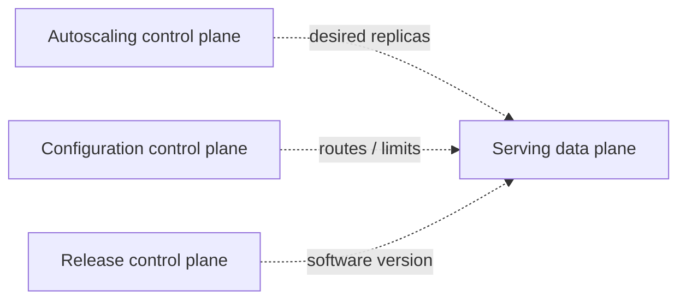

它们可能：

- 有不同 owners；
- 用不同 stores；
- 不同 update rate；
- 不同 failure policy；
- 互相作用并产生 feedback。

多个 controllers 同时改变 capacity/config/release 时，必须避免相互对抗。

---

## 4. Hard dependency 与 availability multiplication

### 4.1 什么是 hard dependency

若 data plane 在 control plane 不可用时停止 serving，data plane hard-depends on control plane。


两者任一失败，整体失败。

### 4.2 串联可用性公式

若 required components 的 availability 独立：

$$
A_{system}=\prod_{i=1}^{n}A_i
$$

原章例子：

$$
A_D=99.99\%=0.9999
$$

$$
A_C=99\%=0.99
$$

$$
A_{system}=0.9999\times0.99=0.989901
\approx98.99\%
$$

高可用 data plane 被低可用 control plane 拉低。

### 4.3 “最多等于最差依赖”

对 $0\le A_i\le1$：

$$
\prod_i A_i\le\min_i A_i
$$

所以 system availability 不可能高于任何 required serial dependency。

### 4.4 独立假设的局限

实际可能更差：

- Shared region/network；
- Bad config 同时破坏 planes；
- Control outage 引起 data restart storm；
- Dependency retry overload；
- Certificate/identity common failure。

也可能因为 local cached state 而不再是严格串联：control plane 短期 outage 时 data plane 仍运行。这正是 static stability 的价值。

---

## 5. Static stability：依赖失效后保持静态运行

### 5.1 定义

原章定义：control plane 暂时不可用时，data plane 应继续使用 stale configuration，而不是停止。这称为 static stability。

```text
before failure: configuration evolves + requests served
during failure: configuration frozen + requests still served
after recovery: reconcile and resume evolution
```

### 5.2 Static stability 不等于完整 functionality

Control outage 期间可能无法：

- Add/remove route；
- Revoke key immediately；
- Scale fleet；
- Repair ownership；
- Roll out software；
- Move partition。

但已有 data path 应继续服务 current config 能覆盖的 requests。

### 5.3 Last-known-good state

Data plane 应持久/缓存：

- Configuration payload；
- Monotonic version；
- Checksum/signature；
- Applied timestamp；
- Schema version；
- Previous rollback version；
- Source/epoch。

Restart 时若 control plane down，可从 local disk 或 durable intermediate store 恢复，而不是空状态启动。

### 5.4 原子安装

不要逐字段修改正在服务的 config。安全模式：

```text
receive candidate
-> validate schema, signature, version, referential integrity
-> compile/build immutable runtime view
-> atomic pointer swap
-> retain previous version for rollback
```

否则 request 可能看到 half-old/half-new state。

### 5.5 Stale age 与 static-stability budget

设最后成功 apply 时间 $t_a$，当前时间 $t$：

$$
ConfigAge=t-t_a
$$

按 config class 定义 $Age_{max}$：

- 超过后仅报警；
- 降级某些 endpoint；
- 对安全配置 fail closed；
- 对普通 route 继续 fail open。

Static stability 是受约束的降级策略，不是永久忽略 control plane。

---

## 6. 22.1 Scale imbalance

### 6.1 为什么 planes 的规模不对称

Data plane instance 数可能为 $N$，每秒处理数百万 requests；control plane 每分钟只发生少量 config writes。

若每个 data-plane instance 每 $T$ 秒 poll 一次：

$$
\lambda_{poll}=\frac{N}{T}
$$

例如 $N=100{,}000$、$T=60s$：

$$
\lambda_{poll}\approx1{,}666.7/s
$$

即使 management writes 只有每分钟一次，control plane 也要回答大量 identical reads。

### 6.2 正常均匀 poll

若 instances 的 poll phases 独立均匀，requests 大致分散。可通过 startup/random jitter：

$$
NextPoll=T+U(-j,j)
$$

减弱同步。

但均匀分布只是 steady-state 假设。

### 6.3 同步启动导致 startup storm

原章例子：所有 data-plane processes 同时 restart，启动时都要 fetch config：

$$
BurstRequests\approx N
$$

若 $100{,}000$ instances 在 10 秒内启动：

$$
\lambda_{startup}\approx10{,}000/s
$$

远高于均匀 poll 的 1,667/s。Massive scale-out、zone recovery、deploy 或 certificate rotation 都可能触发。

### 6.4 更危险的反馈

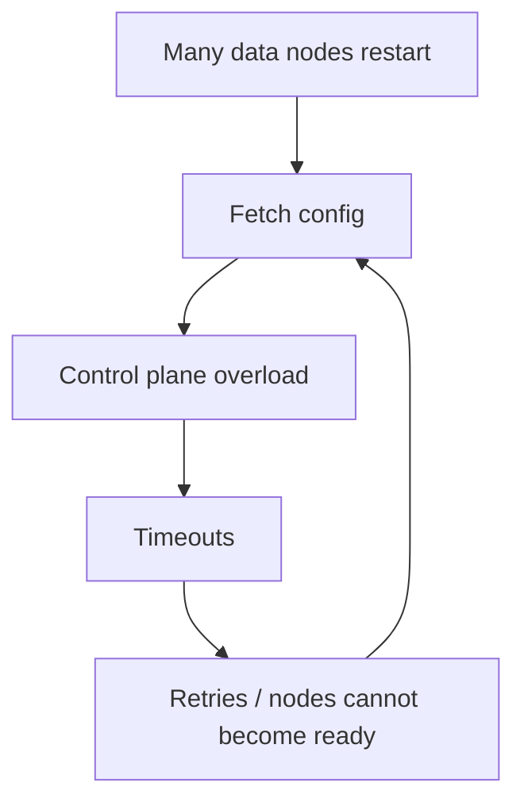

Control plane 过载后：

- latency 上升；
- request overlap 增加；
- clients timeout/retry；
- startup 无法完成；
- healthy capacity 不足；
- autoscaler 可能再加 instances；
- storm 更大。

这是 positive feedback loop。

### 6.5 为什么只扩 control plane 不够

可以加 capacity/rate limit，但 worst-case data-plane fleet 通常比 control plane 大几个数量级。让小系统永久按最大 fleet burst provisioning：

- 昂贵；
- 仍可能被 correlated restart 超过；
- 不消除 hard dependency；
- Control-plane own dependencies 仍可能故障。

更稳健原则是：**put the smaller service in control of work pace**，并用 buffer/indirection 吸收 fan-out。

---

## 7. 方案一：用 scalable file store 缓冲全量 snapshot

### 7.1 Figure 22.1 架构

Control plane 不服务每个 data-plane read，而是周期性把完整 state 写到 Azure Storage/S3 一类 file store；data plane 周期读取：

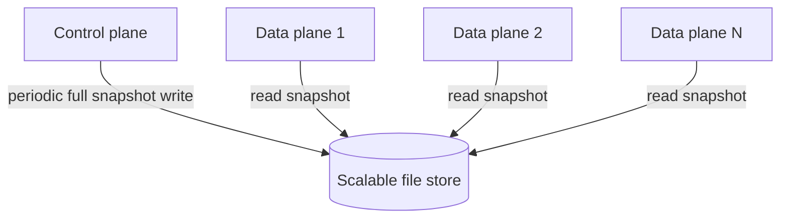

Figure 22.1 的核心是 file store 吸收 $N$ readers，把 control plane write load 变成与 $N$ 无关的 periodic work。

### 7.2 Constant-work 性质

若 control plane 每 interval 发布一次 snapshot，不论 state 是否改变：

$$
ControlPlanePublishWork\approx O(S)
$$

其中 $S$ 是 state size；它与 data-plane instance 数 $N$ 无关。

相比 direct polling：

$$
ControlPlaneReadWork\approx O(N)
$$

这个“始终做固定工作，不根据 demand fan-out”是后续章节还会复用的 constant-work pattern。

### 7.3 为什么全量 dump 看似笨却稳健

- Immutable object 易缓存/复制；
- 不依赖复杂 event history；
- New node 一次读出完整 state；
- Missing previous updates 不影响 snapshot；
- File store 已为大 fan-out/bytes scale；
- Control outage 时 last snapshot 仍存在；
- Rebuild/recovery 简单。

“Smart delta pipeline”可能性能更好，但多了 ordering、gap、retention 和 recovery state。

### 7.4 CQRS 视角

原书脚注把它称为 CQRS 的实践：

- Command/write model：control plane 的 strongly consistent state；
- Query/read model：file-store snapshot，面向大量 data-plane reads。

Read model 可 eventual、可重建，并按不同 scale 优化。

### 7.5 Snapshot publication protocol

安全发布不能让 readers 看到 partial file。可使用：

```text
serialize state for version v
-> write immutable snapshot-v.tmp/object
-> checksum/sign
-> atomically publish manifest/latest -> v
-> retain previous snapshots
```

Reader：

```text
read manifest
-> fetch immutable snapshot v
-> verify checksum/schema/version
-> install atomically
```

Object store 的 overwrite/list consistency 和 atomicity 要按具体 API 验证；versioned immutable object + small manifest 通常更易推理。

### 7.6 传播延迟

Control plane 每 $P$ 秒 publish，data plane 每 $R$ 秒读取，忽略 store/cache delay，worst-case propagation：

$$
L_{max}\lesssim P+R
$$

平均相位独立时约：

$$
E[L]\approx\frac{P}{2}+\frac{R}{2}
$$

例如都为 60 秒，worst 约 120 秒、平均约 60 秒。

### 7.7 Snapshot bandwidth

State size $S$，$N$ instances，每 $R$ 秒读一次：

$$
ReadBandwidth\approx\frac{NS}{R}
$$

$N=100{,}000$、$S=10MB$、$R=60s$：

$$
\frac{100{,}000\times10MB}{60s}
\approx16.67GB/s
$$

File store/CDN/regional mirror 能吸收，但 network/cost 仍真实存在。可用 conditional fetch、ETag、regional cache、jitter 和更长 interval。

### 7.8 收益与代价

收益：

- Decouple planes；
- Protect control plane；
- Data plane 可在 control failure 时 start/run；
- Simple recovery；
- Bulk fan-out 交给可扩存储。

代价：

- Propagation latency 更高；
- Weaker consistency；
- Full-state bandwidth；
- Store 成为 dependency；
- Emergency update 不即时；
- Data plane 要验证并保留 LKG。

---

## 8. 方案二：Control plane 主动 push

### 8.1 Pull 的控制权问题

Direct periodic pull 中，data plane 决定何时请求，小 control plane 被动承受 burst。

Push 架构中：

1. Data plane 建立 subscription/connection；
2. Control plane 发现 state change；
3. Control plane 以自身可承受 pace 推送；
4. Data plane ack applied version；
5. Slow consumers 被 queue/coalesce/disconnect/resync。

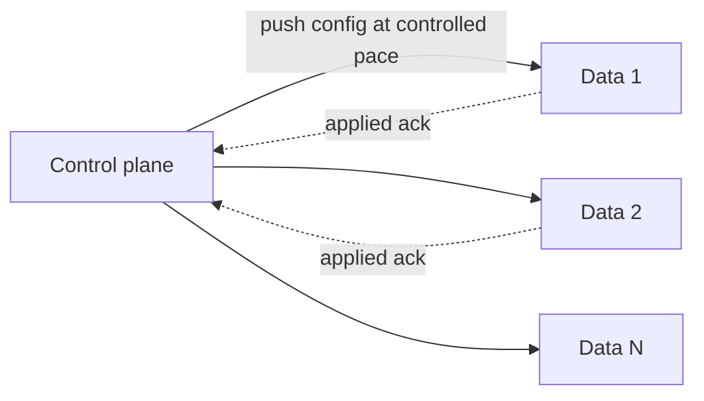

### 8.2 “Slow down rather than fall over”

当 publish demand 超 capacity：

- Bound queue；
- Coalesce intermediate versions；
- Limit concurrent sends；
- Prioritize critical update；
- Backpressure producers；
- Disconnect laggard for snapshot resync；
- Degrade propagation latency，而非耗尽 memory/thread。

这是 overload control：牺牲 freshness，保持 control plane alive。

### 8.3 Push 仍有 scale limits

原章脚注明确：control plane 若要维持太多 connections 仍会 overload。

若每 connection state $c$ bytes、实例数 $N$：

$$
Memory_{connections}\approx Nc
$$

还包含 heartbeat、TLS、send buffer、ack tracking。可用：

- Hierarchical fan-out；
- Regional relay；
- Pub/sub broker；
- Connection sharding；
- Stateless distributor；
- Snapshot store。

### 8.4 Push 不是可靠应用的充分条件

必须处理：

- Duplicate delta；
- Out-of-order；
- Gap；
- Reconnect；
- Slow consumer；
- Control leader failover；
- Partial rollout；
- Ack received vs actually applied；
- Invalid config rejection。

---

## 9. Versioned deltas

### 9.1 为什么不总推全量 state

State 很大而 change 很小时，全量 push 的 work：

$$
Bytes_{full}=N\times S
$$

若每次 delta 大小 $d\ll S$：

$$
Bytes_{delta}=N\times d
$$

例如 $S=10MB$、$d=1KB$、$N=100{,}000$：

- Full fan-out 约 1 TB；
- Delta fan-out 约 100 MB。

### 9.2 Version chain

每个 delta 明确：

```text
from_version = v
to_version = v + 1
operations = [...]
checksum / schema / signature
```

Data plane 当前 version 为 $a$，只可直接 apply：

$$
from=a\quad\land\quad to>a
$$

最简单连续版本要求：

$$
from=a,\qquad to=a+1
$$

### 9.3 Gap rejection

当前 v5 收到 `v6 -> v7`：缺 v6，不能盲目 apply。选择：

- 请求 missing deltas；
- 从 snapshot 重载；
- 暂时继续 v5 serving；
- Mark stale/unready for unsafe config class。

Gap detection 防止 silently diverged configuration。

### 9.4 Idempotency

重复收到已应用 delta：

- 若 `to <= current`，可识别为 duplicate/old 并忽略；
- 不能再次执行 non-idempotent operation；
- 最好以 state replacement/set semantics，而非无版本 increment。

### 9.5 Delta retention

Control plane 要保留多久 history？若 consumer 离线太久，缺失 delta 已被 compact，必须 snapshot resync。

```text
if current >= delta_min_version:
    replay deltas
else:
    load recent snapshot, then replay tail
```

这与 database WAL + checkpoint 相同：snapshot 提供 base，log/delta 提供增量。

---

## 10. 方案三：Startup snapshot + steady-state delta

### 10.1 Figure 22.2

原章的混合架构：

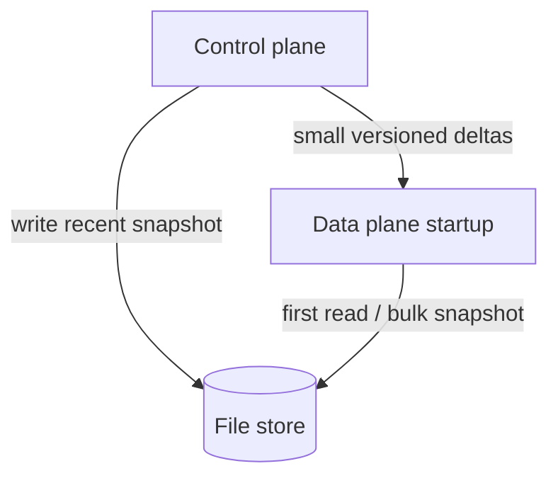

职责分工：

- File store 吸收 startup bulk reads；
- Control plane 只 push snapshot 之后的小 delta；
- Data plane 快速取得完整 base；
- Steady-state propagation latency 接近 push path。

### 10.2 Startup protocol

```text
1. Read manifest and snapshot version s from file store.
2. Validate and install snapshot s.
3. Connect to control plane asking for changes after s.
4. Buffer deltas arriving while snapshot loads if protocol permits.
5. Apply contiguous deltas in order.
6. Report applied version and begin serving/ready.
```

也可先 subscription 获得 high-water mark，再 snapshot，避免 race。关键是不在 snapshot/read 与 delta stream 之间漏版本。

### 10.3 Snapshot/delta race

若：

- Snapshot v10 正在下载；
- Control plane 已到 v12；
- Delta v10->v11、v11->v12 正在推；

Consumer 必须：

- 安装 v10；
- 有序应用 11、12；
- 或直接取更新 snapshot；
- 不能先 apply delta 再被旧 snapshot 覆盖。

### 10.4 版本不变量

Data-plane published state version 只能单调：

$$
v_{published,new}\ge v_{published,old}
$$

Rollback 是显式发布一个更高 version、内容回到旧 semantic state，而不是 version number 倒退。这样 stale message 无法覆盖新 state。

### 10.5 为什么混合方案常见

它组合两种路径的优点：

- Snapshot：简单完整、bulk scalable、可恢复；
- Delta：低 latency、低 bytes；
- LKG：control outage static stability；
- Version：detect gap/duplicate；
- Ack/monitor：闭环确认。

代价是实现最复杂，需要同时维护 snapshot、delta、retention 和 resync protocol。

---

## 11. 配置发布的正确性与安全性

### 11.1 Configuration 是代码一样危险的输入

Bad config 可同时破坏整个 fleet，blast radius 甚至大于 binary deploy：

- Route all traffic to one backend；
- Quota = 0；
- Disable auth；
- Invalid regex consumes CPU；
- Delete all chain members；
- Circular dependency。

### 11.2 发布流水线

```text
author change
-> schema/type validation
-> semantic/reference validation
-> policy/security review
-> durable version commit
-> canary subset
-> monitor
-> progressive rollout
-> full rollout or rollback
```

### 11.3 Config signature/checksum

Data plane 应验证：

- Authentic source/signature；
- Payload checksum；
- Schema version；
- Monotonic version；
- Expiration（若有）；
- Internal references；
- Resource bounds。

Invalid candidate 应被拒绝，继续 serving LKG，并上报 error；不应先清空旧 config。

### 11.4 Secret 与普通 config

Secret/key rotation 需要更严格：

- Encryption in transit/at rest；
- Short exposure；
- Overlap old/new key for rotation；
- Revocation；
- Audit；
- Avoid full dump to overly broad file store readers。

Snapshot pattern 不表示所有 sensitive state 都适合明文全量 fan-out。

---

## 12. 22.2 Control theory

### 12.1 Controller 的目标

Control theory 提供另一种视角：controller 监控 dynamic system，把 actual state 与 desired state 比较，施加 corrective action，使系统靠近目标并尽量减少 instability。

在本章：

- Dynamic system / plant：data plane；
- Controller：control plane；
- Desired/set point：应有配置、replica 数、software version；
- Observation：actual/applied state；
- Error：desired - actual；
- Actuator/action：push config、restart、exclude、scale、rollback。

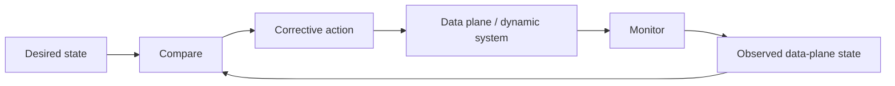

### 12.2 Monitor、compare、action

原章强调三个 ingredients：

1. **Monitor**：观察 actual state；
2. **Compare**：与 desired state 比较；
3. **Action**：发现偏差后纠正。

缺任一项都不是 closed loop：

- 只 publish 不 monitor：不知道是否 apply；
- 只 monitor 不 compare：只有 metrics，没有目标判断；
- Compare 后不 action：只有 alert，不会收敛。

### 12.3 Closed loop 是必要非充分条件

原书脚注明确：有 closed loop 不保证达到 desired state，只是 prerequisite。

Controller 仍可能：

- Observation wrong/delayed；
- Action ineffective；
- Gain 太高导致 oscillation；
- Multiple controllers conflict；
- Target impossible under capacity；
- Actuator unavailable；
- Bad desired state。

### 12.4 Monitoring 最常缺失

系统常实现“写配置 API 返回成功”，却没有确认：

- 多少 instances 收到；
- 多少通过 validation；
- 多少已 atomic install；
- 哪些仍 old version；
- 是否影响 error/latency；
- 是否在 deadline 内收敛。

Control-plane write success 只表示 desired state 持久化，不表示 fleet actual state 已达到目标。

---

## 13. Chain replication 的闭环例子

### 13.1 Open-loop 错误做法

Control plane 发布 chain config v12 后便认为完成：

```text
desired chain v12 persisted
-> push sent
-> operation marked success
```

某些 nodes 可能：

- Message lost；
- Validation failed；
- Process hung；
- Disk full；
- Applied v11 only；
- Network partitioned。

### 13.2 Closed-loop 做法

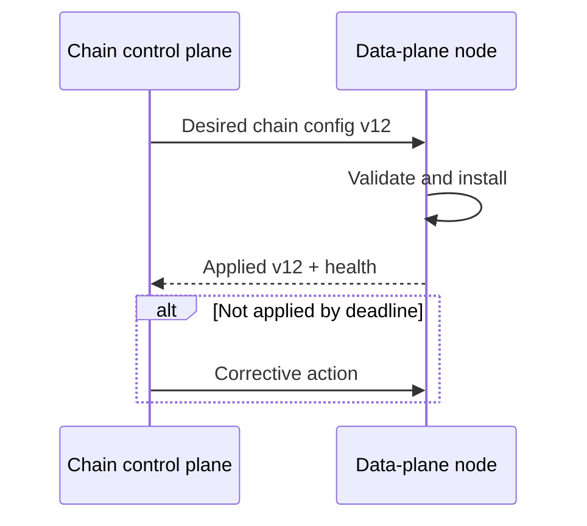

Control plane 监控是否在 reasonable time apply。未完成时可：

- Retry/resend；
- Force snapshot reload；
- Restart stale node；
- Exclude node from chains；
- Allocate replacement；
- Alert operator。

### 13.3 Applied ack 的语义

Ack 应区分：

- Received；
- Validated；
- Stored；
- Installed；
- Serving；
- Healthy under new config。

只 ack received 不能闭合“data plane 正在按 desired state 工作”的 loop。

### 13.4 Corrective action 的风险

原章说最简单可 reboot stale nodes 或 exclude。生产中要有限制：

- Max concurrent disruptions；
- Retry/backoff；
- Zone/replica quorum；
- Cooldown；
- Escalation；
- Avoid reboot loop；
- Preserve diagnostics。

Controller 不应为修一个 stale config 同时重启所有 replicas。

---

## 14. CI/CD pipeline 也是 control plane

### 14.1 Desired 与 actual state

- Desired：service version v2；
- Actual：fleet 中各 instance versions/health；
- Action：deploy/canary/promote/rollback；
- Monitor：startup, errors, latency, saturation。

### 14.2 Blind rollout 是 open loop

```text
deploy v2 to 100%
-> do not observe startup/user metrics
-> v2 throws on startup
-> catastrophic outage
```

Pipeline 只执行 action，没有 monitor/compare。

### 14.3 Incremental closed-loop rollout

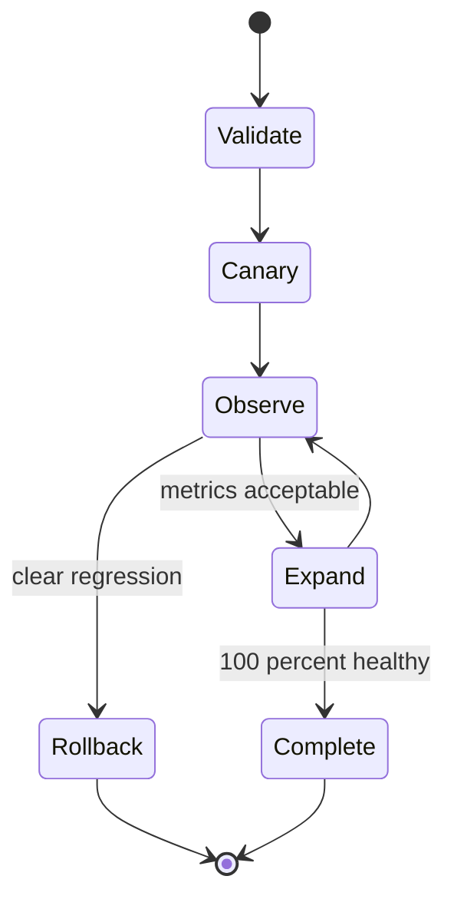

原章建议 incremental release，一边 monitor，一旦有明确异常则 stop rollout，可能自动 rollback。

### 14.4 Rollout 判据

比较 candidate 与 baseline：

- Startup success；
- Error rate；
- p95/p99 latency；
- CPU/memory；
- Business conversion/correctness；
- Dependency load；
- Crash/restart；
- Saturation。

### 14.5 自动 rollback 的边界

Rollback 并不总能恢复：

- v2 已做 incompatible schema migration；
- Side effect 已发生；
- Queue messages 使用新 format；
- Cached/config state 不兼容。

需要 backward-compatible expand/migrate/contract、feature flag、data repair 和 forward-fix plan。

---

## 15. 控制器稳定性：为什么闭环也会振荡

### 15.1 Feedback delay

Action 到 observation 有延迟 $L$。如果 controller 在效果显现前重复 action：

```text
observe high load
-> add instances
-> metrics still high during startup
-> add more instances
-> all become ready
-> massive overprovision
-> scale down too much
-> oscillation
```

### 15.2 Hysteresis

为 scale controller 设不同上/下阈值：

$$
ScaleOutThreshold>ScaleInThreshold
$$

避免 metric 在同一阈值附近频繁切换。

### 15.3 Cooldown 与 sustained condition

- Condition 持续 $W$ 时间才 action；
- Action 后 cooldown $C$；
- 等待 plant 响应；
- 限制每次 change magnitude。

### 15.4 Controller gain

一个简化比例控制：

$$
e(t)=Desired-Observed
$$

$$
Action=K_p e(t)
$$

$K_p$ 太小，收敛慢；太大，overshoot/oscillation。Distributed systems 常用 bounded step、queueing model、PID 或 rule-based control；原章不要求具体算法，只强调 instability 也是 controller 的设计目标。

### 15.5 Multiple controllers

Autoscaler、deployment controller、repair controller 可能同时操作 instance count：

- Deploy drains instances，autoscaler 误判 load 高而扩容；
- Repair restarts nodes，rollout 又替换版本；
- Cost controller scale-in 与 availability controller scale-out 冲突。

需要：

- Ownership/priority；
- Shared desired-state model；
- Leases/locks；
- Action budgets；
- Controller status conditions；
- Explicit conflict resolution。

---

## 16. 可运行 C11 模拟：Snapshot、Delta、Static Stability 与闭环纠正

### 16.1 模拟目标

程序实现一个最小 gateway configuration controller：

- Control plane 有 desired config 和 monotonic version；
- File store 保存完整 immutable snapshot；
- Data plane 启动时从 snapshot 读取，不直接依赖 live control plane；
- Control plane unavailable 时，data plane 继续按 v1 服务，验证 static stability；
- Control plane 更新到 v2 后推送连续 delta；
- Gap delta `v3 -> v4` 在当前 v2 被拒绝，不污染 serving state；
- File store 发布 v4 snapshot 后 data plane resync；
- Monitor/compare 发现 desired v5 未应用，controller 通过 delta corrective action 关闭 loop；
- Candidate strings 先验证长度，完整后才发布；
- Clock/版本倒退、损坏 checksum、过长 route 均被拒绝；
- 不依赖 `assert`，debug/`NDEBUG` 行为一致。

该程序只演示 version protocol 和闭环，不模拟真实 network、consensus 或并发。

### 16.2 完整代码

```c
#include <stdbool.h>
#include <stddef.h>
#include <stdint.h>
#include <stdio.h>
#include <string.h>

enum { ROUTE_CAPACITY = 32 };

typedef struct {
    unsigned long version;
    unsigned int quota;
    char route[ROUTE_CAPACITY];
    uint32_t checksum;
} Configuration;

typedef struct {
    Configuration desired;
    bool available;
    unsigned int corrective_actions;
} ControlPlane;

typedef struct {
    Configuration snapshot;
    bool present;
} FileStore;

typedef struct {
    Configuration active;
    bool ready;
    unsigned long served_requests;
} DataPlane;

typedef struct {
    unsigned long from_version;
    Configuration target;
} Delta;

static uint32_t checksum_config(unsigned long version,
                                unsigned int quota,
                                const char *route) {
    uint32_t hash = UINT32_C(2166136261);
    size_t index;

    hash ^= (uint32_t)version;
    hash *= UINT32_C(16777619);
    hash ^= quota;
    hash *= UINT32_C(16777619);
    for (index = 0; route[index] != '\0'; index++) {
        hash ^= (unsigned char)route[index];
        hash *= UINT32_C(16777619);
    }
    return hash;
}

static bool build_config(Configuration *output,
                         unsigned long version,
                         unsigned int quota,
                         const char *route) {
    Configuration candidate = {0};
    size_t route_length;

    if (output == NULL || route == NULL || version == 0 || quota == 0) {
        return false;
    }
    route_length = strlen(route);
    if (route_length == 0 || route_length >= sizeof candidate.route) {
        return false;
    }
    candidate.version = version;
    candidate.quota = quota;
    memcpy(candidate.route, route, route_length + 1);
    candidate.checksum = checksum_config(
        candidate.version, candidate.quota, candidate.route);
    *output = candidate;
    return true;
}

static bool valid_config(const Configuration *configuration) {
    if (configuration == NULL || configuration->version == 0 ||
        configuration->quota == 0 ||
        configuration->route[0] == '\0' ||
        memchr(configuration->route, '\0',
               sizeof configuration->route) == NULL) {
        return false;
    }
    return configuration->checksum == checksum_config(
        configuration->version,
        configuration->quota,
        configuration->route);
}

static bool publish_snapshot(FileStore *store,
                             const Configuration *configuration) {
    if (store == NULL || !valid_config(configuration) ||
        (store->present &&
         configuration->version <= store->snapshot.version)) {
        return false;
    }
    store->snapshot = *configuration;
    store->present = true;
    return true;
}

static bool install_snapshot(DataPlane *data_plane,
                             const FileStore *store) {
    if (data_plane == NULL || store == NULL || !store->present ||
        !valid_config(&store->snapshot) ||
        (data_plane->ready &&
         store->snapshot.version < data_plane->active.version)) {
        return false;
    }
    data_plane->active = store->snapshot;
    data_plane->ready = true;
    return true;
}

static bool apply_delta(DataPlane *data_plane, const Delta *delta) {
    if (data_plane == NULL || delta == NULL || !data_plane->ready ||
        !valid_config(&delta->target) ||
        delta->from_version != data_plane->active.version ||
        delta->target.version != delta->from_version + 1) {
        return false;
    }
    data_plane->active = delta->target;
    return true;
}

static bool serve(DataPlane *data_plane,
                  const char **route,
                  unsigned int *quota) {
    if (data_plane == NULL || route == NULL || quota == NULL ||
        !data_plane->ready || !valid_config(&data_plane->active)) {
        return false;
    }
    data_plane->served_requests++;
    *route = data_plane->active.route;
    *quota = data_plane->active.quota;
    return true;
}

static bool reconcile(ControlPlane *control_plane,
                      DataPlane *data_plane) {
    Delta delta;

    if (control_plane == NULL || data_plane == NULL ||
        !control_plane->available || !data_plane->ready ||
        !valid_config(&control_plane->desired) ||
        control_plane->desired.version <= data_plane->active.version) {
        return false;
    }
    if (control_plane->desired.version !=
        data_plane->active.version + 1) {
        return false; /* a snapshot resync is required for a gap */
    }
    delta.from_version = data_plane->active.version;
    delta.target = control_plane->desired;
    if (!apply_delta(data_plane, &delta)) {
        return false;
    }
    control_plane->corrective_actions++;
    return true;
}

int main(void) {
    ControlPlane control_plane = {0};
    FileStore file_store = {0};
    DataPlane data_plane = {0};
    Configuration version2;
    Configuration version4;
    Delta delta2;
    Delta gap_delta;
    const char *route;
    unsigned int quota;

    control_plane.available = true;
    if (!build_config(&control_plane.desired, 1, 100,
                      "ProfileServiceV1") ||
        !publish_snapshot(&file_store, &control_plane.desired) ||
        !install_snapshot(&data_plane, &file_store) ||
        !serve(&data_plane, &route, &quota)) {
        return 1;
    }
    printf("startup version=%lu route=%s quota=%u served=%lu\n",
           data_plane.active.version, route, quota,
           data_plane.served_requests);

    control_plane.available = false;
    if (!serve(&data_plane, &route, &quota) ||
        data_plane.active.version != 1) {
        return 1;
    }
    printf("control_down static_version=%lu served=%lu\n",
           data_plane.active.version,
           data_plane.served_requests);

    control_plane.available = true;
    if (!build_config(&version2, 2, 200, "ProfileServiceV2")) {
        return 1;
    }
    control_plane.desired = version2;
    delta2.from_version = 1;
    delta2.target = control_plane.desired;
    if (!apply_delta(&data_plane, &delta2) ||
        data_plane.active.version != 2) {
        return 1;
    }

    if (!build_config(&version4, 4, 400, "ProfileServiceV4")) {
        return 1;
    }
    gap_delta.from_version = 3;
    gap_delta.target = version4;
    if (apply_delta(&data_plane, &gap_delta) ||
        data_plane.active.version != 2) {
        return 1;
    }
    printf("delta version=%lu gap_rejected=1\n",
           data_plane.active.version);

    if (!publish_snapshot(&file_store, &version4) ||
        !install_snapshot(&data_plane, &file_store) ||
        data_plane.active.version != 4) {
        return 1;
    }
    printf("resync snapshot_version=%lu\n",
           data_plane.active.version);

    control_plane.available = true;
    if (!build_config(&control_plane.desired, 5, 500,
                      "ProfileServiceV5") ||
        !reconcile(&control_plane, &data_plane) ||
        data_plane.active.version != 5 ||
        control_plane.corrective_actions != 1) {
        return 1;
    }
    printf("closed_loop desired=%lu applied=%lu actions=%u\n",
           control_plane.desired.version,
           data_plane.active.version,
           control_plane.corrective_actions);

    file_store.snapshot.checksum ^= UINT32_C(1);
    if (install_snapshot(&data_plane, &file_store) ||
        data_plane.active.version != 5 ||
        build_config(&version2, 6, 100,
                     "route-name-that-is-definitely-too-long")) {
        return 1;
    }
    return 0;
}
```

### 16.3 编译运行

```bash
gcc -std=c11 -Wall -Wextra -Werror -pedantic control_plane.c -o control_plane
./control_plane
```

关键输出：

```text
startup version=1 route=ProfileServiceV1 quota=100 served=1
control_down static_version=1 served=2
delta version=2 gap_rejected=1
resync snapshot_version=4
closed_loop desired=5 applied=5 actions=1
```

### 16.4 代码与原理对应

| 代码 | 本章概念 |
| --- | --- |
| `ControlPlane.desired` | Desired/consistent configuration |
| `FileStore.snapshot` | Figure 22.1/22.2 bulk read buffer |
| `DataPlane.active` | Last-known-good serving state |
| `control_plane.available=false` 后 `serve` | Static stability |
| `Delta.from_version` | Ordered version chain |
| Gap rejection | Missing update 不可静默跳过 |
| Snapshot v4 install | Bulk resynchronization |
| `reconcile` | Monitor/compare/action 的 corrective path |
| Checksum/temporary candidate | Validate before atomic publication |

### 16.5 示例的重要局限

- 单线程，无真正 atomic pointer/lock；
- Snapshot 在内存中模拟 file store；
- 无 network、connection、retry、backpressure；
- 无 delta persistence/retention；
- Checksum 是教学用途 FNV-like hash，不是 cryptographic signature；
- `unsigned long` version overflow 未建模；
- Reconcile 只处理一步 contiguous delta；
- 无多个 controllers、canary/rollback；
- 无并发 snapshot/delta race；
- Control plane desired state 未用 consensus 复制。

因此代码验证 static stability、version gap 和 closed-loop responsibility，不是生产控制系统。

---

## 17. 容易混淆的概念

### 17.1 Control plane 与 admin UI

UI 只是入口；control plane 还包含 consistent state、validation、reconciliation、publication 和 monitoring。

### 17.2 Data plane 与无状态服务

Data plane 可持有 local state/config/cache；关键是处理每个 client request。Storage data plane 甚至持有持久 data。

### 17.3 Control plane 与 orchestration

Orchestration 是 control-plane 职责之一；不是所有 control plane 都只做 workflow，也会管理 metadata/configuration。

### 17.4 Logical split 与 availability split

两个 services 不代表解耦。Data plane 每次同步调用 control plane，仍是 hard dependency。

### 17.5 Static stability 与 consistency

Static stability 接受 stale config 保持 availability；control plane 自身仍可对 management state 强一致。

### 17.6 Static stability 与 fail-open

继续用 LKG 是明确已验证状态，不等于无条件接受任何请求。安全配置可 expiry/fail closed。

### 17.7 Snapshot 与 backup

Serving snapshot 是可重建 read model；backup 用于历史灾难恢复。Snapshot 可能只保留最新版本，不能替代 backup/audit history。

### 17.8 Poll 与 pull

Poll 是周期 pull；pull 也可按需。Scale imbalance 主要来自大量 clients 自主决定请求时机。

### 17.9 Push 与实时

Push 减少 polling delay，但仍受 queue、connection、backpressure、consumer apply 和 network failure影响，不保证瞬时同步。

### 17.10 Received 与 applied

收到 config 不等于 validation/install/serving 成功。Closed loop 要观察实际 applied/healthy state。

### 17.11 Version 与 wall-clock time

Version 表示有序 state evolution；不同机器时间不可靠，不能仅以 timestamp 替代 monotonic version/epoch。

### 17.12 Delta 与 event

Delta 可描述 state transition；必须有 base version。Event 可能表达 domain fact，重放/聚合语义不同。

### 17.13 CQRS 与 eventual consistency

读写模型分离后 snapshot/read model 异步传播，通常 eventual；必须监控 lag 和 rebuild，而不是假设同步。

### 17.14 Closed loop 与自动化

自动执行脚本不一定闭环；若不 monitor/compare outcome，只是 automated open loop。

### 17.15 Closed loop 与稳定系统

闭环是必要条件，不保证稳定。Delay、gain 和错误 signal 可引起 oscillation。

---

## 18. 常见误区与失败模式

### 18.1 “拆出 control plane 就提高 availability”

若 data plane hard-depends on it，availability 反而相乘下降。必须缓存 LKG、独立 serving。

### 18.2 “Control plane 流量低，不需要 scale”

Fleet startup/poll fan-out 可产生巨 burst；connection count 也可压垮 push server。

### 18.3 “加 retry 能解决启动失败”

无 backoff/jitter/budget 的 retry 会形成正反馈 overload。更好的方案是 snapshot buffer 和 paced recovery。

### 18.4 “全量 snapshot 太笨，不适合大系统”

它的简单、immutable、constant-work 和恢复性质往往比复杂增量链更可靠。先量化 state size。

### 18.5 “File store 可扩，随便高频全量读”

总 bytes/cost 仍为 $NS/R$。要使用 ETag、cache、regional mirror、jitter 和合理周期。

### 18.6 “Push 不会 overload control plane”

连接、heartbeat、buffer、ack tracking 都是 $O(N)$；需要 sharding/hierarchy/backpressure。

### 18.7 “Delta 小，所以一定优于 snapshot”

Delta 要处理 gap、duplicate、ordering、retention、compaction 和 bootstrap。Recovery path 仍需要 snapshot。

### 18.8 “Version number 可以 rollback”

内容可回滚，发布 version 应继续单调上升，防旧消息覆盖新 state。

### 18.9 “Control plane write 成功就完成 rollout”

这只持久了 desired state。必须观察 actual applied version 和 health。

### 18.10 “所有 data nodes 同时报 stale 就重启”

可能是 control/network fault；批量 restart 会扩大 outage。Corrective action 需 disruption budget。

### 18.11 “Monitoring 越多就闭环”

Metrics 若没有 desired comparison 和 action policy，只是观察，不是 controller。

### 18.12 “自动 rollback 总能恢复”

Irreversible data/schema side effects 可能不兼容。Deployment 要预先设计 rollback/forward fix。

### 18.13 “一个 controller 可以独占所有目标”

Scale、release、repair、cost controllers 可能冲突。必须协调 desired state 和 action ownership。

### 18.14 “Stale configuration 只影响功能，不影响安全”

Credential revocation、policy/route 更新可能安全敏感。按 config class 设置 age/fail policy。

### 18.15 “Control plane 应直接修每个异常 node”

逐 node unbounded reconciliation 会被 fleet size 拖垮。用 queue、rate limit、batch、priority 和 constant-work design。

---

## 19. 如何设计 control/data plane 系统

### 第一步：标出每请求 critical path

列出每个 client request 必须同步经过的 components 和 calls。它们属于 data path，按 request scale/availability 设计。

### 第二步：提取低频 desired-state 操作

识别 route、key、quota、placement、scale、version、repair 等 metadata/config operations，并定义 consistent owner。

### 第三步：消除 control-plane hard dependency

Data plane 持有：

- LKG config；
- Local compiled view；
- Version/checksum；
- Startup snapshot；
- Safe defaults；
- Degraded policy。

验证 control plane down 时仍能 serve/restart。

### 第四步：分类配置 freshness

对每类 state 定义：

- Max age；
- Fail-open/closed；
- Emergency path；
- Rollback；
- Security sensitivity；
- User impact。

### 第五步：量化 scale imbalance

测：

- Data-plane instance count $N$；
- Poll/startup burst；
- State/snapshot size $S$；
- Change/delta size $d$；
- Change frequency；
- Connections/heartbeats；
- Propagation SLO。

### 第六步：选 propagation architecture

- 小 state、宽松 latency：periodic full snapshot；
- 高频小 change、低 latency：push delta；
- 大 fleet + 大 state：snapshot bootstrap + delta steady state；
- 多 region：regional distributor/file mirror。

### 第七步：设计 version protocol

包括：

- Monotonic epoch；
- Snapshot base version；
- Delta from/to；
- Duplicate/gap；
- Retention/compaction；
- Resync；
- Rollback-as-new-version。

### 第八步：安全发布

Validate、checksum/sign、immutable snapshot、atomic install、retain previous、canary、audit。Candidate failure 不得破坏 active LKG。

### 第九步：为 control plane 做 overload control

- Server-paced push；
- Bounded queues；
- Coalescing；
- Rate/concurrency limit；
- Backpressure；
- Retry budget；
- Jitter；
- Intermediate scalable store。

### 第十步：关闭反馈环

明确：

```text
desired state
-> observed signal
-> comparison/error
-> corrective action
-> action outcome observation
```

不要把“发送成功”当“应用成功”。

### 第十一步：控制稳定性

加入 hysteresis、cooldown、sustained windows、bounded step、disruption budget 和 multi-controller conflict policy。

### 第十二步：建立 observability

监控：

- Desired/published/applied version；
- Config age/lag distribution；
- Snapshot read/error/bytes；
- Delta queue/gap/resync；
- Connection count/slow consumers；
- Rejected invalid config；
- Reconcile action/result；
- Control/data availability；
- Startup readiness time；
- Rollout/canary health。

### 第十三步：故障演练

测试：

- Control plane unavailable/network partition；
- File store unavailable/stale snapshot；
- Full fleet restart；
- Corrupt snapshot/signature；
- Missing/out-of-order delta；
- Slow consumer；
- Control leader failover；
- Bad config canary；
- Controller oscillation；
- Multiple controllers conflict。

---

## 20. 作者如何形成解决思路

### 20.1 从 API gateway 的竞争需求开始

业务 traffic 高、偏 availability/performance；management traffic 低、偏 consistency。作者不是先抽象定义，而是从同一组件内不兼容的目标推导分离。

### 20.2 用历史案例证明这是通用模式

Chain replication 和 Azure Storage 的 manager/server separation 说明它跨 network、storage 和 gateway domain 重复出现。

### 20.3 给 plane 下 functional definition

Data plane 是每请求 critical path；control plane 管 metadata、复杂低频 coordination。定义基于职责和 scale，而非进程名。

### 20.4 立即暴露分离的新风险

如果 data plane 仍 hard-depends on control plane，可用性相乘。由此引出 static stability，而不是停在“关注点分离”。

### 20.5 从正常平均转向 correlated burst

周期 poll 看似均匀，但全 fleet restart 让小 control plane 被打爆。作者分析 failure transition，而不只 steady state。

### 20.6 先给简单稳健方案

Full snapshot 经 scalable file store 虽 naive，却把 fan-out 与 control plane 解耦，并让 data plane 在 control outage 时 start/run。

### 20.7 再优化 latency 和 bytes

Push 让 control plane 控 pace；versioned delta 降低传播 work；snapshot+delta 解决 bootstrap burst。复杂度随真实需求递增。

### 20.8 用 control theory 提升抽象

Plane separation 不只是 config transport，而是 desired-state feedback loop。Monitor、compare、action 缺一不可。

### 20.9 用 chain 和 CI/CD 验证抽象

Config apply 与 software rollout 看似不同，实质都是 controller 驱动 dynamic fleet 收敛，并需观察和纠正。

### 20.10 以“还缺什么才能闭环”收束

作者最终方法不是推荐单一工具，而是要求对每个 control plane 找出缺失的 feedback ingredient。

---

## 21. 知识结构

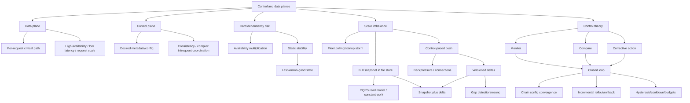

---

## 22. 核心结论

1. **API gateway 的业务请求与管理请求具有不同 scale、latency、availability 和 consistency 需求。**
2. **Data plane 执行每个 client request 的 critical-path work，必须 fast、highly available 并随请求扩展。**
3. **Control plane 管 desired metadata/configuration 和复杂低频 coordination，通常偏 consistency。**
4. **Plane 是功能角色，不等于某个固定 binary；一个应用可有多组独立 planes。**
5. **Chain replication 的 chain config、Azure Storage 的 stream/partition managers 都是 control-plane 案例。**
6. **如果 data plane 每次 serving/start 都必须访问 control plane，两者仍是 hard dependency。**
7. **串联 required dependencies 的理论可用性是乘积，且不高于最差依赖。**
8. **Static stability 要求 control plane down 时 data plane 用 last-known-good config 继续服务。**
9. **Static stability 不是无条件 fail-open；安全敏感配置必须有 age、expiry 和 fail policy。**
10. **Data-plane fleet 与小 control plane 的 scale imbalance 会在全量 restart/scale-out 时形成 startup storm。**
11. **经 scalable file store 发布完整 snapshot 把 control-plane work 从 $O(N)$ readers 降为与 fleet size 无关的 publish work。**
12. **Full snapshot 虽看似 naive，却有 immutable、完整、易恢复和 static-stability 优势。**
13. **Snapshot 方案增加 propagation latency 和 bytes，并形成 eventual read model/CQRS。**
14. **由 control plane 主动 push 可控制 pace，在过载时延迟传播而不是崩溃。**
15. **Push 仍需承担 $O(N)$ connections/heartbeats，并用 backpressure、sharding 或 hierarchy 扩展。**
16. **Versioned delta 降低大 state 小 change 的 bytes/latency，但必须处理 duplicate、gap、ordering、retention 和 resync。**
17. **Startup snapshot + steady delta 让 file store 吸收 bulk read，control plane 只推小变化。**
18. **Data-plane published version 应单调；semantic rollback 也应作为更高 version 发布。**
19. **Candidate config 必须先验证、再原子安装；坏配置不得清空 active LKG。**
20. **Control theory 将 data plane 看作 dynamic system、control plane 看作 controller。**
21. **Closed loop 必须有 monitor、compare、action；最常缺失的是 monitor actual application。**
22. **Closed loop 是达到 desired state 的必要非充分条件，delay/gain/错误 signal 仍可导致不稳定。**
23. **Chain control plane 不只发 config，还要确认 nodes 应用并对 stale node 采取纠正行动。**
24. **CI/CD pipeline 是 release control plane，应 incremental rollout、monitor，并在明确异常时 stop/rollback。**
25. **设计 control plane 时，核心问题是：还缺少什么才能关闭反馈环？**

---

## 23. 一般化的解决问题方法

### 23.1 按频率和一致性拆职责

高频、低 latency、availability-first 的执行路径与低频、strong-consistency 的管理路径不要共享同步 hot path。

### 23.2 将 desired state 与 serving state 解耦

Control plane 持有 authoritative desired state；data plane 持有 validated、versioned、immutable serving copy。

### 23.3 用 availability graph 检查“假分离”

列出每个 request/start 的 required edges。若仍同步连到 control plane，计算 availability 乘积并删除 hard edge。

### 23.4 为停滞而设计

问：control plane 24 小时不可用时，data plane 能否继续？哪些配置可以 stale，哪些必须 expire，重启如何取得 LKG？

### 23.5 以 correlated fleet event 规划 scale

不要只看平均 polling QPS。计算全 fleet restart、zone recovery、mass scale-out 的 burst。

### 23.6 让小服务控制 pace

避免大 fleet 自主同步 pull。使用 durable buffer、server push、queue、backpressure 和 bounded concurrency。

### 23.7 先 snapshot，再按需求增量优化

Full snapshot 建立简单可靠 recovery baseline；只有 state/latency 数据证明必要时，才加入 delta，并保留 snapshot resync。

### 23.8 所有状态传播都要版本化

使用 monotonic epoch、base version、from/to、checksum，明确 duplicate/gap/rollback 和 retention。

### 23.9 将 publication 与 application 分开观测

Desired committed、published、received、validated、applied、healthy 是不同阶段，SLO 和 metrics 必须区分。

### 23.10 把 automation 升级成 feedback controller

逐一写出 monitor、desired comparison、corrective action 和 action outcome；缺一则是 open loop。

### 23.11 为 controller 本身做稳定性设计

Delay、hysteresis、cooldown、bounded step、disruption budget、multi-controller coordination 与 safe rollback 都是控制算法的一部分。

最终方法可压缩为：

```text
separate per-request execution from infrequent consistent management
-> keep validated last-known-good state in the data plane
-> remove synchronous control-plane dependencies from serving and startup
-> model correlated fleet bursts, not only average polling
-> buffer bulk state in a scalable snapshot store
-> let the smaller control plane pace incremental pushes
-> version deltas and reject gaps
-> combine snapshot bootstrap with delta steady state
-> monitor actual application, compare with desired state, and act
-> bound corrective actions to avoid oscillation and wider failure
```
