> 本文严格沿原章顺序展开：先用视频上传与异步编码说明 fire-and-forget 的丢失风险，引入 message channel、command/event、adapter、`202 Accepted`、缓冲、解耦、负载平滑与 batching；再讨论 one-way、request-response、broadcast 三种通信风格；随后依次分析 broker ordering/delivery/durability 等 guarantees、at-least-once 与 visibility timeout、exactly-once processing、retry/DLQ、backlog 和 poisonous-message fault isolation。正文之后另设“Part III Summary”一节，明确它是全篇 Scalability 部分的总结，不属于 23.5。文中的排队/吞吐/积压公式、幂等收件箱、原子副作用、退避、lag 估算和 C11 状态机用于补足推导与工程边界，不应误认为原书逐字给出的 SQS、Kafka、Azure Queue Storage 或 AMQP 当前产品规范。

## 0. 导读：把“调用一个在线服务”改成“持久提交一项待办工作”

### 0.1 为什么直接异步调用不够

Cruder 增加视频上传能力：用户上传一个视频，系统要编码成适配电视、手机、平板的多种格式与分辨率。编码可能持续数分钟，不适合让 API gateway 一直等待同步 response。

朴素方案：

```text
API gateway uploads video
-> starts an encoding request
-> does not wait for result
```

问题是 fire-and-forget 只表示 sender 不等待，并不表示 request 已被 durable 接受：

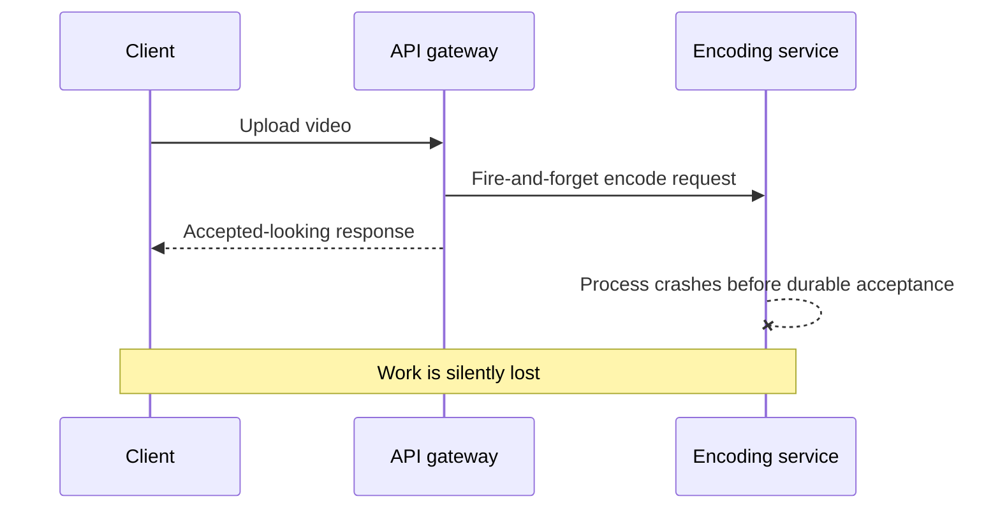

发送 TCP/HTTP bytes 成功、receiver process 收到、任务持久化、任务处理完成，是四个不同事件。若 sender 在不知道 durable handoff 是否完成时就回复 client，receiver crash 会永久丢工作。

### 0.2 引入 message channel

更稳健方案是在 API gateway 与 encoding service 之间加入 message channel/message broker：

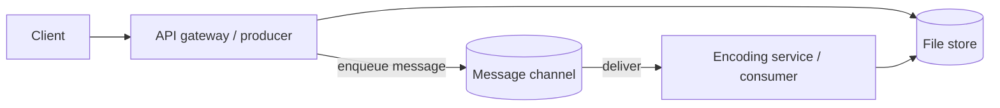

Producer 不直接要求某个 consumer instance 在线，只需要让 broker 按约定持久接受 message。Consumer 以后再读取并完成工作。

### 0.3 本章最重要的转变

直接调用的成功问题：

```text
Did the receiver answer this request now?
```

Messaging 的成功问题：

```text
Was the work durably accepted, and will some consumer eventually process it?
```

这把时间耦合从 producer/consumer 之间移到 channel retention、delivery 和 consumer processing protocol。

### 0.4 Messaging 不会消除失败

它只是改变失败的位置和处理方式：

- Receiver 暂时 down：message 留在 channel；
- Consumer crash：visibility timeout 后 redelivery；
- Bad message：反复失败，需 retry limit/DLQ；
- Producer 持续快于 consumer：backlog 增长；
- Broker down/full：producer 仍可能无法 enqueue；
- Duplicate delivery：consumer 必须幂等；
- Ordering：分区和并发会削弱全局顺序。

Messaging 用 buffer 和 retry 换来时间解耦，也引入新的 state machine。

---

## 1. Message channel 是什么

### 1.1 间接通信

Messaging 是 indirect communication：

```text
producer -> channel/broker -> consumer
```

Producer 与 consumer 不直接通信。Broker 负责：

- 接受消息；
- 暂时缓冲；
- 按 channel semantics 投递；
- 管理可见性、ack/delete、重试；
- 可能持久化、复制和分区。

### 1.2 Temporary buffer

Channel 为 receiver 提供临时 buffer：consumer 离线或变慢时，producer 仍可写入，前提是 broker 有容量且 enqueue 可用。

设时刻 $t$ 的积压量为 $Q(t)$，arrival rate 为 $\lambda(t)$，deletion/completion rate 为 $\mu(t)$：

$$
\frac{dQ(t)}{dt}=\lambda(t)-\mu(t)
$$

- $\lambda<\mu$：可消化积压；
- $\lambda=\mu$：积压大致不变；
- $\lambda>\mu$：积压持续增长。

Channel 只能吸收有限时长的差额，不会创造消费 capacity。

### 1.3 异步的精确含义

原章说 messaging inherently asynchronous，因为发送 message 不要求 receiver 在线。

异步不等于：

- Producer 永远不用等 broker ack；
- Message 立即处理；
- 无 response；
- 无时限；
- 无失败；
- 一定持久化。

Producer 仍可同步等待 broker 的 durable-enqueue acknowledgment，但不等待业务处理结束。

### 1.4 Message 格式

Message 有 well-defined format，通常包括 header 与 body：

```text
header:
  message_id
  type/schema_version
  produced_at
  source_id
  correlation_id
  trace_id
  retry/delivery metadata

body:
  command/event payload
```

原章只明确 unique message ID 等 metadata 与 actual content；其余字段是常见工程扩展。

### 1.5 为什么 message ID 重要

At-least-once 会 duplicate delivery。稳定、唯一的 message ID 可用于：

- Inbox deduplication；
- Trace/correlation；
- Retry history；
- DLQ inspection；
- Audit/reconciliation。

ID 必须在 producer retry 时保持稳定，否则同一 logical operation 会被当成新 message。

---

## 2. Command 与 event

### 2.1 Command

Command 要求 receiver 执行某项操作：

```text
EncodeVideo(video_uri, formats)
ChargePayment(order_id, amount)
GenerateInvoice(order_id)
```

语义：

- Imperative；
- 通常有目标 capability/owner；
- 可能成功、失败、重试；
- 需要 idempotency 与 validation。

### 2.2 Event

Event 表示 sender 已发生值得关注的事实：

```text
VideoUploaded
OrderPlaced
PaymentCaptured
```

语义：

- Past tense/fact；
- Producer 不命令特定 receiver；
- 零个或多个 subscribers；
- Event 不应因当前没有 consumer 而改变历史事实。

### 2.3 容易混淆的边界

| 维度 | Command | Event |
| --- | --- | --- |
| 含义 | 请执行 | 已发生 |
| Owner | 通常一个 logical handler | 可有多个 subscribers |
| 命名 | Imperative | Past tense |
| Failure | Command execution 可失败 | Subscriber processing 可失败，但事实仍发生 |
| Channel | 常 point-to-point | 常 publish-subscribe |

命名不是充分条件。`UserCreated` 如果只为了偷偷命令邮件服务发信，可能仍是耦合的 command disguise。

---

## 3. Messaging adapter 是 service API surface

### 3.1 Figure 23.1

原图沿用 ports/adapters：

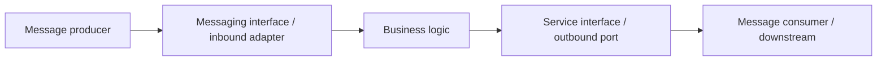

原书图意：message consumer 作为 inbound adapter，是 service API surface 的一部分；producer/outbound adapter 把 service 输出发送到 channel。

### 3.2 为什么 message schema 是 API

即使没有 HTTP endpoint，message contract 仍需要：

- Schema/version；
- Compatibility；
- Validation；
- Error semantics；
- Ownership；
- Deprecation；
- Security/privacy；
- Consumer expectations。

“异步”不会降低 API evolution 责任。反而因为 messages 可长期滞留，new consumer 可能读到 old schema，兼容窗口更长。

### 3.3 Prepare-activate-cleanup

不兼容 schema 变化可拆为：

```text
prepare: consumer supports old + new
activate: producer emits new
cleanup: after backlog/rollback window, remove old support
```

还要考虑 DLQ、archive 和 replay 中的旧消息。

---

## 4. 视频编码流程与 `202 Accepted`

### 4.1 原章流程

1. Gateway 上传 video 到 S3 一类 file store；
2. Gateway 写 message，body 含 file link；
3. Broker durable 接受；
4. Gateway 返回 `202 Accepted`；
5. Encoding consumer 最终读取并处理；
6. 成功后 message 才删除；
7. Consumer 失败则 timeout 后重试。

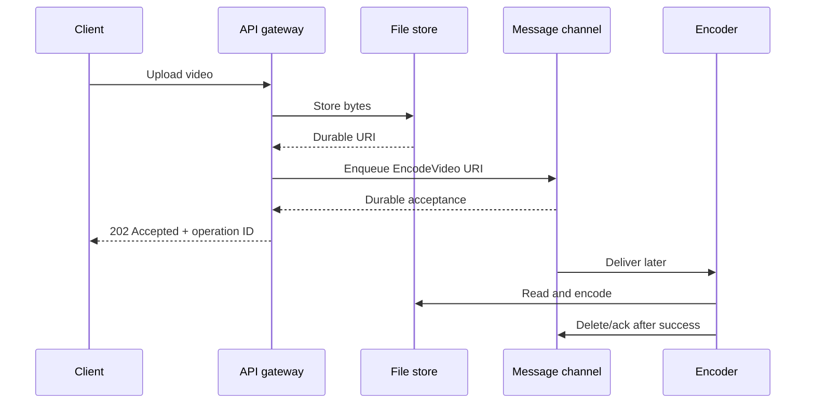

### 4.2 `202` 不表示完成

`202 Accepted` 表示 request 已接受处理，但尚未完成。一个完整 public API 还应提供：

- Operation/job ID；
- Status endpoint or callback/event；
- Pending/succeeded/failed state；
- Result links；
- Cancellation semantics；
- Idempotency key；
- Retention/error visibility。

### 4.3 Upload 与 enqueue 的原子性

File upload 成功但 enqueue 失败会产生 orphan；enqueue 成功但 file 不存在会产生 poison message。常见流程：

- Upload intent + finalization；
- Deterministic object key；
- Transactional outbox（若 DB state 与 message）；
- Retry with stable message ID；
- Consumer validates file/version/checksum；
- Periodic orphan reconciliation。

原章用流程建立 messaging 主线，不展开这个 cross-service transaction。

---

## 5. Messaging 的收益与代价

### 5.1 Temporal decoupling

Consumer 暂时 unavailable，producer 仍能 enqueue。Producer availability 不再直接乘上 consumer availability，但会依赖 broker 和 channel capacity。

直接 required call 的简化 availability：

$$
A_{direct}\approx A_P A_C
$$

异步 acceptance path：

$$
A_{accept}\approx A_P A_B
$$

Business completion 仍依赖 consumer eventual recovery、message retention 和 retry。

### 5.2 Consumer scale-out

Point-to-point channel 可由 competing consumers 读取；每条 message 只交给一个 instance 处理，broker 分配 load：

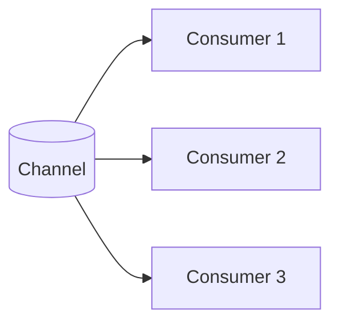

理想 total deletion rate：

$$
\mu_{total}\lesssim\sum_{i=1}^{N}\mu_i
$$

受 partition count、hot key、downstream capacity 和 broker limit 约束。

### 5.3 Load leveling

短 spike 可先进入 queue，由 consumer 按自身 pace 处理：

```text
burst arrival -> backlog temporarily rises
-> producer returns quickly
-> consumers drain over time
```

若 spike 结束后 $\mu>\lambda$，可恢复；长期 $\lambda>\mu$，buffer 只推迟 failure。

### 5.4 Batching

Broker 一次 read 最多取 $N$ messages，consumer 在一个 unit of work 处理。

若每 batch 固定开销 $c_f$，每 message 成本 $c_m$，batch size $b$：

$$
CostPerMessage\approx c_m+\frac{c_f}{b}
$$

$b$ 增大，amortized fixed cost 降低，throughput 上升。

代价：

- 首条 message 等待 batch fill；
- Batch transaction 更大；
- One poison item 如何处理；
- Memory 增加；
- Failure 后重试整个 batch 可能重复 healthy items。

因此“latency 可接受时 batching 是 no-brainer”要结合 batch failure semantics。

### 5.5 额外复杂度和 latency

Broker 是新服务，需要：

- Capacity/partitioning/replication；
- Upgrade/monitoring/security；
- Schema governance；
- Retry/DLQ/backlog operations；
- Cost/quota；
- Producer/consumer clients。

End-to-end latency：

$$
T_{e2e}=T_{enqueue}+T_{queueWait}+T_{process}+T_{ack}
$$

Backlog 大时 $T_{queueWait}$ 主导。

---

## 6. Point-to-point 与 publish-subscribe

### 6.1 Point-to-point

每条 message 交给 exactly one consumer instance（在本章 channel model 中）：

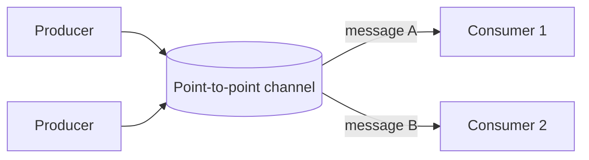

适合 commands/work distribution。

“Exactly one consumer instance receives”不是 exactly-once processing；同一 message 可因 timeout 被不同 instances 先后收到。

### 6.2 Publish-subscribe

每个 subscription/consumer group 获得一份 logical copy：

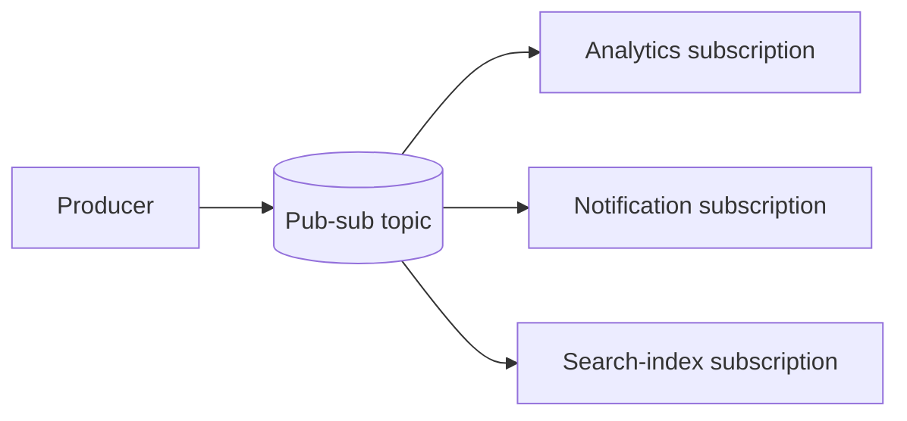

原书简化说 each consumer instance receives a copy。现实 broker 通常按 subscription/consumer group 广播，而同一 group 内可 competing consume。具体 fan-out unit 必须查产品语义。

### 6.3 选择依据

- 一项工作只能执行一次 logical effect：point-to-point + idempotent consumer；
- 一个事实需多个独立 reactions：pub-sub；
- 每 subscriber 有独立 lag/retry/DLQ；
- Slow subscriber 不应阻塞其他 subscription。

---

## 7. One-way messaging

### 7.1 Figure 23.2

Producer 写 point-to-point channel，期待某 consumer eventual process：

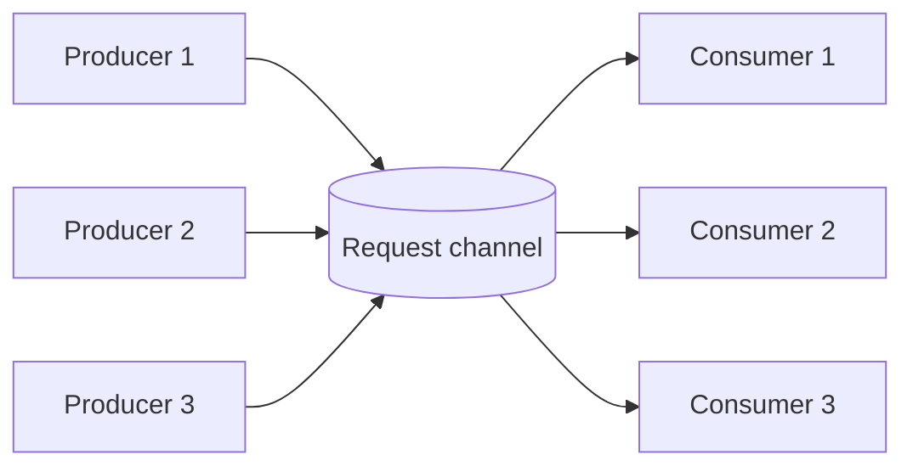

视频编码就是 one-way style。

### 7.2 Completion 如何通知

One-way 不等于业务永远不需要结果。可用：

- Poll job status；
- Completion event；
- Webhook；
- Notification；
- Separate request-response channel。

Producer 的 enqueue success 与 consumer business success 必须分开建模。

---

## 8. Request-response messaging

### 8.1 Figure 23.3

Request/response 都经过 channels：

- Consumers 共享 point-to-point request channel；
- 每个 producer 有 dedicated response channel；
- Request 带 request ID 和 response-channel reference；
- Reply 带同一个 request ID。

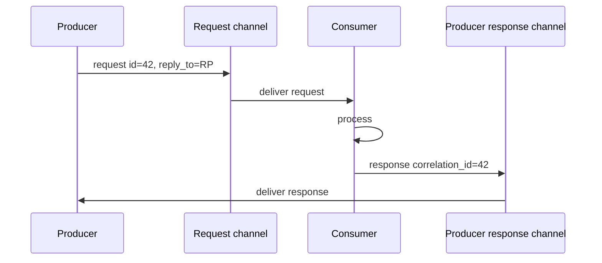

### 8.2 Correlation table

Producer 维护：

```text
request_id -> promise/callback/deadline
```

收到 response 后 match。还需处理：

- Duplicate response；
- Late response after timeout；
- Producer restart；
- Unknown correlation ID；
- Response channel retention/security；
- Cancellation。

### 8.3 与同步 RPC 的关系

Producer 仍可 block 等 response，使 application-level pattern 看似同步；broker 提供 temporal buffer，但 latency/timeout/state 更复杂。

如果 caller 必须立即等 reply，messaging 的主要价值可能是 durability/routing，而非 decoupled user latency。

---

## 9. Broadcast messaging

### 9.1 Figure 23.4

Producer 向 publish-subscribe channel 写 event，广播给多个 consumer interests：

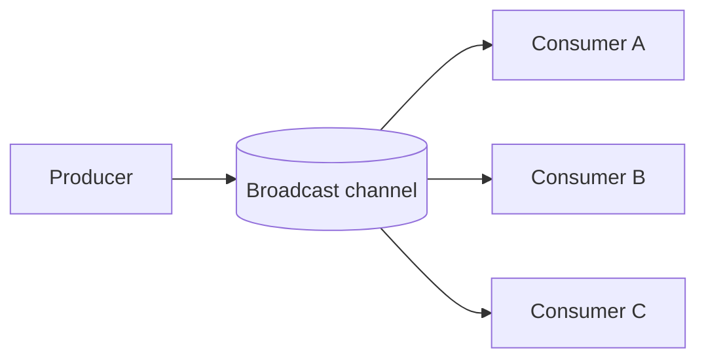

用于通知“某 event 已发生”。原章关联 Chapter 13 transactional outbox。

### 9.2 Producer 解耦的边界

Producer 不知道具体 subscribers，但仍耦合于：

- Event schema；
- Semantic meaning；
- Ordering/version；
- Delivery contract；
- Privacy/data classification。

Event 随意变化仍会破坏消费者。

---

## 10. 23.1 Guarantees：为什么 broker 不都一样

### 10.1 Broker 是分布式系统

AWS SQS、Kafka 等 broker 要 horizontal scale，因此内部：

- Partition；
- Replicate；
- Elect leaders/owners；
- Persist logs/messages；
- Balance consumers；
- Recover failures。

不同实现对 consistency、availability、latency、cost 做不同取舍。

### 10.2 Ordering 为什么昂贵

多个 broker nodes 并发接收 messages 时，全局 order 需要 coordination：

- Single sequencer/leader；
- Consensus/order service；
- Clock/order protocol；
- 限制并行写；
- Failover 恢复 sequence。

SQS standard queues 不提供 strong ordering；这换取 scale/availability/throughput。具体当前 guarantee 应查产品文档。

### 10.3 Kafka-style partition order

Channel 分成 sub-channels/partitions；partition key 决定路由：

$$
partition=H(key)\bmod P
$$

每个 partition 内单一 ordered log 易保证局部顺序：

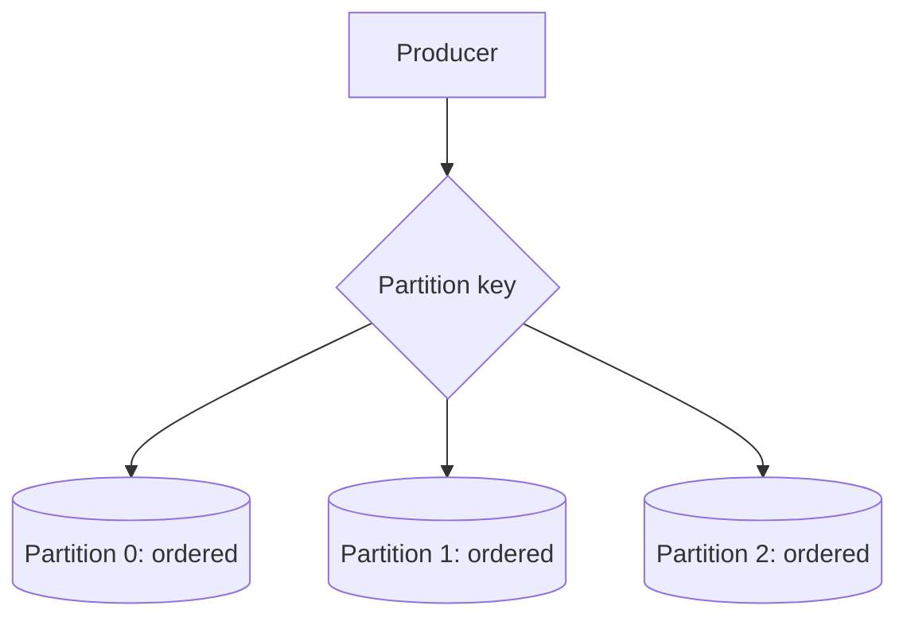

跨 partitions 没有单一 total order。

### 10.4 End-to-end order 的 consumer 约束

原章指出要保留某 sub-channel 的 end-to-end order，只能让一个 consumer process 读取它。更精确地说，同一 consumer group 中，一个 partition 同时由一个 consumer member 拥有；不同 groups 可各自读完整 partition。

若同 partition 内并发处理多 messages，即使 broker 按序 delivery，完成顺序仍可能乱：

```text
deliver m1, m2
m2 finishes first
=> effect order differs
```

要 end-to-end ordered effects，需要串行处理或显式 sequence barrier。

### 10.5 Partitioning caveats

Chapter 16 的问题全部回来：

- Hot partition；
- Partition-key skew；
- Consumer 单 partition capacity；
- Rebalance/movement；
- More partitions weakens global ordering；
- Per-key order 需要 stable key；
- Scale-out 上限受 partition count。

### 10.6 Broker guarantee 维度

原章列出：

- Ordering；
- At-most-once / at-least-once delivery；
- Durability；
- Latency；
- Standards，例如 AMQP；
- Competing consumers；
- Limits，例如 max message size。

还应核对：retention、visibility/lease、transactions、dedup window、throughput quota、partition semantics 和 geo-replication。

---

## 11. 本章后续采用的 channel assumptions

为简化，原章假设：

1. Channel 是 point-to-point；
2. 支持多个 producer/consumer instances；
3. Message at least once delivery；
4. Processing 时 message 仍留在 channel；
5. Visibility timeout 内其他 consumers 不能读；
6. Consumer crash 后 timeout 使 message 再 visible；
7. 成功后 consumer delete message，防未来 delivery。

这类似 Amazon SQS 与 Azure Queue Storage 的经典模型。

### 11.1 Message lifecycle

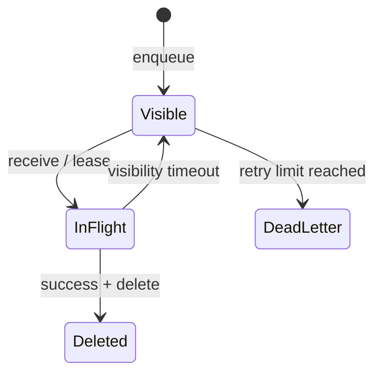

### 11.2 Visibility timeout 不是 transaction

它只是临时隐藏 message，避免正常情况下同时给多个 consumers。仍可能 duplicate：

- Consumer 处理超过 timeout；
- Ack/delete response 丢失；
- Broker failover；
- Lease extension 失败；
- Consumer crash after effect。

### 11.3 Timeout 选择

- 太短：slow processing 未完成就 redeliver，并发重复；
- 太长：crash 后 recovery 慢；
- Variable task：需要 heartbeat/lease extension；
- Extension 必须有 deadline，避免坏 consumer 永久占 message。

---

## 12. Delivery guarantees

### 12.1 At-most-once

Message 最多处理一次，但可能丢：

```text
delete/ack before effect
-> crash
-> no redelivery, no effect
```

适合允许丢失的 telemetry/refresh hint。

### 12.2 At-least-once

Broker 重试直到 delete/retention/retry policy，message 可能多次 delivery：

```text
effect succeeds
-> crash before delete
-> redelivery
-> effect may repeat
```

优先避免丢失，要求 consumer idempotent/deduplicate。

### 12.3 Exactly-once delivery 与 processing

- Delivery：broker 到 consumer 的一次 transport event；
- Processing：业务 effect 最终发生几次。

网络无法让 sender 确定 receiver 是否在最后 ack 丢失前完成，因而通用 exactly-once delivery 不可依赖。某些产品的“exactly once”通常有特定 scope，例如 broker log/transaction 内，不自动覆盖 external database/email/payment effect。

---

## 13. 23.2 Exactly-once processing

### 13.1 Delete-before-process 的失败窗口

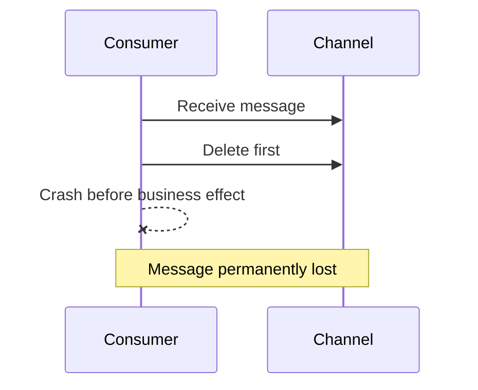

得到 at-most-once-ish effect，可能 0 次。

### 13.2 Delete-after-process 的失败窗口

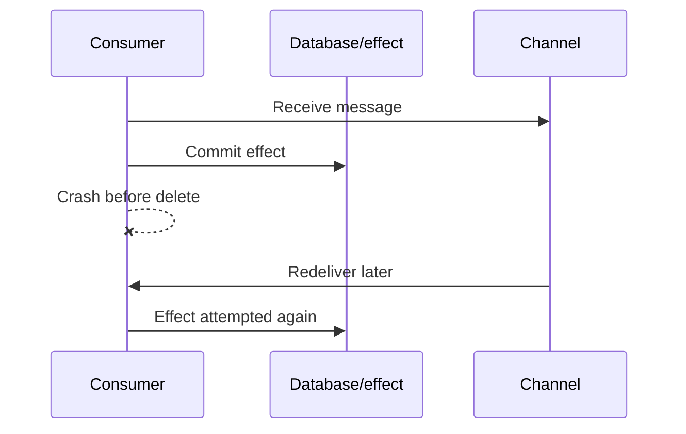

得到 at-least-once delivery，effect 可能重复。

### 13.3 原章结论

不存在可普遍依赖的 exactly-once message delivery。Consumer 最佳做法：

- Messages/handling idempotent；
- Process 成功后才 delete；
- Duplicate processing 不改变最终结果。

### 13.4 Idempotency

操作 $f$ 幂等：

$$
f(f(x))=f(x)
$$

例：

- `set status = shipped` 通常幂等；
- `increment balance by 10` 不幂等；
- `send email` 有外部重复 effect；
- `charge card` 必须用 provider idempotency key。

### 13.5 Inbox/dedup table

Consumer 在同一 local transaction 中：

```text
if message_id already in inbox:
    no-op success
else:
    apply business update
    insert message_id into inbox
commit
then delete broker message
```

若 crash after DB commit/before delete，redelivery 看到 inbox，跳过 effect，再 delete。

### 13.6 原子性边界

Inbox 与 business state 必须在同一 transaction/store consistency boundary。若先写 inbox 后业务失败，会永久跳过；若业务成功后 inbox 失败，会重复。

External side effect（email/payment）不能与本地 DB transaction 原子提交，可用：

- Provider idempotency key = message ID；
- Local outbox，再由 idempotent sender 发；
- Reconciliation；
- Business-level uniqueness constraint。

### 13.7 Dedup retention

Inbox 不能无限增长。删除 dedup record 前必须确保 message 不会再 replay：

- Broker retention/replay window；
- DLQ redrive；
- Backup restore；
- Manual replay；
- Producer duplicate horizon。

Dedup TTL 太短会让旧 duplicate 再产生 effect。

---

## 14. 23.3 Failures：poison message 与 DLQ

### 14.1 一次失败

Consumer 失败不 delete，visibility timeout 后由同一或另一 instance retry。Transient failure 可能恢复。

### 14.2 永久失败

特定 message 每次都失败：

- Invalid schema；
- Missing referenced file；
- Unsupported codec；
- Domain validation；
- Deterministic bug；
- Tenant-specific bad data。

若无限 retry，会浪费 capacity并阻塞 healthy work。

### 14.3 Delivery/receive counter

Broker 在 message 上维护 delivery count；若 broker 不支持，consumer 可维护。注意 consumer-local count 在 redelivery 到另一 instance 时会丢，需 shared/durable state或 broker metadata。

### 14.4 Retry policy

可用指数退避：

$$
d_k=\min(d_{max},d_0 2^k)+Jitter
$$

避免同一 poison message 高频占用。分类：

- Transient：retry；
- Permanent/validation：早期 DLQ；
- Overload：延迟并 backpressure；
- Unknown：有限 retry 后隔离。

### 14.5 Dead-letter channel

达到 max attempts 后：

1. 将 message 和 failure metadata 写入 DLQ；
2. 成功后从 main channel 删除；
3. 人工/自动检查 root cause；
4. Fix 后 redrive/reprocess。

DLQ entry 应保留：original body/header、message ID、source、attempt count、first/last failure、error/version/trace。

### 14.6 Move-to-DLQ 的原子性

“写 DLQ + 删除 main”若不是 broker 原子操作：

- DLQ 写成功、main delete 失败：duplicate DLQ/main；
- Main delete 成功、DLQ 写失败：data loss。

优先使用 broker native redrive/DLQ policy。自实现需 idempotent DLQ key、write-before-delete 和 reconciliation。

### 14.7 DLQ 不是垃圾桶

必须：

- Alert on rate/age；
- Ownership/on-call；
- Inspect/redrive tooling；
- PII/security retention；
- Root-cause grouping；
- Redrive rate limit；
- Prevent re-poisoning main queue。

---

## 15. 23.4 Backlogs

### 15.1 稳定条件

原章说 arrival rate 小于或等于 deletion rate 时一切正常。长期严格稳定通常需要：

$$
\lambda<\mu
$$

$\lambda=\mu$ 时没有余量吸收 variance、retry 和 failure；工程上应留 headroom。

### 15.2 Bimodal behavior

Messaging 系统有两种 mode：

1. No backlog：延迟低、符合预期；
2. Backlog：进入 degraded state，queue wait 与资源需求增长。

这是非线性 cliff：平均 processing latency 可能不变，但 end-to-end age 急升。

### 15.3 Backlog 增长

在固定窗口 $T$，若 $\lambda>\mu$：

$$
\Delta Q=(\lambda-\mu)T
$$

例：producer 5,000 msg/s，consumer deletion 4,000 msg/s，持续 10 分钟：

$$
\Delta Q=(5{,}000-4{,}000)\times600=600{,}000
$$

### 15.4 Drain time

Producer 恢复到 $\lambda_r$、consumer rate $\mu>\lambda_r$，初始 backlog $Q_0$：

$$
T_{drain}=\frac{Q_0}{\mu-\lambda_r}
$$

若 $Q_0=600{,}000$、$\mu=4{,}000/s$、恢复 arrival $\lambda_r=3{,}000/s$：

$$
T_{drain}=600s=10min
$$

若 producer 仍为 4,000/s，净 drain rate 为 0，永远追不上。

### 15.5 原章列出的 backlog 原因

1. Producer instances/throughput 增加，consumer 跟不上；
2. Consumer 性能下降，message processing 变慢，deletion rate 降低；
3. 部分 messages 失败反复 retry，浪费 consumer resource 并延迟 healthy messages。

补充：downstream outage、partition skew、consumer deploy、quota/throttle、broker rebalance、large message 也会触发。

### 15.6 Queue length 为什么不够

同样 100 万 messages：

- 每秒 10 万处理，只需 10 秒；
- 每秒 100 处理，需要近 2.8 小时。

需要结合 rate、age 和 size。最重要用户体验指标常是 oldest-message age/time-in-queue，而非 count。

### 15.7 原章 backlog age 指标

Broker 记录首次写入 timestamp $t_p$，consumer 首次读取时本地时间 $t_c$：

$$
ObservedWait=t_c-t_p
$$

Producer/broker 与 consumer physical clocks 不完全同步，存在误差 $\epsilon$：

$$
ObservedWait=TrueWait+\epsilon
$$

它未必适合精确 SLA billing，但趋势/大幅增长足以作为 backlog warning。应统一时钟同步，并对小负数/偏差做容忍。

### 15.8 Backlog 的 freshness 问题

旧 command 处理时可能已无意义：

- User 已取消视频；
- Price/config 已变化；
- Superseding event 已到；
- Deadline 已过。

Message 可带 expiration/deadline/version。Consumer 在执行前重新验证当前 business state，而不是机械执行历史 command。

---

## 16. 23.5 Fault isolation

### 16.1 Poisonous producer 的影响

一个 producer/user 连续产生失败 messages。每条在 max retry 前被处理多次：

$$
WastedAttempts\approx PoisonMessages\times MaxAttempts
$$

它会：

- 消耗 consumer CPU/IO；
- 增加 backlog；
- 延迟 healthy users；
- 填满 DLQ；
- 触发 retry/downstream pressure。

### 16.2 Source identifier

Message header 带 source/user/tenant ID，让 consumer 统计失败率并区别处理：

```text
source_id -> recent attempts, failures, quarantine state
```

标识必须由 trusted producer/gateway 写入，不能让恶意用户伪造其他 tenant。

### 16.3 Alternate low-priority channel

原章方案：某 user messages 持续失败时，consumer 将其写入 slow/low-priority channel，并从 main 删除，不在 main 继续处理。

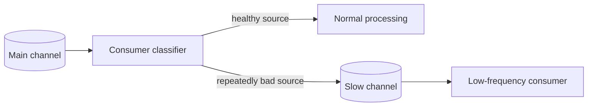

这样把单个 bad user 的 damage 隔离，不拖累其他 users。

### 16.4 公平性与隔离

可扩展为：

- Per-tenant queues；
- Weighted fair scheduling；
- Per-source concurrency/rate limit；
- Quarantine channel；
- Separate consumer pools；
- Bulkhead partitions；
- Circuit breaker per source。

隔离粒度越细，queue/consumer/metadata 成本越高。

### 16.5 低优先级不等于丢弃

Slow channel 仍需：

- Durable acceptance；
- Retry/DLQ；
- Age/SLO；
- Operator visibility；
- Fair redrive；
- Fix 后恢复 main routing。

如果从 main delete 前 slow enqueue 未持久成功，会丢消息；优先 broker-native atomic routing，或使用稳定 ID 与 reconciliation。

---

## 17. 可运行 C11 示例：At-least-once、去重、DLQ 与 source isolation

### 17.1 模拟目标

程序实现一个固定容量的 point-to-point channel 状态机：

- `good-1` 第一次完成业务 effect 后模拟 crash-before-delete；
- Visibility timeout 后 redelivery；inbox 根据 message ID 去重，effect 总计只发生一次；
- `poison-1` 连续失败三次后进入 DLQ，不再污染 main；
- `noisy-1` 来自已隔离 source，直接、持久地移动到 slow channel，不执行 main effect；
- Message delivery count、visible-at 和状态转换显式检查；
- Move 先写目标 slot，再改变 source state；
- Clock rollback、重复 ID、容量溢出和非法 ack 被拒绝；
- 不依赖 `assert`。

这段代码模拟 processing semantics，不是并发 broker 或真正 transaction。

### 17.2 完整代码

```c
#include <stdbool.h>
#include <limits.h>
#include <stddef.h>
#include <stdio.h>
#include <string.h>

enum {
    MAIN_CAPACITY = 4,
    AUX_CAPACITY = 4,
    TEXT_CAPACITY = 24,
    MAX_ATTEMPTS = 3,
    VISIBILITY_TIMEOUT = 5
};

typedef enum {
    MESSAGE_VISIBLE,
    MESSAGE_INFLIGHT,
    MESSAGE_DELETED,
    MESSAGE_DEAD_LETTER,
    MESSAGE_SLOW
} MessageState;

typedef struct {
    char id[TEXT_CAPACITY];
    char source[TEXT_CAPACITY];
    char body[TEXT_CAPACITY];
    MessageState state;
    unsigned int deliveries;
    unsigned long visible_at;
} Message;

typedef struct {
    Message main_messages[MAIN_CAPACITY];
    size_t main_count;
    Message dead_letters[AUX_CAPACITY];
    size_t dead_count;
    Message slow_messages[AUX_CAPACITY];
    size_t slow_count;
    char inbox[AUX_CAPACITY][TEXT_CAPACITY];
    size_t inbox_count;
    unsigned int business_effects;
    unsigned long last_now;
    bool clock_initialized;
} BrokerModel;

static bool copy_text(char *destination,
                      size_t capacity,
                      const char *source) {
    size_t length;
    if (destination == NULL || source == NULL || capacity == 0) {
        return false;
    }
    length = strlen(source);
    if (length == 0 || length >= capacity) {
        return false;
    }
    memcpy(destination, source, length + 1);
    return true;
}

static bool known_id(const BrokerModel *model, const char *id) {
    size_t index;
    for (index = 0; index < model->main_count; index++) {
        if (strcmp(model->main_messages[index].id, id) == 0) {
            return true;
        }
    }
    return false;
}

static bool enqueue(BrokerModel *model,
                    const char *id,
                    const char *source,
                    const char *body,
                    unsigned long now) {
    Message candidate = {0};
    if (model == NULL || id == NULL || source == NULL || body == NULL ||
        model->main_count >= MAIN_CAPACITY || known_id(model, id) ||
        !copy_text(candidate.id, sizeof candidate.id, id) ||
        !copy_text(candidate.source, sizeof candidate.source, source) ||
        !copy_text(candidate.body, sizeof candidate.body, body)) {
        return false;
    }
    candidate.state = MESSAGE_VISIBLE;
    candidate.visible_at = now;
    model->main_messages[model->main_count++] = candidate;
    return true;
}

static Message *receive(BrokerModel *model, unsigned long now) {
    size_t index;
    if (model == NULL || now > ULONG_MAX - VISIBILITY_TIMEOUT ||
        (model->clock_initialized && now < model->last_now)) {
        return NULL;
    }
    model->last_now = now;
    model->clock_initialized = true;
    for (index = 0; index < model->main_count; index++) {
        Message *message = &model->main_messages[index];
        if ((message->state == MESSAGE_VISIBLE ||
             message->state == MESSAGE_INFLIGHT) &&
            now >= message->visible_at) {
            message->state = MESSAGE_INFLIGHT;
            message->deliveries++;
            message->visible_at = now + VISIBILITY_TIMEOUT;
            return message;
        }
    }
    return NULL;
}

static bool inbox_contains(const BrokerModel *model, const char *id) {
    size_t index;
    for (index = 0; index < model->inbox_count; index++) {
        if (strcmp(model->inbox[index], id) == 0) {
            return true;
        }
    }
    return false;
}

static bool apply_idempotently(BrokerModel *model,
                               const Message *message,
                               bool *duplicate) {
    char checked_id[TEXT_CAPACITY] = {0};
    if (model == NULL || message == NULL || duplicate == NULL ||
        message->state != MESSAGE_INFLIGHT) {
        return false;
    }
    if (inbox_contains(model, message->id)) {
        *duplicate = true;
        return true;
    }
    if (model->inbox_count >= AUX_CAPACITY ||
        !copy_text(checked_id, sizeof checked_id, message->id)) {
        return false;
    }
    memcpy(model->inbox[model->inbox_count],
           checked_id, sizeof checked_id);
    model->inbox_count++;
    model->business_effects++;
    *duplicate = false;
    return true;
}

static bool delete_message(Message *message) {
    if (message == NULL || message->state != MESSAGE_INFLIGHT) {
        return false;
    }
    message->state = MESSAGE_DELETED;
    return true;
}

static bool move_message(Message *message,
                         Message *destination,
                         size_t *destination_count,
                         size_t capacity,
                         MessageState target_state) {
    if (message == NULL || destination == NULL ||
        destination_count == NULL || *destination_count >= capacity ||
        message->state != MESSAGE_INFLIGHT ||
        (target_state != MESSAGE_DEAD_LETTER &&
         target_state != MESSAGE_SLOW)) {
        return false;
    }
    destination[*destination_count] = *message;
    destination[*destination_count].state = target_state;
    (*destination_count)++;
    message->state = target_state;
    return true;
}

static bool fail_or_dead_letter(BrokerModel *model, Message *message) {
    if (model == NULL || message == NULL ||
        message->state != MESSAGE_INFLIGHT) {
        return false;
    }
    if (message->deliveries < MAX_ATTEMPTS) {
        return true; /* leave in-flight until visibility timeout */
    }
    return move_message(message, model->dead_letters,
                        &model->dead_count, AUX_CAPACITY,
                        MESSAGE_DEAD_LETTER);
}

int main(void) {
    BrokerModel model = {0};
    Message *message;
    bool duplicate = false;

    if (!enqueue(&model, "good-1", "user-a", "encode-ok", 0) ||
        enqueue(&model, "good-1", "user-a", "duplicate", 0)) {
        return 1;
    }

    message = receive(&model, 0);
    if (message == NULL || strcmp(message->id, "good-1") != 0 ||
        !apply_idempotently(&model, message, &duplicate) || duplicate ||
        model.business_effects != 1) {
        return 1;
    }
    printf("first_delivery id=%s effect=%u delete=crashed\n",
           message->id, model.business_effects);

    message = receive(&model, 4);
    if (message != NULL) {
        return 1; /* visibility timeout has not expired */
    }
    message = receive(&model, 5);
    if (message == NULL || strcmp(message->id, "good-1") != 0 ||
        !apply_idempotently(&model, message, &duplicate) || !duplicate ||
        model.business_effects != 1 || !delete_message(message)) {
        return 1;
    }
    printf("redelivery id=good-1 duplicate=1 effects=%u deleted=1\n",
           model.business_effects);

    if (!enqueue(&model, "poison-1", "user-b", "bad-codec", 5) ||
        !enqueue(&model, "noisy-1", "noisy-user", "bad-input", 5)) {
        return 1;
    }

    message = receive(&model, 5);
    if (message == NULL || strcmp(message->id, "poison-1") != 0 ||
        !fail_or_dead_letter(&model, message)) {
        return 1;
    }
    message = receive(&model, 10);
    if (message == NULL || strcmp(message->id, "poison-1") != 0 ||
        !fail_or_dead_letter(&model, message)) {
        return 1;
    }
    message = receive(&model, 15);
    if (message == NULL || strcmp(message->id, "poison-1") != 0 ||
        !fail_or_dead_letter(&model, message) ||
        model.dead_count != 1 ||
        model.dead_letters[0].deliveries != MAX_ATTEMPTS) {
        return 1;
    }
    printf("poison id=poison-1 deliveries=%u dead_lettered=1\n",
           model.dead_letters[0].deliveries);

    message = receive(&model, 15);
    if (message == NULL || strcmp(message->source, "noisy-user") != 0 ||
        !move_message(message, model.slow_messages,
                      &model.slow_count, AUX_CAPACITY,
                      MESSAGE_SLOW) || model.slow_count != 1) {
        return 1;
    }
    printf("isolated id=%s source=%s slow_channel=1\n",
           model.slow_messages[0].id,
           model.slow_messages[0].source);

    if (receive(&model, 14) != NULL || model.last_now != 15 ||
        receive(&model, ULONG_MAX) != NULL || model.last_now != 15 ||
        receive(&model, 100) != NULL || model.business_effects != 1 ||
        model.inbox_count != 1 || model.dead_count != 1 ||
        model.slow_count != 1 ||
        delete_message(&model.main_messages[1])) {
        return 1;
    }
    printf("summary effects=%u inbox=%zu dlq=%zu slow=%zu\n",
           model.business_effects, model.inbox_count,
           model.dead_count, model.slow_count);
    return 0;
}
```

### 17.3 编译运行

```bash
gcc -std=c11 -Wall -Wextra -Werror -pedantic messaging.c -o messaging
./messaging
```

关键输出：

```text
first_delivery id=good-1 effect=1 delete=crashed
redelivery id=good-1 duplicate=1 effects=1 deleted=1
poison id=poison-1 deliveries=3 dead_lettered=1
isolated id=noisy-1 source=noisy-user slow_channel=1
summary effects=1 inbox=1 dlq=1 slow=1
```

### 17.4 代码与原理对应

| 代码 | 本章概念 |
| --- | --- |
| `visible_at` | Visibility timeout/lease |
| `deliveries` | Retry counter |
| `inbox` | Message-ID dedup state |
| `business_effects` | 业务副作用次数 |
| Crash-before-delete | At-least-once duplicate window |
| `dead_letters` | Max retries 后隔离 |
| `slow_messages` | Source-based low-priority channel |
| Write target then change source state | 简化的 move safety |

### 17.5 示例局限

- 单线程、固定数组，无真实并发；
- Broker state 与 business inbox 在同一进程，真实系统跨 broker/DB；
- Inbox + effect 用普通顺序更新，不是真正 ACID transaction；
- Visibility 不支持 extension；
- Move 不是跨 durable channels 的原子 transaction；
- 无 persistence/replication/partition；
- 无 exponential backoff，只按固定 visibility interval；
- Source quarantine 已预先判定，未实现失败率窗口；
- Message state 在 main array 和 auxiliary copy 中重复；
- Visibility deadline 加法溢出会被拒绝，但长期计时器 wraparound/epoch 未建模。

因此程序验证 failure windows 与状态不变量，不是 production broker。

---

## 18. 容易混淆的概念

### 18.1 Asynchronous 与 durable

不等待 consumer 不等于 broker 已持久接受。Producer 应等待符合 durability contract 的 enqueue ack。

### 18.2 Fire-and-forget 与 one-way messaging

Fire-and-forget 可能无 durable handoff；one-way messaging 把 work 放入 channel 并由 broker retry。

### 18.3 Command 与 event

Command 请求执行；event 陈述事实。一个 event 多 subscribers，不表示每 instance 都必然各执行一次，取决于 subscription/group。

### 18.4 Point-to-point 与 at-most-once

Point-to-point 表示同次投递给一个 consumer instance；at-least-once 下同 message 可先后给多个 instances。

### 18.5 Publish-subscribe 与 broadcast to instances

通常是每 subscription/group 一份，再在 group 内竞争，而非无条件每进程一份。

### 18.6 Ordering 与 delivery order

Broker partition order 不自动等于 end-to-end effect order；并发处理、retry 和跨 partition 都可重排。

### 18.7 Visibility timeout 与 lock

它是有期限 lease，不是永久互斥，也不保证 effect atomicity；到期后可并发 redelivery。

### 18.8 Ack/delete 与业务 commit

Broker delete 和 DB effect 是不同系统的操作。顺序选择产生 loss 或 duplicate window。

### 18.9 Exactly-once delivery 与 exactly-once effect

通用 transport exactly-once 不可依赖；可用 idempotency、dedup 和 transaction 模拟特定 effect scope 的 exactly-once processing。

### 18.10 Retry count 与 processing count

Delivery count 不一定等于完整业务尝试：consumer 可在 handler 前 crash，或一 delivery 内内部 retry 多次。

### 18.11 DLQ 与失败终点

DLQ 是隔离和诊断队列，不是“完成”。需要 owner、修复和 redrive。

### 18.12 Queue length 与 lag

Count 不表达 drain time；结合 arrival/deletion rate 和 oldest age。

### 18.13 Buffering 与 capacity

Queue 吸收短 spike，不解决长期 arrival 大于 service rate。

### 18.14 Batching 与并行

Batching amortize fixed cost；parallelism 同时处理多个 units。两者可组合，failure/ordering 语义不同。

### 18.15 Source isolation 与 DLQ

DLQ 隔离已多次失败的单 messages；source isolation 在大量 poison messages耗尽 retries 前隔离整个 source traffic。

---

## 19. 常见误区与失败模式

### 19.1 “放进 queue 就一定处理”

还受 retention、durability、consumer bug、DLQ、backlog、schema 和 operation visibility 影响。需要 completion/reconciliation。

### 19.2 “返回 202 就成功了”

202 只表示 accepted；必须给 operation ID/status，并保证 enqueue handoff。

### 19.3 “Broker 会替我 exactly once”

Broker guarantee 很少覆盖 external DB/payment/email effect。Consumer 仍需 idempotency。

### 19.4 “Message ID 每次 retry 重新生成”

这绕过 dedup，使同一 logical operation重复。Producer retry 保持 stable ID/idempotency key。

### 19.5 “先 delete 再处理防 duplicate”

Consumer crash 会永久丢工作。通常 process/commit 后 delete。

### 19.6 “处理成功后 delete 就不会重复”

Crash/ack loss 窗口仍会 redeliver。需要 inbox/unique constraint。

### 19.7 “Visibility timeout 设置很长就安全”

Crash recovery 变慢；很短则并发 duplicate。使用 extension、deadline 和 idempotency。

### 19.8 “Kafka topic 全局有序”

通常仅 partition 内有序；跨 partition 无 total order。

### 19.9 “增加 consumers 一定提高吞吐”

受 partitions、hot key、downstream、lock 和 broker quota 限制。Consumers 多于 partitions 可能闲置。

### 19.10 “Batch 越大越好”

Latency、memory、transaction size、poison impact 和 retry duplicate 都上升。

### 19.11 “失败无限 retry 最可靠”

Poison message 会耗尽 capacity。有限 retry + classification + DLQ。

### 19.12 “进 DLQ 就不会影响系统”

DLQ 可增长、泄露 PII、redrive 再次冲击。必须治理。

### 19.13 “Queue 没满就健康”

Oldest age、consumer lag 可能已违反 SLO。Capacity 上限不是用户健康指标。

### 19.14 “Backlog 会自动消失”

只有恢复后 $\mu>\lambda$ 才能 drain；否则一直存在或增长。

### 19.15 “Consumer auto-scale 只看 queue length”

要看 arrival rate、age、service time、downstream capacity、partition skew 和 startup delay，防振荡。

### 19.16 “一个坏租户只能影响自己”

共享 queue/consumer 时 poison retries 会延迟所有人。需要 source metadata、quota 和隔离。

### 19.17 “低优先级 channel 等于丢弃”

它仍是可靠处理路径，需要 SLO、容量、DLQ 和 redrive。

### 19.18 “Broker timestamp 可精确测端到端时间”

跨 physical clocks 有 skew；适合 warning/trend，精确测量需统一时钟或 broker-side age。

---

## 20. 如何设计 messaging workflow

### 第一步：确认是否需要异步

适合：long-running、spike smoothing、receiver temporary outage、fan-out event、batch processing。

不适合：caller 必须立即获得强一致结果、低延迟简单 call，或额外 broker complexity 无收益。

### 第二步：定义 command/event 和 channel style

写清：

- Semantic owner；
- Point-to-point 或 pub-sub；
- One-way/request-response/broadcast；
- Completion notification；
- Correlation ID。

### 第三步：定义 enqueue contract

- Producer 何时认为 accepted；
- Broker durability/replicas；
- Producer retry/idempotency；
- Transactional outbox；
- Max message size；
- Payload 放 file store 还是 channel。

### 第四步：设计 schema

Header 包含 message ID、type/version、source、trace/correlation、produced time、deadline。Body schema additive evolution，使用 prepare-activate-cleanup。

### 第五步：选择 partition key 与 ordering scope

只要求真正必要的 order。让同 entity/order 的 messages 同 partition，同时评估 hot key 和 consumer parallelism。

### 第六步：设计 consumer transaction

```text
receive
-> validate expiry/schema
-> begin DB transaction
-> check inbox message ID
-> apply effect + insert inbox
-> commit
-> delete/ack
```

External effect 使用 stable idempotency key/outbox/reconciliation。

### 第七步：设置 visibility 与 retry

根据 processing p99 设置 initial timeout，长任务 heartbeat extension；按 error 分类，exponential backoff+jitter，max attempts。

### 第八步：设计 DLQ

Broker-native redrive、failure metadata、alert、owner、inspection、safe redrive rate、retention/security。

### 第九步：容量与 backlog

量化：

- Arrival $\lambda$；
- Deletion $\mu$；
- Burst duration；
- Retention/storage；
- Oldest age SLO；
- Drain time $Q/(\mu-\lambda)$；
- Downstream safe capacity。

### 第十步：防 poison/noisy source

Trusted source ID、per-source failure rate/quota、quarantine/slow channel、fair scheduling、bulkhead consumer pools。

### 第十一步：observability

监控：

- Enqueue success/latency；
- Visible/inflight count；
- Arrival/deletion rate；
- Oldest/first-read age；
- Processing latency；
- Delivery count/duplicate rate；
- Visibility timeout；
- DLQ rate/age；
- Partition/source skew；
- Consumer utilization；
- End-to-end completion SLO。

### 第十二步：故障演练

测试 producer timeout、broker partition、consumer crash before/after effect、ack loss、visibility expiry、poison schema、DLQ full、backlog drain、hot partition、source quarantine 和 replay。

---

## 21. 作者如何形成解决思路

### 21.1 从长任务的同步不匹配开始

视频编码需要分钟，HTTP gateway 不应等待；但简单 fire-and-forget 会丢。由可靠 handoff 自然引出 broker。

### 21.2 先建立 channel 的 buffer/async 语义

Receiver 不在线也可接受 work，随后用 `202` 和成功后 delete 展示 end-to-end lifecycle。

### 21.3 先列收益，再承认代价

Availability decoupling、consumer scale、load smoothing、batching，对应 broker 运维、额外 hop、backlog latency。

### 21.4 按投递关系分类通信风格

Point-to-point 支撑 one-way/request-response；pub-sub 支撑 broadcast。Request ID/reply channel 说明 async 也可表达 response。

### 21.5 从“为什么 SQS 不保序”进入 guarantees

Broker 本身是 partitioned distributed system。Ordering 需要 coordination 并限制消费并行，因此 guarantee 是 tradeoff，不是默认。

### 21.6 固定 at-least-once 假设，分析不可消除窗口

Delete before effect 会 loss，after effect 会 duplicate。由 impossibility 推出 idempotent processing，而不是许诺 transport exactly-once。

### 21.7 从 transient failure 推到 permanent poison

Visibility retry 能自愈 crash，却会让永久坏消息无限循环。因此加入 max attempts 和 DLQ。

### 21.8 从 outage tolerance 推到 backlog mode

Buffer 允许 consumer 暂停，但 arrival 超 deletion 会积压；越久越难 drain。作者把“韧性收益”转成 capacity debt。

### 21.9 最后从单 message 转向 source fault isolation

DLQ 要等多次失败后才隔离。若一个 source 持续投毒，应早期移到 slow channel，保护 healthy users。

---

## 22. Part III Summary（原书独立总结，不属于 23.5）

### 22.1 三个正交 scalability patterns

原书在 Chapter 23 后总结 Part III：

1. **Functional decomposition**：把 application 拆为职责明确的 services；
2. **Partitioning**：把 data 分区并分布到 nodes；
3. **Replication**：复制 functionality 或 data。

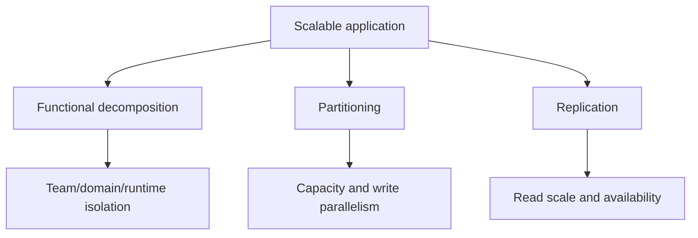

它们正交且可组合：microservices 各自 partition database，每个 partition 再 replicate；broker 自身也 partition/replicate。

### 22.2 Managed services 的信息

少量 managed-service primitives 可构建大量应用，主要吸引力是由别人承担 pager/on-call 的底层系统：

- Compute，例如 EC2；
- Load balancing，例如 ELB；
- File store，例如 S3；
- Key-value/document store，例如 DynamoDB；
- Messaging，例如 SQS、Kinesis；
- 优化层，例如 managed Redis/Memcached、CDN。

这些是原书给出的 cloud examples，不是唯一选择，也不表示 managed service 无需用户做容量、语义、安全和 failure design。

### 22.3 先 scalable core，再优化

原书强调先用 robust primitives 建 scalable core，再添加 cache/CDN 等优化。它与 Chapter 20 “没有 cache 也应存活”一致。

---

## 23. 知识结构

```mermaid
flowchart TD
    M[Messaging]
    M --> A[Asynchronous indirect communication]
    A --> B[Broker/channel buffer]
    A --> CE[Command vs event]
    A --> AD[Inbound/outbound adapters]
    A --> AC[202 accepted workflow]

    M --> BE[Benefits]
    BE --> TD[Temporal decoupling]
    BE --> LL[Load leveling]
    BE --> CS[Consumer scale-out]
    BE --> BA[Batching]

    M --> ST[Styles]
    ST --> OW[One-way]
    ST --> RR[Request-response + correlation]
    ST --> BC[Broadcast/pub-sub]

    M --> G[Guarantees]
    G --> OR[Partition-local ordering]
    G --> AL[At-least-once]
    AL --> VT[Visibility timeout]
    AL --> DUP[Duplicate window]
    DUP --> ID[Idempotent inbox processing]

    M --> F[Failures]
    F --> RET[Bounded retries]
    F --> DLQ[Dead-letter channel]

    M --> BL[Backlogs]
    BL --> RATE[Arrival vs deletion rate]
    BL --> AGE[Oldest / first-read age]
    BL --> DRAIN[Drain time]

    M --> ISO[Fault isolation]
    ISO --> SRC[Trusted source identifier]
    ISO --> SLOW[Low-priority channel]

    M --> SUM[Part III summary]
    SUM --> FD[Functional decomposition]
    SUM --> PA[Partitioning]
    SUM --> RE[Replication]
```

---

## 24. 核心结论

1. **Fire-and-forget 不提供 durable handoff；receiver crash 可静默丢工作。**
2. **Message channel 是 producer 与 consumer 之间的 temporary durable buffer，支持 receiver 离线时异步通信。**
3. **Message header 承载 ID/metadata，body 承载内容；message schema 是 service API contract。**
4. **Command 请求执行操作，event 陈述已发生事实；两者 ownership 和 fan-out 不同。**
5. **视频流程应在 file upload 与 message durable enqueue 后返回 `202 Accepted`，但 202 不表示处理完成。**
6. **Messaging 提供 temporal decoupling、consumer scale-out、load leveling 和 batching。**
7. **Batching 用额外等待 latency 换 fixed-cost amortization 和 throughput。**
8. **Point-to-point 每次把 message 交给一个 consumer；pub-sub 为各 subscription/group 提供 logical copy。**
9. **One-way、request-response 和 broadcast 是三种主要 messaging style。**
10. **Request-response 用 request ID 和 reply channel correlation；它仍需 timeout、late/duplicate response 处理。**
11. **Broker 本身是 distributed system；ordering、delivery、durability、latency、standards 和 limits 是取舍。**
12. **Kafka-style partition 只提供 partition-local order；同 consumer group 每 partition 同时一个 owner 才能保留消费顺序。**
13. **Partitioning 增 throughput，也带来 hot partition、rebalance 和 ordering scope 限制。**
14. **本章后半采用 point-to-point、at-least-once、visibility timeout、成功后 delete 的模型。**
15. **Visibility timeout 是 lease，不是 transaction；处理过久、crash 或 ack loss 都会 duplicate。**
16. **Delete-before-process 会丢，delete-after-process 会重复，通用 exactly-once delivery 不可依赖。**
17. **Exactly-once business effect 需 message ID、幂等操作，或 inbox 与业务 state 的原子 transaction。**
18. **External effect 需 provider idempotency key、outbox 和 reconciliation 扩展原子性边界。**
19. **永久失败 message 应有限 retry 后进 DLQ，不能无限污染 main channel。**
20. **DLQ move 自身要防 delete/write partial failure，并必须有 owner、alert、repair 和 redrive。**
21. **长期稳定需要 arrival rate 小于 deletion rate；否则 backlog 以 $\lambda-\mu$ 增长。**
22. **Backlog 是 degraded mode；越久，storage 和 drain time debt 越大。**
23. **Queue length 需结合 arrival/deletion rate 与 oldest-message age；跨时钟 age 有误差但可预警。**
24. **Poison retries 消耗 healthy capacity；source ID 和 low-priority channel 可提前隔离 noisy producer。**
25. **Part III 的三个正交扩展模式是 functional decomposition、partitioning 和 replication。**
26. **Managed compute/LB/file/data/messaging primitives 可构建 scalable core，cache/CDN 应作为后续优化。**

---

## 25. 一般化的解决问题方法

### 25.1 将长任务改写为 durable state transition

不要只“启动后台线程”。先把 intent 变成可恢复 message/job，再回复 accepted。

### 25.2 分离 acceptance 与 completion

定义 broker acceptance、processing state、result、failure 和 client observation；`202` 只是第一阶段。

### 25.3 把 broker guarantee 写成应用不变量

明确 ordering scope、delivery、durability、visibility、retention、size 和 replay。产品名不能替代语义。

### 25.4 默认设计 duplicate

画出 effect commit 与 message delete 之间的 crash window；使用 stable ID、inbox/unique constraint 和 provider idempotency。

### 25.5 将 ordering 约束缩到最小 key scope

全局顺序昂贵且限制并行。只让真正关联的 entity messages 共 partition，并监控 hot key。

### 25.6 将失败分类而非一律 retry

Transient backoff；permanent validation 早隔离；overload backpressure；unknown 有限 retry 后 DLQ。

### 25.7 把 backlog 视为 capacity debt

用 $Q$、$\lambda$、$\mu$ 和 oldest age 计算增长、用户延迟与 drain time，不以“broker 还能存”判断健康。

### 25.8 在 message 级隔离前增加 source 级隔离

DLQ 隔离单条 poison；source quota/slow lane/bulkhead 防一个 tenant 批量消耗 shared capacity。

### 25.9 对所有跨 channel move 设计原子性

Main->DLQ、main->slow、outbox->broker 都有 write/delete dual-operation window；优先 native transaction，或 stable ID + write-before-delete + reconciliation。

### 25.10 先建 scalable core，再增加优化

组合 functional decomposition、partitioning、replication 和 managed primitives；cache/batch 等优化不能掩盖基础 capacity/failure 缺陷。

最终方法可压缩为：

```text
identify work that should outlive the caller and receiver instance
-> durably enqueue a command/event with a stable message ID
-> return acceptance separately from completion
-> choose point-to-point or pub-sub and the smallest ordering scope
-> assume at-least-once and make effects idempotent
-> process effect plus inbox atomically, then delete
-> bound retries and preserve poison messages in a DLQ
-> measure arrival, deletion, oldest age, and drain time
-> isolate bad sources before they consume shared retry capacity
-> rehearse crash-before-effect, crash-after-effect, backlog, redrive, and replay
```
