> 本文严格沿原章顺序展开：先区分 fault 与 failure，再依次讨论 hardware faults、incorrect error handling、configuration changes、single points of failure、network faults、resource leaks、load pressure、cascading/metastable failures，最后用 probability × impact risk matrix 管理风险。原章正文约 9 页；文中的可用性预算、故障树、资源耗尽、排队/重试反馈、风险评分、FMEA 和 C11 级联模拟用于补足直觉与工程应用，不应误认为原书逐字给出的概率模型、SRE 流程或后续章节韧性模式的完整实现。

## 0. Part IV 导读：扩展性增加了能力，也增加了会失败的部件

### 0.1 从 Scalability 到 Resiliency

Part III 使用三个正交模式扩展系统：

- Functional decomposition：增加 services；
- Partitioning：增加 shards/nodes；
- Replication：增加 copies/instances。

共同副作用是 moving parts 增加。若每个部件在某时间窗内有非零 fault probability，部件越多，至少一个出问题的概率通常越高。

在极度简化、各部件独立且故障概率相同为 $p$ 的模型中，$N$ 个部件至少一个 fault：

$$
P(any\ fault)=1-(1-p)^N
$$

例如 $p=0.001$、$N=1{,}000$：

$$
P(any\ fault)=1-0.999^{1000}\approx63.23\%
$$

这不是系统 failure probability，因为 redundancy 可能容忍 fault；现实 faults 也常相关。它只说明：大规模系统必须把 fault 当日常事件，而不是异常巧合。

### 0.2 Murphy's law

Part IV 引言引用：

> Anything that can go wrong will go wrong.

工程含义不是悲观，而是：

- 不依赖“应该不会发生”；
- 枚举 failure modes；
- 自动 detect/react/repair；
- 限制 blast radius；
- 演练恢复，而非只写文档。

### 0.3 Availability budget 为什么迫使自动化

Availability $A$ 对应时间窗 $T$ 内最大 downtime：

$$
DowntimeBudget=(1-A)T
$$

原书 Part IV 引言举例：

- 99% availability：每天约 14.4 分钟，通常近似说 15 分钟；
- 99.9% availability：30 天月约 43.2 分钟。

$$
24h\times60\times0.01=14.4min/day
$$

$$
30\times24h\times60\times0.001=43.2min/month
$$

人工发现、叫醒 on-call、登录、诊断通常已经耗尽预算。因此越多“9”，系统越需自动检测、隔离和恢复。

### 0.4 后续章节路线

Chapter 24 先回答“什么会出错”，后续分别回答：

- Chapter 25：redundancy；
- Chapter 26：fault isolation；
- Chapter 27：downstream timeout/retry/circuit breaker；
- Chapter 28：upstream load shedding/load leveling/rate limiting。

本章是 hazard inventory，不试图一次给出所有修复。

---

## 1. Fault 与 failure

### 1.1 Failure 的定义

当系统不再向 users 提供符合 specification 的 service，就发生 failure。

形式化地，设 specification 允许的 observable behavior 集合为 $S$，实际 behavior 为 $b$：

$$
Failure\iff b\notin S
$$

因此 failure 以外部 contract/user outcome 判断，不以“某进程有 error log”判断。

例子：

- Replica crash，但请求自动转到其他 replica：有 fault，无 user-visible failure；
- 所有 replicas 返回 500：fault 已变成 failure；
- Response 正确但超过 latency SLO：若 latency 属于 specification，也算 failure；
- 返回过期权限导致未授权访问：功能“有响应”但违反安全 specification，仍是 failure。

### 1.2 Fault 的定义

Fault 是 system internal component 或 external dependency 的异常，它可能导致 failure。

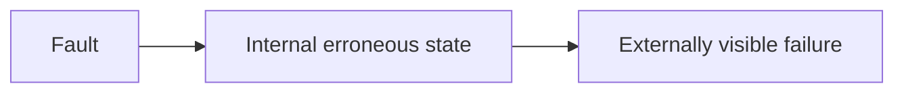

经典 fault-error-failure chain：

1. Fault 激活；
2. 系统进入错误 internal state；
3. 错误跨 service boundary 暴露，成为 failure。

不是每个 fault 都激活，也不是每个 error 都越过 boundary。

### 1.3 Fault tolerance

Fault-tolerant system 在指定 fault assumptions 下仍满足 specification：

```text
fault occurs
-> detect/mask/isolate/recover
-> no user-visible failure, or bounded degradation
```

必须说明容忍范围：

- 一个 disk failure？
- 一个 zone？
- Byzantine input？
- 10 秒 network partition？
- 30% overload？

“Highly available”若没有 failure model 只是口号。

### 1.4 Root cause、trigger 与 contributing factor

Incident 常不是单一原因：

- Latent code bug；
- Configuration change 激活 bug；
- Traffic spike 放大；
- Missing timeout 传播；
- Retry 形成 cascade。

与其强行找一个 root cause，更有用的是画 causal graph，识别 trigger、precondition、amplifier 和 missing defense。

---

## 2. 24.1 Hardware faults

### 2.1 任何物理部件都可能失败

原章列举：

- HDD；
- SSD；
- Memory module；
- Power supply；
- Motherboard；
- NIC；
- CPU。

Failure mode 不只有 stop：

- Crash-stop；
- Intermittent reset；
- Slow I/O；
- Bit corruption；
- Packet loss；
- Thermal throttling；
- Partial interface failure。

### 2.2 Data corruption 比 crash 更危险

Crash 通常明显，corruption 可能静默传播：

```text
bad memory/disk bit
-> application reads plausible wrong bytes
-> replication copies wrong state
-> backups include corruption
```

保护手段包括 checksum、ECC、scrubbing、end-to-end validation、versioned backup 和 repair。Replication 若没有 integrity verification，会复制 corruption，而非修复它。

### 2.3 故障域可以很大

不只是 machine：power cut 或 natural disaster 可让整个 data center/region unavailable。

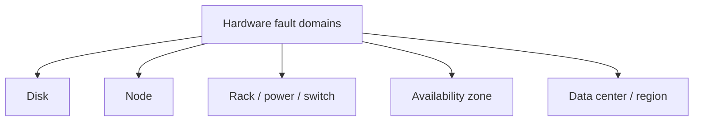

三个 replicas 若都在同 rack，不提供 rack fault tolerance；若都依赖同一 control plane/config，也可能 common-mode fail。

### 2.4 Redundancy 的作用与前提

后续 Chapter 25 会展开 redundancy。简化独立模型中，$r$ 个 copies 同时失败概率约：

$$
P_{all}\approx p^r
$$

但前提是 failures 不相关。共同 power、firmware、operator action 会破坏独立性。

### 2.5 Hardware 不是主要事故原因的直觉纠偏

硬件 fault 易想到，也易通过成熟云/存储冗余处理。作者转折指出，distributed application 的灾难性 failures 往往来自更普通的软件和操作问题。

---

## 3. 24.2 Incorrect error handling

### 3.1 2014 研究结论

原章引用对五个流行 distributed data stores 的 user-reported failures 研究：多数 catastrophic failures 来自对 non-fatal errors 的错误处理。

关键反直觉：

> 原始 error 本可恢复或局部影响，错误 handler 却把它升级成 catastrophic failure。

### 3.2 原章列出的错误模式

1. 完全忽略 error；
2. Catch overly generic exception，例如 Java `Exception`；
3. 无必要 abort entire process；
4. Handler 只实现一部分；
5. Production path 仍有 `FIXME`/`TODO`。

### 3.3 Error swallowing

```text
write failed
-> error ignored
-> caller receives success
-> invariant silently broken
-> corruption appears later
```

Silent error 会延迟 detection，丢失 causal context。正确做法不一定是 crash，而是按 contract propagate、retry、compensate、degrade 或 fail fast。

### 3.4 Overly broad catch

```java
try {
    process();
} catch (Exception e) {
    System.exit(1);
}
```

把 validation error、timeout、programming bug、out-of-memory signal 一视同仁，无法做正确策略。

Error taxonomy 应区分：

- Transient/retryable；
- Permanent client error；
- Overload；
- Dependency unavailable；
- Data corruption/invariant violation；
- Programmer bug；
- Process-fatal condition。

### 3.5 Retry 也是 error handling bug 来源

错误地 retry：

- Non-idempotent operation 重复副作用；
- Permanent error 无限重试；
- Overload 时放大 load；
- 无 deadline/backoff/jitter；
- 多层 retry 乘法放大。

“Catch and retry”不是通用修复。

### 3.6 为什么简单测试能发现

研究指出很多 bug 用 simple tests 即可发现：

- Inject expected exception；
- Simulate disk full；
- Timeout dependency；
- Return malformed data；
- Verify no silent success；
- Verify resource cleanup；
- Verify blast radius。

Error path 若只在 production 首次执行，就不是可靠实现。

### 3.7 Error handling 为什么常被忽略

Happy path 可演示 feature；error path 缺乏即时产品价值、状态组合多、难复现。作者把它视为 afterthought，并预告 Chapter 29 测试实践。

原章脚注同时指出，Go language 对显式 error handling 的强调，正是为了让错误路径不那么容易被忽略。

工程原则：每个 external/resource operation 都要先设计 failure contract，再写 happy path。

---

## 4. 24.3 Configuration changes

### 4.1 Leading root cause

Configuration change 是 catastrophic failure 的主要 root cause 之一。危险不只来自 typo/invalid config，也来自：

- 合法但错误的值；
- 启用 rarely used feature；
- Feature 已退化/从未真正工作；
- 参数组合未经测试；
- 全 fleet 同时生效。

### 4.2 Configuration 与 code 同等有能力破坏系统

Config 可改变：

- Routing；
- Authentication/authorization；
- Quota/rate limit；
- Timeout/retry；
- Feature path；
- Replica/partition placement；
- Resource limits。

因此 config 本质上是输入系统的 program/data，应有 schema、review、test、version 和 rollout。

### 4.3 Delayed effect

原章强调 config effect 可延迟。如果某值只在 rarely used feature 被访问时读取：

```text
t0: bad configuration accepted
t0 + days: rare path executes
-> failure appears far from change
```

这扩大 mean time to detection，也让 responders 难关联最近 change。

### 4.4 Preventive validation

Validation 应在 change time，而非 use time：

- Syntax/type/schema；
- Range/unit；
- Cross-field invariant；
- Referenced resource existence；
- Permission/security；
- Dry-run/compile；
- Capacity impact；
- Backward compatibility。

仅验证“可解析”不足。例如 timeout `0` 可能合法，但语义是无限等待或立即 timeout。

### 4.5 Config-as-code release

原章要求 configuration changes：

- Version-controlled；
- Tested；
- Released like code；
- Preventively validated。

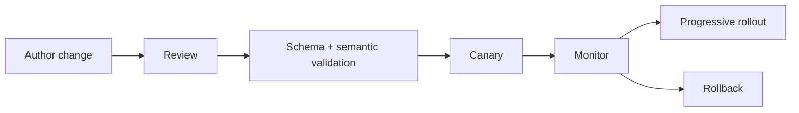

Chapter 30 会展开 continuous deployment。

### 4.6 Global config blast radius

同一错误瞬间推全 fleet 是 common-mode fault。缓解：

- Canary subset；
- Cell/region staged rollout；
- Last-known-good；
- Atomic install；
- Automatic rollback；
- Change rate limit；
- Emergency stop；
- Config age/version telemetry。

---

## 5. 24.4 Single points of failure

### 5.1 定义

Single point of failure（SPOF）是其 failure 会带下整个 system 的 component。

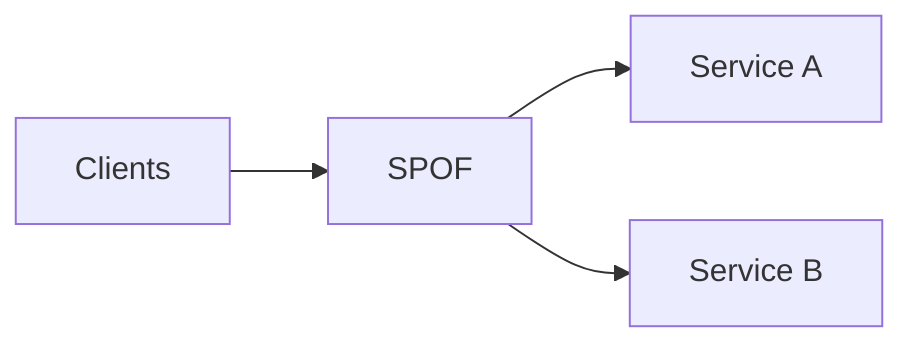

系统可以同时有多个 SPOFs。

### 5.2 SPOF 不一定是单实例

即使有多个 replicas，以下 shared dependency 仍是 SPOF：

- One DNS zone/account；
- One certificate/CA chain；
- One configuration value；
- One database leader without safe failover；
- One cloud region；
- One IAM key；
- One human approval/execution path；
- One software bug deployed everywhere。

SPOF 是 failure dependency，不是机器数量。

### 5.3 Humans as SPOFs

原章直言 humans make great SPOFs。若一人可独立执行灾难性操作，早晚会出错。

典型场景：人工按特定顺序执行多个 operational steps，不能错一步。

计算机擅长重复执行 instructions，因此应尽量 automation：

- Runbook automation；
- Guardrails；
- Two-person approval for irreversible action；
- Dry-run；
- Idempotent steps；
- Preconditions/postconditions；
- Audit/rollback。

Automation 本身也可能把错误快速扩散，必须 test/canary/bound scope。

### 5.4 DNS as SPOF

Client 无法 resolve domain 就无法 connect，即便 application healthy。原因包括：

- Domain expiration；
- Registrar/DNS provider outage；
- Bad record/delegation；
- Root/TLD event；
- DNSSEC/config error；
- Resolver/network failure。

需要 domain renewal automation、multi-provider/zone strategy（按风险）、monitoring、TTL planning 和 ownership。

### 5.5 TLS certificate as SPOF

Certificate expired，client 无法建立 secure connection。还可能：

- Wrong hostname；
- Broken chain；
- Revoked cert；
- Key rotation failure；
- Time skew；
- CA/dependency failure。

自动 issuance/renewal 不够，还要从 external client path 验证 deployed cert expiry 和 chain。

### 5.6 如何寻找 SPOF

作者建议逐 component 问：

> What happens if it fails?

扩展问题：

- 如果它 slow 而非 down？
- 如果返回 corrupt/stale data？
- 如果整个 failure domain down？
- 如果 failover control plane down？
- 如果 operator credential 不可用？
- 如果 backup restore 失败？

可画 dependency graph/fault tree，从 user journey 反向追 required components。

### 5.7 Architect away 或降低 blast radius

- 可消除：redundancy、failover、多 zone；
- 无法消除：partition/cell/bulkhead、degrade、quota、manual fallback；
- 目标是让 fault 只影响一个 tenant/feature/region，而非全站。

后续 chapters 重点展开 blast-radius reduction。

---

## 6. 24.5 Network faults

### 6.1 没有 prompt response 的多种原因

Client 发 request 后没及时收到 response，可能是：

- Server slow；
- Server crash during processing；
- Request lost；
- Response lost；
- Small packet loss 触发 retransmission/delay；
- Network partition；
- Queueing/congestion；
- DNS/TLS/connect delay。

Client 无法仅凭 silence 区分。

### 6.2 两个选择：继续等或 timeout

无 timeout：call 可能永远不返回，资源永久占用。Timeout 太短：误判 slow success、制造 retry。Timeout 是 failure detector，有 completeness/accuracy tradeoff。

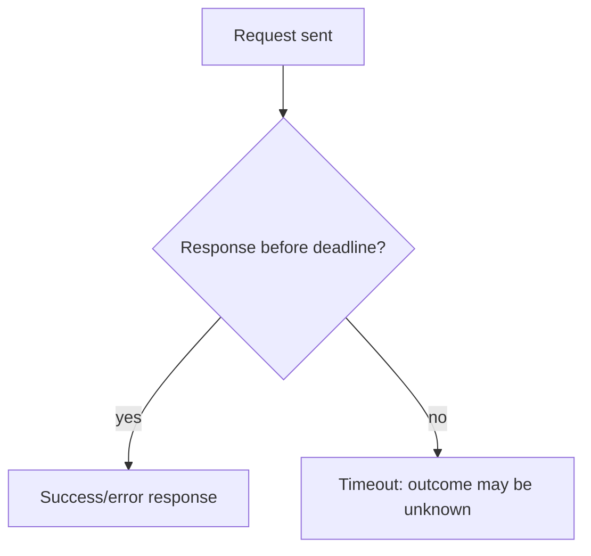

Timeout 不表示 server 未执行。对 write 来说，结果可能 committed 但 response lost；retry 需 idempotency。

### 6.3 Slow calls 是 silent killers

Slow failure 不像 crash 那样快速触发 failover。Client 长时间占用：

- Thread；
- Socket/connection；
- Memory/request context；
- Queue slot；
- Upstream deadline；
- User concurrency。

性能逐渐退化，难 debug。

### 6.4 Gray failure

Gray failure 很微妙，无法快速/准确检测：

- 只对部分 peers 丢包；
- p50 正常、p99 极慢；
- Health endpoint 快，real requests 卡住；
- 一种 packet size/path 失败；
- One-way connectivity。

不同 observers 可对同一 node 得出不同 health judgment。

### 6.5 资源占用模型

Little's Law：平均并发 $L$、arrival rate $\lambda$、平均 duration $W$：

$$
L=\lambda W
$$

若 $\lambda=1{,}000/s$，dependency latency 从 50 ms 升到 5 s：

$$
L_{normal}=1{,}000\times0.05=50
$$

$$
L_{slow}=1{,}000\times5=5{,}000
$$

即使 QPS 不变，in-flight resource 增百倍。

### 6.6 防传播原则

后续 Chapter 27 会展开：timeout、bounded retry、circuit breaker。此处核心是：任何可能不返回的 operation 都必须有 deadline/cancellation 和 resource cleanup。

---

## 7. 24.6 Resource leaks

### 7.1 Very slow 与 down 的用户视角

二者都无法完成 useful work。Resource leak 常先表现为 gray degradation，最终 crash/exhaustion。

### 7.2 Memory leak

Memory consumption 随时间增加：

$$
M(t)=M_0+rt
$$

$r$ 为 leak rate。Memory limit $M_{max}$ 的粗略耗尽时间：

$$
T_{exhaust}\approx\frac{M_{max}-M_0}{r}
$$

例如 baseline 2 GB、limit 8 GB、leak 50 MB/min：

$$
T\approx\frac{6{,}000MB}{50MB/min}=120min
$$

### 7.3 Garbage collection 语言也会 leak

GC 只回收 unreachable objects。无用 object 若仍被 reference（global map、listener、cache、closure），GC 不知道它逻辑上无用。

随着 memory 紧张：

- GC 更频繁；
- CPU 消耗增加；
- Pause/latency 上升；
- OS aggressive swap；
- 最终 allocation failure。

### 7.4 Thread pools 的资源泄漏

Thread 从有限 pool 取出，执行无 timeout 的 blocking HTTP call，call 永不返回，thread 永不归还。

Pool capacity $P$，leak rate $r_t$ threads/min：

$$
T_{pool}\approx\frac{P-Used_0}{r_t}
$$

一旦所有 threads 被占，新 request 排队/拒绝，process 看似活着却不工作。

### 7.5 Async 不会自动解决

Async HTTP 不长期占 thread，但仍占 socket/connection pool。无 timeout request 永不结束，connection 不归还，最终 socket pool exhausted。

还可能 leak：

- File descriptors；
- Database connections；
- Locks/semaphores；
- Goroutines/tasks；
- Timers；
- Buffers；
- Temporary disk；
- Queue permits。

### 7.6 Libraries 共享同一资源

Dependency library 也能 leak memory/thread/socket。Application-level dashboard 必须看 process/container 总资源，而不只自己代码 counters。

### 7.7 资源生命周期原则

```text
acquire
-> bounded use with timeout/cancellation
-> release in all success/error/cancel paths
```

使用 RAII/`defer`/`finally`、pool metrics、leak tests、heap/profile、max lifetime 和 watchdog。Restart 可暂时 self-heal，但不替代 root fix。

---

## 8. 24.7 Load pressure

### 8.1 Capacity 有限

每个系统都有 capacity $C$。Incoming offered load $L$：

- $L<C$：有 headroom；
- $L\approx C$：queue/tail 对波动敏感；
- $L>C$：backlog、timeout、shed 或 collapse。

Capacity 不是固定常数，会受 request mix、dependency latency、cache hit、GC、failure 和 deploy 影响。

### 8.2 Organic growth 与 sudden flood

- Organic：缓慢增长，autoscaling 有时间观察/启动/warm；
- Sudden：在 scale reaction time 内超过 capacity。

Autoscaling latency $T_s$，burst duration $T_b$。若 $T_b<T_s$，autoscaling 可能在 burst 结束后才产生 capacity，还可能 overshoot。

### 8.3 原章列出的 load 变化

1. Seasonality：不同时间/国家 users；
2. Request cost 差异：scrapers 以超人速度抓取；
3. Malicious DDoS：饱和 bandwidth，拒绝 legitimate users。

### 8.4 QPS 不等于 work

设 request class $i$ rate 为 $\lambda_i$、cost 为 $c_i$：

$$
OfferedWork=\sum_i\lambda_i c_i
$$

100 个昂贵 report queries 可能比 10,000 个 cached reads 更重。Load shedding/rate limit 应按 cost/priority，不只 request count。

### 8.5 Queueing cliff

Utilization $\rho=\lambda/\mu$ 接近 1 时，简单 M/M/1 模型平均 queue wait：

$$
W_q=\frac{\rho}{\mu-\lambda}
$$

这是教学模型，真实 distributed service 非 M/M/1；但揭示当 $\lambda\to\mu$，latency 非线性上升。100% utilization 不是高效率，而是没有吸收 variance/failure 的余量。

### 8.6 Autoscale 与 reject

有些 surge 可加 capacity；另一些必须 reject/shed 保护系统。Chapter 28 将展开：

- Load shedding；
- Load leveling；
- Rate limiting；
- Constant work。

正确目标不是“接受所有请求”，而是 maximal useful work under bounded resources。

---

## 9. 24.8 Cascading failures

### 9.1 Fault 如何传播

Components 互相依赖，一处 failure 增加其他 components 的 failure probability：

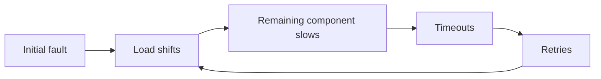

正反馈把局部 fault 放大成 system-wide failure。

### 9.2 Figure 24.1：正常状态

Two database replicas A/B behind LB，各 50 transactions/s：

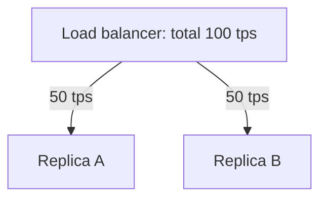

假设每 replica capacity 为 60 tps，正常 utilization：

$$
\rho=\frac{50}{60}=83.3\%
$$

已有 16.7% headroom，但不足以承接另一整台。

### 9.3 Figure 24.2：B unavailable

Network fault 使 B 被 LB 摘除，A 接收 100 tps：

$$
\rho_A=\frac{100}{60}=166.7\%
$$

A 无法跟上，latency/timeout 增加。

### 9.4 Retry amplification

若原始 rate $\lambda$，失败比例 $f$，每失败请求平均额外 retry $r$ 次：

$$
OfferedLoad\approx\lambda(1+fr)
$$

在 overload 时 $f$ 上升，load 进一步上升，形成 feedback。

例：100 tps、40% fail、每次 retry 1 次：

$$
100(1+0.4)=140tps
$$

### 9.5 LB 摘除 A

A 大量 timeout 后也被 LB 判 unhealthy，pool 变空。原始 B 恢复时成为唯一 replica，接收全部 original + retries，再次 overload，被摘除。

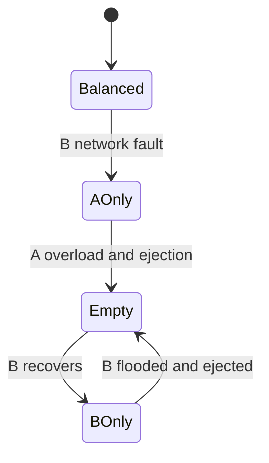

即使原 network fault 已消失，系统仍无法恢复。

### 9.6 Metastable failure

系统进入一个 degraded self-sustaining state：触发 fault 消失后，内部 feedback 仍维持 failure。这类 failure 称 metastable。

三个要素：

- Trigger：B network fault；
- Vulnerable state：无 N-1 capacity/retry limits；
- Sustaining feedback：timeouts -> retries -> overload -> ejection。

### 9.7 为什么需要大 corrective action

原章举出的 corrective action 是临时阻断到 replicas 的 traffic，以打破 loop。工程上可将这一原则延伸为：

- Stop/limit admission；
- Drain retry queues；
- Recover/warm replicas；
- Gradually reintroduce traffic；
- Disable retry；
- Shed low-priority work。

只让一个 node 回 pool 不够，它会立即被 flood。

### 9.8 预防优于事后恢复

Metastable failure 开始后难 mitigate。预防：

- N+1/N-1 headroom；
- Bounded retry budget；
- Load shedding；
- Circuit breaker；
- Slow start on recovery；
- Health hysteresis；
- Fault isolation/cells；
- Queue/concurrency limits；
- Static stability。

后续章节逐项展开。

---

## 10. 可运行 C11 模拟：副本故障、重试级联与 load shedding

### 10.1 模拟目标

程序复现 Figure 24.1/24.2：

- A/B 各 capacity 60，正常总流量 100，各 50；
- B network fault 后，A 收到 100，只完成 60，40 timeout；
- 40 retries 使 offered load 变 140，A 因 overload 被摘除；
- B 恢复但单独接收 140，也只能完成 60，再次被摘除；
- Trigger fault 已消失，pool 却为空，表示 metastable state；
- Corrective action 暂停 retry、恢复两 replicas，并 load-shed 到 100，系统重回 50/50；
- 计算 normal/fault/recovery risk score；
- 所有算术检查 overflow，不依赖 `assert`。

这是离散教学模型，不是 queueing simulator 或真实 LB health algorithm。

### 10.2 完整代码

```c
#include <stdbool.h>
#include <limits.h>
#include <stddef.h>
#include <stdio.h>

enum { REPLICA_COUNT = 2, REPLICA_CAPACITY = 60 };

typedef struct {
    bool in_pool;
    unsigned int assigned;
    unsigned int served;
} Replica;

typedef struct {
    Replica replicas[REPLICA_COUNT];
    unsigned int offered;
    unsigned int served;
    unsigned int failed;
} StepResult;

typedef struct {
    unsigned int probability;
    unsigned int impact;
} Risk;

static bool add_checked(unsigned int left,
                        unsigned int right,
                        unsigned int *result) {
    if (result == NULL || left > UINT_MAX - right) {
        return false;
    }
    *result = left + right;
    return true;
}

static bool distribute(Replica *replicas,
                       unsigned int offered,
                       StepResult *result) {
    size_t active_count = 0;
    size_t index;
    unsigned int remaining;

    if (replicas == NULL || result == NULL) {
        return false;
    }
    *result = (StepResult){0};
    result->offered = offered;
    for (index = 0; index < REPLICA_COUNT; index++) {
        replicas[index].assigned = 0;
        replicas[index].served = 0;
        if (replicas[index].in_pool) {
            active_count++;
        }
    }
    if (active_count == 0) {
        result->failed = offered;
        return true;
    }

    remaining = offered;
    while (remaining > 0) {
        for (index = 0; index < REPLICA_COUNT && remaining > 0;
             index++) {
            if (replicas[index].in_pool) {
                replicas[index].assigned++;
                remaining--;
            }
        }
    }

    for (index = 0; index < REPLICA_COUNT; index++) {
        Replica *replica = &replicas[index];
        if (!replica->in_pool) {
            continue;
        }
        replica->served = replica->assigned < REPLICA_CAPACITY
            ? replica->assigned
            : REPLICA_CAPACITY;
        if (!add_checked(result->served, replica->served,
                         &result->served)) {
            return false;
        }
        if (replica->assigned > REPLICA_CAPACITY) {
            replica->in_pool = false; /* overload causes ejection */
        }
    }
    result->failed = result->offered - result->served;
    return true;
}

static bool risk_score(Risk risk, unsigned int *score) {
    if (score == NULL ||
        (risk.impact != 0 &&
         risk.probability > UINT_MAX / risk.impact)) {
        return false;
    }
    *score = risk.probability * risk.impact;
    return true;
}

int main(void) {
    Replica replicas[REPLICA_COUNT] = {
        {true, 0, 0},
        {true, 0, 0}
    };
    StepResult normal;
    StepResult after_fault;
    StepResult retry_wave;
    StepResult unstable_recovery;
    StepResult stabilized;
    unsigned int retry_offered;
    unsigned int zero_risk;
    unsigned int low_risk;
    unsigned int high_risk;

    if (!distribute(replicas, 100, &normal) ||
        normal.served != 100 || normal.failed != 0 ||
        replicas[0].assigned != 50 || replicas[1].assigned != 50) {
        return 1;
    }
    printf("normal offered=100 A=50 B=50 failed=0\n");

    replicas[1].in_pool = false; /* network fault at B */
    if (!distribute(replicas, 100, &after_fault) ||
        after_fault.served != 60 || after_fault.failed != 40 ||
        replicas[0].in_pool) {
        return 1;
    }
    printf("B_down offered=100 A_served=60 failed=40 A_ejected=1\n");

    if (!add_checked(100, after_fault.failed, &retry_offered) ||
        !distribute(replicas, retry_offered, &retry_wave) ||
        retry_wave.served != 0 || retry_wave.failed != 140) {
        return 1;
    }
    printf("retry_wave offered=140 active=0 failed=140\n");

    replicas[1].in_pool = true; /* original network fault is gone */
    if (!distribute(replicas, retry_offered, &unstable_recovery) ||
        unstable_recovery.served != 60 ||
        unstable_recovery.failed != 80 || replicas[1].in_pool) {
        return 1;
    }
    printf("B_recovers offered=140 B_served=60 failed=80 "
           "B_ejected=1 metastable=1\n");

    replicas[0].in_pool = true;
    replicas[1].in_pool = true;
    if (!distribute(replicas, 100, &stabilized) ||
        stabilized.served != 100 || stabilized.failed != 0 ||
        replicas[0].assigned != 50 || replicas[1].assigned != 50) {
        return 1;
    }
    printf("corrective_shed offered=100 A=50 B=50 failed=0 stable=1\n");

    if (!risk_score((Risk){0, 5}, &zero_risk) || zero_risk != 0 ||
        !risk_score((Risk){2, 2}, &low_risk) ||
        !risk_score((Risk){5, 5}, &high_risk) ||
        low_risk != 4 || high_risk != 25 ||
        risk_score((Risk){UINT_MAX, 2}, &high_risk)) {
        return 1;
    }
    printf("risk low=4 high=25\n");
    return 0;
}
```

### 10.3 编译运行

```bash
gcc -std=c11 -Wall -Wextra -Werror -pedantic failure_cascade.c -o failure_cascade
./failure_cascade
```

关键输出：

```text
normal offered=100 A=50 B=50 failed=0
B_down offered=100 A_served=60 failed=40 A_ejected=1
retry_wave offered=140 active=0 failed=140
B_recovers offered=140 B_served=60 failed=80 B_ejected=1 metastable=1
corrective_shed offered=100 A=50 B=50 failed=0 stable=1
risk low=4 high=25
```

### 10.4 模型解释

`distribute` 按 round-robin 分配 offered requests。Replica 超 capacity 时只完成 60，并被视为因 timeout/health degradation 被摘除。

注意 `retry_wave` 发生时 A/B 都已不在 pool，因此 140 全失败；B 单独恢复后仍被 140 flood，再度摘除。这个离散过程表达“触发 fault 消失，failure loop 仍持续”。

Corrective action 同时：

- 清除 retry carry-over；
- 恢复两个 replicas；
- 将 admitted offered load 限回 100。

它对应原章“temporarily blocking traffic”来打断 feedback loop。

### 10.5 示例局限

- 无真实 queue/latency/thread/network；
- 超 capacity 立即摘除，现实有 detection threshold/hysteresis；
- Retry 只一轮，未模拟 backoff/deadline；
- Recovery 直接恢复两个 nodes，无 warmup；
- Capacity 固定，同质 replicas；
- Risk 使用 ordinal 1–5 相乘，仅用于优先级；
- 无 correlated failure probability；
- `unsigned int` offered 的长期累积未建模。

因此程序验证 amplification/state transition，不预测生产系统 TPS。

---

## 11. 24.9 Managing risk

### 11.1 Faults inevitable，但不必修所有风险

Distributed application 必须接受 faults，准备 detect、react、repair。但“可能发生”不等于现在必须投入同样资源处理。

资源有限，应优先：

- Likely；
- High user impact；
- Hard to detect/recover；
- Large blast radius；
- Regulatory/safety critical。

### 11.2 原章 risk score

$$
Risk=Probability\times Impact
$$

这是排序工具：高概率高影响优先；低概率低影响可等待。

### 11.3 Figure 24.3 Risk matrix

原图横轴 probability：highly unlikely -> very likely；纵轴 impact：low -> extensive。颜色从 low 到 medium/high risk。

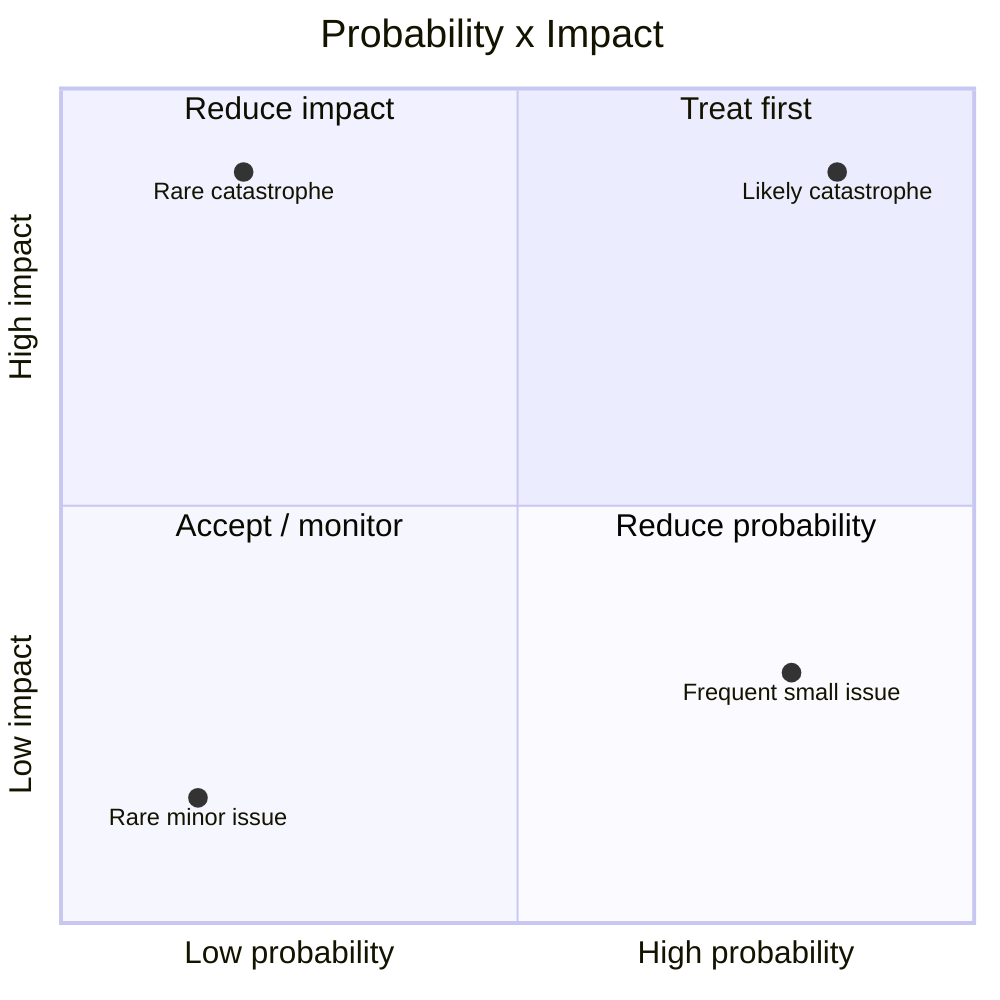

### 11.4 Ordinal score 的局限

若 probability/impact 仅标 1–5，乘积不是精确 expected loss：

- 等级间距不一定相等；
- 2×5 与 5×2 同分但策略不同；
- Low probability catastrophic safety risk 不能只按平均分；
- Estimates 有 uncertainty；
- Tail/common-mode risk 可能被低估。

更定量时可用：

$$
ExpectedLoss=P(event)\times Cost(event)
$$

但金钱难表示生命、安全、信任和合规。

### 11.5 Reduce probability 与 reduce impact

决定处理后有两个杠杆：

#### 降低 probability

- Better tests/error handling；
- Config validation/canary；
- Preventive maintenance；
- Capacity headroom；
- Safer automation；
- Remove trigger。

#### 降低 impact

- Redundancy；
- Fault isolation/cells；
- Load shedding；
- Timeouts/circuit breaker；
- Backups/restore；
- Graceful degradation；
- Limit privileges/blast radius。

通常组合使用。

### 11.6 Detectability 与 recoverability

FMEA 常再加入 detectability：难检测 fault 更危险。可考虑：

$$
RPN=Severity\times Occurrence\times Detectability
$$

但 RPN 仍是 ordinal heuristic。还应记录：

- Detection time；
- Mitigation time；
- Recovery confidence；
- Owner/runbook；
- Residual risk。

### 11.7 Risk acceptance

接受风险应显式记录：

- Why accepted；
- Assumptions；
- Owner；
- Monitoring；
- Review date/trigger；
- Fallback/insurance；
- Residual impact。

“没时间修”若未记录，只是隐式无主风险。

---

## 12. 九类原因之间的关系

它们不是互斥 root-cause buckets，而是常组成 chain：

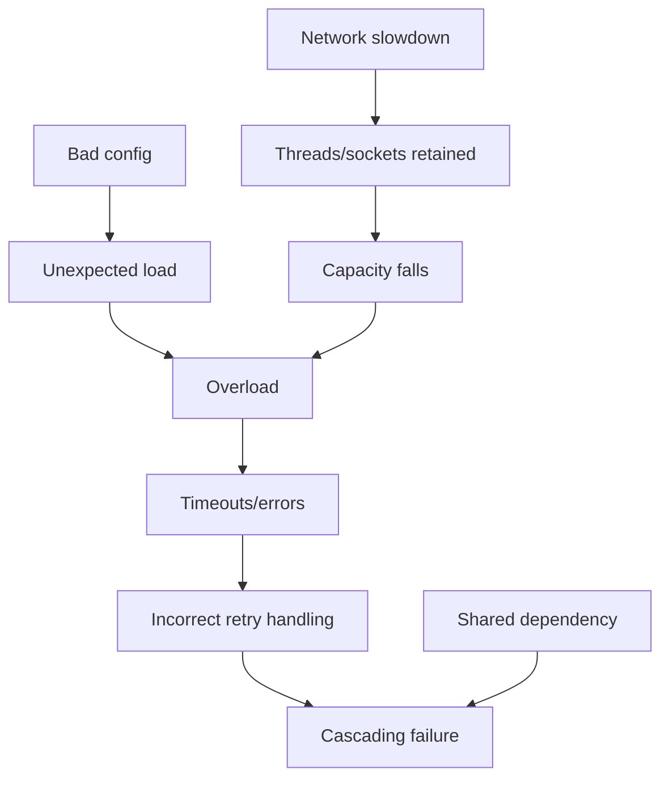

一个 postmortem 若只写“network fault”，会漏掉为什么 network fault 能导致全站失败：没有 timeout、资源池太小、retry 无界、无 N-1 capacity、健康检查抖动等才是放大条件。

### 12.1 Trigger 与 latent vulnerability

```text
incident severity = trigger x vulnerable system state x amplification
```

无法消除所有 trigger，但可消除 amplification pathway。

---

## 13. 容易混淆的概念

### 13.1 Fault 与 failure

Fault 是内部/依赖异常；failure 是 user-visible specification violation。Redundancy 可让 fault 不成为 failure。

### 13.2 Error 与 exception

Error 是错误状态/结果；exception 是语言传递机制之一。不是所有 error 都 throw，也不是所有 exception 都 fatal。

### 13.3 Root cause 与 trigger

Trigger 激活 incident；root/latent conditions 决定是否放大。只修 trigger 常不能防复发。

### 13.4 Hardware fault 与 data corruption

Hardware 不只 crash，也可 silently corrupt。Health/up 不代表数据正确。

### 13.5 Valid configuration 与 safe configuration

Syntax/schema valid 不代表语义、容量、兼容性安全。Rare path 必须 preventive test。

### 13.6 SPOF 与 single instance

多实例可共享 DNS、certificate、region、bug 和 operator，仍有 logical SPOF。

### 13.7 Slow 与 unavailable

对 deadline-bound client，过慢就是 unavailable；slow 还更容易占用资源并传播。

### 13.8 Memory leak 与 high memory usage

High usage 可是有界 working set；leak 是无用 resource 未释放、随时间趋势增长。看 slope 与 ownership。

### 13.9 Load 与 capacity

Load 是 offered work；capacity 是在 SLO 下可完成的 work。Request mix/latency 会改变 capacity。

### 13.10 Overload 与 DDoS

Overload 可来自合法 seasonality、昂贵请求、故障转移；DDoS 是恶意来源之一。

### 13.11 Cascading 与 correlated failure

- Correlated：多个 components 因同一原因同时 fail；
- Cascading：一个 fault 改变其他组件 load/state，依次传播。

两者可同时出现。

### 13.12 Metastable 与 persistent root cause

Metastable 中原 trigger 已消失，内部 feedback 仍维持 failure；不是原 fault 仍持续。

### 13.13 Risk 与 issue priority

Risk 是未来 uncertainty；active incident/known exploitable defect 还要考虑 urgency、compliance 和 committed SLO，不能机械按矩阵。

---

## 14. 常见误区与失败模式

### 14.1 “硬件是生产事故主要原因”

硬件醒目，但 error handling、config 和操作错误常更主要。两类都要防。

### 14.2 “Non-fatal error 忽略也没关系”

它可能破坏 invariant并延迟爆炸。每个 error path 要有明确 contract/test。

### 14.3 “Catch Exception 最安全”

过宽 catch 会误分类、隐藏 bug 或无故杀进程。捕获到能正确处理的最具体层级。

### 14.4 “配置不是代码，上线更轻量”

Config 可全局瞬时改变行为，应版本、测试、canary、rollback。

### 14.5 “自动化消除了人为错误”

自动化可更快复制错误。需要 guardrail、scope、review、dry-run 和 progressive execution。

### 14.6 “有两个 instances 就没有 SPOF”

检查 DNS、cert、LB、database、region、IAM、config 和 common code。

### 14.7 “Health endpoint 200 就不是 gray failure”

Real request path、部分 peer、p99 可能已失败。Health 要覆盖 useful work并多视角观察。

### 14.8 “Async call 不会泄漏 thread，所以安全”

仍可泄漏 socket、task、buffer 和 permit。所有 operation 需要 timeout/cancellation。

### 14.9 “GC 语言不会 memory leak”

Reachable but useless object 不会回收。

### 14.10 “Autoscaling 能接住任何流量”

启动有延迟，共享依赖可能不扩，DDoS/昂贵 request 需 reject。

### 14.11 “平均 CPU 低就有 capacity”

单 shard/lock/NIC/thread pool/p99 可饱和。Capacity 是多资源和 request mix 函数。

### 14.12 “Retry 提高成功率，不会伤害”

在 overload 时 retry 是额外攻击。必须 budget、backoff、deadline、idempotency。

### 14.13 “故障节点恢复后立即加回就行”

Metastable loop 中单 node 会被 backlog flood。需要 slow start、shed 和整体 reset。

### 14.14 “所有可能 fault 都要最高优先级处理”

按 probability/impact/detectability 排序，同时对 catastrophic/safety tail 设置底线。

### 14.15 “风险分数一样，处理方式一样”

高概率低影响应降频；低概率高影响应隔离/保险/灾备，策略不同。

---

## 15. 如何系统化管理常见故障

### 第一步：定义 user-visible specification

列出 correctness、latency、availability、durability、安全和数据 freshness。没有 spec 无法判断 failure。

### 第二步：画 dependency/failure graph

从 user journey 列所有 required components、control planes、DNS/cert、humans 和 external services。

### 第三步：枚举 failure modes

对每项问：

```text
down? slow? partial? corrupt? stale? overloaded? unreachable?
misconfigured? leaked? returns wrong error? recovers suddenly?
```

### 第四步：区分 fault containment 与 propagation

记录 fault 如何跨 boundary：traffic shift、retry、shared resource、config push、replication、queue。

### 第五步：量化 probability 与 impact

Impact 包括 users、duration、data loss、security、revenue、reputation。记录 uncertainty，不假装精确。

### 第六步：加入 detectability/recovery

测 MTTD、MTTM/MTTR、自动恢复与 runbook confidence。Gray failure 和 delayed config 尤其关注检测。

### 第七步：选择风险处理

- Avoid：删除危险 feature/dependency；
- Reduce probability：test/validate/canary；
- Reduce impact：redundancy/isolation/shed；
- Transfer：managed service/insurance（责任不完全消失）；
- Accept：记录并监控。

### 第八步：为 resource 设置 bound

Timeout、queue length、thread/socket pool、memory、retry、request body、concurrency 均有上限和 cleanup。

### 第九步：为 N-1 和 burst 留 headroom

容量测试包括 node/zone loss、request mix、cache cold、retry 和 rollout，不只 steady average。

### 第十步：安全发布 code/config

Version control、review、tests、semantic validation、canary、progressive rollout、monitor、automatic stop/rollback。

### 第十一步：故障注入和恢复演练

Disk/network fault、latency、packet loss、dependency timeout、pool exhaustion、bad config、DNS/cert、load spike、node recovery flood。

### 第十二步：从 incident 修系统而非责人

问为什么一个人的普通错误能成为 catastrophe；增加 automation、guardrail、isolation 和 feedback，不以“更小心”作为唯一 action item。

---

## 16. 作者如何形成解决思路

### 16.1 先建立 fault/failure 边界

不是所有内部异常都影响用户；fault tolerance 的目标是阻止 fault 穿过 specification boundary。

### 16.2 从醒目的硬件转向普通的软件原因

作者先承认任何 hardware/data center 都会 fail，再用研究说明 catastrophic failure 多由 non-fatal error handler 放大。

### 16.3 从 code 扩展到 operational state

Configuration 合法也可能危险，且 delayed activation 逃过早期检测，因此要按 code release。

### 16.4 把“单点”从机器扩展到人和基础 contract

Human runbook、DNS、TLS cert 都可使全系统不可达；寻找 SPOF 要遍历 dependency，而非数 replicas。

### 16.5 将 crash model 扩展为 gray degradation

Network slow 和 resource leak 说明“活着”不等于 useful；slow call 会占资源并传播。

### 16.6 从单 component 转向 load dynamics

Capacity 有限，请求 rate/type 变化；autoscaling 只处理部分 surge，其余需拒绝。

### 16.7 用 A/B replica 案例展示反馈放大

B fault -> A double load -> timeout/retry -> A eject -> B recovery flood。Trigger 消失仍 failure，揭示 metastability。

### 16.8 最后用 risk matrix 防止被问题数量淹没

Faults inevitable，但防御资源有限。Probability × impact 帮助排序，后续章节分别降低概率/影响。

---

## 17. 知识结构

```mermaid
flowchart TD
    C[Common failure causes]
    C --> FF[Fault vs failure]
    FF --> FT[Fault tolerance blocks propagation]

    C --> HW[Hardware faults]
    HW --> CORR[Crash and corruption]
    HW --> FD[Node/rack/DC fault domains]

    C --> EH[Incorrect error handling]
    EH --> IGN[Ignored errors]
    EH --> GEN[Over-generic catch]
    EH --> PART[Partial TODO handlers]

    C --> CFG[Configuration changes]
    CFG --> DEL[Delayed activation]
    CFG --> REL[Validate/test/canary like code]

    C --> SPOF[Single points of failure]
    SPOF --> HUM[Humans]
    SPOF --> DNS[DNS]
    SPOF --> TLS[TLS certificate]
    SPOF --> BR[Redundancy or blast-radius reduction]

    C --> NET[Network faults]
    NET --> SLOW[Slow calls / gray failure]
    NET --> RES[Resource retention]

    C --> LEAK[Resource leaks]
    LEAK --> MEM[Memory/GC/swap]
    LEAK --> POOL[Thread/socket pools]

    C --> LOAD[Load pressure]
    LOAD --> SEAS[Seasonality/cost mix]
    LOAD --> DDOS[DDoS]
    LOAD --> SHED[Scale or reject]

    C --> CAS[Cascading failure]
    CAS --> SHIFT[Traffic shift]
    CAS --> RETRY[Retry amplification]
    CAS --> META[Metastability]

    C --> RISK[Managing risk]
    RISK --> PI[Probability x impact]
    RISK --> RP[Reduce probability]
    RISK --> RI[Reduce impact]
```

---

## 18. 核心结论

1. **Failure 是系统不再满足 user-visible specification；fault 是可能导致 failure 的内部或依赖异常。**
2. **Fault 可被容忍而不产生 user-visible impact，前提是检测、冗余、隔离或恢复有效。**
3. **规模增加 moving parts，fault 成为常态；高 availability budget 太小，必须自动 detect/react/repair。**
4. **Hardware 可 crash 也可 corrupt；冗余必须跨真实 failure domains，并验证 integrity。**
5. **多数 catastrophic distributed-store failures 可能来自错误处理 non-fatal errors，而非原 error 本身。**
6. **忽略 error、过宽 catch、无故 abort 和未完成 handler 都应通过 error-path tests 提前发现。**
7. **Configuration change 是 leading root cause；合法配置和 delayed activation 同样危险。**
8. **Config 应 version-control、test、preventive validate、canary 和 progressive release，与 code 同级。**
9. **SPOF 是 failure dependency，不只是单 instance；human、DNS、TLS certificate 都可成为 SPOF。**
10. **寻找 SPOF 要对每个 component 询问 failure 后果；无法移除时降低 blast radius。**
11. **无 prompt response 无法区分 slow/crash/network loss；timeout 是不完美 failure detector。**
12. **Slow network calls 是 silent killers/gray failures，会按 Little's Law 大幅增加 in-flight resources。**
13. **GC 语言仍会 memory leak；async call 仍会泄漏 socket/task/permit。**
14. **所有 acquired resources 都需要 bounded lifetime、timeout/cancellation 和全路径 release。**
15. **Capacity 取决于 request rate、cost mix 和 dependency state；QPS 不是完整 load。**
16. **Organic growth 可给 autoscaling 时间，sudden flood、scraper 和 DDoS 常需 reject/shed。**
17. **级联 failure 发生在一处 fault 增加其他 component failure probability；traffic shift 和 retry 是典型放大器。**
18. **A/B 案例中 B fault 将 A 从 50 推到 100 tps；若 capacity 不足，timeout/retry/ejection 可使全池崩溃。**
19. **Metastable failure 在原 trigger 消失后仍由内部 feedback 维持，通常需要强 corrective action 打断。**
20. **预防 cascade 依赖 N-1 headroom、retry budget、slow start、load shedding 和 fault isolation。**
21. **Risk score 用 $Probability\times Impact$ 排序；它是启发式，不是精确预测。**
22. **决定处理 risk 后，可降低发生 probability、降低 impact，或两者同时进行。**

---

## 19. 一般化的解决问题方法

### 19.1 从 specification 而非 component health 出发

先定义 user 所需 correctness/latency/security，再判断哪些 internal faults 真正成为 failures。

### 19.2 对每个 dependency 做多模态 failure analysis

不要只问“down 会怎样”，还问 slow、partial、corrupt、stale、overloaded、recovering 会怎样。

### 19.3 寻找 amplification path

Fault 本身常不可避免；重点找 traffic shift、retry、resource retention、shared config 和 health flapping 如何放大。

### 19.4 把 error path 当一等功能

分类 error、定义 policy、注入 fault、验证 cleanup/response/blast radius。禁止生产 TODO handler。

### 19.5 把 config 当 executable change

所有行为改变都走 review、validation、canary、monitor 和 rollback，不因“不编译”降低标准。

### 19.6 以 dependency graph 而非副本数寻找 SPOF

逻辑 common fate、operator、DNS/cert/control plane 比机器数更能揭示单点。

### 19.7 对每项资源设置时间和数量上限

Timeout、deadline、pool、queue、memory、retry、concurrency 形成 containment boundary。

### 19.8 按 N-1 与 failure transition 规划容量

Steady-state 50%/replica 也可能无 failover headroom；加入 retry 和 warmup 后重新计算。

### 19.9 识别 metastability 的三要素

记录 trigger、vulnerable state、sustaining feedback；corrective action 必须打断 feedback，而非只修 trigger。

### 19.10 用 risk matrix 分配有限工程资源

Probability、impact、detectability、recoverability共同排序；对 catastrophic tails 设置不可越过的 policy。

最终方法可压缩为：

```text
define user-visible failure specifications
-> enumerate down, slow, corrupt, stale, overload, and recovery faults
-> map propagation through dependencies and shared resources
-> test error paths and validate configuration before activation
-> remove logical SPOFs or bound their blast radius
-> bound every resource and remote wait
-> reserve N-1 capacity and cap retries
-> break positive feedback before it becomes metastable
-> rank residual risks by probability, impact, detectability, and recovery
-> reduce probability and/or impact, then rehearse the response
```
