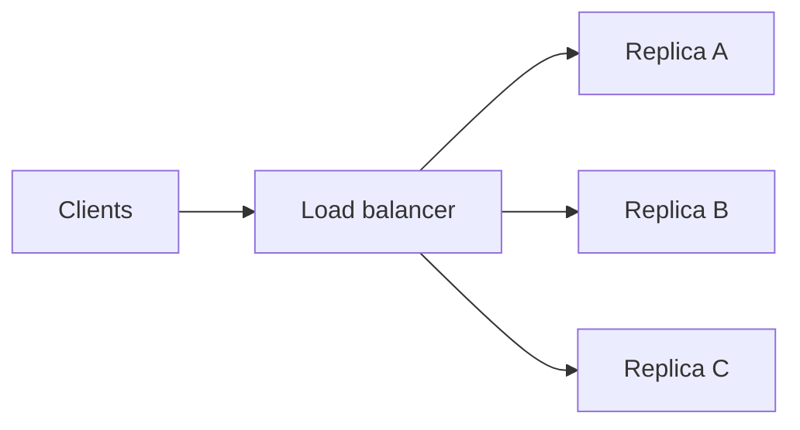
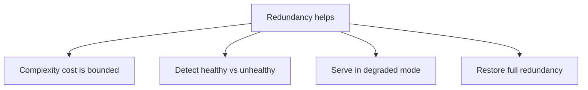
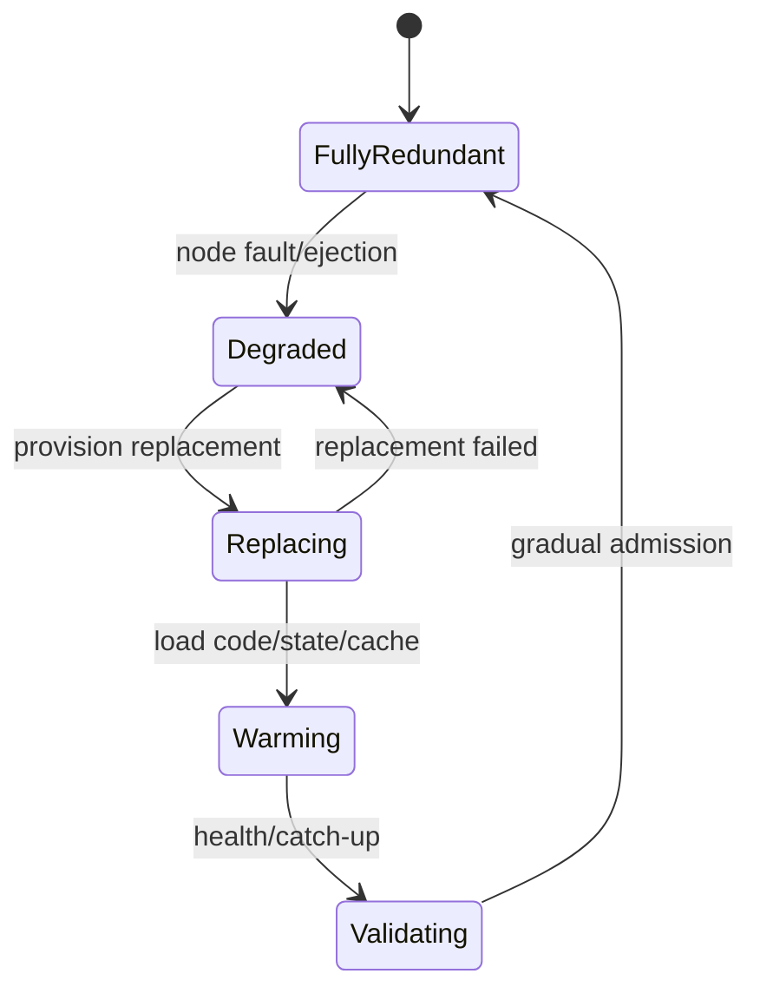
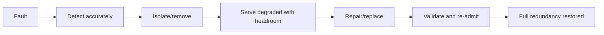
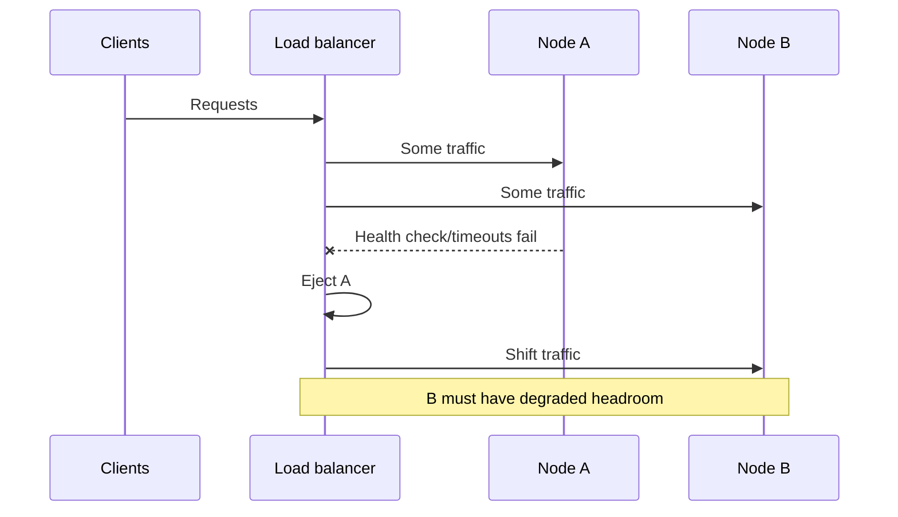
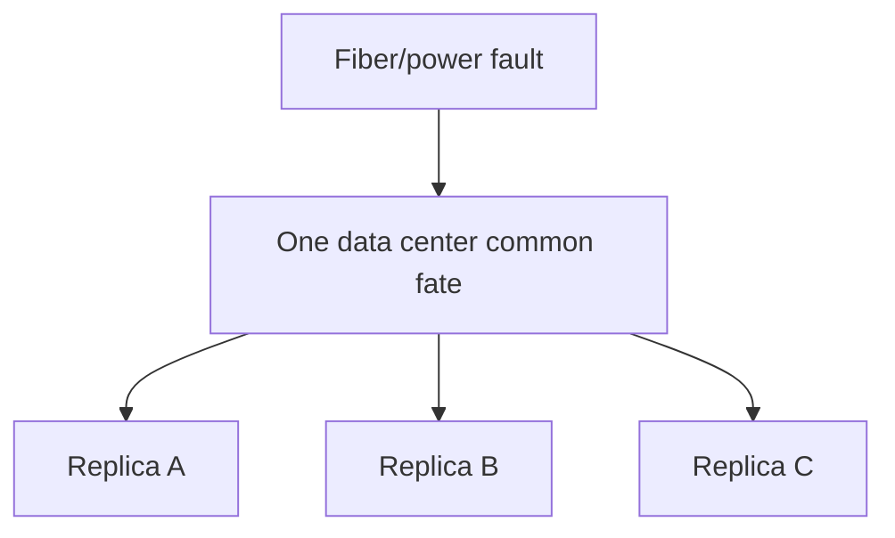
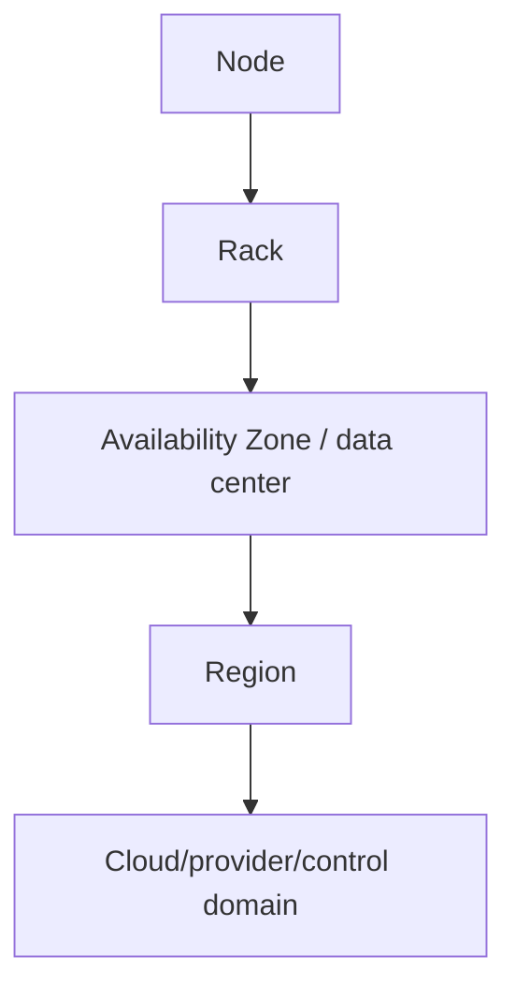
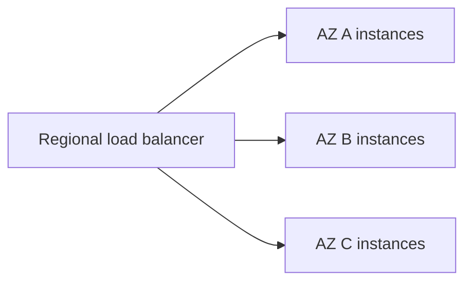
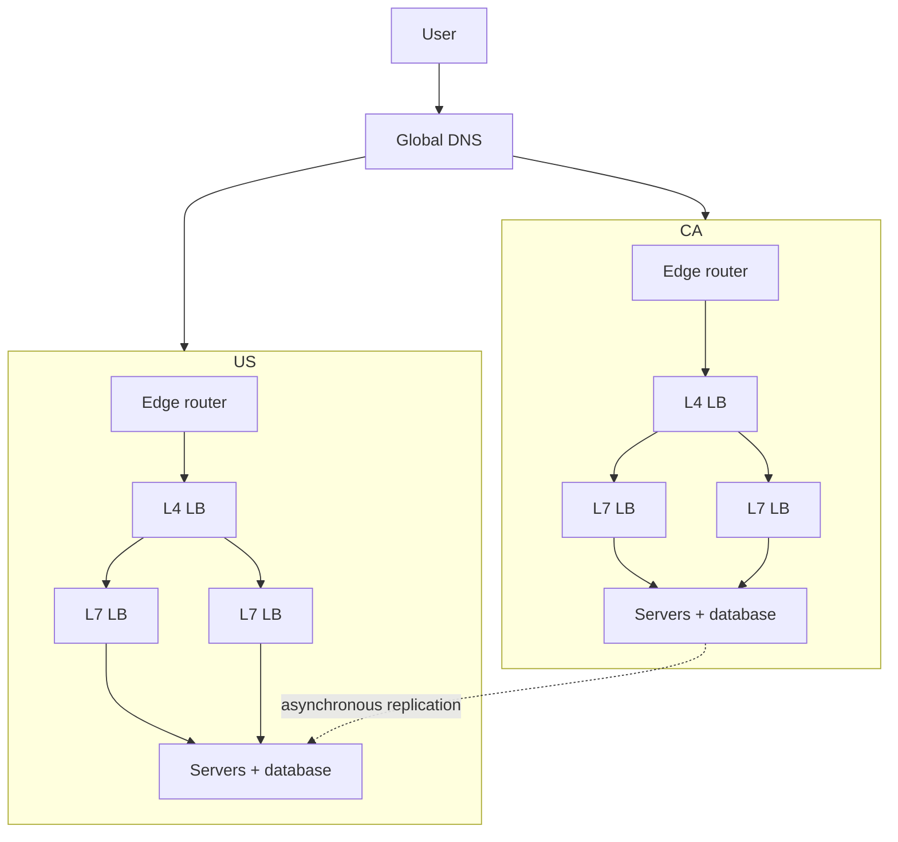
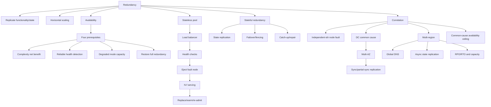

> 对应原文：Understanding Distributed Systems 2nd edition.md
>
> 本文严格沿原章顺序展开：先定义 redundancy，并分析“冗余真正提高可用性”的四个前提；再以 stateless load-balanced pool 对应复杂度、健康检测、degraded mode 和恢复 full redundancy；最后在 Correlation 小节中，从 machine fault、data-center fault、Availability Zone、跨 AZ 同步复制，一路推到跨 region global DNS 与异步复制，并讨论 region resiliency 的成本与合规驱动。原章正文约 4 页；文中的概率模型、容量公式、repair window、RPO/RTO、故障域矩阵和 C11 状态机用于补足推导与工程应用，不应误认为原书逐字给出的云厂商 SLA、复制协议或部署模板。

## 0. 本章定位：冗余是第一道防线，但不是副本计数游戏

### 0.1 Redundancy 是什么

Redundancy 是对 functionality 或 state 的复制：

```text
one logical capability/state
-> multiple redundant nodes/copies
-> one fails, another takes over
```



它同时服务两个目标：

- **Scalability**：多个 nodes 分担 reads/requests；
- **Availability**：一个 node fault 时其他 nodes 继续服务。

二者不等价。增加 read replicas 可能提升吞吐，却因错误 failover、共同配置或容量不足而不提升可用性。

### 0.2 为什么 distributed application 可能比单机更可用

单机 failure 通常意味着服务 failure。冗余系统只有所有可替代路径都失效时才整体失败。

在理想的独立、同可用性 $A$ 模型中，$N$ 个 active replicas 至少一个可用的概率：

$$
A_{pool}=1-(1-A)^N
$$

若每台 $A=0.99$，两台：

$$
A_{pool}=1-0.01^2=0.9999=99.99\%
$$

但这个公式隐含：

- Failures independent；
- Health detection 正确及时；
- Traffic 能转移；
- 剩余 node 有 capacity；
- Load balancer/failover path 可用；
- Repair 能恢复 redundancy；
- Common software/config 不会同时破坏所有 replicas。

Chapter 25 的重点正是拆开这些假设。

### 0.3 Redundancy 与 replication 的关系

- Replication 是复制 mechanism；
- Redundancy 是通过多份功能/state 获得替代路径的 resilience property；
- 每份 redundancy 是否 current、reachable、independent，决定它能否 takeover。

对 stateless service，复制 binary/instances 即可；对 stateful service，还需 state synchronization、leader/ownership、consistency、fencing 与 repair。

---

## 1. Redundancy 真正有效的四个前提

原章引用 Marc Brooker，总结四项 prerequisites：

1. 新增复杂度不能损失比新增可用性更多；
2. 必须可靠区分 healthy 与 unhealthy components；
3. 必须能在 degraded mode 运行；
4. 必须能回到 fully redundant mode。



四项构成完整 lifecycle，而非四个独立优化。

---

## 2. 前提一：冗余复杂度不能反噬可用性

### 2.1 新增了哪些失败面

从单实例改成多实例会新增：

- Load balancer；
- Service discovery；
- Health checks；
- Routing/connection state；
- Replica synchronization；
- Leader election/failover；
- Repair/rebalancing；
- Deployment/config consistency；
- Monitoring/automation。

如果这些机制本身频繁故障，冗余可能净降低 availability。

### 2.2 串联组件会乘低 availability

若 load balancer 是每个 request 的 hard dependency：

$$
A_{system}=A_{LB}\times A_{pool}
$$

即使 backend pool 达到 99.99%，LB 只有 99%：

$$
0.9999\times0.99=98.9901\%
$$

因此 logical LB 也必须由冗余 fleet、VIP/Anycast/managed service 实现，不能只加一个单机代理。

### 2.3 原章的判断

Stateless pool 前的 load balancer 确实增加复杂度和 failure modes，但 scalability/availability 收益几乎总能超过风险，前提是 LB 本身被正确设计和运营。

### 2.4 Complexity budget

可以用概念式评估：

$$
NetAvailabilityGain=
FailureMaskingGain-CoordinationAndDependencyCost
$$

这不是可直接计算的概率公式，而是审查问题：

- 新组件是否进入每请求路径？
- 是否有静态稳定性/last-known-good？
- Failover automation 是否测试？
- 操作步骤是否更多、更危险？
- On-call 是否理解新状态机？

### 2.5 简单优先

冗余设计应采用最简单能满足 fault model 的方案：

- Stateless pool 不需要共识复制用户 session；
- 单 region 需求不必立刻 active-active multi-region；
- Managed LB/DB 可减少自建 control-plane 风险；
- 不为理论 fault 引入未经验证的复杂 failover。

---

## 3. 前提二：可靠检测 healthy 与 unhealthy

### 3.1 Health check 是 takeover 的触发器

Load balancer 必须发现 fault node 并摘除。若有 10 台等权 servers，一台完全 unresponsive 却仍在 pool：

$$
FailedRequestFraction\approx\frac{1}{10}=10\%
$$

Detection 越慢，用户可见 failure 持续越久。

### 3.2 Detection window 的失败量

总 request rate $\lambda$，$N$ 个等权 nodes，1 个坏 node，检测时间 $T_d$：

$$
ExpectedFailures\approx\frac{\lambda T_d}{N}
$$

若 $\lambda=20{,}000/s$、$N=10$、$T_d=10s$：

$$
ExpectedFailures\approx20{,}000
$$

Retry 可隐藏部分用户 failure，却增加系统 load。

### 3.3 健康不是二值事实

Node 可能：

- Crash/unreachable；
- Slow/gray failure；
- 只对部分 clients/network path 失败；
- Process alive 但 dependency/thread pool exhausted；
- State stale/corrupt；
- 可 read 但不可 write；
- 正在 warm/drain。

Health detector 需要根据“能否完成 useful work”判断，而非只看 process/PID。

### 3.4 False positive 与 false negative

- False positive：健康 node 被摘除，减少 capacity，可能引发 cascade；
- False negative：坏 node 留在 pool，持续用户 failures；
- Network partition 下不同 observers 判断不一致。

因此使用 consecutive thresholds、hysteresis、multi-signal/passive+active checks 和最大摘除比例。

### 3.5 Health 与 readiness/liveness

- Liveness：是否需要 restart；
- Readiness：是否接受新 traffic；
- Freshness：state 是否足够新；
- Capacity：是否还有 headroom。

不要因为数据库短暂失败就让所有 app instances liveness fail 并同时重启。

---

## 4. 前提三：系统必须能在 degraded mode 运行

### 4.1 Traffic shift

从 $N$ 台减少到 $N-f$ 台，总 load $L$ 不变，同质 node 单台 load：

$$
Load_{degraded}=\frac{L}{N-f}
$$

正常单台 load：

$$
Load_{normal}=\frac{L}{N}
$$

放大倍数：

$$
Amplification=\frac{N}{N-f}
$$

10 台失去 1 台，单台 load 增约 11.1%；2 台失去 1 台，load 翻倍。

### 4.2 N-f capacity condition

每 node safe capacity 为 $C$，要容忍 $f$ 台 fault：

$$
L\le(N-f)C
$$

还需为 retry、skew、warmup、maintenance 留余量，实际应严格小于。

### 4.3 Degraded 不等于完整性能

可接受 degraded policy：

- 更高 latency，但仍在 deadline；
- Shed low-priority requests；
- Disable expensive feature；
- Serve stale cache；
- Reduce quality/resolution；
- Read-only mode；
- Lower consistency（仅业务允许时）。

Specification 应定义 degraded contract，而不是故障时临时猜。

### 4.4 Stateful service 更难

Stateful takeover 需要：

- Replica state up-to-date；
- Promote/elect owner；
- Fence old owner；
- Route clients；
- Preserve acknowledged writes；
- Reconfigure other replicas；
- Maintain quorum。

有 node copy 不等于可立即接管。

### 4.5 Load test failure mode

Capacity testing 不应只测 $N$ healthy：

```text
N healthy steady state
N-1 during peak
N-1 plus retry
N-1 during deploy/cache cold
zone loss and traffic shift
```

Chapter 24 的 metastable cascade 正是 degraded capacity 不足的结果。

---

## 5. 前提四：必须恢复 full redundancy

### 5.1 Degraded mode 只能暂时存在

摘除 bad nodes 后若不补充，后续 faults 会逐渐吃光 replicas。假设每次 fault 少一个 node：

```text
N -> N-1 -> N-2 -> ... -> 0
```

冗余是可消耗 safety margin，必须 repair/replenish。

### 5.2 Repair loop



### 5.3 Stateless replacement

- Provision instance；
- Load config/secrets；
- Start process；
- Warm JIT/cache/connections；
- Pass readiness；
- Slow-start traffic；
- Verify capacity；
- Terminate old resources。

### 5.4 Stateful repair

- Select target/failure domain；
- Copy snapshot；
- Stream log/catch up；
- Verify checksum/state；
- Join replication group；
- Restore quorum/redundancy；
- Rebalance traffic；
- Remove stale copy。

Repair consumes disk/network/CPU and competes with foreground load。

### 5.5 Vulnerability window

从 fault 到恢复 full redundancy 的时间：

$$
T_v=T_{detect}+T_{provision}+T_{copy/warm}+T_{validate}
$$

窗口越长，第二个 fault 在 degraded state 内发生的机会越大。提升可靠性不只增加 replicas，也要缩短可靠 repair time。

### 5.6 Repair storm

Zone/fleet fault 可能同时触发大量 replacements：

- Image/config store 被打爆；
- State copy 饱和 network；
- Cache cold-origin surge；
- Autoscaler过量扩容；
- Health checks flapping。

需要 paced repair、priority、budget 和 regional capacity reserve。

---

## 6. 四个前提如何组成闭环



任一环节缺失：

- Detect 缺失：bad node 持续失败；
- Degraded capacity 缺失：摘除导致 overload；
- Repair 缺失：逐渐耗尽；
- Validation 缺失：坏 replacement 被引流；
- Complexity 太高：failover 本身失败。

---

## 7. Stateless service 具体案例

### 7.1 原章场景

Disk、memory、network hardware fault 使 node crash/degrade/unavailable。Load balancer 用冗余 pool mask fault。



### 7.2 10-node example

一台坏 node 未摘除导致约 10% requests fail。摘除后剩余 9 台单台 traffic 从 $L/10$ 变 $L/9$。

如果 fault detection 需要 30 秒，failure exposure 就持续 30 秒；如果 retries 命中 healthy nodes，client success 可提高，但每个 original request work 增加。

### 7.3 Slow start

Replacement node 通过 health 后不应立即接等权 traffic：

- Cache/JIT/connection 未 warm；
- CPU 频率/working set 未稳定；
- 一次 flood 可让它立即 unhealthy。

Traffic weight 可从 0 逐步升到 1，并监控 error/latency。

---

## 8. 25.1 Correlation：副本为什么会一起失败

### 8.1 Correlated failure 的定义

若多个 redundant nodes 因相同原因在相近时间失效，failures correlated。此时独立模型 $p^N$ 不成立。

可用条件概率表示：

$$
P(B\ fails\mid A\ fails)>P(B\ fails)
$$

相关越强，新增同类副本的边际 availability gain 越小。

### 8.2 Independent-ish node fault

一台 server 的 faulty memory module 导致 crash，另一台不同机器同一时刻因同原因 crash 的概率通常较低。因此 machine-level distribution 有价值。

“独立”仍是近似：同批 hardware/firmware、同 software workload 可相关。

### 8.3 Data-center-wide common cause

所有 servers 在同一 data center：fiber cut、electrical storm/power event 让整 DC down。无论内部有多少副本，application unavailable。



若 data-center availability 为 $A_{dc}$，无论内部 nodes 趋近无限，pool availability 上限仍近似：

$$
A_{system}\le A_{dc}
$$

### 8.4 Common-mode failure 类别

- Physical：power、fiber、cooling、natural disaster；
- Software：same bug/version；
- Configuration：global bad config；
- Security：same credential/certificate；
- Operations：same automation/operator；
- Dependency：same DNS/database/control plane；
- Load：same poison request/noisy tenant；
- Supply chain：same library/firmware。

跨机器只降低部分物理 fault correlation。

---

## 9. 用 failure domains 降低 correlation

### 9.1 层级



Replica placement 应跨所需 fault domain：

- Disk fault：不同 disks；
- Node fault：不同 nodes；
- Rack fault：不同 racks/power/switch；
- Data center fault：不同 AZs；
- Region catastrophe：不同 regions；
- Provider/control failure：可能 multi-provider/offline recovery。

每提高一级，cost/latency/consistency complexity 通常增加。

### 9.2 Diversity 也可降 correlation

- Independent power/network paths；
- Staggered deploy/config；
- Multiple certificate/DNS paths；
- Version diversity（谨慎，增加测试矩阵）；
- Separate credentials/control planes；
- Fault isolation/cells。

不能只在 topology 图上画两个 boxes；要验证是否共享真实 dependency。

---

## 10. Availability Zones

### 10.1 原章定义

AWS/Azure 等 cloud provider 将 region 建成多个 data centers，称 Availability Zones（AZs），通过高速网络互联。

AZ 设计目标：

- 足够远，降低 power 等 correlated fault；
- 足够近，网络 latency 较低；
- 支持跨 AZ 同步/部分同步 replication。

### 10.2 距离与 latency 的物理限制

传播 latency 受光速（speed of light）限制。跨 AZ 越远，相关性可能更低，但 synchronous commit latency 更高：

$$
T_{commit}\gtrsim T_{local}+RTT_{required\ replicas}
$$

实际还有 queue、serialization、fsync 与 protocol rounds。

### 10.3 Stateless multi-AZ

Instances 分散在多个 AZ，共享一个逻辑 load balancer：



一个 AZ unavailable 时：

- LB 摘除该 AZ endpoints；
- 其他 AZ 接 traffic；
- 必须预留 N-AZ capacity；
- Shared regional dependencies 仍可能失败。

### 10.4 Stateful multi-AZ

State 需要 replication protocol：

- Raft：原章称 partially synchronous；
- Chain replication：可 fully synchronous；
- Leader/replicas 跨 AZ；
- Quorum placement 容忍一 AZ loss。

Protocol label 不能替代产品 durability contract：ack 到 memory、WAL、fsync、quorum apply 含义不同。

### 10.5 Quorum placement

三 replicas 跨三个 AZ，majority 2：

$$
Quorum=\left\lfloor\frac{3}{2}\right\rfloor+1=2
$$

失去一个 AZ 仍有 2。但若两个 replicas 同 AZ，失去该 AZ 就失去 quorum。Replica count 和 placement 同等重要。

### 10.6 AZ 并非绝对独立

可能共享：

- Regional control plane；
- Software/config；
- IAM/DNS；
- Backbone；
- Operator automation；
- Workload bug。

Multi-AZ 主要降低特定 infrastructure correlation，不消除所有 common cause。

---

## 11. Multi-region architecture

### 11.1 为什么需要

极端 catastrophe 可摧毁整个 region/全部 AZ。容忍它需在多个 regions 复制整个 application stack。

### 11.2 Figure 25.1

原图是简化 multi-region：



### 11.3 Global DNS load balancing

DNS 按 client location、health、policy 将 traffic 指向 region。限制：

- DNS cache/TTL；
- Resolver location；
- Failover propagation；
- Client connection reuse；
- Split traffic/capacity；
- Data residency。

### 11.4 为什么跨 region 通常异步复制

跨 region RTT 高，若每个 write 等 remote ack：

- Write latency 增加；
- Network partition 时 availability 降低；
- Tail 受远端影响。

因此原章说 state 需要 asynchronously replicated across regions。

代价是 replication lag 和非零 RPO：

$$
PotentialDataLoss\approx WriteRate\times ReplicationLag
$$

例如 100 writes/s、30 秒 lag，catastrophic failover 时可能有约 3,000 recent writes 未到 remote region。实际取决于 journal/ack/failover policy。

### 11.5 Active-active 与 active-passive

- Active-passive：secondary 待机，failover 简单些，但 capacity/DR readiness 要演练；
- Active-active：多 region 同时服务，latency/capacity 好，但 conflict、routing、global invariant 更难。

原章图/脚注指向 active-active 案例，但正文只要求理解 multi-region duplicate stack、global DNS 和 async state，不指定唯一 topology。

### 11.6 RPO 与 RTO

- RPO：最多可丢多新的 data；
- RTO：恢复 service 需多久。

Async replication 主要影响 RPO；DNS failover、capacity warmup、consistency recovery 影响 RTO。

### 11.7 Region failover capacity

两个 regions 各承载 50%，一个 loss 后 surviving region 要承载 100%，load amplification 2 倍：

$$
Amplification=\frac{1}{1-0.5}=2
$$

若没有 headroom，multi-region topology 仍会像 Chapter 24 A/B replicas 一样 cascade。

---

## 12. Multi-region 是否值得

### 12.1 原章的保守判断

Entire region destroyed 的概率极低。在投入 region-failure resilience 前，应有 very good reasons。

成本包括：

- Duplicate full stack；
- Data replication/egress；
- Conflict/consistency；
- Global routing；
- Capacity reserve；
- Schema/config rollout；
- Observability/on-call；
- Failover/failback drills；
- Security/key management；
- More common-mode software complexity。

### 12.2 Risk-based decision

沿 Chapter 24：

$$
Risk=P(region\ failure)\times Impact
$$

并比较 mitigation cost。即使 probability 低，impact 极大或业务不可接受，也可能值得；反之不能只为架构“高级”而做。

### 12.3 Compliance 驱动

原章指出更常见原因可能是法律合规（legal compliance）：European customer data 必须在 Europe 处理和存储等 data residency 要求。

这不等于所有欧洲法律都简单要求“绝不离开 Europe”；具体法规、合同和跨境机制需法律解释。架构应将 residency policy 编码为 placement/routing/audit constraint。

### 12.4 Multi-region 不是 backup

Replication 会快速复制：

- Accidental delete；
- Corruption；
- Bad config；
- Malicious write。

仍需独立 backup/versioning、immutable recovery point 和 restore test。

---

## 13. Correlation 如何限制理论可用性

### 13.1 Common-cause model

设 common-cause failure probability 为 $q$，在 common cause 未发生时，每个 replica 独立 failure probability 为 $p$。$N$ replicas 全部 unavailable：

$$
P_{all}=q+(1-q)p^N
$$

Availability：

$$
A=1-q-(1-q)p^N
$$

当 $N\to\infty$：

$$
A\to1-q
$$

无论增加多少同 failure-domain replicas，都突破不了 common-cause ceiling。

### 13.2 数值示例

$p=0.01$、$q=0.001$：

- 1 replica unavailable：$0.001+0.999\times0.01=1.099\%$；
- 2 replicas unavailable：$0.001+0.999\times0.0001\approx0.10999\%$；
- 无限 replicas 下限：$0.1\%$。

第二份副本帮助很大，但继续堆机器很快遇到 $q$ ceiling。要提升必须降低 correlation，例如跨 AZ/region、分离 config/control dependency。

### 13.3 模型局限

- Common cause 不只一个；
- Repair/duration 未建模；
- Failures 不是静态 Bernoulli；
- Partial/gray failures；
- Detection/failover 也会失败；
- Capacity不足会引发 cascade。

它用于说明“相关性形成上限”，不是计算云 SLA。

---

## 14. 可运行 C11 示例：四前提与 correlated failure ceiling

### 14.1 模拟目标

程序实现一个 3-node stateless pool：

- 正常 90 requests，三台各 30；
- Node 1 独立 hardware fault；health detection 前 30 requests 仍发给坏 node；
- 摘除后两台各 45，低于 capacity 50，可 degraded serve；
- Replacement 先 warm/readiness，再恢复 3-node full redundancy；
- Data-center common fault 同时打掉三台，副本数无法帮助；
- 跨 failure-domain standby 接管 90，展示降低 correlation；
- 计算 independent 与 common-cause availability；
- 所有加法/乘法检查 overflow，不依赖 `assert`。

这是离散教学模型，不是 LB、故障率或云 SLA simulator。

### 14.2 完整代码

```c
#include <stdbool.h>
#include <limits.h>
#include <math.h>
#include <stddef.h>
#include <stdio.h>

enum { NODE_COUNT = 3, NODE_CAPACITY = 50 };

typedef struct {
    bool healthy;
    bool in_pool;
    bool ready;
    unsigned int assigned;
    unsigned int served;
} Node;

typedef struct {
    unsigned int offered;
    unsigned int served;
    unsigned int failed;
} Result;

static bool add_checked(unsigned int left,
                        unsigned int right,
                        unsigned int *output) {
    if (output == NULL || left > UINT_MAX - right) {
        return false;
    }
    *output = left + right;
    return true;
}

static bool distribute(Node *nodes,
                       size_t node_count,
                       unsigned int offered,
                       Result *result) {
    size_t eligible_count = 0;
    size_t index;
    unsigned int remaining;

    if (nodes == NULL || node_count == 0 || result == NULL) {
        return false;
    }
    *result = (Result){offered, 0, 0};
    for (index = 0; index < node_count; index++) {
        nodes[index].assigned = 0;
        nodes[index].served = 0;
        if (nodes[index].in_pool && nodes[index].ready) {
            eligible_count++;
        }
    }
    if (eligible_count == 0) {
        result->failed = offered;
        return true;
    }

    remaining = offered;
    while (remaining > 0) {
        for (index = 0; index < node_count && remaining > 0;
             index++) {
            if (nodes[index].in_pool && nodes[index].ready) {
                nodes[index].assigned++;
                remaining--;
            }
        }
    }

    for (index = 0; index < node_count; index++) {
        Node *node = &nodes[index];
        if (!node->in_pool || !node->ready || !node->healthy) {
            continue;
        }
        node->served = node->assigned < NODE_CAPACITY
            ? node->assigned
            : NODE_CAPACITY;
        if (!add_checked(result->served, node->served,
                         &result->served)) {
            return false;
        }
    }
    result->failed = result->offered - result->served;
    return true;
}

static bool independent_availability(double node_availability,
                                     unsigned int node_count,
                                     double *output) {
    if (output == NULL || !isfinite(node_availability) ||
        node_availability < 0.0 || node_availability > 1.0 ||
        node_count == 0) {
        return false;
    }
    *output = 1.0 - pow(1.0 - node_availability,
                        (double)node_count);
    return true;
}

static bool common_cause_availability(double independent_failure,
                                      double common_failure,
                                      unsigned int node_count,
                                      double *output) {
    if (output == NULL || !isfinite(independent_failure) ||
        !isfinite(common_failure) || independent_failure < 0.0 ||
        independent_failure > 1.0 || common_failure < 0.0 ||
        common_failure > 1.0 || node_count == 0) {
        return false;
    }
    *output = 1.0 - common_failure -
        (1.0 - common_failure) *
            pow(independent_failure, (double)node_count);
    return true;
}

int main(void) {
    Node nodes[NODE_COUNT] = {
        {true, true, true, 0, 0},
        {true, true, true, 0, 0},
        {true, true, true, 0, 0}
    };
    Node remote = {true, false, true, 0, 0};
    Result normal;
    Result undetected;
    Result degraded;
    Result restored;
    Result common_fault;
    Result remote_takeover;
    double independent;
    double correlated;

    if (!distribute(nodes, NODE_COUNT, 90, &normal) ||
        normal.served != 90 || normal.failed != 0 ||
        nodes[0].assigned != 30 || nodes[1].assigned != 30 ||
        nodes[2].assigned != 30) {
        return 1;
    }
    printf("normal offered=90 loads=30,30,30 failed=0\n");

    nodes[1].healthy = false;
    if (!distribute(nodes, NODE_COUNT, 90, &undetected) ||
        undetected.served != 60 || undetected.failed != 30) {
        return 1;
    }
    printf("undetected_fault served=60 failed=30\n");

    nodes[1].in_pool = false;
    if (!distribute(nodes, NODE_COUNT, 90, &degraded) ||
        degraded.served != 90 || degraded.failed != 0 ||
        nodes[0].assigned != 45 || nodes[2].assigned != 45) {
        return 1;
    }
    printf("degraded loads=45,45 capacity=50 failed=0\n");

    nodes[1].healthy = true;
    nodes[1].ready = false;
    nodes[1].in_pool = true;
    if (!distribute(nodes, NODE_COUNT, 90, &restored) ||
        nodes[1].assigned != 0 || restored.served != 90) {
        return 1; /* replacement is not admitted before readiness */
    }
    nodes[1].ready = true;
    if (!distribute(nodes, NODE_COUNT, 90, &restored) ||
        restored.served != 90 || nodes[1].assigned != 30) {
        return 1;
    }
    printf("restored loads=30,30,30 full_redundancy=1\n");

    nodes[0].healthy = false;
    nodes[1].healthy = false;
    nodes[2].healthy = false;
    if (!distribute(nodes, NODE_COUNT, 90, &common_fault) ||
        common_fault.served != 0 || common_fault.failed != 90) {
        return 1;
    }
    printf("common_dc_fault local_served=0 failed=90\n");

    remote.in_pool = true;
    if (!distribute(&remote, 1, 90, &remote_takeover) ||
        remote_takeover.served != 50 ||
        remote_takeover.failed != 40) {
        return 1;
    }
    printf("remote_takeover served=50 failed=40 "
           "needs_capacity_headroom=1\n");

    if (!independent_availability(0.99, 2, &independent) ||
        !common_cause_availability(0.01, 0.001, 2,
                                   &correlated) ||
        fabs(independent - 0.9999) > 1e-12 ||
        fabs(correlated - 0.9989001) > 1e-12 ||
        independent_availability(1.1, 2, &independent) ||
        common_cause_availability(0.01, 0.001, 0,
                                  &correlated)) {
        return 1;
    }
    printf("availability independent=%.4f correlated=%.7f\n",
           independent, correlated);
    return 0;
}
```

### 14.3 编译运行

```bash
gcc -std=c11 -Wall -Wextra -Werror -pedantic redundancy.c -lm -o redundancy
./redundancy
```

关键输出：

```text
normal offered=90 loads=30,30,30 failed=0
undetected_fault served=60 failed=30
degraded loads=45,45 capacity=50 failed=0
restored loads=30,30,30 full_redundancy=1
common_dc_fault local_served=0 failed=90
remote_takeover served=50 failed=40 needs_capacity_headroom=1
availability independent=0.9999 correlated=0.9989001
```

### 14.4 代码与原理对应

| 代码路径 | 本章前提 |
| --- | --- |
| `undetected_fault` | 未可靠检测时用户 failure 暴露 |
| `degraded 45,45` | 剩余 nodes 必须有 N-1 capacity |
| `ready=false` | Replacement 未 warm 不可引流 |
| `restored` | 必须回到 full redundancy |
| `common_dc_fault` | 同 failure domain 副本相关失效 |
| `remote_takeover` | 跨域副本仍需 capacity headroom |
| Availability functions | 独立收益与 common-cause ceiling |

### 14.5 示例局限

- 单线程、无真实 health-check delay/threshold；
- Failure/ejection 状态手工设置；
- Remote 只有一台且 capacity 50，故意展示 placement 不等于足够 capacity；
- 无 state replication/RPO/RTO；
- 无 repair bandwidth/cache warmup；
- Probability 是静态教学模型，无 duration/repair process；
- `pow`/floating-point 仅用于示例；
- 不模拟 LB 自身 failure。

因此程序验证四个 prerequisites 和 correlation 上限，不预测 SLA。

---

## 15. 容易混淆的概念

### 15.1 Redundancy 与 capacity

副本可同时提供 spare capacity 和替代路径；若平时已满载，就没有 failover capacity。

### 15.2 Replication 与 backup

Replication 支持 takeover，会快速复制坏写/delete；backup 提供历史恢复点。

### 15.3 High availability 与 disaster recovery

HA 关注常见 fault 的连续服务；DR 关注大范围灾难后的 RPO/RTO。Multi-AZ 与 multi-region 目标不同。

### 15.4 Health 与 correctness

Process reachable 不等于 state current/correct。Stateful health 还需 lag、checksum、term/role。

### 15.5 Degraded 与 failed

Degraded 可降低性能/功能但仍满足降级 specification；failed 已违反 contract。

### 15.6 Failover 与 repair

Failover 恢复 serving；repair 恢复 redundancy。只 failover 不 repair，会积累风险。

### 15.7 Correlated 与 cascading

- Correlated：同一原因同时打掉多个 replicas；
- Cascading：一个 fault 经 load/retry逐步传播。

### 15.8 AZ 与 region

AZ 是 region 内较独立 data center；region 包含多个 AZ。跨 AZ latency 通常低于跨 region。

### 15.9 Synchronous 与 zero data loss

“同步”需说明 ack 到哪个 durable/applied stage；仍有 common corruption/config/operator risk。

### 15.10 Multi-region 与 active-active

Multi-region 可 active-passive 或 active-active；不是同义词。

### 15.11 Data residency 与 resilience

多 region 可由合规驱动，不一定允许同一客户数据跨任意 region 复制；placement 必须服从 policy。

---

## 16. 常见误区与失败模式

### 16.1 “副本越多可用性越高”

只在独立、可检测、可接管、有容量、可修复时成立；common-cause ceiling 会限制收益。

### 16.2 “有 load balancer 就没有 SPOF”

LB 自身、DNS、certificate、control plane 仍可能是 shared dependency。

### 16.3 “健康检查越敏感越好”

False positive 会摘除好 nodes、减少 capacity，甚至触发 cascade。需要 hysteresis。

### 16.4 “故障时剩余机器自然能扛住”

必须用 N-f load test 验证。两台各 60% 在失去一台后需要 120%。

### 16.5 “Failover 成功就修好了”

系统仍 degraded，第二 fault 风险更高。必须 replacement/catch-up/validation。

### 16.6 “Replacement 一 ready 就全量引流”

Cold node 可能立即 overload。使用 slow start。

### 16.7 “跨机器就不相关”

同 rack/DC/region、软件、配置、DNS、cert 和 operator 都造成 correlation。

### 16.8 “三个副本跨两个 AZ 足以容忍任何 AZ loss”

Placement 2+1 时失去含 2 replicas 的 AZ 可能无 quorum。按 quorum/failure domain布局。

### 16.9 “跨 region 同步复制总是更安全”

延迟和 partition availability cost 可能不可接受。需按 RPO/RTO 和 consistency 选择。

### 16.10 “异步跨 region 等于 DR 完成”

还需 failover routing、capacity、consistency、restore、runbook和演练。

### 16.11 “Multi-region 能防所有故障”

Same code/config/credential/poison request 可跨 region 共模失败。Chapter 26 用 isolation 处理。

### 16.12 “Region failure 极低，所以无需评估”

应用 risk/impact/compliance 决定；低概率高影响不能自动忽略，也不能盲目过度建设。

### 16.13 “Managed multi-AZ 无需理解语义”

仍需知道 failover、ack durability、RPO/RTO、endpoint、capacity 和 test 方法。

---

## 17. 如何设计有效冗余

### 第一步：定义 fault model 和 service specification

明确要容忍 disk、node、rack、AZ、region、software、config 还是 operator fault，以及允许 latency/degradation。

### 第二步：画 failure-domain/dependency graph

列出 compute、state、LB、DNS、cert、control plane、IAM、network、human 与 provider common fate。

### 第三步：验证复杂度净收益

审查新增 LB、election、replication、repair 的 failure rate、operational maturity 和 testability。

### 第四步：设计 health detection

Active/passive、readiness/liveness/freshness、threshold/hysteresis、max ejection、multi-perspective gray-failure detection。

### 第五步：按 N-f 规划 capacity

$$
NormalLoad<(N-f)\times SafeNodeCapacity
$$

加入 retry、deploy、cache cold、traffic skew 和 downstream limit。

### 第六步：定义 degraded behavior

哪些功能 shed、哪些 stale、哪些 read-only；用户 contract 和优先级明确。

### 第七步：关闭 repair loop

自动 provision/copy/catch-up/verify/re-admit，测 vulnerability window 和 repair bandwidth。

### 第八步：跨正确 failure domains 放置

Replica count、AZ/rack distribution、quorum、leader placement、independent network/power。

### 第九步：处理 common-mode software/config

Canary、cells、staggered rollout、LKG、fault isolation、limited blast radius，不能只依赖 geography。

### 第十步：按 risk 决定 multi-region

定义 RPO/RTO、active topology、global routing、survivor capacity、data residency、cost。

### 第十一步：备份与恢复

Independent immutable backups、restore validation，防 replication 同步 corruption/delete。

### 第十二步：演练完整 lifecycle

检测 fault、摘除、N-1 serving、replacement failure、state catch-up、slow start、AZ/region loss、failback。

### 第十三步：可观测性

监控：healthy/ready count、failure domain distribution、ejection/detection time、degraded utilization、repair progress/vulnerability window、replica lag、regional RPO、failover success。

---

## 18. 作者如何形成解决思路

### 18.1 先肯定 redundancy 的双重价值

复制既是 Part III 的 scale-out pattern，也是 Part IV 的第一道 failure defense。

### 18.2 立即限制“副本越多越好”

作者用四 prerequisites 将 availability 从静态副本数改写为完整 operational lifecycle。

### 18.3 用 stateless LB 案例逐项映射

LB complexity 是成本；health check 是检测；剩余 capacity 是 degraded；replacement 是恢复 full redundancy。

### 18.4 对比 stateful service

State replication/consistency/failover 使四项更难，提醒“复制实例”与“复制正确 state”不同。

### 18.5 从 machine fault 转向 data-center common cause

不同机器降低 memory-module fault correlation，却不能抵御 fiber/power/DC fault。由此引出 failure domain。

### 18.6 用 AZ 平衡相关性和同步延迟

AZ 足够分离 power fault，又足够近以支持 Raft/chain replication 类同步协议。

### 18.7 再把 fault domain 扩到 region

Global DNS + async cross-region state 可容忍 region catastrophe，但增加 RPO、成本和复杂度。

### 18.8 最后用概率/合规约束投资

Region destruction 极低概率，必须有充分风险理由；现实中 data residency 可能成为更直接驱动。

---

## 19. 知识结构



---

## 20. 核心结论

1. **Redundancy 复制 functionality 或 state，是 failure defense 和 horizontal scale 的共同模式。**
2. **只有部分 redundancy 真正提升 availability；副本数本身不构成保证。**
3. **四个前提是：复杂度净收益、可靠 health detection、可 degraded serving、可恢复 full redundancy。**
4. **Load balancer 增加复杂度，但 stateless pool 的 scale/availability 收益通常超过风险；LB 自身也必须冗余。**
5. **10 台中一台坏而未摘除，等权下约 10% requests 失败；检测时间决定暴露窗口。**
6. **摘除 fault node 后，剩余单台 load 放大 $N/(N-f)$；必须预留 N-f capacity。**
7. **Degraded serving 只完成 failover，不等于 repair；必须补充、warm、验证并恢复冗余。**
8. **Stateful redundancy 还要 state synchronization、leader/fencing、quorum 和 catch-up，远比 stateless 难。**
9. **Redundancy 只有在 failures 不因同一原因同时发生时有效。**
10. **不同机器可降低单 memory-module fault correlation，同一 DC 的 fiber/power fault 会同时打掉所有副本。**
11. **Common-cause probability $q$ 形成 availability ceiling $1-q$，继续堆同域副本无法突破。**
12. **Availability Zone 在 fault separation 与低 latency 间折中，支持跨 AZ 同步/部分同步复制。**
13. **Replica count 不够，placement 必须保证 loss of one fault domain 后仍有 capacity/quorum。**
14. **Multi-region 用 global DNS 分流，并因高 RTT 通常异步复制 state，接受 replication lag/RPO。**
15. **Surviving region 必须有 failover capacity；否则 region loss 可触发 Chapter 24 式 cascade。**
16. **Multi-region 可 active-passive 或 active-active，也不能防同 code/config/credential 的共模 failure。**
17. **Region-failure resilience 成本高，应由 risk/RPO/RTO 或合规/data residency 的充分理由驱动。**
18. **Replication 不是 backup；坏写、删除和 corruption 仍需独立恢复点。**

---

## 21. 一般化的解决问题方法

### 21.1 从 takeover 能力而非副本数量出发

逐份检查它是否 healthy、current、reachable、独立、有 capacity，能否在 deadline 内接管。

### 21.2 将冗余建模为生命周期

```text
detect -> isolate -> serve degraded -> repair -> validate -> re-admit
```

任何缺口都会使 redundancy 在真实 fault 下失效。

### 21.3 对 failover 后容量重新计算

用 $L/(N-f)$ 而非正常平均，叠加 retry、cache cold、deploy 和 skew。

### 21.4 用 failure domain 替代“不同机器”

追踪 rack/AZ/region、network/power、software/config、DNS/cert、operator/control plane 的 common fate。

### 21.5 同时降低 independent 与 common-cause faults

增加副本降低 $p^N$；跨域、隔离和 staged changes 降低 $q$。后者往往决定最终 ceiling。

### 21.6 缩短 vulnerability window

优化 detection、provision、copy、catch-up、validation，但对 repair 限速，避免损害 foreground。

### 21.7 恢复节点要 slow start

Ready 只是最低门槛，逐步加 traffic并观察 cache、latency 和 error，防 recovery cascade。

### 21.8 以距离换取合适 replication semantics

AZ 内低 RTT 可同步；region 间通常异步。明确 ack、RPO、conflict 和 failover，不追求抽象上的“最强”。

### 21.9 让 resilience 投资服从风险和合规

评估 probability、impact、cost、data residency，避免既欠设计也过度工程。

最终方法可压缩为：

```text
define the faults and degraded service contract
-> add the simplest redundant takeover path
-> make the load balancer/control path redundant too
-> detect useful-work health accurately
-> reserve N-f capacity and bound retries
-> automate replacement, catch-up, validation, and slow re-entry
-> place replicas across the failure domain you need to survive
-> model common-cause correlation as the availability ceiling
-> use multi-AZ synchronization and multi-region async replication deliberately
-> test failover, repair, failback, and common-mode software/config failures
```
