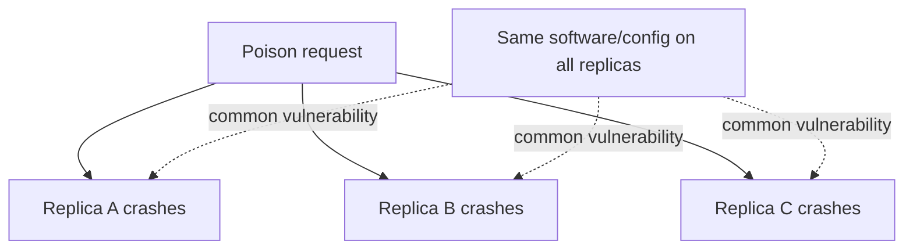
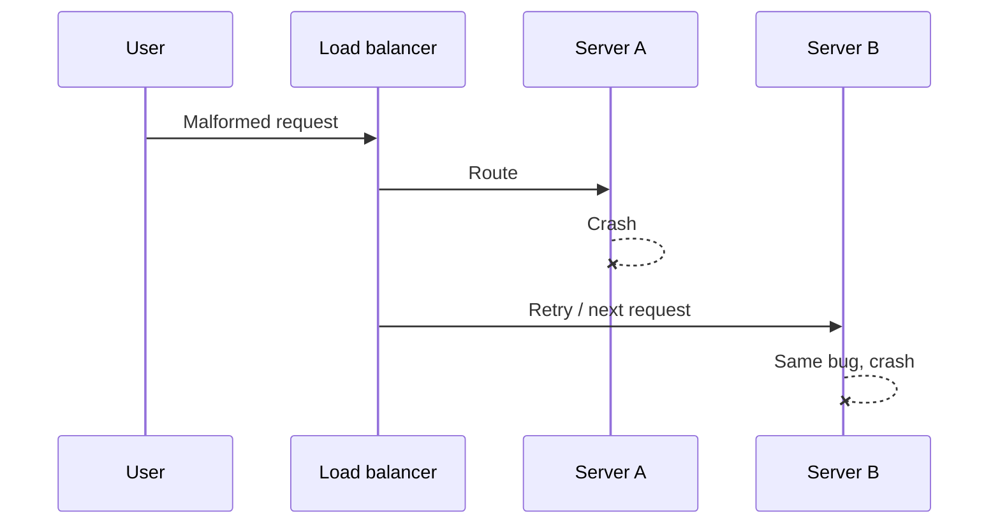
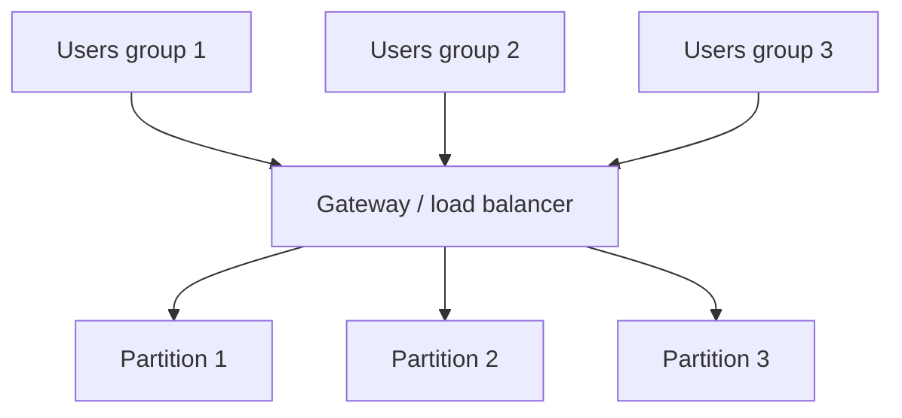
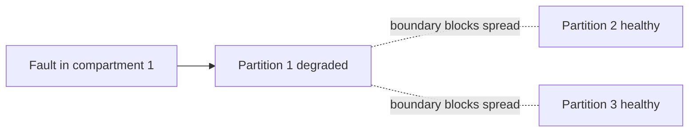
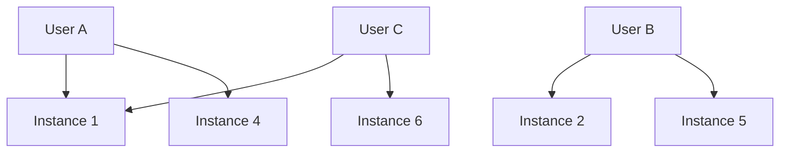
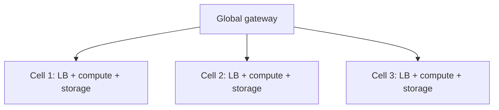
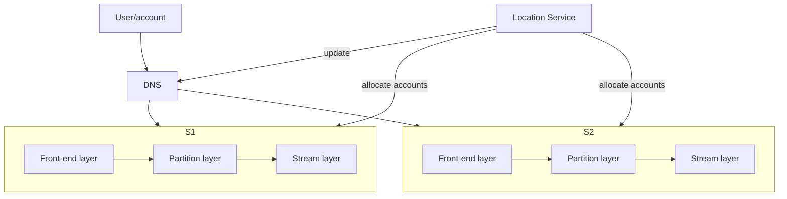
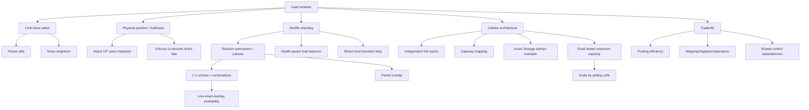

> 对应原文：Understanding Distributed Systems 2nd edition.md
>
> 本文严格沿原章顺序展开：先说明 redundancy 为什么无法处理高度相关的软件/负载故障，再用 poison pill、noisy neighbor 和按用户划分物理分区解释 bulkhead fault isolation；随后推导 shuffle sharding 的永久随机子集、组合数、完全/部分重叠概率，以及 LB 摘除与 client retry 的配合；最后把隔离范围扩展到整个 application stack，分析 cellular architecture、Azure Storage stamp/cell、gateway routing 与固定 cell 容量。原章正文约 5 页；文中的 blast-radius 公式、组合概率、容量模型、映射与迁移协议、shared-control-plane 风险和 C11 穷举模拟用于补足推导与工程应用，不应误认为原书逐字给出的生产分片算法或 Azure 当前内部实现。

## 0. 本章定位：冗余应对“某个副本坏了”，隔离应对“同一种输入能打坏所有副本”

### 0.1 从 Chapter 25 的局限开始

Redundancy 对 infrastructure fault 很有效：一台机器的 memory、disk 或 NIC 故障时，其他机器可接管。但如果 fault 的原因存在于所有副本共享的 code、configuration、dependency 或 workload 中，复制更多副本不会消除风险。



关键区别：

- **Redundancy**：给同一 capability 多个替代副本；
- **Fault isolation**：限制某个 fault 能接触和损坏的副本、用户与依赖集合。

两者互补：副本提供局部接管，隔离阻止 fault 跨整个 fleet 扩散。

### 0.2 本章的两个层级

```text
partition a stateless instance fleet
-> shuffle sharding creates many overlapping virtual partitions
-> partition the entire application stack
-> cellular architecture creates independent cells
```

- Shuffle sharding：用同一组 stateless instances 构造大量小而永久的用户子集；
- Cellular architecture：连同 LB、compute、storage 等 dependencies 一起切开，获得更完整的 failure containment。

### 0.3 Fault isolation 的目标函数

设总用户数为 $U$，某 fault 影响用户数为 $I$，blast-radius fraction：

$$
B=\frac{I}{U}
$$

设计目标不是宣称任何 fault 都不会发生，而是使：

$$
B\ll1
$$

同时保留足够 capacity、可操作性和恢复路径。

---

## 1. 为什么 redundancy alone 不够

### 1.1 Correlation 不只来自基础设施

Chapter 25 主要用 machine、data center、AZ、region 展示 failure correlation。本章转向跨地理副本也可能共享的原因：

- Same software bug；
- Same malformed input；
- Same expensive workload；
- Same global configuration；
- Same auth/control dependency；
- Same protocol parser；
- Same tenant behavior。

把同一 binary 部署到更多 DC/region，可降低 power/fiber fault correlation，却不会降低同一 code path 的 bug correlation。

### 1.2 Common-mode software failure

假设每个 replica 都运行相同 parser，某 payload $x$ 触发 deterministic crash：

$$
P(replica\ fails\mid x)=1
$$

只要 $x$ 能被路由到任意 replica，攻击者或普通用户重复发送它，就可逐个影响全 fleet。地理冗余没有提供不同 failure fate。

### 1.3 降低 correlation 与限制 exposure

两类策略：

1. **降低共同脆弱性**：fix bug、validate input、canary、version diversity；
2. **限制 fault exposure**：固定用户只访问一个 partition/shard/cell。

本章聚焦第二类。即使 bug 尚未修复，fault 也只能打坏有限隔离域。

---

## 2. Poison pills

### 2.1 定义

某用户发送 malformed requests，故意或无意触发 server bug 并 crash。这类 requests 常称 poison pills。



### 2.2 为什么 retry 可能扩大 poison pill

普通 transient fault 中 retry 到另一 replica 可成功；deterministic poison 中 retry 让同一 bad input 接触更多 replicas：

$$
ImpactedReplicas\le1+Retries
$$

如果 client/LB 没有 idempotency、error classification 和 retry budget，resilience mechanism 反而传播 fault。

### 2.3 Poison 与 poison message

Chapter 23 的 poison message 在 consumer 中反复失败，最终进 DLQ；本章 poison pill 是能让 serving process crash/degrade 的 request。共同点是输入确定性触发 fault，处理策略都应隔离 source/payload，而非无限重试。

### 2.4 防御层次

- Input schema/size validation；
- Parser sandbox/resource limits；
- Per-source quota；
- Stable source-to-shard assignment；
- Crash-loop detection；
- Quarantine/slow path；
- Canary/version isolation；
- Capture minimal reproducer；
- Fix root bug。

隔离只减 blast radius，不应成为不修 parser bug 的借口。

---

## 3. Noisy neighbor effect

### 3.1 定义

某用户的 requests 比其他用户消耗更多 resources，导致共享服务对所有用户变慢。这叫 noisy neighbor effect。

设 tenant $i$ 的 request rate 为 $\lambda_i$、平均 cost 为 $c_i$：

$$
Work_i=\lambda_i c_i
$$

系统总 offered work：

$$
W=\sum_i\lambda_i c_i
$$

一个 tenant 即使 QPS 不高，也可能因 $c_i$ 极大占据大部分 CPU、memory、I/O 或 locks。

### 3.2 Shared queue 的 head-of-line blocking

```text
cheap requests + expensive requests
-> same worker/queue/pool
-> expensive tenant holds scarce slots
-> healthy tenants wait
```

平均 CPU 可能尚可，特定 partition/lock/thread pool 已饱和。需要 per-tenant telemetry，而非只看 fleet average。

### 3.3 与 poison pill 的区别

| 维度 | Poison pill | Noisy neighbor |
| --- | --- | --- |
| 主要效果 | 触发 bug/crash | 合法或异常高 resource usage |
| 是否一定 malformed | 常是 | 不一定 |
| 传播机制 | Retry/任意路由触达更多副本 | 共享 capacity/queue |
| 根治 | Fix validation/bug | Quota、fairness、capacity、isolation |

二者都因 blast radius 为全应用而危险。

---

## 4. 按用户 partition application stack

### 4.1 核心思路

把用户稳定映射到一个 partition，使该用户 requests 只能访问 partition 内 resources：



如果一个 user 使 P1 degraded，P2/P3 users 不受影响。

### 4.2 Stable assignment 是必要条件

若每次 request 随机选 partition，同一 poison user 最终会遍历所有 partitions。必须使用永久、确定性 mapping：

$$
partition=userMap(userID)
$$

Mapping 需要：

- Stable across retries/clients；
- Versioned；
- 可迁移但有 controlled cutover；
- Tenant identity 不可伪造；
- Gateway/clients 一致；
- Partition down 时 retry 不跨越 isolation boundary，除非明确设计。

### 4.3 Partitioning 的双重用途

Chapter 16 从 scalability 看 partitioning：把 data/load 分到 nodes。Chapter 26 从 resiliency 看同一机制：把 failure impact 分到隔离域。

```text
same mechanism: partition resources
different objective: capacity scaling vs blast-radius containment
```

### 4.4 物理分区 blast radius

若 $P$ 个 partitions，users 均匀且 partition failure 只影响其 assigned users：

$$
B_{physical}\approx\frac{1}{P}
$$

Partition 数增加，单 partition blast radius 下降，但：

- 每 partition capacity/operations overhead 增加；
- Hot tenant/skew；
- 更小资源池失去 pooling efficiency；
- Mapping/rebalance 更复杂；
- Shared dependencies 仍可扩大 fault。

---

## 5. Figure 26.1：6 instances、3 partitions

### 5.1 原章配置

6 个 stateless instances，每 2 个组成一个 physical partition，共 3 个：

```text
P1 = {1,2}
P2 = {3,4}
P3 = {5,6}
```

Users 被永久分配到一个 P。Figure 26.1 中 A/B/C 分别只访问各自 partition 的两个 instances。

### 5.2 Blast radius

若用户均匀分布，一个 noisy/poisonous user 最多直接拖累所在 partition，约影响：

$$
\frac{1}{3}=33.33\%
$$

相比无 partition 的 100%，显著降低。

### 5.3 不幸的同分区用户

问题是与 bad user 同 partition 的所有 good users 都受牵连。Physical partitions 数少，collision probability 高：两个随机 users 被分配到同一 partition：

$$
P(same)=\frac{1}{P}=\frac{1}{3}
$$

Shuffle sharding 就是为了降低“完全共享同一 failure fate”的概率。

---

## 6. Bulkhead pattern

### 6.1 名称来源

用 partitions 做 fault isolation 也叫 bulkhead pattern，源自船体隔舱：一个 compartment 进水，bulkhead 阻止水扩散到整个 hull。



### 6.2 软件中的 bulkhead resources

可隔离：

- Worker/thread pools；
- Connection pools；
- Queues；
- Caches；
- Database shards；
- Service instances；
- Cells/regions；
- Retry/concurrency budgets。

隔离边界必须覆盖真正的 bottleneck。只分 compute，却共享同一 database connection pool，noisy neighbor 仍可跨分区传播。

### 6.3 Isolation 与 utilization 的交换

共享 pool 可统计复用 idle capacity；切分后一边 idle、另一边 overloaded，资源不能自动借用。

因此：

$$
Isolation\uparrow\quad\Rightarrow\quad
PotentialPoolingEfficiency\downarrow
$$

需要权衡 blast radius、capacity waste 和 failover policy。

---

## 7. 26.1 Shuffle sharding

### 7.1 物理 partition 的问题

Physical partition 中两个 users 要么完全不重叠，要么完全共享同一组 instances。落到 degraded partition 的无辜 users 全部受影响。

### 7.2 虚拟 partition

Shuffle sharding 从 $n$ 个 instances 中，为每个 user 选择 $r$ 个随机但永久的 subset：

$$
Shard(u)\subseteq Instances,
\qquad |Shard(u)|=r
$$

Random：不同 users 大概率获得不同组合；permanent：一个 user 的所有 requests/retries 保持在同一 subset，保留隔离。

### 7.3 为什么叫 virtual

不需要把 instances 物理切成互斥 groups。同一 instance 可属于多个 user shards；virtual partition 是 routing mapping，不是独占机器组。



Users A/C 部分重叠 instance 1，却仍各有一个不同 fallback。

---

## 8. 组合数推导

### 8.1 无序、不重复选择

从 $n$ 个 instances 选 $r$ 个作为 shard：

- Instance 选择顺序无关；
- 一个 shard 内不重复同一 instance。

组合数：

$$
\binom{n}{r}=\frac{n!}{r!(n-r)!}
$$

### 8.2 原章例子

$n=6,r=2$：

$$
\binom{6}{2}
=\frac{6!}{2!4!}
=\frac{6\times5}{2}
=15
$$

Physical grouping 只有 3 个 partitions；virtual shuffle shards 有 15 个 possible assignments。

### 8.3 Exact-overlap probability

若每个用户均匀独立映射到 15 个组合之一，两个 users 完全相同 shard：

$$
P(exact\ same)=\frac{1}{\binom{n}{r}}
$$

原例：

$$
P(exact\ same)=\frac{1}{15}\approx6.67\%
$$

相比 physical partition 的 $1/3\approx33.33\%$，降低 5 倍。

### 8.4 部分 overlap

Shuffle shards 并非互斥，这是原章 caveat。对固定 shard 大小 2：

- Exact same：1 个组合；
- Share exactly 1 instance：$2\times4=8$ 个组合；
- Disjoint：$\binom{4}{2}=6$ 个组合。

总数：

$$
1+8+6=15
$$

因此两个独立随机 shards 有任意 overlap：

$$
P(overlap)=\frac{1+8}{15}=60\%
$$

但 **partial overlap 不等于相同 failure fate**：一个 shared node fault 后，两者还有不同的另一个 node。

### 8.5 一般 intersection 分布

固定一个 $r$-subset，另一个 shard 与它恰好交 $k$ 个 instances 的组合数：

$$
N_k=\binom{r}{k}\binom{n-r}{r-k}
$$

概率：

$$
P(|A\cap B|=k)=
\frac{\binom{r}{k}\binom{n-r}{r-k}}
{\binom{n}{r}}
$$

前提是所有 subsets 等概率。Production mapping 若 weighted/zone-aware，分布会不同。

### 8.6 Expected overlap

两个随机 $r$-subsets 的 expected intersection：

$$
E[|A\cap B|]=\frac{r^2}{n}
$$

$n=6,r=2$：

$$
E[overlap]=\frac{4}{6}=\frac{2}{3}
$$

Shuffle sharding 不是追求零 overlap，而是让 complete overlap 罕见，并让 faults 只影响小 subset。

---

## 9. Figure 26.2：虚拟分片为何更强

### 9.1 原图含义

Figure 26.2 的 Users A/B/C 各有两条 route，指向 6 instances 中不同的组合。组合之间可部分 overlap，但 far less likely to fully overlap。

### 9.2 单节点 failure

Shard size $r=2$ 时，一个 instance failed：

- 包含它的 users 仍有另一个 node；
- LB 摘除 faulty instance；
- Client retry 到 shard 内另一 healthy instance；
- 不需要跨到其他 user shard。

在 6 nodes 所有 15 shards 中，某固定 node 出现在：

$$
\binom{5}{1}=5
$$

个 shards，即三分之一 users 的 shard 发生 degraded，但如果 fallback capacity 足够，none fully unavailable。

### 9.3 两节点同时 failure

若恰好两个 nodes fail，只有 shard 等于这两个 nodes 的 users 完全失去 service：

$$
B_{shuffle}=\frac{1}{15}\approx6.67\%
$$

Physical partition 中一个两节点 partition 整体失败：

$$
B_{physical}=\frac{1}{3}\approx33.33\%
$$

这是原例中“better fault isolation”的定量直觉。

### 9.4 必需配套：LB 和 retry

原章明确指出 shuffle sharding 与以下机制组合：

- Load balancer removes faulty instances；
- Clients retry failed requests。

缺任一项：

- LB 不摘除：仍持续打 failed node；
- Client 不 retry：第一次落到 failed node 就失败；
- Retry 跨 shard：破坏隔离；
- Retry 无 budget：overload 时放大。

正确 retry 只能在 user 的 assigned shard 内，并有 deadline/idempotency/backoff。

### 9.5 Capacity caveat

一个 shard 从 2 healthy 降到 1，剩余 node 承担 shard traffic。若平时已满载，fault isolation 防止跨用户传播，却不能保证 shard 内 availability。

$$
Load_{remaining}=2\times Load_{normal/node}
$$

仍需 Chapter 25 degraded capacity。

---

## 10. Shuffle shard mapping 如何实现

### 10.1 随机但永久

不能每次真正 random。应由 stable user identity 生成 deterministic subset：

```text
seed = H(tenant_id, mapping_epoch)
rank all instances with seed
pick top r distinct, fault-domain-aware instances
```

可用 rendezvous hashing/伪随机 permutation。原章只规定 random but permanent，没有指定算法。

### 10.2 Membership 变化

Instance add/remove 会影响 subsets。若所有 users 同时 remap：

- Cache cold；
- Traffic shift；
- Isolation fate 改变；
- Stateful affinity broken；
- Control plane churn。

需要 mapping epoch、gradual migration、old/new overlap、slow start 和 bounded remapping。

### 10.3 Fault-domain awareness

Shard 内两个 instances 若同 rack/AZ，单域 fault 会全失。Subset selection 应约束：

```text
choose r instances across distinct failure domains when possible
```

Randomness 不能替代 placement constraints。

### 10.4 Weighted capacity

异构 nodes 不应等概率。可用 weighted rendezvous 或 virtual tokens，让高 capacity node 获得更多 assignments，同时监控 assignment count/work。

### 10.5 Mapping state 的保护

Mapping service/gateway 是 shared component：

- 多实例/high availability；
- Local cache/LKG；
- Version/checksum；
- Stable deterministic fallback；
- 不在每 request 同步依赖 control plane。

否则 isolation control plane 会成为全局 SPOF。

---

## 11. Shuffle sharding 的适用范围与局限

### 11.1 为什么原章限定 stateless service

Stateless request 可发给 shard 内任一 instance，无需复制用户专属 state。Virtual shards 大量 overlap 可复用 compute capacity。

Stateful system 也能借鉴，但要处理：

- State placement/replication；
- Quorum intersection；
- Reconfiguration；
- Data migration；
- Consistency；
- Storage amplification。

不能只改 LB mapping。

### 11.2 Partial overlap 的传播

一个 bad user 可能 crash 自己 shard 的 2 nodes。这两个 nodes 也属于其他 users 的 shards，因此那些 users 会 degraded，但通常仍有另一个 node。Impact 不再是严格只影响一个 user，而是以 overlap graph 扩散有限 degradation。

### 11.3 Assignment skew

若 users 数有限或 traffic 极不均匀，某些 node 出现在更多 hot-user shards，仍会 noisy。需监控：

- Per-node assigned tenants；
- Per-shard offered work；
- Hot source；
- Failure-domain distribution；
- Complete-overlap collisions。

### 11.4 Combinatorial count 不是 capacity

$\binom{n}{r}$ 可很大，但 physical capacity 仍只有 $n$ nodes。Virtual shards 增加 isolation combinations，不创造 CPU/memory。

---

## 12. 26.2 Cellular architecture

### 12.1 从 instance fleet 扩到整个 stack

此前只 partition stateless instances。Cellular architecture 按 user 或其他 dimension 切分 entire application stack：

- Load balancer；
- Compute services；
- Caches/queues；
- Storage/database；
- Local control components；
- Supporting dependencies。



Each cell completely independent of others；gateway 负责 route 到正确 cell。

### 12.2 Partition dimension

原章说按 user 只是 example，也可按：

- Physical location；
- Workload；
- Tenant/account；
- Compliance/residency；
- Product tier；
- Risk class。

好 dimension 应让请求和 state 尽量 cell-local，并限制 correlated fault。

### 12.3 Cell failure blast radius

$C$ 个 cells，users 均匀且 shared dependencies 不失败：

$$
B_{cell}\approx\frac{1}{C}
$$

如果一个 tenant 独占 cell，其 blast radius 可降至该 tenant；但成本较高。

### 12.4 完全独立的精确含义

现实中很难绝对独立。至少 data path 应避免共享 capacity-critical dependencies：

- Separate compute/storage/queues；
- Cell-local caches；
- Independent quotas；
- Per-cell deploy/health；
- Failure 不向其他 cells shift unbounded load。

可共享 global control plane、DNS、identity 或 artifacts，但它们会形成 common-mode risk。应支持 static stability、replication、staged rollout 和 bounded blast radius。

---

## 13. Gateway 与 cell routing

### 13.1 Stable mapping

```text
tenant/user/location -> cell ID -> cell endpoint
```

Gateway 要：

- Authenticate stable tenant identity；
- 查/算 cell mapping；
- Route request；
- 防 spoof；
- Cell unavailable 时执行明确 policy；
- Preserve affinity across retries。

### 13.2 Gateway 是潜在 shared fate

所有 cells 前的 gateway 若单点故障，全系统 down。可用：

- Replicated regional gateways；
- Anycast/global DNS；
- Cached mapping；
- Last-known-good；
- Cell-direct emergency path；
- Control/data plane separation。

### 13.3 是否跨 cell failover

跨 cell retry 看似提高 availability，却可能：

- 把 poison/noisy fault 带到 healthy cell；
- 缺少用户 state；
- 违反 residency；
- 造成 overload；
- 破坏 isolation。

默认应在 cell 内 redundancy/failover。跨 cell DR 必须显式复制 state、隔离 trigger，并有 capacity/consistency policy。

### 13.4 Cell migration

Tenant 从 cell A 迁 B：

```text
provision target capacity
-> copy snapshot/state
-> catch up changes
-> validate
-> atomically switch mapping epoch
-> drain stale routes
-> clean source
```

与 Chapter 16 partition migration 相同，需处理 concurrent writes、idempotency、rollback 和 stale gateway。

---

## 14. Azure Storage cell 案例

### 14.1 Figure 26.3

Chapter 17 的 Azure Storage storage cluster/stamp 是一个 cell：



### 14.2 Account partitioning

Location Service 把 accounts 分配到 storage clusters；DNS/account mapping 把 request 引到正确 cell。一个 cell 有自己的 front-end、partition、stream layers。

### 14.3 隔离收益

- Storage/partition fault 主要限于一个 stamp；
- Noisy account 可限制在 assigned cluster；
- Cell 可独立扩容、repair、deploy；
- Fleet 不作为一个无限大集群；
- Account migration 可重新平衡。

### 14.4 不应过度归因

原章把 Azure Storage 作为 cellular architecture 已见案例；具体当前 Azure topology、跨 stamp dependency 和 isolation guarantee 应依当前官方材料，不由简图推断。

---

## 15. 固定 cell 最大容量

### 15.1 原章的 unexpected benefit

Cell 设 maximum capacity。系统扩展时，不继续扩大 existing cell，而是添加新 cell：

```text
cell reaches tested max
-> create another identical bounded cell
-> place new/migrated tenants there
```

### 15.2 为什么 bounded cell 可预测

假设 cell 最大 tenant 数 $U_{max}$、最大 request/work $W_{max}$、最大 data $D_{max}$。可在边界上完整 benchmark：

- Peak traffic；
- N-1 node/AZ；
- Cache cold；
- Repair/rebalance；
- Deploy；
- Queue backlog；
- Storage/connection limits。

既然 production 不超过已测 envelope，就减少无限 scale-up 碰到 hidden brick wall 的风险。

### 15.3 Scale unit

需要 capacity $W$，单 cell tested capacity $C$，最少 cells：

$$
N_{cells}=\left\lceil\frac{W}{C}\right\rceil
$$

还需 spare cell/headroom 支持 cell fault、migration 和 growth。

### 15.4 Cell capacity 不只一个数字

Envelope 是多维：

- QPS/request mix；
- Concurrent connections；
- Data size/items；
- Tenant count；
- Write/read ratio；
- Queue lag；
- Network；
- Recovery time。

满足 QPS 上限但超过 data/tenant metadata 上限，仍可能 brick wall。

### 15.5 固定大小的代价

- Stranded capacity；
- Cell placement/skew；
- 更多 cells/operations；
- Global routing/control metadata；
- Tenant migration；
- Cross-cell analytics；
- Shared-service temptation。

Bounded cell 用资源利用率换 predictability 和 isolation。

---

## 16. Shuffle sharding 与 cellular architecture 对比

| 维度 | Physical partition | Shuffle sharding | Cellular architecture |
| --- | --- | --- | --- |
| 隔离对象 | Instance group | Per-user virtual subset | Entire stack |
| 资源是否重叠 | 否/少 | 大量部分重叠 | Data path 尽量不重叠 |
| 组合数 | $P$ | $\binom{n}{r}$ | Cell count |
| State | 可 stateless/stateful | 原章聚焦 stateless | 通常包含 stateful dependencies |
| Failure blast | Partition users | Fully overlapping shard users；部分用户 degraded | Cell-assigned users |
| Resource efficiency | 中等 | 高，复用 same fleet | 较低，可能 stranded |
| Operational complexity | 中 | Mapping/overlap | 高，复制全 stack |
| Scale method | Add/split partition | Add instances/remap subsets | Add bounded cells |

它们可组合：每个 cell 内用 shuffle sharding 隔离 stateless tenant traffic，cell 间隔离 storage/dependencies。

---

## 17. 可运行 C11 示例：穷举 shuffle shards 与 cell 上限

### 17.1 模拟目标

程序穷举 6 个 instances 中所有 2-instance subsets：

- 验证 $\binom{6}{2}=15$；
- 固定 shard `{0,1}`，统计 exact same=1、partial overlap=8、disjoint=6；
- 验证 exact overlap 1/15、any overlap 9/15；
- 两个节点 `{0,1}` 同时失败时，15 shards 中仅 1 个 fully unavailable；
- 单节点失败时 5 个 shards degraded，但 0 个 fully unavailable；
- 对比 3 个 physical pairs 中 1 个 fully unavailable；
- 用固定 cell capacity 100 将 250 units workload 分成 3 cells，并拒绝单 cell 超上限；
- 组合/加法均做边界检查，不依赖 `assert`。

它验证组合和 blast radius，不模拟请求、LB、retry 或 Azure Storage。

### 17.2 完整代码

```c
#include <stdbool.h>
#include <limits.h>
#include <stddef.h>
#include <stdio.h>

enum {
    INSTANCE_COUNT = 6,
    SHARD_WIDTH = 2,
    SHARD_CAPACITY = 15,
    CELL_CAPACITY = 100
};

typedef struct {
    unsigned int first;
    unsigned int second;
} Shard;

static bool add_checked(unsigned int left,
                        unsigned int right,
                        unsigned int *output) {
    if (output == NULL || left > UINT_MAX - right) {
        return false;
    }
    *output = left + right;
    return true;
}

static bool enumerate_shards(Shard *shards,
                             size_t capacity,
                             size_t *count) {
    unsigned int first;
    unsigned int second;
    size_t used = 0;

    if (shards == NULL || count == NULL) {
        return false;
    }
    for (first = 0; first < INSTANCE_COUNT; first++) {
        for (second = first + 1; second < INSTANCE_COUNT; second++) {
            if (used >= capacity) {
                return false;
            }
            shards[used++] = (Shard){first, second};
        }
    }
    *count = used;
    return true;
}

static unsigned int intersection_size(Shard left, Shard right) {
    unsigned int count = 0;
    if (left.first == right.first || left.first == right.second) {
        count++;
    }
    if (left.second == right.first || left.second == right.second) {
        count++;
    }
    return count;
}

static unsigned int failed_members(Shard shard,
                                   bool failed[INSTANCE_COUNT]) {
    return (failed[shard.first] ? 1U : 0U) +
        (failed[shard.second] ? 1U : 0U);
}

static bool cells_required(unsigned int workload,
                           unsigned int capacity,
                           unsigned int *cells) {
    unsigned int rounded;
    if (cells == NULL || capacity == 0 ||
        !add_checked(workload, capacity - 1, &rounded)) {
        return false;
    }
    *cells = rounded / capacity;
    return true;
}

int main(void) {
    Shard shards[SHARD_CAPACITY];
    const Shard fixed = {0, 1};
    bool one_failed[INSTANCE_COUNT] = {true, false, false,
                                       false, false, false};
    bool two_failed[INSTANCE_COUNT] = {true, true, false,
                                       false, false, false};
    size_t shard_count = 0;
    size_t index;
    unsigned int exact = 0;
    unsigned int partial = 0;
    unsigned int disjoint = 0;
    unsigned int one_degraded = 0;
    unsigned int one_unavailable = 0;
    unsigned int two_unavailable = 0;
    unsigned int cells = 0;

    if (!enumerate_shards(shards, SHARD_CAPACITY, &shard_count) ||
        shard_count != 15) {
        return 1;
    }

    for (index = 0; index < shard_count; index++) {
        const unsigned int overlap =
            intersection_size(fixed, shards[index]);
        const unsigned int failed_one =
            failed_members(shards[index], one_failed);
        const unsigned int failed_two =
            failed_members(shards[index], two_failed);

        if (overlap == 2) {
            exact++;
        } else if (overlap == 1) {
            partial++;
        } else if (overlap == 0) {
            disjoint++;
        } else {
            return 1;
        }

        if (failed_one == 1) {
            one_degraded++;
        } else if (failed_one == SHARD_WIDTH) {
            one_unavailable++;
        }
        if (failed_two == SHARD_WIDTH) {
            two_unavailable++;
        }
    }

    if (exact != 1 || partial != 8 || disjoint != 6 ||
        one_degraded != 5 || one_unavailable != 0 ||
        two_unavailable != 1) {
        return 1;
    }

    if (!cells_required(250, CELL_CAPACITY, &cells) || cells != 3 ||
        cells_required(UINT_MAX, CELL_CAPACITY, &cells)) {
        return 1;
    }

    printf("shards=%zu exact=%u partial=%u disjoint=%u\n",
           shard_count, exact, partial, disjoint);
    printf("overlap exact_ratio=%.4f any_ratio=%.4f\n",
           (double)exact / (double)shard_count,
           (double)(exact + partial) / (double)shard_count);
    printf("one_node_failed degraded=%u unavailable=%u\n",
           one_degraded, one_unavailable);
    printf("two_nodes_failed shuffle_unavailable=%u/15 "
           "physical_unavailable=1/3\n",
           two_unavailable);
    printf("cells workload=250 capacity=100 required=%u\n", cells);
    return 0;
}
```

### 17.3 编译运行

```bash
gcc -std=c11 -Wall -Wextra -Werror -pedantic fault_isolation.c -o fault_isolation
./fault_isolation
```

关键输出：

```text
shards=15 exact=1 partial=8 disjoint=6
overlap exact_ratio=0.0667 any_ratio=0.6000
one_node_failed degraded=5 unavailable=0
two_nodes_failed shuffle_unavailable=1/15 physical_unavailable=1/3
cells workload=250 capacity=100 required=3
```

### 17.4 代码与原理对应

| 代码 | 本章概念 |
| --- | --- |
| `enumerate_shards` | $\binom{6}{2}=15$ virtual partitions |
| `intersection_size` | Exact/partial/disjoint overlap |
| `one_degraded=5` | 单节点 fault 影响三分之一 shards，但不全失效 |
| `two_unavailable=1` | 双节点 fault 的 complete-overlap blast radius |
| `physical_unavailable=1/3` | Figure 26.1 physical partition 对比 |
| `cells_required` | Bounded cell 的 horizontal scale unit |

### 17.5 示例局限

- 只处理固定 $n=6,r=2$；
- 所有 virtual shards 等概率，未模拟 user traffic skew；
- 无 LB health detection、retry 和 capacity；
- 无 fault-domain-aware placement；
- 无 membership change/remapping；
- Cell 只算单维 workload，不模拟完整 stack；
- 无 gateway、state migration 和 shared dependencies；
- Physical comparison 只使用原章三对实例。

因此程序验证组合学和静态 blast radius，不预测生产 availability。

---

## 18. 容易混淆的概念

### 18.1 Fault isolation 与 redundancy

Redundancy 提供替代副本；isolation 限制 fault 能影响哪些副本/用户。一个保证接管，一个限制传播。

### 18.2 Fault isolation 与 transaction isolation

本章 isolation 是 failure blast radius；database transaction isolation 是并发可见性/serializability，概念不同。

### 18.3 Partitioning for scale 与 for isolation

机制相同，优化目标不同。Scale 关注容量/吞吐；isolation 关注 common fate/blast radius。

### 18.4 Poison pill 与 noisy neighbor

Poison 触发 bug/crash；noisy 消耗过多资源。两者可由同一用户产生，但修复不同。

### 18.5 Physical partition 与 virtual shard

Physical groups 通常互斥；shuffle virtual subsets 部分重叠，复用同一 fleet。

### 18.6 Random 与 permanent

Shuffle 的 random 是 assignment distribution，permanent 是 request affinity。每请求随机会破坏隔离。

### 18.7 Exact overlap 与 any overlap

原章优势是 fully overlap 更少，不是所有 overlap 都少。示例 any overlap 60%，exact overlap 仅 6.67%。

### 18.8 Virtual shards 与 virtual nodes

- Shuffle shard：用户对应实例 subset，用于 isolation；
- Consistent-hash virtual node：physical node 在 ring 上多个 token，用于 balance/remapping。

### 18.9 Bulkhead 与 cell

Bulkhead 是通用 partition-isolation pattern；cell 是包含完整 stack 的大粒度 bulkhead。

### 18.10 Cell 与 region/AZ

Cell 是 logical application unit，可位于一个或多个 AZ；region 是 cloud geography。两者不等同。

### 18.11 Cell independence 与没有 shared control plane

Cells 可共享 global control plane，但 shared component 是 common-mode risk。Data path independence 与 total organizational independence不同。

### 18.12 Cell max capacity 与 autoscaling上限

Cell 内可在 bounded envelope 内 autoscale；到最大后通过新增 cell 扩全系统，而非无限扩大旧 cell。

---

## 19. 常见误区与失败模式

### 19.1 “跨 region 冗余能防所有 poison request”

同 code bug 会在所有 regions 触发。必须限制用户能触达的 isolation domain。

### 19.2 “Partition 数越多越好”

Blast radius 降低，但 stranded capacity、metadata、operations 和 skew 增加。

### 19.3 “Retry 到任意 partition 提高可用性”

会传播 poison/noisy fault。Retry 必须限制在 assigned shard/cell，除非安全跨域方案已验证。

### 19.4 “Shuffle shard 每次随机选两个节点”

必须永久稳定，否则用户最终污染全 fleet，也失去 cache/locality。

### 19.5 “15 个 virtual shards 等于 15 倍 capacity”

Physical nodes 仍只有 6 台；组合增加 isolation identities，不增加资源。

### 19.6 “Virtual shards 大多不重叠”

示例 any overlap 60%；优势是 exact overlap 1/15，并有不同 fallback。

### 19.7 “单 node fault 不影响其他 users”

包含该 node 的 5/15 shards 都 degraded，只是 shard size 2 时不全 down。

### 19.8 “LB 摘除后一定成功”

剩余 node 必须有 degraded capacity；否则 shard 内仍 cascade。

### 19.9 “Cell 把所有依赖完全隔离”

DNS、gateway、identity、artifact、control/config 仍可能共享。逐项画 dependency graph。

### 19.10 “Cell down 就把 tenant 路由到其他 cell”

可能传播 trigger、缺 state、超 capacity 或违反 residency。默认在 cell 内冗余。

### 19.11 “固定 cell size 浪费资源，所以应该无限扩单 cell”

Stranded capacity 是为 predictability、benchmarkability 和 containment 支付的成本。

### 19.12 “Cell benchmark 一次就永远安全”

Software、request mix、dependency、hardware 会变。每版本/重大变更需重新验证 envelope。

### 19.13 “Gateway mapping 只是缓存，可丢”

错误 mapping 会跨 cell 路由并破坏 isolation，是 correctness/security state，需要版本和 LKG。

---

## 20. 如何设计 fault isolation

### 第一步：识别 correlated trigger

列出 poison payload、tenant cost、global config、software bug、shared dependency，而不只 machine/AZ fault。

### 第二步：选择 isolation key

User、tenant、account、location、workload、risk tier。Key 必须可信、stable，并与 state ownership 对齐。

### 第三步：定义 blast-radius SLO

例如任一 tenant fault 不影响超过 1% 其他 tenants；任一 cell failure 只影响 assigned users。

### 第四步：隔离真正 scarce resources

Compute、queue、thread/connection pool、cache、database、rate/retry budget。遗漏 shared bottleneck 会打穿 boundary。

### 第五步：选择 physical、shuffle 或 cell

- 简单/强隔离：physical partition；
- Stateless、需要高复用和更小 complete overlap：shuffle；
- 需隔离 state/dependencies：cell。

### 第六步：设计 deterministic mapping

Stable hash/rendezvous、version epoch、fault-domain constraints、weighted capacity、anti-spoof。

### 第七步：设计 retry/failover boundary

Shard 内 retry有 deadline/budget；跨 cell 只在 state/capacity/trigger 安全时允许。

### 第八步：验证 degraded capacity

Shard node fault、cell node/AZ fault、hot tenant、retry wave。Isolation 不替代 redundancy/headroom。

### 第九步：控制 membership/migration

Gradual remap、slow start、copy/catch-up、atomic cutover、stale route rejection、rollback。

### 第十步：限制 cell 最大 envelope

按 QPS、data、tenants、connections、recovery benchmark；达到上限新增 cell。

### 第十一步：消除 shared fate

审查 gateway、DNS、IAM、config、artifact、control plane、database 和 operator automation；用 static stability/staged rollout/cells 隔离。

### 第十二步：可观测性

Per source/shard/cell：QPS/work/error/latency、assignment overlap、node load、degraded shards、cell capacity、mapping version、migration、blast radius。

### 第十三步：故障演练

Poison request、noisy tenant、one/two shard nodes、gateway stale mapping、cell dependency outage、cross-cell retry block、cell max scale和迁移。

---

## 21. 作者如何形成解决思路

### 21.1 从 redundancy 的共模盲点开始

地理副本解决 infrastructure correlation，却无法防同一 code bug/noisy workload。

### 21.2 用两个具体 user-level trigger建立 blast radius

Poison pill 让 server crash，noisy neighbor 让所有 users变慢；共同问题是用户可触达整个 application。

### 21.3 复用 partitioning，但改变目标

按 user 固定 partition 后，一人只能影响一部分。Figure 26.1 用 3 partitions 把 blast radius 降至 33%。

### 21.4 用 bulkhead 提升为通用模式

船舱隐喻说明 isolation boundary 的目标是阻断传播，不是消灭 fault。

### 21.5 发现 physical partition 的 unlucky-neighbor 问题

同 partition users 完全共命运，于是引入 random but permanent virtual subsets。

### 21.6 用组合数证明 isolation identity 增长

6 选 2 从 3 个物理组变为 15 个组合，exact overlap 从 1/3 降到 1/15；同时诚实指出 partial overlap。

### 21.7 组合 LB 摘除和 client retry

Shuffle mapping 单独不处理 node fault；health ejection + shard-local retry 才利用另一个不同节点。

### 21.8 从 stateless fleet 提升到 entire stack

Cell 把 compute、LB、storage 一起分割，避免 shared dependency 打穿 isolation。

### 21.9 用 Azure Storage 连接前文案例

Storage cluster/stamp 就是 cell，accounts 由 Location Service 分配，证明 cellular pattern 已实际出现。

### 21.10 用最大容量收束

Cell 不无限长大，而是复制 tested bounded unit。Scale-out 变成增加已知单元，减少未知 brick wall。

---

## 22. 知识结构



---

## 23. 核心结论

1. **Redundancy 无法单独容忍同 code、input、config 或 workload 引起的高相关 failure。**
2. **Poison pill 触发 deterministic bug/crash；noisy neighbor 用过量资源拖慢其他用户。**
3. **两者的根本危险是 blast radius 为整个 application。**
4. **按 user/tenant 固定 partition resources，可把 fault 限制在 assigned isolation domain。**
5. **Figure 26.1 的 6 instances/3 physical partitions 将理论 blast radius 从 100% 降至约 33%。**
6. **用 partitions 隔离 fault 也叫 bulkhead pattern；边界必须覆盖真正共享的 scarce resources。**
7. **Physical partitions 让同组 users 完全共享 fate，shuffle sharding 用随机但永久的 subsets 缓解。**
8. **从 $n$ 个 instances 选 $r$ 个 virtual shard，共有 $\binom{n}{r}$ 种组合。**
9. **原例 $\binom{6}{2}=15$，两个 users exact same shard 概率为 $1/15$，物理分区为 $1/3$。**
10. **Virtual shards 可部分重叠；原例 any overlap 为 60%，优势是 complete overlap 小且有不同 fallback。**
11. **单 node fault 会使 5/15 shards degraded，但 shard size 2 时没有 shard 全 down。**
12. **指定两 nodes 同时 fail 时 shuffle 仅 1/15 shards 全 down，而相应 physical pair 影响 1/3 users。**
13. **Shuffle sharding 必须配合 LB 摘除 faulty instances 和 shard-local bounded retry。**
14. **组合数增加 isolation identities，不增加 physical capacity；剩余 node仍需 degraded headroom。**
15. **Cellular architecture 按 user/location/workload 切分包括 LB、compute、storage 在内的整个 stack。**
16. **Gateway 负责 stable cell mapping，但自身和 shared control dependencies 是 common-mode risk。**
17. **Azure Storage 的 storage cluster/stamp 是 cell，accounts 分配到不同 clusters。**
18. **Cell 设置最大容量后，系统通过添加已 benchmark 的新 cell 扩展，而非无限扩大旧 cell。**
19. **Bounded cells 用 stranded capacity/运营复杂度换 predictability、benchmarkability 和 fault containment。**
20. **Physical partition、shuffle sharding 和 cells 可组合，不是互斥方案。**

---

## 24. 一般化的解决问题方法

### 24.1 从 common-mode trigger 而非机器 failure 开始

问同一个用户、payload、配置或 bug 能触达多少 replicas、queues、stores 和 regions。

### 24.2 用 stable affinity 限制 exposure

Identity 到 isolation domain 的 mapping 必须永久、可信、版本化；随机 per-request routing 会传播 fault。

### 24.3 定量计算 complete overlap

用 $\binom{n}{r}$ 和 intersection distribution 比较 shards，不只画 topology。

### 24.4 区分 isolation identity 与 capacity

Virtual combinations 可指数/组合增长，CPU 仍固定。每个 degraded shard/cell必须通过容量测试。

### 24.5 让 retry 尊重隔离边界

Retry 只在 assigned subset 内，配合健康摘除、deadline、idempotency 和 budget，避免 poison传播。

### 24.6 将 bulkhead 扩到真正完整的 dependency path

Compute 分开但 database/queue/shared pool 共用，不是真隔离。必要时用 cell 切整个 stack。

### 24.7 对 shared gateway/control plane 做静态稳定性

缓存 LKG mapping、分阶段配置、复制入口，防 global component 打穿所有 cells。

### 24.8 以 bounded repeatable unit 扩展

定义 cell capacity envelope，极限 benchmark，达到上限新增 cell；把未知无限集群变成已知单元复制。

### 24.9 同时设计 placement、migration 和 observability

Fault-domain-aware subset、mapping epoch、渐进 remap、per-shard/cell metrics 和 blast-radius drills 缺一不可。

最终方法可压缩为：

```text
identify poison and noisy-neighbor common-mode triggers
-> choose a trusted stable isolation key
-> partition every scarce dependency along that key
-> quantify physical blast radius and virtual-subset overlap
-> use shuffle sharding for stateless pooling with low exact overlap
-> constrain health retries to the assigned shard
-> use cells when storage and downstream dependencies must be isolated too
-> bound and benchmark each cell, then scale by adding cells
-> version mappings and migrate gradually
-> test node, shard, cell, gateway, and shared-control failures
```
