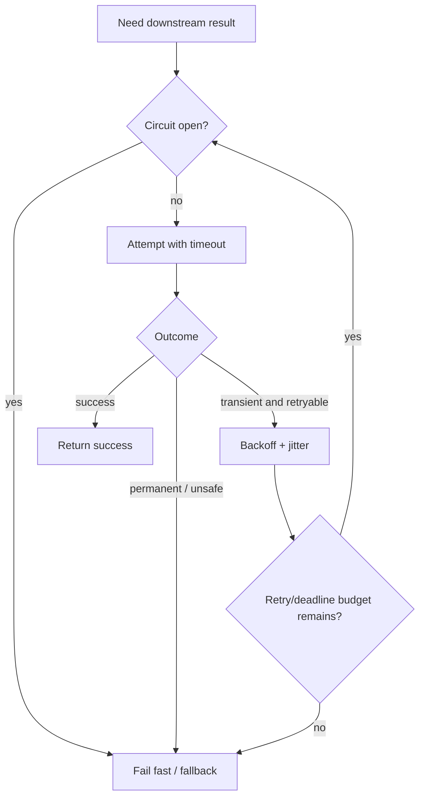
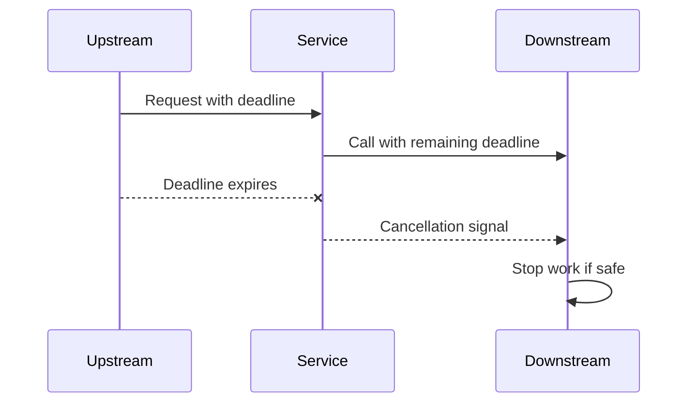
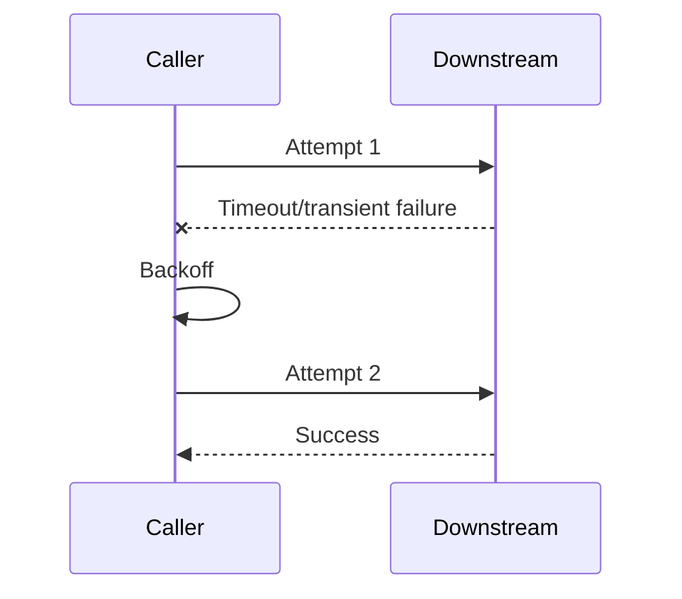
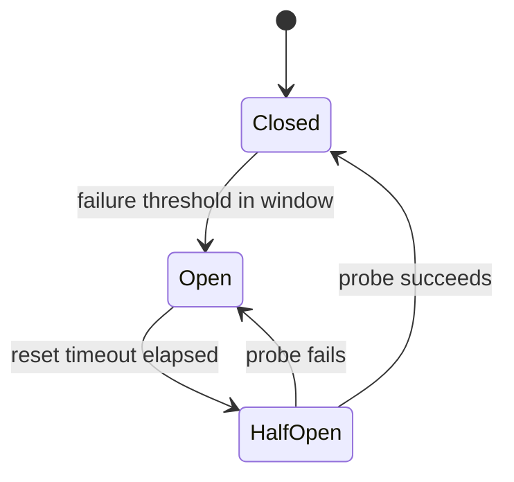
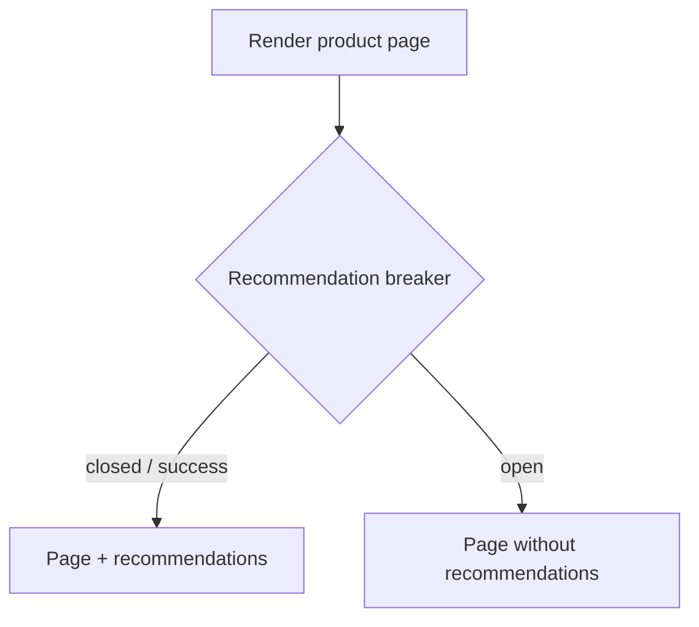
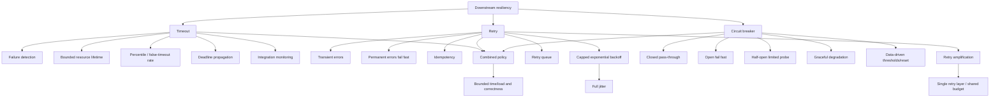

> 本文严格沿原章顺序展开：先讨论 timeout 如何限制无界等待、避免资源泄漏与故障传播，并用 false-timeout rate/p99.9 选择时长；再讨论 retry 的适用错误、capped exponential backoff、full jitter、retry queue、幂等性和多层 retry amplification；最后分析 circuit breaker 对长期故障的快速失败、graceful degradation，以及 closed/open/half-open 三态恢复。原章正文约 8 页；文中的 deadline budget、Little's Law、重试乘法、滑动窗口、半开探针并发、熔断器作用域和 C11 状态机用于补足推导与工程边界，不应误认为原书逐字给出的客户端默认值、生产阈值或韧性库配置。

## 0. 本章定位：在服务边界处阻止下游 fault 向上游传播

### 0.1 从架构级隔离转向调用级防护

前两章从架构层处理 failure impact：

- Redundancy：一个副本 fault，其他副本接管；
- Fault isolation：限制 poison/noisy fault 的 blast radius。

Chapter 27 转向可加在现有调用点上的 tactical patterns，保护 service 免受 downstream dependency failure：


如果 S 无限制等待或重试 D：

```text
downstream fault
-> caller resources retained
-> S becomes slow/unavailable
-> S's upstream also waits/retries
-> cascade
```

### 0.2 三个模式分别回答什么

| 模式 | 核心问题 | 适用预期 |
| --- | --- | --- |
| Timeout | 最多等多久？ | Silence 不能无限占资源 |
| Retry | 是否值得再试？何时试？ | 下一次有较高概率成功 |
| Circuit breaker | 是否根本不应发起调用？ | 下一次大概率仍失败 |

它们组成分层决策：



### 0.3 Resilience 不等于让所有请求最终成功

目标是：

- 限制每个 request 的时间和资源；
- 对 transient fault 做少量高价值 retry；
- 对 persistent fault 停止无意义工作；
- 保护 caller 和 healthy traffic；
- 保持 correctness/idempotency；
- 让 degraded behavior 可预测。

有时 fail fast 比等待/retry 更 resilient。

---

## 1. 27.1 Timeout

### 1.1 定义

Network call 在规定时间内没有 response，就终止等待并返回 timeout error：

```text
start call at t0
deadline = t0 + timeout
if response before deadline -> observe result
else -> cancel local wait and report timeout
```

Timeout 是一个不完美 failure detector。它只说明 caller 在 deadline 前没得到结果，不说明：

- Downstream 没收到 request；
- Downstream 没执行；
- Downstream 已 crash；
- Result 以后不会到达；
- Write 没有 commit。

### 1.2 为什么必须有 timeout

无 timeout 的 operation 可能永不返回。它持续占用：

- Thread/goroutine/task；
- Socket/connection；
- Request context/memory；
- Semaphore/concurrency permit；
- Upstream request slot；
- Transaction/lock。

Chapter 24 已说明这会形成 resource leak。Timeout 的作用是：

1. 检测 connectivity/latency fault；
2. 给 operation 建立 bounded lifetime；
3. 释放资源；
4. 阻止 slowness 向调用链传播。

### 1.3 不只网络调用

原章说所有可能永不返回的 operation 都要 timeout，例如 acquiring a mutex。还包括：

- Queue receive；
- Database lock/query；
- Process wait；
- Future/promise；
- File I/O；
- Distributed lease；
- Connection-pool acquire。

### 1.4 Timeout 与 cancellation

Caller timeout 只停止本地等待；若不传播 cancellation，downstream 可能继续完成已无用户需要的工作。



Cancellation 是 cooperative：downstream 可能已进入不可撤销 side effect，或不支持取消。Correctness 不能假设 timeout 等于 rollback。

### 1.5 Little's Law 的资源直觉

平均 in-flight operations：

$$
L=\lambda W
$$

若 rate $\lambda=2{,}000/s$，正常 latency $W=50ms=0.05s$：

$$
L=100
$$

若下游 slow 到 10 秒且无 timeout：

$$
L=20{,}000
$$

同样 QPS 会占用 200 倍并发资源。Timeout 把 $W$ 上界限制住，避免 pool 被无限拖住。

---

## 2. Timeout 默认值的危险

原章用多个 API 说明“默认安全”不能假设。以下是作者写作时的例子/历史状态，具体当前版本必须查官方文档。

### 2.1 XMLHttpRequest

默认 timeout 为 0，表示没有 timeout，需要显式设置：

```javascript
var xhr = new XMLHttpRequest();
xhr.open("GET", "/api", true);
xhr.timeout = 10000;
xhr.onload = function () {
  // Request finished
};
xhr.ontimeout = function (e) {
  // Request timed out
};
xhr.send(null);
```

原章示例中的 10,000 ms 只是演示如何设置，不是适用于所有 API 的推荐值。

### 2.2 Fetch / Abort API

Fetch 最初没有直接 timeout option，后来浏览器可通过 Abort API/`AbortController` 等机制取消。现代平台还可能提供其他 timeout helper；应确认 cancellation 是否覆盖 DNS、connect、body read 和 streaming。

### 2.3 Python requests 与 Go HTTP

原章指出：

- Python `requests` 默认 timeout 是 infinity/不超时；
- Go HTTP 默认配置不一定设置所需 timeouts。

Library 版本、client/server timeout 类型不同，必须显式审查。

### 2.4 Java/.NET

现代 Java/.NET clients 较常带默认 timeout。原章以 .NET Core `HttpClient` 100 seconds（100 秒）为例，评价为宽松但比无限等待好。

100 秒对 interactive API 可能远超 end-to-end SLO；默认值不是业务正确值。

### 2.5 第三方 library 的隐式调用

不仅自己写的 HTTP call：SDK、telemetry exporter、DNS/client、auth library 都可能做 network calls，却不暴露 timeout setting。

审查清单：

- Connect timeout；
- TLS handshake timeout；
- Request/response header timeout；
- Body/idle timeout；
- Total deadline；
- Pool-acquire timeout；
- Cancellation support；
- Retry behavior。

---

## 3. 如何选择 timeout

### 3.1 False timeout

False timeout：下游本来最终会返回，caller 却提前 timeout。

若允许 false-timeout rate 为 $\epsilon$，可将 timeout 设在 response-time distribution 的：

$$
T=F^{-1}(1-\epsilon)
$$

其中 $F$ 是下游 latency CDF。

### 3.2 原章 p99.9 例子

允许 0.1% 最终可成功 requests 被误 timeout：

$$
\epsilon=0.001
$$

则以 99.9th percentile（p99.9）response time 为基准：

$$
T\approx p_{99.9}
$$

直觉：99.9% 观测到的成功请求在该时间内结束，约 0.1% 超过它。

### 3.3 该方法的前提

- Distribution 来自代表性的 production traffic；
- 包含目标 region/network/client path；
- 下游未处于严重 overload；
- Sample 足够覆盖 tail；
- 指标包含需要限制的完整 lifecycle；
- Request class/cost 分组合理。

若只测 server handler，不含 DNS/connect/TLS/pool queue，timeout 会过短。

### 3.4 Padding

工程上常在 percentile 上加 network variance/padding：

$$
T=p_{99.9}+\Delta
$$

若 p50 与 p99.9 极接近，小噪声就会大量 false timeout，需要额外 margin。跨 internet/client geography 时 tail 更不稳定。

这是对原章 percentile 方法的补充，不是原文指定公式。

### 3.5 Timeout 必须适配上游 deadline

End-to-end deadline 为 $D$，当前剩余 budget：

$$
D_{remaining}=D-(now-start)
$$

下游 timeout 不能超过剩余 budget，还要留 response/cleanup 时间：

$$
T_{downstream}\le D_{remaining}-T_{reserve}
$$

否则上游早已放弃，当前服务仍在无用等待。

### 3.6 分层 budget

调用链 A -> B -> C：

```text
client deadline: 1000 ms
A local/reserve: 100 ms
A->B budget: <= 900 ms
B local/reserve: 100 ms
B->C budget: <= 800 ms
```

应传播 absolute deadline，而不是每层重新给完整 1 秒，否则深层总时长超出用户 deadline。

---

## 4. Timeout 的可观测性与集中治理

### 4.1 Integration-point telemetry

原章要求监控完整 network-call lifecycle：

- Duration；
- Status code；
- Timeout 是否触发。

还应记录：

- Dependency/endpoint；
- DNS/connect/TLS/pool phases；
- Attempt number；
- Remaining deadline；
- Cancellation；
- Request class；
- Circuit state；
- Final user outcome。

### 4.2 为什么只看 downstream dashboard 不够

Caller timeout 后，downstream 可能稍后记录 success。两边各看都“合理”，用户却失败。需要 trace/correlation ID 和 caller-observed latency。

### 4.3 Library wrapper

原章建议用 library function 包装 call，自动：

- 设置 timeout；
- 记录 metrics；
- 传播 trace/deadline；
- 分类 error；
- 统一 cancellation。

避免每个 call site 靠 developer 记忆。

### 4.4 Sidecar/service mesh

Co-located reverse proxy 可拦截 remote calls，统一 timeout/monitoring。优点是语言无关；局限：

- Application 仍需理解 idempotency/business fallback；
- Proxy timeout 与 application deadline 要一致；
- 双层 retry 会放大；
- Streaming/long-poll 需特殊 policy；
- Proxy config/control plane 新增复杂度。

---

## 5. 27.2 Retry：失败后 fail fast 还是再试

### 5.1 Retry 适合 transient fault

短暂 connectivity fault、单次 packet loss、某个 replica 瞬时不可用时，下一次可能成功。



### 5.2 Retry 会加压

Downstream 已 overload 时，立即 retry 增加 offered load，延长 queue，制造更多 timeout 和 retry：

```text
overload -> timeout -> immediate retry
-> more load -> more timeout
```

因此 retry 必须有：

- Error classification；
- Backoff；
- Jitter；
- Max attempts；
- Total deadline；
- Idempotency；
- Retry budget。

### 5.3 Fail fast 的场景

原章例子：not authorized。以下通常不应 retry（除非明确状态会变）：

- Invalid request/schema；
- Authentication/authorization denied；
- Resource not found（按语义）；
- Business rule rejection；
- Payload too large；
- Unsupported version；
- Deadline exhausted。

HTTP status 不能机械映射；例如 409/404 在某些 eventual workflow 可短暂，需 domain contract。

### 5.4 Unknown outcome

Timeout 对 write 是 ambiguous：request 可能成功但 response lost。Retry 前必须问：

- Operation 是否 inherently idempotent？
- 是否有 idempotency key？
- Server 是否原子记录 key + effect？
- Duplicate side effect 能否补偿？

Chapter 5.7 已讨论 PUT/DELETE 与 non-idempotent POST 的边界。

---

## 6. 27.2.1 Capped exponential backoff

### 6.1 公式

原章给出：

$$
d_a=\min(C,b\times2^a)
$$

其中：

- $a$：retry attempt index，从 0 开始；
- $b$：initial backoff；
- $C$：cap；
- $d_a$：第 $a+1$ 次 retry 前的最大/固定 delay。

### 6.2 原章数值例子

$$
b=2s,\qquad C=8s
$$

| Retry | $a$ | Delay |
| ---: | ---: | ---: |
| 1 | 0 | 2 s |
| 2 | 1 | 4 s |
| 3 | 2 | 8 s |
| 4+ | 3+ | 8 s |

Cap 防止等待无限指数增长；也意味着大量 clients 最终可能都以固定周期 retry，需 jitter。

### 6.3 总 backoff

无 cap、$k$ 次 retries 的等待和：

$$
\sum_{a=0}^{k-1}b2^a=b(2^k-1)
$$

有 cap 后按达到 cap 前后分段。所有 attempts + delays 必须落在 total deadline：

$$
\sum_i T_{attempt,i}+\sum_a d_a\le D
$$

### 6.4 Max attempts 与 max elapsed time

原章说直到 max retries 或 initial request 后足够时间。两者都要：

- Attempts 限制 downstream amplification；
- Elapsed deadline 防 slow attempts/backoff 超用户预算。

只设 attempts，不同 timeout 会产生极不同时长；只设 deadline，极快失败可在短时间 retry 很多次。

---

## 7. Jitter 与 Figure 27.1 retry storm

### 7.1 只有 exponential backoff 仍会同步

大量 clients 同时在故障点失败，并使用同一 $b,C,a$：

```text
t0 failure
-> all retry at t0+2
-> all fail
-> all retry at t0+6
-> synchronized spikes
```

Figure 27.1 画出随时间间隔拉长、但每一波仍成峰的 retry storm。

### 7.2 Full jitter

原章给出 random jitter（随机抖动）：

$$
d_a=\operatorname{random}
\left(0,\min(C,b2^a)\right)
$$

把同一 retry wave 分散在整个窗口。

### 7.3 期望 delay

若 uniform random $U(0,M)$：

$$
E[d]=\frac{M}{2}
$$

Full jitter 的平均等待比固定 capped backoff 小一半，但重要收益是减少同步峰值。这里是分布推导，原章只给公式和直觉。

### 7.4 Jitter 不是随机 sleep 即可

Random source 应避免所有 instances 同 seed；delay 需服从 deadline/cap。还可使用 equal/decorrelated jitter，但必须基于 workload 测试。

### 7.5 Retry budget

即使每请求最多重试 2 次，大规模 failure 下额外 traffic 仍可达 200%。可限制全局 retry ratio：

$$
RetryBudget=\beta\times OriginalRequests
$$

当 budget 用尽，fail fast，保护 downstream。这是原章机制的工程补充。

---

## 8. Retry queue

### 8.1 不必主动等待

Batch/non-real-time application 可把 failed request 放入 retry queue，由同 process 或其他 worker 稍后重试。


### 8.2 收益

- 不占原 request/thread；
- Durable retry across process crash；
- 平滑 load；
- 独立扩 retry workers；
- 可按 `available_at` 调度；
- 便于 DLQ/attempt tracking。

### 8.3 代价

- End-to-end latency 增加；
- 结果异步化；
- Queue backlog；
- Duplicate/ordering；
- Schema/version；
- Retry message itself 需 durability；
- Poison request 需 max attempts/DLQ。

与 Chapter 23 messaging 保证相同。

---

## 9. Retry eligibility 与幂等性

### 9.1 错误分类

```text
retryable = transient connectivity OR explicitly retryable server signal
not retryable = permanent client/domain/auth failure
```

还要考虑 `Retry-After`、server load、deadline 和 operation semantics。

### 9.2 幂等

操作 $f$ 满足：

$$
f(f(x))=f(x)
$$

多次执行与一次 effect 相同。PUT/DELETE 在 HTTP 语义上通常 idempotent，但 response/status 可不同；具体 application handler 仍可能附带 non-idempotent side effect。

### 9.3 Idempotency key

Non-idempotent request 可携带 stable key：

```text
Idempotency-Key: operation-123
```

Server 在同一 transaction 中：

```text
if key exists:
    return stored result
else:
    apply effect
    persist key + result
commit
```

如果先记录 key 后 effect，crash 会永久跳过；先 effect 后 key，crash 会重复。必须原子。

### 9.4 Retry 与 cancellation 的竞争

上游已取消后不应继续 retry。每次 attempt 前检查 remaining deadline/cancellation，避免 orphan work。

---

## 10. 27.2.2 Retry amplification

### 10.1 原章 A -> B -> C 链

Client 调 A，A 调 B，B 调 C。B->C fail 后 B retry，延长 A 等待；A timeout 后 retry B；client 又可能 timeout/retry A。


Figure 27.2 画出 A 与 B 各 `retries=3` 时，越深层 arrows 越多。

### 10.2 乘法上界

若第 $i$ 层最多 retry $r_i$ 次，即 attempts $1+r_i$，深层最大 attempts：

$$
Attempts_{deep}=\prod_{i=1}^{d}(1+r_i)
$$

若 A 和 B 都 retry 3 次，对一个最外层 attempt，C 最多收到：

$$
(1+3)^2=16
$$

若 client 也 retry 3 次：

$$
(1+3)^3=64
$$

这是 worst-case 上界；deadline/成功/熔断会减少实际值。

### 10.3 为什么深层最危险

最深 dependency：

- 接收所有上层 amplification；
- 往往已是原始 fault/overload 点；
- Retry 进一步降低恢复概率；
- Queue/tail 变长，触发更多 timeout。

### 10.4 原章建议

Long dependency chain 中考虑只在一个层级 retry，其他层 fail fast。

选择 retry 层通常靠近：

- 有完整 operation semantics/idempotency 的 caller；
- 能观察 end-to-end deadline 的层；
- 能做 fallback 的层。

### 10.5 Shared retry budget

通过 metadata 传播 attempt count/deadline，防每层重置预算：

```text
remaining_attempts
absolute_deadline
request_id
```

Sidecar/application 也要共享配置，避免隐形双重 retry。

---

## 11. 27.3 Circuit breaker

### 11.1 为什么 timeout + retry 仍不够

Timeout 限制单次等待，retry 应对 transient fault；如果 downstream 长期 unresponsive：

- 每个请求仍先等 timeout；
- 可能再 backoff/retry；
- Caller latency 上升；
- Resources/queues 累积；
- Slowness 向 upstream 传播。

需要在发调用前判断“近期大概率失败”，直接阻断。

### 11.2 定义

Circuit breaker 监测长期 degradation，暂时阻止新 downstream calls。目标：让 subsystem failure 不拖慢 caller。

> The fastest network call is the one we don't have to make.

### 11.3 Retry 与 circuit breaker 的预期差异

| Pattern | 对下一次调用的预期 | 动作 |
| --- | --- | --- |
| Retry | 可能成功 | 等待后再调用 |
| Circuit breaker | 大概率失败 | 不调用，立即 fallback/error |

两者常组合，但 breaker 需要观察 retry attempts/final outcomes，避免 metrics 口径混乱。

---

## 12. Figure 27.3：三态状态机



### 12.1 Closed

- Calls pass through；
- Track errors/timeouts；
- Failure count/rate 超 threshold 且位于 predefined interval，trip open。

Closed 不表示 dependency guaranteed healthy，只表示当前允许调用。

### 12.2 Open

- 不发 network call；
- 立即 fail fast；
- 可返回 fallback/stale/partial response；
- 记录 blocked calls；
- 等待 reset interval。

Open 减轻 downstream 和 caller 压力，但可能丢弃本可成功的 requests，是 availability/freshness/functionality tradeoff。

### 12.3 Half-open

- 经过一段时间后允许 probe；
- Probe success -> Closed；
- Probe failure -> Open。

生产实现通常限制并发 probes；若成千上万 callers 同时 half-open，会形成 recovery storm。

### 12.4 State names 容易反直觉

来自 electrical circuit：

- Closed circuit 导通，因此 calls pass；
- Open circuit 断开，因此 calls blocked。

---

## 13. Graceful degradation

### 13.1 Open circuit 的业务含义

Dependency down 时必须决定：

- Fail entire request；
- Omit optional feature；
- Return stale cache；
- Use default value；
- Queue work；
- Read-only mode；
- Alternative provider。

### 13.2 原章 airplane 比喻

飞机失去非关键 subsystem，不应整机 crash，而应降级到仍能飞行、着陆的状态。

### 13.3 Amazon recommendation 例子

Recommendation service unavailable 时，Amazon front page 可不显示 recommendations，而不是整页失败。



### 13.4 Critical dependency

Payment authorization 等 critical dependency 可能无法合理 fallback。此时 open circuit 仍 fail fast，但：

- 返回明确 unavailable；
- 不假装成功；
- 不使用 unsafe stale data；
- 可 queue only if business permits；
- 保持 caller resources。

Graceful degradation 不等于吞掉 correctness failure。

---

## 14. Circuit breaker 的参数与细节

原章结尾强调 devil is in the details：failure threshold 和 open->half-open wait 必须用历史数据按 context 决定。

### 14.1 什么算 failure

通常计入：

- Timeout；
- Connection failure/reset；
- Explicit unavailable/5xx；
- Protocol corruption；
- Slow call（slow-call threshold）。

通常不计入 dependency health failure：

- Caller validation error；
- Auth denied；
- Domain 4xx；
- Cancellation caused by upstream deadline（视原因）。

错误分类错会误开/不开。

### 14.2 Count threshold 与 failure rate

单纯连续 $k$ failures 在低流量/高流量下含义不同。可用 rolling window：

$$
FailureRate=\frac{Failures}{Calls}
$$

当：

```text
Calls >= minimum_samples
AND FailureRate >= threshold
```

才 open。还可按 time bucket/count window。

### 14.3 Reset timeout

太短：依赖未恢复就频繁 probe；太长：恢复后仍被 block。可用：

- Historical recovery distribution；
- Exponential open duration；
- Server health signal；
- Manual override；
- Adaptive probes。

### 14.4 Half-open concurrency

只允许 1 或少量 probe，其他 calls fail fast/排队。Probe 应代表真实 operation但避免 destructive non-idempotent effect。

### 14.5 Breaker scope

Scope 太粗：一个 endpoint/tenant fault 打开整个 dependency；太细：samples 不足、状态太多。

可按：

- Host/cluster；
- Endpoint/method；
- Region；
- Tenant（noisy source）；
- Operation class。

### 14.6 Distributed breakers

每 process local breaker：

- 无共享 state bottleneck；
- 各自 sample 少、打开时间不同；
- 仍可能 collectively probe storm。

Central breaker：一致但新增 dependency/latency。常用 local breaker + randomized reset/jitter + shared telemetry。

### 14.7 State persistence

Process restart 会重置 breaker closed，可能在 outage 时重新 flood。可：

- Startup conservative mode；
- Preserve recent state；
- Outlier/health signal；
- Retry budget；
- Stagger restarts。

---

## 15. 三个模式如何组合

### 15.1 推荐顺序

```text
check cancellation/deadline
-> check circuit breaker
-> acquire bounded resources
-> attempt with timeout
-> classify result
-> record breaker outcome
-> if transient + idempotent + budget: backoff+jitter retry
-> else fallback/fail
```

### 15.2 Interaction pitfalls

- Attempt timeout × max attempts 超总 deadline；
- Breaker 把 caller error 计为 downstream failure；
- Retry library + mesh 双重 retry；
- Breaker open 后 caller 仍外层 retry，造成 busy loop；
- Half-open probe 被 retry 多次，放大恢复压力；
- Fallback 又调用同一故障 dependency；
- Metrics 只记 final success，隐藏 retry load。

### 15.3 Deadline budget 例子

总 deadline 1,000 ms，最多 3 attempts。若每次 timeout 400 ms，光 attempts 最坏 1,200 ms，尚未含 backoff，配置不可能满足 deadline。

可设计：

```text
attempt1 250 ms
backoff <= 50 ms
attempt2 250 ms
backoff <= 100 ms
attempt3 <= remaining 250 ms
reserve 100 ms
```

实际应基于 latency distribution，不机械均分。

---

## 16. 可运行 C11 示例：Timeout、Retry 与 Circuit Breaker

### 16.1 模拟目标

程序用 deterministic outcome scripts 模拟一个 caller policy：

- 验证 capped backoff 为 2、4、8、8 秒，full jitter 不超过 cap；
- Idempotent request 第一次 timeout、第二次成功；
- Unauthorized permanent error 只尝试一次，不计 breaker failure；
- Non-idempotent timeout 不 retry；
- 后续 server error 达 threshold，breaker open；
- Open 时下一请求零 downstream attempt、立即 blocked；
- Reset interval 后只允许 half-open probe；失败重新 open；
- 下一 reset 后 probe success，closed；
- Clock rollback、backoff overflow/非法参数、空 script 被拒绝；
- 不依赖 `assert`。

它验证 policy/state transitions，不做真实 network I/O 或 sleeping。

### 16.2 完整代码

```c
#include <stdbool.h>
#include <limits.h>
#include <stddef.h>
#include <stdint.h>
#include <stdio.h>

typedef enum {
    OUTCOME_OK,
    OUTCOME_TIMEOUT,
    OUTCOME_SERVER_ERROR,
    OUTCOME_UNAUTHORIZED,
    OUTCOME_BLOCKED,
    OUTCOME_POLICY_ERROR
} Outcome;

typedef enum {
    CIRCUIT_CLOSED,
    CIRCUIT_OPEN,
    CIRCUIT_HALF_OPEN
} CircuitState;

typedef enum {
    DECISION_ALLOW,
    DECISION_BLOCK,
    DECISION_ERROR
} Decision;

typedef struct {
    CircuitState state;
    unsigned int failures;
    unsigned int threshold;
    unsigned long opened_at;
    unsigned long reset_after;
    bool probe_in_flight;
} CircuitBreaker;

typedef struct {
    Outcome outcome;
    unsigned int attempts;
} CallResult;

static const char *outcome_name(Outcome outcome) {
    switch (outcome) {
        case OUTCOME_OK:
            return "ok";
        case OUTCOME_TIMEOUT:
            return "timeout";
        case OUTCOME_SERVER_ERROR:
            return "server_error";
        case OUTCOME_UNAUTHORIZED:
            return "unauthorized";
        case OUTCOME_BLOCKED:
            return "blocked";
        case OUTCOME_POLICY_ERROR:
            return "policy_error";
    }
    return "policy_error";
}

static const char *state_name(CircuitState state) {
    switch (state) {
        case CIRCUIT_CLOSED:
            return "closed";
        case CIRCUIT_OPEN:
            return "open";
        case CIRCUIT_HALF_OPEN:
            return "half_open";
    }
    return "invalid";
}

static bool retryable(Outcome outcome) {
    return outcome == OUTCOME_TIMEOUT ||
        outcome == OUTCOME_SERVER_ERROR;
}

static bool capped_backoff(unsigned long initial,
                           unsigned long cap,
                           unsigned int retry_index,
                           unsigned long *delay) {
    unsigned long value;
    unsigned int index;

    if (delay == NULL || initial == 0 || cap == 0) {
        return false;
    }
    value = initial < cap ? initial : cap;
    for (index = 0; index < retry_index; index++) {
        if (value >= cap || value > cap / 2) {
            value = cap;
            break;
        }
        value *= 2;
    }
    *delay = value;
    return true;
}

static uint32_t next_random(uint32_t *state) {
    uint32_t value = *state;
    value ^= value << 13;
    value ^= value >> 17;
    value ^= value << 5;
    *state = value;
    return value;
}

static bool full_jitter(unsigned long maximum,
                        uint32_t *random_state,
                        unsigned long *delay) {
    if (random_state == NULL || delay == NULL ||
        *random_state == 0 || maximum == ULONG_MAX) {
        return false;
    }
    *delay = (unsigned long)next_random(random_state) %
        (maximum + 1);
    return true;
}

static Decision breaker_before_call(CircuitBreaker *breaker,
                                    unsigned long now) {
    if (breaker == NULL || breaker->threshold == 0 ||
        breaker->reset_after == 0) {
        return DECISION_ERROR;
    }
    if (breaker->state == CIRCUIT_CLOSED) {
        return DECISION_ALLOW;
    }
    if (breaker->state == CIRCUIT_OPEN) {
        if (now < breaker->opened_at) {
            return DECISION_ERROR;
        }
        if (now - breaker->opened_at < breaker->reset_after) {
            return DECISION_BLOCK;
        }
        breaker->state = CIRCUIT_HALF_OPEN;
        breaker->probe_in_flight = true;
        return DECISION_ALLOW;
    }
    if (breaker->state == CIRCUIT_HALF_OPEN) {
        return breaker->probe_in_flight
            ? DECISION_BLOCK
            : DECISION_ERROR;
    }
    return DECISION_ERROR;
}

static bool breaker_after_call(CircuitBreaker *breaker,
                               unsigned long now,
                               Outcome outcome) {
    const bool dependency_healthy =
        outcome == OUTCOME_OK || outcome == OUTCOME_UNAUTHORIZED;

    if (breaker == NULL ||
        (outcome != OUTCOME_OK && outcome != OUTCOME_TIMEOUT &&
         outcome != OUTCOME_SERVER_ERROR &&
         outcome != OUTCOME_UNAUTHORIZED)) {
        return false;
    }
    if (dependency_healthy) {
        breaker->state = CIRCUIT_CLOSED;
        breaker->failures = 0;
        breaker->probe_in_flight = false;
        return true;
    }
    if (breaker->state == CIRCUIT_HALF_OPEN) {
        breaker->state = CIRCUIT_OPEN;
        breaker->opened_at = now;
        breaker->failures = breaker->threshold;
        breaker->probe_in_flight = false;
        return true;
    }
    if (breaker->state != CIRCUIT_CLOSED ||
        breaker->failures == UINT_MAX) {
        return false;
    }
    breaker->failures++;
    if (breaker->failures >= breaker->threshold) {
        breaker->state = CIRCUIT_OPEN;
        breaker->opened_at = now;
    }
    return true;
}

static bool call_with_retry(CircuitBreaker *breaker,
                            unsigned long now,
                            bool idempotent,
                            const Outcome *script,
                            size_t script_count,
                            unsigned int max_attempts,
                            CallResult *result) {
    size_t script_index;

    if (breaker == NULL || script == NULL || script_count == 0 ||
        max_attempts == 0 || result == NULL) {
        return false;
    }
    *result = (CallResult){OUTCOME_POLICY_ERROR, 0};
    for (script_index = 0;
         script_index < script_count &&
         result->attempts < max_attempts;
         script_index++) {
        const Decision decision = breaker_before_call(breaker, now);
        Outcome outcome;

        if (decision == DECISION_ERROR) {
            return false;
        }
        if (decision == DECISION_BLOCK) {
            result->outcome = OUTCOME_BLOCKED;
            return true;
        }

        outcome = script[script_index];
        result->attempts++;
        if (!breaker_after_call(breaker, now, outcome)) {
            return false;
        }
        result->outcome = outcome;

        if (outcome == OUTCOME_OK ||
            outcome == OUTCOME_UNAUTHORIZED ||
            !idempotent || !retryable(outcome)) {
            return true;
        }
    }
    return true;
}

int main(void) {
    CircuitBreaker breaker = {
        CIRCUIT_CLOSED, 0, 2, 0, 10, false
    };
    const Outcome transient[] = {
        OUTCOME_TIMEOUT, OUTCOME_OK
    };
    const Outcome unauthorized[] = {OUTCOME_UNAUTHORIZED};
    const Outcome timeout_only[] = {OUTCOME_TIMEOUT};
    const Outcome persistent[] = {
        OUTCOME_SERVER_ERROR,
        OUTCOME_SERVER_ERROR,
        OUTCOME_SERVER_ERROR
    };
    const Outcome success[] = {OUTCOME_OK};
    const Outcome failure[] = {OUTCOME_SERVER_ERROR};
    unsigned long backoffs[4];
    unsigned long jitter;
    uint32_t random_state = UINT32_C(7);
    CallResult result;
    unsigned int index;

    for (index = 0; index < 4; index++) {
        if (!capped_backoff(2, 8, index, &backoffs[index]) ||
            !full_jitter(backoffs[index], &random_state, &jitter) ||
            jitter > backoffs[index]) {
            return 1;
        }
    }
    if (backoffs[0] != 2 || backoffs[1] != 4 ||
        backoffs[2] != 8 || backoffs[3] != 8 ||
        !capped_backoff(ULONG_MAX / 2 + 1, ULONG_MAX - 1,
                        1, &jitter) ||
        jitter != ULONG_MAX - 1 ||
        capped_backoff(0, 8, 0, &jitter) ||
        full_jitter(8, &(uint32_t){0}, &jitter) ||
        full_jitter(ULONG_MAX, &random_state, &jitter) ||
        call_with_retry(&breaker, 0, true,
                        transient, 0, 1, &result)) {
        return 1;
    }
    printf("backoff max=2,4,8,8 jitter_bounded=1\n");

    if (!call_with_retry(&breaker, 0, true,
                         transient, 2, 3, &result) ||
        result.outcome != OUTCOME_OK || result.attempts != 2 ||
        breaker.state != CIRCUIT_CLOSED) {
        return 1;
    }
    printf("transient outcome=%s attempts=%u state=%s\n",
           outcome_name(result.outcome), result.attempts,
           state_name(breaker.state));

    if (!call_with_retry(&breaker, 1, true,
                         unauthorized, 1, 3, &result) ||
        result.outcome != OUTCOME_UNAUTHORIZED ||
        result.attempts != 1 || breaker.failures != 0) {
        return 1;
    }
    printf("permanent outcome=%s attempts=%u state=%s\n",
           outcome_name(result.outcome), result.attempts,
           state_name(breaker.state));

    if (!call_with_retry(&breaker, 2, false,
                         timeout_only, 1, 3, &result) ||
        result.outcome != OUTCOME_TIMEOUT || result.attempts != 1 ||
        breaker.failures != 1) {
        return 1;
    }
    printf("non_idempotent outcome=%s attempts=%u failures=%u\n",
           outcome_name(result.outcome), result.attempts,
           breaker.failures);

    if (!call_with_retry(&breaker, 3, true,
                         persistent, 3, 3, &result) ||
        result.outcome != OUTCOME_BLOCKED || result.attempts != 1 ||
        breaker.state != CIRCUIT_OPEN) {
        return 1;
    }
    printf("persistent outcome=%s attempts=%u state=%s\n",
           outcome_name(result.outcome), result.attempts,
           state_name(breaker.state));

    if (!call_with_retry(&breaker, 4, true,
                         success, 1, 1, &result) ||
        result.outcome != OUTCOME_BLOCKED || result.attempts != 0 ||
        breaker_before_call(&breaker, 2) != DECISION_ERROR) {
        return 1;
    }
    printf("open_fast_fail outcome=%s attempts=%u\n",
           outcome_name(result.outcome), result.attempts);

    if (!call_with_retry(&breaker, 13, true,
                         failure, 1, 1, &result) ||
        result.outcome != OUTCOME_SERVER_ERROR ||
        breaker.state != CIRCUIT_OPEN || breaker.opened_at != 13) {
        return 1;
    }
    printf("probe_failed state=%s reopened_at=%lu\n",
           state_name(breaker.state), breaker.opened_at);

    if (!call_with_retry(&breaker, 23, true,
                         success, 1, 1, &result) ||
        result.outcome != OUTCOME_OK ||
        breaker.state != CIRCUIT_CLOSED || breaker.failures != 0) {
        return 1;
    }
    printf("probe_succeeded outcome=%s state=%s\n",
           outcome_name(result.outcome),
           state_name(breaker.state));
    return 0;
}
```

### 16.3 编译运行

```bash
gcc -std=c11 -Wall -Wextra -Werror -pedantic downstream.c -o downstream
./downstream
```

关键输出：

```text
backoff max=2,4,8,8 jitter_bounded=1
transient outcome=ok attempts=2 state=closed
permanent outcome=unauthorized attempts=1 state=closed
non_idempotent outcome=timeout attempts=1 failures=1
persistent outcome=blocked attempts=1 state=open
open_fast_fail outcome=blocked attempts=0
probe_failed state=open reopened_at=13
probe_succeeded outcome=ok state=closed
```

### 16.4 代码与原理对应

| 代码 | 本章概念 |
| --- | --- |
| `capped_backoff` | $\min(C,b2^a)$，含 overflow-safe cap |
| `full_jitter` | $U(0,d_a)$ retry spread |
| `idempotent=false` | Ambiguous timeout 后不自动 retry |
| Unauthorized | Permanent error fail fast，不污染 breaker |
| Failure threshold 2 | Closed -> Open |
| Open attempts 0 | 最快调用是不调用 |
| Reset 10 秒 | Open -> Half-open probe |
| Probe fail/success | Re-open / Close |

### 16.5 示例局限

- 无真实网络、sleep、deadline 消耗；
- Outcome script 代替 HTTP/client behavior；
- Failure threshold 使用累计失败，不是时间窗口/failure rate；
- Success 会完全重置 failures；
- Half-open 只在单线程模型有一个 probe；
- Jitter 只检查范围，不输出分布；
- Unauthorized 被视为 dependency reachable，但真实分类按协议；
- Breaker state 仅本地内存，restart 会重置；
- 无 fallback、retry queue 和多层 amplification simulation；
- `unsigned long` 长期 clock wraparound 未建模。

因此程序验证 policy 和三态转换，不是 production resilience library。

---

## 17. 容易混淆的概念

### 17.1 Timeout 与 deadline

- Timeout 常是某 attempt/operation 的最大时长；
- Deadline 是整个 request 绝对结束时间。

多层使用相同 timeout 不能替代传播 deadline。

### 17.2 Timeout 与 cancellation

Timeout 是 caller 决定停止等待；cancellation 是通知下游停止。Timeout 不保证下游 effect 未发生。

### 17.3 Timeout 与 server error

Server error 是收到明确 response；timeout 是 outcome unknown/silence。Retry/idempotency风险不同。

### 17.4 Retry 与 failover

Retry 是再做 attempt；failover 是换 replica/path。Retry 到同一 overloaded target 价值低。

### 17.5 Retry 与 hedging

Retry 在前 attempt 失败/超时后再发；hedging 在慢但未失败时并发发备用请求，资源成本更高。

### 17.6 Backoff 与 jitter

Backoff 拉长 retry 间隔；jitter 打散不同 clients。只有 backoff 仍可同步 storm。

### 17.7 Attempts 与 retries

Initial attempt + $r$ retries = $1+r$ total attempts。配置/公式必须明确，避免 off-by-one。

### 17.8 Idempotent method 与 idempotent implementation

HTTP PUT 语义 idempotent，不保证 handler 中发邮件/计费等附加 effect 幂等。

### 17.9 Circuit breaker 与 timeout

Timeout 终止已发出的 slow call；breaker 在调用前阻止预期失败的 call。

### 17.10 Circuit breaker 与 rate limiter

Breaker 根据 downstream health 暂停调用；rate limiter 按 quota/rate 控制 upstream pressure。

### 17.11 Circuit breaker 与 health check

Breaker 从真实 call outcomes 推断 caller-local health；active health check 主动 probe。两者可组合但信号/作用域不同。

### 17.12 Open 与 closed

Electrical naming：closed=导通/允许；open=断开/阻止。

### 17.13 Half-open 与 degraded mode

Half-open 是少量探测 state；degraded mode 是业务功能降级，概念不同。

### 17.14 Retry queue 与 message broker retry

Retry queue 是异步延后 attempt，可由 broker 实现；仍需 visibility、dedup、DLQ 和 backlog 治理。

---

## 18. 常见误区与失败模式

### 18.1 “Library 默认有合理 timeout”

很多默认无限或过长；显式设置并验证覆盖哪些 phase。

### 18.2 “Timeout 后 request 一定没成功”

Response 可丢，server 可已 commit。Non-idempotent blind retry 会重复 effect。

### 18.3 “Timeout 越短越 resilient”

过短制造 false timeout/retry storm。基于 representative percentile 和 deadline。

### 18.4 “每个 dependency 都设 p99.9 就满足总 SLO”

串行/并行 fan-out、网络和 local work 会组合；需 end-to-end budget。

### 18.5 “Async API 不占 thread，所以无需 timeout”

仍占 socket、task、memory、permit；必须 cancel/cleanup。

### 18.6 “所有 timeout 都 retry”

Outcome unknown，operation 可能已成功；先判断幂等、budget 和 downstream state。

### 18.7 “Exponential backoff 已消除 retry storm”

Clients 同步失败仍同时间 retry；必须 jitter。

### 18.8 “Cap 越大越好”

大 cap 可超业务 deadline；小 cap 在长期故障形成固定高频 load。结合 max elapsed/circuit breaker。

### 18.9 “401/403 多 retry 几次可能恢复”

通常 permanent until credential changes，应 fail fast；不要让 auth error trip dependency breaker。

### 18.10 “每层各重试一次问题不大”

Attempts 乘法放大，深层故障点承压最大。统一单层 retry/预算。

### 18.11 “Circuit breaker 提高 downstream availability”

它不修复 dependency，而是保护 caller、降低 load，并用 degraded response改善系统 behavior。

### 18.12 “一失败就 open”

Transient single error 会误熔断。使用 minimum samples、window、rate/threshold。

### 18.13 “Open 后定时全部放流量测试”

会 recovery storm。Half-open 限制 probes并逐步恢复。

### 18.14 “Fallback 永远安全”

Stale/default 对 auth、money、inventory 可能错误；按业务 criticality。

### 18.15 “所有 endpoint 共用一个 breaker”

一个坏 endpoint 可阻断健康功能。Scope 与 failure domain 对齐。

### 18.16 “Process restart 清空 breaker 是好事”

Outage 中 fleet restart 会重新 flood。需要 conservative startup/预算/jitter。

### 18.17 “Mesh 已配置 retry，application 不用知道”

Mesh 不知道 non-idempotent业务 side effect；双层 retry/timeout 必须治理。

---

## 19. 如何设计 downstream resilience policy

### 第一步：分类 dependency 与 operation

Critical/optional，read/write，idempotent/non-idempotent，interactive/batch，single/chain。

### 第二步：定义 end-to-end deadline

从 user SLO 减去 local reserve，再向下传播 absolute deadline，禁止每层重置。

### 第三步：测 latency distribution

按 endpoint、region、request class 观察 DNS/connect/TLS/pool/server/body 全 lifecycle 和 p50/p95/p99/p99.9。

### 第四步：设置 attempt timeout

根据 acceptable false-timeout rate、tail 和 padding，同时小于 remaining deadline。

### 第五步：定义 error taxonomy

明确 retryable transient、permanent fail-fast、overload/server hint、ambiguous timeout、caller cancel。

### 第六步：保证幂等

Inherent idempotency 或 stable idempotency key + atomic effect/result record。否则不自动 retry。

### 第七步：设计 retry budget

Max attempts、max elapsed、capped exponential、full jitter、global ratio budget；长链只在一个层 retry。

### 第八步：需要时转 retry queue

Batch/long-running work使用 durable queue、available time、attempt count、DLQ、completion status。

### 第九步：设计 circuit breaker

Scope、failure classifier、minimum samples、window、threshold、open duration、half-open permits、fallback。

### 第十步：组合顺序和 ownership

明确 application/library/sidecar 哪层负责 timeout/retry/breaker，避免重复 policy。

### 第十一步：设计 degradation

Optional feature omission、stale/default、queue/read-only 或明确 unavailable；不违反 correctness。

### 第十二步：可观测性

Original requests、attempts、retry ratio、timeout phase、backoff、breaker state/transitions/blocked/probes、fallback、final success、downstream load。

### 第十三步：故障演练

Packet loss、slow response、response lost after commit、auth error、overload、long outage、retry storm、multi-layer amplification、half-open recovery和 process restart。

---

## 20. 作者如何形成解决思路

### 20.1 从无界等待的资源传播开始

Downstream silence 会保留 thread/socket，故障向 caller 扩散；timeout 先建立时间边界。

### 20.2 用现实 API 默认值说明责任不能外包

XMLHttpRequest、fetch、Python、Go、.NET 例子说明必须显式审查 third-party timeout。

### 20.3 将 timeout 选择变成可测概率

0.1% false timeout -> p99.9，而非凭直觉填 10 秒；同时监控 integration point。

### 20.4 从 timeout 后的二选一引出 retry

Transient fault 可 retry，overload/permanent error 应 fail fast。由此需要 backoff 和分类。

### 20.5 先指数降频，再用 jitter 解同步

Figure 27.1 揭示同参数 clients 仍有波峰；random delay 平滑群体行为。

### 20.6 扩展到异步 retry 与 correctness

Batch 可进 retry queue；是否能 retry 仍受 error duration 和 idempotency约束。

### 20.7 从单调用扩展到调用链

Figure 27.2 表明每层局部合理的 retry 在全局乘法放大，因此 long chain 只选一个 retry owner。

### 20.8 从 transient 过渡到 non-transient

长期故障下 timeout+retry 仍慢；circuit breaker 直接不调用，保护 caller。

### 20.9 用三态恢复而非永久封锁

Closed 观测、Open 快速失败、Half-open 探测，使 dependency 恢复后重新进入。

### 20.10 以“参数取决于历史数据”收束

Failure threshold/reset time 没有通用常数，必须按 dependency和业务数据调优。

---

## 21. 知识结构



---

## 22. 核心结论

1. **Timeout 为可能永不返回的 operation 建立时间边界，避免 thread/socket 等资源泄漏与级联。**
2. **Timeout 是不完美 failure detector；触发时只知道没按时收到 response，不知道 server 是否执行成功。**
3. **所有 network/pool/lock operations 都应显式 timeout/cancellation，不信任 library default。**
4. **原章展示 XMLHttpRequest 默认 0、历史 fetch Abort、Python requests/Go 无默认 timeout，以及 .NET 100 秒例子。**
5. **可按允许 false-timeout rate 选 percentile；0.1% 对应 p99.9，并需覆盖完整 call lifecycle。**
6. **下游 timeout 必须服从 propagated end-to-end deadline，不能每层重新获得完整预算。**
7. **Timeout duration、status、phase 和触发原因要在 integration point 统一监控。**
8. **Retry 只适合下一次有较高成功概率的 transient fault；permanent/auth/domain error 应 fail fast。**
9. **Retry 前必须保证 operation 幂等，或用 stable idempotency key 原子记录 effect/result。**
10. **Capped exponential backoff 为 $\min(C,b2^a)$；原例 delay 为 2、4、8、8 秒。**
11. **只有 backoff 仍会同步 retry storm；full jitter 在 $[0,d_a]$ 打散 clients。**
12. **Retry 同时受 max attempts 和 total elapsed deadline 限制，并可用 global retry budget。**
13. **Batch/non-real-time failure 可放 retry queue，但要承担 messaging、DLQ、backlog和 duplicate。**
14. **多层 retry 的 deepest attempts 上界是 $\prod_i(1+r_i)$；各层 3 retries 可从 16 放大到 64。**
15. **Long dependency chain 应只指定一个 retry owner，其余层 fail fast并共享 deadline/attempt budget。**
16. **Circuit breaker 适合 non-transient fault：预期下一次失败时直接不发 network call。**
17. **Closed 允许并统计，Open 阻止并快速失败，Half-open 用有限 probe 判断恢复。**
18. **Open circuit 需要业务化 fallback；optional recommendation 可省略，critical payment 不可伪成功。**
19. **Failure classifier、minimum samples、window、threshold、reset time、probe count 和 scope 都需数据调优。**
20. **Timeout、retry、breaker 必须共同遵守 deadline、幂等和单一 policy ownership，避免双重 retry。**

---

## 23. 一般化的解决问题方法

### 23.1 先限制时间，再讨论重试

无 timeout 的 retry policy没有边界。为每个 remote/resource operation传播 absolute deadline。

### 23.2 将 silence 当未知结果

Timeout 后不推断未执行；用 idempotency key、status query、reconciliation 保 correctness。

### 23.3 用数据而非常数选择参数

Latency percentile 选 timeout，historical failure/recovery 选 breaker threshold/reset，持续校准。

### 23.4 只 retry 可恢复且安全的错误

Transient + idempotent + budget 三项缺一不可；overload 时 retry 可能是攻击。

### 23.5 对群体行为加 jitter 和 budget

单 client backoff 不代表 fleet 稳定；随机化时机、限制全局 retry ratio。

### 23.6 对调用图做乘法分析

列出每层 attempts，算 deepest amplification，指定唯一 retry owner并传播 budget。

### 23.7 对长期故障改变预期

当“下一次仍失败”，从 retry 切到 breaker/open，保护 caller并给 dependency 恢复空间。

### 23.8 将 fallback 视为业务 contract

明确哪些数据可 stale、哪些功能可省略、哪些必须失败；resilience 不得牺牲 correctness。

### 23.9 为恢复做受控探测

Half-open 只放少量 probe，成功后渐进恢复，失败重新 open；防 recovery storm。

### 23.10 观察 attempts 而非只看最终 requests

最终 200 可能隐藏 3 次 timeout/retry。监控 original、attempt、blocked、fallback 和 downstream offered load。

最终方法可压缩为：

```text
define the end-to-end deadline and operation semantics
-> bound every downstream attempt with a timeout
-> classify timeout as an unknown outcome
-> retry only transient and idempotent operations
-> use capped exponential backoff with jitter and shared budgets
-> assign retries to one layer in deep call chains
-> open a circuit when the next call is expected to fail
-> degrade safely while open
-> probe recovery with limited half-open traffic
-> tune and validate the full policy from production data and fault drills
```
