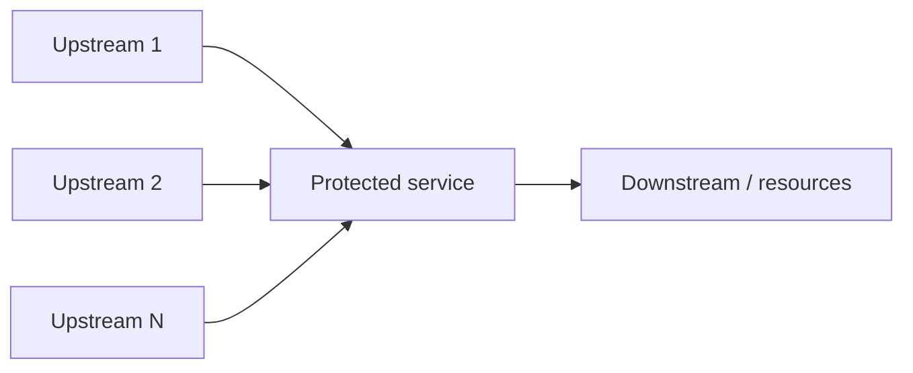
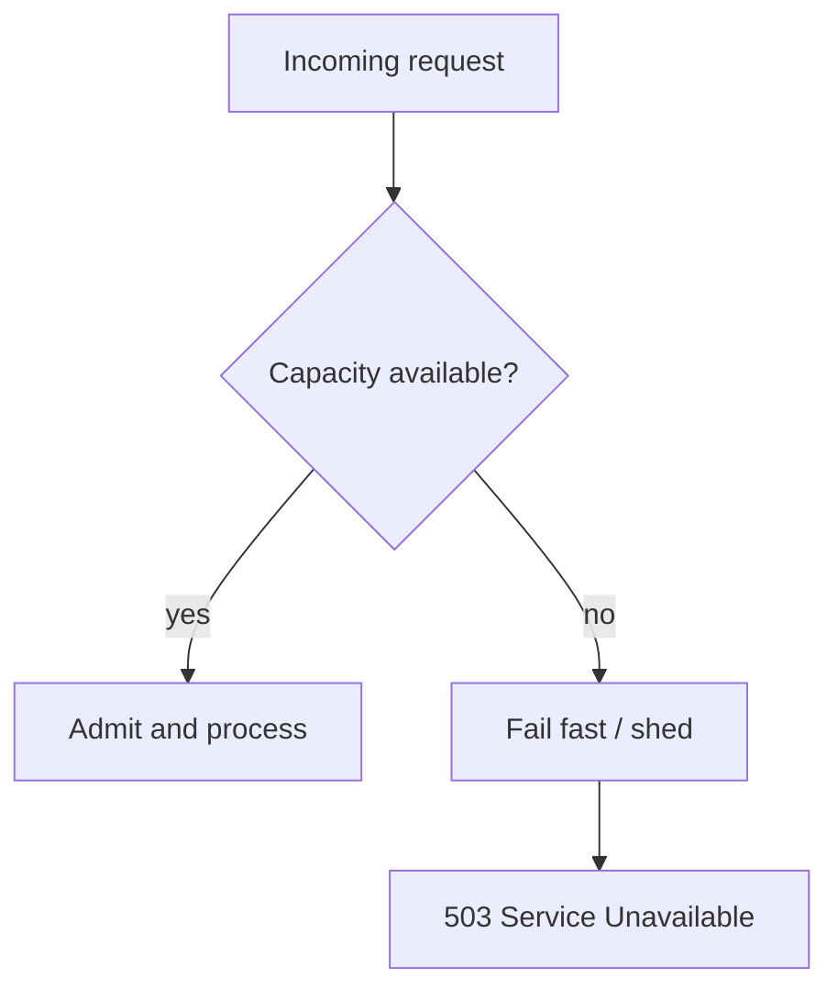
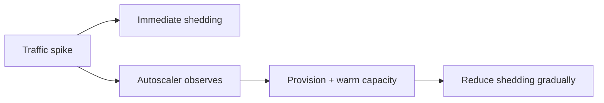
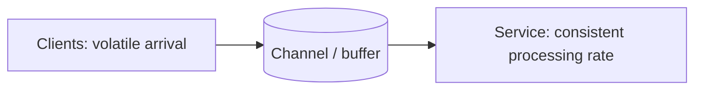
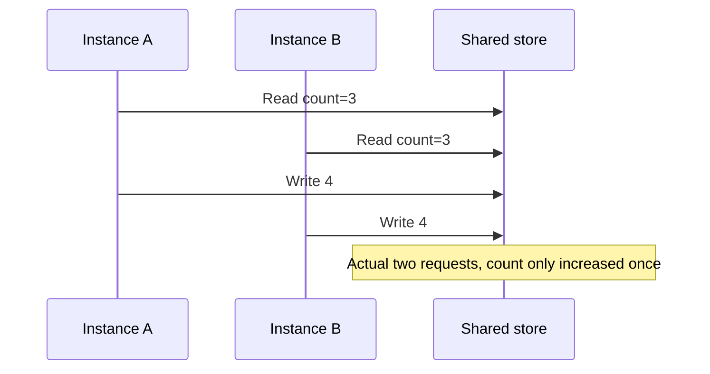
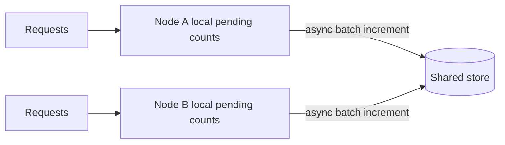
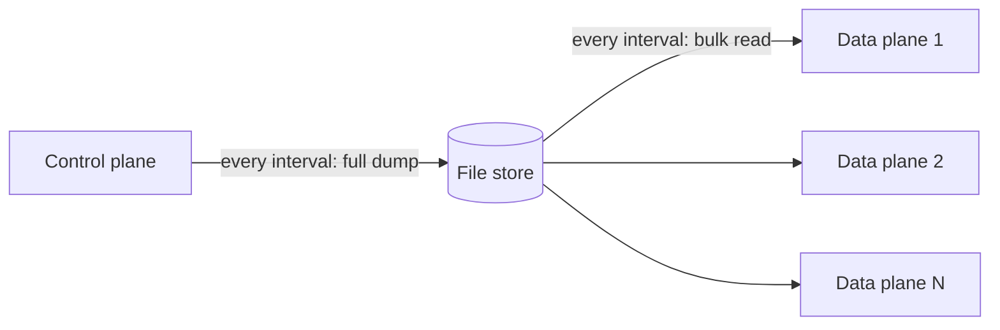
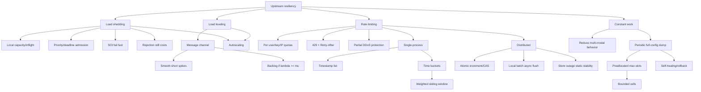

> 对应原文：Understanding Distributed Systems 2nd edition.md
>
> 本文的正文锚点严格沿原章顺序展开，工程补充则就近插入并显式标注：先说明 server 为什么会在 OS connection queue 满前因 memory/thread/socket/file 等资源耗尽而停摆，并讨论按并发阈值、优先级和请求年龄做 load shedding；再用 message channel 解释 load leveling 对短峰值的平滑及 backlog 边界；随后完整推导 rate limiting 的 quota、429/`Retry-After`、DDoS 局限、local/global state 区别、timestamp list、time buckets、weighted sliding window、atomic increment/CAS、batch flush 与 store outage 下的 static stability；最后讨论 multi-modal behavior、constant work、全量配置 dump、预分配最大用户槽位、自愈和 cellular capacity。原章正文约 11 页；文中的排队/容量公式、近似误差、token/leaky bucket 对照、公平性、配额租约、安全失效模式和 C11 模拟用于补足推导与工程边界，不应误认为原书逐字给出的生产限流器或 DDoS 防护方案。

## 0. 本章定位：下游保护解决“我调用谁”，上游保护解决“谁在压我”

### 0.1 从 Chapter 27 转向 Chapter 28

Chapter 27 的视角：当前 service 是 caller，要防 downstream dependency slow/down：

```text
timeout -> bounded wait
retry -> transient recovery
circuit breaker -> stop likely-failing calls
```

Chapter 28 的视角相反：当前 service 是被调用者，要防 upstream traffic 超过 capacity：



即使每个 client 单独行为合理，aggregate load 仍可能压垮 service。

### 0.2 四个模式的职责

| 模式 | 何时使用 | 核心动作 | 不解决什么 |
| --- | --- | --- | --- |
| Load shedding | Service 当前过载 | 快速拒绝部分工作 | 不增加 capacity |
| Load leveling | Client 可异步等待 | Queue 平滑短峰值 | 不解决长期 $\lambda>\mu$ |
| Rate limiting | 主体超过长期 quota | 按 user/key/IP 节流 | 拒绝本身仍有成本 |
| Constant work | 压力使行为模式切换 | 固定单位时间 work | 通常做更多平均工作 |

四者可组合：quota 限制公平份额，local shedding 保护当前实例，queue 吸收允许异步的短峰值，constant-work 路径消除极端 mode。

### 0.3 保护目标

过载时正确目标不是接受最多 requests，而是：

$$
Maximize\ UsefulCompletedWork
$$

subject to：

$$
ResourceUse\le SafeCapacity
$$

并优先满足高价值/临近 SLO 的工作。接受超过可完成量的 request 只会制造 queue、timeout、retry 和 cascade。

---

## 1. 28.1 Load shedding

### 1.1 Server 对 arrival rate 控制很少

Server 无法决定任意时刻收到多少 requests。OS 为每个 port 维护有限 connection queue；队列满后新连接会被立即拒绝。

但原章强调：在 OS 极限前，application 往往先因以下资源耗尽而 crawl to a halt：

- Memory；
- Threads/tasks；
- Sockets/connections；
- File descriptors/files；
- CPU；
- Database pool；
- Queue slots；
- Downstream quota。

### 1.2 为什么“全部接收再慢慢处理”会崩溃

Arrival rate $\lambda$，service rate $\mu$。若 $\lambda>\mu$：

$$
\frac{dQ}{dt}=\lambda-\mu>0
$$

Queue 持续增长。每个 queued request 占 memory/context，并越来越可能在处理前已超 deadline。

利用率接近 1 时，简单 M/M/1 教学模型中的平均 system time：

$$
W=\frac{1}{\mu-\lambda}
$$

当 $\lambda\to\mu$，latency 非线性上升。真实 service 并非 M/M/1，但“满载附近极不稳定”的方向成立。

### 1.3 Load shedding 的定义

当 server 运行到 capacity，拒绝 excess incoming requests，把有限资源留给已经处理的 requests。这叫 load shedding。



拒绝不是失败设计，而是 containment：少量明确快速失败优于所有请求一起超时。

### 1.4 并发计数器

原章给出简单实现：

1. Request 进入，检查/增加 in-flight counter；
2. Response 完成，减少 counter；
3. Counter 与近似 capacity threshold 比较；
4. 达阈值则拒绝。

$$
Admit\iff InFlight<C
$$

检查与增加必须原子，否则并发 requests 都看到剩余 slot，导致 oversubscription。

### 1.5 为什么并发数比 QPS 更接近资源压力

Little's Law：

$$
InFlight\approx Throughput\times Latency
$$

相同 1,000 QPS：

- 50 ms latency -> 约 50 in-flight；
- 5 s latency -> 约 5,000 in-flight。

QPS 未变化，资源压力却增 100 倍。Concurrent requests 能捕捉 slow-down feedback。

### 1.6 Threshold 不应等于理论极限

设 hard resource limit $H$，应使用 safe threshold：

$$
C=\alpha H,\qquad 0<\alpha<1
$$

留给：

- Health/admin requests；
- Cleanup/cancellation；
- GC/runtime；
- Variance/tail；
- Retry/failover；
- Observability。

在 $H$ 才拒绝通常已太晚。

---

## 2. Shedding policy：拒绝谁

### 2.1 `503 Service Unavailable`

过载时 fail fast，HTTP 常返回 503。Response 可含：

- Machine-readable overload reason；
- `Retry-After`（谨慎，避免同步 retry）；
- Request ID；
- Degraded alternatives。

Client 应服从 deadline/backoff/jitter，不立即 hammer。

### 2.2 Priority shedding

原章指出不必 arbitrary reject，可先拒绝 low-priority requests：

```text
critical control/payment > interactive user > batch/report/prefetch
```

Admission 可为不同 class 保留容量：

$$
C=C_{reserved\ high}+C_{shared}
$$

防低价值 traffic 吃光关键路径。

### 2.3 Shed oldest requests

最老 request 最接近 timeout，处理它可能完成后 client 已放弃并 retry。可优先丢 oldest/deadline-expired work：

$$
Useful\iff EstimatedFinishTime<Deadline
$$

这叫 goodput-oriented scheduling。必须传播 deadline，不能只看 arrival timestamp。

### 2.4 Queue discipline

可选：

- FIFO：简单；
- LIFO/CoDel-like：在 overload 下优先新鲜 work；
- Earliest deadline first；
- Priority queue；
- Fair queue per tenant；
- Cost-aware admission。

复杂 policy 自身必须 bounded，否则 overload 时 scheduler 先崩。

### 2.5 Shedding 也有成本

原章提醒，rejected request 并非免费：

- Accept TCP；
- TLS handshake；
- Read enough body/header；
- Parse/API-key/auth；
- Allocate buffers；
- Emit response/log/metric。

若 attack/load 无限增加，rejection work 最终也会压垮 server。

### 2.6 越早拒绝越便宜

Protection layers：

```text
edge/CDN/WAF
-> L4 SYN/connection filters
-> API gateway rate limit
-> service admission
-> per-handler/downstream limits
```

在 identity/priority 可知的最早层拒绝，同时不要把昂贵 auth/parser 提到 attack path。

---

## 3. Load shedding 的反馈与容量（前置工程补充）

> 本节提前讨论 autoscaling 组合与恢复控制；原章在 28.2 Load leveling 之后才正式引出 autoscaling，见本文第 5 节。

### 3.1 Shedding 不增加 capacity

如果 offered load $L$，safe capacity $C$：

$$
Accepted=\min(L,C)
$$

$$
Shed=\max(0,L-C)
$$

要处理更多 useful load，仍需优化或 scale out。

### 3.2 与 autoscaling 组合

Autoscaling：检测 hot，增加 instances；但有 detection/provision/warmup delay。Shedding 在新 capacity 到达前保护现有 service。



### 3.3 恢复时 slow start

Capacity 恢复后立即放全部 queued/retrying traffic，可能再次 overload。应：

- Ramp admission；
- Jitter retries；
- Drain backlog by priority；
- Observe latency/saturation；
- Preserve headroom。

---

## 4. 28.2 Load leveling

### 4.1 适用前提

当 clients 不要求 prompt response，可在 clients 与 service 间放 messaging channel：



Producer 可只等待 channel acceptance；若业务承诺“接收即不会丢”，该 acceptance 还必须是 durable 的。Consumer 按自己 pace 处理。

### 4.2 Figure 28.1

原图左侧 arrival rate 高低波动，channel 后 service processing rate 更平稳。Channel 将时间上的峰值转成 backlog。

### 4.3 短峰值模型

假设初始 queue 为空，且 burst 期间 arrival/service rate 为常数。Burst rate $\lambda_b$、service rate $\mu$、burst duration $T_b$，且 $\lambda_b>\mu$：

$$
Q_{peak}\approx(\lambda_b-\mu)T_b
$$

Burst 后正常 arrival $\lambda_n<\mu$，drain time：

$$
T_{drain}=\frac{Q_{peak}}{\mu-\lambda_n}
$$

例：burst 1,000/s、service 600/s、持续 30 秒：

$$
Q_{peak}=12{,}000
$$

之后 arrival 400/s：

$$
T_{drain}=\frac{12{,}000}{600-400}=60s
$$

### 4.4 Load leveling 只平滑，不创造 throughput

若长期：

$$
E[\lambda]\ge E[\mu]
$$

Backlog 不会消失。Channel 只延迟 overload，并可能耗尽 retention/storage。

### 4.5 Backlog 的业务代价

- Queue wait 增加 end-to-end latency；
- Command 可能过期；
- Retry/poison 占 capacity；
- Storage/cost 增长；
- Deploy/schema compatibility 窗口延长；
- Recovery 需要额外 headroom。

监控 oldest-message age、arrival/deletion rate、partition skew 和 drain ETA，而非只看 queue length。

### 4.6 Load shedding 与 leveling 的选择

| 维度 | Shedding | Leveling |
| --- | --- | --- |
| Client 时效 | 需要立即答复 | 可延迟完成 |
| Excess work | 拒绝 | 缓冲 |
| 成本 | 快速失败 | Broker/retention/backlog |
| 长期超载 | 仍需 scale | 仍需 scale |
| Correctness | Client重试/降级 | At-least-once/idempotency |

可以先 queue，queue 满/age 超限再 shed。

---

## 5. 保护机制与 autoscaling 的关系

原章明确：load shedding 和 load leveling 不直接处理 load increase，只防 overload；处理更多 load 需要 scale out，通常配 autoscaling。

### 5.1 为什么不能只 autoscale

- Provision delay；
- Shared dependency 不可 scale；
- Attack traffic 不值得服务；
- Hot key 无法平均；
- Cost 无上限；
- Scale signal 有延迟；
- New nodes cold。

### 5.2 为什么不能只 shed/queue

- 持续 legitimate growth 永远被拒/积压；
- SLO/业务损失；
- Backlog debt；
- 重试 traffic；
- 用户不公平。

完整 loop：detect sustained load -> scale -> readiness/slow start -> adjust admission -> scale in with hysteresis。

---

## 6. 28.3 Rate-limiting

### 6.1 定义

Rate limiting（throttling）在特定 quota 超过时拒绝 request。

Quota 可针对：

- Requests/time；
- Bytes/time；
- Concurrent requests；
- Cost units；
- Expensive operations；
- Storage/messages。

主体通常是：user、API key、IP address、tenant、service identity。

### 6.2 原章数值例子

每 API key quota 为 10 requests per second，某 key 平均收到 12 requests per second：

$$
RejectedRate=\max(0,12-10)=2/s
$$

前提是 limiter 能准确观察 global rate，且 window 平均足够长。Short burst semantics 取决于算法。

### 6.3 `429 Too Many Requests`

HTTP rate limit 常返回 429，并说明：

- 哪个 quota exhausted；
- 超出多少；
- 何时可重试；
- `Retry-After`。

Example：

```http
HTTP/1.1 429 Too Many Requests
Retry-After: 5
Content-Type: application/json

{"quota":"requests-per-api-key","limit":10,"window":"1s"}
```

Client 应停止 hammer，并用 jitter 防同一时刻恢复。

### 6.4 保护非恶意错误

Rate limiting 可阻止：

- Buggy client loop；
- Accidental monopolization；
- Misconfigured batch；
- One tenant noisy neighbor；
- Scraper overuse。

它是公平性和 blast-radius boundary。

### 6.5 Pricing tiers

Quota 可对应付费 tier：使用更多资源的 users 支付更多。需要可靠 resource attribution、billing/audit，不能只按易伪造 IP。

---

## 7. Rate limiting 与 DDoS

### 7.1 只能部分保护

Throttled malicious clients 可无视 429 继续发送。每个 rejected request 仍可能消耗：

- TLS/connection；
- Header/body download；
- API key extraction；
- Counter lookup/update；
- Response bandwidth。

### 7.2 Economies of scale

原章强调真正 DDoS 防御依赖 economies of scale：多个 services 共享大型 gateway/edge capacity，attack 任一 backend 时，gateway 可 upstream reject，成本在所有 services 间摊销。

这应理解为容量与聚合优势，不是“一个 gateway 永远防得住”。还需 Anycast、CDN/scrubbing、network provider、WAF、SYN protection 和 origin isolation。

### 7.3 Limit lookup 本身可能被攻击

- Random fake API keys 打爆 key store；
- 高基数 IP 制造 state explosion；
- 大 body 才能读 credential；
- Distributed counter hotspot；
- Auth/crypto 先于 limiter。

应早期做 stateless/coarse filters，限制 unknown principals state，并让 lookup bounded/cacheable。

---

## 8. Rate limiting 与 load shedding 的区别

原章给出核心区分：

| 维度 | Load shedding | Rate limiting |
| --- | --- | --- |
| 决策依据 | Process local state | System-wide per-principal usage/quota |
| 例 | 当前 concurrent requests | 某 API key across all instances 的 total requests |
| 目的 | 当前实例不过载 | 公平、配额、pricing、滥用限制 |
| 协调 | 可纯本地 | Global state 通常需 coordination |
| 状态 | Saturation signal | Usage counters/window |

两者可同时拒绝：quota 未超但 instance 已满 -> 503；instance 有余量但 key quota 超 -> 429。

### 8.1 Fail status 的语义

- 429：caller-specific quota，其他 clients 可能健康；
- 503：service 当前 unavailable/overload；
- 两者 retry/backoff 和 SLO 解释不同。

---

## 9. 28.3.1 Single-process naive implementation

### 9.1 原章问题

Quota：每 API key 每分钟 2 requests。Naive method：每 key 一个 doubly-linked list，存最近 $N$ request timestamps：

1. 新 request append timestamp；
2. 定期 purge 超过一分钟 entries；
3. List length 与 quota 比较。

### 9.2 精确 sliding log

在当前时间 $t$，window $W$：

$$
Count(t)=|\{x\mid t-W<x\le t\}|
$$

若 `Count < quota`，allow 并 append。

### 9.3 Memory cost

若 active keys $K$，每 key window 内请求数 $R_k$：

$$
Memory=O\left(\sum_{k=1}^{K}R_k\right)
$$

高 quota/high traffic 时随 requests 增长。每 timestamp 还有 object/node/pointer overhead。

### 9.4 优缺点

优点：精确 sliding window。缺点：memory、purge CPU、lock contention、GC/high cardinality。

原章因此引出固定 time buckets 压缩。

---

## 10. Time buckets：把 request history 压缩成 counters

### 10.1 Figure 28.2

时间切成固定 1-minute buckets：

```text
[12:00,12:01) [12:01,12:02) ...
```

每 bucket 只存 count，不存每个 timestamp。

### 10.2 Figure 28.3

Request at 12:00:18 落入 `12:00` bucket，其 counter +1。

Bucket index：

$$
b(t)=\left\lfloor\frac{t}{B}\right\rfloor
$$

$B$ 是 bucket duration。

### 10.3 Memory

Window $W$ 最多 overlap：

$$
N_b=\left\lceil\frac{W}{B}\right\rceil+1
$$

原例 $W=B=1min$，最多两个 buckets，因此每 API key 只需 two counters（两个 integer counters）。

Memory：

$$
O(KN_b)
$$

不随 request count 增长。

### 10.4 Rotation

时间进入新 bucket：

- Current -> previous；
- 新 current 清零；
- 跳过多个 bucket 时 previous/current 都归零；
- Clock rollback 必须拒绝或使用 monotonic time。

Distributed limiter 用 wall-clock bucket 时还要处理 clock skew。

---

## 11. Weighted sliding-window approximation

### 11.1 Figure 28.4

在原章 $W=B$ 的设置中，current bucket 从开始到当前时刻的 requests 全部位于 window 内，因此完整计数；已经结束的 buckets 才按与 window 的 overlap fraction 近似加权：

$$
\widehat{Count}(t)=
CurrentCount+
\sum_{i\in CompletedBuckets}Count_i\times
\frac{Overlap(Window,Bucket_i)}{BucketLength}
$$

据原图数据进一步计算：previous bucket overlap 60%，previous count=3，current count=1：

$$
\widehat{Count}=3\times0.6+1=2.8
$$

### 11.2 两桶公式

$W=B$，current bucket 已经过比例：

$$
\alpha=\frac{t-currentStart}{B}
$$

Previous bucket overlap 为 $1-\alpha$：

$$
\widehat{Count}=Current+(1-\alpha)Previous
$$

### 11.3 Admission

常见 conservative rule：

$$
Allow\iff\widehat{Count}<Quota
$$

Allow 后 current counter +1。并发 check/increment 必须 atomic。

### 11.4 Approximation error

假设 previous bucket requests 均匀分布，实际可能集中在 overlap 内/外，因此估计可高/低。

减小 bucket $B$ 提高精度，但增加 counters/memory/update overhead。原章以 30-second buckets 比 1-minute 更准为例。

### 11.5 Boundary burst

Fixed window 可在边界前后允许约 $2Q$ burst；weighted sliding approximation 缓解但不完全等同精确 sliding log。

如果 strict billing/security quota，需明确 approximation tolerance。

---

## 12. 其他常见限流算法（背景补充）

### 12.1 Fixed window counter

每固定窗口计数，简单 $O(1)$，边界 burst 明显。

### 12.2 Sliding log

精确，memory 随 requests。

### 12.3 Sliding-window counters

原章方案，固定 memory，近似。

### 12.4 Token bucket

Tokens 以 rate $r$ 补充，容量 $B$：

$$
Tokens(t)=\min(B,Tokens(t_0)+r(t-t_0))
$$

Request 消耗 token。允许 bounded burst $B$，长期 rate $r$。

### 12.5 Leaky bucket

以固定 rate drain，平滑 output；queue 满则 reject。接近 load leveling/admission。

选择取决于 burst semantics、精确性、distributed coordination 和成本。原章重点是 sliding bucket，不指定其他算法。

---

## 13. 28.3.2 Distributed implementation

### 13.1 Local state 不够

多个 service instances 各自允许 2/min，会使 global quota 变：

$$
EffectiveQuota\le N\times2/min
$$

若目标是 API key 全 fleet 2/min，需要 shared global state。

### 13.2 Lost update

朴素 read-modify-write：



Fetch/update/write 必须 transaction/atomic，防 race。

### 13.3 Transaction-per-request 的成本

虽然 functionally correct：

- Transaction latency；
- Lock/contention；
- Store QPS 随 request rate 线性；
- Hot API key；
- Store hard dependency；
- Cost。

Rate limiter 可能比被保护 service 先成为瓶颈。

### 13.4 Atomic get-and-increment / CAS

原章建议单个 atomic increment，或 compare-and-swap。它减少 round trips/transaction overhead，但仍需：

- Bucket key/TTL；
- Atomic check+increment vs increment-then-reject semantics；
- Counter overflow；
- Hot-key sharding；
- Store availability。

如果先 increment 后发现超 quota，被拒 request 是否计入 usage，要明确定义。

---

## 14. Batch local updates + asynchronous flush

### 14.1 Figure 28.5

每个 server 在 memory 累积 bucket increments，周期异步 flush 到 shared store：



### 14.2 Load reduction

每 node request rate $\lambda$，flush interval $F$。Per-request update rate $\lambda$；batch 后理想 store operations：

$$
Ops_{store}\approx\frac{1}{F}
$$

per active key/node（实现可聚合多 keys）。用 accuracy 换 store load。

### 14.3 Overshoot bound

$N$ nodes，每 node 所有尚未成功提交的 increments（包括 pending、in-flight 与 retrying batches）最多为 $b$，global view 最坏低估：

$$
UnderCount\le Nb
$$

只有当每次 flush 都能在一个 interval $F$ 内成功提交、失败不会跨周期累积时，按 per-node key rate 上界 $r_i$ 可近似为：

$$
UnderCount\lesssim F\sum_i r_i
$$

一般情形应把 $F$ 替换为“距最后一次成功提交的最大时间”。因此 strict quota 不适合大 batch；可分配 local token leases，给每 node 有界预算。

### 14.4 Crash before flush

Pending count 会丢，造成 undercount/多允许 requests。是否可接受取决于 quota：

- Soft fairness/pricing preview：可能接受；
- Hard financial/security limit：不可接受，需要 durable/local lease。

### 14.5 Idempotent flush

Async flush timeout 后 retry，atomic increment 可能重复。可用：

- Unique batch ID + dedup；
- Monotonic per-node sequence；
- Lease allocation rather than delta push；
- Transactional outbox。

原章只说明异步 batch tradeoff，不展开 duplicate protocol。

---

## 15. Shared store unavailable：CAP 与 static stability

### 15.1 两种选择

Network fault 下：

- 保持 strict global quota -> 无 store 则 reject/stop（consistency）；
- Keep service up -> 用 last state/local estimate，允许短期 overshoot（availability）。

### 15.2 原章的业务判断

如果仅因 rate-limit store unreachable 就暂时拒绝所有业务，会伤害 business。作者认为更安全的是继续按 last state serving。

这是 Chapter 22 static stability：control/shared state down，data plane 使用 last-known-good/近似状态继续。

### 15.3 Fail-open 不是总正确

Quota 类型决定：

- Soft pricing/fairness：可 fail open with local cap；
- Abuse protection：可 conservative local cap；
- Financial spend/safety/legal hard limit：可能必须 fail closed；
- Unknown unauthenticated traffic：应更严格。

应按 quota class 明确，不把全局 store down 统一解释为无限放行。

### 15.4 Bounded fail-open

更安全模式：shared store 为每 node 分配 token lease：

```text
global quota -> bounded local token grants
```

Store down 时 node 最多消费已获 tokens，overshoot/风险有上界。Lease 过期后按 policy fail closed/open。

### 15.5 Recovery

Store 恢复后：

- Gradual flush；
- Deduplicate batches；
- Reconcile local/global；
- 避免所有 nodes 同时 reconnect；
- Jitter；
- Monitor overshoot；
- 不突然惩罚所有后续用户请求来偿还历史误差。

---

## 16. 28.4 Constant work

### 16.1 Multi-modal behavior

Overload、configuration change、fault 迫使 application 行为与平时不同，称 multi-modal behavior。

Rare modes 风险：

- 未充分测试；
- 与只假设 happy path 的机制冲突；
- Operator mental model 失效；
- Performance突然非线性；
- Recovery path又是另一 mode。

目标是尽量减少 modes。

### 16.2 Key-value vs relational 的例子

原章说 data plane 常偏简单 key-value store，因为给定 query performance 更 predictable。Relational optimizer/隐藏优化可能选择不同 plan，产生多种 operational modes。

这是作者的 reliability 取舍，不是“关系数据库一定不可靠”。合适 index、plan management、capacity test 可控制；具体 store 仍按需求选择。

### 16.3 Constant work 定义

保持 per unit time work 恒定：

$$
W(t)\approx C
$$

无论 average load 还是 stress，都做相同 amount work；若 stress 下变化，应是表现更好而非更差。

### 16.4 Resilient 与 antifragile

原章区分：

- Resilient：extreme load 下继续运行；
- Antifragile：stress 下表现更好。

“Antifragile”在此是作者的行为描述，不表示所有 constant-work 系统会从压力中永久进化。

---

## 17. 配置传播的 variable-work 问题

### 17.1 Per-change message

Control plane 保存每 user settings（例如 gateway quota）。每个 setting change 独立 broadcast 给所有 data-plane instances。

若 changed users 数为 $K$、data-plane instances $N$：

$$
Work_{delta}\propto K\times N
$$

平时 $K$ 小；business decision 同时改大多数 users，$K$ 突增，data plane 在最坏时承担罕见巨峰。

### 17.2 隐藏 mode

```text
normal: a few deltas -> cheap
mass change: millions of deltas -> queues/retries/reordering
corruption: repair each delta -> complex
```

Operator 平时观察不到 extreme path，直到 catastrophe。

---

## 18. Full configuration dump：constant-work 解法

### 18.1 原章方案

Control plane 周期把所有 users settings（包括没变化的）dump 到 Azure Storage 或 AWS S3；data plane 周期 bulk read 并 refresh local view：



不论 changes 数 $K$：

$$
WorkPerCycle\approx FixedFullSnapshotWork
$$

### 18.2 为什么更可靠

- Same path every cycle；
- Extreme change 不改变 work；
- Immutable/full state 易验证；
- Missing previous delta 不影响；
- Corrupt dump 下一周期自愈；
- Rollback 是生成新 dump并等待传播；
- Bulk I/O simpler than complex incremental healing。

### 18.3 为什么更昂贵

无 change 也写/read full state：

$$
BytesPerTime=\frac{SnapshotSize\times(1+Readers)}{Interval}
$$

用平均成本和 bounded maximum换 predictability/简单性。

### 18.4 原子发布

```text
write immutable snapshot version v
-> checksum/schema validate
-> atomically update manifest/latest
-> data plane download + validate
-> atomic local swap
-> retain previous LKG
```

避免 half-written config。这里的 checksum/schema validation、immutable version、atomic manifest publish 和 LKG retention 是本文补充的可靠发布前提；原章给出的核心机制是周期 full dump 与 bulk refresh。

---

## 19. 预分配最大用户 slots

### 19.1 极致 constant work

预分配 maximum supported users 的 empty config slots。即使当前 users 少，dump size/work 按 max 固定。

设 cell 最大 user 数 $U_{max}$、每 slot fixed size $s$：

$$
SnapshotSize=U_{max}s
$$

与 active users/changed users 无关。

### 19.2 可测试 envelope

可用最大 dump stress-test：

- Serialize/write/read；
- Network；
- Parse/validation；
- Atomic swap；
- Memory；
- Recovery time。

Production 不超过 tested maximum，因此避免 growth 触发新 mode/brick wall。

### 19.3 用户上限并非新缺点

作者指出无论是否 constant work，系统总有 limit。显式上限比未知 collapse point 更可管理。

### 19.4 Cellular architecture

原章把这种方法用于 cellular architectures：一个 cell 有 well-defined max size；需要 scale 时新增 cell，而非无限扩大旧 cell。Constant work 在 bounded cell 内可行：

$$
GlobalCapacity=Cells\times TestedCellCapacity
$$

### 19.5 成本

- Empty slot overhead；
- Fixed large I/O；
- Stranded capacity；
- More cells/control metadata；
- Migration；
- Max 必须重新 benchmark when schema grows。

---

## 20. Self-healing 与 rollback

### 20.1 Corrupt dump

当前周期 dump corrupt：data plane validation 失败，保留 LKG；下个周期 full dump 覆盖/修复，无需重建 missing delta chain。

### 20.2 Faulty update to all users

生成内容恢复正确的新 higher-version dump，等待 propagation。Version 仍单调，不让 old message 覆盖。

### 20.3 与 incremental 的对比

Incremental system 要处理：

- Missing/out-of-order/duplicate deltas；
- Compaction；
- Per-user repair；
- Replay；
- Version graph；
- Poison updates。

Full snapshot 每周期声明完整 truth，天然 reconciliation。

### 20.4 Constant work 的总结权衡

$$
AverageEfficiency\downarrow
\quad\text{but}\quad
Predictability+Reliability+Simplicity\uparrow
$$

不是所有 workload 都值得；当 rare worst-case 会 catastrophic 且 bounded full work 可承受时尤其有价值。

---

## 21. 可运行 C11 示例：Shedding、滑动窗口与 Constant Work

### 21.1 模拟目标

程序实现三个原章核心机制：

1. Local admission：capacity=2 时 high/low 请求均在有 slot 时进入，满载后 low request 被 503-style shed；
2. 两个 60-second buckets、quota=2/min 的 weighted sliding-window limiter，验证 $t=0,10$ allow，$t=20,60$ reject，$t=90$ allow；
3. 固定 4-user slots 的 full dump，每 cycle 总处理 4 slots，无论 changed users 是 1 还是 4；corrupt active candidate 不发布，下一 full cycle 修复。

还验证 clock rollback、quota=0、空 output 和 fixed-slot capacity error；算术路径在乘加前做 overflow guard，long-term time wraparound 则未建模。所有检查均不依赖 `assert`。

### 21.2 完整代码

```c
#include <stdbool.h>
#include <limits.h>
#include <stddef.h>
#include <stdint.h>
#include <stdio.h>

enum {
    LOCAL_CAPACITY = 2,
    WINDOW_SECONDS = 60,
    USER_SLOTS = 4
};

typedef enum {
    PRIORITY_LOW,
    PRIORITY_HIGH
} Priority;

typedef struct {
    unsigned int in_flight;
    unsigned int capacity;
} Admission;

typedef struct {
    bool initialized;
    unsigned long current_start;
    unsigned long last_now;
    unsigned int previous_count;
    unsigned int current_count;
    unsigned int quota;
} SlidingLimiter;

typedef struct {
    unsigned int quotas[USER_SLOTS];
    unsigned long version;
    uint32_t checksum;
} ConfigDump;

static bool admit(Admission *admission, Priority priority) {
    if (admission == NULL || admission->capacity == 0 ||
        (priority != PRIORITY_LOW && priority != PRIORITY_HIGH) ||
        admission->in_flight >= admission->capacity ||
        admission->in_flight == UINT_MAX) {
        return false;
    }
    admission->in_flight++;
    return true;
}

static bool complete(Admission *admission) {
    if (admission == NULL || admission->in_flight == 0) {
        return false;
    }
    admission->in_flight--;
    return true;
}

static bool rotate(SlidingLimiter *limiter, unsigned long now) {
    unsigned long bucket_start;
    unsigned long elapsed_buckets;

    if (limiter == NULL || limiter->quota == 0 ||
        (limiter->initialized && now < limiter->last_now)) {
        return false;
    }
    bucket_start = now - (now % WINDOW_SECONDS);
    if (!limiter->initialized) {
        limiter->initialized = true;
        limiter->current_start = bucket_start;
        limiter->last_now = now;
        return true;
    }
    elapsed_buckets =
        (bucket_start - limiter->current_start) / WINDOW_SECONDS;
    if (elapsed_buckets == 1) {
        limiter->previous_count = limiter->current_count;
        limiter->current_count = 0;
        limiter->current_start = bucket_start;
    } else if (elapsed_buckets > 1) {
        limiter->previous_count = 0;
        limiter->current_count = 0;
        limiter->current_start = bucket_start;
    }
    limiter->last_now = now;
    return true;
}

static bool allow_request(SlidingLimiter *limiter,
                          unsigned long now,
                          bool *allowed,
                          unsigned long *estimated_milli) {
    unsigned long elapsed;
    unsigned long remaining;
    unsigned long previous_weighted;
    unsigned long current_milli;
    unsigned long estimate;

    if (allowed == NULL || estimated_milli == NULL ||
        !rotate(limiter, now)) {
        return false;
    }
    elapsed = now - limiter->current_start;
    if (elapsed >= WINDOW_SECONDS) {
        return false;
    }
    remaining = WINDOW_SECONDS - elapsed;
    if (limiter->previous_count >
            ULONG_MAX / (remaining * 1000UL) ||
        limiter->current_count > ULONG_MAX / 1000UL) {
        return false;
    }
    previous_weighted =
        (unsigned long)limiter->previous_count * remaining *
        1000UL / WINDOW_SECONDS;
    current_milli = (unsigned long)limiter->current_count * 1000UL;
    if (previous_weighted > ULONG_MAX - current_milli ||
        limiter->quota > ULONG_MAX / 1000UL) {
        return false;
    }
    estimate = previous_weighted + current_milli;
    *estimated_milli = estimate;
    *allowed = estimate < (unsigned long)limiter->quota * 1000UL;
    if (*allowed) {
        if (limiter->current_count == UINT_MAX) {
            return false;
        }
        limiter->current_count++;
    }
    return true;
}

static uint32_t hash_unsigned_long(uint32_t hash, unsigned long value) {
    size_t bit_index;
    for (bit_index = 0;
         bit_index < sizeof(value) * CHAR_BIT;
         bit_index++) {
        hash ^= (uint32_t)(value & 1UL);
        hash *= UINT32_C(16777619);
        value >>= 1;
    }
    return hash;
}

static uint32_t checksum_dump(const ConfigDump *dump) {
    uint32_t hash = hash_unsigned_long(UINT32_C(2166136261),
                                      dump->version);
    size_t index;
    for (index = 0; index < USER_SLOTS; index++) {
        hash = hash_unsigned_long(hash, dump->quotas[index]);
    }
    return hash;
}

static bool build_dump(ConfigDump *candidate,
                       const unsigned int *quotas,
                       size_t quota_count,
                       unsigned long version,
                       unsigned int *work) {
    ConfigDump built = {0};
    size_t index;

    if (candidate == NULL || quotas == NULL || work == NULL ||
        quota_count > USER_SLOTS || version == 0) {
        return false;
    }
    for (index = 0; index < USER_SLOTS; index++) {
        built.quotas[index] = index < quota_count ? quotas[index] : 0;
    }
    built.version = version;
    built.checksum = checksum_dump(&built);
    *candidate = built;
    *work = USER_SLOTS;
    return true;
}

static bool publish_dump(ConfigDump *active,
                         const ConfigDump *candidate) {
    if (active == NULL || candidate == NULL ||
        candidate->version <= active->version ||
        candidate->checksum != checksum_dump(candidate)) {
        return false;
    }
    *active = *candidate;
    return true;
}

int main(void) {
    Admission admission = {0, LOCAL_CAPACITY};
    SlidingLimiter limiter = {false, 0, 0, 0, 0, 2};
    SlidingLimiter zero_quota = {false, 0, 0, 0, 0, 0};
    ConfigDump active = {0};
    ConfigDump one_change;
    ConfigDump all_changes;
    const unsigned int quotas_one[] = {10};
    const unsigned int quotas_all[] = {20, 30, 40, 50};
    bool allowed;
    unsigned long estimate;
    unsigned int work_one;
    unsigned int work_all;

    if (!admit(&admission, PRIORITY_HIGH) ||
        !admit(&admission, PRIORITY_LOW) ||
        admit(&admission, PRIORITY_LOW) || admission.in_flight != 2 ||
        !complete(&admission) || admission.in_flight != 1) {
        return 1;
    }
    printf("shedding accepted=2 rejected=1 in_flight=%u capacity=%u\n",
           admission.in_flight, admission.capacity);

    if (!allow_request(&limiter, 0, &allowed, &estimate) || !allowed ||
        !allow_request(&limiter, 10, &allowed, &estimate) || !allowed ||
        !allow_request(&limiter, 20, &allowed, &estimate) || allowed ||
        estimate != 2000 ||
        !allow_request(&limiter, 60, &allowed, &estimate) || allowed ||
        estimate != 2000 ||
        !allow_request(&limiter, 90, &allowed, &estimate) || !allowed ||
        estimate != 1000 ||
        allow_request(&limiter, 89, &allowed, &estimate) ||
        allow_request(&zero_quota, 0, &allowed, &estimate) ||
        allow_request(&limiter, 91, NULL, &estimate) ||
        allow_request(&limiter, 91, &allowed, NULL)) {
        return 1;
    }
    printf("limiter allow=1,1,0,0,1 estimates=2000,2000,1000\n");

    if (!build_dump(&one_change, quotas_one, 1, 1, &work_one) ||
        !publish_dump(&active, &one_change) ||
        !build_dump(&all_changes, quotas_all, USER_SLOTS, 2,
                    &work_all) ||
        work_one != USER_SLOTS || work_all != USER_SLOTS) {
        return 1;
    }
    all_changes.checksum ^= UINT32_C(1);
    if (publish_dump(&active, &all_changes) || active.version != 1 ||
        !build_dump(&all_changes, quotas_all, USER_SLOTS, 2,
                    &work_all) ||
        !publish_dump(&active, &all_changes) || active.version != 2 ||
        build_dump(&all_changes, quotas_all, USER_SLOTS + 1,
                   3, &work_all)) {
        return 1;
    }
    printf("constant_work cycles=3 slots_each=%u repaired=1 version=%lu\n",
           work_all, active.version);
    return 0;
}
```

### 21.3 编译运行

```bash
gcc -std=c11 -Wall -Wextra -Werror -pedantic upstream.c -o upstream
./upstream
```

关键输出：

```text
shedding accepted=2 rejected=1 in_flight=1 capacity=2
limiter allow=1,1,0,0,1 estimates=2000,2000,1000
constant_work cycles=3 slots_each=4 repaired=1 version=2
```

### 21.4 代码与原理对应

| 代码 | 本章概念 |
| --- | --- |
| `Admission` | Local concurrent load shedding |
| Third `admit` rejected | 满载快速拒绝 |
| `previous_count/current_count` | Figure 28.2–28.4 两桶近似 |
| `estimate < quota` | Sliding-window admission |
| Clock rollback rejection | 时间窗口不倒退 |
| `USER_SLOTS` full loop | Pre-allocated constant work |
| Same `work=4` | 1 change 与 4 changes work 相同 |
| Corrupt candidate rejected | LKG/下一 dump 自愈 |

### 21.5 示例局限

- 单线程；真实 check+increment 要 atomic/lock；
- Shedding 未实现 priority reservation，只验证满载 admission；
- Limiter 固定 one key、60 秒/两 buckets；
- Integer milli-units 仅为 deterministic approximation；
- 无 distributed shared store/batch flush；
- 无 token lease、429/503 HTTP；
- Constant dump 在内存模拟 file store；
- Checksum 非 cryptographic；
- 无 concurrent readers/atomic pointer swap；
- 时间使用 `unsigned long`，长期 wraparound 未建模。

因此程序验证三个机制的核心状态，不是 production gateway。

---

## 22. 容易混淆的概念

### 22.1 Load shedding 与 rate limiting

Shedding 看本地 saturation；rate limiting 看主体 global quota。一个返回 503，一个常返回 429。

### 22.2 Load shedding 与 circuit breaker

Shedding 保护自己免受 upstream load；breaker 保护自己免受 downstream failure。

### 22.3 Load leveling 与 autoscaling

Queue 平滑时间，autoscaling 增 capacity。长期 rate 超 capacity 必须扩容或拒绝。

### 22.4 Rate limiting 与 authentication

AuthN 确定 principal；limiter 计量其 usage。错误/可伪造 identity 会绕过或攻击 quota state。

### 22.5 429 与 503

429 是 caller quota；503 是 service overall unavailable/overload。Client恢复策略不同。

### 22.6 Sliding window 与 fixed window

Fixed 边界 burst；weighted sliding 用邻桶 overlap 近似最近 $W$ 时间。

### 22.7 Atomic increment 与 transaction

Atomic increment 可避免 lost update，但不自动实现复杂多 quota、check-and-reserve 或跨 key invariant。

### 22.8 Local batching 与准确 global quota

Batch async flush 必然暂时 undercount。它是 consistency/performance tradeoff，不是严格限额。

### 22.9 Fail-open 与无限允许

Static stability 可使用 LKG/local lease；不应自动无限放行，尤其 safety/billing/security quota。

### 22.10 Constant work 与 O(1)

Constant work 指相对 workload/change 数固定，不一定算法意义 O(1)；全量 dump 对固定 cell 上限是固定大 work。

### 22.11 Constant work 与缓存

全量 snapshot 是 read model/state propagation，不是仅为性能的 cache；它提供 reconciliation/self-heal。

### 22.12 Resilient 与 antifragile

Resilient 在压力下继续；原章称 stress 下表现更好的系统 antifragile。两者不是同义词。

---

## 23. 常见误区与失败模式

### 23.1 “等 OS queue 满再拒绝”

Application 常先 resource collapse。按 safe concurrency/saturation 早期 admission。

### 23.2 “接受后排队不会丢”

Deadline 到期后 work 无价值，queue 占 memory并触发 retry。Bound queue。

### 23.3 “随机 shed 最公平”

可能丢关键请求。按 priority/deadline/tenant公平，防 starvation。

### 23.4 “503 是失败，处理完所有请求才可靠”

过载下 fail fast保护 goodput；全超时更差。

### 23.5 “拒绝成本可忽略”

TLS/auth/body/counter 都有成本。攻击要尽量 upstream filter。

### 23.6 “Queue 能吸收任何 spike”

只要最终 $\mu>\lambda$ 才 drain；否则 backlog 无限增长。

### 23.7 “Rate limit 可以完全防 DDoS”

恶意 client 无视 429，rejection/identity lookup仍耗资源。需要规模化 edge/network defense。

### 23.8 “每实例 quota=10，全局就是10”

$N$ instances 可能允许 $10N$，除非共享 state/leases。

### 23.9 “Timestamp list 最精确所以最好”

高 quota/high cardinality memory/GC昂贵。精度要与成本权衡。

### 23.10 “Bucket 越粗越省且无影响”

Approximation error和boundary behavior增大。按 tolerance选择 granularity。

### 23.11 “Read-modify-write counter 足够”

并发 lost update。用 atomic increment/CAS/transaction。

### 23.12 “Atomic increment 就能严格 check quota”

Increment与decision语义、overshoot、rollback仍需定义；多个 quota可能需更强原子性。

### 23.13 “Batch flush 只提高性能”

Crash/lag导致 undercount；retry可能 double-count。需稳定 batch ID/lease/reconcile。

### 23.14 “Limiter store down 必须全部 fail-open”

按 quota类型；可 bounded local lease、conservative fallback或 fail-closed。

### 23.15 “只做必要 work 一定更高效可靠”

Variable work 在 mass change时产生罕见极端 mode。Constant work虽平均贵但更可测。

### 23.16 “预分配 empty slots 是浪费”

它用固定成本换 tested upper bound；是否值得取决于 reliability要求和 cell size。

### 23.17 “Corrupt full dump 会全站坏”

Data plane 应先验证、保留 LKG；下一周期 full snapshot自愈。

---

## 24. 如何设计 upstream resilience

### 第一步：定义 safe capacity

按 request mix 测 QPS、concurrency、CPU、memory、threads、sockets、DB pools、p99；选择留 headroom 的 admission threshold。

### 第二步：定义 priority 和 deadline

标记 critical/optional/batch，传播 deadline；过载时先 shed 低价值和已无完成可能的 work。

### 第三步：让 rejection 便宜

在 edge/gateway/L4尽早过滤；限制 body/header/unknown-key state；503/429明确、client jitter。

### 第四步：判断是否可 load-level

长任务/异步可 queue；定义 durable acceptance、idempotency、retention、oldest-age SLO、max backlog和DLQ。

### 第五步：与 autoscaling 配合

Shedding立即保护，autoscale增加capacity，new node slow start；hysteresis防振荡。

### 第六步：定义 quota维度

Requests、bytes、cost、concurrency；per user/API key/IP/tenant；pricing与abuse分开。

### 第七步：选 limiter算法

Fixed/sliding log/sliding counter/token bucket/leaky bucket，明确burst、精度、memory和distributed cost。

### 第八步：原子更新或有界 lease

Atomic increment/CAS；高规模用 local token grants/batch，量化最大 overshoot和crash loss。

### 第九步：定义 store-outage policy

Quota class决定 fail-open/closed；LKG、local cap、lease expiry、recovery reconciliation。

### 第十步：识别 multi-modal worst case

Mass config change、fleet restart、quota reset、attack、store outage。比较 average/worst work。

### 第十一步：评估 constant work

若 full bounded work 可承受且 variable extreme危险，使用 fixed snapshot/cell slots；版本/checksum/atomic publish/LKG。

### 第十二步：可观测性

监控 accepted/shed by reason/priority、inflight/queue、429/503、quota usage/overshoot、limiter-store lag/error、backlog age、autoscale、dump cycle/work/checksum/version。

### 第十三步：故障演练

Burst、expensive request、DDoS-like invalid keys、queue saturation、counter race/store down、batch crash/retry、corrupt dump、mass settings change、cell max capacity。

---

## 25. 作者如何形成解决思路

### 25.1 从 server 无法控制 arrival 开始

不是等 OS connection limit，而是观察 application resource 先耗尽；因此 capacity 时主动 reject。

### 25.2 将拒绝从随机升级为价值选择

Low priority/old requests 先 shed，目标是保留可完成且有价值的 work。

### 25.3 承认拒绝也有成本

TLS/read request cost限制 shedding，推动 protection向 upstream/规模化 gateway移动。

### 25.4 对可延迟任务改用时间缓冲

Message channel把 volatile arrival变 consistent processing；但 backlog揭示它只解决短 spike。

### 25.5 保护不等于扩容

Shedding/leveling都不增加capacity，需与autoscaling组合。

### 25.6 从公平quota引出 global coordination

Rate limit按API key全fleetusage，不同于local saturation；global state带来distributed store和CAP问题。

### 25.7 从精确timestamp退到bucket近似

List精确但memory随requests；bucket将history压成固定counters，weighted overlap恢复近似 sliding window。

### 25.8 从transaction-per-request逐步放松

Atomic increment替代transaction，local batch降低store load，再用last state在store failure时保持availability；每步牺牲一些精度。

### 25.9 从保护模式提升到行为可预测性

Multi-modal worst path难测试；constant work主动做固定全量工作，避免mass change产生新mode。

### 25.10 用cell上限把无限增长变成可测单元

预分配maximum slots，极限stress-test；达到上限新增cell。以平均效率换可靠性和简单自愈。

---

## 26. 知识结构



---

## 27. 核心结论

1. **Server 常在 OS connection queue 满前先耗尽 memory/thread/socket/file 等资源并停摆。**
2. **Load shedding 在 safe capacity 达到时快速拒绝 excess work，把资源留给已接收请求。**
3. **Concurrent in-flight 比 QPS 更能反映 slow-call 资源压力；threshold 应低于 hard limit。**
4. **Shedding 可按 priority 或 deadline/age，优先保留高价值且能及时完成的工作。**
5. **HTTP overload 常返回 503；拒绝仍需 TLS/read/auth 等成本，不能无限防护。**
6. **Load leveling 用 channel 把 volatile arrival 平滑为 consumer pace，只适合可异步等待的工作。**
7. **短 burst backlog 为 $(\lambda_b-\mu)T_b$；长期 $\lambda\ge\mu$ 时 queue 无法自愈。**
8. **Shedding/leveling只保护，不增加capacity，通常与autoscaling组合。**
9. **Rate limiting按user/API key/IP等主体quota拒绝，HTTP常返回429和`Retry-After`。**
10. **10 req/s quota遇12 req/s平均拒2 req/s；实际burst语义取决于算法。**
11. **Rate limiting只能部分缓解DDoS，因为throttled requests和identity lookup也有成本；规模化edge/gateway才有更强承载。**
12. **Shedding基于process local saturation；rate limiting基于global per-principalusage，后者需coordination。**
13. **Timestamp sliding log精确但memory随requests；time buckets把history压成固定counters。**
14. **Window与bucket都1分钟时最多存两个counters；weighted overlap提供合理近似。**
15. **Previous/current两桶估计为 $Current+(1-\alpha)Previous$；更细bucket提高精度但增加状态。**
16. **Distributed read-modify-write会lost update；应使用transaction、atomic increment或CAS。**
17. **Per-request global update昂贵且形成hard dependency；local batch async flush用精度换scale。**
18. **Limiter store down时可按last state保持static stability，但fail-open/closed必须按quota风险分类。**
19. **Multi-modal behavior使rare path难测试；constant work让average/worst work更一致。**
20. **Full configuration dump无论changes多少都做相同bulk work，比复杂delta healing更predictable。**
21. **预分配最大user slots显式固定work/capacity envelope，并通过新增bounded cells扩展。**
22. **Constant work平均更昂贵，但可换取predictability、self-healing和实现简单性。**

---

## 28. 一般化的解决问题方法

### 28.1 先保护 goodput，不追求接受量

识别safe capacity，在queue/latency cliff前拒绝；完成高价值work比接受后超时更重要。

### 28.2 把保护放在最早且知道身份/成本的层

Edge过滤粗恶意流量，gateway按keyquota，service按local saturation，handler按downstream pool。

### 28.3 根据时效选择拒绝还是缓冲

Interactive超量shed；asynchronous短峰值level；所有buffer都有retention/backlog上限。

### 28.4 将capacity protection与capacity growth分开

Shedding/queue立即contain，autoscaling/optimization长期增加capacity。

### 28.5 将公平性状态与本地健康状态分开

Global quota回答“该主体应不应再用”；local admission回答“本实例现在能不能做”。

### 28.6 用近似换有界状态时量化误差

Bucket、batch、lease都牺牲精度；明确boundary burst、max overshoot和crash undercount。

### 28.7 为shared limiter设计failure mode

它不能成为全业务SPOF。按quota class选择LKG/local lease/fail-closed，并演练恢复reconcile。

### 28.8 寻找压力下的mode switch

Mass update、full queue、store outage时是否执行陌生昂贵路径？优先消除而非只优化happy path。

### 28.9 当bounded full work可承受时考虑constant work

定期做同一全量工作、checksum/version/atomic publish，换取reconciliation和可测worst case。

### 28.10 用cells承载显式最大值

Benchmark固定cell envelope，到上限增加cell；将未知全局极限转成重复已知单元。

最终方法可压缩为：

```text
measure safe capacity and reject before the resource cliff
-> prioritize useful work by tenant, cost, and deadline
-> buffer only work whose completion may be delayed
-> combine immediate protection with autoscaling
-> enforce global quotas separately from local saturation
-> compress sliding history into bounded buckets with known error
-> use atomic counters or bounded local leases across instances
-> define fail-open/closed behavior for limiter-store outages
-> identify rare variable-work modes under stress
-> replace dangerous variability with tested constant work and bounded cells
```
