> 对应原文：Understanding Distributed Systems 2nd edition.md
>
> 本文沿原章顺序展开：先解释测试的长期价值与能力边界，再按 **scope** 区分 unit、integration、end-to-end tests；随后按 **size** 区分 small、intermediate、large tests，并比较 fake、stub、mock 与 contract test；接着用普通 API 和 GDPR 数据删除两个案例说明测试选择必须由风险驱动；最后进入 formal verification，介绍 specification、state、behavior、safety、liveness、TLA+ 与 model checking，并完整复盘从 X 向 Y 迁移时 dual write 的崩溃与并发乱序反例。概率公式、风险模型、测试矩阵和 Python 状态空间搜索器是本文为解释原理所作的工程补充，不应误认为原书给出的数学测试覆盖保证或 TLA+ 替代品。

---

## 0. 本章定位：可维护性从“敢于改变”开始

### 0.1 Part V Maintainability 的开篇

软件的大部分成本发生在首次开发之后：

- 修复缺陷；
- 添加功能；
- 重构；
- 发布；
- 运行与排障；
- 调整配置和容量。

系统若每次改动都可能悄悄破坏旧行为，团队最终会害怕修改它。测试的核心价值不是证明今天写的代码“看起来正确”，而是给未来的改变建立快速反馈。

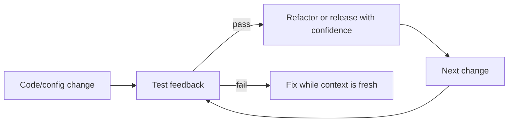

### 0.2 为什么越晚发现 bug 越贵

缺陷越晚被发现，定位需要恢复的上下文越多，影响范围也越大：

```text
coding -> local test -> integration -> staging -> production -> customer/data incident
```

生产缺陷还会增加回滚、数据修复、客服、合规和信誉成本。测试让缺陷尽量在便宜阶段暴露。

### 0.3 测试的四种长期收益

原章指出：

1. 提前发现 bug；
2. 修改、修复、重构、加功能时防止旧行为回归；
3. 成为持续更新的可执行文档；
4. 迫使开发者站在使用者角度，从而改善 public interfaces。

测试名、输入和断言共同表达“这个接口承诺什么”。与容易过期的 prose 不同，测试会在行为偏离时失败。

### 0.4 测试不是 silver bullet

复杂分布式系统状态空间巨大，测试无法保证 bug-free：

- 只能覆盖开发者想到的场景；
- 很难穷举网络延迟、分区、重试、崩溃与并发的组合；
- Shared environments 自带 nondeterminism；
- Emergent behavior 可能只在生产规模出现；
- 测试本身也可能错误或不完整。

因此测试给出的是 best-effort confidence，而不是数学证明。

### 0.5 本章的经验法则

> 如果希望确信实现会以某种方式运行，就为该行为添加测试。

这句话强调 behavioral evidence：不能把“代码显然如此”“review 看过了”当成可重复验证。

---

## 1. 29.1 Scope：测试到底覆盖哪些代码路径

### 1.1 SUT 与 executed code

测试运行时可能执行很多代码，但真正要验证的部分叫 **system under test（SUT）**。SUT 决定 test scope。

例如测试 `OrderService.create()` 时可能同时运行 JSON library、fake repository、test runner；它们被执行，不一定都是 SUT。

概念上，SUT 是本次运行代码的一部分：

$$
SUT\subseteq ExecutedCode
$$

Test harness、runtime 及不属于 SUT 的 dependencies 也可能被执行；反过来，某些 dependencies 也可以被明确纳入 SUT。因此不能简单把所有 dependency 都放在 SUT 外。

不先说明 SUT，就无法判断失败意味着谁的行为不符合预期。

### 1.2 Scope 的分类

原章按 SUT 覆盖范围区分：

| 类型 | 典型 SUT | 主要回答 |
| --- | --- | --- |
| Unit test | 单个 class/module 或小块 codebase | 本地业务行为是否正确？ |
| Integration test | 与一个 external dependency 交互的适配路径 | 协议、序列化、查询、配置是否兼容？ |
| End-to-end test | 多个 live services 的用户场景 | 整条应用链路是否共同工作？ |

“Unit”不是语法概念，而是 scope 决策。

---

## 2. Unit test：验证稳定的行为契约

### 2.1 定义

Unit test 验证 codebase 的一个小部分，例如一个 class。原章脚注采用 sociable unit test 视角：可以运行紧密协作的真实对象，不要求每个对象都被 mock。

### 2.2 好 unit test 的时间稳定性

好的 unit test 只在 SUT behavior 改变时需要变化。

以下变化如果没有改变 public behavior，不应让测试失败：

- 重命名 private method；
- 拆分 helper；
- 改变内部调用顺序；
- 替换等价算法；
- 修复不影响被测契约的 bug；
- 添加其他功能。

若每次重构都要改大量测试，测试绑定的是 implementation，而不是 behavior。

### 2.3 原章给出的三条原则

#### 原则一：只使用 SUT 的 public interfaces

通过 private field/method 测试会把内部结构固化。Public API 是使用者能依赖的契约。

#### 原则二：验证 state changes，不固定 action sequence

优先断言：

```text
Given state S and input I
When operation O occurs
Then observable state becomes S'
```

而不是断言每个内部 helper 必须按某顺序调用。

#### 原则三：验证 behavior

Behavior 是 SUT 在特定状态收到特定输入时如何响应，包括：

- Return value；
- Observable state；
- Public error；
- Necessary external effect。

### 2.4 Given-When-Then

```text
Given: account balance = 100
When: withdraw(30)
Then: balance = 70
```

该结构把 precondition、action、postcondition 分离，使测试像契约示例。

### 2.5 为什么不应只追求 line coverage

同一行执行过，不代表所有有意义行为都被验证：

```text
discount = 20 if customer.is_vip else 0
```

只测 VIP 即可执行赋值行，却没有验证非 VIP。Coverage 是未测试区域的线索，不是 correctness 证明。

工程上更有价值的问题是：

- 哪些 behavior/edge 未覆盖？
- 哪些 invariants 没有断言？
- 哪些 failure modes 没有触发？

---

## 3. Integration test：验证依赖边界

### 3.1 定义

Integration test 的 scope 大于 unit test，用于确认 service 能按预期与 external dependency 交互。

常见边界：

- Database driver/query/schema；
- Message broker/topic/serialization；
- Object storage；
- REST/gRPC API；
- Identity provider；
- Filesystem/runtime configuration。

### 3.2 Narrow integration test

Martin Fowler 区分 narrow 与 broad integration test。原章采用 narrow integration：只运行 service 中与某个具体 external dependency 通信的 adapter 及 supporting classes。

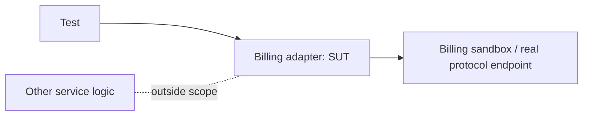

它能发现 unit test/fake 看不到的问题：URL、TLS、认证、timeout、field 名、状态码、编码、真实 query semantics。

### 3.3 为什么 “integration test” 容易混淆

不同团队会把以下都叫 integration test：

- 一个 adapter + 一个真实 database；
- 一个 service + 多个 dependencies；
- 多个 live services；
- 整个 staging 用户流程。

所以讨论测试时应说明 SUT、真实依赖和执行环境，少依赖标签。原章随后把 broad integration tests 统一称为 end-to-end tests。

---

## 4. End-to-end test：验证跨服务用户行为

### 4.1 定义

End-to-end（E2E）test 验证跨多个 services 的 behavior，通常对应 user-facing scenario。

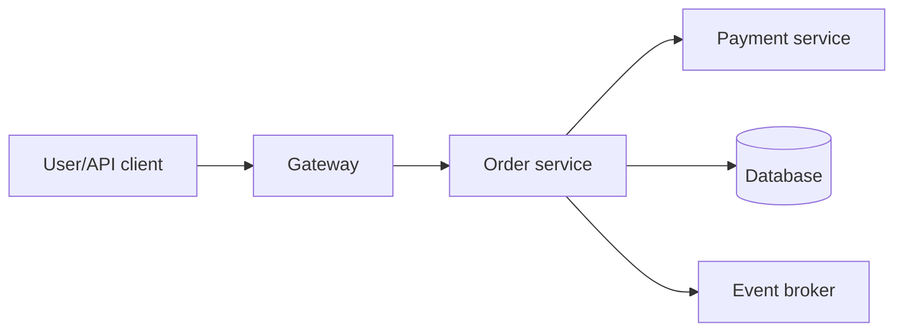

测试的 SUT 是整条路径，而非某一个服务。

### 4.2 Shared environment 的要求

E2E 常运行在 staging 或 production 等 shared environment，因此不能影响其他 tests/users：

- 使用唯一 test tenant/ID；
- 数据隔离；
- 可重复 cleanup；
- 不做真实扣款或通知；
- 限制并发和资源；
- 支持 idempotent retry；
- 避免依赖全局时间和执行顺序。

### 4.3 为什么慢、脆弱、昂贵

参与组件越多，任一依赖、网络或环境抖动都可能让测试失败。失败后根因也不明显：

```text
test assertion?
client?
gateway?
service A?
service B?
database?
eventual consistency delay?
shared environment interference?
```

调查成本显著高于 unit test。

### 4.4 为什么仍是 necessary evil

E2E 可以发现小 scope tests 无法看到的问题：

- Cross-service side effects；
- Emergent behavior；
- Deployment/config mismatch；
- Authentication propagation；
- Schema/version incompatibility；
- Real routing and permissions；
- 用户旅程中断。

不能因为贵就完全删除，只应把数量压到必要的高价值场景。

### 4.5 User journey test

原章建议用 user journey 减少 E2E 数量：把一个用户的多步交互串成一条测试。

电商示例：

```text
create order -> modify order -> cancel order
```

比把三步各自作为独立 E2E 更少重复 setup/teardown，运行时间也通常更短。

局限：中间失败可能阻止后续断言；应保留足够诊断信息，不把所有无关场景塞进一个超长 journey。

---

## 5. Figure 29.1：Test pyramid

### 5.1 原图表达的关系

从底到顶：

```text
many unit tests
fewer integration tests
few end-to-end tests
```

原图左侧 speed 向下更快，右侧 cost 向上更高。

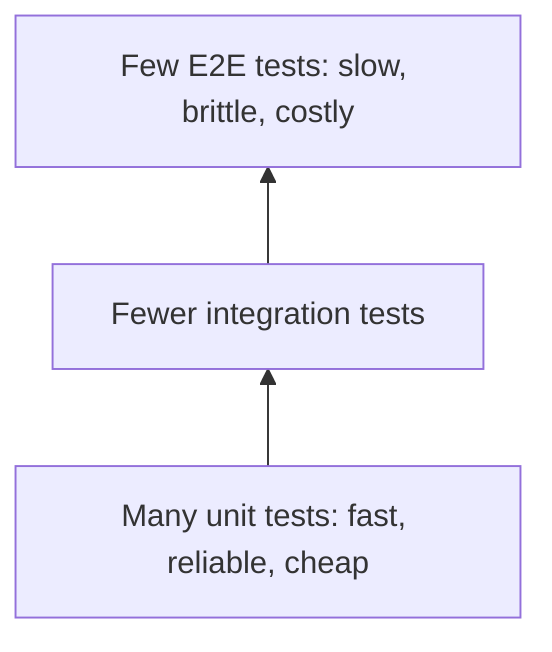

### 5.2 为什么 scope 越大通常越贵

设测试依赖 $n$ 个可独立发生偶发故障的组件，第 $i$ 个组件单次健康概率为 $r_i$。粗略地：

$$
P(\text{test infrastructure succeeds})\approx\prod_{i=1}^{n}r_i
$$

即使每个依赖都很可靠，乘积也随依赖数下降。这只是解释直觉的简化模型；真实失败并不独立。

### 5.3 Flaky test 为什么接近没有测试

如果工程师反复看到 false failure，会停止信任并忽略红灯。假设 $N$ 个测试各有独立 flake probability $p$，一次 suite 至少一个 false failure 的概率：

$$
P(\ge1\ false\ failure)=1-(1-p)^N
$$

例如 $N=1000$、$p=0.001$：

$$
1-0.999^{1000}\approx63.2\%
$$

单测 0.1% 看似很低，整套测试却大概率红。独立假设只是工程估算，但足以说明必须治理 flakiness。

### 5.4 金字塔不是固定比例

原章只给方向：尽可能用小 scope，保留少量必要 E2E；并未规定 70/20/10 等固定百分比。

比例取决于：

- 系统架构；
- Failure impact；
- Dependencies；
- UI/API 特性；
- Testability；
- Environment automation。

---

## 6. 29.2 Size：测试消耗多少计算资源

### 6.1 Size 与 scope 是两个维度

Test size 反映运行测试所需的 computing resources，例如 node 数与 I/O。Scope 和 size 往往相关，但不是同一概念。

```text
scope: SUT 覆盖谁
size: 运行需要什么资源
```

### 6.2 Small test

原章定义：

- 单一 process；
- 无 blocking calls；
- 无 I/O。

因此非常快、deterministic，偶发失败概率很小。

### 6.3 Intermediate test

- 单一 node；
- 允许 local I/O；
- 例如 disk read 或 localhost network call。

Local scheduling、filesystem、port、clock 会引入 delay 和 nondeterminism。

### 6.4 Large test

- 需要多个 nodes；
- Network、process scheduling、service startup、共享状态更多；
- 更慢、更不确定、更容易 flaky。

### 6.5 最小可行 size 原则

作者的建议是：为一个给定 behavior 编写尽可能小的测试。目标不是无条件追求小，而是在保留必要真实性的前提下降低资源和 nondeterminism。

---

## 7. Scope × Size：不要把 unit 与 small 混为一谈

### 7.1 二维矩阵

| Scope / Size | Small：单进程无 I/O | Intermediate：单节点本地 I/O | Large：多节点 |
| --- | --- | --- | --- |
| Unit | 纯业务对象 | 少见：被测单元含本地文件 | 通常是设计异味 |
| Narrow integration | 可用同进程真实库 | Local DB/container/localhost | 远程真实依赖 |
| E2E | 同进程模拟只能近似 E2E scope | 单节点多进程 | 典型真实 E2E |

### 7.2 重要推论

- 用 fake 的 broad workflow 可能 scope 大、size 小，但真实性有限；
- 一个只测 database adapter 的 narrow integration test 可能因远程数据库而 size 大；
- 测试标签不能替代资源约束；
- CI 调度、timeout、隔离应按 size 管理。

### 7.3 选择目标

对给定行为，寻找：

$$
\text{最小成本} \quad subject\ to \quad \text{足够缺陷检测能力}
$$

“足够”取决于风险，不是统一常数。

---

## 8. Test doubles：用可控替身缩小测试

### 8.1 为什么引入 double

真实 dependency 可能：

- 慢；
- 不稳定；
- 收费；
- 产生不可逆副作用；
- 需要复杂环境；
- 难以触发错误路径。

Double 用可控对象替代依赖，使测试更小、更快、更确定。

### 8.2 Fake

Fake 是接口的 lightweight implementation，行为与真实实现相似。例如 in-memory database。

```text
real DB: network + persistence + real query semantics
fake DB: in-memory state + same domain-facing interface
```

优点：有真实状态变化，可组合复杂 behavior。风险：事务、排序、约束、并发、编码语义可能与真实数据库不同。

### 8.3 Stub

Stub 是固定返回值的 function/object，不论参数如何都返回预设结果。

```text
def billing_stub(*_args):
    return {"approved": True}
```

适合把 SUT 推到 success/error branch。它不证明真实依赖会返回同样结构或语义。

### 8.4 Mock

Mock 带有“应如何被调用”的 expectations，用于验证对象之间 interaction。

```text
expect publish("order-created", id) exactly once
```

Mock 容易绑定内部调用顺序，使重构破坏测试。应主要用于 observable external protocol/effect，而非把每个内部 collaborator 都 mock。

### 8.5 三者的辨析

| Double | 核心特征 | 测什么 | 主要风险 |
| --- | --- | --- | --- |
| Fake | 有简化但可工作的实现 | State/behavior | 与真实语义漂移 |
| Stub | 提供 canned response | SUT 对输入/错误的反应 | 过度理想化 |
| Mock | 记录并校验 interaction | 外部调用契约 | 与实现耦合、脆弱 |

术语在不同框架中可能混用，应看行为而非类名。

---

## 9. Double 的真实性阶梯

### 9.1 原章建议与工程细分

Double 无法包含 real implementation 的所有细节。相似度越弱，测试给出的 confidence 越低。

原章明确建议的优先级是：真实实现优先，其次是 dependency owners 维护的 fake；stub 与 mock 一起作为 last-resort options。若再加入本文的工程细分，可写成：

```text
fast + deterministic real implementation
-> dependency owners maintained fake
-> local fake（本文补充）
-> stub/mock as last resorts
```

### 9.2 为什么优先真实实现

若真实实现本来就快、确定、依赖少，用它可以同时验证真实语义，不必维护平行模型。

典型例子：

- Pure parser；
- Embedded library；
- In-process rule engine；
- Deterministic serializer。

### 9.3 为什么 owner-maintained fake 更可信

Dependency owner 能在 API/behavior 改变时同步更新 fake；consumer 自建 fake 容易长期保持旧假设。

但 owner-maintained 也不等于完全等价，仍应保留少量真实 integration tests。

### 9.4 Double drift

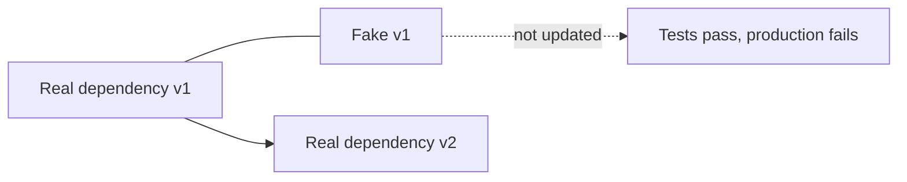

Contract tests 用于降低这种漂移。

---

## 10. Contract test：在 mock 与真实依赖之间搭桥

### 10.1 定义

Contract test 定义对 external dependency 的 request 及 expected response。Consumer test 用该 contract mock dependency；provider test 也使用同一 contract，确认真实 provider 对该 request 返回预期 response。

REST contract 典型包含：

- HTTP method/path；
- Required headers/auth；
- Request body/schema；
- Status code；
- Response body/schema；
- Error semantics。

### 10.2 双向验证

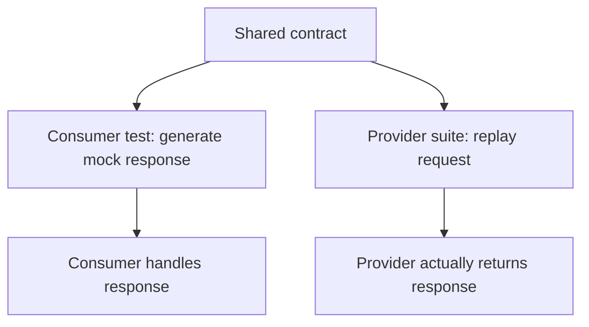

两边都通过，才说明 consumer 的模拟假设与 provider 行为一致。

### 10.3 为什么有效

Mock 的主要缺陷是“想象中的 provider”。共享 contract 把该想象变成 provider CI 中可执行的义务。

它能发现：

- Removed/renamed field；
- Status code change；
- Request validation change；
- Type/format incompatibility；
- Consumer 依赖 provider 未承诺的字段。

### 10.4 局限

Contract test 通常不验证：

- Provider 内部 correctness；
- Performance/capacity；
- Multi-step workflow；
- Eventual consistency timing；
- Authentication/network infrastructure；
- 未写进 contract 的语义。

它减少 E2E 需求，但不完全替代 E2E。

---

## 11. 29.3 Practical considerations：测试是风险权衡

### 11.1 Figure 29.2 的系统

要 E2E 测试 service 的某 API endpoint。Service 依赖：

1. Data store；
2. 另一个团队维护的 internal service；
3. 用于 billing 的 third-party API。

作者的问题是：如何在保持所需 scope 的同时，让测试尽可能小，并减少低真实性 doubles？

### 11.2 Internal service：安全使用 mock

假设被测 endpoint 根本不与 internal service 通信，那么该依赖不在这条 behavior path 上，可以 mock/隔离。

关键不是“内部服务都 mock”，而是先画实际 call path。

### 11.3 Data store：使用 in-memory fake

若 datastore 官方提供 in-memory implementation，可在测试中使用，避免 network calls。

仍需其他 narrow integration tests 验证真实 store 的 schema/query/transaction 差异；本例只为当前 endpoint 减小 size。

### 11.4 Billing API：使用 provider test endpoint

真实 billing 会产生交易，不适合随测试调用。若无 fake，可使用 provider 提供的 test endpoint，让 fake transaction 通过更真实的协议路径。

这比本地 stub 更接近真实 API，同时控制副作用。

### 11.5 决策过程

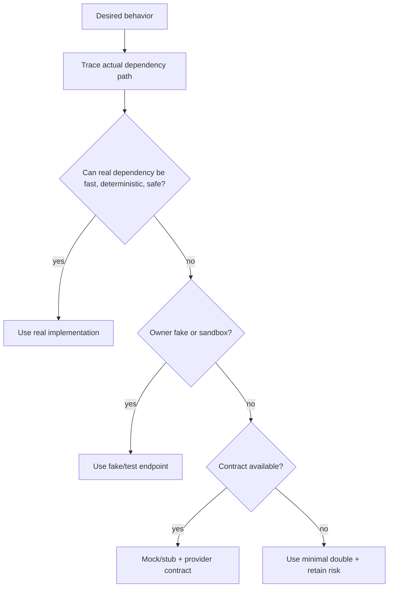

---

## 12. GDPR 删除案例：风险会推翻“小测试优先”

### 12.1 场景

需要验证从整个 application stack 删除某个用户的数据。欧洲 GDPR 要求这一能力；原章指出不合规罚款可高达 20 million euros（2,000 万欧元）或年营业额 4%，取较高者。“全球营业额”是 GDPR 条文语境中的进一步精化，并非原章原句。

### 12.2 为什么局部测试不够

数据可能散布于：

- Primary database；
- Search index；
- Object storage；
- Cache；
- Event-derived stores；
- Analytics systems；
- Downstream processors。

每个 service 的 unit test 都通过，也不能证明“全栈最终删除”。

### 12.3 原章的选择

因为 silent break 的风险和影响极高，应该定期在 production 运行 E2E test，并使用 live services 而非 doubles。

这说明测试金字塔不是“永远选择最小”的教条：

$$
Risk=P(Failure)\times Impact
$$

当 impact 极高，额外真实性和覆盖范围值得更高成本。该公式是本文的决策表达，不是原章量化合规风险的方法。

### 12.4 生产测试的安全设计（工程补充）

- Synthetic test user；
- 明确可删除标记；
- 不使用真实个人数据；
- 验证所有已声明 stores；
- 等待异步传播但设置 deadline；
- 记录 evidence/audit；
- 限制频率与资源；
- 测试失败不自动泄露敏感数据。

---

## 13. 一套风险驱动的测试选择模型

### 13.1 先定义行为，不先选工具

```text
behavior -> failure modes -> required confidence -> scope -> size -> doubles
```

一开始说“我要写 mock test”会把工具置于问题之前。

### 13.2 两个相反成本

测试过小：

- 快但可能不真实；
- 漏掉跨边界缺陷；
- False confidence。

测试过大：

- 慢且 flaky；
- 失败难定位；
- 反馈太晚；
- 维护成本高。

### 13.3 决策函数（解释性）

可把候选测试 $t$ 的价值抽象为：

$$
Value(t)=RiskReduction(t)-ExecutionCost(t)-MaintenanceCost(t)-FlakeCost(t)
$$

这些量通常无法精确计算，但迫使团队显式讨论 trade-offs。

### 13.4 分层互补

对关键 behavior：

```text
many small behavior tests
+ narrow real-boundary integration tests
+ shared provider contracts
+ one/few critical user journeys
+ production monitoring and probes
```

每层捕捉不同缺陷，不是互相替代。

---

## 14. 29.4 Formal verification：在写代码前检查设计

### 14.1 为什么传统测试不够

分布式算法的问题常来自罕见 interleaving，而非单个函数：

- Process 在两个操作之间 crash；
- Duplicate/reordered messages；
- Concurrent writers 顺序不同；
- Retry 与 failover 同时发生；
- Network partition 遇上 membership change。

靠手写 examples 很难覆盖组合。

### 14.2 Specification

Specification 是系统行为的 high-level description，可以是：

```text
informal one-pager
-> structured state machine/pseudocode
-> formal mathematical specification
```

写 specification 的过程迫使设计者回答尚未理解的问题；它也是文档和实现指南。

### 14.3 为什么“写清楚”本身能发现 bug

如果无法准确写出：

- State 是什么；
- 哪些 transitions 合法；
- Failure 后允许什么；
- 必须永远满足什么；
- 最终必须发生什么；

那么实现时也没有可靠依据。

### 14.4 不需要描述所有细节

Formal spec 的目标是趁错误便宜时发现它，不是复制所有 source code。应选：

- 最可能出错；
- 传统测试难覆盖；
- Architecture-level；
- 高并发/故障组合；
- 高影响 invariant。

之后选择 abstraction level，故意省略 UI、日志、具体字节格式等无关细节。

---

## 15. Model checking：算法式搜索规格错误

### 15.1 从 specification 到 model

Formal language 让计算机枚举规格允许的 behaviors，并验证性质。该过程叫 model checking。

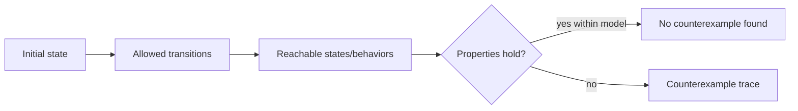

### 15.2 它证明什么

如果模型有限且探索完整，model checker 可以证明给定 specification/model 中所有 reachable behaviors 满足性质。

它不能自动证明：

- Spec 与真实需求一致；
- Implementation 与 spec 一致；
- 被抽象掉的细节无 bug；
- Environment assumptions 永远成立。

所以 formal verification 不是“系统绝对正确”，而是更强地检查明确模型。

### 15.3 Counterexample trace

性质失败时，model checker 返回从 initial state 到 bad state 的 state sequence。它把抽象的“可能有 race”变成可重放论证：

```text
state 0 -> action A -> state 1 -> crash -> state 2 -> property violated
```

这正是人类对 rare-event combinations 最需要的帮助。

---

## 16. TLA+ 的基本模型

### 16.1 TLA+

TLA+ 是 Temporal Logic of Actions，一种广泛使用的 formal specification language。原章提到 Amazon 和 Microsoft 用它描述 S3、Cosmos DB 等复杂 distributed systems。

### 16.2 State

在 TLA+ 中，state 是对所有 global variables 的一次赋值：

$$
s=(v_1=x_1,v_2=x_2,\ldots,v_n=x_n)
$$

例如：

```text
state = (X="bar", Y="foo", writer1_pc=2, writer2_pc=1)
```

### 16.3 Behavior（本章所需的简化状态机视图）

Behavior 是 sequence of states（状态序列）：

$$
\sigma=s_0,s_1,s_2,\ldots
$$

在用于解释本章案例的简化状态机里，每个非停顿步骤满足 specification 允许的 next-state relation。完整 TLA+ 还允许 stuttering steps，并可在 specification 中加入 temporal 与 fairness constraints。

### 16.4 Specification（简化表达）

在只保留 initial/transition rules 的简化模型里，system specification 表示所有可能 behaviors 的集合：

$$
Spec=\{\sigma\mid \sigma\text{ satisfies initial and transition rules}\}
$$

验证性质就是检查：

$$
\forall\sigma\in Spec:\ Property(\sigma)
$$

---

## 17. Safety 与 liveness

### 17.1 Safety property

Safety 表达“坏事永远不发生”。Invariant 是最常用的一类 safety property：它要求某个 state predicate 对 behavior 的所有 reachable states 为真：

$$
\Box P
$$

例：

- Balance never negative；
- At most one leader per term；
- Committed value never changes；
- 未授权用户永远不能读 secret。

一个 finite bad prefix 就足以反驳 safety。

### 17.2 Liveness property

Liveness 表达“好事最终会发生”：

$$
\Diamond Q
$$

例：

- Accepted request eventually completes or returns failure；
- Message eventually delivered under fairness assumptions；
- Migration eventually finishes；
- Lock requester eventually enters critical section。

### 17.3 为什么必须同时考虑

“什么也不做”的系统通常很安全，却没有 liveness：它不会写错，也永远不完成请求。

反之，只追求 eventually complete 可能破坏 safety，例如两个 leader 同时提交冲突值。

```text
correct distributed system = safety + liveness under stated assumptions
```

### 17.4 Liveness 依赖 fairness/环境前提

若 network 永久丢包或 process 永久不调度，许多 eventual properties 不可能成立。Specification 必须说明诸如：

- Non-faulty process eventually runs；
- Retransmitted message eventually arrives；
- Majority eventually reachable。

不写 assumptions，liveness 结论没有边界。

---

## 18. 为什么分布式系统特别需要模型检查

### 18.1 Rare events 的组合

若每类 rare event 概率很低，人仍倾向逐个思考；但大规模长期运行会不断尝试组合。

原章强调：系统 at scale 最终会进入各种可能 states/behaviors，而人类不善于想象多个 rare events 同时发生。

### 18.2 State-space explosion

若 $n$ 个组件各有 $k$ 个局部状态，粗略组合数：

$$
k^n
$$

再乘 message queues、timers、failures，状态数迅速爆炸。Formal modeling 因此依靠 abstraction、symmetry、bounds，而非照搬生产规模。

### 18.3 小模型仍能找到大 bug

许多 concurrency bug 只需：

- 2 writers；
- 2 replicas/stores；
- 1 crash；
- 少量 messages。

Small-scope hypothesis：若算法在 2 个并发者就违反 invariant，生产规模也不会修复它。

---

## 19. 原章案例：从 key-value store X 迁移到 Y

### 19.1 动机

Service 使用 store X，希望迁移到成本更低、benchmark 性能更好的 Y，并且不停机。

### 19.2 看似合理的三步方案

1. Service 同时写 X 和 Y（dual write），只从 X 读；
2. One-off batch 把 dual write 启动前的 X 历史数据 backfill 到 Y；
3. Application 切换为只读写 Y。

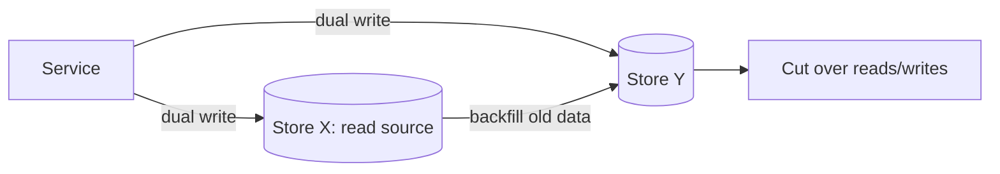

核心问题：该流程能否保证 X、Y 最终相同？

### 19.3 隐藏难点

“每个正常 request 都写两个 store”没有回答：

- 两次 write 中间 crash 怎么办？
- Timeout 后写是否已提交？
- Backfill 与新写谁覆盖谁？
- 多 writer 的 order 是否一致？
- Retry 是否重放旧值？
- 何时可以安全 cutover？

Formal specification 会迫使这些 transitions 显式化。

---

## 20. 第一个反例：在两次写之间 crash

### 20.1 Error trace

```text
initial: X=old, Y=old
service writes X=new
service crashes before writing Y
terminal/stuck: X=new, Y=old
```

若系统没有恢复/重试机制，“stores eventually equal”被违反。原章将其描述为 liveness violation：迁移停留在 inconsistent state。

### 20.2 为什么普通 happy-path test 容易漏掉

测试通常调用完整 method；method 正常返回时两次写都完成。Crash point 位于 method 内部两个 side effects 之间，需要故障注入或模型中的独立 transitions。

### 20.3 把双写建模为 atomic 是否解决

若 abstract model 规定：

```text
either both X/Y writes succeed, or neither succeeds
```

确实消除了“只写一个”的反例。但原章继续追问：即使单次 dual write 原子，多个 writers 会不会导致 stores 接收不同 order？

这体现 model refinement：修掉一个 counterexample 后重新验证，不把首次通过当终点。

---

## 21. Figure 29.3：两个 store 看到不同写入顺序

### 21.1 两个并发 writer

Writer 1 写值 `bar`，Writer 2 写值 `foo`。每个 writer 都向 X、Y 写，但网络调度不同：

```text
X observes: bar -> foo    final X=foo
Y observes: foo -> bar    final Y=bar
```

两边都收到了全部 writes，最终状态仍不同。

### 21.2 为什么“无丢失”不等于“一致”

Last-write-wins store 的 final value 由本地 observation order 决定：

$$
Final(X)=last(Order_X)
$$

$$
Final(Y)=last(Order_Y)
$$

若 $Order_X\ne Order_Y$，则 final values 可能不同。

### 21.3 原章的解法

在 service 与 stores 间引入 message channel，序列化所有 writes，保证 single global order：

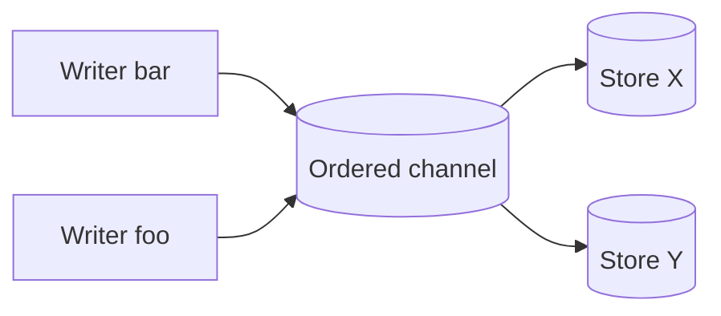

若两边消费同一 durable ordered log，并可靠应用相同序列，就不会各自形成冲突 order。

### 21.4 解法的前提和边界

Channel 方案仍需：

- Durable publish；
- Stable event identity；
- Idempotent consumers；
- Per-key/global ordering 定义；
- Retry 不改变顺序；
- Backfill 与 live stream 的 watermark；
- Cutover completeness proof。

而且 single global order 可能成为 throughput bottleneck。若 keys 独立，通常只需 per-key order；其他设计还包括 CDC、versioned writes、transactional outbox、conflict resolution。原章的重点不是规定唯一实现，而是 formal model 能测试 architecture decisions。

---

## 22. 作者的分析路径：反例驱动设计

### 22.1 从直觉方案开始

Dual write + backfill + cutover 看似覆盖全部数据。

### 22.2 把 prose 变成 states/transitions

一旦两次 write 被拆成 transitions，crash point 立即可见。

### 22.3 写出 desired property

```text
eventually X and Y hold the same logical data
```

没有性质，就不知道搜索到何种状态算错误。

### 22.4 Model checker 给出最短反例

Crash after first write -> inconsistent terminal state。

### 22.5 修正 abstraction，再次验证

把 dual write 视为 atomic，第一类反例消失。

### 22.6 新反例暴露更深 assumption

并发 writers 使 stores observation order 不同。问题从 atomicity 深入到 ordering。

### 22.7 提升架构约束

用 ordered message channel 让 writes 经过统一序列。解决思路不是“补一个 if”，而是改变信息流，让正确性由结构保证。

---

## 23. 可运行 Python 示例：测试替身与 dual-write 状态搜索

### 23.1 示例目标与 provenance

以下程序仅使用 Python 标准库，演示：

1. Fake 保存可观察 state；
2. Stub 将 billing 固定为 approve/reject；
3. Mock 只验证必要 external event；
4. Shared contract 同时校验 stub 和 sandbox-like provider；
5. User journey 组合 create/cancel behavior；
6. 小型 BFS 搜索两个 writers 的 reachable state graph，输出 Figure 29.3 型 counterexample。

它是本文补充的 executable analogy，不是 TLA+：没有 temporal logic、fairness、symmetry reduction，也不验证真实 implementation 与 model 一致。

### 23.2 完整代码

```python
from __future__ import annotations

from collections import deque
from dataclasses import dataclass
import io
from typing import Protocol, TypedDict
import unittest
from unittest.mock import Mock

class Order(TypedDict):
    id: str
    customer_id: str
    cents: int
    status: str

class BillingResponse(TypedDict):
    approved: bool
    transaction_id: str

class Billing(Protocol):
    def charge(self, customer_id: str,
               cents: int) -> BillingResponse: ...

class EventPublisher(Protocol):
    def publish(self, event_name: str, entity_id: str) -> None: ...

class FakeOrderStore:
    def __init__(self) -> None:
        self._orders: dict[str, Order] = {}

    def save(self, order: Order) -> None:
        self._orders[order["id"]] = order.copy()

    def get(self, order_id: str) -> Order | None:
        order = self._orders.get(order_id)
        return None if order is None else order.copy()

class StubBilling:
    def __init__(self, approved: bool) -> None:
        self._approved = approved

    def charge(self, customer_id: str, cents: int) -> BillingResponse:
        del customer_id, cents
        return {
            "approved": self._approved,
            "transaction_id": "stub-transaction",
        }

class SandboxBilling:
    def charge(self, customer_id: str, cents: int) -> BillingResponse:
        approved = bool(customer_id) and cents > 0
        return {
            "approved": approved,
            "transaction_id": "sandbox-transaction",
        }

class OrderService:
    def __init__(self, store: FakeOrderStore, billing: Billing,
                 events: EventPublisher) -> None:
        self._store = store
        self._billing = billing
        self._events = events

    def create(self, order_id: str, customer_id: str,
               cents: int) -> Order:
        if not order_id or not customer_id or cents <= 0:
            raise ValueError("invalid order")
        if self._store.get(order_id) is not None:
            raise ValueError("duplicate order")
        result = self._billing.charge(customer_id, cents)
        if not result["approved"]:
            raise RuntimeError("billing rejected")
        order: Order = {
            "id": order_id,
            "customer_id": customer_id,
            "cents": cents,
            "status": "created",
        }
        self._store.save(order)
        self._events.publish("order-created", order_id)
        return order.copy()

    def cancel(self, order_id: str) -> Order:
        order = self._store.get(order_id)
        if order is None:
            raise KeyError(order_id)
        order["status"] = "cancelled"
        self._store.save(order)
        self._events.publish("order-cancelled", order_id)
        return order.copy()

def assert_billing_contract(test: unittest.TestCase,
                            provider: Billing) -> None:
    response = provider.charge("customer-1", 500)
    test.assertEqual(
        set(response), {"approved", "transaction_id"}
    )
    test.assertIs(type(response["approved"]), bool)
    test.assertIs(type(response["transaction_id"]), str)
    test.assertTrue(response["transaction_id"])

class OrderTests(unittest.TestCase):
    def setUp(self) -> None:
        self.store = FakeOrderStore()
        self.events = Mock(spec=["publish"])

    def test_create_changes_observable_state(self) -> None:
        service = OrderService(
            self.store, StubBilling(approved=True), self.events
        )
        created = service.create("order-1", "customer-1", 500)
        self.assertEqual(created["status"], "created")
        self.assertEqual(self.store.get("order-1"), created)

    def test_rejected_charge_does_not_create_order(self) -> None:
        service = OrderService(
            self.store, StubBilling(approved=False), self.events
        )
        with self.assertRaisesRegex(RuntimeError, "billing rejected"):
            service.create("order-1", "customer-1", 500)
        self.assertIsNone(self.store.get("order-1"))

    def test_publishes_external_effect(self) -> None:
        service = OrderService(
            self.store, StubBilling(approved=True), self.events
        )
        service.create("order-1", "customer-1", 500)
        self.events.publish.assert_called_once_with(
            "order-created", "order-1"
        )

    def test_stub_obeys_billing_contract(self) -> None:
        assert_billing_contract(self, StubBilling(approved=True))

    def test_sandbox_obeys_billing_contract(self) -> None:
        assert_billing_contract(self, SandboxBilling())

    def test_create_then_cancel_user_journey(self) -> None:
        service = OrderService(
            self.store, SandboxBilling(), self.events
        )
        service.create("order-1", "customer-1", 500)
        cancelled = service.cancel("order-1")
        self.assertEqual(cancelled["status"], "cancelled")
        stored = self.store.get("order-1")
        if stored is None:
            self.fail("cancelled order was not stored")
        self.assertEqual(stored["status"], "cancelled")

@dataclass(frozen=True)
class MigrationState:
    store_x: str
    store_y: str
    bar_step: int
    foo_step: int
    trace: tuple[str, ...]

def advance(state: MigrationState, writer: str) -> MigrationState | None:
    if writer == "bar":
        step = state.bar_step
    elif writer == "foo":
        step = state.foo_step
    else:
        raise ValueError("unknown writer")
    if step >= 2:
        return None

    target = "X" if step == 0 else "Y"
    store_x = writer if target == "X" else state.store_x
    store_y = writer if target == "Y" else state.store_y
    return MigrationState(
        store_x=store_x,
        store_y=store_y,
        bar_step=state.bar_step + (writer == "bar"),
        foo_step=state.foo_step + (writer == "foo"),
        trace=state.trace + (f"{writer}:{target}={writer}",),
    )

def find_final_divergence() -> MigrationState:
    initial = MigrationState("old", "old", 0, 0, ())
    queue = deque([initial])
    visited: set[tuple[str, str, int, int]] = set()
    while queue:
        state = queue.popleft()
        key = (
            state.store_x, state.store_y,
            state.bar_step, state.foo_step,
        )
        if key in visited:
            continue
        visited.add(key)
        complete = state.bar_step == 2 and state.foo_step == 2
        if complete and state.store_x != state.store_y:
            return state
        for writer in ("bar", "foo"):
            successor = advance(state, writer)
            if successor is not None:
                queue.append(successor)
    raise RuntimeError("no divergent terminal state found")

def main() -> int:
    suite = unittest.defaultTestLoader.loadTestsFromTestCase(OrderTests)
    result = unittest.TextTestRunner(
        stream=io.StringIO(), verbosity=0
    ).run(suite)
    if not result.wasSuccessful():
        return 1
    counterexample = find_final_divergence()
    print(
        f"tests run={result.testsRun} failures={len(result.failures)} "
        f"errors={len(result.errors)}"
    )
    print("counterexample=" + " -> ".join(counterexample.trace))
    print(
        f"final_X={counterexample.store_x} "
        f"final_Y={counterexample.store_y} divergent=1"
    )
    return 0

if __name__ == "__main__":
    raise SystemExit(main())
```

### 23.3 预期输出

```text
tests run=6 failures=0 errors=0
counterexample=bar:X=bar -> foo:X=foo -> foo:Y=foo -> bar:Y=bar
final_X=foo final_Y=bar divergent=1
```

### 23.4 代码与原理对应

| 代码 | 本章概念 |
| --- | --- |
| `FakeOrderStore` | Stateful fake |
| `StubBilling` | Canned response stub |
| `Mock(spec=["publish"])` | External interaction mock |
| `assert_billing_contract` | Consumer/provider 共享行为契约的本地类比 |
| `test_create_then_cancel_user_journey` | 多步 user journey；仍是单进程近似，不是生产 E2E |
| `MigrationState` | Global variables 的一次 state assignment |
| `advance` | Next-state transition |
| BFS queue | 搜索 reachable state graph |
| Final divergence check | 检查迁移完成后的 consistency property |
| `trace` | Counterexample behavior |

### 23.5 为什么 BFS 能找到反例

每个 writer 必须先写 X 再写 Y，但两个 writers 可交错。若区分完整 schedule，每个 writer 两步，总 interleavings 数：

$$
\binom{4}{2}=6
$$

该程序用 `visited` 合并相同核心 state，并在找到第一个 divergent terminal state 时返回；因此它证明反例可达，但不会逐条列出全部 6 个 schedules。它找到的反例是：

```text
bar writes X
foo writes X
foo writes Y
bar writes Y
```

因此 X 最后看到 `foo`，Y 最后看到 `bar`。

### 23.6 示例局限

- Contract helper 只验证 shape/type，不是完整 HTTP provider contract；
- `SandboxBilling` 仍在同进程，不验证 network/auth/TLS；
- User journey 不跨 live services；
- Model 只含两个 writers、两个 stores、覆盖写；
- 未建模 crash、retry、backfill、message duplication；
- `visited` 合并相同核心 state，仅保留一条 trace；
- Python 搜索不是 TLA+，也没有完整 temporal/fairness semantics；
- 找到反例能推翻方案，找不到反例不能证明被省略的现实系统正确。

---

## 24. 形式化验证与测试如何互补

### 24.1 不同问题

| 方法 | 主要对象 | 强项 | 盲区 |
| --- | --- | --- | --- |
| Unit test | Small code behavior | 快速回归、边界条件 | 跨组件组合 |
| Integration test | Real dependency boundary | 协议/语义兼容 | 全链路 emergent behavior |
| E2E test | Deployed workflow | 现实配置与用户路径 | 慢、flaky、难穷举 |
| Model checking | Abstract specification | 穷举小模型 behaviors | Spec/implementation gap |
| Production observability | Real running system | 未预见行为、真实规模 | 通常在部署后发现 |

### 24.2 从反例生成测试

Model checker 找到 trace 后：

1. 修正 architecture/spec；
2. 为 implementation 添加 deterministic regression test；
3. 必要时加 fault injection/integration test；
4. 在 production 监控对应 invariant signal。

这样 formal reasoning 与 executable tests 形成闭环。

### 24.3 Implementation refinement

即使 spec 正确，code 也可能偏离。可采用：

- Code review against state machine；
- Model-based testing；
- Trace validation；
- Runtime invariant checks；
- Refinement mapping（更正式的方法）。

原章只要求理解 formal model 能提前验证架构决策，并未展开 implementation proof。

---

## 25. 容易混淆的概念

### 25.1 Scope 与 size

Scope 是 SUT 覆盖范围；size 是 process/node/I/O 资源。相关但不同。

### 25.2 Executed code 与 SUT

测试执行到某 dependency，不代表该 dependency 是本测试要验证的对象。

### 25.3 Unit test 与 isolated class test

原章偏 sociable unit test；unit 可包含紧密协作的真实对象，不要求 mock 一切。

### 25.4 Narrow integration 与 E2E

前者验证一个 dependency adapter；后者跨多个 live services 验证用户行为。

### 25.5 Fake、stub、mock

Fake 有简化状态实现；stub 给固定输出；mock 校验 interaction。框架命名可能模糊。

### 25.6 Contract test 与 integration test

Contract 验证 consumer/provider 共同理解接口；真实 integration 还覆盖 transport、auth、部署配置等。

### 25.7 Test pyramid 与固定比例

金字塔是成本/数量方向，不是任何系统都必须遵守某百分比。

### 25.8 E2E 与 user journey

User journey 是减少 E2E setup 重复的一种组织方式，不代表所有 E2E 都应合为一条。

### 25.9 Test coverage 与 correctness

高 line coverage 只说明 lines 被执行，不证明 behavior、failure combinations 正确。

### 25.10 Specification 与 implementation

Spec 描述抽象系统；验证 spec 不自动验证 code。

### 25.11 Safety 与 liveness

Safety：坏事不发生；liveness：好事最终发生。停止一切可能安全但不活跃。

### 25.12 Atomicity 与 ordering

单次 dual write 原子只防 partial write；多个 writers 的全局 order 仍可能不同。

### 25.13 Model checking 与 theorem proving

Model checking 通常穷举 bounded/finite model；theorem proving 通过逻辑证明更一般命题。原章聚焦前者。

### 25.14 Formal verification 与 exhaustive production testing

模型穷举抽象 states，不是在真实生产规模跑所有输入；效果来自保留关键结构并省略无关细节。

---

## 26. 常见误区与失败模式

### 26.1 “测试通过说明没有 bug”

只说明已表达场景未发现违反；unimagined/emergent behavior 仍存在。

### 26.2 “Coverage 100% 就足够”

可能没有有意义断言，也未覆盖并发顺序和 failure semantics。

### 26.3 “测试 private method 更精确”

把 implementation 固化，重构即破坏。通过 public behavior 验证。

### 26.4 “所有 collaborator 都应 mock”

会得到脆弱、与真实行为相似度低的测试。优先真实快速对象或 fake。

### 26.5 “In-memory DB 等于真实 DB”

事务、constraints、query planner、collation、concurrency 可能不同。保留 real DB integration tests。

### 26.6 “Contract test 可删除所有 E2E”

它只验证接口契约，不验证跨服务 workflow 和 deployment wiring。

### 26.7 “E2E 越多越有信心”

过多会慢、flaky、难诊断，最终被忽略。用更小 scope 覆盖大多数 behavior。

### 26.8 “Flaky test 重跑通过就没事”

重跑掩盖 nondeterminism 并腐蚀信任。隔离、修复或删除无价值测试。

### 26.9 “Shared staging 是干净实验室”

其他 tests、deployments、数据和流量会干扰。设计唯一 IDs、隔离与 idempotent cleanup。

### 26.10 “永远选择最小测试”

GDPR 等高风险跨栈 invariant 需要 production E2E。最小必须受 required confidence 约束。

### 26.11 “写 specification 是写完整设计文档”

只建模高风险、难测试机制，选择适当 abstraction。

### 26.12 “Model checker 没找到 bug 就证明生产正确”

只证明模型内性质；错误 spec、过强假设、遗漏细节仍可能造成 false confidence。

### 26.13 “Dual write 两边都成功就一致”

Concurrent writes 可在两边以不同顺序到达，final state 分叉。

### 26.14 “把两次写变 atomic 就解决迁移”

解决 partial failure，不解决 ordering、backfill race、cutover completeness。

### 26.15 “消息队列天然 exactly-once 且全局有序”

需要明确 partition/order、delivery、dedup、idempotency 和 durable publication。

---

## 27. 如何制定分布式系统测试策略

### 第一步：列出 public behaviors 与 invariants

不要从测试文件数量开始。列 API behavior、state transition、error、cross-service invariant、合规义务。

### 第二步：给每项标 failure risk

估计发生可能性、影响、可检测性和恢复成本。高影响 silent failure 提升测试真实性。

### 第三步：为 behavior 选择最小 scope

局部 rule 用 unit；dependency protocol 用 narrow integration；跨服务用户结果用少量 E2E。

### 第四步：再选择最小 size

能单进程就不启节点，能 localhost 就不远程；但不要牺牲该行为所需真实性。

### 第五步：按真实性选择依赖

Real deterministic implementation -> owner fake/sandbox -> local fake -> stub/mock。记录残余差异。

### 第六步：用 contract 约束 doubles

Consumer/provider 共享 request/response 定义，在 provider CI 验证兼容性。

### 第七步：设计少量 user journeys

覆盖 revenue、identity、data lifecycle、权限和关键跨服务路径；避免重复 setup。

### 第八步：治理 determinism

控制 time/randomness、唯一数据、bounded waits、事件最终一致条件、cleanup、端口和资源。

### 第九步：定义 flake policy

统计 flake rate；失败可重现；quarantine 需 owner/deadline；不能永久依赖重跑。

### 第十步：识别传统测试难覆盖的算法

Migration、consensus、leases、replication、workflow compensation、exactly-once claims 进入 formal modeling 候选。

### 第十一步：写 abstract state machine

定义 variables、initial state、actions、failure transitions、safety、liveness、fairness assumptions。

### 第十二步：让模型产生 counterexample

从小 bounds 开始；修 architecture 后重跑，继续寻找更深 assumption。

### 第十三步：把 trace 落回测试和监控

Counterexample 变 regression/fault-injection test；关键 invariants 变 production signals。

---

## 28. 可观测指标与质量门槛（工程补充）

### 28.1 测试套件

- Runtime by scope/size；
- Queue time；
- Failure/flake rate；
- Retry-pass rate；
- Slowest tests；
- Quarantined tests age；
- Contract provider lag；
- Failure localization time。

### 28.2 不要用单一数字治理

只追 coverage 会制造低价值断言；只追 runtime 会删掉必要真实测试；只追 pass rate 会掩盖未运行测试。

使用 balanced signals，并定期审查关键 behavior 是否有对应 evidence。

### 28.3 CI 分层

```text
PR: small deterministic unit + contracts + selected integration
merge: broader integration
pre-production: large user journeys
production: safe synthetic/compliance probes
design time: formal model checking
```

这与 Chapter 30 的 release pipeline 自然衔接。

---

## 29. 作者如何形成整章解决思路

### 29.1 从维护成本而非代码正确性切入

测试的真正收益在未来改动时出现：保留 expected behavior 并降低回归恐惧。

### 29.2 先承认测试能力边界

不承诺 bug-free，只要求为重要行为提供 repeatable evidence；为 formal verification 留出位置。

### 29.3 用 scope 解释“测什么”

Unit -> dependency boundary -> multi-service user scenario。范围扩大带来新缺陷检测能力，也带来脆弱和诊断成本。

### 29.4 用 test pyramid 管理组合

大多数 behavior 放在可靠便宜的底层，少数不可替代的跨服务行为放在顶层。

### 29.5 再引入 size 纠正常见混淆

Scope 与资源相关但独立；测试可通过 doubles 缩小 size。

### 29.6 随即指出 doubles 的 epistemic cost

越不像 real dependency，confidence 越弱；因此优先真实实现，其次 owner-maintained fake；local fake 是本文细分，stub/mock 同属最后选择，contract 用于防漂移。

### 29.7 用 Figure 29.2 展示局部权衡

不在 call path 的 internal service mock，datastore 用 fake，billing 用 provider test endpoint。

### 29.8 用 GDPR 案例否定教条

高合规风险需要 live production E2E；“smallest possible”必须服从业务风险。

### 29.9 从测试无法想象所有组合转向 specification

把行为显式写成 states/transitions/properties，让计算机探索 human imagination 的盲区。

### 29.10 用 dual-write 连续反例展示 formal method

先发现 crash partial write，再发现 atomic dual write 下的 ordering divergence，最终通过 ordered channel 改变架构。

---

## 30. 知识结构

```mermaid
flowchart TD
    T[Testing for maintainability]
    T --> V[Value and limits]
    V --> REG[Regression confidence]
    V --> DOC[Executable documentation]
    V --> LIM[Cannot cover unimagined emergent behavior]

    T --> SCOPE[29.1 Scope = SUT]
    SCOPE --> UNIT[Unit: local behavior]
    SCOPE --> INT[Integration: dependency boundary]
    SCOPE --> E2E[E2E: multi-service user scenario]
    E2E --> JOURNEY[User journey]
    SCOPE --> PYRAMID[Test pyramid]

    T --> SIZE[29.2 Size = resources]
    SIZE --> SMALL[Small: one process, no I/O]
    SIZE --> MID[Intermediate: one node, local I/O]
    SIZE --> LARGE[Large: multiple nodes]
    SIZE --> DOUBLE[Test doubles]
    DOUBLE --> FAKE[Fake]
    DOUBLE --> STUB[Stub]
    DOUBLE --> MOCK[Mock]
    DOUBLE --> CONTRACT[Contract test]

    T --> PRACTICAL[29.3 Risk trade-offs]
    PRACTICAL --> API[Endpoint dependency choices]
    PRACTICAL --> GDPR[Production E2E for deletion]

    T --> FORMAL[29.4 Formal verification]
    FORMAL --> SPEC[Specification]
    SPEC --> STATE[State]
    SPEC --> BEHAVIOR[Behavior]
    FORMAL --> PROP[Properties]
    PROP --> SAFETY[Safety / invariant]
    PROP --> LIVE[Liveness / eventually]
    FORMAL --> MC[Model checking]
    MC --> TRACE[Counterexample trace]
    TRACE --> CRASH[Dual-write crash]
    TRACE --> ORDER[Concurrent order divergence]
    ORDER --> CHANNEL[Serialized ordered channel]
```

---

## 31. 核心结论

1. **测试越早发现缺陷，修复成本越低；更长期的价值是保护未来修改。**
2. **测试也是可执行文档，并通过用户视角改善 public interfaces。**
3. **测试不能保证 bug-free，只能覆盖被表达的行为与开发者能想到的 failures。**
4. **SUT 决定 test scope，并且 $SUT\subseteq ExecutedCode$；被执行的不一定都属于 SUT。**
5. **Unit test 应通过 public interface 验证 state change 和 behavior，而非 private implementation sequence。**
6. **Narrow integration test 验证 service 与某个 external dependency 的实际边界。**
7. **End-to-end test 跨多个 live services 验证 user-facing scenario，能发现 side effects 和 emergent behavior。**
8. **E2E 慢、脆弱、昂贵且难定位，应保留少量必要场景，并可组织为 user journeys。**
9. **Test pyramid 建议大量 unit、较少 integration、极少 E2E，不规定固定比例。**
10. **Flaky tests 会破坏信任；大量低概率 flake 可使整套测试频繁误报。**
11. **Test size 与 scope 不同：small 为单进程无 I/O，intermediate 为单节点 local I/O，large 需要多节点。**
12. **对给定 behavior，应在足够真实性约束下选择最小测试。**
13. **Fake 是轻量可工作实现，stub 给固定输出，mock 验证 interaction。**
14. **优先快速确定的真实实现，其次 owner-maintained fake，stub/mock 是低相似度的最后选择。**
15. **Contract test 让 consumer mock 与 provider 实际行为共享同一 request/response 契约。**
16. **普通 endpoint 可按实际 call path 混合 mock、in-memory fake 和 billing test endpoint。**
17. **GDPR 全栈删除因 silent failure 影响极高，值得定期运行 production E2E。**
18. **Specification 在写代码前迫使设计者明确 state、transition、failure 与 property。**
19. **Formal spec 应聚焦高风险、传统测试难覆盖的部分，并选择适当 abstraction。**
20. **TLA+ 把 behavior 表示为 state sequence，把 specification 表示为所有可能 behaviors。**
21. **Safety 要求坏事永不发生；liveness 要求好事最终发生，后者依赖 fairness assumptions。**
22. **Model checking 枚举模型 behaviors，失败时返回可解释的 counterexample trace。**
23. **Dual write 可能在两次写之间 crash，使 X/Y 停留在 inconsistent state。**
24. **即使单次双写 atomic，并发 writers 也可能让两个 stores 以不同 order 应用 writes。**
25. **Ordered message channel 可序列化 writes；生产方案还需 durability、idempotency、ordering scope 和 cutover protocol。**
26. **Formal verification 检查 specification，不自动证明 implementation 或真实世界 assumptions。**
27. **测试、模型检查与生产可观测性分别覆盖不同盲区，应组合使用。**

---

## 32. 解决问题的一般思路

### 32.1 从可观察行为开始

先写清 Given/When/Then、state transition、external effect 与 invariant，再选择测试层级。

### 32.2 分离 scope 和 size

用 scope 决定需要覆盖谁，用 size 管理运行成本；避免标签掩盖真实资源和依赖。

### 32.3 以最小证据回答具体风险

Local behavior 用 unit，boundary compatibility 用 narrow integration，跨栈结果用少量 E2E。

### 32.4 把真实性当作预算

Double 越便宜通常越不真实；通过 owner fake、sandbox、contract 和真实 integration 分层补足。

### 32.5 用业务影响修正测试金字塔

低风险 behavior 偏小测试；高影响、silent、合规或数据完整性风险提高真实 E2E 权重。

### 32.6 把 flaky 当产品缺陷

False alarms 会摧毁反馈系统；测量、隔离、定位、修复，不靠无限重跑维持绿色。

### 32.7 对组合爆炸使用 abstraction

传统 examples 难覆盖并发故障时，把系统缩成关键 states/actions，省略无关实现。

### 32.8 先写 property，再搜索 behavior

Safety/liveness 明确“何为错误”；model checker 才能给出有意义 trace。

### 32.9 用 counterexample 推动架构变化

Crash trace 暴露 atomicity，乱序 trace 暴露 ordering；修复产生错误的结构，而非只补 happy-path code。

### 32.10 把抽象发现带回现实

Model trace -> regression/fault-injection test -> release gate -> runtime invariant/alert，形成持续证据链。

最终方法可压缩为：

```text
define public behaviors and high-value invariants
-> identify failure impact and required confidence
-> choose the smallest sufficient SUT scope
-> minimize test size without erasing necessary realism
-> prefer real deterministic dependencies, then trustworthy fakes
-> bind remaining doubles to provider contracts
-> reserve live E2E journeys for irreducible cross-system risks
-> treat flakiness as a defect in the feedback system
-> model concurrency-heavy designs as states, actions, and properties
-> use counterexample traces to expose atomicity and ordering assumptions
-> turn formal findings into executable tests and production signals
```
