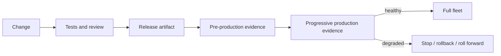
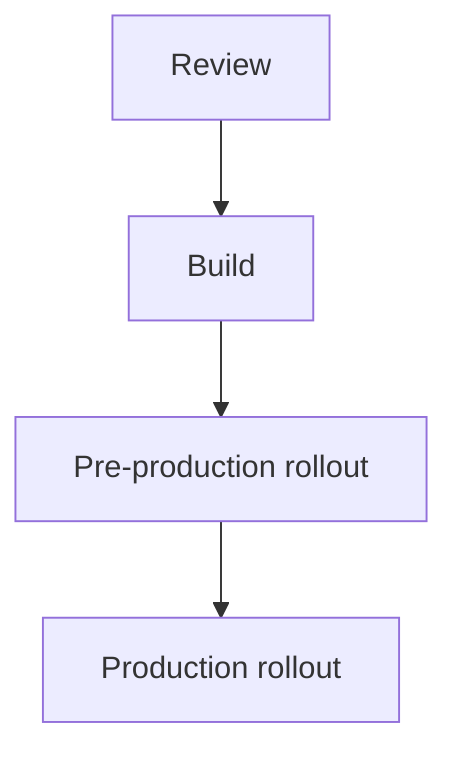
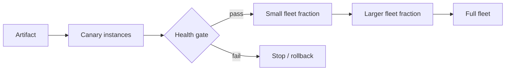
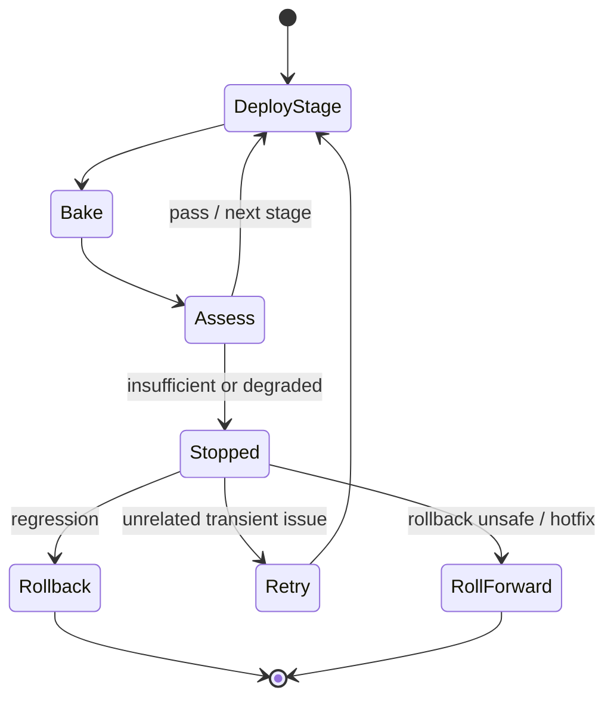
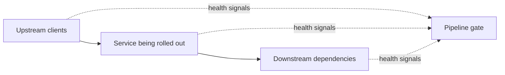
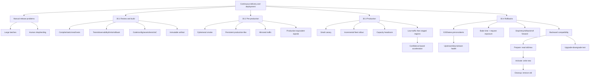

> 对应原文：Understanding Distributed Systems 2nd edition.md
>
> 本文按原章顺序展开：先解释为什么手工发布会把变更批量化、放大失败并消耗工程师注意力，以及 CD pipeline 如何在发布速度和安全性之间权衡；随后依次讨论 30.1 Review and build、30.2 Pre-production、30.3 Production、30.4 Rollbacks；最后完整解释 canary、incremental rollout、regional staging、health signals、bake time、request-count gate、rollback/roll forward、backward compatibility、prepare/activate/cleanup 和 upgrade-downgrade test。概率、容量和暴露量公式、release policy、schema compatibility matrix 与 Python 状态机是本文用于解释原理的工程补充，不应误认为原书给出的固定阈值、统计检验或特定 CD 产品实现。

---

## 0. 本章定位：测试通过之后，变更如何安全抵达生产

### 0.1 与 Chapter 29 的衔接

Chapter 29 解决的是：如何通过 unit、integration、end-to-end tests 和 formal verification 提高“变更符合预期”的信心。

Chapter 30 继续追问：

> 变更合并到 repository 后，怎样在不破坏 availability 的前提下，把它安全、高效地释放到 production？

测试只能验证有限环境和场景，生产拥有真实数据、流量、拓扑、依赖和规模。因此“测试通过”不是发布过程的终点，而是 release pipeline 的起点。



### 0.2 Release 是高风险状态转换

发布期间同时存在：

- Old/new versions；
- Old/new schemas；
- Warm/cold instances；
- Changed configuration；
- Capacity temporarily unavailable；
- Upstream/downstream interactions；
- Partial regional progress。

所以 release 不是“复制文件”，而是 distributed system 的状态转换。Pipeline 的职责是限制每一步影响、收集证据，并在证据不足或变坏时停止。

---

## 1. 为什么手工发布会形成危险反馈环

### 1.1 手工流程降低发布频率

当发布依赖 manual process（人工流程），团队自然倾向少发布。多个 changes 会在 days or even weeks（数天甚至数周）内积累成一个 batch。

```text
manual friction
-> infrequent releases
-> larger change batches
-> more failure opportunities
-> harder diagnosis
-> more fear and manual safeguards
-> even more friction
```

### 1.2 大 batch 为什么更危险

假设一个 change 独立引入严重 regression 的概率为 $p$，一次 release 含 $n$ 个 changes。至少一个 regression 的概率可粗略表示为：

$$
P(\text{at least one regression})=1-(1-p)^n
$$

例如 $p=1\%$：

- 1 个 change：$1\%$；
- 10 个 changes：$1-0.99^{10}\approx9.56\%$；
- 50 个 changes：$1-0.99^{50}\approx39.50\%$。

该模型只解释 batch-size intuition；真实 changes 并不独立，风险也不相同。

### 1.3 定位也随 batch 变难

一个 artifact 同时包含多个 changes，失败后 breaking change（致错变更）的候选更多，还可能存在 interaction。小批量发布缩小差异集：

```text
known-good version -> small delta -> bad version
```

比“数周改动一起上线”更容易 bisect、rollback 和理解。

### 1.4 人工盯守浪费注意力

手工发布要求开发者：

- 执行步骤；
- 观察 dashboards/alerts；
- 判断是否健康；
- 失败时回滚；
- 长时间保持上下文。

服务数量增加后，这种方式无法扩展。自动化让开发者合并后切换到下一项工作，而不是 shepherd deployment。

---

## 2. Continuous delivery 与 continuous deployment

### 2.1 原章用法

原章把完整自动化 release process（包括 rollback）称为 continuous delivery and deployment（CD）pipeline，并强调合并后应自动、安全地 rollout 到 production。

### 2.2 常见术语辨析（背景补充）

业界有时区分：

- **Continuous delivery**：每个 change 始终处于可发布状态，production release 可能有人工批准；
- **Continuous deployment**：通过所有 gates 后自动进入 production。

原章更关注共同核心：build once、逐阶段验证、progressive rollout、健康判定和自动化恢复，而非术语边界。

### 2.3 自动化不等于取消安全措施

Release 是主要故障来源之一，所以 CD 需要大量投入：

- Safeguards；
- Monitoring；
- Tests；
- Automation；
- Rollback/roll-forward mechanisms；
- Auditability；
- Operator escape hatch。

自动化的价值是让安全步骤每次一致执行，而不是更快地把未经验证的 change 推到全 fleet。

---

## 3. Artifact、rollback 与 roll forward

### 3.1 Artifact

Artifact 是包含 change 的可部署组件，例如：

- Container image；
- Binary/package；
- Static asset bundle；
- Configuration snapshot；
- Infrastructure plan/module。

理想属性：immutable、versioned、content-addressable、signed/attested、可追溯到 source revision 和 build inputs。

### 3.2 Build once, promote the same artifact

```text
source commit -> build artifact A
A -> pre-production -> canary -> regions -> full fleet
```

每阶段重新 build 会引入新变量；pre-production 验证的可能不是 production 部署的 bytes。原章没有展开 supply-chain 细节，但“build and package into a deployable release artifact”自然支持同一 artifact 逐级提升。

### 3.3 两种恢复方向

Regression detected 后：

- **Roll back**：artifact is rolled back，回到 previous version；
- **Roll forward**：发布含 hotfix 的 next version。

Rollback 通常更快、风险更低，因为 previous artifact 已知可工作；但 backward-incompatible data/schema change 可能让旧版本无法再运行。

---

## 4. 安全与速度的核心权衡

### 4.1 为什么不能一步全量

全量发布能最快完成，但一个未发现 regression 会同时影响全部 users/regions。

### 4.2 为什么不能无限分阶段

阶段越多、bake time 越长，检测证据越充分、blast radius 越小，但：

- Lead time 增长；
- Pipeline 占用资源；
- 多版本并存更久；
- 发布队列积压；
- Hotfix 变慢。

### 4.3 优化目标

可以把 pipeline 目标抽象为：

$$
\min\left(ExpectedReleaseLoss+DelayCost+OperationalCost\right)
$$

subject to：

$$
Evidence(stage_i)\ge RequiredConfidence_i
$$

这不是可直接求解的原书公式，而是说明：最快与最安全都不是单一最优，pipeline 要按风险收集足够证据。

---

## 5. 30.1 Review and build：四阶段流水线

### 5.1 Figure 30.1

原章把 code change 到 production 分成四个阶段：



每个 stage 都应成为 gate：只有前一步满足条件，artifact 才能向前。

### 5.2 为什么顺序有效

检查按成本和真实性递增：

```text
cheap/fast/static evidence
-> executable tests
-> synthetic deployed environment
-> limited real production
-> wider production
```

先用便宜检查消灭明显错误，把昂贵环境留给只有真实部署才能发现的问题。

---

## 6. Pull request 阶段：几分钟内获得反馈

### 6.1 PR 提交后的自动检查

原章要求 PR 在几分钟（a few minutes）内完成：

- Compiled（编译）；
- Statically analyzed（静态分析）；
- Battery of tests；
- 总体不应超过几分钟。

快速反馈让作者仍保有 change 上下文，也避免 review 队列等待。

### 6.2 为什么此处运行 small tests

为提高速度、降低 intermittent failures，PR tests 应小到能在 single process or node（单一进程或节点）运行；larger tests 放到 pipeline 后面。

这与 Chapter 29 的 size 分类一致：

```text
PR gate: deterministic small/intermediate tests
later gates: realistic large/E2E tests
```

### 6.3 快速 gate 不是降低覆盖

可通过以下方法控制时间：

- Parallelization；
- Test impact selection（保留 periodic full suite）；
- Hermetic dependencies；
- Build/test cache；
- Split slow integration suites；
- Flake remediation；
- Bounded timeouts。

不能简单删除高价值测试来满足时间目标。

---

## 7. Human review：验证自动化难以判断的风险

### 7.1 Reviewer 的责任

PR 合并前需 team member review/approve。Reviewer 要判断 change 是否正确，以及是否能由 CD pipeline 自动、安全地 release。

### 7.2 原章 checklist

1. 是否按需要包含 unit, integration, and end-to-end tests？
2. 是否包含 metrics, logs, and traces？
3. 是否可能因 backward-incompatible change 或 service limit 破坏 production？
4. 必要时能否安全 rollback？

### 7.3 为什么 observability 必须随 change 一起交付

Progressive rollout 依赖 health evidence。如果新 feature 没有 signals：

- Pipeline 无法自动判定；
- Operator 无法解释变化；
- Regression 只能等待用户报告；
- Rollback 时机变晚。

因此 observability 不是上线后补充，而是 releasability 的组成部分。

### 7.4 Checklist 的局限

Checklist 防遗忘，不替代工程判断。它应针对 incident lessons 演化，避免无限增长成机械审批。

---

## 8. 不只有 code 要进 pipeline

### 8.1 原章列出的变更类型

- Code；
- Static assets；
- End-to-end tests；
- Configuration files；
- Infrastructure definitions。

它们都应 version-controlled、reviewed、tested、released。

### 8.2 为什么配置尤其危险

配置可瞬间改变所有 instances 的行为。Chapter 24 已指出，未经 review/test 的 global configuration change 是常见 production failure 来源。

危险错觉：

```text
"only config" != "low risk"
```

配置需要 schema validation、semantic validation、canary、version、audit 和 rollback。

### 8.3 多 repository、多 pipelines

同一 service 可有多个 repositories 和 CD pipelines，例如：

```text
application repo -> binary pipeline
configuration repo -> config pipeline
infrastructure repo -> IaC pipeline
E2E repo -> test deployment pipeline
```

它们可并行运行，但 cross-repo compatibility 仍需 contract/version policy。

---

## 9. Infrastructure as Code（IaC）

### 9.1 定义

Cloud application 应用 code 声明 virtual machines、data stores、load balancers 等 infrastructure dependencies。原章以 Terraform 为例。

### 9.2 为什么引入

手工点选 infrastructure 会产生：

- Environment drift；
- 无 review 的权限/网络变化；
- 不可重复 provisioning；
- 不可审计操作；
- Disaster recovery 困难。

IaC 把 infrastructure change 变成普通 software change，可 review、diff、test、plan 和自动执行。

### 9.3 Declarative desired state

```text
versioned desired state
-> plan/diff
-> policy/security checks
-> apply progressively
-> observe and rollback/forward
```

IaC 工具不自动保证安全；state migration、destructive plan、provider behavior 和 credentials 仍需控制。

---

## 10. Build stage：从 repository 到 release artifact

### 10.1 触发时机

Change 合并到 main branch 后，pipeline 进入 build stage，构建并 package repository content。

### 10.2 Artifact 与 source 的映射

建议记录：

- Commit SHA；
- Build ID；
- Dependency lockfiles；
- Compiler/toolchain；
- Tests/checks passed；
- SBOM/provenance；
- Artifact digest。

这保证 incident 时能回答“production 正运行什么”。

### 10.3 Reproducibility 与 immutability

如果 tag 可被覆盖，或 production 临时安装 floating dependencies，rollback 不再可靠。应部署精确 digest/version。

### 10.4 Pipeline 自身也是 production system

CD pipeline 需要：

- Access control；
- Secret isolation；
- Audit log；
- Redundant runners；
- Idempotent stages；
- Supply-chain protection；
- Recovery/runbook。

否则自动化会成为高权限单点故障。

---

## 11. 30.2 Pre-production：先验证可部署性

### 11.1 Synthetic environment

Artifact 被部署到 synthetic pre-production environment。它不如 production 真实，但能较早发现 hard failures：

- Missing configuration 导致 startup null pointer exception；
- Artifact 无法启动；
- Migration/permission failure；
- Port/routing error；
- End-to-end tests 失败。

### 11.2 为什么比直接 production 更便宜

Pre-production rollout 通常更快，且没有真实用户 blast radius。明显错误可提前终止，不消耗生产 rollout 的分阶段时间。

### 11.3 它不能证明什么

- Production scale；
- 真实流量分布；
- 真实数据 edge cases；
- 全部 downstream limits；
- Peak load；
- Region-specific behavior；
- Long-duration leak。

因此 pre-production 是 gate，不是 production 的替代品。

---

## 12. 多层 pre-production environments

### 12.1 Ephemeral environment

每个 artifact 从 scratch 创建环境，运行 simple smoke tests。

优点：隔离、可重复、减少 shared-state interference。缺点：startup cost、synthetic data、难复制长期状态。

### 12.2 Persistent production-like environment

长期存在、与 production 更相似，可接收少量 mirrored requests。

优点：更真实的拓扑和 workload。缺点：环境漂移、共享干扰、维护成本、镜像数据隐私与副作用风险。

### 12.3 Mirrored traffic 的边界

Traffic shadowing 应防止：

- 重复扣款/邮件等 side effects；
- 敏感数据扩散；
- 反向调用 production；
- Response 回给真实 user；
- 容量放大。

通常只镜像 read-only 或经过 side-effect suppression 的 requests。

### 12.4 AWS 案例

原章提到 AWS 使用多个 pre-production environments。重点不是照搬数量，而是让 realism 逐层增加，在到达生产前拦截不同类型错误。

---

## 13. Pre-production 不能成为 second-class citizen

### 13.1 与生产使用同类 health signals

Pipeline 理想上应在 pre-production 使用与 production 相同的 health signals（same health signals）：

- Metrics；
- Alerts；
- Tests；
- Health assessment logic。

### 13.2 为什么复用判定逻辑

若 pre-production 使用一套弱检查，production 使用另一套真实标准：

- 前者会长期失真；
- Alert/config drift；
- Pipeline 通过没有意义；
- Production 才首次执行关键 health query。

将 production signals 左移，使 detector 本身在每次 release 中得到演练。

### 13.3 完全等同并不现实

Threshold 可能按环境规模调整，但 signal semantics 应一致。例如都看 error ratio、latency、dependency health，而不是 pre-production 只检查 process alive。

---

## 14. 30.3 Production：从小范围真实流量开始

### 14.1 Canary testing

Pre-production 成功后，先发布到少量 production instances，也叫 canary testing；健康后再 incrementally released（增量发布）到其余 fleet。

目标：让未被发现的问题尽快在真实环境出现，但在造成 widespread damage 前停止。



### 14.2 Canary 的 exposure

若 canary 接受 traffic fraction $f$，观察时间 $t$，总体 request rate $\lambda$，约有：

$$
N_{canary}=f\lambda t
$$

requests 暴露于新版本。$f$ 太小或 $t$ 太短，样本不足；太大则 blast radius 增加。

### 14.3 Rare regression 的检测概率（补充）

若新版本对每个相关 request 独立触发 defect 的概率为 $q$，观察 $N$ 个相关 requests，至少观察一次的概率：

$$
P(\text{detect at least once})=1-(1-q)^N
$$

要达到目标检测概率 $d$：

$$
N\ge\frac{\ln(1-d)}{\ln(1-q)}
$$

例如 $q=0.1\%$、$d=95\%$：

$$
N\ge\left\lceil\frac{\ln0.05}{\ln0.999}\right\rceil=2995
$$

这说明固定“等 5 分钟”不一定有意义；还要看目标 endpoint 是否收到足够 requests。独立同分布是假设，真实 traffic 常有偏斜。

---

## 15. Incremental rollout：逐步扩大证据与影响面

### 15.1 Promotion rule

每一步：

```text
deploy subset
-> wait/exercise
-> assess health
-> pass: expand
-> fail: stop and recover
```

### 15.2 为什么增量有效

假设 defect 在 stage $i$ 被发现，该阶段 exposed fraction 为 $f_i$。相对一步全量，理论最大直接 exposure 从 100% 降到 $f_i$。

但 shared database/schema、global config、control plane change 可能超出 instance fraction，不能只用 host percentage 推断 blast radius。

### 15.3 Cohort 可比性

可靠 canary analysis 需要：

- Old version control group；
- Similar traffic mix；
- Sufficient samples；
- Same time window；
- Exclude unrelated incidents；
- Compare latency/error/resource and business signals。

原章只要求 health checks 通过；统计比较方法属于工程补充。

---

## 16. Rollout 期间的容量约束

### 16.1 为什么会暂时少 capacity

部署中的一部分 fleet 无法 serve traffic，remaining instances 必须 pick up the slack。

设：

- 总 instances：$M$；
- 当前同时 unavailable：$u$；
- 单实例安全 capacity：$c$；
- 当前 load：$L$。

安全条件：

$$
L\le(M-u)c
$$

若以平时 utilization $\rho=L/(Mc)$ 表示，允许的 unavailable fraction $g=u/M$ 需满足：

$$
\rho\le1-g
$$

### 16.2 数值例子

100 instances，每台安全处理 100 req/s，当前 load 8,000 req/s：

$$
\rho=\frac{8000}{100\times100}=80\%
$$

理论最多同时移除 20 instances 才不超过安全 capacity；实际还需为 variance、failures 和 autoscaling delay 留 headroom，所以 deployment batch 应更小。

### 16.3 容量不足的反馈环

```text
too many instances draining
-> remaining utilization rises
-> latency/errors rise
-> health gate fails
-> rollout/rollback creates more churn
```

Deployment controller 应限制 max unavailable/max surge，并验证 readiness 后再移除旧 instances。

---

## 17. Multi-region rollout

### 17.1 从 low-traffic region 开始

若 service 跨 regions，先选择 low-traffic region，以降低 faulty release 的影响。

选择还应考虑：

- Traffic representativeness；
- Data residency；
- Dependency topology；
- On-call coverage；
- Region isolation；
- Rollback latency。

低流量 region 若没有关键 API traffic，也可能无法提供足够证据。

### 17.2 后续 regions 分阶段

Sequential stages 减少 correlated global failure：

```text
one small region
-> one larger region
-> several regions
-> remaining fleet
```

### 17.3 Confidence-based acceleration

阶段越多越慢。原章建议在早期 stages 成功、confidence 增加后提速，例如：

- Stage 1：单一 region；
- Stage 2：更大 region；
- Stage 3：并行 N regions（N 个 regions）。

这是“风险前高后低”的自适应策略，不是从始至终固定并发度。

### 17.4 避免 shared fate

不要同时发布所有 regions/shared dependencies。即使每 region canary，global database migration 或 config push 仍可能造成共同故障。

---

## 18. 30.4 Rollbacks：每一步都必须可判定

### 18.1 Health gate

每个 rollout step 后，pipeline 必须判断 artifact 是否 healthy：



### 18.2 原章列出的 signals

- End-to-end test results；
- Latencies and errors（延迟与错误）；
- Alerts。

可再补充：saturation、business KPI、data correctness、queue lag、resource leaks。

### 18.3 Signal 要有 baseline

绝对 threshold 可能受流量/时段影响。可比较：

$$
\Delta ErrorRate=ErrorRate_{canary}-ErrorRate_{control}
$$

但 automated canary analysis 仍需 minimum sample、confidence interval、multiple metrics 和 false-positive policy。原章没有规定算法。

---

## 19. 不只监控被发布 service

### 19.1 Indirect impact

只看当前 service 会漏掉：

- 新 retry 策略压垮 downstream；
- Response change 让 upstream 失败；
- Query change 增加 database latency；
- Event schema 让 consumer dead-letter；
- Cache behavior 增加 origin load。

### 19.2 Upstream 与 downstream signals



Pipeline 应监控 upstream and downstream（上游与下游）组成的整个 dependency neighborhood，检测 rollout 的 indirect impact。

### 19.3 归因难题

同一时间另一个 service 也可能发布或发生 incident。Pipeline 需要 change correlation、control cohort、deployment markers；无法确定时先 stop，避免在证据模糊时扩大。

---

## 20. Bake time：给延迟故障出现的机会

### 20.1 定义

Bake time 是 stage 部署后、进入下一 stage 前的观察时间。

### 20.2 为什么不能部署后立即判成功

一些问题延迟出现：

- Memory/resource leak；
- Cache expiry；
- Scheduled job；
- Traffic peak；
- Queue buildup；
- Connection pool exhaustion；
- Slow data corruption。

原章举例：performance degradation 可能只在 peak time 可见。

### 20.3 Confidence-based shortening

为加速 release，早期 step 可用较长 bake，后续成功后缩短。前提是后续 stages 没有引入新的 workload/region class。

### 20.4 时间不是唯一 exposure

低流量时等很久也可能没覆盖 API surface。因此原章建议按 specific API endpoints 的 request count gate bake time。

```text
promote only if:
elapsed_time >= minimum_time
AND endpoint_requests >= minimum_exposure
AND health_signals pass
```

### 20.5 Time-based 与 request-based gate 的互补

- Request count 捕捉 workload coverage；
- Minimum time 捕捉 delayed effects；
- Peak-cycle requirement 捕捉负载阶段；
- Maximum timeout 防 pipeline 永远等待。

---

## 21. Stop、retry、rollback 与人工介入

### 21.1 Signal degraded 时先 stop

最重要动作不是立刻猜原因，而是停止扩大 blast radius。

### 21.2 自动 rollback

适合：

- Signal 明确；
- Previous version 已知健康；
- State/schema backward compatible；
- Rollback 操作已测试；
- 自动动作不会加重故障。

### 21.3 Alert on-call 决策

若 signal 模糊，pipeline 可 alert engineer on call。Engineer 判断：

- Artifact regression；
- Unrelated dependency incident；
- Monitoring false positive；
- Capacity transient；
- 是否 rollback。

### 21.4 Retry failed stage

如果失败由同时发生的其他 deployment/incident 引起，输入恢复后可 retry 同一 stage。Retry 必须有上限、backoff 和重新 assessment，不能盲目循环。

### 21.5 Business hours

原章脚注指出 pipeline 可只在 business hours 运行，减少对 on-call 的打扰。权衡是 urgent fixes 速度与有人值守的安全性；成熟 hands-off pipeline 应逐步降低人工依赖。

---

## 22. Roll forward：何时不得不继续向前

### 22.1 场景

Operator 可停住 pipeline，等待包含 hotfix 的新 artifact roll forward。若 release 引入 backward-incompatible change，旧 artifact 无法读新数据或与新 peers 通信，就不能安全 rollback。

### 22.2 为什么风险更高

Rollback 返回已验证状态；roll forward 依赖一个新写、尚未充分验证的 hotfix，并且 production 已处于异常状态。

```text
rollback: bad known delta -> known-good artifact
roll forward: bad state -> new delta -> hoped-for good state
```

### 22.3 Rule of thumb

原章结论：引入的 changes 应始终 backward compatible。这样每一步都保留 retreat path。

### 22.4 常见不兼容来源

Serialization format 用于 persistence 或 IPC 时，直接改格式非常危险：

- Old binary 无法读取 new persisted data；
- Old consumer 无法解析 new message；
- Rolling fleet 内 versions 无法互通；
- Rollback 后立即失败。

---

## 23. Backward compatibility 的精确定义

### 23.1 读写兼容矩阵

设 producer 写格式 $F_o$ 或 $F_n$，consumer 支持集合 $C$。Compatibility 条件：

$$
ProducedFormats\subseteq SupportedFormats
$$

Rolling deployment 期间 old/new components 会并存，所以必须检查所有可能组合。

### 23.2 四类常见兼容性

- **Backward-compatible reader**：new consumer 能读 old data；
- **Forward-compatible reader**：old consumer 能容忍 new data；
- **Write compatibility**：new writer 不破坏 old readers；
- **Rollback compatibility**：new version 写过数据后，old version 仍可恢复运行。

术语在 schema systems 中有不同约定，最可靠做法是写出版本矩阵，而非只说“兼容”。

### 23.3 Expand and contract

先扩展可接受范围，再切换写入，最后收缩旧支持。这就是原章 prepare/activate/cleanup 的结构。

---

## 24. Prepare change：先让 consumer 接受两种格式

### 24.1 动作

Consumer 从“只支持 old”改为“同时支持 old/new”。Producer 仍只写 old。

```text
producer: writes old
consumer old: reads old
consumer prepared: reads old + new
```

### 24.2 为什么可 rolling deploy

新旧 consumers 都能读当前 producer 的 old format，所以任何混合比例都兼容。

### 24.3 为什么可 rollback

Rollback prepared consumer 到 old consumer 时，系统仍只有 old messages，没有留下 old reader 无法解析的数据。

### 24.4 注意事项

“支持 new”必须真实测试，包括 unknown fields、defaults、validation、semantic equivalence，而非只让 parser 不报错。

---

## 25. Activate change：producer 开始写新格式

### 25.1 前提

所有 active consumers 必须已完成 prepare，能读取 old/new。

### 25.2 动作

Producer 从 old 切换到 new format。Rolling 期间 old/new producers 可并存，而 consumers 接受两者。

```text
producer old/new -> consumer supports old/new
```

### 25.3 Rollback 为什么仍安全

若 rollback producer，它恢复写 old；prepared consumers 仍可读 old。已经存在的 new messages 仍由 prepared consumers 处理。

### 25.4 Activation gate

在 activate 前应验证：

- Prepare 覆盖全部 consumers/regions；
- Lagging/offline consumers 的 upgrade plan；
- Stored data/readers；
- Replay/DLQ consumers；
- Schema registry rules；
- Rollback drill。

---

## 26. Cleanup change：最后移除 old support

### 26.1 动作

Consumer 停止支持 old format，只保留 new。

### 26.2 为什么必须延迟

Cleanup 只有在足够确信 activate 不需要 rollback 后才能发布。还要确认：

- No old producers；
- Queues 无 old messages；
- Stored old records 已迁移或仍可读；
- Backup/replay 不会恢复 old data；
- Long-offline clients 已处理；
- Rollback window 已结束。

### 26.3 Cleanup 会显著收窄回退窗口

Cleanup 本身通常还能回退到 dual-read consumer；危险的是 new-only consumers 仍在运行时回退 activation：old producer 会再次产生它们无法读取的 old format。因此 cleanup 应视作独立 release，不能与 activate 同批；若要回退 activation，必须先恢复所有 consumers 的 dual-read 能力。

### 26.4 三步总结


三步分别发布，并保证每次前向转换与当时的 mixed-version 组合兼容，使 pipeline 能安全暂停。跨阶段回退必须逆序：先回退 cleanup、恢复 dual-read，再回退 activate。

---

## 27. Upgrade-downgrade test

### 27.1 原章建议

在 pre-production 的 CD pipeline 中加入 automated upgrade-downgrade test，为 change 是否 rollback-safe 提供自动化证据。

### 27.2 基本流程

```text
deploy version N
-> seed representative state
-> upgrade to N+1
-> exercise reads/writes
-> downgrade to N
-> verify behavior and data invariants
```

### 27.3 要验证什么

- Old version starts；
- Old version reads state written by new version；
- IPC with mixed versions works；
- Migrations reversible/compatible；
- No destructive cleanup occurred；
- Business invariants preserved。

### 27.4 局限

测试样本不可能覆盖全部 production data；不可逆外部 side effects 也无法简单 undo。因此设计上的 backward compatibility 比“测试显示能 rollback”更基础。

---

## 28. 可运行 Python 示例：Progressive rollout 与 schema 演进

### 28.1 模拟目标

程序只用 Python 标准库，验证：

1. Four-stage pipeline 顺序固定；
2. Canary health gate 同时检查 service、upstream、downstream、E2E 和 endpoint exposure；
3. 1% stage 健康、10% stage downstream 退化时立即 stop/rollback；
4. 100 实例、10 unavailable、需要 80 实例容量时有 headroom；
5. Prepare、activate、cleanup 的 mixed-version compatibility；
6. Activate rollback 后 prepared consumer 仍可读 old/new；
7. Cleanup 不应过早执行。

它是本文补充的 deterministic state-machine analogy，不是 production orchestrator，也不实现统计 canary analysis。

### 28.2 完整代码

```python
from __future__ import annotations

from dataclasses import dataclass
from enum import Enum
import io
import unittest

class Decision(str, Enum):
    PROMOTE = "promote"
    ROLLBACK = "rollback"
    HOLD = "hold"

PIPELINE_STAGES = (
    "review", "build", "pre-production", "production"
)

def advance_pipeline(completed: tuple[str, ...],
                     next_stage: str) -> tuple[str, ...]:
    expected_index = len(completed)
    if expected_index >= len(PIPELINE_STAGES):
        raise ValueError("pipeline already complete")
    if completed != PIPELINE_STAGES[:expected_index]:
        raise ValueError("invalid completed stage history")
    if next_stage != PIPELINE_STAGES[expected_index]:
        raise ValueError("pipeline stages cannot be skipped")
    return completed + (next_stage,)

@dataclass(frozen=True)
class HealthSnapshot:
    e2e_ok: bool
    service_ok: bool
    upstream_ok: bool
    downstream_ok: bool
    endpoint_requests: int

@dataclass(frozen=True)
class GateResult:
    decision: Decision
    reason: str

def assess_health(snapshot: HealthSnapshot,
                  minimum_requests: int) -> GateResult:
    if minimum_requests < 0 or snapshot.endpoint_requests < 0:
        raise ValueError("request counts must be non-negative")
    checks = (
        (snapshot.e2e_ok, "e2e"),
        (snapshot.service_ok, "service"),
        (snapshot.upstream_ok, "upstream"),
        (snapshot.downstream_ok, "downstream"),
    )
    for healthy, name in checks:
        if not healthy:
            return GateResult(Decision.ROLLBACK, name)
    if snapshot.endpoint_requests < minimum_requests:
        return GateResult(Decision.HOLD, "exposure")
    return GateResult(Decision.PROMOTE, "healthy")

@dataclass(frozen=True)
class Capacity:
    fleet: int
    unavailable: int
    required: int

    def is_safe(self) -> bool:
        if min(self.fleet, self.unavailable, self.required) < 0:
            raise ValueError("capacity values must be non-negative")
        if self.unavailable > self.fleet:
            return False
        return self.fleet - self.unavailable >= self.required

@dataclass(frozen=True)
class RolloutResult:
    decision: Decision
    failed_stage: int | None
    reason: str

def run_rollout(stages: tuple[int, ...],
                snapshots: tuple[HealthSnapshot, ...],
                minimum_requests: int) -> RolloutResult:
    if not stages or len(stages) != len(snapshots):
        raise ValueError("each rollout stage requires one snapshot")
    previous = 0
    for stage, snapshot in zip(stages, snapshots, strict=True):
        if stage <= previous or stage > 100:
            raise ValueError("stages must increase through at most 100%")
        result = assess_health(snapshot, minimum_requests)
        if result.decision is not Decision.PROMOTE:
            return RolloutResult(result.decision, stage, result.reason)
        previous = stage
    if stages[-1] != 100:
        return RolloutResult(Decision.HOLD, None, "incomplete")
    return RolloutResult(Decision.PROMOTE, None, "complete")

OLD = "old"
NEW = "new"

@dataclass(frozen=True)
class SchemaState:
    produced_formats: frozenset[str]
    consumer_formats: frozenset[str]

    def compatible(self) -> bool:
        return self.produced_formats <= self.consumer_formats

def prepare_state() -> SchemaState:
    return SchemaState(frozenset({OLD}), frozenset({OLD, NEW}))

def activate_state() -> SchemaState:
    return SchemaState(frozenset({OLD, NEW}),
                       frozenset({OLD, NEW}))

def cleanup_state() -> SchemaState:
    return SchemaState(frozenset({NEW}), frozenset({NEW}))

class PipelineTests(unittest.TestCase):
    def test_pipeline_stage_order(self) -> None:
        completed: tuple[str, ...] = ()
        for stage in PIPELINE_STAGES:
            completed = advance_pipeline(completed, stage)
        self.assertEqual(completed, PIPELINE_STAGES)
        with self.assertRaisesRegex(ValueError, "cannot be skipped"):
            advance_pipeline(("review",), "pre-production")

    def test_health_checks_dependencies(self) -> None:
        snapshot = HealthSnapshot(True, True, True, False, 5000)
        self.assertEqual(
            assess_health(snapshot, 1000),
            GateResult(Decision.ROLLBACK, "downstream"),
        )

    def test_insufficient_exposure_holds(self) -> None:
        snapshot = HealthSnapshot(True, True, True, True, 999)
        self.assertEqual(
            assess_health(snapshot, 1000),
            GateResult(Decision.HOLD, "exposure"),
        )

    def test_rollout_stops_at_first_bad_stage(self) -> None:
        healthy = HealthSnapshot(True, True, True, True, 5000)
        degraded = HealthSnapshot(True, True, True, False, 5000)
        result = run_rollout(
            (1, 10, 50, 100),
            (healthy, degraded, healthy, healthy),
            minimum_requests=1000,
        )
        self.assertEqual(
            result,
            RolloutResult(Decision.ROLLBACK, 10, "downstream"),
        )

    def test_capacity_headroom(self) -> None:
        self.assertTrue(Capacity(100, 10, 80).is_safe())
        self.assertFalse(Capacity(100, 21, 80).is_safe())

    def test_schema_steps_are_compatible(self) -> None:
        for state in (prepare_state(), activate_state(), cleanup_state()):
            self.assertTrue(state.compatible())

    def test_activate_rollback_remains_compatible(self) -> None:
        rolled_back_producer = SchemaState(
            frozenset({OLD}), frozenset({OLD, NEW})
        )
        self.assertTrue(rolled_back_producer.compatible())

    def test_cleanup_requires_only_new_producers(self) -> None:
        premature_cleanup = SchemaState(
            frozenset({OLD, NEW}), frozenset({NEW})
        )
        self.assertFalse(premature_cleanup.compatible())

def main() -> int:
    suite = unittest.defaultTestLoader.loadTestsFromTestCase(PipelineTests)
    result = unittest.TextTestRunner(
        stream=io.StringIO(), verbosity=0
    ).run(suite)
    if not result.wasSuccessful():
        return 1

    healthy = HealthSnapshot(True, True, True, True, 5000)
    degraded = HealthSnapshot(True, True, True, False, 5000)
    rollout = run_rollout(
        (1, 10, 50, 100),
        (healthy, degraded, healthy, healthy),
        minimum_requests=1000,
    )
    capacity = Capacity(100, 10, 80)
    schema_states_compatible = all(
        state.compatible()
        for state in (prepare_state(), activate_state(), cleanup_state())
    )

    print(
        f"tests run={result.testsRun} failures={len(result.failures)} "
        f"errors={len(result.errors)}"
    )
    print(
        f"rollout result={rollout.decision.value} "
        f"failed_stage={rollout.failed_stage}% reason={rollout.reason}"
    )
    print(
        f"capacity fleet={capacity.fleet} "
        f"unavailable={capacity.unavailable} "
        f"healthy={capacity.fleet - capacity.unavailable} "
        f"required={capacity.required} safe={int(capacity.is_safe())}"
    )
    print(
        "schema prepare=1 activate=1 cleanup=1 "
        f"states_compatible={int(schema_states_compatible)}"
    )
    return 0

if __name__ == "__main__":
    raise SystemExit(main())
```

### 28.3 预期输出

```text
tests run=8 failures=0 errors=0
rollout result=rollback failed_stage=10% reason=downstream
capacity fleet=100 unavailable=10 healthy=90 required=80 safe=1
schema prepare=1 activate=1 cleanup=1 states_compatible=1
```

### 28.4 代码与原理对应

| 代码 | 本章概念 |
| --- | --- |
| `assess_health` | 每 stage 的 health gate |
| Service/upstream/downstream/E2E checks | 监控直接和间接影响 |
| `minimum_requests` | 按 API exposure gate bake time |
| `run_rollout` | Incremental rollout，首次异常立即停止 |
| `Capacity.is_safe` | Deployment unavailable fraction 与 headroom |
| `SchemaState.compatible` | $ProducedFormats\subseteq SupportedFormats$ |
| `prepare_state` | Consumer 同时读 old/new |
| `activate_state` | Rolling producers 写 old/new，consumer 双读 |
| `cleanup_state` | Producer/consumer 均只使用 new |
| `premature_cleanup` | Old producer 尚存时 cleanup 不兼容 |

### 28.5 示例局限

- Health booleans 已预先判定，不实现 metric query/statistical analysis；
- Request count 不是完整 bake-time model；
- 未建模 time、regions、traffic weighting 和 concurrent releases；
- `ROLLBACK` 表示 policy decision，不执行真实 rollback；
- Capacity 以实例等价且单一 required count 简化；
- Schema set 只表示 syntactic readability，不验证 semantic compatibility；
- Activate 的 `{old,new}` 表示 rolling producers 混合，不表示单个 producer 随机写格式；
- Cleanup 的安全还需 queue/storage/offline clients 证明；
- 无 artifact signing、IaC、secret、audit 实现。

因此代码验证章节中的状态关系，不是可直接部署的 CD 系统。

---

## 29. 端到端设计一个 CD pipeline

### 第一步：定义 release unit

构建 immutable artifact，绑定 source revision、dependency、configuration 和 provenance；各环境提升同一 artifact。

### 第二步：建立快速 PR gate

Compile、static analysis、small tests 在几分钟内完成；失败信息可定位且不 flaky。

### 第三步：Review releasability

检查 tests、observability、limits、compatibility、rollback、migration 和 failure blast radius。

### 第四步：所有变更 version control

Code、config、assets、tests、IaC 均通过 review/build/release，不允许 out-of-band global mutation。

### 第五步：分层 pre-production

Ephemeral smoke -> persistent production-like -> safe mirrored traffic；使用 production-equivalent health semantics。

### 第六步：定义 production stages

Canary instance -> fleet fractions -> low-traffic region -> larger/multiple regions；每步明确 max unavailable。

### 第七步：定义 evidence contract

每 stage 的 minimum time、request exposure、E2E、latency/error、business metrics、upstream/downstream health。

### 第八步：自动 stop first

Signal degraded/insufficient 时停止 promotion；区分 hold、retry、rollback、roll forward 和人工判断。

### 第九步：保留容量

验证 rollout/drain 期间剩余 fleet 可承载 peak + variance，readiness 后再扩大。

### 第十步：设计 backward compatibility

State/schema/protocol 用 prepare -> activate -> cleanup，每步单独发布、可暂停；跨阶段回退按 cleanup -> activate -> prepare 的逆序恢复兼容前提。

### 第十一步：自动 upgrade-downgrade

在 representative state 上验证 N -> N+1 -> N，尤其检查新版本写出的持久数据。

### 第十二步：演练 pipeline failure

Runner down、metric unavailable、false alert、partial region、rollback failure、artifact registry outage、secret rotation。

---

## 30. 容易混淆的概念

### 30.1 Continuous delivery 与 continuous deployment

前者常保留 production 人工触发，后者自动生产发布；原章统一关注 CD automation 和 safe rollout。

### 30.2 Build 与 deploy

Build 生成 artifact；deploy 把 artifact 安装到环境；release 让它承接真实 traffic/用户行为。工具可能合并术语。

### 30.3 Canary testing 与 pre-production

Pre-production 是 synthetic/non-user 环境；canary 是真实 production 的小范围暴露。

### 30.4 Rolling deployment 与 canary analysis

Rolling 只描述逐批替换；canary 还要求有意选择小 cohort、收集健康证据后再扩大。

### 30.5 Smoke test 与 E2E test

Smoke test 快速确认基本启动/主路径；E2E 验证更完整用户场景。Pre-production 可同时运行。

### 30.6 Health check 与 release health assessment

Process readiness 只说明可接流量；release assessment 还需 latency、errors、dependencies、business behavior 和 exposure。

### 30.7 Bake time 与固定 sleep

Bake 是证据窗口，不只是等待时钟；应结合 request count 和 workload phase。

### 30.8 Stop 与 rollback

Stop 先冻结扩散；rollback 是之后的一种恢复决策。Signal 不足时可能 hold 而非立刻回退。

### 30.9 Rollback 与 roll forward

Rollback 回 known-good；roll forward 部署新 hotfix。后者通常风险更高。

### 30.10 Backward compatibility 与数据库 backup

Compatibility 让 old/new software/data 共存；backup 用于恢复数据，不能保证旧 binary 能读新 schema。

### 30.11 IaC 与自动执行所有 plan

IaC 提供声明、diff、review 和复现；destructive changes 仍需 policy 和 progressive rollout。

### 30.12 Prepare/activate/cleanup 与 feature flag

Feature flag 可分离 code deploy 和 behavior activation；schema 三步法解决 mixed-version data/protocol compatibility。两者可组合但不等价。

---

## 31. 常见误区与失败模式

### 31.1 “自动化就是尽快全量”

错误。自动化应强制 staged evidence 和 stop conditions。

### 31.2 “测试通过即可直接 production”

Pre-production/production 才有真实 deployment、traffic、data 和 dependency behavior。

### 31.3 “一次多发点变更更省事”

大 batch 提高失败机会并增加归因候选。高频小 batch 更安全。

### 31.4 “人工盯 dashboard 比自动 gate 可靠”

人工疲劳、标准不一致、反应慢。机器先做明确判定，人处理 ambiguity。

### 31.5 “只有 source code 需要 review”

Config、IaC、assets、tests 同样能破坏生产，必须 versioned pipeline。

### 31.6 “Pre-production 越像 production 就完全等价”

规模、数据、流量和共享依赖永远有差异，仍需 canary。

### 31.7 “Process alive 表示 artifact healthy”

可能 latency 飙升、downstream 被压垮或业务结果错误。使用多层 signals。

### 31.8 “Canary 1% 一定只影响 1%”

Shared database、event、cache、schema、control plane side effect 可全局扩散。

### 31.9 “每阶段等 5 分钟就足够”

低流量 endpoint 可能未执行；结合 minimum exposure、time 和 peak phase。

### 31.10 “只监控当前 service”

会漏掉 upstream/downstream indirect impact。

### 31.11 “发布时下线多少实例都能 autoscale”

Autoscaling 有延迟且依赖资源余量。显式验证 $(M-u)c\ge L$。

### 31.12 “失败就无限 retry stage”

会扩大 churn、隐藏 deterministic regression。Bounded retry，重新 assessment。

### 31.13 “Rollback 永远安全”

新版本可能写不可逆 state/schema。每个 change 都要设计和测试 downgrade。

### 31.14 “有 hotfix 就 roll forward”

Hotfix 是新 change，证据更少。能安全 rollback 时通常优先 rollback。

### 31.15 “同时改 producer 和 consumer 最快”

Rolling fleet 会出现 incompatible combinations。拆 prepare/activate/cleanup。

### 31.16 “Cleanup 可与 activate 同时发布”

会立即删除 retreat path。等待 activation 稳定、old data/producers 消失。

### 31.17 “Pipeline 不会失败”

CD 是高权限 distributed system；也需 observability、security、redundancy 和 runbook。

---

## 32. 作者如何形成解决思路

### 32.1 从手工成本看到批量风险

Manual release 低频，导致 changes 成批，失败概率和定位难度增加。

### 32.2 用自动化缩短 feedback loop

合并后自动执行，开发者不再 shepherd；但 release 是故障源，所以同时投入 safeguards 和 monitoring。

### 32.3 把发布分成真实性递增的 stages

Review/build 先消灭便宜错误，pre-production 验证部署和 E2E，production 小范围验证真实环境。

### 32.4 把所有可改变行为的内容纳入同一治理

Code、config、assets、tests、IaC 都 version-controlled，消除高风险旁路。

### 32.5 从 canary 推导 incremental rollout

先限制实例，再限制 regions；每步成功后扩大，早期保守、后期加速。

### 32.6 识别 rollout 自身消耗 capacity

正在部署的 instances 不服务流量，因此安全 release 依赖预留 headroom。

### 32.7 把“看起来正常”变成 health gate

E2E、latency、errors、alerts，加 upstream/downstream signals，stage 间留 bake time 和 request exposure。

### 32.8 先停止扩散，再选择恢复方向

Degradation -> stop；清晰 regression rollback，外部干扰可 retry，rollback unsafe 才 roll forward/人工介入。

### 32.9 从 rollback failure 追到 compatibility 根因

Persistence/IPC format 直接替换会让旧版本失效，因此默认所有 change backward compatible。

### 32.10 用三步法维护 retreat path

Prepare 扩读、activate 切写、cleanup 去旧；每步独立验证并可暂停，回退则按相反顺序恢复兼容前提，最后用 upgrade-downgrade test 提供证据。

---

## 33. 知识结构



---

## 34. 核心结论

1. **手工发布降低频率，造成大 batch、较高失败风险和更困难的根因定位。**
2. **服务数量增加后，自动 PR checks、build、rollout、health assessment 和 rollback machinery 必须自动化；team member review/approval 仍是显式人工 gate。**
3. **CD 不是去掉 safeguards，而是持续、一致地执行 safeguards。**
4. **Release safety 与 lead time 存在权衡；应以风险递增的 stages 收集证据。**
5. **Figure 30.1 的四阶段是 review、build、pre-production rollout、production rollout。**
6. **PR 应在几分钟内完成 compile、static analysis 和 small tests，larger tests 后移。**
7. **Review 必须检查 tests、metrics/logs/traces、limits、compatibility 和 rollback safety。**
8. **Code、static assets、E2E tests、configuration 和 IaC 都应 version-controlled 并走 pipeline。**
9. **Main branch build 生成可追溯 deployable artifact，同一 artifact 应逐环境提升。**
10. **Pre-production 可提前发现 startup/config hard failures 并运行 E2E，但缺乏生产真实性。**
11. **可组合 ephemeral smoke、persistent production-like 与 safe mirrored traffic environments。**
12. **Pre-production 与 production 应使用语义等价的 metrics、alerts、tests 和 health logic。**
13. **Production 先发布少量 instances（canary），健康后逐步扩到 rest of fleet。**
14. **Rollout 暂时减少 serving capacity，remaining instances 必须有足够 headroom。**
15. **Multi-region 先 low-traffic region，再分 stages；早期成功后可提高并行速度。**
16. **每个 stage 后都应 assessment；degradation 首先停止 rollout。**
17. **Health signals 包括 E2E、latency、errors、alerts，也必须覆盖 upstream/downstream。**
18. **Bake time 让延迟故障出现；还可按 endpoint request count 确保 API surface 被执行。**
19. **Pipeline 可自动 rollback，也可 alert on-call，由其决定 retry、rollback 或等待 hotfix。**
20. **Roll forward 通常比 rollback 风险高，因为 hotfix 是新的未充分验证 change。**
21. **Persistence/IPC serialization change 是 backward incompatibility 的常见来源。**
22. **默认每个 change backward compatible，才能在 progressive rollout 中保留 retreat path。**
23. **Schema 变更应拆成 prepare、activate、cleanup 三个独立 releases；可逐步暂停，但跨阶段回退必须先撤销 cleanup、恢复 dual-read，再撤销 activation。**
24. **Prepare 让 consumer 读 old/new；activate 让 producer 写 new；稳定后 cleanup 删除 old support。**
25. **Automated upgrade-downgrade test 用 N -> N+1 -> N 为 rollback safety 提供证据，但不能单独证明生产回退必然安全。**
26. **Pipeline 自身是高权限 distributed system，也需要安全、可观测性和恢复设计。**

---

## 35. 解决问题的一般思路

### 35.1 缩小每次变更的 delta

高频小发布降低失败机会、blast radius 和归因搜索空间。

### 35.2 按检查成本与环境真实性排序

Cheap static/test evidence 在前，昂贵真实 production evidence 在后；失败尽量早发现。

### 35.3 把发布过程建模为带门禁的状态机

每一步有 entry condition、action、evidence、promotion/stop/recovery transition，避免隐式人工流程。

### 35.4 所有行为变更走同一治理

Code、config、schema、IaC、assets 都可能造成事故，不允许绕过 review/version/pipeline。

### 35.5 Build once，逐级提升

固定 artifact identity，让每阶段证据累积在同一对象上，并支持精确 rollback/audit。

### 35.6 先限制 exposure，再收集真实证据

Canary、fleet fraction、region stages 将未知风险转成 bounded experiment。

### 35.7 同时约束 blast radius 与 capacity

Batch 小能减影响，但也要保证 rollout 时剩余容量承载 load，不让安全机制制造 outage。

### 35.8 证据必须覆盖邻接系统和时间维度

观察 current、upstream、downstream；结合 minimum time、request exposure 和 workload cycle。

### 35.9 出现异常先停止扩散

Hold promotion 后再归因；不要在不确定时继续扩大，只因为 rollback 也有成本。

### 35.10 默认设计 retreat path

Backward-compatible steps、immutable previous artifact、tested downgrade 让恢复不依赖临时 hotfix。

### 35.11 用 expand/activate/contract 拆不可兼容跃迁

先让 readers 接受全集，再切 writers，最后清理旧支持；任一中间点都可暂停，但跨阶段回退必须先撤销 cleanup、恢复 dual-read，再撤销 activation。

最终方法可压缩为：

```text
release small changes frequently
-> compile, analyze, test, and review within minutes
-> version and pipeline code, configuration, assets, tests, and infrastructure
-> build one immutable, traceable artifact
-> reject hard failures in layered pre-production environments
-> expose the same artifact to a small production canary
-> promote through capacity-safe fleet and regional stages
-> gate each stage on local, upstream, downstream, time, and request evidence
-> stop immediately when evidence degrades or remains insufficient
-> prefer tested rollback over an unproven hotfix roll forward
-> preserve rollback with prepare, activate, and cleanup compatibility steps
-> verify N -> N+1 -> N before trusting the retreat path
```
