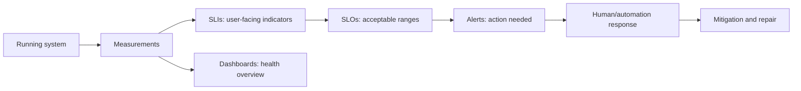
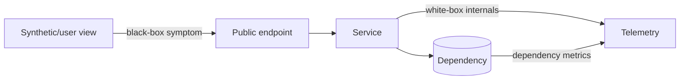
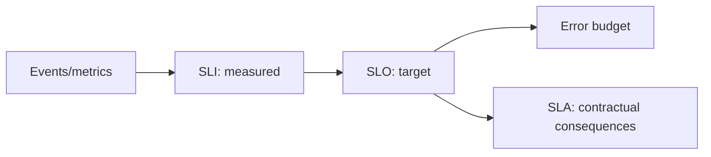
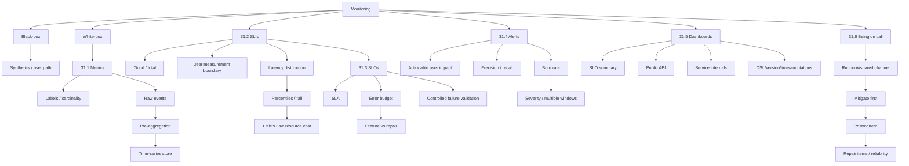

> 本文严格沿原章顺序展开：先区分 black-box/white-box monitoring 与 synthetics，再依次讨论 31.1 Metrics、31.2 Service-level indicators、31.3 Service-level objectives、31.4 Alerts、31.5 Dashboards（含 31.5.1 Best practices）和 31.6 Being on call。重点推导 label cardinality、预聚合、百分位、Little's Law、SLI 比率、error budget、precision/recall 与 burn rate，并复盘 DNS synthetic、长尾线程翻倍、99%/30 天告警、三类 dashboard、事故缓解和 postmortem。文中的 synthetic 内容校验、cardinality budget、SLI denominator policy、chaos 安全边界、离散百分位定义、多窗口与最小样本 burn-rate 策略、availability 换算、incident timeline、dashboard-as-code 细化及 Python 模型均属于工程补充，不应误认为原书指定的监控产品、固定阈值或生产告警策略。

---

## 0. 本章定位：从“系统正在运行”到“用户是否获得了承诺的服务”

### 0.1 Monitoring 的两个主要用途

原章开篇给出两个核心目标：

1. 检测 production 中影响 users 的 failures，并向 human operators 触发 notifications/alerts；
2. 通过 dashboards 提供 system health 的 high-level overview。



这条链把原始 telemetry 转成决策。只收集数据而没有目标、判定和行动，不会形成有效运营反馈环。

### 0.2 与 Chapter 30 的衔接

Chapter 30 的 progressive rollout 需要 health signals 来决定 promote、stop 或 rollback。本章解释这些 signals 如何从 metrics、SLIs、SLOs 和 alerts 构造。

### 0.3 与 Chapter 32 的边界

Monitoring 主要回答：

> 系统健康吗？用户是否受影响？是否需要行动？

下一章 observability 进一步回答：

> 为什么发生？如何深入解释某个未知或 emergent behavior？

Monitoring 擅长发现 symptoms；root-cause debugging 常需 metrics 的下钻以及 logs/traces。

---

## 1. Black-box monitoring：从用户外部观察症状

### 1.1 定义

早期 monitoring 主要报告 service 是否 up，内部发生什么几乎不可见，这叫 black-box monitoring。

它把服务当作只可观察输入/输出的黑盒：

```text
request -> public endpoint -> response/status/latency
```

### 1.2 适用场景

- External dependencies，如 third-party APIs；
- 从外部验证用户感知的 performance/health；
- DNS、routing、TLS、load balancer 等应用内部看不到的路径；
- 低频但重要的 public API。

### 1.3 Synthetics

常见方法是周期运行 scripts（synthetics），向 external API endpoints 发送 test requests，并监测：

- 是否成功；
- 用时多久；
- 返回内容是否正确。

Synthetics 应部署在 users 所在 regions，并访问 users 相同 endpoints，才能覆盖完整公共路径。

### 1.4 DNS 反例

若 service 的 DNS server 宕机：

- Synthetic 无法解析 IP，会立即看到 failure；
- Service 内部可能认为自己完全健康，只觉得 requests 变少。

这说明 self-reported health 不足以代表 user experience。

### 1.5 局限

- Probe frequency 太低会延迟检测；
- Synthetic traffic 与真实用户分布不同；
- Test credential/data 可能特殊；
- Side-effectful APIs 难安全探测；
- 只能显示外部 symptom，难解释内部 root cause。

---

## 2. White-box monitoring：让应用报告内部行为

### 2.1 定义

开发者在 application 中加入 instrumentation，报告 specific features 是否按预期工作，称 white-box monitoring。Statsd 由 Etsy 推广后，使 application-level measurements 的收集更普及。

### 2.2 Black-box 与 white-box 的互补

| 维度 | Black-box | White-box |
| --- | --- | --- |
| 观察位置 | 系统外部 | 系统内部 |
| 擅长 | 检测用户症状 | 缩小 root cause |
| 例子 | Synthetic API probe | Cache hit、DB latency、queue depth |
| 盲区 | 内部细节 | DNS/外部路径/用户真实感知 |



### 2.3 不能二选一

White-box 全绿而 synthetic 失败，可能是 DNS/routing/TLS；synthetic 变慢而内部 DB latency 飙升，二者相关联才能快速定位。

---

## 3. 31.1 Metrics：带时间戳的数值序列

### 3.1 定义

Metric 是 raw measurements（samples）的 time series，用于表示：

- Resource usage，例如 CPU utilization；
- Behavior，例如 failed requests 数。

原章说每个 sample is represented by a floating-point number and a timestamp（由浮点数和时间戳表示）：

$$
sample=(timestamp,value),\qquad value\in\mathbb{R}
$$

Metric 的关键不只是一个值，而是值随时间如何变化。

### 3.2 常见 metric 类型（工程背景）

- Counter：单调累计事件数，如 requests total；
- Gauge：可升降瞬时值，如 queue depth；
- Histogram/distribution：记录值分布，如 latency；
- Summary/quantile：已聚合统计。

原章不依赖具体 telemetry API，但这些语义决定如何正确聚合。

### 3.3 应至少测什么

原章要求 service 至少报告：

- **Load**：request throughput；
- **Internal state**：in-memory cache size；
- **Dependencies**：availability 和 performance，例如 data-store response time。

再与 downstream services 自身 metrics 结合，operators 才能快速识别问题。

### 3.4 Instrumentation 是显式工程工作

有用 metrics 不会自动出现。Developers 必须修改 code，围绕业务/依赖边界做 deliberate instrumentation，并维护名称、labels、单位和语义。

---

## 4. Labels：切片能力与 cardinality 成本

### 4.1 定义

Metric 可附加 key-value labels。原章举出的维度是 region, data center, cluster, or node，例如：

- `region=EastUs2`；
- `datacenter=dc3`；
- `cluster=checkout-prod`；
- `node=node-17`。

Labels 让查询按维度 slice and dice，不必为每种组合手工创建 metric 名称。

### 4.2 每种组合都是独立 time series

若第 $i$ 个 label 有 $c_i$ 个可能值，所有组合都出现时：

$$
SeriesCount=\prod_{i=1}^{k}c_i
$$

例：10 regions、20 endpoints、5 status classes、2 versions：

$$
10\times20\times5\times2=2000
$$

再加入 1,000 tenants，会膨胀到 2,000,000 series。

### 4.3 High-cardinality trap

通常不应把以下作为 metric labels：

- User ID；
- Request ID；
- Full URL with arbitrary IDs；
- Error message/raw stack；
- Unbounded customer-provided value。

这些数据更适合 logs/traces。Metrics 需要高吞吐，所以难以承受高维度。

### 4.4 Cardinality budget

Instrumentation review 应估算：

```text
expected values per label
× environments
× regions
× versions
× retention and sample frequency
```

并对 unknown/unbounded 值归一化或禁止。

---

## 5. HTTP handler：从执行路径反推可回答的问题

### 5.1 原章示例

一个 `get_resource(id)` handler：先查 in-process cache，miss 后远程 repository 读取，再写 cache 并返回。

作者没有从“应该收哪些通用指标”开始，而是逐行问 production 中需要回答什么：

- ID 是否有效？
- Cache hit 吗？
- Resource 在 cache 多久？
- Remote call 为什么失败？
- 是否 timeout？
- Remote latency 多长？
- Cache size 多大？
- Handler 总耗时多久？

### 5.2 分层 instrumentation

```text
request boundary: throughput, status, total latency
validation: invalid ID count
cache: hit/miss, age, size
repository: latency, timeout, error reason
```

这使外部 symptom 可沿调用路径下钻。

### 5.3 不要在每行盲目埋点

过度 instrumentation 会增加：

- Runtime overhead；
- Cardinality；
- Storage/query cost；
- Dashboard noise；
- Semantic maintenance。

先从用户结果、关键资源和 dependency boundaries 反推 signals。

---

## 6. Event-based measurement：保留细节但成本高

### 6.1 Failure event

Handler 每次失败都向 local telemetry agent 报告 event：

```json
{
  "failureCount": 1,
  "serviceRegion": "EastUs2",
  "timestamp": 1614438079
}
```

Agent batch events，周期发送到 remote telemetry service，后者持久化到 event-log store。原章以 Azure Monitor log-based metrics 为例。

### 6.2 Ingestion cost

若事件率 $R$ events/s、每个 event 平均 $s$ bytes：

$$
Bandwidth\approx R\times s
$$

Telemetry load 随 events 线性增长。

### 6.3 Query cost

查询 North Europe 过去一个月 failures，需要获取、过滤、聚合 potentially trillions of events（可能数万亿事件）。Raw events 细节丰富，但大范围聚合昂贵。

### 6.4 Logs 与 metrics 的分工

- Logs/events：保存高维细节，适合调试具体请求；
- Metrics：预聚合数值，适合高吞吐 alerting/visualization。

两者用途不同，不应把所有日志变成 metrics，也不应只留 metrics 删除所有细节。

---

## 7. Pre-aggregation：用信息损失换查询效率

### 7.1 为什么可预聚合

Metrics 是 time series，可使用数学工具按固定 period 聚合，例如：

- 1 minute；
- 5 minutes；
- 1 hour。

每个 bucket 用 sum, average, or percentiles 等 summary statistics 表示。

### 7.2 原章 failure count 示例

Telemetry service 在 ingestion 时按 1 小时、serviceRegion 预聚合：

```text
"00:00", 561
"01:00", 42
"02:00", 61
```

查询月度 North Europe failures 时只需 sum 数百个 hourly samples，而不是扫描全部 raw failure events。

### 7.3 多 resolution

Ingestion service 可同时创建不同 periods 的 pre-aggregates，query 时选择满足分辨率要求且成本最低的版本：

```text
recent incident -> 1-minute buckets
weekly trend -> 1-hour buckets
annual planning -> 1-day buckets
```

原章以 AWS CloudWatch ingestion-time pre-aggregation 为例。

### 7.4 Client + server pre-aggregation

Local telemetry agents 先聚合，可降低 bandwidth、compute、storage；server 再构建更粗 resolution。

假设某 label set 下 $R=10{,}000$ events/s，client 每 60 秒输出一个 aggregate：

$$
RawPointsPerMinute=600{,}000
$$

$$
AggregatedPointsPerMinute=1
$$

这里的 1 是每个 telemetry agent、每组 labels 的输出点数，不是整个 fleet 只产生一个点。代价是失去 event-level detail。

### 7.5 不可逆性

若只保留 1-hour aggregate，之后无法恢复 5-minute pattern。多个完全不同的原始序列可以拥有相同 hourly sum/average。

```text
hourly failures = 60
could mean: one failure each minute
or: all 60 failures in one minute
```

### 7.6 聚合的数学陷阱（工程补充）

Sum 可直接相加。Average 必须保留 `sum` 和 `count`：

$$
\bar{x}=\frac{\sum_i sum_i}{\sum_i count_i}
$$

不能直接平均各 bucket averages，除非 counts 相同。Percentiles 通常也不能直接取“percentile 的 percentile”；需 histogram/sketch 或原始分布近似。

### 7.7 为什么 metrics store 专门化

Metrics 主要用于 alerting 和 visualization，通常以 pre-aggregated form 存入专门支持 efficient time series storage 的 data store，优先吞吐、时间查询和压缩，而非任意高维检索。

---

## 8. 31.2 Service-level indicators：把 metric 提升为用户服务指标

### 8.1 为什么不是每个 metric 都告警

半夜因几分钟前 memory spike 叫醒 operator 通常没有意义：资源变化不一定影响 users，且可能已恢复。

SLI 是特别适合 alerting 的 metric category：衡量 service 向 users 提供的某一方面 service level，例如：

- Response time；
- Error rate；
- Throughput。

SLI 常在 rolling time window 聚合，并用 average/percentile 等 summary statistic 表示。

### 8.2 用户视角是关键

普通 metric 描述系统内部事实；SLI 必须接近 user outcome。

```text
CPU high -> internal condition
successful requests / total -> user-visible availability
requests faster than 200 ms / total -> user-visible latency quality
```

---

## 9. Figure 31.1：Good events / total events

### 9.1 比率定义

原章建议将 SLI 定义为两个 metrics 的 ratio：

$$
SLI=\frac{GoodEvents}{TotalEvents}
$$

前提：$TotalEvents>0$，并明确哪些 events 纳入 denominator。

### 9.2 直觉

- $SLI=0$：被测服务能力完全失效；
- $SLI=1$：全部事件符合期望；
- $0<SLI<1$：部分事件失败或不达标。

归一化到 $[0,1]$ 使不同 traffic volume 下容易解释，也简化 SLO 和 alert 配置。

### 9.3 常见 SLIs

#### Response time SLI

$$
SLI_{latency}=\frac{Requests\ completed\ within\ threshold}{Total\ eligible\ requests}
$$

#### Availability SLI

$$
SLI_{availability}=\frac{Successful\ requests}{Total\ eligible\ requests}
$$

### 9.4 Denominator policy

必须定义：

- Client cancellations 是否算？
- Invalid requests/4xx 是否算？
- Health checks/batch traffic 是否算？
- Retry 每次还是 logical request？
- 无流量时如何处理？

错误 denominator 会让漂亮数值与用户体验脱节。

---

## 10. 在哪里测量：选择最接近用户的边界

### 10.1 Response time 的候选位置

- Service；
- Load balancer；
- Client。

原章的问题原文是：应由 service, load balancer, or clients 中的哪一处测量？

原章原则：选择最能代表 users' experience 的 metric；若成本太高，再选次优候选。

### 10.2 为什么 client 最有意义

Client latency 包含：

- DNS；
- Network path；
- TLS/connect；
- Load balancer；
- Service queue/processing；
- Response transfer。

Service-side latency 会漏掉完整路径的 delay/hiccup。

### 10.3 为什么有时不用 client metric

- Client instrumentation 不可控；
- Sampling/privacy；
- Offline upload 延迟；
- 多 SDK versions；
- Telemetry cost。

可选 edge/load-balancer metric 作为更可收集的 proxy，并用 synthetics 补路径。

---

## 11. 为什么 latency 是分布而不是一个平均数

### 11.1 右偏长尾

Response time 受 network delay、page fault、context switching 等影响。通常多数快、少数极慢，呈 right-skewed and long-tailed distribution。

### 11.2 原章平均数反例

100 个 response times：

- 99 个为 1 second；
- 1 个为 10 minutes = 600 seconds。

平均数：

$$
\bar{x}=\frac{99\times1+1\times600}{100}=6.99s
$$

虽然 99% requests 都是 1 秒，average 却近 7 秒。一个 outlier 即可显著扭曲 mean。

### 11.3 Average 并非无用

Average 对总资源/总时间核算有价值，但它回答“总量均摊”，不回答“多少用户低于某 latency”。应与 percentiles/distribution 共同使用。

---

## 12. Percentiles 与 long-tail latency

### 12.1 定义

$p$th percentile 是有 $p\%$ observations 小于等于它的值。原章以 99th percentile 为例：

$$
p99=1s\Rightarrow99\%\ requests\le1s
$$

离散样本有多种 quantile 插值约定；dashboard 和 SLO 必须使用一致实现。

### 12.2 Nearest-rank（本文代码采用）

排序后 $n$ 个 values，$p\in(0,1]$：

$$
rank=\lceil pn\rceil
$$

$$
P_p=x_{(rank)}
$$

在 99 个 1 秒、1 个 600 秒样本中：

$$
p99=x_{(99)}=1s
$$

而 $p100=600s$。

### 12.3 Long-tail latencies

Upper percentiles，如 p99、p99.9，称 long-tail latencies。占比小却重要：

- 高频用户请求多，更可能碰到 tail；
- Tail 占用 threads/connections；
- Fan-out request 的最慢 dependency 决定整体；
- Timeout/retry 可能放大负载。

### 12.4 商业影响

原章引用研究：a mere 100-millisecond delay in load time 可能 hurt conversion rates by 7 percent。该数值来自特定研究环境，不应泛化为所有产品，但说明 latency 会影响业务。

---

## 13. Little's Law：1% 慢请求为何让线程近乎翻倍

### 13.1 基本公式

$$
L=\lambda W
$$

- $L$：系统平均 in-flight items/threads；
- $\lambda$：arrival/completion rate；
- $W$：平均停留时间。

稳定系统下，10K requests/s 使用约 2K threads：

$$
W=\frac{L}{\lambda}=\frac{2000}{10000}=0.2s=200ms
$$

### 13.2 1% 变成 20 seconds（20 秒）

慢请求率：

$$
\lambda_{slow}=0.01\times10000=100/s
$$

仅慢请求需要 threads：

$$
L_{slow}=100\times20=2000
$$

若其余 99% 仍约 200 ms：

$$
L_{fast}=9900\times0.2=1980
$$

总数约：

$$
L_{total}=3980\approx2\times2000
$$

原章概括为额外 2K threads、总线程数翻倍。

### 13.3 前提与局限

- Arrival rate 稳定；
- Thread-per-request 或等价并发资源；
- 慢请求持续足够久；
- 无 admission/shedding；
- 其余请求 latency 基本不变。

现实中 pool 上限可能先导致 queue/timeout，表现为吞吐下降而不是实际创建 4K threads。

### 13.4 结论

控制 tail latency 不仅改善 UX，也降低资源成本并提高 resiliency。优化 worst case 往往连带改善 average case。

---

## 14. 31.3 Service-level objectives：给 SLI 划定健康区间

### 14.1 定义

SLO 定义一个 SLI 的 acceptable range；SLI 位于该区间时，service 被视为 healthy（Figure 31.2）。

```text
SLI = measured service level
SLO = desired acceptable target/window
```

SLO 向 users 描述 service 正常工作时应如何表现。

### 14.2 完整 SLO 的组成

一个可执行 SLO 至少包含：

- SLI definition；
- Event eligibility；
- Good-event criterion；
- Target；
- Window type/length；
- Measurement source。

例如：

> Rolling window of 1 week 内，endpoint X 的 eligible API calls 至少 99% 在 200 ms 内完成，以 edge metric 计。

### 14.3 Figure 31.2

原图用虚线 SLO threshold 划定 acceptable values；SLI 下穿即在该时间窗口不达目标。

---

## 15. SLO、SLI 与 SLA

### 15.1 SLI

实际测量值，如 99.4% requests 成功。

### 15.2 SLO

内部/对用户的可靠性目标，如 rolling 30 days availability 至少 99.9%。

### 15.3 SLA

Service-level agreement 是 contractual agreement，规定 SLO 未满足时会发生什么，通常包括 financial consequences。

### 15.4 关系



不是每个 SLO 都是 SLA，也不是 SLA 中所有条款都直接等于内部 SLO。

---

## 16. Error budget：允许失败的明确预算

### 16.1 从 target 推导

目标 $S$（如 $0.99$），error-budget ratio：

$$
B=1-S
$$

99% SLO：

$$
B=1-0.99=0.01=1\%
$$

### 16.2 Event-based budget

窗口内 $N$ 个 eligible events，允许 bad events：

$$
BadAllowed=(1-S)N
$$

若一周 1,000,000 calls、目标 99% below 200 ms：

$$
BadAllowed=0.01\times1{,}000{,}000=10{,}000
$$

### 16.3 为什么不是“允许不管失败”

Budget 是有限容错空间，用于在 reliability 与 feature velocity 间做明确权衡。耗尽意味着近期实际用户体验已低于承诺。

### 16.4 Incident impact

Incident 烧掉 20% budget 比烧掉 1% 更重要，因为它消耗了更多有限可靠性余量。该尺度比单看 CPU 或单次 error count 更接近用户影响。

---

## 17. Window 长度与多时间尺度

### 17.1 Rolling window

原章示例使用 rolling week：任意当前时刻都回看最近一周，不按自然周突然 reset。

### 17.2 短窗口

- 迫使团队更快反应；
- 快速暴露近期 regression；
- 对短 spike 敏感；
- Budget 较小、波动更大。

### 17.3 长窗口

- 适合长期投资和项目优先级；
- 平滑短期噪声；
- 可能对快速 outage 反应慢。

### 17.4 多个 SLO windows

原章建议 multiple SLOs with different window sizes，以同时支持短期运营与长期决策。必须避免多个 SLO 互相矛盾或让 stakeholders 不知以谁为准。

### 17.5 Availability 的时间直觉（补充）

若粗略把 30 天视为 43,200 分钟：

| Target | Error budget | 30 天允许不可用时间 |
| --- | --- | --- |
| 99% | 1% | 432 min = 7 h 12 min |
| 99.9% | 0.1% | 43.2 min |
| 99.99% | 0.01% | 4.32 min |

Request-based availability 与 downtime 不完全等价，只有流量稳定等假设下才可近似换算。

---

## 18. SLO 应多严格

### 18.1 太宽松

User-facing issue 发生但 SLO 不变，无法检测和驱动行动。

### 18.2 太严格

工程师为几乎无用户价值的 microoptimizations 消耗大量时间，出现 diminishing returns 和 excessive toil。

### 18.3 为什么 100% 不合理

- 自身系统不可能绝对可靠；
- Last-mile connection 等用户依赖不受 service owner 控制；
- 100% 内部可靠也不等于 100% 用户体验；
- 无 error budget 会让任何变更都不可接受。

### 18.4 原章建议

- 从 comfortable ranges 开始，积累信心后收紧；
- 不只选择今天刚好能达到、未来 load 增长后失效的 target；
- 从 users care about 什么反推；
- 一般 3 nines 以上 availability 成本很高且收益递减；
- SLO 尽可能少而简单；
- 定期 review。

“3 nines”不是普遍上限；生命安全、金融等场景可有不同需求，关键是价值与成本可辩护。

---

## 19. 用现实反馈校准 SLO

### 19.1 Support ticket 反例

若某 user-facing issue 产生大量 support tickets，但所有 SLO 都无 degradation：

- Targets 可能太 relaxed；
- SLI 可能没有捕捉该 use case；
- Measurement boundary 可能离用户太远；
- Denominator 可能稀释受影响 cohort。

SLO 不是一次性配置，应根据真实 incidents 和 user feedback 演化。

### 19.2 Multiple stakeholders 共同约定

- Engineers：targets 可达，且不产生 excessive toil；
- Product managers：targets 能保证 good user experience；
- Operators：signals 可测、可告警、可行动；
- Users/business：承诺有意义。

原章引用 SRE book 的意思是：如果引用某个 SLO 永远无法改变 priority conversation，它就不值得存在。

### 19.3 Reliability policy

若 error budget 烧得过快或耗尽，repair items 应优先于 features，直到恢复 SLO。

---

## 20. SLA 依赖与 chaos testing

### 20.1 Over-reliance 问题

Users/dependent services 可能依赖 service 的实际表现，而不是 documented SLA。例如承诺 99.9%，实际长期 100%，下游便假设永不失败。

### 20.2 Controlled failures

原章建议可周期在 production 注入 controlled failures，也叫 chaos testing，以：

- 确认 dependencies 能承受目标 service level；
- 阻止不现实假设；
- 验证 retries/fallbacks/resiliency mechanisms。

### 20.3 安全边界

Chaos experiment 必须：

- 有 hypothesis；
- 限制 blast radius；
- 有 abort condition；
- 避免耗尽 error budget；
- 通知相关 owners；
- 从小范围开始；
- 监控用户影响。

Chaos 不是随意破坏生产，也不应用于掩盖本可修复的已知故障。

---

## 21. 31.4 Alerts：把 condition 转成 action

### 21.1 定义

Alerting 是 monitoring system 在 specific condition 发生时触发 action 的部分，例如 metric crossing a threshold。

Action 可从：

- Automation，如 restart instance；
- Ticket/working-hours investigation；
- Ring on-call operator's phone。

原章主要讨论 page human operator 的 alerts。

### 21.2 Actionable 是最低要求

Operator 不应先花时间探索 dashboards 才知道 impact/urgency。Alert 应说明：

- 哪个 user outcome 受影响；
- 影响多大；
- 哪个 service/region；
- 应先做什么；
- Dashboard/runbook 链接。

### 21.3 CPU spike 为什么通常不是好 page

CPU high 不一定影响 system；可能是高效利用、短暂 batch 或 autoscaling 前状态。没有用户影响就 page 会产生 noise。

SLO/error budget 更适合 alert，因为它量化 user impact。

---

## 22. Precision 与 recall

### 22.1 Confusion matrix

| | 实际 issue | 实际无 issue |
| --- | ---: | ---: |
| Alert triggered | TP | FP |
| No alert | FN | TN |

### 22.2 Precision

Significant events（actual issues）占全部 alerts 的比例：

$$
Precision=\frac{TP}{TP+FP}
$$

Low precision -> noisy、常不 actionable，operators 失去信任。

### 22.3 Recall

实际 significant events 中成功触发 alert 的比例：

$$
Recall=\frac{TP}{TP+FN}
$$

Low recall -> outage 发生却不告警。

若 $TP+FP=0$（没有 alerts），precision 在数学上未定义；若 $TP+FN=0$（没有 actual positive events），recall 未定义。监控实现应明确 missing/undefined policy，不能未经说明地当成 0 或 1。

### 22.4 Trade-off

提高 threshold/持续时间通常减少 false positives、提升 precision，却可能增加 false negatives/检测延迟、降低 recall。100% precision 与 recall 通常不可同时达到。

### 22.5 告警目标

Page policy 应优化“及时发现需要立即人工行动的 user impact”，而不是检测所有异常。

---

## 23. 99% / 30 天 naive alert 为什么太吵

### 23.1 场景

Availability SLO：99% over 30 days。Naive alert：过去 1 hour availability < 99%。

### 23.2 到触发时烧了多少总 budget

若 1 小时窗口刚好以与 SLO 相同的 1% bad ratio 运行：

$$
BudgetFractionConsumed=
\frac{1\ hour}{30\ days}
=\frac{1}{720}
\approx0.001389=0.14\%
$$

分子/分母中的 1% bad ratio 抵消。

### 23.3 为什么无用

系统从非 100% 健康，总有局部 failure。每烧掉总 budget 的 0.14% 就 page，会产生 high recall、low precision。

### 23.4 延长 condition duration 的问题

可提高 precision，但真实 outage 也会更晚告警。需要同时兼顾消耗速度和检测时间，因此引出 burn rate。

---

## 24. Burn rate：error budget 的消耗速度

### 24.1 原章定义

$$
BurnRate=
\frac{Percentage\ of\ error\ budget\ consumed}
{Percentage\ of\ SLO\ window\ elapsed}
$$

它表示 rate of exhaustion of the error budget（error budget 的耗尽速度）。

### 24.2 用 bad-event ratio 推导

SLO target $S$，允许 bad ratio $B=1-S$；alert window 观察到 bad ratio $e$。在 event-based 近似下：

$$
BurnRate=\frac{e}{1-S}
$$

因为实际 bad rate 与允许 bad rate 的比值，就是 budget 相对消耗速度。

### 24.3 解释

- Burn rate = 1：按当前速度恰好在完整 SLO window 用完；
- Burn rate = 2：用一半 window；
- Burn rate = 3：用三分之一 window；
- Burn rate = 10：用十分之一 window。

对 30 days：

$$
TimeToExhaust=\frac{30\ days}{BurnRate}
$$

因此 rate 2 -> 15 days，rate 3 -> 10 days，rate 10 -> 3 days。

### 24.4 当前窗口消耗

若 burn rate $r$ 持续时间 $w$，SLO window 为 $T$，预算消耗比例近似：

$$
ConsumedFraction=r\frac{w}{T}
$$

99%/30 days 下，1 小时以 burn rate 12 运行：

$$
12\times\frac{1}{720}=1.667\%
$$

### 24.5 流量变化的边界

基于 requests 的 SLO 应优先按 good/total events 计算；把 elapsed time 与 budget 等同比例需要 traffic 相对稳定。低流量窗口样本不足时需 minimum event count。

---

## 25. 多严重度和多窗口 alerts

### 25.1 原章示例

为提高 recall，可设置多个 thresholds：

- Burn rate < 2：low-severity，working hours 调查；
- Burn rate > 10：automated call engineer。

这些是说明多严重度分级的 examples，不是穷尽所有区间的通用固定 policy。本文代码另行采用一个闭合的说明性策略：$r<2$ 不告警，$2\le r\le10$ 建 ticket，$r>10$ page；它不是对原章两条示例的逐字实现。

### 25.2 为什么多窗口更稳（工程补充）

常见设计同时检查：

- Short window：快速发现剧烈 burn；
- Long window：确认持续影响，过滤瞬时 noise。

只有两个窗口都满足时 page，可兼顾 precision/recall。具体阈值应由 SLO window、page urgency、traffic 和历史 incidents 校准。

### 25.3 Sample-size gate

Ratio 在小样本下波动很大。例如 1 个 request 失败即 0% availability。可设置：

```text
minimum total events
AND burn-rate condition
AND duration/multi-window confirmation
```

---

## 26. 非 SLO alerts：已知 failure mode 的临时护栏

### 26.1 原章 memory leak 案例

若 service 有已导致 incident、尚未找到 root cause 的 memory leak，可临时设置 alert：instance 快耗尽 memory 时自动 restart。

### 26.2 为什么允许

已知 failure mode 可被明确识别，且自动动作能阻止用户影响。它是 mitigation，不是问题已解决。

### 26.3 防止临时方案永久化

- Link owner/repair issue；
- 记录触发频率；
- 设置 review/expiry；
- 自动 restart 有 rate limit；
- 保留 dump/debug evidence；
- Root cause 修复后删除 alert。

多数 alerts 应基于 SLO，但并非只能基于 SLO。

---

## 27. 31.5 Dashboards：为实时健康建立共享视图

### 27.1 为什么 dashboard 容易失败

Dashboard 很容易成为 chart dumping ground：

- 被遗忘；
- 价值可疑；
- 命名混乱；
- 时间范围不一致；
- 没有人知道该采取什么行动。

Good dashboards 需要设计和维护，不会偶然产生。

### 27.2 从 audience 反推

第一步不是选 charts，而是确定：

1. Audience 是谁？
2. 他们要做什么决策？
3. 需要哪种粒度？
4. 哪些 charts/metrics 支持该任务？

Figure 31.3 强调 dashboards should be tailored to their audience。原章分类并非行业标准，只是组织思路。

---

## 28. SLO summary dashboard

### 28.1 Audience

跨组织 stakeholders：engineering、product、operations、leadership。

### 28.2 内容

- Current SLIs vs targets；
- Error budget remaining/burn rate；
- Window/trend；
- Affected regions/endpoints；
- Current incidents。

### 28.3 用途

平时展示 overall system health；incident 中量化 user impact，帮助决定优先级和沟通。

### 28.4 不应包含

大量 implementation internals 会使跨团队读者无法理解。需要下钻时链接 Public API/service dashboards。

---

## 29. Public API dashboard

### 29.1 Audience 和用途

Operators 在 incident 中识别 problematic paths。以 endpoint/message path 组织，而非实例内部组件。

### 29.2 Request/message 输入

- Requests received 或 broker messages pulled；
- Request-size statistics；
- Authentication issues；
- Traffic by endpoint/status/region。

### 29.3 Handling

- Request handling duration；
- External dependency availability/response time；
- Queue/wait；
- Retry/timeout。

### 29.4 Response 输出

- Counts per response type；
- Response-size statistics；
- Error classes；
- Completion outcome。

该 dashboard 沿公共请求生命周期组织，便于从 symptom 定位哪条 path 变坏。

---

## 30. Service dashboard

### 30.1 Audience

主要供 owning team 使用，需要理解 implementation details。

### 30.2 内容

- Service-specific internal state/resources；
- Upstream dependencies，如 load balancers、messaging queues；
- Downstream dependencies，如 data stores；
- Cache/pool/thread/queue/shard details；
- Deployment/version/config annotations。

### 30.3 调试入口而非终点

Service dashboard 是 debugging 的 first entry point。Operator 通常：

```text
high-level chart
-> segment metric by bounded labels
-> identify cohort/component
-> inspect raw logs and traces
```

这自然过渡到 Chapter 32 observability。

---

## 31. 31.5.1 Dashboard best practices：配置即代码

### 31.1 为什么 dashboard 会 drift

Metrics 增删、代码变化、多个 pre-production/production environments 都要求 charts 同步。手工更新容易遗漏。

### 31.2 Domain-specific language + version control

原章建议以 DSL 定义 dashboards/charts，像 code 一样 version-control：

- Related code/metric/dashboard 同 PR 更新；
- Review/diff；
- 自动部署多环境；
- Rollback；
- 避免手工误差。

### 31.3 Dashboard test（补充）

可在 CI 验证：metric names 存在、queries parse、units/ranges 合理、links/runbooks 有效、alerts 与 threshold annotations 一致。

---

## 32. Dashboard best practices：布局、时间与密度

### 32.1 重要 charts 放顶部

Dashboard 自上而下渲染/阅读，user impact、SLO、traffic/errors 应优先；深层 internals 后置。

### 32.2 默认 timezone

使用 UTC 等统一 timezone，跨地区人员看同一数据时可准确沟通时间。

### 32.3 相同 time resolution 和 range

同一 dashboard 所有 charts 使用相同 resolution/range，方便视觉关联 anomalies。

原章例子：

- Ongoing incident：1-hour range + 1-minute resolution；
- Capacity planning：1-year range + 1-day resolution。

### 32.4 限制 points 和 metrics 数

过多数据点：下载/渲染慢；过多 series：视觉重叠，异常难发现。

选择与屏幕像素/决策需求匹配的 resolution，而不是展示所有 raw samples。

### 32.5 相近 ranges 放一起

量级大的 metric 会把小 metric 压平。只把 min/max ranges 相似的 metrics 放同图。

原章建议：

- p10、average、p90 一图；
- p0.1、p99.9、min、max 另一图。

这不是固定分组，而是避免尺度遮蔽。

---

## 33. Dashboard annotations 与连续零值

### 33.1 Useful annotations

每个 chart 应包含：

- Description；
- Runbook links；
- Related dashboards；
- Escalation contacts；
- Alert thresholds 的 horizontal lines；
- Relevant deployments 的 vertical lines。

Deployment annotation 让 operator 快速相关“何时开始异常”与“何时变更”。

### 33.2 Error-only metric 的空洞问题

若只在 error 时 emit：

```text
... gap ... one point ... gap ...
```

Operator 无法区分：

- 没有 error；
- Instrumentation/agent/service 停止上报。

### 33.3 原章 best practice

原章建议无 error 时 emit a value of zero，有 error 时发 1（或 count），保持连续 series。还应另有 telemetry freshness/up metric，避免“静默为零”掩盖采集故障。

---

## 34. 31.6 Being on call：可运维性最终落到人

### 34.1 Healthy rotation 的前提

只有 service 从一开始按 reliability 和 operability 设计，健康 on-call rotation 才可能存在。

### 34.2 You build it, you run it

Developers 负责运行自己构建的系统，会被激励去减少 operational toll；他们也熟悉 architecture、brick walls 和 trade-offs，最适合 on call。

这不意味着把组织缺陷和不可控工作无条件转嫁给个人。团队必须提供自动化、文档、合理轮换和管理支持。

### 34.3 On-call 的心理与劳动成本

即使没有 callout，失去正常自由也会引发 anxiety。因此原章主张：

- On-call should be compensated（应获得补偿）；
- 不应期待 on-call engineer 推进 feature work；
- 因为会被 alerts 打断，应允许其改善 dashboards、resiliency 和 on-call experience。

---

## 35. Alert 到 incident collaboration

### 35.1 Alert 最少应提供

- Relevant dashboards；
- Run-book；
- Engineer 应采取的 actions。

能自动化的步骤尽量自动化，因为 machines 擅长精确执行 instructions。

### 35.2 Shared channel

除 false positive 外，operator 的所有 actions 应同步到 global/shared chat：

- 其他 engineers 可参与；
- 跟踪 incident progress；
- 避免重复/冲突操作；
- 更容易 handover。

### 35.3 Timeline 的价值

共享记录形成：

```text
alert -> hypothesis -> action -> result -> mitigation -> recovery
```

既支持协作，也为后续 postmortem 提供事实。

---

## 36. Mitigate first，root cause later

### 36.1 第一目标

收到 alert 后先 mitigate user impact，不是在 production 压力下寻找完美根因。

原章例子：

- 新 artifact 降低 service -> rollback；
- Load 未增加但 service 承载不了 -> scale out。

### 36.2 为什么顺序重要

在 outage 中持续调试：

- 用户损失继续；
- System state 继续恶化；
- Operator 认知负荷高；
- 实验可能扩大 damage。

先执行可逆、已知 mitigation，恢复稳定后再深入。

### 36.3 Mitigation 不等于 closure

Rollback/restart/scale out 只消除 symptom 或恢复服务；必须创建 repair items 并跟进 root cause，否则同类 incident 会重复。

---

## 37. Postmortem 与 reliability priority

### 37.1 Impact 决定分析投入

Incident impact 由 SLO/error budget burn 衡量。烧掉显著 fraction 的 incident 需要 formal postmortem。

### 37.2 Postmortem 目标

- 理解 root cause 和 contributing factors；
- 解释检测/响应为何有效或失效；
- 形成防止复发的 repair items；
- 明确 owners/priorities；
- 改进 tests、alerts、dashboards、runbooks、architecture。

### 37.3 Blameless 不等于无责任（工程补充）

关注系统条件和决策环境，不把原因简化为“某人犯错”；同时 repair items 必须有 owner 和完成责任。

### 37.4 Reliability freeze

若 SLO error budget burned/exhausted，或 alerts spirals out of control，团队应暂停 new features，集中恢复 reliability 和 healthy on-call rotation。

这是 error budget 真正影响 priority 的闭环，否则 SLO 只是 dashboard 装饰。

---

## 38. 可运行 Python 示例：SLI、百分位、burn rate 与线程成本

### 38.1 模拟目标

以下程序仅用 Python 标准库验证：

1. 99 个 1 秒 + 1 个 10 分钟的 average 为 6.99 秒，nearest-rank p99 为 1 秒；
2. Latency SLI（阈值 1 秒）为 0.99；
3. 99% SLO 的 allowed bad ratio 为 0.01；
4. 12% bad ratio 对应 burn rate 12，持续 1 小时消耗 30-day budget 的 1.667%；
5. Illustrative alert policy 将 burn rate 12 分为 page；
6. Little's Law 得到 baseline 2,000 threads、slow-cohort concurrency 2,000、degraded total 3,980；
7. Precision/recall 按 confusion matrix 正确计算；
8. Weighted aggregate 必须合并 sum/count。

它是本文的 deterministic educational model，不是 production percentile sketch 或 SLO platform。

### 38.2 完整代码

```python
from __future__ import annotations

from dataclasses import dataclass
from enum import Enum
from math import ceil, isfinite
import io
import unittest

def ratio(numerator: int, denominator: int) -> float:
    if numerator < 0 or denominator <= 0 or numerator > denominator:
        raise ValueError("invalid ratio counts")
    return numerator / denominator

def nearest_rank_percentile(values: tuple[float, ...],
                            percentile: float) -> float:
    if not values or not isfinite(percentile) or not 0 < percentile <= 1:
        raise ValueError("percentile requires values and 0 < p <= 1")
    if any(not isfinite(value) or value < 0 for value in values):
        raise ValueError("latencies must be finite and non-negative")
    ordered = sorted(values)
    rank = ceil(percentile * len(ordered))
    return ordered[rank - 1]

def latency_sli(values: tuple[float, ...], threshold: float) -> float:
    if (not values or not isfinite(threshold) or threshold < 0 or
            any(not isfinite(value) or value < 0 for value in values)):
        raise ValueError("latencies and threshold must be finite and non-negative")
    good = sum(value <= threshold for value in values)
    return ratio(good, len(values))

def burn_rate(good: int, total: int, target: float) -> float:
    if not isfinite(target) or not 0 < target < 1:
        raise ValueError("target must be between zero and one")
    observed_bad_ratio = 1 - ratio(good, total)
    return observed_bad_ratio / (1 - target)

def budget_fraction_consumed(rate: float,
                             elapsed_hours: float,
                             slo_window_hours: float) -> float:
    if (not all(isfinite(value) for value in
                (rate, elapsed_hours, slo_window_hours)) or
            rate < 0 or elapsed_hours < 0 or slo_window_hours <= 0):
        raise ValueError("invalid budget inputs")
    return rate * elapsed_hours / slo_window_hours

class Severity(str, Enum):
    NONE = "none"
    TICKET = "ticket"
    PAGE = "page"

@dataclass(frozen=True)
class AlertPolicy:
    ticket_rate: float
    page_rate: float

    def classify(self, rate: float) -> Severity:
        if (not all(isfinite(value) for value in
                    (rate, self.ticket_rate, self.page_rate)) or
                rate < 0 or not 0 <= self.ticket_rate < self.page_rate):
            raise ValueError("invalid alert policy")
        if rate > self.page_rate:
            return Severity.PAGE
        if rate >= self.ticket_rate:
            return Severity.TICKET
        return Severity.NONE

@dataclass(frozen=True)
class Aggregate:
    sample_sum: float
    sample_count: int

    def merge(self, other: Aggregate) -> Aggregate:
        if (not isfinite(self.sample_sum) or
                not isfinite(other.sample_sum) or
                self.sample_count < 0 or other.sample_count < 0):
            raise ValueError("aggregate values must be finite and counts non-negative")
        return Aggregate(
            self.sample_sum + other.sample_sum,
            self.sample_count + other.sample_count,
        )

    def average(self) -> float:
        if not isfinite(self.sample_sum) or self.sample_count <= 0:
            raise ValueError("average requires samples")
        return self.sample_sum / self.sample_count

def required_concurrency(rate_per_second: float,
                         latency_seconds: float) -> float:
    if (not isfinite(rate_per_second) or
            not isfinite(latency_seconds) or
            rate_per_second < 0 or latency_seconds < 0):
        raise ValueError("Little's Law inputs must be finite and non-negative")
    return rate_per_second * latency_seconds

def precision_recall(true_positive: int, false_positive: int,
                     false_negative: int) -> tuple[float, float]:
    if min(true_positive, false_positive, false_negative) < 0:
        raise ValueError("confusion counts must be non-negative")
    precision = ratio(true_positive, true_positive + false_positive)
    recall = ratio(true_positive, true_positive + false_negative)
    return precision, recall

class MonitoringTests(unittest.TestCase):
    def test_average_and_p99_show_different_views(self) -> None:
        latencies = (1.0,) * 99 + (600.0,)
        self.assertAlmostEqual(sum(latencies) / len(latencies), 6.99)
        self.assertEqual(nearest_rank_percentile(latencies, 0.99), 1.0)

    def test_latency_sli_is_good_event_ratio(self) -> None:
        latencies = (1.0,) * 99 + (600.0,)
        self.assertEqual(latency_sli(latencies, 1.0), 0.99)

    def test_burn_rate_normalizes_bad_ratio(self) -> None:
        self.assertAlmostEqual(burn_rate(880, 1000, 0.99), 12.0)

    def test_budget_fraction_uses_window_fraction(self) -> None:
        consumed = budget_fraction_consumed(12.0, 1.0, 30.0 * 24.0)
        self.assertAlmostEqual(consumed, 1.0 / 60.0)

    def test_alert_policy_and_numeric_boundaries(self) -> None:
        policy = AlertPolicy(ticket_rate=2.0, page_rate=10.0)
        self.assertIs(policy.classify(12.0), Severity.PAGE)
        self.assertIs(policy.classify(3.0), Severity.TICKET)
        self.assertIs(policy.classify(1.0), Severity.NONE)
        not_a_number = float("nan")
        with self.assertRaises(ValueError):
            policy.classify(not_a_number)
        with self.assertRaises(ValueError):
            budget_fraction_consumed(not_a_number, 1.0, 720.0)
        with self.assertRaises(ValueError):
            nearest_rank_percentile((1.0, not_a_number), 0.99)
        with self.assertRaises(ValueError):
            latency_sli((1.0, -1.0), 1.0)
        with self.assertRaises(ValueError):
            latency_sli((1.0,), not_a_number)

    def test_littles_law_tail_cost(self) -> None:
        baseline = required_concurrency(10000.0, 0.2)
        slow = required_concurrency(100.0, 20.0)
        remaining_fast = required_concurrency(9900.0, 0.2)
        self.assertEqual((baseline, slow, remaining_fast),
                         (2000.0, 2000.0, 1980.0))

    def test_precision_and_recall(self) -> None:
        precision, recall = precision_recall(90, 10, 30)
        self.assertEqual(precision, 0.9)
        self.assertEqual(recall, 0.75)

    def test_weighted_aggregate_keeps_sum_and_count(self) -> None:
        small = Aggregate(100.0, 100)
        large = Aggregate(900.0, 300)
        self.assertEqual(small.merge(large).average(), 2.5)

def main() -> int:
    suite = unittest.defaultTestLoader.loadTestsFromTestCase(MonitoringTests)
    result = unittest.TextTestRunner(
        stream=io.StringIO(), verbosity=0
    ).run(suite)
    if not result.wasSuccessful():
        return 1

    latencies = (1.0,) * 99 + (600.0,)
    average = sum(latencies) / len(latencies)
    p99 = nearest_rank_percentile(latencies, 0.99)
    sli = latency_sli(latencies, 1.0)
    rate = burn_rate(880, 1000, 0.99)
    consumed = budget_fraction_consumed(rate, 1.0, 30.0 * 24.0)
    severity = AlertPolicy(2.0, 10.0).classify(rate)
    baseline = required_concurrency(10000.0, 0.2)
    slow_concurrency = required_concurrency(100.0, 20.0)
    degraded = required_concurrency(9900.0, 0.2) + slow_concurrency

    print(
        f"tests run={result.testsRun} failures={len(result.failures)} "
        f"errors={len(result.errors)}"
    )
    print(
        f"latency average_s={average:.2f} p99_s={p99:.2f} "
        f"good_ratio={sli:.4f}"
    )
    print(
        f"slo target=0.9900 burn_rate={rate:.2f} "
        f"budget_spent_1h={consumed:.4%} alert={severity.value}"
    )
    print(
        f"threads baseline={baseline:.0f} "
        f"slow_concurrency={slow_concurrency:.0f} "
        f"degraded_total={degraded:.0f}"
    )
    return 0

if __name__ == "__main__":
    raise SystemExit(main())
```

### 38.3 预期输出

```text
tests run=8 failures=0 errors=0
latency average_s=6.99 p99_s=1.00 good_ratio=0.9900
slo target=0.9900 burn_rate=12.00 budget_spent_1h=1.6667% alert=page
threads baseline=2000 slow_concurrency=2000 degraded_total=3980
```

### 38.4 代码与原理对应

| 代码 | 本章概念 |
| --- | --- |
| `nearest_rank_percentile` | 明确离散 percentile 规则 |
| `latency_sli` | Good events / total events |
| `burn_rate` | Observed bad ratio / allowed bad ratio |
| `budget_fraction_consumed` | $r\times w/T$ |
| `AlertPolicy` | 示例性 burn-rate 分级，不是原书固定 policy |
| `Aggregate.merge` | Pre-aggregation 保留 sum/count |
| `required_concurrency` | Little's Law $L=\lambda W$ |
| `precision_recall` | Alert quality trade-off |

### 38.5 示例局限

- Latencies 全量存内存，production 需 histogram/sketch；
- Nearest-rank 只是众多 percentile conventions 之一；
- Burn rate 假设 denominator/eligible events 定义正确；
- 未实现 rolling-window storage、late events 和 missing data；
- Alert thresholds 2/10 是说明性 policy；
- 无 alerts 或无 actual positives 时 precision/recall 未定义，示例会拒绝零分母；
- 无 multi-window confirmation/minimum sample；
- Thread model 忽略 queue、async I/O 和 pool cap；
- 没有 synthetic、telemetry transport、dashboard 或 on-call 系统。

因此程序验证计算关系，不是生产 monitoring backend。

---

## 39. 容易混淆的概念

### 39.1 Monitoring 与 observability

Monitoring 判断健康/告警；observability 还支持解释未知内部状态与 root cause。后者是下一章主题。

### 39.2 Black-box 与 white-box

Black-box 从外部看 symptom；white-box 从内部看 component behavior。二者互补。

### 39.3 Metric 与 event/log

Metric 是预聚合数值 time series；event/log 保留高维离散细节。查询成本与用途不同。

### 39.4 Label 与 metric name

Label 提供维度，但每种组合创建 series；不是免费 metadata。

### 39.5 Average 与 percentile

Average 衡量总量均摊；percentile 描述一定比例 observations 的上界。都不能单独还原完整分布。

### 39.6 SLI 与普通 metric

SLI 衡量用户获得的 service level；CPU/cache size 只是内部 metric。

### 39.7 SLO 与 SLA

SLO 是目标；SLA 是未达目标时有 contractual consequences 的 agreement。

### 39.8 Error budget 与错误配额

Budget 是目标允许的有限坏事件空间，不是鼓励主动制造无价值 errors。

### 39.9 Error-budget consumption 与 burn rate

Consumption 是已花掉多少；burn rate 是花费速度。相同 consumption 可由短时剧烈 outage 或长期轻微 degradation 造成。

### 39.10 Alert 与 dashboard

Alert 主动触发 action；dashboard 被动提供 context/overview。不能要求 operator 全天盯 dashboard 代替 alert。

### 39.11 Mitigation 与 root-cause fix

Mitigation 先恢复服务；fix 防止复发。两者都必须完成。

### 39.12 Synthetic 与 canary

Synthetic 是主动外部 probe；release canary 是让少量真实生产流量经过新版本。名称偶有重叠但目的不同。

---

## 40. 常见误区与失败模式

### 40.1 “Process up 就是服务健康”

DNS/edge/用户路径可能失败。加入 black-box synthetics。

### 40.2 “内部 metrics 绿就不可能有事故”

White-box 不能覆盖外部 connectivity 和未埋点行为。

### 40.3 “Label 越多越容易排障”

High cardinality 可能先压垮 telemetry system。Metrics 保持 bounded dimensions，细节放 logs/traces。

### 40.4 “保留 hourly average 后可任意下钻”

Pre-aggregation 不可逆；没有 raw events 就无法恢复 5-minute pattern。

### 40.5 “直接平均 averages”

不同 sample counts 时错误。必须合并 sum/count。

### 40.6 “Percentiles 可直接跨机器求平均”

平均 p99 通常不是全局 p99。合并 histograms/sketches 或原始分布。

### 40.7 “所有 metrics 都应 page”

资源 spike 未必有 user impact。Page 以 SLO/actionable conditions 为主。

### 40.8 “Average latency 正常就代表用户都快”

Long tail 可伤害高频用户并耗尽 threads。

### 40.9 “p99=1s 表示最慢请求 1s”

仍有 1% 可更慢；还要看 p99.9/max 和样本量。

### 40.10 “从 service 内测 latency 最准确”

对 service processing 准确，对 user experience 不完整。选择 measurement boundary 要符合 SLI 目的。

### 40.11 “100% 是最好的 SLO”

不可实现、无 budget、导致停滞，而且不保证用户全路径 100%。

### 40.12 “今天能达到就设为 target”

未来 load 后可能不可达。应从 user needs 与可持续工程成本反推。

### 40.13 “SLO 越多覆盖越全面”

过多目标稀释注意力、相互冲突。用少量能代表 desired service level 的 SLO。

### 40.14 “短窗口 availability 低于 SLO 就 page”

可能只烧掉总 budget 的极小比例。使用 burn rate、多窗口和 sample gate。

### 40.15 “提高 alert duration 总能降噪”

会增加真实 outage 检测延迟。Precision/recall 需共同权衡。

### 40.16 “Dashboard 多放图总有帮助”

会降低可读性和加载速度。按 audience/task 精简。

### 40.17 “没有点就表示零错误”

也可能 telemetry 停止。持续 emit zero，并监测 freshness。

### 40.18 “收到 page 先找根因”

先 mitigate user impact，再稳定环境中调查和修复。

### 40.19 “Rollback 后 incident 已完成”

只恢复服务；仍需 root cause、repair items、postmortem。

### 40.20 “On-call 可以顺便正常做 feature”

Interruptions 与压力使其不现实。应补偿并允许改善 operational experience。

---

## 41. 如何设计 monitoring system

### 第一步：从关键 user journeys 开始

列出 users 关心的 availability、latency、correctness、throughput，而不是从 CPU 指标清单开始。

### 第二步：部署外部 synthetics

覆盖用户 regions、DNS/TLS/routing/public endpoints，并安全处理 side effects。

### 第三步：沿请求路径 instrument

Request boundary、cache、queue、dependency、state/resource，记录 bounded labels、统一单位。

### 第四步：制定 cardinality budget

估算 label combinations，禁止 unbounded values，明确 retention/sample resolution。

### 第五步：设计预聚合

为 sum 保留可加性；average 保留 sum/count；latency 使用可合并 histogram/sketch；按 incident/trend/capacity 需要保留多 resolutions。

### 第六步：定义 SLIs

明确 good event、eligible total、measurement boundary、rolling window 和 missing-data semantics。

### 第七步：与 stakeholders 制定 SLO

从 user needs 反推 target；确保工程可达、产品有意义、运营可执行；保持少而简单。

### 第八步：建立 error-budget policy

定义 burn/exhaustion 时 feature 与 repair priority 如何变化，并在 incidents 中真正执行。

### 第九步：设计 burn-rate alerts

按 urgency 设置 thresholds/windows/minimum samples；大多数 pages 基于 user-impact SLO，已知 failure-mode alerts 标记为临时。

### 第十步：按 audience 创建 dashboards

SLO summary -> Public API -> Service internals；提供一致时间轴、deploy annotations 和下钻链接。

### 第十一步：Dashboard/config as code

Metric、alert、dashboard、runbook 与代码同 PR review/version/deploy，避免环境 drift。

### 第十二步：建设健康 on-call

Compensation、无 feature expectation、actionable alerts、runbooks、shared incident channel 和自动化。

### 第十三步：Mitigate -> learn -> repair

先 rollback/scale/failover，再 postmortem；error-budget impact 决定分析深度，repair items 有 owner。

---

## 42. 作者如何形成解决思路

### 42.1 从“up/down”走向双视角

Black-box 捕捉 user symptom，white-box 揭示内部原因；DNS 例子证明只靠 self-report 会漏事故。

### 42.2 从 instrumentation 问题走向 metrics

逐行分析 handler，确定要回答的问题，再用 labels 组织维度；随即指出 cardinality 成本。

### 42.3 从 raw events 的成本走向预聚合

Event detail 丰富，但 ingest/query 万亿事件昂贵；time-series summary 降成本，同时明确不可逆的信息损失。

### 42.4 从“所有 metric”收缩到用户 SLI

Memory spike 不值得 page；good/total ratio 把复杂内部状态转成 $[0,1]$ 用户服务质量。

### 42.5 从测什么推进到在哪里测

Response time 在 service/LB/client 含义不同；优先最能代表 user experience 的 boundary。

### 42.6 从 average 的失真推进到 percentiles

99×1s + 1×600s 使 average 6.99s，却不能描述 99% 用户；percentile 直接表达比例边界。

### 42.7 从用户 tail 推到系统资源

Little's Law 证明 1% 的 20s 请求可额外占 2K threads，连接 UX、resiliency 与 cost。

### 42.8 从 SLI 推到 SLO/error budget

目标区间定义健康，budget 把“不可能 100%”转成可管理容错空间，并驱动 feature/repair priority。

### 42.9 从 naive threshold 推到 burn rate

1-hour <99% 只烧 30-day budget 的 0.14%，直接 page 太吵；按消耗速度分级兼顾 detection 与 noise。

### 42.10 从 metrics 展示推到 audience-specific dashboards

Stakeholders、API operators、service owners 问题不同，所以 charts 必须从 audience/task 反推。

### 42.11 从 alert 推到人和组织闭环

Actionable alert -> runbook/shared channel -> mitigate -> postmortem -> repair priority，最终让 monitoring 改变系统和团队行为。

---

## 43. 知识结构



---

## 44. 核心结论

1. **Monitoring 主要检测 user-impacting failures、触发 alerts，并通过 dashboards 展示 health。**
2. **Black-box 从用户外部看 symptoms，white-box 通过 instrumentation 看内部 behavior/root-cause clues。**
3. **Synthetics 应从用户 regions 访问相同 public endpoints，可发现 DNS 等内部看不到的问题。**
4. **Metric 是 timestamped numeric samples 的 time series，可带 labels。**
5. **每种 label combination 都是独立 series；high cardinality 会放大 storage/query 成本。**
6. **Service 至少应测 load、internal state、dependency availability/performance。**
7. **Raw events 保留细节但 ingestion/query 昂贵；pre-aggregation 用信息损失换效率。**
8. **Client/server 多 resolution 聚合降低 bandwidth、compute、storage，但粗 bucket 无法恢复细粒度。**
9. **SLI 衡量用户获得的某一 service level；最佳形式通常是 good events / total events。**
10. **Response-time SLI 是 threshold 内 requests 比率，availability SLI 是 successful/total。**
11. **Measurement boundary 应优先代表 users' experience，client metric 通常最完整。**
12. **Latency 右偏长尾；average 无法表达多少用户落在某阈值内。**
13. **99×1s + 1×600s 的 average 是 6.99s，而 nearest-rank p99 仍为 1s。**
14. **Upper percentiles 是 long-tail latency；高频重要用户更容易遇到 tail。**
15. **Little's Law 表明 10K req/s 中 1% 变 20s，可额外占约 2K threads。**
16. **SLO 为 SLI 定义 acceptable range、target 和 window；SLA 还规定未达标后果。**
17. **Error budget 为 $1-SLO$，把不可避免的 failures 转成有限、可管理预算。**
18. **短 SLO windows 驱动快速修复，长 windows 支持长期投资；可组合多个时间尺度。**
19. **SLO 应从 users care about 反推，从舒适目标开始，保持少而简单并定期校准。**
20. **100% reliability 不现实，也不等于用户端到端 100% 可靠。**
21. **SLO/error budget 必须真实改变 feature 与 repair priorities 才有价值。**
22. **Controlled failures 可验证 dependencies 没有依赖超出 documented service level 的实际表现。**
23. **Alert 必须 actionable；CPU spike 等内部症状通常不应直接 page。**
24. **Precision 衡量 alerts 中真问题比例，recall 衡量实际问题被告警覆盖比例，两者需权衡。**
25. **99%/30-day SLO 的 1-hour naive threshold 刚触发时只烧约 0.14% 总 budget。**
26. **Burn rate 是 budget 消耗比例除以窗口经过比例，也可写成 observed bad ratio / allowed bad ratio。**
27. **Burn rate 1/2/3 分别意味着在 30/15/10 days 耗尽 30-day budget。**
28. **多 thresholds/windows 可兼顾 alert precision、recall 与 detection speed。**
29. **已知 memory leak 的 resource alert 可作临时 mitigation，但不能替代 root-cause fix。**
30. **Dashboard 应从 audience/task 反推，分为 SLO summary、Public API、Service 等层次。**
31. **Dashboards 应 version-controlled，顶部放重要 charts，统一 timezone/range/resolution，限制数据密度。**
32. **Threshold/deployment annotations 与连续 zero emission 能显著改善 incident interpretation。**
33. **健康 on-call 需要 actionable alerts、runbooks、compensation，且不期待 feature progress。**
34. **Incident 响应应先 mitigate（rollback/scale），稳定后再 root cause analysis。**
35. **高 error-budget impact incidents 需要 formal postmortem 和有 owner 的 repair items。**
36. **Budget 耗尽或 alerts 失控时，团队应暂停 features，集中恢复 reliability。**

---

## 45. 解决问题的一般思路

### 45.1 从用户结果反推信号

先定义“用户认为好”的 outcome，再确定 SLI、measurement boundary 和内部 diagnostic metrics。

### 45.2 用外部和内部证据交叉验证

Synthetic 证明全路径症状，white-box metrics 缩小 component/dependency；单一视角不作为健康真相。

### 45.3 把数据成本当设计约束

Labels、sample rate、retention、resolution 都有乘法成本；bounded metrics + high-dimensional logs/traces 分工。

### 45.4 只在可接受损失下预聚合

明确未来需要的最细 query；保留 sum/count 或 mergeable distributions，不假设 aggregate 可逆。

### 45.5 用比率消除流量规模干扰

Good/total 把服务质量归一化，但 denominator policy 必须代表 eligible user events。

### 45.6 用分布和 tail 代替单一 average

Percentiles 连接 user cohorts，Little's Law 连接 tail 与系统 capacity，形成优化优先级。

### 45.7 把可靠性目标变成预算

$1-SLO$ 明确可容忍失败；用 budget consumption 衡量 incident impact、协调 product/reliability。

### 45.8 用速度而非单点阈值告警

Burn rate 表达“照此速度多久耗尽”，多 severity/window/sample gate 平衡 noise 与 detection。

### 45.9 所有 page 必须映射到行动

Alert 附 impact、dashboard、runbook、owner；不能行动的 metric 留在 dashboard 或 ticket。

### 45.10 为受众设计信息层级

SLO summary 回答影响，Public API 回答路径，Service dashboard 回答内部；逐层下钻到 logs/traces。

### 45.11 把人纳入可靠性系统

On-call 的压力、compensation、handover 和无 feature expectation 都是系统设计，不是个人问题。

### 45.12 先止损，再学习并改变系统

Mitigate -> shared timeline -> root cause -> postmortem -> repair items -> SLO/alert/dashboard/architecture 更新。

最终方法可压缩为：

```text
start from critical user journeys and outcomes
-> probe the public path with regional synthetics
-> instrument request, state, and dependency boundaries
-> bound label cardinality and choose aggregation resolutions deliberately
-> define SLIs as eligible good events over total events
-> measure as close to the user as practical
-> preserve latency distributions and inspect the long tail
-> turn SLI targets into explicit SLO error budgets
-> let budget consumption drive feature-versus-repair priorities
-> page on actionable user impact and error-budget burn rate
-> tailor version-controlled dashboards to stakeholder, API, and service audiences
-> support on-call engineers with compensation, runbooks, and shared incident channels
-> mitigate first, then use postmortems and repair items to prevent recurrence
```
