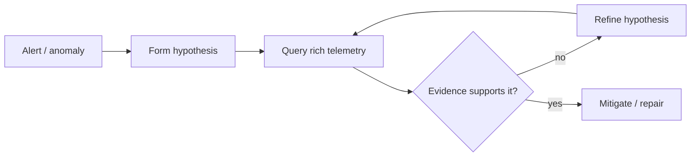
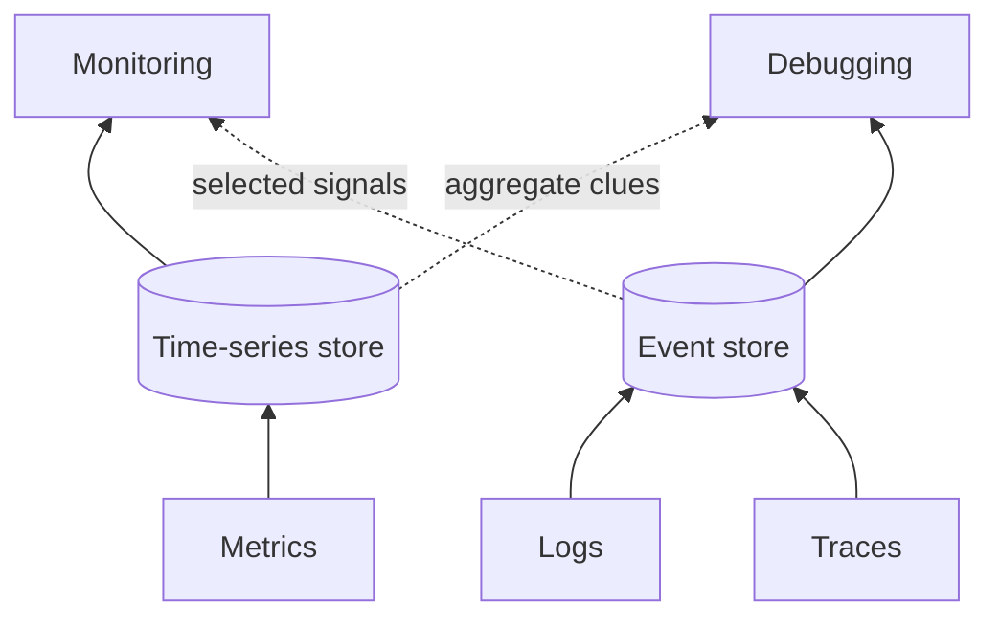
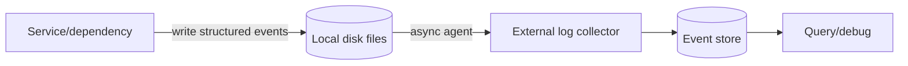
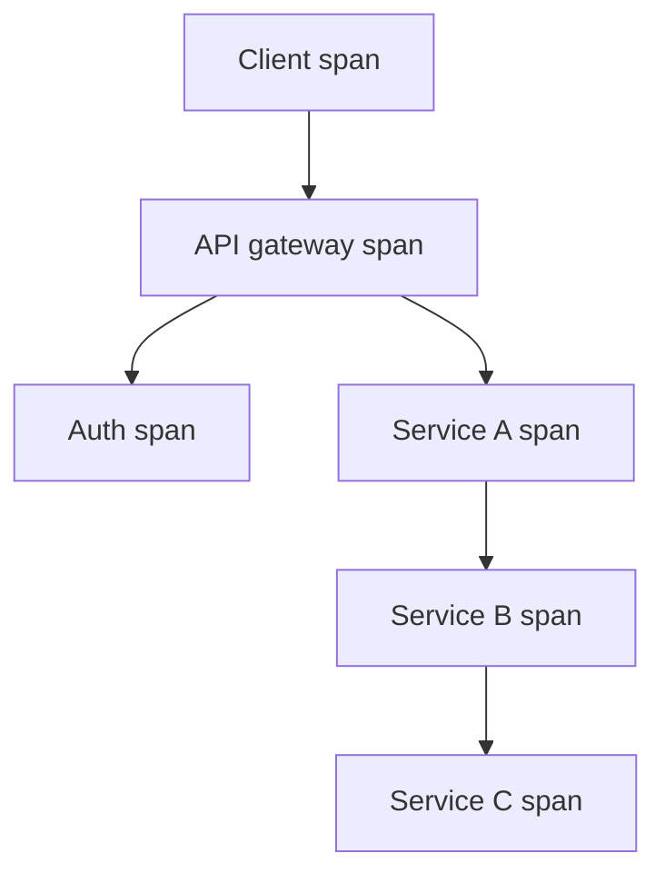
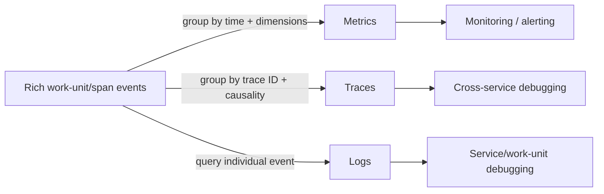
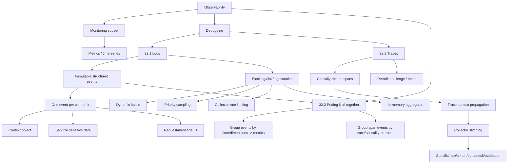

> 对应原文：Understanding Distributed Systems 2nd edition.md
>
> 本文严格沿原章顺序展开：先解释 distributed system 的 emergent behaviors、operator 的 hypothesis-driven debugging，以及 observability 为什么是 monitoring 的超集；随后依次讨论 32.1 Logs、32.2 Traces、32.3 Putting it all together。重点覆盖 structured events、异步日志管道、one wide event per work unit、context object、敏感数据清洗、request ID 关联、logging levels、sampling、collector rate limiting、trace/span、trace ID 传播、collector stitching、resource attribution，以及 metrics/traces 作为 event logs 的派生视图。文中的成本公式、采样完整性概率、trace validation、关键路径说明、schema/retention 策略和 Python 模型是工程补充，不应误认为原书指定的 telemetry schema、采样算法或 observability 产品。

---

## 0. 本章定位：Monitoring 发现“坏了”，Observability 帮助回答“为什么”

### 0.1 与 Chapter 31 的衔接

Chapter 31 建立了：

```text
metrics -> SLIs -> SLOs/error budgets -> alerts -> on-call response
```

它能告诉 operator：用户是否受影响、影响多大、是否需要行动。但 alert 与 dashboard 往往只能暴露 symptom，例如 latency variance 上升，不能自动解释具体哪个请求、哪条调用链、哪个内部状态导致问题。

### 0.2 本章的问题

> 当生产系统出现无法预先穷举的行为时，如何快速提出并验证 root-cause hypothesis？

作者的答案不是“预先为每种故障建一个 dashboard”，而是保留足够细粒度、上下文丰富且可关联的 telemetry，使未知问题发生后仍能查询。



### 0.3 核心衡量标准

原章说，好的 observability platform strives to minimize the time it takes to validate hypotheses，即应尽量缩短：

$$
TimeToValidateHypothesis
$$

这比“收集了多少 GB 日志”更接近目的。数据很多但不能关联、搜索或解释，仍然不可观测。

---

## 1. 分布式系统为什么总有未知行为

### 1.1 A distributed system is never 100% healthy

任意时刻总有某些 component/request/failure 正在发生。Relaxed consistency models 和 resiliency mechanisms like rate limiting, retries, and circuit breakers 可以容忍 failure，却也增加状态和交互复杂性。

### 1.2 Emergent behaviors

多个本身合理的机制组合后，可能出现无法在设计阶段预测的 behavior：

- Retry 与 timeout 形成 load amplification；
- Partial degradation 只影响特定 shard/tenant/version；
- Cache、queue 与 fallback 产生长尾；
- Rare interleavings 在生产规模出现；
- 一次请求跨多服务，局部都“正常”但端到端慢。

### 1.3 人仍是运营系统的一部分

许多 mitigation 可自动化，但 human operators 仍是运营系统的基础部分：对未知 failure 做 root-cause debugging，提出 hypothesis、寻找证据、排除解释、形成修复。

---

## 2. 作者的引导案例：response-time variance 缓慢上升

### 2.1 观察

Operator 发现数周内 response-time variance 缓慢但稳定上升，意味着部分 requests 越来越慢。

### 2.2 关联

Variance increase 与 traffic increase 相关。

### 2.3 Hypothesis

Service 可能接近某个 constraint，例如 resource limit。

### 2.4 为什么 metrics/charts 不够

聚合图能支持“何时开始、与什么相关”，却不能回答：

- 慢的是哪些 request IDs/users/regions？
- 它们命中了哪些 instances/shards？
- 哪个 downstream call 占时？
- 当时配置、版本、cache state 是什么？
- 同一请求跨服务发生了什么？

验证这些问题需要高维事件与跨服务因果关联。

---

## 3. Observability 的定义

### 3.1 原章定义

Observability 是一组工具，为 production system 提供 granular insights，使 operator 能理解 emergent behaviors。

### 3.2 Rich context 的必要性

未知问题的关键字段事先不可完全预测。因此 event 需要保留 rich context，支持事后按任意有界维度切分：

- Request/message identity；
- User/tenant 的安全标识；
- Region/instance/version；
- Operation/outcome；
- Dependency/status/duration；
- Feature/config state。

这与低维、预聚合 metrics 的设计目标不同。

### 3.3 Observability 不是“自动理解一切”

它提高提出和验证 hypothesis 的能力，但仍受以下限制：

- 未 instrument 的事实不可查询；
- Sampling 可能丢失稀有事件；
- Context propagation 可能断裂；
- Sensitive data 不可任意保留；
- Storage/query 有成本；
- Operator 仍需 domain knowledge。

---

## 4. Figure 32.1：Observability 是 Monitoring 的超集

### 4.1 Observability is a superset of monitoring

$$
Monitoring\subset Observability
$$

Monitoring 聚焦 tracking system health；observability 还包括理解与调试系统。

### 4.2 图中的两类 store

Figure 32.1 将 metrics, event logs, and traces 与两类 store 联系起来：



- Metrics/time-series data stores：high throughput，但 struggle with high dimensionality；
- Logs/traces/event store：支持 high-dimensional data，但 struggle with high throughput；
- Metrics 主要用于 monitoring；
- Event logs/traces 主要用于 debugging。

原图的虚线也提示边界不是绝对：metrics 可辅助 debug，events 也可派生监控信号。

### 4.3 为什么不能只选一种 store

如果全用 event store 承载每秒海量聚合查询，成本与吞吐困难；如果全压成 metrics，未知问题所需的 request-level context 已不可逆丢失。

---

## 5. 三种 telemetry 的职责

| Telemetry | 典型单位 | 优化问题 | 主要代价 |
| --- | --- | --- | --- |
| Metric | 时间桶中的统计值 | 系统整体是否异常？趋势如何？ | 低维、失去个体细节 |
| Log event | 单个服务的一个工作单元/事件 | 该工作单元内部发生什么？ | 高维、量大、低 signal-to-noise |
| Trace | 单请求的 causally-related spans | 请求跨服务如何流动？瓶颈在哪？ | 全链路传播、采样、组装成本 |

它们不是互相替代，而是面向不同查询的逻辑抽象/派生视图；这不要求它们在物理上都先由同一份 raw events 物化生成。

---

## 6. 32.1 Logs：带时间戳事件的不可变序列

### 6.1 定义

Log 是随时间发生的 time-stamped events 的 immutable list。这里的 immutable 指已记录事实不应被原地修改；修正通常通过追加新事件或数据治理流程完成。

### 6.2 Event formats

- Free-form text；
- Structured textual format，如 JSON；
- Structured binary format，如 Protobuf。

Structured event 通常是 bag of key-value pairs：

```json
{
  "failureCount": 1,
  "serviceRegion": "EastUs2",
  "timestamp": 1614438079
}
```

### 6.3 为什么 structured 优于 free-form

```text
text: "request failed for user 42 in EastUs2"
structured: {"outcome":"failure","user_id":"42","region":"EastUs2"}
```

Structured fields 可稳定过滤、聚合、校验 schema，并减少 fragile regex parsing。Free-form text 简单，但字段命名和类型不稳定。

### 6.4 Schema 演进（工程补充）

Structured 不等于 schema 永不变化。应：

- 版本化 event schema；
- 新增 optional fields；
- 保持字段语义/单位；
- Consumer 容忍 unknown fields；
- 对 breaking changes 做迁移。

---

## 7. Log 的来源与传输管道

### 7.1 来源

- Application services；
- Message brokers, proxies, data stores；
- Operating/runtime infrastructure。

### 7.2 原章管道



原章举例：ELK stack、AWS CloudWatch Logs。

### 7.3 为什么 asynchronous

Request critical path 不应同步等待 remote collector。异步 agent 将 application 与 collector latency/outage 隔离。

但异步也意味着：

- Process/disk crash 可能丢尚未发送日志；
- Backlog 占磁盘；
- Collector outage 需要 backpressure/drop policy；
- “日志已调用”不等于已持久化。

---

## 8. Logs 对 debugging 的价值

### 8.1 从 symptom 回溯 root cause

例如 service instance crash：从 crash event 找 instance/version/request，查询之前的 resource、dependency 和 error context。

### 8.2 解释 metrics 看不到的 long-tail behaviors

Average/p99 只能说明某比例慢，不能解释具体 request 为什么失败或慢。Request-level event 可显示：

- Cache miss；
- Specific shard；
- Retry count；
- Downstream status；
- Payload class；
- Feature flag/version。

### 8.3 前提

价值依赖 proper instrumentation。若只写“error happened”，缺少 request/dependency/context，日志量再大也无法验证 hypothesis。

---

## 9. Logging 的运行时风险

### 9.1 Blocking overhead

同步写 disk/remote 会增加 request latency；logging library 若 block while writing to disk，会在 I/O 变慢时把 telemetry 故障传播到业务路径。

### 9.2 Disk exhaustion

If the disk fills up due to excessive logging：

- 最好情况：丢 logs；
- 最坏情况：service instance 无法正常工作。

### 9.3 Volume model（工程补充）

设 work-unit rate $R$ events/s、平均 event size $S$ bytes、保留时间 $T$ seconds、复制因子 $k$：

$$
DailyIngest=R\times S\times86400
$$

$$
StoredBytes\approx RSTk
$$

例：10,000 events/s、2 KB/event；这里按十进制 $2\ KB=2{,}000\ bytes$ 计算：

$$
DailyIngest\approx1.728\ TB/day
$$

未计索引、压缩、metadata 和 query replicas。

### 9.4 Telemetry 不应击穿被观察系统

Observability path 必须 bounded：async buffers、disk quota、drop/sampling、collector rate limits。故障时优先保护业务，但要可观测地记录 telemetry dropped count。

---

## 10. Logging 的平台成本与 signal-to-noise

### 10.1 后端成本

Ingest、process、index、store 大量高维 events 均昂贵，无论自建还是 third-party service。

Structured binary logs 比 text 更高效，但 high dimensionality 仍使索引和查询昂贵。

### 10.2 Low signal-to-noise ratio

Logs fine-grained、service-specific。绝大多数正常事件可能与当前 incident 无关，engineer 要从海量信息中提取少数信号。

### 10.3 目标不是“记录一切”

应保留有诊断价值的上下文，同时控制 volume、敏感性、retention 和可查询性。无法被使用的数据只是成本和风险。

---

## 11. Logs best practice：一个 work unit 一个 rich event

### 11.1 Work unit

通常对应：

- 一个 request；
- 从 queue 拉取的一条 message。

### 11.2 原章建议

与该 work unit 有关的数据应 collate 到 single event。代码路径传递一个 context object，逐步构建 event，work unit 结束时统一发出。


### 11.3 为什么比多行日志好

传统方式：

```text
request started
cache miss
database timeout
request failed
```

需要按 request ID join 多条记录，还可能缺失/乱序。Single event 把同一 work unit 的事实放在一行/对象中，减少 joins，提高单次查询的信息密度。

### 11.4 Wide event 不等于无限字段

仍要控制 schema、字段类型、size、cardinality 和 privacy。大型 payload/body 不应直接塞入 event。

---

## 12. Work-unit event 应包含什么

原章要求：

- Who created it；
- What it was for；
- Succeeded or failed；
- Specific operations took how long；
- 每个 network call 的 response time and status code。

工程上还常加入：

- Request/message ID；
- Trace/span IDs；
- Service/version/region/instance；
- Operation name；
- Retry/cache/shard/config state；
- Error class（不是无限 error text）。

### 12.1 Outcome 应在结束时确定

Start 时不知道最终 status/duration。Context 累积字段，caller 必须在 `finally`/`defer` 中调用 `finish`，才能确保 success/failure/cancellation 都发 event。本文代码中的 context 自身只保证 **at most once**（不能重复 finish），并不自动保证 caller 一定发出事件。

### 12.2 Units 与 clocks

Duration 使用 monotonic clock；event timestamp 使用 wall clock。字段名包含单位，如 `duration_ms`，避免跨语言歧义。

---

## 13. Sensitive-data sanitization

### 13.1 原章要求

Event data 必须 sanitized，去掉 developers 不应访问的 sensitive properties，例如 users' personal data。

### 13.2 为什么日志尤其危险

- 广泛开发者可查询；
- 长 retention/backups；
- 复制到 third party/多 regions；
- Full-text index 扩散；
- Incident 中可能导出。

### 13.3 安全原则（工程补充）

- 默认 allowlist，而非事后 denylist；
- Password/token/secret 永不记录；
- User identity 使用 pseudonymous ID；
- URL/query/body 清洗；
- Field-level access control；
- Encryption、retention、audit；
- 删除/合规流程覆盖 telemetry。

### 13.4 Redaction 的局限

只按字段名匹配会漏掉嵌套/自由文本 secret。最好在 typed instrumentation API 层限制允许的数据类型和字段。

---

## 14. Request ID：减少不了的跨服务 join

### 14.1 Single event 只覆盖一个 service work unit

Service A 调用 downstream B 时，A 与 B 各自产生 event。要解释 remote failure，仍需关联 caller/callee。

### 14.2 Correlation key

每个 event 应包含 the identifier of the request (or message) for the work unit。

```text
request_id=req-42
A event: B returned 503
B event: database timeout
```

按 ID join 后才能建立跨服务证据。

### 14.3 Request ID 与 trace ID 的关系

Request ID 常标识一个 logical/API work unit；trace ID 标识一条完整跨组件 execution flow。实际系统可相同或不同，但必须定义传播与重试语义。

### 14.4 Idempotency key 不是 tracing key

Idempotency key 用于业务去重；trace ID 用于一次执行的因果关联。一次 logical operation 的多个 retries 可共享 idempotency key，但通常各有 span/attempt 信息。

---

## 15. 控制 logging cost：动态 levels

### 15.1 原章机制

设置 debug、info、warning、error levels，由 dynamic knob 控制哪些被 emit。

### 15.2 使用方式

- 平时降低 verbosity 控成本；
- 调查时对特定 service/tenant/instance 短时提高；
- 完成后恢复。

### 15.3 风险

- 全 fleet 开 debug 造成 volume spike；
- 低 level 可能包含敏感数据；
- Issue 发生前上下文已未记录；
- 动态配置本身可能失效。

Knob 应 scoped、TTL、audited，并受 volume budget 限制。

---

## 16. Sampling：减少 verbosity

### 16.1 Periodic 与 randomized sampling

原章举例 log only every nth event（每第 $n$ 个 event 记录一次）。若严格周期性保留，在固定 phase 下 retained count 约为：

$$
Kept=\left\lfloor\frac{N+offset}{n}\right\rfloor
$$

只有把每个 event 以 $p=1/n$ 独立随机保留，或把 periodic phase 随机化后讨论期望时，才有：

$$
E[Kept]=pN
$$

周期采样实现简单，但若 traffic 本身有周期性，可能产生系统性偏差；随机采样更接近概率模型。

### 16.2 Priority sampling

原章建议按 expected signal-to-noise ratio 分级：failed requests 的 sampling frequency 应高于 successful ones。

```text
failure/error -> keep more or all
normal success -> sample sparsely
```

### 16.3 Bias

非均匀 sampling 会改变观察分布。若用 sampled events 估计总体 rate，应记录 sampling probability，并用权重 $1/p_i$ 校正；debug 查询则可明确偏向 rare failures。

### 16.4 Head 与 tail sampling（背景补充）

- Head：请求开始时决定，开销低，但还不知道是否失败；
- Tail：收集完成后按 outcome/latency 决定，能保留 errors/slow traces，但需要 buffering 和集中决策。

原章只说明 sampling/prioritization，没有规定 head/tail 实现。

---

## 17. Fleet scale 与 collector rate limiting

### 17.1 单节点控制不够

Levels/sampling 只减少单 node volume。Nodes 增加时总量仍近似：

$$
FleetVolume=N_{nodes}\times VolumePerNode
$$

### 17.2 Buggy instrumentation

一次 code bug 可在每 request/loop 输出大量日志，迅速推高成本或压垮 collector。

### 17.3 原章结论

Log collectors 必须 rate-limit requests，防 costs soaring through the roof 或 collector overload。

### 17.4 Overload policy（工程补充）

优先级通常是：

```text
security/audit and failures
-> slow/rare events
-> normal successes
-> debug noise
```

需要 counters 告知 dropped events by reason/priority，否则观测缺口本身不可见。

---

## 18. 从 events 创建 in-memory aggregates

### 18.1 原章方案

可把 event measurements 在 memory 中聚合成 metrics，只 emit aggregates，而非 raw logs。

### 18.2 收益

- 大幅减少 ingest/storage；
- 适合 counters/histograms；
- 更易 alert/dashboard。

### 18.3 代价

失去 drill-down。知道 `failure_rate=1%`，却无法再查询失败是否集中于某 request/user/shard/version。

### 18.4 分层保留

工程上常组合：

- 全量低维 metrics；
- Sampled rich events；
- Errors/slow traces 高保留；
- 短期 raw、长期 aggregate；
- Incident 时临时提高 verbosity。

---

## 19. 32.2 Traces：还原请求的完整生命周期

### 19.1 定义

Tracing 捕捉 request 在 distributed system services 中传播的 entire lifespan。

Trace 是 causally-related spans 的 list，表示一个 request 的 execution flow。

### 19.2 Span

Span 表示一个 time interval，对应 a logical operation or work unit，并包含 bag of key-value pairs。

典型字段：

- Trace ID；
- Span ID；
- Parent span ID；
- Service/operation；
- Start/end/duration；
- Status/error；
- Bounded attributes/events。

### 19.3 时间关系

Span duration：

$$
Duration_i=End_i-Start_i
$$

Trace end-to-end duration：

$$
TraceDuration=\max_i End_i-\min_i Start_i
$$

不能简单 sum spans，因为并行/nested spans 会重叠并重复计算。

---

## 20. Figure 32.2：Execution flow 的 spans

原图沿时间轴展示：

```text
client transaction
  API gateway transaction
    auth        service A
                  service B
                    service C
```

它表达两类关系：

- Temporal interval：每个工作单元何时开始/结束；
- Causal parent-child：谁触发谁。



图不是普通 call stack：auth 和 service A 可为不同分支，distributed async execution 也可能跨线程/进程。

---

## 21. Trace context propagation

### 21.1 Trace ID 分配

Request 开始时获得 unique trace ID。

### 21.2 本地传播

Local execution flow 的 every fork（例如 thread/task 切换）都要传递 context。依赖 thread-local 而不支持 async task，容易断链。

### 21.3 网络传播

Caller 通过 HTTP headers 等 carrier 把 trace context 传给 callee。Callee 创建 child span 并继续传播。

### 21.4 Context 的最小组成（工程补充）

通常包含：

- Trace ID；
- Current parent span ID；
- Sampling decision/flags；
- 可选 vendor/baggage。

Baggage 会传播到全链路，必须限制 size 和敏感字段，不能当通用业务 payload。

### 21.5 Trust boundary

外部 trace headers 不应直接信任：验证格式/长度，必要时重新生成内部 ID，防 cardinality、spoofing 和资源攻击。

---

## 22. Span emission 与 collector stitching

### 22.1 每个 stage 产生 span event

Span 结束时 emit 到 collector service。Span event 至少含 trace ID，使 backend 能归组。

### 22.2 Collector 组装

```text
unordered span events
-> group by trace_id
-> connect span_id / parent_span_id
-> order/visualize by time and causality
-> completed or timed-out trace
```

原章举例：Open Zipkin、AWS X-Ray。

### 22.3 Out-of-order 与 partial traces

Network/agents 可能让 child span 先于 parent 到达；collector 需延迟组装。Sampling、drop、crash、unsupported dependency 会造成 missing spans。

Partial trace 仍可能有价值，但不能把“没有 span”解释为“没有执行”。

### 22.4 Clock skew

不同 hosts 的 wall clocks 不完全同步，span visualization 可能出现 child 看似早于 parent。Duration 应使用本地 monotonic clock；跨主机时间线需校时或因果关系修正。

---

## 23. Traces 能解决哪些问题

原章列出五类用途：

### 23.1 特定 request/support ticket

按 trace/request ID 找到 customers 在 support tickets 中报告的 failed request，查看完整路径。

### 23.2 极小比例 rare issue

聚合 metrics 中不可见的 rare issues，可通过 sampled/error traces 观察具体条件。

### 23.3 大比例但共享特征的问题

找出高 latency requests 的共同点，例如都命中特定 subset of service instances。

### 23.4 End-to-end bottleneck

比较 spans duration/等待关系，identify bottlenecks in the end-to-end request path。注意最长 span 不必然是可优化 root cause；还要区分 queue、network、child/self time。

### 23.5 Resource attribution

识别哪些 users 调用了哪些 downstream services、比例多少，可用于：

- Rate-limiting or billing；
- Capacity/cost allocation。

用于 billing 时需更严格 completeness、anti-tampering 和审计，普通 sampled traces 通常不足以作为财务账本。

---

## 24. Trace completeness 与 sampling

### 24.1 独立 span sampling 的问题（工程补充）

一条 trace 有 $n$ spans，若每个 component 独立以概率 $p$ 保留 span，则完整 trace 概率：

$$
P(complete)=p^n
$$

例如 $p=0.1$、$n=6$：

$$
P(complete)=10^{-6}
$$

因此采样决定应随 trace context 传播，或用 tail-based coordinated sampling，不能让每个 service 任意独立决定。

### 24.2 Errors/slow traces 优先

若只 uniform sample 1%，稀有 error 可能全部丢失。Tail sampling 可提高 failure/slow trace 保留率，但需要先缓存 spans 并等待 outcome。

### 24.3 Sampling 与 attribution

Sampled trace 做总体比例估计需权重和已知 inclusion probability；priority sampling 不校正会高估 errors/expensive paths。

---

## 25. Retrofitting tracing 为什么困难

### 25.1 全路径要求

Request path 中每个 component 都必须传播 trace context：

- 自有 services；
- Threads/tasks；
- Frameworks/libraries；
- Proxies/queues；
- Third-party frameworks, libraries, and services。

任一环节不支持，就出现断链。

### 25.2 不只是添加 collector

Backend 能存 spans，不代表 application 已可 trace。Instrumentation APIs、context carrier、async callbacks、message headers、retry/link semantics 都需改造。

### 25.3 Service mesh

原章脚注指出 service mesh pattern 可帮助 retrofit tracing：proxy 自动处理网络层 propagation/spans。

局限：mesh 看得到 RPC transport，却不理解业务内部 operation、queue processing 或 application context，仍需 app instrumentation。

### 25.4 渐进策略（工程补充）

```text
standardize context format
-> instrument ingress/egress
-> cover critical services
-> enforce propagation tests
-> add internal spans
-> improve sampling and schema
```

---

## 26. 32.3 Putting it all together：单个 event 的两种视野盲区

### 26.1 Event 太局部

Event logs 的主要缺点是 fine-grained and service-specific。一个 event 只描述某 service 的一个 work unit；user request 跨多个 services 时，单条 event 无法展示 entire flow。

### 26.2 Event 又太细

单个 event 也不能说明一个 service 的总体 health/state：一个失败 request 不等于整体 outage，一个成功 request 也不代表整体健康。

```text
event scope: one work unit in one service
trace scope: one request across services
metric scope: many work units over time
```

这就是为什么需要派生视图。

---

## 27. Metrics 是跨事件聚合的 derived views

### 27.1 原章关系

Metric 是 time series of summary statistics，由多个 events 中的 counters/observations 聚合得到。

例如 events 含：

```text
outcome, duration_ms, region, service
```

Backend ingestion 时可 roll up：

$$
RequestCount_t=\sum_{e\in window_t}1
$$

$$
FailureRate_t=\frac{\sum_{e\in window_t}[e.outcome=failure]}
{|window_t|}
$$

### 27.2 优化的查询

Metrics 回答：

- Failure rate 是否升高？
- p99 趋势如何？
- 哪个 region/version 异常？
- SLO 是否 burn？

代价是无法从 aggregate 直接恢复具体 event。

### 27.3 Derived 不等于必须先存 raw logs

原章说“可以从 events 派生”，某些系统确实如此；production instrumentation 也可直接同时 emit metric 和 event，避免全量 raw retention。逻辑关系比物理实现更重要。

---

## 28. Trace 是按请求生命周期聚合的 derived view

### 28.1 原章关系

将同一 user request lifecycle 的 span events 聚合成 ordered list，形成 trace。

$$
Trace(r)=Order\left(\{span\mid span.traceId=r\}\right)
$$

这里的 order 不仅是 wall-clock 排序，还依赖 parent-child causality。

### 28.2 优化的查询

Trace 回答：

- 该 request 经过哪些 services？
- 各阶段何时执行、耗时多少？
- 哪个 branch 失败/变慢？
- 哪些 calls 并行？
- Retry/fan-out 如何发生？

### 28.3 Logs、metrics、traces 的统一视图



统一 identifiers、field semantics 和 units，才能在 metric anomaly、trace 和 raw event 间跳转。

---

## 29. 从 alert 到 root cause 的完整调试流程（工程补充）

### 29.1 发现 symptom

SLO burn-rate alert：某 endpoint latency 恶化。

### 29.2 Metrics 切分 cohort

按 bounded dimensions 查询：region、version、endpoint、status，发现只影响 `version=v2`、`region=west`。

### 29.3 Traces 找 execution pattern

选择 slow/error traces，发现都经过 `service B -> database shard 7`，B span 时间占主导。

### 29.4 Logs 验证内部 hypothesis

查询 B 的 work-unit events，发现 `cache_hit=false`、`db_retry=3`、`pool_wait_ms` 高。

### 29.5 Mitigate and repair

Rollback/configure/load-shed 先缓解，再修 pool/cache/query，并更新 metric、event schema、trace spans 和 runbook。

```text
alert -> metric cohort -> trace path -> event detail -> hypothesis -> mitigation -> repair
```

---

## 30. Queryability：Rich events 只有可查询才有价值（工程补充）

### 30.1 Schema consistency

同一字段不要在不同 services 中分别表示 ms/s、success bool/status text。统一 semantic conventions。

### 30.2 Common identifiers

- Trace ID；
- Request/message ID；
- Service/version/region；
- Operation/outcome；
- Safe tenant/user attribution。

### 30.3 Index 取舍

所有字段都索引会成本爆炸；完全无索引查询又太慢。常见策略：常用维度索引，其他列式扫描/延迟 materialization，按 retention tier 分层。

### 30.4 Query guardrails

限制 time range、scanned bytes、result size 和高成本 joins，避免 incident 查询压垮 telemetry backend。

以上属于工程补充；原章强调的是 granular events with rich contexts 和减少 hypothesis validation time。

---

## 31. Telemetry reliability 与降级策略（工程补充）

### 31.1 Observability pipeline 也会失败

- Agent crash/backlog；
- Disk full；
- Collector overload；
- Network partition；
- Schema parse failure；
- Clock skew；
- Query store unavailable。

### 31.2 不能让 telemetry 成为业务 hard dependency

通常 emit 是 best-effort asynchronous。Security/audit events 可能要求更强 durability，但应通过专门设计，不在任意 request 中同步依赖单一 collector。

### 31.3 必须监控观测系统

- Events/spans dropped；
- Queue/disk usage；
- Export latency/failures；
- Trace completeness；
- Ingestion lag；
- Schema rejection；
- Query latency/availability；
- Cost/cardinality。

### 31.4 Missing telemetry 的语义

“没有 error logs”可能是健康，也可能是日志管道断了。需要 heartbeat/freshness/exporter metrics 区分。

---

## 32. 可运行 Python 示例：Wide event、Trace 与派生 Metrics

### 32.1 模拟目标

以下程序仅用 Python 标准库验证：

1. 一个 context 在 `finish` 后至多产出一次 immutable structured event；exactly one 仍要求 caller 在 `finally`/`defer` 中完成它；
2. Event 收集 network-call measurements 和最终 outcome；
3. Sensitive fields 被 redacted，finish 后不能继续修改；
4. Request events 可派生 request count、failure rate 和 nearest-rank p95；
5. 六个 causally-related spans 被 collector 按 trace ID/parent 组装；
6. Trace duration 是整体时间范围，不是 span durations 之和；
7. Missing parent/非法时间被拒绝；
8. Failures 优先于 sampled successes，collector limit 触发 bounded drop。

它是 deterministic educational model，不是完整 OpenTelemetry/Zipkin implementation。

### 32.2 完整代码

```python
from __future__ import annotations

from dataclasses import dataclass
from math import ceil, isfinite
import io
from types import MappingProxyType
from typing import Mapping, TypeAlias
import unittest

Scalar: TypeAlias = str | int | float | bool | None
SENSITIVE_TOKENS = ("password", "secret", "token", "email")

def is_finite_number(value: object) -> bool:
    return (
        isinstance(value, (int, float))
        and not isinstance(value, bool)
        and isfinite(float(value))
    )

def sanitize(attributes: Mapping[str, Scalar]) -> dict[str, Scalar]:
    sanitized: dict[str, Scalar] = {}
    for key, value in attributes.items():
        if not key or not isinstance(key, str):
            raise ValueError("attribute keys must be non-empty strings")
        if value is not None and not isinstance(
            value, (str, int, float, bool)
        ):
            raise ValueError("attribute values must be scalar")
        if isinstance(value, float) and not isfinite(value):
            raise ValueError("attribute floats must be finite")
        lowered = key.lower()
        sanitized[key] = (
            "[REDACTED]"
            if any(token in lowered for token in SENSITIVE_TOKENS)
            else value
        )
    return sanitized

@dataclass(frozen=True)
class Event:
    timestamp_ms: int
    request_id: str
    attributes: Mapping[str, Scalar]

    def get(self, key: str) -> Scalar:
        return self.attributes.get(key)

class WorkUnitContext:
    def __init__(self, timestamp_ms: int, request_id: str,
                 service: str, operation: str) -> None:
        if (not isinstance(timestamp_ms, int) or
                isinstance(timestamp_ms, bool) or timestamp_ms < 0 or
                not isinstance(request_id, str) or not request_id or
                not isinstance(service, str) or not service or
                not isinstance(operation, str) or not operation):
            raise ValueError("invalid work-unit identity")
        self._timestamp_ms = timestamp_ms
        self._request_id = request_id
        self._fields: dict[str, Scalar] = {
            "service": service,
            "operation": operation,
        }
        self._network_call_counts: dict[str, int] = {}
        self._finished = False

    def add(self, **attributes: Scalar) -> None:
        if self._finished:
            raise RuntimeError("work unit already finished")
        self._fields.update(sanitize(attributes))

    def network_call(self, dependency: str, duration_ms: float,
                     status_code: int) -> None:
        if (not isinstance(dependency, str) or not dependency or
                not is_finite_number(duration_ms) or duration_ms < 0 or
                not isinstance(status_code, int) or
                isinstance(status_code, bool) or
                not 100 <= status_code <= 599):
            raise ValueError("invalid network-call measurement")
        call_number = self._network_call_counts.get(dependency, 0) + 1
        self._network_call_counts[dependency] = call_number
        prefix = f"dependency.{dependency}.call_{call_number}"
        self.add(**{
            f"{prefix}.duration_ms": duration_ms,
            f"{prefix}.status_code": status_code,
        })

    def finish(self, succeeded: bool, duration_ms: float) -> Event:
        if self._finished:
            raise RuntimeError("work unit already finished")
        if (not isinstance(succeeded, bool) or
                not is_finite_number(duration_ms) or duration_ms < 0):
            raise ValueError("duration must be finite and non-negative")
        self._fields["outcome"] = "success" if succeeded else "failure"
        self._fields["duration_ms"] = duration_ms
        frozen = MappingProxyType(dict(self._fields))
        self._finished = True
        return Event(self._timestamp_ms, self._request_id, frozen)

@dataclass(frozen=True)
class MetricSummary:
    requests: int
    failures: int
    failure_rate: float
    p95_ms: float

def percentile(values: tuple[float, ...], p: float) -> float:
    if (not values or not is_finite_number(p) or not 0 < p <= 1 or
            any(not is_finite_number(value) or value < 0 for value in values)):
        raise ValueError("invalid percentile input")
    ordered = sorted(values)
    return ordered[ceil(p * len(ordered)) - 1]

def derive_metrics(events: tuple[Event, ...]) -> MetricSummary:
    if not events:
        raise ValueError("metrics require events")
    durations: list[float] = []
    failures = 0
    for event in events:
        duration = event.get("duration_ms")
        outcome = event.get("outcome")
        if not isinstance(duration, (int, float)) or isinstance(duration, bool):
            raise ValueError("event is missing numeric duration")
        if not isfinite(float(duration)) or duration < 0:
            raise ValueError("event duration must be finite and non-negative")
        if outcome not in ("success", "failure"):
            raise ValueError("event is missing outcome")
        durations.append(float(duration))
        failures += outcome == "failure"
    return MetricSummary(
        requests=len(events),
        failures=failures,
        failure_rate=failures / len(events),
        p95_ms=percentile(tuple(durations), 0.95),
    )

@dataclass(frozen=True)
class Span:
    trace_id: str
    span_id: str
    parent_span_id: str | None
    service: str
    operation: str
    start_ms: float
    end_ms: float

    @property
    def duration_ms(self) -> float:
        return self.end_ms - self.start_ms

@dataclass(frozen=True)
class Trace:
    trace_id: str
    spans: tuple[Span, ...]

    @property
    def duration_ms(self) -> float:
        return max(span.end_ms for span in self.spans) - min(
            span.start_ms for span in self.spans
        )

def assemble_trace(spans: tuple[Span, ...]) -> Trace:
    if not spans:
        raise ValueError("trace requires spans")
    for span in spans:
        if (not isinstance(span.trace_id, str) or not span.trace_id or
                not isinstance(span.span_id, str) or not span.span_id or
                (span.parent_span_id is not None and
                 (not isinstance(span.parent_span_id, str) or
                  not span.parent_span_id)) or
                not isinstance(span.service, str) or not span.service or
                not isinstance(span.operation, str) or not span.operation or
                not is_finite_number(span.start_ms) or
                not is_finite_number(span.end_ms) or
                span.end_ms < span.start_ms):
            raise ValueError("invalid span")
    trace_ids = {span.trace_id for span in spans}
    span_ids = {span.span_id for span in spans}
    if len(trace_ids) != 1 or len(span_ids) != len(spans):
        raise ValueError("trace IDs must match and span IDs must be unique")
    roots = [span for span in spans if span.parent_span_id is None]
    if len(roots) != 1:
        raise ValueError("trace requires exactly one root")
    by_id = {span.span_id: span for span in spans}
    for span in spans:
        if span.parent_span_id is not None:
            parent = by_id.get(span.parent_span_id)
            if parent is None:
                raise ValueError("span parent is missing")
            if (span.start_ms < parent.start_ms or
                    span.end_ms > parent.end_ms):
                raise ValueError("child span must fit inside parent")

    for span in spans:
        seen: set[str] = set()
        current = span
        while current.parent_span_id is not None:
            if current.span_id in seen:
                raise ValueError("span parent cycle")
            seen.add(current.span_id)
            current = by_id[current.parent_span_id]

    def depth(span: Span) -> int:
        result = 0
        current = span
        while current.parent_span_id is not None:
            result += 1
            current = by_id[current.parent_span_id]
        return result

    ordered = tuple(sorted(
        spans,
        key=lambda span: (span.start_ms, depth(span), span.span_id),
    ))
    return Trace(roots[0].trace_id, ordered)

@dataclass(frozen=True)
class SampleResult:
    events: tuple[Event, ...]
    rate_limited: bool

def select_events(events: tuple[Event, ...], success_every: int,
                  collector_limit: int) -> SampleResult:
    if (not isinstance(success_every, int) or
            isinstance(success_every, bool) or success_every <= 0 or
            not isinstance(collector_limit, int) or
            isinstance(collector_limit, bool) or collector_limit < 0):
        raise ValueError("invalid sampling limits")
    indexed = list(enumerate(events))
    if any(
        event.get("outcome") not in ("success", "failure")
        for _, event in indexed
    ):
        raise ValueError("sampling requires a valid outcome")
    failures = [pair for pair in indexed if pair[1].get("outcome") == "failure"]
    successes = [pair for pair in indexed if pair[1].get("outcome") == "success"]
    sampled_successes = [
        pair for position, pair in enumerate(successes, start=1)
        if position % success_every == 0
    ]
    candidates = failures + sampled_successes
    admitted = candidates[:collector_limit]
    admitted.sort(key=lambda pair: pair[0])
    return SampleResult(
        tuple(event for _, event in admitted),
        rate_limited=len(candidates) > collector_limit,
    )

def make_event(index: int, succeeded: bool, duration_ms: float) -> Event:
    context = WorkUnitContext(index, f"req-{index}", "catalog", "get")
    return context.finish(succeeded, duration_ms)

class ObservabilityTests(unittest.TestCase):
    def test_one_sanitized_event_per_work_unit(self) -> None:
        context = WorkUnitContext(1000, "req-42", "api", "checkout")
        context.add(user_email="person@example.com", cache_hit=False)
        context.network_call("billing", 80.0, 503)
        context.network_call("billing", 20.0, 200)
        event = context.finish(False, 120.0)
        self.assertEqual(event.get("user_email"), "[REDACTED]")
        self.assertEqual(event.get("outcome"), "failure")
        self.assertEqual(event.get("dependency.billing.call_1.status_code"), 503)
        self.assertEqual(event.get("dependency.billing.call_2.status_code"), 200)
        with self.assertRaises(TypeError):
            event.attributes["outcome"] = "success"  # type: ignore[index]

    def test_finished_context_cannot_emit_again(self) -> None:
        context = WorkUnitContext(1, "req-1", "api", "get")
        context.finish(True, 10.0)
        with self.assertRaisesRegex(RuntimeError, "already finished"):
            context.finish(True, 11.0)

    def test_events_derive_metrics(self) -> None:
        events = (
            make_event(1, True, 80.0),
            make_event(2, False, 250.0),
            make_event(3, True, 100.0),
        )
        self.assertEqual(
            derive_metrics(events),
            MetricSummary(3, 1, 1 / 3, 250.0),
        )

    def test_trace_assembles_causal_spans(self) -> None:
        trace = assemble_trace(example_spans())
        self.assertEqual(len(trace.spans), 6)
        self.assertEqual(trace.duration_ms, 180.0)
        self.assertEqual(trace.spans[0].operation, "client transaction")
        root = Span("same-start", "z-root", None, "client", "root", 0, 10)
        child = Span("same-start", "a-child", "z-root", "svc", "child", 0, 5)
        same_start = assemble_trace((child, root))
        self.assertEqual(
            tuple(span.span_id for span in same_start.spans),
            ("z-root", "a-child"),
        )

    def test_trace_rejects_missing_parent(self) -> None:
        root = Span("trace-7", "root", None, "client", "root", 0, 10)
        broken = Span("trace-7", "orphan", "missing", "svc", "op", 1, 2)
        with self.assertRaisesRegex(ValueError, "span parent is missing"):
            assemble_trace((root, broken))

    def test_trace_rejects_invalid_time_and_cycle(self) -> None:
        root = Span("t", "root", None, "client", "root", 0, 10)
        invalid = Span("t", "bad", "root", "svc", "bad", 9, 8)
        with self.assertRaisesRegex(ValueError, "invalid span"):
            assemble_trace((root, invalid))
        cycle_a = Span("t", "a", "b", "svc", "a", 1, 3)
        cycle_b = Span("t", "b", "a", "svc", "b", 1, 3)
        with self.assertRaisesRegex(ValueError, "parent cycle"):
            assemble_trace((root, cycle_a, cycle_b))
        blank_trace = Span("", "root", None, "svc", "root", 0, 1)
        with self.assertRaisesRegex(ValueError, "invalid span"):
            assemble_trace((blank_trace,))

    def test_sampling_prioritizes_failures_and_is_bounded(self) -> None:
        events = tuple(
            make_event(index, index in (1, 3, 4, 6), float(index * 10))
            for index in range(1, 7)
        )
        selected = select_events(events, success_every=2, collector_limit=3)
        self.assertEqual(len(selected.events), 3)
        self.assertEqual(
            sum(event.get("outcome") == "failure" for event in selected.events),
            2,
        )
        self.assertTrue(selected.rate_limited)
        malformed = Event(
            7,
            "req-7",
            MappingProxyType({"outcome": "unknown", "duration_ms": 1.0}),
        )
        with self.assertRaisesRegex(ValueError, "valid outcome"):
            select_events((malformed,), 1, 1)

    def test_invalid_runtime_measurements_are_rejected(self) -> None:
        with self.assertRaises(ValueError):
            WorkUnitContext(False, "req-1", "api", "get")
        context = WorkUnitContext(1, "req-1", "api", "get")
        with self.assertRaises(ValueError):
            context.network_call("db", float("nan"), 200)
        with self.assertRaises(ValueError):
            context.network_call("db", 1.0, 200.5)  # type: ignore[arg-type]
        with self.assertRaises(ValueError):
            context.network_call("db", True, 200)
        with self.assertRaises(ValueError):
            context.finish(True, float("inf"))
        with self.assertRaises(ValueError):
            context.finish(True, False)
        with self.assertRaises(ValueError):
            percentile((True,), 0.95)  # type: ignore[arg-type]
        with self.assertRaises(ValueError):
            percentile((1.0,), True)

def example_spans() -> tuple[Span, ...]:
    return (
        Span("trace-7", "client", None, "client", "client transaction", 0, 180),
        Span("trace-7", "gateway", "client", "gateway", "API gateway", 10, 170),
        Span("trace-7", "auth", "gateway", "auth", "authenticate", 20, 50),
        Span("trace-7", "a", "gateway", "service-a", "service A", 55, 155),
        Span("trace-7", "b", "a", "service-b", "service B", 70, 135),
        Span("trace-7", "c", "b", "service-c", "service C", 90, 125),
    )

def main() -> int:
    suite = unittest.defaultTestLoader.loadTestsFromTestCase(ObservabilityTests)
    result = unittest.TextTestRunner(
        stream=io.StringIO(), verbosity=0
    ).run(suite)
    if not result.wasSuccessful():
        return 1

    context = WorkUnitContext(1000, "req-42", "api", "checkout")
    context.add(user_email="person@example.com", cache_hit=False)
    context.network_call("billing", 80.0, 503)
    event = context.finish(False, 120.0)
    trace = assemble_trace(example_spans())
    metric_events = (
        make_event(1, True, 80.0),
        make_event(2, False, 250.0),
        make_event(3, True, 100.0),
    )
    metrics = derive_metrics(metric_events)
    sample_events = tuple(
        make_event(index, index in (1, 3, 4, 6), float(index * 10))
        for index in range(1, 7)
    )
    selected = select_events(sample_events, 2, 3)

    print(
        f"tests run={result.testsRun} failures={len(result.failures)} "
        f"errors={len(result.errors)}"
    )
    print(
        f"event request_id={event.request_id} outcome={event.get('outcome')} "
        f"sanitized={int(event.get('user_email') == '[REDACTED]')} "
        f"fields={len(event.attributes)}"
    )
    print(
        f"trace trace_id={trace.trace_id} spans={len(trace.spans)} "
        f"duration_ms={trace.duration_ms:.0f} services="
        f"{len({span.service for span in trace.spans})}"
    )
    print(
        f"metrics requests={metrics.requests} failures={metrics.failures} "
        f"failure_rate={metrics.failure_rate:.4f} p95_ms={metrics.p95_ms:.0f}"
    )
    print(
        f"sampling kept={len(selected.events)} total={len(sample_events)} "
        f"failed_kept="
        f"{sum(event.get('outcome') == 'failure' for event in selected.events)} "
        f"rate_limited={int(selected.rate_limited)}"
    )
    return 0

if __name__ == "__main__":
    raise SystemExit(main())
```

### 32.3 预期输出

```text
tests run=8 failures=0 errors=0
event request_id=req-42 outcome=failure sanitized=1 fields=8
trace trace_id=trace-7 spans=6 duration_ms=180 services=6
metrics requests=3 failures=1 failure_rate=0.3333 p95_ms=250
sampling kept=3 total=6 failed_kept=2 rate_limited=1
```

### 32.4 代码与原理对应

| 代码 | 本章概念 |
| --- | --- |
| `WorkUnitContext` | 在路径上传递并构建一个 rich event |
| `MappingProxyType` | Event 发出后不可修改的本地模型 |
| `sanitize` | Sensitive fields redaction |
| `network_call` | Dependency duration/status instrumentation |
| `derive_metrics` | 多 events 聚合成 metric view |
| `Span` / `assemble_trace` | Trace ID、parent causality 与 collector stitching |
| `Trace.duration_ms` | End-to-end interval，不 sum nested spans |
| `select_events` | Failure-priority sampling + collector bound |

### 32.5 示例局限

- `MappingProxyType` 只在单进程表示只读，不是 durable append-only log；
- Redaction 仅按顶层字段名，production 应 typed allowlist/deep sanitization；
- Event attributes 只支持 scalar，未建模 schema evolution；
- Trace 强制一个 root、child interval 在 parent 内，不覆盖 links、async detached work、multiple roots；
- Wall-clock 数字仅用于教学，未处理 clock skew；
- Nearest-rank p95 不是 production histogram/sketch；
- Sampling 是 deterministic illustrative policy，未携带 inclusion weights；
- Collector limit 只返回 boolean，production 需 dropped counters/backpressure；
- 没有真正的 files、agents、network、collector 或 event store。

因此程序验证章节的数据关系和失败边界，不是 observability SDK/backend。

---

## 33. 容易混淆的概念

### 33.1 Monitoring 与 observability

Monitoring 跟踪 health/known conditions；observability 还支持用 rich telemetry 调试未知行为。Monitoring 是其子集。

### 33.2 Logging 与 observability

有日志不等于可观测。若事件缺 context、无法关联、查询太慢或噪声过高，不能有效验证 hypothesis。

### 33.3 Log 与 replicated/WAL log

本章 log 是 telemetry events；不是 Raft replicated log，也不是 database write-ahead log。三者都是 append-oriented 记录，但语义与正确性要求不同。

### 33.4 Event 与 metric

Event 描述一个具体 work unit；metric 聚合许多 events。Metric 不能还原个体 context。

### 33.5 Request ID 与 trace ID

Request ID 关联逻辑工作单元；trace ID 关联跨组件 execution flow。必须明确定义 retry/fan-out 中的关系。

### 33.6 Trace 与 profile

Trace 展示请求跨 operations/services 的 wall-time flow；profile 聚合 CPU/memory stack 等资源热点，目的不同。

### 33.7 Span duration 与 self time

Span duration 包含 child/wait；self time 要扣除 child overlap。最长 span 不一定是 CPU bottleneck。

### 33.8 Correlation 与 causation

相同 trace ID/时间相关帮助定位，但不自动证明 root cause。还需实验、代码和其他证据。

### 33.9 Sampling 与 rate limiting

Sampling 主动按 policy 选择代表性/高价值 events；rate limiting 在 volume 超 bound 时保护 collector，可能是非理想丢弃。

### 33.10 Structured 与 high quality

JSON/Protobuf 只提供结构；字段无语义、单位不一致、敏感数据泄露仍是坏 telemetry。

---

## 34. 常见误区与失败模式

### 34.1 “收集所有数据就一定可观测”

成本、噪声、查询和关联可能使数据不可用。围绕 hypothesis validation 设计。

### 34.2 “Metrics 足够调试所有问题”

预聚合丢失 request-level context，无法解释单个 long-tail request。

### 34.3 “Logs 可以替代 metrics”

每次 dashboard/alert 扫描海量 events 昂贵；派生 time-series view。

### 34.4 “每行多打一条 log 更详细”

增加 joins、乱序和 volume。优先 one rich event per work unit。

### 34.5 “Free-form text 最灵活”

事后解析脆弱、字段漂移。使用 structured schema，free text 仅作 bounded message。

### 34.6 “异步 logging 没有代价”

Buffer/backlog/disk 仍会满；定义 drop/backpressure 与监控。

### 34.7 “日志失败不能影响业务，所以无限丢即可”

无 telemetry 会延长 incident。按优先级降级并记录 drop，而非静默丢弃。

### 34.8 “Sensitive data 先记下来再控制权限”

复制、索引、备份已造成扩散。Emit 前 sanitize/minimize。

### 34.9 “动态打开 debug 没风险”

全 fleet volume spike 可压垮 disk/collector。Scope + TTL + audit + rate limit。

### 34.10 “Uniform sampling 能保留所有 rare failures”

低概率 error 可能全丢。Priority/tail sampling，同时记录概率与 bias。

### 34.11 “每个 service 独立采样 spans”

完整 trace 概率为 $p^n$，迅速趋零。传播协调 sampling decision。

### 34.12 “有 trace ID 就一定有完整 trace”

Unsupported component、drop、crash、clock skew 都会造成 partial trace。

### 34.13 “Span 时间相加就是请求耗时”

Nested/parallel spans 重叠；trace duration 用整体 interval，critical path 需考虑依赖。

### 34.14 “Service mesh 自动解决所有 tracing”

它可覆盖网络 hops，不理解应用内部 work/queue/business attributes。

### 34.15 “Trace 可直接作为 billing 账本”

普通 traces 会 sampled/dropped，缺 anti-tampering；财务 attribution 需更强记录。

### 34.16 “没有 logs 表示没有错误”

可能 telemetry pipeline 断裂。监测 freshness、drop 和 ingestion lag。

### 34.17 “Correlation 就是 root cause”

共同出现不代表因果。用更多证据和可控实验验证。

---

## 35. 如何建设 observability 平台（工程补充）

### 第一步：从 debugging questions 开始

列出 incident 中要验证的 hypotheses：哪个用户/路径/版本/依赖/资源？反推 fields、IDs 和 spans。

### 第二步：标准化 telemetry schema

统一 service、operation、outcome、duration unit、region/version、error class、trace/request IDs；定义演进策略。

### 第三步：一个 work unit 一个 context/event

Request/message 入口创建 context，沿路径添加 decision/dependency measurements，在 finally 结束并 emit。

### 第四步：在源头最小化敏感数据

Typed allowlist、pseudonymization、redaction、access/retention/audit，不记录 secret/body。

### 第五步：标准化 trace propagation

Ingress 生成/验证 context，跨 thread/task/network/message 传播，测试每个关键边界。

### 第六步：异步、bounded export

Agent/buffer/disk quota、retry/backoff、drop priority、collector rate limits；业务路径不等待遥远 backend。

### 第七步：分层采样和保留

Metrics 全量低维；errors/slow traces 高保留；successes 动态采样；短期 rich、长期 aggregates。

### 第八步：构建派生视图

Events 按时间/维度 roll up metrics，span events 按 trace ID/causality 组 traces，并支持互相跳转。

### 第九步：确保 queryability

Common fields、bounded indexes、time guardrails、saved queries、incident latency SLO。

### 第十步：监控 observability 自身

Drop、lag、disk、collector saturation、trace completeness、schema rejects、query latency、cost/cardinality。

### 第十一步：Incident workflow 集成

Alert 链 metric cohort，metric exemplar 链 trace，span 链 work-unit event，event 链 runbook/deploy/config。

### 第十二步：用事故反馈改进

Postmortem 问：缺哪个字段/span？哪个 query 太慢？哪些噪声可删除？把答案转成 instrumentation repair items。

---

## 36. 作者如何形成解决思路

### 36.1 从容错机制的副作用出发

Retries/rate limits/circuit breakers 提高 resilience，也增加 emergent behaviors；预先枚举 dashboards 不够。

### 36.2 把 debugging 定义为 hypothesis validation

Operator 从 variance/traffic correlation 提出 resource-limit 假设，暴露 metrics 只能发现、不能充分解释的边界。

### 36.3 用 Figure 32.1 扩展 monitoring

Observability 包含 health tracking，还需要 high-dimensional event/log/trace stores 支持 debugging。

### 36.4 先引入最细的 service-local evidence

Immutable structured logs 保存具体 work-unit context，可从 crash/long-tail symptom 回溯。

### 36.5 立刻讨论 logs 的成本和噪声

Blocking、disk、ingest/storage、高维、低 signal-to-noise 说明“多打日志”不可持续。

### 36.6 通过 one event per work unit 提高信息密度

Context object 将 identity、purpose、outcome、measurements、network calls 合并，减少 service 内 joins，同时强制 sanitization。

### 36.7 用 levels/sampling/rate-limit 建立成本边界

先单 node 控 verbosity，再在 fleet collector 强制全局保护；必要时牺牲 drill-down 换 aggregates。

### 36.8 从跨服务 join 推进到 traces

Request ID 可关联事件，但 trace/span 原生表达 causal execution flow、时间和 parent-child。

### 36.9 承认 tracing 是全路径协议

每个 thread/framework/service/third party 都需传播 context，retrofit 困难，mesh 只能部分帮助。

### 36.10 最终统一三类 telemetry

单 event 既太局部又太细；metrics 跨 events 聚合 service health，traces 按 request 聚合 execution flow，各自针对特定查询优化。

---

## 37. 知识结构



---

## 38. 核心结论

1. **分布式系统永不 100% healthy；resiliency mechanisms 也增加 emergent behavior 的复杂性。**
2. **Debugging 是不断提出并验证 hypothesis；observability 的目标是缩短验证时间。**
3. **Observability 提供 production granular insights，是 monitoring 的超集。**
4. **Metrics/time-series stores 偏高吞吐低维；logs/traces/event stores 偏高维但吞吐成本高。**
5. **Metrics 主要服务 monitoring，event logs/traces 主要服务 debugging，但边界可交叉。**
6. **Log 是 immutable list of time-stamped events，可为 text、JSON、Protobuf。**
7. **Structured events 比 free-form text 更易稳定过滤、聚合和演进。**
8. **Logs 来自 services/brokers/proxies/stores，通常经 disk + async agent 发往 ELK/CloudWatch 等 collector。**
9. **Logs 可解释 crash 和个体 long-tail，但价值依赖 proper instrumentation。**
10. **同步 logging、disk exhaustion、后端 ingest/storage 和低 signal-to-noise 都是重大成本。**
11. **一个 request/message work unit 应构建一个 rich event，减少同一服务内 joins。**
12. **Event 应记录 creator/purpose/outcome、operation durations 和每个 network call 的 latency/status。**
13. **Telemetry 必须在 emit 前清洗 personal/sensitive data。**
14. **跨服务仍需 request/message ID 关联 caller/callee events。**
15. **Dynamic levels 可临时改变 verbosity；应 scoped、bounded、audited。**
16. **Sampling 降低 volume，failed requests 应比 successes 具有更高 sampling frequency。**
17. **Fleet 扩大和 logging bug 仍可压垮后端，因此 collector 必须 rate-limit。**
18. **Events 可先聚合为 metrics 降成本，但会失去 drill-down。**
19. **Trace 是 causally-related spans 的 list，表示 request 的整个 execution flow。**
20. **Span 是 logical operation/work unit 的时间区间与 key-value attributes。**
21. **Request 开始时分配 trace ID，并跨 thread/task/network caller-callee 传播。**
22. **Span 结束后发给 collector，按 trace ID 与 parent 关系 stitch 成 trace。**
23. **Trace duration 是整体时间范围，nested/parallel span durations 不能简单求和。**
24. **Traces 可调试特定 request、rare issue、共同 cohort、端到端 bottleneck 和 resource attribution。**
25. **普通 sampled trace 不足以直接作为 rate-limit/billing 的严格账本。**
26. **Tracing retrofit 困难，因为完整 request path 和 third parties 都需传播 context。**
27. **Service mesh 可补 network spans/propagation，但不能替代 application instrumentation。**
28. **单 event 只描述一个 service work unit，无法表示整体 service health 或跨服务全路径。**
29. **Metric 是 events 按时间/维度聚合出的 summary-statistics time series。**
30. **Trace 是 span events 按 request lifecycle/causality 聚合出的 ordered view。**
31. **统一 IDs、field semantics 和 units，才能从 alert 跳到 metric、trace 和 raw event。**
32. **Observability pipeline 自身必须 bounded、可监控且不能成为业务 hard dependency。**

---

## 39. 解决问题的一般思路

### 39.1 把未知问题转成可验证假设

从 anomaly 提出具体 hypothesis，再问需要哪个粒度、身份、时间和因果证据，不从工具清单出发。

### 39.2 同时保留总体与个体视图

Metrics 发现 population trend，events 解释单 work unit，traces 还原 cross-service flow。

### 39.3 在产生事实时附加 context

事后无法可靠重建 version/config/cache/retry/dependency state；在请求路径上构建 rich event。

### 39.4 用单事件提高信息密度

一个 work unit 一个 event，结束时写 outcome/duration，减少 service 内 join 与乱序。

### 39.5 跨边界传播共同 identity

Request/message/trace/span IDs 将局部事件连接为因果链；对 retry/fan-out/async 明确定义。

### 39.6 Privacy 在源头执行

Data minimization、typed allowlist、redaction 先于 export，不能依赖下游权限补救泄露。

### 39.7 把 telemetry 成本硬性封顶

Async bounded buffers、levels、priority/tail sampling、retention tiers、collector rate limits 和 drop counters。

### 39.8 对采样偏差保持诚实

传播 sampling decision，记录 inclusion probability；debug 优先采 failure，统计估计用权重校正。

### 39.9 从事件构建针对性派生视图

按时间/维度聚合 metrics，按 trace/parent 聚合 execution flow；不要强迫一种 store 服务所有查询。

### 39.10 监控观测系统

Telemetry 缺失本身是 failure mode；观测 drop、lag、schema rejection、trace completeness、query latency 和 cost。

### 39.11 用 incident 检验 observability

每次 postmortem 记录缺失字段、断链、慢查询和噪声，将其变成 instrumentation/platform repair items。

最终方法可压缩为：

```text
start from the hypothesis an operator needs to validate
-> retain bounded high-dimensional context for each work unit
-> emit one sanitized structured event with identity, outcome, and measurements
-> propagate trace context across every local and network boundary
-> protect the business path with asynchronous bounded telemetry export
-> control volume with scoped levels, priority sampling, retention, and collector limits
-> aggregate events by time and dimensions into monitoring metrics
-> aggregate span events by trace identity and causality into request flows
-> navigate from alert to metric cohort to trace to work-unit detail
-> monitor telemetry loss, lag, completeness, queryability, and cost
-> use incident feedback to improve schemas, spans, sampling, and runbooks
```
