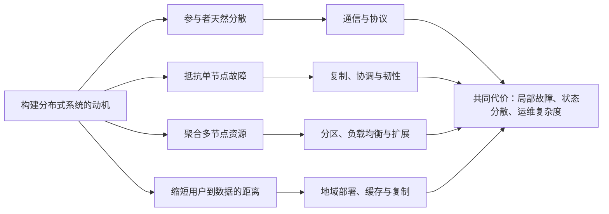
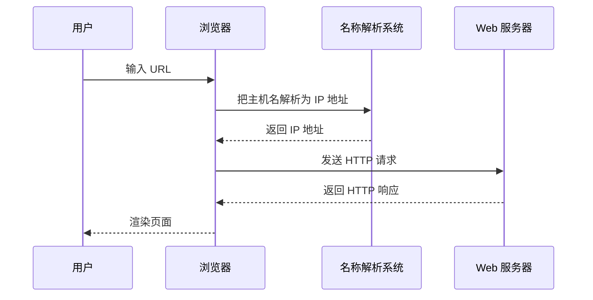
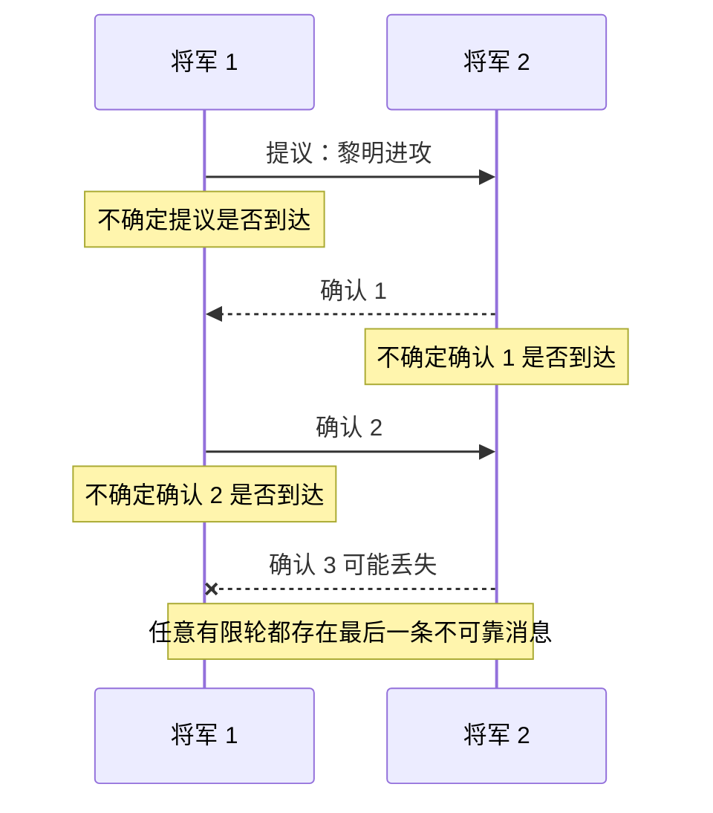
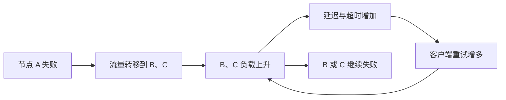
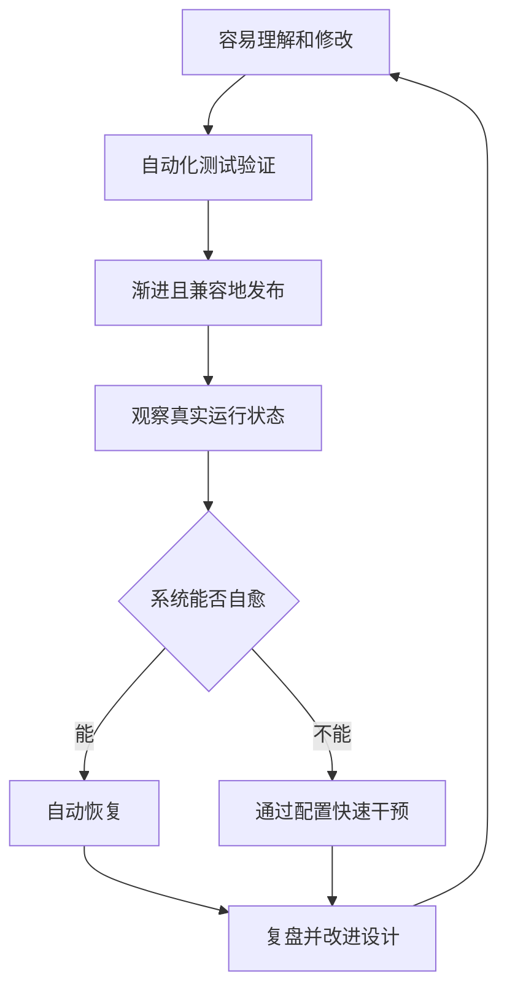
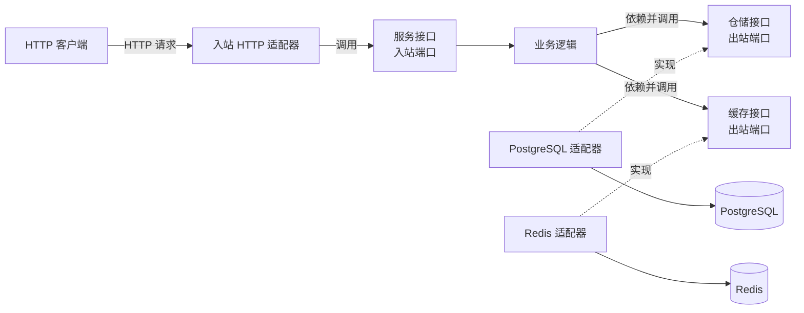
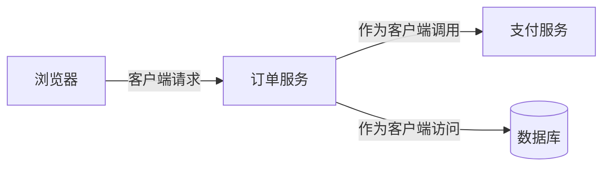
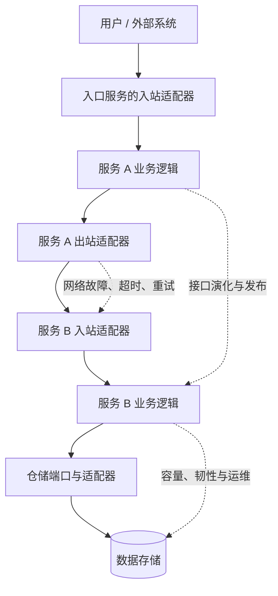
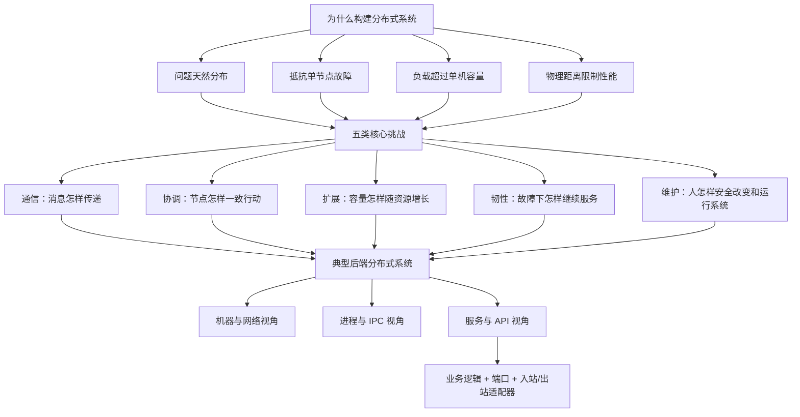

> 对应原文：Understanding Distributed Systems 2nd edition.md
>
> 本文按照原章顺序讲解 Introduction：先回答为什么要构建分布式系统，再依次讨论通信、协调、可扩展性、韧性、可维护性，最后分析分布式系统与单个服务的结构。原章是一幅全书地图，没有给出正式算法；文中的概率模型、排队关系、数值推导、伪代码和辨析用于展开作者的论证，不应误认为原书逐字给出的公式或实现。

## 0. 本章定位：分布式不是目的，而是约束下的选择

### 0.1 什么是分布式系统

作者先给出一个宽松但实用的定义：

> **分布式系统是一组节点。节点通过通信链路交换消息、彼此协作，共同完成某项任务。**

这个定义包含四个不可缺少的元素：

| 元素 | 含义 | 为什么重要 |
| --- | --- | --- |
| 节点（node） | 物理设备或软件进程 | 分布式边界不一定等于机器边界 |
| 通信链路（link） | 网络或其他进程间通信通道 | 节点不能共享瞬时、无故障的全局状态，只能靠消息获知彼此状态 |
| 消息（message） | 请求、响应、事件、复制记录等 | 消息是信息传播和协作的载体 |
| 共同任务 | 多节点共同实现的系统目标 | 仅仅联网并不意味着形成了一个有意义的分布式系统 |

“节点”故意采用宽泛定义。它既可以是一部手机、一台服务器，也可以是浏览器进程、数据库进程或一个服务实例。因此，同一个系统可以从不同粒度观察：

- 从硬件看，是多台机器通过网络连接；
- 从运行时看，是多个进程通过 IPC 交换消息；
- 从软件设计看，是多个松耦合组件通过 API 协作。

这些视角并不矛盾，只是回答的问题不同。例如，机房断电属于机器视角；进程崩溃属于运行时视角；接口演化导致调用失败属于组件视角。

作者以 Leslie Lamport 的著名说法开篇，是为了强调分布式系统最反直觉的地方：**本地程序的可用性可能依赖一个使用者甚至开发者都不知道的远端节点。** 单机程序里，失败通常就在本机；分布式系统里，依赖关系跨越进程、机器、网络和组织边界，故障来源和故障影响不再处于同一位置。

### 0.2 为什么要构建分布式系统

分布式带来网络不可靠、并发、局部故障、部署和运维等额外复杂度，所以第一个问题不该是“如何分布式”，而应是“为什么单机不够”。作者给出四类理由。

#### 理由一：问题本身天然分布

有些系统的参与者本来就位于不同设备或地点。Web 是最熟悉的例子：浏览器运行在用户的手机、平板、电脑或游戏机上，服务器运行在远端数据中心，全球数十亿台设备共同组成系统。

这里不是先选了“分布式架构”，再把程序拆开，而是**现实世界已经把参与者分开了**。通信和部分失败是问题本身的一部分，无法靠换一台更大的机器消除。

#### 理由二：需要抵抗单节点故障

若全部数据和计算只存在于一个节点，该节点就是单点故障。Dropbox 一类存储服务会把数据复制到多个节点，使数据不随单个节点的丢失而丢失。故障期间能否立即从其他副本读取，还取决于副本协议、故障切换和系统的可用性设计。

复制解决的是“单个故障不应等于整个服务或数据的丢失”，但它同时引入新问题：

- 多份副本如何保持一致；
- 某节点失联时，如何判断它是真的失败还是网络暂时不可达；
- 写入多少个副本才算成功；
- 故障节点恢复后怎样追赶最新状态。

因此，高可用不是“多放几份数据”这么简单。冗余提供了容错的材料，协调协议才决定这些材料如何共同工作。

#### 理由三：工作负载超过任何单节点的容量

有些负载即使购买最强的单机也无法承载。例如，Google 每秒需要处理来自全球的数万次搜索请求。此时必须把请求、数据或计算拆到多个节点上。

这类分布式解决的是**总资源不足**：一台机器只有有限的 CPU、内存、磁盘容量和网络带宽，而多台机器可以聚合资源。但资源数量相加不代表有效能力线性相加，因为系统还要支付通信、协调、数据移动和负载不均衡的成本。

#### 理由四：物理距离限制了性能

即使一台机器的计算能力无限，跨洲网络传播仍受物理距离和路由路径限制。Netflix 等内容服务把数据放在用户附近，是为了缩短传播路径，使高分辨率视频能够稳定、低延迟地传输。

这说明性能不只取决于“算得多快”，也取决于“数据离用户多远”。光在真空中的速度约为 $3 \times 10^8$ m/s，在光纤中更慢；再加上路由、排队和协议处理，跨地域往返延迟不可能靠升级服务器 CPU 消除。地理分布因此是对物理约束的回应。

### 0.3 四种动机对应四种基本设计压力



这四类理由可以同时存在。例如，全球网盘既天然分布，又要求数据不丢失，还要容纳海量数据并降低跨地域访问延迟。但设计时仍应分别识别它们，因为不同动机导向不同机制：为容量分片不等于为可用性复制，为低延迟建立边缘缓存也不等于获得强一致性。

### 0.4 全章的分析路线

作者没有直接罗列技术，而是先把问题拆成五类工程挑战：

1. **通信**：消息怎样正确、安全地到达；
2. **协调**：节点怎样在不确定性和故障下共同决策；
3. **可扩展性**：负载增长时怎样增加容量并保持性能；
4. **韧性**：组件失败时系统怎样继续完成任务；
5. **可维护性**：人怎样安全地修改、发布和运行系统。

这五类挑战同时构成全书结构：

| 引言中的挑战 | 对应全书部分 | 后续要回答的核心问题 |
| --- | --- | --- |
| 通信 | Part I | 如何建立可靠、安全的链路，发现服务并设计 API |
| 协调 | Part II | 如何在故障下检测节点、理解时间、选举领导者、复制状态并完成事务 |
| 可扩展性 | Part III | 如何通过缓存、分区、负载均衡、存储、消息和服务拆分提升容量 |
| 韧性 | Part IV | 如何识别故障来源，隔离影响，控制级联失败并管理风险 |
| 可维护性 | Part V | 如何测试、发布、观测、配置和运行系统 |

最后再给出服务内部的通用结构，把这些系统级问题落到代码边界上。这条路线体现了一种重要方法：**先定义目标和不可避免的约束，再研究机制；先理解系统为何困难，再选择具体产品。**

## 1. Communication：通信

### 1.1 为什么通信是第一个挑战

分布式系统之所以“分布式”，就在于节点不在同一个进程中，不能直接调用彼此的内存或函数，只能通过网络交换消息。

浏览器访问网页的简化过程是：



看似简单的“请求并返回”隐藏着一连串问题：

- 请求和响应在网络上用什么字节格式表示；
- 接收方如何知道一条消息从哪里开始、在哪里结束；
- 网络临时中断或丢包后是否重试；
- 交换机、线路或内存错误造成比特变化时如何发现；
- 重试是否会导致同一个业务操作执行两次；
- 中间节点能否读取或篡改消息；
- 客户端如何确认自己连接的是真正的服务器。

作者在引言中只提出问题，后续通信部分才逐层解决：可靠链路、安全链路、服务发现和 API。这样安排的关键在于，**一次远程调用不是一次更慢的本地函数调用**。远程调用多了编码、传输、超时、重试、身份和局部失败等语义。

### 1.2 网络抽象为什么会泄漏

理想情况下，应用只调用网络库，不必关心底层细节。但作者提醒，抽象会泄漏：上层看似统一的接口无法隐藏所有底层故障。

例如，一个 `request()` 调用返回超时，只说明调用者在截止时间前没有收到响应，不能唯一确定：

1. 请求从未离开客户端；
2. 请求到达服务器，但服务器尚未处理；
3. 服务器已完成操作，但响应在途中丢失；
4. 响应已到达本机，但客户端线程没有及时得到调度。

四种情况对业务补救方式完全不同。若直接重试，前两种情况可能恢复服务，第三种情况却可能重复扣款。这就是底层网络不确定性穿透上层“像函数一样调用”的抽象。

### 1.3 通信问题与其他挑战的关系

通信是其他四类挑战的基础：

- 协调依靠消息交换，消息丢失会造成参与者知识不一致；
- 扩容增加节点和链路，也增加通信总量和网络瓶颈；
- 韧性要求在链路中断、延迟突增时仍能提供受控行为；
- 可维护性要求能够观察请求经过哪些节点、在哪一跳失败。

因此，网络库可以封装常见操作，却不能替系统设计者决定超时、重试、幂等性和一致性等业务语义。

### 1.4 容易混淆的概念

**消息已发送，不等于消息已送达。** “发送成功”常常只代表数据被写入本地操作系统缓冲区。

**消息已送达，不等于业务已完成。** 接收进程可能在持久化业务状态前崩溃。

**收到响应，不等于所有副本都已更新。** 响应条件由协议和一致性承诺决定。

**可靠传输，不等于业务恰好执行一次。** TCP 等可靠传输协议可以处理字节丢失和乱序，但无法自动理解“创建订单”是否可重复。

## 2. Coordination：协调

### 2.1 什么是协调，为什么需要它

通信解决“节点能否交换信息”，协调解决“节点能否基于这些信息一致行动”。当多个节点共同维护状态、选择负责人或决定某操作是否提交时，它们必须形成某种共同认识。

协调困难的根源不是节点不会计算，而是每个节点只能看到局部信息：

- 消息传输需要时间；
- 消息可能丢失；
- 节点可能崩溃；
- 超时无法区分远端失败与网络缓慢；
- 不存在随时可读的、绝对可靠的全局状态。

### 2.2 双将军问题的设定

作者用“双将军问题”展示不可靠通信下达成确定共识的困难：

- 两支军队由两位将军分别指挥，对应两个节点；
- 两军相距较远，对应网络分隔；
- 必须同时进攻才能成功，对应需要一致行动；
- 唯一通信方式是派信使，而信使可能被截获，对应消息可能丢失。

目标不是让双方“很可能”选中同一时间，而是让双方**确定**对方也会在同一时间行动。

### 2.3 为什么增加确认仍不能获得确定性

设将军 1 发送提议：“黎明进攻。”

1. 将军 1 不知道信使是否到达，所以不能确定将军 2 收到提议。
2. 将军 2 可以回复确认，但回复也可能丢失。
3. 即使将军 1 收到第一次确认，将军 2 仍不知道这份确认是否到达，因此不知道将军 1 是否敢行动。
4. 将军 1 再确认“我收到了你的确认”，新确认依然可能丢失。
5. 每增加一轮，双方只是把不确定性推到最后一条消息上，无法消除它。

用“共同知识”来理解会更清楚。共同进攻要求的不只是：

- 将军 1 知道时间；
- 将军 2 知道时间；

还要求：

- 将军 1 知道将军 2 知道；
- 将军 2 知道将军 1 知道将军 2 知道；
- 如此无限延伸。

任何有限轮消息都有“最后一条”。只要最后一条可能丢失，发送者就无法知道接收者是否收到，知识链便在最后一层断开。因此，在消息可能永久丢失、又要求双方百分之百确定同时行动的模型中，有限次确认不能解决问题。



### 2.4 这个思想实验真正说明什么

双将军问题不是说“分布式系统永远无法协作”，而是说明：**在给定故障模型下，有些绝对保证不可能实现。** 工程系统之所以仍能工作，是因为会改变条件或降低目标：

- 假设消息丢失是暂时的，允许持续重试；
- 使用超时和截止时间，在不确定时放弃操作；
- 引入多数派，而不是要求所有参与者同时确认；
- 使用稳定存储保存已经做出的决定；
- 接受概率性保证或极低的失败概率；
- 明确定义安全性与活性，在网络分区时牺牲部分可用性。

这些做法都没有解决原始双将军模型，而是改变了信道或故障假设，或者降低了所要求的保证。本文据此提炼出后续阅读协调算法时应采用的思考方式：先问算法依赖什么系统模型、允许哪些故障、承诺什么结果。脱离前提讨论“保证一致”没有意义。

### 2.5 常见误区

**误区一：多发几次确认就能得到绝对确定性。** 重试可以提高成功概率，却没有消除最后一条消息丢失的可能。

**误区二：超时证明远端已经失败。** 超时只证明本地在规定时间内没观察到响应。

**误区三：双将军问题等同于拜占庭将军问题。** 双将军问题聚焦不可靠信道和共同知识；拜占庭问题还考虑参与者可能任意或恶意地发送矛盾信息。两者都用“将军”叙事，但故障模型不同。

**误区四：通信可靠后协调就自动解决。** 即便字节最终可靠送达，并发提议、节点崩溃、旧状态恢复和决策顺序仍需要协调协议处理。

## 3. Scalability：可扩展性

### 3.1 从“快不快”转向“负载增长后还能否保持性能”

作者先把几个经常混用的词分开：

- **负载（load）**：消耗系统资源的工作；
- **性能（performance）**：系统处理负载的效率；
- **容量（capacity）**：系统在满足目标条件时能承受的最大负载；
- **可扩展性（scalability）**：负载增长时，系统能否通过增加资源来提升容量，而不让性能不可接受地下降。

负载不是一个通用数字，必须结合应用定义。它可以是：

- 每秒到达的请求数；
- 并发用户数或并发连接数；
- 每秒写入的数据量；
- 读写比例；
- 队列中的事件积压；
- 数据集大小；
- 单个请求的计算复杂度。

“有 100 万用户”本身不能完整描述负载。100 万注册用户与 100 万同时在线用户差别巨大；同样的请求数，简单缓存读取与复杂报表查询消耗的资源也不同。

### 3.2 吞吐量、响应时间与有效吞吐量

原章主要用吞吐量和响应时间衡量性能。

#### 吞吐量

吞吐量是在观察窗口内完成的请求数量：

$$
X = \frac{N_{completed}}{T}
$$

其中，$N_{completed}$ 是时间窗口 $T$ 内处理完成的请求数，$X$ 的常见单位是 requests/s。

例如，10 秒内完成 8,000 个请求，平均吞吐量为：

$$
X = \frac{8000}{10\ \mathrm{s}} = 800\ \mathrm{requests/s}
$$

吞吐量回答“单位时间做了多少工作”，但不说明单个用户等了多久，也不说明结果是否成功。

#### 响应时间

单个请求的响应时间是从发出请求到收到响应的时间差：

$$
R_i = t_{response,i} - t_{request,i}
$$

它通常包含网络传播、排队、服务处理、下游调用和返回传输。分布式系统的响应时间不是单纯的 CPU 执行时间。

响应时间应观察分布，而不只看平均值。即使平均值很低，少数极慢请求仍会影响用户；因此生产系统常看中位数和高百分位数，如 p95、p99。百分位数不是本章原文重点，但它延续了作者“性能必须与实际负载和用户体验绑定”的分析方向。

#### 有效吞吐量

图 1.1 中纵轴实际表示 **goodput（有效吞吐量）**：在低响应时间下、无错误完成的那部分客户端请求。可写成：

$$
G = \frac{N_{successful\ and\ timely}}{T}
$$

有效吞吐量比“服务器收到多少请求”更接近系统真正交付的价值。假设服务器每秒接收 2,000 个请求，其中 300 个报错，另有 500 个虽然成功但超过延迟目标，那么满足服务目标的有效吞吐量只有：

$$
G = 2000 - 300 - 500 = 1200\ \mathrm{requests/s}
$$

### 3.3 容量曲线为什么先升、后平台甚至下降

原书图 1.1 用无刻度曲线描绘了典型过程：横轴是客户端请求率，纵轴是满足低延迟和无错误条件的有效吞吐量，曲线峰值标记系统容量。下面以阶段图重述其含义，不代表原书测量数据：


1. **低负载区**：资源充足，请求增加时，有效吞吐量近似同步增加。
2. **接近容量**：某种资源逐渐饱和，排队增长，响应时间开始恶化。
3. **达到容量**：系统能维持性能目标的负载到达上限。
4. **过载区**：新请求继续到来，队列、超时和重试消耗更多资源，许多操作失败或超时，有效吞吐量可能反而下降。

性能下降不是只因为“CPU 到了 100%”。任何关键资源都可能成为瓶颈：内存、连接池、线程池、磁盘 IOPS、锁、数据库连接、网络带宽或下游服务配额。

### 3.4 排队为何导致容量边缘的延迟突增

一个有用的直觉来自排队关系。若系统中的平均并发请求数为 $L$，平均完成速率为 $X$，平均响应时间为 $R$，在稳定状态下满足 Little 定律：

$$
L = X \cdot R
$$

它不直接给出某种架构的容量，但解释了为什么在稳定状态下，在途请求数与延迟相连。例如，系统平均完成 $800$ requests/s，同时平均有 $400$ 个请求在系统内，那么：

$$
R = \frac{L}{X} = \frac{400}{800} = 0.5\ \mathrm{s}
$$

若系统仍处于稳定状态，平均在途请求数为 1,600、吞吐量仍为 $800$ requests/s，则 Little 定律给出的平均响应时间是 2 秒。若过载使到达率持续高于完成率，系统便不再处于稳定状态，此时不能用某一瞬间的积压量直接算出平均响应时间；只能判断队列和等待时间会继续增长，直至请求超时、被拒绝或系统崩溃。

这也解释了为什么“让请求无限排队”不是可靠的过载策略。有限队列、背压、限流和快速拒绝虽然会显式拒绝部分工作，却能保护已经接纳的请求，避免有效吞吐量整体坍塌。

### 3.5 扩大容量的两条路线

#### 纵向扩展（scale up）

纵向扩展是更换或升级为性能更强的机器，例如增加 CPU、内存和更快的存储。

优点：

- 改动通常较少；
- 不必立即处理数据分区和跨节点协调；
- 对尚未达到单机极限的系统，往往是成本最低的第一步。

局限：

- 单机硬件存在物理上限；
- 高端硬件价格可能非线性增长；
- 单机仍可能是故障域；
- 不能解决用户与数据之间的地理距离。

#### 横向扩展（scale out）

横向扩展是增加更多普通机器，让它们共同工作。

优点：

- 可以逐步增加总计算、存储和网络资源；
- 能结合复制抵抗部分节点故障；
- 可以按地域部署，更接近用户。

代价：

- 必须拆分请求或数据；
- 节点间要通信和协调；
- 负载可能分布不均；
- 节点越多，部分故障越常见；
- 运维、观测和发布变得复杂。

作者指出，云服务使“按需获得更多机器”从采购难题变成 API 或配置操作。2006 年 AWS 推出 EC2 是关键转折之一。但云只降低了资源获取门槛，**不会自动把应用变成可横向扩展的应用**。状态拆分、并发控制、数据一致性和故障处理仍需架构承担。

### 3.6 可扩展性的严格表述

“增加负载不应降低性能”不能理解为在固定资源下无限承载，而应理解为：当负载增长时，可以通过增加资源，使吞吐量、响应时间和错误率继续满足目标。

可把一次扩容实验写成：

$$
E = \frac{C_k}{k \cdot C_1}
$$

其中，$C_1$ 是一份资源的容量，$C_k$ 是 $k$ 份资源的实际容量，$E$ 是扩展效率。若单节点容量为 1,000 requests/s，四节点实际容量为 3,200 requests/s，则：

$$
E = \frac{3200}{4 \times 1000} = 0.8
$$

80% 的扩展效率意味着剩余能力损失在协调、复制、网络、负载不均或串行瓶颈上。这个模型不是为了要求所有系统线性扩展，而是让“扩得好不好”成为可测量问题。

### 3.7 常见误区

**吞吐量高不等于响应快。** 批量处理可以提高吞吐量，却让单个请求等待更久。

**吞吐量不等于有效吞吐量。** 错误和超时请求会消耗资源，但没有完成有效工作。

**性能好不等于可扩展。** 某系统在当前负载下很快，却可能无法通过增加资源应对十倍负载。

**可扩展不等于必须从第一天分布式。** 若单机有充足余量，提前承担分区和协调成本可能得不偿失。

**机器数翻倍不等于容量翻倍。** 共享瓶颈、串行部分、复制开销和热点都会限制收益。

## 4. Resiliency：韧性

### 4.1 韧性是什么

作者将韧性定义为：**即使发生故障，系统仍能继续完成其工作。**

重点不在“永不失败”，而在于：

- 预期组件会失败；
- 限制单个故障的影响范围；
- 保留可继续服务的冗余能力；
- 自动检测、绕过和修复故障；
- 无法完整服务时，以明确、受控的方式降级。

### 4.2 为什么规模越大，故障越常见

每个组件即使只有很小的故障概率，大量组件和大量操作叠加后，观察到故障的机会也会上升。

若简化假设 $n$ 个组件相互独立，每个组件在某时间窗口内故障的概率都是 $p$，则至少一个组件故障的概率为：

$$
P(\mathrm{at\ least\ one\ failure}) = 1 - (1-p)^n
$$

例如，单个节点一天内故障概率仅为 $p=0.001$，1000 个独立节点中至少一个当天故障的概率约为：

$$
1-(1-0.001)^{1000} \approx 0.632
$$

也就是约 63.2%。这个计算不是生产故障预测模型，因为现实故障通常并不独立；它的作用是说明作者的直觉：**小概率乘上大规模，会变成日常事件。**

现实往往更困难。机架断电、网络配置错误、软件缺陷和流量突增会同时影响许多组件，形成相关故障。一个组件失败还可能把流量转移到其他组件，增加它们的负载和故障概率，形成级联失败。



所以独立冗余还不够，必须考虑故障隔离和过载反馈回路。

### 4.3 可用性的定义与推导

未被控制的故障最终会降低可用性。可用性是系统可服务时间占总观察时间的比例：

$$
A = \frac{T_{up}}{T_{up}+T_{down}}
$$

其中：

- $T_{up}$ 是能够服务请求的时间；
- $T_{down}$ 是不能服务请求的时间；
- $A$ 通常写成百分比。

若观察窗口总长为 $T$，允许的停机预算为：

$$
D = (1-A)T
$$

以一天 $T=86{,}400$ 秒为例，99.9% 可用性的每日停机预算为：

$$
D=(1-0.999)\times 86400=86.4\ \mathrm{s}=1.44\ \mathrm{min}
$$

原章用“几个 9”简写可用性，并给出每日停机预算。作者指出，三个 9 通常被用户认为可以接受，四个 9 以上则可视为高可用；实际目标仍应由业务后果和成本决定。

| 可用性 | 常用说法 | 每日最多停机 | 约合每年停机 |
| ---: | --- | ---: | ---: |
| 90% | 1 个 9 | 2.40 小时 | 36.5 天 |
| 99% | 2 个 9 | 14.40 分钟 | 3.65 天 |
| 99.9% | 3 个 9 | 1.44 分钟 | 8.76 小时 |
| 99.99% | 4 个 9 | 8.64 秒 | 52.56 分钟 |
| 99.999% | 5 个 9 | 864 毫秒 | 5.256 分钟 |

每多一个 9，允许的不可用比例缩小 10 倍。三到四个 9 看似只差 0.09 个百分点，实际却把每日停机预算从 86.4 秒压缩到 8.64 秒，对检测、切换、发布和依赖服务提出显著更高要求。

若把平均无故障运行时间记为 $MTTF$，把平均修复时间记为 $MTTR$，可用性还常近似写为：

$$
A \approx \frac{MTTF}{MTTF + MTTR}
$$

其中 $MTTF$ 是从恢复到下一次故障之间的平均正常运行时间。这个关系揭示两条提升路径：既可以让故障更少、拉长 $MTTF$，也可以更快检测和恢复、缩短 $MTTR$。一些资料把这里的正常运行时间称为 $MTBF$，但也有定义让 $MTBF$ 包含修复期，因此使用公式前必须先确认术语口径。在大规模系统中，完全消灭故障不现实，所以自动切换和自愈尤其重要。

### 4.4 三类核心韧性手段

原章点出三类后续会展开的技术。

#### 冗余（redundancy）

为关键能力保留多个实例、副本或路径，使单个组件丢失后仍有替代者。

冗余只有在故障不同时击穿全部副本时才有效。把两个副本放在同一台机器、同一机架或同一故障域，能抵抗的故障范围有限。冗余也必须配合正确的切换和数据同步机制，否则可能得到两份同时不可用或彼此冲突的状态。

#### 故障隔离（fault isolation）

限制故障传播边界。例如，划分故障域、限制每个租户的资源、设置独立连接池、实施舱壁式隔离，使一个组件过载时不耗尽整个系统的线程或连接。

隔离回答的不是“怎样防止 A 失败”，而是“即使 A 失败，为什么 B 不必一起失败”。

#### 自愈（self-healing）

自动检测异常并恢复服务，例如重启崩溃进程、把流量从不健康实例移开、重新创建副本或补齐丢失数据。

自愈机制必须避免误判和振荡。若健康检查过于敏感，短暂抖动可能引发频繁迁移；若恢复动作本身消耗大量资源，又可能在过载时加剧故障。

### 4.5 韧性、可用性、可靠性与容错性

这些概念相关但不相同：

| 概念 | 主要问题 | 典型关注点 |
| --- | --- | --- |
| 韧性（resiliency） | 遭遇故障后还能否继续并恢复 | 吸收冲击、降级、恢复、避免扩散 |
| 可用性（availability） | 有多少时间可提供服务 | 正常运行时间占比 |
| 可靠性（reliability） | 在给定时间内能否持续正确工作 | 无故障概率、正确性、数据完整性 |
| 容错性（fault tolerance） | 特定故障发生时能否维持规定行为 | 故障模型与可承受范围 |

一个服务可以“可访问”却返回错误结果，所以可用性不能代替正确性。一个系统也可以短暂不可用但数据从不损坏，因此可靠性和可用性需要分别定义。韧性则更强调系统面对扰动时的完整过程：承受、限制影响、恢复并学习。

### 4.6 常见误区

**冗余不自动等于高可用。** 副本若共享故障域、切换缓慢或状态不一致，仍达不到目标。

**高可用不等于零失败。** 它意味着在约定观察口径下，把不可服务时间控制在预算内。

**组件各有五个 9，不代表组合系统也有五个 9。** 请求链上的串联依赖会共同消耗可用性预算；统计独立时，串联系统可用性近似为各依赖可用性的乘积。

**只看平均恢复时间会掩盖长尾事故。** 少数持续很久的故障可能主导用户影响。

**重试并不总能提高韧性。** 没有退避、上限和负载保护的重试会放大流量，触发级联失败。

## 5. Maintainability：可维护性

### 5.1 为什么维护成本决定系统长期质量

软件的大部分成本发生在初次开发之后：修复缺陷、增加功能、升级依赖、发布版本、处理事故和日常运行。分布式系统组件多、依赖复杂、部署频繁，这部分成本尤其突出。

作者因此把可维护性定义为一个长期目标：系统应当易于修改、扩展和操作。这里的“容易”不是少写几行代码，而是变更风险可理解、可验证、可发布、可观察、可回退。

### 5.2 每次变更为什么都可能引发事故

一次修改可以沿调用链产生远超局部代码的影响：

- API 字段变化破坏旧客户端；
- 数据库迁移与旧版本代码不兼容；
- 配置错误同时影响全部实例；
- 新版本性能下降，引发下游超时和重试；
- 分批部署期间，新旧版本交互触发未测试路径。

因此，维护性与韧性不是独立目标。系统越容易验证、渐进发布和快速回退，变更导致的不可用时间就越短。

### 5.3 测试是变更的最低保障

作者把良好测试视为安全修改系统的最低要求，并列出三种层次：

| 测试类型 | 主要范围 | 能发现的问题 | 主要局限 |
| --- | --- | --- | --- |
| 单元测试 | 单个函数、类或组件 | 局部逻辑和边界条件错误 | 不能证明真实依赖能够协作 |
| 集成测试 | 多个组件或真实依赖 | 协议、序列化、数据库和配置问题 | 环境较重，覆盖组合仍有限 |
| 端到端测试 | 从入口到完整业务结果 | 关键用户流程和系统装配问题 | 慢、脆弱，失败定位成本较高 |

三类测试不是互相替代。单元测试提供快速、精确反馈；集成测试验证边界；端到端测试验证最重要的完整路径。分布式系统还需要关注超时、重试、部分故障、新旧版本共存等普通成功路径之外的情况。

### 5.4 合并代码之后，风险才刚开始

代码通过测试并合入代码库，不代表用户已经安全获得新版本。发布过程还要回答：

- 新版本怎样逐步获得流量；
- 失败怎样被及时发现；
- 数据格式是否允许旧版本和新版本并存；
- 是否能暂停、回滚或关闭新功能；
- 发布是否会影响系统可用性。

作者强调“安全发布到生产而不影响可用性”，是因为分布式系统通常无法像桌面程序那样统一停机后一次性替换。部署期间往往处于多版本共存状态，兼容性本身就是运行时要求。

### 5.5 运维需要无需改代码的控制面

操作人员要监控健康状态、调查性能退化，并在系统无法自愈时恢复服务。事故处理中，重新修改、测试和发布代码通常太慢，所以系统必须允许通过配置改变行为，例如：

- 用功能开关关闭有问题的功能；
- 调整超时、并发数或流量限制；
- 扩容某个服务；
- 把流量从异常实例或地域移开。

这种能力缩短恢复时间，但也带来新的风险：配置本身也是变更，应被验证、审计、渐进应用并支持回退。把配置看成“不会出错的非代码”是常见误区。

### 5.6 从团队分工到 DevOps 责任闭环

传统组织常把开发、测试、运维分给不同团队。微服务和 DevOps 的兴起推动同一团队同时负责设计、实现、测试和运行系统。

作者赞成这种变化，不只是组织潮流，而是因为它形成反馈闭环：


设计者亲自面对值班告警，会更快发现：错误信息是否可理解、仪表是否缺失、依赖边界是否脆弱、恢复操作是否危险。运行经验返回设计，而不是在团队边界处丢失。

DevOps 的核心也不是“让开发人员多做运维工作”，而是减少交接损失，通过自动化和共同责任让变更更快、更可靠。若只有责任转移而没有测试、部署、观测和自助平台支持，维护性并不会自然提高。

### 5.7 可维护性的完整链条



作者把测试与运维放在同一章级挑战下，是因为“能修改”与“敢修改”不同。真正可维护的系统不仅代码结构清楚，还要让变更结果可验证、生产行为可观察、故障影响可控制。

## 6. Anatomy of a Distributed System：分布式系统的结构

### 6.1 本书关注的系统范围

分布式系统形态很多，本书主要关注：

- 运行在普通商用机器上的后端应用；
- 由多个服务组成；
- 通过网络通信；
- 实现某种业务能力。

这一定义排除了许多不必要的特殊细节，使后续讨论能围绕常见后端服务展开。它不是说传感器网络、超级计算机或点对点系统不属于分布式系统，而是明确本书案例和抽象的适用范围。

### 6.2 同一系统的三种观察视角

| 视角 | 系统由什么组成 | 连接方式 | 适合分析的问题 |
| --- | --- | --- | --- |
| 物理视角 | 多台机器 | 网络链路 | 硬件容量、机架和地域故障、带宽与延迟 |
| 运行时视角 | 多个软件进程 | HTTP 等 IPC 机制 | 进程生命周期、请求、超时、并发与故障检测 |
| 实现视角 | 多个松耦合服务 | API | 职责边界、接口演化、依赖和团队所有权 |

例如，“订单服务调用库存服务”在实现视角是 API 依赖；在运行时视角是两个进程交换 HTTP 消息；在物理视角可能是跨可用区的数据包传输。完整诊断往往需要切换视角，而不是寻找唯一“正确”的架构图。

### 6.3 服务的核心是业务逻辑与接口

一个服务实现整个系统能力中的一部分。服务内部的中心是业务逻辑，例如创建订单、计算价格或检查库存。

业务逻辑通过接口连接外部世界，接口分为两个方向：

- **服务提供的接口**：定义外部调用者可以要求本服务执行哪些操作；
- **服务需要的接口**：定义业务逻辑要调用数据库、消息代理或其他服务的哪些操作。

这种区分把“业务要做什么”与“技术上怎样传输和存储”分开。业务逻辑需要的是“保存订单”，并不必天然依赖 PostgreSQL 驱动；它需要的是一个仓储接口，由具体适配器实现。

### 6.4 为什么进程之间需要适配器

不同进程无法直接调用彼此内存中的函数。网络上传输的是字节，而业务逻辑操作的是领域对象和接口。**适配器（adapter）**负责在两者之间转换。

#### 入站适配器

入站适配器属于服务 API 的实现入口。以 HTTP 适配器为例，它通常负责：

1. 接收 HTTP 请求；
2. 解析路径、请求头和消息体；
3. 完成必要的协议级校验和身份处理；
4. 把请求转换为业务接口调用；
5. 把业务结果转换为 HTTP 响应。

它把外部技术协议翻译为业务操作。

#### 出站适配器

出站适配器让业务逻辑能够访问外部服务。例如 PostgreSQL 适配器实现仓储接口，把“保存订单”翻译成 SQL 和数据库驱动调用；Redis 适配器可以实现缓存接口。

它把业务需要翻译为具体基础设施操作。

### 6.5 端口与适配器架构

作者把这种风格称为 **端口与适配器架构（ports and adapters architecture）**。端口就是业务核心定义的接口，适配器把外部技术接到这些端口上。



以一次创建订单为例，请求链如下：

```text
HTTP POST /orders
  -> HTTP 适配器解析请求
  -> 调用 OrderService.createOrder(command)
  -> 业务逻辑检查规则并构造订单
  -> 调用 OrderRepository.save(order)
  -> PostgreSQL 适配器执行 SQL
  -> 结果逐层返回并编码为 HTTP 响应
```

每一层职责不同：

- HTTP 适配器理解 HTTP，不决定业务规则；
- 业务逻辑理解订单规则，不理解 SQL 或数据库连接；
- PostgreSQL 适配器理解 SQL 和驱动，不决定订单是否允许创建。

### 6.6 依赖倒置为什么是关键

若业务逻辑直接导入 PostgreSQL 驱动，依赖方向是：

```text
业务逻辑 -> 具体数据库技术
```

端口与适配器让业务核心定义自己需要的抽象接口，再由外部适配器实现：

```text
业务逻辑 -> 仓储接口 <- PostgreSQL 适配器
```

从源代码依赖看，具体技术依赖业务定义的接口，而不是业务逻辑依赖具体技术。这就是依赖倒置原则在服务边界内的应用。

它解决三个问题：

1. **隔离技术变化**：更换数据库或通信协议时，业务规则不必随之重写；
2. **便于测试**：测试可用内存适配器实现同一接口，无需每个单元测试都启动真实数据库；
3. **明确职责**：协议、业务和基础设施错误更容易定位到所属边界。

但接口不是越多越好。若只是给每个库函数机械套一层同形包装，并没有形成稳定的业务边界，只会增加跳转和维护成本。有效的端口应表达业务真正需要的能力，而不是泄漏具体驱动的 API。

### 6.7 客户端与服务器是角色，不是固定身份

作者规定后续术语：

- 运行服务、接收请求的进程称为 **服务器（server）**；
- 向服务器发送请求的进程称为 **客户端（client）**。

同一个进程可以同时扮演两个角色。例如，API 服务接收浏览器请求时是服务器；它调用数据库或支付服务时又是客户端。



因此，“客户端/服务器”描述一次交互中的方向，不等同于“前端/后端”，也不永久绑定某台机器。

### 6.8 本书采用的简化假设

为了聚焦分布式问题，作者假设：

1. 一个服务实例完整运行在单个服务器进程中；
2. 一个进程只有一个线程。

这些假设刻意忽略进程内共享内存、线程竞争和锁，使读者先关注进程间消息、局部故障与分布式协调。它们是分析模型，不是生产系统要求。

现实中，一个进程可以有许多线程或异步任务，一个逻辑服务也可以由多个协作进程组成。此时要额外处理进程内并发和共享状态，但本书讨论的网络不确定性并不会消失。简化模型的价值在于分离两类复杂度：先研究分布式并发，再按需要叠加进程内并发。

### 6.9 从单个服务到整个分布式系统

把多个采用上述结构的服务连接起来，就得到本书后续讨论的典型对象：



这张图把前五节串了起来：

- 适配器之间通过网络**通信**；
- 服务对共同状态做决定时需要**协调**；
- 服务实例和数据需要随负载增加而**扩展**；
- 任一进程、链路或存储失败时需要保持**韧性**；
- 接口、业务逻辑和适配器会不断变化，需要**可维护性**。

## 7. 关键概念辨析

### 7.1 分布式系统与微服务

分布式系统是更宽的概念。任何通过消息协作的多节点系统都可以是分布式系统；微服务只是构造某类后端分布式应用的一种架构方式。单体应用配合远程数据库已经包含分布式交互，而把一个系统拆成微服务也不会自动获得可扩展性和韧性。

### 7.2 分区与复制

- **分区**把不同数据或工作分给不同节点，主要解决容量和并行度；
- **复制**把相同数据或能力放到多个节点，主要服务于可用性、读取扩展和地域访问。

分区会引入跨分区操作，复制会引入副本一致性。生产系统常同时使用二者，但二者的目的和代价不同。

### 7.3 性能与可扩展性

- 性能描述某个负载和资源配置下的吞吐量、延迟等表现；
- 可扩展性描述负载变化后，增加资源能否维持目标表现。

一个高度优化的单线程程序可能当前性能很好，却无法横向扩展；一个可分片系统可能单请求开销较高，却能随节点数量增加处理更大总负载。

### 7.4 韧性与维护性

- 韧性关注故障发生后系统如何承受和恢复；
- 维护性关注人如何持续修改、发布和操作系统。

两者通过生产变更相连：许多故障来自变更，而良好的测试、渐进发布、观测和回退能力既提升维护性，也缩短故障影响。

### 7.5 本地调用与远程调用

| 维度 | 本地函数调用 | 远程调用 |
| --- | --- | --- |
| 失败范围 | 通常与调用进程共同命运 | 调用方、网络、服务端可分别失败 |
| 延迟 | 相对低且稳定 | 较高，存在明显长尾 |
| 结果不确定性 | 异常通常能明确返回 | 超时后可能不知道操作是否完成 |
| 数据传递 | 内存对象或参数 | 必须序列化为消息 |
| 兼容性 | 通常同一次构建 | 新旧版本可能长期共存 |
| 安全边界 | 进程内部 | 可能跨主机、网络和信任域 |

把远程调用伪装成完全透明的本地调用，会隐藏恰恰最需要设计者处理的语义。

## 8. 本章知识结构



## 9. 核心结论

1. **分布式系统是一组靠消息协作的节点。** 节点可以是机器，也可以是进程；选择哪种视角取决于要分析的问题。
2. **分布式架构必须有明确动机。** 天然地理分布、单节点容错、超单机容量和物理延迟限制是四类主要理由。
3. **网络调用具有不可消除的不确定性。** 抽象可以简化接口，却不能替业务决定超时、重试、幂等和安全语义。
4. **协调的难点来自局部知识。** 双将军问题说明，在消息可能丢失的模型中，有限次确认无法创造绝对共同知识；算法保证必须连同故障模型一起理解。
5. **可扩展性不是当前性能好。** 它要求负载增长时能够增加容量，同时维持吞吐量、响应时间和错误率目标。
6. **容量是满足服务目标的边界。** 越过容量后，排队、超时和重试可能让有效吞吐量不升反降。
7. **规模使小概率故障日常化。** 系统应预期故障，通过冗余、隔离和自愈维持服务，而不是把“不出故障”当作设计前提。
8. **可用性必须转化为时间预算。** 每增加一个 9，允许停机时间缩小十倍，架构和运维成本随之上升。
9. **可维护性是运行期能力。** 测试、兼容发布、监控、配置控制和责任闭环共同决定系统能否长期安全演化。
10. **端口与适配器把业务规则和技术细节分开。** 入站适配器把协议请求翻译成业务调用，出站适配器把业务需要翻译成基础设施操作，依赖方向指向业务定义的接口。

## 10. 从本章提炼出的通用解题方法

面对一个分布式系统设计问题，可以采用本文根据引言主线提炼出的推理顺序。

### 第一步：先证明为什么需要分布式

明确主要驱动力是地域、可用性、容量还是延迟。若单机已经满足目标，分布式复杂度未必值得引入。

### 第二步：定义负载和服务目标

用业务相关指标描述负载，再明确吞吐量、响应时间、错误率、可用性和数据正确性目标。没有目标，就无法定义容量，也无法判断设计是否有效。

### 第三步：声明系统与故障模型

列出节点、链路、进程和外部依赖，说明哪些部分可能崩溃、延迟、丢失消息或同时失败。任何协调与容错结论都依赖这些前提。

### 第四步：画清通信和状态边界

标出请求经过哪些服务、权威状态存在哪里、哪些调用跨进程、哪些接口由谁提供。端口与适配器能帮助把业务语义从传输和存储细节中分离出来。

### 第五步：分别设计扩展与容错

为容量决定怎样分配工作和数据，为容错决定怎样复制、隔离和恢复。不要把“增加机器”当作对两类问题的统一答案。

### 第六步：设计过载与不确定结果

规定队列上限、背压、超时、重试和幂等策略。尤其要回答：调用超时后，系统怎样处理“操作可能已完成”的不确定状态。

### 第七步：把变更和运维纳入架构

在设计阶段就考虑测试边界、版本兼容、渐进发布、观测、功能开关、扩缩容和恢复流程。一个只能在理想静态环境中工作的设计，不是完整的生产设计。

### 第八步：用预算和实验验证

通过负载测试找出容量曲线，用故障演练验证隔离和自愈，用停机预算评估可用性，用发布指标验证变更风险。分布式系统设计不是只靠架构图推理，最终必须由运行证据检验。

本章最重要的方法论可以压缩成一句话：**从约束和失败出发，明确可测目标，选择有前提的机制，并把人的变更与运行活动视为系统的一部分。**
