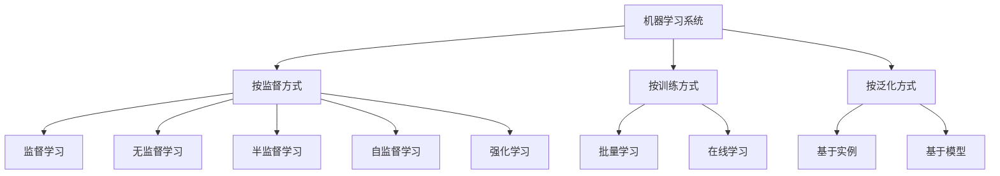

> 原书：*Hands-On Machine Learning with Scikit-Learn and PyTorch*  
> 章节：Chapter 1, The Machine Learning Landscape  
> 定位：概念与全局框架章，也是全书唯一几乎没有代码的一章  
> 配套 Notebook：<https://homl.info/colab-p>

## 本章目标

学完本章后，应当能够：

1. 用自己的话定义机器学习；
2. 判断一个问题是否适合使用机器学习；
3. 从监督方式、训练方式和泛化方式三个维度描述一个机器学习系统；
4. 区分分类、回归、聚类、降维和异常检测等任务；
5. 解释模型参数、超参数、损失函数、训练和推理；
6. 识别数据不足、采样偏差、过拟合和欠拟合等常见问题；
7. 正确说明训练集、验证集、测试集和 train-dev 集的作用。

## 一句话概括

机器学习是让计算机从数据和经验中改进任务表现的方法；一个系统能否成功，不只取决于模型，还取决于数据是否足够、具有代表性且质量良好，以及评估流程能否可靠地衡量它对新数据的泛化能力。

## 1. 什么是机器学习

### 1.1 三种互补的定义

**直观定义**：机器学习是研究如何让计算机从数据中学习的科学与艺术。

**Arthur Samuel 的定义**：机器学习使计算机无须被显式编程，也能获得学习能力。

**Tom Mitchell 的工程定义**：如果一个程序在任务 $T$ 上的表现（由指标 $P$ 衡量）随着经验 $E$ 增加而改善，就称该程序从经验中学习。

可以将工程定义记成：

$$
E + T + P \longrightarrow \text{Learning}
$$

以垃圾邮件过滤器为例：

| 要素 | 对应内容 |
| --- | --- |
| 任务 $T$ | 判断新邮件是否为垃圾邮件 |
| 经验 $E$ | 已标记为垃圾邮件或正常邮件的训练数据 |
| 指标 $P$ | 例如分类准确率 |

### 1.2 基本术语

- **训练集（training set）**：模型用于学习的数据集合；
- **训练实例（training instance/sample）**：训练集中的一条样本；
- **模型（model）**：机器学习系统中负责学习规律和做出预测的部分；
- **特征（feature）**：描述一个实例的输入变量；
- **标签或目标（label/target）**：监督学习希望预测的答案；
- **准确率（accuracy）**：分类正确的样本数占总样本数的比例。

仅仅把维基百科下载到电脑上不算机器学习，因为电脑虽然拥有更多数据，却没有在任何任务上通过这些数据改善表现。

## 2. 为什么使用机器学习

### 2.1 与传统编程的区别

传统程序通常由人总结规则：

```text
研究问题 -> 编写规则 -> 评估 -> 分析错误 -> 修改规则
```

机器学习则从示例中自动发现规律：

```text
收集数据 -> 训练模型 -> 评估 -> 分析错误 -> 更新数据或模型
```

以垃圾邮件过滤为例，传统方法需要人工维护“free”“credit card”等规则。如果垃圾邮件发送者改变写法，规则也必须持续修改。机器学习模型能够从用户最新标注的数据中发现新模式，并通过重新训练适应变化。

### 2.2 机器学习特别适合的场景

1. **规则繁多且维护成本高**：模型可能用更少的代码获得更好效果；
2. **传统方法无法给出好方案**：例如复杂环境中的语音识别；
3. **环境持续变化**：可用新数据定期或持续训练；
4. **需要从海量数据中发现规律**：通过数据挖掘获得新的洞察。

### 2.3 机器学习并非总是首选

如果问题能用少量稳定、透明的规则可靠解决，传统程序通常更简单。使用机器学习还会引入数据获取、训练、评估、部署、监控和再训练等成本。

## 3. 常见任务与技术

| 应用 | 任务类型 | 常用技术 |
| --- | --- | --- |
| 生产线产品图像分类 | 图像分类 | CNN、Vision Transformer |
| 在脑部扫描中定位肿瘤 | 语义分割 | CNN、Vision Transformer |
| 新闻分类、冒犯评论检测 | 文本分类 | Transformer，也可用 RNN/CNN |
| 自动生成长文摘要 | 文本摘要 | Transformer |
| 根据 DNA 估计疾病风险 | 长序列建模 | 状态空间模型（SSM） |
| 聊天机器人或个人助手 | NLP 综合任务 | NLU、问答模型、Transformer |
| 预测公司营收 | 回归 | 线性模型、随机森林、神经网络等 |
| 响应语音命令 | 语音识别 | RNN、CNN、Transformer |
| 信用卡欺诈检测 | 异常检测 | 孤立森林、高斯混合模型、自编码器 |
| 客户分群 | 聚类 | $k$-means、DBSCAN |
| 高维数据可视化 | 降维 | PCA、t-SNE 等 |
| 商品推荐 | 推荐系统 | 神经网络、序列模型等 |
| 游戏智能体 | 强化学习 | 策略学习、价值学习等 |

关键思路是先确定**问题类型与输出形式**，再考虑模型，而不是先选一个热门模型再寻找用途。

## 4. 机器学习系统的三套分类维度

三套分类维度彼此独立，可以任意组合。例如，一个持续从用户标注邮件中更新的深度垃圾邮件过滤器，可以同时是：

- 监督学习；
- 在线学习；
- 基于模型的学习。



### 4.1 按训练监督方式分类

#### 监督学习

训练数据包含目标答案，即标签。

最常见的两类任务：

- **分类（classification）**：预测离散类别，如垃圾邮件/正常邮件；
- **回归（regression）**：预测连续数值，如汽车价格。

术语习惯：分类中更常说“标签”，回归中更常说“目标”，但两者通常可视为同义词。特征也常被称为预测变量或属性。

注意：算法名称不一定等于任务类型。例如逻辑回归虽然名称中有“回归”，却通常用于分类，并可输出样本属于某类别的概率。

#### 无监督学习

训练数据没有标签，系统自行寻找结构。

常见任务包括：

- **聚类**：找出相似样本组成的群体；
- **层次聚类**：在大群体内部继续划分子群体；
- **可视化**：把复杂数据映射到二维或三维；
- **降维**：减少特征数量，同时尽量保留信息；
- **异常检测**：找出罕见或不正常的实例；
- **关联规则学习**：发现属性之间的共同出现关系。

降维中的**特征提取**会组合多个相关特征，得到更有意义的新特征。例如汽车年龄与里程可能被合并为“磨损程度”。降维可以降低内存和计算开销，有时还能改善模型效果，但不应默认它一定提升精度。

**异常检测与新颖性检测的区别**：

- 异常检测的训练数据可能混有少量异常，目标是发现罕见样本；
- 新颖性检测假设训练集很干净，目标是发现与所有已知训练实例都不同的新类型。

#### 半监督学习

训练集中有少量已标注数据和大量未标注数据。标注通常昂贵，因此这是很常见的现实场景。

典型做法：

1. 用聚类等无监督算法把相似实例分组；
2. 给每个群组中的少量实例人工标注；
3. 将标签传播给同群组的未标注实例；
4. 在扩充后的数据集上训练监督模型。

照片应用中的人脸分组是典型例子：系统先自动识别哪些照片是同一个人，用户只需为每个人提供一次姓名标签。

#### 自监督学习

从无标签数据本身自动构造输入和标签，然后用监督学习方式训练。

例如：

1. 随机遮住图片的一部分；
2. 把残缺图片作为输入；
3. 把原图作为目标；
4. 训练模型恢复被遮挡区域。

预训练模型通常不是最终目标。模型先通过自监督任务学习通用表示，再在少量有标签数据上为实际任务进行**微调（fine-tuning）**。把一个任务学到的知识应用到另一个任务称为**迁移学习（transfer learning）**。

大语言模型也采用类似思路：从大规模文本中预测缺失或后续文本，获得通用语言能力，再针对聊天、分类等任务进行适配。

#### 强化学习

强化学习中的学习系统称为**智能体（agent）**。智能体：

1. 观察环境；
2. 选择并执行动作；
3. 获得奖励或惩罚；
4. 学习在不同状态下选择动作的策略；
5. 目标是最大化长期累计奖励。

**策略（policy）**定义了智能体在给定情境下应选择的动作。机器人学习行走和 AlphaGo 都是强化学习的典型应用。

### 4.2 按训练方式分类

#### 批量学习

批量学习使用全部可用数据从头训练模型。训练通常离线完成，模型上线后只做推理，不继续学习，因此也称**离线学习**。

优点：

- 流程简单、稳定；
- 训练、评估和部署容易自动化；
- 适合变化较慢的任务。

缺点：

- 新数据到来后通常需要用完整数据重新训练；
- 全量训练可能耗时且昂贵；
- 不适合需要快速适应或设备资源有限的场景。

现实世界持续变化，而模型保持不变，性能会逐渐下降。这叫**数据漂移（data drift）**或**模型老化（model rot）**。即使猫狗本身没变，摄像设备、图片格式和用户偏好也可能变化，因此仍需监控并定期再训练。

#### 在线学习

在线学习按单个实例或小批量数据逐步更新模型，更准确的叫法是**增量学习**。

适用场景：

- 数据分布快速变化；
- 需要持续适应新模式；
- 计算资源有限；
- 数据大到无法一次装入内存。

最后一种情况称为**核外学习（out-of-core learning）**：每次加载一部分数据并执行训练，直到遍历全部数据。核外学习经常在离线环境运行，因此“在线”不等于“必须连接互联网”或“必须在生产环境实时训练”。

在线学习中的关键超参数是**学习率**：

- 学习率高：适应快，但容易忘记旧规律，可能发生灾难性遗忘；
- 学习率低：更稳定、抗噪声，但适应变化较慢。

在线系统也更容易被坏数据迅速破坏。生产中必须监控输入和模型性能，在异常时暂停学习，并能回滚到先前的可靠版本。

### 4.3 按泛化方式分类

机器学习的真正目标不是记住训练集，而是对未见过的新实例做出可靠预测，这叫**泛化（generalization）**。

#### 基于实例的学习

系统记住训练实例，并使用相似度度量找到与新实例接近的已知样本，再据此预测。$k$ 近邻是典型方法。

优点：

- 思路直观；
- 在小数据集上可能表现很好；
- 数据持续变化时容易加入新实例。

缺点：

- 需要在生产环境保存训练数据；
- 推理时搜索邻居可能很慢；
- 难以扩展到大规模和高维数据。

#### 基于模型的学习

系统从训练样本中拟合出一个模型，再用模型进行预测。典型流程是：

```text
研究数据 -> 选择模型 -> 定义性能指标 -> 训练参数 -> 评估 -> 推理
```

## 5. 线性回归示例：GDP 与生活满意度

本章用人均 GDP 预测生活满意度，演示了一个最小的基于模型的机器学习流程。

### 5.1 模型选择

观察散点图后，假设生活满意度与人均 GDP 近似线性：

$$
\widehat{y} = \theta_0 + \theta_1 x
$$

其中：

- $x$：人均 GDP；
- $\widehat{y}$：预测的生活满意度；
- $\theta_0$：截距；
- $\theta_1$：斜率；
- $\theta_0,\theta_1$：需要从数据中学习的模型参数。

### 5.2 训练

需要先定义性能指标：

- **效用函数/适应度函数**衡量模型有多好，目标是最大化；
- **代价函数/损失函数**衡量模型有多差，目标是最小化。

线性回归通常最小化预测值与真实值之间的距离。书中训练得到：

$$
\theta_0 = 3.75, \qquad \theta_1 = 6.78 \times 10^{-5}
$$

用波多黎各人均 GDP $33{,}442$ 美元进行预测：

$$
\widehat{y}
= 3.75 + 33{,}442 \times 6.78 \times 10^{-5}
\approx 6.02
$$

### 5.3 Scikit-Learn 的统一接口

本章代码的核心可简化为：

```python
from sklearn.linear_model import LinearRegression

model = LinearRegression()
model.fit(X, y)
prediction = model.predict([[33_442.8]])
```

- `X`：二维特征矩阵，形状通常是 `(样本数, 特征数)`；
- `y`：目标值；
- `fit()`：根据训练数据学习模型参数；
- `predict()`：对新实例执行推理。

若改用 $k=3$ 的 $k$ 近邻回归，只需替换模型：

```python
from sklearn.neighbors import KNeighborsRegressor

model = KNeighborsRegressor(n_neighbors=3)
```

这体现了 Scikit-Learn API 的一致性，也对比了基于模型和基于实例的学习。

### 5.4 “模型”一词的三种含义

上下文中的“模型”可能指：

1. 模型类型，例如线性回归；
2. 已确定结构的模型，例如单输入、单输出的线性回归；
3. 已训练模型，即结构与参数都已确定、可直接预测的模型。

**模型选择**负责选择类型与结构；**模型训练**负责寻找合适的模型参数。

### 5.5 参数与超参数

| 概念 | 由谁确定 | 何时确定 | 示例 |
| --- | --- | --- | --- |
| 模型参数 | 学习算法从数据中学习 | 训练期间 | 线性回归的 $\theta_0,\theta_1$ |
| 超参数 | 开发者或调参流程设置 | 训练前 | 学习率、正则化强度、邻居数 $k$ |

## 6. 一个典型的机器学习工作流


从本章的简化例子看，核心步骤是：

1. 研究数据；
2. 选择模型；
3. 训练模型，让算法搜索能最小化损失的参数；
4. 用模型对新实例做预测，即**推理（inference）**；
5. 检查模型是否能泛化。

## 7. 机器学习的主要挑战

本质上，问题可以归结为两类：**坏数据**和**坏模型**。生产环境还会增加部署与运维问题。

### 7.1 训练数据数量不足

大多数算法需要大量数据。简单问题可能需要数千个样本，图像和语音等复杂问题可能需要数百万个样本，除非可以使用迁移学习。

研究表明，当数据足够多时，不同算法在一些复杂任务上的表现可能趋于接近。这说明投入资源建设高质量数据集，有时比持续改进算法更有效。但现实中获得额外数据往往昂贵，因此算法选择仍然重要。

### 7.2 训练数据缺乏代表性

训练数据必须代表未来需要预测的数据。

- 样本太少会产生**采样噪声**，即随机性造成的不具代表性；
- 抽样方法有缺陷会产生**采样偏差**，即使样本很大也无法消除；
- 部分人不回答调查造成的偏差称为**无响应偏差**。

书中的 GDP 示例只使用中间收入范围的国家，遗漏很穷和很富的国家，导致线性趋势看起来比实际更强。这说明更多数据不仅会改变参数，也可能推翻原先的模型假设。

### 7.3 数据质量差

错误、异常值、噪声和缺失值会掩盖真实规律。常见处理方式包括：

- 修正或删除明显错误的异常值；
- 删除缺失严重的特征；
- 删除缺失特征的实例；
- 用中位数等统计量填补缺失值；
- 针对是否拥有某特征分别训练模型。

具体选择应通过验证，而不是仅凭直觉决定。

### 7.4 特征无关

如果输入没有包含足够的相关信息，或者混入太多无关信息，模型很难学到可靠规律。这就是“垃圾进，垃圾出”。

**特征工程**包括：

- **特征选择**：从已有特征中保留最有用的部分；
- **特征提取**：组合已有特征得到更有意义的表示；
- **创建新特征**：收集新数据，构造新的输入变量。

### 7.5 过拟合

**现象**：训练集表现很好，新数据表现很差。模型学习了训练数据中的噪声和偶然模式。

常见原因：模型相对于数据量和噪声程度过于复杂。

解决方法：

1. 使用更简单、参数更少的模型；
2. 减少输入特征；
3. 对模型施加约束，即正则化；
4. 收集更多训练数据；
5. 清洗错误和异常值，降低噪声。

**正则化（regularization）**通过限制模型自由度降低过拟合风险。限制过弱可能继续过拟合，限制过强则可能欠拟合。正则化强度通常是超参数。

### 7.6 欠拟合

**现象**：模型过于简单，无法学习数据的基本结构，连训练集表现也不好。

解决方法：

1. 使用参数更多、表达能力更强的模型；
2. 提供更好的特征；
3. 减弱正则化等模型约束。

### 7.7 过拟合与欠拟合对照

| 状态 | 训练误差 | 验证/测试误差 | 核心问题 | 主要方向 |
| --- | --- | --- | --- | --- |
| 欠拟合 | 高 | 高 | 模型或特征太弱 | 增强模型、改善特征、减弱约束 |
| 合适拟合 | 低且合理 | 低且接近训练误差 | 泛化良好 | 继续监控 |
| 过拟合 | 很低 | 明显较高 | 记住噪声和偶然模式 | 简化、正则化、增加或清洗数据 |

### 7.8 部署问题

离线效果良好不代表系统可以顺利上线。模型还可能：

- 太大，无法装入目标设备内存；
- 推理太慢，无法满足延迟要求；
- 难以扩展到生产流量；
- 难以维护；
- 存在安全漏洞；
- 因未及时更新而老化。

处理训练、部署、监控和再训练等运营问题的工程领域通常称为 **MLOps**。

## 8. 测试、验证与模型选择

### 8.1 为什么要保留测试集

训练集上的表现不能说明模型对新数据的表现。应将数据划分为：

- **训练集**：学习模型参数；
- **测试集**：只在最终阶段评估模型对未知数据的泛化能力。

模型在新样本上的误差称为**泛化误差**或**样本外误差**。测试集误差是对泛化误差的估计。

常见做法是 80% 用于训练，20% 用于测试，但比例应根据数据量决定。如果有一千万条数据，保留 1% 就有十万条测试样本，通常已经足够。

### 8.2 为什么还需要验证集

如果反复使用测试集选择模型和调节超参数，模型和开发决策会逐渐适应该测试集，测试集便不再代表真正未知的数据。这相当于对测试集过拟合。

正确的留出验证流程：

1. 在训练集上训练多组候选模型；
2. 在验证集上比较模型和超参数；
3. 选定最佳配置；
4. 使用完整训练数据重新训练最终模型；
5. 最后只在测试集上评估一次。

| 数据集 | 用途 | 是否参与调参 |
| --- | --- | --- |
| 训练集 | 学习模型参数 | 是，间接参与 |
| 验证集/dev 集 | 模型选择和超参数调节 | 是 |
| 测试集 | 最终估计泛化性能 | 否 |

### 8.3 交叉验证

验证集太小会使评估不稳定，太大又会减少训练数据。交叉验证将训练数据多次划分成不同的训练子集和验证子集：

1. 每轮用大部分数据训练；
2. 用剩余部分验证；
3. 对多轮结果取平均。

它能提供更可靠的模型评估，但训练时间会按折数增加。

### 8.4 数据不匹配与 train-dev 集

训练数据与真实生产数据可能来自不同分布。例如，训练花卉识别模型时可以下载大量网络图片，但应用上线后收到的是手机现场拍摄的图片。

此时：

- 验证集和测试集必须来自真实生产分布；
- 从原训练分布中再留出一份 **train-dev 集**；
- 训练集与 train-dev 集都来自同一来源；
- dev 集与测试集都来自目标生产来源。

诊断逻辑：

| 表现 | 结论 | 改进方向 |
| --- | --- | --- |
| 训练集好，train-dev 差 | 训练集过拟合 | 简化/正则化模型、增加或清洗数据 |
| train-dev 好，dev 差 | 数据不匹配 | 让训练数据更接近生产数据 |
| train-dev 和 dev 都好 | 模型可进入最终测试 | 在测试集做一次最终评估 |

必须避免重复或近重复样本同时出现在 dev 集与测试集中，否则评估会过度乐观。

### 8.5 没有免费的午餐

选择模型就是对数据做假设。例如选择线性模型，隐含假设是主要规律近似线性，偏离直线的部分可以看作噪声。

“没有免费的午餐”定理指出：如果对数据完全不做假设，就没有理由事先认为某种模型一定优于其他模型。实践中无法评估所有模型，因此应根据问题做合理假设，再比较少数合适的候选模型。

## 9. 本章最容易混淆的概念

### 9.1 分类维度不是互斥选项

“监督/无监督”“批量/在线”“实例/模型”属于不同维度。不要问“这个系统到底是监督学习还是在线学习”，因为它可以两者都是。

### 9.2 在线学习不等于联网学习

在线学习的核心是增量更新。核外学习也使用在线算法，但训练过程完全可以离线进行。

### 9.3 批量与 mini-batch 不是反义词

批量学习表示每次从完整数据重新训练；mini-batch 是一次参数更新所使用的一小组样本。在线学习也常用 mini-batch。

### 9.4 模型参数与超参数不同

模型参数由训练算法从数据中学得；超参数控制学习过程或模型结构，需要在训练前设定，并通过验证过程选择。

### 9.5 验证集与测试集不同

验证集服务于开发决策，可以重复使用；测试集服务于最终无偏评估，不应参与模型选择。

### 9.6 训练表现好不等于模型好

机器学习的目标是泛化。训练误差很低但测试误差很高，恰恰可能说明模型过拟合。

## 10. 章末练习参考答案

### 1. 如何定义机器学习？

机器学习是让计算机通过数据或经验改善某项任务表现，而不必为所有情况显式编写规则的方法。

### 2. 列举四类适合机器学习的应用

- 规则复杂且维护成本高的垃圾邮件过滤；
- 传统算法难以解决的语音或图像识别；
- 需要适应变化的欺诈检测或推荐系统；
- 从海量数据中发现隐藏规律的数据挖掘。

### 3. 什么是带标签训练集？

每个训练实例既包含输入特征，也包含模型应当预测的目标答案。

### 4. 两种最常见的监督学习任务是什么？

分类和回归。

### 5. 列举四种常见的无监督学习任务

聚类、降维、异常检测和关联规则学习。数据可视化、密度估计等也属于无监督任务。

### 6. 让机器人在未知地形行走应使用什么算法？

强化学习。智能体通过动作、奖励和惩罚学习行走策略。

### 7. 将客户划分为多个群组应使用什么算法？

聚类算法，例如 $k$-means 或 DBSCAN。

### 8. 垃圾邮件检测是监督学习还是无监督学习？

通常是监督学习，因为训练邮件带有“垃圾邮件”或“正常邮件”标签。

### 9. 什么是在线学习系统？

能按单个实例或 mini-batch 增量更新参数，并随新数据持续适应的系统。

### 10. 什么是核外学习？

当数据无法一次放入内存时，算法分批加载数据并逐步训练。它通常使用在线学习算法，但可以在离线环境运行。

### 11. 哪种算法依赖相似度做预测？

基于实例的学习算法，例如 $k$ 近邻。

### 12. 模型参数和超参数有什么区别？

模型参数由训练算法从数据中学习，例如线性模型的权重；超参数在训练前设置，用于控制算法或模型结构，例如学习率、正则化强度和邻居数。

### 13. 基于模型的算法寻找什么？如何寻找？如何预测？

它寻找能让模型最好拟合训练数据并有望泛化的参数，通常通过最小化损失函数或最大化效用函数完成；预测时把新实例的特征输入训练好的模型进行推理。

### 14. 列举四个机器学习的主要挑战

数据量不足、训练数据不具代表性、数据质量差、特征无关。过拟合、欠拟合和部署约束也都是主要挑战。

### 15. 训练表现好但泛化差发生了什么？怎样解决？

发生了过拟合。可以简化或正则化模型、收集更多数据、减少数据噪声，也可以减少无关特征。

### 16. 什么是测试集，为什么需要它？

测试集是训练和调参期间不使用的数据，用于最终估计模型面对未知实例时的泛化误差。

### 17. 验证集的目的是什么？

用于比较候选模型、选择模型结构和调节超参数，从而保护测试集不受开发决策污染。

### 18. 什么是 train-dev 集，何时需要，如何使用？

当丰富的训练数据与真实生产数据分布不一致时，从训练数据来源中留出 train-dev 集。训练后先比较训练集与 train-dev 表现来诊断过拟合，再比较 train-dev 与真实分布的 dev 集表现来诊断数据不匹配。

### 19. 使用测试集调参会有什么问题？

开发决策会逐渐过拟合测试集，使测试误差过于乐观，失去对真正未知生产数据的可靠估计。

## 11. 学习检查清单

- [ ] 能用 $E$、$T$、$P$ 描述一个实际机器学习系统
- [ ] 能判断一个任务是分类、回归、聚类还是异常检测
- [ ] 能解释监督、无监督、半监督、自监督和强化学习
- [ ] 能解释批量学习、在线学习和核外学习的区别
- [ ] 能解释基于实例和基于模型的泛化方式
- [ ] 能区分模型参数和超参数
- [ ] 能解释 `fit()` 与 `predict()` 分别做什么
- [ ] 能从训练误差和验证误差判断欠拟合或过拟合
- [ ] 能列出训练数据的四类主要问题
- [ ] 能正确安排训练集、验证集和测试集
- [ ] 能使用 train-dev 集区分过拟合与数据不匹配
- [ ] 能说明为什么不存在对所有数据集都最好的模型

## 12. 建议实践

### 实践 1：运行本章 Notebook

运行 GDP 与生活满意度示例，检查 `X`、`y` 的形状，输出线性模型的截距、系数和预测结果。

### 实践 2：比较两种泛化方式

在同一数据上比较 `LinearRegression` 与 `KNeighborsRegressor`，改变 `n_neighbors`，观察预测怎样变化。

### 实践 3：制造过拟合与欠拟合

用少量带噪声数据分别拟合线性模型和高阶多项式模型，比较训练误差与验证误差。

### 实践 4：设计数据划分

为“使用网络图片训练手机花卉识别应用”的场景，画出 Train、Train-dev、Dev、Test 四个集合的数据来源和用途。

## 13. 本章知识压缩

```text
机器学习 = 从数据中改进任务表现

三套分类：
1. 监督方式：监督 / 无监督 / 半监督 / 自监督 / 强化学习
2. 训练方式：批量 / 在线
3. 泛化方式：基于实例 / 基于模型

典型流程：
任务与指标 -> 数据 -> 划分 -> 特征 -> 模型 -> 训练 -> 验证调参 -> 测试 -> 部署监控

主要风险：
数据少 / 不具代表性 / 质量差 / 特征无关
模型过拟合 / 欠拟合
部署过大 / 过慢 / 不安全 / 不更新

评估原则：
训练集学参数，验证集做选择，测试集只做最终评估
```