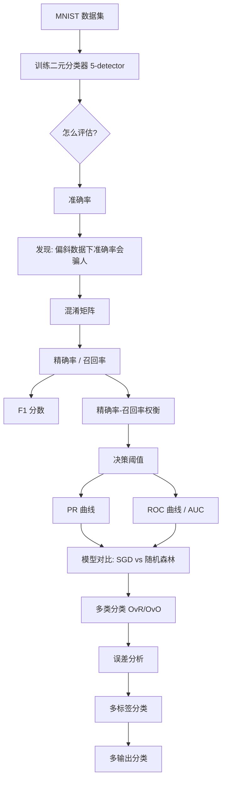
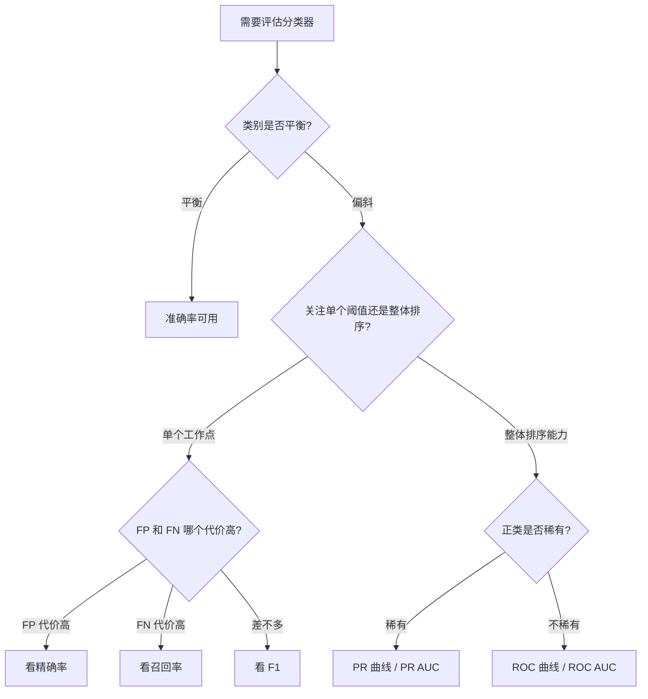

> 书目：*Hands-On Machine Learning with Scikit-Learn and PyTorch*
> 章节：Chapter 3, Classification
> 数据集：MNIST 手写数字（70,000 张 28×28 灰度图）
> 配套 Notebook：<https://homl.info/colab-p>

---

## 阅读导引

### 本章在全书中的位置

第 1 章告诉我们监督学习最常见的两类任务是**回归**（预测数值）和**分类**（预测类别）。第 2 章用加州房价完整走了一遍**回归**项目。本章把注意力转向**分类系统**。

一句话概括本章的定位：

> 第 2 章解决的是"项目怎么走完整个流程"，第 3 章解决的是"分类任务该怎么正确地评估"。

评估分类器往往比评估回归器棘手得多，这是理解本章结构的钥匙。本章**不是**一章“分类算法介绍”：`SGDClassifier`、`RandomForestClassifier`、`SVC`、`KNeighborsClassifier` 暂时都作为可用的模型来处理，它们的内部原理留到后续章节。本章真正要掌握的是：

1. 分类任务的评估指标体系（准确率、混淆矩阵、精确率、召回率、F₁、ROC、AUC）；
2. 这些指标之间的数学关系与权衡；
3. 如何把二元分类器扩展到多类、多标签、多输出场景；
4. 如何通过误差分析找到改进方向。

### 本章主线



这条主线采用一种很有效的问题推进方式：**先得到一个看起来很棒的结果，再揭示它的缺陷，由此引出下一个概念**。

- 准确率 95% → 但傻瓜分类器有 90% → 所以需要混淆矩阵
- 混淆矩阵信息全 → 但四个数字不便比较 → 所以需要精确率/召回率
- 两个指标不便比较 → 所以需要 F₁
- F₁ 假设两者同等重要 → 但现实往往不是 → 所以需要理解权衡
- 权衡由阈值控制 → 所以需要 PR 曲线和 ROC 曲线
- ROC 在偏斜数据上过于乐观 → 所以要知道何时用 PR 曲线

**学习本章时请始终追问：这个指标是为了修补前一个指标的什么缺陷而引入的？**

### 阅读前需要的知识

| 需要的知识 | 在本章中的作用 |
| --- | --- |
| 监督学习、分类与回归 | 明确分类任务的输入输出 |
| 训练集、验证集、测试集 | 避免在最终测试集上反复调参 |
| k 折交叉验证与分层抽样 | 获得更可靠、类别比例稳定的评估 |
| 特征缩放 `StandardScaler` | 改善 SGD 的优化过程 |
| 线性模型的打分函数 | 理解决策分数与分类阈值 |
| 调和平均数 | 理解 F₁ 为什么同时约束精确率和召回率 |
| 单调性与集合嵌套 | 理解阈值变化时指标如何变化 |
| NumPy 布尔索引、`argmax` | 实现标签构造、阈值选择和类别选择 |

---

## 0. 必要基础

### 0.1 线性分类器的"打分函数"是什么

本章反复出现 `decision_function()`，如果不知道它算的是什么，后面的阈值讨论就会变成死记硬背。

**问题从哪来**：`SGDClassifier` 是一个线性模型。给定一张图片的 784 维像素向量 $\mathbf{x} = (x_1, x_2, \dots, x_{784})$，模型内部保存一组权重 $\mathbf{w} = (w_1, \dots, w_{784})$ 和一个偏置 $b$，然后计算：

$$
s(\mathbf{x}) = \mathbf{w}^{\top}\mathbf{x} + b = \sum_{j=1}^{784} w_j x_j + b
$$

各符号含义：

- $x_j$：第 $j$ 个像素的强度，取值 $0 \sim 255$；
- $w_j$：模型学到的第 $j$ 个像素的权重，正权重表示"这个像素越黑越像 5"，负权重表示"这个像素越黑越不像 5"；
- $b$：偏置项，整体平移打分；
- $s(\mathbf{x})$：**决策分数**（decision score），一个实数，可正可负，没有上下界。

**分类规则**：

$$
\hat{y} =
\begin{cases}
\text{正类（是 5）}, & s(\mathbf{x}) > t \\
\text{负类（不是 5）}, & s(\mathbf{x}) \le t
\end{cases}
$$

其中 $t$ 是**决策阈值**。`SGDClassifier` 默认 $t = 0$。

这就解释了本章后面这段代码为什么成立：

```python
y_scores = sgd_clf.decision_function([some_digit])   # 得到 s(x)
y_some_digit_pred = (y_scores > 0)                   # 手动应用阈值 t=0
```

**直觉理解**：$s(\mathbf{x})$ 可以理解为"模型认为这是 5 的把握程度"。它**不是概率**，只是一个可以排序的分数。分数越高越像 5。这一点在后面区分 `decision_function()` 和 `predict_proba()` 时非常关键。

`SGDClassifier` 在这里是一个线性模型：它为每个像素分配权重，再把加权像素强度相加，得到每个类别的分数。

**适用边界**：并非所有分类器都有 `decision_function()`。Scikit-Learn 分类器至少提供 `decision_function()` 或 `predict_proba()` 之一，有些两者都有。

`RandomForestClassifier` 就只有 `predict_proba()`，这直接导致后面画 PR 曲线时必须换一种取分数的方式。

### 0.2 k 折交叉验证回顾

**要解决什么问题**：只划分一个验证集，评估结果会受"恰好划到哪些样本"的影响，方差大；而且验证集里的数据不能参与训练，浪费数据。

**做法**：把训练集切成 $k$ 份（fold）。做 $k$ 轮，每轮拿其中 1 份当验证集、其余 $k-1$ 份训练，得到 $k$ 个评估分数。

```
k=3 的示意：
轮次 1:  [验证][训练][训练]  → 分数 1
轮次 2:  [训练][验证][训练]  → 分数 2
轮次 3:  [训练][训练][验证]  → 分数 3
```

**关键性质**：每个样本恰好在**一轮**中充当过验证样本，且那一轮的模型从未见过它。这个性质是本章 `cross_val_predict()` 能给出"干净预测"的基础。

**分层 k 折**（`StratifiedKFold`）：切分时保持每折中各类别的比例与整体一致。对本章 5-detector 这种正类只占约 9% 的任务尤其重要——如果某一折里 5 的比例是 3%，另一折是 15%，那三折的分数就没有可比性。

### 0.3 调和平均数：为什么它"偏袒小值"

后面 F₁ 分数要用到，这里先讲清楚。

对两个正数 $a, b$：

- 算术平均：$A = \dfrac{a+b}{2}$
- 调和平均：$H = \dfrac{2}{\frac{1}{a} + \frac{1}{b}} = \dfrac{2ab}{a+b}$

**为什么调和平均会被小值拉低**（证明）：

不妨设 $b \le a$，即 $b = \min(a,b)$。

先证 $H \ge b$：

$$
H - b = \frac{2ab}{a+b} - b = \frac{2ab - b(a+b)}{a+b} = \frac{ab - b^2}{a+b} = \frac{b(a-b)}{a+b} \ge 0
$$

因为 $a \ge b > 0$，所以分子分母都非负。

再证 $H \le 2b$：

$$
H = \frac{2ab}{a+b} \le \frac{2ab}{a} = 2b
$$

因为 $a + b \ge a$，分母变小则分数变大，所以放大分母到 $a$ 后不等号成立。

合起来：

$$
\min(a,b) \;\le\; H \;\le\; 2\min(a,b)
$$

**结论**：调和平均被牢牢锁死在最小值的 1 倍到 2 倍之间。**只要有一个值很小，调和平均就必然很小**，无论另一个值多大。算术平均没有这个性质。

**数值对比**：

| $a$（精确率） | $b$（召回率） | 算术平均 | 调和平均（F₁） |
| ---: | ---: | ---: | ---: |
| 1.00 | 0.01 | 0.505 | 0.0198 |
| 0.90 | 0.10 | 0.500 | 0.180 |
| 0.60 | 0.40 | 0.500 | 0.480 |
| 0.50 | 0.50 | 0.500 | 0.500 |

四行的算术平均几乎都是 0.5，完全无法区分；调和平均从 0.02 一路涨到 0.50，清楚地反映了"两者是否都高"。

可运行验证：

```python
def arithmetic_mean(a, b):
    """算术平均：两个值同等对待"""
    return (a + b) / 2

def harmonic_mean(a, b):
    """调和平均：F1 分数用的就是它，会被小值拉低"""
    return 2 * a * b / (a + b)

for p, r in [(1.00, 0.01), (0.90, 0.10), (0.60, 0.40), (0.50, 0.50)]:
    print(f"P={p:.2f} R={r:.2f} | 算术={arithmetic_mean(p, r):.4f} "
          f"| 调和={harmonic_mean(p, r):.4f} | 下界={min(p, r):.4f} "
          f"| 上界={2 * min(p, r):.4f}")
```

输出：

```
P=1.00 R=0.01 | 算术=0.5050 | 调和=0.0198 | 下界=0.0100 | 上界=0.0200
P=0.90 R=0.10 | 算术=0.5000 | 调和=0.1800 | 下界=0.1000 | 上界=0.2000
P=0.60 R=0.40 | 算术=0.5000 | 调和=0.4800 | 下界=0.4000 | 上界=0.8000
P=0.50 R=0.50 | 算术=0.5000 | 调和=0.5000 | 下界=0.5000 | 上界=1.0000
```

每一行的调和平均都落在 `[下界, 上界]` 区间内，验证了上面的不等式。

---

## 1. MNIST 数据集

### 1.1 为什么选 MNIST

MNIST 被广泛研究，常被称为机器学习的“Hello World”。本章的重点是**评估方法**，而不是处理脏数据，因此 MNIST 很合适：图像干净、居中、旋转不大，数字尺寸也大致一致，几乎不需要复杂预处理。

真实数据集通常没这么友好，不要因为 MNIST 好用就以为分类任务都这么简单。

### 1.2 加载数据

代码：

```python
from sklearn.datasets import fetch_openml

mnist = fetch_openml('mnist_784', as_frame=False)
```

**`sklearn.datasets` 的三类函数**：

| 前缀 | 用途 | 例子 |
| --- | --- | --- |
| `fetch_*` | 从网络下载真实数据集 | `fetch_openml()` |
| `load_*` | 加载 Scikit-Learn 自带的小型玩具数据集，无需联网 | `load_iris()` |
| `make_*` | 生成人造数据集，适合测试 | `make_classification()` |

返回类型也有区别：

- `make_*` 通常返回 `(X, y)` 元组，两者都是 NumPy 数组；
- 其他返回 `sklearn.utils.Bunch` 对象——它是字典，但键也能当属性访问。

`Bunch` 常见的三个键：

- `"DESCR"`：数据集描述
- `"data"`：输入数据，通常是二维 NumPy 数组
- `"target"`：标签，通常是一维 NumPy 数组

**为什么要 `as_frame=False`**：`fetch_openml()` 默认返回 Pandas DataFrame 和 Series，但图像天然是数值矩阵，DataFrame 的列名、索引、混合类型在这里没有明显价值，反而增加开销。因此直接获取 NumPy 数组更合适。

默认情况下，Scikit-Learn 会把下载的数据集缓存在用户主目录的 `scikit_learn_data` 中。

**离线加载方案**（本工作区配套 Notebook 使用的写法，适合没网或下载慢的情况）：

```python
from pathlib import Path
from urllib.request import urlretrieve

import numpy as np
from sklearn.utils import Bunch

mnist_path = Path("datasets/mnist/mnist.npz")
mnist_path.parent.mkdir(parents=True, exist_ok=True)
if not mnist_path.is_file():
    url = "https://storage.googleapis.com/tensorflow/tf-keras-datasets/mnist.npz"
    urlretrieve(url, mnist_path)

with np.load(mnist_path) as mnist_file:
    # 该文件本身已分好 60000 训练 + 10000 测试，这里先拼成完整的 70000 张
    images = np.concatenate((mnist_file["x_train"], mnist_file["x_test"]))
    labels = np.concatenate((mnist_file["y_train"], mnist_file["y_test"]))

mnist = Bunch(
    data=images.reshape(-1, 28 * 28),   # 把 28×28 图像摊平成 784 维向量
    target=labels.astype(str),          # 标签转成字符串，与 fetch_openml 保持一致
    DESCR="MNIST handwritten digit dataset loaded from the TensorFlow mirror.",
)
```

注意 `target=labels.astype(str)`：这一步是为了和 `fetch_openml()` 的返回保持一致。后面代码使用 `y_train == '5'`（**字符串** `'5'` 而不是整数 `5`）；如果标签是整数，这个比较会全部返回 `False`。这是初学者最常踩的坑之一。

### 1.3 数据结构

```python
X, y = mnist.data, mnist.target
```

输出：

```
>>> X.shape
(70000, 784)
>>> y
array(['5', '0', '4', ..., '4', '5', '6'], dtype=object)
>>> y.shape
(70000,)
```

**逐项解读**：

- 70,000：图片总数；
- 784：特征数，来自 $28 \times 28 = 784$；
- 每个特征是**一个像素的强度**，取值 0（白）到 255（黑）；
- `y` 是字符串数组，`dtype=object`。

**这里隐含一个重要观念**：模型看到的不是"图片"，而是一个 784 维的数值向量。像素之间的**空间关系**（哪个像素挨着哪个）在摊平之后**完全丢失了**。线性模型只是给 784 个位置各分配一个权重然后加权求和。这解释了本章误差分析里的核心结论——模型对平移和旋转极其敏感。真正利用空间结构的模型（卷积网络）要到第 12 章。

### 1.4 可视化一个数字

```python
import matplotlib.pyplot as plt

def plot_digit(image_data):
    """把 784 维向量还原成 28×28 图像并显示"""
    image = image_data.reshape(28, 28)   # 摊平的逆操作
    plt.imshow(image, cmap="binary")     # binary 色图：0 显示为白，255 显示为黑
    plt.axis("off")

some_digit = X[0]
plot_digit(some_digit)
plt.show()
```

```
>>> y[0]
'5'
```

这个 `some_digit`（第 0 张图，标签为 `'5'`）会作为**贯穿全章的测试样例**反复出现，请记住它。

### 1.5 划分测试集

在深入检查数据前，应该先创建并隔离测试集，避免数据窥探偏差。MNIST 已经划分好了：

```python
X_train, X_test, y_train, y_test = X[:60000], X[60000:], y[:60000], y[60000:]
```

前 60,000 张是训练集，后 10,000 张是测试集。

需要注意，`fetch_openml()` 返回的数据集并不一定已经打乱或划分。**不要想当然地认为所有 OpenML 数据都具备 MNIST 的划分方式。**

### 1.6 为什么"已经打乱"是件好事

打乱数据有两个作用：

1. **保证交叉验证各折相似**。如果数据按标签排序（前 7000 张全是 0，接着全是 1……），那么 3 折交叉验证的第一折可能只包含数字 0～2，模型根本没见过其他数字，评估结果毫无意义。
2. **有些算法对样本顺序敏感**。`SGDClassifier` 就是典型：随机梯度下降**一次只用一个样本**更新参数。如果连续喂进 100 个 5，参数会被强行拉向"什么都是 5"的方向；接着连续喂 100 个 0，又被拉回去。这种震荡会严重损害收敛。

**重要例外**：时间序列不能随意打乱。否则训练集可能混入未来数据，模型相当于用未来预测过去，造成严重的数据泄漏。

---

## 2. 训练一个二元分类器

### 2.1 为什么先简化成二分类

绝大多数经典指标（精确率、召回率、ROC）都是从二分类定义开始的。先把 10 类问题简化为“是 5 / 不是 5”，可以在最清晰的场景下理解整套指标体系，再推广到多类。

这个"5-detector"是一个**二元分类器**（binary classifier），只区分两个类别。

```python
y_train_5 = (y_train == '5')  # 是 5 的为 True，其他数字为 False
y_test_5 = (y_test == '5')
```

这行代码利用了 NumPy 的**逐元素比较 + 布尔数组**：`y_train == '5'` 返回一个长度 60,000 的布尔数组。

**术语约定**（后面所有指标都依赖它）：

- **正类（positive class）** = `True` = 是 5
- **负类（negative class）** = `False` = 不是 5

哪一类当正类是**人为规定**的，但一旦定下来，精确率、召回率的含义就完全确定了。**换一个正类，所有指标的数值都会变**。这是初学者常见的困惑来源。

### 2.2 选择 SGDClassifier

```python
from sklearn.linear_model import SGDClassifier

sgd_clf = SGDClassifier(random_state=42)
sgd_clf.fit(X_train, y_train_5)
```

选择 SGDClassifier 有两个原因：

1. **能高效处理超大数据集**——因为一次只处理一个样本，内存里不需要放下全部数据；
2. **天然适合在线学习**——新数据来了可以继续更新参数，无需从头训练（对应第 1 章的在线学习概念）。

`random_state=42` 的作用：SGD 中的"S"是 Stochastic（随机），样本的访问顺序、参数的初始化都带随机性。固定随机种子才能让结果可复现。这是第 2 章"结果可复现"要求的延续。

预测：

```python
>>> sgd_clf.predict([some_digit])
array([ True])
```

注意 `[some_digit]` 外面这层方括号：Scikit-Learn 的 `predict()` 期望一个**二维数组**（多个样本），即使只预测一个样本也要包成 `(1, 784)` 的形状。

但单个样本预测正确并不能说明模型整体有效，一个样本预测对了**什么都说明不了**。下一步必须进行系统评估。

---

## 3. 性能度量

> 这是本章篇幅最大、也最重要的一节。

### 3.1 用交叉验证测量准确率

#### 3.1.1 准确率的定义

**准确率**（accuracy）= 预测正确的样本数 / 总样本数。

用混淆矩阵的记号（下一节会正式引入）：

$$
\text{accuracy} = \frac{TP + TN}{TP + TN + FP + FN}
$$

#### 3.1.2 第一次评估：看起来很棒

```python
>>> from sklearn.model_selection import cross_val_score
>>> cross_val_score(sgd_clf, X_train, y_train_5, cv=3, scoring="accuracy")
array([0.95035, 0.96035, 0.9604 ])
```

三折全部超过 95%。这个结果看似很高，但还不能下结论。

#### 3.1.3 反例：傻瓜分类器

```python
from sklearn.dummy import DummyClassifier

dummy_clf = DummyClassifier()
dummy_clf.fit(X_train, y_train_5)
print(any(dummy_clf.predict(X_train)))  # 输出 False：一个 5 都没检测到
```

`DummyClassifier` 默认策略是**永远预测最频繁的类别**，这里就是负类（不是 5）。`any(...)` 返回 `False`，证实它的预测**全是** `False`。

```python
>>> cross_val_score(dummy_clf, X_train, y_train_5, cv=3, scoring="accuracy")
array([0.90965, 0.90965, 0.90965])
```

**一个什么都不学的模型拿到了 90.965% 的准确率。**

#### 3.1.4 数值验算：这个 90.965% 是怎么来的

由完美分类器的混淆矩阵可知训练集中：

- 正类（是 5）：5,421 张
- 负类（不是 5）：54,579 张
- 合计：60,000 张

一个永远预测负类的模型，会把全部 54,579 个负类样本预测正确，全部 5,421 个正类样本预测错误：

$$
\text{accuracy} = \frac{54{,}579}{60{,}000} = 0.90965
$$

**和上述输出的 `0.90965` 完全一致。**

这个验算揭示了一条一般规律：

> 设正类占比为 $p$，那么"永远预测负类"这个平凡模型的准确率恰好是 $1 - p$。

MNIST 中 5 的占比：

$$
p = \frac{5{,}421}{60{,}000} = 0.09035 = 9.035\%
$$

$1 - p = 0.90965$。✓

可运行验证：

```python
n_positive = 5421      # 训练集中数字 5 的数量
n_negative = 54579     # 非 5 的数量
n_total = n_positive + n_negative

p = n_positive / n_total
print(f"正类占比 p = {p:.5f}")
print(f"永远预测负类的准确率 = 1 - p = {1 - p:.5f}")
print(f"DummyClassifier 实际结果    = 0.90965")
```

输出：

```
正类占比 p = 0.09035
永远预测负类的准确率 = 1 - p = 0.90965
DummyClassifier 实际结果    = 0.90965
```

#### 3.1.5 结论：准确率什么时候不可信

**偏斜数据集**（skewed dataset）：某些类别比其他类别频繁得多。

**为什么准确率在这里失效**（直觉解释）：准确率把两类错误——"把非 5 当成 5"和"把 5 当成非 5"——**同等对待**，并且用**全体样本**做分母。当负类占 91% 时，分母被负类主导，模型在正类上表现如何几乎影响不了这个数字。

**易混淆点辨析**：

| 说法 | 对错 | 说明 |
| --- | --- | --- |
| "准确率永远不能用" | ✗ | 类别大致平衡时准确率是很好的指标，后面的 10 类分类就可以使用它。 |
| "95% 准确率说明模型很好" | ✗ | 必须和基线比。这里基线（傻瓜分类器）是 90.965%，95.7% 的提升其实很有限。 |
| "偏斜数据下要换指标" | ✓ | 应进一步查看混淆矩阵、精确率和召回率。 |

**实践建议**：任何分类任务都应先跑一个 `DummyClassifier` 拿到基线。如果模型没有明显超过它，说明模型可能没有学到有效规律。

### 3.2 自己实现交叉验证

有时需要比 `cross_val_score()` 更精细地控制交叉验证过程，因此值得理解它的内部步骤。

代码：

```python
from sklearn.model_selection import StratifiedKFold
from sklearn.base import clone

skfolds = StratifiedKFold(n_splits=3)  # 若数据尚未打乱，加 shuffle=True

for train_index, test_index in skfolds.split(X_train, y_train_5):
    clone_clf = clone(sgd_clf)                # 关键：克隆出一个全新的未训练模型
    X_train_folds = X_train[train_index]
    y_train_folds = y_train_5[train_index]
    X_test_fold = X_train[test_index]
    y_test_fold = y_train_5[test_index]

    clone_clf.fit(X_train_folds, y_train_folds)
    y_pred = clone_clf.predict(X_test_fold)
    n_correct = sum(y_pred == y_test_fold)
    print(n_correct / len(y_pred))  # 输出 0.95035、0.96035、0.9604
```

输出与 `cross_val_score()` **完全一致**，证明我们理解了它内部在做什么。

**逐行拆解，每一步的依据**：

1. `StratifiedKFold(n_splits=3)`——用**分层抽样**产生三折，让各折保持具有代表性的类别比例。正类只占约 9%，普通随机切分可能让某折的正类比例明显偏离整体，导致三折分数不可比。

2. `skfolds.split(X_train, y_train_5)`——注意它**需要 `y`**，因为要按 `y` 的类别分布来分层。普通的 `KFold` 只需要 `X`。

3. `clone(sgd_clf)`——**这是最容易被忽略、也最致命的一步**。`clone()` 复制的是**超参数配置**，返回一个**未训练**的新模型。

   如果直接写 `sgd_clf.fit(...)` 会怎样？第二轮训练时，模型里已经残留着第一轮的参数。虽然 `fit()` 通常会重置参数，但对支持 `warm_start` 或增量学习的模型就可能出问题；更重要的是，三轮共用一个对象，最终 `sgd_clf` 的状态是最后一折训练的结果，语义混乱。**每折必须是独立的、从零开始训练的模型**，否则各折之间会互相污染。

4. `sum(y_pred == y_test_fold)`——布尔数组求和，`True` 记为 1，得到预测正确的数量。

5. `n_correct / len(y_pred)`——准确率。

**关于 `shuffle=True`**：MNIST 已经打乱，所以这里省略；如果数据尚未打乱，应设置 `shuffle=True`，并通常同时固定 `random_state`。

### 3.3 混淆矩阵

#### 3.3.1 核心思想

**混淆矩阵**（confusion matrix, CM）：统计"真实类别 A 的样本被预测成类别 B"的次数，对所有 (A, B) 组合都统计。

读取方法是：**行 = 真实类别，列 = 预测类别**。例如真实的 8 被预测成 0 的次数位于第 8 行、第 0 列。Scikit-Learn 遵循这个约定；阅读其他资料时仍应先确认其约定。

#### 3.3.2 为什么要用 `cross_val_predict()`

计算混淆矩阵时需要解决三个问题：
- **需要预测结果**才能和真实标签比对；
- **不能用测试集**——第 2 章的纪律：测试集只在项目最后用一次；
- **不能直接用训练集上的预测**——模型见过这些数据，预测过于乐观。

```python
from sklearn.model_selection import cross_val_predict

y_train_pred = cross_val_predict(sgd_clf, X_train, y_train_5, cv=3)
```

**"干净预测"（clean / out-of-sample prediction）的严格含义**：

对训练集中的每一个样本 $i$，`cross_val_predict()` 返回的预测值，是由**那个没有用样本 $i$ 训练过**的模型给出的。

这一点为什么成立？回到 0.2 节的性质：k 折交叉验证中，每个样本恰好在一轮里当验证样本，而那一轮的模型是用**其余 $k-1$ 折**训练的，不包含该样本。

**这是本章一个反复使用的核心工具**——后面算混淆矩阵、精确率、召回率、PR 曲线、ROC 曲线用的分数，全部来自 `cross_val_predict()`。

**易混淆对比**：

| 函数 | 返回什么 | 典型用途 |
| --- | --- | --- |
| `cross_val_score()` | $k$ 个**评估分数** | 快速看模型好不好 |
| `cross_val_predict()` | 每个样本一个**预测值/分数** | 需要逐样本结果时：混淆矩阵、PR/ROC 曲线、误差分析 |

#### 3.3.3 读懂混淆矩阵

```python
>>> from sklearn.metrics import confusion_matrix
>>> cm = confusion_matrix(y_train_5, y_train_pred)
>>> cm
array([[53892,   687],
       [ 1891,  3530]])
```

逐格解读：

$$
\text{CM} =
\begin{pmatrix}
53892 & 687 \\
1891 & 3530
\end{pmatrix}
$$

| 位置 | 数值 | 名称 | 含义 | 别名 |
| --- | ---: | --- | --- | --- |
| 第 1 行第 1 列 | 53,892 | **真负例 TN**（true negative） | 真实不是 5，预测也不是 5 —— 正确 | — |
| 第 1 行第 2 列 | 687 | **假正例 FP**（false positive） | 真实不是 5，却被预测成 5 —— 错误 | 第一类错误（type I error） |
| 第 2 行第 1 列 | 1,891 | **假负例 FN**（false negative） | 真实是 5，却被预测成不是 5 —— 错误 | 第二类错误（type II error） |
| 第 2 行第 2 列 | 3,530 | **真正例 TP**（true positive） | 真实是 5，预测也是 5 —— 正确 | — |

**记忆方法**：两个词分别看。

- 第二个词（Positive / Negative）= **模型预测的是什么**；
- 第一个词（True / False）= **模型预测得对不对**。

所以 "False Negative" = 模型预测为负类（Negative），而且预测错了（False），因此真实是正类。

**完美分类器**：

```python
>>> y_train_perfect_predictions = y_train_5  # 假装我们达到了完美
>>> confusion_matrix(y_train_5, y_train_perfect_predictions)
array([[54579,     0],
       [    0,  5421]])
```

从这个矩阵我们读出了 3.1.4 节用到的两个关键数字：负类总数 54,579，正类总数 5,421。

**行和的含义**（数值验算）：

- 第 1 行和：$53{,}892 + 687 = 54{,}579$ = 真实负类总数 ✓
- 第 2 行和：$1{,}891 + 3{,}530 = 5{,}421$ = 真实正类总数 ✓
- 总和：$54{,}579 + 5{,}421 = 60{,}000$ = 训练集大小 ✓

**行和恒等于真实类别的样本数**，这是因为每个样本恰好被预测成某一类，所以它一定落在自己那一行的某一列里。这个性质在后面"按行归一化"时会用到。

**用混淆矩阵反推准确率**（数值验算，用于交叉印证）：

$$
\text{accuracy} = \frac{TP + TN}{60{,}000} = \frac{3{,}530 + 53{,}892}{60{,}000} = \frac{57{,}422}{60{,}000} = 0.957033\ldots
$$

而三折交叉验证准确率的平均值：

$$
\frac{0.95035 + 0.96035 + 0.9604}{3} = \frac{2.8711}{3} = 0.957033\ldots
$$

**两者完全一致**。这不是巧合：`cross_val_predict()` 和 `cross_val_score()` 用的是同样的划分，所以整体准确率必然等于各折准确率的平均（各折大小相同时）。

可运行验证：

```python
import numpy as np

cm = np.array([[53892, 687],
               [1891, 3530]])

tn, fp, fn, tp = cm.ravel()   # 按行展平：TN, FP, FN, TP
print(f"TN={tn}  FP={fp}  FN={fn}  TP={tp}")
print(f"真实负类总数（第1行和） = {tn + fp}")
print(f"真实正类总数（第2行和） = {fn + tp}")
print(f"样本总数               = {cm.sum()}")
print(f"整体准确率             = {(tp + tn) / cm.sum():.6f}")
print(f"三折准确率均值         = {np.mean([0.95035, 0.96035, 0.9604]):.6f}")
```

输出：

```
TN=53892  FP=687  FN=1891  TP=3530
真实负类总数（第1行和） = 54579
真实正类总数（第2行和） = 5421
样本总数               = 60000
整体准确率             = 0.957033
三折准确率均值         = 0.957033
```

### 3.4 精确率与召回率

#### 3.4.1 为什么还不够：从混淆矩阵到单一指标

混淆矩阵有 4 个数字，比较两个模型时要比 4 组数字，不好办。于是需要**压缩成少数几个数**。

#### 3.4.2 精确率

**要解决的问题**："模型说是 5 的那些图，有多少真的是 5？"

**公式 3-1：精确率**：

$$
\text{precision} = \frac{TP}{TP + FP}
$$

其中 $TP$ 是真正例数量，$FP$ 是假正例数量。

**分母的直觉**：$TP + FP$ = 所有**被预测为正类**的样本数。回到混淆矩阵，这正是**第 2 列的和**（预测为正的那一列）。所以：

> 精确率 = 混淆矩阵中"正类列"里对角线元素的占比。

**一个重要警告**：

**精确率可以被轻易刷到 100%**：只要极度保守，只在最有把握的一个样本上说"是"。所以精确率**不能单独使用**。

#### 3.4.3 召回率

**要解决的问题**："所有真正的 5 里面，模型找出来了多少？"

**公式 3-2：召回率**：

$$
\text{recall} = \frac{TP}{TP + FN}
$$

含义 "*FN* is, of course, the number of false negatives."

**别名**：召回率 = **敏感度**（sensitivity）= **真正例率**（true positive rate, TPR）。这三个词指同一个指标。

**分母的直觉**：$TP + FN$ = 所有**真实为正类**的样本数 = 混淆矩阵**第 2 行的和**。所以：

> 召回率 = 混淆矩阵中"正类行"里对角线元素的占比。

**精确率与召回率的结构对比**（这是理解二者关系的关键）：

| | 精确率 | 召回率 |
| --- | --- | --- |
| 分子 | $TP$ | $TP$ |
| 分母 | $TP + FP$（**列**和） | $TP + FN$（**行**和） |
| 沿着混淆矩阵的方向 | 竖着看（预测为正的一列） | 横着看（真实为正的一行） |
| 回答的问题 | 我说是的，对了多少 | 该找的，找到了多少 |
| 惩罚哪种错误 | 假正例 FP | 假负例 FN |
| 分母会不会随阈值变 | **会**（$TP+FP$ 随阈值变化） | **不会**（$TP+FN$ 是真实正类总数，恒定） |

最后一行是理解 3.5 节"为什么召回率单调而精确率不单调"的根本原因，请特别留意。

#### 3.4.4 数值计算与验算

```python
>>> from sklearn.metrics import precision_score, recall_score
>>> precision_score(y_train_5, y_train_pred)  # == 3530 / (687 + 3530)
np.float64(0.8370879772350012)
>>> recall_score(y_train_5, y_train_pred)     # == 3530 / (1891 + 3530)
np.float64(0.6511713705958311)
```

手工验算：

$$
\text{precision} = \frac{3530}{3530 + 687} = \frac{3530}{4217} = 0.8370879772350012
$$

$$
\text{recall} = \frac{3530}{3530 + 1891} = \frac{3530}{5421} = 0.6511713705958311
$$

这意味着：模型声称某张图是 5 时，只有 83.7% 的概率判断正确；同时它只找出了全部 5 中的 65.1%。对比 3.1 节的 95.7% 准确率，同一个模型换个指标，就从“看起来很棒”变成了“漏掉约三分之一的 5”。

#### 3.4.5 F₁ 分数

**要解决的问题**：精确率和召回率是两个数，比较两个模型时仍然不方便。需要**合成一个数**。

**公式 3-3：F₁ 分数**：

$$
F_1 = \frac{2}{\dfrac{1}{\text{precision}} + \dfrac{1}{\text{recall}}}
= 2 \times \frac{\text{precision} \times \text{recall}}{\text{precision} + \text{recall}}
= \frac{TP}{TP + \dfrac{FN + FP}{2}}
$$

这三个形式完全等价。下面逐步推导每一步依据。

---

**推导：从第一式到第二式**

起点是调和平均的定义：

$$
F_1 = \frac{2}{\frac{1}{P} + \frac{1}{R}}
$$

其中记 $P = \text{precision}$，$R = \text{recall}$，且 $P, R > 0$。

第一步，把分母通分：

$$
\frac{1}{P} + \frac{1}{R} = \frac{R}{PR} + \frac{P}{PR} = \frac{P + R}{PR}
$$

依据：通分，把两个分数化为同一分母 $PR$。这里要求 $P \ne 0$ 且 $R \ne 0$。

第二步，代回原式（除以一个分数等于乘它的倒数）：

$$
F_1 = \frac{2}{\frac{P+R}{PR}} = 2 \cdot \frac{PR}{P+R} = 2 \times \frac{P \times R}{P + R}
$$

得到第二式。✓

---

**推导：从第一式到第三式**

第一步，代入定义。由公式 3-1 和 3-2：

$$
P = \frac{TP}{TP + FP} \quad\Longrightarrow\quad \frac{1}{P} = \frac{TP + FP}{TP}
$$

$$
R = \frac{TP}{TP + FN} \quad\Longrightarrow\quad \frac{1}{R} = \frac{TP + FN}{TP}
$$

依据：取倒数。要求 $TP > 0$。

第二步，两者相加（分母相同，直接加分子）：

$$
\frac{1}{P} + \frac{1}{R} = \frac{(TP + FP) + (TP + FN)}{TP} = \frac{2\,TP + FP + FN}{TP}
$$

第三步，代回：

$$
F_1 = \frac{2}{\frac{2TP + FP + FN}{TP}} = \frac{2\,TP}{2\,TP + FP + FN}
$$

第四步，分子分母同除以 2：

$$
F_1 = \frac{TP}{TP + \dfrac{FP + FN}{2}}
$$

得到第三式。✓

---

**第三式的直觉解读**（这个形式最有洞察力）：

把它和准确率对照：

$$
\text{accuracy} = \frac{TP + TN}{TP + TN + FP + FN}, \qquad
F_1 = \frac{TP}{TP + \frac{FP+FN}{2}}
$$

区别一目了然：

1. **F₁ 的分子和分母里完全没有 $TN$**。这就是 F₁ 在偏斜数据上比准确率可靠的根本原因——那 53,892 个"正确识别的非 5"根本不参与计算，无法用海量负类来稀释错误。
2. **两类错误 $FP$ 和 $FN$ 各按一半权重计入分母**，即 F₁ 对两种错误一视同仁。

**成立条件与适用边界**：

- 要求 $P > 0$ 且 $R > 0$（等价于 $TP > 0$）。若 $TP = 0$，第一式的倒数无定义，但第三式给出 $F_1 = 0$，Scikit-Learn 也按 0 处理。
- F₁ 隐含假设"精确率和召回率同等重要"。如果不是，应该用加权版本 $F_\beta$（这里不展开）。

**数值验算**：

```python
>>> from sklearn.metrics import f1_score
>>> f1_score(y_train_5, y_train_pred)
0.7325171197343846
```

用第三式手算：

$$
F_1 = \frac{3530}{3530 + \frac{1891 + 687}{2}} = \frac{3530}{3530 + \frac{2578}{2}} = \frac{3530}{3530 + 1289} = \frac{3530}{4819} = 0.7325171197343846
$$

**与上述输出完全一致。**

用第二式验算：

$$
F_1 = 2 \times \frac{0.8370879772350012 \times 0.6511713705958311}{0.8370879772350012 + 0.6511713705958311} = 2 \times \frac{0.5450848\ldots}{1.4882593\ldots} = 0.7325171\ldots
$$

同样一致。

可运行的三式验证：

```python
from fractions import Fraction

tp, fp, fn = 3530, 687, 1891

P = Fraction(tp, tp + fp)   # 精确率，用分数避免浮点误差
R = Fraction(tp, tp + fn)   # 召回率

f1_form1 = 2 / (1 / P + 1 / R)                 # 第一式：调和平均定义
f1_form2 = 2 * (P * R) / (P + R)               # 第二式
f1_form3 = Fraction(tp, 1) / (tp + Fraction(fp + fn, 2))  # 第三式

print(f"精确率 P = {float(P):.16f}   （参考值 0.8370879772350012）")
print(f"召回率 R = {float(R):.16f}   （参考值 0.6511713705958311）")
print(f"F1 第一式 = {float(f1_form1):.16f}")
print(f"F1 第二式 = {float(f1_form2):.16f}")
print(f"F1 第三式 = {float(f1_form3):.16f}")
print(f"三式是否严格相等: {f1_form1 == f1_form2 == f1_form3}")
print(f"F1 的既约分数形式: {f1_form3}")

p_float, r_float = tp / (tp + fp), tp / (tp + fn)
print(f"浮点路径 2PR/(P+R) = {2 * p_float * r_float / (p_float + r_float):.16f}")
```

输出：

```
精确率 P = 0.8370879772350012   （参考值 0.8370879772350012）
召回率 R = 0.6511713705958311   （参考值 0.6511713705958311）
F1 第一式 = 0.7325171197343847
F1 第二式 = 0.7325171197343847
F1 第三式 = 0.7325171197343847
三式是否严格相等: True
F1 的既约分数形式: 3530/4819
浮点路径 2PR/(P+R) = 0.7325171197343846
```

用 `Fraction` 做精确有理数运算，证明三个形式**在数学上严格相等**，不是浮点巧合。

**⚠️ 注意最后一位数字**：精确有理数 $3530/4819$ 转成浮点是 `...847`，而按浮点顺序计算（sklearn 的路径）得到 `...846`，与上述输出一致。两者相差 1 个**最小浮点单位**（1 ULP）。

**这不是谁算错了**，而是浮点运算**不满足结合律**的正常现象：先算 $P$、$R$ 再组合，与先约分成 $3530/4819$ 再做一次除法，中间的舍入误差累积路径不同。实践含义是：**比较浮点指标时不要用 `==`**，应该用 `math.isclose()` 或 `numpy.allclose()` 设定容差。

#### 3.4.6 F₁ 不总是你想要的

F₁ 偏爱精确率和召回率相近的分类器，但这不一定符合业务目标。由 0.3 节的不等式 $\min(P,R) \le F_1 \le 2\min(P,R)$，F₁ 被较小值牢牢限制；当二者差距很大时，F₁ 会接近较小的那个。

三个典型场景：

| 场景 | 更看重 | 理由 |
| --- | --- | --- |
| **儿童安全视频过滤** | **精确率** | 宁可误杀很多好视频（低召回），也要保证留下的都是安全的。不良视频漏进产品的代价更高，还可以增加人工审核。 |
| **监控录像识别扒手** | **召回率** | 30% 精确率也可以接受，只要有 99% 召回率。保安会收到一些误报，但几乎所有扒手都会被抓到。 |
| **医疗诊断** | **召回率** | 避免漏诊。假正例可以通过后续检查排除，假负例（漏诊）却可能造成严重后果。 |

**判断准则**：

> 问自己：**哪一类错误的代价更高？**
>
> - 假正例（FP）代价高 → 优先保精确率
> - 假负例（FN）代价高 → 优先保召回率
> - 两者相当 → 用 F₁

由此得到核心结论：提高精确率通常会降低召回率，反之亦然，这就是**精确率/召回率权衡**。

### 3.5 精确率/召回率权衡

#### 3.5.1 权衡的来源：决策阈值

权衡来自决策机制本身：模型先计算分数，分数超过阈值就判为正类，否则判为负类。精确率和召回率不是两个独立旋钮，而是由同一个阈值 $t$ 共同控制。

用图 3-4 的例子完整演算：

设想若干数字按分数从低到高排列，**阈值放在中间**：

- 阈值右侧有 5 个样本被判为正类：4 个真的是 5（TP=4），1 个其实是 6（FP=1）
- 全部真实的 5 一共 6 个，右侧只捞到 4 个，所以漏了 2 个（FN=2）

计算：

$$
P = \frac{TP}{TP+FP} = \frac{4}{4+1} = \frac{4}{5} = 80\%, \qquad
R = \frac{TP}{TP+FN} = \frac{4}{6} \approx 67\%
$$

**提高阈值**（右移到最右边的箭头）：

提高阈值后的结果是精确率升到 100%、召回率降到 50%。对应 $TP=3$、$FP=0$、$FN=3$：

$$
P = \frac{3}{3+0} = 100\%, \qquad R = \frac{3}{6} = 50\%
$$

原因是：那个假正例（6）变成了真负例，精确率因此上升；同时一个真正例变成了假负例，召回率因此下降。

**降低阈值**会纳入更多预测正类，通常提高召回率并降低精确率。

#### 3.5.2 手动控制阈值

```python
>>> y_scores = sgd_clf.decision_function([some_digit])
>>> y_scores
array([2164.22030239])
>>> threshold = 0
>>> y_some_digit_pred = (y_scores > threshold)
>>> y_some_digit_pred
array([ True])
```

`some_digit`（真实是 5）的决策分数是 **2164.22**。用默认阈值 0，判为正类，正确。

提高阈值：

```python
>>> threshold = 3000
>>> y_some_digit_pred = (y_scores > threshold)
>>> y_some_digit_pred
array([False])
```

$2164.22 < 3000$，所以判为负类，**漏掉了一个真实的 5**。这直接验证了提高阈值会降低召回率。

#### 3.5.3 单调性分析：为什么召回率平滑、精确率抖动

从公式结构可以严格证明：召回率随阈值升高单调不增，而精确率不保证单调。

**设定符号**：设训练集有 $m$ 个样本，样本 $i$ 的分数为 $s_i$，真实正类集合为 $\mathcal{P}$（$|\mathcal{P}| = n_+$ 固定）。定义阈值为 $t$ 时的**预测正类集合**：

$$
S(t) = \{\, i : s_i \ge t \,\}
$$

**关键性质（集合嵌套）**：若 $t_1 < t_2$，则

$$
S(t_2) \subseteq S(t_1)
$$

依据：若 $s_i \ge t_2$，由 $t_2 > t_1$ 得 $s_i \ge t_2 > t_1$，故 $i \in S(t_1)$。也就是**抬高阈值只会移出样本，绝不会加入新样本**。

**（1）召回率单调不增**

$$
R(t) = \frac{|S(t) \cap \mathcal{P}|}{n_+}
$$

- 分子 $|S(t) \cap \mathcal{P}| = TP(t)$：由嵌套性，$S(t_2) \subseteq S(t_1)$ 蕴含 $S(t_2)\cap\mathcal{P} \subseteq S(t_1)\cap\mathcal{P}$，所以 $TP(t_2) \le TP(t_1)$，**分子单调不增**。
- 分母 $n_+$ 是真实正类总数，**与阈值无关，恒定**。

分子不增、分母不变 ⟹ $R(t)$ **单调不增**。所以召回率曲线是平滑单调的。∎

**（2）精确率不单调**

$$
P(t) = \frac{TP(t)}{|S(t)|}
$$

分子分母**同时**随阈值升高而减小，比值方向不确定。

具体分析：从阈值 $t$ 抬高到恰好移出**一个**样本时，

- 若移出的是**假正例**：$TP$ 不变，$|S|$ 减 1 ⟹ 精确率**上升**；
- 若移出的是**真正例**：$TP$ 减 1，$|S|$ 减 1 ⟹ 精确率**可能下降**。

后一种情况例如：从 $4/5 = 80\%$ 变成 $3/4 = 75\%$。

（说明：移出一个真正例时，$\frac{TP-1}{|S|-1}$ 与 $\frac{TP}{|S|}$ 的大小关系取决于 $TP/|S|$ 与 1 的关系；由于 $TP \le |S|$，一般会下降，除非原本精确率已是 100%。）

**可运行的数值演示**：

```python
import numpy as np

labels_desc = np.array([1, 0, 1, 1, 0, 1])
n_pos = labels_desc.sum()   # 真实正类总数 = 4，这个数不随阈值变化

print("阈值从高到低移动（k = 被判为正类的样本数）：")
print(f"{'k':>2} {'TP':>3} {'|S|':>4} {'精确率':>8} {'召回率':>8}  变化")
prev_p = None
for k in range(1, len(labels_desc) + 1):
    tp = labels_desc[:k].sum()      # 前 k 个中的真正例数
    precision = tp / k              # 分母 = k = |S(t)|，随阈值变化
    recall = tp / n_pos             # 分母 = n_pos，恒定不变
    if prev_p is None:
        trend = "—"
    elif precision > prev_p:
        trend = "精确率↑"
    elif precision < prev_p:
        trend = "精确率↓ ← 非单调！"
    else:
        trend = "精确率→"
    print(f"{k:>2} {tp:>3} {k:>4} {precision:>8.4f} {recall:>8.4f}  {trend}")
    prev_p = precision
```

输出：

```
阈值从高到低移动（k = 被判为正类的样本数）：
 k  TP  |S|    精确率     召回率  变化
 1   1    1   1.0000   0.2500  —
 2   1    2   0.5000   0.2500  精确率↓ ← 非单调！
 3   2    3   0.6667   0.5000  精确率↑
 4   3    4   0.7500   0.7500  精确率↑
 5   3    5   0.6000   0.7500  精确率↓ ← 非单调！
 6   4    6   0.6667   1.0000  精确率↑
```

观察结论，完全印证上面的证明：

- **召回率列**：$0.25 \to 0.25 \to 0.5 \to 0.75 \to 0.75 \to 1.0$，**单调不减**（阈值降低方向），从不回头 ⟹ 曲线平滑；
- **精确率列**：$1.0 \to 0.5 \to 0.667 \to 0.75 \to 0.6 \to 0.667$，**上下震荡** ⟹ 曲线抖动。

震荡出现在 $k=2$ 和 $k=5$，正是新纳入的样本是负类（`0`）的位置。

#### 3.5.4 绘制 PR 与阈值的关系

```python
y_scores = cross_val_predict(sgd_clf, X_train, y_train_5, cv=3,
                             method="decision_function")
```

关键参数 `method="decision_function"`：让 `cross_val_predict()` 返回**分数**而不是布尔预测。有了分数，我们就能事后任意调整阈值，不必重新训练。

```python
from sklearn.metrics import precision_recall_curve

precisions, recalls, thresholds = precision_recall_curve(y_train_5, y_scores)
```

`precision_recall_curve()` 会额外添加一个“精确率为 1、召回率为 0”的终点，对应无穷大阈值。因此：

$$
\texttt{len(precisions)} = \texttt{len(recalls)} = \texttt{len(thresholds)} + 1
$$

多出来的那个点对应"阈值 = 正无穷"，此时没有任何样本被判为正类，人为规定精确率 = 1、召回率 = 0。

这就解释了绘图代码里为什么要切片 `[:-1]`：

```python
plt.plot(thresholds, precisions[:-1], "b--", label="Precision", linewidth=2)
plt.plot(thresholds, recalls[:-1], "g-", label="Recall", linewidth=2)
plt.vlines(threshold, 0, 1.0, "k", "dotted", label="threshold")
plt.show()
```

**不切片会直接报错**（长度不匹配）。这是实践中很常见的报错点。

图 3-5 显示：在阈值 3,000 处，精确率接近 90%，召回率约为 50%。

#### 3.5.5 PR 曲线

另一种展示方式是直接画精确率对召回率：

```python
plt.plot(recalls, precisions, linewidth=2, label="Precision/Recall curve")
plt.show()
```

图 3-6 显示，召回率接近 80% 时精确率开始明显陡降。读取 PR 曲线时应关注这种**拐点**：再提高一点召回率就要付出精确率大幅下降的代价，合理工作点通常位于拐点之前，具体位置由业务代价决定。

#### 3.5.6 反解阈值：目标 90% 精确率

假设业务要求精确率 ≥ 90%，怎么找阈值？

```python
>>> idx_for_90_precision = (precisions >= 0.90).argmax()
>>> threshold_for_90_precision = thresholds[idx_for_90_precision]
>>> threshold_for_90_precision
np.float64(3370.0194991439557)
```

**`argmax()` 技巧详解**：`precisions >= 0.90` 是布尔数组。NumPy 中 `True` 视为 1、`False` 视为 0，最大值是 1，而 `argmax()` 返回**第一个**最大值的下标，也就是第一个 `True` 的位置。

演示：

```python
import numpy as np

mask = np.array([False, False, True, False, True])
print(mask.argmax())        # 输出 2：第一个 True 的下标
print(mask.astype(int))     # 输出 [0 0 1 0 1]，说明为什么 argmax 能定位第一个 True
```

**⚠️ 这个技巧的陷阱**（实现陷阱）：如果数组里**一个 `True` 都没有**，`argmax()` 会返回 `0`（全是 0 时返回第一个下标），而不是报错。这会**静默地**给出错误答案。稳妥的写法：

```python
mask = precisions >= 0.90
if not mask.any():
    raise ValueError("没有任何阈值能达到 90% 精确率")
idx = mask.argmax()
```

用这个阈值做预测：

```python
y_train_pred_90 = (y_scores >= threshold_for_90_precision)
```

验证：

```python
>>> precision_score(y_train_5, y_train_pred_90)
0.9000345901072293
>>> recall_at_90_precision = recall_score(y_train_5, y_train_pred_90)
>>> recall_at_90_precision
0.4799852425751706
```

#### 3.5.7 反推这个工作点的混淆矩阵

下面由精确率和召回率反推完整混淆矩阵。

已知召回率 $R = 0.4799852425751706$，真实正类总数 $n_+ = 5421$：

$$
TP = R \times n_+ = 0.4799852425751706 \times 5421 = 2602
$$

已知精确率 $P = 0.9000345901072293$：

$$
TP + FP = \frac{TP}{P} = \frac{2602}{0.9000345901072293} = 2891
\quad\Longrightarrow\quad FP = 2891 - 2602 = 289
$$

于是：

$$
FN = n_+ - TP = 5421 - 2602 = 2819, \qquad
TN = n_- - FP = 54579 - 289 = 54290
$$

新的混淆矩阵：

$$
\begin{pmatrix}
54290 & 289 \\
2819 & 2602
\end{pmatrix}
$$

**与默认阈值（t=0）的混淆矩阵对比**：

| | 阈值 $t=0$ | 阈值 $t=3370.02$ | 变化 |
| --- | ---: | ---: | --- |
| TP | 3,530 | 2,602 | ↓ 928 |
| FP | 687 | 289 | ↓ 398 |
| FN | 1,891 | 2,819 | ↑ 928 |
| TN | 53,892 | 54,290 | ↑ 398 |
| 精确率 | 83.71% | 90.00% | ↑ |
| 召回率 | 65.12% | 48.00% | ↓ |

**这张表把权衡具象化了**：抬高阈值，928 个原本被找到的 5 变成了漏检（TP→FN），换来 398 个误报被消除（FP→TN）。精确率涨了 6 个百分点，代价是召回率掉了 17 个百分点。

可运行验证：

```python
n_pos, n_neg = 5421, 54579
precision_90 = 0.9000345901072293
recall_90 = 0.4799852425751706

tp = round(recall_90 * n_pos)          # 由召回率反推 TP
tp_plus_fp = round(tp / precision_90)  # 由精确率反推 TP+FP
fp = tp_plus_fp - tp
fn = n_pos - tp
tn = n_neg - fp

print(f"反推得到: TP={tp}  FP={fp}  FN={fn}  TN={tn}")
print(f"回代精确率 = {tp / (tp + fp):.16f}  （参考值 {precision_90}）")
print(f"回代召回率 = {tp / n_pos:.16f}  （参考值 {recall_90}）")
```

输出：

```
反推得到: TP=2602  FP=289  FN=2819  TN=54290
回代精确率 = 0.9000345901072293  （参考值 0.9000345901072293）
回代召回率 = 0.4799852425751706  （参考值 0.4799852425751706）
```

回代结果与参考值**逐位吻合**，说明反推正确。

#### 3.5.8 不要单独追求高精确率

把阈值设得足够高，几乎总能获得很高的精确率，但召回率可能低得毫无实用价值。本例达到 90% 精确率时，召回率只有约 48%。

实践中应始终追问：**“在多少召回率下达到这个精确率？”**

**这是本章最实用的一条经验**。单独报告精确率或单独报告召回率都是没有意义的，必须成对给出。

#### 3.5.9 Scikit-Learn 1.5 的新工具

Scikit-Learn 1.5 提供两个阈值工具：

| 类 | 作用 | 关键说明 |
| --- | --- | --- |
| `FixedThresholdClassifier` | 包装一个二元分类器，**手动**设定阈值 | 若底层分类器有 `predict_proba()`，阈值应是 0～1 之间的值（默认 0.5）；否则阈值是决策分数，可与 `decision_function()` 的输出比较（默认 0） |
| `TunedThresholdClassifierCV` | 用 k 折交叉验证**自动**找最优阈值 | 默认优化**平衡准确率**（balanced accuracy），即各类召回率的平均值；也可指定其他指标 |

**平衡准确率**是各类别召回率的平均值。二分类时就是正类召回率与负类召回率（TNR）的平均。它对偏斜数据比普通准确率稳健，因为两个类别权重相同。

这两个类的价值在于：**把阈值变成模型的一部分**，这样调阈值就能纳入 Pipeline 和交叉验证，避免手工在训练集上挑阈值造成的过拟合。

### 3.6 ROC 曲线

#### 3.6.1 定义与新符号

ROC（Receiver Operating Characteristic）曲线画的是 **TPR 对 FPR**，也就是召回率对假正例率。

**新增的两个率**：

$$
\text{FPR} = \frac{FP}{FP + TN}, \qquad
\text{TNR} = \frac{TN}{TN + FP}
$$

定义如下：

- **FPR**（也叫 **fall-out**）= 被错误判为正类的负样本比例；
- **TNR** = 被正确判为负类的负样本比例，也叫 **特异度**（specificity）；
- 二者关系：$\text{FPR} = 1 - \text{TNR}$。

**验证这个关系**：

$$
1 - \text{TNR} = 1 - \frac{TN}{TN+FP} = \frac{(TN+FP) - TN}{TN+FP} = \frac{FP}{TN+FP} = \text{FPR} \quad ✓
$$

所以 ROC 曲线也可理解为画 **敏感度（召回率）对 1 − 特异度**。

**四个"率"的完整对照表**（这是本章术语最密集的地方，务必理清）：

| 指标 | 公式 | 分母来自混淆矩阵的 | 别名 | 中文 |
| --- | --- | --- | --- | --- |
| TPR | $\dfrac{TP}{TP+FN}$ | 第 2 行（真实正类） | recall, sensitivity | 召回率 / 敏感度 / 真正例率 |
| FPR | $\dfrac{FP}{FP+TN}$ | 第 1 行（真实负类） | fall-out | 假正例率 |
| TNR | $\dfrac{TN}{TN+FP}$ | 第 1 行（真实负类） | specificity | 特异度 / 真负例率 |
| precision | $\dfrac{TP}{TP+FP}$ | 第 2 **列**（预测正类） | PPV | 精确率 |

**关键区别**：TPR、FPR、TNR 的分母都是**行**和（真实类别的规模，固定不变）；**只有精确率的分母是列和**（预测为正的规模，随阈值变化）。这正是 ROC 与 PR 曲线行为差异的数学根源。

#### 3.6.2 绘制 ROC

```python
from sklearn.metrics import roc_curve

fpr, tpr, thresholds = roc_curve(y_train_5, y_scores)
```

定位 90% 精确率对应的点：

```python
idx_for_threshold_at_90 = (thresholds <= threshold_for_90_precision).argmax()
tpr_90, fpr_90 = tpr[idx_for_threshold_at_90], fpr[idx_for_threshold_at_90]
```

**⚠️ 一个极易踩坑的细节**：

| 函数 | `thresholds` 的排序 | 找"第一个满足"用 |
| --- | --- | --- |
| `precision_recall_curve()` | **递增** | `>=` |
| `roc_curve()` | **递减** | `<=` |

两个函数的阈值排序**相反**！如果照搬 PR 的写法用 `>=`，`argmax()` 会定位到完全错误的位置。这是实践中真实存在的 bug 来源。

绘图：

```python
plt.plot(fpr, tpr, linewidth=2, label="ROC curve")
plt.plot([0, 1], [0, 1], 'k:', label="Random classifier's ROC curve")
plt.plot([fpr_90], [tpr_90], "ko", label="Threshold for 90% precision")
plt.show()
```

提高召回率通常会产生更多假正例。图中的**对角虚线**表示随机分类器；好的分类器应尽量远离对角线、靠近**左上角**，即同时获得高 TPR 和低 FPR。

（注意方向：PR 曲线越靠近**右上角**越好，ROC 曲线越靠近**左上角**越好。两者方向不同，容易记混。）

#### 3.6.3 AUC

AUC 是 ROC 曲线下的面积。完美分类器的 ROC AUC 为 1，纯随机分类器为 0.5。

```python
>>> from sklearn.metrics import roc_auc_score
>>> roc_auc_score(y_train_5, y_scores)
np.float64(0.9604938554008616)
```

| AUC 值 | 含义 |
| ---: | --- |
| 1.0 | 完美分类器 |
| 0.5 | 纯随机分类器（对角线下的三角形面积 = 1/2 × 1 × 1 = 0.5） |

**AUC 的概率解释**（这个解释揭示了 AUC 衡量的对象）：

ROC AUC 等于"随机抽一个正样本和一个负样本，正样本分数高于负样本"的概率：

$$
\text{AUC} = \Pr\big(s(\mathbf{x}^{+}) > s(\mathbf{x}^{-})\big)
$$

（分数相等时算 0.5。）这个结论在统计学中对应 Mann–Whitney U 统计量。

**由此可得的两个重要认识**：

1. AUC 只依赖分数的**排序**，与分数的绝对数值无关。任何单调变换（比如全部加 100、全部乘 2）都不会改变 AUC。
2. AUC 是"跨所有阈值"的综合指标，**不对应任何一个具体的工作点**。所以 AUC 高不等于你实际部署的那个阈值下表现好。

用本例理解 0.9605：随机抽一张 5 和一张非 5，模型给 5 打出更高分数的概率约为 96%。

#### 3.6.4 何时用 PR，何时用 ROC

选择曲线时可采用以下原则：

| 情况 | 用哪个 |
| --- | --- |
| 正类稀有 | **PR 曲线** |
| 更在意假正例（FP） | **PR 曲线** |
| 其他情况 | ROC 曲线 |

**为什么 ROC 在偏斜数据上过于乐观**——用数字说话（下面用实际数据计算）：

在默认阈值 $t=0$：

$$
\text{FPR} = \frac{FP}{FP+TN} = \frac{687}{687 + 53892} = \frac{687}{54579} = 0.012587
$$

在 90% 精确率的阈值 $t = 3370.02$（用 3.5.7 反推的 $FP = 289$）：

$$
\text{FPR} = \frac{289}{54579} = 0.005295
$$

**关键观察**：FPR 的分母是 54,579（庞大的负类总数）。就算模型产生了 687 个误报，FPR 也只有 1.26%，看起来"几乎没有误报"。ROC 曲线因此紧贴左上角，AUC 高达 0.96。

但同样这 687 个误报，在**精确率**里的分母是 $TP+FP = 4217$，占了 16.3%——精确率立刻掉到 83.7%。

**根源**：

- FPR 的分母 $FP + TN$ **被巨大的 TN 稀释**；
- 精确率的分母 $TP + FP$ **完全不含 TN**。

所以当负类远多于正类时，ROC 可能掩盖误报问题，PR 曲线则不会。这就是优先使用 PR 曲线的数学原因。

可运行对比：

```python
points = {
    "t=0（默认）": dict(tp=3530, fp=687, fn=1891, tn=53892),
    "t=3370.02（90%精确率）": dict(tp=2602, fp=289, fn=2819, tn=54290),
}

print(f"{'工作点':<24}{'精确率':>9}{'召回率/TPR':>12}{'FPR':>10}")
for name, c in points.items():
    precision = c["tp"] / (c["tp"] + c["fp"])
    tpr = c["tp"] / (c["tp"] + c["fn"])
    fpr = c["fp"] / (c["fp"] + c["tn"])
    print(f"{name:<24}{precision:>9.4f}{tpr:>12.4f}{fpr:>10.4f}")
```

输出：

```
工作点                          精确率   召回率/TPR       FPR
t=0（默认）                    0.8371      0.6512    0.0126
t=3370.02（90%精确率）         0.9000      0.4800    0.0053
```

FPR 两个工作点都在 1% 附近（看起来都很棒），而精确率和召回率的差异却非常明显。**同一个模型，ROC 视角说"很好"，PR 视角说"有很大改进空间"。**

#### 3.6.5 对比随机森林

接下来训练随机森林做对比：

```python
from sklearn.ensemble import RandomForestClassifier

forest_clf = RandomForestClassifier(random_state=42)
```

`RandomForestClassifier` 没有 `decision_function()`，但提供 `predict_proba()`。PR 曲线只需要一个可排序的分数，因此可以使用**正类概率**作为分数。

```python
y_probas_forest = cross_val_predict(forest_clf, X_train, y_train_5, cv=3,
                                    method="predict_proba")
```

```python
>>> y_probas_forest[:2]
array([[0.11, 0.89],
       [0.99, 0.01]])
```

**输出格式解读**：

- 每行两列：`[负类概率, 正类概率]`；
- 第一张图：正类概率 89% → 模型认为它是 5；
- 第二张图：负类概率 99% → 模型认为它不是 5；
- 每行两个数之和为 1。

列的顺序由 `classes_` 属性决定，一般是升序。所以 `[:, 1]` 取的是正类概率：

```python
y_scores_forest = y_probas_forest[:, 1]
precisions_forest, recalls_forest, thresholds_forest = precision_recall_curve(
    y_train_5, y_scores_forest)
```

#### 3.6.6 关于"估计概率"的重要警告

`predict_proba()` 返回的是**估计概率**，不一定已经良好校准。本例中，模型估计正类概率在 50%～60% 的样本，实际约 94% 是正类，说明概率明显偏低。

具体来说：

- 模型说"我有 50%～60% 的把握这是 5"的那批图片；
- 实际上其中约 **94%** 真的是 5；
- 也就是说模型**过于保守**（估计概率偏低）。

**理想的校准**：如果模型良好校准，那么所有预测概率约 60% 的样本中，应当约有 60% 真的是正类。这里实际比例约 94%，与预测中点约 55% 相差很大。

可使用 `sklearn.calibration.CalibratedClassifierCV` 通过交叉验证校准概率，使估计值更接近实际频率。

**典型需要校准的场景**：

- 医疗诊断（medical diagnosis）
- 金融风险评估（financial risk assessment）
- 欺诈检测（fraud detection）

**共同点**：这些场景下，概率数值本身要参与后续决策（比如计算期望损失），而不只是用来排序。

**易混淆点辨析**：

| 说法 | 对错 | 说明 |
| --- | --- | --- |
| "`predict_proba()` 返回的是真实概率" | ✗ | 是**估计**概率，可能系统性偏高或偏低 |
| "概率没校准就不能用" | ✗ | 只用来**排序**（画 PR/ROC 曲线、比较模型）时完全没问题，因为单调变换不改变排序 |
| "校准会提升 AUC" | ✗ | 校准是单调变换，不改变排序，AUC 基本不变；它改善的是概率数值的可靠性 |

#### 3.6.7 两个模型的对比结果

```python
>>> y_train_pred_forest = y_probas_forest[:, 1] >= 0.5  # 正类概率 ≥ 50%
>>> f1_score(y_train_5, y_train_pred_forest)
0.9274509803921569
>>> roc_auc_score(y_train_5, y_scores_forest)
0.9983436731328145
```

进一步计算可得到约 99.0% 精确率和 87.3% 召回率。

**完整对比表**：

| 指标 | SGDClassifier | RandomForestClassifier |
| --- | ---: | ---: |
| 精确率 | 0.8371 | ≈ 0.990 |
| 召回率 | 0.6512 | ≈ 0.873 |
| F₁ | 0.7325 | 0.9275 |
| ROC AUC | 0.9605 | 0.9983 |

图 3-8 中随机森林的 PR 曲线更靠近右上角，明显优于 SGDClassifier。
**注意这里的阈值语义变了**：`>= 0.5` 是**概率**阈值（0～1），而 SGD 用的 `>= 3370.02` 是**决策分数**阈值（无界）。两者不可直接比较大小。这也正是 `FixedThresholdClassifier` 文档里区分两种情况的原因（见 3.5.9）。

#### 3.6.8 本节小结

二元分类部分至此形成完整方法：训练分类器、用交叉验证生成样本外预测、选择指标、调整阈值，再用 PR/ROC 曲线比较模型。下面用决策树归纳指标选择：



---

## 4. 多类分类

### 4.1 问题定义

**多类分类器**（multiclass / multinomial classifier）：区分**两个以上**的类别。MNIST 的完整任务就是 10 类（数字 0～9）。

### 4.2 难点在哪：不是所有算法都天生支持多类

分类器可分成两类：

| 原生支持多类 | 严格二元 |
| --- | --- |
| `LogisticRegression` | `SGDClassifier` |
| `RandomForestClassifier` | `SVC` |
| `GaussianNB` | |

如果手头最合适的算法（比如 SVM）只能做二分类，可以**用多个二元分类器拼出一个多类分类器**。常见策略有 OvR 和 OvO。

### 4.3 策略一：OvR（一对其余）

**做法**：

1. 训练 $N$ 个二元分类器，第 $k$ 个负责"是类别 $k$ / 不是类别 $k$"；
2. 预测时，让全部 $N$ 个分类器各打一个分；
3. 取分数**最高**的那个类别。

**形式化**：

$$
\hat{y} = \arg\max_{k \in \{0,1,\dots,N-1\}} s_k(\mathbf{x})
$$

其中 $s_k$ 是第 $k$ 个二元分类器的决策分数。

**分类器数量**：$N$ 个。MNIST 中 $N=10$，需要 10 个。

**每个分类器的训练数据量**：全部 $m$ 个样本（因为"其余"包含了所有其他类）。

### 4.4 策略二：OvO（一对一）

**做法**：

1. 对每一**对**类别 $(i, j)$ 训练一个二元分类器；
2. 预测时，跑遍所有分类器，每个分类器为它偏好的类别投一票（"赢一场决斗"）；
3. 取**赢得决斗最多**的类别。

**分类器数量的推导**：

从 $N$ 个类别中**无序**地选 2 个，就是组合数：

$$
\binom{N}{2} = \frac{N!}{2!\,(N-2)!} = \frac{N(N-1)}{2}
$$

直觉理解：每个类别都要和其余 $N-1$ 个类别配对，共 $N(N-1)$ 个有序对；但 $(i,j)$ 和 $(j,i)$ 是同一个分类器，所以除以 2。

MNIST：

$$
\frac{10 \times 9}{2} = 45
$$

因此 MNIST 需要训练 45 个二元分类器。OvO 的核心优势是每个分类器**只使用两个类别的数据**。假设各类别样本数均衡，每个类别约 $m/N$ 个样本，那么每个 OvO 分类器只看到约 $2m/N$ 个样本。MNIST 中约为 $12{,}000$ 个，只有全量的 20%。

### 4.5 该用哪个：训练成本分析

选择原则：对训练成本随样本数快速增长的算法（如 SVM），OvO 往往更合适；大多数其他二元算法通常优先 OvR。下面用复杂度解释这一选择。

设单个二元分类器在 $n$ 个样本上的训练成本为 $O(n^{\alpha})$，其中 $\alpha$ 是算法的**规模指数**。

**OvR 总成本**：$N$ 个分类器，每个用 $m$ 个样本：

$$
C_{\text{OvR}} = N \cdot m^{\alpha}
$$

**OvO 总成本**：$\frac{N(N-1)}{2}$ 个分类器，每个用约 $\frac{2m}{N}$ 个样本：

$$
C_{\text{OvO}} = \frac{N(N-1)}{2} \cdot \left(\frac{2m}{N}\right)^{\alpha}
$$

**情形 1：线性算法（$\alpha = 1$）**

$$
C_{\text{OvO}} = \frac{N(N-1)}{2} \cdot \frac{2m}{N} = (N-1)\,m
$$

$$
\frac{C_{\text{OvO}}}{C_{\text{OvR}}} = \frac{(N-1)m}{Nm} = \frac{N-1}{N} \approx 1
$$

**两者成本相当**。但 OvO 需要维护 45 个模型而不是 10 个，管理复杂、预测时要跑 45 次，所以对线性算法通常 **OvR 更划算**。

**情形 2：超线性算法（$\alpha = 2$，SVM 的典型情况）**

$$
C_{\text{OvO}} = \frac{N(N-1)}{2} \cdot \frac{4m^2}{N^2} = \frac{2(N-1)}{N}\,m^2
$$

$$
\frac{C_{\text{OvO}}}{C_{\text{OvR}}} = \frac{\frac{2(N-1)}{N}m^2}{N m^2} = \frac{2(N-1)}{N^2}
$$

代入 $N=10$：

$$
\frac{2 \times 9}{100} = 0.18
$$

**OvO 只需 OvR 约 18% 的计算量，快约 5.6 倍。** 这就解释了为什么 SVM 这类算法首选 OvO。

可运行计算：

```python
def cost_ratio(n_classes, alpha):
    """
    返回 OvO 总训练成本 / OvR 总训练成本。
    假设单个分类器在 n 个样本上的成本为 n**alpha，且各类别样本数均衡。
    """
    m = 1.0  # 总样本数取 1，只看比值
    cost_ovr = n_classes * m ** alpha
    n_pairs = n_classes * (n_classes - 1) / 2
    cost_ovo = n_pairs * (2 * m / n_classes) ** alpha
    return cost_ovo / cost_ovr

print(f"{'类别数 N':>8}{'α=1 线性':>12}{'α=2 平方':>12}{'α=3':>10}")
for n in (3, 10, 100):
    print(f"{n:>8}{cost_ratio(n, 1):>12.4f}{cost_ratio(n, 2):>12.4f}"
          f"{cost_ratio(n, 3):>10.4f}")
```

输出：

```
   类别数 N     α=1 线性     α=2 平方       α=3
       3      0.6667      0.4444    0.2963
      10      0.9000      0.1800    0.0360
     100      0.9900      0.0198    0.0004
```

规律清晰：$\alpha$ 越大（算法对数据量越敏感）、$N$ 越大，OvO 的相对优势越明显；$\alpha = 1$ 时两者几乎持平。

**局限提示**：这个分析假设各类别样本数均衡。若类别极度不均衡，OvO 各分类器的训练集大小差异很大，结论需要重新评估。

### 4.6 Scikit-Learn 的自动处理

Scikit-Learn 检测到二元算法用于多类目标时，会根据算法自动使用 OvR 或 OvO。调用方式很简单，但仍应理解底层策略，否则很难正确解释 `decision_function()` 的输出。

```python
from sklearn.svm import SVC

svm_clf = SVC(random_state=42)
svm_clf.fit(X_train[:2000], y_train[:2000])  # 注意是 y_train，不是 y_train_5
```

这里只使用前 2,000 张，否则训练耗时很长，这正好体现了 SVM 对训练集规模较敏感。

```python
>>> svm_clf.predict([some_digit])
array(['5'], dtype=object)
```

由于目标有 10 类，SVC 自动采用 OvO，内部训练了 45 个分类器。

### 4.7 解读 SVC 的 decision_function 输出

```python
>>> some_digit_scores = svm_clf.decision_function([some_digit])
>>> some_digit_scores.round(2)
array([[ 3.79,  0.73,  6.06,  8.3 , -0.29,  9.3 ,  1.75,  2.77,  7.21,
         4.82]])
```

`decision_function()` 每个实例返回 10 个类别分数。每类分数等于它赢得的决斗数，再加上一个不超过约 $\pm0.33$ 的微调值来打破平局：

$$
\text{score}_k = (\text{类别 } k \text{ 赢得的决斗数}) + \varepsilon_k, \qquad |\varepsilon_k| \le 0.33
$$

下面用这些分数做数值验算。

既然 $|\varepsilon_k| \le 0.33$，每个分数最近的整数就是该类别赢得的决斗数：

| 类别 | 分数 | 最近整数（胜场） | 修正量 $\varepsilon$ |
| ---: | ---: | ---: | ---: |
| 0 | 3.79 | 4 | −0.21 |
| 1 | 0.73 | 1 | −0.27 |
| 2 | 6.06 | 6 | +0.06 |
| 3 | 8.30 | 8 | +0.30 |
| 4 | −0.29 | 0 | −0.29 |
| **5** | **9.30** | **9** | +0.30 |
| 6 | 1.75 | 2 | −0.25 |
| 7 | 2.77 | 3 | −0.23 |
| 8 | 7.21 | 7 | +0.21 |
| 9 | 4.82 | 5 | −0.18 |

**胜场总和**：

$$
4+1+6+8+0+9+2+3+7+5 = 45
$$

**恰好等于决斗总场数 $\binom{10}{2} = 45$！**

这是一个自洽性检验：每场决斗恰好产生一个赢家，所以所有类别胜场之和必然等于总场数；所有修正量也都满足 $|\varepsilon| \le 0.33$。

可运行验证：

```python
import numpy as np

scores = np.array([3.79, 0.73, 6.06, 8.30, -0.29, 9.30, 1.75, 2.77, 7.21, 4.82])

wins = np.round(scores).astype(int)   # 修正量 |ε|≤0.33，四舍五入即可还原胜场
tweaks = scores - wins

n_classes = 10
n_duels = n_classes * (n_classes - 1) // 2

print("类别  分数    胜场    修正量")
for k, (s, w, t) in enumerate(zip(scores, wins, tweaks)):
    print(f"  {k}  {s:>6.2f}  {w:>4d}  {t:>+7.2f}")
print(f"\n胜场总和 = {wins.sum()}")
print(f"决斗总数 = C(10,2) = {n_duels}")
print(f"两者相等: {wins.sum() == n_duels}")
print(f"所有修正量 |ε| ≤ 0.33: {np.all(np.abs(tweaks) <= 0.33 + 1e-9)}")
print(f"最高分类别 = {scores.argmax()}")
```

输出：

```
类别  分数    胜场    修正量
  0    3.79     4    -0.21
  1    0.73     1    -0.27
  2    6.06     6    +0.06
  3    8.30     8    +0.30
  4   -0.29     0    -0.29
  5    9.30     9    +0.30
  6    1.75     2    -0.25
  7    2.77     3    -0.23
  8    7.21     7    +0.21
  9    4.82     5    -0.18

胜场总和 = 45
决斗总数 = C(10,2) = 45
两者相等: True
所有修正量 |ε| ≤ 0.33: True
最高分类别 = 5
```

取最高分：

```python
>>> class_id = some_digit_scores.argmax()
>>> class_id
np.int64(5)
```

### 4.8 `classes_` 属性：别想当然

```python
>>> svm_clf.classes_
array(['0', '1', '2', '3', '4', '5', '6', '7', '8', '9'], dtype=object)
>>> svm_clf.classes_[class_id]
'5'
```

**为什么这条提醒重要**：MNIST 的类别标签恰好是 `'0'`～`'9'`，排序后下标和标签数值一致，这是**巧合**。如果类别是 `['cat', 'dog', 'bird']`，排序后是 `['bird', 'cat', 'dog']`，`argmax()` 返回 3 就完全没有意义，必须通过 `classes_[3]` 查出真正的标签。

**正确写法永远是**：

```python
predicted_label = clf.classes_[clf.decision_function(X)[0].argmax()]
```

### 4.9 强制指定策略

```python
from sklearn.multiclass import OneVsRestClassifier

ovr_clf = OneVsRestClassifier(SVC(random_state=42))
ovr_clf.fit(X_train[:2000], y_train[:2000])
```

```python
>>> ovr_clf.predict([some_digit])
array(['5'], dtype='<U1')
>>> len(ovr_clf.estimators_)
10
```

`len(ovr_clf.estimators_)` 返回 **10**，验证了 OvR 确实训练了 $N=10$ 个分类器（而默认的 `SVC` 用 OvO 训练了 45 个）。

若要强制策略，可使用 `OneVsRestClassifier` 或 `OneVsOneClassifier`：构造时传入基础分类器即可，基础分类器甚至不必严格是二元分类器。

### 4.10 SGDClassifier 做多类

```python
>>> sgd_clf = SGDClassifier(random_state=42)
>>> sgd_clf.fit(X_train, y_train)
>>> sgd_clf.predict([some_digit])
array(['3'], dtype='<U1')
```

**预测错了**：`some_digit` 真实是 5，模型却判断为 3。错误本身是正常现象，也为后面的误差分析提供了对象。

```python
>>> sgd_clf.decision_function([some_digit]).round()
array([[-31893., -34420.,  -9531.,   1824., -22320.,  -1386., -26189.,
        -16148.,  -4604., -12051.]])
```

几乎所有分数都为负，类别 3 得分最高（+1,824），正确类别 5 得分第二（−1,386），说明模型对这个预测并不十分确定。整理成表：

| 类别 | 分数 | 排名 |
| ---: | ---: | ---: |
| 0 | −31,893 | 9 |
| 1 | −34,420 | 10 |
| 2 | −9,531 | 4 |
| **3** | **+1,824** | **1（预测结果）** |
| 4 | −22,320 | 7 |
| **5** | **−1,386** | **2（正确答案）** |
| 6 | −26,189 | 8 |
| 7 | −16,148 | 6 |
| 8 | −4,604 | 3 |
| 9 | −12,051 | 5 |

这里 Scikit-Learn 使用 OvR，训练 10 个二元分类器。这 10 个值是各分类器的决策分数，**不是概率，也不会归一化**，因此可以全为负。

**正确答案 5 排在第 2 位**，与第 1 位的差距只有 $1824 - (-1386) = 3210$，相对于分数量级（数万）来说很接近。这与后面误差分析中"3 和 5 容易混淆"的结论一致。

### 4.11 评估与特征缩放的效果

```python
>>> cross_val_score(sgd_clf, X_train, y_train, cv=3, scoring="accuracy")
array([0.87365, 0.85835, 0.8689 ])
```

这次类别数量大致均衡，可以使用准确率。这也说明准确率并非总是失效，问题主要出现在类别偏斜时。

10 类均衡时随机猜测的准确率约为 $1/10=10\%$。当前约 86.7% 明显优于随机基线，但仍有改进空间。

**只做特征缩放就能提升**：

```python
>>> from sklearn.preprocessing import StandardScaler
>>> scaler = StandardScaler()
>>> X_train_scaled = scaler.fit_transform(X_train.astype("float64"))
>>> cross_val_score(sgd_clf, X_train_scaled, y_train, cv=3, scoring="accuracy")
array([0.8983, 0.891 , 0.9018])
```

对比：

| | 折 1 | 折 2 | 折 3 | 均值 |
| --- | ---: | ---: | ---: | ---: |
| 原始像素 | 0.87365 | 0.85835 | 0.86890 | 0.8670 |
| 标准化后 | 0.89830 | 0.89100 | 0.90180 | 0.8970 |

标准化后三折全部达到约 89.1% 以上，平均准确率提升约 3 个百分点，而改动只是一项预处理。

**为什么缩放有用**：像素强度虽然都在 0～255，但不同像素的分布差异很大；图像边缘像素几乎恒为 0，中心像素变化更剧烈。SGD 用统一学习率更新权重，尺度和方差差异会造成不同方向的有效步长失衡。标准化使特征接近零均值、单位方差，改善收敛。

注意 `X_train.astype("float64")`：原始数据是整数类型，标准化会产生小数，必须先转成浮点，否则会有截断或类型错误。

---

## 5. 误差分析

### 5.1 定位：这是项目流程的一环

误差分析位于模型评估与改进环节。模型准确率约 89.7%，但剩下 10.3% 的错误**具体错在哪里**？只有识别错误模式，才能有针对性地改进，而不是盲目调参。

### 5.2 画混淆矩阵

```python
from sklearn.metrics import ConfusionMatrixDisplay

y_train_pred = cross_val_predict(sgd_clf, X_train_scaled, y_train, cv=3)
ConfusionMatrixDisplay.from_predictions(y_train, y_train_pred)
plt.show()
```

注意仍然用 `cross_val_predict()` 拿"干净预测"（见 3.3.2）。

10 类混淆矩阵包含 100 个数字，直接阅读很困难，因此更适合用颜色深浅可视化。

### 5.3 三种归一化方式：解决不同的问题

这里依次使用多种视图，每一种都解决前一种的**特定缺陷**。

#### 视图 1：原始计数

**问题**：对角线格子颜色浅，到底是错得多，还是该类别样本本来就少？原始计数无法区分。

#### 视图 2：按行归一化（`normalize="true"`）

```python
ConfusionMatrixDisplay.from_predictions(y_train, y_train_pred,
                                        normalize="true", values_format=".0%")
plt.show()
```

**做法**：每个格子除以**该行的和**（即该真实类别的样本总数）。回忆 3.3.3 的性质：行和 = 真实类别的样本数。所以归一化后：

$$
\text{格子}(i,j) = \frac{\text{真实为 } i \text{ 且预测为 } j \text{ 的数量}}{\text{真实为 } i \text{ 的总数}} = \Pr(\hat{y}=j \mid y=i)
$$

**每一行的和恒为 1**（100%）。这消除了类别规模的影响。

**三个关键数字**：

- 5 的正确率：**82%**
- 5 被误判为 8：**10%**（占所有 5 的比例）
- 8 被误判为 5：**2%**

**"混淆矩阵通常不对称"** 是一个重要观念。"5 容易被看成 8" 和 "8 容易被看成 5" 是两件不同的事。直觉上：5 少一笔就像 8 的一部分，而 8 的闭合环结构比较独特，不容易被误认为 5。

#### 视图 3：只看错误（`sample_weight`）

按行归一化仍有一个问题：对角线上的正确率（80%～95%）远大于非对角线的错误率，**高亮对角线会掩盖错误模式**。

解决办法：把正确预测的权重置零。

```python
sample_weight = (y_train_pred != y_train)   # 预测错的样本权重为 True(=1)，对的为 False(=0)
ConfusionMatrixDisplay.from_predictions(y_train, y_train_pred,
                                        sample_weight=sample_weight,
                                        normalize="true", values_format=".0%")
plt.show()
```

`sample_weight` 是一个布尔数组，`True` 当 1、`False` 当 0，于是**正确预测完全不计入统计**，对角线变成 0，错误模式凸显出来。

结果表明，8 是“错误黑洞”：几乎所有类别最常见的误判目标都是 8。

### 5.4 ⚠️ 最容易误读的一个数字

**对比两个"36%"和"3%"**：

| 视图 | 分母是什么 | 第 7 行第 9 列的值 | 正确读法 |
| --- | --- | ---: | --- |
| 按行归一化（视图 2） | 所有真实为 7 的图片 | **3%** | 所有 7 里面，有 3% 被误判为 9 |
| 只看错误（视图 3） | 真实为 7 **且预测错误**的图片 | **36%** | 7 的所有错误里，有 36% 是错成了 9 |

**数值自洽性验算**：

设 7 的总数为 $n_7$，模型在 7 上的总错误率为 $e$。

- 视图 2 的 3%：$\dfrac{\text{7 被判为 9 的数量}}{n_7} = 0.03$
- 视图 3 的 36%：$\dfrac{\text{7 被判为 9 的数量}}{\text{7 的错误总数}} = \dfrac{\text{7 被判为 9 的数量}}{e \cdot n_7} = 0.36$

两式相除：

$$
\frac{0.03}{0.36} = e \quad\Longrightarrow\quad e = 0.0833 \approx 8.3\%
$$

即模型在数字 7 上的总错误率约 8.3%，正确率约 **91.7%**。这个数值合理（与整体 89.7% 准确率量级相符），说明两个百分比在数学上是自洽的。

可运行验证：

```python
rate_7_to_9_of_all_7s = 0.03      # 视图 2：占所有 7 的比例
rate_7_to_9_of_errors = 0.36      # 视图 3：占数字 7 全部错误的比例

error_rate_on_7 = rate_7_to_9_of_all_7s / rate_7_to_9_of_errors

print(f"数字 7 的总错误率 ≈ {error_rate_on_7:.1%}")
print(f"数字 7 的正确率   ≈ {1 - error_rate_on_7:.1%}")
print(f"反查: 7→9 占所有 7 = {error_rate_on_7 * rate_7_to_9_of_errors:.1%}"
      f"（应等于 3%）")
```

输出：

```
数字 7 的总错误率 ≈ 8.3%
数字 7 的正确率   ≈ 91.7%
反查: 7→9 占所有 7 = 3.0%（应等于 3%）
```

**记忆口诀**：看百分比之前，先问"**分母是谁**"。

#### 视图 4：按列归一化（`normalize="pred"`）

```python
```

**按列归一化**：每个格子除以**该列的和**（即被预测为该类别的样本总数）：

$$
\text{格子}(i,j) = \Pr(y = i \mid \hat{y} = j)
$$

这个 56% 的含义是：在**所有被模型判成 7** 的错误样本中，有 56% 实际上是 9。

**行归一化 vs 列归一化的本质区别**（对照）：

| | 按行 `normalize="true"` | 按列 `normalize="pred"` |
| --- | --- | --- |
| 分母 | 真实类别的样本数 | 预测类别的样本数 |
| 条件概率 | $\Pr(\hat{y}=j \mid y=i)$ | $\Pr(y=i \mid \hat{y}=j)$ |
| 对角线元素等于 | 该类的**召回率** | 该类的**精确率** |
| 回答的问题 | 真实的 7 都跑哪去了 | 被判为 7 的都是些什么 |

**注意最后一行**：按行归一化的对角线就是各类的召回率，按列归一化的对角线就是各类的精确率。这把 3.4 节的二分类指标自然推广到了多类，也再次印证"精确率看列、召回率看行"。

### 5.5 从误差分析到改进方案

可以针对错误模式采取三条改进路径：

| 方向 | 具体做法 | 对应的通用方法论 |
| --- | --- | --- |
| **补数据** | 收集更多"长得像 8 但不是 8"的样本 | 针对性地扩充困难样本 |
| **造特征** | 写算法数**闭环个数**（8 有 2 个，6 有 1 个，5 有 0 个） | 特征工程：把领域知识编码成特征 |
| **改预处理** | 用 Scikit-Image / Pillow / OpenCV 让闭环等模式更突出 | 让关键信息对模型更可见 |

**"数闭环"这个例子非常精彩**：这是一个**人类一眼就能看出、但线性模型永远学不会**的特征。因为闭环是**拓扑性质**，无法由 784 个像素的**加权和**表达。把它显式算出来当作特征，等于把模型能力之外的信息直接喂给它。

### 5.6 分析单个错误样本

```python
cl_a, cl_b = '3', '5'
X_aa = X_train[(y_train == cl_a) & (y_train_pred == cl_a)]  # 真 3 判 3（对）
X_ab = X_train[(y_train == cl_a) & (y_train_pred == cl_b)]  # 真 3 判 5（错）
X_ba = X_train[(y_train == cl_b) & (y_train_pred == cl_a)]  # 真 5 判 3（错）
X_bb = X_train[(y_train == cl_b) & (y_train_pred == cl_b)]  # 真 5 判 5（对）
```

这四个数组正好构成一个 2×2 的"图像版混淆矩阵"，用布尔数组的**逐元素与**（`&`）筛选。注意 `&` 两边必须加括号，因为 Python 中 `&` 的优先级高于 `==`。

一些错误数字写得很潦草，人类也难以辨认；另一些在人眼看来很明显，但人类视觉系统在意识之前已经做了复杂预处理，因此“人觉得简单”不代表线性模型也容易处理。

### 5.7 根因诊断：为什么线性模型会混淆 3 和 5

由这些错误可以建立完整的根因链条：

**第一步，模型能力有限**：
回到 0.1 节的公式 $s_k(\mathbf{x}) = \sum_j w_{kj} x_j + b_k$：模型对每个类别、每个像素学一个权重，然后加权求和。3 和 5 只在少数几个像素上不同，加权和的差异自然很小。

**第二步，具体差异在哪**：
3 和 5 的主要区别是**连接上横线和下弧的那一小段线的位置**。

**第三步，得出根本原因**：
**模型对平移和旋转极其敏感**。因为像素被摊平成 784 维向量后，"第 100 个像素"和"第 101 个像素"在模型看来毫无关系。整张图右移一个像素，输入向量就面目全非。

**第四步，两个解决方案**：
| 方案 | 做法 | 特点 |
| --- | --- | --- |
| 方案 A：图像配准 | 预处理让所有图片居中、摆正 | 需要先估计每张图的正确旋转角度，本身并不容易 |
| 方案 B：**数据增强** | 把训练图片做轻微平移、旋转后加入训练集 | 实现更简单，可迫使模型容忍这些变化 |

**数据增强**（data augmentation）的思想：与其让数据适应模型，不如让模型见识更多变化。这个技术在第 12 章展开，本章练习 2 就是它的实操。

（顺带一提：真正从根本上解决平移敏感问题的是卷积网络，它的权重共享机制天然具备平移等变性——这是第 12 章的内容。）

---

## 6. 多标签分类

### 6.1 要解决什么问题

此前每个实例都只分配一个类别，但有些实例需要同时拥有多个标签。例如一张照片中同时出现 Alice 和 Charlie，模型应输出 `[True, False, True]`，分别表示是否识别到 Alice、Bob、Charlie。

**多标签分类**（multilabel classification）就是让每个样本输出**多个二元标签**。

**与多类分类的根本区别**：

| | 多类分类 | 多标签分类 |
| --- | --- | --- |
| 每个样本的答案 | 恰好**一个**类别 | **任意多个**标签（可以 0 个，也可以全部） |
| 标签之间关系 | 互斥 | 不互斥，可共存 |
| 例子 | 这张图是数字几？ | 这张照片里有谁？ |
| 输出形式 | 一个类别值 | 一个布尔向量 |

### 6.2 示例

```python
import numpy as np
from sklearn.neighbors import KNeighborsClassifier

y_train_large = (y_train >= '7')                      # 标签 1：是不是"大数字"(7,8,9)
y_train_odd = (y_train.astype('int8') % 2 == 1)       # 标签 2：是不是奇数
y_multilabel = np.c_[y_train_large, y_train_odd]      # 按列拼成 (60000, 2) 的标签矩阵

knn_clf = KNeighborsClassifier()
knn_clf.fit(X_train, y_multilabel)
```

**逐行解读**：

1. `y_train >= '7'`——**字符串比较**。因为 `y_train` 是字符串数组（见 1.2 节）。对单字符数字 `'0'`～`'9'`，字典序恰好与数值序一致，所以 `'7'`、`'8'`、`'9'` 返回 `True`。**如果标签是多位数字字符串（如 `'10'`），字典序就会出错**（`'10' < '7'`），这是个隐藏陷阱。

2. `y_train.astype('int8') % 2 == 1`——先转成整数才能取模。这里必须转换，字符串无法做算术。

3. `np.c_[a, b]`——按**列**拼接，把两个长度 60,000 的一维数组变成 `(60000, 2)` 的二维数组。这是 Scikit-Learn 多标签任务要求的 `y` 格式：**行是样本，列是标签**。

`KNeighborsClassifier` 支持多标签，但并非所有分类器都原生支持。

```python
>>> knn_clf.predict([some_digit])
array([[False,  True]])
```

**验证**：`some_digit` 是数字 5。

- 标签 1（是否 ≥7）：5 < 7 → `False` ✓
- 标签 2（是否奇数）：5 是奇数 → `True` ✓

预测正确：数字 5 不是大数字，并且是奇数。

### 6.3 评估多标签分类器

多标签任务没有唯一通用指标，选择方式取决于业务。一个常见做法是分别计算每个标签的 F₁，再取平均：

```python
>>> y_train_knn_pred = cross_val_predict(knn_clf, X_train, y_multilabel, cv=3)
>>> f1_score(y_multilabel, y_train_knn_pred, average="macro")
0.976410265560605
```

**`average` 参数的两种取值**：

| 取值 | 计算方式 | 隐含假设 |
| --- | --- | --- |
| `"macro"` | 各标签 F₁ 的**简单平均** | 所有标签同等重要 |
| `"weighted"` | 按**支持度**（support，即该标签的正样本数）加权平均 | 样本多的标签更重要 |

设有 $L$ 个标签，第 $\ell$ 个标签的 F₁ 为 $F_1^{(\ell)}$、支持度为 $n_\ell$：

$$
F_1^{\text{macro}} = \frac{1}{L}\sum_{\ell=1}^{L} F_1^{(\ell)}, \qquad
F_1^{\text{weighted}} = \frac{\sum_{\ell=1}^{L} n_\ell F_1^{(\ell)}}{\sum_{\ell=1}^{L} n_\ell}
$$

`macro` 假设所有标签同等重要；如果某些标签样本更多或业务权重更高，可以使用 `weighted` 或其他更适合的多标签指标。

### 6.4 标签之间的依赖关系：ClassifierChain

若分类器不原生支持多标签，可以为每个标签单独训练一个模型，但这种方法的缺陷是各模型互相独立，**无法利用标签之间的相关性**。

例如大数字 7、8、9 中，奇数出现的可能性是偶数的两倍：

**验证这个"2 倍"**（数值验算）：大数字集合是 $\{7, 8, 9\}$。

- 奇数：$\{7, 9\}$，共 2 个
- 偶数：$\{8\}$，共 1 个

$$
\frac{P(\text{奇} \mid \text{大})}{P(\text{偶} \mid \text{大})} = \frac{2/3}{1/3} = 2
$$

确实是 2 倍。所以"这是大数字"这个信息，**对判断奇偶是有用的**——但独立训练的模型用不上它。

**解决方案：分类器链**。后面的模型不仅接收原始特征，还接收前面模型的预测：
**链式结构**：

```
模型 1: 输入 = [原始特征 x]                         → 预测标签 1
模型 2: 输入 = [原始特征 x, 标签1的预测]             → 预测标签 2
模型 3: 输入 = [原始特征 x, 标签1预测, 标签2预测]    → 预测标签 3
...
```

每个模型都能看到**前面所有模型的预测结果**，从而利用标签间的依赖。

```python
from sklearn.multioutput import ClassifierChain

chain_clf = ClassifierChain(SVC(), cv=3, random_state=42)
chain_clf.fit(X_train[:2000], y_multilabel[:2000])
```

**`cv` 参数的关键作用**：
| `cv` 设置 | 链中后续模型看到的前序标签 | 问题 |
| --- | --- | --- |
| 不设（默认） | **真实标签** | 训练时看到的是完美的前序标签，推理时看到的却是有噪声的预测——**训练/推理不一致** |
| 设为 `cv=3` | 交叉验证得到的**干净预测** | 训练条件与推理条件一致，更稳健 |

这又是 `cross_val_predict()` "干净预测"思想的一次应用（见 3.3.2）——同一个思想在本章出现了第三次。

链的**顺序会影响性能**，可以把顺序视为需要验证的设计选择。

```python
>>> chain_clf.predict([some_digit])
array([[0., 1.]])
```

输出是 `0.`/`1.` 的浮点数而不是 `False`/`True`，这是 `ClassifierChain` 的输出格式差异，语义相同。

---

## 7. 多输出分类

### 7.1 定义

**多输出分类**是多标签分类的推广：每个输出不再只有 True/False 两种取值，而是可以取多个类别值。

**四种分类任务的完整对照**（本章讲了全部四种）：

| 任务类型 | 输出数量 | 每个输出的取值 | 本章例子 |
| --- | --- | --- | --- |
| 二元分类 | 1 个 | 2 种 | 是 5 / 不是 5 |
| 多类分类 | 1 个 | $N$ 种（互斥） | 数字 0～9 |
| 多标签分类 | $L$ 个 | 各 2 种 | [是否大数字, 是否奇数] |
| **多输出分类** | $L$ 个 | 各 $N$ 种 | 784 个像素，各 0～255 |

### 7.2 图像去噪示例

构建一个图像去噪系统：输入含噪数字图像，输出 784 个干净像素。之所以属于多输出分类，是因为：

- 输出有 **784 个**（每个像素一个）→ 多输出
- 每个输出可取 **0～255** 共 256 个值 → 每个输出是多类的

```python
rng = np.random.default_rng(seed=42)
noise_train = rng.integers(0, 100, (len(X_train), 784))   # 每个像素加 0~99 的随机噪声
X_train_mod = X_train + noise_train                       # 含噪输入
noise_test = rng.integers(0, 100, (len(X_test), 784))
X_test_mod = X_test + noise_test
y_train_mod = X_train      # 目标 = 原始干净图像
y_test_mod = X_test
```

**关键设计**：输入是**加噪图**，目标是**原图**。模型要学的映射是"含噪图 → 干净图"。

这里为了演示查看了测试样本，但真实项目中应避免在开发阶段窥探测试数据。

```python
knn_clf = KNeighborsClassifier()
knn_clf.fit(X_train_mod, y_train_mod)
clean_digit = knn_clf.predict([X_test_mod[0]])
plot_digit(clean_digit)
plt.show()
```

**KNN 为什么能做这件事**（解释）：KNN 预测时找出输入的 $k$ 个最近邻，然后综合这些邻居的**目标值**。这里每个邻居的目标值是一整张 784 维的干净图像，所以输出自然也是一张 784 维的图像。KNN 不需要为 784 个输出分别建模，它天然支持任意结构的输出。

### 7.3 分类与回归的边界

分类和回归的边界并不绝对：

1. 预测像素强度（0～255 的有序数值）其实**更像回归**而非分类；
2. 多输出系统**不限于分类**，可以混合输出类别标签和数值标签。

**别把这些术语当作严格的分类学**。它们是描述问题结构的词汇，边界本来就模糊。重要的是理解**输出的结构**（几个输出？每个输出取什么值？有序还是无序？），而不是纠结叫什么名字。

---

## 8. 章末练习

本章有 4 道练习，答案在配套 Notebook 末尾（<https://homl.info/colab-p>）。下面整理题目要求和解题方向。

### 练习 1：MNIST 分类器达到 97% 测试准确率

**题目**：构建一个 MNIST 分类器，在测试集上达到 **97% 以上**准确率。

`KNeighborsClassifier` 在 MNIST 上表现很好，可网格搜索 `weights` 和 `n_neighbors`。实现方向：

```python
from sklearn.model_selection import GridSearchCV
from sklearn.neighbors import KNeighborsClassifier

param_grid = [
    {"weights": ["uniform", "distance"], "n_neighbors": [3, 4, 5]},
]
grid_search = GridSearchCV(KNeighborsClassifier(), param_grid, cv=5)
grid_search.fit(X_train, y_train)
```

要点：

- 重点搜索两个超参数：`weights`（`"uniform"` 等权 / `"distance"` 按距离加权）和 `n_neighbors`；
- 网格搜索必须在**训练集**上做交叉验证，测试集只在最后用一次（第 2 章纪律）；
- KNN 训练快但**预测慢**（要和全部训练样本比距离），网格搜索会很耗时，可先在数据子集上试。

### 练习 2：数据增强

**题目**：写一个函数把 MNIST 图像向任意方向（左、右、上、下）平移 1 个像素。然后对训练集中每张图生成 4 个平移副本加入训练集，用扩充后的训练集训练练习 1 的最佳模型，测量测试准确率。

可使用 `scipy.ndimage.shift()`，例如 `shift(image, [2, 1], cval=0)` 表示向下平移 2 像素、向右平移 1 像素。实现方向：

```python
from scipy.ndimage import shift

def shift_image(image_784, dy, dx):
    """
    把一张摊平的 MNIST 图像平移。
    dy>0 向下，dx>0 向右；cval=0 表示移出后空白处填 0（白色背景）。
    """
    image = image_784.reshape(28, 28)
    shifted = shift(image, [dy, dx], cval=0)
    return shifted.reshape(784)

directions = [(-1, 0), (1, 0), (0, -1), (0, 1)]
```

数据增强后模型表现通常会进一步提高。这道题正是 5.7 节方案 B 的实操，直接验证误差分析得出的改进思路。注意训练集会变成原来的 5 倍（60,000 → 300,000），KNN 的预测会显著变慢。

### 练习 3：Titanic 数据集

**题目**：处理 Titanic 数据集，根据其他列预测 `Survived` 列。

**数据来源**：

- Kaggle：<https://kaggle.com/c/titanic>
- 直接下载：<https://homl.info/titanic.tgz>，解压后得到 *train.csv* 和 *test.csv*，用 `pandas.read_csv()` 读取

**解题方向**：这题综合了第 2、3 章。Titanic 有数值列（年龄、票价）、类别列（性别、登船港口）和缺失值，正好练习第 2 章的 `Pipeline` + `ColumnTransformer`，再用本章的分类指标评估。

### 练习 4：垃圾邮件分类器（较难）

**题目步骤**：

1. 从 [Apache SpamAssassin 公开数据集](https://homl.info/spamassassin)下载垃圾邮件（spam）和正常邮件（ham）样本；
2. 解压并熟悉数据格式；
3. 划分训练集和测试集；
4. 编写数据准备 Pipeline，把每封邮件转成特征向量；
5. 尝试多个分类器，做出一个**精确率和召回率都高**的分类器。

第 4 步需要把邮件转换为稀疏词向量。可以记录词是否存在，也可以记录出现次数：

| 方式 | "Hello you Hello Hello you" | 说明 |
| --- | --- | --- |
| 存在性（binary） | `[1, 0, 0, 1]` | 只记录词是否出现 |
| 计数（count） | `[3, 0, 0, 2]` | 记录出现次数 |

**建议加入 Pipeline 的超参数**：

- 是否去掉邮件头（strip off email headers）
- 是否转小写（convert to lowercase）
- 是否去标点（remove punctuation）
- 是否把所有 URL 替换成 "URL"
- 是否把所有数字替换成 "NUMBER"
- 是否做**词干提取**（stemming，即去掉词尾变化，有现成 Python 库）

**为什么把这些做成超参数**：因为哪种预处理更好**无法先验判断**，应该交给交叉验证决定。这是第 2 章"把预处理放进 Pipeline 一起调参"思想的延续。

**最终要求**：精确率和召回率**都要高**。这正是 3.4.6 节的应用——垃圾邮件场景中，假正例（把重要邮件判为垃圾）代价很高，假负例（漏掉垃圾邮件）代价相对低，所以精确率尤其重要，但也不能让召回率太低。

---

## 9. 附录 A：完整可运行脚本

把本章主线串成一个可以直接运行的脚本。为了节省时间，部分环节用了数据子集，并在注释中标明。

```python
"""
《Hands-On Machine Learning》第 3 章：分类 —— 完整流程复现
运行环境：scikit-learn >= 1.3, numpy, matplotlib, scipy
"""
from pathlib import Path
from urllib.request import urlretrieve

import numpy as np
from sklearn.utils import Bunch

mnist_path = Path("datasets/mnist/mnist.npz")
mnist_path.parent.mkdir(parents=True, exist_ok=True)
if not mnist_path.is_file():
    url = "https://storage.googleapis.com/tensorflow/tf-keras-datasets/mnist.npz"
    urlretrieve(url, mnist_path)

with np.load(mnist_path) as f:
    images = np.concatenate((f["x_train"], f["x_test"]))
    labels = np.concatenate((f["y_train"], f["y_test"]))

mnist = Bunch(data=images.reshape(-1, 28 * 28), target=labels.astype(str))
X, y = mnist.data, mnist.target
print(f"[1] 数据形状: X={X.shape}, y={y.shape}")

X_train, X_test, y_train, y_test = X[:60000], X[60000:], y[:60000], y[60000:]
some_digit = X[0]           # 贯穿全章的样例，真实标签是 '5'

from sklearn.linear_model import SGDClassifier

y_train_5 = (y_train == '5')    # 注意是字符串 '5'
y_test_5 = (y_test == '5')

sgd_clf = SGDClassifier(random_state=42)
sgd_clf.fit(X_train, y_train_5)
print(f"[2] 对 some_digit 的预测: {sgd_clf.predict([some_digit])}")

from sklearn.dummy import DummyClassifier
from sklearn.model_selection import cross_val_score

acc_sgd = cross_val_score(sgd_clf, X_train, y_train_5, cv=3, scoring="accuracy")
dummy_clf = DummyClassifier()
acc_dummy = cross_val_score(dummy_clf, X_train, y_train_5, cv=3, scoring="accuracy")
print(f"[3] SGD 准确率  : {acc_sgd}")
print(f"    傻瓜基线准确率: {acc_dummy}   ← 准确率在偏斜数据上不可信")

from sklearn.metrics import (confusion_matrix, f1_score, precision_score,
                             recall_score)
from sklearn.model_selection import cross_val_predict

y_train_pred = cross_val_predict(sgd_clf, X_train, y_train_5, cv=3)
cm = confusion_matrix(y_train_5, y_train_pred)
print(f"[4] 混淆矩阵:\n{cm}")
print(f"    精确率 = {precision_score(y_train_5, y_train_pred):.4f}")
print(f"    召回率 = {recall_score(y_train_5, y_train_pred):.4f}")
print(f"    F1     = {f1_score(y_train_5, y_train_pred):.4f}")

from sklearn.metrics import precision_recall_curve

y_scores = cross_val_predict(sgd_clf, X_train, y_train_5, cv=3,
                             method="decision_function")
precisions, recalls, thresholds = precision_recall_curve(y_train_5, y_scores)
mask = precisions >= 0.90
if not mask.any():                       # argmax 在全 False 时会返回 0，需先防护
    raise ValueError("没有阈值能达到 90% 精确率")
idx_90 = mask.argmax()                   # 布尔数组上 argmax 返回第一个 True 的下标
threshold_90 = thresholds[idx_90]
y_pred_90 = (y_scores >= threshold_90)
print(f"[5] 90% 精确率所需阈值 = {threshold_90:.4f}")
print(f"    此时精确率 = {precision_score(y_train_5, y_pred_90):.4f}")
print(f"    此时召回率 = {recall_score(y_train_5, y_pred_90):.4f}  ← 代价")

from sklearn.metrics import roc_auc_score, roc_curve

fpr, tpr, roc_thresholds = roc_curve(y_train_5, y_scores)
idx_roc_90 = (roc_thresholds <= threshold_90).argmax()
print(f"[6] ROC AUC = {roc_auc_score(y_train_5, y_scores):.4f}")
print(f"    90% 精确率点: TPR={tpr[idx_roc_90]:.4f}, FPR={fpr[idx_roc_90]:.4f}")
print(f"    FPR 很小是因为负类多达 {(~y_train_5).sum()} 个，会稀释误报比例")

from sklearn.ensemble import RandomForestClassifier

forest_clf = RandomForestClassifier(random_state=42)
y_probas_forest = cross_val_predict(forest_clf, X_train, y_train_5, cv=3,
                                    method="predict_proba")
y_scores_forest = y_probas_forest[:, 1]        # 第 1 列是正类概率
y_pred_forest = y_scores_forest >= 0.5         # 概率阈值，取值范围 0~1
print(f"[7] 随机森林 F1      = {f1_score(y_train_5, y_pred_forest):.4f}")
print(f"    随机森林 ROC AUC = {roc_auc_score(y_train_5, y_scores_forest):.4f}")

from sklearn.preprocessing import StandardScaler

sgd_multi = SGDClassifier(random_state=42)
acc_raw = cross_val_score(sgd_multi, X_train, y_train, cv=3, scoring="accuracy")

scaler = StandardScaler()
X_train_scaled = scaler.fit_transform(X_train.astype("float64"))  # 必须转浮点
acc_scaled = cross_val_score(sgd_multi, X_train_scaled, y_train, cv=3,
                             scoring="accuracy")
print(f"[8] 原始像素准确率  : {acc_raw}")
print(f"    标准化后准确率  : {acc_scaled}   ← 仅加一步预处理")

from sklearn.metrics import ConfusionMatrixDisplay
import matplotlib.pyplot as plt

y_train_pred_multi = cross_val_predict(sgd_multi, X_train_scaled, y_train, cv=3)

fig, axes = plt.subplots(1, 2, figsize=(13, 6))
ConfusionMatrixDisplay.from_predictions(
    y_train, y_train_pred_multi, ax=axes[0],
    normalize="true", values_format=".0%", colorbar=False)
axes[0].set_title("按行归一化（对角线=召回率）")
sample_weight = (y_train_pred_multi != y_train)
ConfusionMatrixDisplay.from_predictions(
    y_train, y_train_pred_multi, ax=axes[1], sample_weight=sample_weight,
    normalize="true", values_format=".0%", colorbar=False)
axes[1].set_title("仅错误，按行归一化")
plt.tight_layout()
plt.show()

from sklearn.neighbors import KNeighborsClassifier

y_train_large = (y_train >= '7')                   # 字符串比较，对单字符数字有效
y_train_odd = (y_train.astype('int8') % 2 == 1)
y_multilabel = np.c_[y_train_large, y_train_odd]   # 形状 (60000, 2)

knn_clf = KNeighborsClassifier()
knn_clf.fit(X_train, y_multilabel)
print(f"[10] some_digit(数字5) 的多标签预测: {knn_clf.predict([some_digit])}")
print(f"     期望 [[False, True]]: 不是大数字, 是奇数")

rng = np.random.default_rng(seed=42)
X_train_mod = X_train + rng.integers(0, 100, (len(X_train), 784))
X_test_mod = X_test + rng.integers(0, 100, (len(X_test), 784))

knn_denoise = KNeighborsClassifier()
knn_denoise.fit(X_train_mod[:10000], X_train[:10000])   # 目标是干净图像本身
clean_digit = knn_denoise.predict([X_test_mod[0]])

fig, axes = plt.subplots(1, 3, figsize=(9, 3))
for ax, img, title in zip(axes,
                          [X_test_mod[0], clean_digit[0], X_test[0]],
                          ["含噪输入", "模型输出", "干净目标"]):
    ax.imshow(img.reshape(28, 28), cmap="binary")
    ax.set_title(title)
    ax.axis("off")
plt.tight_layout()
plt.show()
print("[11] 去噪完成：784 个输出，每个可取 0~255 → 多输出分类")
```

**运行说明**：

- 完整跑一遍需要较长时间，主要瓶颈是第 7 步的随机森林交叉验证和第 11 步的 KNN；
- 各步骤相互独立性较强，可按需注释掉；
- 固定随机种子后，数值应与上述结果一致，但不同 Scikit-Learn 版本可能有极小差异。

---

## 10. 附录 B：核心概念速查

### 10.1 混淆矩阵与派生指标

| 指标 | 公式 | 分母来源 | 中文 | 何时优先关注 |
| --- | --- | --- | --- | --- |
| accuracy | $\dfrac{TP+TN}{TP+TN+FP+FN}$ | 全部样本 | 准确率 | 类别均衡时 |
| precision | $\dfrac{TP}{TP+FP}$ | 预测正类（列） | 精确率 | FP 代价高 |
| recall / TPR / sensitivity | $\dfrac{TP}{TP+FN}$ | 真实正类（行） | 召回率 / 敏感度 | FN 代价高 |
| F₁ | $\dfrac{TP}{TP+\frac{FP+FN}{2}}$ | 不含 TN | F₁ 分数 | 两者同等重要 |
| FPR / fall-out | $\dfrac{FP}{FP+TN}$ | 真实负类（行） | 假正例率 | ROC 横轴 |
| TNR / specificity | $\dfrac{TN}{TN+FP}$ | 真实负类（行） | 特异度 | $=1-\text{FPR}$ |
| balanced accuracy | $\dfrac{\text{TPR}+\text{TNR}}{2}$ | 各类分别 | 平衡准确率 | `TunedThresholdClassifierCV` 默认 |

### 10.2 关键 API 速查

| API | 作用 | 易错点 |
| --- | --- | --- |
| `cross_val_score()` | 返回 $k$ 个评估分数 | 只能看整体，无法逐样本分析 |
| `cross_val_predict()` | 返回每个样本的干净预测 | 加 `method=` 可返回分数/概率 |
| `StratifiedKFold` | 分层切分 | `split()` 需要传 `y` |
| `clone()` | 复制未训练的模型 | 手写交叉验证时**必须**用 |
| `confusion_matrix()` | 混淆矩阵 | **行=真实，列=预测** |
| `precision_recall_curve()` | PR 曲线数据 | 阈值**递增**；`precisions` 比 `thresholds` 长 1 |
| `roc_curve()` | ROC 曲线数据 | 阈值**递减**，找点用 `<=` |
| `roc_auc_score()` | ROC AUC | 只反映排序，与具体阈值无关 |
| `decision_function()` | 决策分数 | 无界实数，不是概率 |
| `predict_proba()` | 估计概率 | 是**估计**值，可能需校准 |
| `DummyClassifier` | 基线模型 | 任何分类项目都该先跑它 |
| `ConfusionMatrixDisplay` | 混淆矩阵可视化 | `normalize` 取 `"true"`/`"pred"`/`None` |
| `CalibratedClassifierCV` | 概率校准 | 只在需要概率**数值**时用 |
| `FixedThresholdClassifier` | 固定阈值包装 | 概率阈值 0~1，分数阈值无界 |
| `TunedThresholdClassifierCV` | 自动调阈值 | 默认优化平衡准确率 |
| `OneVsRestClassifier` | 强制 OvR | 训练 $N$ 个 |
| `OneVsOneClassifier` | 强制 OvO | 训练 $N(N-1)/2$ 个 |
| `ClassifierChain` | 链式多标签 | 设 `cv` 才用干净预测 |

### 10.3 四类分类任务对照

| 任务 | 输出结构 | 示例 | 支持的分类器举例 |
| --- | --- | --- | --- |
| 二元 | 1 个二值 | 5-detector | 几乎全部 |
| 多类 | 1 个多值（互斥） | 数字 0～9 | 原生支持或 OvR/OvO |
| 多标签 | $L$ 个二值 | [大数字?, 奇数?] | `KNeighborsClassifier`、`ClassifierChain` |
| 多输出 | $L$ 个多值 | 784 像素去噪 | `KNeighborsClassifier` |

---

## 11. 附录 C：常见误解辨析

| # | 误解 | 事实 | 出处 |
| --- | --- | --- | --- |
| 1 | 准确率 95% 说明模型好 | 必须和基线比。本章傻瓜基线就有 90.965% | 3.1 |
| 2 | 准确率永远不能用 | 类别均衡时很好用，10 类大致均衡时就可以使用 | 4.11 |
| 3 | 精确率高就是好模型 | 只预测最有把握的 1 个样本就能拿 100% 精确率 | 3.4.2 |
| 4 | 可以同时最大化精确率和召回率 | 二者由同一阈值控制，此消彼长 | 3.5 |
| 5 | F₁ 高就万事大吉 | F₁ 假设两类错误同等重要，多数业务并非如此 | 3.4.6 |
| 6 | 提高阈值精确率一定上升 | 精确率**非单调**，例如可从 4/5 降到 3/4 | 3.5.3 |
| 7 | ROC AUC 高就说明模型好 | 偏斜数据下 ROC 过于乐观，应看 PR 曲线 | 3.6.4 |
| 8 | `predict_proba()` 返回真实概率 | 是**估计**概率，本章例子中系统性偏低 | 3.6.6 |
| 9 | 概率没校准就不能用 | 只用于排序（PR/ROC/比较模型）时完全没问题 | 3.6.6 |
| 10 | PR 和 ROC 曲线都往右上角靠 | PR 靠**右上**，ROC 靠**左上** | 3.6.2 |
| 11 | 两个函数的 `thresholds` 排序一样 | PR 递增、ROC 递减，找点的比较符号相反 | 3.6.2 |
| 12 | 混淆矩阵是对称的 | 一般不对称：5→8 占 10%，8→5 只占 2% | 5.3 |
| 13 | "错误矩阵"里的 36% = 36% 的 7 被错判 | 是 7 的**错误中**有 36% 错成 9；占所有 7 只有 3% | 5.4 |
| 14 | `argmax()` 找第一个 True 总是安全 | 全 False 时返回 0，会静默给出错误答案 | 3.5.6 |
| 15 | `classes_` 的下标就是类别值 | MNIST 是巧合，一般必须查 `classes_[idx]` | 4.8 |
| 16 | 多类分类必须换算法 | Scikit-Learn 会自动用 OvR/OvO 包装二元算法 | 4.6 |
| 17 | OvO 分类器多所以一定更慢 | 每个只用 $2m/N$ 数据；超线性算法下反而更快 | 4.5 |
| 18 | 多标签 = 多类 | 多类互斥选一个，多标签可同时为真 | 6.1 |
| 19 | `ClassifierChain` 默认就用干净预测 | 默认用**真实标签**，必须设 `cv` 才用干净预测 | 6.4 |
| 20 | 标签是 `'5'` 还是 `5` 无所谓 | `fetch_openml` 返回**字符串**，写 `== 5` 会全 False | 1.2 |

---

## 12. 附录 D：学习检查清单

### 概念理解

- [ ] 能说明为什么评估分类器比评估回归器更棘手
- [ ] 能解释偏斜数据集下准确率为什么会误导，并能算出平凡基线 $1-p$
- [ ] 能默画混淆矩阵，说出 TN / FP / FN / TP 各在哪个位置
- [ ] 能说明为什么 FP 叫第一类错误、FN 叫第二类错误
- [ ] 能解释 `cross_val_predict()` 的"干净预测"为什么是干净的
- [ ] 能从混淆矩阵手算精确率、召回率、F₁
- [ ] 能推导 F₁ 的三种等价形式
- [ ] 能解释为什么 F₁ 的公式里没有 TN，以及这为什么重要
- [ ] 能论证召回率随阈值单调、精确率不单调
- [ ] 能说清 TPR / FPR / TNR / precision 四个指标各自的分母来自哪里
- [ ] 能解释为什么偏斜数据下 ROC 曲线过于乐观
- [ ] 能说明 OvR 和 OvO 的做法、分类器数量和适用场景
- [ ] 能区分多类、多标签、多输出三种任务
- [ ] 能解释按行归一化和按列归一化的对角线分别是什么指标

### 动手能力

- [ ] 能用 `DummyClassifier` 建立基线
- [ ] 能手写一遍交叉验证，并知道为什么必须 `clone()`
- [ ] 能用 `cross_val_predict(..., method="decision_function")` 拿分数
- [ ] 能画 PR 曲线和 ROC 曲线，并知道 `[:-1]` 切片的原因
- [ ] 能根据"精确率 ≥ 90%"这类需求反解出阈值
- [ ] 知道 `roc_curve` 的阈值是递减的，找点要用 `<=`
- [ ] 能对随机森林用 `predict_proba()[:, 1]` 当分数画曲线
- [ ] 能画出三种归一化的混淆矩阵并正确解读
- [ ] 能构造多标签的 `y`（`np.c_` 拼接）
- [ ] 能正确处理 MNIST 标签是字符串这一点

### 判断力

- [ ] 拿到新分类任务，能先判断类别是否偏斜
- [ ] 能根据"哪类错误代价更高"选择优先指标
- [ ] 听到"我们要 99% 精确率"，能反问"在多少召回率下"
- [ ] 能判断该用 PR 曲线还是 ROC 曲线
- [ ] 能判断是否需要概率校准
- [ ] 能从混淆矩阵读出改进方向，而不是盲目调参

---

## 13. 附录 E：本章知识压缩

```text
【核心命题】
分类任务的难点不在于训练模型，而在于正确地评估模型。

【指标演进链】
准确率 --偏斜数据失效--> 混淆矩阵 --太多数字--> 精确率/召回率
      --要单一指标--> F1 --假设两者同等重要--> 理解权衡
      --权衡由阈值控制--> PR 曲线 / ROC 曲线 --正类稀有--> 优先 PR

【三条铁律】
1. 任何分类项目先跑 DummyClassifier 拿基线。
2. 精确率和召回率必须成对报告，单独一个没有意义。
3. 看任何百分比之前，先问分母是谁。

【两个方向记忆】
PR 曲线靠右上角好，ROC 曲线靠左上角好。
precision_recall_curve 阈值递增用 >=，roc_curve 阈值递减用 <=。

【任务四象限】
        单个输出          多个输出
二值    二元分类          多标签分类
多值    多类分类          多输出分类

【多类拆解】
OvR: N 个分类器，每个用全量数据      → 大多数算法首选
OvO: N(N-1)/2 个，每个用 2m/N 数据   → 超线性算法（如 SVM）首选

【误差分析闭环】
混淆矩阵 → 找出主要错误模式 → 归因到模型能力局限
→ 补数据 / 造特征 / 改预处理 / 数据增强 → 重新评估
```
