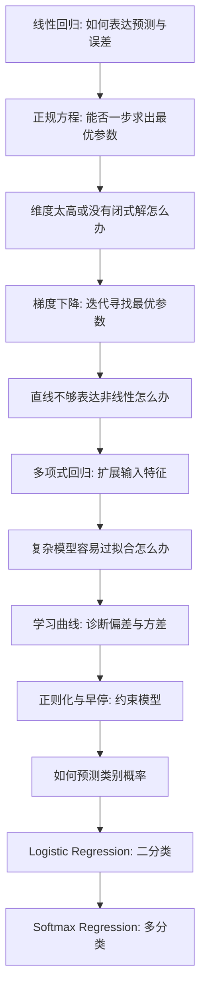

> 书目：*Hands-On Machine Learning with Scikit-Learn and PyTorch*<br>
> 章节：Chapter 4, Training Models<br>
> 章节文件：4. Training Models.md<br>
> 配套 Notebook：<https://homl.info/colab-p>

---

## 阅读导引

### 本章要回答什么问题

前几章主要把模型当作黑箱：调用 `fit()` 训练，再调用 `predict()` 预测。本章第一次打开黑箱，追问：

> `fit()` 到底在做什么？模型参数是怎样从数据中学出来的？

全章围绕同一个核心问题展开：

$$
\boxed{\text{训练模型}=\text{寻找一组参数，使代价函数尽可能小}}
$$

这句话贯穿全章：

- 线性回归：最小化均方误差（MSE）；
- Ridge、Lasso、Elastic Net：最小化“预测误差 + 参数惩罚”；
- Logistic Regression：最小化二元交叉熵（log loss）；
- Softmax Regression：最小化多类交叉熵。

本章不是彼此孤立的算法清单，而是一条逐层推进的问题链：



### 本章的分析方式

本章反复使用同一种工程思路：

1. **先定义模型**：输入如何映射为输出；
2. **再定义目标**：什么叫模型“好”；
3. **求解或优化**：直接解方程，或迭代下降；
4. **观察失败模式**：慢、发散、欠拟合、过拟合、不稳定；
5. **引入修复方法**：缩放、学习率调度、更多数据、正则化、早停；
6. **回到验证集检验**：方法是否真的改善泛化。

学习时不要只记 API。每看到一个公式，都应该能回答：

- 它在优化什么？
- 参数变一点，损失为什么会按这个方向变化？
- 它依赖哪些假设？
- 什么情况下这个方法会慢、会失败，或者得到不稳定的解？

---

## 0. 必要的数学基础

### 0.1 标量、向量和矩阵

本章统一采用以下记号：

| 符号 | 含义 | 形状 |
| --- | --- | --- |
| $m$ | 训练实例数量 | 标量 |
| $n$ | 原始输入特征数量 | 标量 |
| $\mathbf{x}^{(i)}$ | 第 $i$ 个实例，含额外的 $x_0=1$ | $(n+1)\times1$ |
| $x_j^{(i)}$ | 第 $i$ 个实例的第 $j$ 个特征 | 标量 |
| $y^{(i)}$ | 第 $i$ 个实例的真实目标 | 标量 |
| $\boldsymbol\theta$ | 参数向量 $(\theta_0,\ldots,\theta_n)^\top$ | $(n+1)\times1$ |
| $\mathbf X$ | 每行一个实例的设计矩阵 | $m\times(n+1)$ |
| $\mathbf y$ | 所有目标组成的列向量 | $m\times1$ |

设计矩阵写成：

$$
\mathbf X=
\begin{pmatrix}
1 & x_1^{(1)} & \cdots & x_n^{(1)}\\
1 & x_1^{(2)} & \cdots & x_n^{(2)}\\
\vdots & \vdots & \ddots & \vdots\\
1 & x_1^{(m)} & \cdots & x_n^{(m)}
\end{pmatrix}
$$

第一列全为 1，是为了把偏置项也写进矩阵乘法：

$$
\theta_0\cdot1+\theta_1x_1+\cdots+\theta_nx_n
=\boldsymbol\theta^\top\mathbf x
$$

### 0.2 点积的几何直觉

$$
\boldsymbol\theta^\top\mathbf x
=\sum_{j=0}^{n}\theta_jx_j
$$

代数上，它是特征的加权和；几何上，它等于：

$$
\boldsymbol\theta^\top\mathbf x
=\|\boldsymbol\theta\|_2\|\mathbf x\|_2\cos\phi
$$

其中 $\phi$ 是两个向量的夹角。这说明线性模型实际上在测量输入向量沿参数方向的投影强度。

### 0.3 导数、偏导数和梯度

一元函数 $f(t)$ 的导数：

$$
f'(t)=\lim_{\Delta t\to0}
\frac{f(t+\Delta t)-f(t)}{\Delta t}
$$

表示 $t$ 发生极小变化时，$f$ 的瞬时变化率。

多元函数 $J(\theta_0,\ldots,\theta_n)$ 对某个参数的偏导：

$$
\frac{\partial J}{\partial\theta_j}
$$

表示只让 $\theta_j$ 变化、其余参数保持不变时，$J$ 的变化率。

把全部偏导按列排列就是梯度：

$$
\nabla_{\boldsymbol\theta}J=
\begin{pmatrix}
\partial J/\partial\theta_0\\
\partial J/\partial\theta_1\\
\vdots\\
\partial J/\partial\theta_n
\end{pmatrix}
$$

梯度指向函数增长最快的方向，所以最陡下降方向是 $-\nabla J$。

### 0.4 链式法则

若 $z=g(\theta)$，$J=f(z)$，那么：

$$
\frac{\partial J}{\partial\theta}
=\frac{\partial J}{\partial z}
\frac{\partial z}{\partial\theta}
$$

本章 MSE、Logistic 和 Softmax 的梯度推导都依赖链式法则。

### 0.5 凸函数

函数 $f$ 在凸集合上为凸函数，严格定义是：对任意 $\mathbf a,\mathbf b$ 和 $\lambda\in[0,1]$，

$$
f(\lambda\mathbf a+(1-\lambda)\mathbf b)
\le
\lambda f(\mathbf a)+(1-\lambda)f(\mathbf b)
$$

几何直觉：连接曲线上任意两点的线段不会落到曲线下方。

凸函数的重要性质：

- 任何局部最小值都是全局最小值；
- 若函数严格凸，则全局最小值唯一；
- 凸不代表容易优化：狭长谷底仍可能让梯度下降很慢。

线性回归的 MSE 与 Logistic Regression 的 log loss 都是凸函数，因此没有“掉进坏的局部最小值”的问题。

### 0.6 范数

对权重向量 $\mathbf w=(w_1,\ldots,w_n)$：

$$
\|\mathbf w\|_1=\sum_{j=1}^{n}|w_j|,
\qquad
\|\mathbf w\|_2=\sqrt{\sum_{j=1}^{n}w_j^2}
$$

Ridge 惩罚 $\|\mathbf w\|_2^2$，Lasso 惩罚 $\|\mathbf w\|_1$。两种几何形状的差异会导致完全不同的参数行为：Ridge 平滑缩小权重，Lasso 倾向于把部分权重精确压到零。

---

## 1. 线性回归（Linear Regression）

### 1.1 从一个简单模型开始

第 1 章用人均 GDP 预测生活满意度：

#### 公式 4-1：生活满意度的简单线性模型

$$
\text{life\_satisfaction}
=\theta_0+\theta_1\times\text{GDP\_per\_capita}
$$

- $\theta_0$：偏置或截距，决定直线整体高度；
- $\theta_1$：权重或斜率，表示 GDP 每增加一单位，预测值改变多少。

#### 它要解决什么问题

给定若干输入特征，怎样得到一个连续数值预测？最简单的方法就是计算特征的加权和。

#### 公式 4-2：一般线性回归预测

$$
\hat y
=\theta_0+\theta_1x_1+\theta_2x_2+\cdots+\theta_nx_n
$$

- $\hat y$：模型预测值；
- $n$：输入特征数；
- $x_j$：第 $j$ 个特征；
- $\theta_j$：模型参数。

模型之所以叫“线性”，严格说是因为它对参数 $\boldsymbol\theta$ 是线性的。输入可以先经过多项式等非线性变换，模型仍然是线性模型。

令 $x_0=1$，把偏置并入点积：

#### 公式 4-3：向量化预测

$$
\hat y
=h_{\boldsymbol\theta}(\mathbf x)
=\boldsymbol\theta\cdot\mathbf x
=\boldsymbol\theta^\top\mathbf x
$$

- $h_{\boldsymbol\theta}$：参数为 $\boldsymbol\theta$ 的假设函数；
- $\boldsymbol\theta=(\theta_0,\ldots,\theta_n)^\top$；
- $\mathbf x=(1,x_1,\ldots,x_n)^\top$。

“向量化”不是只为写得短。矩阵运算库可以在底层使用 SIMD、多线程和高效 BLAS 实现，比 Python 循环快得多。

### 1.2 怎样衡量模型好不好

模型需要一个训练目标。线性回归通常最小化均方误差：

#### 公式 4-4：MSE 代价函数

$$
\operatorname{MSE}(\mathbf X,\mathbf y,h_{\boldsymbol\theta})
=\frac{1}{m}\sum_{i=1}^{m}
\left(\boldsymbol\theta^\top\mathbf x^{(i)}-y^{(i)}\right)^2
$$

后文常简写为 $\operatorname{MSE}(\boldsymbol\theta)$。

定义第 $i$ 个实例的残差：

$$
e^{(i)}=\hat y^{(i)}-y^{(i)}
$$

那么：

$$
\operatorname{MSE}=\frac1m\sum_{i=1}^m(e^{(i)})^2
$$

为什么平方：

1. 正负误差不会互相抵消；
2. 大误差受到更重惩罚；
3. 平方函数处处可导，便于优化；
4. 在线性关系加独立高斯噪声的假设下，最小 MSE 等价于最大似然估计。

虽然最终评价常用 RMSE，但 MSE 与 RMSE 的最优参数相同。因为：

$$
\operatorname{RMSE}(\boldsymbol\theta)
=\sqrt{\operatorname{MSE}(\boldsymbol\theta)}
$$

平方根在非负区间严格单调递增，所以：

$$
\arg\min_{\boldsymbol\theta}\operatorname{RMSE}(\boldsymbol\theta)
=
\arg\min_{\boldsymbol\theta}\operatorname{MSE}(\boldsymbol\theta)
$$

这体现一个重要原则：**训练损失不必和最终评价指标完全相同**，只要它便于优化，并且改善它通常会改善业务指标。

---

### 1.3 正规方程（The Normal Equation）

#### 要解决什么问题

能不能不反复试参数，而是直接算出使 MSE 最小的 $\boldsymbol\theta$？对线性回归，答案是可以。

#### 公式 4-5：正规方程

$$
\hat{\boldsymbol\theta}
=\left(\mathbf X^\top\mathbf X\right)^{-1}
\mathbf X^\top\mathbf y
$$

#### 完整推导

将全部预测写成：

$$
\hat{\mathbf y}=\mathbf X\boldsymbol\theta
$$

MSE 的矩阵形式：

$$
J(\boldsymbol\theta)
=\frac1m
(\mathbf X\boldsymbol\theta-\mathbf y)^\top
(\mathbf X\boldsymbol\theta-\mathbf y)
$$

展开：

$$
\begin{aligned}
mJ(\boldsymbol\theta)
&=(\boldsymbol\theta^\top\mathbf X^\top-\mathbf y^\top)
(\mathbf X\boldsymbol\theta-\mathbf y)\\
&=\boldsymbol\theta^\top\mathbf X^\top\mathbf X\boldsymbol\theta
-\boldsymbol\theta^\top\mathbf X^\top\mathbf y
-\mathbf y^\top\mathbf X\boldsymbol\theta
+\mathbf y^\top\mathbf y
\end{aligned}
$$

$\boldsymbol\theta^\top\mathbf X^\top\mathbf y$ 是标量，等于自身转置 $\mathbf y^\top\mathbf X\boldsymbol\theta$，所以：

$$
mJ(\boldsymbol\theta)
=\boldsymbol\theta^\top\mathbf X^\top\mathbf X\boldsymbol\theta
-2\boldsymbol\theta^\top\mathbf X^\top\mathbf y
+\mathbf y^\top\mathbf y
$$

用矩阵求导规则：

$$
\nabla_{\boldsymbol\theta}
(\boldsymbol\theta^\top\mathbf A\boldsymbol\theta)
=(\mathbf A+\mathbf A^\top)\boldsymbol\theta
$$

这里 $\mathbf A=\mathbf X^\top\mathbf X$ 是对称矩阵，因此：

$$
\nabla_{\boldsymbol\theta}J
=\frac{2}{m}
(\mathbf X^\top\mathbf X\boldsymbol\theta-\mathbf X^\top\mathbf y)
$$

可导函数在内部最小点处梯度为零：

$$
\mathbf X^\top\mathbf X\hat{\boldsymbol\theta}
-\mathbf X^\top\mathbf y=0
$$

于是得到“正规方程组”：

$$
\mathbf X^\top\mathbf X\hat{\boldsymbol\theta}
=\mathbf X^\top\mathbf y
$$

若 $\mathbf X^\top\mathbf X$ 可逆，左乘其逆矩阵：

$$
\hat{\boldsymbol\theta}
=\left(\mathbf X^\top\mathbf X\right)^{-1}
\mathbf X^\top\mathbf y
$$

推导成立条件：

- $\mathbf X^\top\mathbf X$ 可逆，即设计矩阵列满秩；
- 不存在完全共线的特征；
- 通常要求参数数不超过独立信息量。

若不可逆，应使用伪逆，而不是强行求逆。

#### 实验：生成线性数据

```python
import numpy as np

rng = np.random.default_rng(seed=42)
m = 200
X = 2 * rng.random((m, 1))
y = 4 + 3 * X + rng.standard_normal((m, 1))
```

真实生成过程：

$$
y=4+3x+\varepsilon,
\qquad \varepsilon\sim\mathcal N(0,1)
$$

用正规方程计算：

```python
from sklearn.preprocessing import add_dummy_feature

X_b = add_dummy_feature(X)  # 在第 0 列加入 x0=1
theta_best = np.linalg.inv(X_b.T @ X_b) @ X_b.T @ y
print(theta_best)
```

输出：

```text
[[3.69084138]
 [3.32960458]]
```

真实参数是 $(4,3)$，估计结果不同不是算法算错，而是 200 个样本里有随机噪声。样本越少、噪声越大，估计波动越明显。

预测 $x=0$ 和 $x=2$：

```python
X_new = np.array([[0], [2]])
X_new_b = add_dummy_feature(X_new)
y_predict = X_new_b @ theta_best
print(y_predict)
```

输出：

```text
[[ 3.69084138]
 [10.35005055]]
```

与公式对应：

$$
\hat y(0)=3.69084138,
\qquad
\hat y(2)=3.69084138+3.32960458\times2=10.35005054
$$

浮点末位可能因打印精度出现极小差异。

#### Scikit-Learn 实现

```python
from sklearn.linear_model import LinearRegression

lin_reg = LinearRegression()
lin_reg.fit(X, y)
print(lin_reg.intercept_)
print(lin_reg.coef_)
print(lin_reg.predict(X_new))
```

输出：

```text
[3.69084138]
[[3.32960458]]
[[ 3.69084138]
 [10.35005055]]
```

- `intercept_` 保存偏置；
- `coef_` 保存特征权重。

#### 为什么实际库使用伪逆

`LinearRegression` 不直接计算公式 4-5 的矩阵逆，而是调用最小二乘方法：

```python
theta_best_svd, residuals, rank, singular_values = np.linalg.lstsq(
    X_b, y, rcond=1e-6
)
print(theta_best_svd)
```

或者直接使用 Moore–Penrose 伪逆：

```python
theta_best_pinv = np.linalg.pinv(X_b) @ y
print(theta_best_pinv)
```

两者都输出：

```text
[[3.69084138]
 [3.32960458]]
```

SVD 将矩阵分解为：

$$
\mathbf X=\mathbf U\boldsymbol\Sigma\mathbf V^\top
$$

伪逆为：

$$
\mathbf X^+
=\mathbf V\boldsymbol\Sigma^+\mathbf U^\top
$$

$\boldsymbol\Sigma^+$ 的构造：

1. 把极小奇异值置零；
2. 其余非零奇异值取倒数；
3. 转置矩阵。

最终：

$$
\hat{\boldsymbol\theta}=\mathbf X^+\mathbf y
$$

伪逆的优势：

- $\mathbf X^\top\mathbf X$ 不可逆时仍然可解；
- 特征冗余、完全共线或 $m<n$ 时仍能返回最小范数解；
- 数值稳定性通常优于显式求逆。

### 1.4 计算复杂度

正规方程要对 $(n+1)\times(n+1)$ 矩阵求逆，复杂度约：

$$
O(n^{2.4})\sim O(n^3)
$$

特征数翻倍，耗时约乘：

$$
2^{2.4}\approx5.3
\quad\text{到}\quad
2^3=8
$$

SVD 方法约为 $O(n^2)$，特征数翻倍约慢 4 倍。

两种方法关于训练实例数 $m$ 都近似线性，即 $O(m)$，所以：

- 样本很多、特征不多：闭式/SVD 尚可；
- 特征达到约 100,000：两者都会很慢；
- 数据必须能装入内存；
- 训练完成后的预测复杂度对样本数和特征数都是线性的。

这就引出下一问题：**特征极多、数据流式到来，或者模型没有闭式解时怎么办？**

---

## 2. 梯度下降（Gradient Descent）

### 2.1 基本思想

梯度下降是通用优化算法。目标不是一次算出答案，而是反复小幅调整参数，让代价逐步下降。

可以把梯度下降想象成在浓雾中下山：只能感受脚下坡度时，最快下降策略是朝最陡方向的反方向走。

算法框架：

```text
随机初始化参数 θ
重复：
    计算当前梯度 ∇J(θ)
    沿负梯度方向移动一小步
直到梯度足够小或达到最大轮数
```

#### 学习率

学习率 $\eta$ 控制每一步长度：

- 太小：方向正确，但需要大量迭代；
- 合适：快速稳定到达最低点；
- 太大：越过最低点、反复震荡，甚至发散。

图 4-4、4-5 分别展示学习率过小和过大的情况。

#### 非凸函数的困难

图 4-6 展示两个典型障碍：

- **局部最小值**：附近都更高，但不是全局最低；
- **平台**：梯度极小，算法长时间几乎不动。

线性回归 MSE 是凸函数，所以没有坏的局部最小值；它还连续且斜率不会突变。更严格地说，其导数是 Lipschitz 连续的。

因此，只要学习率不过大并运行足够久，线性回归的梯度下降可以任意逼近全局最优解。

### 2.2 为什么特征缩放会影响收敛

图 4-7 展示了两种不同的代价曲面：

- 特征尺度相近时，MSE 等高线近似圆形，梯度直指最低点；
- 尺度差异大时，等高线变成狭长椭圆，参数在谷壁间“之”字形震荡，再沿平坦方向缓慢前进。

#### 为什么小尺度特征对应更长参数轴

若一个特征 $x_j$ 很小，要让 $\theta_jx_j$ 发生相同幅度变化，就需要更大地改变 $\theta_j$。因此代价函数沿 $\theta_j$ 方向变化缓慢，谷底被拉长。

解决方案：训练前使用 `StandardScaler` 等方法，让各特征尺度接近。

> 重要边界：正规方程和 SVD 通常不要求缩放才能得到解；梯度下降和正则化模型则强烈依赖合理缩放。

---

### 2.3 批量梯度下降（Batch Gradient Descent）

#### 公式 4-6：MSE 对单个参数的偏导

$$
\frac{\partial}{\partial\theta_j}
\operatorname{MSE}(\boldsymbol\theta)
=\frac{2}{m}\sum_{i=1}^{m}
\left(\boldsymbol\theta^\top\mathbf x^{(i)}-y^{(i)}\right)
x_j^{(i)}
$$

#### 逐步推导

从公式 4-4 开始：

$$
J(\boldsymbol\theta)=\frac1m\sum_{i=1}^{m}
\left(e^{(i)}\right)^2
$$

其中：

$$
e^{(i)}=\boldsymbol\theta^\top\mathbf x^{(i)}-y^{(i)}
$$

对 $\theta_j$ 求偏导，用链式法则：

$$
\frac{\partial J}{\partial\theta_j}
=\frac1m\sum_{i=1}^{m}
2e^{(i)}\frac{\partial e^{(i)}}{\partial\theta_j}
$$

又因为：

$$
e^{(i)}=\sum_{k=0}^{n}\theta_kx_k^{(i)}-y^{(i)}
$$

只有 $k=j$ 的项对 $\theta_j$ 求导不为零：

$$
\frac{\partial e^{(i)}}{\partial\theta_j}=x_j^{(i)}
$$

代回即得公式 4-6。

把全部偏导组合起来：

#### 公式 4-7：MSE 梯度向量

$$
\nabla_{\boldsymbol\theta}
\operatorname{MSE}(\boldsymbol\theta)
=\frac{2}{m}\mathbf X^\top
(\mathbf X\boldsymbol\theta-\mathbf y)
$$

形状检查：

| 表达式 | 形状 |
| --- | --- |
| $\mathbf X\boldsymbol\theta$ | $m\times1$ |
| $\mathbf X\boldsymbol\theta-\mathbf y$ | $m\times1$ |
| $\mathbf X^\top$ | $(n+1)\times m$ |
| 最终梯度 | $(n+1)\times1$ |

结果形状与参数向量一致，才能逐元素更新。

#### 公式 4-8：梯度下降更新

$$
\boldsymbol\theta^{(\text{next})}
=\boldsymbol\theta
-\eta\nabla_{\boldsymbol\theta}J(\boldsymbol\theta)
$$

为什么是减号：梯度指向上坡，负梯度指向下坡。

#### NumPy 实现

```python
eta = 0.1
n_epochs = 1000
m = len(X_b)

rng = np.random.default_rng(seed=42)
theta = rng.standard_normal((2, 1))

for epoch in range(n_epochs):
    gradients = 2 / m * X_b.T @ (X_b @ theta - y)
    theta = theta - eta * gradients

print(theta)
```

输出：

```text
[[3.69084138]
 [3.32960458]]
```

与正规方程完全相同。

图 4-8 比较三个学习率：

| 学习率 | 结果 |
| ---: | --- |
| $\eta=0.02$ | 方向正确但很慢 |
| $\eta=0.1$ | 数个 epoch 基本收敛 |
| $\eta=0.5$ | 发散 |

选择学习率可用网格搜索，但应限制 epoch，以便尽早淘汰收敛太慢的配置。

### 2.4 收敛速度与停止条件

epoch 太少：还没到最优点；epoch 太多：参数几乎不变，却继续浪费计算。

可以设置较大的最大 epoch，并在梯度范数足够小时停止：

$$
\|\nabla J(\boldsymbol\theta)\|_2<\varepsilon
$$

$\varepsilon$ 称为容差（tolerance）。

对于凸且斜率平滑的 MSE，固定学习率的批量 GD 可能需要：

$$
O\left(\frac1\varepsilon\right)
$$

次迭代才能达到误差范围 $\varepsilon$。容差缩小 10 倍，运行时间可能增加约 10 倍。

这是一个量级估计，具体速度还取决于代价曲面的条件数和学习率。

---

### 2.5 随机梯度下降（Stochastic Gradient Descent）

#### 要解决什么问题

批量 GD 每一步都扫描全部 $m$ 个样本。数据很大时，一步就很慢。

SGD 每一步只随机取一个样本，用它估计整体梯度：

$$
\nabla J(\boldsymbol\theta)
\approx
2\mathbf x^{(i)}
\left((\mathbf x^{(i)})^\top\boldsymbol\theta-y^{(i)}\right)
$$

单步速度与 $m$ 无关，还可以边读磁盘边训练，支持 out-of-core learning。

#### 为什么它会震荡

单个样本的梯度不是全体样本梯度。不同样本指向不同方向，所以：

- 单步可能让总体损失升高；
- 长期平均方向仍朝向最低区域；
- 固定学习率下会在最优点附近持续跳动。

这种随机性有两面：

- 好处：非凸问题中可跳出局部最小值；
- 坏处：难以精确停在最低点。

#### 学习率调度

学习率应先大后小：

- 初期大步探索，可越过局部陷阱；
- 后期小步收敛，减少最优点附近震荡。

这里使用如下学习率调度：

$$
\eta(t)=\frac{t_0}{t+t_1}
$$

- $t$：已经执行的训练步数；
- $t_0,t_1$：学习率调度超参数。

下降太快会过早冻结；下降太慢会长期震荡。

#### 手写 SGD

```python
n_epochs = 50
t0, t1 = 5, 50

def learning_schedule(t):
    return t0 / (t + t1)

rng = np.random.default_rng(seed=42)
theta = rng.standard_normal((2, 1))

for epoch in range(n_epochs):
    for iteration in range(m):
        random_index = rng.integers(m)
        xi = X_b[random_index:random_index + 1]
        yi = y[random_index:random_index + 1]
        gradients = 2 * xi.T @ (xi @ theta - yi)
        eta = learning_schedule(epoch * m + iteration)
        theta = theta - eta * gradients

print(theta)
```

输出：

```text
[[3.69826475]
 [3.30748311]]
```

注意梯度没有除以 $m$，因为这里使用一个实例近似平均梯度。

批量 GD 把完整训练集处理 1000 次；这里仅 50 个 epoch 就得到相当接近的结果。

#### epoch、随机抽样与 IID 假设

约定上，$m$ 个 SGD 步称为一个 epoch。但随机有放回抽样意味着：

- 某些样本在一个 epoch 中被抽到多次；
- 某些样本可能一次也没有抽到。

也可以每个 epoch 先联合打乱 $X,y$，再逐个遍历，确保每个样本使用一次。

训练实例应当独立同分布（IID），至少要充分打乱。若数据按标签排序，SGD 会先只优化一个类别，再优化下一个，参数不断被不同群体拉走，难以稳定在全局最优附近。

时间序列等不能随意打乱的数据是重要例外，需要专门的时间顺序训练与验证策略。

#### Scikit-Learn 实现

```python
from sklearn.linear_model import SGDRegressor

sgd_reg = SGDRegressor(
    max_iter=1000,
    tol=1e-5,
    penalty=None,
    eta0=0.01,
    n_iter_no_change=100,
    random_state=42,
)
sgd_reg.fit(X, y.ravel())

print(sgd_reg.intercept_)
print(sgd_reg.coef_)
```

输出：

```text
[3.68899733]
[3.33054574]
```

参数含义：

| 参数 | 含义 |
| --- | --- |
| `max_iter=1000` | 最多 1000 epochs |
| `tol=1e-5` | 改善小于 $10^{-5}$ 可视为无明显改善 |
| `n_iter_no_change=100` | 连续 100 epochs 无明显改善才停止 |
| `eta0=0.01` | 初始学习率 |
| `penalty=None` | 不使用正则化 |
| `random_state=42` | 固定随机性 |

`y.ravel()` 把 $(m,1)$ 列向量变成 `(m,)`，因为 `SGDRegressor.fit()` 期望一维目标。

#### `partial_fit()` 与 `warm_start`

- `partial_fit()`：执行一轮增量训练，不理会 `max_iter`、`tol`；学习率计数器继续累积；
- `warm_start=True`：下次 `fit()` 复用已有参数，但仍服从 `max_iter`、`tol`；`fit()` 会重置学习率调度计数。

两者都能继续训练，但语义不同。在线学习通常使用 `partial_fit()`。

---

### 2.6 小批量梯度下降（Mini-Batch Gradient Descent）

Mini-batch GD 每一步随机取 $b$ 个样本：

小批量梯度可按与公式 4-7 一致的方式写成：

$$
\nabla J_B(\boldsymbol\theta)
=\frac{2}{b}\mathbf X_B^\top
(\mathbf X_B\boldsymbol\theta-\mathbf y_B)
$$

- $b=1$：退化为 SGD；
- $b=m$：退化为 Batch GD；
- $1<b<m$：在速度与稳定性之间折中。

优势：

- 可用高效矩阵运算；
- 易于利用 GPU；
- 比 SGD 路径稳定；
- 支持大数据和 out-of-core。

局限：随机性弱于 SGD，在非凸问题中跳出局部最小值的能力可能更弱。批量越大，梯度越准、路径越稳，但单步越贵。

图 4-11 对比三条参数路径：

- Batch GD 平滑停在最低点；
- SGD 最随机，在最低点附近游走；
- Mini-batch 介于两者之间。

合适的学习率调度可以让 SGD 与 Mini-batch 最终也逼近最低点。

### 2.7 五种线性回归训练方法对比

五种线性回归训练方法对比如下：

| 算法 | 大 $m$ | Out-of-core | 大 $n$ | 超参数数 | 需要缩放 | Scikit-Learn |
| --- | --- | --- | --- | ---: | --- | --- |
| 正规方程 | 快 | 否 | 慢 | 0 | 否 | 无直接类 |
| SVD | 快 | 否 | 慢 | 0 | 否 | `LinearRegression` |
| Batch GD | 慢 | 否 | 快 | 2 | 是 | 无直接类 |
| SGD | 快 | 是 | 快 | $\ge2$ | 是 | `SGDRegressor` |
| Mini-batch GD | 快 | 是 | 快 | $\ge2$ | 是 | 无直接类 |

三种 GD 的直接对比：

| 特性 | Batch GD | SGD | Mini-batch GD |
| --- | --- | --- | --- |
| 每步使用数据 | 全训练集 | 1 个样本 | $b$ 个样本 |
| 单步成本 | 最高 | 最低 | 中等 |
| 路径噪声 | 无 | 最大 | 中等 |
| 固定学习率最终状态 | 停在最低点 | 附近震荡 | 附近震荡 |
| 局部最小逃逸能力 | 弱 | 强 | 中等 |
| 硬件并行效率 | 好但步数少 | 较差 | 最好 |

正规方程只能训练线性回归，而梯度下降可用于大量其他模型。后面的 Logistic、Softmax 和神经网络都依赖迭代优化。

---

## 3. 多项式回归（Polynomial Regression）

### 3.1 问题从哪来

线性回归只能在给定特征空间中画超平面。如果真实关系是一条曲线，直接拟合直线会欠拟合。

解决思路不是换掉线性回归，而是**改变输入表示**：

$$
x\longmapsto(x,x^2,x^3,\ldots,x^d)
$$

然后仍然用线性回归：

$$
\hat y
=\theta_0+\theta_1x+\theta_2x^2+\cdots+\theta_dx^d
$$

这个模型对原始输入 $x$ 是非线性的，但对参数 $\theta_0,\ldots,\theta_d$ 仍是线性的，所以它依然属于线性模型。

### 3.2 实验：二次数据

```python
import numpy as np

rng = np.random.default_rng(seed=42)
m = 200
X = 6 * rng.random((m, 1)) - 3
y = 0.5 * X ** 2 + X + 2 + rng.standard_normal((m, 1))
```

生成过程：

$$
y=0.5x^2+x+2+\varepsilon,
\qquad x\in[-3,3),\quad\varepsilon\sim\mathcal N(0,1)
$$

图 4-12 中，散点呈明显抛物线趋势，直线无法良好拟合。

### 3.3 生成多项式特征

```python
from sklearn.preprocessing import PolynomialFeatures

poly_features = PolynomialFeatures(degree=2, include_bias=False)
X_poly = poly_features.fit_transform(X)

print(X[0])
print(X_poly[0])
```

输出：

```text
[1.64373629]
[1.64373629 2.701869  ]
```

因为：

$$
1.64373629^2\approx2.701869
$$

`include_bias=False` 避免生成常数列 1，因为 `LinearRegression` 会自己拟合偏置。

训练：

```python
from sklearn.linear_model import LinearRegression

lin_reg = LinearRegression()
lin_reg.fit(X_poly, y)

print(lin_reg.intercept_)
print(lin_reg.coef_)
```

输出：

```text
[2.00540719]
[[1.11022126 0.50526985]]
```

得到：

$$
\hat y=0.5053x^2+1.1102x+2.0054
$$

约等于原始生成函数：

$$
y=0.5x^2+1.0x+2.0+\varepsilon
$$

这说明模型从带噪样本中恢复了接近真实的二次规律。图 4-13 中，拟合曲线抓住了总体趋势。

### 3.4 多变量时还会生成交叉项

若输入为 $a,b$，`degree=3` 会生成：

$$
a,b,a^2,ab,b^2,a^3,a^2b,ab^2,b^3
$$

交叉项 $ab$ 很重要，因为它允许模型表达“两个特征共同出现时产生额外影响”。例如房屋面积与地段可能存在交互作用，优质地段中面积增加的边际价值更高。

### 3.5 特征数量公式的推导

最高次数不超过 $d$ 时的特征数为：

$$
\binom{n+d}{d}
=\frac{(n+d)!}{d!\,n!}
$$

该结果包含常数项。

为什么？每个单项式可写为：

$$
x_1^{k_1}x_2^{k_2}\cdots x_n^{k_n},
\qquad k_j\ge0,
\qquad \sum_{j=1}^{n}k_j\le d
$$

引入松弛变量 $k_{n+1}$：

$$
k_{n+1}=d-\sum_{j=1}^{n}k_j\ge0
$$

问题变为非负整数方程：

$$
k_1+k_2+\cdots+k_n+k_{n+1}=d
$$

根据“隔板法”，$d$ 个星和 $n$ 个隔板共有 $d+n$ 个位置，从中选择 $n$ 个放隔板：

$$
\binom{n+d}{n}=\binom{n+d}{d}
$$

若 `include_bias=False`，再减去常数项 1。

数值例子：

| 原始特征 $n$ | 次数 $d$ | 含偏置特征数 | 不含偏置 |
| ---: | ---: | ---: | ---: |
| 2 | 3 | $\binom53=10$ | 9 |
| 10 | 3 | $\binom{13}3=286$ | 285 |
| 100 | 3 | $\binom{103}3=176{,}851$ | 176,850 |

这就是**组合爆炸**：$n$ 或 $d$ 稍大，内存、训练时间和过拟合风险都会急剧增加。

### 3.6 适用边界

- 适合低维、关系较平滑的表格数据；
- 高阶外推非常危险，输入范围外的 $x^d$ 会迅速爆炸；
- 必须缩放高阶特征，否则不同次数尺度差异巨大；
- 阶数越高，自由度越高，越容易拟合噪声；
- 高维问题通常更适合核方法、树模型或神经网络，而不是显式生成全部高阶项。

这就引出下一问题：**模型究竟是太简单还是太复杂？**

---

## 4. 学习曲线（Learning Curves）

### 4.1 为什么只看训练误差不够

图 4-14 在同一二次数据上比较：

- 1 阶：直线，明显欠拟合；
- 2 阶：与真实生成函数匹配，泛化最好；
- 300 阶：在训练点之间剧烈摆动，严重过拟合。

现实中不知道真实函数，所以不能像这个人工数据例子一样直接看出“正确阶数”。需要用训练集和验证集的表现诊断。

基本判断：

| 训练误差 | 验证误差 | 现象 |
| --- | --- | --- |
| 高 | 高且接近 | 欠拟合，高偏差 |
| 很低 | 明显更高 | 过拟合，高方差 |
| 低 | 低且接近 | 泛化较好 |

但单个数字仍不够。学习曲线展示误差随训练数据量或训练轮数的变化，可以看到模型是否已经进入平台，以及增加数据是否有用。

### 4.2 学习曲线的严格定义

两类常见横轴：

1. **训练集规模**：逐渐增加训练样本，观察训练/验证误差；
2. **训练迭代次数**：每隔若干 epoch 评估一次，常用于迭代模型。

如果模型不支持 `partial_fit()` 或 `warm_start`，就必须在多个不同大小的训练子集上从头训练。

### 4.3 线性模型的学习曲线

```python
import matplotlib.pyplot as plt
from sklearn.model_selection import learning_curve

train_sizes, train_scores, valid_scores = learning_curve(
    LinearRegression(),
    X,
    y,
    train_sizes=np.linspace(0.01, 1.0, 40),
    cv=5,
    scoring="neg_root_mean_squared_error",
)

train_errors = -train_scores.mean(axis=1)
valid_errors = -valid_scores.mean(axis=1)

plt.plot(train_sizes, train_errors, "r-+", linewidth=2, label="train")
plt.plot(train_sizes, valid_errors, "b-", linewidth=3, label="valid")
plt.xlabel("Training set size")
plt.ylabel("RMSE")
plt.grid()
plt.legend()
plt.show()
```

参数含义：

- 训练规模从可用数据的 1% 到 100%，共 40 个点；
- 每个规模做 5 折交叉验证；
- Scikit-Learn 统一采用“越大越好”的评分，因此 RMSE 以负数返回，代码再取负号；
- 每个规模对 5 折分数取均值。

图 4-15 的演变过程：

1. 训练样本极少时，直线可以穿过少数训练点，训练 RMSE 接近 0；
2. 样本增多后，噪声和非线性让直线无法兼顾所有点，训练误差上升；
3. 验证数据很少时估计不稳定，误差很高；
4. 数据增多后验证误差下降；
5. 两条曲线最终在较高误差处接近并形成平台。

结论：线性模型**欠拟合**。再增加数据通常无效，因为两条曲线已经汇合；应增加模型能力或改进特征。

### 4.4 十阶模型的学习曲线

```python
from sklearn.pipeline import make_pipeline

polynomial_regression = make_pipeline(
    PolynomialFeatures(degree=10, include_bias=False),
    LinearRegression(),
)

train_sizes, train_scores, valid_scores = learning_curve(
    polynomial_regression,
    X,
    y,
    train_sizes=np.linspace(0.01, 1.0, 40),
    cv=5,
    scoring="neg_root_mean_squared_error",
)
```

图 4-16 相比线性模型有两个关键差异：

1. 训练误差明显更低；
2. 训练曲线与验证曲线之间存在明显间隔。

结论：模型过拟合。增加训练数据通常可以让两条曲线逐渐靠近，因为更多数据使模型更难记住每个样本的噪声。

### 4.5 怎样根据曲线选择对策

#### 欠拟合：两条曲线高且接近

- 换更复杂模型；
- 增加有效特征；
- 降低正则化；
- 增加数据通常帮助不大。

#### 过拟合：训练低、验证高，间隔大

- 增加训练数据；
- 简化模型，例如降低多项式阶数；
- 增强正则化；
- 删除无关特征或降低噪声。

### 4.6 偏差/方差权衡

泛化误差可以分成三部分：

1. **偏差（Bias）**：模型假设错误造成的系统误差；
2. **方差（Variance）**：模型对训练集细小变化的敏感程度；
3. **不可约误差（Irreducible Error）**：数据本身的噪声。

这里的 bias 是泛化误差中的“偏差”，不是线性模型的偏置项 $\theta_0$。

#### 平方误差分解

假设真实生成过程：

$$
y=f(\mathbf x)+\varepsilon,
\qquad E[\varepsilon]=0,
\qquad \operatorname{Var}(\varepsilon)=\sigma^2
$$

训练集 $D$ 随机变化，学出的模型记为 $\hat f_D$。对固定输入 $\mathbf x$：

$$
E_{D,\varepsilon}
\left[(y-\hat f_D(\mathbf x))^2\right]
$$

代入 $y=f+\varepsilon$，并加减 $E_D[\hat f_D]$：

$$
y-\hat f_D
=
\underbrace{f-E_D[\hat f_D]}_{\text{Bias}}
+
\underbrace{E_D[\hat f_D]-\hat f_D}_{\text{随机模型波动}}
+\varepsilon
$$

平方后取期望。由于后两项均值为 0，且在标准假设下交叉项期望为 0：

$$
\boxed{
E[(y-\hat f_D)^2]
=
\underbrace{(f-E_D[\hat f_D])^2}_{\text{Bias}^2}
+
\underbrace{E_D[(\hat f_D-E_D[\hat f_D])^2]}_{\text{Variance}}
+
\underbrace{\sigma^2}_{\text{Irreducible Error}}
}
$$

成立条件：

- 使用平方损失；
- 噪声均值为零；
- 噪声与训练集和模型估计独立；
- 在固定输入点上讨论。

直觉：

- 太简单的模型每次都错在同一方向：高偏差、低方差；
- 太复杂的模型每换一份训练数据就剧烈变化：低偏差、高方差；
- 数据测量噪声无法靠模型复杂度消除。

通常：

| 改动 | 偏差 | 方差 |
| --- | --- | --- |
| 增加模型复杂度 | 降低 | 增加 |
| 降低模型复杂度 | 增加 | 降低 |
| 增强正则化 | 增加 | 降低 |
| 增加训练数据 | 变化小 | 降低 |

不可约误差只能通过改善数据源、修复标签、减少测量噪声、清理异常值等方式降低。

---

## 5. 正则化线性模型（Regularized Linear Models）

### 5.1 为什么需要正则化

限制模型自由度可以降低过拟合。例如：

- 降低多项式阶数；
- 限制参数幅度；
- 让部分参数归零；
- 在验证性能恶化前停止训练。

正则化还可改善数值稳定性。若特征完全共线，例如同时输入摄氏温度和华氏温度，存在无穷多组参数产生相同预测，参数会对训练集微小扰动非常敏感。

线性回归通常依赖以下假设：

- 输入与输出关系线性；
- 噪声均值为零；
- 噪声方差恒定；
- 噪声与输入独立；
- 设计矩阵满秩；
- 输入特征不完全共线；
- 样本数不少于参数数。

假设不满足不代表模型完全不能用，但参数解释、置信区间、稳定性或预测质量可能受损。

> 共同原则：正则项只用于训练。最终报告模型性能时，仍使用未加惩罚的 MSE、RMSE 等业务指标。

#### 正则化示例数据

为了观察正则化在小样本、高噪声场景中的作用，生成如下线性数据：

```python
rng = np.random.default_rng(seed=42)
m = 20
X = 3 * rng.random((m, 1))
y = 1 + 0.5 * X + rng.standard_normal((m, 1)) / 1.5
X_new = np.linspace(0, 3, 100).reshape(100, 1)
```

生成过程：

$$
y=1+0.5x+\frac{\varepsilon}{1.5},
\qquad \varepsilon\sim\mathcal N(0,1),
\qquad m=20
$$

样本少且噪声大，正适合展示不同正则化强度如何改变模型方差。

---

### 5.2 Ridge Regression（$\ell_2$ 正则化）

#### 要解决什么问题

不希望某些权重为了贴合训练噪声而变得特别大。Ridge 在 MSE 上增加权重平方惩罚。

#### 公式 4-9：Ridge 代价函数

$$
J(\boldsymbol\theta)
=\operatorname{MSE}(\boldsymbol\theta)
+\frac{\alpha}{m}\sum_{j=1}^{n}\theta_j^2
$$

令 $\mathbf w=(\theta_1,\ldots,\theta_n)^\top$：

$$
J(\boldsymbol\theta)
=\operatorname{MSE}(\boldsymbol\theta)
+\frac{\alpha}{m}\|\mathbf w\|_2^2
$$

符号：

- $\alpha\ge0$：正则化强度；
- 求和从 1 开始，偏置 $\theta_0$ 不正则化；
- 除以 $m$ 使参数含义与训练集规模相对稳定。

极端情况：

- $\alpha=0$：普通线性回归；
- $\alpha\to\infty$：权重趋近 0，预测趋近目标均值附近的水平线。

#### 为什么不惩罚偏置

偏置只控制整体平移，不决定模型对输入变化的敏感度。惩罚偏置会迫使预测均值向 0 靠拢，通常没有抑制复杂度的意义。

#### Ridge 梯度

正则项对 $\mathbf w$ 的梯度：

$$
\nabla_{\mathbf w}
\frac{\alpha}{m}\mathbf w^\top\mathbf w
=\frac{2\alpha}{m}\mathbf w
$$

因此 Batch GD 更新中，只需在权重的 MSE 梯度上加 $2\alpha\mathbf w/m$，偏置梯度保持不变。

#### 为什么必须缩放

假设两个特征表示同一个量，一个用米、一个用毫米。毫米特征的数值大 1000 倍，为产生相同预测效果，其权重会小 1000 倍。若直接惩罚权重大小，模型会不公平地偏好数值尺度大的特征。

所以正则化前必须缩放。图 4-18 的高阶模型 Pipeline 是：

```text
PolynomialFeatures(degree=10)
→ StandardScaler
→ Ridge
```

$\alpha$ 越大，曲线越平坦：方差下降、偏差上升。

#### 公式 4-10：Ridge 闭式解

$$
\hat{\boldsymbol\theta}
=\left(\mathbf X^\top\mathbf X+\alpha\mathbf A\right)^{-1}
\mathbf X^\top\mathbf y
$$

$\mathbf A$ 是 $(n+1)\times(n+1)$ 单位矩阵，但左上角为 0：

$$
\mathbf A=\operatorname{diag}(0,1,\ldots,1)
$$

这样偏置不受惩罚。

#### 从代价函数推导闭式解

把 Ridge 目标乘以 $m$，不改变最小点：

$$
mJ
=(\mathbf X\boldsymbol\theta-\mathbf y)^\top
(\mathbf X\boldsymbol\theta-\mathbf y)
+\alpha\boldsymbol\theta^\top\mathbf A\boldsymbol\theta
$$

梯度：

$$
\nabla J\propto
2\mathbf X^\top(\mathbf X\boldsymbol\theta-\mathbf y)
+2\alpha\mathbf A\boldsymbol\theta
$$

令梯度为零：

$$
(\mathbf X^\top\mathbf X+\alpha\mathbf A)
\hat{\boldsymbol\theta}
=\mathbf X^\top\mathbf y
$$

若左侧矩阵可逆，得到公式 4-10。

Ridge 的额外 $\alpha\mathbf A$ 还能把原本接近奇异的矩阵变得更稳定，这就是它改善共线问题的原因。

#### Scikit-Learn API

```python
from sklearn.linear_model import Ridge

ridge_reg = Ridge(alpha=0.1, solver="cholesky")
ridge_reg.fit(X, y)
print(ridge_reg.predict([[1.5]]))
```

输出：

```text
[1.84414523]
```

`solver="cholesky"` 使用 Cholesky 分解求闭式解变体。

用 SGD 实现相近 Ridge：

```python
from sklearn.linear_model import SGDRegressor

sgd_reg = SGDRegressor(
    penalty="l2",
    alpha=0.1 / m,
    tol=None,
    max_iter=1000,
    eta0=0.01,
    random_state=42,
)
sgd_reg.fit(X, y.ravel())
print(sgd_reg.predict([[1.5]]))
```

输出：

```text
[1.83659707]
```

为什么 `alpha=0.1/m`：这里 Ridge 正则项为 $\alpha\|w\|^2/m$，而 `SGDRegressor` 使用 `alpha * ||w||²`，需要手动除以 $m$ 才匹配。

`RidgeCV` 可高效交叉验证选择 $\alpha$，通常比通用 `GridSearchCV` 快。类似类还有 `LassoCV`、`ElasticNetCV`。

---

### 5.3 Lasso Regression（$\ell_1$ 正则化）

Lasso 全称 Least Absolute Shrinkage and Selection Operator。

#### 公式 4-11：Lasso 代价函数

$$
J(\boldsymbol\theta)
=\operatorname{MSE}(\boldsymbol\theta)
+2\alpha\sum_{j=1}^{n}|\theta_j|
$$

即：

$$
J=\operatorname{MSE}+2\alpha\|\mathbf w\|_1
$$

Lasso 的系数写成 $2\alpha$、Ridge 写成 $\alpha/m$，目的是让最优 $\alpha$ 不随训练集大小变化。

#### 为什么 Lasso 会产生稀疏解

图 4-20 给出几何直觉：

- $\ell_1$ 惩罚的等高线是菱形，角落落在坐标轴上；
- 优化路径很容易首先碰到某个轴；
- 一旦某权重到达 0，沿轴移动可继续优化其他参数；
- 因此大量权重会精确为 0，自动完成特征选择。

从梯度看：

$$
\frac{d}{d\theta}|\theta|
=
\begin{cases}
-1,&\theta<0\\
+1,&\theta>0
\end{cases}
$$

无论 $|\theta|$ 多小，梯度幅度始终为 1，所以参数以近似恒定速度向 0 推进。相比之下，Ridge 的梯度 $2\theta$ 会随参数变小而减弱，通常只会趋近 0，不会精确到 0。

图 4-19 中，高阶 Lasso 在适当 $\alpha$ 下近似三次曲线，因为更高阶特征的权重被压到零。

#### 不可微问题

$|\theta|$ 在 0 处左导数为 $-1$、右导数为 $+1$，普通导数不存在。可使用次梯度。

#### 公式 4-12：Lasso 次梯度向量

$$
\mathbf g(\boldsymbol\theta)
=\nabla_{\boldsymbol\theta}\operatorname{MSE}(\boldsymbol\theta)
+2\alpha
\begin{pmatrix}
\operatorname{sign}(\theta_1)\\
\operatorname{sign}(\theta_2)\\
\vdots\\
\operatorname{sign}(\theta_n)
\end{pmatrix}
$$

其中：

$$
\operatorname{sign}(\theta_j)=
\begin{cases}
-1,&\theta_j<0\\
0,&\theta_j=0\\
+1,&\theta_j>0
\end{cases}
$$

严格地说，$|\theta|$ 在 0 处的次梯度集合为整个区间 $[-1,1]$。公式选择 0 作为一个合法次梯度。

**维度说明**：上面的正则向量只展示被正则化的 $\theta_1,\ldots,\theta_n$。若 $\nabla_{\boldsymbol\theta}\operatorname{MSE}$ 包含偏置维 $\theta_0$，严格的完整向量应写成：

$$
\mathbf g(\boldsymbol\theta)
=\nabla_{\boldsymbol\theta}\operatorname{MSE}(\boldsymbol\theta)
+2\alpha
\begin{pmatrix}
0\\
\operatorname{sign}(\theta_1)\\
\vdots\\
\operatorname{sign}(\theta_n)
\end{pmatrix}
$$

首项 0 表示偏置不正则化，也保证两个向量都是 $(n+1)\times1$。

由于 $\ell_1$ 梯度在 0 附近不自然缩小，Lasso 用固定学习率可能在最优点附近来回震荡，因此应逐渐降低学习率。

#### API

```python
from sklearn.linear_model import Lasso

lasso_reg = Lasso(alpha=0.1)
lasso_reg.fit(X, y)
print(lasso_reg.predict([[1.5]]))
```

输出：

```text
[1.87550211]
```

也可使用：

```python
SGDRegressor(penalty="l1", alpha=0.1)
```

#### 局限

- 强相关特征中，Lasso 可能任意保留一个、删除其他，结果不稳定；
- $n>m$ 时纯 Lasso 的行为可能不稳定；
- $\alpha$ 过大会删除过多信息；
- 稀疏性有利于解释和压缩，但未必总能提高预测质量。

---

### 5.4 Elastic Net Regression

Elastic Net 混合 Ridge 与 Lasso。

#### 公式 4-13：Elastic Net 代价函数

$$
J(\boldsymbol\theta)
=\operatorname{MSE}(\boldsymbol\theta)
+r\left(2\alpha\sum_{j=1}^{n}|\theta_j|\right)
+(1-r)\left(\frac{\alpha}{m}\sum_{j=1}^{n}\theta_j^2\right)
$$

- $r=0$：Ridge；
- $r=1$：Lasso；
- $0<r<1$：同时具有稀疏性与稳定性；
- Scikit-Learn 中 $r$ 对应 `l1_ratio`。

```python
from sklearn.linear_model import ElasticNet

elastic_net = ElasticNet(alpha=0.1, l1_ratio=0.5)
elastic_net.fit(X, y)
print(elastic_net.predict([[1.5]]))
```

输出：

```text
[1.8645014]
```

选择建议：

1. 通常应避免完全不正则化的普通线性回归；
2. Ridge 是很好的默认选择；
3. 怀疑只有少数特征有用时选 Lasso 或 Elastic Net；
4. Elastic Net 通常优于纯 Lasso，尤其在 $n>m$ 或特征强相关时。

### 5.5 三种显式正则化对比

| 方法 | 惩罚 | 参数效果 | 典型用途 | 主要局限 |
| --- | --- | --- | --- | --- |
| Ridge | $\ell_2^2$ | 全部平滑缩小，少有精确 0 | 默认稳定模型、共线特征 | 不做稀疏选择 |
| Lasso | $\ell_1$ | 部分精确变 0 | 特征选择、稀疏模型 | 强相关特征下不稳定 |
| Elastic Net | $r\ell_1+(1-r)\ell_2^2$ | 稀疏且更稳定 | 高维、相关特征 | 多一个混合超参数 |

---

### 5.6 Early Stopping（早停）

#### 要解决什么问题

迭代模型训练初期，训练误差和验证误差都下降；继续训练后，模型开始拟合训练噪声：训练误差继续下降，验证误差反而上升。

早停在验证误差最低处保存模型，相当于限制模型对训练数据的拟合程度，因此是一种正则化。

图 4-21 展示了以下过程：

- 初期两条 RMSE 同时下降；
- 某个 epoch 验证 RMSE 达到最低，标记为 Best model；
- 之后验证误差上升，表示过拟合开始。

#### 实现

```python
from copy import deepcopy
from sklearn.linear_model import SGDRegressor
from sklearn.metrics import root_mean_squared_error
from sklearn.pipeline import make_pipeline
from sklearn.preprocessing import PolynomialFeatures, StandardScaler

preprocessing = make_pipeline(
    PolynomialFeatures(degree=90, include_bias=False),
    StandardScaler(),
)

X_train_prep = preprocessing.fit_transform(X_train)
X_valid_prep = preprocessing.transform(X_valid)

sgd_reg = SGDRegressor(penalty=None, eta0=0.002, random_state=42)

n_epochs = 500
best_valid_rmse = float("inf")

for epoch in range(n_epochs):
    sgd_reg.partial_fit(X_train_prep, y_train)
    y_valid_predict = sgd_reg.predict(X_valid_prep)
    val_error = root_mean_squared_error(y_valid, y_valid_predict)
    if val_error < best_valid_rmse:
        best_valid_rmse = val_error
        best_model = deepcopy(sgd_reg)
```

关键细节：

1. 90 阶模型故意提供很高容量，便于观察过拟合；
2. 训练集用 `fit_transform()`，验证集只能 `transform()`，避免泄漏；
3. `partial_fit()` 每次继续一个 epoch；
4. `deepcopy()` 复制超参数和已学参数；`clone()` 只复制超参数，不能用于保存当前最佳模型；
5. 这段代码没有真的提前 `break`，而是训练 500 轮并保存历史最佳模型；
6. 最终应使用 `best_model`，而不是最后一轮模型。

#### 为什么不能看到一次上升就立刻停

SGD 和 mini-batch 的验证曲线有随机噪声。一次上升可能只是波动，之后仍会创新低。

稳健策略是“patience”：

- 记录历史最佳误差和模型；
- 连续若干 epoch 没有改善才停止；
- 回滚到历史最佳模型。

验证误差有时在后期可能再次下降，即 double descent。因此早停是实用启发式，不是任何任务下都保证找到全局最佳泛化点的定理。

#### 早停与显式正则化的关系

- 显式正则化直接修改目标函数；
- 早停不修改损失，而是限制优化走多远；
- 两者都降低有效自由度和方差；
- 实践中可以组合使用。

---

## 6. Logistic Regression

### 6.1 问题从哪来

第 3 章用分类器输出类别或分数。本节进一步问：

> 能否直接估计一个实例属于正类的概率？

Logistic Regression 虽然名字里有 Regression，主要用于二分类。它先计算线性得分，再通过 Logistic 函数把任意实数压到 $(0,1)$。

### 6.2 估计概率

#### 公式 4-14：Logistic Regression 概率估计

$$
\hat p
=h_{\boldsymbol\theta}(\mathbf x)
=\sigma(\boldsymbol\theta^\top\mathbf x)
$$

- $\boldsymbol\theta^\top\mathbf x$：线性得分；
- $\sigma$：Logistic/Sigmoid 函数；
- $\hat p$：模型估计 $y=1$ 的概率。

#### 公式 4-15：Logistic 函数

$$
\sigma(t)=\frac1{1+e^{-t}}
$$

基本性质：

$$
\lim_{t\to-\infty}\sigma(t)=0,
\qquad
\sigma(0)=\frac12,
\qquad
\lim_{t\to+\infty}\sigma(t)=1
$$

图 4-22 是一条 S 形曲线。

#### 为什么它的输出一定在 0 和 1 之间

对任意实数 $t$，$e^{-t}>0$，所以：

$$
1+e^{-t}>1
$$

因此：

$$
0<\frac1{1+e^{-t}}<1
$$

这使它适合表示概率。

#### Logistic 导数

$$
\begin{aligned}
\sigma'(t)
&=\frac{d}{dt}(1+e^{-t})^{-1}\\
&=-(1+e^{-t})^{-2}(-e^{-t})\\
&=\frac{e^{-t}}{(1+e^{-t})^2}
\end{aligned}
$$

注意：

$$
\sigma(t)=\frac1{1+e^{-t}},
\qquad
1-\sigma(t)=\frac{e^{-t}}{1+e^{-t}}
$$

相乘得到：

$$
\boxed{\sigma'(t)=\sigma(t)(1-\sigma(t))}
$$

这个恒等式会让 log loss 的梯度大幅简化。

#### logit 与 odds

令 $p=\sigma(t)$：

$$
p=\frac1{1+e^{-t}}
$$

求解 $t$：

$$
\frac1p=1+e^{-t}
$$

$$
\frac{1-p}{p}=e^{-t}
$$

取对数并变号：

$$
t=\log\frac{p}{1-p}
$$

$p/(1-p)$ 称为 odds（胜算），其对数称 log-odds 或 logit。

由于 $t=\boldsymbol\theta^\top\mathbf x$：

$$
\boxed{
\log\frac{P(y=1\mid\mathbf x)}{P(y=0\mid\mathbf x)}
=\boldsymbol\theta^\top\mathbf x
}
$$

这揭示 Logistic Regression 的严格建模假设：**正类与负类概率之比的对数，是输入特征的线性函数。**

### 6.3 从概率到类别

#### 公式 4-16：50% 阈值预测

$$
\hat y=
\begin{cases}
0,&\hat p<0.5\\
1,&\hat p\ge0.5
\end{cases}
$$

因为 Logistic 单调递增且 $\sigma(0)=0.5$：

$$
\hat p\ge0.5
\iff
\boldsymbol\theta^\top\mathbf x\ge0
$$

所以默认决策边界为：

$$
\boldsymbol\theta^\top\mathbf x=0
$$

二维时：

$$
	heta_0+\theta_1x_1+\theta_2x_2=0
$$

可整理成直线：

$$
x_2=-\frac{\theta_0}{\theta_2}
-\frac{\theta_1}{\theta_2}x_1
$$

前提是 $\theta_2\ne0$。高维时对应超平面。因此 Logistic Regression 的决策边界对输入特征仍是线性的；若先加入多项式特征，边界可在原始空间中变成曲线。

50% 只是默认阈值。第 3 章已经说明，可以根据精确率/召回率或业务代价调整阈值。

---

### 6.4 训练与代价函数

训练目标：

- 对 $y=1$ 的样本，让 $\hat p$ 接近 1；
- 对 $y=0$ 的样本，让 $\hat p$ 接近 0；
- 错得越自信，惩罚越大。

#### 公式 4-17：单个训练实例的代价

$$
c(\boldsymbol\theta)=
\begin{cases}
-\log(\hat p),&y=1\\
-\log(1-\hat p),&y=0
\end{cases}
$$

为什么符合要求：

- $y=1$ 且 $\hat p\to1$：$-\log\hat p\to0$；
- $y=1$ 且 $\hat p\to0$：$-\log\hat p\to+\infty$；
- $y=0$ 且 $\hat p\to0$：$-\log(1-\hat p)\to0$；
- $y=0$ 且 $\hat p\to1$：$-\log(1-\hat p)\to+\infty$。

将两个分支合并：

$$
c=-\left[y\log\hat p+(1-y)\log(1-\hat p)\right]
$$

当 $y=1$ 时第二项系数为 0；当 $y=0$ 时第一项系数为 0。

#### 公式 4-18：全训练集 Log Loss

$$
J(\boldsymbol\theta)
=-\frac1m\sum_{i=1}^{m}
\left[
y^{(i)}\log\hat p^{(i)}
+(1-y^{(i)})\log(1-\hat p^{(i)})
\right]
$$

这个代价函数具有以下性质：

- 没有已知的闭式解，没有 Logistic 版正规方程；
- 该代价函数是凸函数；
- 学习率不过大并运行足够久时，梯度法可找到全局最优。

log loss 不是凭空选择的，它可由最大似然原理推出，并对应特定的概率建模假设。假设偏离越大，模型偏差可能越大。类似地，线性回归的 MSE 隐含“线性关系 + 高斯噪声”；若真实关系非线性，或异常值并非指数稀少，模型也会产生偏差。

下面用 Bernoulli 条件似然推导公式 4-18，说明这个损失如何从概率模型得到。

#### 从最大似然推导 Log Loss

假设给定 $\mathbf x^{(i)}$ 后，$y^{(i)}$ 服从 Bernoulli 分布：

$$
P(y^{(i)}\mid\mathbf x^{(i)};\boldsymbol\theta)
=(\hat p^{(i)})^{y^{(i)}}
(1-\hat p^{(i)})^{1-y^{(i)}}
$$

若样本条件独立，整体似然：

$$
L(\boldsymbol\theta)
=\prod_{i=1}^{m}
(\hat p^{(i)})^{y^{(i)}}
(1-\hat p^{(i)})^{1-y^{(i)}}
$$

最大化乘积等价于最大化对数：

$$
\log L
=\sum_{i=1}^{m}
\left[
y^{(i)}\log\hat p^{(i)}
+(1-y^{(i)})\log(1-\hat p^{(i)})
\right]
$$

最大化 $\log L$ 等价于最小化其负数；再除以 $m$ 只改变尺度，不改变最小点，于是得到公式 4-18。

成立条件：

- 标签在给定输入后服从 Bernoulli 分布；
- 训练实例条件独立；
- 模型概率形式为 $\sigma(\boldsymbol\theta^\top\mathbf x)$。

### 6.5 Log Loss 梯度

#### 公式 4-19：对 $\theta_j$ 的偏导

$$
\frac{\partial J}{\partial\theta_j}
=\frac1m\sum_{i=1}^{m}
\left(
\sigma(\boldsymbol\theta^\top\mathbf x^{(i)})-y^{(i)}
\right)x_j^{(i)}
$$

即：

$$
\frac{\partial J}{\partial\theta_j}
=\frac1m\sum_{i=1}^{m}
(\hat p^{(i)}-y^{(i)})x_j^{(i)}
$$

#### 完整推导

先对单样本：

$$
c=-[y\log p+(1-y)\log(1-p)]
$$

对 $p$ 求导：

$$
\frac{\partial c}{\partial p}
=-\frac{y}{p}+\frac{1-y}{1-p}
$$

通分：

$$
\frac{\partial c}{\partial p}
=\frac{-y(1-p)+(1-y)p}{p(1-p)}
=\frac{p-y}{p(1-p)}
$$

令 $z=\boldsymbol\theta^\top\mathbf x$，$p=\sigma(z)$。由 Logistic 导数：

$$
\frac{\partial p}{\partial z}=p(1-p)
$$

又：

$$
\frac{\partial z}{\partial\theta_j}=x_j
$$

链式法则：

$$
\frac{\partial c}{\partial\theta_j}
=\frac{p-y}{p(1-p)}
\cdot p(1-p)\cdot x_j
=(p-y)x_j
$$

对所有样本取平均，即得公式 4-19。

这里发生了一个关键抵消：log loss 分母中的 $p(1-p)$ 与 sigmoid 导数完全抵消，所以梯度非常简洁。

矩阵形式：

$$
\nabla_{\boldsymbol\theta}J
=\frac1m\mathbf X^\top
(\hat{\mathbf p}-\mathbf y)
$$

和线性回归梯度结构高度相似：都是“误差 × 特征”的平均。

---

### 6.6 决策边界：Iris 二分类实验

Iris 数据集包含 150 朵鸢尾花：

- `setosa`；
- `versicolor`；
- `virginica`。

每朵有四个特征：萼片长度、萼片宽度、花瓣长度、花瓣宽度。

加载：

```python
from sklearn.datasets import load_iris

iris = load_iris(as_frame=True)
print(list(iris))
print(iris.data.head(3))
print(iris.target.head(3))
print(iris.target_names)
```

输出：

```text
['data', 'target', 'frame', 'target_names', 'DESCR', 'feature_names',
 'filename', 'data_module']

   sepal length (cm)  sepal width (cm)  petal length (cm)  petal width (cm)
0                5.1               3.5                1.4               0.2
1                4.9               3.0                1.4               0.2
2                4.7               3.2                1.3               0.2

0    0
1    0
2    0

['setosa' 'versicolor' 'virginica']
```

目标：只根据花瓣宽度判断是否为 `virginica`。

```python
from sklearn.linear_model import LogisticRegression
from sklearn.model_selection import train_test_split

X = iris.data[["petal width (cm)"]].values
y = iris.target_names[iris.target] == "virginica"

X_train, X_test, y_train, y_test = train_test_split(
    X, y, random_state=42
)

log_reg = LogisticRegression(random_state=42)
log_reg.fit(X_train, y_train)
```

绘制 0～3 cm 的概率曲线：

```python
X_new = np.linspace(0, 3, 1000).reshape(-1, 1)
y_proba = log_reg.predict_proba(X_new)
decision_boundary = X_new[y_proba[:, 1] >= 0.5][0, 0]

print(decision_boundary)
print(log_reg.predict([[1.7], [1.5]]))
```

输出：

```text
1.6516516516516517
[ True False]
```

解释：

- 1.7 cm 位于边界右侧，预测 `virginica`；
- 1.5 cm 位于边界左侧，预测非 `virginica`。

图 4-24 可以观察到：

- `virginica` 花瓣宽度约 1.4～2.5 cm；
- 其他种类通常约 0.1～1.8 cm；
- 大于约 2 cm 时模型很有信心是 `virginica`；
- 小于约 1 cm 时模型很有信心不是；
- 中间重叠区域概率接近 50%，模型不确定。

使用花瓣长度和宽度两个特征时，50% 决策边界是：

$$
	heta_0+\theta_1x_1+\theta_2x_2=0
$$

图 4-25 中，15%～90% 的等概率线互相平行，因为固定概率对应固定线性得分。

### 6.7 Logistic 正则化

Scikit-Learn `LogisticRegression` 默认使用 $\ell_2$ 正则化，也可使用 $\ell_1$（取决于 solver）。

注意参数名称：

$$
C\propto\frac1{\text{regularization strength}}
$$

- `C` 越大：正则化越弱；
- `C` 越小：正则化越强。

这和 Ridge/Lasso 的 `alpha` 方向相反，是常见混淆点。

### 6.8 适用边界

- 决策边界在特征空间中是线性的；
- 不能自动表达 XOR 等非线性边界，除非先做特征变换；
- 输出是模型假设下的估计概率，不保证天然校准；
- 类别严重不平衡时，默认 0.5 阈值和普通 log loss 未必符合业务代价；
- 特征缩放通常有利于优化和正则化公平性。

---

## 7. Softmax Regression

### 7.1 为什么需要 Softmax

第 3 章可用 OvR/OvO 把二元分类器拼成多类分类器。Softmax Regression 则直接用一个模型处理 $K$ 个互斥类别，也叫 Multinomial Logistic Regression。

步骤：

1. 每个类别计算一个线性得分；
2. Softmax 把全部分数归一化成概率；
3. 选择概率最大的类别；
4. 用交叉熵同时训练全部类别参数。

### 7.2 类别分数

#### 公式 4-20：类别 $k$ 的 Softmax 分数

$$
s_k(\mathbf x)
=\left(\boldsymbol\theta^{(k)}\right)^\top\mathbf x
$$

每个类别 $k$ 都有自己的参数向量 $\boldsymbol\theta^{(k)}$。全部向量组成参数矩阵 $\boldsymbol\Theta$。

### 7.3 从分数到概率

#### 公式 4-21：Softmax 函数

$$
\hat p_k
=\sigma(\mathbf s(\mathbf x))_k
=\frac{\exp(s_k(\mathbf x))}
{\sum_{j=1}^{K}\exp(s_j(\mathbf x))}
$$

- $K$：类别数；
- $\mathbf s(\mathbf x)$：全部类别分数向量；
- $\hat p_k$：类别 $k$ 的估计概率。

#### 为什么是合法概率分布

每项指数都大于 0，所以 $\hat p_k>0$。求和：

$$
\sum_{k=1}^{K}\hat p_k
=\frac{\sum_k e^{s_k}}{\sum_j e^{s_j}}=1
$$

因此所有概率正且总和为 1。

#### 数值稳定技巧

直接计算 $e^{s_k}$ 可能溢出。Softmax 对所有分数加减同一常数不变：

$$
\frac{e^{s_k-c}}{\sum_j e^{s_j-c}}
=\frac{e^{-c}e^{s_k}}{e^{-c}\sum_j e^{s_j}}
=\frac{e^{s_k}}{\sum_j e^{s_j}}
$$

所以实现时通常取 $c=\max_j s_j$：

```python
def stable_softmax(scores):
    shifted = scores - scores.max(axis=1, keepdims=True)
    exp_scores = np.exp(shifted)
    return exp_scores / exp_scores.sum(axis=1, keepdims=True)
```

这个变换不改变结果，却能显著提高数值稳定性。

### 7.4 分类预测

#### 公式 4-22：Softmax 预测

$$
\hat y
=\underset{k}{\operatorname{argmax}}\,\hat p_k
=\underset{k}{\operatorname{argmax}}\,s_k(\mathbf x)
=\underset{k}{\operatorname{argmax}}
\left(\boldsymbol\theta^{(k)}\right)^\top\mathbf x
$$

#### 为什么最大概率和最大分数是同一类

对固定实例，所有类别概率的分母相同；指数函数严格单调递增。因此：

$$
s_a>s_b
\iff e^{s_a}>e^{s_b}
\iff \hat p_a>\hat p_b
$$

所以预测类别时不必真的计算 Softmax，只比较 logits 即可。

这些分数通常称为 logits 或未归一化 log-odds。

### 7.5 交叉熵代价函数

#### 公式 4-23：多类交叉熵

$$
J(\boldsymbol\Theta)
=-\frac1m\sum_{i=1}^{m}\sum_{k=1}^{K}
y_k^{(i)}\log\hat p_k^{(i)}
$$

- $y_k^{(i)}=1$：第 $i$ 个样本属于类别 $k$；
- 否则为 0；
- 这是 one-hot 目标向量。

因为只有真实类别 $t_i$ 的 $y_{t_i}^{(i)}=1$：

$$
J=-\frac1m\sum_{i=1}^{m}\log\hat p_{t_i}^{(i)}
$$

模型给真实类别的概率越小，惩罚越大。

#### $K=2$ 时退化为 Logistic Log Loss

二分类中 $p_1=p$，$p_0=1-p$，one-hot 标签可用 $y\in\{0,1\}$ 表示：

$$
-\sum_{k=0}^{1}y_k\log p_k
=-[y\log p+(1-y)\log(1-p)]
$$

正是公式 4-18 的单样本形式。

### 7.6 交叉熵的信息论直觉

可以用天气编码理解交叉熵：

- 8 种等可能天气需要 3 bits，因为 $2^3=8$；
- 若晴天极常见，可用短码 `0` 表示晴天，其他天气使用更长编码；
- 对常见事件分配短码，可降低平均消息长度。

对真实分布 $p$ 和模型分布 $q$：

$$
H(p,q)=-\sum_xp(x)\log q(x)
$$

若使用以 2 为底的对数，单位是 bit；机器学习公式常用自然对数，单位是 nat。

真实熵：

$$
H(p)=-\sum_xp(x)\log p(x)
$$

两者差异：

$$
H(p,q)=H(p)+D_{\mathrm{KL}}(p\|q)
$$

其中：

$$
D_{\mathrm{KL}}(p\|q)
=\sum_xp(x)\log\frac{p(x)}{q(x)}\ge0
$$

所以当 $q=p$ 时交叉熵最小，等于真实分布熵。模型分布越错误，需要的平均编码长度越长。

KL 非负性保证了模型分布与真实分布一致时交叉熵最小。

### 7.7 交叉熵梯度

#### 公式 4-24：类别 $k$ 参数的梯度

$$
\nabla_{\boldsymbol\theta^{(k)}}J(\boldsymbol\Theta)
=\frac1m\sum_{i=1}^{m}
\left(\hat p_k^{(i)}-y_k^{(i)}\right)
\mathbf x^{(i)}
$$

结构再次是“预测概率减真实标签，再乘输入”。

#### 完整推导

对单样本，令：

$$
L=-\sum_{j=1}^{K}y_j\log p_j
$$

其中：

$$
p_j=\frac{e^{s_j}}{\sum_l e^{s_l}}
$$

先写：

$$
\log p_j=s_j-\log\sum_l e^{s_l}
$$

因此：

$$
L=-\sum_jy_js_j+
\left(\sum_jy_j\right)
\log\sum_l e^{s_l}
$$

one-hot 标签满足 $\sum_jy_j=1$：

$$
L=-\sum_jy_js_j+\log\sum_l e^{s_l}
$$

对 $s_k$ 求导：

$$
\frac{\partial L}{\partial s_k}
=-y_k+
\frac{e^{s_k}}{\sum_l e^{s_l}}
=p_k-y_k
$$

而：

$$
s_k=(\boldsymbol\theta^{(k)})^\top\mathbf x
\quad\Longrightarrow\quad
\frac{\partial s_k}{\partial\boldsymbol\theta^{(k)}}=\mathbf x
$$

链式法则：

$$
\nabla_{\boldsymbol\theta^{(k)}}L
=(p_k-y_k)\mathbf x
$$

对 $m$ 个样本取平均，得到公式 4-24。

### 7.8 Iris 三分类实验

```python
X = iris.data[["petal length (cm)", "petal width (cm)"]].values
y = iris["target"]

X_train, X_test, y_train, y_test = train_test_split(
    X, y, random_state=42
)

softmax_reg = LogisticRegression(C=30, random_state=42)
softmax_reg.fit(X_train, y_train)

print(softmax_reg.predict([[5, 2]]))
print(softmax_reg.predict_proba([[5, 2]]).round(2))
```

输出：

```text
[2]
[[0.   0.04 0.96]]
```

花瓣长 5 cm、宽 2 cm：

- `setosa`：约 0%；
- `versicolor`：约 4%；
- `virginica`：约 96%；
- 预测类别 2，即 `virginica`。

`LogisticRegression` 在默认 `solver="lbfgs"` 且目标有多个类别时自动使用多项 Logistic/Softmax。它默认有 $\ell_2$ 正则化；`C=30` 表示正则化较弱。

图 4-26 展示：

- 三个背景区域表示三个预测类别；
- 任意两个类别之间的决策边界是直线；
- 曲线是 `versicolor` 的等概率轮廓；
- 三条边界交点附近，三个类别概率约各 33%；
- 一个类别即使概率低于 50%，只要仍是三者最大，就会被预测。

### 7.9 为什么边界是线性的

类别 $a,b$ 的边界发生在两分数相等：

$$
(\boldsymbol\theta^{(a)})^\top\mathbf x
=(\boldsymbol\theta^{(b)})^\top\mathbf x
$$

移项：

$$
(\boldsymbol\theta^{(a)}-\boldsymbol\theta^{(b)})^\top\mathbf x=0
$$

这是一个超平面方程，所以任意两类之间边界线性。

### 7.10 适用边界

- 只能预测一个互斥类别，是 multiclass，不是 multilabel/multioutput；
- 不适合一张图同时识别多个人；
- 原始特征空间中的边界线性；
- 类别概率之和被强制为 1，一个类别概率上升会压低其他类别；
- 若类别不是互斥的，应使用多个独立 Logistic 分类器或多标签方法；
- 大分数指数可能溢出，实现时应使用稳定 Softmax。

---

## 8. 章末练习与参考答案

以下按题目顺序给出推理过程，而不只给一句结论。

### 练习 1：数百万特征时用什么线性回归训练算法

**答案**：使用 SGD 或 Mini-batch GD。

理由：

- 正规方程求逆复杂度约 $O(n^{2.4})$～$O(n^3)$；
- SVD 约 $O(n^2)$；
- 数百万特征时闭式方法不可行；
- 梯度法每步主要是矩阵/向量乘法，对特征数近似线性；
- SGD/Mini-batch 还能处理无法全部装入内存的数据。

Batch GD 关于 $n$ 也较好，但每一步扫描全部训练集；样本也很多时不如后两者。

### 练习 2：特征尺度差异会影响哪些算法

**受影响**：三种梯度下降和所有正则化线性模型。

梯度下降的影响：代价曲面狭长，参数在谷壁间震荡，收敛很慢。

正则化的影响：相同实际影响可由不同数值大小的权重表达，惩罚会不公平地偏向某些单位。

**不太受影响**：正规方程和 SVD 仍能求出解，但极端尺度差异可能降低数值稳定性。

**解决**：用 `StandardScaler` 等方法在训练集上拟合缩放参数，再变换验证集和测试集。

### 练习 3：Logistic Regression 的 GD 会陷入局部最小值吗

不会。Logistic 的 log loss 是凸函数，不存在坏的局部最小值。只要学习率不过大、优化运行足够久，就能逼近全局最优。

边界：若加入非凸结构或使用数值不稳定实现，这个结论不再直接适用；完全可分数据在无正则化时还可能出现参数范数不断增大的情况。

### 练习 4：所有 GD 最终都会得到同一个模型吗

不一定。

- 凸函数且最优解唯一、学习率策略合适时，可以收敛到同一最优解；
- Batch GD 用固定且合适的学习率可真正收敛；
- SGD/Mini-batch 用固定学习率会在最优点附近震荡；
- 使用逐渐减小的学习率可让它们收敛；
- 如果有多个同样好的全局最优解，不同算法可能得到不同参数，但预测或损失相同；
- 非凸问题还可能落在不同局部解。

### 练习 5：Batch GD 的验证误差持续上升

先同时看训练误差：

1. **训练误差也上升或剧烈震荡**：学习率很可能太高，算法发散。降低学习率并确保特征缩放；
2. **训练误差下降、验证误差持续上升**：模型开始过拟合。使用早停、增强正则化、简化模型或增加数据。

不能只看验证误差就武断归因；训练曲线提供必要诊断信息。

### 练习 6：Mini-batch 验证误差一上升就立刻停止吗

不应。Mini-batch 的曲线有随机噪声，一次上升可能只是波动。

应使用：

- `patience`：连续若干 epoch 无改善才停止；
- `min_delta`：只有超过最小幅度的改善才算新最佳；
- 始终保存并回滚到历史最佳参数。

### 练习 7：谁最快到最优附近，谁真正收敛

- **SGD** 单步最便宜，通常最快到达最优区域；
- Mini-batch 可充分利用硬件，实际墙钟时间常非常有竞争力；
- **Batch GD** 在凸问题和合适固定学习率下真正停到最优点；
- SGD/Mini-batch 固定学习率会持续震荡；
- 给后两者使用逐渐下降的学习率即可收敛。

“最快”依赖数据、批大小和硬件，因此应区分训练步数与实际运行时间。

### 练习 8：多项式学习曲线间隔很大

这是过拟合、高方差：训练误差低，验证误差明显更高。

三种解决方式：

1. 增加训练数据；
2. 降低多项式阶数或删除无关特征；
3. 增强 Ridge/Lasso/Elastic Net 正则化。

还可以清洗噪声、做数据增强或早停。

### 练习 9：Ridge 两条曲线相近且都高

这是高偏差、欠拟合。应减小 $\alpha$，降低正则化约束，让模型有更强拟合能力。

若 $\alpha$ 已很小，则需要更强模型或更有效特征。

### 练习 10：为什么选择 Ridge、Lasso、Elastic Net

#### Ridge 而非普通线性回归

- 降低过拟合；
- 在共线特征下稳定参数；
- 通常只需一点正则化就更可靠；
- Ridge 通常可以作为默认选择。

#### Lasso 而非 Ridge

- 怀疑只有少数特征真正有用；
- 希望自动特征选择；
- 希望得到稀疏、便于解释或部署的模型。

#### Elastic Net 而非 Lasso

- 特征强相关时更加稳定；
- $n>m$ 时纯 Lasso 可能行为不稳定；
- 既要稀疏性，又要 Ridge 的平滑收缩。

### 练习 11：室内/室外与白天/夜晚

使用两个 Logistic Regression 分类器，而不是一个 Softmax。

原因：这两个标签不是互斥类别。一张图可以同时是“室外 + 白天”，也可以“室内 + 夜晚”。Softmax 强制所有类别概率和为 1，并只输出一个类别，适合互斥多类任务。

### 练习 12：纯 NumPy 实现 Softmax + Batch GD + Early Stopping

下面代码不使用 Scikit-Learn。它使用 Python 标准库下载 Iris，之后的数据处理、分层划分、标准化、Softmax、交叉熵、梯度下降和早停全部用 NumPy 实现。

#### 公式与代码的对应关系

| 代码 | 对应公式 |
| --- | --- |
| `logits = X @ theta` | 4-20：$s_k=(\theta^{(k)})^Tx$ |
| `softmax(logits)` | 4-21 |
| `argmax(logits)` | 4-22 |
| `cross_entropy()` | 4-23 |
| `X.T @ (p - Y) / m` | 4-24 的向量化形式 |
| `theta -= eta * gradients` | 4-8 |

```python
from urllib.request import urlopen

import numpy as np


url = "https://archive.ics.uci.edu/ml/machine-learning-databases/iris/iris.data"
raw_lines = urlopen(url).read().decode("utf-8").strip().splitlines()
rows = [line.split(",") for line in raw_lines if line.strip()]

X = np.array(
    [[float(value) for value in row[:4]] for row in rows],
    dtype=np.float64,
)

class_names = np.array([
    "Iris-setosa",
    "Iris-versicolor",
    "Iris-virginica",
])
class_to_id = {name: class_id for class_id, name in enumerate(class_names)}
y = np.array([class_to_id[row[4]] for row in rows], dtype=np.int64)


rng = np.random.default_rng(seed=42)
train_indices, valid_indices, test_indices = [], [], []

for class_id in range(3):
    indices = np.flatnonzero(y == class_id)
    rng.shuffle(indices)
    train_indices.extend(indices[:30])
    valid_indices.extend(indices[30:40])
    test_indices.extend(indices[40:])

train_indices = np.array(train_indices)
valid_indices = np.array(valid_indices)
test_indices = np.array(test_indices)

rng.shuffle(train_indices)
rng.shuffle(valid_indices)
rng.shuffle(test_indices)

X_train, y_train = X[train_indices], y[train_indices]
X_valid, y_valid = X[valid_indices], y[valid_indices]
X_test, y_test = X[test_indices], y[test_indices]


mean = X_train.mean(axis=0)
std = X_train.std(axis=0)

def prepare_features(X_raw):
    X_scaled = (X_raw - mean) / std
    return np.c_[np.ones(len(X_scaled)), X_scaled]

X_train_b = prepare_features(X_train)
X_valid_b = prepare_features(X_valid)
X_test_b = prepare_features(X_test)


n_classes = 3

def one_hot(y_ids):
    return np.eye(n_classes)[y_ids]

Y_train = one_hot(y_train)
Y_valid = one_hot(y_valid)


def softmax(logits):
    shifted = logits - logits.max(axis=1, keepdims=True)
    exp_scores = np.exp(shifted)
    return exp_scores / exp_scores.sum(axis=1, keepdims=True)


def cross_entropy(X_b, Y, theta):
    probabilities = softmax(X_b @ theta)
    epsilon = np.finfo(np.float64).eps
    return -np.mean(np.sum(Y * np.log(probabilities + epsilon), axis=1))


theta = rng.normal(0, 0.01, size=(X_train_b.shape[1], n_classes))
eta = 0.05
n_epochs = 10_000
patience = 200
min_delta = 1e-3

best_valid_loss = np.inf
best_epoch = -1
best_theta = theta.copy()
stale_epochs = 0

for epoch in range(n_epochs):
    probabilities = softmax(X_train_b @ theta)

    # 公式 4-24：所有类别梯度一次向量化算出
    gradients = X_train_b.T @ (probabilities - Y_train) / len(X_train_b)

    # 公式 4-8：沿负梯度更新
    theta -= eta * gradients

    valid_loss = cross_entropy(X_valid_b, Y_valid, theta)

    # 改善至少 min_delta 才重置 patience
    if valid_loss < best_valid_loss - min_delta:
        best_valid_loss = valid_loss
        best_epoch = epoch
        best_theta = theta.copy()
        stale_epochs = 0
    else:
        stale_epochs += 1
        if stale_epochs >= patience:
            break

theta = best_theta


def predict(X_b):
    # 公式 4-22：最大 logit 与最大 Softmax 概率的类别相同
    return np.argmax(X_b @ theta, axis=1)


def accuracy(X_b, y_true):
    return np.mean(predict(X_b) == y_true)


print("数据形状:", X_train.shape, X_valid.shape, X_test.shape)
print("停止 epoch:", epoch)
print("最佳 epoch:", best_epoch)
print("最佳验证损失:", round(best_valid_loss, 6))
print("训练准确率:", round(accuracy(X_train_b, y_train), 4))
print("验证准确率:", round(accuracy(X_valid_b, y_valid), 4))
print("测试准确率:", round(accuracy(X_test_b, y_test), 4))

sample = np.array([[5.0, 3.4, 1.5, 0.2]])
sample_b = prepare_features(sample)
sample_proba = softmax(sample_b @ theta)
sample_class = class_names[predict(sample_b)[0]]
print("示例概率:", np.round(sample_proba, 3))
print("示例类别:", sample_class)
```

在固定随机种子下的一次运行输出：

```text
数据形状: (90, 4) (30, 4) (30, 4)
停止 epoch: 4857
最佳 epoch: 4657
最佳验证损失: 0.0789
训练准确率: 0.9667
验证准确率: 1.0
测试准确率: 1.0
示例概率: [[0.999 0.001 0.   ]]
示例类别: Iris-setosa
```

结果边界：

- Iris 很小且这次分层切分固定，100% 测试准确率不代表通用性能；
- 换随机种子或数据划分，结果会变化；
- `min_delta=1e-3` 是为了让微小改善不无限刷新 patience；
- 真正项目还应使用更可靠的交叉验证、正则化和独立测试流程；
- 首次运行需要联网下载数据。

---

## 9. 完整可运行的回归主线示例

下面把线性数据、正规方程、Batch GD、SGD、多项式和三种正则化串在一起。

```python
import numpy as np
from sklearn.linear_model import (
    ElasticNet,
    Lasso,
    LinearRegression,
    Ridge,
    SGDRegressor,
)
from sklearn.preprocessing import PolynomialFeatures, add_dummy_feature


rng = np.random.default_rng(seed=42)
m = 200
X = 2 * rng.random((m, 1))
y = 4 + 3 * X + rng.standard_normal((m, 1))
X_b = add_dummy_feature(X)


theta_normal = np.linalg.inv(X_b.T @ X_b) @ X_b.T @ y


theta_bgd = rng.standard_normal((2, 1))
eta = 0.1
for _ in range(1000):
    gradients = 2 / m * X_b.T @ (X_b @ theta_bgd - y)
    theta_bgd -= eta * gradients


linear = LinearRegression().fit(X, y)


print("正规方程参数:\n", theta_normal)
print("Batch GD 参数:\n", theta_bgd)
print("LinearRegression:", linear.intercept_, linear.coef_)


rng = np.random.default_rng(seed=42)
X_quad = 6 * rng.random((m, 1)) - 3
y_quad = 0.5 * X_quad ** 2 + X_quad + 2 + rng.standard_normal((m, 1))

poly = PolynomialFeatures(degree=2, include_bias=False)
X_quad_poly = poly.fit_transform(X_quad)
poly_model = LinearRegression().fit(X_quad_poly, y_quad)
print("二次模型:", poly_model.intercept_, poly_model.coef_)


rng = np.random.default_rng(seed=42)
m_reg = 20
X_reg = 3 * rng.random((m_reg, 1))
y_reg = 1 + 0.5 * X_reg + rng.standard_normal((m_reg, 1)) / 1.5

ridge = Ridge(alpha=0.1, solver="cholesky").fit(X_reg, y_reg)
lasso = Lasso(alpha=0.1).fit(X_reg, y_reg.ravel())
elastic = ElasticNet(alpha=0.1, l1_ratio=0.5).fit(X_reg, y_reg.ravel())

print("Ridge 预测:", ridge.predict([[1.5]]))
print("Lasso 预测:", lasso.predict([[1.5]]))
print("Elastic Net 预测:", elastic.predict([[1.5]]))


sgd = SGDRegressor(
    max_iter=1000,
    tol=1e-5,
    penalty=None,
    eta0=0.01,
    n_iter_no_change=100,
    random_state=42,
)
sgd.fit(X, y.ravel())
print("SGD 参数:", sgd.intercept_, sgd.coef_)
```

注意：正则化部分使用 20 条高噪声线性数据，可复现前文 Ridge/Lasso/Elastic Net 的预测。不同 Scikit-Learn 版本可能产生末位浮点差异。

---

## 10. 核心公式速查

| 公式 | 内容 | 核心用途 |
| --- | --- | --- |
| 4-1～4-3 | 线性预测 | 特征加权和 |
| 4-4 | MSE | 线性回归训练目标 |
| 4-5 | 正规方程 | 闭式求线性最优参数 |
| 4-6～4-7 | MSE 偏导/梯度 | 计算下降方向 |
| 4-8 | GD 更新 | 参数迭代 |
| 4-9～4-10 | Ridge 目标/闭式解 | $\ell_2$ 正则 |
| 4-11～4-12 | Lasso 目标/次梯度 | $\ell_1$ 稀疏正则 |
| 4-13 | Elastic Net | 混合 $\ell_1$/$\ell_2$ |
| 4-14～4-16 | Logistic 概率/预测 | 二分类概率模型 |
| 4-17～4-19 | Log loss/梯度 | 训练 Logistic |
| 4-20～4-22 | Softmax 分数/概率/预测 | 多分类概率模型 |
| 4-23～4-24 | 交叉熵/梯度 | 训练 Softmax |

## 11. API 速查

| API | 用途 | 关键点 |
| --- | --- | --- |
| `LinearRegression` | SVD 线性回归 | 不要求显式添加偏置列 |
| `np.linalg.lstsq` | 最小二乘 | 返回参数、残差、秩、奇异值 |
| `np.linalg.pinv` | 伪逆 | 奇异矩阵仍可工作 |
| `SGDRegressor` | SGD 回归 | 需缩放；支持 `partial_fit()` |
| `PolynomialFeatures` | 多项式与交叉项 | 特征数可能组合爆炸 |
| `learning_curve` | 学习曲线 | 评分为负损失时要取反 |
| `Ridge` / `RidgeCV` | $\ell_2$ 正则 | `alpha` 越大正则越强 |
| `Lasso` / `LassoCV` | $\ell_1$ 正则 | 可产生稀疏权重 |
| `ElasticNet` | 混合正则 | `l1_ratio` 对应 $r$ |
| `partial_fit` | 增量训练一轮 | 不使用 `max_iter`、`tol` |
| `deepcopy` | 保存当前完整模型 | 与只复制超参数的 `clone` 不同 |
| `LogisticRegression` | 二元/Softmax | `C` 越大正则越弱 |
| `predict_proba` | 类别概率估计 | 列顺序由 `classes_` 决定 |

---

## 12. 易混淆概念与常见误解

| 误解 | 正确理解 |
| --- | --- |
| 线性模型只能拟合直线 | 它对参数线性；加入多项式特征后可拟合曲线 |
| 最小化 RMSE 与 MSE 会得到不同参数 | 平方根单调递增，两者最小点相同 |
| 正规方程是实际库的最佳实现 | 显式求逆不稳定；`LinearRegression` 使用 SVD/最小二乘 |
| 梯度下降总会到全局最优 | 需要凸目标、合理学习率和足够时间；非凸目标可能失败 |
| 学习率越小越安全 | 过小可能慢到不可用或在预算内未收敛 |
| 一个 epoch 中 SGD 一定看过每个样本一次 | 随机有放回抽样可能重复或漏掉样本 |
| 数据越多总能解决欠拟合 | 高偏差且曲线已汇合时，加数据通常无效 |
| 训练误差越低模型越好 | 验证误差可能已经因过拟合上升 |
| Ridge/Lasso 不需要缩放 | 正则惩罚参数大小，尺度不一致会造成不公平 |
| Ridge 会做特征选择 | Ridge 通常只缩小，不精确归零；Lasso 才倾向稀疏 |
| Lasso 在 0 处有普通梯度 | $|\theta|$ 在 0 处不可微，应使用次梯度 |
| `alpha` 和 Logistic 的 `C` 方向相同 | `alpha` 越大正则越强；`C` 越大正则越弱 |
| Early Stopping 是看到一次上升就停 | 随机曲线有噪声，应使用 patience 并回滚最佳模型 |
| Logistic Regression 是回归算法 | 名称源自 logit；它主要用于二分类概率估计 |
| Softmax 每个预测概率必须超过 50% | 只要是所有类别中最大即可，三类交点可各约 33% |
| Softmax 可做多标签 | 它强制概率和为 1，只输出一个互斥类别 |
| Logits 就是概率 | Logits 是未归一化分数，需经 sigmoid/softmax 才成概率 |
| 训练损失必须等于最终指标 | 可用易优化的 surrogate loss，再用业务指标评估 |

---

## 13. 学习检查清单

### 数学与推导

- [ ] 能从 MSE 矩阵形式推导正规方程
- [ ] 能说明正规方程何时不可逆，为什么伪逆仍可工作
- [ ] 能从公式 4-4 推导公式 4-6、4-7
- [ ] 能解释负梯度为什么是最陡下降方向
- [ ] 能推导多项式特征数 $\binom{n+d}{d}$
- [ ] 能写出平方误差的偏差/方差分解及其假设
- [ ] 能从 Ridge 目标推导闭式解
- [ ] 能解释 $\ell_1$ 为何产生稀疏解及 0 处次梯度
- [ ] 能推导 sigmoid 导数 $\sigma(1-\sigma)$
- [ ] 能从 Bernoulli 最大似然推导 log loss
- [ ] 能完整推导 Logistic 梯度 $(p-y)x$
- [ ] 能证明 Softmax 概率和为 1、argmax 与 logits 等价
- [ ] 能完整推导 Softmax 交叉熵梯度

### 算法与诊断

- [ ] 能比较正规方程、SVD、Batch GD、SGD、Mini-batch GD
- [ ] 能解释学习率过小、过大分别发生什么
- [ ] 能说明为什么 GD 需要特征缩放
- [ ] 能区分 `partial_fit()` 与 `warm_start`
- [ ] 能从学习曲线判断欠拟合和过拟合
- [ ] 能针对高偏差/高方差提出正确改进
- [ ] 能选择 Ridge、Lasso 或 Elastic Net
- [ ] 能实现 patience + rollback 的 Early Stopping
- [ ] 能区分 Logistic 二分类与 Softmax 多分类

### 代码能力

- [ ] 能用 NumPy 实现正规方程和 Batch GD
- [ ] 能用学习率调度实现 SGD
- [ ] 能构建多项式回归 Pipeline
- [ ] 能绘制训练/验证学习曲线
- [ ] 能正确缩放后训练正则化模型
- [ ] 能使用 `predict_proba()` 解读 Iris 概率
- [ ] 能只用 NumPy 实现稳定 Softmax、交叉熵和梯度
- [ ] 能用独立验证集实现 Early Stopping

---

## 14. 本章知识压缩

```text
【训练本质】
选参数 θ，使代价 J(θ) 最小。

【线性回归两条求解路线】
闭式：正规方程 / SVD → 特征少时直接、稳定
迭代：Batch / SGD / Mini-batch GD → 高维、流式、通用

【梯度下降三要素】
方向 = -梯度
步长 = 学习率
停止 = 梯度容差 / 验证早停 / 最大 epoch

【诊断】
训练高 + 验证高且接近 → 欠拟合 / 高偏差
训练低 + 验证高且间隔大 → 过拟合 / 高方差

【治理过拟合】
更多数据 / 简化模型 / 改进特征 / 正则化 / Early Stopping

【正则化】
Ridge: L2，平滑缩小，默认首选
Lasso: L1，精确归零，自动特征选择
Elastic Net: L1+L2，稀疏且稳定

【分类模型】
Logistic: 线性分数 → sigmoid → 二分类概率
Softmax: 每类线性分数 → 归一化指数 → 互斥多分类

【统一梯度结构】
线性 MSE、Logistic、Softmax 的梯度都可理解为：
“预测误差 × 输入特征”的平均。
```
