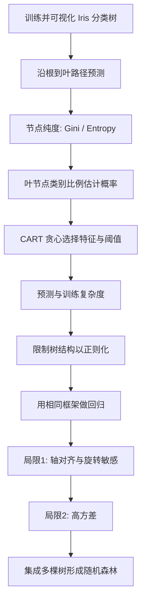

> 书目：*Hands-On Machine Learning with Scikit-Learn and PyTorch*<br>
> 章节：Chapter 5, Decision Trees<br>
> 章节文件：5. Decision Trees.md<br>
> 配套 Notebook：<https://homl.info/colab-p>

---

## 阅读导引

### 本章要回答什么问题

决策树是一类非常通用的模型：

- 可以做分类；
- 可以做回归；
- 可以处理多输出任务；
- 可以拟合复杂、非线性的决策边界；
- 预测规则直观，容易解释。

第 2 章已经使用 `DecisionTreeRegressor` 完美拟合加州房价训练集，但那次“完美”实际上是严重过拟合。本章要打开这个模型的黑箱，回答：

1. 决策树如何把一组 if/else 规则组织成预测模型？
2. 节点中的 `samples`、`value`、`gini` 分别表示什么？
3. CART 如何寻找切分特征和阈值？
4. 为什么树容易过拟合，怎样正则化？
5. 分类树与回归树有哪些共同结构和差异？
6. 为什么树对坐标轴方向敏感、方差很高？
7. 为什么随机森林能够修复单棵树的主要弱点？

### 全章主线



### 一句话理解决策树

> 决策树把特征空间递归切成若干矩形区域；分类时，每个区域输出训练样本中最多的类别及其比例；回归时，每个区域输出训练目标的平均值。

### 本章的分析方式

本章从一棵只有两层的 Iris 树出发：先人工走一遍预测路径，再解释节点统计量；随后反向追问这些切分是怎样学出来的，由此引出 CART 目标函数。接着观察无限制树的过拟合，介绍结构正则化；最后把同一算法换成回归损失，并分析轴向敏感和高方差。

这条路线的关键不是背 API，而是理解以下统一框架：

$$
\boxed{
\text{选择切分}=
\text{寻找使左右子区域加权损失最小的特征与阈值}
}
$$

分类的区域损失是不纯度，回归的区域损失是 MSE。

---

## 0. 必要基础

### 0.1 树的基本术语

| 术语 | 含义 |
| --- | --- |
| 根节点（root） | 树最顶端，所有样本从这里开始 |
| 分裂节点（split/internal node） | 包含判断条件，有子节点 |
| 叶节点（leaf） | 没有子节点，直接给出预测 |
| 深度（depth） | 根节点深度为 0，向下一层加 1 |
| 子树（subtree） | 某个节点及其全部后代 |
| 二叉树（binary tree） | 每个分裂节点恰好有两个子节点 |
| 路径（path） | 从根节点到某个叶节点经过的判断序列 |

Scikit-Learn 使用 CART，生成二叉树。每个判断都是：

$$
x_k\le t_k\ ?
$$

- 满足条件：进入左子节点；
- 不满足：进入右子节点。

ID3 等其他算法可以生成一个节点拥有多个子节点的树。

### 0.2 特征空间分区

对二维输入 $(x_1,x_2)$：

- 条件 $x_1\le2.45$ 是一条竖直边界；
- 条件 $x_2\le1.75$ 是一条水平边界；
- 多次切分后，平面被划成多个轴对齐矩形。

在 $n$ 维空间中，每次切分用一个与坐标轴垂直的超平面，把当前区域一分为二。树本质上是在构造一个分段常数函数。

### 0.3 加权平均

若左右子节点分别有 $m_L,m_R$ 个样本，损失为 $L_L,L_R$，父节点切分后的整体损失应按样本数加权：

$$
L_{\text{split}}
=\frac{m_L}{m}L_L+\frac{m_R}{m}L_R,
\qquad m=m_L+m_R
$$

为什么不能简单平均 $(L_L+L_R)/2$？因为一个只含 1 个样本的小叶节点，不应和一个含 999 个样本的大节点拥有同等影响。样本加权使每个训练实例对总体目标的贡献相同。

### 0.4 对数复杂度

若一棵二叉树近似平衡，每向下一层，候选样本数约减半：

$$
m\to\frac m2\to\frac m{2^2}\to\cdots\to1
$$

深度 $h$ 满足：

$$
\frac m{2^h}\approx1
\quad\Longrightarrow\quad
2^h\approx m
\quad\Longrightarrow\quad
h\approx\log_2m
$$

这是预测复杂度约为 $O(\log_2m)$ 的来源。注意这依赖“近似平衡”；退化成链时深度可达 $O(m)$。

### 0.5 期望与方差

对随机模型预测 $\hat f_D(\mathbf x)$，其中 $D$ 表示随机变化的训练集：

$$
\operatorname{Var}_D[\hat f_D(\mathbf x)]
=E_D\left[
(\hat f_D(\mathbf x)-E_D[\hat f_D(\mathbf x)])^2
\right]
$$

高方差意味着：只要训练数据稍微变化，模型预测就明显变化。决策树的递归切分有放大扰动的效应，因此属于典型高方差模型。

---

## 1. 训练并可视化决策树

### 1.1 Iris 分类任务

使用 Iris 数据集的两个特征：

- 花瓣长度；
- 花瓣宽度。

目标是预测三种鸢尾花：

- `setosa`；
- `versicolor`；
- `virginica`。

```python
from sklearn.datasets import load_iris
from sklearn.tree import DecisionTreeClassifier

iris = load_iris(as_frame=True)
X_iris = iris.data[["petal length (cm)", "petal width (cm)"]].values
y_iris = iris.target

tree_clf = DecisionTreeClassifier(max_depth=2, random_state=42)
tree_clf.fit(X_iris, y_iris)
```

参数：

- `max_depth=2`：最多允许根节点下面再有两层；
- `random_state=42`：固定并列候选切分时的随机选择，使结果可复现。

### 1.2 使用 Graphviz 可视化

```python
from sklearn.tree import export_graphviz

export_graphviz(
    tree_clf,
    out_file="iris_tree.dot",
    feature_names=["petal length (cm)", "petal width (cm)"],
    class_names=iris.target_names,
    rounded=True,
    filled=True,
)
```

在 Notebook 中显示：

```python
from graphviz import Source

Source.from_file("iris_tree.dot")
```

`.dot` 是图定义文件，Graphviz 还可将它转换成 PDF、PNG 等格式。

不安装 Graphviz 时，可使用纯 Matplotlib：

```python
import matplotlib.pyplot as plt
from sklearn.tree import plot_tree

plt.figure(figsize=(10, 6))
plot_tree(
    tree_clf,
    feature_names=["petal length (cm)", "petal width (cm)"],
    class_names=iris.target_names,
    filled=True,
    rounded=True,
)
plt.show()
```

### 1.3 完整节点结构

`value` 的类别顺序是 `[setosa, versicolor, virginica]`。

| 节点 | 判断/阈值 | `samples` | `value` | `gini` | 预测类别 |
| --- | --- | ---: | --- | ---: | --- |
| 根节点 0 | petal length $\le2.45$ | 150 | `[50,50,50]` | $0.6667$ | setosa（并列取较小索引） |
| 左叶 1 | 无 | 50 | `[50,0,0]` | $0$ | setosa |
| 右分支 2 | petal width $\le1.75$ | 100 | `[0,50,50]` | $0.5$ | versicolor（并列取较小索引） |
| 左叶 3 | 无 | 54 | `[0,49,5]` | $0.1680$ | versicolor |
| 右叶 4 | 无 | 46 | `[0,1,45]` | $0.0425$ | virginica |

底层浮点阈值可能显示为 `2.44999999`，图中四舍五入为 2.45。叶节点的底层阈值使用 `-2` 作为哨兵值，不表示真实切分。

查看内部数组：

```python
tree = tree_clf.tree_
print("children_left :", tree.children_left)
print("children_right:", tree.children_right)
print("feature       :", tree.feature)
print("threshold     :", tree.threshold)
print("impurity      :", tree.impurity)
print("n_node_samples:", tree.n_node_samples)
print("value         :", tree.value)
```

`tree_` 是理解和导出树结构的核心接口。不同 Scikit-Learn 版本中，`tree_.value` 可能表示类别计数或归一化比例，使用时应检查版本输出。

---

## 2. 决策树如何进行预测

### 2.1 人工走一遍预测路径

给定一朵花：

1. 从根节点开始；
2. 若花瓣长度 $\le2.45$ cm，进入左叶，预测 `setosa`；
3. 否则进入右分支；
4. 若花瓣宽度 $\le1.75$ cm，预测 `versicolor`；
5. 否则预测 `virginica`。

可写成规则：

```text
if petal_length <= 2.45:
    class = setosa
else:
    if petal_width <= 1.75:
        class = versicolor
    else:
        class = virginica
```

这就是树的“白盒”特性：人可以手工执行整个决策过程。

### 2.2 节点字段的严格含义

#### `samples`

到达该节点的训练实例数量。

例如根节点有 150 个样本；其中 100 个花瓣长度大于 2.45 cm，进入右子节点；再有 54 个花瓣宽度不超过 1.75 cm，进入左叶。

#### `value`

到达该节点的各类别训练样本数量或比例。

叶 3：

$$
\text{value}=[0,49,5]
$$

表示该区域包含 0 个 setosa、49 个 versicolor、5 个 virginica。

#### `class`

通常选择 `value` 最大的类别：

$$
\hat y_i=\arg\max_k n_{i,k}
$$

其中 $n_{i,k}$ 是节点 $i$ 中类别 $k$ 的样本数。并列时，Scikit-Learn 的 `argmax` 选择索引较小的类别。

#### `gini`

节点类别混合程度，下一节详细推导。

### 2.3 为什么树不需要特征缩放

树只比较：

$$
x_k\le t_k
$$

若对特征做严格单调变换，例如：

$$
z_k=ax_k+b,\qquad a>0
$$

则样本顺序不变，阈值同步变成 $at_k+b$，左右分组完全相同。因此：

- 不需要标准化；
- 不需要中心化；
- 米换成厘米不会改变树的分区结构；
- 但 PCA 这种混合多个特征的旋转变换会改变树。

### 2.4 决策边界

二维 Iris 平面中：

- 根节点产生竖线 $x_{\text{length}}=2.45$；
- 右分支产生横线 $x_{\text{width}}=1.75$；
- `max_depth=2` 后停止；
- 若深度为 3，两个深度 2 节点还可增加切分边界。

树的决策边界是轴对齐的阶梯/矩形组合。这既是优势，也是后面旋转敏感问题的根源。

---

## 3. Gini 不纯度

### 3.1 它要解决什么问题

CART 需要判断一个节点“有多混杂”，才能比较不同切分。

如果一个节点全部属于同一类别，它是纯节点；如果多个类别比例接近，它很不纯。

### 3.2 公式 5-1：Gini 不纯度

$$
G_i=1-\sum_{k=1}^{K}p_{i,k}^2
$$

- $G_i$：节点 $i$ 的 Gini 不纯度；
- $K$：类别数量；
- $p_{i,k}$：节点 $i$ 中类别 $k$ 的样本比例；
- $\sum_kp_{i,k}=1$。

### 3.3 概率直觉

从该节点的类别分布中独立抽取两个类别标签，它们相同的概率：

$$
P(\text{相同})=\sum_{k=1}^{K}p_k^2
$$

因为“两次都抽到类别 $k$”的概率为 $p_k^2$，再对所有类别求和。

因此：

$$
G=1-P(\text{相同})
$$

即两个独立标签不同的概率。这解释了为何类别越混杂，Gini 越大。

### 3.4 取值范围与极值

#### 纯节点

若某类别概率为 1，其余为 0：

$$
G=1-1^2=0
$$

#### 最混杂节点

当 $K$ 个类别均匀分布：

$$
p_k=\frac1K
$$

$$
G_{\max}
=1-K\left(\frac1K\right)^2
=1-\frac1K
$$

二分类最大值为 $1/2$；三分类最大值为 $2/3$。

为什么均匀时最大？由 Cauchy–Schwarz：

$$
\left(\sum_{k=1}^{K}p_k\right)^2
\le K\sum_{k=1}^{K}p_k^2
$$

左侧为 1：

$$
\sum_kp_k^2\ge\frac1K
$$

等号当且仅当所有 $p_k$ 相等，所以 $G=1-\sum p_k^2$ 在均匀分布时最大。

### 3.5 Iris 节点数值验算

#### 根节点

$$
p=(1/3,1/3,1/3)
$$

$$
G=1-3\left(\frac13\right)^2
=\frac23\approx0.6667
$$

#### 叶 3：`[0,49,5]`

$$
G
=1-\left(\frac0{54}\right)^2
-\left(\frac{49}{54}\right)^2
-\left(\frac5{54}\right)^2
$$

$$
=1-\frac{2401+25}{2916}
=\frac{490}{2916}
=\frac{245}{1458}
\approx0.168038
$$

#### 叶 4：`[0,1,45]`

$$
G
=1-\left(\frac1{46}\right)^2
-\left(\frac{45}{46}\right)^2
=\frac{90}{2116}
=\frac{45}{1058}
\approx0.042533
$$

虽然叶 4 不是完全纯净，但 45/46 都是 virginica，所以不纯度很低。

可运行验证：

```python
import numpy as np

def gini(counts):
    counts = np.asarray(counts, dtype=float)
    probabilities = counts / counts.sum()
    return 1 - np.sum(probabilities ** 2)

print(gini([50, 50, 50]))  # 0.6666666666666667
print(gini([0, 49, 5]))    # 0.16803840877914955
print(gini([0, 1, 45]))    # 0.04253308128544431
```

---

## 4. 白盒模型与黑盒模型

决策树的规则可以直接阅读、人工执行，因此属于典型**白盒模型**。

随机森林和神经网络通常被称为黑盒模型：可以复现它们的数值计算，但很难用少量人类可理解的规则说明“为什么做出这个预测”。

可解释性在以下领域尤为重要：

- 医疗：医生复核诊断依据；
- 金融：分析风险来源；
- 司法：由人类做最终裁决；
- 人力资源：检查决策是否存在偏见。

但“树可解释”有边界：

- 浅树容易解释；
- 数百层、数千叶的树同样难以理解；
- 训练数据略变就可能产生完全不同的规则；
- 可读规则不等于因果解释，也不保证公平。

---

## 5. 估计类别概率

### 5.1 概率如何得到

给定新实例：

1. 沿树到达某个叶节点；
2. 统计该叶中各类别训练样本比例；
3. 将这些比例作为类别概率估计。

对叶节点 $\ell$：

$$
\hat P(y=k\mid\mathbf x\in R_\ell)
=\frac{n_{\ell,k}}{n_\ell}
$$

- $R_\ell$：叶节点对应的特征区域；
- $n_{\ell,k}$：叶中类别 $k$ 样本数；
- $n_\ell$：叶中总样本数。

### 5.2 Iris 数值例子

输入：花瓣长 5 cm、宽 1.5 cm。

- 长度 $>2.45$，向右；
- 宽度 $\le1.75$，进入叶 3；
- 叶 3 的 `value=[0,49,5]`。

因此：

$$
P(\text{setosa})=\frac0{54}=0
$$

$$
P(\text{versicolor})=\frac{49}{54}\approx0.9074
$$

$$
P(\text{virginica})=\frac5{54}\approx0.0926
$$

```python
print(tree_clf.predict_proba([[5, 1.5]]).round(3))
print(tree_clf.predict([[5, 1.5]]))
```

输出：

```text
[[0.    0.907 0.093]]
[1]
```

### 5.3 分段常数概率的局限

同一个叶区域中的所有点概率完全相同。例如：

- `[5, 1.5]`；
- `[6, 1.5]`。

二者都落入同一矩形，因此概率都是 `[0, 0.907, 0.093]`，即使花瓣长 6 cm 时从直觉上更像 virginica。

这说明叶节点概率：

- 是局部经验频率；
- 不是随距离平滑变化的概率函数；
- 小叶节点的比例方差很大；
- 未必校准良好；
- `min_samples_leaf` 增大时通常更稳定、更平滑。

---

## 6. CART 训练算法

### 6.1 CART 做什么

CART 全称 Classification and Regression Tree。训练树也称“生长树”。

在每个节点，算法选择：

- 一个特征索引 $k$；
- 一个切分阈值 $t_k$。

把样本分成：

$$
R_L(k,t_k)=\{i:x_k^{(i)}\le t_k\}
$$

$$
R_R(k,t_k)=\{i:x_k^{(i)}>t_k\}
$$

然后寻找使加权子节点不纯度最小的 $(k,t_k)$。

### 6.2 公式 5-2：分类 CART 代价函数

$$
J(k,t_k)
=\frac{m_L}{m}G_L
+\frac{m_R}{m}G_R
$$

其中：

$$
m=m_L+m_R
$$

- $m_L,m_R$：左右子节点样本数；
- $G_L,G_R$：左右子节点不纯度；
- 默认使用 Gini，也可使用 entropy。

最优切分：

$$
(k^*,t^*)=\arg\min_{k,t_k}J(k,t_k)
$$

等价地，也可最大化不纯度减少量：

$$
\Delta G
=G_{\text{parent}}-J(k,t_k)
$$

### 6.3 为什么必须按子节点大小加权

假设候选切分产生：

- 左节点 1 个纯样本，$G_L=0$；
- 右节点 99 个高度混杂样本，$G_R=0.5$。

简单平均得到 0.25，看似不错；正确加权：

$$
J=\frac1{100}\cdot0+\frac{99}{100}\cdot0.5=0.495
$$

说明这个切分几乎没有改善整体数据。加权防止算法通过制造极小纯叶来“作弊”。

### 6.4 Iris 根切分验算

根节点不纯度：

$$
G_{\text{root}}=\frac23
$$

切分后：

- 左节点 50 个 setosa，$G_L=0$；
- 右节点 100 个，`[0,50,50]`，$G_R=0.5$。

$$
J=\frac{50}{150}\cdot0
+\frac{100}{150}\cdot0.5
=\frac13
$$

不纯度下降：

$$
\Delta G=\frac23-\frac13=\frac13
$$

### 6.5 第二次切分验算

右节点切成：

- 54 个样本，$G_L\approx0.168038$；
- 46 个样本，$G_R\approx0.042533$。

$$
J
=\frac{54}{100}(0.168038)
+\frac{46}{100}(0.042533)
\approx0.110306
$$

相对父节点 $G=0.5$，下降约：

$$
0.5-0.110306=0.389694
$$

### 6.6 候选阈值怎样产生

对某个特征，先将当前节点样本按特征值排序。只有相邻不同取值之间的中点可能改变左右分组：

$$
t_j=\frac{x_{(j)}+x_{(j+1)}}2
$$

因此无需测试任意实数阈值，只需测试有限个候选中点。

`splitter="best"` 搜索候选特征和阈值中的最佳切分；`splitter="random"` 对候选特征随机选择阈值，提高随机性。

### 6.7 递归生长与停止条件

找到当前最佳切分后，对左右子节点递归执行同一过程。

常见停止条件：

- 节点已经纯净；
- 找不到能降低不纯度的有效切分；
- 达到 `max_depth`；
- 样本数不足 `min_samples_split`；
- 切分会违反 `min_samples_leaf`；
- 达到 `max_leaf_nodes`；
- 不纯度改善小于 `min_impurity_decrease`。

### 6.8 为什么 CART 是贪心算法

CART 每次只选择**当前节点**最好的切分，不会尝试：

> 当前稍差的切分，是否会在后续两三层产生更好的整棵树？

这是一种局部贪心策略：

- 速度可接受；
- 通常得到不错的树；
- 不保证全局最优。

一个早期切分改变后，所有后续节点的数据都改变，因此局部决定会影响整棵树。

### 6.9 为什么不直接寻找最优树

适当形式的决策问题——“是否存在一棵满足大小与误差约束的树”——是 NP-complete；相应最优化问题是 NP-hard。

概念：

- P：可在多项式时间内求解；
- NP：给定候选答案后，可在多项式时间内验证；
- NP-hard：所有 NP 问题都可多项式归约到它；
- NP-complete：既属于 NP，又是 NP-hard。

精确搜索的最坏风险呈指数级，可概括为 $O(\exp(m))$，小规模数据也可能不可行。因此实际训练接受“足够好”的贪心解。

注意：NP-complete 表明目前没有已知多项式精确算法，并不严格等价于某个固定的指数复杂度公式。

### 6.10 CART 伪代码

```text
grow(node, depth):
    如果满足任一停止条件:
        将 node 设为叶节点
        返回

    best_cost = +∞
    对每个候选特征 k:
        排序该特征取值
        对每个相邻取值中点 t:
            按 x_k <= t 划分左右子集
            若违反叶节点约束，跳过
            计算加权不纯度 J(k,t)
            若 J 更小，记录为最佳切分

    若没有有效改善:
        将 node 设为叶节点
        返回

    应用最佳切分
    grow(left_child, depth + 1)
    grow(right_child, depth + 1)
```

---

## 7. 计算复杂度

### 7.1 预测复杂度

预测只需从根走到一个叶。每个节点只检查一个特征：

$$
T_{\text{predict}}=O(h)
$$

若树近似平衡：

$$
h\approx\log_2m
$$

所以：

$$
T_{\text{predict}}=O(\log_2m)
$$

预测复杂度与总特征数 $n$ 无关，因为每层只读取一个特征。

**适用边界**：这是典型/平衡情况。退化链状树可能有 $h=O(m)$，预测也退化为 $O(m)$。

### 7.2 训练复杂度

默认情况下，每个节点检查所有特征和候选切分。对平衡树的直觉推导：

- 同一层所有节点合计处理约 $m$ 个样本；
- 检查 $n$ 个特征，约 $O(nm)$；
- 树约有 $\log_2m$ 层。

因此：

$$
T_{\text{train}}
=O(nm\log_2m)
$$

若每个节点只随机检查 $f$ 个特征、最大深度为 $h$，可粗略写成：

$$
O(fmh)
$$

限制 `max_depth` 或 `max_features`：

- 可加快训练；
- 可降低过拟合；
- 限制过强会欠拟合。

### 7.3 数值例子

#### 一百万样本的典型深度

$$
\log_2(10^6)
=\frac{\log(10^6)}{\log2}
\approx19.93
$$

近似平衡树深度约 20。

#### 样本扩大 10 倍

训练时间比例：

$$
\frac{10m\log_2(10m)}{m\log_2m}
=10\frac{\log_2(10m)}{\log_2m}
$$

$m=10^6$：

$$
10\frac{\log_2(10^7)}{\log_2(10^6)}
\approx11.67
$$

若原来 1 小时，新任务约 11.7 小时。

#### 特征数翻倍

复杂度对 $n$ 线性，因此大约从 1 小时变成 2 小时。

---

## 8. Gini 还是 Entropy

### 8.1 为什么需要另一种不纯度

Gini 不是唯一的不纯度度量。设置：

```python
DecisionTreeClassifier(criterion="entropy")
```

即可使用熵。二者都满足：

- 纯节点取 0；
- 类别越均匀混合，值越大；
- 都可放入 CART 加权目标函数。

### 8.2 公式 5-3：节点熵

$$
H_i
=-\sum_{\substack{k=1\\p_{i,k}\ne0}}^{K}
p_{i,k}\log_2p_{i,k}
$$

- $H_i$：节点 $i$ 的熵；
- $p_{i,k}$：类别 $k$ 比例；
- $p=0$ 的项省略，因为 $\log0$ 无定义，但极限 $p\log p\to0$。

### 8.3 为什么熵衡量混乱程度

信息量定义为：

$$
I(k)=-\log_2p_k
$$

罕见事件发生时信息量更大。节点中类别标签的平均信息量：

$$
E[I]
=\sum_kp_k(-\log_2p_k)
=-\sum_kp_k\log_2p_k
=H
$$

若节点只有一个类别，$p=1$：

$$
H=-1\log_21=0
$$

标签完全确定，不需要额外信息。

若 $K$ 类均匀：

$$
p_k=1/K
$$

$$
H_{\max}
=-K\frac1K\log_2\frac1K
=\log_2K
$$

二分类最大熵为 1 bit，三分类最大熵为 $\log_23\approx1.585$ bit。

#### 为什么均匀分布使熵最大

在约束 $\sum_kp_k=1$ 下，用拉格朗日乘子：

$$
\mathcal L(\mathbf p,\lambda)
=-\sum_{k=1}^{K}p_k\ln p_k
+\lambda\left(\sum_{k=1}^{K}p_k-1\right)
$$

这里改用自然对数只会把熵乘以常数 $1/\ln2$，不改变最大点。

对 $p_k$ 求偏导：

$$
\frac{\partial\mathcal L}{\partial p_k}
=-(\ln p_k+1)+\lambda=0
$$

所以所有 $k$ 都满足：

$$
\ln p_k=\lambda-1
$$

即全部 $p_k$ 相等。由概率和为 1：

$$
p_k=\frac1K
$$

二阶导：

$$
\frac{\partial^2}{\partial p_k^2}(-p_k\ln p_k)
=-\frac1{p_k}<0
$$

目标在概率单纯形内部严格凹，因此该驻点是唯一全局最大点。

### 8.4 Iris 叶节点熵验算

叶 3 的比例为 $(0,49/54,5/54)$：

$$
H
=-\frac{49}{54}\log_2\frac{49}{54}
-\frac5{54}\log_2\frac5{54}
\approx0.445065
$$

```python
import numpy as np

def entropy(counts):
    counts = np.asarray(counts, dtype=float)
    probabilities = counts[counts > 0] / counts.sum()
    return -np.sum(probabilities * np.log2(probabilities))

print(entropy([0, 49, 5]))  # 0.44506485705083865
```

### 8.5 Gini 与熵的对比

| 方面 | Gini | Entropy |
| --- | --- | --- |
| 公式 | $1-\sum p_k^2$ | $-\sum p_k\log_2p_k$ |
| 纯节点 | 0 | 0 |
| $K$ 类均匀最大值 | $1-1/K$ | $\log_2K$ |
| 计算 | 乘法、加法 | 需要对数 |
| 速度 | 略快 | 略慢 |
| 典型倾向 | 更容易把最高频类隔离到单独分支 | 更容易产生稍平衡的树 |

大多数时候二者产生相似的树，没有普遍的准确率赢家。Gini 计算略快，是很好的默认选择。

### 8.6 二分类下的形状

令正类比例为 $p$，负类为 $1-p$：

$$
G(p)=1-p^2-(1-p)^2=2p(1-p)
$$

$$
H(p)=-p\log_2p-(1-p)\log_2(1-p)
$$

两者都：

- 关于 $p=0.5$ 对称；
- 在 $p=0$ 或 $1$ 时为 0；
- 在 $p=0.5$ 时最大；
- 对“纯度提升”给出相近排序。

这解释了为何实际树结构通常差异不大。

---

## 9. 正则化超参数

### 9.1 为什么树特别容易过拟合

线性模型在训练前就确定了参数数量；决策树的节点数量和结构由数据决定。

**参数模型（parametric model）**：

- 参数数量预先固定；
- 自由度有限；
- 较不易过拟合，但更可能欠拟合。

**非参数模型（nonparametric model）**：

- 不是“没有参数”，而是参数数量未预先固定；
- 树可持续长出新节点；
- 能紧贴训练数据；
- 容易把噪声也变成规则。

无限制树常把叶节点切到只剩一个或极少样本，使训练误差接近 0，但泛化不佳。

### 9.2 预剪枝参数

| 参数 | 默认值 | 含义 | 如何增强正则化 |
| --- | ---: | --- | --- |
| `max_depth` | `None` | 最大深度 | 减小 |
| `max_features` | `None` | 每个节点最多检查的特征数 | 减小 |
| `max_leaf_nodes` | `None` | 最大叶节点数 | 减小 |
| `min_samples_split` | 2 | 节点至少多少样本才能切分 | 增大 |
| `min_samples_leaf` | 1 | 新叶至少包含多少样本 | 增大 |
| `min_weight_fraction_leaf` | 0.0 | 叶节点最小加权样本比例 | 增大 |
| `min_impurity_decrease` | 0.0 | 切分所需最小不纯度下降 | 增大 |

记忆规律：

- 增大 `min_*`：更难继续切分；
- 减小 `max_*`：限制树规模；
- 约束更强：偏差增加、方差下降。

### 9.3 参数如何改变边界

#### `max_depth`

直接限制规则层数：

- 优点：简单有效、树更易解释；
- 太小：无法表达复杂边界，欠拟合。

通常是首选调参项。

#### `min_samples_leaf`

防止创建只服务于少量训练点的小叶：

- 让分类概率更稳定；
- 让回归预测更平滑；
- 小数据集尤其有用。

#### `max_features`

高维数据中减少每个节点检查的特征：

- 加快训练；
- 增加随机性；
- 降低树之间相关性，为随机森林打基础；
- 太小会错过关键特征。

### 9.4 最小代价复杂度剪枝（MCCP）

`ccp_alpha` 控制生长后的代价复杂度剪枝。可将目标理解为：

$$
R_\alpha(T)=R(T)+\alpha|\widetilde T|
$$

- $T$：树；
- $R(T)$：叶节点加权不纯度或误差；
- $|\widetilde T|$：叶节点数量；
- $\alpha$：每增加一个叶节点付出的复杂度代价。

`ccp_alpha` 越大：

- 更多子树被删除；
- 树更小；
- 方差降低；
- 过大则欠拟合。

可查看候选剪枝路径：

```python
path = tree_clf.cost_complexity_pruning_path(X_iris, y_iris)
print(path.ccp_alphas)
print(path.impurities)
```

### 9.5 基于统计显著性的后剪枝

另一类算法先长出完整树，再删除没有显著改善纯度的节点。

若某节点的两个孩子都是叶，可检验类别分布差异是否可能只是随机波动：

1. 零假设：切分没有真实作用；
2. 用 $\chi^2$ 检验计算 p-value；
3. 若 p-value 高于阈值（常见 5%），无法拒绝零假设；
4. 认为该节点不必要，删除子节点；
5. 递归向上剪枝。

p-value 不是“零假设为真的概率”，而是在零假设成立时观察到当前或更极端数据的概率。

### 9.6 Moons 正则化实验

生成两个交错月牙：

```python
from sklearn.datasets import make_moons
from sklearn.tree import DecisionTreeClassifier

X_moons, y_moons = make_moons(
    n_samples=150,
    noise=0.2,
    random_state=42,
)

tree_clf1 = DecisionTreeClassifier(random_state=42)
tree_clf2 = DecisionTreeClassifier(
    min_samples_leaf=5,
    random_state=42,
)

tree_clf1.fit(X_moons, y_moons)
tree_clf2.fit(X_moons, y_moons)
```

无限制树产生复杂、锯齿状边界；`min_samples_leaf=5` 的边界更平滑。

独立测试集：

```python
X_moons_test, y_moons_test = make_moons(
    n_samples=1000,
    noise=0.2,
    random_state=43,
)

print(tree_clf1.score(X_moons_test, y_moons_test))
print(tree_clf2.score(X_moons_test, y_moons_test))
```

输出：

```text
0.898
0.92
```

训练数据相同，正则化树测试准确率反而更高，说明牺牲部分训练拟合换来了更好的泛化。

### 9.7 调参建议

1. 先调 `max_depth`：效果直观，便于解释；
2. 小数据集重点调 `min_samples_leaf`；
3. 高维数据调 `max_features`；
4. 用 `max_leaf_nodes` 直接控制叶数量；
5. 需要后剪枝时交叉验证 `ccp_alpha`；
6. 所有超参数必须通过验证集/交叉验证选择，不能根据测试集反复调整。

---

## 10. 回归树

### 10.1 从分类推广到回归

树的路径结构完全不变：仍然反复判断 $x_k\le t_k$。

差异：

- 分类叶输出多数类别和类别比例；
- 回归叶输出目标均值；
- 分类按不纯度选择切分；
- 回归按 MSE 选择切分。

### 10.2 生成带噪二次数据

```python
import numpy as np
from sklearn.tree import DecisionTreeRegressor

rng = np.random.default_rng(seed=42)
X_quad = rng.random((200, 1)) - 0.5
y_quad = X_quad ** 2 + 0.025 * rng.standard_normal((200, 1))

tree_reg = DecisionTreeRegressor(max_depth=2, random_state=42)
tree_reg.fit(X_quad, y_quad)
```

数据生成过程：

$$
x\sim U[-0.5,0.5),
\qquad
y=x^2+0.025\varepsilon,
\qquad
\varepsilon\sim\mathcal N(0,1)
$$

### 10.3 回归树完整节点结构

| 节点 | 判断/阈值 | `samples` | `value` | squared error |
| --- | --- | ---: | ---: | ---: |
| 根 0 | $x_1\le0.343041$ | 200 | 0.080 | 0.006 |
| 左分支 1 | $x_1\le-0.301829$ | 175 | 0.065 | 0.004 |
| 左左叶 2 | 无 | 42 | 0.151 | 0.003 |
| 左右叶 3 | 无 | 133 | 0.038 | 0.002 |
| 右分支 4 | $x_1\le0.431404$ | 25 | 0.185 | 0.002 |
| 右左叶 5 | 无 | 14 | 0.150 | 0.000（显示精度） |
| 右右叶 6 | 无 | 11 | 0.229 | 0.001 |

表中误差按图示三位小数，不能据此恢复完整精度。

### 10.4 人工预测 $x=0.2$

1. $0.2\le0.343$，进入左分支；
2. $0.2>-0.302$，进入左右叶；
3. 输出 `value=0.038`。

该叶包含 133 个样本，0.038 是它们目标值的平均。

```python
print(tree_reg.predict([[0.2]]))
```

输出接近：

```text
[0.038...]
```

### 10.5 为什么叶节点预测均值

设一个叶节点包含目标 $y_1,\ldots,y_m$，若统一预测常数 $c$，平方误差：

$$
L(c)=\frac1m\sum_{i=1}^{m}(c-y_i)^2
$$

求导：

$$
\frac{dL}{dc}
=\frac2m\sum_{i=1}^{m}(c-y_i)
$$

令导数为 0：

$$
mc-\sum_{i=1}^{m}y_i=0
$$

$$
\boxed{c=\frac1m\sum_{i=1}^{m}y_i=\bar y}
$$

二阶导：

$$
\frac{d^2L}{dc^2}=2>0
$$

所以目标均值是唯一最小 MSE 的常数预测。

若使用绝对误差 MAE，最优常数是中位数，而不是均值。

### 10.6 公式 5-4：回归 CART 代价

$$
J(k,t_k)
=\frac{m_L}{m}\operatorname{MSE}_L
+\frac{m_R}{m}\operatorname{MSE}_R
$$

其中：

$$
\operatorname{MSE}_{N}
=\frac1{m_N}\sum_{i\in N}
(\hat y_N-y^{(i)})^2
$$

$$
\hat y_N
=\frac1{m_N}\sum_{i\in N}y^{(i)}
$$

分类 CART 与回归 CART 的统一形式：

$$
J(k,t_k)
=\frac{m_L}{m}L_L
+\frac{m_R}{m}L_R
$$

只需替换节点损失 $L$：分类用 Gini/Entropy，回归用 MSE。

### 10.7 分段常数预测

每个叶区域输出一个常数均值，所以预测曲线呈阶梯状：

$$
\hat f(x)=\sum_{\ell=1}^{L}\bar y_\ell
\mathbf1[x\in R_\ell]
$$

- $R_\ell$：第 $\ell$ 个叶区域；
- $\bar y_\ell$：该叶目标均值；
- $\mathbf1[\cdot]$：指示函数。

`max_depth=3` 比深度 2 划出更多区域，阶梯更细，但过深会追逐噪声。

### 10.8 回归过拟合与正则化

无限制回归树可创建极小叶节点，预测曲线会在训练点附近剧烈跳动。

只需：

```python
tree_reg_regularized = DecisionTreeRegressor(
    min_samples_leaf=10,
    random_state=42,
)
tree_reg_regularized.fit(X_quad, y_quad)
```

即可得到更平滑、合理的预测。

回归树和分类树共享相同的结构正则化参数。

### 10.9 回归树的适用边界

优势：

- 无需假设线性；
- 可表达非单调关系和特征交互；
- 不需要缩放；
- 对异常值位置有一定局部分割能力。

局限：

- 预测分段常数，不连续；
- 不会外推：超出训练范围后仍输出边缘叶均值；
- 深树高方差；
- 小叶均值不稳定；
- MSE 对目标异常值仍然敏感。

### 10.10 多输出树

若每个样本有 $q$ 个目标，$oldsymbol y^{(i)}\in\mathbb R^q$，回归叶预测目标向量均值：

$$
\hat{\boldsymbol y}_N
=\frac1{m_N}\sum_{i\in N}\boldsymbol y^{(i)}
$$

节点误差可对所有输出平方误差求平均或求和。分类多输出任务则为每个输出保存各类别分布。

Scikit-Learn 允许二维目标矩阵：

```python
from sklearn.tree import DecisionTreeRegressor

X_multi = np.linspace(-1, 1, 200).reshape(-1, 1)
y_multi = np.c_[X_multi[:, 0] ** 2, np.sin(5 * X_multi[:, 0])]

multi_tree = DecisionTreeRegressor(max_depth=4, random_state=42)
multi_tree.fit(X_multi, y_multi)

print(multi_tree.predict([[0.2]]))  # 同时输出两个预测值
```

多输出仍共享同一棵树结构，因此切分必须同时兼顾所有目标；若不同目标需要完全不同的分区，共享结构可能限制性能。

---

## 11. 对坐标轴方向敏感

### 11.1 问题根源

CART 的每次判断只涉及一个特征：

$$
x_k\le t_k
$$

所以边界永远与某个坐标轴垂直。如果真正边界是一条斜线，树只能用很多水平和竖直线拼成阶梯近似。

### 11.2 旋转实验

考虑一个线性可分二维数据集：

- 原方向下，一次轴对齐切分就能分开；
- 整体旋转 45° 后，真实结构没有改变；
- 但树需要很多阶梯切分才能拟合。

旋转矩阵：

$$
\mathbf R(\phi)=
\begin{pmatrix}
\cos\phi&-\sin\phi\\
\sin\phi&\cos\phi
\end{pmatrix}
$$

旋转输入：

$$
\mathbf z=\mathbf X\mathbf R^\top
$$

```python
import numpy as np
from sklearn.tree import DecisionTreeClassifier

rng = np.random.default_rng(42)
X = rng.random((100, 2)) - 0.5
y = (X[:, 0] > 0).astype(int)

angle = np.pi / 4
rotation = np.array([
    [np.cos(angle), -np.sin(angle)],
    [np.sin(angle),  np.cos(angle)],
])
X_rotated = X @ rotation.T

tree_original = DecisionTreeClassifier(random_state=42).fit(X, y)
tree_rotated = DecisionTreeClassifier(random_state=42).fit(X_rotated, y)

print(tree_original.get_depth(), tree_rotated.get_depth())
```

两棵树都可能完美拟合训练集，但旋转后的边界更复杂，通常泛化更差。

### 11.3 为什么缩放不解决旋转问题

单独缩放每个特征只改变坐标轴单位，不改变轴的方向。样本在每个特征上的顺序不变，树仍使用同类轴对齐切分。

所以：

- 欠拟合树通常不能靠 `StandardScaler` 修复；
- 旋转敏感需要改变特征方向，而不是只改变尺度。

### 11.4 用 PCA 缓解

PCA 寻找一组正交方向，使新特征不相关，并按方差大小排序。它相当于旋转坐标系。

```python
from sklearn.decomposition import PCA
from sklearn.pipeline import make_pipeline
from sklearn.preprocessing import StandardScaler
from sklearn.tree import DecisionTreeClassifier

pca_pipeline = make_pipeline(
    StandardScaler(),
    PCA(),
)

X_iris_rotated = pca_pipeline.fit_transform(X_iris)
tree_clf_pca = DecisionTreeClassifier(max_depth=2, random_state=42)
tree_clf_pca.fit(X_iris_rotated, y_iris)
```

图 5-8 中，旋转后只用第一个主成分 $z_1$ 就能较好地区分类别。$z_1$ 是原始花瓣长度和宽度的线性组合。

为什么 PCA 前要缩放：PCA 根据方差寻找方向，单位较大的特征会主导结果；标准化让各特征更公平。

### 11.5 PCA 的适用边界

- PCA 常常但不总是帮助树；
- 主成分是原特征线性组合，可解释性下降；
- PCA 是无监督变换，最大方差方向未必最有利于标签；
- 应把缩放、PCA 和树放入同一 Pipeline，并用交叉验证比较；
- 对天然轴对齐的问题，PCA 反而可能使边界更复杂。

### 11.6 替代方案

- 设计更贴近任务的组合特征；
- 使用可学习斜切分的 oblique tree；
- 使用核方法或神经网络；
- 使用集成模型降低单树对某次轴向切分的依赖。

---

## 12. 原生处理缺失值

较新的 Scikit-Learn 中，`DecisionTreeClassifier` 和 `DecisionTreeRegressor` 对受支持配置可原生处理 NaN，无需先插补。

训练时，对每个候选阈值分别尝试：

- 缺失值全部送往左子节点；
- 缺失值全部送往右子节点。

选择目标函数更优的方向。若得分并列，缺失值送往右侧。若某特征训练时从未出现缺失，预测时该特征的 NaN 会送往样本更多的子节点。

简单示例：

```python
import numpy as np
from sklearn.tree import DecisionTreeClassifier

X_missing = np.array([
    [1.0, 0.1],
    [2.0, np.nan],
    [3.0, 0.8],
    [4.0, 0.9],
])
y_missing = np.array([0, 0, 1, 1])

tree_missing = DecisionTreeClassifier(random_state=42)
tree_missing.fit(X_missing, y_missing)
print(tree_missing.predict([[2.5, np.nan]]))
```

边界条件：

- 支持情况与 Scikit-Learn 版本、criterion 和 splitter 配置有关；
- 生产前应查看当前版本文档和运行测试；
- 原生支持不代表缺失机制无需分析；
- 缺失本身可能携带业务信号，也可能代表数据质量问题。

---

## 13. 决策树具有高方差

### 13.1 现象

训练数据、超参数甚至随机种子发生很小变化，树结构和决策边界都可能明显变化。

Scikit-Learn 在每次切分前会随机排列特征；当多个切分收益相同或接近时，随机顺序会影响最终选择。固定 `random_state` 才能稳定复现。

### 13.2 为什么递归切分会放大扰动

假设根节点有两个几乎同样好的候选切分 A 和 B：

1. 数据轻微变化使 A 改为 B；
2. 左右子节点包含的样本随之全部改变；
3. 后续所有候选切分重新排序；
4. 整棵树可能完全不同。

树是层层条件依赖的离散结构，因此早期的小变化会级联放大。

### 13.3 高方差与低偏差

无限制树容量很高：

- 能把训练集拟合得非常好，偏差低；
- 对训练集扰动很敏感，方差高；
- 泛化误差可能很高。

正则化通过限制自由度提高偏差、降低方差。

### 13.4 为什么平均多棵树能降低方差

设 $B$ 棵树预测误差方差均为 $\sigma^2$，任意两棵误差相关系数为 $\rho$。平均预测：

$$
\bar f=\frac1B\sum_{b=1}^{B}f_b
$$

方差：

$$
\operatorname{Var}(\bar f)
=\frac1{B^2}
\left[
B\sigma^2+B(B-1)\rho\sigma^2
\right]
$$

整理：

$$
\boxed{
\operatorname{Var}(\bar f)
=\sigma^2\left(
\rho+\frac{1-\rho}{B}
\right)
}
$$

结论：

- 若树完全独立，$\rho=0$，方差降为 $\sigma^2/B$；
- 若树完全相关，$\rho=1$，平均毫无帮助；
- 因此既要增加树数量，也要降低树之间的相关性。

随机森林通过 bootstrap 样本和随机特征制造差异，再平均预测，显著降低方差。

---

## 14. 章末练习与参考答案

### 练习 1：一百万样本的树深度

近似平衡且无限制时：

$$
\log_2(10^6)\approx19.93
$$

所以深度约为 20。实际树不完全平衡，通常可能略深；极端退化树可远深于此。

### 练习 2：子节点 Gini 是否一定更低

**加权平均不纯度**一般低于或等于父节点，否则 CART 不会选择该切分；但**某一个子节点**的 Gini 可以高于父节点。

反例：父节点类别为 `A,A,A,A,B`：

$$
G_P=1-(4/5)^2-(1/5)^2=0.32
$$

切分成：

- 左：`A,B`，$G_L=0.5$，高于父节点；
- 右：`A,A,A`，$G_R=0$。

加权：

$$
J=\frac25(0.5)+\frac35(0)=0.2<0.32
$$

所以整体改善，但左子节点更不纯。

### 练习 3：过拟合时是否减小 `max_depth`

是。减小 `max_depth` 限制自由度，提高偏差、降低方差，通常可缓解过拟合。也可增大 `min_samples_leaf`、`min_samples_split` 或 `ccp_alpha`。

### 练习 4：欠拟合时是否缩放特征

通常无效。树依赖特征值的顺序和阈值，严格单调缩放不改变可用分组。

欠拟合应：

- 增大 `max_depth`；
- 增大 `max_leaf_nodes`；
- 减小 `min_samples_leaf`；
- 减小 `min_samples_split`；
- 减弱剪枝；
- 增加有效特征。

### 练习 5：样本从一百万增至一千万

由 $O(nm\log m)$：

$$
	ext{倍率}
=10\frac{\log_2(10^7)}{\log_2(10^6)}
\approx11.67
$$

约 11.7 小时。

### 练习 6：特征数量翻倍

复杂度对 $n$ 线性，因此约 2 小时。实际时间还会受缓存、并行和实现影响。

### 练习 7：Moons 上调优一棵树

完整实现：

```python
from sklearn.datasets import make_moons
from sklearn.metrics import accuracy_score
from sklearn.model_selection import GridSearchCV, train_test_split
from sklearn.tree import DecisionTreeClassifier


X_moons, y_moons = make_moons(
    n_samples=10_000,
    noise=0.4,
    random_state=42,
)


X_train, X_test, y_train, y_test = train_test_split(
    X_moons,
    y_moons,
    test_size=0.2,
    random_state=42,
)


param_grid = {
    "max_leaf_nodes": list(range(2, 100)),
    "max_depth": list(range(1, 7)),
    "min_samples_split": [2, 3, 4],
}

grid_search = GridSearchCV(
    DecisionTreeClassifier(random_state=42),
    param_grid,
    cv=3,
    n_jobs=-1,
)
grid_search.fit(X_train, y_train)


best_tree = grid_search.best_estimator_
y_pred = best_tree.predict(X_test)

print("最佳参数:", grid_search.best_params_)
print("测试准确率:", accuracy_score(y_test, y_pred))
```

在当前验证环境中输出：

```text
最佳参数: {'max_depth': 6, 'max_leaf_nodes': 17, 'min_samples_split': 2}
测试准确率: 0.8595
```

不同 Scikit-Learn 版本可能出现轻微差异，约 85%～87% 属于预期范围。

### 练习 8：用 1000 棵小树多数投票

```python
import numpy as np
from scipy.stats import mode
from sklearn.base import clone
from sklearn.metrics import accuracy_score
from sklearn.model_selection import ShuffleSplit


n_trees = 1000
n_instances = 100

mini_sets = ShuffleSplit(
    n_splits=n_trees,
    test_size=len(X_train) - n_instances,
    random_state=42,
)

all_predictions = np.empty(
    (n_trees, len(X_test)),
    dtype=np.uint8,
)
tree_accuracies = []

for tree_index, (mini_train_indices, _) in enumerate(mini_sets.split(X_train)):
    # clone 只复制最佳超参数，返回一棵尚未训练的新树
    tree = clone(best_tree)
    tree.fit(
        X_train[mini_train_indices],
        y_train[mini_train_indices],
    )

    predictions = tree.predict(X_test)
    all_predictions[tree_index] = predictions
    tree_accuracies.append(accuracy_score(y_test, predictions))

majority_predictions = mode(
    all_predictions,
    axis=0,
    keepdims=False,
).mode

forest_accuracy = accuracy_score(y_test, majority_predictions)
single_tree_accuracy = accuracy_score(y_test, best_tree.predict(X_test))

print("预测矩阵形状:", all_predictions.shape)
print("小树平均准确率:", np.mean(tree_accuracies))
print("多数投票准确率:", forest_accuracy)
print("相对最佳单树提升:", forest_accuracy - single_tree_accuracy)
```

输出：

```text
预测矩阵形状: (1000, 2000)
小树平均准确率: 0.8056605
多数投票准确率: 0.873
相对最佳单树提升: 0.0135
```

每棵小树只看 100 个样本，单独性能较差；但它们犯的错误不完全相同，多数投票把大量非系统性错误抵消，使准确率比最佳单树高 1.35 个百分点。

严格说，这个练习展示的是随机子空间/随机样本集成的核心思想；标准 `RandomForestClassifier` 还会在每个节点随机选择特征子集。

---

## 15. 完整可运行的主线示例

```python
import numpy as np
from sklearn.datasets import load_iris, make_moons
from sklearn.metrics import accuracy_score
from sklearn.model_selection import train_test_split
from sklearn.tree import DecisionTreeClassifier, DecisionTreeRegressor


iris = load_iris()
X_iris = iris.data[:, [2, 3]]
y_iris = iris.target

tree_clf = DecisionTreeClassifier(max_depth=2, random_state=42)
tree_clf.fit(X_iris, y_iris)

sample = np.array([[5.0, 1.5]])
print("Iris 概率:", tree_clf.predict_proba(sample).round(3))
print("Iris 类别:", iris.target_names[tree_clf.predict(sample)[0]])
print("树深度/叶数:", tree_clf.get_depth(), tree_clf.get_n_leaves())


def gini(counts):
    counts = np.asarray(counts, dtype=float)
    probabilities = counts / counts.sum()
    return 1 - np.sum(probabilities ** 2)

print("叶 [0,49,5] 的 Gini:", gini([0, 49, 5]))


X_moons, y_moons = make_moons(n_samples=150, noise=0.2, random_state=42)
X_test, y_test = make_moons(n_samples=1000, noise=0.2, random_state=43)

unregularized = DecisionTreeClassifier(random_state=42).fit(X_moons, y_moons)
regularized = DecisionTreeClassifier(
    min_samples_leaf=5,
    random_state=42,
).fit(X_moons, y_moons)

print("无限制树准确率:", accuracy_score(y_test, unregularized.predict(X_test)))
print("正则化树准确率:", accuracy_score(y_test, regularized.predict(X_test)))


rng = np.random.default_rng(42)
X_quad = rng.random((200, 1)) - 0.5
y_quad = (X_quad ** 2 + 0.025 * rng.standard_normal((200, 1))).ravel()

tree_reg = DecisionTreeRegressor(max_depth=2, random_state=42)
tree_reg.fit(X_quad, y_quad)
print("x=0.2 的回归预测:", tree_reg.predict([[0.2]]))


X_missing = np.array([[1.0], [2.0], [np.nan], [4.0]])
y_missing = np.array([0, 0, 1, 1])
missing_tree = DecisionTreeClassifier(random_state=42)
missing_tree.fit(X_missing, y_missing)
print("缺失值预测:", missing_tree.predict([[np.nan]]))
```

预期关键输出：

```text
Iris 概率: [[0.    0.907 0.093]]
Iris 类别: versicolor
树深度/叶数: 2 3
叶 [0,49,5] 的 Gini: 0.16803840877914955
无限制树准确率: 0.898
正则化树准确率: 0.92
x=0.2 的回归预测: [约 0.038]
```

缺失值部分取决于当前 Scikit-Learn 版本是否支持该配置。

---

## 16. 核心公式速查

| 公式 | 含义 | 用途 |
| --- | --- | --- |
| 5-1 | $G_i=1-\sum_kp_{i,k}^2$ | 分类节点 Gini 不纯度 |
| 5-2 | $J=\frac{m_L}{m}G_L+\frac{m_R}{m}G_R$ | 分类 CART 选择切分 |
| 5-3 | $H_i=-\sum_kp_{i,k}\log_2p_{i,k}$ | 分类节点熵 |
| 5-4 | $J=\frac{m_L}{m}\mathrm{MSE}_L+\frac{m_R}{m}\mathrm{MSE}_R$ | 回归 CART 选择切分 |

## 17. API 速查

| API/参数 | 作用 | 关键点 |
| --- | --- | --- |
| `DecisionTreeClassifier` | 分类树 | 默认 `criterion="gini"` |
| `DecisionTreeRegressor` | 回归树 | 叶节点默认预测均值 |
| `plot_tree` | Matplotlib 可视化 | 无需外部 Graphviz |
| `export_graphviz` | 导出 `.dot` | 适合高质量图和外部转换 |
| `tree_` | 底层树结构 | 包含子节点、特征、阈值、不纯度等 |
| `get_depth()` | 树深度 | 根深度为 0 |
| `get_n_leaves()` | 叶节点数 | 衡量复杂度 |
| `predict_proba()` | 叶节点类别比例 | 分段常数，未必校准 |
| `max_depth` | 最大深度 | 减小以增强正则化 |
| `min_samples_leaf` | 最小叶样本数 | 增大可平滑边界/概率 |
| `max_features` | 每节点候选特征数 | 高维加速并增加随机性 |
| `max_leaf_nodes` | 最大叶数 | 直接控制复杂度 |
| `min_impurity_decrease` | 最小切分收益 | 增大以阻止弱切分 |
| `ccp_alpha` | 代价复杂度剪枝 | 增大则剪枝更多 |
| `cost_complexity_pruning_path` | 获取剪枝路径 | 用 CV 选择 alpha |

---

## 18. 易混淆概念与常见误解

| 误解 | 正确理解 |
| --- | --- |
| 树完全没有参数 | 非参数表示参数数量不预先固定，不是没有参数 |
| 子节点 Gini 一定低于父节点 | 只有加权平均通常降低，单个子节点可以更高 |
| 树欠拟合时应缩放特征 | 单调缩放不改变候选分组，通常无用 |
| 树完全不需要预处理 | 不需缩放，但类别编码、异常数据、特征工程仍重要 |
| `value` 总是计数 | 不同版本/显示接口可能是计数或比例，应检查 |
| 叶节点概率是真实概率 | 只是叶中训练样本频率，可能高方差、未校准 |
| Gini 越小的每个孩子都越好 | CART 最小化的是按样本数加权的整体不纯度 |
| Entropy 一定优于 Gini | 二者通常产生相似树，Gini 略快 |
| CART 找到全局最优树 | CART 是局部贪心，不回溯 |
| 训练复杂度永远精确为 $nm\log m$ | 这是典型量级，实际取决于平衡程度、实现和约束 |
| 深树一定更好 | 深树训练误差低，但方差和过拟合风险高 |
| PCA 一定帮助树 | 只在某些方向结构下有益，也会降低可解释性 |
| 同数据重训必得同一棵树 | 并列切分与随机特征顺序可导致不同结构 |
| 多数投票只会平均准确率 | 不相关错误会相互抵消，集成可优于每个成员 |
| 回归树能自然外推曲线 | 它只输出叶均值，训练范围外仍是常数 |

---

## 19. 学习检查清单

### 概念与公式

- [ ] 能手工沿 Iris 树预测一个样本
- [ ] 能解释 `samples`、`value`、`class`、`gini`
- [ ] 能推导 Gini 的概率含义和最大值
- [ ] 能手算节点 `[0,49,5]` 的 Gini 与熵
- [ ] 能解释分类 CART 加权目标为什么不能简单平均
- [ ] 能说明 CART 的候选阈值为何只需取相邻值中点
- [ ] 能解释贪心算法为何不保证全局最优
- [ ] 能推导预测 $O(h)$ 和典型训练 $O(nm\log m)$
- [ ] 能比较 Gini 和 Entropy
- [ ] 能解释参数模型与非参数模型的区别
- [ ] 能推导回归叶预测均值的最优性
- [ ] 能解释树的分段常数预测
- [ ] 能说明轴向敏感和高方差的根因
- [ ] 能推导多树平均降低方差的公式

### 工程能力

- [ ] 能训练并可视化分类树和回归树
- [ ] 能通过 `tree_` 读取底层结构
- [ ] 能用 `predict_proba()` 正确解释叶节点比例
- [ ] 能调节 `max_depth`、`min_samples_leaf`、`max_leaf_nodes`
- [ ] 能用 `ccp_alpha` 和 CV 做剪枝
- [ ] 能构建 `StandardScaler → PCA → Tree` Pipeline
- [ ] 能验证当前版本的缺失值支持
- [ ] 能用网格搜索调优 Moons 决策树
- [ ] 能训练多棵小树并实现多数投票

---

## 20. 本章知识压缩

```text
【树的本质】
递归地用 x_k <= t_k 把特征空间切成轴对齐区域。
分类叶输出类别比例；回归叶输出目标均值。

【切分目标】
分类：最小化左右子节点加权 Gini / Entropy
回归：最小化左右子节点加权 MSE

【训练】
CART 在每个节点贪心选择当前最佳切分，不回溯。
全局最优树搜索不可行，因此接受足够好的局部解。

【复杂度】
平衡树预测约 O(log m)
典型训练约 O(n m log m)

【正则化】
减小 max_*，增大 min_* 或 ccp_alpha。
max_depth 易解释；min_samples_leaf 能稳定概率和回归均值。

【主要局限】
轴对齐 → 对旋转敏感
递归离散切分 → 高方差
回归叶输出均值 → 分段常数且不能外推

【核心修复】
PCA/特征工程缓解方向问题
结构限制/剪枝缓解过拟合
平均多棵低相关树显著降低方差 → 随机森林
```
