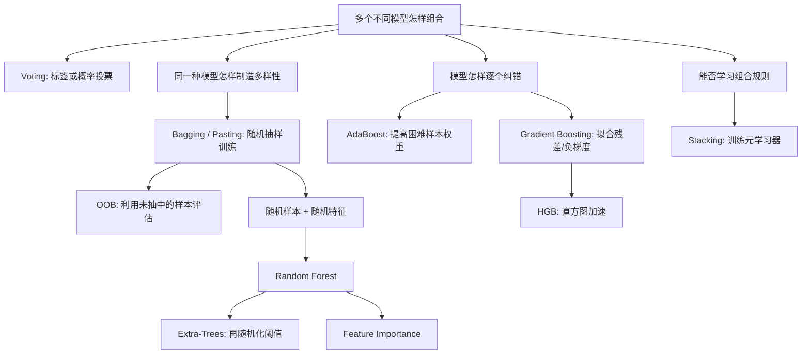

> 书目：*Hands-On Machine Learning with Scikit-Learn and PyTorch*<br>
> 章节：Chapter 6, Ensemble Learning and Random Forests<br>
> 章节文件：6. Ensemble Learning and Random Forests.md<br>
> 配套 Notebook：<https://homl.info/colab-p>

---

## 阅读导引

### 本章要回答什么问题

单个模型往往存在明显弱点：

- 决策树方差高，数据稍变结构就可能完全不同；
- 线性模型偏差高，难以表达复杂边界；
- 不同模型会在不同样本上犯错；
- 即使一个模型已经不错，仍可能存在难以消除的剩余误差。

集成学习的核心问题是：

> 能否把多个不完美模型组合起来，得到一个比任何单个模型更可靠的模型？

答案通常是可以，但必须满足一个关键条件：**成员模型的错误不能完全相同。**

一组预测器称为**集成**（ensemble），组合它们的方法称为**集成学习**（ensemble learning）。

### 全章主线



### 三种组合思想

| 思想 | 训练关系 | 典型方法 | 主要收益 |
| --- | --- | --- | --- |
| 并列投票 | 模型相互独立训练 | Voting | 利用算法多样性 |
| 并行平均 | 同类模型在随机子集训练 | Bagging、Random Forest | 降低方差 |
| 串行纠错 | 后一个模型纠正前一个 | AdaBoost、Gradient Boosting | 降低偏差、逐步拟合困难部分 |
| 学习融合 | 元模型学习怎样组合 | Stacking | 学习非平凡组合规则 |

### 一句话概括

$$
\boxed{
\text{好的集成}=
\text{有一定能力的成员}
+\text{足够多样的错误}
+\text{合理的聚合方式}
}
$$

### 代价与边界

集成通常改善预测，但会增加：

- 训练计算量；
- 推理延迟和内存；
- 部署、版本管理和监控复杂度；
- 解释难度。

因此不能只看离线分数，还要判断提升是否值得工程成本。

---

## 0. 必要基础

### 0.1 偏差与方差

对随机训练集 $D$ 学得的模型 $\hat f_D$：

- **偏差**：平均预测离真实目标有多远；
- **方差**：换一份训练数据，预测会变化多大。

集成最擅长修复高方差模型，尤其是深决策树。

### 0.2 多数票与众数

分类器输出类别 $\hat y_1,\ldots,\hat y_M$，硬投票取众数：

$$
\hat y
=\operatorname{mode}(\hat y_1,\ldots,\hat y_M)
$$

等价地：

$$
\hat y
=\arg\max_k\sum_{j=1}^{M}
\mathbf1[\hat y_j=k]
$$

$\mathbf1[\cdot]$ 是指示函数，条件成立取 1，否则取 0。

### 0.3 概率平均

若第 $j$ 个分类器输出类别 $k$ 的概率 $p_{j,k}$，软投票计算：

$$
\bar p_k=\frac1M\sum_{j=1}^{M}p_{j,k}
$$

再预测：

$$
\hat y=\arg\max_k\bar p_k
$$

还可加入模型权重 $a_j\ge0$：

$$
\bar p_k
=\frac{\sum_ja_jp_{j,k}}{\sum_ja_j}
$$

### 0.4 相关误差的平均方差

设 $M$ 个预测器误差 $e_1,\ldots,e_M$：

$$
\operatorname{Var}(e_j)=\sigma^2
$$

任意两个误差的相关系数均为 $\rho$：

$$
\operatorname{Cov}(e_i,e_j)=\rho\sigma^2,
\qquad i\ne j
$$

平均误差：

$$
\bar e=\frac1M\sum_{j=1}^{M}e_j
$$

方差：

$$
\begin{aligned}
\operatorname{Var}(\bar e)
&=\operatorname{Var}\left(\frac1M\sum_je_j\right)\\
&=\frac1{M^2}
\left[
\sum_j\operatorname{Var}(e_j)
+2\sum_{i<j}\operatorname{Cov}(e_i,e_j)
\right]\\
&=\frac1{M^2}
\left[
M\sigma^2+M(M-1)\rho\sigma^2
\right]\\
&=\boxed{
\sigma^2\left(
\rho+\frac{1-\rho}{M}
\right)}
\end{aligned}
$$

结论：

- $\rho=0$：方差降为 $\sigma^2/M$；
- $\rho=1$：方差仍为 $\sigma^2$，增加模型毫无帮助；
- $M\to\infty$：方差下限为 $\rho\sigma^2$；
- 降低成员相关性与增加成员数量同样重要。

这条公式是理解 Voting、Bagging、Random Forest 和 Extra-Trees 的数学主线。

---

## 1. Voting Classifiers

### 1.1 智慧群体

向很多随机的人提出复杂问题，再聚合答案，群体答案有时比单个专家更准确。模型也类似：不同模型关注数据的不同方面，错误可部分抵消。

集成中的成员若只比随机猜测略好，称为**弱学习器**；组合后达到高准确率的模型称为**强学习器**。

要从弱变强，通常需要：

1. 每个成员至少略优于随机；
2. 成员数量足够多；
3. 错误相关性足够低。

### 1.2 硬币例子与大数定律

假设硬币正面概率为：

$$
p=0.51
$$

抛 $N$ 次，正面数：

$$
X\sim\operatorname{Binomial}(N,0.51)
$$

1000 次抛掷的严格多数要求 $X\ge501$：

$$
P(X\ge501)
=\sum_{k=501}^{1000}
\binom{1000}{k}0.51^k0.49^{1000-k}
\approx0.7261
$$

若把 500:500 平局也算入“非负优势”，则：

$$
P(X\ge500)\approx0.7468
$$

因此常说“接近 75%”。严格多数是约 72.6%，差异来自是否包含平局。

当 $N=10{,}000$：

$$
P(X\ge5001)\approx0.9767
$$

超过 97%。大数定律保证样本正面比例趋近 51%，最终通常高于 50%。

可运行计算：

```python
from scipy.stats import binom

strict_1000 = binom.sf(500, 1000, 0.51)  # P(X > 500)
including_tie = binom.sf(499, 1000, 0.51)  # P(X >= 500)
strict_10000 = binom.sf(5000, 10000, 0.51)

print(strict_1000)   # 约 0.7261
print(including_tie) # 约 0.7468
print(strict_10000)  # 约 0.9767
```

### 1.3 为什么分类器没有硬币那么理想

硬币推导假设各次结果独立。现实中的模型：

- 使用同一训练数据；
- 可能依赖同样的特征；
- 可能有相近归纳偏好；
- 会在同一批困难样本上同时犯错。

相关错误会使实际集成收益低于独立假设。

提高多样性的方式：

- 使用不同算法；
- 改变超参数；
- 使用不同特征子集；
- 使用不同训练样本子集；
- 注入随机性；
- 使用不同数据表示。

### 1.4 Hard Voting

硬投票直接对类别标签计数：

$$
\hat y(\mathbf x)
=\arg\max_k
\sum_{j=1}^{M}
\mathbf1[\hat y_j(\mathbf x)=k]
$$

优势：

- 不要求概率接口；
- 简单稳健；
- 可组合完全不同的分类器。

局限：

- 所有票权重相同；
- 只知道类别，不利用置信度；
- 一个勉强判断和一个极高置信度判断贡献相同。

### 1.5 Moons 投票实验

```python
from sklearn.datasets import make_moons
from sklearn.ensemble import RandomForestClassifier, VotingClassifier
from sklearn.linear_model import LogisticRegression
from sklearn.model_selection import train_test_split
from sklearn.svm import SVC

X, y = make_moons(n_samples=500, noise=0.30, random_state=42)
X_train, X_test, y_train, y_test = train_test_split(
    X, y, random_state=42
)

voting_clf = VotingClassifier(
    estimators=[
        ("lr", LogisticRegression(random_state=42)),
        ("rf", RandomForestClassifier(random_state=42)),
        ("svc", SVC(random_state=42)),
    ]
)
voting_clf.fit(X_train, y_train)
```

`VotingClassifier.fit()` 克隆并训练每个估计器：

- `estimators`：原始未训练对象列表；
- `estimators_`：训练后的克隆列表；
- `named_estimators`：原始对象字典式访问；
- `named_estimators_`：训练后的克隆字典式访问。

单模型测试准确率：

```python
for name, clf in voting_clf.named_estimators_.items():
    print(name, "=", clf.score(X_test, y_test))
```

输出：

```text
lr = 0.864
rf = 0.896
svc = 0.896
```

第一个测试样本：

```python
print(voting_clf.predict(X_test[:1]))
print([clf.predict(X_test[:1]) for clf in voting_clf.estimators_])
```

输出：

```text
[1]
[[1], [1], [0]]
```

两票对一票，集成预测类别 1。

```python
print(voting_clf.score(X_test, y_test))
```

输出：

```text
0.912
```

集成优于三个成员。

### 1.6 Soft Voting

软投票平均概率，再选择最大概率类别：

$$
\hat y
=\arg\max_k\frac1M\sum_{j=1}^{M}p_{j,k}
$$

高置信度预测对结果影响更大，通常优于硬投票。

条件：

- 所有成员提供 `predict_proba()`；
- 概率最好经过校准；
- 类别顺序必须一致，框架会通过 `classes_` 处理。

SVC 默认不计算概率。较老版本可设置 `probability=True`，内部通过额外校准生成概率；Scikit-Learn 1.9 起该参数已弃用，推荐显式使用 `CalibratedClassifierCV`：

```python
from sklearn.calibration import CalibratedClassifierCV

soft_voting_clf = VotingClassifier(
    estimators=[
        ("lr", LogisticRegression(random_state=42)),
        ("rf", RandomForestClassifier(random_state=42)),
        ("svc", CalibratedClassifierCV(
            SVC(random_state=42),
            cv=5,
            ensemble=False,
        )),
    ],
    voting="soft",
)
soft_voting_clf.fit(X_train, y_train)
print(soft_voting_clf.score(X_test, y_test))
```

输出：

```text
0.92
```

未校准概率可能让过度自信的模型支配集成，可用 `CalibratedClassifierCV` 校准。

### 1.7 Hard 与 Soft 对比

| 方面 | Hard Voting | Soft Voting |
| --- | --- | --- |
| 聚合对象 | 类别标签 | 类别概率 |
| 置信度 | 丢失 | 保留 |
| 接口要求 | `predict()` | `predict_proba()` |
| 概率校准影响 | 无 | 很大 |
| 常见表现 | 稳健基线 | 概率可靠时通常更好 |

---

## 2. Bagging 与 Pasting

### 2.1 问题从哪来

Voting 用不同算法制造多样性。另一条路线是：

> 使用同一个高方差算法，但让每个成员看到不同的随机训练子集。

这对决策树特别有效。

### 2.2 定义

#### Bagging

从训练集**有放回**抽样，为每个模型生成训练子集。

有放回意味着：抽出一张牌后放回，同一个样本在同一成员的数据中可出现多次。

Bagging 是 Bootstrap Aggregating 的缩写。

#### Pasting

从训练集**无放回**抽样。同一成员的数据中，每个样本最多出现一次。

#### 共同点与区别

| | Bagging | Pasting |
| --- | --- | --- |
| 同一成员内重复样本 | 可以 | 不可以 |
| 不同成员间重复样本 | 可以 | 可以 |
| 多样性 | 通常更高 | 略低 |
| 单成员有效信息 | 冗余略多 | 无抽样冗余 |
| 常见选择 | 通常默认优先 | 数据较干净时可尝试 |

### 2.3 聚合方式

- 分类：类别众数，或平均类别概率；
- 回归：预测均值。

每个成员只看到部分数据，单模型偏差可能更高；聚合主要降低方差。

### 2.4 两个回归器的偏差例子

模型 1 平均低估 40,000 美元：

$$
b_1=-40{,}000
$$

模型 2 平均高估 50,000 美元：

$$
b_2=50{,}000
$$

平均预测偏差：

$$
b_{\text{avg}}
=\frac{b_1+b_2}{2}
=\frac{-40{,}000+50{,}000}{2}
=5{,}000
$$

偏差下降是因为两个偏差方向相反，并不要求独立。若两者都高估 50,000，平均后仍高估 50,000。

### 2.5 两个独立回归器的方差

若误差标准差均为 10,000：

$$
\sigma=10{,}000,
\qquad \sigma^2=100{,}000{,}000
$$

相互独立：

$$
\operatorname{Var}\left(\frac{e_1+e_2}{2}\right)
=\frac{\sigma^2+\sigma^2}{4}
=50{,}000{,}000
$$

标准差：

$$
\sqrt{50{,}000{,}000}
\approx7{,}071
$$

若相关系数为 $\rho$：

$$
\operatorname{Var}\left(\frac{e_1+e_2}{2}\right)
=\frac{\sigma^2(1+\rho)}{2}
$$

成员越相关，方差收益越小。

### 2.6 什么时候优先 Bagging

Bagging 通过重复抽样增加多样性：

- 对噪声数据或深树等易过拟合模型，通常更有利；
- 比 Pasting 可能多一点偏差，但往往方差更低；
- 如果数据较干净、重复抽样浪费明显，可比较 Pasting；
- 最终应通过交叉验证选择。

### 2.7 并行能力

每个成员独立训练，可分配到：

- 多 CPU 核；
- 多台服务器；
- 独立工作进程。

预测也可并行，因此 Bagging/Pasting 扩展性很好。

---

## 3. Scikit-Learn 中的 Bagging/Pasting

### 3.1 训练 500 棵树

```python
from sklearn.ensemble import BaggingClassifier
from sklearn.tree import DecisionTreeClassifier

bag_clf = BaggingClassifier(
    DecisionTreeClassifier(),
    n_estimators=500,
    max_samples=100,
    n_jobs=-1,
    random_state=42,
)
bag_clf.fit(X_train, y_train)
```

参数：

- `n_estimators=500`：500 个基模型；
- `max_samples=100`：每棵树抽 100 个训练实例；
- 默认 `bootstrap=True`：有放回，属于 Bagging；
- `bootstrap=False`：无放回，变为 Pasting；
- `n_jobs=-1`：使用全部 CPU 核；
- `max_samples` 也可设为 $(0,1]$ 的比例。

### 3.2 为什么自动使用软投票

若基分类器有 `predict_proba()`，`BaggingClassifier` 会平均概率，而不是只统计硬标签。决策树支持概率，因此上例实际使用软投票。

### 3.3 单树与 500 树边界

单棵深树的边界不规则、对样本扰动敏感；500 棵树平均后的边界明显平滑：

- 训练偏差相近；
- 集成方差更低；
- 泛化通常更好。

---

## 4. Out-of-Bag 评估

### 4.1 OOB 是什么

Bagging 对 $m$ 个训练样本进行 $m$ 次有放回抽样。某棵树没有抽到的样本称为该树的 **Out-of-Bag（OOB）样本**。

不同树的 OOB 集不同。

### 4.2 63.2% 的完整推导

固定某个样本。一次抽样不抽到它的概率：

$$
1-\frac1m
$$

独立有放回抽 $m$ 次，始终没抽到：

$$
q_m=\left(1-\frac1m\right)^m
$$

至少出现一次：

$$
P(\text{in-bag})
=1-\left(1-\frac1m\right)^m
$$

当 $m\to\infty$：

$$
\left(1-\frac1m\right)^m\to e^{-1}
$$

所以：

$$
P(\text{in-bag})
\to1-e^{-1}
\approx0.63212
$$

$$
P(\text{OOB})
\to e^{-1}
\approx0.36788
$$

每棵树虽然抽了 $m$ 次，但平均只见到约 63.2% 的**不同样本**。

#### 期望不同样本数的严格证明

令 $I_i$ 表示样本 $i$ 是否至少出现一次：

$$
I_i=
\begin{cases}
1,&\text{至少出现一次}\\
0,&\text{从未出现}
\end{cases}
$$

不同样本数：

$$
U=\sum_{i=1}^{m}I_i
$$

由期望线性性，不要求 $I_i$ 独立：

$$
\begin{aligned}
E[U]
&=\sum_iE[I_i]\\
&=\sum_iP(I_i=1)\\
&=m\left[1-\left(1-\frac1m\right)^m\right]
\end{aligned}
$$

### 4.3 为什么 OOB 可用于评估

对训练样本 $i$：

1. 找出所有未用过样本 $i$ 的树；
2. 只聚合这些树对 $i$ 的预测；
3. 得到样本外预测；
4. 对全部训练样本计算指标。

如果树足够多，每个样本通常都是很多树的 OOB 样本，因此无需额外验证集即可得到泛化估计。

### 4.4 API 与结果

```python
bag_clf = BaggingClassifier(
    DecisionTreeClassifier(),
    n_estimators=500,
    oob_score=True,
    n_jobs=-1,
    random_state=42,
)
bag_clf.fit(X_train, y_train)

print(bag_clf.oob_score_)
```

输出：

```text
0.896
```

测试集：

```python
from sklearn.metrics import accuracy_score

y_pred = bag_clf.predict(X_test)
print(accuracy_score(y_test, y_pred))
```

输出：

```text
0.92
```

OOB 此处略悲观，但这是正常估计波动，不保证与测试结果完全一致。

### 4.5 OOB 概率

```python
print(bag_clf.oob_decision_function_[:3])
```

输出：

```text
[[0.32352941 0.67647059]
 [0.3375     0.6625    ]
 [1.         0.        ]]
```

每行是该训练实例由其 OOB 树聚合得到的类别概率。

### 4.6 OOB 的适用边界

- 只适用于有放回抽样；Pasting 没有标准 OOB；
- 树太少时，有些样本可用 OOB 树过少，估计不稳定；
- 调参反复使用 OOB 也会对 OOB 估计过拟合；
- 时间序列和分组数据不能忽略相依结构；
- 最终仍应保留独立测试集。

---

## 5. Random Patches 与 Random Subspaces

### 5.1 特征抽样参数

- `max_features`：每个基模型获得多少特征；
- `bootstrap_features`：特征是否有放回抽样。

### 5.2 Random Patches

同时随机抽样：

- 训练实例；
- 输入特征。

每个成员看到不同的二维“数据补丁”。适合高维数据，可显著加速训练并降低成员相关性。

### 5.3 Random Subspaces

保留全部训练实例，只抽特征：

```python
BaggingClassifier(
    estimator,
    bootstrap=False,
    max_samples=1.0,
    max_features=0.5,
    bootstrap_features=False,
)
```

每个模型工作在不同特征子空间中。

### 5.4 偏差/方差权衡

特征抽样：

- 单成员信息减少，偏差可能上升；
- 成员错误相关性降低；
- 集成方差下降；
- 高维冗余特征场景常很有效。

---

## 6. Random Forests

### 6.1 定义

随机森林通常是：

1. 对训练样本做 Bagging；
2. 在每个节点只随机考虑一部分特征；
3. 每棵树独立生长；
4. 分类平均概率，回归平均预测。

和普通 Bagging 树相比，关键新增随机性是**每个节点的随机特征子集**。

### 6.2 Scikit-Learn 实现

```python
from sklearn.ensemble import RandomForestClassifier

rnd_clf = RandomForestClassifier(
    n_estimators=500,
    max_leaf_nodes=16,
    n_jobs=-1,
    random_state=42,
)
rnd_clf.fit(X_train, y_train)
y_pred_rf = rnd_clf.predict(X_test)
```

`RandomForestClassifier` 同时拥有：

- 决策树结构参数；
- Bagging 集成参数。

默认分类树每次切分随机考虑约：

$$
\sqrt n
$$

个特征，其中 $n$ 是总特征数。

### 6.3 与 BaggingClassifier 的等价写法

```python
bag_clf = BaggingClassifier(
    DecisionTreeClassifier(
        max_features="sqrt",
        max_leaf_nodes=16,
    ),
    n_estimators=500,
    n_jobs=-1,
    random_state=42,
)
```

关键：`max_features="sqrt"` 必须传给**内部决策树**，表示每个节点重新抽特征。若传给 `BaggingClassifier.max_features`，则每棵树固定使用一个特征子集，不完全等价。

### 6.4 为什么随机特征有效

若存在一个极强特征，普通 Bagging 中几乎所有树都会优先使用它，导致树高度相关。

随机限制候选特征后：

- 某些树必须探索次强特征；
- 树结构更不同；
- 单树偏差略升；
- 相关系数 $\rho$ 下降；
- 根据方差公式，森林方差可能显著下降。

---

## 7. Extra-Trees

### 7.1 比随机森林更随机

随机森林：

1. 随机抽一组候选特征；
2. 为每个候选特征搜索最佳阈值；
3. 选最佳切分。

Extra-Trees：

1. 随机抽候选特征；
2. 为每个特征随机生成阈值；
3. 只在这些随机切分中选最好者。

### 7.2 为什么可能更好

随机阈值进一步降低树之间相关性：

- 偏差更高；
- 方差更低；
- 噪声、高维、过拟合场景可能优于 RF；
- 不保证总是更准确，必须交叉验证。

### 7.3 为什么训练更快

寻找每个特征的最佳阈值是建树的昂贵步骤。Extra-Trees 直接抽随机阈值，省掉大量候选搜索，因此训练通常更快。

预测时仍需遍历相似数量的树和节点，速度与随机森林大致相同。

### 7.4 API

```python
from sklearn.ensemble import ExtraTreesClassifier, ExtraTreesRegressor
```

API 与 Random Forest 基本相同，但 Extra-Trees 默认：

```text
bootstrap=False
```

可按需要开启 bootstrap。较新版本还支持缺失值，具体行为应以当前版本文档为准。

---

## 8. 特征重要性

### 8.1 MDI 的直觉

若一个特征经常出现在靠近根部的节点，并且每次都大幅降低不纯度，它通常更重要。

Scikit-Learn 默认树重要性称为 MDI：Mean Decrease in Impurity。

### 8.2 单个节点的不纯度减少

对树 $t$ 中节点 $v$：

- 使用特征 $j$ 切分；
- 加权样本数 $W_v$；
- 不纯度 $I_v$；
- 左右子节点 $v_L,v_R$。

贡献：

$$
\Delta_{t,v}
=W_vI_v
-W_{v_L}I_{v_L}
-W_{v_R}I_{v_R}
$$

这相当于节点样本权重乘不纯度下降。

### 8.3 树和森林中的聚合

特征 $j$ 在一棵树中的未归一化重要性：

$$
I_{t,j}
=\sum_{v:f(v)=j}\Delta_{t,v}
$$

对特征归一化，使一棵树重要性总和为 1；再对森林中所有树取平均，并最终归一化：

$$
\sum_{j=1}^{n}I_j=1
$$

实现使用 `weighted_n_node_samples`，有样本权重或 bootstrap 重复时，不一定等于简单样本个数。

### 8.4 Iris 结果

```python
from sklearn.datasets import load_iris

iris = load_iris(as_frame=True)
rnd_clf = RandomForestClassifier(n_estimators=500, random_state=42)
rnd_clf.fit(iris.data, iris.target)

for score, name in zip(rnd_clf.feature_importances_, iris.data.columns):
    print(round(score, 2), name)
```

输出：

```text
0.11 sepal length (cm)
0.02 sepal width (cm)
0.44 petal length (cm)
0.42 petal width (cm)
```

四舍五入后和为 0.99，原始精度下和为 1。

### 8.5 MNIST 像素重要性

把 784 个像素重要性恢复成 28×28 热力图，可看到模型主要关注数字经常出现的中央区域，边缘背景重要性低。

### 8.6 MDI 的局限

MDI 不是因果效应，也不保证代表验证集上的预测贡献：

- 偏爱连续值或高基数特征；
- 相关特征会分摊重要性，或随机选择其中一个；
- 只给强度，不给影响方向；
- 基于训练时不纯度，可能放大过拟合特征；
- 不同编码方式会改变结果。

可以使用验证集上的 permutation importance 作为另一种视角：随机打乱某特征，观察性能下降。

```python
from sklearn.inspection import permutation_importance

result = permutation_importance(
    rnd_clf,
    iris.data,
    iris.target,
    n_repeats=20,
    random_state=42,
)
```

相关特征下 permutation importance 也会互相替代，仍需谨慎解释。

---

## 9. Boosting

### 9.1 核心思想

Boosting 把多个弱学习器按顺序训练，每个新成员尝试修复当前集成的错误。

与 Bagging 的关键差异：

| | Bagging | Boosting |
| --- | --- | --- |
| 训练关系 | 并行、相互独立 | 串行、后者依赖前者 |
| 多样性来源 | 随机数据/特征 | 针对前序错误 |
| 主要作用 | 降方差 | 逐步降偏差，也可控方差 |
| 并行能力 | 强 | 轮次间弱 |
| 噪声敏感 | 相对稳健 | 可能追逐困难噪声 |

最常见方法：

- AdaBoost：提高错分样本权重；
- Gradient Boosting：拟合当前损失的负梯度，平方损失下就是残差。

---

## 10. AdaBoost

### 10.1 问题从哪来

第一个弱分类器错了一些训练样本。怎样让第二个分类器把注意力放到这些困难样本上？

AdaBoost 的做法：

1. 初始每个样本权重相同；
2. 训练弱分类器；
3. 计算它的加权错误率；
4. 错误率越低，分类器投票权越大；
5. 提高错分样本权重；
6. 训练下一个分类器；
7. 最终加权投票。

### 10.2 符号

| 符号 | 含义 |
| --- | --- |
| $m$ | 训练样本数 |
| $N$ | 弱学习器数量 |
| $K$ | 类别数量 |
| $w_j^{(i)}$ | 第 $j$ 轮训练前，样本 $i$ 的权重 |
| $\hat y_j^{(i)}$ | 第 $j$ 个分类器对样本 $i$ 的预测 |
| $r_j$ | 第 $j$ 个分类器的加权错误率 |
| $\alpha_j$ | 第 $j$ 个分类器的投票权重 |
| $\eta$ | 学习率 |

初始权重：

$$
w_1^{(i)}=\frac1m
$$

因此：

$$
\sum_{i=1}^{m}w_1^{(i)}=1
$$

### 10.3 公式 6-1：加权错误率

权重已归一化时：

$$
r_j
=\sum_{\substack{i=1\\
\hat y_j^{(i)}\ne y^{(i)}}}^{m}
w_j^{(i)}
$$

更一般地，若权重未归一化：

$$
r_j
=\frac{
\sum_{i=1}^{m}w_j^{(i)}
\mathbf1[\hat y_j^{(i)}\ne y^{(i)}]
}{
\sum_{i=1}^{m}w_j^{(i)}
}
$$

含义：错分样本的总权重，占全部权重的比例。

普通错误率把每个样本看得一样；加权错误率使当前困难样本更重要。

### 10.4 公式 6-2：弱学习器权重

$$
\alpha_j
=\eta\log\frac{1-r_j}{r_j}
$$

边界分析：

| $r_j$ | $\alpha_j$ | 含义 |
| ---: | ---: | --- |
| $r_j\to0$ | $+\infty$ | 几乎完美，权重极大 |
| $r_j=0.5$ | $0$ | 二分类随机猜测，无贡献 |
| $r_j>0.5$ | 负 | 比随机更差，可反转预测或停止 |
| $r_j\to1$ | $-\infty$ | 几乎全错 |

学习率 $\eta$ 缩放每轮影响：

- 大：纠错激进、拟合快、可能过拟合；
- 小：每轮改动小、需要更多成员、通常更稳健。

### 10.5 分类器权重的推导

二分类标签与预测编码为 $y,h\in\{-1,+1\}$。经典指数损失更新希望选择一个新成员系数 $\beta$：

$$
L(\beta)
=\sum_{i=1}^{m}
w_i\exp(-\beta y_ih_i)
$$

正确分类时 $y_ih_i=+1$，错误时为 $-1$。设加权错误率为 $r$，权重已归一化：

$$
L(\beta)
=(1-r)e^{-\beta}+re^{\beta}
$$

求导：

$$
\frac{dL}{d\beta}
=-(1-r)e^{-\beta}+re^{\beta}
$$

令导数为 0：

$$
re^{\beta}=(1-r)e^{-\beta}
$$

$$
e^{2\beta}=\frac{1-r}{r}
$$

$$
\beta=\frac12\log\frac{1-r}{r}
$$

经典对称更新：

- 正确样本乘 $e^{-\beta}$；
- 错误样本乘 $e^{\beta}$。

归一化会消除所有权重共同乘的常数。把两类权重都除以 $e^{-\beta}$，等价为：

- 正确样本不变；
- 错误样本乘 $e^{2\beta}$。

令：

$$
\alpha=2\beta
=\log\frac{1-r}{r}
$$

就得到公式 6-2 与下一节的“只放大错误样本”写法。加入学习率即乘 $\eta$。

### 10.6 公式 6-3：样本权重更新

未归一化更新：

$$
\widetilde w_{j+1}^{(i)}
=w_j^{(i)}
\exp\left(
\alpha_j
\mathbf1[\hat y_j^{(i)}\ne y^{(i)}]
\right)
$$

即：

$$
\widetilde w_{j+1}^{(i)}=
\begin{cases}
w_j^{(i)},&\hat y_j^{(i)}=y^{(i)}\\
w_j^{(i)}e^{\alpha_j},&\hat y_j^{(i)}\ne y^{(i)}
\end{cases}
$$

再归一化：

$$
w_{j+1}^{(i)}
=\frac{\widetilde w_{j+1}^{(i)}}
{\sum_{\ell=1}^{m}\widetilde w_{j+1}^{(\ell)}}
$$

### 10.7 数值演算

假设：

$$
r=0.2,
\qquad \eta=0.5
$$

弱学习器权重：

$$
\alpha
=0.5\log\frac{0.8}{0.2}
=0.5\log4
\approx0.693147
$$

错误样本权重倍率：

$$
e^\alpha=e^{\log2}=2
$$

原来错分样本总权重为 0.2，正确样本为 0.8。更新后未归一化：

$$
W_{\text{wrong}}=0.2\times2=0.4
$$

$$
W_{\text{correct}}=0.8
$$

归一化常数：

$$
Z=0.4+0.8=1.2
$$

新一轮错误样本总权重：

$$
\frac{0.4}{1.2}=\frac13
$$

从 20% 提升到 33.3%，下一位学习器会更重视它们。

### 10.8 公式 6-4：加权投票

$$
\hat y(\mathbf x)
=\arg\max_k
\sum_{\substack{j=1\\
\hat y_j(\mathbf x)=k}}^{N}
\alpha_j
$$

每个弱学习器给预测类别增加 $\alpha_j$ 票，取总权重最大的类别。

例子：

| 学习器 | 预测 | 权重 |
| --- | --- | ---: |
| 1 | A | 1.2 |
| 2 | B | 0.7 |
| 3 | A | 0.4 |

$$
\operatorname{score}(A)=1.2+0.4=1.6
$$

$$
\operatorname{score}(B)=0.7
$$

预测 A。平票时具体行为取决于类别编码和实现的 `argmax` 规则。

### 10.9 SAMME 多分类

多分类有 $K$ 类，随机猜测错误率不是 0.5，而是：

$$
1-\frac1K
$$

SAMME 的学习器权重：

$$
\alpha_j
=\eta\left[
\log\frac{1-r_j}{r_j}
+\log(K-1)
\right]
$$

当：

$$
r_j=1-\frac1K
$$

可验证 $\alpha_j=0$。因此弱学习器必须优于多分类随机猜测：

$$
r_j<1-\frac1K
$$

$K=2$ 时 $\log(K-1)=\log1=0$，退化为公式 6-2。

较新 Scikit-Learn 在弱学习器达到随机错误边界时通常丢弃并停止，而不会保留负权重成员。

### 10.10 Scikit-Learn 实现

决策树桩（decision stump）是 `max_depth=1` 的树，只有一个分裂节点和两个叶节点。

```python
from sklearn.ensemble import AdaBoostClassifier
from sklearn.tree import DecisionTreeClassifier

ada_clf = AdaBoostClassifier(
    DecisionTreeClassifier(max_depth=1),
    n_estimators=30,
    learning_rate=0.5,
    random_state=42,
)
ada_clf.fit(X_train, y_train)
```

版本说明：旧版本示例常显式传 `algorithm="SAMME"`；该参数随后被弃用，并在 Scikit-Learn 1.9 中删除，当前实现直接使用 SAMME。

### 10.11 局限与调参

AdaBoost 串行训练，轮次间不能并行。

如果过拟合：

- 减少 `n_estimators`；
- 降低 `learning_rate`；
- 更强正则化基学习器；
- 检查标签噪声和异常值。

如果欠拟合：

- 增加 `n_estimators`；
- 适当提高 `learning_rate`；
- 增强基学习器能力；
- 减弱基学习器正则化。

噪声标签会被持续提高权重，AdaBoost 可能反复追逐无法正确分类的样本。

---

## 11. Gradient Boosting

### 11.1 从“改样本权重”到“拟合残差”

Gradient Boosting 也逐个添加预测器，但不修改样本权重。它让新预测器拟合当前集成在损失函数上的**负梯度**。

平方损失下，负梯度恰好是残差，所以常说“后一棵树拟合前一轮残差”。

### 11.2 加法模型

集成预测逐轮更新：

$$
F_M(\mathbf x)
=F_0(\mathbf x)
+\sum_{m=1}^{M}\eta h_m(\mathbf x)
$$

- $F_0$：初始常数预测；
- $h_m$：第 $m$ 个弱学习器；
- $\eta$：学习率/收缩率；
- $M$：树数量。

### 11.3 为什么平方损失的负梯度是残差

单样本平方损失取：

$$
L(y,F)=\frac12(y-F)^2
$$

对当前预测 $F$ 求导：

$$
\frac{\partial L}{\partial F}
=\frac12\cdot2(y-F)(-1)
=F-y
$$

负梯度：

$$
-\frac{\partial L}{\partial F}
=y-F
$$

正是残差。因此在函数空间里沿负梯度下降，就是训练新树拟合：

$$
r_i^{(m)}
=y_i-F_{m-1}(\mathbf x_i)
$$

### 11.4 一般损失的伪残差

对任意可微损失：

$$
r_i^{(m)}
=-
\left.
\frac{\partial L(y_i,F(\mathbf x_i))}
{\partial F(\mathbf x_i)}
\right|_{F=F_{m-1}}
$$

训练 $h_m$ 拟合 $r_i^{(m)}$，再更新：

$$
F_m=F_{m-1}+\eta h_m
$$

这就是“Gradient” Boosting 的含义：在函数空间而非有限维参数空间中做梯度下降。

### 11.5 手写三棵回归树

```python
import numpy as np
from sklearn.tree import DecisionTreeRegressor

m = 100
rng = np.random.default_rng(seed=42)
X = rng.random((m, 1)) - 0.5
noise = 0.05 * rng.standard_normal(m)
y = 3 * X[:, 0] ** 2 + noise

tree_reg1 = DecisionTreeRegressor(max_depth=2, random_state=42)
tree_reg1.fit(X, y)

y2 = y - tree_reg1.predict(X)
tree_reg2 = DecisionTreeRegressor(max_depth=2, random_state=43)
tree_reg2.fit(X, y2)

y3 = y2 - tree_reg2.predict(X)
tree_reg3 = DecisionTreeRegressor(max_depth=2, random_state=44)
tree_reg3.fit(X, y3)
```

关系：

$$
y_2=y-h_1(X)
$$

$$
y_3=y_2-h_2(X)
=y-h_1(X)-h_2(X)
$$

预测是三棵树之和：

```python
X_new = np.array([[-0.4], [0.0], [0.5]])
y_pred = sum(
    tree.predict(X_new)
    for tree in (tree_reg1, tree_reg2, tree_reg3)
)
print(y_pred)
```

输出：

```text
[0.57356534 0.0405142  0.66914249]
```

### 11.6 GradientBoostingRegressor

```python
from sklearn.ensemble import GradientBoostingRegressor

gbrt = GradientBoostingRegressor(
    max_depth=2,
    n_estimators=3,
    learning_rate=1.0,
    random_state=42,
)
gbrt.fit(X, y)
```

这和手写的三棵残差树对应。

### 11.7 Shrinkage

学习率缩放每棵树贡献：

$$
F_m=F_{m-1}+\eta h_m
$$

小学习率：

- 每步更谨慎；
- 需要更多树；
- 训练更慢；
- 通常泛化更好；
- 太小且树不够会欠拟合。

大树数与小学习率常配合使用。

### 11.8 Early Stopping

```python
gbrt_best = GradientBoostingRegressor(
    max_depth=2,
    learning_rate=0.05,
    n_estimators=500,
    n_iter_no_change=10,
    random_state=42,
)
gbrt_best.fit(X, y)

print(gbrt_best.n_estimators_)
```

输出：

```text
53
```

虽然最大 500 棵，验证性能连续 10 轮无改善后停止，实际只训练 53 棵。

相关参数：

- `validation_fraction=0.1`：默认留 10% 验证；
- `n_iter_no_change=10`：耐心轮数；
- `tol=1e-4`：小于该幅度的改善视为无明显进步。

耐心太小会过早停止、欠拟合；太大可能继续过拟合。

### 11.9 Stochastic Gradient Boosting

设置：

```python
GradientBoostingRegressor(subsample=0.25)
```

每棵树只用随机 25% 训练实例（无放回）：

- 训练更快；
- 树之间更不同；
- 偏差略升；
- 方差下降；
- 类似 Bagging 与 Boosting 的结合。

---

## 12. Histogram-Based Gradient Boosting

### 12.1 为什么需要 HGB

普通树要排序连续特征并检查大量阈值，大数据上昂贵。

HGB 先把连续特征值分桶成整数：

$$
x_j\longmapsto b_j\in\{0,1,\ldots,B-1\}
$$

`max_bins` 默认且最多为 255（非缺失桶），另可处理缺失桶。

### 12.2 为什么更快

分桶后：

- 每个特征候选阈值最多约 255 个；
- 整数数据结构更紧凑；
- 训练节点时构建直方图，无需反复排序；
- 复杂度可概括为约 $O(bm)$，而普通实现约 $O(nm\log m)$。

- $b$：桶数；
- $m$：样本数；
- $n$：特征数。

实际实现复杂度还依赖特征数、节点数和直方图复用，但增长远优于反复排序。

### 12.3 分桶的统计效果

分桶丢失精度：

- 可能作为正则化，降低过拟合；
- 也可能抹去细小但有用的差异，导致欠拟合；
- 桶数需要在速度、内存与精度之间权衡。

### 12.4 与普通 GBRT 的差异

| 方面 | GBRT | HGB |
| --- | --- | --- |
| 树数量参数 | `n_estimators` | `max_iter` |
| 连续值 | 原始值 | 先分桶 |
| Early stopping | 手动设置 | `"auto"`，大数据自动开启 |
| `subsample` | 支持 | 不支持 |
| 缺失值 | 通常需处理 | 原生支持 |
| 类别特征 | 通常编码 | 原生类别支持/索引标记 |
| 速度 | 中小数据可用 | 大数据显著更快 |

`early_stopping="auto"` 在样本数大于 10,000 时自动启用，也可显式设为 `True`/`False`。

主要树结构参数：

- `max_leaf_nodes`；
- `min_samples_leaf`；
- `max_depth`；
- `max_features`（较新版本）。

### 12.5 California Housing Pipeline

```python
from sklearn.compose import make_column_transformer
from sklearn.ensemble import HistGradientBoostingRegressor
from sklearn.pipeline import make_pipeline
from sklearn.preprocessing import OrdinalEncoder

hgb_reg = make_pipeline(
    make_column_transformer(
        (OrdinalEncoder(), ["ocean_proximity"]),
        remainder="passthrough",
        force_int_remainder_cols=False,
    ),
    HistGradientBoostingRegressor(
        categorical_features=[0],
        random_state=42,
    ),
)
hgb_reg.fit(housing, housing_labels)
```

优点：

- 不需要插补器；
- 不需要缩放；
- 不需要 one-hot；
- 缺失值和类别特征可直接交给 HGB。

类别特征基数必须不超过 `max_bins`。较新版本可通过 DataFrame 类别 dtype 自动识别，具体接口依赖版本。

未调参的 10 折训练集交叉验证 RMSE 均值约：

$$
47{,}613
$$

这是交叉验证结果，不是最终保留测试集分数。

### 12.6 其他优化实现

- XGBoost；
- LightGBM；
- CatBoost；
- Yggdrasil Decision Forests。

它们提供 GPU 加速、分布式训练、类别特征支持和更多工程优化，是表格数据的重要工具。

---

## 13. Stacking

### 13.1 为什么不只用平均或投票

硬投票和软投票是人为固定的聚合规则。不同成员可能在不同区域更可靠：

- 线性模型在简单边界区域稳定；
- 树模型擅长非线性交互；
- SVM 可能在边界附近更强；
- 某个成员可能系统性高估或低估。

Stacking 的思路：**训练一个模型来学习怎样组合成员预测。**

最终聚合器称为：

- blender；
- meta learner；
- final estimator。

### 13.2 推理结构

三个基回归器对新样本预测：

$$
(3.1,2.7,2.9)
$$

元学习器把它们当作三个输入特征：

$$
\hat y
=g(3.1,2.7,2.9)
=3.0
$$

一般形式：

$$
\hat y(\mathbf x)
=g\left(
h_1(\mathbf x),
h_2(\mathbf x),
\ldots,
h_M(\mathbf x)
\right)
$$

### 13.3 为什么不能用训练内预测训练 Blender

错误做法：

1. 基模型在完整训练集上拟合；
2. 再预测同一个训练集；
3. 用这些训练内预测训练 blender。

基模型对训练集往往过于乐观，blender 会学习到部署时不存在的“完美程度”，造成严重泄漏。

正确做法是 OOF（out-of-fold）预测。

### 13.4 OOF 元特征生成

对每个基模型 $h_j$：

1. 将训练集分成 $K$ 折；
2. 每轮用 $K-1$ 折训练；
3. 对剩余折预测；
4. 拼接所有折预测；
5. 每个样本的元特征都来自**没有见过该样本**的模型。

得到元训练矩阵：

$$
\mathbf Z=
\begin{pmatrix}
h_1^{-1}(\mathbf x^{(1)})&\cdots&h_M^{-1}(\mathbf x^{(1)})\\
h_1^{-2}(\mathbf x^{(2)})&\cdots&h_M^{-2}(\mathbf x^{(2)})\\
\vdots&\ddots&\vdots\\
h_1^{-m}(\mathbf x^{(m)})&\cdots&h_M^{-m}(\mathbf x^{(m)})
\end{pmatrix}
$$

上标 $-i$ 表示生成该预测的模型没有使用样本 $i$ 训练。

若每个成员只输出一个值，$\mathbf Z$ 有 $M$ 列；多类概率会产生更多列。

blender 训练：

$$
g:\mathbf Z\mapsto\mathbf y
$$

最后，所有基模型再在完整训练集上重训。推理时它们预测新样本，再交给 blender。

### 13.5 二分类概率的共线性

二分类概率两列满足：

$$
p_0+p_1=1
$$

两列完全共线，只保留一列即可。`StackingClassifier` 通常删除第一列二分类概率，避免冗余。

### 13.6 Scikit-Learn 实现

```python
from sklearn.calibration import CalibratedClassifierCV
from sklearn.ensemble import StackingClassifier

stacking_clf = StackingClassifier(
    estimators=[
        ("lr", LogisticRegression(random_state=42)),
        ("rf", RandomForestClassifier(random_state=42)),
        ("svc", CalibratedClassifierCV(
            SVC(random_state=42),
            cv=5,
            ensemble=False,
        )),
    ],
    final_estimator=RandomForestClassifier(random_state=43),
    cv=5,
)
stacking_clf.fit(X_train, y_train)
print(stacking_clf.score(X_test, y_test))
```

输出：

```text
0.928
```

高于软投票的 0.920，但增加了一个模型和多轮交叉验证，提升是否值得取决于业务。

### 13.7 `stack_method="auto"`

对每个基模型，依次尝试：

1. `predict_proba()`；
2. `decision_function()`；
3. `predict()`。

默认最终模型：

- `StackingClassifier`：`LogisticRegression`；
- `StackingRegressor`：`RidgeCV`。

### 13.8 多层 Stacking

可以训练多个 blender 形成第二层，再训练最终 blender：

```text
原始特征
→ 第一层多个基模型
→ 第二层多个 blender
→ 最终 blender
```

可能再提高一点性能，但训练量、推理延迟和维护成本快速增加。

### 13.9 并行性与边界

- 同一层的基模型可并行；
- 不同层必须串行；
- OOF 训练会让每个基模型重复训练 $K$ 次；
- 还要在全训练集再训练一次；
- 模型数量和资源消耗远高于 Voting。

若成员不多样，blender 也无法创造新信息。

---

## 14. 方法选择总结

| 方法 | 何时使用 | 主要优势 | 主要代价 |
| --- | --- | --- | --- |
| Hard Voting | 多个强且多样的分类器，无统一概率 | 简单稳健 | 不利用置信度 |
| Soft Voting | 成员概率可靠 | 利用置信度 | 依赖概率校准 |
| Bagging | 高方差、易过拟合模型 | 并行、显著降方差 | 资源增加 |
| Pasting | 希望避免单成员样本重复 | 略高数据利用效率 | 多样性可能较低 |
| Random Forest | 异质表格、高维和噪声特征 | 强基线、少预处理 | 解释弱于单树 |
| Extra-Trees | 速度重要、需更强正则化 | 训练快、方差低 | 偏差可能更高 |
| AdaBoost | 中小型、噪声较少、弱学习器 | 聚焦困难样本 | 串行、噪声敏感 |
| Gradient Boosting | 表格数据追求高精度 | 表达力强 | 调参和训练成本较高 |
| HGB | 大型表格、缺失值、类别特征 | 快、预处理少 | 分桶损失精度 |
| Stacking | 已有多个互补模型，追求最后增益 | 学习组合规则 | 训练/部署最复杂 |

对大多数异质表格任务，Random Forest、Extra-Trees、GBRT/HGB 常是优先尝试的强基线。

---

## 15. 章末练习与参考答案

### 练习 1：五个 95% precision 模型能否组合得更好

可以，前提是错误不完全相同。

可采用：

- Hard Voting；
- 概率校准后 Soft Voting；
- Stacking；
- 在验证集上学习模型权重。

若五个模型预测几乎完全相同，组合不会改善。应通过不同算法、超参数、样本和特征提高多样性。

注意 precision 只是单一指标，组合时还应检查 recall、阈值和业务成本。

### 练习 2：Hard 与 Soft Voting 的区别

Hard Voting：统计类别标签票数。

$$
\hat y=\arg\max_k\sum_j\mathbf1[\hat y_j=k]
$$

Soft Voting：平均类别概率。

$$
\hat y=\arg\max_k\sum_jp_{j,k}
$$

Soft 利用置信度，要求概率接口且最好校准。

### 练习 3：哪些方法可分布式并行

| 方法 | 并行性 |
| --- | --- |
| Bagging | 成员完全独立，可跨服务器并行 |
| Pasting | 同上 |
| Random Forest / Extra-Trees | 树可并行 |
| Boosting | 轮次依赖前一轮，难以跨轮并行；单棵树内部可有限并行 |
| Stacking | 同一层可并行；生成 OOF 后才能训练下一层 |

### 练习 4：OOB 的好处

- 不额外划验证集；
- 每个样本由未见过它的树预测；
- 可估计泛化性能；
- 可用于概率、错误分析和调参初筛；
- 训练数据可全部用于各树的 bootstrap 过程。

局限是估计有噪声，调参会对 OOB 过拟合，最终仍需独立测试集。

### 练习 5：Extra-Trees 为什么更随机、更快

它不仅随机选择候选特征，还随机选择阈值。额外随机性：

- 提高偏差；
- 降低成员相关性和方差；
- 对噪声/高维数据可能更好；
- 省去最佳阈值搜索，训练更快；
- 预测速度与 RF 类似。

### 练习 6：AdaBoost 欠拟合怎样调整

- 增加 `n_estimators`；
- 适当增大 `learning_rate`；
- 提高基学习器容量，如增加 stump 深度；
- 减弱基学习器正则化。

每次只改变少数参数，并用交叉验证观察是否转为过拟合。

### 练习 7：Gradient Boosting 过拟合怎么办

降低 `learning_rate`，并通常配合：

- Early Stopping；
- 减少实际树数；
- 降低树深度；
- 增大 `min_samples_leaf`；
- 设置 `subsample<1` 使用随机梯度提升。

只降低学习率但保留极多树，最终仍可能过拟合。

### 练习 8：MNIST Voting Ensemble

#### 数据划分

- 前 50,000：训练；
- 接着 10,000：验证；
- 最后 10,000：测试。

本工作区已有 MNIST 缓存，可离线加载：

```python
from pathlib import Path
import numpy as np

mnist_path = Path("code/datasets/mnist/mnist.npz")
if not mnist_path.exists():
    # 从工作区根目录运行时使用这个路径
    mnist_path = Path(
        "tech-books/hands-on-machine-learning/code/datasets/mnist/mnist.npz"
    )
with np.load(mnist_path) as data:
    X = np.concatenate([data["x_train"], data["x_test"]]).reshape(-1, 784)
    y = np.concatenate([data["y_train"], data["y_test"]])

X_train, y_train = X[:50_000], y[:50_000]
X_valid, y_valid = X[50_000:60_000], y[50_000:60_000]
X_test, y_test = X[60_000:], y[60_000:]
```

#### 训练成员

```python
from sklearn.ensemble import ExtraTreesClassifier, RandomForestClassifier
from sklearn.metrics import accuracy_score
from sklearn.neural_network import MLPClassifier
from sklearn.svm import LinearSVC

estimators = [
    ("rf", RandomForestClassifier(n_estimators=100, random_state=42)),
    ("extra", ExtraTreesClassifier(n_estimators=100, random_state=42)),
    ("svm", LinearSVC(max_iter=100, tol=20, dual=True, random_state=42)),
    ("mlp", MLPClassifier(random_state=42)),
]

for name, estimator in estimators:
    estimator.fit(X_train, y_train)
    score = accuracy_score(y_valid, estimator.predict(X_valid))
    print(name, score)
```

参考验证准确率：

```text
rf    0.9736
extra 0.9743
svm   0.8662
mlp   0.9613
```

SVM 明显较弱，可能拖累投票。

#### Hard Voting

```python
from sklearn.ensemble import VotingClassifier

voting_all = VotingClassifier(estimators=estimators, voting="hard")
voting_all.fit(X_train, y_train)
print(voting_all.score(X_valid, y_valid))  # 参考 0.9750

estimators_without_svm = [item for item in estimators if item[0] != "svm"]
voting_best = VotingClassifier(
    estimators=estimators_without_svm,
    voting="hard",
)
voting_best.fit(X_train, y_train)
print(voting_best.score(X_valid, y_valid))  # 参考 0.9761
```

删除弱且错误模式不利的成员后，集成反而更好。集成不是“模型越多越好”。

参考测试结果：

```text
Voting:      0.9733
RandomForest 0.9680
ExtraTrees:  0.9703
MLP:         0.9618
```

相对最佳成员 Extra-Trees 提升 0.30 个百分点；错误率从 2.97% 降到 2.67%，相对少约：

$$
\frac{2.97-2.67}{2.97}\approx10.1\%
$$

百分点提升很小，但相对错误减少并不小。

Soft Voting 只适用于有概率的成员，参考验证分数约 0.9703，低于 Hard Voting，说明概率质量和成员组合很重要。

### 练习 9：手写 Blender 与 StackingClassifier

#### 简单 Blender

先用练习 8 已训练成员对验证集生成硬标签：

```python
valid_meta = np.column_stack([
    estimator.predict(X_valid)
    for _, estimator in estimators
])

print(valid_meta.shape)  # (10000, 4)
```

训练 blender：

```python
blender = RandomForestClassifier(
    n_estimators=200,
    oob_score=True,
    random_state=42,
)
blender.fit(valid_meta, y_valid)
print(blender.oob_score_)  # 参考 0.9738
```

测试：

```python
test_meta = np.column_stack([
    estimator.predict(X_test)
    for _, estimator in estimators
])

stacked_predictions = blender.predict(test_meta)
print(accuracy_score(y_test, stacked_predictions))  # 参考 0.9688
```

这个简单 stacking 低于 Voting，原因可能包括：

- 只用硬标签，信息少；
- 10,000 验证样本单独用于 blender，基模型少用了数据；
- blender 也可能过拟合有限元特征。

#### StackingClassifier

合并前 60,000 个样本，用 OOF 元特征：

```python
from sklearn.ensemble import StackingClassifier

X_train_full = X[:60_000]
y_train_full = y[:60_000]

stacking = StackingClassifier(
    estimators=estimators,
    final_estimator=RandomForestClassifier(
        n_estimators=200,
        random_state=42,
    ),
    cv=5,
    n_jobs=-1,
)
stacking.fit(X_train_full, y_train_full)
print(stacking.score(X_test, y_test))  # 参考 0.9795
```

参考结果 0.9795，高于 Voting 的 0.9733。原因：

- 基模型使用全部 60,000 训练样本；
- OOF 防止元特征泄漏；
- 自动优先使用概率或 decision score，信息多于硬标签；
- blender 学习非线性组合规则。

代价：5 折会训练大量模型。四个成员时，大约需要 20 个折内模型、4 个全量成员和 1 个 blender，共 25 个模型，训练明显更慢。

---

## 16. 完整可运行的主线示例

```python
from sklearn.datasets import load_iris, make_moons
from sklearn.calibration import CalibratedClassifierCV
from sklearn.ensemble import (
    BaggingClassifier,
    ExtraTreesClassifier,
    GradientBoostingRegressor,
    RandomForestClassifier,
    StackingClassifier,
    VotingClassifier,
)
from sklearn.linear_model import LogisticRegression
from sklearn.model_selection import train_test_split
from sklearn.svm import SVC
from sklearn.tree import DecisionTreeClassifier


X, y = make_moons(n_samples=500, noise=0.30, random_state=42)
X_train, X_test, y_train, y_test = train_test_split(X, y, random_state=42)

members = [
    ("lr", LogisticRegression(random_state=42)),
    ("rf", RandomForestClassifier(random_state=42)),
    ("svc", CalibratedClassifierCV(
        SVC(random_state=42),
        cv=5,
        ensemble=False,
    )),
]

hard = VotingClassifier(members, voting="hard").fit(X_train, y_train)
soft = VotingClassifier(members, voting="soft").fit(X_train, y_train)
print("Hard / Soft:", hard.score(X_test, y_test), soft.score(X_test, y_test))


bag = BaggingClassifier(
    DecisionTreeClassifier(),
    n_estimators=500,
    oob_score=True,
    n_jobs=-1,
    random_state=42,
).fit(X_train, y_train)
print("OOB / Test:", bag.oob_score_, bag.score(X_test, y_test))


rf = RandomForestClassifier(
    n_estimators=500,
    max_leaf_nodes=16,
    n_jobs=-1,
    random_state=42,
).fit(X_train, y_train)

extra = ExtraTreesClassifier(
    n_estimators=500,
    max_leaf_nodes=16,
    n_jobs=-1,
    random_state=42,
).fit(X_train, y_train)

print("RF / Extra:", rf.score(X_test, y_test), extra.score(X_test, y_test))


stack = StackingClassifier(
    estimators=members,
    final_estimator=RandomForestClassifier(random_state=43),
    cv=5,
).fit(X_train, y_train)
print("Stacking:", stack.score(X_test, y_test))


iris = load_iris(as_frame=True)
iris_forest = RandomForestClassifier(n_estimators=500, random_state=42)
iris_forest.fit(iris.data, iris.target)
for name, importance in zip(iris.data.columns, iris_forest.feature_importances_):
    print(f"{name}: {importance:.3f}")
```

不同 Scikit-Learn 版本可能产生末位差异。

---

## 17. 公式速查

| 公式 | 含义 |
| --- | --- |
| $\operatorname{Var}(\bar e)=\sigma^2[\rho+(1-\rho)/M]$ | 多成员平均的方差 |
| $P(\mathrm{OOB})=(1-1/m)^m\to e^{-1}$ | OOB 比例 |
| 6-1 | AdaBoost 加权错误率 |
| 6-2 | AdaBoost 弱学习器权重 |
| 6-3 | AdaBoost 样本权重更新 |
| 6-4 | AdaBoost 加权投票 |
| $r_i^{(m)}=-\partial L/\partial F$ | Gradient Boosting 伪残差 |
| $F_m=F_{m-1}+\eta h_m$ | Boosting 加法更新 |

## 18. API 速查

| API/参数 | 用途 | 关键点 |
| --- | --- | --- |
| `VotingClassifier` | Hard/Soft Voting | 拟合的是成员克隆 |
| `BaggingClassifier` | Bagging/Pasting | `bootstrap` 控制有无放回 |
| `oob_score_` | OOB 评估 | 需 `oob_score=True` |
| `oob_decision_function_` | OOB 概率 | 每样本仅由 OOB 成员预测 |
| `max_samples` | 成员样本数/比例 | 越小多样性越高、偏差越大 |
| `max_features` | 抽样特征 | 所在对象不同语义不同 |
| `RandomForestClassifier` | 随机森林 | Bagging + 节点随机特征 |
| `ExtraTreesClassifier` | 极随机树 | 随机特征 + 随机阈值 |
| `feature_importances_` | MDI 特征重要性 | 训练统计，有偏差 |
| `AdaBoostClassifier` | 自适应提升 | 顺序提高错分样本权重 |
| `GradientBoostingRegressor` | GBRT | 拟合负梯度/残差 |
| `n_iter_no_change` | Boosting 早停 | 配合 validation/tol |
| `subsample` | 随机梯度提升 | 提高偏差、降低方差 |
| `HistGradientBoosting*` | 大数据提升 | 分桶、原生 NaN/类别 |
| `StackingClassifier` | OOF 元学习 | 同层可并行，跨层串行 |

---

## 19. 易混淆概念与常见误解

| 误解 | 正确理解 |
| --- | --- |
| 模型越多集成一定越好 | 高相关或很弱成员可能无益甚至有害 |
| 51% 正确的 1000 个分类器必得 75% | 依赖独立性；严格多数概率约 72.6% |
| Soft Voting 总优于 Hard | 概率未校准或成员质量差时可能更差 |
| Bagging 每棵树看到 63.2% 次抽样 | 抽了 $m$ 次，但只有约 63.2% **不同样本** |
| OOB 可替代最终测试集 | OOB 是开发估计，最终仍需测试集 |
| Bagging 一定降低偏差 | 主要稳定方差；偏差变化取决于成员与数据 |
| RF 等于每棵树固定随机特征子集 | RF 在**每个节点**重新随机候选特征 |
| Extra-Trees 预测更快 | 主要是训练更快，预测与 RF 近似 |
| MDI 高说明因果重要 | 只是训练不纯度减少，不是因果 |
| AdaBoost 错误成员必保留负权重 | 现代 SAMME 实现通常丢弃随机水平以下成员 |
| GBRT 只是在拟合残差 | 一般损失下拟合负梯度；平方损失才是残差 |
| 学习率越小越好 | 树数不足会欠拟合，训练成本也增加 |
| HGB 完全无精度损失 | 分桶可能正则化，也可能抹掉有用细节 |
| Stacking 可用训练内预测训练 blender | 会泄漏，必须使用 OOF 预测 |
| Stacking 一定优于 Voting | 可能过拟合且复杂度高，需验证 |

---

## 20. 学习检查清单

### 概念与推导

- [ ] 能说明成员多样性为何与成员能力同样重要
- [ ] 能用二项分布解释弱学习器多数票
- [ ] 能推导相关误差平均的方差公式
- [ ] 能区分 Hard 与 Soft Voting
- [ ] 能区分 Bagging 与 Pasting
- [ ] 能完整推导 63.2% in-bag 与 36.8% OOB
- [ ] 能解释 Random Patches 与 Random Subspaces
- [ ] 能说明 RF 相比 Bagging 树增加了什么随机性
- [ ] 能说明 Extra-Trees 为何更快及其偏差/方差变化
- [ ] 能写出 MDI 节点贡献并说明局限
- [ ] 能推导 AdaBoost 权重公式和样本更新
- [ ] 能解释 SAMME 的 $\log(K-1)$ 项
- [ ] 能从平方损失负梯度推出残差
- [ ] 能解释 Shrinkage、Early Stopping、Stochastic GB
- [ ] 能说明 HGB 分桶为何加速
- [ ] 能说明 Stacking 为什么必须使用 OOF 元特征

### 工程能力

- [ ] 能构建 VotingClassifier 并比较 Hard/Soft
- [ ] 能配置 BaggingClassifier 和 OOB
- [ ] 能训练 RF/Extra-Trees 并解释重要性
- [ ] 能调节 AdaBoost/GBRT 的学习率和树数
- [ ] 能用 Early Stopping 自动选择 Boosting 树数
- [ ] 能构建 HGB 类别特征 Pipeline
- [ ] 能构建 StackingClassifier
- [ ] 能在 MNIST 上比较单模型、Voting 与 Stacking

---

## 21. 本章知识压缩

```text
【集成有效的根本原因】
成员各自有一定能力，且错误不完全相关。
模型数量只能消除不相关方差；相关误差形成方差下限。

【并列组合】
Hard Voting：投类别票
Soft Voting：平均概率，依赖校准

【随机化并行模型】
Bagging：有放回抽样
Pasting：无放回抽样
OOB：每棵模型未抽中的约 36.8% 样本
Random Forest：Bagging + 每节点随机特征
Extra-Trees：再随机化阈值

【顺序纠错】
AdaBoost：提高错分样本权重，加权投票
Gradient Boosting：拟合损失负梯度
平方损失下负梯度 = 残差
HGB：先分桶，再用直方图快速提升

【学习组合】
Stacking：用 OOF 预测训练 blender，避免泄漏

【方法选择】
高方差 → Bagging / RF / Extra-Trees
表格高精度 → GBRT / HGB
多个互补现成模型 → Voting / Stacking
```
