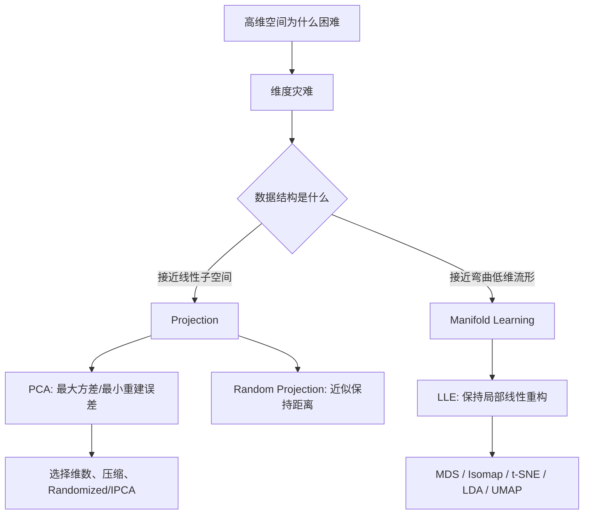

> 书目：*Hands-On Machine Learning with Scikit-Learn and PyTorch*<br>
> 章节：Chapter 7, Dimensionality Reduction<br>
> 章节文件：7. Dimensionality Reduction.md<br>
> 配套 Notebook：<https://homl.info/colab-p>

---

## 阅读导引

### 本章要回答什么问题

现实数据可能包含成百上千乃至数百万个特征：

- MNIST 每张图有 784 个像素；
- 高清图像可有数百万像素；
- 文本词袋可有几十万词项；
- 基因组数据可有海量位点。

特征越多，不一定信息越多。高维数据会带来：

- 训练慢、内存大；
- 样本在空间中极度稀疏；
- 距离和邻近关系变得不可靠；
- 模型更容易从偶然噪声中发现“规律”；
- 可视化几乎不可能。

降维要解决的问题是：

> 能否用更少的坐标表示数据，同时尽量保留任务所需的信息？

### 全章主线



### 三类方法保留什么

| 方法 | 主要保留对象 | 适用结构 | 主要代价 |
| --- | --- | --- | --- |
| PCA | 全局方差、线性重建 | 近似线性子空间 | 无法展开弯曲流形 |
| Random Projection | 两两欧氏距离 | 极高维、稀疏数据 | 随机近似、难逆转 |
| LLE | 局部邻居重构关系 | 光滑低维流形 | 大样本扩展差、全局扭曲 |

### 一句话概括

$$
\boxed{
\text{降维不是“删除列”而已，}
\text{而是选择要保留的几何或统计结构}
}
$$

### 使用边界

降维并不保证提高准确率：

- 丢失的低方差信息可能恰好最有预测力；
- 流形展开可能让原本简单的决策边界变复杂；
- 降维本身需要计算；
- 新特征通常更难解释；
- 所有预处理都必须只在训练集上拟合，避免泄漏。

---

## 0. 必要基础

### 0.1 维数、子空间与流形

- **环境维数 $n$**：原始表示的特征数；
- **内在维数 $d$**：描述数据真实自由度所需的维数；
- 通常希望 $d\ll n$。

例子：一张纸是二维表面，即使卷成圆筒放在三维空间中，它的内在维数仍是 2。

### 0.2 中心化

数据矩阵：

$$
\mathbf X\in\mathbb R^{m\times n}
$$

- $m$：样本数；
- $n$：特征数。

每列均值：

$$
\boldsymbol\mu=\frac1m\sum_{i=1}^{m}\mathbf x^{(i)}
$$

中心化：

$$
\mathbf X_c=\mathbf X-\mathbf1\boldsymbol\mu^\top
$$

中心化使每个特征均值为 0。PCA 必须围绕数据均值寻找方向，否则主方向可能只描述“均值离原点多远”。

### 0.3 协方差矩阵

样本协方差：

$$
\mathbf C=\frac1{m-1}\mathbf X_c^\top\mathbf X_c
$$

$C_{jk}$ 描述特征 $j,k$ 的共同变化：

- 对角线：各特征方差；
- 正值：倾向同向变化；
- 负值：倾向反向变化；
- 接近 0：线性相关弱，不代表独立。

### 0.4 正交投影

单位方向 $\mathbf w$：

$$
\|\mathbf w\|_2=1
$$

点 $\mathbf x$ 在该方向上的坐标：

$$
z=\mathbf x^\top\mathbf w
$$

若 $\mathbf W_d\in\mathbb R^{n\times d}$ 的列正交：

$$
\mathbf W_d^\top\mathbf W_d=\mathbf I_d
$$

降维坐标：

$$
\mathbf Z=\mathbf X_c\mathbf W_d
$$

投影回原空间：

$$
\widehat{\mathbf X}_c
=\mathbf Z\mathbf W_d^\top
=\mathbf X_c\mathbf W_d\mathbf W_d^\top
$$

$\mathbf W_d\mathbf W_d^\top$ 是投影矩阵。

### 0.5 特征值与奇异值

协方差矩阵的特征向量满足：

$$
\mathbf C\mathbf v_j=\lambda_j\mathbf v_j
$$

- $\mathbf v_j$：方向；
- $\lambda_j$：该方向上的方差。

SVD：

$$
\mathbf X_c=\mathbf U\boldsymbol\Sigma\mathbf V^\top
$$

- $\mathbf U$：左奇异向量；
- $\boldsymbol\Sigma$：奇异值；
- $\mathbf V$：右奇异向量，列就是 PCA 主方向。

---

## 1. 维度灾难

### 1.1 高维空间大部分靠近边界

考虑 $D$ 维单位超立方体 $[0,1]^D$。一个点距离**所有边界**至少 $\delta$，意味着每一维都落在：

$$
[\delta,1-\delta]
$$

单维长度为 $1-2\delta$，内部体积比例：

$$
P(\text{远离全部边界})=(1-2\delta)^D
$$

因此距离至少一个边界小于 $\delta$ 的比例：

$$
\boxed{
P_{\text{border}}
=1-(1-2\delta)^D
}
$$

取 $\delta=0.001$：

#### 二维

$$
1-0.998^2
=0.003996
=0.3996\%
$$

#### 一万维

$$
1-0.998^{10000}
\approx0.99999999798
$$

约 $99.9999998\%$ 的点距某个边界不到 0.001。高维空间几乎全是“边缘”。

```python
for dimensions in (2, 10_000):
    probability = 1 - (1 - 2 * 0.001) ** dimensions
    print(dimensions, probability)
```

### 1.2 高维随机点彼此遥远

设：

$$
X,Y\sim U([0,1]^D)
$$

单维 $X_j,Y_j$ 独立均匀。平方差期望：

$$
E[(X_j-Y_j)^2]
=E[X_j^2]+E[Y_j^2]-2E[X_j]E[Y_j]
$$

均匀分布有：

$$
E[X_j]=\frac12,
\qquad E[X_j^2]=\frac13
$$

所以：

$$
E[(X_j-Y_j)^2]
=\frac13+\frac13-2\cdot\frac12\cdot\frac12
=\frac16
$$

欧氏距离平方：

$$
\|X-Y\|_2^2
=\sum_{j=1}^{D}(X_j-Y_j)^2
$$

由期望线性性：

$$
\boxed{
E\|X-Y\|_2^2=\frac D6
}
$$

距离通常集中在：

$$
\sqrt{\frac D6}
$$

附近。$D=10^6$：

$$
\sqrt{\frac{10^6}{6}}
\approx408.248
$$

而单位超立方体中单维最大差只有 1。

### 1.3 数据需求指数增长

100 个特征均在 $[0,1]$，每维按 0.1 间隔划 10 格，总格子数：

$$
10^{100}
$$

远超可观测宇宙约 $10^{80}$ 个原子的数量级。若希望每个局部小区域都有样本，所需数据随维度指数增长。

这不是说任何 100 维任务都需要 $10^{100}$ 个样本，而是说明：**若数据真正填满整个高维体积，密集覆盖不可行。** 现实学习之所以可能，通常因为数据只占据一个低维结构。

### 1.4 维度灾难带来的问题

- 数据极度稀疏；
- 最近邻也可能很远；
- 距离差异相对缩小，邻近关系失去区分力；
- 模型在大面积无数据区域外推；
- 偶然相关和噪声模式增多；
- 高方差与过拟合风险上升；
- 计算和存储成本增加。

### 1.5 常见应对方法

- 收集更多数据；
- 正则化；
- 特征选择；
- 利用领域知识构造表示；
- 降维；
- 使用适合稀疏高维数据的模型。

---

## 2. 两类主要降维思路

## 2.1 Projection

### 2.1.1 为什么投影有效

很多特征近似常量，或彼此高度相关，因此数据并未填满整个 $n$ 维空间，而是靠近一个 $d$ 维线性子空间。

例如 3D 点云靠近一个平面，可正交投影到平面，用新坐标 $(z_1,z_2)$ 表示，实现 3D→2D。

### 2.1.2 正交投影

若子空间基为 $\mathbf W_d$：

$$
\mathbf Z=\mathbf X_c\mathbf W_d
$$

新特征 $z_1,\ldots,z_d$ 是原特征的线性组合。

### 2.1.3 投影的局限

若数据位于弯曲结构，如 Swiss Roll，简单线性投影会把不同卷层压在一起。丢弃 $x_3$ 后，相距很远的卷层可能在 2D 中重叠。

所以 Projection 适合近似线性子空间，不等于流形展开。

---

## 2.2 Manifold Learning

### 2.2.1 流形的直觉与定义

Swiss Roll 是嵌入 3D 的 2D 曲面：

- 环境维数 $n=3$；
- 内在维数 $d=2$；
- 整体弯曲；
- 局部邻域近似一个 2D 平面。

一般地，$d$ 维流形是 $n$ 维空间中的一个集合（$d<n$），其每个足够小的局部区域都近似 $d$ 维欧氏空间。

### 2.2.2 Swiss Roll

```python
from sklearn.datasets import make_swiss_roll

X_swiss, t = make_swiss_roll(
    n_samples=1000,
    noise=0.2,
    random_state=42,
)
```

$t$ 表示沿卷曲方向的位置，可作为展开坐标或非线性回归目标。

### 2.2.3 流形假设

**流形假设**：真实高维数据通常位于或靠近低维流形。

MNIST 有 784 个像素，但合法手写数字受到很多约束：

- 背景大多为白色；
- 笔画相互连通；
- 数字大致居中；
- 笔画宽度和形状有限；
- 随机生成的 784 维图像几乎不会像数字。

所以有效自由度远少于 784。

### 2.2.4 “降到流形后任务更简单”是额外假设

流形假设只说数据靠近低维流形，并不保证监督任务在流形坐标中更简单。

#### 有利情况

Swiss Roll 上类别边界沿曲面弯曲：

- 原 3D 中边界复杂；
- 展开后可能是一条直线。

#### 不利情况

若原空间边界是简单平面 $x_1=5$：

- 3D 中是一刀切的平面；
- 展开后可能变成四段不连续线。

结论：降维常能加速训练，但不保证提高准确率或简化决策边界。必须用下游验证指标检验。

---

## 3. PCA

### 3.1 核心目标

Principal Component Analysis（主成分分析）寻找最接近数据的低维线性超平面，并正交投影到该平面。

两种等价表述：

1. 保留最大投影方差；
2. 最小化正交重建误差。

### 3.2 为什么保留方差

若投影后样本挤成一点，原数据差异全部丢失；投影后越分散，通常保留的信息越多。

影子类比：观察一个立体物体时，面积最大的投影通常比细线状投影更能反映形状。

但方差只是无监督代理目标：低方差信号可能恰好对标签很重要。

### 3.3 单方向上的投影方差

中心化数据 $\mathbf X_c$，单位方向 $\mathbf w$：

$$
\mathbf z=\mathbf X_c\mathbf w
$$

因为 $\mathbf z$ 已中心化，样本方差：

$$
\operatorname{Var}(\mathbf z)
=\frac1{m-1}\mathbf z^\top\mathbf z
$$

代入：

$$
\begin{aligned}
\operatorname{Var}(\mathbf X_c\mathbf w)
&=\frac1{m-1}
(\mathbf X_c\mathbf w)^\top
(\mathbf X_c\mathbf w)\\
&=\mathbf w^\top
\left(\frac1{m-1}\mathbf X_c^\top\mathbf X_c\right)
\mathbf w\\
&=\boxed{\mathbf w^\top\mathbf C\mathbf w}
\end{aligned}
$$

### 3.4 最大方差方向的推导

要解：

$$
\max_{\mathbf w}\mathbf w^\top\mathbf C\mathbf w
\quad\text{s.t.}\quad
\mathbf w^\top\mathbf w=1
$$

拉格朗日函数：

$$
\mathcal L
=\mathbf w^\top\mathbf C\mathbf w
-\lambda(\mathbf w^\top\mathbf w-1)
$$

对 $\mathbf w$ 求梯度：

$$
\nabla_{\mathbf w}\mathcal L
=2\mathbf C\mathbf w-2\lambda\mathbf w=0
$$

因此：

$$
\boxed{\mathbf C\mathbf w=\lambda\mathbf w}
$$

$\mathbf w$ 必须是协方差矩阵特征向量。目标值：

$$
\mathbf w^\top\mathbf C\mathbf w
=\lambda\mathbf w^\top\mathbf w
=\lambda
$$

所以最大方差方向对应最大特征值的特征向量。后续主成分在与前面方向正交的约束下依次最大化方差。

### 3.5 主成分

第 $j$ 个主成分方向 $\mathbf c_j$：

- 单位向量；
- 与其他主成分正交；
- 按解释方差从大到小排序。

方向符号不唯一：$\mathbf c_j$ 与 $-\mathbf c_j$ 表示同一条轴。

若特征值相等或非常接近，对应子空间稳定，但单个方向可能交换或旋转。

### 3.6 公式 7-1：主成分矩阵

$$
\mathbf V=
\begin{pmatrix}
|&|&&|\\
\mathbf c_1&\mathbf c_2&\cdots&\mathbf c_n\\
|&|&&|
\end{pmatrix}
$$

$\mathbf V\in\mathbb R^{n\times n}$ 的列是按方差排序的主成分方向。

### 3.7 SVD 为什么给出 PCA 方向

中心化矩阵 SVD：

$$
\mathbf X_c
=\mathbf U\boldsymbol\Sigma\mathbf V^\top
$$

协方差：

$$
\begin{aligned}
\mathbf C
&=\frac1{m-1}\mathbf X_c^\top\mathbf X_c\\
&=\frac1{m-1}
(\mathbf U\boldsymbol\Sigma\mathbf V^\top)^\top
(\mathbf U\boldsymbol\Sigma\mathbf V^\top)\\
&=\frac1{m-1}
\mathbf V\boldsymbol\Sigma^\top
\underbrace{\mathbf U^\top\mathbf U}_{\mathbf I}
\boldsymbol\Sigma\mathbf V^\top\\
&=\mathbf V
\left(\frac{\boldsymbol\Sigma^\top\boldsymbol\Sigma}{m-1}\right)
\mathbf V^\top
\end{aligned}
$$

这正是特征分解，所以：

- $\mathbf V$ 的列是协方差特征向量；
- PCA 主方向就是右奇异向量；
- 协方差特征值：

$$
\lambda_j=\frac{\sigma_j^2}{m-1}
$$

### 3.8 NumPy 求主成分

```python
import numpy as np

X_centered = X - X.mean(axis=0)
U, singular_values, Vt = np.linalg.svd(
    X_centered,
    full_matrices=False,
)

V = Vt.T
W2 = V[:, :2]
```

一个 3D 示例的前两个方向可能为：

```text
[[ 0.66824153  0.74374636]
 [ 0.73208333 -0.66151587]
 [ 0.13231495 -0.09611511]]
```

符号整体翻转仍是同一主轴。

### 3.9 中心化与标准化不是同一件事

PCA 必须中心化，Scikit-Learn `PCA` 自动完成。

PCA 不自动标准化。若特征单位差异很大：

- 大尺度特征贡献更大方差；
- 主成分可能主要反映单位，而非结构。

是否标准化取决于语义：

- 所有像素同单位：通常只中心化；
- 身高（cm）与收入（元）混合：通常先标准化；
- 若原始方差本身有业务意义，标准化可能抹掉它。

---

## 4. 投影到 $d$ 维

### 4.1 选择投影矩阵

取前 $d$ 个主成分：

$$
\mathbf W_d
=\begin{pmatrix}
|&&|\\
\mathbf c_1&\cdots&\mathbf c_d\\
|&&|
\end{pmatrix}
\in\mathbb R^{n\times d}
$$

### 4.2 公式 7-2：降维投影

对已中心化矩阵：

$$
\boxed{
\mathbf X_{d\text{-proj}}
=\mathbf X_c\mathbf W_d
}
$$

若符号 $\mathbf X$ 默认已经中心化，可简写为：

$$
\mathbf X_{d\text{-proj}}
=\mathbf X\mathbf W_d
$$

形状：

$$
(m\times n)(n\times d)=m\times d
$$

### 4.3 NumPy 投影

```python
W2 = Vt[:2].T
X2D = X_centered @ W2
print(X2D.shape)  # (m, 2)
```

### 4.4 最大方差等价于最小重建误差

重建中心化数据：

$$
\widehat{\mathbf X}_c
=\mathbf X_c\mathbf W_d\mathbf W_d^\top
$$

残差：

$$
\mathbf E
=\mathbf X_c-\widehat{\mathbf X}_c
$$

投影分量与残差正交。由勾股定理的 Frobenius 范数版本：

$$
\|\mathbf X_c\|_F^2
=\|\mathbf X_c\mathbf W_d\|_F^2
+\|\mathbf E\|_F^2
$$

因此：

$$
\boxed{
\|\mathbf X_c-\mathbf X_c\mathbf W_d\mathbf W_d^\top\|_F^2
=\|\mathbf X_c\|_F^2
-\|\mathbf X_c\mathbf W_d\|_F^2
}
$$

左边是重建误差，右边第一项固定。所以：

$$
\arg\min\text{重建误差}
=\arg\max\text{投影方差}
$$

### 4.5 Eckart–Young 结论

保留前 $d$ 个奇异值是最优秩 $d$ 近似：

$$
\min_{\operatorname{rank}(\widehat X)\le d}
\|\mathbf X_c-\widehat{\mathbf X}\|_F^2
=\sum_{j>d}\sigma_j^2
$$

成立条件与边界：

- 损失是平方/Frobenius 重建误差；
- 近似限制为线性秩 $d$；
- 对其他损失或非线性表示，PCA 不一定最优。

---

## 5. 使用 Scikit-Learn PCA

### 5.1 基本 API

```python
from sklearn.decomposition import PCA

pca = PCA(n_components=2)
X2D = pca.fit_transform(X)
```

`PCA` 自动：

- 计算训练均值；
- 中心化；
- 做 SVD；
- 保存前两个主成分；
- 投影数据。

### 5.2 `components_`

`components_` 的形状：

$$
d\times n
$$

每一行是一个主成分方向，即：

$$
\texttt{components\_}=\mathbf W_d^\top
$$

### 5.3 解释方差比

第 $j$ 个主成分解释方差比：

$$
\operatorname{EVR}_j
=\frac{\lambda_j}{\sum_{\ell=1}^{n}\lambda_\ell}
=\frac{\sigma_j^2}{\sum_{\ell=1}^{n}\sigma_\ell^2}
$$

```python
print(pca.explained_variance_ratio_)
```

3D 示例输出：

```text
[0.82279334 0.10821224]
```

- 第一主成分约 82.28%；
- 第二主成分约 10.82%；
- 合计约 93.10%；
- 第三方向约 6.90%。

### 5.4 为什么“高解释方差”不等于“高预测价值”

PCA 完全不看标签。一个低方差特征可能恰好区分类别；一个高方差方向也可能只是无关背景变化。

因此维数选择必须兼顾：

- 解释方差；
- 重建质量；
- 下游验证性能；
- 速度和内存；
- 可解释性。

---

## 6. 选择合适的维数

### 6.1 累计解释方差

前 $d$ 个主成分累计解释方差：

$$
R(d)=\sum_{j=1}^{d}\operatorname{EVR}_j
$$

常见策略：选最小的 $d$，使：

$$
R(d)\ge\tau
$$

$\tau$ 常取 0.95，但不是普适定理。

### 6.2 MNIST 保留 95% 方差

```python
import numpy as np
from sklearn.decomposition import PCA

pca_full = PCA()
pca_full.fit(X_train)

cumulative_variance = np.cumsum(
    pca_full.explained_variance_ratio_
)
d = np.argmax(cumulative_variance >= 0.95) + 1
print(d)
```

输出：

```text
154
```

`argmax()` 返回第一个 `True` 的索引，所以加 1 才是维数。若没有任何值达到阈值，应先检查 `.any()`，避免全 False 时静默返回 0。

更简洁：

```python
pca = PCA(n_components=0.95)
X_reduced = pca.fit_transform(X_train)

print(pca.n_components_)  # 154
print(pca.explained_variance_ratio_.sum())
```

### 6.3 解释方差肘部

画 $R(d)$：

```python
import matplotlib.pyplot as plt

plt.plot(cumulative_variance)
plt.xlabel("Number of dimensions")
plt.ylabel("Cumulative explained variance")
plt.grid()
plt.show()
```

曲线常有“肘部”：之后增加维数只带来较小方差收益。MNIST 在约 100 维后增长明显变慢，但 95% 阈值仍需 154 维。

### 6.4 可视化是例外

若目标是二维/三维可视化，输出维数已经由显示媒介确定：

```python
PCA(n_components=2)
```

此时不能要求 95% 方差，应该比较可视化结构是否有意义。

### 6.5 用下游任务选择维数

解释方差不看标签，更稳健的方法是把 PCA 放入 Pipeline，让交叉验证同时选择：

- PCA 维数；
- 下游模型超参数。

```python
from scipy.stats import randint
from sklearn.ensemble import RandomForestClassifier
from sklearn.model_selection import RandomizedSearchCV
from sklearn.pipeline import make_pipeline

pipeline = make_pipeline(
    PCA(random_state=42),
    RandomForestClassifier(random_state=42),
)

search = RandomizedSearchCV(
    pipeline,
    param_distributions={
        "pca__n_components": np.arange(10, 80),
        "randomforestclassifier__n_estimators": randint(50, 500),
    },
    n_iter=10,
    cv=3,
    random_state=42,
)

search.fit(X_train[:1000], y_train[:1000])
print(search.best_params_)
```

一次参考结果：

```text
PCA dimensions: 57
Random forest trees: 475
```

搜索结果依赖数据子集、随机性和版本。

### 6.6 速度、模型大小与性能的权衡

维数越少：

- 数据更小；
- 模型可能更小；
- 训练和推理通常更快；
- 噪声和冗余可能减少；
- 信号损失和欠拟合风险增加。

应综合验证：

$$
	ext{效用}=
	ext{预测质量}
-\lambda_1\text{延迟}
-\lambda_2\text{内存}
-\lambda_3\text{训练成本}
$$

$\lambda$ 由业务约束决定。

---

## 7. PCA 压缩与逆变换

### 7.1 压缩比例

MNIST 从 784 维降到 154 维：

$$
\frac{154}{784}
\approx0.19643
$$

只保留原特征数的约 19.64%，累计方差约 95%。

注意“丢失 5% 方差”不等于“丢失 5%语义信息”或“准确率只降 5%”。

### 7.2 公式 7-3：PCA 逆变换

中心化坐标中的降维：

$$
\mathbf Z=\mathbf X_c\mathbf W_d
$$

逆投影：

$$
\boxed{
\mathbf X_{\mathrm{recovered},c}
=\mathbf Z\mathbf W_d^\top
}
$$

恢复原始坐标还要加回均值：

$$
\boxed{
\widehat{\mathbf X}
=\mathbf Z\mathbf W_d^\top
+\mathbf1\boldsymbol\mu^\top
}
$$

Scikit-Learn：

```python
X_recovered = pca.inverse_transform(X_reduced)
```

会自动加回训练均值。

### 7.3 为什么无法精确恢复

分解：

$$
\mathbf X_c
=\sum_{j=1}^{r}\sigma_j\mathbf u_j\mathbf v_j^\top
$$

只保留前 $d$ 项：

$$
\widehat{\mathbf X}_c
=\sum_{j=1}^{d}\sigma_j\mathbf u_j\mathbf v_j^\top
$$

被删除的：

$$
\sum_{j=d+1}^{r}\sigma_j\mathbf u_j\mathbf v_j^\top
$$

无法从 $\mathbf Z$ 推回，因为它已投进被舍弃子空间的零空间。

### 7.4 重建误差

平均平方重建距离：

$$
\operatorname{RE}
=\frac1m\sum_{i=1}^{m}
\|\mathbf x^{(i)}-\widehat{\mathbf x}^{(i)}\|_2^2
$$

PCA 的总平方重建误差：

$$
\|\mathbf X_c-\widehat{\mathbf X}_c\|_F^2
=\sum_{j>d}\sigma_j^2
$$

可运行：

```python
reconstruction_mse = np.mean((X_train - X_recovered) ** 2)
print(reconstruction_mse)
```

MNIST 重建图通常仍可辨认，但边缘更模糊。

---

## 8. Randomized PCA

### 8.1 为什么需要近似算法

完整 SVD 计算全部方向，即使只需前 $d$ 个。若 $d\ll n$，这是浪费。

Randomized PCA 用随机子空间迭代，近似前 $d$ 个主成分。

```python
rnd_pca = PCA(
    n_components=154,
    svd_solver="randomized",
    random_state=42,
)
X_reduced = rnd_pca.fit_transform(X_train)
```

### 8.2 复杂度

完整方法量级：

$$
O(mn^2)+O(n^3)
$$

Randomized 方法：

$$
O(md^2)+O(d^3)
$$

当 $d\ll n$ 时显著更快。实际成本还依赖矩阵形状、幂迭代次数和后端实现。

### 8.3 何时使用

- 只需少量主成分；
- 数据可装入内存；
- 允许小量近似误差；
- $d$ 接近 $n$ 时收益不大。

### 8.4 `svd_solver="auto"`

Scikit-Learn 会根据矩阵形状和目标维数选择求解器。典型规则包括：

- 特征少、样本远多于特征：`covariance_eigh`；
- 规模较大且 $d$ 明显小于 $\min(m,n)$：`randomized`；
- 其他情况：`full`。

具体阈值依赖版本，不应把自动策略当作稳定公共契约。需要可控行为时显式指定。

---

## 9. Incremental PCA

### 9.1 要解决什么问题

普通 PCA 需要整体数据参与拟合。数据超内存或持续流入时，需要分批更新主成分。

Incremental PCA（IPCA）：

- 逐 mini-batch 更新低秩统计；
- 内存只需容纳一个批次；
- 适合大数据和在线场景；
- 结果可能与一次性 PCA 略有差异。

### 9.2 `partial_fit()`

```python
from sklearn.decomposition import IncrementalPCA

n_batches = 100
inc_pca = IncrementalPCA(n_components=154)

for X_batch in np.array_split(X_train, n_batches):
    inc_pca.partial_fit(X_batch)

X_reduced = inc_pca.transform(X_train)
```

60,000 张 MNIST 分 100 批，每批约 600 张。

### 9.3 使用 memmap

NumPy memmap 将磁盘文件映射为数组，只按需加载页面。

```python
filename = "my_mnist.mmap"

X_mmap = np.memmap(
    filename,
    dtype="float32",
    mode="w+",
    shape=X_train.shape,
)
X_mmap[:] = X_train
X_mmap.flush()

X_mmap = np.memmap(
    filename,
    dtype="float32",
    mode="r",
    shape=(60_000, 784),
)

inc_pca = IncrementalPCA(
    n_components=154,
    batch_size=600,
)
inc_pca.fit(X_mmap)
```

`fit()` 会按 `batch_size` 内部取批。

### 9.4 memmap 陷阱

裸 memmap 文件不保存：

- dtype；
- shape；
- 维度顺序；
- 列语义。

读取时必须提供一致元数据，否则只会得到错误的一维解释或乱码数值。

60,000×784 个 float32 大约：

$$
60{,}000\times784\times4
=188{,}160{,}000\text{ bytes}
\approx179.44\text{ MiB}
$$

---

## 10. Random Projection

### 10.1 为什么“随机”也能降维

随机投影不寻找数据特定方向，而是生成随机线性映射：

$$
\mathbf z=\mathbf P\mathbf x
$$

看似粗暴，但高维随机向量彼此近似正交。适当目标维数下，随机投影能以高概率近似保持有限样本之间的距离。

### 10.2 Johnson–Lindenstrauss 保证

给定 $m$ 个点和容忍误差 $0<\varepsilon<1$，存在映射到 $d$ 维，使所有点对满足：

$$
(1-\varepsilon)
\|\mathbf x_i-\mathbf x_j\|_2^2
\le
\|\mathbf P\mathbf x_i-\mathbf P\mathbf x_j\|_2^2
\le
(1+\varepsilon)
\|\mathbf x_i-\mathbf x_j\|_2^2
$$

关键结论：所需 $d$ 主要按 $\log m/\varepsilon^2$ 增长，而不是依赖原始维数 $n$。

Scikit-Learn 使用下界：

$$
d\ge
\frac{4\ln m}
{\varepsilon^2/2-\varepsilon^3/3}
$$

### 10.3 数值例子

```python
from sklearn.random_projection import johnson_lindenstrauss_min_dim

m = 5000
epsilon = 0.1
d = johnson_lindenstrauss_min_dim(
    n_samples=m,
    eps=epsilon,
)
print(d)
```

输出：

```text
7300
```

公式实数值约 7300.45；数学上向上取整为 7301，但当前函数返回整数 7300，属于实现的整数处理差异。

目标维数与原始维数 $n=20{,}000$ 无关，只要 $d<n$ 才有实际降维意义。

### 10.4 Gaussian Random Projection

生成：

$$
\mathbf P\in\mathbb R^{d\times n}
$$

元素独立采样：

$$
P_{ij}\sim\mathcal N\left(0,\frac1d\right)
$$

```python
rng = np.random.default_rng(42)
P = rng.standard_normal((d, n)) / np.sqrt(d)
X_reduced = X @ P.T
```

### 10.5 为什么缩放为 $1/\sqrt d$

固定向量 $\mathbf x$，第 $r$ 个投影坐标：

$$
z_r=\sum_{j=1}^{n}P_{rj}x_j
$$

因为 $E[P_{rj}]=0$ 且独立：

$$
E[z_r^2]
=\sum_j\operatorname{Var}(P_{rj})x_j^2
=\frac1d\|\mathbf x\|_2^2
$$

对 $d$ 个坐标求和：

$$
E\|\mathbf P\mathbf x\|_2^2
=d\cdot\frac1d\|\mathbf x\|_2^2
=\|\mathbf x\|_2^2
$$

所以投影长度在期望上保持。

### 10.6 Scikit-Learn API

```python
from sklearn.random_projection import GaussianRandomProjection

gaussian_rnd_proj = GaussianRandomProjection(
    eps=0.1,
    random_state=42,
)
X_reduced = gaussian_rnd_proj.fit_transform(X)
```

`fit()` 只需要数据形状来确定矩阵与目标维数，不利用数据值学习方向，因此非常快。

### 10.7 Sparse Random Projection

高斯矩阵本身可能很大。稀疏随机矩阵只保留少量非零项。

默认密度：

$$
r=\frac1{\sqrt n}
$$

$n=20{,}000$：

$$
r\approx0.007071
$$

约每 141 个位置有一个非零值。

每个非零值等概率为：

$$
\pm v,
\qquad
v=\frac1{\sqrt{dr}}
$$

该缩放同样使投影范数在期望上保持。

```python
from sklearn.random_projection import SparseRandomProjection

sparse_rnd_proj = SparseRandomProjection(
    eps=0.1,
    random_state=42,
)
X_reduced = sparse_rnd_proj.fit_transform(X)
```

优势：

- 投影矩阵内存小；
- 稀疏乘法快；
- 稀疏输入默认可保持稀疏；
- 文本、基因组等超高维数据尤其适用。

### 10.8 随机投影的逆变换

随机投影通常没有精确逆。可用伪逆求最小范数近似。

若：

$$
\mathbf Z=\mathbf X\mathbf P^\top
$$

则近似恢复：

$$
\widehat{\mathbf X}
=\mathbf Z(\mathbf P^+)^\top
$$

```python
components_pinv = np.linalg.pinv(
    gaussian_rnd_proj.components_
)
X_recovered = X_reduced @ components_pinv.T
```

无法恢复投影零空间中的分量。伪逆本身在超高维上也可能非常昂贵，因此随机投影通常用于下游任务，而不是压缩后高质量重建。

### 10.9 适用边界

优势：

- 极快；
- 与原始维数弱相关；
- 内存高效；
- 近似保持距离；
- 不需训练数据统计。

局限：

- 结果随机；
- 不为重建优化；
- 目标维数可能仍很高；
- $\varepsilon$ 越小，所需维数急剧增大；
- 单次实现需固定随机种子才能复现。

---

## 11. LLE

### 11.1 为什么需要非线性方法

PCA 与随机投影都是全局线性变换，不能展开 Swiss Roll。

Locally Linear Embedding（LLE）利用：

> 流形局部近似平面，每个点可以由邻居的线性组合重构。

它分两步：

1. 在高维空间学习每个点如何由邻居重构；
2. 在低维空间寻找坐标，使相同重构关系仍成立。

### 11.2 API

```python
from sklearn.manifold import LocallyLinearEmbedding

lle = LocallyLinearEmbedding(
    n_components=2,
    n_neighbors=10,
    random_state=42,
)
X_unrolled = lle.fit_transform(X_swiss)
```

### 11.3 公式 7-4：学习局部重构权重

$$
\widehat{\mathbf W}
=\arg\min_{\mathbf W}
\sum_{i=1}^{m}
\left\|
\mathbf x^{(i)}
-\sum_{j=1}^{m}w_{ij}\mathbf x^{(j)}
\right\|_2^2
$$

约束：

$$
w_{ij}=0,
\qquad j\notin\mathcal N_k(i)
$$

$$
\sum_{j=1}^{m}w_{ij}=1
$$

- $\mathcal N_k(i)$：样本 $i$ 的 $k$ 个最近邻；
- $w_{ij}$：邻居 $j$ 对重构样本 $i$ 的权重。

### 11.4 为什么权重和必须为 1

若所有点平移同一向量 $\mathbf a$：

$$
\mathbf x_j'=\mathbf x_j+\mathbf a
$$

重构残差：

$$
\begin{aligned}
\mathbf x_i'
-\sum_jw_{ij}\mathbf x_j'
&=\mathbf x_i+\mathbf a
-\sum_jw_{ij}(\mathbf x_j+\mathbf a)\\
&=\mathbf x_i-\sum_jw_{ij}\mathbf x_j
+\left(1-\sum_jw_{ij}\right)\mathbf a
\end{aligned}
$$

若 $\sum_jw_{ij}=1$，平移项消失，局部关系与坐标原点无关。

### 11.5 单点权重的求解

对样本 $i$ 的 $k$ 个邻居，定义差向量矩阵：

$$
\mathbf D_i=
\begin{pmatrix}
\mathbf x_{j_1}-\mathbf x_i&\cdots&
\mathbf x_{j_k}-\mathbf x_i
\end{pmatrix}
$$

局部 Gram 矩阵：

$$
\mathbf C_i=\mathbf D_i^\top\mathbf D_i
$$

目标等价于：

$$
\min_{\mathbf w_i}
\mathbf w_i^\top\mathbf C_i\mathbf w_i
\quad\text{s.t.}\quad
\mathbf1^\top\mathbf w_i=1
$$

拉格朗日求导：

$$
2\mathbf C_i\mathbf w_i
-\lambda\mathbf1=0
$$

$$
\mathbf w_i
=\frac{\mathbf C_i^{-1}\mathbf1}
{\mathbf1^\top\mathbf C_i^{-1}\mathbf1}
$$

若 $\mathbf C_i$ 奇异或病态，需要加小正则：

$$
\mathbf C_i+\epsilon\mathbf I
$$

Scikit-Learn 的 `reg` 参数控制类似稳定化。

### 11.6 公式 7-5：保持关系求低维坐标

固定 $\widehat{\mathbf W}$：

$$
\widehat{\mathbf Z}
=\arg\min_{\mathbf Z}
\sum_{i=1}^{m}
\left\|
\mathbf z^{(i)}
-\sum_{j=1}^{m}
\widehat w_{ij}\mathbf z^{(j)}
\right\|_2^2
$$

仅写这个目标会有平凡解 $\mathbf Z=0$。必须加入规范化约束，例如：

$$
\sum_i\mathbf z^{(i)}=0
$$

$$
\frac1m\mathbf Z^\top\mathbf Z=\mathbf I_d
$$

防止所有点坍缩或任意缩放。

### 11.7 特征值解

矩阵形式：

$$
\sum_i\left\|
\mathbf z_i-\sum_jw_{ij}\mathbf z_j
\right\|^2
=\operatorname{tr}
\left[
\mathbf Z^\top
(\mathbf I-\mathbf W)^\top
(\mathbf I-\mathbf W)
\mathbf Z
\right]
$$

令：

$$
\mathbf M=(\mathbf I-\mathbf W)^\top(\mathbf I-\mathbf W)
$$

最小特征值对应常量向量，即平移平凡解，应丢弃。取接下来 $d$ 个最小特征值对应的特征向量作为低维坐标。

### 11.8 LLE 结果怎样理解

Swiss Roll 可以被完全展开，局部邻居关系较好保持；但整体形状可能成为拉伸、扭曲的带状，而非理想矩形。

这说明：

- LLE 优先局部结构；
- 不保证全局距离；
- 邻居数过小，图可能断裂；
- 邻居数过大，局部线性假设变差。

### 11.9 复杂度

实现复杂度量级：

- 找 $k$ 邻居：$O(m\log(m)n\log k)$；
- 优化局部权重：$O(mnk^3)$；
- 低维特征分解：$O(dm^2)$。

$m^2$ 项使 LLE 难以扩展到很大样本集。

### 11.10 与 PCA/随机投影比较

| | PCA | Random Projection | LLE |
| --- | --- | --- | --- |
| 变换 | 全局线性、数据驱动 | 全局线性、随机 | 非线性流形 |
| 保留 | 方差/重建 | 距离 | 局部关系 |
| 训练速度 | 中等 | 极快 | 慢 |
| 大样本 | Random/IPCA 可扩展 | 很适合 | 较差 |
| 新样本变换 | 支持 | 支持 | Scikit-Learn 支持 transform，但成本高 |
| 逆变换 | 近似 | 伪逆近似 | 通常无直接逆 |

---

## 12. 其他降维技术

### 12.1 MDS

Multidimensional Scaling（多维缩放）寻找低维坐标，使样本两两距离尽量接近原距离。

典型 stress 目标：

$$
\operatorname{Stress}(\mathbf Z)
=\sum_{i<j}
\left(
\|\mathbf z_i-\mathbf z_j\|_2
-\delta_{ij}
\right)^2
$$

$\delta_{ij}$ 是原空间距离或不相似度。

```python
from sklearn.manifold import MDS

mds = MDS(
    n_components=2,
    normalized_stress=False,
    random_state=42,
)
X_mds = mds.fit_transform(X_swiss)
```

特点：

- 尽量保持全局距离；
- 计算两两距离，规模扩展差；
- 随机投影更适合超高维大数据；
- MDS 更适合样本数较小、距离本身有意义的任务。

Swiss Roll 上，MDS 能展平曲面但保留全局弯曲。

### 12.2 Isomap

Isomap：

1. 建立 $k$ 近邻图；
2. 边权为局部欧氏距离；
3. 计算图上最短路径，近似流形测地距离；
4. 用 MDS 在低维中保留这些测地距离。

测地距离不是简单“经过多少节点”，而是最短路径上边权之和。

```python
from sklearn.manifold import Isomap

isomap = Isomap(n_components=2, n_neighbors=10)
X_isomap = isomap.fit_transform(X_swiss)
```

适合：

- 单一平滑全局流形；
- 邻居图连通且能反映真实局部结构。

局限：

- 对邻居数和噪声敏感；
- 错误“捷径边”会破坏测地距离；
- 图断裂时无法可靠计算跨组件距离；
- 大样本计算昂贵。

Swiss Roll 上，Isomap 通常能去掉全局弯曲、展开成更规则平面。

### 12.3 t-SNE

t-distributed Stochastic Neighbor Embedding 主要用于可视化：

- 把高维邻近关系转成概率；
- 在低维中构造相似概率；
- 最小化两种邻域分布的 KL divergence；
- 用重尾 Student-t 分布缓解 crowding problem；
- 强调局部簇结构。

```python
from sklearn.manifold import TSNE

tsne = TSNE(
    n_components=2,
    init="pca",
    learning_rate="auto",
    random_state=42,
)
X_tsne = tsne.fit_transform(X_train[:5000])
```

适用边界：

- 非常适合二维/三维探索可视化；
- 簇间距离和簇大小通常不能按全局几何解释；
- 结果依赖随机种子、perplexity 等参数；
- 不适合作为普通预测 Pipeline 的稳定预处理；
- 新样本没有简单原生映射。

Swiss Roll 上，t-SNE 可展平并强化局部簇，但可能把连续卷面“撕开”。

### 12.4 LDA

Linear Discriminant Analysis 是监督式线性方法，使用标签寻找类别可分方向。

目标直觉：

$$
	ext{最大化类间散布，最小化类内散布}
$$

二类 Fisher 方向：

$$
\mathbf w
\propto
\mathbf S_W^{-1}(\boldsymbol\mu_1-\boldsymbol\mu_0)
$$

- $\mathbf S_W$：类内散布矩阵；
- $\boldsymbol\mu_k$：类别均值。

```python
from sklearn.discriminant_analysis import LinearDiscriminantAnalysis

lda = LinearDiscriminantAnalysis(n_components=2)
X_lda = lda.fit_transform(X_train, y_train)
```

最多可降到：

$$
K-1
$$

维，其中 $K$ 是类别数。适合分类前降维，或 LDA 本身直接分类。

### 12.5 UMAP

Uniform Manifold Approximation and Projection：

- 强调局部结构；
- 尝试保留部分全局结构；
- 通常比 t-SNE 更可扩展；
- 可用于可视化；
- 由外部 `umap-learn` 包提供。

```python
from umap import UMAP

umap = UMAP(n_components=2, random_state=42)
X_umap = umap.fit_transform(X_train[:5000])
```

UMAP/t-SNE 图适合探索，不应仅凭视觉簇就断言真实类别或因果结构。

### 12.6 方法对比

| 方法 | 监督 | 线性 | 主要保留 | 新样本映射 | 典型用途 |
| --- | --- | --- | --- | --- | --- |
| PCA | 否 | 是 | 方差/重建 | 有 | 压缩、预处理 |
| Random Projection | 否 | 是 | 距离 | 有 | 超高维加速 |
| LLE | 否 | 否 | 局部重构 | 有但成本较高 | 流形展开 |
| MDS | 否 | 否 | 全局距离 | 通常弱 | 小数据距离可视化 |
| Isomap | 否 | 否 | 测地距离 | 有 | 平滑流形 |
| t-SNE | 否 | 否 | 局部邻域 | 无简单映射 | 可视化 |
| LDA | 是 | 是 | 类别分离 | 有 | 分类降维 |
| UMAP | 否 | 否 | 局部+部分全局 | 有 | 大数据可视化 |

---

## 13. 章末练习与参考答案

### 练习 1：降维的动机与缺点

**动机**：

- 加快训练和推理；
- 降低内存、存储和网络成本；
- 去除冗余、相关或噪声特征；
- 缓解维度灾难；
- 降低部分模型的过拟合风险；
- 压缩数据；
- 降到 2D/3D 可视化。

**缺点**：

- 信息不可逆损失；
- 转换本身耗时；
- Pipeline 更复杂；
- 新维度难解释；
- 未必提升准确率，可能降低性能；
- 需要额外调参并防止泄漏。

### 练习 2：什么是维度灾难

维数增加时，高维体积指数增长，固定样本数越来越稀疏：

- 点彼此遥远；
- 大部分点靠近某个边界；
- 局部邻居不再可靠；
- 密集覆盖需要指数级样本；
- 模型更依赖无数据区域外推并更易过拟合。

### 练习 3：降维能否逆转

通常不能精确逆转，因为多对一映射丢失信息。

- PCA：可用 `inverse_transform()` 得到最小平方误差近似；
- 随机投影：可用伪逆近似，成本高且误差大；
- t-SNE/LLE：通常没有简单可靠的逆变换。

只有数据本来完全位于保留子空间、未删除任何非零分量时，PCA 才能精确恢复。

### 练习 4：PCA 能否处理高度非线性数据

可以运行，但未必得到有用表示。

- PCA 可先删除无关线性维度；
- 不能展开 Swiss Roll 等弯曲流形；
- 会把不同卷层压在一起；
- 应尝试 LLE、Isomap、UMAP 等非线性方法，或核方法。

### 练习 5：1000 维保留 95% 后有多少维

无法仅凭“原始 1000 维”和“95%”确定。答案取决于特征值谱：

- 若几乎全部方差集中在一个方向，可能只需 1 维；
- 若 1000 个方向方差相近，可能需约 950 维；
- 实际 $d$ 要拟合 PCA 后看累计解释方差。

### 练习 6：何时使用各 PCA/随机投影方法

| 方法 | 使用场景 |
| --- | --- |
| 普通 PCA | 数据可装内存，需较精确主成分 |
| Randomized PCA | 只需 $d\ll n$ 个主成分 |
| Incremental PCA | 数据超内存、流式到达、需分批训练 |
| Random Projection | 特征数极高，主要希望快速近似保持距离 |

### 练习 7：如何评价降维算法

根据目标选择：

- PCA：解释方差、重建误差；
- 距离方法：点对距离失真；
- 流形方法：邻居保持率、trustworthiness；
- 监督任务：下游交叉验证性能；
- 工程：训练/推理时间、内存、模型大小；
- 可视化：局部结构稳定性，但不能只凭“好看”。

降维参数必须在训练折内拟合，最好放进 Pipeline。

### 练习 8：能否串联不同降维算法

可以，而且常很实用：

```text
高维数据
→ PCA 或随机投影快速降到中等维度
→ LLE / t-SNE / MDS 做昂贵非线性降维
```

优点：减少后续计算和噪声；缺点：第一步可能丢掉第二步所需结构。需交叉验证或可视化稳定性检查。

### 练习 9：MNIST 分类前使用 PCA

#### 数据加载

```python
from pathlib import Path
import numpy as np

mnist_path = Path("code/datasets/mnist/mnist.npz")
if not mnist_path.exists():
    mnist_path = Path(
        "tech-books/hands-on-machine-learning/code/datasets/mnist/mnist.npz"
    )

with np.load(mnist_path) as data:
    X = np.concatenate([data["x_train"], data["x_test"]]).reshape(-1, 784)
    y = np.concatenate([data["y_train"], data["y_test"]])

X_train, X_test = X[:60_000], X[60_000:]
y_train, y_test = y[:60_000], y[60_000:]
```

#### 通用计时函数

```python
from time import perf_counter
from sklearn.metrics import accuracy_score

def fit_and_measure(model, X_train, y_train, X_test, y_test):
    start = perf_counter()
    model.fit(X_train, y_train)
    elapsed = perf_counter() - start
    accuracy = accuracy_score(y_test, model.predict(X_test))
    return elapsed, accuracy
```

#### Random Forest 对比

```python
from sklearn.decomposition import PCA
from sklearn.ensemble import RandomForestClassifier

rf_raw = RandomForestClassifier(n_estimators=100, random_state=42, n_jobs=-1)
raw_time, raw_accuracy = fit_and_measure(
    rf_raw, X_train, y_train, X_test, y_test
)

pca = PCA(n_components=0.95, random_state=42)
X_train_pca = pca.fit_transform(X_train)
X_test_pca = pca.transform(X_test)

rf_pca = RandomForestClassifier(n_estimators=100, random_state=42, n_jobs=-1)
pca_time, pca_accuracy = fit_and_measure(
    rf_pca, X_train_pca, y_train, X_test_pca, y_test
)

print(pca.n_components_)
print(raw_time, raw_accuracy)
print(pca_time, pca_accuracy)
```

一次参考环境：

```text
原始 RF: 57.7 s, accuracy 0.9705
PCA 后 RF: 184 s, accuracy 0.9488
```

PCA 反而让随机森林更慢、更差。原因：

- 树在原始稀疏像素上可快速找到有效切分；
- PCA 生成 154 个稠密连续特征；
- 每个主成分混合全部像素，树的轴对齐切分不再直接对应局部像素；
- 降维不保证加速所有算法。

#### SGD 对比

```python
from sklearn.linear_model import SGDClassifier
from sklearn.pipeline import make_pipeline
from sklearn.preprocessing import StandardScaler

sgd_raw = make_pipeline(
    StandardScaler(),
    SGDClassifier(random_state=42),
)
raw_sgd_time, raw_sgd_accuracy = fit_and_measure(
    sgd_raw, X_train, y_train, X_test, y_test
)

sgd_pca = make_pipeline(
    StandardScaler(),
    SGDClassifier(random_state=42),
)
pca_sgd_time, pca_sgd_accuracy = fit_and_measure(
    sgd_pca, X_train_pca, y_train, X_test_pca, y_test
)
```

一次参考环境：

```text
原始 SGD: 188 s, accuracy 0.8740
PCA 后 SGD: 44.5 s, accuracy 0.8959
```

PCA 对线性 SGD 明显加速，并可能通过去除噪声提高准确率。计时依赖机器，且这里未计入 PCA 拟合成本。

### 练习 10：MNIST 可视化

#### t-SNE

```python
import matplotlib.pyplot as plt
from sklearn.manifold import TSNE

X_small = X_train[:5000]
y_small = y_train[:5000]

tsne = TSNE(
    n_components=2,
    init="pca",
    learning_rate="auto",
    random_state=42,
)
X_tsne = tsne.fit_transform(X_small)

plt.figure(figsize=(10, 8))
scatter = plt.scatter(
    X_tsne[:, 0],
    X_tsne[:, 1],
    c=y_small,
    cmap="tab10",
    s=8,
    alpha=0.7,
)
plt.colorbar(scatter, ticks=range(10))
plt.title("MNIST t-SNE")
plt.show()
```

常见现象：

- 大部分数字形成明显簇；
- 3/5、4/9 等形状相似数字存在重叠；
- 只对混淆类别子集重跑，分离可能改善；
- 簇间距离不应按原始全局距离解释。

一次参考环境中，对 5000 张图耗时约 61 秒。

#### PCA 对比

```python
pca_2d = PCA(n_components=2)
X_pca_2d = pca_2d.fit_transform(X_small)
```

速度极快，但类别重叠明显，因为 PCA 只保留全局最大方差，不以类别分离为目标。

#### 其他方法

- LLE：局部关系，但 MNIST 5000 样本效果和速度未必理想；
- MDS：两两距离成本高，可能非常慢；
- LDA：监督式，但最多 9 维，2D 投影未必分开所有数字；
- UMAP：通常是可扩展可视化的强选择。

---

## 14. 完整可运行的主线示例

```python
import numpy as np
from sklearn.datasets import make_swiss_roll
from sklearn.decomposition import PCA
from sklearn.manifold import LocallyLinearEmbedding
from sklearn.random_projection import (
    GaussianRandomProjection,
    johnson_lindenstrauss_min_dim,
)


rng = np.random.default_rng(42)
m = 500
u = rng.normal(size=(m, 2))

X_3d = np.c_[
    u[:, 0],
    u[:, 1],
    0.3 * u[:, 0] - 0.2 * u[:, 1] + 0.05 * rng.normal(size=m),
]


pca = PCA(n_components=2)
X_pca = pca.fit_transform(X_3d)
X_recovered = pca.inverse_transform(X_pca)

print("PCA 形状:", X_pca.shape)
print("解释方差:", pca.explained_variance_ratio_)
print("重建 MSE:", np.mean((X_3d - X_recovered) ** 2))


d = johnson_lindenstrauss_min_dim(n_samples=5000, eps=0.1)
print("JL 目标维数:", d)


X_high = rng.normal(size=(1000, 2000))
random_projection = GaussianRandomProjection(
    n_components=300,
    random_state=42,
)
X_random = random_projection.fit_transform(X_high)
print("随机投影形状:", X_random.shape)


X_swiss, color = make_swiss_roll(
    n_samples=1000,
    noise=0.2,
    random_state=42,
)
lle = LocallyLinearEmbedding(
    n_components=2,
    n_neighbors=10,
    random_state=42,
)
X_lle = lle.fit_transform(X_swiss)
print("LLE 形状:", X_lle.shape)
```

---

## 15. 公式速查

| 公式 | 含义 |
| --- | --- |
| $P_{border}=1-(1-2\delta)^D$ | 高维点靠近边界的概率 |
| $E\|X-Y\|^2=D/6$ | 单位超立方体随机点平方距离 |
| 7-1 | 主成分矩阵 $V$ |
| 7-2 | $Z=X_cW_d$，PCA 降维 |
| 7-3 | $\widehat X=ZW_d^T+\mu$，PCA 重建 |
| JL 不等式 | 随机投影近似保持距离 |
| 7-4 | LLE 学习局部重构权重 |
| 7-5 | LLE 保持权重求低维坐标 |

## 16. API 速查

| API/参数 | 用途 | 关键点 |
| --- | --- | --- |
| `PCA` | 线性主成分降维 | 自动中心化，不自动标准化 |
| `n_components=0.95` | 保留方差阈值 | 自动选择维数 |
| `components_` | 主成分方向 | 每行一个方向 |
| `explained_variance_ratio_` | 各方向方差比例 | 和不超过 1 |
| `inverse_transform` | PCA 近似重建 | 自动加回均值 |
| `svd_solver="randomized"` | 近似前 $d$ 个 PC | $d\ll n$ 时快 |
| `IncrementalPCA` | 分批 PCA | 支持 `partial_fit`/memmap |
| `johnson_lindenstrauss_min_dim` | 随机投影维数下界 | 由样本数和 eps 决定 |
| `GaussianRandomProjection` | 高斯随机映射 | 稠密矩阵 |
| `SparseRandomProjection` | 稀疏随机映射 | 高维稀疏数据 |
| `LocallyLinearEmbedding` | 非线性流形学习 | 对邻居数敏感 |
| `MDS` | 保持全局距离 | 大样本慢 |
| `Isomap` | 保持图测地距离 | 依赖邻居图质量 |
| `TSNE` | 局部簇可视化 | 不用于普通预测预处理 |
| `LinearDiscriminantAnalysis` | 监督式线性降维 | 最多 $K-1$ 维 |

---

## 17. 易混淆概念与常见误解

| 误解 | 正确理解 |
| --- | --- |
| 特征越多信息一定越多 | 高维可能主要增加冗余、噪声和稀疏性 |
| 降维一定提高准确率 | 可能丢失标签信号，必须验证 |
| 内在维数等于特征数 | 数据可位于高维空间中的低维结构 |
| PCA 会自动标准化 | 只自动中心化 |
| 第一主成分是最重要业务特征 | 它只解释最大无监督方差 |
| 保留 95% 方差等于保留 95% 信息 | 方差不等于语义或预测信息 |
| PCA 能展开所有低维结构 | 只能线性投影，不能展开 Swiss Roll |
| 主成分方向符号应固定 | $v$ 与 $-v$ 表示同一轴 |
| `inverse_transform` 能还原原数据 | 只能近似重建 |
| Random Projection 完全破坏距离 | 足够维数下以高概率近似保持 |
| JL 目标维数取决于原始维数 | 主要依赖样本数和允许误差 |
| 稀疏随机投影一定更不准确 | 适当缩放下也有理论保证，且更省内存 |
| LLE 目标无需约束 | 否则 $Z=0$ 是平凡解 |
| LLE 保持全局距离 | 主要保持局部重构关系 |
| t-SNE 簇间距离有全局意义 | t-SNE 主要可靠地展示局部邻域 |
| 可视化出现簇就证明真实类别 | 图形受方法与超参数影响，不能直接作因果结论 |
| PCA 一定加快随机森林 | 稠密旋转特征可能让树更慢更差 |

---

## 18. 学习检查清单

### 概念与推导

- [ ] 能推导高维点靠近边界的概率
- [ ] 能推导随机点平方距离期望 $D/6$
- [ ] 能区分环境维数与内在维数
- [ ] 能区分 Projection 与 Manifold Learning
- [ ] 能说明流形假设不保证任务更简单
- [ ] 能从 Rayleigh 商推导第一主成分
- [ ] 能证明 SVD 右奇异向量是 PCA 方向
- [ ] 能证明最大方差等价于最小重建误差
- [ ] 能解释解释方差比和累计方差
- [ ] 能写出 PCA 逆变换并说明为何有损
- [ ] 能推导 Gaussian Random Projection 的期望保距
- [ ] 能解释 JL 维数为何与 $\log m/\epsilon^2$ 相关
- [ ] 能写出 LLE 两阶段目标与约束
- [ ] 能解释 LLE 第二步为何要排除平凡解
- [ ] 能比较 PCA、随机投影、LLE、MDS、Isomap、t-SNE、LDA、UMAP

### 工程能力

- [ ] 能正确中心化/标准化后使用 PCA
- [ ] 能通过解释方差或下游 CV 选择维数
- [ ] 能做 PCA 压缩与重建误差评估
- [ ] 能选择 full/randomized/incremental PCA
- [ ] 能使用 memmap 分批训练 IPCA
- [ ] 能计算 JL 目标维数并使用两种随机投影
- [ ] 能调节 LLE 邻居数并识别局部/全局失真
- [ ] 能在 MNIST 上比较降维前后模型性能和耗时
- [ ] 能用 t-SNE 绘制二维类别图并谨慎解释

---

## 19. 本章知识压缩

```text
【维度灾难】
维数越高，空间体积指数增长，样本稀疏且彼此遥远。
学习可行通常依赖数据存在低维结构。

【两条路线】
Projection：投到线性子空间
Manifold Learning：寻找弯曲结构的内在坐标

【PCA】
中心化 → SVD → 前 d 个右奇异向量
最大化投影方差 = 最小化平方重建误差
解释方差高不等于标签信息高

【PCA 变体】
Randomized：只近似前 d 个方向
Incremental：mini-batch / 超内存

【Random Projection】
随机线性映射，以高概率近似保持点对距离
目标维数主要依赖 log(m) 与 1/epsilon²

【LLE】
先学习每个点由邻居怎样线性重构
再找低维坐标保持这些局部权重
局部好，不保证全局距离

【方法选择】
压缩/线性预处理 → PCA
超高维快速保距 → Random Projection
光滑非线性流形 → LLE / Isomap
二维簇可视化 → t-SNE / UMAP
有标签分类降维 → LDA
```
