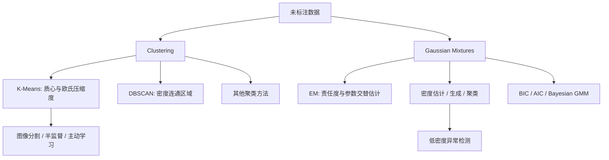

> 书目：*Hands-On Machine Learning with Scikit-Learn and PyTorch*<br>
> 章节：Chapter 8, Unsupervised Learning Techniques<br>
> 章节文件：8. Unsupervised Learning Techniques.md<br>
> 配套 Notebook：<https://homl.info/colab-p>

---

## 阅读导引

### 本章要回答什么问题

现实世界中，未标注数据远多于已标注数据。制造业可以每天自动拍摄数千张产品照片，但让专家逐张标记“合格/缺陷”非常昂贵；产品变化后还可能重新标注。

无监督学习只给模型输入 $\mathbf X$，没有目标 $\mathbf y$。本章集中讨论：

1. 怎样自动发现相似样本群体？
2. 怎样定义“相似”和“一个簇”？
3. 怎样利用少量人工标签与大量未标注数据？
4. 怎样识别低密度异常样本？
5. 怎样估计数据生成分布，并从中生成新样本？

### 三类任务

| 任务 | 目标 | 典型应用 |
| --- | --- | --- |
| 聚类 | 把相似实例分组 | 客户细分、图像搜索、半监督学习 |
| 异常检测 | 学习正常模式，找异常 | 欺诈、缺陷、趋势变化、数据清洗 |
| 密度估计 | 估计生成数据的概率密度 | 可视化、生成、异常检测 |

### 全章主线



### 一句话概括

$$
\boxed{
\text{无监督学习没有唯一正确答案，}
\text{算法选择本质上是在选择“结构”的定义}
}
$$

K-Means 把簇定义为靠近某个质心的球状区域；DBSCAN 把簇定义为密度连通区域；GMM 把数据看作多个高斯生成分布的混合。

### 评价边界

没有标签时，内部指标只能衡量算法自身偏好的结构：

- 低 inertia 不代表语义聚类正确；
- 高 silhouette 偏好紧凑、分离的簇；
- 高 likelihood 可能来自更复杂模型；
- 视觉上“像簇”不代表业务上有意义。

最佳评价通常结合：内部指标、稳定性、领域知识和下游任务表现。

---

## 0. 必要基础

### 0.1 距离与相似度

欧氏距离：

$$
d(\mathbf x,\mathbf c)
=\|\mathbf x-\mathbf c\|_2
=\sqrt{\sum_{j=1}^{n}(x_j-c_j)^2}
$$

平方欧氏距离省去平方根，排序不变，且便于求导：

$$
d^2(\mathbf x,\mathbf c)
=\sum_j(x_j-c_j)^2
$$

距离对特征尺度敏感。收入以元、年龄以年同时输入时，收入可能完全主导距离，所以距离算法通常需要缩放。

### 0.2 Hard 与 Soft Assignment

硬分配：

$$
z_i\in\{1,\ldots,k\}
$$

每个实例只属于一个簇。

软分配：

$$
\gamma_{ij}\in[0,1],
\qquad \sum_{j=1}^{k}\gamma_{ij}=1
$$

$\gamma_{ij}$ 表示实例 $i$ 属于簇 $j$ 的程度或概率。

K-Means 原生硬分配，但可用到各质心距离作为软特征；GMM 原生输出责任度概率。

### 0.3 概率密度不是概率

连续变量的概率密度 $p(\mathbf x)$ 可以大于 1；真正概率是区域积分：

$$
P(\mathbf X\in A)
=\int_Ap(\mathbf x)\,d\mathbf x
$$

整个空间积分必须为 1。

### 0.4 隐变量

GMM 中每个实例有一个不可见的簇变量：

$$
z_i\in\{1,\ldots,k\}
$$

只观察到 $\mathbf x_i$，不知道 $z_i$。EM 算法通过反复估计 $z_i$ 的概率分布和模型参数来训练。

---

## 1. 聚类及其应用

### 1.1 聚类与分类

分类：训练时已有类别标签，学习从特征到已知类别的映射。

聚类：没有标签，算法自行发现分组结构。

Iris 数据在二维图上看似两个群体，加入萼片特征后，GMM 可较好识别三个物种，仅错约 5/150 个。但簇编号本身没有语义，需要事后与类别对齐。

### 1.2 “簇”没有统一定义

不同算法寻找不同结构：

- 围绕质心的紧凑区域；
- 连续高密度区域；
- 椭圆概率分布；
- 层次化簇中簇；
- 图上的社区。

所以不能脱离任务问“哪个聚类算法最好”。

### 1.3 主要应用

#### 客户细分

按购买、访问行为分群，理解客户类型，定制产品、营销和推荐。

#### 数据分析

先分群，再分别分析各群，可发现总体统计掩盖的结构。

#### 降维

用到 $k$ 个簇的亲和度替代原 $n$ 维特征：

$$
\mathbf x
\mapsto
(a_1(\mathbf x),\ldots,a_k(\mathbf x))
$$

形成非线性 $k$ 维表示。

#### 特征工程

把簇距离/亲和度追加为监督模型输入，可表达位置或群体结构。

#### 异常检测

对所有簇亲和度都低的实例可能是异常。

#### 半监督学习

先聚类，再把少量代表样本标签传播给同簇样本。

#### 相似搜索

先定位查询图像所属簇，再在簇内检索相似图，减少搜索范围。

#### 图像分割

按颜色聚类像素并用中心色替换；更高级任务还包括语义分割和实例分割。

---

## 2. K-Means Clustering

### 2.1 模型假设

K-Means 假设数据可由 $k$ 个质心代表，每个样本属于最近质心。

需要预先指定：

$$
k=\text{簇数量}
$$

它偏好：

- 近似球形；
- 尺寸接近；
- 密度相近；
- 欧氏距离有意义的簇。

### 2.2 生成示例数据

```python
from sklearn.datasets import make_blobs

blob_centers = [
    [0.2, 2.3],
    [-1.5, 2.3],
    [-2.8, 1.8],
    [-2.8, 2.8],
    [-2.8, 1.3],
]
blob_std = [0.4, 0.3, 0.1, 0.1, 0.1]

X, hidden_cluster_ids = make_blobs(
    n_samples=2000,
    centers=blob_centers,
    cluster_std=blob_std,
    random_state=7,
)
```

`hidden_cluster_ids` 只用于验证生成结构，训练聚类时不使用。

### 2.3 训练与输出

```python
from sklearn.cluster import KMeans

kmeans = KMeans(n_clusters=5, n_init=10, random_state=43)
y_pred = kmeans.fit_predict(X)
```

```python
print(y_pred[:10])
print(y_pred is kmeans.labels_)
print(kmeans.cluster_centers_)
```

簇编号 0～4 是任意的，重新训练可能置换编号，不代表等级或固定语义。

### 2.4 新样本硬预测

```python
import numpy as np

X_new = np.array([
    [0, 2],
    [3, 2],
    [-3, 3],
    [-3, 2.5],
])
print(kmeans.predict(X_new))
```

参考输出：

```text
[1 1 2 2]
```

每个样本分给最近质心：

$$
z_i
=\arg\min_{j\in\{1,\ldots,k\}}
\|\mathbf x_i-\boldsymbol\mu_j\|_2
$$

### 2.5 Voronoi 分区

两个质心 $\boldsymbol\mu_a,\boldsymbol\mu_b$ 的边界满足：

$$
\|\mathbf x-\boldsymbol\mu_a\|^2
=\|\mathbf x-\boldsymbol\mu_b\|^2
$$

展开并消掉 $\mathbf x^\top\mathbf x$：

$$
2(\boldsymbol\mu_b-\boldsymbol\mu_a)^\top\mathbf x
=\|\boldsymbol\mu_b\|^2-\|\boldsymbol\mu_a\|^2
$$

这是一个超平面。因此 K-Means 形成 Voronoi 分区，每个区域到一个质心最近。

### 2.6 软特征：到各质心的距离

```python
print(kmeans.transform(X_new).round(2))
```

参考输出：

```text
[[2.81 0.33 2.90 1.49 2.89]
 [5.81 2.80 5.85 4.48 5.84]
 [1.21 3.29 0.29 1.69 1.71]
 [0.73 3.22 0.36 1.55 1.22]]
```

可把距离转为 Gaussian RBF 亲和度：

$$
a_j(\mathbf x)
=\exp\left(-\gamma
\|\mathbf x-\boldsymbol\mu_j\|^2
\right)
$$

距离向量或亲和度向量可用于降维和特征工程。

---

## 3. K-Means 算法

### 3.1 Lloyd 迭代

1. 初始化 $k$ 个质心；
2. Assignment：把每个样本分给最近质心；
3. Update：每个质心更新为所属样本均值；
4. 重复 2～3，直到分配或质心不再变化。

### 3.2 公式 8-1：Inertia

$$
\boxed{
J(\mathbf C,\boldsymbol\mu)
=\sum_{j=1}^{k}
\sum_{i\in C_j}
\|\mathbf x_i-\boldsymbol\mu_j\|_2^2
}
$$

也可写为：

$$
\operatorname{inertia}
=\sum_{i=1}^{m}
\|\mathbf x^{(i)}-\mathbf c^{(i)}\|_2^2
$$

- $C_j$：分给簇 $j$ 的样本集合；
- $\boldsymbol\mu_j$：簇 $j$ 质心；
- $\mathbf c^{(i)}$：样本 $i$ 最近的质心。

Inertia 是平方距离**总和**，不是均值。

### 3.3 为什么质心必须是均值

固定簇 $C_j$，只优化其质心：

$$
J_j(\boldsymbol\mu_j)
=\sum_{i\in C_j}
\|\mathbf x_i-\boldsymbol\mu_j\|^2
$$

梯度：

$$
\nabla_{\boldsymbol\mu_j}J_j
=2\sum_{i\in C_j}
(\boldsymbol\mu_j-\mathbf x_i)
$$

令梯度为 0：

$$
|C_j|\boldsymbol\mu_j
=\sum_{i\in C_j}\mathbf x_i
$$

$$
\boxed{
\boldsymbol\mu_j
=\frac1{|C_j|}
\sum_{i\in C_j}\mathbf x_i
}
$$

Hessian 为 $2|C_j|\mathbf I$，正定，所以均值是唯一最小点。

### 3.4 为什么 Assignment 步最优

固定质心后，目标可按样本拆开：

$$
J=\sum_i
\|\mathbf x_i-\boldsymbol\mu_{z_i}\|^2
$$

每个 $z_i$ 独立选择最近质心即可最小化自己的项。

### 3.5 为什么算法单调收敛

- Assignment 步固定质心，选择最优标签，$J$ 不增；
- Update 步固定标签，选择最优均值，$J$ 不增；
- 可能的离散分配数量有限；
- 所以最终会停在某个稳定分配。

但目标非凸，只保证局部最优，不保证全局最优。

### 3.6 复杂度

每轮需计算 $m$ 个样本到 $k$ 个中心的 $n$ 维距离：

$$
O(mkn)
$$

迭代 $T$ 轮：

$$
O(Tmkn)
$$

通常迭代次数少；没有聚类结构时存在更差的理论最坏情况。

---

## 4. 质心初始化

### 4.1 为什么初始化重要

不同初始质心可能收敛到不同局部最优。两个差解 inertia 可约为：

```text
219.58
600.36
```

较好解约：

```text
211.60
```

### 4.2 手工指定初值

```python
good_init = np.array([
    [-3, 3],
    [-3, 2],
    [-3, 1],
    [-1, 2],
    [0, 2],
])

kmeans = KMeans(
    n_clusters=5,
    init=good_init,
    n_init=1,
    random_state=42,
)
kmeans.fit(X)
```

### 4.3 多次初始化

`n_init` 控制完整算法运行次数，保留 inertia 最小的结果。

```python
kmeans = KMeans(
    n_clusters=5,
    init="random",
    n_init=10,
    random_state=2,
)
kmeans.fit(X)
print(kmeans.inertia_)  # 约 211.5985
print(kmeans.score(X))  # 负 inertia
```

`score()` 返回负值，因为 Scikit-Learn 评分遵循“越大越好”。

`n_init="auto"` 的实际次数依赖初始化方式和版本；需要可复现的运行次数时显式设置整数。

### 4.4 K-Means++

1. 从数据中均匀随机选第一个中心；
2. 对每个样本计算到已有最近中心的距离 $D(\mathbf x_i)$；
3. 按以下概率选下一个中心：

$$
P(\mathbf x_i\text{ 被选})
=\frac{D(\mathbf x_i)^2}
{\sum_{r=1}^{m}D(\mathbf x_r)^2}
$$

4. 重复直到选出 $k$ 个中心。

远离现有中心的点更可能被选，使初始中心分散，降低落入坏局部最优的风险。

```python
KMeans(
    n_clusters=5,
    init="k-means++",
    random_state=42,
)
```

Scikit-Learn 使用 greedy k-means++：每轮采样多个候选并挑其中最好。

---

## 5. 加速 K-Means

### 5.1 Elkan 算法

利用三角不等式：

$$
d(\mathbf x,\boldsymbol\mu_b)
\ge
d(\boldsymbol\mu_a,\boldsymbol\mu_b)
-d(\mathbf x,\boldsymbol\mu_a)
$$

维护样本到中心距离的上下界，证明某中心不可能更近时跳过实际距离计算。

```python
KMeans(n_clusters=5, algorithm="elkan")
```

簇分离良好、$k$ 较大时可能加速；维护边界有额外成本，某些数据反而更慢。

### 5.2 Mini-Batch K-Means

每轮只取一小批样本，增量移动质心：

```python
from sklearn.cluster import MiniBatchKMeans

minibatch_kmeans = MiniBatchKMeans(
    n_clusters=5,
    n_init=10,
    random_state=42,
)
minibatch_kmeans.fit(X)
print(minibatch_kmeans.inertia_)
```

参考 inertia：

```text
约 211.73（Scikit-Learn 1.9）
```

不同版本可能有轻微变化；通常略差于完整 K-Means 的 211.59854，但更快、内存更低，并支持 `partial_fit()`。

适用：

- 数据超内存；
- 在线/流式聚类；
- 可容忍轻微质量损失；
- 用 memmap 分批读取大数据。

---

## 6. 选择簇数量 $k$

### 6.1 为什么不能直接取最低 Inertia

增加 $k$ 总能让每个点离最近中心不更远：

$$
J_{k+1}\le J_k
$$

极端 $k=m$ 时每个样本一个簇：

$$
J_m=0
$$

所以最低 inertia 永远偏向最大 $k$。

示例：

| $k$ | inertia | 问题 |
| ---: | ---: | --- |
| 3 | 653.22 | 合并真实簇 |
| 5 | 211.60 | 合理 |
| 8 | 127.13 | 过度切分 |

### 6.2 Elbow 方法

画 $k$ 与 inertia。前期快速下降、后期收益变小时形成肘部。

本例肘部约在 $k=4$，但真实生成结构为 5 个簇，说明 Elbow 只是粗略启发式。

### 6.3 Silhouette Coefficient

对样本 $i$：

- $a(i)$：与同簇其他样本平均距离；
- $b(i)$：与最近其他簇所有样本平均距离的最小值。

轮廓系数：

$$
\boxed{
s(i)=\frac{b(i)-a(i)}
{\max(a(i),b(i))}
}
$$

取值：

$$
-1\le s(i)\le1
$$

解释：

- 接近 1：簇内紧密、远离其他簇；
- 接近 0：位于边界；
- 接近 -1：可能分错簇。

为什么范围成立？若 $b\ge a$：

$$
s=1-\frac ab\in[0,1]
$$

若 $a>b$：

$$
s=\frac ba-1\in[-1,0)
$$

整体 silhouette score 是样本系数平均。

```python
from sklearn.metrics import silhouette_score

print(silhouette_score(X, kmeans.labels_))
```

参考：

```text
0.655517642572828
```

### 6.4 Silhouette Diagram

每个簇一把“刀”：

- 高度：簇样本数；
- 横向宽度：排序后的 silhouette 系数；
- 虚线：整体平均分。

本例：

- $k=4$ 平均分略高，但一个簇很大；
- $k=5$ 各簇更均衡，结构更符合数据；
- $k=3,6$ 的簇质量较差。

### 6.5 内部指标的边界

Silhouette 也偏好紧凑、分离、凸形簇。对月牙、不同密度或业务定义簇，可能误导。

选择 $k$ 应结合：

- 内部指标；
- 聚类稳定性；
- 业务可解释性；
- 下游任务效果；
- 对簇规模的需求。

---

## 7. K-Means 的局限

### 7.1 隐含几何假设

最近质心 + 欧氏平方距离隐含：

- 簇近似球形；
- 规模相近；
- 密度相近；
- 方向差异不大。

椭圆、不同密度和不同尺寸簇会被错误切割。

### 7.2 Inertia 低也可能语义更差

椭圆数据上两个解：

```text
解 A inertia ≈ 2242.6，聚类较合理但仍有错
解 B inertia ≈ 2179.6，数值更低但聚类明显更差
```

Inertia 只衡量欧氏压缩度，不知道真实业务簇。

### 7.3 其他局限

- 必须给 $k$；
- 依赖初始化；
- 对特征尺度敏感；
- 对异常值敏感，均值会被拉动；
- 不能自然识别噪声点；
- 只能形成 Voronoi 凸区域；
- 类别/混合类型数据不宜直接使用均值。

替代：

- 椭圆簇：Gaussian Mixture；
- 任意形状、高密度区域：DBSCAN/HDBSCAN；
- 大数据：MiniBatchKMeans/BIRCH；
- 层次结构：Agglomerative Clustering。

---

## 8. 聚类用于图像分割

### 8.1 颜色分割

把每个像素 RGB 看成三维样本：

$$
\mathbf x_i=(R_i,G_i,B_i)
$$

对所有像素做 K-Means，再把像素替换成所属质心颜色。

```python
from pathlib import Path
import matplotlib.pyplot as plt
import numpy as np
from sklearn.cluster import KMeans

image = plt.imread(Path("images/ladybug.png"))
X_colors = image.reshape(-1, 3)

kmeans = KMeans(n_clusters=8, random_state=42)
segmented_colors = kmeans.fit_predict(X_colors)

segmented_image = kmeans.cluster_centers_[segmented_colors]
segmented_image = segmented_image.reshape(image.shape)

plt.imshow(segmented_image)
plt.axis("off")
plt.show()
```

示例图像形状约 `(533, 800, 3)`，展开为 `426400×3`。

### 8.2 它实际上做了什么

这是**颜色量化**：

$$
(R,G,B)
\mapsto
\boldsymbol\mu_{z_i}
$$

颜色数从最多数十万降到 $k$ 种，也形成粗略颜色区域。

### 8.3 为什么小物体颜色会消失

$k$ 较小时，K-Means 优先降低总平方误差。瓢虫鲜红像素面积很小，即使颜色独特，对总 inertia 的贡献可能小于大片背景的细微色差，于是红色被并入背景簇。

这说明 K-Means 不理解“物体”，只优化像素颜色压缩。

### 8.4 分割类型对比

| 类型 | 输出 |
| --- | --- |
| 颜色分割 | 相似颜色区域 |
| 语义分割 | 每像素类别，如“道路/人” |
| 实例分割 | 区分同类不同对象，如“人1/人2” |

K-Means 颜色分割不是语义或实例分割。

---

## 9. 聚类用于半监督学习

### 9.1 问题从哪来

有大量未标注样本，只有少量标签。若随机挑 50 个样本标注，它们可能重复覆盖相似区域，代表性差。

聚类可选择覆盖整个数据结构的代表样本。

### 9.2 基线实验

Digits 数据集：1797 张 8×8 图像。

```python
from sklearn.datasets import load_digits
from sklearn.linear_model import LogisticRegression

X_digits, y_digits = load_digits(return_X_y=True)
X_train, y_train = X_digits[:1400], y_digits[:1400]
X_test, y_test = X_digits[1400:], y_digits[1400:]

log_reg = LogisticRegression(max_iter=10_000)
log_reg.fit(X_train[:50], y_train[:50])
print(log_reg.score(X_test, y_test))
```

只用前 50 个标签：

```text
0.7581863979848866
```

全部 1400 个标签：

```text
0.9093198992443325
```

### 9.3 代表样本标注

先聚为 50 簇：

```python
k = 50
kmeans = KMeans(n_clusters=k, random_state=42)
X_digits_dist = kmeans.fit_transform(X_train)

representative_indices = np.argmin(X_digits_dist, axis=0)
X_representative = X_train[representative_indices]
```

请专家为这 50 个代表图像标注，训练：

```python
y_representative = np.array([
    8, 0, 1, 3, 6, 7, 5, 4, 2, 8,
    2, 3, 9, 5, 3, 9, 1, 7, 9, 1,
    4, 6, 9, 7, 5, 2, 2, 1, 3, 3,
    6, 0, 4, 9, 8, 1, 8, 4, 2, 4,
    2, 3, 9, 7, 8, 9, 6, 5, 6, 4,
])

log_reg = LogisticRegression(max_iter=10_000)
log_reg.fit(X_representative, y_representative)
print(log_reg.score(X_test, y_test))
```

参考：

```text
0.8337531486146096
```

同样只标 50 张，代表性选择显著优于直接取前 50 张。

### 9.4 Label Propagation

把每个质心代表标签传播给该簇全部样本：

```python
y_train_propagated = np.empty(len(X_train), dtype=np.int64)

for cluster_id in range(k):
    y_train_propagated[kmeans.labels_ == cluster_id] = (
        y_representative[cluster_id]
    )

log_reg.fit(X_train, y_train_propagated)
print(log_reg.score(X_test, y_test))
```

参考：

```text
0.8690176322418136
```

### 9.5 为什么全簇传播会引入错误

K-Means 簇并不纯，边界样本可能与质心代表类别不同。错误伪标签会污染监督训练。

可只保留每簇离质心最近的 50%：

```python
percentile_closest = 50
X_cluster_dist = X_digits_dist[np.arange(len(X_train)), kmeans.labels_]

for cluster_id in range(k):
    in_cluster = kmeans.labels_ == cluster_id
    cutoff = np.percentile(
        X_cluster_dist[in_cluster],
        percentile_closest,
    )
    X_cluster_dist[in_cluster & (X_cluster_dist > cutoff)] = -1

partially_propagated = X_cluster_dist != -1
X_train_partial = X_train[partially_propagated]
y_train_partial = y_train_propagated[partially_propagated]

log_reg.fit(X_train_partial, y_train_partial)
print(log_reg.score(X_test, y_test))
```

参考：

```text
0.8841309823677582
```

保留伪标签准确率约：

```text
0.9887798036465638
```

减少伪标签数量，却提高标签质量和测试表现。

### 9.6 Label Propagation 的假设与边界

隐含假设：同一簇大多同类，即 cluster assumption。

会失败于：

- 一个簇包含多个真实类别；
- 聚类距离与标签语义不一致；
- 标签边界穿过高密度区域；
- 代表点被误标；
- 类别极不平衡。

现成方法：

- `LabelPropagation`；
- `LabelSpreading`；
- `SelfTrainingClassifier`。

所有伪标签生成必须只使用训练数据，不能窥探测试集。

---

## 10. Active Learning

### 10.1 核心思想

不是一次性随机标注，而是让模型主动选择“最值得标”的样本。

不确定性采样流程：

1. 用当前已标注数据训练模型；
2. 对未标注样本预测概率；
3. 找最大类别概率最低的样本；
4. 请专家标注；
5. 加入训练集并重训；
6. 直到收益不值得标注成本。

不确定性可定义为：

$$
u(\mathbf x)
=1-\max_k\hat P(y=k\mid\mathbf x)
$$

选 $u$ 最大的样本。

### 10.2 其他查询策略

- 最大模型参数变化；
- 最大预计验证误差下降；
- Query-by-Committee：多个模型分歧最大；
- 代表性 + 不确定性的混合；
- 多样性批量采样，避免一次选到大量近重复样本。

### 10.3 适用边界

- 标注昂贵，如医疗、工业检测、法律文本；
- 模型概率需较可靠；
- 极端异常样本可能最不确定但无代表性；
- 专家反馈时间和模型重训成本需计入；
- 采样改变标签分布，评估集必须独立、固定、具有代表性。

---

## 11. DBSCAN

### 11.1 为什么需要密度聚类

K-Means 只能形成质心 Voronoi 区域，难以识别月牙、环形等任意形状簇，也不会自然标噪声。

DBSCAN 把簇定义为**连续高密度区域**。

全称：Density-Based Spatial Clustering of Applications with Noise。

### 11.2 两个超参数

- `eps=\varepsilon`：邻域半径；
- `min_samples`：核心点邻域所需最少样本数，包含自身。

邻域：

$$
N_\varepsilon(\mathbf x_i)
=\{\mathbf x_j:d(\mathbf x_i,\mathbf x_j)\le\varepsilon\}
$$

### 11.3 三类点

#### Core Point

$$
|N_\varepsilon(\mathbf x_i)|
\ge\text{min\_samples}
$$

#### Border Point

自身不是核心点，但落在某核心点邻域中。

#### Noise/Anomaly

既不是核心点，也不在任何核心点邻域中，标签为 `-1`。

### 11.4 密度可达与簇

若核心点 A 与 B 的邻域相连，可以通过核心点链互相到达，则属于同一密度连通簇。边界点附着到相邻核心簇。

这允许形成任意形状簇。

### 11.5 Moons 实验

```python
from sklearn.cluster import DBSCAN
from sklearn.datasets import make_moons

X, y = make_moons(
    n_samples=1000,
    noise=0.05,
    random_state=42,
)

dbscan = DBSCAN(eps=0.05, min_samples=5)
dbscan.fit(X)

print(dbscan.labels_[:10])
print(dbscan.core_sample_indices_[:10])
print(dbscan.components_[:3])
```

`eps=0.05` 邻域太窄，得到 7 簇和大量噪声。改为：

```python
dbscan = DBSCAN(eps=0.2, min_samples=5)
dbscan.fit(X)
```

能较好得到两个月牙。

### 11.6 参数作用

#### 增大 `eps`

- 邻域更大；
- 核心点增多；
- 噪声减少；
- 簇可能合并。

#### 增大 `min_samples`

- 密度要求更严格；
- 核心点减少；
- 噪声增加；
- 小簇可能消失。

特征缩放非常重要，否则 `eps` 在各维含义不同。

### 11.7 为什么没有 `predict()`

DBSCAN 定义的是训练样本的密度连通结构。新样本归属存在多种合理策略：

- 最近核心点；
- KNN；
- 半径内投票；
- 超过距离阈值判异常。

库不强制一种语义，所以只提供 `fit_predict()`，没有通用 `predict()`。

### 11.8 用 KNN 预测新样本

```python
from sklearn.neighbors import KNeighborsClassifier

knn = KNeighborsClassifier(n_neighbors=50)
knn.fit(
    dbscan.components_,
    dbscan.labels_[dbscan.core_sample_indices_],
)

X_new = np.array([
    [-0.5, 0],
    [0, 0.5],
    [1, -0.1],
    [2, 1],
])

print(knn.predict(X_new))
print(knn.predict_proba(X_new))
```

参考硬预测：

```text
[1 0 1 0]
```

KNN 总会选一个簇，即使新点很远。可用 1-NN 距离阈值补异常：

```python
y_dist, y_index = knn.kneighbors(
    X_new,
    n_neighbors=1,
)

y_pred = dbscan.labels_[dbscan.core_sample_indices_][y_index[:, 0]]
y_pred[y_dist[:, 0] > 0.2] = -1
print(y_pred)
```

参考：

```text
[-1  0  1 -1]
```

### 11.9 优势与局限

优势：

- 不需要预设簇数；
- 任意形状簇；
- 原生识别噪声；
- 只有两个主要超参数。

局限：

- 不同密度簇难用同一 `eps`；
- 簇间没有低密度谷时会合并；
- 高维距离退化；
- 对缩放和度量敏感；
- 最坏时间/内存可达平方级；
- 没有自然新样本预测。

HDBSCAN 更适合密度变化明显的数据。

---

## 12. 其他聚类算法

### 12.1 Agglomerative Clustering

从每个样本一个簇开始，反复合并最接近的簇，得到层次树（dendrogram）。

Linkage 定义簇间距离：

- single：最近点；
- complete：最远点；
- average：平均距离；
- ward：最小化方差增加。

适合探索层次结构，可配任意成对距离；大样本可能昂贵。

### 12.2 BIRCH

Balanced Iterative Reducing and Clustering using Hierarchies。

用 Clustering Feature Tree 压缩数据摘要，适合超大数据、特征数不太高（经验上约小于 20）的场景。

### 12.3 Mean-Shift

在每个点周围放核窗口，沿密度上升方向移动到局部密度峰值。

- 不需预设簇数；
- 可找任意形状；
- 主要参数是 bandwidth；
- 密度内部变化会把同簇切碎；
- 复杂度约平方级。

### 12.4 Affinity Propagation

样本之间传递 responsibility 与 availability 消息，自动选择 exemplar（代表点）和簇数。

- 不需给 $k$；
- 复杂度和内存约 $O(m^2)$；
- 对 preference 和 damping 敏感。

### 12.5 Spectral Clustering

1. 构造样本相似图；
2. 对图 Laplacian 做特征分解；
3. 在低维谱表示中 K-Means。

适合环形、月牙等复杂结构。局限：大样本昂贵，对相似度 `gamma` 和簇尺度差异敏感。

---

## 13. Gaussian Mixture Models

### 13.1 从 K-Means 到概率生成模型

K-Means 只有质心和硬分区，无法表达：

- 椭圆方向；
- 不同簇方差；
- 软归属概率；
- 数据密度；
- 新样本生成。

Gaussian Mixture Model（GMM）假设数据由 $k$ 个高斯分布混合生成。

### 13.2 生成过程

对每个样本 $i$：

1. 先抽隐含成分：

$$
z_i\sim\operatorname{Categorical}(\boldsymbol\phi)
$$

2. 若 $z_i=j$，再从第 $j$ 个高斯抽样：

$$
\mathbf x_i\mid z_i=j
\sim
\mathcal N(\boldsymbol\mu_j,\boldsymbol\Sigma_j)
$$

参数：

- $\phi_j\ge0$：混合权重；
- $\sum_j\phi_j=1$；
- $\boldsymbol\mu_j\in\mathbb R^n$：均值；
- $\boldsymbol\Sigma_j\in\mathbb R^{n\times n}$：协方差。

边缘密度：

$$
\boxed{
p(\mathbf x)
=\sum_{j=1}^{k}
\phi_j
\mathcal N(
\mathbf x\mid
\boldsymbol\mu_j,
\boldsymbol\Sigma_j
)
}
$$

### 13.3 多元高斯密度

$$
\mathcal N(\mathbf x\mid\boldsymbol\mu,\boldsymbol\Sigma)
=\frac{
\exp\left[
-\frac12
(\mathbf x-\boldsymbol\mu)^\top
\boldsymbol\Sigma^{-1}
(\mathbf x-\boldsymbol\mu)
\right]
}{
(2\pi)^{n/2}|\boldsymbol\Sigma|^{1/2}
}
$$

指数中的平方 Mahalanobis 距离：

$$
d_M^2
=(\mathbf x-\boldsymbol\mu)^\top
\boldsymbol\Sigma^{-1}
(\mathbf x-\boldsymbol\mu)
$$

协方差决定椭圆：

- 特征向量：主轴方向；
- 特征值：轴方差；
- 均值：椭圆中心。

### 13.4 训练 GMM

```python
from sklearn.mixture import GaussianMixture

gm = GaussianMixture(
    n_components=3,
    n_init=10,
    random_state=42,
)
gm.fit(X)

print(gm.weights_)
print(gm.means_)
print(gm.covariances_)
print(gm.converged_, gm.n_iter_)
```

参考：

```text
weights ≈ [0.4001, 0.2096, 0.3903]
converged = True
n_iter = 4
```

成分编号可任意置换，不应按数组位置解释固定语义。

---

## 14. EM 算法

### 14.1 难点

若知道每个 $z_i$，各高斯参数可直接加权统计；若知道参数，可用 Bayes 计算 $z_i$ 概率。但两者都未知。

Expectation-Maximization 交替解决：

- E step：固定参数，估计隐变量责任度；
- M step：固定责任度，更新参数。

### 14.2 完整数据对数似然

若 $z_i$ 已知：

$$
\ell_c(\boldsymbol\theta)
=\sum_{i=1}^{m}
\sum_{j=1}^{k}
\mathbf1[z_i=j]
\left[
\log\phi_j
+\log\mathcal N(
\mathbf x_i\mid\boldsymbol\mu_j,\boldsymbol\Sigma_j
)
\right]
$$

### 14.3 E Step：责任度

责任度：

$$
\gamma_{ij}
=P(z_i=j\mid\mathbf x_i)
$$

Bayes：

$$
\boxed{
\gamma_{ij}
=\frac{
\phi_j
\mathcal N(\mathbf x_i\mid\boldsymbol\mu_j,\boldsymbol\Sigma_j)
}{
\sum_{r=1}^{k}
\phi_r
\mathcal N(\mathbf x_i\mid\boldsymbol\mu_r,\boldsymbol\Sigma_r)
}
}
$$

每行满足：

$$
\sum_j\gamma_{ij}=1
$$

### 14.4 M Step：更新混合权重

定义有效样本数：

$$
N_j=\sum_{i=1}^{m}\gamma_{ij}
$$

权重更新：

$$
\boxed{
\phi_j=\frac{N_j}{m}
}
$$

所以 $\sum_j\phi_j=1$。

### 14.5 M Step：更新均值

最大化期望完整对数似然：

$$
Q
=\sum_{i,j}\gamma_{ij}
\left[
\log\phi_j+
\log\mathcal N(
\mathbf x_i\mid\boldsymbol\mu_j,\boldsymbol\Sigma_j
)
\right]
$$

对 $\boldsymbol\mu_j$ 求导并令零，得到责任度加权均值：

$$
\boxed{
\boldsymbol\mu_j
=\frac1{N_j}
\sum_{i=1}^{m}
\gamma_{ij}\mathbf x_i
}
$$

### 14.6 M Step：更新协方差

$$
\boxed{
\boldsymbol\Sigma_j
=\frac1{N_j}
\sum_{i=1}^{m}
\gamma_{ij}
(\mathbf x_i-\boldsymbol\mu_j)
(\mathbf x_i-\boldsymbol\mu_j)^\top
}
$$

每个样本按属于该成分的责任度贡献协方差。

### 14.7 为什么 EM 单调改进似然

观测对数似然：

$$
\ell(\theta)
=\sum_i
\log\sum_j
\phi_j\mathcal N_j(\mathbf x_i)
$$

引入任意分布 $q_{ij}$，由 Jensen 不等式：

$$
\log\sum_jq_{ij}
\frac{\phi_j\mathcal N_j(\mathbf x_i)}{q_{ij}}
\ge
\sum_jq_{ij}
\log\frac{\phi_j\mathcal N_j(\mathbf x_i)}{q_{ij}}
$$

E 步取 $q_{ij}=\gamma_{ij}$，使下界在当前参数处紧；M 步最大化下界。因此每轮观测似然不下降。

但似然非凸，只保证收敛到局部最优。`n_init=10` 用不同初始化，保留最佳解。

### 14.8 与 K-Means 的关系

K-Means 可看作特殊极限：

- 各簇球形、相同极小方差；
- 责任度趋近 0/1 硬分配；
- 均值更新相同；
- GMM 还能表达概率、方差和椭圆方向。

---

## 15. GMM 的预测、生成与密度

### 15.1 Hard 与 Soft 聚类

```python
print(gm.predict(X[:5]))
print(gm.predict_proba(X[:5]))
```

`predict()` 取最大责任度：

$$
\hat z_i=\arg\max_j\gamma_{ij}
$$

`predict_proba()` 返回完整责任度。

### 15.2 生成新样本

GMM 是生成模型：

```python
X_new, y_new = gm.sample(6)
print(X_new)
print(y_new)
```

先按 $\boldsymbol\phi$ 抽成分，再从对应高斯抽点。

### 15.3 Log Density

```python
log_densities = gm.score_samples(X)
densities = np.exp(log_densities)
```

`score_samples()` 返回：

$$
\log p(\mathbf x_i)
$$

不是概率。指数后是密度，也可大于 1；只有区域积分才是概率。

### 15.4 协方差类型

| `covariance_type` | 假设 | 参数量/形状 | 适用 |
| --- | --- | --- | --- |
| `full` | 每簇完整协方差 | 每簇 $n(n+1)/2$ | 任意椭圆，最灵活 |
| `tied` | 所有簇共享完整协方差 | 共用一个矩阵 | 相同形状方向 |
| `diag` | 每簇对角协方差 | 每簇 $n$ | 轴对齐椭圆 |
| `spherical` | 每簇单方差 | 每簇 1 | 球形簇，最快 |

复杂度量级：

- spherical/diag：$O(kmn)$；
- tied/full：$O(kmn^2+kn^3)$。

高维完整协方差昂贵且易奇异，可先 PCA、正则协方差或用 diag。

---

## 16. GMM 用于异常检测

### 16.1 低密度原则

正常样本通常位于高密度区域，异常样本位于低密度区域。

```python
log_densities = gm.score_samples(X)
threshold = np.percentile(log_densities, 2)
anomalies = X[log_densities < threshold]
```

选第 2 百分位，约把 2% 训练样本标为异常。

### 16.2 阈值权衡

- 提高阈值：更多样本判异常，召回升、误报升；
- 降低阈值：更保守，误报降、漏检升。

阈值应依据：

- 业务误报/漏报成本；
- 已标验证异常；
- 允许污染率；
- 运营审核能力。

### 16.3 Anomaly vs Novelty Detection

| | Anomaly Detection | Novelty Detection |
| --- | --- | --- |
| 训练集 | 允许含异常污染 | 假设干净 |
| 目标 | 找训练/新样本异常 | 判断新样本是否偏离正常分布 |
| 常见用途 | 数据清洗、离群检测 | 上线监控、新型模式 |

### 16.4 GMM 的污染问题

GMM 会努力拟合全部数据，异常过多会形成额外成分或拉宽协方差，使异常看起来正常。

可：

1. 初次拟合；
2. 删除最极端低密度点；
3. 在清洗数据上重训；
4. 或使用鲁棒协方差 `EllipticEnvelope`。

---

## 17. 选择 GMM 成分数量

### 17.1 为什么不能只看 Likelihood

成分越多，模型越灵活，训练 likelihood 通常越高，可能无限制复杂化。需要惩罚参数数量。

### 17.2 公式 8-2：BIC 与 AIC

$$
\boxed{
\operatorname{BIC}
=\log(m)p
-2\log\widehat{\mathcal L}
}
$$

$$
\boxed{
\operatorname{AIC}
=2p
-2\log\widehat{\mathcal L}
}
$$

- $m$：样本数；
- $p$：可学习参数数；
- $\widehat{\mathcal L}$：最大化后的 likelihood。

越小越好：拟合项 $-2\log L$ 奖励高似然，复杂度项惩罚参数数。

### 17.3 Full GMM 参数数

$k$ 个成分、$n$ 维：

#### 混合权重

$k$ 个权重和为 1，自由参数：

$$
k-1
$$

#### 均值

$$
kn
$$

#### 对称协方差

每簇：

$$
\frac{n(n+1)}2
$$

总参数：

$$
\boxed{
p=(k-1)+kn+k\frac{n(n+1)}2
}
$$

$m=1250,k=3,n=2$：

$$
p=2+6+3\times3=17
$$

### 17.4 数值例子

```python
print(gm.bic(X))
print(gm.aic(X))
```

参考：

```text
BIC = 8189.7337
AIC = 8102.5084
```

两者扫描不同 $k$，本例均在 $k=3$ 最小。

BIC 的惩罚 $\log(m)p$ 在大样本时通常大于 AIC 的 $2p$，所以 BIC 更偏向简单模型。

### 17.5 Likelihood 不是参数概率

固定数据 $X$，likelihood：

$$
\mathcal L(\theta;X)=p(X\mid\theta)
$$

它是参数的函数，但不是 $p(\theta\mid X)$，对 $\theta$ 积分不必为 1。

最大似然：

$$
\hat\theta_{MLE}
=\arg\max_\theta\mathcal L(\theta;X)
$$

加入先验做 MAP：

$$
\hat\theta_{MAP}
=\arg\max_\theta
p(X\mid\theta)p(\theta)
$$

---

## 18. Bayesian Gaussian Mixture

### 18.1 自动关闭多余成分

先给一个较大的最大成分数，通过稀疏先验把不必要权重压到接近 0。

```python
from sklearn.mixture import BayesianGaussianMixture

bgm = BayesianGaussianMixture(
    n_components=10,
    n_init=10,
    max_iter=500,
    random_state=42,
)
bgm.fit(X)
print(bgm.weights_.round(2))
```

参考：

```text
[0.40 0.21 0.39 0.00 0.00 0.00 0.00 0.00 0.00 0.00]
```

自动保留 3 个有效成分。

### 18.2 为什么不是“完全不用选择”

仍需设置足够大的 `n_components` 上限，并调先验强度。上限太小会欠拟合，先验不合适可能保留/删除错误成分。

### 18.3 非椭圆簇局限

在 Moons 数据上，Bayesian GMM 会用多个椭圆片段逼近月牙，可能得到 8 个成分而非语义上的 2 簇。

密度估计可能尚可，但聚类语义失败。模型适合与否取决于目标。

---

## 19. 其他异常与新颖性检测算法

### 19.1 EllipticEnvelope / Fast-MCD

鲁棒估计单个高斯中心和协方差，适合椭圆正常数据与少量污染。

不适合多峰或任意形状正常分布。

### 19.2 Isolation Forest

随机选特征和阈值递归隔离样本。异常点稀少、位置独特，通常用更短路径即可隔离。

适合高维、大数据，能处理非高斯结构。

### 19.3 Local Outlier Factor

比较某点局部密度与邻居局部密度。若比邻居明显稀疏，则异常。

适合局部密度差异，但对邻居数和高维距离敏感。

### 19.4 One-Class SVM

在特征空间寻找包围大部分训练样本的小区域，区域外判新颖。

- 更适合干净训练集 novelty detection；
- 核参数和 `nu` 需调节；
- 大数据扩展较差。

### 19.5 重建误差

PCA、自编码器等只学习正常数据结构。异常样本无法良好重建：

$$
e(\mathbf x)
=\|\mathbf x-\hat{\mathbf x}\|^2
$$

高重建误差判异常。适合图像、传感器等结构化高维数据。

---

## 20. 章末练习与参考答案

### 练习 1：定义聚类并列举算法

聚类是在没有目标标签时，按任务相关的相似性把实例分组。

算法：

- K-Means / MiniBatchKMeans；
- DBSCAN / HDBSCAN；
- Agglomerative Clustering；
- BIRCH；
- Mean-Shift；
- Affinity Propagation；
- Spectral Clustering；
- Gaussian Mixture。

### 练习 2：聚类的主要应用

- 客户细分；
- 数据探索；
- 推荐与相似搜索；
- 图像颜色/语义分割辅助；
- 降维和特征工程；
- 半监督标签传播；
- 主动学习代表样本选择；
- 异常检测；
- 下游模型分群建模。

### 练习 3：K-Means 怎样选择 $k$

两种主要方法：

1. Inertia 曲线的 Elbow；
2. Silhouette Score 峰值与 Silhouette Diagram。

还应检查稳定性、簇规模、业务解释和下游性能。Inertia 是平方距离总和，不是均方距离。

### 练习 4：什么是 Label Propagation

先聚类，为代表样本标注，再把标签传播给同簇未标样本。

动机：用少量专家成本扩充监督数据。

改进：

- 只传播给靠近质心的高置信样本；
- 多代表点多数票；
- 图标签传播；
- 迭代 Self-Training；
- 人工审核低置信样本。

### 练习 5：可扩展与密度聚类算法

可扩展：

- K-Means / MiniBatchKMeans；
- BIRCH。

寻找高密度区域：

- DBSCAN/HDBSCAN；
- Mean-Shift。

### 练习 6：Active Learning 场景

场景：医疗影像只有专家可标，标注昂贵。

实现：

1. 少量初始代表样本；
2. 训练概率分类器；
3. 从未标池选最不确定且彼此多样的批次；
4. 专家标注；
5. 重训并记录验证收益；
6. 当边际收益低于成本时停止。

需要固定独立测试集，避免主动选择污染评估。

### 练习 7：Anomaly 与 Novelty 的区别

- Anomaly Detection：训练集允许含异常，目标包括识别训练和新数据离群点；
- Novelty Detection：训练集假设干净，只学习正常边界并判断新样本。

### 练习 8：什么是 Gaussian Mixture

GMM 是有限个高斯分布的加权混合：

$$
p(x)=\sum_j\phi_j\mathcal N(x\mid\mu_j,\Sigma_j)
$$

用途：

- 软/硬聚类；
- 密度估计；
- 生成样本；
- 异常检测；
- 概率建模；
- 缺失隐含类别推断。

### 练习 9：GMM 怎样选择成分数

1. 比较不同 $k$ 的 BIC/AIC，取最小；
2. BayesianGaussianMixture 给较大上限，通过先验压低多余成分。

还可用验证 likelihood 或下游任务，但不能只比较训练 likelihood。

### 练习 10：Olivetti 人脸聚类

#### 加载和分层划分

`fetch_olivetti_faces()` 首次运行需要联网下载；若镜像返回 403，应手动准备缓存或更换可访问的数据源。

```python
from sklearn.datasets import fetch_olivetti_faces
from sklearn.model_selection import StratifiedShuffleSplit

faces = fetch_olivetti_faces()
X_faces = faces.data          # (400, 4096)
y_people = faces.target       # 40 人，每人 10 张

split1 = StratifiedShuffleSplit(
    n_splits=1,
    test_size=40,
    random_state=42,
)
train_valid_idx, test_idx = next(split1.split(X_faces, y_people))

X_train_valid = X_faces[train_valid_idx]
y_train_valid = y_people[train_valid_idx]
X_test_faces = X_faces[test_idx]
y_test_faces = y_people[test_idx]

split2 = StratifiedShuffleSplit(
    n_splits=1,
    test_size=80,
    random_state=43,
)
train_idx, valid_idx = next(split2.split(X_train_valid, y_train_valid))

X_train_faces = X_train_valid[train_idx]   # (280,4096)
y_train_faces = y_train_valid[train_idx]
X_valid_faces = X_train_valid[valid_idx]   # (80,4096)
y_valid_faces = y_train_valid[valid_idx]
```

#### PCA 99%

```python
from sklearn.decomposition import PCA

pca = PCA(n_components=0.99, whiten=True, random_state=42)
X_train_pca = pca.fit_transform(X_train_faces)
X_valid_pca = pca.transform(X_valid_faces)
X_test_pca = pca.transform(X_test_faces)

print(pca.n_components_)  # 参考约 199
```

#### 扫描 K-Means

```python
import numpy as np
from sklearn.cluster import KMeans
from sklearn.metrics import silhouette_score

k_values = range(5, 150, 5)
models = []
scores = []

for k in k_values:
    model = KMeans(n_clusters=k, n_init=10, random_state=42)
    labels = model.fit_predict(X_train_pca)
    score = silhouette_score(X_train_pca, labels)
    models.append(model)
    scores.append(score)

best_index = int(np.argmax(scores))
best_k = list(k_values)[best_index]
best_kmeans = models[best_index]
print(best_k)
```

一次参考输出为 75，但 $k$ 对版本、PCA 和随机性敏感；应结合 silhouette 图、簇内人脸、inertia 与业务目标判断，不能机械相信一个数字。

### 练习 11：聚类特征能否提升分类

```python
from sklearn.ensemble import RandomForestClassifier
from sklearn.metrics import accuracy_score

rf_pca = RandomForestClassifier(n_estimators=150, random_state=42)
rf_pca.fit(X_train_pca, y_train_faces)
print(accuracy_score(y_valid_faces, rf_pca.predict(X_valid_pca)))
X_train_dist = best_kmeans.transform(X_train_pca)
X_valid_dist = best_kmeans.transform(X_valid_pca)
rf_dist = RandomForestClassifier(n_estimators=150, random_state=42)
rf_dist.fit(X_train_dist, y_train_faces)
print(accuracy_score(y_valid_faces, rf_dist.predict(X_valid_dist)))
X_train_aug = np.c_[X_train_pca, X_train_dist]
X_valid_aug = np.c_[X_valid_pca, X_valid_dist]
rf_aug = RandomForestClassifier(n_estimators=150, random_state=42)
rf_aug.fit(X_train_aug, y_train_faces)
print(accuracy_score(y_valid_faces, rf_aug.predict(X_valid_aug)))
```

本例聚类特征没有提升，说明特征工程必须验证。人脸身份的细粒度方向可能被粗糙簇距离丢失。

### 练习 12：GMM 生成脸并检测修改脸

```python
from sklearn.mixture import GaussianMixture

gm_faces = GaussianMixture(
    n_components=40,
    random_state=42,
)
gm_faces.fit(X_train_pca)

generated_pca, component_ids = gm_faces.sample(20)
generated_faces = pca.inverse_transform(generated_pca)
```

构造异常：

```python
normal_faces = X_train_faces[:10].copy()

anomalous_faces = normal_faces.copy().reshape(-1, 64, 64)
anomalous_faces[:4] = anomalous_faces[:4].transpose(0, 2, 1)
anomalous_faces[4:7] = anomalous_faces[4:7, ::-1]
anomalous_faces[7:] *= 0.3
anomalous_faces = anomalous_faces.reshape(-1, 4096)

normal_scores = gm_faces.score_samples(pca.transform(normal_faces))
anomaly_scores = gm_faces.score_samples(pca.transform(anomalous_faces))

print(normal_scores)
print(anomaly_scores)
```

正常脸 log-density 参考约 1000 左右；修改脸可降到巨大负数，明显异常。数值依赖版本和模型正则化。

### 练习 13：PCA 重建误差检测异常

```python
normal_reconstructed = pca.inverse_transform(
    pca.transform(normal_faces)
)
anomaly_reconstructed = pca.inverse_transform(
    pca.transform(anomalous_faces)
)

normal_mse = np.mean(
    (normal_faces - normal_reconstructed) ** 2,
    axis=1,
)
anomaly_mse = np.mean(
    (anomalous_faces - anomaly_reconstructed) ** 2,
    axis=1,
)

print(normal_mse.mean())
print(anomaly_mse.mean())
```

参考：

```text
正常脸平均 MSE ≈ 0.000192
修改脸平均 MSE ≈ 0.004707
```

异常约高 24.5 倍。PCA 只能用“正常脸子空间”重建，异常结构会被拉回正常模式，残差变大。

---

## 21. 完整可运行的主线示例

```python
import numpy as np
from sklearn.cluster import DBSCAN, KMeans
from sklearn.datasets import make_blobs, make_moons
from sklearn.metrics import silhouette_score
from sklearn.mixture import GaussianMixture


centers = [[0, 0], [3, 3], [-3, 3]]
X, _ = make_blobs(
    n_samples=600,
    centers=centers,
    cluster_std=[0.5, 0.7, 0.4],
    random_state=42,
)

kmeans = KMeans(n_clusters=3, n_init=10, random_state=42)
labels = kmeans.fit_predict(X)

print("K-Means inertia:", kmeans.inertia_)
print("Silhouette:", silhouette_score(X, labels))
print("Centroids:\n", kmeans.cluster_centers_)


X_moons, _ = make_moons(
    n_samples=1000,
    noise=0.05,
    random_state=42,
)
dbscan = DBSCAN(eps=0.2, min_samples=5)
moon_labels = dbscan.fit_predict(X_moons)

cluster_ids = set(moon_labels) - {-1}
print("DBSCAN clusters:", len(cluster_ids))
print("DBSCAN anomalies:", np.sum(moon_labels == -1))


gm = GaussianMixture(
    n_components=3,
    n_init=10,
    random_state=42,
)
gm.fit(X)

print("GMM weights:", gm.weights_)
print("GMM converged:", gm.converged_)
print("Responsibilities:\n", gm.predict_proba(X[:3]))


log_density = gm.score_samples(X)
threshold = np.percentile(log_density, 2)
anomalies = X[log_density < threshold]
print("Anomalies:", len(anomalies))


for k in range(1, 7):
    candidate = GaussianMixture(
        n_components=k,
        n_init=5,
        random_state=42,
    ).fit(X)
    print(k, candidate.bic(X), candidate.aic(X))
```

---

## 22. 公式速查

| 公式 | 含义 |
| --- | --- |
| 8-1 | K-Means inertia，簇内平方距离和 |
| $s=(b-a)/\max(a,b)$ | Silhouette coefficient |
| $\gamma_{ij}$ | GMM 成分责任度 |
| GMM M-step | 责任度加权权重、均值、协方差 |
| 8-2 | BIC/AIC：拟合与复杂度权衡 |
| $e(x)=\|x-\hat x\|^2$ | 重建误差异常分数 |

## 23. API 速查

| API/参数 | 用途 | 关键点 |
| --- | --- | --- |
| `KMeans` | 质心聚类 | 要给 $k$，对尺度敏感 |
| `inertia_` | 簇内平方距离总和 | 随 $k$ 单调不增 |
| `transform()` | 到每个质心距离 | 可作非线性特征 |
| `MiniBatchKMeans` | 大数据 K-Means | 更快，质量略降 |
| `silhouette_score` | 聚类内部质量 | 偏好紧凑分离簇 |
| `DBSCAN` | 密度聚类 | `eps`、`min_samples` |
| `core_sample_indices_` | 核心点索引 | 边界点不在其中 |
| `components_` | 核心点坐标 | 可用于新样本分类 |
| `GaussianMixture` | GMM/EM | `n_components`,`covariance_type` |
| `predict_proba()` | 成分责任度 | 软聚类 |
| `score_samples()` | log-PDF | 不是概率 |
| `sample()` | 生成样本 | GMM 为生成模型 |
| `bic()` / `aic()` | 选成分数 | 越小越好 |
| `BayesianGaussianMixture` | 稀疏成分选择 | 需给最大上限 |
| `IsolationForest` | 随机隔离异常 | 高维可扩展 |
| `LocalOutlierFactor` | 局部密度异常 | 邻居数敏感 |

---

## 24. 易混淆概念与常见误解

| 误解 | 正确理解 |
| --- | --- |
| 聚类标签等于真实类别 | 簇编号任意，聚类结构也未必等于类别 |
| 聚类有唯一正确答案 | 不同算法定义不同结构 |
| K-Means 的 $k$ 越大越好 | inertia 必降，但会过度切分 |
| Inertia 是均方距离 | 是平方距离**总和** |
| Inertia 更低就语义更正确 | 只说明欧氏压缩更紧 |
| K-Means 可识别任意形状 | 形成质心 Voronoi 凸区域 |
| `transform()` 返回概率 | 返回到各质心距离 |
| 标签传播越多越好 | 低置信伪标签会污染训练 |
| DBSCAN 的 `-1` 是第 -1 个簇 | 表示噪声/异常 |
| DBSCAN 应该天然有 `predict()` | 新样本归属语义不唯一 |
| DBSCAN 不需要缩放 | `eps` 基于距离，强烈依赖尺度 |
| GMM 责任度就是类别真相 | 是模型假设下的后验概率 |
| PDF 值必须 ≤1 | 连续密度可大于 1，积分才是概率 |
| EM 找到全局最优 | 似然单调，但可能局部最优 |
| Likelihood 是参数概率 | 是固定数据后关于参数的函数 |
| BIC/AIC 越大越好 | 越小越好 |
| Bayesian GMM 完全不需设成分数 | 仍需足够大的上限和先验设置 |
| Anomaly 与 Novelty 相同 | 后者假设干净训练集 |
| 高重建误差必然是异常 | 也可能是正常但训练未覆盖的模式 |

---

## 25. 学习检查清单

### 概念与推导

- [ ] 能区分分类与聚类标签
- [ ] 能列举聚类的主要应用
- [ ] 能写出 K-Means 两步迭代和 inertia
- [ ] 能证明固定簇时质心均值最优
- [ ] 能解释 K-Means 单调收敛但仅局部最优
- [ ] 能解释 K-Means++ 的 $D^2$ 采样
- [ ] 能推导 Silhouette 范围和含义
- [ ] 能说明 K-Means 的球形/相似密度假设
- [ ] 能解释 Label Propagation 与 Active Learning
- [ ] 能定义 DBSCAN 核心/边界/噪声点
- [ ] 能写出多元高斯和 GMM 密度
- [ ] 能完整推导 EM 的 E/M 步
- [ ] 能说明 EM 似然单调但可能局部最优
- [ ] 能区分概率、密度、likelihood 和 posterior
- [ ] 能推导 Full GMM 参数数和 BIC/AIC
- [ ] 能区分 Anomaly 与 Novelty Detection

### 工程能力

- [ ] 能用 Elbow/Silhouette/CV 选择 $k$
- [ ] 能用 K-Means 做颜色量化和簇距离特征
- [ ] 能实现高置信 Label Propagation
- [ ] 能调 DBSCAN 的 `eps` 和 `min_samples`
- [ ] 能为 DBSCAN 实现新样本与异常判定
- [ ] 能选择 GMM `covariance_type`
- [ ] 能用 log-density 设异常阈值
- [ ] 能扫描 BIC/AIC 或使用 Bayesian GMM
- [ ] 能在 Olivetti 上完成聚类、分类、生成和异常检测

---

## 26. 本章知识压缩

```text
【无监督任务】
聚类：发现群体
密度估计：学习 p(x)
异常检测：找低密度/难重建样本

【K-Means】
最近质心分配 ↔ 簇均值更新
坐标下降使 inertia 单调不增，但只到局部最优
适合球形、相似密度/规模簇

【选 k】
Elbow 粗略
Silhouette 更细，但仍偏好紧凑凸簇
最终结合业务和下游验证

【半监督】
聚类选代表样本 → 人工标注 → 标签传播
只传播高置信样本通常更可靠

【DBSCAN】
核心点密度连通形成任意形状簇
原生噪声标签 -1，不需给簇数
难处理不同密度和大规模高维数据

【GMM】
z ~ Categorical(phi)
x|z=j ~ N(mu_j, Sigma_j)
EM：E步责任度，M步加权参数更新
可聚类、生成、估密度、检测异常

【模型选择】
BIC/AIC = 拟合损失 + 参数复杂度惩罚
Bayesian GMM 用先验压低多余成分

【异常】
低密度：GMM / LOF
易隔离：Isolation Forest
正常边界：One-Class SVM
难重建：PCA / Autoencoder
```
