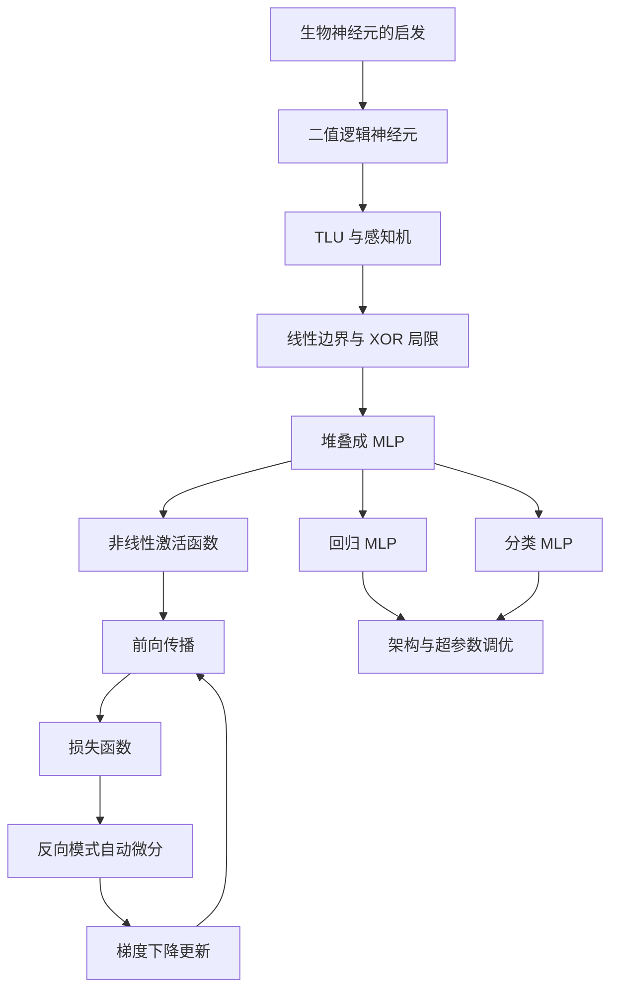

> 书目：*Hands-On Machine Learning with Scikit-Learn and PyTorch*<br>
> 章节：Chapter 9, Introduction to Artificial Neural Networks<br>
> 章节文件：9. Introduction to Artificial Neural Networks.md<br>
> 配套 Notebook：<https://homl.info/colab-p>

---

## 阅读导引

### 本章要解决什么问题

线性回归、逻辑回归和线性 SVM 都只学习一个线性变换。它们容易训练、容易解释，却无法直接表示 XOR、图像类别边界等复杂非线性关系。本章沿着以下问题展开：

1. 简单计算单元怎样组合出复杂逻辑？
2. 感知机怎样学习线性决策边界，何时保证收敛？
3. 为什么增加隐藏层并不能自动带来非线性能力？
4. 如何高效计算含大量参数的网络梯度？
5. 回归、二分类、多标签和多分类应怎样设计输出层与损失？
6. 网络深度、宽度、学习率和批量大小怎样影响训练？

### 全章主线



### 一句话概括

$$
\boxed{
\text{神经网络用“线性变换 + 非线性激活”的多层复合学习表示，}
\text{再用反向传播高效求出所有参数的梯度。}
}
$$

### 重要边界

- 人工神经网络受生物神经系统启发，但不是大脑的忠实模拟。
- “万能逼近”只说明存在合适参数，不说明有限数据下能找到它，也不保证泛化。
- 反向传播是求梯度的方法，不是参数更新方法；梯度下降或 Adam 才负责更新。
- 模型输出的 softmax 数值满足概率形式，但不天然具有良好概率校准。
- 网络越大，表示能力通常越强，但计算成本和过拟合风险也越高。

---

## 0. 必要的数学与机器学习基础

### 0.1 样本、层和参数的记号

设一个 mini-batch 有 $m$ 个样本，每个样本有 $n_{\text{in}}$ 个特征，一层有 $n_{\text{out}}$ 个神经元：

$$
\mathbf X\in\mathbb R^{m\times n_{\text{in}}},\qquad
\mathbf W\in\mathbb R^{n_{\text{in}}\times n_{\text{out}}},\qquad
\mathbf b\in\mathbb R^{n_{\text{out}}}
$$

线性部分为：

$$
\mathbf Z=\mathbf X\mathbf W+\mathbf b
\in\mathbb R^{m\times n_{\text{out}}}
$$

这里 $\mathbf b$ 通过 broadcasting 加到 $\mathbf Z$ 的每一行。对第 $r$ 个样本、第 $j$ 个神经元：

$$
z_{rj}
=\sum_{i=1}^{n_{\text{in}}}x_{ri}w_{ij}+b_j
$$

激活函数逐元素作用：

$$
\mathbf A=\phi(\mathbf Z)
$$

### 0.2 函数复合与链式法则

神经网络是一串函数复合。若：

$$
u=f(x),\qquad y=g(u),\qquad L=h(y)
$$

则：

$$
\frac{dL}{dx}
=\frac{dL}{dy}
\frac{dy}{du}
\frac{du}{dx}
$$

链式法则说明：某个早期参数对最终损失的影响，等于沿计算路径上每个局部影响的乘积。反向传播就是把这一原则系统化，并复用中间结果。

### 0.3 梯度下降

损失函数记为 $J(\boldsymbol\theta)$，参数向量为 $\boldsymbol\theta$。一阶泰勒展开：

$$
J(\boldsymbol\theta+\Delta\boldsymbol\theta)
\approx
J(\boldsymbol\theta)
+\nabla J(\boldsymbol\theta)^\top
\Delta\boldsymbol\theta
$$

在固定步长 $\|\Delta\boldsymbol\theta\|$ 下，使内积最小的方向是负梯度方向，因此：

$$
\boxed{
\boldsymbol\theta
\leftarrow
\boldsymbol\theta-\eta\nabla J(\boldsymbol\theta)
}
$$

$\eta>0$ 是学习率。过小收敛慢，过大可能跨过低谷甚至发散。

### 0.4 Epoch、Batch 与 Iteration

| 名称 | 严格含义 |
| --- | --- |
| Sample | 一个训练实例 |
| Batch / Mini-batch | 一次前向和反向传播使用的一组样本 |
| Iteration / Step | 使用一个 batch 完成一次参数更新 |
| Epoch | 模型大致看完一次完整训练集 |

若训练集有 $N$ 个样本，batch size 为 $B$，每个 epoch 通常约有 $\lceil N/B\rceil$ 次更新。

---

## 1. 从生物神经元到人工神经元

### 1.1 历史脉络

1943 年，Warren McCulloch 与 Walter Pitts 提出可执行命题逻辑的简化神经元模型，这是早期人工神经网络架构。之后的发展经历了多次起伏：

1. 早期成果带来过高期待；
2. 20 世纪 60 年代，能力和算力不足导致第一次低潮；
3. 80 年代的新架构和训练方法推动连接主义复兴；
4. 90 年代，SVM 等方法效果好、理论清晰，神经网络再次失去关注；
5. 大数据、GPU、训练技巧和 Transformer 使神经网络重新成为主流。

今天的复兴不只是“旧方法重新流行”，而是若干条件同时成熟：

- 数据规模足以支撑高容量模型；
- GPU 擅长并行矩阵乘法，云计算降低了硬件门槛；
- 初始化、优化、归一化和正则化方法持续改进；
- 大型网络的优化地形在实践中往往比早期担心的更友好；
- Transformer 能统一处理文本、图像和音频，并可通过迁移学习、上下文学习复用；
- 产品成功带来资金、人才和基础设施，形成正反馈。

Transformer 的规模化还带来一组新范式：

- **Foundation Model**：在大规模广泛数据上预训练、可适配许多下游任务的基础模型；
- **Transfer Learning**：把预训练参数迁移到新任务，通常再微调；
- **In-context Learning（ICL）**：不更新参数，仅在输入上下文中描述任务或提供示例；
- **Few-shot Learning（FSL）**：只给少量示例完成任务，在这里常作为 ICL 的提示形式；
- **Chain-of-thought（CoT）提示**：要求模型生成中间推理步骤，以改善某些多步任务表现。

ICL 不等于梯度训练，FSL 也不只指提示学习；这些术语应结合具体上下文理解。

这里应避免一个误解：局部极小值并未从数学上消失。更准确的说法是，大型网络还存在鞍点、平坦区域和大量等价参数，但许多可达解的实际性能已经足够好。

### 1.2 生物类比的价值与边界

生物大脑启发了“许多简单单元通过大量连接形成复杂计算”的思想，但工程上的 ANN 已经明显偏离生物细节。飞机受鸟启发，却不需要扑翼；同理，人工神经元不需要逐项模拟细胞。

采用生物类比的正确方式是：

- 用它建立直觉和提出架构假设；
- 不把“生物上是否合理”当作算法是否有效的必要条件；
- 最终用可计算性、数据效率、泛化性能和工程成本评价方法。

---

## 2. Biological Neurons：生物神经元

### 2.1 基本结构

生物神经元主要包括：

- **细胞体（cell body）**：包含细胞核和主要细胞器；
- **树突（dendrites）**：接收其他神经元的信号；
- **轴突（axon）**：把动作电位传向远端；
- **轴突末梢（telodendria）与突触（synapses）**：向其他神经元释放神经递质。

当短时间窗口内的兴奋性输入足够强，并克服抑制性输入后，神经元产生动作电位。单个神经元行为相对简单，但数十亿神经元各自连接大量邻居，能涌现复杂计算。

### 2.2 为什么人工网络采用分层结构

大脑皮层中可观察到层状组织。分层结构具有工程优势：

1. 上一层的输出可以成为下一层可复用的特征；
2. 多层复合能逐步扩大有效感受范围；
3. 低层模式可以组合为更高层抽象；
4. 每层都能用规则化的矩阵运算并行计算。

但现代网络的“层”主要是计算图抽象，不能简单对应到某一层真实皮层。

---

## 3. Logical Computations with Neurons：逻辑计算

### 3.1 McCulloch–Pitts 二值神经元

最早的模型接收若干二值输入并输出一个二值值。设输入 $x_i\in\{0,1\}$，当激活输入数达到阈值 $\tau$ 时输出 1：

$$
y
=\mathbb I\left(\sum_i x_i\ge\tau\right)
$$

$\mathbb I(\cdot)$ 是示性函数，条件成立时为 1，否则为 0。

原书示意图假定神经元至少收到两个激活连接才启动。通过复制连接或加入抑制连接，可构造：

- 恒等：输入 $A$ 用两条连接送入输出；
- AND：$A,B$ 各一条连接，只有两者同时为 1 才达到阈值；
- OR：$A,B$ 各复制成两条连接，任一为 1 都可达到阈值；
- $A\land\neg B$：$A$ 提供兴奋输入，$B$ 提供抑制输入；
- NOT：固定 $A=1$，得到 $\neg B$。

### 3.2 XOR 为什么需要组合

XOR 的真值表：

| $A$ | $B$ | $A\oplus B$ |
| ---: | ---: | ---: |
| 0 | 0 | 0 |
| 0 | 1 | 1 |
| 1 | 0 | 1 |
| 1 | 1 | 0 |

逻辑恒等式：

$$
A\oplus B
=(A\land\neg B)\lor(\neg A\land B)
$$

第一层并行计算两个合取项，第二层计算 OR。这个例子已经体现深层网络的核心：先得到中间表示，再组合为最终结果。

---

## 4. The Perceptron：感知机

### 4.1 TLU 要解决什么问题

二值逻辑神经元不能直接处理长度、宽度等连续特征，也不能从数据学习连接强度。阈值逻辑单元（Threshold Logic Unit, TLU）引入实值输入、权重和偏置：

$$
z
=\sum_{i=1}^{n}w_ix_i+b
=\mathbf w^\top\mathbf x+b
$$

$$
\hat y=\operatorname{step}(z)
$$

- $x_i$：第 $i$ 个输入特征；
- $w_i$：该特征的连接权重；
- $b$：偏置，控制整体阈值；
- $z$：净输入或 logit；
- $\hat y$：预测类别。

$\mathbf w$ 决定超平面的方向，$b$ 决定其位置。决策边界为：

$$
\mathbf w^\top\mathbf x+b=0
$$

所以单个 TLU 本质上是线性二分类器。

### 4.2 公式 9-1：阶跃函数

Heaviside 阶跃函数：

$$
\boxed{
\operatorname{heaviside}(z)
=
\begin{cases}
0,&z<0\\
1,&z\ge0
\end{cases}
}
$$

符号函数：

$$
\boxed{
\operatorname{sgn}(z)
=
\begin{cases}
-1,&z<0\\
0,&z=0\\
+1,&z>0
\end{cases}
}
$$

原始章节 Markdown 把最后一个条件排成了 $z>1$；按符号函数定义应为 $z>0$。

### 4.3 感知机、Dense Layer 与输出语义

感知机由一层或多个 TLU 组成，每个 TLU 与所有输入相连，这就是全连接层（fully connected layer）或稠密层（dense layer）。

若有多个输出神经元，它们可分别完成多个二分类任务，因此天然支持多标签分类。若把每个输出看作一个类别分数，再取最大者，也可用于多分类；不过经典感知机不输出规范化概率。

### 4.4 公式 9-2：整层向量化计算

对 $m$ 个样本、$n_{\text{in}}$ 个输入、$n_{\text{out}}$ 个神经元：

$$
\boxed{
\widehat{\mathbf Y}
=\phi(\mathbf X\mathbf W+\mathbf b)
}
$$

维度核对：

$$
\underbrace{\mathbf X}_{m\times n_{\text{in}}}
\underbrace{\mathbf W}_{n_{\text{in}}\times n_{\text{out}}}
=
\underbrace{\mathbf Z}_{m\times n_{\text{out}}}
$$

$\mathbf b\in\mathbb R^{n_{\text{out}}}$ 被加到每一行，$\phi$ 逐元素作用。矩阵乘法把“每个样本乘每组权重”的大量标量运算合并，便于 BLAS/GPU 并行。

PyTorch 的线性层通常把权重存为 $n_{\text{out}}\times n_{\text{in}}$，前向时等价地使用 $\mathbf X\mathbf W^\top$；这是存储约定不同，不是数学模型不同。

### 4.5 Hebb 思想与误差修正

Hebb 法则常被概括为“同时激活的细胞会加强连接”。但只加强共同激活不能纠正错误。感知机学习规则额外利用目标与预测之差：

$$
e_j=y_j-\hat y_j
$$

预测正确时 $e_j=0$，不更新；预测错误时，根据输入方向加强正确类别或削弱错误类别。

### 4.6 公式 9-3：感知机更新规则

对输入 $i$ 到输出神经元 $j$ 的连接：

$$
\boxed{
w_{ij}
\leftarrow
w_{ij}+\eta(y_j-\hat y_j)x_i
}
$$

偏置可把恒定输入 $x_0=1$ 纳入同一公式：

$$
b_j
\leftarrow
b_j+\eta(y_j-\hat y_j)
$$

二分类若采用 $y\in\{-1,+1\}$，在误分类样本上可写成更简洁的形式：

$$
\mathbf w\leftarrow\mathbf w+\eta y\mathbf x,
\qquad
b\leftarrow b+\eta y
$$

#### 为什么更新方向正确

误分类意味着：

$$
y(\mathbf w^\top\mathbf x+b)\le0
$$

更新后该样本的有符号分数：

$$
\begin{aligned}
y(\mathbf w_{\text{new}}^\top\mathbf x+b_{\text{new}})
&=y[(\mathbf w+\eta y\mathbf x)^\top\mathbf x+b+\eta y]\\
&=y(\mathbf w^\top\mathbf x+b)
+\eta y^2(\|\mathbf x\|^2+1)\\
&=y(\mathbf w^\top\mathbf x+b)
+\eta(\|\mathbf x\|^2+1)
\end{aligned}
$$

因为最后一项为正，更新会提高当前样本属于正确一侧的分数。它不保证其他样本同时改善，所以算法需要反复遍历数据。

### 4.7 与 Perceptron Loss 的关系

把偏置合并进增广向量：

$$
\widetilde{\mathbf x}
=(\mathbf x^\top,1)^\top,
\qquad
\widetilde{\mathbf w}
=(\mathbf w^\top,b)^\top
$$

单样本感知机损失：

$$
\ell(\widetilde{\mathbf w};\widetilde{\mathbf x},y)
=\max(0,-y\widetilde{\mathbf w}^\top\widetilde{\mathbf x})
$$

误分类时，一个次梯度为：

$$
\partial_{\widetilde{\mathbf w}}\ell
=-y\widetilde{\mathbf x}
$$

随机次梯度下降：

$$
\widetilde{\mathbf w}
\leftarrow
\widetilde{\mathbf w}
-\eta(-y\widetilde{\mathbf x})
=\widetilde{\mathbf w}+\eta y\widetilde{\mathbf x}
$$

这正是 $\{-1,+1\}$ 记号下的感知机更新。因此它与 SGD 很相似，不只是表面巧合。

### 4.8 感知机收敛定理及完整论证

#### 定理条件

训练集 $\{(\widetilde{\mathbf x}_i,y_i)\}_{i=1}^N$ 满足：

1. $y_i\in\{-1,+1\}$；
2. 样本有界：$\|\widetilde{\mathbf x}_i\|\le R$；
3. 数据严格线性可分：存在单位向量 $\widetilde{\mathbf w}_*$ 和间隔 $\gamma>0$，使

$$
y_i\widetilde{\mathbf w}_*^\top\widetilde{\mathbf x}_i
\ge\gamma
\quad\forall i
$$

令学习率为 1、初始权重为 0。则感知机发生的错误更新次数 $M$ 满足：

$$
\boxed{M\le\frac{R^2}{\gamma^2}}
$$

#### 第一步：正确方向上的投影至少线性增长

第 $t$ 次错误对应样本 $(\widetilde{\mathbf x}_t,y_t)$，更新：

$$
\widetilde{\mathbf w}_{t+1}
=\widetilde{\mathbf w}_t+y_t\widetilde{\mathbf x}_t
$$

与正确分隔向量做内积：

$$
\begin{aligned}
\widetilde{\mathbf w}_{t+1}^\top\widetilde{\mathbf w}_*
&=\widetilde{\mathbf w}_t^\top\widetilde{\mathbf w}_*
+y_t\widetilde{\mathbf x}_t^\top\widetilde{\mathbf w}_*\\
&\ge
\widetilde{\mathbf w}_t^\top\widetilde{\mathbf w}_*+\gamma
\end{aligned}
$$

从零开始，发生 $M$ 次错误后：

$$
\widetilde{\mathbf w}_M^\top\widetilde{\mathbf w}_*
\ge M\gamma
$$

#### 第二步：权重范数至多按平方根增长

误分类时：

$$
y_t\widetilde{\mathbf w}_t^\top\widetilde{\mathbf x}_t\le0
$$

于是：

$$
\begin{aligned}
\|\widetilde{\mathbf w}_{t+1}\|^2
&=\|\widetilde{\mathbf w}_t+y_t\widetilde{\mathbf x}_t\|^2\\
&=\|\widetilde{\mathbf w}_t\|^2
+2y_t\widetilde{\mathbf w}_t^\top\widetilde{\mathbf x}_t
+\|\widetilde{\mathbf x}_t\|^2\\
&\le\|\widetilde{\mathbf w}_t\|^2+R^2
\end{aligned}
$$

递推得到：

$$
\|\widetilde{\mathbf w}_M\|^2\le MR^2,
\qquad
\|\widetilde{\mathbf w}_M\|\le\sqrt M R
$$

#### 第三步：用 Cauchy–Schwarz 合并上下界

由于 $\|\widetilde{\mathbf w}_*\|=1$：

$$
M\gamma
\le
\widetilde{\mathbf w}_M^\top\widetilde{\mathbf w}_*
\le
\|\widetilde{\mathbf w}_M\|
\|\widetilde{\mathbf w}_*\|
\le\sqrt M R
$$

当 $M>0$ 时，两边除以 $\sqrt M\gamma$：

$$
\sqrt M\le\frac R\gamma
\quad\Longrightarrow\quad
M\le\frac{R^2}{\gamma^2}
$$

证毕。

#### 定理没有保证什么

- 数据不线性可分时，算法可能永不停止；
- 只保证有限次错误后找到某个分隔面，不保证最大间隔；
- 解不唯一，也不保证概率校准；
- 上界依赖特征尺度、样本范数 $R$ 和几何间隔 $\gamma$；
- 有限训练误差不等于良好测试泛化。

### 4.9 NumPy 从零实现公式 9-3

```python
import numpy as np


def fit_perceptron(X, y, learning_rate=1.0, max_epochs=100):
    """训练 y∈{-1,+1} 的二分类感知机。"""
    weights = np.zeros(X.shape[1], dtype=float)
    bias = 0.0

    for epoch in range(max_epochs):
        mistakes = 0
        for features, target in zip(X, y):
            score = features @ weights + bias
            prediction = 1 if score >= 0 else -1

            if prediction != target:
                # 对应公式 9-3：w ← w + η y x，b ← b + η y
                weights += learning_rate * target * features
                bias += learning_rate * target
                mistakes += 1

        if mistakes == 0:
            return weights, bias, epoch + 1

    return weights, bias, max_epochs


X_and = np.array([
    [0.0, 0.0],
    [0.0, 1.0],
    [1.0, 0.0],
    [1.0, 1.0],
])
y_and = np.array([-1, -1, -1, 1])

weights, bias, epochs = fit_perceptron(X_and, y_and)
scores = X_and @ weights + bias
predictions = np.where(scores >= 0, 1, -1)

print("权重:", weights)
print("偏置:", bias)
print("训练轮数:", epochs)
print("预测:", predictions)
```

参考输出：

```text
权重: [2. 1.]
偏置: -3.0
训练轮数: 6
预测: [-1 -1 -1  1]
```

### 4.10 Scikit-Learn Iris 示例

```python
from sklearn.datasets import load_iris
from sklearn.linear_model import Perceptron

iris = load_iris(as_frame=True)
X = iris.data[["petal length (cm)", "petal width (cm)"]].values
y = iris.target.eq(0).to_numpy()

perceptron = Perceptron(random_state=42)
perceptron.fit(X, y)

X_new = [[2.0, 0.5], [3.0, 1.0]]
print(perceptron.predict(X_new))
```

参考输出：

```text
[ True False]
```

在 Scikit-Learn 中，`Perceptron` 等价于特定配置的 `SGDClassifier`：

```python
from sklearn.linear_model import SGDClassifier

equivalent = SGDClassifier(
    loss="perceptron",
    learning_rate="constant",
    eta0=1.0,
    penalty=None,
    random_state=42,
)
```

### 4.11 感知机与逻辑回归

| 维度 | 经典感知机 | 逻辑回归 |
| --- | --- | --- |
| 线性分数 | $z=\mathbf w^\top\mathbf x+b$ | 相同 |
| 输出 | 阶跃类别 | $\sigma(z)$ 概率估计 |
| 典型损失 | Perceptron loss | Log loss |
| 可导性 | 阶跃函数不可用于普通梯度 | Sigmoid 与 log loss 可导 |
| 默认正则化 | 无 | 通常有 |
| 不可分数据 | 可能持续更新 | 仍可优化有限损失 |
| 概率 | 不提供 | 提供，但仍需检查校准 |

感知机通常训练稍快，但逻辑回归有平滑目标、概率输出和正则化，因此一般更实用。若把阶跃激活换成 sigmoid，用交叉熵训练，并加入相应正则化，这个单层模型就是逻辑回归。

### 4.12 XOR 揭示了什么局限

XOR 的正类点 $(0,1),(1,0)$ 位于对角，负类点 $(0,0),(1,1)$ 位于另一对角，不存在一条直线把两组完全分开。因此任何单个线性分类器都无法解决 XOR。

这不是感知机学习规则独有的缺陷，而是模型表示能力的边界。解决办法不是“训练更久”，而是改变表示：增加非线性特征，或堆叠多层神经元。

---

## 5. The Multilayer Perceptron：多层感知机

### 5.1 架构定义

多层感知机（Multilayer Perceptron, MLP）由以下部分组成：

1. **输入层**：只承载特征，不进行神经元计算；
2. **一个或多个隐藏层**：产生中间表示；
3. **输出层**：产生任务所需的预测。

信号只从输入流向输出，因此 MLP 是前馈神经网络（Feedforward Neural Network, FNN）。靠近输入的层称低层，靠近输出的层称高层。

“深度”没有严格统一阈值。通常把含多层隐藏计算的网络称为深度神经网络（DNN），而深度学习更广义地研究深层计算模型。

### 5.2 用两层 TLU 精确解决 XOR

设隐藏层有两个 Heaviside 神经元：

$$
h_1
=H(x_1+x_2-1.5)
\quad\text{（AND）}
$$

$$
h_2
=H(x_1+x_2-0.5)
\quad\text{（OR）}
$$

输出层：

$$
\hat y
=H(-h_1+h_2-0.5)
$$

逐项计算：

| $(x_1,x_2)$ | $x_1+x_2-1.5$ | $h_1$ | $x_1+x_2-0.5$ | $h_2$ | $-h_1+h_2-0.5$ | $\hat y$ |
| --- | ---: | ---: | ---: | ---: | ---: | ---: |
| $(0,0)$ | $-1.5$ | 0 | $-0.5$ | 0 | $-0.5$ | 0 |
| $(0,1)$ | $-0.5$ | 0 | $0.5$ | 1 | $0.5$ | 1 |
| $(1,0)$ | $-0.5$ | 0 | $0.5$ | 1 | $0.5$ | 1 |
| $(1,1)$ | $0.5$ | 1 | $1.5$ | 1 | $-0.5$ | 0 |

隐藏层把原空间映射为 $(h_1,h_2)$，XOR 在新表示中变得线性可分。这说明隐藏层的核心价值不是“多算几次”，而是学习有用的中间坐标。

```python
import numpy as np


def heaviside(values):
    """z >= 0 时输出 1，否则输出 0。"""
    return (values >= 0).astype(int)


X_xor = np.array([[0, 0], [0, 1], [1, 0], [1, 1]])

W_hidden = np.array([[1.0, 1.0], [1.0, 1.0]])
b_hidden = np.array([-1.5, -0.5])
hidden = heaviside(X_xor @ W_hidden + b_hidden)

W_output = np.array([[-1.0], [1.0]])
b_output = np.array([-0.5])
y_xor = heaviside(hidden @ W_output + b_output)

print(hidden)
print(y_xor.ravel())
```

参考输出：

```text
[[0 0]
 [0 1]
 [0 1]
 [1 1]]
[0 1 1 0]
```

### 5.3 多层纯线性网络为什么仍然只是线性模型

若两层都不使用非线性激活：

$$
\mathbf H=\mathbf X\mathbf W_1+\mathbf b_1
$$

$$
\begin{aligned}
\widehat{\mathbf Y}
&=\mathbf H\mathbf W_2+\mathbf b_2\\
&=(\mathbf X\mathbf W_1+\mathbf b_1)\mathbf W_2+\mathbf b_2\\
&=\mathbf X(\mathbf W_1\mathbf W_2)
+(\mathbf b_1\mathbf W_2+\mathbf b_2)\\
&=\mathbf X\mathbf W'+\mathbf b'
\end{aligned}
$$

无论堆叠多少层，仿射变换的复合仍是一个仿射变换。因此，没有非线性激活时，深层网络的函数类别并不比单层线性模型丰富；它只是用冗余参数表示同一个线性映射。

---

## 6. 激活函数

### 6.1 为什么阶跃函数不适合梯度训练

阶跃函数在 $z\ne0$ 时导数为 0，在 $z=0$ 处不可导。若直接用它构造 MLP：

- 几乎所有位置梯度都是 0；
- 参数发生小变化时输出通常不变；
- 普通梯度下降得不到应向哪个方向移动的信息。

早期 MLP 能被反向传播训练的关键改动，就是用连续、几乎处处可导的激活替换阶跃函数。

### 6.2 Sigmoid

定义：

$$
\sigma(z)=\frac{1}{1+e^{-z}}
$$

值域为 $(0,1)$。导数推导：

$$
\begin{aligned}
\sigma'(z)
&=-(1+e^{-z})^{-2}(-e^{-z})\\
&=\frac{e^{-z}}{(1+e^{-z})^2}\\
&=\frac{1}{1+e^{-z}}
\left(1-\frac{1}{1+e^{-z}}\right)\\
&=\boxed{\sigma(z)[1-\sigma(z)]}
\end{aligned}
$$

优点：平滑、可导、可把二分类 logit 映射到概率形式。局限：

- 输出不以 0 为中心；
- $|z|$ 很大时导数接近 0，深层链式相乘会产生梯度消失；
- 指数运算比 ReLU 更贵。

### 6.3 Hyperbolic Tangent

定义及其与 sigmoid 的关系：

$$
	anh(z)
=\frac{e^z-e^{-z}}{e^z+e^{-z}}
=2\sigma(2z)-1
$$

求导：

$$
\begin{aligned}
\frac{d}{dz}\tanh(z)
&=2\cdot\sigma'(2z)\cdot2\\
&=4\sigma(2z)[1-\sigma(2z)]
\end{aligned}
$$

由 $\sigma(2z)=[\tanh(z)+1]/2$：

$$
\boxed{
	anh'(z)=1-\tanh^2(z)
}
$$

值域 $(-1,1)$ 以 0 为中心，早期训练常比 sigmoid 快；但两端同样饱和并产生梯度消失。

### 6.4 ReLU

定义：

$$
\operatorname{ReLU}(z)=\max(0,z)
$$

导数或次梯度约定：

$$
\operatorname{ReLU}'(z)
=
\begin{cases}
0,&z<0\\
	ext{未定义，实践中常取 }0,&z=0\\
1,&z>0
\end{cases}
$$

优点：计算快，正区间不饱和，通常是隐藏层的良好默认选择。局限：

- 负区间梯度为 0，神经元可能长期“死亡”；
- 输出不以 0 为中心；
- 无上界的激活可能与不合适初始化或学习率共同造成数值过大。

Leaky ReLU、ELU、GELU 等替代函数试图改善负区间梯度或平滑性；具体选择依赖架构和任务。

### 6.5 数值与导数表

| 激活 | $\phi(0)$ | 导数 | 典型用途 | 主要风险 |
| --- | ---: | --- | --- | --- |
| Sigmoid | $0.5$ | $\sigma(1-\sigma)$ | 二分类输出 | 饱和、梯度消失 |
| Tanh | $0$ | $1-\tanh^2$ | 某些隐藏层/循环网络 | 饱和、梯度消失 |
| ReLU | $0$ | $\mathbb I(z>0)$ | 隐藏层默认 | Dying ReLU |
| Linear | $0$ | $1$ | 无界回归输出 | 无非线性能力 |

```python
import numpy as np
import matplotlib.pyplot as plt

z = np.linspace(-5, 5, 500)
sigmoid = 1 / (1 + np.exp(-z))
tanh = np.tanh(z)
relu = np.maximum(0, z)

fig, axes = plt.subplots(1, 2, figsize=(10, 4))
axes[0].plot(z, sigmoid, label="Sigmoid")
axes[0].plot(z, tanh, label="Tanh")
axes[0].plot(z, relu, label="ReLU")
axes[0].set_title("激活函数")
axes[0].legend()
axes[0].grid(alpha=0.3)

axes[1].plot(z, sigmoid * (1 - sigmoid), label="Sigmoid'")
axes[1].plot(z, 1 - tanh**2, label="Tanh'")
axes[1].plot(z, (z > 0).astype(float), label="ReLU'")
axes[1].set_title("导数")
axes[1].legend()
axes[1].grid(alpha=0.3)

plt.tight_layout()
plt.show()
```

### 6.6 万能逼近定理应该怎样理解

一个常见版本指出：若 $K\subset\mathbb R^n$ 是紧致集，$f\in C(K)$ 是连续函数，激活函数 $\sigma$ 连续且具有适当的非线性条件（经典 Cybenko 版本使用连续 sigmoidal 函数；更一般结果要求它不是多项式），则存在有限宽单隐藏层网络：

$$
g(\mathbf x)
=\sum_{r=1}^{N}
\alpha_r
\sigma(\mathbf w_r^\top\mathbf x+b_r)
$$

使它能以任意精度一致逼近 $f$：

它说明的是**存在性**：

$$
\forall\varepsilon>0,
\quad
\exists\theta,
\quad
\sup_{\mathbf x\in K}
|g(\mathbf x)-f(\mathbf x)|<\varepsilon
$$

#### 经典 Sigmoid 版本的证明骨架

令 $\mathcal H$ 是所有上述有限和在 $C(K)$ 中构成的线性子空间。目标是证明其闭包 $\overline{\mathcal H}=C(K)$。

1. **反设不稠密**：假设 $\overline{\mathcal H}\ne C(K)$。
2. **分离函数空间**：由 Hahn–Banach 定理，存在非零连续线性泛函 $L:C(K)\to\mathbb R$，使得对所有 $h\in\mathcal H$ 都有 $L(h)=0$。
3. **把泛函表示为测度**：由 Riesz 表示定理，存在非零有限符号测度 $\mu$，满足

$$
L(h)=\int_Kh(\mathbf x)\,d\mu(\mathbf x)
$$

4. **利用 $L$ 消灭所有神经元**：每个单神经元函数都属于 $\mathcal H$，所以对任意 $\mathbf w,b$：

$$
\int_K
\sigma(\mathbf w^\top\mathbf x+b)
\,d\mu(\mathbf x)=0
$$

5. **Sigmoid 区分测度**：把 $\mathbf w,b$ 同时乘以越来越大的正数。Sigmoid 极限逼近半空间 $\{\mathbf x:\mathbf w^\top\mathbf x+b>0\}$ 的示性函数。由支配收敛，可推出 $\mu$ 对所有这类半空间的测度都为 0。半空间能生成 $\mathbb R^n$ 的 Borel $\sigma$-代数，因此 $\mu=0$。
6. **得到矛盾**：第 2 步要求 $\mu$ 对应的泛函非零，第 5 步却推出 $\mu=0$。所以反设不成立，$\mathcal H$ 在 $C(K)$ 中稠密。

这说明有限个 ridge functions $\sigma(\mathbf w^\top\mathbf x+b)$ 的线性组合足以逼近连续目标。ReLU 不满足“有界 sigmoidal”条件，但由更一般的非多项式激活稠密性结果，同样具有万能逼近能力。

它没有说明：

- 需要多少神经元；
- 如何通过训练找到参数 $\theta$；
- 需要多少样本；
- 参数是否数值稳定；
- 对分布外输入能否泛化。

深层网络的优势不是浅层网络“完全不能表示”，而是很多具有层次结构的函数能被深层网络用更少参数高效表示，并复用低层特征。

---

## 7. Backpropagation：反向传播

### 7.1 问题从哪里来

一个 MLP 可能有数百万甚至数十亿参数。对每个参数单独扰动并重新计算损失，计算量极大且数值误差明显。训练需要同时回答：

> 每个权重或偏置改变一点，最终损失会怎样变化？

这就是求 $\nabla_\theta J$。反向模式自动微分利用计算图和链式法则，在一次前向和一次反向遍历中得到标量损失对所有参数的梯度。

### 7.2 前向传播

以一个隐藏层的多分类 MLP 为例：

$$
\mathbf Z_1=\mathbf X\mathbf W_1+\mathbf b_1
$$

$$
\mathbf A_1=\phi(\mathbf Z_1)
$$

$$
\mathbf Z_2=\mathbf A_1\mathbf W_2+\mathbf b_2
$$

$$
\widehat{\mathbf Y}=\operatorname{softmax}(\mathbf Z_2)
$$

前向时必须保存 $\mathbf X,\mathbf Z_1,\mathbf A_1,\mathbf Z_2,\widehat{\mathbf Y}$ 等中间结果，因为反向计算局部导数会用到它们。

### 7.3 Softmax 与交叉熵

单样本第 $k$ 类概率：

$$
\hat y_k
=\frac{e^{z_k}}{\sum_{j=1}^{K}e^{z_j}}
$$

为避免指数溢出，可减去最大 logit $c=\max_jz_j$：

$$
\frac{e^{z_k-c}}{\sum_je^{z_j-c}}
=\frac{e^{z_k}/e^c}{\sum_je^{z_j}/e^c}
=\frac{e^{z_k}}{\sum_je^{z_j}}
$$

所以该操作不改变概率。

若 one-hot 目标为 $\mathbf y$，交叉熵：

$$
L
=-\sum_{k=1}^{K}y_k\log\hat y_k
$$

若正确类别为 $c$，则 $y_c=1$，其余为 0：

$$
L=-\log\hat y_c
=-z_c+\log\sum_je^{z_j}
$$

### 7.4 推导 Softmax + 交叉熵梯度

对任意 logit $z_k$：

$$
\begin{aligned}
\frac{\partial L}{\partial z_k}
&=-\frac{\partial z_c}{\partial z_k}
+\frac{1}{\sum_je^{z_j}}
\frac{\partial}{\partial z_k}\sum_je^{z_j}\\
&=-\mathbb I(k=c)
+\frac{e^{z_k}}{\sum_je^{z_j}}\\
&=\hat y_k-y_k
\end{aligned}
$$

因此：

$$
\boxed{
\frac{\partial L}{\partial\mathbf z}
=\widehat{\mathbf y}-\mathbf y
}
$$

这个简洁结果来自 softmax 与交叉熵的配对，而不是任意输出激活与损失都如此。

### 7.5 两层 MLP 的完整反向推导

设 batch 大小为 $m$，损失取样本均值。定义输出层误差信号：

$$
\boldsymbol\Delta_2
=\frac{1}{m}(\widehat{\mathbf Y}-\mathbf Y)
$$

因为 $\mathbf Z_2=\mathbf A_1\mathbf W_2+\mathbf b_2$，逐元素有：

$$
z_{2,rk}=\sum_ja_{1,rj}w_{2,jk}+b_{2,k}
$$

于是：

$$
\boxed{
\frac{\partial J}{\partial\mathbf W_2}
=\mathbf A_1^\top\boldsymbol\Delta_2
}
$$

$$
\boxed{
\frac{\partial J}{\partial\mathbf b_2}
=\sum_{r=1}^{m}\boldsymbol\Delta_{2,r:}
}
$$

损失对隐藏激活的梯度为：

$$
\frac{\partial J}{\partial\mathbf A_1}
=\boldsymbol\Delta_2\mathbf W_2^\top
$$

再通过逐元素激活 $\mathbf A_1=\phi(\mathbf Z_1)$：

$$
\boldsymbol\Delta_1
=
(\boldsymbol\Delta_2\mathbf W_2^\top)
\odot\phi'(\mathbf Z_1)
$$

$\odot$ 表示 Hadamard 逐元素乘法。最后：

$$
\boxed{
\frac{\partial J}{\partial\mathbf W_1}
=\mathbf X^\top\boldsymbol\Delta_1
}
$$

$$
\boxed{
\frac{\partial J}{\partial\mathbf b_1}
=\sum_{r=1}^{m}\boldsymbol\Delta_{1,r:}
}
$$

梯度下降更新每组参数：

$$
\mathbf W_l\leftarrow
\mathbf W_l-\eta\frac{\partial J}{\partial\mathbf W_l},
\qquad
\mathbf b_l\leftarrow
\mathbf b_l-\eta\frac{\partial J}{\partial\mathbf b_l}
$$

### 7.6 一个样本的数值演算

设二分类网络只有一个输入、一个 sigmoid 隐藏神经元和一个 sigmoid 输出神经元：

$$
x=2,
\quad w_1=0.5,
\quad b_1=0,
\quad w_2=-1,
\quad b_2=0,
\quad y=1
$$

前向：

$$
z_1=2\times0.5=1,
\qquad
a_1=\sigma(1)\approx0.7311
$$

$$
z_2=-0.7311,
\qquad
\hat y=\sigma(-0.7311)\approx0.3250
$$

二元交叉熵与 sigmoid 配对时：

$$
\delta_2=\frac{\partial L}{\partial z_2}=\hat y-y\approx-0.6750
$$

输出权重梯度：

$$
\frac{\partial L}{\partial w_2}
=a_1\delta_2
\approx0.7311\times(-0.6750)
\approx-0.4935
$$

隐藏误差信号：

$$
\begin{aligned}
\delta_1
&=\delta_2w_2\sigma'(z_1)\\
&=(-0.6750)(-1)[0.7311(1-0.7311)]\\
&\approx0.1327
\end{aligned}
$$

第一层权重梯度：

$$
\frac{\partial L}{\partial w_1}
=x\delta_1
\approx2\times0.1327
=0.2654
$$

这个例子展示误差如何从输出层乘上连接权重和局部导数，逐层传回早期参数。

### 7.7 反向模式自动微分、反向传播与优化器

| 概念 | 职责 |
| --- | --- |
| Reverse-mode autodiff | 对一般计算图高效求“一个标量输出对许多输入”的导数 |
| Backpropagation | 在神经网络训练中，前向计算损失、反向用 reverse-mode autodiff 求参数梯度的过程 |
| Gradient descent / Adam | 根据梯度决定参数怎样更新 |

严格说，反向传播经常指梯度计算，不应与完整训练算法或优化器混为一谈。

反向模式特别适合神经网络，因为参数很多而最终损失通常是一个标量。若输入很少、输出很多，前向模式自动微分可能更合适。

### 7.8 为什么必须随机打破对称性

假设同一隐藏层两个神经元的权重和偏置完全相同。对任意输入，它们的：

1. 净输入相同；
2. 激活相同；
3. 接收的梯度结构相同；
4. 更新后参数仍相同。

因此它们永远学习同一个特征，多个神经元退化为一个神经元的复制。随机初始化使神经元从不同位置出发，从而学习不同表示。

偏置通常可以初始化为 0，只要连接权重随机即可；“所有参数都不能为 0”是不精确的说法。

### 7.9 从零实现 XOR 反向传播

```python
import numpy as np

rng = np.random.default_rng(42)
X = np.array([[0.0, 0.0], [0.0, 1.0],
              [1.0, 0.0], [1.0, 1.0]])
y = np.array([[0.0], [1.0], [1.0], [0.0]])

W1 = rng.normal(0, 0.5, size=(2, 4))
b1 = np.zeros((1, 4))
W2 = rng.normal(0, 0.5, size=(4, 1))
b2 = np.zeros((1, 1))


def sigmoid(values):
    return 1 / (1 + np.exp(-values))


learning_rate = 1.0
for epoch in range(10_000):
    # 前向传播
    Z1 = X @ W1 + b1
    A1 = np.tanh(Z1)
    Z2 = A1 @ W2 + b2
    y_proba = sigmoid(Z2)

    # 反向传播：sigmoid + 二元交叉熵给出 Δ2=(ŷ-y)/m
    delta2 = (y_proba - y) / len(X)
    grad_W2 = A1.T @ delta2
    grad_b2 = delta2.sum(axis=0, keepdims=True)

    delta1 = (delta2 @ W2.T) * (1 - A1**2)
    grad_W1 = X.T @ delta1
    grad_b1 = delta1.sum(axis=0, keepdims=True)

    # 梯度下降
    W2 -= learning_rate * grad_W2
    b2 -= learning_rate * grad_b2
    W1 -= learning_rate * grad_W1
    b1 -= learning_rate * grad_b1

predictions = (y_proba >= 0.5).astype(int)
print(np.round(y_proba.ravel(), 4))
print(predictions.ravel())
```

参考输出：

```text
[0.0000 0.9999 0.9999 0.0001]
[0 1 1 0]
```

### 7.10 用数值差分检查梯度

反向传播实现容易出现转置、缩放或符号错误。数值梯度用中心差分近似：

$$
\frac{\partial J}{\partial\theta_i}
\approx
\frac{J(\theta_i+\varepsilon)-J(\theta_i-\varepsilon)}{2\varepsilon}
$$

误差是 $O(\varepsilon^2)$，但 $\varepsilon$ 太小又会受浮点舍入影响，常取 $10^{-5}$ 左右。它需要每个参数额外前向两次，只适合测试小模型，不用于正式训练。

```python
import numpy as np


def scalar_loss(weight):
    """简单函数 J(w)=(2w-3)^2。"""
    return (2 * weight - 3) ** 2


weight = 0.7
epsilon = 1e-5
numeric_gradient = (
    scalar_loss(weight + epsilon)
    - scalar_loss(weight - epsilon)
) / (2 * epsilon)

analytic_gradient = 4 * (2 * weight - 3)
print(round(numeric_gradient, 6))
print(round(analytic_gradient, 6))
print(np.isclose(numeric_gradient, analytic_gradient, rtol=1e-5))
```

参考输出：

```text
-6.4
-6.4
True
```

### 7.11 反向传播的成立条件与局限

- 计算图中的运算需要可导或几乎处处可导；ReLU 在 0 处可选次梯度。
- 梯度是当前参数附近的局部一阶信息，不保证找到全局最优。
- 深层链式乘法可能导致梯度消失或爆炸。
- mini-batch 梯度是总体梯度的噪声估计。
- 离散决策、不可微采样等节点需要替代估计器或其他优化方法。
- 求得精确梯度不代表学习率合适，也不代表训练稳定。

---

## 8. Building and Training MLPs with Scikit-Learn

Scikit-Learn 提供 `MLPRegressor` 和 `MLPClassifier`，适合快速构建标准全连接网络。它们与预处理器、交叉验证和 Pipeline 集成良好，但不支持 GPU，架构能力也远弱于 PyTorch。

### 8.1 为什么训练前必须缩放

某层权重梯度包含输入：

$$
\frac{\partial J}{\partial\mathbf W}
=\mathbf X^\top\boldsymbol\Delta
$$

若某特征尺度比另一特征大 $10^4$ 倍，其梯度量级也可能大约大 $10^4$ 倍。损失曲面会形成狭长谷地，一个统一学习率难以兼顾不同方向：

- 学习率大时，大尺度方向震荡；
- 学习率小时，小尺度方向移动极慢。

因此表格数据常用 `StandardScaler`，像素常除以 255 或用 `MinMaxScaler`。

### 8.2 Pipeline 为什么是必要的工程边界

预处理必须只在训练数据上 `fit`，然后原样作用到验证、测试和线上新数据。Pipeline 能：

- 防止预处理统计量泄漏测试集；
- 确保训练和推理使用相同步骤；
- 让交叉验证在每个 fold 内独立拟合缩放器；
- 防止预测时忘记缩放。

若执行 `pipeline.fit(X_train,y_train)`，后续应调用 `pipeline.predict(X_new)`，不能直接调用内部 `mlp.predict(X_new)`，否则会绕过缩放器。

---

## 9. Regression MLPs：回归 MLP

### 9.1 输出层怎样由任务决定

若预测一个连续目标，只需一个输出神经元；若同时预测 $d$ 个目标，则需要 $d$ 个输出神经元。

例子：

- 房价：1 个输出；
- 物体中心 $(x,y)$：2 个输出；
- 边界框 $(x,y,w,h)$：4 个输出。

输出激活由目标取值域决定：

| 目标范围 | 输出激活 | 说明 |
| --- | --- | --- |
| 任意实数 | Linear / None | 不限制输出 |
| $[0,+\infty)$ | ReLU 或 Softplus | 保证非负 |
| $[0,1]$ | Sigmoid | 目标也应缩放到该范围 |
| $[-1,1]$ | Tanh | 目标也应缩放到该范围 |

Softplus 定义：

$$
\operatorname{softplus}(z)=\log(1+e^z)
$$

它是 ReLU 的平滑近似。导数为：

$$
\frac{d}{dz}\log(1+e^z)
=\frac{e^z}{1+e^z}
=\sigma(z)
$$

所以始终可导且输出为正。数值实现应使用稳定的 `logaddexp(0,z)`，避免 $e^z$ 溢出。

Scikit-Learn 的 `MLPRegressor` 不能任意指定输出激活；默认平方误差回归使用线性输出。Scikit-Learn 1.9 还支持 `loss="poisson"`，此时内部使用指数链接并要求 $y\ge0$，但这不等同于任意自定义 ReLU/softplus 输出层。

### 9.2 MSE 及其梯度

对 $m$ 个样本、$d$ 个输出：

$$
\operatorname{MSE}
=\frac{1}{md}
\sum_{i=1}^{m}
\sum_{j=1}^{d}
(\hat y_{ij}-y_{ij})^2
$$

令误差 $e_{ij}=\hat y_{ij}-y_{ij}$，则：

$$
\frac{\partial\operatorname{MSE}}
{\partial\hat y_{ij}}
=\frac{2e_{ij}}{md}
$$

误差越大，梯度绝对值越大，所以 MSE 强烈惩罚大误差；高斯噪声假设下，最小化 MSE 等价于最大似然估计。

### 9.3 MAE 与 Huber Loss

平均绝对误差：

$$
\operatorname{MAE}
=\frac1{md}\sum_{i,j}|e_{ij}|
$$

对 $e\ne0$：

$$
\frac{\partial|e|}{\partial e}
=\operatorname{sgn}(e)
$$

其梯度不随异常误差增大，因此比 MSE 抗离群值；但在 0 处不可导，且接近最优点时梯度仍是常数，优化不如二次损失平滑。

Huber loss 结合二者：

$$
L_\delta(e)
=
\begin{cases}
\frac12e^2,&|e|\le\delta\\
\delta(|e|-\frac12\delta),&|e|>\delta
\end{cases}
$$

导数：

$$
L_\delta'(e)
=
\begin{cases}
e,&|e|\le\delta\\
\delta\operatorname{sgn}(e),&|e|>\delta
\end{cases}
$$

在 $e=\pm\delta$ 处函数值和导数都连续。小误差使用二次项，便于精细收敛；大误差梯度被截到 $\pm\delta$，降低离群点影响。

当前 `MLPRegressor` 不提供 Huber loss；需要自定义损失时应使用 PyTorch 等框架。

### 9.4 L2 正则化

神经网络参数多，容易记住训练数据。L2 正则在数据损失上加入权重平方和：

$$
J(\mathbf W)
=J_{\text{data}}(\mathbf W)
+\frac{\alpha}{2m}\sum_l\|\mathbf W_l\|_F^2
$$

其梯度增加：

$$
\frac{\partial J}{\partial\mathbf W_l}
=\frac{\partial J_{\text{data}}}{\partial\mathbf W_l}
+\frac{\alpha}{m}\mathbf W_l
$$

因此每次更新都会把权重向 0 拉近。`MLPRegressor` 的 `alpha` 控制 L2 强度；偏置通常不参与该惩罚。

### 9.5 Early Stopping

`early_stopping=True` 时，Scikit-Learn 默认从训练集内部留出 `validation_fraction=0.1`：

1. 每个 epoch 后计算验证分数；
2. 若提升不超过 `tol`，记为一次未改善；
3. 连续 `n_iter_no_change=10` 个 epoch 未改善则停止；
4. 恢复或保留最佳验证阶段的参数。

它同时减少计算和过拟合，但有边界：

- 训练数据更少，因为一部分被留作验证；
- 时间序列不能随意随机切分；
- 小数据集的单次验证分数噪声较大；
- 验证集不能替代最终独立测试集。

### 9.6 $R^2$ 与 RMSE 的含义

回归器的 `score()` 默认返回决定系数：

$$
R^2
=1-
\frac{\sum_i(y_i-\hat y_i)^2}
{\sum_i(y_i-\bar y)^2}
$$

分母是总变异，分子是未解释残差：

- $R^2=1$：完美预测；
- $R^2=0$：与恒定预测训练目标均值相当；
- $R^2<0$：比均值基线更差。

RMSE：

$$
\operatorname{RMSE}=\sqrt{\operatorname{MSE}}
$$

与目标单位相同，更容易解释。两者回答不同问题：$R^2$ 衡量解释方差比例，RMSE 衡量典型误差量级。

### 9.7 California Housing 完整示例

首次运行 `fetch_california_housing()` 需要联网下载。目标单位为 10 万美元。

```python
from sklearn.datasets import fetch_california_housing
from sklearn.metrics import root_mean_squared_error
from sklearn.model_selection import train_test_split
from sklearn.neural_network import MLPRegressor
from sklearn.pipeline import make_pipeline
from sklearn.preprocessing import StandardScaler

housing = fetch_california_housing()
X_train, X_test, y_train, y_test = train_test_split(
    housing.data,
    housing.target,
    random_state=42,
)

mlp_reg = MLPRegressor(
    hidden_layer_sizes=(50, 50, 50),
    early_stopping=True,
    max_iter=500,
    random_state=42,
)

pipeline = make_pipeline(StandardScaler(), mlp_reg)
pipeline.fit(X_train, y_train)

y_pred = pipeline.predict(X_test)
rmse = root_mean_squared_error(y_test, y_pred)
print("最佳验证 R²:", round(mlp_reg.best_validation_score_, 4))
print("测试 RMSE:", round(rmse, 4))
print("训练 epoch:", mlp_reg.n_iter_)
```

原书环境参考值：最佳验证 $R^2\approx0.7915$，测试 RMSE $\approx0.5328$，约 45 个 epoch。随机初始化、数据版本和 Scikit-Learn 版本都可能使结果变化。

`MLPRegressor.loss_curve_` 中记录的是实现所优化的 loss；原书指出其平方误差部分采用半 MSE 的缩放，并包含 L2 项，因此不能直接把日志 loss 当作纯 MSE。

### 9.8 无需联网的回归实验

```python
from sklearn.datasets import load_diabetes
from sklearn.metrics import root_mean_squared_error
from sklearn.model_selection import train_test_split
from sklearn.neural_network import MLPRegressor
from sklearn.pipeline import make_pipeline
from sklearn.preprocessing import StandardScaler

X, y = load_diabetes(return_X_y=True)
X_train, X_test, y_train, y_test = train_test_split(
    X, y, test_size=0.2, random_state=42
)

model = make_pipeline(
    StandardScaler(),
    MLPRegressor(
        hidden_layer_sizes=(32, 16),
        early_stopping=True,
        max_iter=1_000,
        random_state=42,
    ),
)
model.fit(X_train, y_train)
predictions = model.predict(X_test)

print("测试 R²:", round(model.score(X_test, y_test), 4))
print("测试 RMSE:", round(root_mean_squared_error(y_test, predictions), 4))
print("前 3 个预测:", predictions[:3].round(1))
```

Scikit-Learn 1.9 参考输出：

```text
测试 R²: 0.4414
测试 RMSE: 54.4028
前 3 个预测: [144.3 183.  132. ]
```

### 9.9 典型回归 MLP 架构（表 9-1）

| 超参数 | 典型选择 |
| --- | --- |
| 隐藏层数 | 依问题而定，常见 1～5 层 |
| 每层神经元数 | 依问题而定，常见 10～100 |
| 输出神经元数 | 每个目标维度 1 个 |
| 隐藏层激活 | ReLU |
| 输出激活 | 无界用 Linear；正值可用 ReLU/Softplus；有界可用 Sigmoid/Tanh |
| 损失 | 常用 MSE；离群值多时考虑 Huber |

这些是起点而非定律。结构化表格数据上，树模型经常比 MLP 更省调参；高维连续信号、大规模数据或需要共享表示时，MLP 更可能体现优势。

---

## 10. Classification MLPs：分类 MLP

### 10.1 二分类

只需一个输出 logit $z$，经 sigmoid 得到正类概率形式：

$$
\hat p=P(y=1\mid\mathbf x)
=\sigma(z)
$$

负类概率为 $1-\hat p$。二元交叉熵：

$$
L
=-[y\log\hat p+(1-y)\log(1-\hat p)]
$$

推导 logit 梯度：

$$
\frac{\partial L}{\partial\hat p}
=-\frac y{\hat p}+\frac{1-y}{1-\hat p}
=\frac{\hat p-y}{\hat p(1-\hat p)}
$$

而 $\partial\hat p/\partial z=\hat p(1-\hat p)$，所以：

$$
\boxed{
\frac{\partial L}{\partial z}=\hat p-y
}
$$

### 10.2 多标签二分类

若一个样本可同时拥有多个标签，每个标签需要一个独立 sigmoid 输出：

$$
\hat p_k=\sigma(z_k)
$$

例如邮件可以同时是“垃圾邮件”和“紧急邮件”。各输出不互斥，所以概率不要求和为 1。总损失通常是各标签二元交叉熵之和或均值。

### 10.3 互斥多分类

若 $K$ 个类别互斥且穷尽，一个样本只能属于其中一个类别，则需要 $K$ 个输出 logit 和一个整体 softmax：

$$
\hat p_k
=\frac{e^{z_k}}{\sum_{j=1}^{K}e^{z_j}},
\qquad
\sum_k\hat p_k=1
$$

损失使用多类交叉熵：

$$
L=-\sum_{k=1}^{K}y_k\log\hat p_k
$$

二分类也可以用两个 softmax 输出，但一个 sigmoid 输出参数更少，两者在概率表达上等价。

### 10.4 为什么交叉熵合适

对 one-hot 目标，交叉熵就是正确类别负对数概率：

$$
L=-\log\hat p_c
$$

- 若 $\hat p_c=0.9$，$L\approx0.105$；
- 若 $\hat p_c=0.5$，$L\approx0.693$；
- 若 $\hat p_c=0.01$，$L\approx4.605$。

错误且自信的预测受到强烈惩罚。在独立同分布分类样本和 categorical likelihood 假设下，最小化平均交叉熵等价于最大化条件似然。

### 10.5 典型分类 MLP 架构（表 9-2）

| 项目 | 二分类 | 多标签分类 | 互斥多分类 |
| --- | --- | --- | --- |
| 隐藏层 | 常见 1～5 层 ReLU | 常见 1～5 层 ReLU | 常见 1～5 层 ReLU |
| 输出神经元 | 1 | 每个标签 1 个 | 每个类别 1 个 |
| 输出激活 | Sigmoid | 独立 Sigmoid | Softmax |
| 损失 | Binary cross-entropy | 各标签 BCE | Categorical cross-entropy |
| 概率和为 1 | 是，含隐式负类 | 不要求 | 要求 |

`MLPClassifier` 会根据目标类型选择适当输出：二分类/多标签使用 logistic，互斥多分类使用 softmax。它的 `score()` 返回 accuracy，而不是回归的 $R^2$。

### 10.6 Fashion-MNIST 为什么比 MNIST 难

Fashion-MNIST 与 MNIST 格式相同：70,000 张 $28\times28$ 灰度图、10 个类别。但同类服装外观变化比同一手写数字更大，类别之间也更相似。例如 shirt、T-shirt 和 coat 边界模糊，所以线性模型约 83%，标准 MLP 可接近 90%。

类别：

```python
class_names = [
    "T-shirt/top", "Trouser", "Pullover", "Dress", "Coat",
    "Sandal", "Shirt", "Sneaker", "Bag", "Ankle boot",
]
```

### 10.7 Fashion-MNIST 完整示例

首次运行 `fetch_openml()` 需要联网，训练在 CPU 上可能较慢。

```python
from sklearn.datasets import fetch_openml
from sklearn.neural_network import MLPClassifier
from sklearn.pipeline import make_pipeline
from sklearn.preprocessing import MinMaxScaler

fashion_mnist = fetch_openml(
    name="Fashion-MNIST",
    version=1,
    as_frame=False,
)
X = fashion_mnist.data
y = fashion_mnist.target.astype(int)

X_train, y_train = X[:60_000], y[:60_000]
X_test, y_test = X[60_000:], y[60_000:]

mlp_clf = MLPClassifier(
    hidden_layer_sizes=(200, 100),
    early_stopping=True,
    max_iter=300,
    random_state=42,
)

pipeline = make_pipeline(MinMaxScaler(), mlp_clf)
pipeline.fit(X_train, y_train)

print("最佳验证准确率:", round(mlp_clf.best_validation_score_, 4))
print("测试准确率:", round(pipeline.score(X_test, y_test), 4))

X_new = X_test[:15]
print("预测:", pipeline.predict(X_new))
print("第 13 张图的概率:", pipeline.predict_proba(X_new)[12].round(4))
```

当前官方 Notebook 使用 `(200,100)`，最佳验证准确率为 0.8965，完整 Pipeline 的测试准确率为 0.8907。章节正文曾写 `(300,100)`，并报告约 0.871 的测试值；Notebook 表明该较低值来自直接调用内部 `mlp_clf.score(X_test,y_test)`，绕过了训练时的 `MinMaxScaler`。正确评估应调用 `pipeline.score()`。

### 10.8 为什么图像常用 MinMaxScaler

像素天然有统一范围 $[0,255]$，缩放到 $[0,1]$ 保留了相对强度。某些边缘像素几乎恒定，若使用 StandardScaler：

$$
x'_{ij}=\frac{x_{ij}-\mu_j}{s_j}
$$

很小的 $s_j$ 会放大这些低方差像素的微小噪声，使其方差也变成 1。MinMax 缩放通常更符合原始像素语义，但不是绝对规则；现代视觉网络还常按数据集通道均值和方差标准化。

### 10.9 参数数量与过拟合风险

以章节正文的 Fashion-MNIST 网络结构 $784\to300\to100\to10$ 为例：

$$
P_1=784\times300+300=235{,}500
$$

$$
P_2=300\times100+100=30{,}100
$$

$$
P_3=100\times10+10=1{,}010
$$

总参数：

$$
P=235{,}500+30{,}100+1{,}010
=\boxed{266{,}610}
$$

参数量大带来灵活性，也提高计算、数据需求和过拟合风险。早停与 L2 正则可缓解；卷积网络通过局部连接和权重共享更适合图像。

### 10.10 无需联网的分类实验

```python
from sklearn.datasets import load_digits
from sklearn.model_selection import train_test_split
from sklearn.neural_network import MLPClassifier
from sklearn.pipeline import make_pipeline
from sklearn.preprocessing import MinMaxScaler

X, y = load_digits(return_X_y=True)
X_train, X_test, y_train, y_test = train_test_split(
    X,
    y,
    test_size=0.2,
    stratify=y,
    random_state=42,
)

classifier = make_pipeline(
    MinMaxScaler(),
    MLPClassifier(
        hidden_layer_sizes=(64, 32),
        early_stopping=True,
        max_iter=500,
        random_state=42,
    ),
)
classifier.fit(X_train, y_train)

print("测试准确率:", round(classifier.score(X_test, y_test), 4))
print("前 5 个预测:", classifier.predict(X_test[:5]))
print("前 5 个真值:", y_test[:5])
```

Scikit-Learn 1.9 参考输出：

```text
测试准确率: 0.9361
前 5 个预测: [5 2 1 6 7]
前 5 个真值: [5 2 8 1 7]
```

### 10.11 为什么神经网络会过度自信

Softmax 保证输出非负且和为 1，但不保证它等于真实频率。交叉熵会持续推动正确类 logit 高于其他类；对已正确分类的数据，如果没有足够正则化，放大权重仍可继续降低 loss：

$$
\operatorname{softmax}(c\mathbf z)_c\to1
\quad(c\to\infty)
$$

于是模型可能对错误样本也给出接近 100% 的置信度。Accuracy 只检查 argmax 是否正确，不衡量概率质量。

可用以下方法改善：

- early stopping、L2、数据增强；
- label smoothing；
- 独立校准集上的 temperature scaling；
- 用 reliability diagram、Brier score、ECE 检查校准；
- 分布外检测或 abstention，避免未知输入强制分类。

### 10.12 Label Smoothing

硬 one-hot 目标把正确类设为 1，其余设为 0。设平滑强度 $\varepsilon$，一种与原书例子一致的形式是：

$$
y_k^{\text{smooth}}
=
\begin{cases}
1-\varepsilon,&k=c\\
\dfrac{\varepsilon}{K-1},&k\ne c
\end{cases}
$$

例如 $K=10,\varepsilon=0.1$，正确类目标为 0.9，其余各为 $0.1/9$。

softmax 交叉熵梯度仍为：

$$
\frac{\partial L}{\partial z_k}
=\hat p_k-y_k^{\text{smooth}}
$$

模型不再被要求把正确类概率推到 1，可降低过度自信并起正则化作用。边界：标签平滑可能损害精确概率估计或类别间知识结构，也不能替代独立校准。Scikit-Learn 的 `MLPClassifier` 不直接提供 label smoothing 参数，通常需在 PyTorch 中实现。

---

## 11. Hyperparameter Tuning Guidelines：超参数调优

MLP 的灵活性来自大量可选设计，也使调优困难。核心超参数包括：

- 隐藏层数量；
- 每层神经元数量；
- 激活函数；
- 权重初始化；
- 损失函数；
- 优化器及其参数；
- 学习率与调度；
- batch size；
- L2 强度、early stopping 等正则化；
- 最大 epoch、停止容忍度。

调参应有顺序：先建立数据和评估流水线，再找到合理学习率，接着调整容量与正则化，最后微调 batch size 和优化器。否则多个变量一起变化，很难判断原因。

### 11.1 Number of Hidden Layers

一个足够宽的隐藏层具有强大逼近能力，但深层网络通常有更高的参数效率，因为它能复用层次特征。

以人脸为例：

$$
	ext{边缘/弧线}
	o
	ext{圆形/角点}
	o
	ext{眼睛/鼻子}
	o
	ext{人脸身份}
$$

如果每个高级模式都从原始像素单独学习，会重复表示大量低级结构；深层网络让多个高级模式共享低层特征。

实践建议：

1. 简单问题从 1～2 个隐藏层开始；
2. 逐渐增加深度，观察验证集收益；
3. 出现过拟合时加强正则化或停止加深；
4. 复杂视觉/语音任务通常不从零训练全连接深网，而是迁移预训练架构。

### 11.2 Transfer Learning

迁移学习把相似任务上学到的低层参数作为新模型初值。若源任务和目标任务共享低级规律，新任务无需重新学习边缘、纹理等通用表示：

$$
	heta_{\text{target, lower}}
\leftarrow
	heta_{\text{source, lower}}
$$

然后冻结或小学习率微调低层，重点训练新输出层。它能减少数据与训练时间，但任务差异过大时会发生负迁移。

### 11.3 Number of Neurons per Hidden Layer

输入和输出宽度由数据与任务决定：MNIST 输入有 $28\times28=784$ 个特征，输出有 10 个类别。

隐藏层过去常设计成逐层收窄的金字塔，但相同宽度通常同样好且只需调一个宽度。可以：

- 从相同宽度开始；
- 第一层略宽以避免早期信息瓶颈；
- 增大宽度直到验证性能不再改善；
- 使用略过量容量，再靠 early stopping 和正则化约束。

原书用 PCA 作容量直觉：Fashion-MNIST 约需 187 个主成分保留 95% 方差，所以第一隐藏层若只有几十个神经元，可能形成过强瓶颈；200 个神经元较不容易立即丢失大量线性信息。但 PCA 方差不是分类充分信息的严格下界，这只是启发式判断。

瓶颈并非总是坏事：适当压缩可去噪、促进表示学习；过窄则可能不可逆地丢失任务信息。一般增加层数比单纯无限增宽更具性价比，但这也依赖数据量和架构。

### 11.4 Learning Rate

学习率通常是最重要的训练超参数。可使用 Learning Rate Range Test：

1. 从很小值 $\eta_{\min}$ 开始；
2. 用少量迭代按几何级数增加；
3. 记录每一步平滑 loss；
4. loss 先下降，超过稳定上限后快速上升；
5. 选择转折/发散点低约一个数量级的学习率，再重新初始化正式训练。

若从 $\eta_{\min}$ 到 $\eta_{\max}$ 共 $T$ 步，每步乘常数 $q$：

$$
\eta_t=\eta_{\min}q^t
$$

要求 $\eta_{T-1}=\eta_{\max}$：

$$
\boxed{
q=
\left(
\frac{\eta_{\max}}{\eta_{\min}}
\right)^{1/(T-1)}
}
$$

例如 $10^{-5}\to10$、500 步：

$$
q=(10/10^{-5})^{1/499}\approx1.0281
$$

```python
import numpy as np

eta_min = 1e-5
eta_max = 10.0
n_steps = 500
factor = (eta_max / eta_min) ** (1 / (n_steps - 1))
learning_rates = eta_min * factor ** np.arange(n_steps)

print(round(factor, 4))
print(learning_rates[[0, -1]])
```

参考输出：

```text
1.0281
[1.e-05 1.e+01]
```

Scikit-Learn 若要逐 batch 改学习率，需要 `partial_fit()` 并更新 `learning_rate_init`；实际实现还要独立保留验证集、重新初始化最终模型，且不能在 range test 后继续正式训练。

### 11.5 Batch Size

设单样本梯度为 $\mathbf g_i$，batch 梯度：

$$
\widehat{\mathbf g}_B
=\frac1B\sum_{i=1}^{B}\mathbf g_i
$$

若样本近似独立，则梯度估计方差大致随 $1/B$ 下降：

$$
\operatorname{Var}(\widehat{\mathbf g}_B)
\approx\frac1B\operatorname{Var}(\mathbf g_i)
$$

大 batch：

- GPU 吞吐量高；
- 梯度更稳定；
- 每个 epoch 更新次数少；
- 可能需要更大学习率和 warmup；
- 有时泛化较差或训练初期不稳定。

小 batch：

- 更新更频繁；
- 梯度噪声可能帮助探索和泛化；
- 硬件利用率低；
- 过小会使梯度方差大。

不存在“永远选 32”或“永远塞满显存”的定律。可先用硬件能高效处理的大 batch，配合 warmup；若不稳定或验证性能差，再减小。改变 batch size 后应重新调学习率。

### 11.6 Other Hyperparameters

**Optimizer**：Adam 是 Scikit-Learn MLP 默认值，通常收敛快；SGD 经过 momentum 和学习率调度后可能得到不同泛化表现；小数据上 `lbfgs` 有时很好，但内存与计算不适合大规模训练。

**Activation**：隐藏层优先从 ReLU 开始。若出现大量死亡神经元、梯度问题或特定架构要求，可尝试 tanh 或 ReLU 变体。

**Regularization**：过拟合时增大 `alpha`、启用 early stopping、减小网络容量或增加数据。欠拟合时反向调整，但先确认训练确实收敛。

**调参方法**：连续参数如学习率、`alpha` 应在对数尺度采样；`RandomizedSearchCV` 通常比规则网格更有效。大模型还可用 successive halving、Bayesian optimization 或 Optuna。

### 11.7 诊断优先于盲调

| 现象 | 可能原因 | 优先动作 |
| --- | --- | --- |
| 训练 loss 不降 | 未缩放、学习率错误、梯度/标签问题 | 检查数据，做 LR range test |
| 训练和验证都差 | 欠拟合或优化不足 | 训练更久、加容量、调学习率 |
| 训练好、验证差 | 过拟合 | 加正则、early stopping、更多数据 |
| loss 剧烈震荡 | 学习率过大或 batch 太小 | 降学习率或增 batch |
| 训练很慢 | 学习率小、网络过大、CPU 限制 | 调学习率、缩模型、换 GPU 框架 |
| 概率极端但错误多 | 校准差/过拟合 | 早停、label smoothing、校准 |

---

## 12. 章末练习与参考答案

### 练习 1：Neural Network Playground 实验

在 <https://playground.tensorflow.org/> 依次观察：

1. **分层模式**：第一层学习直线或简单区域，第二层组合成复杂边界，说明高层复用低层特征。
2. **Tanh 与 ReLU**：ReLU 神经元产生分段线性边界，常收敛更快；tanh 产生平滑弯曲边界。
3. **局部困难**：只保留 1 层 3 个神经元，多次重置后训练速度差异明显，可能停在平台或较差解。
4. **模型太小**：减到 2 个神经元时表示能力不足，反复训练仍欠拟合。
5. **模型足够大**：增到 8 个神经元后通常更稳定；过参数化可使优化更容易，但仍可能有长平台和过拟合。
6. **梯度消失**：螺旋数据上用 4 层、每层 8 个 tanh 神经元，低层变化慢，训练停滞；可用更好初始化、ReLU 变体、Adam、Batch Normalization 等缓解。
7. **继续探索**：分别只改变学习率、正则化、噪声、batch size，记录训练/测试 loss，避免多个变量一起改。

Playground 是直觉工具，二维现象不能直接推广为所有高维网络定律。

### 练习 2：用原始逻辑神经元实现 XOR

使用：

$$
A\oplus B
=(A\land\neg B)\lor(\neg A\land B)
$$

隐藏层两个神经元分别计算两个 AND 项，输出层计算 OR。也可用：

$$
A\oplus B
=(A\lor B)\land\neg(A\land B)
$$

第 3 节和第 5.2 节已给出真值表与数值网络。

### 练习 3：为什么逻辑回归通常优于经典感知机

- 感知机只在线性可分时保证停止；
- 它输出硬类别，不输出概率；
- 经典版本无默认正则化，找到任一分隔面即停止；
- 逻辑回归对不可分数据仍能优化平滑的 log loss，并支持正则化。

把阶跃换为 sigmoid（多分类用 softmax），再用梯度法最小化交叉熵，就得到逻辑回归形式。

### 练习 4：Sigmoid 为什么是早期 MLP 的关键

阶跃函数几乎处处梯度为 0，无法告诉梯度下降怎样微调参数。Sigmoid 连续可导且：

$$
\sigma'(z)=\sigma(z)[1-\sigma(z)]>0
\quad\text{对任意有限 }z
$$

因此反向传播能传递局部变化信息。它在饱和区导数很小，所以并非完美方案，深层隐藏层今天通常用 ReLU 及其变体。

### 练习 5：三种常用激活函数

Sigmoid、tanh、ReLU 的公式、导数、图像与适用边界见第 6 节。阶跃函数也常用于历史说明和硬决策，但不适合普通反向传播训练。

### 练习 6：矩阵维度

网络：10 输入 $\to$ 50 隐藏 $\to$ 3 输出，batch size 为 $m$。

$$
\mathbf X:m\times10
$$

$$
\mathbf W_h:10\times50,
\quad
\mathbf b_h:50
$$

$$
\mathbf W_o:50\times3,
\quad
\mathbf b_o:3
$$

$$
\widehat{\mathbf Y}:m\times3
$$

计算：

$$
\boxed{
\widehat{\mathbf Y}
=\operatorname{ReLU}
\left(
\operatorname{ReLU}
(\mathbf X\mathbf W_h+\mathbf b_h)
\mathbf W_o+\mathbf b_o
\right)
}
$$

维度链：

$$
(m\times10)(10\times50)
	o m\times50,
\qquad
(m\times50)(50\times3)
	o m\times3
$$

参数总数：

$$
(10\times50+50)+(50\times3+3)
=550+153
=703
$$

### 练习 7：不同任务需要多少输出神经元

- Spam/Ham：1 个 sigmoid 输出，表示 spam 概率；
- MNIST：10 个 softmax 输出，每类一个；
- 房价：1 个线性输出。

若房价跨多个数量级，可预测 $\log y$，推理时再取 $e^{\hat z}$。这保证正值并把相对误差变得更重要，但反变换后会有 Jensen bias，必要时应做偏差修正。

### 练习 8：反向传播与 Reverse-mode Autodiff

反向模式自动微分是在一般计算图上高效计算标量输出对大量输入的梯度。反向传播把它用于神经网络损失，并结合重复 mini-batch 训练和优化器更新参数。完整过程和矩阵推导见第 7 节。

### 练习 9：可调超参数与过拟合处理

可调项包括深度、宽度、激活、初始化、输出设计、损失、优化器、学习率与调度、batch size、epoch、L2、early stopping 等。

过拟合时：

1. 增大 `alpha`；
2. 启用/加强 early stopping；
3. 减少层数或宽度；
4. 增加训练数据或数据增强；
5. 降低训练 epoch；
6. 后续框架中使用 dropout、label smoothing 等。

不要在训练 loss 尚未收敛时仅凭验证差距断言过拟合；先区分优化不足与容量问题。

### 练习 10：CoverType 深层 MLP 达到 93%

CoverType 有 581,012 个样本、54 个特征、7 个森林覆盖类别。首次运行需要联网下载。

```python
from sklearn.datasets import fetch_covtype
from sklearn.model_selection import train_test_split
from sklearn.neural_network import MLPClassifier
from sklearn.pipeline import make_pipeline
from sklearn.preprocessing import StandardScaler

covtype = fetch_covtype()
X_train, X_test, y_train, y_test = train_test_split(
    covtype.data,
    covtype.target,
    random_state=42,
)

mlp = MLPClassifier(
    hidden_layer_sizes=(200, 100, 50),
    early_stopping=True,
    max_iter=300,
    random_state=42,
)
model = make_pipeline(StandardScaler(), mlp)
model.fit(X_train, y_train)

print("最佳验证准确率:", round(mlp.best_validation_score_, 4))
print("测试准确率:", round(model.score(X_test, y_test), 4))
```

官方 Notebook 使用上述默认 75/25 划分，58 个 epoch 后停止，最佳验证准确率约 0.9324，测试准确率：

```text
0.9325521675972269
```

CoverType 类别不均衡，若改用 `stratify=covtype.target`，类别比例会更稳定，但结果不再与上述保存输出完全相同。调参时只查看训练/验证数据；测试集应在最终配置确定后使用一次。

---

## 13. 公式速查

| 公式 | 含义 |
| --- | --- |
| 9-1 | Heaviside 与 sign 阶跃函数 |
| 9-2 | $\widehat{\mathbf Y}=\phi(\mathbf X\mathbf W+\mathbf b)$ |
| 9-3 | 感知机误差修正更新 |
| $M\le R^2/\gamma^2$ | 线性可分时感知机错误次数上界 |
| $\sigma'=\sigma(1-\sigma)$ | Sigmoid 导数 |
| $\tanh'=1-\tanh^2$ | Tanh 导数 |
| $\partial L/\partial z=\hat y-y$ | Sigmoid/Softmax 与交叉熵配对梯度 |
| $\nabla_{W_l}J=A_{l-1}^\top\Delta_l$ | 全连接层权重梯度 |
| $P=n_{\rm in}n_{\rm out}+n_{\rm out}$ | Dense 层参数数 |
| $R^2=1-SS_{res}/SS_{tot}$ | 回归解释方差比例 |

## 14. Scikit-Learn API 速查

| API/参数 | 用途 | 注意点 |
| --- | --- | --- |
| `Perceptron` | 经典线性阈值分类 | 无概率输出 |
| `MLPRegressor` | 全连接回归网络 | 默认线性输出 |
| `MLPClassifier` | 二/多标签/多分类 MLP | 输出由目标类型决定 |
| `hidden_layer_sizes` | 每个隐藏层宽度 | `(100,)` 表示一层 |
| `activation` | 隐藏激活 | `relu`, `tanh`, `logistic`, `identity` |
| `solver` | 优化器 | `adam`, `sgd`, `lbfgs` |
| `learning_rate_init` | 初始学习率 | 与 batch size 联动 |
| `batch_size` | mini-batch 大小 | `auto=min(200,n)` |
| `alpha` | L2 正则强度 | 越大约束越强 |
| `early_stopping` | 内部分验证并早停 | 小数据损失训练样本 |
| `validation_fraction` | 早停验证比例 | 默认 0.1 |
| `n_iter_no_change` | 停止耐心 | 默认 10 |
| `loss_curve_` | 每个 epoch 的训练 loss | 不等同于任务指标 |
| `best_validation_score_` | 最佳内部验证分数 | 仅 early stopping 时可用 |
| `predict_proba()` | 分类概率形式输出 | 仍需检查校准 |
| `partial_fit()` | 增量训练一个 epoch/batch | 适合手动调度 |
| `StandardScaler` | 表格特征标准化 | 放进 Pipeline |
| `MinMaxScaler` | 缩放到固定范围 | 图像常用 |

---

## 15. 易混淆概念与常见误解

| 误解 | 正确理解 |
| --- | --- |
| ANN 是大脑的精确模拟 | 只是历史启发，现代网络是工程计算模型 |
| 输入层也是 Dense 计算层 | 输入层通常只表示输入张量 |
| 多层线性变换就是深度学习 | 无非线性时仍等价于一层线性变换 |
| 感知机能解决任意二分类 | 只能表示线性边界，XOR 不可解 |
| 感知机收敛意味着泛化好 | 只保证可分训练集上找到某个分隔面 |
| Backprop 就是梯度下降 | Backprop 求梯度，优化器更新参数 |
| 所有参数都不能初始化为 0 | 隐层连接权重需破坏对称；偏置可为 0 |
| ReLU 在 0 不可导所以不能训练 | 实践选一个次梯度即可，单点通常无碍 |
| 万能逼近保证一定训练成功 | 只给表示存在性，不保证优化、样本和泛化 |
| Softmax 输出就是可信概率 | 形式规范化，但可能严重过度自信 |
| Accuracy 高表示概率校准好 | Accuracy 不评估置信度质量 |
| 多标签分类用 Softmax | 多标签通常用独立 sigmoid |
| 回归都用无界线性输出 | 应根据目标范围选输出约束 |
| `score()` 总是 accuracy | 分类是 accuracy，回归通常是 $R^2$ |
| Pipeline 训练后可直接用内部模型预测原始数据 | 会绕过缩放，必须调用 Pipeline |
| 网络越深越好 | 深度增加容量、优化难度和成本 |
| Batch 越大越好 | 吞吐、稳定性和泛化之间有权衡 |
| 调了 batch size 不必改学习率 | 最佳学习率通常随 batch 改变 |
| 测试集可用于选超参数 | 测试集只用于最终无偏评估 |

---

## 16. 学习检查清单

### 概念与推导

- [ ] 能说明生物类比的价值与边界
- [ ] 能用二值神经元构造 AND、OR、NOT、XOR
- [ ] 能写出 TLU 决策边界
- [ ] 能核对公式 9-2 的每个矩阵维度
- [ ] 能解释公式 9-3 更新方向
- [ ] 能复述感知机收敛定理的假设和证明
- [ ] 能证明多层纯线性网络仍是线性模型
- [ ] 能推导 sigmoid 与 tanh 导数
- [ ] 能解释 ReLU 的优势和 dying ReLU
- [ ] 能正确解释万能逼近定理
- [ ] 能推导 softmax/交叉熵的 $\hat y-y$
- [ ] 能写出两层 MLP 的四组参数梯度
- [ ] 能区分 backprop、autodiff 和 optimizer
- [ ] 能解释随机初始化为何破坏对称性
- [ ] 能推导 MSE、Huber、$R^2$ 和 L2 梯度
- [ ] 能区分二分类、多标签和多分类输出层

### 工程能力

- [ ] 能用 NumPy 从零训练 XOR MLP
- [ ] 能用数值差分检查梯度
- [ ] 能构建不泄漏数据的 MLP Pipeline
- [ ] 能按目标范围选择回归输出层
- [ ] 能用 early stopping 控制过拟合
- [ ] 能计算每层和全网参数量
- [ ] 能诊断训练失败、欠拟合和过拟合
- [ ] 能做 learning rate range test
- [ ] 能说明 batch size 与学习率联动
- [ ] 能检查概率校准而非只看 accuracy
- [ ] 能在 CoverType 上复现约 93% 准确率

---

## 17. 本章知识压缩

```text
【历史与直觉】
简单单元 + 大量连接 + 分层复用 = 复杂计算
生物神经元提供启发，不是实现约束

【感知机】
z = wᵀx + b
ŷ = step(z)
错误时：w ← w + η(y-ŷ)x
线性可分且间隔 γ>0 时有限步收敛
但只能学习线性边界，不能解决 XOR

【MLP】
Dense：A = φ(XW+b)
线性层之间必须加入非线性，否则多层塌缩为一层
隐藏层把输入映射到更容易完成任务的表示

【激活】
Sigmoid：概率输出，隐藏层易饱和
Tanh：零中心，但仍会饱和
ReLU：隐藏层默认，快且正区间不饱和

【反向传播】
前向保存中间值 → 计算 loss
反向模式 autodiff + 链式法则 → 所有参数梯度
optimizer 使用梯度更新参数
Softmax/BCE + 交叉熵的核心误差信号是 ŷ-y

【输出设计】
无界回归：Linear + MSE/Huber
二分类：1 Sigmoid + BCE
多标签：每标签 1 Sigmoid + BCE
互斥多分类：每类 1 Softmax + Cross-Entropy

【训练实践】
先缩放并使用 Pipeline
学习率最关键，改变 batch 后重新调
用 early stopping、L2 和数据控制过拟合
Softmax 可能过度自信，要检查校准

【容量调节】
深度复用层次特征，宽度提供每层容量
适当过参数化 + 正则化通常比危险瓶颈更稳
迁移学习可复用低层表示，减少数据和训练成本
```
