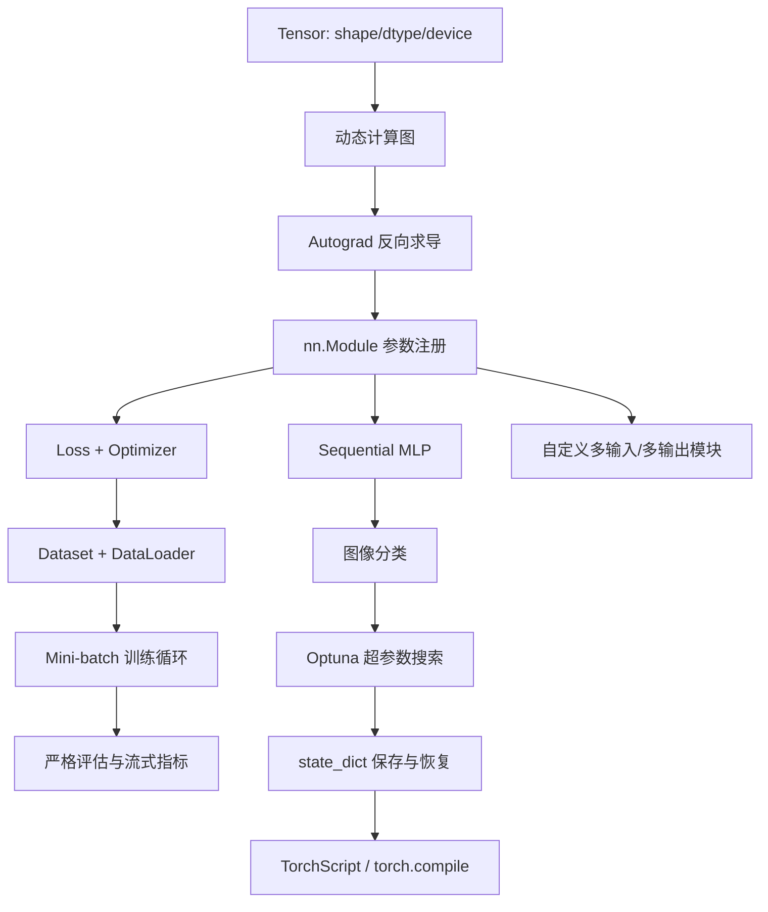
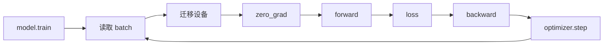

> 书目：*Hands-On Machine Learning with Scikit-Learn and PyTorch*<br>
> 章节：Chapter 10, Building Neural Networks with PyTorch<br>
> 章节文件：10. Building Neural Networks with PyTorch.md<br>
> 配套 Notebook：<https://homl.info/colab-p>

---

## 阅读导引

### 本章要解决什么问题

上一章说明了 MLP 的数学结构与反向传播原理，但 Scikit-Learn 隐藏了训练过程，也不支持 GPU 和复杂计算图。本章沿着一个工程问题展开：

> 怎样把“张量计算 → 自动求导 → 参数更新 → 批量数据 → 评估 → 非顺序网络 → 调参 → 保存与部署”组成一条正确、可扩展的神经网络流水线？

核心难点不是写出 `model(X)`，而是维持一组必须同时成立的不变量：

- 数据、参数和中间张量位于兼容设备；
- shape、dtype 与损失函数契约一致；
- 每轮反传前梯度被正确清理；
- 训练与评估模式切换正确；
- 验证指标按样本而不是按 batch 错误聚合；
- 保存格式既安全又能恢复模型语义。

### 全章主线



### 一句话概括

$$
\boxed{
\text{PyTorch 用 Tensor 表示数据，用动态计算图记录运算，}
\text{用 Autograd 求梯度，用 Module/Optimizer/DataLoader 组织训练。}
}
$$

### 本文运行环境

核心示例已在 Windows、Python 3.12、PyTorch 2.11.0 CPU 环境验证。TorchVision、TorchMetrics 和 Optuna 是可选依赖；对应示例会注明安装命令与联网要求。GPU 输出、训练轨迹和编译性能依赖硬件、版本及随机性。

---

## 0. 必要基础与符号

### 0.1 张量不是数学张量的全部概念

机器学习中的 tensor 主要指同质的多维数值数组：

$$
\mathbf X\in\mathbb R^{d_1\times d_2\times\cdots\times d_k}
$$

$k$ 是 rank/维数，$(d_1,\ldots,d_k)$ 是 shape。它比 NumPy 数组多出两个关键能力：

1. 可驻留 CPU、GPU、MPS 等设备并由相应后端计算；
2. 可附着动态计算图，由 Autograd 自动求导。

### 0.2 常用 shape 约定

| 对象 | Shape |
| --- | --- |
| 表格 batch | $[B,F]$：batch、feature |
| 灰度图 batch | $[B,C,H,W]$，通常 $C=1$ |
| 多分类 logits | $[B,K]$ |
| 回归列目标 | $[B,1]$ |
| `nn.Linear(F,K).weight` | $[K,F]$ |
| `nn.Linear(F,K).bias` | $[K]$ |

### 0.3 训练目标

设模型 $f_\theta$、训练样本 $(\mathbf x_i,y_i)$、单样本损失 $\ell$：

$$
J(\theta)=\frac1N\sum_{i=1}^{N}
\ell(f_\theta(\mathbf x_i),y_i)
$$

mini-batch $\mathcal B_t$ 上用随机梯度近似全数据梯度：

$$
\widehat{\mathbf g}_t
=\frac1{|\mathcal B_t|}
\sum_{i\in\mathcal B_t}
\nabla_\theta\ell_i(\theta)
$$

$$
\theta_{t+1}=\theta_t-\eta\widehat{\mathbf g}_t
$$

若 batch 是独立同分布抽样，则该估计通常无偏；数据相关、类别采样或变长 batch 时需重新分析权重。

---

## 1. PyTorch Fundamentals

PyTorch 由 Meta AI 的前身 FAIR 开发，是 Lua Torch 的 Python 后继。它相较早期静态图框架强调 Pythonic 接口和 define-by-run 动态图：程序执行到哪个运算，就记录哪个运算。因此普通 Python 的条件、循环与调试器可以直接参与模型前向。

动态图的代价是每轮需要捕获运行路径，也可能发生 graph break；`torch.compile()` 则尝试把动态图中稳定部分编译优化。

---

## 2. PyTorch Tensors

### 2.1 创建、dtype 与类型提升

```python
import torch

X = torch.tensor([
    [1.0, 4.0, 7.0],
    [2.0, 3.0, 6.0],
])

print(X)
print(X.shape)
print(X.dtype)
print(X[:, 1])
print(X @ X.T)
```

参考输出：

```text
tensor([[1., 4., 7.],
        [2., 3., 6.]])
torch.Size([2, 3])
torch.float32
tensor([4., 3.])
tensor([[66., 56.],
        [56., 49.]])
```

单个 tensor 只能有一种 dtype。混合输入会提升到能容纳所有值的类型，通常遵循 complex > float > integer > bool。深度学习常用 `float32`：相对 `float64` 内存减半，硬件吞吐通常更高，精度一般足够。

### 2.2 元素运算、规约与矩阵乘法

$$
10(\mathbf X+1)
$$

是逐元素加法和乘法；`X.exp()` 也是逐元素指数。`X.mean()` 把所有元素规约为标量；`X.max(dim=0)` 沿第 0 维消去行，得到每列最大值及其索引。`X @ X.T` 是矩阵乘法，不是逐元素乘法。

维度原则：若 $\mathbf A\in\mathbb R^{m\times n}$、$\mathbf B\in\mathbb R^{n\times p}$：

$$
\mathbf A\mathbf B\in\mathbb R^{m\times p},
\qquad
(\mathbf A\mathbf B)_{ij}
=\sum_{r=1}^{n}A_{ir}B_{rj}
$$

### 2.3 NumPy 互操作：复制与共享

```python
import numpy as np
import torch

array = np.array([1.0, 2.0, 3.0])
copied = torch.tensor(array, dtype=torch.float32)
shared = torch.from_numpy(array)

array[0] = 99.0
print(copied)
print(shared)
print(shared.numpy() is array)
```

参考输出：

```text
tensor([1., 2., 3.])
tensor([99.,  2.,  3.], dtype=torch.float64)
False
```

`torch.tensor()` 复制数据；`torch.from_numpy()` 在 CPU 上与 NumPy 共享底层内存，所以任一方修改都会影响另一方。`shared.numpy() is array` 为 `False` 只表示 Python 数组对象不同，不代表存储不共享，可用 `np.shares_memory()` 检查。

共享转换有边界：GPU tensor 必须先 `.cpu()`；需要梯度的 tensor 必须先 `.detach()`；并非所有布局和 dtype 都可零复制。

### 2.4 View、reshape、permute 与 contiguous

Tensor 通常由底层 storage 加 shape、stride、offset 描述。许多切片、`view()`、`transpose()` 不复制数据，而只是创建 view。

对连续 $2\times3$ 张量，stride 通常为 $(3,1)$：跨一行移动 3 个元素，跨一列移动 1 个。转置后 stride 改变，内存排列未改变，因此某些 `view()` 不能直接使用。

```python
import torch

X = torch.arange(6).reshape(2, 3)
Y = X.T
print(X.stride(), Y.stride())
print(Y.is_contiguous())
print(Y.contiguous().view(-1))
```

`reshape()` 在可能时返回 view，不可能时自动复制；`view()` 要求 stride 兼容；`permute()` 只重排维度；`contiguous()` 按当前逻辑顺序创建连续副本。

### 2.5 Broadcasting

两个 shape 从末尾向前比较，每一维必须相等，或其中一个为 1，或某方缺失。例如：

$$
[B,F]+[F]\to[B,F]
$$

这使 bias 可加到每个样本：

$$
Z_{bj}=\sum_iX_{bi}W_{ji}+b_j
$$

Broadcast 通常不真实复制数据，但错误 shape 也可能“合法广播”出错误结果。例如预测 `[B,1]` 与目标 `[B]` 相减会广播为 `[B,B]`，所以回归目标常 `reshape(-1,1)`。

### 2.6 原地操作

名称以 `_` 结尾的操作原地修改 tensor，如 `relu_()`、`zero_()`。索引赋值也是原地修改。

优点是减少临时内存；风险是：

- 影响共享同一 storage 的 view/NumPy 数组；
- 覆盖 Autograd 反向所需值；
- 使代码更难推理；
- 对现代编译器而言不一定更快。

默认先使用非原地操作，仅在性能测量证明必要且梯度测试通过后再优化。

---

## 3. Hardware Acceleration

### 3.1 设备选择

```python
import torch

if torch.cuda.is_available():
    device = torch.device("cuda")
elif torch.backends.mps.is_available():
    device = torch.device("mps")
else:
    device = torch.device("cpu")

print(device)
```

当前验证环境输出：

```text
cpu
```

可选后端包括 Nvidia CUDA/cuDNN、Apple MPS、AMD ROCm、Intel oneAPI、TPU `torch_xla` 等。不同后端的算子覆盖、dtype 支持和数值行为不完全一致。

### 3.2 创建与迁移

两种在目标设备得到新 tensor 的方式：

```python
M1 = torch.tensor([[1.0, 2.0]], device=device)
M2 = torch.tensor([[1.0, 2.0]]).to(device)
```

模型和输入必须在同一设备，否则运算通常报错：

```python
model = model.to(device)
X_batch = X_batch.to(device)
```

`.to()` 在设备和 dtype 已一致时可能直接返回原对象；跨设备时会复制。频繁 CPU↔GPU 往返可能比计算本身更贵，应让一串运算尽量留在 GPU。

### 3.3 GPU 为什么并非总是更快

GPU 有大量并行计算单元，适合大矩阵和高算术强度任务。但总时间包括：

$$
T_{\text{total}}
=T_{\text{launch}}
+T_{\text{transfer}}
+T_{\text{compute}}
+T_{\text{sync}}
$$

小 tensor 的 kernel launch 和传输开销可能占主导，CPU 反而更快。GPU 操作常异步排队，准确计时需要同步：

```python
if device.type == "cuda":
    torch.cuda.synchronize()
```

### 3.4 可复现性的边界

`torch.manual_seed(42)` 固定随机数流，但不保证跨版本、平台和设备逐位一致。GPU 并行规约顺序改变时，浮点加法非结合性会放大微小差异：

$$
(a+b)+c\ne a+(b+c)
$$

可要求确定性算法：

```python
torch.use_deterministic_algorithms(True)
torch.backends.cudnn.benchmark = False
```

代价是速度下降，且缺少确定性实现的算子会报错。实验应记录版本、设备、随机种子和数据划分，而不是承诺绝对复现。

---

## 4. Autograd

### 4.1 动态计算图

```python
import torch

x = torch.tensor(5.0, requires_grad=True)
f = x**2
f.backward()
print(f)
print(x.grad)
```

输出：

```text
tensor(25., grad_fn=<PowBackward0>)
tensor(10.)
```

`x` 是需要梯度的叶节点。执行 `f=x**2` 时，PyTorch 创建 `PowBackward0` 节点并记录反向所需信息。`f.backward()` 从标量 $f$ 的种子梯度 $df/df=1$ 开始，按反向拓扑序应用链式法则：

$$
\frac{df}{dx}=2x=10
$$

每次 forward 创建当前执行路径的新图，因此条件和循环可以依赖运行时数据。

### 4.2 Vector–Jacobian Product

若输出 $\mathbf y=f(\mathbf x)\in\mathbb R^m$ 不是标量，Jacobian 为：

$$
\mathbf J_{ij}=\frac{\partial y_i}{\partial x_j}
$$

反向模式不会默认构造完整 Jacobian，而计算给定上游向量 $\mathbf v$ 的 VJP：

$$
\mathbf v^\top\mathbf J
$$

所以非标量输出调用 `y.backward(v)` 需要提供 seed $\mathbf v$。训练 loss 通常是标量，故可直接 `loss.backward()`。

### 4.3 梯度为什么累积

叶参数的 `.grad` 使用加法累积：

$$
\mathbf g\leftarrow\mathbf g+
\frac{\partial L}{\partial\theta}
$$

这支持梯度累积和多个 loss 共同反传，但普通训练若忘记清零，会把历史 batch 梯度混入当前更新。

```python
x = torch.tensor(3.0, requires_grad=True)
(x**2).backward()
print(x.grad)  # 6
(2 * x).backward()
print(x.grad)  # 6 + 2 = 8
x.grad.zero_()
```

`optimizer.zero_grad(set_to_none=True)` 常把梯度设为 `None`，可减少内存写入；下一次 backward 会新建梯度，而不是在零 tensor 上加。

### 4.4 参数更新为什么禁用梯度

梯度下降：

$$
x\leftarrow x-\eta\frac{df}{dx}
$$

参数更新不属于待微分模型，应放在 `torch.no_grad()` 中：

```python
learning_rate = 0.1
with torch.no_grad():
    x -= learning_rate * x.grad
```

否则对需要梯度的叶节点做原地修改会报错，且即便创建了更新图，也会无谓扩大后续计算图。

### 4.5 `no_grad`、`inference_mode` 与 `detach`

| 方法 | 范围 | 特点 |
| --- | --- | --- |
| `torch.no_grad()` | 上下文/装饰器 | 不记录新运算，适合更新和推理 |
| `torch.inference_mode()` | 上下文/装饰器 | 更强推理优化，禁用额外版本跟踪，限制更多 |
| `tensor.detach()` | 单个张量边界 | 返回共享 storage、但脱离当前图的 tensor |

`detach()` 不复制数据：修改 detached tensor 可能改变原 tensor。需要独立副本时使用 `detach().clone()`。

### 4.6 原地操作与版本计数

反向函数可能保存输入、输出、二者或都不保存。Tensor 每次原地修改都会增加 version counter；backward 发现保存值版本不匹配时，宁可报错也不返回静默错误梯度。

```python
import torch

t = torch.tensor(2.0, requires_grad=True)
z = t.exp()
z += 1

try:
    z.backward()
except RuntimeError as error:
    print(type(error).__name__)
```

`exp` 的导数等于其输出，因此 backward 保存 $e^t$；`z += 1` 覆盖该输出，导致版本不匹配。改成 `z = z + 1` 会创建新 tensor，旧中间值仍在图中。

保存规则是实现细节，不应靠记忆算子列表写危险代码。原则是：反传前不原地修改参与图的输入和中间结果。

### 4.7 从零最小化 $x^2$

```python
import torch

learning_rate = 0.1
x = torch.tensor(5.0, requires_grad=True)

for _ in range(100):
    loss = x**2
    loss.backward()

    with torch.no_grad():
        x -= learning_rate * x.grad
    x.grad.zero_()

print(round(x.item(), 8))
print(round(loss.item(), 12))
```

每步有：

$$
x_{t+1}=x_t-0.1(2x_t)=0.8x_t
$$

所以：

$$
x_t=5(0.8)^t\to0
$$

这也给出收敛条件。对 $f=x^2$：

$$
x_{t+1}=(1-2\eta)x_t
$$

要求 $|1-2\eta|<1$，即：

$$
0<\eta<1
$$

### 4.8 完整训练循环的五个动作

```python
optimizer.zero_grad()       # 1. 清理旧梯度
predictions = model(inputs) # 2. 前向
loss = criterion(predictions, targets)  # 3. 标量损失
loss.backward()             # 4. 反向求梯度
optimizer.step()            # 5. 更新参数
```

`zero_grad()` 放在 backward 前通常更安全。若需要用多个 micro-batch 模拟大 batch，则有意延后清零，并把每个 micro-loss 除以累积步数。

---

## 5. Implementing Linear Regression

### 5.1 模型与 MSE 梯度

对 batch $\mathbf X\in\mathbb R^{m\times n}$、权重 $\mathbf w\in\mathbb R^{n\times1}$、偏置 $b$：

$$
\widehat{\mathbf y}=\mathbf X\mathbf w+b
$$

$$
J=\frac1m
(\widehat{\mathbf y}-\mathbf y)^\top
(\widehat{\mathbf y}-\mathbf y)
$$

令 $\mathbf e=\widehat{\mathbf y}-\mathbf y$。由微分：

$$
dJ=\frac2m\mathbf e^\top d\mathbf e
=\frac2m\mathbf e^\top(\mathbf X\,d\mathbf w+\mathbf1\,db)
$$

因此：

$$
\boxed{
\nabla_{\mathbf w}J=\frac2m\mathbf X^\top\mathbf e
}
$$

$$
\boxed{
\frac{\partial J}{\partial b}
=\frac2m\mathbf1^\top\mathbf e
}
$$

Autograd 应得到相同结果。

### 5.2 标准化只能使用训练统计量

$$
\mu_j=\frac1{m_{train}}\sum_iX_{ij},
\qquad
s_j=\sqrt{\frac1{m_{train}-1}\sum_i(X_{ij}-\mu_j)^2}
$$

$$
X'_{ij}=\frac{X_{ij}-\mu_j}{s_j}
$$

验证和测试必须复用训练集的 $\mu_j,s_j$，否则数据泄漏。若某特征 $s_j=0$，必须删除、替换尺度或加保护值，避免除零。

目标应 reshape 为 `[m,1]`，否则 `[m]` 与预测 `[m,1]` 会广播成 `[m,m]`，得到错误 loss。

### 5.3 低层 Tensor + Autograd 实现

下面用合成数据避免网络下载，并让真实参数可验证：

```python
import torch

torch.manual_seed(42)
X_train = torch.randn(400, 3)
true_w = torch.tensor([[2.0], [-1.5], [0.5]])
true_b = torch.tensor(0.7)
y_train = X_train @ true_w + true_b

w = torch.randn(3, 1, requires_grad=True)
b = torch.tensor(0.0, requires_grad=True)

learning_rate = 0.1
for epoch in range(100):
    y_pred = X_train @ w + b
    loss = ((y_pred - y_train) ** 2).mean()
    loss.backward()

    with torch.no_grad():
        w -= learning_rate * w.grad
        b -= learning_rate * b.grad
    w.grad.zero_()
    b.grad.zero_()

print("loss:", round(loss.item(), 8))
print("w:", w.detach().flatten().round(decimals=4))
print("b:", b.detach().round(decimals=4))
```

预期收敛到 $\mathbf w=(2,-1.5,0.5)^\top,b=0.7$。

### 5.4 `nn.Linear` 的 shape 与 Parameter

```python
import torch.nn as nn

layer = nn.Linear(in_features=3, out_features=2)
print(layer.weight.shape)
print(layer.bias.shape)
print(layer(torch.ones(5, 3)).shape)
```

输出：

```text
torch.Size([2, 3])
torch.Size([2])
torch.Size([5, 2])
```

PyTorch 权重按 `[out_features,in_features]` 存储，前向为：

$$
\mathbf Y=\mathbf X\mathbf W^\top+\mathbf b
$$

`nn.Parameter` 是特殊 Tensor：作为 Module 属性赋值时会自动注册，递归出现在 `model.parameters()`、`named_parameters()` 和 `state_dict()` 中。普通 `requires_grad=True` tensor 不会自动注册。

调用 `model(X)` 会经过 `Module.__call__()`，再调用 `forward()`，并触发 hooks、模式和包装逻辑。因此不要直接调用 `model.forward(X)`。

### 5.5 高层 API：Module + Loss + Optimizer

```python
import torch
import torch.nn as nn

torch.manual_seed(42)
X_train = torch.randn(400, 3)
y_train = X_train @ torch.tensor([[2.0], [-1.5], [0.5]]) + 0.7

model = nn.Linear(3, 1)
criterion = nn.MSELoss()
optimizer = torch.optim.SGD(model.parameters(), lr=0.1)

for epoch in range(100):
    optimizer.zero_grad()
    predictions = model(X_train)
    loss = criterion(predictions, y_train)
    loss.backward()
    optimizer.step()

print("loss:", round(loss.item(), 8))
print("w:", model.weight.detach().flatten().round(decimals=4))
print("b:", model.bias.detach().round(decimals=4))
```

对应关系：

| 低层代码 | 高层 API |
| --- | --- |
| `X @ w + b` | `nn.Linear` / `model(X)` |
| 手写平方均值 | `nn.MSELoss()` |
| `loss.backward()` | 相同，仍由 Autograd 完成 |
| `w -= η*w.grad` | `optimizer.step()` |
| 每个 `.grad.zero_()` | `optimizer.zero_grad()` |

Optimizer 必须在模型移到目标设备后创建，因为 Adam 等优化器会为每个参数维护动量等状态；先创建再迁移可能使状态和新参数设备/对象不一致。

---

## 6. Implementing a Regression MLP

### 6.1 `nn.Sequential` 表示函数复合

回归 MLP：

$$
f_\theta(\mathbf X)
=\left[
\operatorname{ReLU}
\left(
\operatorname{ReLU}(\mathbf X\mathbf W_1^\top+\mathbf b_1)
\mathbf W_2^\top+\mathbf b_2
\right)
\right]
\mathbf W_3^\top+\mathbf b_3
$$

可直接写为：

```python
import torch
import torch.nn as nn

torch.manual_seed(42)
n_features = 8
model = nn.Sequential(
    nn.Linear(n_features, 50),
    nn.ReLU(),
    nn.Linear(50, 40),
    nn.ReLU(),
    nn.Linear(40, 1),
)

X_batch = torch.randn(32, n_features)
print(model(X_batch).shape)
print(sum(parameter.numel() for parameter in model.parameters()))
```

输出：

```text
torch.Size([32, 1])
2531
```

参数量：

$$
(8\times50+50)
+(50\times40+40)
+(40\times1+1)
=450+2040+41
=2531
$$

`nn.ReLU` 没有参数且不改变 shape。相邻线性层必须满足前层 `out_features` 等于后层 `in_features`。最后一层输出 1，因为目标 shape 是 `[B,1]`，回归输出不加激活以允许任意实数。

### 6.2 为什么不能把所有网络都写成 Sequential

`nn.Sequential` 适合单输入、单输出、严格链式的数据流。以下情况需要自定义 Module：

- skip/残差或分支连接；
- 同一层重复使用；
- 多输入、多输出；
- 数据相关的条件和循环；
- 中间输出参与多个 loss。

---

## 7. Mini-Batch Gradient Descent with DataLoaders

### 7.1 Dataset 与 DataLoader 的职责

`Dataset` 定义“数据集中有多少样本”和“按索引如何取得一个样本”：

```python
class DatasetProtocol:
    def __len__(self): ...
    def __getitem__(self, index): ...
```

`DataLoader` 负责：

- 生成 batch 索引；
- 可选 shuffle；
- 多进程读取和预取；
- 调用 collate 把样本组装成 batch；
- 可选 page-locked memory。

`TensorDataset` 是多个首维长度相同 tensor 的简单封装。

### 7.2 可运行的 Mini-batch 回归

```python
import torch
import torch.nn as nn
from torch.utils.data import DataLoader, TensorDataset

torch.manual_seed(42)
device = torch.device("cuda" if torch.cuda.is_available() else "cpu")

X = torch.randn(1_024, 2)
y = (2 * X[:, :1] - X[:, 1:2] + 0.5 * X[:, :1] * X[:, 1:2])
train_loader = DataLoader(
    TensorDataset(X, y),
    batch_size=32,
    shuffle=True,
)

model = nn.Sequential(
    nn.Linear(2, 32), nn.ReLU(),
    nn.Linear(32, 16), nn.ReLU(),
    nn.Linear(16, 1),
).to(device)
criterion = nn.MSELoss()
optimizer = torch.optim.Adam(model.parameters(), lr=0.01)

for epoch in range(30):
    model.train()
    squared_error_sum = 0.0
    sample_count = 0

    for X_batch, y_batch in train_loader:
        X_batch = X_batch.to(device)
        y_batch = y_batch.to(device)

        optimizer.zero_grad()
        predictions = model(X_batch)
        loss = criterion(predictions, y_batch)
        loss.backward()
        optimizer.step()

        # 按样本数累计，避免最后一个小 batch 权重过大
        squared_error_sum += loss.item() * len(X_batch)
        sample_count += len(X_batch)

    if epoch in {0, 9, 19, 29}:
        print(epoch + 1, round(squared_error_sum / sample_count, 6))
```

训练 loss 会降至接近 0；精确值依赖版本与设备。

### 7.3 `shuffle=True` 为什么只用于训练

顺序遍历的数据若按类别、时间或来源排序，连续 batch 的分布会偏离总体，使梯度相关且带来训练震荡。每 epoch shuffle 可改善 mini-batch 的代表性。

验证/测试不更新参数，无需 shuffle；保持顺序还便于把预测对应回原样本。时间序列若有因果约束，训练数据也不能无条件打乱。

### 7.4 训练循环的正确状态机



`model.train()` 不会自动训练，它只把 Module 设为训练模式。`Dropout` 会随机丢弃激活，BatchNorm 会更新运行统计。`model.eval()` 也不禁用梯度，只切换这些层的行为；评估还需 `no_grad()` 或 `inference_mode()`。

### 7.5 GPU 输入流水线

CUDA 常见设置：

```python
train_loader = DataLoader(
    train_dataset,
    batch_size=256,
    shuffle=True,
    pin_memory=True,
    num_workers=4,
    persistent_workers=True,
    prefetch_factor=2,
)

for X_batch, y_batch in train_loader:
    X_batch = X_batch.to("cuda", non_blocking=True)
    y_batch = y_batch.to("cuda", non_blocking=True)
```

- `pin_memory=True`：CPU 数据放入不可换页内存，便于 DMA；会占用更多 RAM。
- `non_blocking=True`：允许 CPU 不等待传输完成；通常与 pinned memory 配合才有明显价值。
- `num_workers>0`：子进程并行加载/变换。
- `prefetch_factor`：每个 worker 预取 batch 数。
- `persistent_workers=True`：跨 epoch 复用 worker。

这些不是越大越好。Windows 创建进程成本高，小数据或轻量变换可能 `num_workers=0` 更快；必须 benchmark。Windows 多进程脚本还应放在：

```python
if __name__ == "__main__":
    main()
```

---

## 8. Model Evaluation

### 8.1 评估必须同时满足三件事

```python
model.eval()
with torch.inference_mode():
    predictions = model(X_batch)
```

1. `eval()` 切换 Dropout/BatchNorm；
2. `inference_mode()` 不建图、降低内存；
3. 数据和模型仍须在同一设备，shape/dtype 仍须正确。

### 8.2 为什么“平均 batch RMSE”不等于整体 RMSE

第 $b$ 个 batch 的 MSE 为 $M_b$。平均 batch RMSE：

$$
\frac1B\sum_{b=1}^{B}\sqrt{M_b}
$$

整体 RMSE 在等大 batch 时为：

$$
\sqrt{\frac1B\sum_{b=1}^{B}M_b}
$$

平方根是凹函数，由 Jensen 不等式：

$$
\frac1B\sum_b\sqrt{M_b}
\le
\sqrt{\frac1B\sum_bM_b}
$$

所以先开根再平均会系统性偏小，除非所有 $M_b$ 相等。

即使是平均 batch MSE，最后一个 batch 较小时，简单平均也会给它与完整 batch 相同权重。严格整体 MSE 应累计所有平方误差：

$$
\operatorname{MSE}
=\frac{\sum_b\sum_{i\in b}\sum_j
(\hat y_{ij}-y_{ij})^2}
{\sum_b n_b d}
$$

### 8.3 严格评估函数

```python
import torch


def evaluate_regression(model, data_loader, device):
    model.eval()
    squared_error_sum = 0.0
    element_count = 0

    with torch.inference_mode():
        for X_batch, y_batch in data_loader:
            X_batch = X_batch.to(device)
            y_batch = y_batch.to(device)
            predictions = model(X_batch)
            squared_error_sum += (
                (predictions - y_batch) ** 2
            ).sum().item()
            element_count += y_batch.numel()

    mse = squared_error_sum / element_count
    return {"mse": mse, "rmse": mse**0.5}
```

这比收集每个 batch 的标量更严格。分类 accuracy 同理，应累计“正确数/样本数”，而不是简单平均不同大小 batch 的 accuracy。

### 8.4 Streaming Metrics

TorchMetrics 等流式指标内部维护充分统计量：

$$
S\leftarrow S+\sum e_i^2,
\qquad
n\leftarrow n+\#e_i,
\qquad
\operatorname{RMSE}=\sqrt{S/n}
$$

典型模式：

```python
import torchmetrics

metric = torchmetrics.MeanSquaredError(squared=False).to(device)
metric.reset()
with torch.inference_mode():
    for X_batch, y_batch in valid_loader:
        predictions = model(X_batch.to(device))
        metric.update(predictions, y_batch.to(device))
validation_rmse = metric.compute()
```

每次新数据集/epoch 前必须 `reset()`，否则会混入历史状态。

### 8.5 训练曲线的诊断

| 训练指标 | 验证指标 | 常见解释 |
| --- | --- | --- |
| 都持续改善 | 都改善 | 正常学习 |
| 训练好、验证恶化 | 分叉 | 过拟合、数据漂移或预处理不一致 |
| 都差且不动 | 平台 | 学习率/缩放/容量/代码问题 |
| 都剧烈波动 | 不稳定 | 学习率大、batch 小、数值问题 |

验证集只用于模型选择；调参结束后，在训练+验证上重训，再仅一次评估测试集。

---

## 9. Building Nonsequential Models with Custom Modules

### 9.1 自定义 Module 的三条规则

1. 继承 `nn.Module` 并先调用 `super().__init__()`；
2. 在 `__init__` 中把子模块/Parameter 赋给属性以完成注册；
3. 在 `forward()` 中只定义数据流，不手动调用 `backward()`。

### 9.2 Wide & Deep 为什么有效

普通 MLP 强迫所有特征经过多层非线性，简单线性规律可能被变换扭曲。Wide & Deep 同时提供：

- deep path：学习高阶、组合模式；
- wide/short path：保留原始或人工交叉特征；
- concat 后输出：由最后一层联合选择两类信息。

数学形式：

$$
\mathbf h=g_\phi(\mathbf x),
\qquad
\hat y=
\mathbf w^\top
[\mathbf x;\mathbf h]+b
$$

其中 $[\cdot;\cdot]$ 表示特征维拼接。

```python
import torch
import torch.nn as nn


class WideAndDeep(nn.Module):
    def __init__(self, n_features):
        super().__init__()
        self.deep_stack = nn.Sequential(
            nn.Linear(n_features, 50), nn.ReLU(),
            nn.Linear(50, 40), nn.ReLU(),
        )
        self.output_layer = nn.Linear(n_features + 40, 1)

    def forward(self, X):
        deep_output = self.deep_stack(X)
        combined = torch.cat([X, deep_output], dim=1)
        return self.output_layer(combined)


model = WideAndDeep(n_features=8)
print(model(torch.randn(16, 8)).shape)
```

输出：`torch.Size([16, 1])`。必须沿特征维 `dim=1` 拼接；沿 batch 维会破坏样本对应。

### 9.3 ModuleList/ModuleDict 为什么必要

普通 Python list 中的 Module 不一定被父模型注册，导致：

- `model.parameters()` 找不到它；
- `.to(device)` 不迁移它；
- `state_dict()` 不保存它；
- train/eval 模式不递归传播。

动态层集合应使用 `nn.ModuleList` 或 `nn.ModuleDict`；动态参数集合用 `nn.ParameterList` 或 `nn.ParameterDict`。

```python
class FlexibleMLP(nn.Module):
    def __init__(self, widths):
        super().__init__()
        self.layers = nn.ModuleList(
            nn.Linear(n_in, n_out)
            for n_in, n_out in zip(widths[:-1], widths[1:])
        )

    def forward(self, X):
        for layer in self.layers[:-1]:
            X = torch.relu(layer(X))
        return self.layers[-1](X)
```

### 9.4 Buffer 与 Parameter

模型中有些 tensor 需要随设备迁移和保存，但不应被优化，如类别统计、位置常量、BatchNorm 运行均值。应：

```python
self.register_buffer("feature_mean", mean_tensor)
```

Buffer 出现在 `state_dict()`，会跟随 `.to(device)`，但不出现在 optimizer 参数中。

---

## 10. Models with Multiple Inputs and Outputs

### 10.1 多输入的动机

不同模态可能无法先合成一个规则 tensor，例如图像 `[B,C,H,W]` 与文本 token `[B,T]`。模型可直接让 `forward()` 接收多个参数：

```python
class TwoInputWideAndDeep(nn.Module):
    def __init__(self, n_wide, n_deep):
        super().__init__()
        self.deep_stack = nn.Sequential(
            nn.Linear(n_deep, 32), nn.ReLU(),
            nn.Linear(32, 16), nn.ReLU(),
        )
        self.output = nn.Linear(n_wide + 16, 1)

    def forward(self, X_wide, X_deep):
        deep_output = self.deep_stack(X_deep)
        return self.output(torch.cat([X_wide, deep_output], dim=1))
```

Dataset 可返回位置参数：

```python
dataset = TensorDataset(X[:, :5], X[:, 2:], y)
for *inputs, target in DataLoader(dataset, batch_size=32):
    inputs = [tensor.to(device) for tensor in inputs]
    prediction = model(*inputs)
```

若输入多且顺序易混，应返回字典并用命名参数：

```python
class NamedDataset(torch.utils.data.Dataset):
    def __init__(self, X_wide, X_deep, y):
        self.X_wide = X_wide
        self.X_deep = X_deep
        self.y = y

    def __len__(self):
        return len(self.y)

    def __getitem__(self, index):
        inputs = {
            "X_wide": self.X_wide[index],
            "X_deep": self.X_deep[index],
        }
        return inputs, self.y[index]


for inputs, target in data_loader:
    inputs = {name: value.to(device) for name, value in inputs.items()}
    prediction = model(**inputs)
```

字典 key 必须与 `forward()` 参数名一致。

### 10.2 Building Models with Multiple Outputs：多输出与多任务学习

多输出的三类动机：

1. 任务本身需要，如物体分类 + 边界框回归；
2. 多任务共享表示，提高数据效率；
3. 辅助输出直接监督较低层，作为正则化和梯度捷径。

```python
class WideDeepWithAux(nn.Module):
    def __init__(self, n_wide, n_deep):
        super().__init__()
        self.deep_stack = nn.Sequential(
            nn.Linear(n_deep, 32), nn.ReLU(),
            nn.Linear(32, 16), nn.ReLU(),
        )
        self.main_output = nn.Linear(n_wide + 16, 1)
        self.aux_output = nn.Linear(16, 1)

    def forward(self, X_wide, X_deep):
        deep = self.deep_stack(X_deep)
        main = self.main_output(torch.cat([X_wide, deep], dim=1))
        auxiliary = self.aux_output(deep)
        return main, auxiliary
```

加权损失：

$$
L(\theta)
=\lambda L_{main}(\theta)
+(1-\lambda)L_{aux}(\theta)
$$

梯度线性：

$$
\nabla_\theta L
=\lambda\nabla_\theta L_{main}
+(1-\lambda)\nabla_\theta L_{aux}
$$

所以共享 deep path 同时接收主任务和辅助任务信号。原书示例取 $\lambda=0.8$。该权重是超参数；任务尺度不同会使“0.8/0.2”并不等于梯度贡献比例，可能需要标准化 loss、动态加权或检查梯度冲突。

```python
main_prediction, aux_prediction = model(X_wide, X_deep)
main_loss = criterion(main_prediction, target)
aux_loss = criterion(aux_prediction, target)
loss = 0.8 * main_loss + 0.2 * aux_loss
```

评估时可忽略纯正则化辅助输出；若两个输出都是业务任务，则必须分别报告指标。

---

## 11. Building an Image Classifier with PyTorch

### 11.1 Using TorchVision to Load the Dataset

TorchVision 提供视觉数据集、预训练模型和图像变换。Fashion-MNIST 有 60,000 张训练图、10,000 张测试图，每张为 $28\times28$ 灰度图，共 10 类。

安装可选依赖：

```text
python -m pip install torchvision torchmetrics
```

首次加载需要联网：

```python
import torch
import torchvision
import torchvision.transforms.v2 as T

to_tensor = T.Compose([
    T.ToImage(),
    T.ToDtype(torch.float32, scale=True),
])

train_and_valid_data = torchvision.datasets.FashionMNIST(
    root="datasets",
    train=True,
    download=True,
    transform=to_tensor,
)
test_data = torchvision.datasets.FashionMNIST(
    root="datasets",
    train=False,
    download=True,
    transform=to_tensor,
)

generator = torch.Generator().manual_seed(42)
train_data, valid_data = torch.utils.data.random_split(
    train_and_valid_data,
    [55_000, 5_000],
    generator=generator,
)
```

`transform` 在取样时执行，而不是预先把所有图像放入 RAM。`target_transform` 可独立变换标签。

### 11.2 Channel-first 与 Flatten

单张灰度图 shape 是 `[C,H,W]=[1,28,28]`，batch 是 `[B,1,28,28]`。PyTorch 视觉算子通常 channel-first；Matplotlib/PIL/OpenCV 等常使用 channel-last，跨库时要明确 `permute()`。

全连接层需要 `[B,F]`，所以：

$$
[B,1,28,28]
\xrightarrow{\operatorname{Flatten}}
[B,784]
$$

`nn.Flatten()` 默认保留 batch 维并压平其后维度。

### 11.3 分类器架构

```python
import torch
import torch.nn as nn


class ImageClassifier(nn.Module):
    def __init__(self, n_inputs, n_hidden1, n_hidden2, n_classes):
        super().__init__()
        self.mlp = nn.Sequential(
            nn.Flatten(),
            nn.Linear(n_inputs, n_hidden1),
            nn.ReLU(),
            nn.Linear(n_hidden1, n_hidden2),
            nn.ReLU(),
            nn.Linear(n_hidden2, n_classes),
        )

    def forward(self, X):
        return self.mlp(X)


model = ImageClassifier(28 * 28, 300, 100, 10)
logits = model(torch.randn(32, 1, 28, 28))
print(logits.shape)
```

输出：`torch.Size([32,10])`。输出层不加 softmax，因为训练损失直接接收 logits。

### 11.4 CrossEntropyLoss 的稳定推导

设正确类为 $c$，logits 为 $z_1,\ldots,z_K$：

$$
p_c=\frac{e^{z_c}}{\sum_je^{z_j}}
$$

$$
L=-\log p_c
=-z_c+\log\sum_je^{z_j}
$$

直接指数可能溢出。令 $a=\max_jz_j$：

$$
L
=-(z_c-a)
+\log\sum_je^{z_j-a}
$$

$z_j-a\le0$，指数不再上溢。`nn.CrossEntropyLoss` 融合 `LogSoftmax + NLLLoss`，避免先求极小概率再取 log，速度和数值稳定性都更好。

目标使用类别索引时：

- logits shape `[B,K]`，float；
- target shape `[B]`，`torch.long`；
- 类别索引必须在 $[0,K)$。

它也可接概率目标 `[B,K]`，此时 target 为 float 且每行应表示分布。

### 11.5 主要分类损失

| 任务 | 模型输出 | 损失 | 概率转换 |
| --- | --- | --- | --- |
| 互斥多分类 | $K$ logits | `CrossEntropyLoss` | `softmax(logits,dim=1)` |
| 多分类，模型输出 log-prob | $K$ log-prob | `NLLLoss` | `.exp()` |
| 二分类 | 1 logit | `BCEWithLogitsLoss` | `sigmoid(logit)` |
| 多标签 | 每标签 1 logit | `BCEWithLogitsLoss` | 各自 sigmoid |

`BCELoss` 要求模型先 sigmoid，通常不如融合版稳定。不要把已 softmax 的概率传给 `CrossEntropyLoss`，否则损失会把概率当 logits 再做一次 log-softmax。

### 11.6 `BCEWithLogitsLoss` 为什么稳定

二元交叉熵：

$$
L=-[y\log\sigma(z)+(1-y)\log(1-\sigma(z))]
$$

可化简为：

$$
\boxed{
L=\max(z,0)-zy+\log(1+e^{-|z|})
}
$$

推导思路：分别对 $z\ge0$ 与 $z<0$ 提取不会溢出的指数因子。该式不显式计算接近 0/1 的概率，避免 `log(0)`。

### 11.7 预测、概率和 Top-k

```python
import torch.nn.functional as F

model.eval()
with torch.inference_mode():
    logits = model(X_new)
    predictions = logits.argmax(dim=1)
    probabilities = F.softmax(logits, dim=1)
    top4_probabilities, top4_indices = probabilities.topk(k=4, dim=1)
```

最大 logit 与最大 softmax 概率索引相同，因为 softmax 对每个 logit 单调。

应先对**全部 logits** 做 softmax，再 `topk`。若先取 top-k logits 再 softmax，会把被丢弃类别质量移除并把 top-k 重新归一化到和为 1，得到的是条件化分布，不是原始 top-k 概率。

### 11.8 Label Smoothing

```python
criterion = nn.CrossEntropyLoss(label_smoothing=0.05)
```

PyTorch 的平滑目标可理解为把 one-hot 与均匀分布混合：

$$
\widetilde{\mathbf y}
=(1-\varepsilon)\mathbf y
+\varepsilon\frac{\mathbf1}{K}
$$

这降低模型把正确类推到概率 1 的压力，常改善泛化和过度自信，但不是概率校准的完整替代。

### 11.9 类别不平衡与权重

设类别 $k$ 有 $n_k$ 个样本，总数 $N$。反频率权重可取：

$$
\widetilde w_k=\frac{N}{n_k},
\qquad
w_k=\frac{\widetilde w_k}{\sum_j\widetilde w_j}
$$

```python
class_weights = torch.tensor([0.2205, 0.2835, 0.4961], device=device)
criterion = nn.CrossEntropyLoss(weight=class_weights)
```

权重整体乘常数在默认加权 mean 下常不改变相对梯度，但归一化便于解释。权重会改变优化目标和概率校准；替代方案包括分层采样、`WeightedRandomSampler`、focal loss 和阈值调整。

### 11.10 Accuracy 与训练循环

手写正确率无需 TorchMetrics：

```python
def evaluate_accuracy(model, data_loader, device):
    model.eval()
    correct = 0
    total = 0

    with torch.inference_mode():
        for X_batch, y_batch in data_loader:
            X_batch = X_batch.to(device)
            y_batch = y_batch.to(device)
            predictions = model(X_batch).argmax(dim=1)
            correct += (predictions == y_batch).sum().item()
            total += len(y_batch)

    return correct / total
```

原书 Fashion-MNIST MLP 训练准确率约 92.8%、验证准确率约 87.2%，显示过拟合；结果依赖硬件和训练设置。

---

## 12. Fine-Tuning Hyperparameters with Optuna

### 12.1 为什么不用穷举 Grid Search

学习率跨多个数量级，层数和宽度又形成组合空间。网格在不重要维度浪费大量试验，而且高维点数指数增长。随机搜索更容易覆盖每个超参数的不同值；Optuna 的 TPE 进一步利用历史试验集中到有希望区域。

### 12.2 Objective 与搜索分布

安装：

```text
python -m pip install optuna
```

```python
import optuna


def objective(trial, train_loader, valid_loader, device):
    learning_rate = trial.suggest_float(
        "learning_rate", 1e-5, 1e-1, log=True
    )
    n_hidden = trial.suggest_int("n_hidden", 20, 300)

    model = ImageClassifier(
        n_inputs=28 * 28,
        n_hidden1=n_hidden,
        n_hidden2=n_hidden,
        n_classes=10,
    ).to(device)
    optimizer = torch.optim.SGD(
        model.parameters(), lr=learning_rate
    )
    criterion = nn.CrossEntropyLoss()
    best_validation_accuracy = 0.0

    for epoch in range(10):
        model.train()
        for X_batch, y_batch in train_loader:
            X_batch = X_batch.to(device)
            y_batch = y_batch.to(device)
            optimizer.zero_grad()
            loss = criterion(model(X_batch), y_batch)
            loss.backward()
            optimizer.step()

        validation_accuracy = evaluate_accuracy(
            model, valid_loader, device
        )
        best_validation_accuracy = max(
            best_validation_accuracy, validation_accuracy
        )
        trial.report(validation_accuracy, step=epoch)
        if trial.should_prune():
            raise optuna.TrialPruned()

    return best_validation_accuracy
```

学习率应 `log=True`：$10^{-5}$ 到 $10^{-4}$ 与 $10^{-2}$ 到 $10^{-1}$ 都相差一个数量级，在线性均匀分布中前者几乎采不到。

### 12.3 TPE 的直觉

TPE 根据历史观测把参数样本分成较好集合和较差集合，分别估计密度 $l(x)$ 与 $g(x)$，倾向选择 $l(x)/g(x)$ 大的候选：它在好试验中常见、坏试验中少见。

这是序贯模型优化：后一个 trial 依赖前面结果，所以比纯随机更聚焦，但也可能过早聚焦；合理搜索空间和足够 startup trials 仍很重要。

```python
sampler = optuna.samplers.TPESampler(seed=42)
study = optuna.create_study(
    direction="maximize",
    sampler=sampler,
)
study.optimize(
    lambda trial: objective(
        trial, train_loader, valid_loader, device
    ),
    n_trials=50,
)

print(study.best_params)
print(study.best_value)
```

原书 5 次试验参考：学习率约 0.0853、每隐藏层 116 个神经元，验证准确率约 0.8868。5 次远不足以稳定搜索，仅用于演示 API。

### 12.4 Pruning 为什么节省算力

若 trial 在早期 epoch 已明显差于历史中位数，继续训练的机会成本高。MedianPruner 在相同步数比较历史 trial：

```python
pruner = optuna.pruners.MedianPruner(
    n_startup_trials=5,
    n_warmup_steps=2,
    interval_steps=1,
)
study = optuna.create_study(
    direction="maximize",
    sampler=sampler,
    pruner=pruner,
)
```

Objective 每 epoch：

```python
trial.report(validation_accuracy, step=epoch)
if trial.should_prune():
    raise optuna.TrialPruned()
```

过早 pruning 可能淘汰慢启动但最终优秀的配置，因此需要 warmup。验证噪声大时也要更谨慎。

### 12.5 数据传入与并行持久化

避免依赖全局变量，可用：

```python
from functools import partial

objective_with_data = partial(
    objective,
    train_loader=train_loader,
    valid_loader=valid_loader,
)
```

多进程/多机器可共享 SQLite/PostgreSQL storage 和 `study_name`。并行 trial 应使用不同种子；否则会重复相同随机轨迹。调参完成后，用最佳超参数在训练+验证集重训，测试集仅用于最终评估。

---

## 13. Saving and Loading PyTorch Models

### 13.1 保存整个对象：方便但脆弱

```python
torch.save(model, "model.pt")
loaded_model = torch.load("model.pt", weights_only=False)
```

这依赖 pickle：

- 加载不可信文件可能执行恶意代码；
- 自定义类代码并未嵌入，只保存导入路径引用；
- 重构模块路径、改类名或 Python 版本可能破坏加载。

因此只对完全可信、环境受控的文件使用完整对象反序列化。

### 13.2 推荐保存 `state_dict`

```python
torch.save(model.state_dict(), "model_weights.pt")

restored_model = ImageClassifier(28 * 28, 300, 100, 10)
state = torch.load(
    "model_weights.pt",
    map_location="cpu",
    weights_only=True,
)
restored_model.load_state_dict(state)
restored_model.eval()
```

`state_dict` 包含注册 Parameter 和持久 buffer 的名称到 tensor 映射。它只保存数据，不保存前向逻辑，所以加载前必须构造完全兼容的架构。

`load_state_dict()` 会报告 missing/unexpected keys；默认 `strict=True`，有不匹配即报错。迁移学习可显式 `strict=False`，但必须人工检查返回结果，不能无视缺失参数。

### 13.3 保存可恢复训练的 checkpoint

```python
checkpoint = {
    "epoch": epoch,
    "model_hparams": {
        "n_inputs": 28 * 28,
        "n_hidden1": 300,
        "n_hidden2": 100,
        "n_classes": 10,
    },
    "model_state": model.state_dict(),
    "optimizer_state": optimizer.state_dict(),
    "loss_history": loss_history,
}
torch.save(checkpoint, "checkpoint.pt")
```

继续训练还可能要保存 scheduler、AMP GradScaler、随机数状态、数据划分和配置版本。只保存权重只能推理或重新开始优化，不能恢复动量轨迹。

### 13.4 安全与可移植性

- 只加载可信来源；优先 `weights_only=True`。
- GPU checkpoint 在 CPU 环境用 `map_location="cpu"`。
- 保存代码/架构版本、依赖版本和预处理参数。
- Hugging Face `safetensors` 是只保存张量的安全格式。
- 不要把 scaler、类别映射等推理契约遗漏在模型之外。

---

## 14. Compiling and Optimizing Models

### 14.1 TorchScript 的两个入口

**Tracing** 用样例输入执行一次并记录实际算子：

```python
model.eval()
example = torch.randn(2, 1, 28, 28)
traced = torch.jit.trace(model, example)
```

适合静态数据流。若 forward 根据数据走 `if` 分支，trace 只记录本次走过的分支；循环也可能按样例次数展开。

**Scripting** 解析源代码：

```python
scripted = torch.jit.script(model)
```

可保留 tensor 条件和循环，但只支持 Python 子集，类型需稳定，动态语言特性受限。

两者都可：

```python
optimized = torch.jit.optimize_for_inference(traced)
traced.save("model_torchscript.pt")
loaded = torch.jit.load("model_torchscript.pt")
```

TorchScript 适合 LibTorch/C++ 部署，但已进入维护模式，不再是 PyTorch 新编译能力的重点。

### 14.2 `torch.compile`

```python
compiled_model = torch.compile(model)
output = compiled_model(example)
```

PyTorch 2.x 的典型链路：

```text
Python bytecode
  -> TorchDynamo 捕获图
  -> AOTAutograd 分解前后向
  -> TorchInductor 优化与生成代码
  -> Triton(GPU) / C++ OpenMP(CPU)
```

它可做算子融合、常量折叠、消除冗余和专门化。首次调用有编译开销，所以短任务可能更慢；动态 shape、Python 副作用或不支持操作可能 graph break 或重新编译。

`torch.compile()` 不等于导出稳定跨语言制品，主要优化当前 Python 运行。部署还可考虑 `torch.export`、ONNX 或平台专用运行时。

### 14.3 验证优化不能只看速度

优化前后应检查：

```python
with torch.inference_mode():
    eager_output = model(example)
    compiled_output = compiled_model(example)
torch.testing.assert_close(eager_output, compiled_output)
```

Benchmark 必须包含 warmup，并在 CUDA 上同步；同时测吞吐、延迟、峰值内存和不同 shape，不能只测一次 wall clock。

---

## 15. 章末练习与参考答案

### 练习 1：PyTorch 相比 NumPy 的关键能力

- GPU/MPS 等硬件加速；
- Autograd 动态自动微分；
- `nn.Module`、loss、optimizer、Dataset/DataLoader；
- 分布式训练、混合精度和编译；
- TorchVision 等生态。

### 练习 2：`exp()` 与 `exp_()`

无下划线版本返回新 tensor，不修改输入；下划线版本原地修改输入并返回它。`relu()`/`relu_()` 同理。原地操作可能节省内存，也可能破坏共享数据和 Autograd 保存值。

### 练习 3：两种在 GPU 创建 Tensor 的方法

```python
a = torch.tensor([1.0, 2.0], device="cuda")
b = torch.tensor([1.0, 2.0]).to("cuda")
```

前者直接在目标设备创建，后者先创建再复制。也可用 factory 的 `device`，或从已有 tensor `new_zeros()` 继承设备。

### 练习 4：三种不使用 Autograd 的计算方式

1. 输入都不设置 `requires_grad=True`；
2. 放入 `with torch.no_grad():`；
3. 对 tensor 使用 `detach()` 后再计算。

纯推理还可用 `torch.inference_mode()`，通常比 `no_grad()` 更激进。

### 练习 5：原地操作是否报错

#### 第一组

```python
t = torch.tensor(2.0, requires_grad=True)
z = t.cos().exp_()
z.backward()
```

PyTorch 2.11 可正常运行。`cos` backward 保存输入 $t$；`exp_` 原地把中间结果 $\cos t$ 改为 $e^{\cos t}$，它的 backward 可使用自己的输出。解析导数：

$$
\frac{dz}{dt}
=e^{\cos t}(-\sin t)
$$

$t=2$ 时约 $-0.5998$。

`z=t.cos_().exp()` 会立即报错，因为 `t` 是需要梯度的叶节点，不能原地修改。

`z=t.exp().cos_()` 前向可完成，但 backward 报版本错误。`exp` backward 需要保存输出 $e^t$，却被 `cos_` 覆盖。

#### 第二组

```python
u = torch.tensor(2.0, requires_grad=True)
v = u + 1
w = v.cos() * v.sin_()
w.backward()
```

会报错：`sin_()` 修改了 $v$；而前面 `cos()` 的 backward 保存输入 $v$。

改成：

```python
w = v.cos_() * v.sin()
```

可反传，但函数值不同。Python 从左到右求值：先把 $v$ 改成 $\cos3$，再计算 $\sin(\cos3)$，最终：

$$
w=\cos3\cdot\sin(\cos3)\approx0.8277
$$

而原本想表达的是：

$$
\cos3\sin3\approx-0.1397
$$

“不报错”不代表“语义正确”。

### 练习 6：`Linear(100,200)`

- 200 个输出神经元；
- `weight.shape == [200,100]`；
- `bias.shape == [200]`；
- 输入末维必须为 100，可为 `[100]`、`[B,100]` 或更高维 `[...,100]`；
- 输出把末维替换为 200，即 `[...,200]`；
- 参数量 $200\times100+200=20,200$。

### 练习 7：主要训练步骤

1. `model.train()`；
2. 遍历 DataLoader；
3. batch 移至设备；
4. `optimizer.zero_grad()`；
5. forward；
6. 计算标量 loss；
7. `loss.backward()`；
8. `optimizer.step()`；
9. 按样本累计指标；
10. `model.eval()` + 无梯度验证、记录 checkpoint/early stopping。

### 练习 8：为何迁移模型后再创建 Optimizer

Optimizer 保存参数对象引用，并可能为每个参数创建动量、二阶矩等状态。先创建 optimizer 后再把模型迁移设备，可能使 optimizer 引用/状态与实际训练参数不一致。稳定顺序：创建模型 → `.to(device)` → 创建 optimizer。

### 练习 9：GPU DataLoader 加速选项

通常尝试 `pin_memory=True`、适当 `num_workers`、`persistent_workers=True`、`prefetch_factor`，并在 `.to("cuda")` 时用 `non_blocking=True`。具体最优值需在目标平台 benchmark，Windows 尤其可能因多进程开销变慢。

### 练习 10：主要分类损失

- `CrossEntropyLoss`：互斥多分类 logits；
- `LogSoftmax + NLLLoss`：模型需要输出 log-prob 时；
- `BCEWithLogitsLoss`：二分类和多标签 logits；
- `Sigmoid + BCELoss`：可用但较不稳定，通常不优先。

### 练习 11：为何切换 train/eval

Dropout 在 train 模式随机屏蔽单元，在 eval 模式关闭；BatchNorm 在 train 模式使用当前 batch 并更新运行统计，在 eval 模式使用已保存统计。不切换会使评估随机、污染统计或推理分布错误。`eval()` 不关闭梯度，仍需 inference/no_grad。

### 练习 12：trace 与 script

`torch.jit.trace()` 记录样例实际执行的运算，容易使用但可能遗漏未走分支；`torch.jit.script()` 解析支持的 Python 源码，可保留控制流，但受静态类型和 Python 子集限制。

### 练习 13：Autograd 求梯度向量

$$
f(x,y)=\sin(x^2y)
$$

解析推导：

$$
\frac{\partial f}{\partial x}
=\cos(x^2y)\cdot2xy
$$

$$
\frac{\partial f}{\partial y}
=\cos(x^2y)\cdot x^2
$$

在 $(1.2,3.4)$：$x^2y=4.896$，所以：

$$
\nabla f(1.2,3.4)
\approx(1.4898647,0.2629173)
$$

```python
import torch

x = torch.tensor(1.2, requires_grad=True)
y = torch.tensor(3.4, requires_grad=True)
result = torch.sin(x**2 * y)
result.backward()
print(x.grad.item(), y.grad.item())
```

参考输出：

```text
1.489864706993103 0.26291730999946594
```

### 练习 14：自定义 Dense

第一版复用模块：

```python
import torch
import torch.nn as nn
import torch.nn.functional as F


class Dense(nn.Module):
    def __init__(self, in_features, out_features):
        super().__init__()
        self.linear = nn.Linear(in_features, out_features)
        self.relu = nn.ReLU()

    def forward(self, X):
        return self.relu(self.linear(X))
```

第二版手写 Parameter，并使用适合 ReLU 的 Kaiming 初始化：

```python
class DenseFromParameters(nn.Module):
    def __init__(self, in_features, out_features):
        super().__init__()
        self.weight = nn.Parameter(
            torch.empty(out_features, in_features)
        )
        self.bias = nn.Parameter(torch.zeros(out_features))
        nn.init.kaiming_uniform_(
            self.weight,
            nonlinearity="relu",
        )

    def forward(self, X):
        Z = X @ self.weight.T + self.bias
        return F.relu(Z)


torch.manual_seed(42)
layer = DenseFromParameters(3, 5)
output = layer(torch.randn(2, 3))
print(output.shape)
print([name for name, _ in layer.named_parameters()])
```

输出：

```text
torch.Size([2, 5])
['weight', 'bias']
```

### 练习 15：CoverType 分类 MLP

CoverType 有 581,012 个样本、54 个特征、7 类。首次 `fetch_covtype()` 需要联网。以下实现先划分，再只用训练集统计量标准化，避免把验证/测试分布信息泄漏到训练预处理。

```python
import torch
import torch.nn as nn
from sklearn.datasets import fetch_covtype
from sklearn.model_selection import train_test_split
from torch.utils.data import DataLoader, Dataset


class CoverTypeDataset(Dataset):
    def __init__(self, X, y, means, stds):
        X_tensor = torch.as_tensor(X, dtype=torch.float32)
        self.X = (X_tensor - means) / stds
        # 原标签为 1..7，CrossEntropyLoss 要求 0..6
        self.y = torch.as_tensor(y - 1, dtype=torch.long)

    def __len__(self):
        return len(self.y)

    def __getitem__(self, index):
        return self.X[index], self.y[index]


covtype = fetch_covtype()
X_train, X_temp, y_train, y_temp = train_test_split(
    covtype.data,
    covtype.target,
    test_size=0.2,
    stratify=covtype.target,
    random_state=42,
)
X_valid, X_test, y_valid, y_test = train_test_split(
    X_temp,
    y_temp,
    test_size=0.5,
    stratify=y_temp,
    random_state=42,
)

X_train_tensor = torch.as_tensor(X_train, dtype=torch.float32)
means = X_train_tensor.mean(dim=0)
stds = X_train_tensor.std(dim=0)
stds = torch.where(stds == 0, torch.ones_like(stds), stds)

train_data = CoverTypeDataset(X_train, y_train, means, stds)
valid_data = CoverTypeDataset(X_valid, y_valid, means, stds)
test_data = CoverTypeDataset(X_test, y_test, means, stds)

train_loader = DataLoader(train_data, batch_size=256, shuffle=True)
valid_loader = DataLoader(valid_data, batch_size=512)
test_loader = DataLoader(test_data, batch_size=512)
```

模型与训练：

```python
class CoverTypeMLP(nn.Module):
    def __init__(self, widths=(200, 100, 50)):
        super().__init__()
        dimensions = (54, *widths, 7)
        layers = []
        for n_inputs, n_outputs in zip(dimensions[:-2], dimensions[1:-1]):
            layers.extend([
                nn.Linear(n_inputs, n_outputs),
                nn.ReLU(),
            ])
        layers.append(nn.Linear(dimensions[-2], dimensions[-1]))
        self.network = nn.Sequential(*layers)

    def forward(self, X):
        return self.network(X)


device = torch.device("cuda" if torch.cuda.is_available() else "cpu")
torch.manual_seed(42)
model = CoverTypeMLP().to(device)
criterion = nn.CrossEntropyLoss()
optimizer = torch.optim.SGD(model.parameters(), lr=0.04)

for epoch in range(45):
    model.train()
    for X_batch, y_batch in train_loader:
        X_batch = X_batch.to(device, non_blocking=True)
        y_batch = y_batch.to(device, non_blocking=True)
        optimizer.zero_grad()
        loss = criterion(model(X_batch), y_batch)
        loss.backward()
        optimizer.step()

    if (epoch + 1) % 5 == 0:
        valid_accuracy = evaluate_accuracy(model, valid_loader, device)
        print(epoch + 1, round(valid_accuracy, 4))

test_accuracy = evaluate_accuracy(model, test_loader, device)
print("test accuracy:", round(test_accuracy, 4))
```

官方 Notebook 使用 `(200,100,50)`、batch 256 和逐步降低学习率的继续训练，最终测试准确率参考为：

```text
0.9488
```

单一学习率和不同划分未必复现该数值。严谨流程应保存最佳验证 checkpoint，再在测试集评估；若系统搜索深度、宽度、学习率和 batch size，可用 Optuna pruning 降低成本。

---

## 16. API 速查

| API | 用途 | 关键点 |
| --- | --- | --- |
| `torch.tensor` | 复制数据创建 Tensor | 显式 dtype/device |
| `torch.from_numpy` | 与 NumPy 共享 CPU 存储 | 双向修改可见 |
| `.to(device)` | 设备/dtype 转换 | 可能返回自身或复制 |
| `requires_grad` | 请求记录梯度 | 浮点/复数 Tensor |
| `.backward()` | 执行反向 VJP | 非标量需 seed |
| `.grad` | 叶节点累积梯度 | 每步正确清理 |
| `no_grad` | 暂停建图 | 更新/普通推理 |
| `inference_mode` | 强推理模式 | 更快但限制更多 |
| `detach` | 切断图并共享数据 | 独立副本再 `.clone()` |
| `nn.Parameter` | 注册可训练参数 | Module 属性中自动注册 |
| `register_buffer` | 注册非参数状态 | 保存并随设备迁移 |
| `nn.Sequential` | 严格链式模块 | 不适合分支/多输入 |
| `ModuleList` | 注册动态子模块列表 | 普通 list 不够 |
| `TensorDataset` | 包装同长度 tensors | 简单内存数据 |
| `DataLoader` | batch/shuffle/多进程 | 参数需 benchmark |
| `model.train/eval` | 切换层行为 | 不负责训练/禁梯度 |
| `CrossEntropyLoss` | 多分类 logits loss | 不先 softmax |
| `BCEWithLogitsLoss` | 二分类/多标签 | 比 sigmoid+BCE 稳定 |
| `state_dict` | 参数与 buffer 状态 | 推荐保存方式 |
| `torch.jit.trace/script` | TorchScript | 维护模式 |
| `torch.compile` | PyTorch 2 编译优化 | 首次编译和 graph break |

---

## 17. 易混淆概念与常见误解

| 误解 | 正确理解 |
| --- | --- |
| Tensor 就是 NumPy 数组换名字 | 还包含设备和 Autograd 语义 |
| `torch.tensor(numpy)` 零复制 | 它复制；`from_numpy` 才通常共享 |
| reshape 永远不复制 | 能 view 时不复制，否则可能复制 |
| 原地操作一定更快 | 可能妨碍 Autograd/编译，需实测 |
| 固定 seed 就绝对复现 | 跨设备/版本仍可能不同 |
| GPU 对所有计算更快 | 小任务可能被传输和启动开销主导 |
| backward 返回梯度 | 默认累积到叶节点 `.grad` |
| eval 会关闭梯度 | 只切换 Module 模式 |
| no_grad 会切换 Dropout | 不会，仍需 `eval()` |
| detach 会复制数据 | 默认共享 storage |
| 普通 list 中层也会注册 | 应用 `ModuleList/ModuleDict` |
| `model.forward(X)` 与 `model(X)` 完全等价 | 前者绕过 hooks 和 Module 调用逻辑 |
| 平均 batch RMSE 等于整体 RMSE | 非线性开根使二者不等 |
| 平均 batch MSE 永远精确 | 最后 batch 较小时需样本加权 |
| CrossEntropyLoss 前要 softmax | 它直接接 logits 并内部稳定计算 |
| top-k logits softmax 是原 top-k 概率 | 它会在 top-k 内重新归一化 |
| optimizer 可随意在 `.to()` 前创建 | 最好迁移模型后再创建 |
| state_dict 保存了模型代码 | 只保存参数和 buffer 数据 |
| `weights_only=False` 可加载任意模型 | pickle 可能执行恶意代码 |
| trace 能正确捕获所有分支 | 只记录样例执行路径 |
| compile 后第一次调用就更快 | 首次有编译开销，短任务可能更慢 |

---

## 18. 学习检查清单

### 概念与推导

- [ ] 能解释 shape、stride、view 和 contiguous
- [ ] 能区分复制与共享的 NumPy 转换
- [ ] 能写出 broadcasting 规则
- [ ] 能解释 GPU 启动、传输、计算和同步成本
- [ ] 能说明动态计算图和 VJP
- [ ] 能解释梯度为何累积
- [ ] 能区分 no_grad、inference_mode 与 detach
- [ ] 能解释原地操作的版本计数错误
- [ ] 能推导线性回归 MSE 梯度
- [ ] 能计算任意 Linear/MLP 参数量
- [ ] 能证明平均 batch RMSE 不等于整体 RMSE
- [ ] 能解释 Wide & Deep 的两条路径
- [ ] 能推导多任务加权损失梯度
- [ ] 能推导稳定 CrossEntropy/BCEWithLogits
- [ ] 能解释 TPE 与 pruning 的直觉
- [ ] 能区分 trace、script 和 compile

### 工程能力

- [ ] 能写出正确的五步训练循环
- [ ] 能用 Dataset/DataLoader 训练 mini-batch
- [ ] 能正确切换 train/eval 和梯度模式
- [ ] 能按样本严格聚合评估指标
- [ ] 能调 pin_memory/workers/prefetch
- [ ] 能创建注册完整的自定义 Module
- [ ] 能处理多输入、多输出和辅助 loss
- [ ] 能正确选择分类 loss 与 target dtype
- [ ] 能先 softmax 再提取原始 top-k 概率
- [ ] 能用 Optuna 搜索并剪枝 trial
- [ ] 能安全保存/加载 state_dict/checkpoint
- [ ] 能验证编译前后数值一致与真实性能
- [ ] 能完成 CoverType 93%+ 分类项目

---

## 19. 本章知识压缩

```text
【Tensor】
数据 = storage + shape + stride + dtype + device
PyTorch 比 NumPy 多：设备加速 + Autograd
下划线操作原地修改，默认慎用

【Autograd】
forward 动态记录计算图
backward 反向计算 VJP，并累积到叶节点 .grad
每步：zero_grad -> forward -> loss -> backward -> step

【设备】
模型和输入必须同设备
GPU 适合大规模并行；小任务受传输/启动制约
模型迁移后再创建 optimizer

【数据】
Dataset 定义单样本，DataLoader 组织 batch
训练 shuffle；评估不 shuffle
CUDA 可尝试 pin_memory + non_blocking + workers

【评估】
model.eval() 控制层行为
inference_mode() 禁止建图
按误差和/正确数/样本数聚合，不简单平均 batch 非线性指标

【架构】
Sequential：纯链式
Custom Module：分支、多输入、多输出、控制流
ModuleList/ParameterList 保证注册
Buffer 保存非训练状态

【分类】
多分类：logits + CrossEntropyLoss
二分类/多标签：logits + BCEWithLogitsLoss
概率只在推理时 softmax/sigmoid

【实验与部署】
Optuna：TPE 聚焦好区域，Pruner 提前结束坏 trial
优先保存 state_dict + 架构配置 + optimizer checkpoint
不可信 pickle 禁止加载
TorchScript 适合旧式/C++部署；torch.compile 优化当前运行
```
