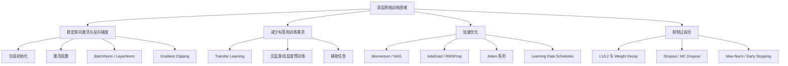

> 书目：*Hands-On Machine Learning with Scikit-Learn and PyTorch*<br>
> 章节：Chapter 11, Training Deep Neural Networks<br>
> 章节文件：11. Training Deep Neural Networks.md<br>
> 配套 Notebook：<https://homl.info/colab-p>

---

## 阅读导引

### 本章要解决的四类困难

浅层网络扩展到几十或几百层后，困难不只是计算量增加：

1. **优化不稳定**：反向传播的梯度逐层缩小或放大，底层几乎不学或直接发散；
2. **数据不足**：参数量巨大，而高质量标签昂贵；
3. **训练缓慢**：普通 SGD 在病态损失曲面上推进很慢；
4. **严重过拟合**：高容量网络可能记住训练数据和噪声。

作者的解决路线是先保证信号能流动，再减少从零学习的工作量，随后提高优化效率，最后约束模型容量：



### 一句话概括

$$
\boxed{
\text{深网训练的核心，是同时控制信号尺度、优化轨迹、有效数据量和模型自由度。}
}
$$

### 重要边界

- 初始化只能改善训练起点，不能保证训练全程稳定。
- 归一化、激活函数、优化器和学习率彼此耦合，不能脱离组合谈“最好”。
- 自适应优化器通常收敛快，但某些任务上 SGD/NAG 泛化更好。
- 迁移学习只有在源任务和目标任务共享可复用结构时才有效。
- 正则化强度过大也会造成欠拟合。

本文核心代码已在 Python 3.12、PyTorch 2.11.0 CPU 环境验证。CIFAR-10/TorchVision/TorchMetrics 示例需要联网及可选依赖，结果引用官方 Notebook 的保存输出。

---

## 0. 必要数学基础

### 0.1 深层复合函数与 Jacobian 连乘

设第 $l$ 层：

$$
\mathbf z_l=\mathbf W_l\mathbf a_{l-1}+\mathbf b_l,
\qquad
\mathbf a_l=\phi_l(\mathbf z_l)
$$

损失为 $J(\mathbf a_L)$。反向误差信号：

$$
\boldsymbol\delta_l
=\frac{\partial J}{\partial\mathbf z_l}
=
\left(\mathbf W_{l+1}^{\top}\boldsymbol\delta_{l+1}\right)
\odot\phi_l'(\mathbf z_l)
$$

从输出层传播到底层，本质上包含 Jacobian 的长乘积：

$$
\frac{\partial\mathbf a_L}{\partial\mathbf a_l}
=\mathbf J_L\mathbf J_{L-1}\cdots\mathbf J_{l+1}
$$

若各层有效范数平均小于 1，乘积随深度指数衰减；平均大于 1，则指数增长。标量直觉：

$$
0.8^{50}\approx1.43\times10^{-5},
\qquad
1.2^{50}\approx9.10\times10^3
$$

### 0.2 方差传播的基本假设

初始化分析通常作近似假设：

- 输入 $x_i$ 独立同分布、均值 0；
- 权重 $w_i$ 独立、均值 0，并与输入独立；
- 各项协方差可忽略；
- 层宽足够大，分布可用二阶矩描述。

这些在训练后不再严格成立，因此初始化理论主要保证起点附近的统计稳定。

### 0.3 范数与裁剪

向量 $\mathbf g$ 的 $L_2$ 范数：

$$
\|\mathbf g\|_2
=\sqrt{\sum_i g_i^2}
$$

范数裁剪是把超出半径 $c$ 的梯度投影到 $L_2$ 球面：

$$
\widetilde{\mathbf g}
=\mathbf g\min\left(1,\frac c{\|\mathbf g\|_2}\right)
$$

它保持方向；逐值裁剪 $\widetilde g_i=\operatorname{clip}(g_i,-c,c)$ 一般会改变方向。

---

## 1. The Vanishing/Exploding Gradients Problems

### 1.1 问题如何产生

反向传播从输出向输入逐层乘以权重和激活导数。Sigmoid：

$$
\sigma'(z)=\sigma(z)[1-\sigma(z)]\le\frac14
$$

当 $|z|$ 很大时，$\sigma'(z)\approx0$。如果权重尺度也不合适，底层梯度会趋近 0，权重几乎不更新，这就是**梯度消失**。反之，若连乘的有效增益长期大于 1，梯度和更新会爆炸，出现震荡、`inf` 或 `NaN`。

不稳定梯度意味着不同层学习速度悬殊。梯度爆炸在 RNN 中尤其明显，因为同一递归变换跨很多时间步反复相乘。

### 1.2 为什么旧式初始化与 Sigmoid 组合糟糕

旧式 $w\sim\mathcal N(0,1)$。若一层有 $n$ 个输入，线性输出：

$$
z=\sum_{i=1}^{n}w_ix_i
$$

在独立、零均值假设下：

$$
\operatorname{Var}(z)
=\sum_i\operatorname{Var}(w_ix_i)
=n\operatorname{Var}(w)\operatorname{Var}(x)
$$

若 $\operatorname{Var}(w)=1$，方差被放大约 $n$ 倍，Sigmoid 很快进入饱和区；其输出均值约 0.5 又不以 0 为中心，使下一层净输入产生偏移。前向饱和后，反向导数接近 0。

```python
import math

print(0.8**50)
print(1.2**50)
print(0.25**20)
```

参考输出：

```text
1.4272476927059638e-05
9100.438150002134
9.094947017729282e-13
```

---

## 2. Glorot Initialization and He Initialization

### 2.1 前向方差推导

令 fan-in 为 $n_{in}$，输入方差 $q=\operatorname{Var}(x_i)$，权重方差 $v_w$：

$$
\operatorname{Var}(z)
\approx n_{in}v_wq
$$

若激活近似线性并希望输出方差保持为 $q$：

$$
n_{in}v_wq=q
\quad\Longrightarrow\quad
v_w=\frac1{n_{in}}
$$

这是 LeCun 初始化的基本尺度。

### 2.2 反向方差与 Xavier 折中

反向经过线性层：

$$
\frac{\partial J}{\partial a_i}
=\sum_{j=1}^{n_{out}}w_{ji}
\frac{\partial J}{\partial z_j}
$$

类似地，希望反向方差不变要求：

$$
v_w\approx\frac1{n_{out}}
$$

除非 $n_{in}=n_{out}$，前后向条件不能同时精确满足。Glorot 用平均 fan：

$$
fan_{avg}=\frac{fan_{in}+fan_{out}}2
$$

### 2.3 公式 11-1：Glorot 初始化

正态分布：

$$
\boxed{
w_{ij}\sim\mathcal N
\left(0,\frac1{fan_{avg}}\right)
}
$$

均匀分布 $U(-r,r)$ 的方差为 $r^2/3$。令它等于 $1/fan_{avg}$：

$$
\frac{r^2}{3}=\frac1{fan_{avg}}
\quad\Longrightarrow\quad
\boxed{r=\sqrt{\frac3{fan_{avg}}}}
$$

### 2.4 ReLU 为什么需要 He 方差

对零均值对称 $z$，ReLU 大约把一半值置 0。若忽略均值修正，其二阶矩约减半：

$$
E[\operatorname{ReLU}(z)^2]
\approx\frac12E[z^2]
$$

要让激活二阶矩保持：

$$
\frac12n_{in}v_wq\approx q
\quad\Longrightarrow\quad
\boxed{v_w=\frac2{fan_{in}}}
$$

Leaky ReLU 负半轴斜率为 $\alpha$，平均平方增益约 $(1+\alpha^2)/2$：

$$
\boxed{
v_w=\frac2{(1+\alpha^2)fan_{in}}
}
$$

### 2.5 初始化速查（表 11-1）

| 初始化 | 激活 | 正态权重方差 |
| --- | --- | --- |
| Xavier/Glorot | Linear、tanh、sigmoid、softmax | $1/fan_{avg}$ |
| He/Kaiming | ReLU、Leaky ReLU、ELU、GELU、Swish、Mish、SwiGLU、ReLU² | $2/fan_{in}$（斜率变体需修正） |
| LeCun | SELU | $1/fan_{in}$ |

### 2.6 PyTorch 正确初始化

`nn.Linear` 的历史默认是 $U(-1/\sqrt{fan_{in}},+1/\sqrt{fan_{in}})$，方差 $1/(3fan_{in})$，不等于标准 He。应显式初始化：

```python
import torch
import torch.nn as nn


def use_he_init(module):
    if isinstance(module, nn.Linear):
        nn.init.kaiming_uniform_(
            module.weight,
            mode="fan_in",
            nonlinearity="relu",
        )
        nn.init.zeros_(module.bias)


model = nn.Sequential(
    nn.Linear(50, 40),
    nn.ReLU(),
    nn.Linear(40, 10),
)
model.apply(use_he_init)

print(round(model[0].weight.var().item(), 4))
print(model[0].bias.abs().sum().item())
```

理论方差为 $2/50=0.04$，有限样本结果会在附近波动；bias 输出为 0。

分类输出层可把初始权重再缩小，如除以 10，使初始 logits 接近、概率更均匀，避免一开始极端自信和大梯度。

### 2.7 正交初始化为何保范数

若方阵 $\mathbf W$ 正交：

$$
\mathbf W^\top\mathbf W=\mathbf I
$$

则：

$$
\|\mathbf W\mathbf x\|_2^2
=\mathbf x^\top\mathbf W^\top\mathbf W\mathbf x
=\|\mathbf x\|_2^2
$$

所以线性变换不改变向量范数，初始化时有助于稳定信号。矩形矩阵可让行或列正交；常用于 RNN/GAN，但不能抵消激活函数和训练更新的全部影响。

```python
weight = torch.empty(64, 64)
nn.init.orthogonal_(weight)
identity_error = (weight.T @ weight - torch.eye(64)).abs().max()
print(identity_error.item() < 1e-5)
```

---

## 3. Better Activation Functions

### 3.1 ReLU 与 Dying ReLU

$$
\operatorname{ReLU}(z)=\max(0,z),
\qquad
\operatorname{ReLU}'(z)=
\begin{cases}0,&z<0\\1,&z>0\end{cases}
$$

正区间不饱和、计算快，但如果某神经元对所有训练样本都有 $z<0$，其梯度为 0，参数不能直接恢复，这就是 dying ReLU。大学习率更容易把 bias/weights 推入全负区。下层参数变化有时能让它重新获得正输入，但不能依赖这种偶然恢复。

### 3.2 Leaky ReLU、RReLU 与 PReLU

$$
\operatorname{LeakyReLU}_\alpha(z)
=\max(\alpha z,z)
$$

$z<0$ 时导数为 $\alpha>0$，因此保留恢复通道。

- Leaky ReLU：固定 $\alpha$，常用 0.01～0.2；
- RReLU：训练时随机采样 $\alpha$，评估用均值，兼具正则化；
- PReLU：把 $\alpha$ 作为可训练 Parameter，大数据上灵活，小数据可能过拟合。

```python
alpha = 0.2
layer = nn.Linear(50, 40)
nn.init.kaiming_uniform_(
    layer.weight,
    a=alpha,
    nonlinearity="leaky_relu",
)
activation = nn.LeakyReLU(negative_slope=alpha)
```

### 3.3 公式 11-2：ELU

$$
\boxed{
\operatorname{ELU}_\alpha(z)=
\begin{cases}
\alpha(e^z-1),&z<0\\
z,&z\ge0
\end{cases}
}
$$

导数：

$$
\operatorname{ELU}_\alpha'(z)=
\begin{cases}
\alpha e^z,&z<0\\
1,&z>0
\end{cases}
$$

若 $\alpha=1$，在 0 左右函数值均为 0，导数均为 1，因此一阶光滑。负输出使均值更接近 0，负区梯度非零；代价是指数计算和负端饱和。

### 3.4 SELU 与自归一化条件

SELU 是缩放 ELU，约使用 $\lambda\approx1.0507,\alpha\approx1.6733$：

$$
\operatorname{SELU}(z)
=\lambda
\begin{cases}
\alpha(e^z-1),&z<0\\
z,&z\ge0
\end{cases}
$$

在论文假设下，均值/方差映射会把统计量推向固定点 $(0,1)$，形成 self-normalization。但依赖条件严格：

- 输入标准化；
- 每层 LeCun normal；
- 纯 Dense MLP，层宽足够；
- 不使用普通 Dropout、BN、LN、skip connection、max-norm 和常规 L1/L2；
- 如需 dropout，应使用 `AlphaDropout`。

违反条件后不再保证自归一化。现代复杂架构通常更常用显式 normalization。

### 3.5 公式 11-3：GELU

$$
\boxed{
\operatorname{GELU}(z)=z\Phi(z)
}
$$

$\Phi$ 是标准正态 CDF。概率直觉：输入 $z$ 被“以 $\Phi(z)$ 的软门概率保留”。导数：

$$
\operatorname{GELU}'(z)
=\Phi(z)+z\varphi(z)
$$

$\varphi$ 是标准正态 PDF。它平滑、非凸、非单调，常用于 Transformer。常用近似：

$$
\operatorname{GELU}(z)
\approx z\sigma(1.702z)
$$

### 3.6 Swish/SiLU、SwiGLU、Mish、ReLU²

Swish/SiLU：

$$
\operatorname{Swish}_\beta(z)=z\sigma(\beta z)
$$

$\beta=1$ 即 `nn.SiLU`。其导数：

$$
\sigma(\beta z)
+\beta z\sigma(\beta z)[1-\sigma(\beta z)]
$$

SwiGLU 把一半特征作为门、一半作为值：

$$
\operatorname{SwiGLU}(\mathbf z_1,\mathbf z_2)
=\operatorname{Swish}(\mathbf z_1)\odot\mathbf z_2
$$

```python
import torch.nn.functional as F


class SwiGLU(nn.Module):
    def forward(self, inputs):
        gate, values = inputs.chunk(2, dim=-1)
        return F.silu(gate) * values


inputs = torch.randn(4, 16)
print(SwiGLU()(inputs).shape)
```

输出为 `torch.Size([4,8])`。

Mish：

$$
\operatorname{Mish}(z)
=z\tanh(\log(1+e^z))
$$

ReLU²：

$$
\operatorname{ReLU}^2(z)=\max(0,z)^2
$$

它在 0 处一阶导数连续，输出稀疏且正侧梯度 $2z$ 无界，因此对离群值和学习率更敏感。

选择建议：ReLU 是高效默认；复杂深网可试 Swish/GELU；门控 Transformer 常用 SwiGLU；低延迟可试 ReLU/Leaky ReLU/HardSwish；SELU 仅在满足自归一化条件时考虑。

---

## 4. Batch Normalization

### 4.1 公式 11-4：训练时算法

对 batch $B$ 的 $m_B$ 个样本，逐特征：

$$
\boxed{
\boldsymbol\mu_B
=\frac1{m_B}\sum_{i=1}^{m_B}\mathbf x^{(i)}
}
$$

$$
\boxed{
\boldsymbol\sigma_B^2
=\frac1{m_B}\sum_{i=1}^{m_B}
(\mathbf x^{(i)}-\boldsymbol\mu_B)^2
}
$$

$$
\boxed{
\widehat{\mathbf x}^{(i)}
=\frac{\mathbf x^{(i)}-\boldsymbol\mu_B}
{\sqrt{\boldsymbol\sigma_B^2+\varepsilon}}
}
$$

$$
\boxed{
\mathbf z^{(i)}
=\boldsymbol\gamma\odot\widehat{\mathbf x}^{(i)}
+\boldsymbol\beta
}
$$

$\varepsilon$ 防除零并限制分母过小；$\gamma,\beta$ 由反向传播学习，使网络可以恢复或改变标准化后的尺度与位置。若最优变换不应标准化，模型可通过 $\gamma,\beta$ 近似撤销它。

### 4.2 训练与推理为何不同

单样本无法可靠估计 batch 方差；小 batch 和相关样本的统计也噪声大。训练时用当前 batch 统计，并更新 running buffers；推理时 `model.eval()` 使用 running mean/variance。

PyTorch 更新约定：

$$
\widehat v_{new}
=(1-m)\widehat v_{old}+m v_{batch}
$$

这里 `momentum=m` 是**新 batch 的权重**，与优化器 momentum 的传统含义相反。小 batch 统计噪声大时，可降低 $m$ 以加强平滑。

### 4.3 PyTorch 实现与参数/Buffer

```python
model = nn.Sequential(
    nn.Flatten(),
    nn.Linear(28 * 28, 300, bias=False),
    nn.BatchNorm1d(300),
    nn.ReLU(),
    nn.Linear(300, 100, bias=False),
    nn.BatchNorm1d(100),
    nn.ReLU(),
    nn.Linear(100, 10),
)

print(list(dict(model[2].named_parameters())))
print(list(dict(model[2].named_buffers())))
```

参考：

```text
['weight', 'bias']
['running_mean', 'running_var', 'num_batches_tracked']
```

`weight/bias` 对应 $\gamma/\beta$；running statistics 是 buffer，不由 optimizer 更新。BN 放在线性层后时，前层 bias 会被减均值抵消，因此可设 `bias=False`。

BN 放激活前还是后依任务而定，现代常见 `Linear/Conv -> BN -> Activation`，但不是定理。

### 4.4 1D、2D、3D 的归一化轴

| 模块 | 输入 shape | 每个统计量对应 |
| --- | --- | --- |
| `BatchNorm1d(C)` | `[N,C]` 或 `[N,C,L]` | 每个 channel，跨 N（及 L） |
| `BatchNorm2d(C)` | `[N,C,H,W]` | 每个 channel，跨 N/H/W |
| `BatchNorm3d(C)` | `[N,C,D,H,W]` | 每个 channel，跨 N/D/H/W |

序列若是 `[N,L,C]`，使用 BatchNorm1d 前需 `permute(0,2,1)`，之后再转回。

### 4.5 推理时融合 BN

前层：

$$
\mathbf y=\mathbf W\mathbf x+\mathbf b
$$

推理 BN：

$$
\mathbf z
=\boldsymbol\gamma\odot
\frac{\mathbf y-\boldsymbol\mu}
{\sqrt{\boldsymbol\sigma^2+\varepsilon}}
+\boldsymbol\beta
$$

令 $\mathbf d=\boldsymbol\gamma/\sqrt{\boldsymbol\sigma^2+\varepsilon}$：

$$
\boxed{\mathbf W'=\operatorname{diag}(\mathbf d)\mathbf W}
$$

$$
\boxed{
\mathbf b'=\mathbf d\odot(\mathbf b-\boldsymbol\mu)
+\boldsymbol\beta
}
$$

则 $\mathbf z=\mathbf W'\mathbf x+\mathbf b'$，可移除 BN 推理开销。只有 eval running stats 固定后才可融合。

### 4.6 优势与边界

BN 常允许更大学习率、降低初始化敏感性、加速收敛，并带来 batch 噪声正则化。但它：

- 增加训练计算；
- 依赖 batch 构成和大小；
- train/eval 行为不同；
- 在小 batch、RNN 或样本相关场景可能差；
- 不能自动替代所有输入数据治理。

---

## 5. Layer Normalization

LN 对每个样本独立，在最后若干特征维计算统计。对样本向量 $\mathbf x\in\mathbb R^H$：

$$
\mu=\frac1H\sum_{j=1}^{H}x_j,
\qquad
\sigma^2=\frac1H\sum_j(x_j-\mu)^2
$$

$$
\mathbf y
=\boldsymbol\gamma\odot
\frac{\mathbf x-\mu}{\sqrt{\sigma^2+\varepsilon}}
+\boldsymbol\beta
$$

它不依赖其他 batch 样本，训练和推理行为相同，无 running statistics，适合变长序列、小 batch、Transformer。

```python
import torch
import torch.nn as nn

inputs = torch.randn(32, 3, 10, 20)
layer_norm = nn.LayerNorm([10, 20])
outputs = layer_norm(inputs)

means = outputs.mean(dim=[2, 3])
variances = outputs.var(dim=[2, 3], unbiased=False)
print(outputs.shape)
print(means.abs().max().item() < 1e-5)
print((variances - 1).abs().max().item() < 1e-3)
```

它对每个样本、每个 channel 的 $10\times20$ 空间归一化。若用 `LayerNorm([3,10,20])`，则每张图跨 channel 和空间共同归一化。

| 维度 | BatchNorm | LayerNorm |
| --- | --- | --- |
| 统计轴 | 跨 batch（和空间） | 单样本最后若干特征维 |
| 小 batch | 统计噪声大 | 基本不受影响 |
| train/eval | 不同 | 相同 |
| running stats | 需要 | 不需要 |
| 常见场景 | CNN、大 batch | Transformer、序列、小 batch |

---

## 6. Gradient Clipping

### 6.1 Norm Clipping

```python
loss.backward()
total_norm = nn.utils.clip_grad_norm_(
    model.parameters(), max_norm=1.0
)
optimizer.step()
optimizer.zero_grad()
```

若全局梯度范数 $\|\mathbf g\|>c$：

$$
\mathbf g'=\frac{c}{\|\mathbf g\|}\mathbf g
$$

方向不变。注意 `clip_grad_norm_()` 默认把传入所有参数的梯度视为一个拼接向量，返回裁剪前总范数；不是分别把每层裁到 1。

### 6.2 Value Clipping

```python
nn.utils.clip_grad_value_(model.parameters(), clip_value=1.0)
```

对每个分量独立截断，可能改变方向。例如 $[0.9,100]$：

```python
import torch

gradient = torch.tensor([0.9, 100.0])
by_value = gradient.clamp(-1, 1)
by_norm = gradient * min(1.0, 1.0 / gradient.norm().item())
print(by_value)
print(by_norm.round(decimals=6))
```

参考输出：

```text
tensor([0.9000, 1.0000])
tensor([0.0090, 1.0000])
```

Norm clipping 保方向，通常是控制 exploding gradients 的默认；value clipping 有时对少量异常分量有效。裁剪阈值过小会让所有更新近似固定小步，掩盖学习率或模型问题。混合精度训练时应先 unscale 梯度再裁剪。

---

## 7. Reusing Pretrained Layers

### 7.1 为什么先寻找已有模型

深网低层往往学习边缘、纹理、局部形状等通用特征，高层更贴近源任务类别。若目标任务相似，从已有参数出发：

- 减少需要从零估计的参数；
- 缩短训练时间；
- 在少标签下降低估计方差；
- 常比随机初始化获得更好泛化。

但迁移依赖源域与目标域相似度。手机自然图像的特征不一定适合医学扫描或卫星遥感；输入尺寸、归一化、通道定义和类别语义都必须匹配。

### 7.2 复用层数的思路

通常替换输出层，因为类别数和语义不同。越相似的任务，越可复用高层；差异越大，越只保留通用低层。

推荐实验顺序：

1. 替换任务头，冻结全部 backbone；
2. 只训练新头，使随机头不再产生巨大梯度；
3. 从顶部逐块解冻；
4. 对预训练层使用更小学习率；
5. 用独立验证集选择解冻深度；
6. 若负迁移，减少复用层或改用更相似源模型。

### 7.3 Transfer Learning with PyTorch

```python
import copy
import torch
import torch.nn as nn

torch.manual_seed(42)
model_A = nn.Sequential(
    nn.Flatten(),
    nn.Linear(28 * 28, 100), nn.ReLU(),
    nn.Linear(100, 100), nn.ReLU(),
    nn.Linear(100, 8),
)

feature_extractor = copy.deepcopy(model_A[:-1])
model_B = nn.Sequential(
    *feature_extractor,
    nn.Linear(100, 1),
)

for parameter in model_B[:-1].parameters():
    parameter.requires_grad_(False)

optimizer = torch.optim.AdamW(
    model_B[-1].parameters(), lr=1e-3
)
criterion = nn.BCEWithLogitsLoss()

print(sum(p.numel() for p in model_B.parameters() if p.requires_grad))
```

输出 `101`，即新头的 $100$ 个权重和 1 个 bias。

解冻后可重建 optimizer 并使用分组学习率：

```python
for parameter in model_B[:-1].parameters():
    parameter.requires_grad_(True)

optimizer = torch.optim.AdamW([
    {"params": model_B[:-1].parameters(), "lr": 1e-5},
    {"params": model_B[-1].parameters(), "lr": 1e-4},
], weight_decay=1e-4)
```

冻结 Parameter 只阻止梯度，不自动冻结 BN running statistics 或 Dropout 随机性。若冻结的 backbone 含 BN，常需让该部分保持 eval 模式，或有意识地更新其统计。

### 7.4 小 Dense 网络上的证据边界

原书示例把 8 类 Fashion-MNIST 模型迁移到只有 20 张标注图的 T-shirt/Pullover 二分类，特定配置从 71.6% 提升到 92.5%。但作者明确说明，这是尝试许多配置后挑出的强结果；更换类别或随机种子，收益可能减小、消失或反转。

这提醒我们避免 p-hacking：

- 预先定义比较方案和指标；
- 报告多个随机种子均值与方差；
- 报告失败配置和搜索预算；
- 不把验证集反复试验后的最好值当无偏测试结果。

小型 Dense 网络通常学习高度任务特定的像素组合，迁移不稳定；深 CNN 和 Transformer 的层次表示更适合迁移。

### 7.5 Unsupervised Pretraining

若无相似预训练模型，但有大量未标注数据，可先学习输入分布或表示：

$$
\mathbf x
\xrightarrow{encoder}
\mathbf h
\xrightarrow{pretext\ head}
\widetilde{\mathbf x}
$$

例如 autoencoder 重建、对比学习、扩散建模。随后保留 encoder，换成目标任务头，用少量标签微调。

早期深网训练困难，曾逐层训练 RBM：训练一层、冻结、再叠下一层。现代初始化和优化改善后，通常一次训练完整预训练模型。

### 7.6 Auxiliary Task 与 Self-Supervised Learning

辅助任务提供易获得的监督信号。例如先训练“两个人脸是否属于同一人”，再复用人脸特征做少样本身份分类；文本中随机 mask token，并用原文本自动生成答案。

**Self-supervised learning** 的标签由数据自身自动生成，训练算法形式仍是监督学习。成功条件是辅助任务迫使模型学习目标任务所需信息；如果捷径特征即可解决辅助任务，迁移表示可能无用。

数据收集还必须满足版权、隐私、同意和用途限制；“网上可见”不等于可合法训练。

---

## 8. Faster Optimizers

### 8.1 为什么优化器能改变速度

普通 SGD：

$$
\boldsymbol\theta_t
=\boldsymbol\theta_{t-1}-\eta\mathbf g_t,
\qquad
\mathbf g_t=\nabla_\theta J_t(\boldsymbol\theta_{t-1})
$$

它只看当前梯度。在狭长谷地中，陡峭方向来回震荡，平缓方向推进很慢。优化器通过积累历史方向或按坐标缩放梯度来改善轨迹。

### 8.2 公式 11-5：Momentum

沿用原书“负速度”记号：

$$
\boxed{
\mathbf m_t
=\beta\mathbf m_{t-1}-\eta\mathbf g_t
}
$$

$$
\boxed{
\boldsymbol\theta_t
=\boldsymbol\theta_{t-1}+\mathbf m_t
}
$$

$\beta\in[0,1)$ 是 momentum coefficient。若梯度恒为 $\mathbf g$ 且 $\mathbf m_0=0$：

$$
\mathbf m_t
=-\eta\mathbf g
\sum_{k=0}^{t-1}\beta^k
=-\eta\mathbf g
\frac{1-\beta^t}{1-\beta}
$$

当 $t\to\infty$：

$$
\boxed{
\mathbf m_\infty
=-\frac{\eta}{1-\beta}\mathbf g
}
$$

$\beta=0.9$ 的稳定速度约为 SGD 当前步的 10 倍。若 $\beta=0.99999$，倍率约 100,000，建立动量的时间常数也约 $1/(1-\beta)=100,000$ 步：响应迟钝、严重过冲和长时间震荡。

```python
model = nn.Linear(10, 1)
optimizer = torch.optim.SGD(
    model.parameters(), lr=0.05, momentum=0.9
)
```

### 8.3 公式 11-6：Nesterov Accelerated Gradient

NAG 在“沿动量预走一步”的位置测梯度：

$$
\boxed{
\mathbf m_t
=\beta\mathbf m_{t-1}
-\eta\nabla J(
\boldsymbol\theta_{t-1}+\beta\mathbf m_{t-1})
}
$$

$$
\boldsymbol\theta_t
=\boldsymbol\theta_{t-1}+\mathbf m_t
$$

如果 momentum 越过谷底，当前位置梯度可能还在推动越过，而 look-ahead 梯度已指向谷底，能更早修正方向、减少横向振荡。

```python
optimizer = torch.optim.SGD(
    model.parameters(),
    lr=0.05,
    momentum=0.9,
    nesterov=True,
)
```

### 8.4 公式 11-7：AdaGrad

$$
\boxed{
\mathbf s_t
=\mathbf s_{t-1}+\mathbf g_t\odot\mathbf g_t
}
$$

$$
\boxed{
\boldsymbol\theta_t
=\boldsymbol\theta_{t-1}
-\eta\mathbf g_t
\oslash\sqrt{\mathbf s_t+\varepsilon}
}
$$

第 $i$ 个参数的有效学习率：

$$
\eta_{t,i}^{eff}
=\frac\eta{\sqrt{s_{t,i}+\varepsilon}}
$$

历史梯度大的陡峭方向衰减更快，使更新转向平缓方向；稀疏特征很少得到梯度，其有效学习率保留较大。问题是 $s_{t,i}$ 单调增长，学习率只降不升，深网可能过早停止。

### 8.5 公式 11-8：RMSProp

用指数移动平均遗忘久远平方梯度：

$$
\boxed{
\mathbf s_t
=\alpha\mathbf s_{t-1}
+(1-\alpha)\mathbf g_t^2
}
$$

$$
\boxed{
\boldsymbol\theta_t
=\boldsymbol\theta_{t-1}
-\eta\mathbf g_t
\oslash\sqrt{\mathbf s_t+\varepsilon}
}
$$

展开：

$$
\mathbf s_t
=(1-\alpha)\sum_{k=1}^{t}
\alpha^{t-k}\mathbf g_k^2
$$

旧梯度权重指数衰减，有效记忆长度约 $1/(1-\alpha)$；$\alpha=0.9$ 约记住最近 10 步量级。

```python
optimizer = torch.optim.RMSprop(
    model.parameters(), lr=0.001, alpha=0.9
)
```

### 8.6 公式 11-9：Adam

用常见“正一阶矩 + 参数减法”记号（与原书负动量写法等价）：

$$
\boxed{
\mathbf m_t
=\beta_1\mathbf m_{t-1}
+(1-\beta_1)\mathbf g_t
}
$$

$$
\boxed{
\mathbf v_t
=\beta_2\mathbf v_{t-1}
+(1-\beta_2)\mathbf g_t^2
}
$$

$$
\boxed{
\widehat{\mathbf m}_t
=\frac{\mathbf m_t}{1-\beta_1^t},
\qquad
\widehat{\mathbf v}_t
=\frac{\mathbf v_t}{1-\beta_2^t}
}
$$

$$
\boxed{
\boldsymbol\theta_t
=\boldsymbol\theta_{t-1}
-\eta\widehat{\mathbf m}_t
\oslash(\sqrt{\widehat{\mathbf v}_t}+\varepsilon)
}
$$

#### 为什么需要偏差修正

若初始 $\mathbf m_0=0$ 且恒定梯度 $\mathbf g$：

$$
E[\mathbf m_t]
=(1-\beta_1^t)\mathbf g
$$

早期被 $1-\beta_1^t$ 压向 0。除以该因子得到无偏的恒定梯度估计。二阶矩同理。

Adam 同时具有 momentum 的方向平滑和 RMSProp 的逐坐标缩放。默认 $\beta_1=0.9,\beta_2=0.999,\eta=10^{-3}$ 常是可用起点，但并非无需调参。

```python
optimizer = torch.optim.Adam(
    model.parameters(), lr=1e-3, betas=(0.9, 0.999)
)
```

### 8.7 AdaMax、NAdam 与 AdamW

**AdaMax** 用时间衰减梯度的 $L_\infty$ 尺度：

$$
\mathbf u_t
=\max(\beta_2\mathbf u_{t-1},|\mathbf g_t|)
$$

有时比 Adam 稳定，但通常不占优。

**NAdam** 把 Nesterov look-ahead 思想加入 Adam，某些任务稍快。

**AdamW** 解耦 weight decay。普通 L2 把 $\lambda\theta$ 加入梯度，Adam 会再按每个坐标的 $1/\sqrt{v_i}$ 缩放，因此惩罚也被自适应地扭曲：

$$
\Delta\theta_i^{L2}
\propto
-\eta\frac{g_i+\lambda\theta_i}
{\sqrt{v_i}+\varepsilon}
$$

AdamW 把衰减独立应用：

$$
\boxed{
	heta_i
\leftarrow
(1-\eta\lambda)\theta_i
-\eta\frac{\widehat m_i}
{\sqrt{\widehat v_i}+\varepsilon}
}
$$

所以所有坐标按统一比例收缩。SGD 中 L2 与 weight decay 可等价（学习率/系数约定匹配时）；自适应优化器中不等价。

```python
adamw = torch.optim.AdamW(
    model.parameters(), lr=1e-3, weight_decay=1e-2
)
```

### 8.8 自适应优化器的泛化边界

RMSProp/Adam 系列常快速到达低训练损失，但某些数据上找到的解泛化不如 SGD/NAG。原因可能与逐坐标缩放的隐式偏置及落入不同几何区域有关。实践中若 AdamW 验证性能令人失望，应公平比较经调参的 NAG，而不是只比较默认值。

二阶 Hessian 有 $n^2$ 元素，深网参数量大时存储和计算不可行。Shampoo 等方法用结构化统计近似曲率，但也增加状态和通信成本。

### 8.9 Training Sparse Models

三条常见路线：

1. L1 正则促使许多权重靠近 0；
2. 训练后非结构化剪枝小权重；
3. 结构化剪枝整个 neuron/channel/layer。

```python
import torch.nn.utils.prune as prune

layer = nn.Linear(100, 50)
prune.l1_unstructured(layer, name="weight", amount=0.3)
print((layer.weight == 0).float().mean().item())
```

输出约 `0.3`。非结构化稀疏不保证普通硬件实际加速，只有稀疏 kernel/存储支持时才有收益；结构化剪枝更容易获得真实延迟改善。剪枝后通常需微调。

### 8.10 优化器比较（表 11-2）

| 优化器 | 收敛速度 | 最终质量的一般倾向 | 主要风险 |
| --- | --- | --- | --- |
| SGD | 慢 | 常好 | 对尺度/LR 敏感 |
| Momentum | 中 | 常好 | 过冲 |
| NAG | 中/快 | 常好 | 多一个 momentum 参数 |
| AdaGrad | 中 | 深网常差 | 学习率过早衰减 |
| RMSProp | 快 | 任务相关 | 泛化可能不如 SGD |
| Adam/AdaMax/NAdam | 快 | 任务相关 | 状态内存、泛化差异 |
| AdamW | 快 | 常用强基线 | 仍需调 LR/decay |

星级表只是经验概括，不构成跨任务排序。

### 8.11 一维二次函数上的优化器演示

```python
import torch


def optimize(optimizer_class, **kwargs):
    parameter = torch.nn.Parameter(torch.tensor([8.0]))
    optimizer = optimizer_class([parameter], **kwargs)
    for _ in range(100):
        optimizer.zero_grad()
        loss = (parameter - 3).square().sum()
        loss.backward()
        optimizer.step()
    return parameter.item(), loss.item()


print("SGD", optimize(torch.optim.SGD, lr=0.05))
print("NAG", optimize(
    torch.optim.SGD, lr=0.05, momentum=0.9, nesterov=True
))
print("AdamW", optimize(
    torch.optim.AdamW, lr=0.1, weight_decay=0.0
))
```

三者都应收敛到 $\theta=3$ 附近，但速度轨迹不同；简单一维问题不能代表深网泛化。

---

## 9. Learning Rate Scheduling

### 9.1 为什么常数学习率两难

- 太大：更新跨过低谷，震荡或发散；
- 太小：早期推进慢，可能困在平台；
- 适中但恒定：前期尚可，末期仍围绕最优点跳动。

理想策略通常是前期较大以快速探索，末期较小以精细收敛；敏感模型还需从小学习率 warmup。

### 9.2 Exponential Scheduling

每个 epoch 乘 $\gamma$：

$$
\boxed{
\eta_t=\eta_0\gamma^t
}
$$

若 $\gamma=0.9$：

$$
\eta_{10}/\eta_0=0.9^{10}\approx0.349,
\qquad
\eta_{20}/\eta_0\approx0.122
$$

```python
import torch

parameter = torch.nn.Parameter(torch.tensor([1.0]))
optimizer = torch.optim.SGD([parameter], lr=0.1)
scheduler = torch.optim.lr_scheduler.ExponentialLR(
    optimizer, gamma=0.9
)

rates = []
for _ in range(4):
    optimizer.step()
    rates.append(optimizer.param_groups[0]["lr"])
    scheduler.step()  # epoch 级 scheduler 在该 epoch 的 optimizer 更新后调用

print([round(rate, 4) for rate in rates])
```

输出：`[0.1, 0.09, 0.081, 0.0729]`。

### 9.3 公式 11-10：Cosine Annealing

$$
\boxed{
\eta_t
=\eta_{min}
+\frac12(\eta_{max}-\eta_{min})
\left[1+\cos\left(\frac{t\pi}{T_{max}}\right)\right]
}
$$

端点：

$$
\eta_0=\eta_{max},
\qquad
\eta_{T_{max}}=\eta_{min}
$$

导数：

$$
\frac{d\eta}{dt}
=-\frac{\pi(\eta_{max}-\eta_{min})}{2T_{max}}
\sin\left(\frac{t\pi}{T_{max}}\right)
$$

两端斜率为 0，中段下降最快，因此学习率大部分时间保持较高，结束时平滑降到最小。

```python
optimizer = torch.optim.SGD([parameter], lr=0.1)
scheduler = torch.optim.lr_scheduler.CosineAnnealingLR(
    optimizer, T_max=4, eta_min=0.01
)

rates = []
for _ in range(5):
    optimizer.step()
    rates.append(optimizer.param_groups[0]["lr"])
    scheduler.step()
print([round(rate, 5) for rate in rates])
```

参考：`[0.1, 0.08682, 0.055, 0.02318, 0.01]`。

$T_{max}$ 要与计划训练长度匹配；如果训练何时结束未知，可用基于性能的调度。

### 9.4 Performance Scheduling

`ReduceLROnPlateau` 监控验证指标，连续 `patience` 次没有显著改善时乘 `factor`：

```python
scheduler = torch.optim.lr_scheduler.ReduceLROnPlateau(
    optimizer,
    mode="max",       # accuracy 越大越好
    patience=2,
    factor=0.2,
    min_lr=1e-6,
)

scheduler.step(validation_accuracy)
```

它响应实际学习进展，不必预知总 epoch；但验证噪声可能误触发，`patience/threshold` 需要匹配指标波动。不能把训练 loss 和验证 accuracy 混用 mode。

### 9.5 Warming Up

大 batch、深 Transformer/RNN 或初始曲面尖锐时，高学习率会在尚未形成稳定表示前破坏参数。Warmup 从较小学习率平滑升到主学习率。

线性 warmup，从比例 $a$ 到 1，共 $T_w$ 步：

$$
\eta_t
=\eta_{max}
\left[a+(1-a)\frac t{T_w}\right],
\qquad0\le t\le T_w
$$

```python
optimizer = torch.optim.SGD([parameter], lr=0.1)
warmup = torch.optim.lr_scheduler.LinearLR(
    optimizer,
    start_factor=0.1,
    end_factor=1.0,
    total_iters=3,
)

rates = []
for _ in range(4):
    optimizer.step()
    rates.append(optimizer.param_groups[0]["lr"])
    warmup.step()
print([round(rate, 3) for rate in rates])
```

输出：`[0.01,0.04,0.07,0.1]`。

现代 PyTorch 应在对应 `optimizer.step()` 后调用 scheduler，避免跳过首个学习率。组合 warmup 和 cosine 可用 `SequentialLR`，比手动启停两个 scheduler 更不易出错。

### 9.6 Cosine Annealing with Warm Restarts

每个周期从高学习率重新开始，帮助跳出平台/局部区域；后续周期可变长：

```python
scheduler = torch.optim.lr_scheduler.CosineAnnealingWarmRestarts(
    optimizer,
    T_0=2,
    T_mult=2,
    eta_min=0.001,
)
```

`T_0` 是首周期长度，`T_mult=2` 使周期长度依次 2、4、8……。重启只是学习率回升，不会重置模型或 optimizer momentum。高学习率可能暂时损害已学参数，应保存最佳验证 checkpoint。

### 9.7 1cycle Scheduling

典型 1cycle：

1. 学习率从 $\eta_0$ 升到 $\eta_{max}$；
2. momentum 从高值降到低值；
3. 后半程学习率降回低值，最后降几个数量级；
4. momentum 反向升回高值。

高学习率提供探索和隐式正则，末期极小学习率精调，可能出现 super-convergence。

```python
optimizer = torch.optim.SGD(
    model.parameters(), lr=1e-3, momentum=0.9
)
scheduler = torch.optim.lr_scheduler.OneCycleLR(
    optimizer,
    max_lr=0.05,
    epochs=n_epochs,
    steps_per_epoch=len(train_loader),
)

for epoch in range(n_epochs):
    for X_batch, y_batch in train_loader:
        optimizer.zero_grad()
        loss = loss_fn(model(X_batch), y_batch)
        loss.backward()
        optimizer.step()
        scheduler.step()  # 必须每个 batch/optimizer step 调用
```

`OneCycleLR` 是 **step-level** scheduler。若设置 `epochs * steps_per_epoch`，却每 epoch 只调用一次，就只走完整曲线的极小一段。更改模型、batch size 或优化器后应重新搜索 `max_lr`。

### 9.8 选择建议

- 不确定时：1cycle 或 `ReduceLROnPlateau`；
- 已知训练预算：cosine；
- 开头不稳定：加 warmup；
- 容易卡平台：warm restarts；
- 要恢复训练：同时保存 optimizer 和 scheduler `state_dict()`，以及 epoch/global step。

---

## 10. Avoiding Overfitting Through Regularization

深网的参数量远大于许多数据集样本量，能拟合噪声。早停、BN/LN 已有正则效果，本节讨论显式参数惩罚、随机子网络和参数约束。

### 10.1 L2 Regularization 与 Weight Decay

L2 目标：

$$
J_{reg}(\theta)
=J(\theta)+\frac\lambda2\|\theta\|_2^2
$$

梯度：

$$
\nabla J_{reg}
=\nabla J+\lambda\theta
$$

SGD 更新：

$$
	heta
\leftarrow
	heta-\eta(\nabla J+\lambda\theta)
=(1-\eta\lambda)\theta-\eta\nabla J
$$

这与 weight decay 等价。Adam 中 L2 项也被逐坐标自适应缩放，不再等价；应使用 AdamW 解耦 decay。

```python
optimizer = torch.optim.AdamW(
    model.parameters(), lr=1e-3, weight_decay=1e-4
)
```

### 10.2 Parameter Groups 排除 bias 与 normalization

衰减 bias 和 BN/LN 的 scale/shift 通常正则收益小，可能妨碍训练。按名称/维度分组时必须确保参数不重复、不遗漏：

```python
decay_params = []
no_decay_params = []

for name, parameter in model.named_parameters():
    if not parameter.requires_grad:
        continue
    if parameter.ndim == 1 or name.endswith("bias"):
        no_decay_params.append(parameter)
    else:
        decay_params.append(parameter)

optimizer = torch.optim.AdamW([
    {"params": decay_params, "weight_decay": 1e-4},
    {"params": no_decay_params, "weight_decay": 0.0},
], lr=1e-3)
```

维度为 1 的参数通常是 bias 或 normalization scale，但这是工程启发式，特殊模型需检查。

### 10.3 L1 Regularization 与稀疏性

$$
J_{reg}=J+\lambda\sum_i|\theta_i|
$$

$\theta_i\ne0$ 时次梯度为 $\operatorname{sign}(\theta_i)$；在 0 处次梯度集合为 $[-1,1]$。L1 在零点有尖角，能把参数推向 0：

```python
l1_penalty = sum(
    parameter.abs().sum()
    for parameter in decay_params
)
loss = main_loss + 1e-5 * l1_penalty
```

普通梯度法不保证得到精确零，常需阈值剪枝或 proximal 方法。稀疏参数也不自动带来硬件加速。

### 10.4 Dropout 的随机变量定义

每个激活 $a_i$ 独立采样 mask：

$$
m_i\sim\operatorname{Bernoulli}(q),
\qquad q=1-p
$$

PyTorch 使用 inverted dropout：

$$
\widetilde a_i
=\frac{m_i}{q}a_i
$$

期望保持：

$$
E[\widetilde a_i]
=\frac{E[m_i]}q a_i=a_i
$$

方差：

$$
\operatorname{Var}(\widetilde a_i)
=a_i^2\frac{p}{q}
$$

训练时注入乘性噪声，迫使神经元不依赖固定搭档，近似训练大量共享权重的子网络；eval 时不 dropout，也无需缩放。

```python
import torch
import torch.nn as nn

torch.manual_seed(42)
dropout = nn.Dropout(p=0.25)
inputs = torch.ones(100_000)

dropout.train()
train_output = dropout(inputs)
dropout.eval()
eval_output = dropout(inputs)

print(round(train_output.mean().item(), 3))
print(eval_output.unique())
```

参考均值接近 1，eval 唯一值为 `tensor([1.])`。

### 10.5 Dropout 的位置与强度

一般不 dropout 输出层。高层组合特征更易过拟合，可优先在顶部若干隐藏层使用。$p$ 常在 0.1～0.5 间：过拟合增大 $p$，欠拟合减小。

Dropout 增加梯度噪声，通常需要更多 epoch；普通推理时 `eval()` 关闭，几乎无额外延迟。SELU 自归一化网络必须用 `nn.AlphaDropout`，它额外做仿射修正以维持均值/方差。

比较 train/valid loss 时，应在 `eval()` 下重新计算训练 loss，否则 train loss 含 dropout 噪声，可能虚高并掩盖过拟合。

### 10.6 Monte Carlo Dropout

MC dropout 推理时保留 dropout，采样 $T$ 次子网络：

$$
\widehat{\mathbf p}
=\frac1T\sum_{t=1}^{T}
\operatorname{softmax}(\mathbf z^{(t)})
$$

不应先平均 logits 再 softmax：

$$
\operatorname{softmax}
\left(\frac1T\sum_t\mathbf z^{(t)}\right)
\ne
\frac1T\sum_t\operatorname{softmax}(\mathbf z^{(t)})
$$

softmax 非线性，前者会抹掉子模型间分歧并通常过度自信。

```python
import torch.nn.functional as F


def mc_dropout_predict(model, inputs, n_samples=50):
    model.eval()
    # 保持 BN 等层为 eval，只重新激活 Dropout
    for module in model.modules():
        if isinstance(module, nn.Dropout):
            module.train()

    samples = []
    with torch.inference_mode():
        for _ in range(n_samples):
            samples.append(F.softmax(model(inputs), dim=-1))

    all_probabilities = torch.stack(samples)
    return (
        all_probabilities.mean(dim=0),
        all_probabilities.std(dim=0),
    )
```

均值常改善集成预测，标准差提供 epistemic uncertainty 的近似线索；它不是完整、不偏的贝叶斯后验，也不保证分布外检测可靠。样本数越多 Monte Carlo 误差约按 $1/\sqrt T$ 下降，但延迟近似线性增长。

可自定义始终激活的模块：

```python
class McDropout(nn.Dropout):
    def forward(self, inputs):
        return F.dropout(inputs, self.p, training=True)
```

### 10.7 Max-Norm Regularization

对每个神经元的入权重向量约束：

$$
\|\mathbf w_j\|_2\le r
$$

Optimizer 更新后投影到 $L_2$ 球：

$$
\mathbf w_j
\leftarrow
\mathbf w_j
\min\left(1,\frac r{\|\mathbf w_j\|_2+\varepsilon}\right)
$$

```python
def apply_max_norm(model, max_norm=2.0, epsilon=1e-8):
    with torch.no_grad():
        for module in model.modules():
            if isinstance(module, nn.Linear):
                norms = module.weight.norm(
                    p=2, dim=1, keepdim=True
                )
                scales = (max_norm / (norms + epsilon)).clamp(max=1.0)
                module.weight.mul_(scales)
```

`Linear.weight` shape `[out,in]`，`dim=1` 计算每个**行/输出神经元**的入权重范数。卷积层一般跨 `[in_channels,kH,kW]` 维计算每个输出 kernel 的范数。

```python
layer = nn.Linear(5, 3, bias=False)
with torch.no_grad():
    layer.weight.fill_(10.0)
apply_max_norm(layer, max_norm=2.0)
print(layer.weight.norm(dim=1))
```

输出约 `tensor([2.,2.,2.])`。$r$ 越小正则越强；过小会限制表示能力。

---

## 11. Practical Guidelines

### 11.1 默认配置（表 11-3）

| 项目 | 实用起点 |
| --- | --- |
| 初始化 | He（ReLU 家族）；按激活调整 |
| 激活 | 浅层 ReLU；深层可试 Swish/GELU |
| 归一化 | 浅层可无；深层 BN 或 LN |
| 正则化 | Early stopping；需要时 AdamW decay |
| 优化器 | NAG 或 AdamW |
| 学习率调度 | ReduceLROnPlateau 或 1cycle |

这只是起点，必须通过验证数据和真实计算预算选择。

### 11.2 特殊目标的调整

- **数据少**：优先迁移学习、自监督预训练、数据增强；
- **稀疏模型**：L1 + 剪枝，确认后端真正支持稀疏；
- **低延迟**：减少层数，ReLU/LeakyReLU/HardSwish，融合 BN，量化到 FP16/INT8；
- **风险敏感**：校准、MC dropout/ensemble、不确定性阈值和拒绝预测；
- **小 batch/序列**：优先 LN，谨慎用 BN；
- **训练发散**：检查数据尺度、初始化、学习率、混合精度，再考虑 gradient clipping。

### 11.3 推荐诊断顺序

1. 先在小 batch 上过拟合少量数据，验证代码和容量；
2. 记录每层激活均值/方差、梯度范数、参数范数；
3. 检查 loss、metric、dtype、shape 与 label 契约；
4. 搜学习率，再比较初始化/归一化/优化器；
5. 最后加正则化解决已确认的过拟合；
6. 所有比较固定数据划分并使用多个随机种子。

---

## 12. 章末练习与参考答案

### 练习 1：Glorot 与 He 初始化解决什么问题

它们针对深网前向激活与反向梯度的方差逐层消失/爆炸。通过让权重方差随 fan-in/fan-out 缩小，使每层初始信号尺度大致稳定：

- Xavier：折中前向 $1/fan_{in}$ 和反向 $1/fan_{out}$；
- He：补偿 ReLU 大约丢弃一半二阶矩，使用 $2/fan_{in}$。

它们只保证初始化附近的统计尺度，不保证训练后始终稳定，也不能修复错误学习率、数据或架构。

### 练习 2：所有权重设成同一个随机值可以吗

不可以。若同层神经元初始参数相同，则对所有输入：

1. 前向输出相同；
2. 接收相同下游梯度；
3. 参数更新相同；
4. 永远保持相同。

这一层等价于一个神经元的重复，称为 symmetry problem。He 初始化要求每个权重独立随机采样，不是“先随机出一个值再复制”。

### 练习 3：Bias 可以初始化为 0 吗

通常可以。随机权重已经打破神经元对称性，bias 全零不会令神经元完全相同。例外取决于特定架构：某些门控单元会给 forget gate 正 bias，类别先验明显时可初始化输出 bias；但普通 Dense/Conv 的 bias 置零是标准做法。

### 练习 4：怎样选择激活函数

| 激活 | 适用场景 | 不利因素 |
| --- | --- | --- |
| ReLU | 通用、低延迟、浅/中等深度 | Dying ReLU、不光滑 |
| Leaky ReLU | 担心死神经元、低延迟 | 负斜率需选 |
| PReLU | 大数据、愿意增加参数 | 小数据可能过拟合 |
| ELU | 希望负输出和光滑 0 点 | 指数计算、负端饱和 |
| SELU | 满足严格条件的纯 Dense 自归一化 MLP | 与许多架构/正则不兼容 |
| GELU | Transformer、复杂任务 | 比 ReLU 贵 |
| Swish/SiLU | 深网通用强默认 | sigmoid 计算开销 |
| SwiGLU | 现代 Transformer FFN | 参数/计算增加 |
| Mish | 可接受额外成本时实验 | 收益通常很小 |
| ReLU² | 稀疏模型/Transformer 实验 | 梯度随正输入增长，稳定性差 |

输出层激活由任务决定，不按这张隐藏层表选择。

### 练习 5：Momentum 太接近 1 会怎样

终端倍率 $1/(1-\beta)$。$\beta=0.99999$ 时约 100,000：

- 历史梯度保留极久，难适应曲率变化；
- 更新速度可能巨大，严重过冲；
- 在谷底长时间震荡；
- 初始动量建立也极慢；
- 对噪声和学习率非常敏感。

需要相应极小学习率和很长训练，但通常没有必要；0.9 是常见起点。

### 练习 6：产生稀疏模型的三种方法

1. 训练时 L1 正则；
2. 训练后按权重绝对值非结构化剪枝；
3. 按 neuron/channel/layer 结构化剪枝。

还可在初始化时随机缩小部分权重、使用稀疏训练算法或蒸馏到小模型。稀疏率高不等于推理更快，需对应 kernel 和硬件支持。

### 练习 7：Dropout 是否降低速度

- **训练**：通常收敛所需 epoch 增加，也多一个 mask/缩放操作，所以变慢；
- **普通推理**：`eval()` 关闭 dropout，几乎不增加计算；
- **MC dropout 推理**：需执行 $T$ 次随机前向，延迟/计算近似增加 $T$ 倍，可通过 batch 并行缓解但不消除总计算。

### 练习 8：CIFAR-10 上训练 20 层 DNN

这是一项刻意困难的实验：把 $32\times32\times3$ 图像压平后用 20 层 Dense MLP，忽略了图像的局部和平移结构，远不如 CNN。重点是比较训练技巧，不是追求 CIFAR-10 最佳性能。

#### 8.1 数据与划分

首次运行需要安装 `torchvision` 并下载约 170 MB：

```text
python -m pip install torchvision
```

```python
import torch
import torchvision
import torchvision.transforms.v2 as T
from torch.utils.data import DataLoader, random_split

transform = T.Compose([
    T.ToImage(),
    T.ToDtype(torch.float32, scale=True),
])

train_and_valid = torchvision.datasets.CIFAR10(
    root="datasets",
    train=True,
    download=True,
    transform=transform,
)
test_data = torchvision.datasets.CIFAR10(
    root="datasets",
    train=False,
    download=True,
    transform=transform,
)

generator = torch.Generator().manual_seed(42)
train_data, valid_data = random_split(
    train_and_valid,
    [45_000, 5_000],
    generator=generator,
)

train_loader = DataLoader(
    train_data, batch_size=128, shuffle=True
)
valid_loader = DataLoader(valid_data, batch_size=256)
test_loader = DataLoader(test_data, batch_size=256)
```

官方 Notebook 的训练 loader 没有设置 `shuffle=True`；这里显式打乱，更符合 mini-batch 训练实践，因此结果不会完全相同。

#### 8.2 20 层 Swish + He 模型

```python
import copy
import torch.nn as nn


def initialize_he(module):
    if isinstance(module, nn.Linear):
        # PyTorch 没有专门的 SiLU gain，使用 ReLU 的 He 尺度作近似
        nn.init.kaiming_normal_(
            module.weight,
            mode="fan_in",
            nonlinearity="relu",
        )
        if module.bias is not None:
            nn.init.zeros_(module.bias)


def build_deep_mlp(
    activation_factory,
    use_batch_norm=False,
    dropout_factory=None,
    initializer=initialize_he,
):
    layers = [nn.Flatten()]
    n_inputs = 3 * 32 * 32

    for _ in range(20):
        layers.append(nn.Linear(n_inputs, 100, bias=not use_batch_norm))
        if use_batch_norm:
            layers.append(nn.BatchNorm1d(100))
        layers.append(activation_factory())
        if dropout_factory is not None:
            layers.append(dropout_factory())
        n_inputs = 100

    layers.append(nn.Linear(100, 10))
    model = nn.Sequential(*layers)
    model.apply(initializer)

    # 初始输出 logits 缩小，避免一开始极端自信
    with torch.no_grad():
        model[-1].weight.div_(10)
    return model
```

#### 8.3 Early Stopping 训练框架

```python
def accuracy_on_loader(model, data_loader, device):
    model.eval()
    correct = 0
    total = 0
    with torch.inference_mode():
        for X_batch, y_batch in data_loader:
            X_batch = X_batch.to(device)
            y_batch = y_batch.to(device)
            predictions = model(X_batch).argmax(dim=1)
            correct += (predictions == y_batch).sum().item()
            total += len(y_batch)
    return correct / total


def train_with_early_stopping(
    model,
    optimizer,
    train_loader,
    valid_loader,
    device,
    max_epochs=100,
    patience=10,
    scheduler=None,
    scheduler_per_batch=False,
):
    criterion = nn.CrossEntropyLoss()
    best_accuracy = -float("inf")
    best_state = None
    epochs_without_improvement = 0
    history = []

    for epoch in range(max_epochs):
        model.train()
        loss_sum = 0.0
        sample_count = 0

        for X_batch, y_batch in train_loader:
            X_batch = X_batch.to(device)
            y_batch = y_batch.to(device)
            optimizer.zero_grad()
            loss = criterion(model(X_batch), y_batch)
            loss.backward()
            optimizer.step()
            if scheduler is not None and scheduler_per_batch:
                scheduler.step()

            loss_sum += loss.item() * len(y_batch)
            sample_count += len(y_batch)

        valid_accuracy = accuracy_on_loader(
            model, valid_loader, device
        )
        if scheduler is not None and not scheduler_per_batch:
            # ReduceLROnPlateau 应传指标；普通 epoch scheduler 不传
            if isinstance(
                scheduler, torch.optim.lr_scheduler.ReduceLROnPlateau
            ):
                scheduler.step(valid_accuracy)
            else:
                scheduler.step()

        history.append({
            "loss": loss_sum / sample_count,
            "valid_accuracy": valid_accuracy,
        })

        if valid_accuracy > best_accuracy:
            best_accuracy = valid_accuracy
            best_state = copy.deepcopy(model.state_dict())
            epochs_without_improvement = 0
        else:
            epochs_without_improvement += 1

        print(
            f"epoch={epoch + 1:03d} "
            f"loss={history[-1]['loss']:.4f} "
            f"valid_acc={valid_accuracy:.4f}"
        )
        if epochs_without_improvement >= patience:
            break

    model.load_state_dict(best_state)
    return history, best_accuracy
```

基础 Swish 模型：

```python
device = torch.device("cuda" if torch.cuda.is_available() else "cpu")
torch.manual_seed(42)
model = build_deep_mlp(nn.SiLU).to(device)
optimizer = torch.optim.NAdam(model.parameters(), lr=2e-3)

history, best_accuracy = train_with_early_stopping(
    model,
    optimizer,
    train_loader,
    valid_loader,
    device,
)
print("best validation accuracy:", best_accuracy)
```

官方 Notebook 特定环境保存的基础最佳验证准确率约 0.3802。它说明 20 层纯 Dense 网络即便使用 He+Swish+NAdam，也很难学习 CIFAR-10。

#### 8.4 加 Batch Normalization

```python
torch.manual_seed(42)
bn_model = build_deep_mlp(
    nn.SiLU,
    use_batch_norm=True,
).to(device)
optimizer = torch.optim.NAdam(bn_model.parameters(), lr=2e-3)

bn_history, bn_best = train_with_early_stopping(
    bn_model,
    optimizer,
    train_loader,
    valid_loader,
    device,
)
```

官方参考最佳验证准确率约 0.4008。BN 前几轮训练 accuracy 提升更快，但每 epoch 较慢，验证收益有限并更早过拟合。应同时比较 wall time、达到某准确率所需时间和最佳验证性能，而不只比较 epoch 数。

#### 8.5 SELU 自归一化版本

需要训练集逐像素均值/标准差、LeCun normal、纯 Dense、无 BN。下面的模块把统计量注册为 buffer：

```python
class Standardize(nn.Module):
    def __init__(self, mean, std):
        super().__init__()
        self.register_buffer("mean", mean)
        self.register_buffer("std", std.clamp_min(1e-6))

    def forward(self, inputs):
        flat = inputs.flatten(start_dim=1)
        return (flat - self.mean) / self.std


def compute_flat_stats(data_loader):
    total = None
    total_square = None
    count = 0
    for X_batch, _ in data_loader:
        flat = X_batch.flatten(start_dim=1).double()
        batch_sum = flat.sum(dim=0)
        batch_square = flat.square().sum(dim=0)
        total = batch_sum if total is None else total + batch_sum
        total_square = (
            batch_square
            if total_square is None
            else total_square + batch_square
        )
        count += len(flat)
    mean = total / count
    variance = total_square / count - mean.square()
    return mean.float(), variance.clamp_min(0).sqrt().float()


def initialize_lecun(module):
    if isinstance(module, nn.Linear):
        nn.init.normal_(
            module.weight,
            mean=0.0,
            std=(1 / module.in_features) ** 0.5,
        )
        if module.bias is not None:
            nn.init.zeros_(module.bias)


def build_selu_mlp(mean, std, dropout_rate=None):
    layers = [Standardize(mean, std)]
    for layer_index in range(20):
        n_inputs = 3 * 32 * 32 if layer_index == 0 else 100
        layers.extend([nn.Linear(n_inputs, 100), nn.SELU()])
        if dropout_rate is not None:
            layers.append(nn.AlphaDropout(dropout_rate))
    layers.append(nn.Linear(100, 10))

    model = nn.Sequential(*layers)
    model.apply(initialize_lecun)
    return model


mean, std = compute_flat_stats(train_loader)
selu_model = build_selu_mlp(mean, std).to(device)
```

官方参考最佳验证准确率约 0.4564，优于该实验的 Swish/BN 版本，但仍远低于合理 CNN。该结果不能证明 SELU 普遍优于 Swish。

#### 8.6 Alpha Dropout 与 MC Dropout

通过同一个构建函数显式创建 AlphaDropout 版本：

```python
torch.manual_seed(42)
alpha_model = build_selu_mlp(
    mean, std, dropout_rate=0.1
).to(device)
optimizer = torch.optim.NAdam(alpha_model.parameters(), lr=1e-3)

alpha_history, alpha_best = train_with_early_stopping(
    alpha_model,
    optimizer,
    train_loader,
    valid_loader,
    device,
)
```

官方 AlphaDropout 版本最佳验证准确率约 0.4766。要在推理时激活 AlphaDropout：

```python
def mc_alpha_dropout_predict(model, inputs, n_samples=50):
    model.eval()
    for module in model.modules():
        if isinstance(module, nn.AlphaDropout):
            module.train()

    with torch.inference_mode():
        samples = torch.stack([
            torch.softmax(model(inputs), dim=-1)
            for _ in range(n_samples)
        ])
    return samples.mean(dim=0), samples.std(dim=0)
```

应在验证集选择 `n_samples`，再一次性测试。报告平均概率的 accuracy、NLL/Brier/ECE 和推理时间，不能只挑 accuracy 改善的样本。

#### 8.7 1cycle

```python
n_epochs = 60
torch.manual_seed(42)
model = build_selu_mlp(mean, std, dropout_rate=0.1).to(device)
optimizer = torch.optim.NAdam(model.parameters(), lr=1e-3)
scheduler = torch.optim.lr_scheduler.OneCycleLR(
    optimizer,
    max_lr=1e-2,
    epochs=n_epochs,
    steps_per_epoch=len(train_loader),
)

history, best_accuracy = train_with_early_stopping(
    model,
    optimizer,
    train_loader,
    valid_loader,
    device,
    max_epochs=n_epochs,
    patience=20,
    scheduler=scheduler,
    scheduler_per_batch=True,
)
```

官方 Notebook 保存的最佳验证准确率约 0.4634，但其通用训练函数每 epoch 只调用一次 `scheduler.step()`，没有走完按 batch 配置的 1cycle，不能视为正确的 1cycle 对照。上面的修正版每个 optimizer step 调度一次；需要重新运行后再比较结果。

### 练习 8 的实验结论

- He+Swish 解决了初始尺度问题，却不能弥补错误的图像归纳偏置；
- BN 加快训练不等于最终验证性能一定更高；
- SELU 只有满足全部条件时才是公平实验；
- Dropout/1cycle 的收益依超参数与实现细节；
- 正确的 CNN 架构通常远比继续打磨 20 层 Dense MLP 更重要；
- 所有结论应基于多个种子、相同预算和正确调度粒度。

---

## 13. 公式速查

| 编号/公式 | 含义 |
| --- | --- |
| 11-1 | Xavier：$\operatorname{Var}(W)=1/fan_{avg}$ |
| 11-2 | ELU 分段指数激活 |
| 11-3 | GELU：$z\Phi(z)$ |
| 11-4 | BN：batch 均值/方差、标准化、$\gamma/\beta$ |
| 11-5 | Momentum：历史梯度形成速度 |
| 11-6 | NAG：在 look-ahead 点求梯度 |
| 11-7 | AdaGrad：累计全部平方梯度 |
| 11-8 | RMSProp：EMA 平方梯度 |
| 11-9 | Adam：一/二阶矩 + 偏差修正 |
| 11-10 | Cosine annealing |
| He | $2/fan_{in}$ |
| Leaky He | $2/[(1+\alpha^2)fan_{in}]$ |
| Dropout | $\widetilde a=ma/(1-p)$ |
| Max-norm | $w\leftarrow w\min(1,r/\|w\|)$ |

## 14. PyTorch API 速查

| API | 作用 | 关键点 |
| --- | --- | --- |
| `xavier_uniform_/normal_` | Xavier 初始化 | tanh/linear 等 |
| `kaiming_uniform_/normal_` | He 初始化 | 传 mode/nonlinearity/a |
| `orthogonal_` | 正交初始化 | 初始化保范数 |
| `LeakyReLU/RReLU/PReLU` | ReLU 负区变体 | 配套 He gain |
| `ELU/SELU/GELU/SiLU/Mish` | 高级激活 | 成本和条件不同 |
| `BatchNorm1d/2d/3d` | 跨 batch/channel 统计 | train/eval 不同 |
| `LayerNorm` | 单样本特征归一化 | normalized_shape 是末维 |
| `clip_grad_norm_` | 全局范数裁剪 | backward 后、step 前 |
| `clip_grad_value_` | 分量裁剪 | 会改梯度方向 |
| `SGD(momentum,nesterov)` | Momentum/NAG | LR 与 momentum 联调 |
| `Adagrad/RMSprop` | 自适应尺度 | AdaGrad 深网易停 |
| `Adam/Adamax/NAdam/AdamW` | 一二阶矩优化 | AdamW 解耦 decay |
| `ExponentialLR` | 指数衰减 | epoch 级 |
| `CosineAnnealingLR` | 余弦冷却 | 需训练周期 |
| `ReduceLROnPlateau` | 性能调度 | step(metric) |
| `LinearLR` | Warmup | optimizer step 后调用 |
| `CosineAnnealingWarmRestarts` | 周期重启 | 可增长周期 |
| `OneCycleLR` | 1cycle | 每 batch step |
| `Dropout/AlphaDropout` | 随机正则 | SELU 用后者 |
| `prune.l1_unstructured` | 非结构化剪枝 | 不保证实际加速 |

---

## 15. 易混淆概念与常见误解

| 误解 | 正确理解 |
| --- | --- |
| 深度越大能力就越能训练出来 | 表示能力与可优化性不同 |
| He 初始化后梯度永不爆炸 | 只稳定训练起点 |
| 同一个随机值复制到全层也算随机初始化 | 会产生对称神经元 |
| Bias 不能全零 | 权重已随机时通常可以 |
| ReLU 不会饱和所以没有梯度问题 | 负区可死亡，正区仍可配合权重爆炸 |
| SELU 自动适合所有网络 | 只在严格自归一化条件下 |
| BN 是标准化训练数据的完整替代 | 只处理网络中当前 batch 统计 |
| BN momentum 与 SGD momentum 同义 | PyTorch BN 表示当前 batch 权重 |
| `eval()` 对 LN 很关键 | LN 行为相同；BN/Dropout 才切换 |
| clip_grad_norm_ 分别裁每层 | 默认裁所有参数拼接后的总范数 |
| 冻结参数就冻结 BN | running stats 仍可能更新 |
| 迁移学习一定有益 | 域差异会造成负迁移 |
| 自监督不是监督学习 | 标签自动生成，但训练形式是监督式 |
| Momentum 越接近 1 越快 | 可能响应慢、严重过冲 |
| Adam 总比 SGD 好 | 收敛快不等于泛化更好 |
| Adam + L2 等于 AdamW | 自适应缩放使二者不等价 |
| Scheduler 都每 epoch step | OneCycle 等通常每 batch step |
| Dropout 训练/推理都随机 | 普通 eval 关闭，MC dropout 才开启 |
| 平均 logits 再 softmax 等于平均概率 | 非线性使二者不等 |
| 稀疏权重一定降低延迟 | 需结构化或稀疏硬件支持 |
| BN 后 Linear bias 很重要 | Linear→BN 时 bias 通常被抵消 |

---

## 16. 学习检查清单

### 概念与推导

- [ ] 能用 Jacobian 连乘解释梯度消失/爆炸
- [ ] 能推导线性层前向和反向方差
- [ ] 能推导 Xavier、He 和 Leaky He 尺度
- [ ] 能说明各激活函数的导数与边界
- [ ] 能列出 SELU 自归一化全部条件
- [ ] 能写出 BN 四步并解释参数/Buffer
- [ ] 能推导 BN 推理融合权重和 bias
- [ ] 能区分 BN 与 LN 的统计轴
- [ ] 能解释 norm/value clipping 几何差异
- [ ] 能说明迁移学习何时正迁移/负迁移
- [ ] 能推导 momentum 终端速度
- [ ] 能解释 AdaGrad、RMSProp、Adam 的状态
- [ ] 能推导 Adam 偏差修正
- [ ] 能解释 L2 与 AdamW 的差异
- [ ] 能验证 cosine 端点与导数
- [ ] 能推导 inverted dropout 的期望和方差
- [ ] 能说明 MC dropout 的不确定性边界
- [ ] 能写出 max-norm 投影公式

### 工程能力

- [ ] 能按激活函数初始化所有 Dense 层
- [ ] 能检查激活/梯度/参数范数
- [ ] 能正确冻结、解冻和分组学习率
- [ ] 能在 BN backbone 冻结时处理运行统计
- [ ] 能选择并公平比较 NAG 与 AdamW
- [ ] 能排除 bias/normalization 的 weight decay
- [ ] 能在 backward 后正确裁剪梯度
- [ ] 能按 epoch/metric/batch 正确调用 scheduler
- [ ] 能保存 optimizer 和 scheduler 以恢复训练
- [ ] 能在 eval 模式重新计算训练 loss
- [ ] 能实现概率空间 MC dropout
- [ ] 能区分参数稀疏和真实硬件加速
- [ ] 能完成 CIFAR-10 20 层 MLP 对照实验

---

## 17. 本章知识压缩

```text
【梯度不稳定】
深层反传 = Jacobian 长连乘
有效增益 <1 指数消失，>1 指数爆炸

【初始化】
Linear/SELU: LeCun 1/fan_in
tanh/sigmoid: Xavier 1/fan_avg
ReLU: He 2/fan_in
初始化只保证起点尺度

【激活与归一化】
ReLU 快但会死；Swish/GELU 深网常用
SELU 依赖严格自归一化条件
BN 跨 batch，train/eval 不同
LN 单样本跨特征，小 batch/Transformer 友好

【数据不足】
优先相似预训练模型 -> 冻结新头 -> 逐层解冻
无相似模型：无监督/自监督预训练或辅助任务
迁移必须验证，警惕负迁移与 p-hacking

【优化器】
Momentum 积累速度；NAG 提前看
AdaGrad 永久衰减；RMSProp 遗忘旧平方梯度
Adam = Momentum + RMSProp + 偏差修正
AdamW 解耦 weight decay

【学习率】
前期大步探索，末期小步精调
不稳定先 warmup；有预算用 cosine
平台用 performance/restarts
OneCycleLR 必须每个 optimizer step 调度

【正则化】
L1 稀疏，AdamW 控权重，Early stopping 控训练时长
Dropout 训练随机子网络，eval 关闭
MC dropout 平均概率并估计模型不确定性
Max-norm 把每个神经元入权重投影到 L2 球

【实践原则】
先验证代码能过拟合小数据，再调学习率和稳定性
最后才针对已确认的过拟合加正则
固定划分、多随机种子、同等预算、公平报告失败结果
```
