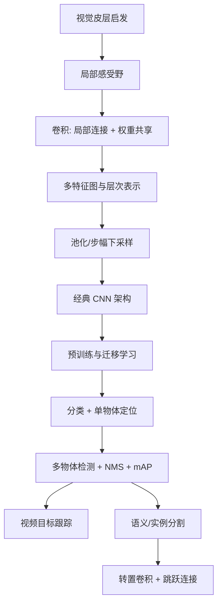

> 书目：*Hands-On Machine Learning with Scikit-Learn and PyTorch*<br>
> 章节：Chapter 12, Deep Computer Vision Using Convolutional Neural Networks<br>
> 章节文件：12. Deep Computer Vision Using Convolutional Neural Networks.md<br>
> 配套 Notebook：<https://homl.info/colab-p>

---

## 阅读导引

### 本章要解决什么问题

全连接网络把图像展平，既忽略二维邻接结构，又让参数量随图像面积爆炸。CNN 把三个视觉先验写进架构：

1. **局部性**：相邻像素更可能共同形成局部模式；
2. **平移共享**：同一种边缘或纹理可能出现在任意位置；
3. **层次组合**：边缘组成部件，部件组成物体。

本章沿着“分类 → 定位 → 多目标检测 → 跟踪 → 像素级分割”逐步提升输出空间复杂度：



### 一句话概括

$$
\boxed{
\text{CNN 用局部连接和权重共享高效学习空间模式，}
\text{再用多尺度、残差、注意力和上采样解决不同视觉任务。}
}
$$

### 重要边界

- CNN 具有平移**等变性倾向**，并非天然完全平移不变。
- 池化减少计算并增强局部不变性，但会丢失定位细节。
- 更深、更大并不自动更好，架构、数据、计算预算和部署约束共同决定选择。
- ImageNet 预训练只在源域与目标域共享视觉结构时有效。
- 检测与分割指标不仅看类别，还必须评价空间重合。

本文纯 PyTorch 核心示例已在 Python 3.12、PyTorch 2.11.0 CPU 环境验证。TorchVision、TorchMetrics、Ultralytics 相关示例需要可选依赖和联网数据，参考结果来自官方 Notebook。

---

## 0. 必要数学与图像基础

### 0.1 图像张量约定

PyTorch 图像 batch 使用 NCHW：

$$
\mathbf X\in\mathbb R^{N\times C\times H\times W}
$$

- $N$：batch size；
- $C$：通道数，灰度通常 1，RGB 为 3；
- $H,W$：高度和宽度。

PIL、Matplotlib、OpenCV 等常使用 HWC，跨库时必须显式 `permute(0,3,1,2)`，否则通道和空间维会混淆。

### 0.2 卷积层输出尺寸

单个空间维，输入 $n$、kernel $k$、两侧 padding $p$、stride $s$、dilation $d$。膨胀后的有效 kernel：

$$
k_{eff}=d(k-1)+1
$$

可放置起点从 0 到 $n+2p-k_{eff}$，每次移动 $s$，所以输出长度：

$$
\boxed{
n_{out}
=\left\lfloor
\frac{n+2p-d(k-1)-1}{s}
\right\rfloor+1
}
$$

高度和宽度分别应用。`valid` 即 $p=0$；stride 1、奇数 kernel 的 `same` 常取 $p=(k-1)/2$。

### 0.3 参数量与计算量

普通 Conv2d 权重 shape：

$$
[C_{out},C_{in}/g,k_h,k_w]
$$

$g$ 是 groups。含 bias 的参数量：

$$
\boxed{
P=C_{out}
\left(\frac{C_{in}}gk_hk_w+1\right)
}
$$

每个输出元素约需 $(C_{in}/g)k_hk_w$ 次乘法，因此总乘法量约：

$$
H_{out}W_{out}C_{out}
\frac{C_{in}}gk_hk_w
$$

参数量不依赖输入 $H,W$，但计算和激活内存依赖。

### 0.4 感受野递推

令第 $l$ 层相邻输出在原图上的间隔 jump 为 $j_l$，感受野大小为 $r_l$。初始 $j_0=r_0=1$：

$$
j_l=j_{l-1}s_l
$$

$$
\boxed{
r_l=r_{l-1}+[d_l(k_l-1)]j_{l-1}
}
$$

例如三个 $3\times3$、stride 1 卷积：$r=3,5,7$。两层 $3\times3$ 与一层 $5\times5$ 感受野同为 5，但前者有两次非线性且参数更少。

---

## 1. The Architecture of the Visual Cortex

Hubel 和 Wiesel 发现视觉皮层神经元具有小型局部感受野：某些只响应特定位置和方向的线段；更高层神经元拥有更大感受野，响应低层模式的组合。不同感受野重叠并覆盖整个视野。

这启发了三条 CNN 设计：

- 每个神经元只连接邻近区域，降低参数量；
- 同一检测器在全图共享，能在不同位置识别相同模式；
- 堆叠局部层逐步扩大感受野并组合复杂物体。

1980 年 neocognitron 将这种思想工程化，1998 年 LeNet-5 将卷积层和池化层用于手写数字识别。

为什么不直接全连接？$100\times100$ 灰度图接 1,000 神经元需要：

$$
10{,}000\times1{,}000+1{,}000
\approx10^7
$$

个参数，仅第一层就很大；RGB 更增至三倍。卷积用一个小 kernel 在所有位置共享，参数从“随图像面积增长”变为“随通道和 kernel 增长”。

---

## 2. Convolutional Layers

### 2.1 局部连接、Padding 与 Stride

输出位置 $(i,j)$ 只查看输入中以 $(is_h,js_w)$ 为起点的 $f_h\times f_w$ 窗口。Padding 允许边界像素被充分使用；stride 大于 1 同时做特征提取和下采样。

Padding 的边界是假设。零 padding 等价于图像外全黑，可能制造边缘伪影；替代有 reflection/replication/circular padding，取决于领域。

### 2.2 Filters：滤波器

Filter/kernel 是局部权重模板。固定竖线 filter 会在与竖直结构对齐的位置产生大响应，形成 feature map。深度学习不手工指定 filter，而由反向传播学习对任务最有用的边缘、纹理、部件或更抽象模式。

严格说，PyTorch `Conv2d` 实现的是 cross-correlation，不会像数学卷积那样翻转 kernel：

$$
(X\star W)_{ij}
=\sum_{u,v}X_{i+u,j+v}W_{uv}
$$

由于 kernel 是学习参数，翻转与否不影响表示能力，行业仍称其 convolution。

### 2.3 Stacking Multiple Feature Maps

每个输出 channel 对应一个三维 filter，深度覆盖全部输入 channels。一个 filter 在所有空间位置共享同一组权重和一个 bias；不同输出 channels 使用不同 filters。

### 2.4 公式 12-1：卷积神经元输出

在已 padding 的输入上：

$$
\boxed{
z_{i,j,k}
=b_k
{}+\sum_{u=0}^{f_h-1}
\sum_{v=0}^{f_w-1}
\sum_{k'=0}^{C_{in}-1}
x_{is_h+u,\,js_w+v,\,k'}
w_{u,v,k',k}
}
$$

- $(i,j,k)$：输出行、列、feature map；
- $(u,v)$：kernel 内相对位置；
- $k'$：输入 channel；
- $s_h,s_w$：步幅；
- $b_k$：第 $k$ 个输出 map 共享 bias；
- $w_{u,v,k',k}$：第 $k$ 个 filter 对输入 channel $k'$ 的权重。

PyTorch 权重索引顺序是 `[k,k',u,v]`。

### 2.5 为什么权重共享带来平移等变性

忽略边界和 stride，令 $T_\Delta$ 表示平移：

$$
(T_\Delta X)[p]=X[p-\Delta]
$$

卷积/相关算子 $K$：

$$
K(T_\Delta X)[p]
=\sum_qW[q]X[p+q-\Delta]
=(T_\Delta KX)[p]
$$

所以：

$$
\boxed{K(T_\Delta X)=T_\Delta(KX)}
$$

输入平移，feature map 相应平移，这是**等变性**，不是输出不变。Padding、stride、pooling 和离散采样会破坏精确等变性。

### 2.6 PyTorch Conv2d 基础示例

```python
import torch
import torch.nn as nn

torch.manual_seed(42)
images = torch.randn(2, 3, 70, 120)

valid_conv = nn.Conv2d(3, 32, kernel_size=7)
same_conv = nn.Conv2d(3, 32, kernel_size=7, padding="same")
stride_conv = nn.Conv2d(3, 32, kernel_size=7, stride=2, padding=3)

print(valid_conv(images).shape)
print(same_conv(images).shape)
print(stride_conv(images).shape)
print(valid_conv.weight.shape, valid_conv.bias.shape)
```

参考输出：

```text
torch.Size([2, 32, 64, 114])
torch.Size([2, 32, 70, 120])
torch.Size([2, 32, 35, 60])
torch.Size([32, 3, 7, 7]) torch.Size([32])
```

PyTorch 不允许 `padding="same"` 与 stride > 1 组合；要明确计算整数 padding，如上例 `padding=3`。

### 2.7 手工 kernel 与 `F.conv2d`

```python
import torch
import torch.nn.functional as F

image = torch.tensor([[[
    [0., 0., 1., 0., 0.],
    [0., 0., 1., 0., 0.],
    [0., 0., 1., 0., 0.],
    [0., 0., 1., 0., 0.],
    [0., 0., 1., 0., 0.],
]]])
vertical_kernel = torch.tensor([[[
    [-1., 0., 1.],
    [-1., 0., 1.],
    [-1., 0., 1.],
]]])

feature_map = F.conv2d(image, vertical_kernel, padding=1)
print(feature_map[0, 0])
```

该 kernel 检测左右强度变化。输出不是“竖线类别”，而是每个位置与模板的局部匹配分数。

### 2.8 初始化与非线性

Conv2d 的 fan-in：

$$
fan_{in}=C_{in}k_hk_w/g
$$

ReLU 后通常显式 He 初始化：

```python
conv = nn.Conv2d(3, 32, kernel_size=3, padding=1)
nn.init.kaiming_normal_(conv.weight, nonlinearity="relu")
nn.init.zeros_(conv.bias)
```

多个卷积若没有激活，仍是线性平移等变算子的复合，可折叠为一个更大有效 kernel，无法获得深层非线性表达。

---

## 3. Pooling Layers

### 3.1 目的与定义

Pooling 无可训练权重，在局部窗口做 max/mean，主要用于：

- 降低空间尺寸、计算和激活内存；
- 扩大后续层有效感受野；
- 对小位移提供有限鲁棒性；
- 抑制过拟合。

MaxPool：

$$
y_{ijc}
=\max_{0\le u<k_h,\,0\le v<k_w}
x_{is_h+u,js_w+v,c}
$$

每个 channel 独立处理，channel 数不变。

### 3.2 Invariance 与 Equivariance

若对象轻微平移但仍落在同一 pooling window，max 可能不变，形成局部不变性。但跨越窗口边界时输出会跳变，因此不是完全平移不变。

分类希望“猫移一像素仍是猫”，不变性有益；分割希望输入右移一像素，mask 也右移一像素，即等变性。过强 pooling 会损害精确定位。

### 3.3 信息损失

$2\times2$、stride 2 的 pooling 使面积降为四分之一，丢弃 75% 空间值。Max 保留强响应，Avg 保留平均背景；哪种更好取决于任务。现代网络也常用 stride convolution 替代 pooling，让下采样可学习。

---

## 4. Implementing Pooling Layers with PyTorch

### 4.1 Max、Average 与 Global Average Pooling

```python
import torch
import torch.nn as nn

inputs = torch.tensor([[[
    [1., 2., 3., 4.],
    [5., 6., 7., 8.],
    [9., 10., 11., 12.],
    [13., 14., 15., 16.],
]]])

print(nn.MaxPool2d(2)(inputs))
print(nn.AvgPool2d(2)(inputs))
print(nn.AdaptiveAvgPool2d(1)(inputs))
```

输出：

```text
tensor([[[[ 6.,  8.],
          [14., 16.]]]])
tensor([[[[ 3.5000,  5.5000],
          [11.5000, 13.5000]]]])
tensor([[[[8.5000]]]])
```

Global average pooling 对每个 feature map 输出一个数：

$$
y_{nc}=\frac1{HW}\sum_{i,j}x_{ncij}
$$

它消除空间位置，适合分类头，参数为 0，并能接受不同输入尺寸。

### 4.2 Depthwise Pooling

空间 pooling 不改变 channels；depth pooling 则沿 channels 聚合，可获得对多个旋转/颜色 detector 的有限不变性。PyTorch 无直接模块，可重排后用 `max_pool1d`：

```python
import torch.nn.functional as F


class DepthPool(nn.Module):
    def __init__(self, kernel_size, stride=None, padding=0):
        super().__init__()
        self.kernel_size = kernel_size
        self.stride = kernel_size if stride is None else stride
        self.padding = padding

    def forward(self, inputs):
        batch, channels, height, width = inputs.shape
        values = inputs.reshape(batch, channels, height * width)
        values = values.permute(0, 2, 1)
        values = F.max_pool1d(
            values,
            self.kernel_size,
            self.stride,
            self.padding,
        )
        values = values.permute(0, 2, 1)
        return values.reshape(batch, -1, height, width)


outputs = DepthPool(4)(torch.randn(2, 32, 70, 120))
print(outputs.shape)
```

正确输出是 `torch.Size([2,8,70,120])`。原始章节文字末尾误写为 `[2,8,50,100]`；代码不会改变空间尺寸。

---

## 5. CNN Architectures

### 5.1 典型结构与设计规律

典型分类 CNN 重复：

```text
[Conv -> Activation] × 若干 -> 下采样
通道增加、空间缩小
-> Global Average Pool / Flatten
-> 分类头 logits
```

低层模式种类少但位置多，高层组合种类多，因此每次空间减半后常把 channels 翻倍。激活元素数从 $HWC$ 变为 $(H/2)(W/2)(2C)=HWC/2$，总体内存仍下降。

两层 $3\times3$ 比单层 $5\times5$：

- 感受野同为 $5\times5$；
- 同通道 $C$ 时参数 $18C^2$ 对 $25C^2$；
- 多一次非线性，表达更强。

第一层可用 $7\times7$、stride 2，因为输入 channels 仅 3，且尽早降采样可显著省计算。

### 5.2 基础 Fashion-MNIST CNN

```python
from functools import partial
import torch
import torch.nn as nn

DefaultConv2d = partial(nn.Conv2d, kernel_size=3, padding=1)
model = nn.Sequential(
    nn.Conv2d(1, 64, kernel_size=7, padding=3), nn.ReLU(),
    nn.MaxPool2d(2),
    DefaultConv2d(64, 128), nn.ReLU(),
    DefaultConv2d(128, 128), nn.ReLU(),
    nn.MaxPool2d(2),
    DefaultConv2d(128, 256), nn.ReLU(),
    DefaultConv2d(256, 256), nn.ReLU(),
    nn.MaxPool2d(2),
    nn.Flatten(),
    nn.Linear(256 * 3 * 3, 128), nn.ReLU(),
    nn.Dropout(0.5),
    nn.Linear(128, 64), nn.ReLU(),
    nn.Dropout(0.5),
    nn.Linear(64, 10),
)

print(model(torch.randn(4, 1, 28, 28)).shape)
```

三次 pooling：$28\to14\to7\to3$，故 Flatten 前为 $256\times3\times3=2304$。`LazyLinear` 或 adaptive pooling 可避免手算固定尺寸。训练应使用 `CrossEntropyLoss`，模型输出 logits，不加 softmax。官方参考测试准确率接近 92%。

### 5.3 LeNet-5（表 12-1）

| 层 | 类型 | Maps/Units | 空间尺寸 | Kernel/Stride | 激活 |
| --- | --- | ---: | --- | --- | --- |
| Input | 图像 | 1 | $32\times32$ | - | - |
| C1 | Conv | 6 | $28\times28$ | $5\times5/1$ | tanh |
| S2 | AvgPool | 6 | $14\times14$ | $2\times2/2$ | tanh |
| C3 | Conv | 16 | $10\times10$ | $5\times5/1$ | tanh |
| S4 | AvgPool | 16 | $5\times5$ | $2\times2/2$ | tanh |
| C5 | Conv | 120 | $1\times1$ | $5\times5/1$ | tanh |
| F6 | Dense | 84 | - | - | tanh |
| Out | Dense | 10 | - | - | RBF |

现代实现通常用 ReLU 和 softmax/logits。它确立了“Conv + Pool + Dense head”的早期范式。

### 5.4 AlexNet（表 12-2）

AlexNet 2012 将 ImageNet top-5 error 从第二名 26% 大幅降至 17%。创新：

- 更深更宽，直接堆叠多个 Conv；
- ReLU 替代 tanh，加速训练；
- GPU 训练；
- 两个 4096-unit Dense 配 50% dropout；
- 随机平移、翻转、颜色扰动的数据增强；
- 使用 LRN（后来多被 BN 替代）。

核心尺寸路径：$227\to55\to27\to13\to6$，最终 1,000 类。大 Dense 头导致约 61M 参数，现代架构更多使用 global average pooling。

### 5.5 Data Augmentation

增强从经验分布附近采样标签保持变换 $T$：

$$
(x,y)\mapsto(T(x),y)
$$

它把先验“类别对某些变换不变”编码进训练。平移、随机裁剪、缩放、颜色变化常合理；文字不能随意水平翻转，医学影像也有领域限制。白噪声若不对应真实变化，不会自动有益。

```python
import torchvision.transforms.v2 as T

train_transform = T.Compose([
    T.RandomResizedCrop((224, 224), scale=(0.8, 1.0)),
    T.RandomHorizontalFlip(),
    T.ColorJitter(brightness=0.2, contrast=0.2),
    T.ToImage(),
    T.ToDtype(torch.float32, scale=True),
])
```

增强必须只用于训练；验证/测试用确定性 preprocessing。TTA 是例外：对多个增强版本求平均概率，增加推理成本。SMOTE 严格指特征空间插值，不应把所有少数类图像增强都泛称 SMOTE。

### 5.6 GoogLeNet 与 Inception

Inception 并行 $1\times1$、$3\times3$、$5\times5$ 和 pooling 分支，保持相同 $H,W$ 后沿 channels 拼接。多尺度分支同时捕获不同范围模式。

$1\times1$ 卷积作用：

1. 每像素混合 channels；
2. bottleneck 降维，减少后续大 kernel 计算；
3. 配合非线性形成逐位置 MLP。

若直接 $5\times5:C\to M$，参数 $25CM$；先 $1\times1:C\to B$ 再 $5\times5:B\to M$：

$$
CB+25BM
$$

当 $B\ll C,M$ 可大幅节省。GoogLeNet 约 6M 参数，远少于 AlexNet 约 60M；global average pooling 消除巨大 Dense 头。辅助分类器给中层梯度和正则，但后来证明作用有限。

### 5.7 ResNet：残差学习

Residual unit：

$$
\boxed{\mathbf y=F(\mathbf x;\theta)+\mathbf x}
$$

目标 $H(x)$ 被改写为残差：

$$
F(x)=H(x)-x
$$

若最优映射接近 identity，学习小残差比直接学习完整映射容易。反向：

$$
\frac{\partial\mathbf y}{\partial\mathbf x}
=\frac{\partial F}{\partial\mathbf x}+\mathbf I
$$

即使 $\partial F/\partial x$ 很小，identity 路径仍传递梯度，缓解退化和消失。

当空间或 channels 改变时，用 $1\times1$ projection、相同 stride 对齐：

$$
\mathbf y=F(\mathbf x)+W_s\mathbf x
$$

ResNet-34 stage units 为 $[3,4,6,3]$，channels 为 $[64,128,256,512]$。更深 ResNet 用 $1\times1\to3\times3\to1\times1$ bottleneck。

### 5.8 Xception 与 Depthwise Separable Convolution

普通卷积联合学习空间和跨通道模式，参数：

$$
P_{regular}=k^2C_{in}C_{out}
$$

Depthwise：每输入 channel 一个 $k\times k$ filter；pointwise $1\times1$ 混合 channels：

$$
P_{sep}=k^2C_{in}+C_{in}C_{out}
$$

比例：

$$
\frac{P_{sep}}{P_{regular}}
=\frac1{C_{out}}+\frac1{k^2}
$$

$k=3,C_{in}=64,C_{out}=128$：标准 73,728，separable 8,768，约 8.4 倍更少。

```python
class SeparableConv2d(nn.Module):
    def __init__(self, in_channels, out_channels, kernel_size=3,
                 stride=1, padding=1):
        super().__init__()
        self.depthwise = nn.Conv2d(
            in_channels, in_channels, kernel_size,
            stride=stride, padding=padding,
            groups=in_channels, bias=False,
        )
        self.pointwise = nn.Conv2d(
            in_channels, out_channels, kernel_size=1, bias=False
        )

    def forward(self, inputs):
        return self.pointwise(self.depthwise(inputs))


layer = SeparableConv2d(64, 128)
print(layer(torch.randn(2, 64, 32, 32)).shape)
print(sum(p.numel() for p in layer.parameters()))
```

假设空间与 channel 模式可分离，常高效但不是无损等价。输入只有 3 channels 时 depthwise filters 太少，Xception 开头先用普通卷积。

### 5.9 SENet：Channel Attention

SE block 三步：

1. **Squeeze**：GAP 得每 channel 全局响应；
2. **Excitation**：两层 MLP 从 $C\to C/r\to C$；
3. sigmoid 得 gate，逐 channel 缩放 feature maps。

$$
s_c=\frac1{HW}\sum_{i,j}x_{cij}
$$

$$
\mathbf g
=\sigma(W_2\operatorname{ReLU}(W_1\mathbf s))
$$

$$
y_{cij}=g_cx_{cij}
$$

```python
class SEBlock(nn.Module):
    def __init__(self, channels, reduction=16):
        super().__init__()
        hidden = max(1, channels // reduction)
        self.pool = nn.AdaptiveAvgPool2d(1)
        self.excitation = nn.Sequential(
            nn.Conv2d(channels, hidden, 1), nn.ReLU(),
            nn.Conv2d(hidden, channels, 1), nn.Sigmoid(),
        )

    def forward(self, inputs):
        return inputs * self.excitation(self.pool(inputs))


print(SEBlock(64)(torch.randn(2, 64, 16, 16)).shape)
```

Gate 在 $(0,1)$，主要抑制不相关 channels；“boost”是相对意义，除非采用其他 gate 参数化。

### 5.10 Other Noteworthy Architectures

| 架构 | 核心创新 |
| --- | --- |
| VGGNet | 统一堆叠大量 $3\times3$ Conv，简单但参数大 |
| ResNeXt | 多个并行低宽度分支，引入 cardinality |
| DenseNet | 每层接收同 block 所有前层输出，特征复用 |
| MobileNet | depthwise separable，面向移动端 |
| CSPNet | 部分输入绕过 dense block，减少重复梯度计算 |
| EfficientNet | depth/width/resolution 复合缩放 |
| ConvNeXt | 用 Transformer 设计经验现代化 ResNet |

EfficientNet 令计算预算 $\propto2^\phi$，按：

$$
d=\alpha^\phi,
\qquad w=\beta^\phi,
\qquad r=\gamma^\phi
$$

卷积计算近似与 $dw^2r^2$ 成正比，故要求：

$$
\boxed{\alpha\beta^2\gamma^2\approx2}
$$

原论文网格搜索约得 $\alpha=1.2,\beta=1.1,\gamma=1.1$；不是所有架构通用常数。

---

## 6. Choosing the Right CNN Architecture

模型选择是多目标优化：accuracy、参数量、FLOPs、实际延迟、吞吐、内存、能耗、输入分辨率和目标硬件。FLOPs 不等于延迟，memory access、kernel 支持和 batch size 都会改变真实速度。

表 12-3 的关键趋势：MobileNet v3 small 约 2.5M 参数/0.1 GFLOPs，适合边缘端；EfficientNet v2 small 约 21.5M 参数但 ImageNet top-1 84.2%；ConvNeXt Large 约 197.8M 参数、34.4 GFLOPs。应在目标设备 benchmark，不只按排行榜。

### 6.1 GPU RAM：Inference vs Training

内存构成：

$$
M\approx
M_{params}+M_{activations}+M_{gradients}
{}+M_{optimizer}+M_{workspace}
$$

FP32 每元素 4 bytes。推理可在下一层完成后释放前层激活，峰值约由相邻大层、参数和算子 workspace 决定；训练需保存反向所需激活，另有参数梯度和 optimizer states。Adam 常为每参数保存一阶、二阶矩，参数相关内存远大于只存权重。

原书例：200 个 $5\times5$ filters 处理 $150\times100$ RGB：

$$
P=(5\times5\times3+1)\times200=15{,}200
$$

输出激活：

$$
200\times150\times100\times4
=12{,}000{,}000\text{ bytes}
$$

batch 100 仅该层输出约 1.2 GB。

OOM 处理：减 batch、gradient accumulation、降分辨率/stride、删层/减 channels、FP16/BF16、模型/数据并行、CPU offload、activation checkpointing。

### 6.2 Activation Checkpointing

不保存某段中间激活，反向时重算：用计算换内存。

```python
from torch.utils.checkpoint import checkpoint

outputs = checkpoint(segment, inputs, use_reentrant=False)
```

要求重算与原前向语义一致；随机状态、全局状态、in-place side effects 需谨慎。Checkpoint 不减少参数/optimizer 内存，只减少保存激活。

### 6.3 Reversible Residual Networks

可逆层：

$$
y_1=x_1+f(x_2),
\qquad
y_2=x_2+g(y_1)
$$

反推：

$$
\boxed{x_2=y_2-g(y_1)}
$$

$$
\boxed{x_1=y_1-f(x_2)}
$$

因此无需保存输入激活，反向从输出重建，通常增加约 33% 计算。$f,g$ 必须确定性且 shape 不变；stride 下采样等不可逆阶段仍需保存。

---

## 7. Implementing ResNet-34 with PyTorch

```python
from functools import partial
import torch
import torch.nn as nn
import torch.nn.functional as F


class ResidualUnit(nn.Module):
    def __init__(self, in_channels, out_channels, stride=1):
        super().__init__()
        conv3 = partial(
            nn.Conv2d, kernel_size=3, padding=1, bias=False
        )
        self.main = nn.Sequential(
            conv3(in_channels, out_channels, stride=stride),
            nn.BatchNorm2d(out_channels),
            nn.ReLU(),
            conv3(out_channels, out_channels, stride=1),
            nn.BatchNorm2d(out_channels),
        )
        self.skip = (
            nn.Identity()
            if stride == 1 and in_channels == out_channels
            else nn.Sequential(
                nn.Conv2d(
                    in_channels, out_channels, kernel_size=1,
                    stride=stride, bias=False,
                ),
                nn.BatchNorm2d(out_channels),
            )
        )

    def forward(self, inputs):
        return F.relu(self.main(inputs) + self.skip(inputs))


class ResNet34(nn.Module):
    def __init__(self, n_classes=1000):
        super().__init__()
        layers = [
            nn.Conv2d(3, 64, 7, stride=2, padding=3, bias=False),
            nn.BatchNorm2d(64),
            nn.ReLU(),
            nn.MaxPool2d(3, stride=2, padding=1),
        ]
        previous = 64
        for channels, count in zip([64, 128, 256, 512], [3, 4, 6, 3]):
            for unit_index in range(count):
                stride = 2 if channels != previous and unit_index == 0 else 1
                layers.append(ResidualUnit(previous, channels, stride))
                previous = channels
        layers.extend([
            nn.AdaptiveAvgPool2d(1),
            nn.Flatten(),
            nn.Linear(512, n_classes),
        ])
        self.network = nn.Sequential(*layers)

    def forward(self, inputs):
        return self.network(inputs)


model = ResNet34(n_classes=10)
output = model(torch.randn(2, 3, 224, 224))
print(output.shape)
print(sum(p.numel() for p in model.parameters()))
```

输出 shape `[2,10]`，参数约 21.3M（分类头为 10 类，故略少于 ImageNet ResNet-34 的 21.8M）。实现使用显式 `Linear(512,...)`，避免 lazy 参数在统计/保存前未初始化。

---

## 8. Using TorchVision's Pretrained Models

标准架构通常不应从零重写；TorchVision/TIMM/Hugging Face Hub 提供经过验证的结构和权重。加载 ConvNeXt Base：

```python
import torchvision

weights = torchvision.models.ConvNeXt_Base_Weights.IMAGENET1K_V1
model = torchvision.models.convnext_base(weights=weights).to(device)
```

权重对象不仅含 tensor，还定义推理契约：输入尺寸、resize/crop、值域、channel mean/std、类别顺序。必须使用匹配 transforms：

```python
preprocess = weights.transforms()
preprocessed_images = preprocess(images_nchw)

model.eval()
with torch.inference_mode():
    logits = model(preprocessed_images.to(device))
    probabilities = logits.softmax(dim=1)
    top3_probabilities, top3_ids = probabilities.topk(3, dim=1)

class_names = weights.meta["categories"]
```

应先在全部 1,000 类 logits 上 softmax，再 `topk`。原章节先取 top-3 logits 再 softmax，会把 top-3 重新归一化到和为 1，夸大概率；类别排名不受影响。

官方示例把两张样图预测为 palace 和 daisy，合理但不代表模型理解“中国香塔”和“大丽花”：ImageNet 标签空间没有这些精确类别，模型只能选最近已有类别。

### 8.1 模型缓存与版本

权重缓存通常在 `torch.hub.get_dir()`；生产中应固定 TorchVision 和 weights enum 版本，记录 checksum。`DEFAULT` 可能随版本指向新权重，结果和 preprocessing 可能变化。

---

## 9. Pretrained Models for Transfer Learning

### 9.1 Flowers102 为什么适合迁移

Flowers102 有 102 类，训练和验证各仅每类 10 张，直接训练大型 CNN 容易过拟合。ImageNet 预训练 backbone 已学到边缘、纹理和物体部件，只需适配分类头并小幅微调。

```python
from functools import partial
from torch.utils.data import DataLoader

Flowers = partial(
    torchvision.datasets.Flowers102,
    root="datasets",
    transform=weights.transforms(),
    download=True,
)
train_set = Flowers(split="train")
valid_set = Flowers(split="val")
test_set = Flowers(split="test")

train_loader = DataLoader(train_set, batch_size=32, shuffle=True)
valid_loader = DataLoader(valid_set, batch_size=32)
test_loader = DataLoader(test_set, batch_size=32)
```

### 9.2 替换分类头与冻结

ConvNeXt Base classifier 最后是 `Linear(1024,1000)`，替换为 102 类：

```python
n_classes = 102
model.classifier[2] = nn.Linear(1024, n_classes).to(device)

for parameter in model.parameters():
    parameter.requires_grad_(False)
for parameter in model.classifier.parameters():
    parameter.requires_grad_(True)

optimizer = torch.optim.AdamW(
    model.classifier.parameters(), lr=1e-3
)
```

先训练随机 head，避免大误差破坏预训练特征；随后解冻顶部或全模型，把学习率降约 10 倍。可用 parameter groups 给底层更小 LR：

```python
for parameter in model.parameters():
    parameter.requires_grad_(True)

optimizer = torch.optim.AdamW([
    {"params": model.features.parameters(), "lr": 1e-5},
    {"params": model.classifier.parameters(), "lr": 1e-4},
], weight_decay=1e-4)
```

只训练 head 官方参考已约 90% accuracy；进一步增强和微调可超过 90%。必须在 source preprocessing 下输入，否则预训练特征分布错位。

### 9.3 训练增强与验证预处理分离

```python
import torchvision.transforms.v2 as T

train_transform = T.Compose([
    T.RandomHorizontalFlip(0.5),
    T.RandomRotation(30),
    T.RandomResizedCrop((224, 224), scale=(0.8, 1.0)),
    T.ColorJitter(0.2, 0.2, 0.2, 0.1),
    T.ToImage(),
    T.ToDtype(torch.float32, scale=True),
    T.Normalize(
        mean=[0.485, 0.456, 0.406],
        std=[0.229, 0.224, 0.225],
    ),
])
```

验证/测试使用 weights 的确定性 transforms。还可逐层解冻、换相似领域预训练模型、分析失败样本、模型集成。卫星/医学/农业图像应优先找 TorchGeo/MONAI/AgML 等领域预训练模型，避免负迁移。

---

## 10. Classification and Localization

### 10.1 单物体定位作为多任务学习

分类输出 $K$ logits，定位输出 bounding box 四参数。常见格式：

$$
\mathbf b=(c_x,c_y,w,h)
$$

可归一化到 $[0,1]$，使不同图像尺寸和 loss 尺度更稳定。共享 backbone，分两个 heads：

```python
class ClassifierAndLocator(nn.Module):
    def __init__(self, backbone, feature_dim, n_classes):
        super().__init__()
        self.backbone = backbone
        self.classifier = nn.Linear(feature_dim, n_classes)
        self.locator = nn.Linear(feature_dim, 4)

    def forward(self, inputs):
        features = self.backbone(inputs)
        return self.classifier(features), self.locator(features)
```

联合损失：

$$
L=\lambda_{cls}L_{CE}
{}+\lambda_{box}L_{box}
$$

两个 loss 数值尺度和梯度尺度可能不同，权重不应机械设为 1。可看各任务梯度、验证指标或采用动态加权。

### 10.2 标注与同步变换

定位需要人工 bounding boxes，成本常高于建模。TorchVision v2 的 `tv_tensors.BoundingBoxes` 可让 crop/resize/flip 同步作用于图像和 boxes。旋转后 axis-aligned box 必须扩张包住旋转对象，可能变松。

格式必须明确：`XYXY`、`XYWH`、`CXCYWH` 不可混用；canvas size 和坐标单位也必须一致。数据增强若只变图像不变 box，会产生错误标签。

### 10.3 MSE 的尺度问题

直接 MSE：

$$
L_{box}=\frac14\sum_{q\in\{c_x,c_y,w,h\}}
(\hat q-q)^2
$$

大框和小框相同像素误差被同样惩罚。可预测归一化坐标，或对宽高用平方根/对数，使相对尺度更重要。现代 detector 更常用 IoU 家族损失。

### 10.4 IoU 推导

预测框 $P$、真值框 $T$：

$$
\boxed{
\operatorname{IoU}(P,T)
=\frac{|P\cap T|}{|P\cup T|}
=\frac{I}{|P|+|T|-I}
}
$$

XYXY 框交集：

$$
w_I=\max(0,\min(x_2^P,x_2^T)-\max(x_1^P,x_1^T))
$$

$$
h_I=\max(0,\min(y_2^P,y_2^T)-\max(y_1^P,y_1^T)),
\qquad I=w_Ih_I
$$

范围 $[0,1]$。无重叠时 IoU 恒 0，对距离无信息，梯度也常为 0，不适合作为唯一训练 loss。

```python
import torch


def box_iou_xyxy(box_a, box_b):
    top_left = torch.maximum(box_a[:2], box_b[:2])
    bottom_right = torch.minimum(box_a[2:], box_b[2:])
    intersection_size = (bottom_right - top_left).clamp_min(0)
    intersection = intersection_size.prod()
    area_a = (box_a[2:] - box_a[:2]).prod()
    area_b = (box_b[2:] - box_b[:2]).prod()
    return intersection / (area_a + area_b - intersection)


print(box_iou_xyxy(
    torch.tensor([0., 0., 2., 2.]),
    torch.tensor([1., 1., 3., 3.]),
).item())
```

交集 1、并集 7，输出约 $1/7=0.142857$。

### 10.5 GIoU 与 CIoU

令 $S$ 为包住 $P,T$ 的最小轴对齐框：

$$
\boxed{
\operatorname{GIoU}
=\operatorname{IoU}
-\frac{|S\setminus(P\cup T)|}{|S|}
}
$$

无重叠时第二项仍随两框距离和覆盖紧致度变化，提供梯度；范围通常 $[-1,1]$，loss 为 $1-\text{GIoU}$。

CIoU 进一步考虑中心距离和宽高比。常见形式：

$$
\operatorname{CIoU}
=\operatorname{IoU}
-\frac{\rho^2(\mathbf c_P,\mathbf c_T)}{d_S^2}
-\alpha v
$$

$$
v=\frac4{\pi^2}
\left(
\arctan\frac{w_T}{h_T}
-\arctan\frac{w_P}{h_P}
\right)^2,
\qquad
\alpha=\frac v{1-\operatorname{IoU}+v}
$$

$d_S$ 是最小包围框对角线，$\rho$ 是中心距离。CIoU 同时鼓励重叠、中心接近和长宽比一致，通常比 MSE/GIoU 收敛更快。

---

## 11. Object Detection

Detection 同时回答：图中有哪些对象、每个是什么类、在哪里。单物体定位扩展为数量不定的预测集合，每个候选通常含：

- objectness/confidence；
- class logits/probabilities；
- bounding box 参数。

Objectness 与类别分开有助于区分“这里有没有对象”和“对象是什么”。

### 11.1 Sliding Window 的问题

传统方法在多个位置和尺度重复运行定位 CNN，计算高度重复，而且同一对象产生多个相似 boxes。现代 detector 共享整图 backbone features，一次或两阶段产生候选。

### 11.2 Non-Max Suppression

NMS 算法：

1. 删除 score 低于阈值的 boxes；
2. 取剩余最高 score 框 $b^*$；
3. 删除与 $b^*$ 同类且 IoU 超阈值的框；
4. 重复直到为空。

```python
import torch


def nms(boxes, scores, iou_threshold=0.5):
    order = scores.argsort(descending=True)
    kept = []
    while len(order) > 0:
        current = order[0]
        kept.append(current.item())
        if len(order) == 1:
            break

        remaining = order[1:]
        ious = torch.stack([
            box_iou_xyxy(boxes[current], boxes[index])
            for index in remaining
        ])
        order = remaining[ious <= iou_threshold]
    return torch.tensor(kept)


boxes = torch.tensor([
    [0., 0., 2., 2.],
    [0.1, 0.1, 2.1, 2.1],
    [3., 3., 5., 5.],
])
scores = torch.tensor([0.9, 0.8, 0.7])
print(nms(boxes, scores))
```

输出 `[0,2]`：第二框被第一框抑制，第三框保留。实际使用 `torchvision.ops.nms()` 更快。

NMS 是贪心后处理，不可导；相邻真实对象高度重叠时可能误删。替代有 Soft-NMS（衰减 score）、class-aware NMS 和端到端集合预测 detector。

### 11.3 Fully Convolutional Networks

FCN 只含卷积、池化、逐位置运算，不含固定输入长度 Dense，因而可处理不同 $H,W$。

Dense 输入 `[B,C,H,W]` 展平后输出 $M$：

$$
y_m=b_m+
\sum_{c,i,j}W_{m,c,i,j}x_{c,i,j}
$$

等价于 `Conv2d(C,M,kernel_size=(H,W),padding=0)`，输出 `[B,M,1,1]`。权重只需 reshape：

$$
W_{dense}[M,CHW]
\leftrightarrow
W_{conv}[M,C,H,W]
$$

后续 Dense $M\to K$ 转成 $1\times1$ Conv。

大图输入时，同一个卷积头在所有空间窗口共享计算。例如 bottleneck 从 $7\times7$ 变 $14\times14$，$7\times7$ valid 输出为 $8\times8$：

$$
14-7+1=8
$$

一次前向得到 64 个位置预测，远快于重复滑窗。

### 11.4 YOLO

YOLO 是 single-stage detector：整图一次前向，网格单元负责中心落入该 cell 的对象。每 cell 预测多个 boxes、objectness 与类别信息，后处理 NMS。

现代 YOLO 引入 anchor priors 或 anchor-free 设计、多尺度 feature pyramids、skip connections 和更强 losses/backbones。Tiny 版本牺牲精度换低延迟。

```python
from ultralytics import YOLO

detector = YOLO("yolov9m.pt")
results = detector([
    "https://homl.info/soccer.jpg",
    "https://homl.info/traffic.jpg",
])
```

官方示例第一张图首个检测为 sports ball，confidence 约 0.962。版本、权重和阈值会改变输出。

### 11.5 Mean Average Precision

对一个类别和固定 IoU 阈值 $\tau$：按 confidence 从高到低排序 predictions，依次与尚未匹配的真值框匹配。类别正确且 IoU$\ge\tau$ 为 TP，否则 FP；每个真值最多匹配一次。

$$
P(r)=\frac{TP}{TP+FP},
\qquad
R(r)=\frac{TP}{TP+FN}
$$

插值 precision：

$$
P_{interp}(r)
=\max_{\widetilde r\ge r}P(\widetilde r)
$$

它消除 recall 增大却 precision 偶然上升的不合理锯齿。AP 是插值 PR 曲线面积或离散 recall 点平均：

$$
AP_c=\int_0^1P_{interp,c}(r)\,dr
$$

多类：

$$
\boxed{
mAP=\frac1C\sum_{c=1}^{C}AP_c
}
$$

`AP50` 使用 IoU 0.5；COCO `mAP@[.50:.95]` 再平均 $0.50,0.55,\ldots,0.95$ 十个阈值，要求定位更精确。mAP 受 score 排序、匹配规则、类别平均方式和 IoU 阈值共同影响，不能只报告“mAP”而不说明协议。

### 11.6 其他 Detector

| 模型 | 类型 | 特点 |
| --- | --- | --- |
| Faster R-CNN | Two-stage | RPN 提候选，再分类/回归，通常精度高 |
| SSD/SSDlite | Single-stage | 快，Lite 适合移动端 |
| RetinaNet | Single-stage | Focal loss 聚焦困难/稀有样本 |
| FCOS | Anchor-free | 直接逐位置预测框 |
| YOLO | Single-stage | 实时生态成熟 |

Focal loss 对二分类 $p_t$：

$$
FL(p_t)=-(1-p_t)^\gamma\log p_t
$$

易样本 $p_t\to1$ 时权重趋近 0，缓解前景/背景极不平衡。

---

## 12. Object Tracking

Tracking 要在视频帧间维持 identity。困难包括运动、尺度/光照变化、遮挡、相似对象交叉和摄像机运动。

DeepSORT 组合：

1. Kalman filter 根据运动状态预测位置与不确定性；
2. ReID 深网计算 appearance embedding 距离；
3. Hungarian algorithm 求检测与轨迹的最小总代价一对一匹配。

代价可组合运动 Mahalanobis distance 与 appearance cosine distance：

$$
C_{ij}=\lambda d_{motion}(i,j)
{}+(1-\lambda)d_{appearance}(i,j)
$$

只用位置会在碰撞/交叉后交换 ID；appearance 提供身份线索。BoT-SORT 进一步做 camera-motion compensation 和状态估计改进。

```python
video_results = detector.track(
    source="https://homl.info/cars.mp4",
    stream=True,
    save=True,
)
for frame in video_results:
    track_ids = [item["track_id"] for item in frame.summary()]
    print(track_ids)
```

Tracking 指标还应评价 ID switches、轨迹完整性和定位，不只是逐帧 detection mAP。

---

## 13. Semantic Segmentation

Semantic segmentation 为每个像素预测类别：输出 logits `[N,K,H,W]`，target `[N,H,W]`。同类不同实例合并；instance segmentation 则区分每个对象。

### 13.1 核心困难：恢复空间分辨率

分类 backbone 多次 stride/pooling，总 stride 32 后 $H,W$ 各缩 32 倍。高层知道“是什么”，但边界和位置粗糙。分割需要同时保留：

- 高层语义；
- 低层精确空间细节。

因此 encoder 下采样提语义，decoder 上采样恢复分辨率，并用 skip connections 融合低层细节。

### 13.2 Transposed Convolution

ConvTranspose2d 输出尺寸：

$$
\boxed{
n_{out}
=(n_{in}-1)s-2p+d(k-1)+output\_padding+1
}
$$

例如 $n=2,k=3,s=2,p=0$：

$$
(2-1)2+3=5
$$

二维 $2\times3\to5\times7$。它是线性卷积算子的转置，不是卷积逆运算；可理解为插零后普通卷积。较大 stride 产生较大输出。

```python
layer = nn.ConvTranspose2d(
    16, 8, kernel_size=3, stride=2
)
print(layer(torch.randn(2, 16, 2, 3)).shape)
```

输出 `[2,8,5,7]`。kernel/stride 重叠不均可能产生 checkerboard artifacts；可用 bilinear upsample + Conv 替代。

### 13.3 Skip Connections 恢复细节

FCN-32s 直接上采样 $\times32$ 太粗。改进路径：

```text
高层 logits ×2 + 对齐的低层 feature
-> 再 ×2 + 更低层 feature
-> 最后 ×8 到原图
```

相加要求 channels 和空间对齐，可用 $1\times1$ Conv 投影；也可 concat 后 Conv（U-Net 风格）。高层提供类别，低层提供边缘。

### 13.4 Dilated Convolution

Dilation $d$ 的有效 kernel：

$$
k_{eff}=d(k-1)+1
$$

$k=3,d=4$ 的有效宽度 9，不增加参数，扩大感受野且不降分辨率。代价是采样稀疏可能产生 gridding artifacts，常组合多个 dilation rates。

```python
dilated = nn.Conv2d(
    16, 32, kernel_size=3, padding=2, dilation=2
)
print(dilated(torch.randn(2, 16, 10, 10)).shape)
```

输出仍是 `[2,32,10,10]`。

### 13.5 Semantic vs Instance Segmentation

| 任务 | 输出语义 |
| --- | --- |
| Semantic | 每像素类别，同类实例合并 |
| Instance | 每个对象独立 mask + class + box |
| Panoptic | 合并 stuff 语义区和 thing 实例 |

Mask R-CNN 在 Faster R-CNN 每个 proposal 上增加 mask head，输出独立实例 mask。TorchVision 提供 FCN、DeepLab、Mask R-CNN 等预训练模型。

---

## 14. Other PyTorch Convolutional Layers

| API | 输入/用途 |
| --- | --- |
| `Conv1d` | 时间序列、文本局部模式 `[N,C,L]` |
| `Conv2d` | 图像 `[N,C,H,W]` |
| `Conv3d` | 体数据 `[N,C,D,H,W]` |
| `ConvTranspose2d` | 可学习上采样 |
| `dilation` | 扩大感受野而不增参数 |
| `groups` | grouped/depthwise convolution |
| `LazyConv2d` | 首次前向推断输入 channels |

---

## 15. 章末练习与参考答案

### 练习 1：CNN 相比全连接 DNN 的优势

- 局部连接和共享权重大幅减少参数、数据需求和过拟合；
- 同一 filter 可在任意位置检测模式，具有平移等变性；
- 架构编码二维邻接和层次组合先验；
- 保留空间布局，适合定位、检测和分割；
- 可接受不同 $H,W$（全卷积部分）。

代价是对非局部关系的直接建模较弱，强视觉先验也未必适合所有数据。

### 练习 2：三层 CNN 参数与内存

输入 RGB $200\times300$；三层 $3\times3$、stride 2、same，输出 channels 100、200、400。

参数：

$$
P_1=(3\times3\times3+1)100=2{,}800
$$

$$
P_2=(3\times3\times100+1)200=180{,}200
$$

$$
P_3=(3\times3\times200+1)400=720{,}400
$$

$$
\boxed{P=903{,}400}
$$

输出尺寸按 ceil 除 2：

| 层 | Shape（不含 batch） | FP32 bytes |
| --- | --- | ---: |
| 输入 | $3\times200\times300$ | 720,000 |
| Conv1 | $100\times100\times150$ | 6,000,000 |
| Conv2 | $200\times50\times75$ | 3,000,000 |
| Conv3 | $400\times25\times38$ | 1,520,000 |
| 参数 | 903,400 | 3,613,600 |

推理可释放旧激活，峰值至少 Conv1+Conv2+参数：

$$
6{,}000{,}000+3{,}000{,}000+3{,}613{,}600
=\boxed{12{,}613{,}600\text{ bytes}}
$$

约 12.6 decimal MB（12.0 MiB），未计 workspace。

训练 batch 50 保存全部层激活：

$$
50(6+3+1.52)\text{ MB}=526\text{ MB}
$$

加输入 36 MB 和参数 3.6 MB，乐观下限约：

$$
\boxed{565.6\text{ MB}}
$$

官方答案将 Conv3 四舍五入为 1.5 MB，得 564.6 MB。实际还要梯度、optimizer states、临时 workspace 和 allocator 开销，显著更高。

### 练习 3：GPU OOM 的处理方法

1. 减 batch；
2. gradient accumulation 保持有效 batch；
3. FP16/BF16 mixed precision；
4. 降输入分辨率、增 stride；
5. 减 layers/channels；
6. activation checkpointing；
7. 多 GPU 分片/并行；
8. CPU/NVMe offload；
9. 选更省内存 optimizer 或 8-bit states；
10. 检查是否意外保存计算图（如把 loss tensor 持续放进 list）。

### 练习 4：为何用 MaxPool 而非同 stride Conv

MaxPool 无参数、计算少、直接保留局部最强响应，并引入有限位移鲁棒性。Stride Conv 可学习，通常表达更强但增加参数/计算和过拟合风险。现代架构常选择 stride Conv；没有绝对优劣。

### 练习 5：主要架构创新

- AlexNet：大规模 GPU CNN、ReLU、直接堆 Conv、dropout、增强；
- GoogLeNet：多尺度 Inception + $1\times1$ bottleneck + GAP；
- ResNet：skip/residual connections；
- SENet：channel squeeze-excitation attention；
- Xception：depthwise separable convolution；
- EfficientNet：depth/width/resolution compound scaling；
- ConvNeXt：以 Transformer 经验现代化 ResNet；
- VGG：统一小 kernel 深堆叠；ResNeXt：cardinality；DenseNet：全层特征复用；MobileNet：移动端可分离卷积。

### 练习 6：FCN 与 Dense 转换

FCN 只含可滑动空间算子。把第一个 Dense $CHW\to M$ 改为 `Conv2d(C,M,(H,W))`；权重 reshape `[M,CHW]→[M,C,H,W]`。后续 Dense 改 $1\times1$ Conv。相同尺寸输入结果一致，大图则输出预测网格。

### 练习 7：语义分割的主要技术困难

分类 backbone 下采样丢失精确空间位置，而分割需逐像素输出。解决需可学习上采样、dilated convolution 与低层 skip features，在语义和边界细节之间平衡。

### 练习 8：MNIST 高准确率 CNN

首次运行需 TorchVision/联网：

```python
class MnistCNN(nn.Module):
    def __init__(self):
        super().__init__()
        self.network = nn.Sequential(
            nn.Conv2d(1, 32, 3, padding=1), nn.ReLU(),
            nn.Conv2d(32, 64, 3, padding=1), nn.ReLU(),
            nn.MaxPool2d(2),
            nn.Dropout(0.25),
            nn.Flatten(),
            nn.Linear(64 * 14 * 14, 128), nn.ReLU(),
            nn.Dropout(0.5),
            nn.Linear(128, 10),
        )
        for module in self.modules():
            if isinstance(module, (nn.Conv2d, nn.Linear)):
                nn.init.kaiming_normal_(module.weight, nonlinearity="relu")
                if module.bias is not None:
                    nn.init.zeros_(module.bias)

    def forward(self, inputs):
        return self.network(inputs)


model = MnistCNN()
print(model(torch.randn(2, 1, 28, 28)).shape)
```

官方使用 AdamW 训练 10 epochs，测试 accuracy 为 0.9901。进一步到 99.5%～99.7% 可加入适当增强、BN、1cycle 和 ensemble；测试集不能用于反复选配置。

### 练习 9：大图像迁移学习流程

1. 每类至少约 100 张并检查版权/隐私；
2. 按主体/来源分 train/valid/test，防止近重复泄漏；
3. train 使用增强，valid/test 使用 weights transforms；
4. 加载领域相近预训练模型；
5. 替换 head，冻结 backbone 训练；
6. 逐层解冻并降低 backbone LR；
7. 保存最佳验证 checkpoint；
8. 最终一次测试，并报告类别指标/校准/延迟。

官方 hymenoptera（ants/bees）示例只训练 ConvNeXt head 5 epochs，验证集达到 1.0，但验证集很小，需谨慎解释。

### 练习 10：目标检测微调

完成 PyTorch detection tutorial 时应掌握：

- Dataset 每项返回 image 和 target dict；
- target 含 boxes、labels、image_id、area、iscrowd；
- 自定义 `collate_fn` 处理每图不同数量 boxes；
- 同步图像/box transforms；
- 加载 Faster/Mask R-CNN，替换 predictor；
- train 模式模型返回 loss dict，eval 返回 predictions；
- 用 COCO mAP@[.50:.95] 评估，而非只看训练 loss。

---

## 16. 公式速查

| 公式 | 含义 |
| --- | --- |
| 12-1 | 多通道卷积神经元输出 |
| $n_{out}=\lfloor(n+2p-d(k-1)-1)/s\rfloor+1$ | Conv/Pool 尺寸 |
| $P=C_{out}(C_{in}k_hk_w/g+1)$ | Conv 参数量 |
| $r_l=r_{l-1}+d_l(k_l-1)j_{l-1}$ | 感受野递推 |
| $K(Tx)=T(Kx)$ | 卷积平移等变性 |
| $y=F(x)+x$ | Residual unit |
| $P_{sep}=k^2C_{in}+C_{in}C_{out}$ | 可分离卷积参数 |
| $\alpha\beta^2\gamma^2\approx2$ | EfficientNet 复合缩放 |
| IoU $=I/(A_P+A_T-I)$ | Box 重合 |
| GIoU/CIoU | 加入包围区域/中心与长宽比 |
| $mAP=C^{-1}\sum_cAP_c$ | 检测平均精度 |
| $n_{out}=(n-1)s-2p+d(k-1)+op+1$ | 转置卷积尺寸 |

## 17. PyTorch API 速查

| API | 用途 | 关键点 |
| --- | --- | --- |
| `Conv1d/2d/3d` | 卷积 | NCL/NCHW/NCDHW |
| `groups` | grouped/depthwise | channels 可整除 |
| `dilation` | 扩感受野 | 不增参数 |
| `MaxPool2d/AvgPool2d` | 空间下采样 | 无参数 |
| `AdaptiveAvgPool2d(1)` | GAP | 接受可变尺寸 |
| `ConvTranspose2d` | 可学习上采样 | 非逆卷积 |
| `torchvision.models` | 预训练模型 | 固定 weights enum |
| `weights.transforms()` | 匹配预处理 | 不要手猜 mean/std |
| `tv_tensors.BoundingBoxes` | Box + canvas metadata | 同步 transforms |
| `box_iou` | IoU 矩阵 | XYXY 格式常用 |
| `generalized_box_iou_loss` | GIoU loss | 无重合仍有信号 |
| `complete_box_iou_loss` | CIoU loss | 中心/长宽比 |
| `nms` | 非极大抑制 | class-aware 需分组 |
| `stochastic_depth` | 随机跳 residual units | 训练正则 |
| `checkpoint` | 重算换内存 | 确定性与副作用 |

---

## 18. 易混淆概念与常见误解

| 误解 | 正确理解 |
| --- | --- |
| PyTorch Conv2d 做严格数学卷积 | 实际做 cross-correlation |
| CNN 天然平移不变 | 卷积倾向等变，pooling 才引入有限不变 |
| same 总保持尺寸 | stride 1 时；PyTorch stride>1 不支持字符串 same |
| Filter 只跨空间 | 每个输出 filter 覆盖全部输入 channels |
| 参数量随图像尺寸增长 | Conv 参数不随 H/W，计算和激活内存会增长 |
| Pooling 总是有益 | 定位/分割可能因丢细节受损 |
| MaxPool 比 stride Conv 永远好 | 无参数但不可学习，各有权衡 |
| GAP 保留位置 | 它主动消除空间位置 |
| ResNet 只是让网络更深 | identity 路径也直接改善信号/梯度传播 |
| Depthwise separable 与普通卷积等价 | 是更强的可分离假设，参数少但表达受限 |
| SE gate 会把通道放大到 >1 | sigmoid gate 主要相对抑制 |
| FLOPs 低就延迟低 | 内存访问和硬件 kernel 同样重要 |
| Checkpoint 降低全部内存 | 主要降低 activations，不减参数/states |
| Pretrained model 可直接吃任意 tensor | 必须匹配尺寸、值域、Normalize |
| 先 topk logits 再 softmax 是原概率 | 会在 top-k 内重新归一化 |
| IoU 可处理所有训练阶段 | 无重合时无距离梯度，应 GIoU/CIoU |
| NMS 可导且属于训练 | 通常是贪心不可导后处理 |
| FCN 意味着没有 pooling | 可含 pooling，只是不含固定尺寸 Dense |
| ConvTranspose 是 Conv 的逆 | 是线性算子转置，不保证恢复原输入 |
| Semantic 分割区分同类实例 | 那是 instance segmentation |
| mAP 是单一固定定义 | 必须说明类别、IoU 阈值和插值协议 |

---

## 19. 学习检查清单

### 概念与推导

- [ ] 能推导 Conv/Pool 输出尺寸
- [ ] 能计算 groups Conv 参数与 FLOPs
- [ ] 能推导感受野递推
- [ ] 能证明卷积平移等变性
- [ ] 能解释局部连接和权重共享
- [ ] 能区分不变性与等变性
- [ ] 能解释两层 3×3 优于单层 5×5 的条件
- [ ] 能推导 residual 梯度 identity 项
- [ ] 能计算 depthwise separable 节省比例
- [ ] 能解释 SE squeeze/excitation
- [ ] 能推导 EfficientNet 缩放约束
- [ ] 能分析推理/训练内存构成
- [ ] 能证明 RevNet 反演公式
- [ ] 能推导 IoU/GIoU/CIoU
- [ ] 能解释 AP/mAP 匹配与阈值
- [ ] 能推导 ConvTranspose 输出尺寸

### 工程能力

- [ ] 能正确处理 NCHW/HWC
- [ ] 能构建 Conv/Pool/GAP 分类器
- [ ] 能实现 ResidualUnit/ResNet-34
- [ ] 能实现 SeparableConv 与 SEBlock
- [ ] 能使用 weights.transforms 和 metadata
- [ ] 能冻结、解冻并分组学习率
- [ ] 能同步增强 image/boxes/masks
- [ ] 能实现并验证 NMS
- [ ] 能把 Dense 转换为 Conv
- [ ] 能选择 OOM 缓解方法
- [ ] 能用 skip + upsampling 构建分割 decoder
- [ ] 能完成 MNIST CNN 和图像迁移学习

---

## 20. 本章知识压缩

```text
【CNN 核心】
局部连接：利用邻接结构
权重共享：同一模式全图复用
多层组合：边缘 -> 部件 -> 物体

【卷积几何】
输出由 input/kernel/padding/stride/dilation 决定
参数只依赖 channels 和 kernel，不依赖图像面积
卷积是平移等变，不是完全不变

【下采样】
Pooling 无参数、便宜、有有限不变性，但丢空间细节
Stride Conv 可学习；GAP 消除位置并替代大 Dense 头

【架构演进】
LeNet: Conv+Pool
AlexNet: 大规模 ReLU/GPU/增强
GoogLeNet: 多尺度 Inception + bottleneck
ResNet: identity skip
Xception/MobileNet: depthwise separable
SENet: channel attention
EfficientNet: 复合缩放
ConvNeXt: Transformer 经验现代化 CNN

【资源】
训练需保存 activations + gradients + optimizer states
OOM: batch/分辨率/精度/checkpoint/并行/offload
RevNet 从输出重建输入，用计算换激活内存

【迁移】
严格复用 weights transforms
先换 head 并冻结，再低 LR 解冻
领域差异大时找领域预训练模型

【检测】
每候选 = objectness + class + box
NMS 删除重复框
IoU 评重合，GIoU/CIoU 可训练
mAP 同时评价排序、分类和定位

【分割】
下采样得语义但丢边界
转置卷积/插值上采样，低层 skip 恢复细节
Semantic 合并同类；Instance 区分对象
```
