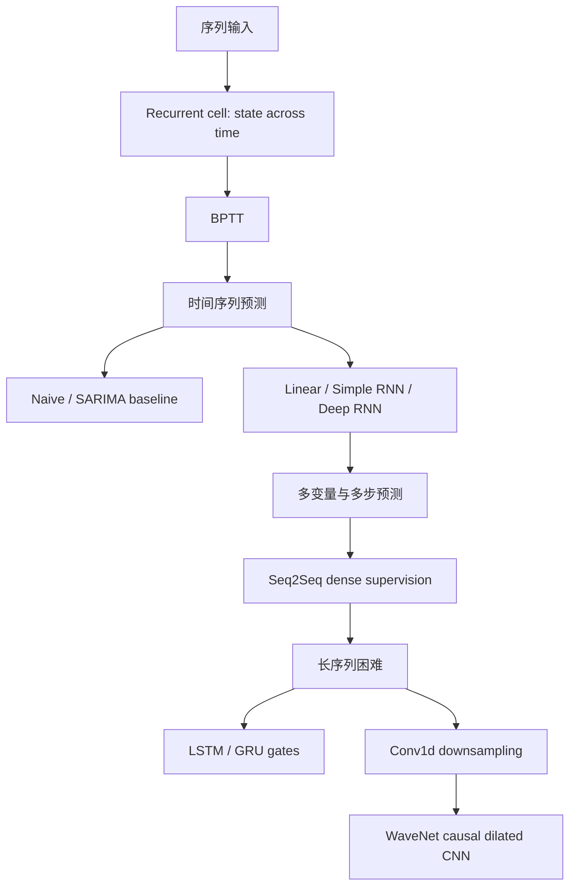

> 书目：*Hands-On Machine Learning with Scikit-Learn and PyTorch*<br>
> 章节：Chapter 13, Processing Sequences Using RNNs and CNNs<br>
> 章节文件：13. Processing Sequences Using RNNs and CNNs.md<br>
> 配套 Notebook：<https://homl.info/colab-p>

---

## 阅读导引

### 本章要解决什么问题

普通 Dense/CNN 接受固定尺寸输入，而现实序列长度可变，并且当前含义依赖历史：客流、语音、轨迹、文本和音乐都如此。本章围绕三个问题推进：

1. 如何用共享状态压缩任意长度历史？
2. 如何训练跨时间共享参数的模型并预测未来？
3. 如何缓解长序列中的梯度不稳定和短期记忆，并何时改用 1D CNN？



### 一句话概括

$$
\boxed{
\text{RNN 通过递归状态总结过去，CNN 通过因果多尺度感受野并行处理长序列。}
}
$$

### 重要边界

- 预测未来成立的前提是数据生成规律在部署期仍大致持续。
- 滑动窗口高度重叠，不是真正独立样本；shuffle 只改善优化顺序。
- RNN 的 hidden state 是有限维有损摘要，不可能保留无限历史全部信息。
- LSTM/GRU 延长记忆，但不能保证学习任意长依赖。
- 时间序列必须按时间切分，避免未来泄漏。

本文核心示例已在 Python 3.12、PyTorch 2.11.0 CPU 环境验证。CTA、Bach、QuickDraw 和音频项目涉及联网或可选依赖，数值参考来自官方 Notebook。

---

## 0. 必要基础与记号

### 0.1 序列张量

使用 `batch_first=True` 时：

$$
\mathbf X\in\mathbb R^{B\times T\times D}
$$

- $B$：batch size；
- $T$：sequence/window length；
- $D$：每个时间步的 features/input size。

RNN top-layer outputs：

$$
\mathbf Y\in\mathbb R^{B\times T\times H}
$$

最终 hidden state：

$$
\mathbf h_n\in\mathbb R^{L\times B\times H}
$$

$L$ 是 recurrent layers 数；双向 RNN 还需乘 directions 数。

### 0.2 时间序列术语

| 概念 | 含义 |
| --- | --- |
| Trend | 长期均值缓慢变化 |
| Seasonality | 固定周期重复模式 |
| Autocorrelation | 序列与自身滞后版本相关 |
| Stationarity | 统计性质大致不随时间改变 |
| Lag | 过去时间步偏移 |
| Horizon | 预测未来多远 |
| Exogenous feature | 可在预测时获得的外生变量 |

### 0.3 Causality

因果模型在时刻 $t$ 的输出只能依赖：

$$
\hat y_t=f(x_0,x_1,\ldots,x_t)
$$

不能使用 $x_{t+1:}$。训练时 target 可来自未来，但 forward 的输入路径不能偷看未来。

---

## 1. Recurrent Neurons and Layers

### 1.1 递归神经元与时间展开

Feedforward 网络无环；RNN 把上一时刻输出/状态反馈到当前。时间展开不是复制参数，而是同一 cell 在不同时间重复使用同一参数：

$$
h_t=f_\theta(x_t,h_{t-1}),
\qquad h_0=0\text{（常见默认）}
$$

共享参数带来：

- 可处理不同长度；
- 在所有位置复用同一动态规律；
- 参数量不随 $T$ 增长；
- 但反向路径长度随 $T$ 增长。

### 1.2 公式 13-1：单实例 recurrent layer

采用列向量记号：

$$
\boxed{
\widehat{\mathbf y}_t
=\phi(
\mathbf W_x^\top\mathbf x_t
{}+\mathbf W_h^\top\widehat{\mathbf y}_{t-1}
{}+\mathbf b)
}
$$

- $\mathbf x_t\in\mathbb R^D$；
- $\widehat{\mathbf y}_t\in\mathbb R^H$；
- $\mathbf W_x\in\mathbb R^{D\times H}$；
- $\mathbf W_h\in\mathbb R^{H\times H}$；
- $\mathbf b\in\mathbb R^H$。

简单 RNN 的 output 与 hidden state 相同，常用 tanh：有界输出能限制反复递归导致的爆炸，但饱和又会加剧梯度消失。

### 1.3 公式 13-2：Mini-batch 向量化

以行向量 batch 记号：

$$
\boxed{
\widehat{\mathbf Y}_t
=\phi(
\mathbf X_t\mathbf W_x
{}+\widehat{\mathbf Y}_{t-1}\mathbf W_h
{}+\mathbf b)
}
$$

其中 $\mathbf X_t:[B,D]$、$\widehat{\mathbf Y}_t:[B,H]$，bias broadcast 到每行。

也可拼接：

$$
\widehat{\mathbf Y}_t
=\phi\left(
[\mathbf X_t\;\widehat{\mathbf Y}_{t-1}]
\begin{bmatrix}\mathbf W_x\\\mathbf W_h\end{bmatrix}
{}+\mathbf b
\right)
$$

拼接后 shape `[B,D+H] @ [D+H,H] -> [B,H]`。

### 1.4 手写简单 RNN

```python
import torch
import torch.nn as nn


class ManualRNN(nn.Module):
    def __init__(self, input_size, hidden_size):
        super().__init__()
        self.hidden_size = hidden_size
        self.cell = nn.Sequential(
            nn.Linear(input_size + hidden_size, hidden_size),
            nn.Tanh(),
        )

    def forward(self, inputs):
        batch_size = inputs.shape[0]
        hidden = torch.zeros(
            batch_size,
            self.hidden_size,
            device=inputs.device,
            dtype=inputs.dtype,
        )
        outputs = []
        # [B,T,D] -> [T,B,D]，按时间迭代
        for inputs_t in inputs.transpose(0, 1):
            # 沿 feature 维拼接，得到 [B,D+H]
            hidden = self.cell(torch.cat([inputs_t, hidden], dim=1))
            outputs.append(hidden)
        return torch.stack(outputs, dim=1), hidden


model = ManualRNN(input_size=3, hidden_size=5)
outputs, last_state = model(torch.randn(4, 7, 3))
print(outputs.shape, last_state.shape)
```

输出：

```text
torch.Size([4, 7, 5]) torch.Size([4, 5])
```

原始章节的解释把交换维度写成 `permute(0,1)`，并称沿第一维拼接；正确实现是交换 batch/time，并沿 feature 维 `dim=1` 拼接，如代码所示。

### 1.5 `nn.RNN` API 与参数布局

```python
rnn = nn.RNN(
    input_size=3,
    hidden_size=5,
    num_layers=2,
    batch_first=True,
)
inputs = torch.randn(4, 7, 3)
outputs, final_states = rnn(inputs)
print(outputs.shape)
print(final_states.shape)
```

输出：

```text
torch.Size([4, 7, 5])
torch.Size([2, 4, 5])
```

`outputs` 只包含顶层每个时间步输出；`final_states[l]` 是每层最终状态。`batch_first` 不改变 hidden state 的层优先布局。

PyTorch 将输入和 hidden bias 分开以兼容 cuDNN，数学上二者相加等价一个 bias，所以手写 cell 与 `nn.RNN` 参数数/随机输出不完全相同。

---

## 2. Memory Cells

Cell 保留跨时间 state：

$$
\mathbf h_t=f(\mathbf x_t,\mathbf h_{t-1})
$$

输出通常：

$$
\mathbf y_t=g(\mathbf h_t)
$$

简单 RNN 有 $y_t=h_t$；LSTM 有 long-term $c_t$ 与 short-term/output $h_t$。State 是有限维压缩：若 $H$ 太小会欠表达，太大增加参数、过拟合与计算。

Jordan RNN 反馈上一步 output；Elman RNN 反馈 hidden state，后者是现代常见形式。

---

## 3. Input and Output Sequences

| 架构 | 输入 → 输出 | 示例 |
| --- | --- | --- |
| Sequence-to-sequence | 序列 → 等长/变长序列 | 每日预测、标注每帧 |
| Sequence-to-vector | 序列 → 单向量 | 情感、视频分类 |
| Vector-to-sequence | 单向量 → 序列 | 图像 caption、音乐生成条件 |
| Encoder-decoder | 序列 → context → 序列 | 翻译、摘要 |

在线逐词翻译的问题是句尾会改变句首译法；encoder 先看完整输入再由 decoder 生成更合理。单一固定 context 对长句形成瓶颈，后续 attention/Transformer 解决。

---

## 4. Training RNNs

### 4.1 Backpropagation Through Time

将递归展开为深度 $T$ 的共享参数网络。总损失可只用部分时间步：

$$
L=\sum_{t=1}^{T}m_t\ell(\hat y_t,y_t),
\qquad m_t\in\{0,1\}
$$

共享参数梯度是所有时间使用点贡献之和：

$$
\boxed{
\frac{\partial L}{\partial\theta}
=\sum_{t=1}^{T}
\frac{\partial L}{\partial\theta}\Big|_{\text{cell at }t}
}
$$

### 4.2 隐状态梯度递推

令 $L=\sum_t\ell_t$，则：

$$
\frac{\partial L}{\partial h_t}
=\frac{\partial\ell_t}{\partial h_t}
{}+\frac{\partial L}{\partial h_{t+1}}
\frac{\partial h_{t+1}}{\partial h_t}
$$

展开到早期：

$$
\frac{\partial L}{\partial h_t}
=\sum_{k=t}^{T}
\frac{\partial\ell_k}{\partial h_k}
\prod_{j=t+1}^{k}
\frac{\partial h_j}{\partial h_{j-1}}
$$

长 Jacobian 乘积导致消失/爆炸。若每个时间步都有 loss，早期层收到更短的梯度路径，这也是 seq2seq supervision 常更易训练的原因。

### 4.3 Truncated BPTT

超长序列无法一次保存全部图。可每 $K$ 步反传并 detach state：

```python
hidden = None
for inputs_chunk, targets_chunk in stream:
    optimizer.zero_grad()
    outputs, hidden = rnn(inputs_chunk, hidden)
    loss = criterion(outputs, targets_chunk)
    loss.backward()
    nn.utils.clip_grad_norm_(rnn.parameters(), 1.0)
    optimizer.step()
    hidden = hidden.detach()
```

Detach 截断跨 chunk 梯度，但保留数值 state。$K$ 越大越能学长依赖，也越耗内存且梯度更不稳定。

---

## 5. Forecasting a Time Series

本章以 Chicago Transit Authority 每日 bus/rail 客流为例。它是 multivariate daily time series，并有 day type：weekday、Saturday、Sunday/holiday。

### 5.1 数据审计先于模型

需要：按日期排序、设置唯一时间索引、检查重复和缺失、验证频率、删除 `total=bus+rail` 冗余列。时间序列重复行不是普通 IID 重复样本，可能代表数据版本错误。

### 5.2 Seasonality、Trend、Autocorrelation

客流显示强 weekly seasonality 和较弱 yearly seasonality。Lag-$s$ differencing：

$$
\Delta_s y_t=y_t-y_{t-s}
$$

若 $y_t$ 与 $y_{t-7}$ 高度相关，复制上周同日是强 baseline：

$$
\hat y_t^{naive}=y_{t-7}
$$

2019-03 至 2019-05 官方参考：bus MAE 43,916、rail MAE 42,143；MAPE 约 8.3%/9.0%。

### 5.3 MAE、MAPE 与 MSE

$$
MAE=\frac1N\sum_t|y_t-\hat y_t|
$$

$$
MAPE=\frac{100\%}{N}\sum_t
\left|\frac{y_t-\hat y_t}{y_t}\right|
$$

$$
MSE=\frac1N\sum_t(y_t-\hat y_t)^2
$$

MAE 保持目标单位；MSE 强罚大误差；MAPE 跨尺度可读，但 $y_t=0$ 无定义、接近 0 时爆炸，并对高估/低估不完全对称。零值场景可用 WAPE、MASE 或 sMAPE，并明确业务成本。

### 5.4 Differencing 与 Stationarity

一阶差分近似离散导数，可消除线性 trend；$d$ 阶差分可消除最高 $d$ 次多项式 trend。Seasonal differencing 消除周期 $s$ 的重复分量。

Stationarity 通常要求均值、方差和 autocovariance 不随绝对时间改变。真实序列很少严格平稳，目标是让模型残差更稳定。预测差分后必须积分回原尺度。

---

## 6. The ARMA Model Family

### 6.1 公式 13-3：ARMA$(p,q)$

$$
\boxed{
\hat y_t
=\sum_{i=1}^{p}\alpha_i y_{t-i}
{}+\sum_{i=1}^{q}\theta_i\varepsilon_{t-i}
}
$$

$$
\boxed{\varepsilon_t=y_t-\hat y_t}
$$

- AR($p$)：过去 $p$ 个观测的线性回归；
- MA($q$)：过去 $q$ 个 innovation/forecast errors 的修正；
- 假设经处理后的序列平稳，残差近似白噪声。

ARIMA$(p,d,q)$ 先做 $d$ 次 differencing。SARIMA 再加入季节 $(P,D,Q)_s$，总超参数 $(p,d,q)(P,D,Q)_s$。

### 6.2 CTA SARIMA Baseline

官方配置：`order=(1,0,0)`、`seasonal_order=(0,1,1,7)`。2019-06-01 单日预测 427,759，真值 379,044，误差 12.9%；但对 2019-03 至 05 滚动重训的 MAE 约 32,041，显著优于 weekly naive 42,143。

这说明不能用一个日期判断模型，也不能只拟合一次后用未来数据更新。真实 backtest 必须按时间滚动，任何时刻只使用当时可获得数据。

超参数可 time-series CV/grid search，也可参考 ACF/PACF、AIC/BIC。普通随机 K-fold 会泄漏未来。

---

## 7. Preparing Data for Machine Learning Models

### 7.1 Sliding Window

长度 $W$ 的 sequence-to-one 样本：

$$
X_i=[y_i,\ldots,y_{i+W-1}],
\qquad
t_i=y_{i+W}
$$

```python
import torch
from torch.utils.data import Dataset, DataLoader


class TimeSeriesDataset(Dataset):
    def __init__(self, series, window_length):
        if series.ndim != 2:
            raise ValueError("series must have shape [time, features]")
        self.series = series
        self.window_length = window_length

    def __len__(self):
        return max(0, len(self.series) - self.window_length)

    def __getitem__(self, index):
        if not 0 <= index < len(self):
            raise IndexError("dataset index out of range")
        end = index + self.window_length
        return self.series[index:end], self.series[end]


series = torch.arange(6).reshape(-1, 1).float()
dataset = TimeSeriesDataset(series, window_length=3)
for window, target in dataset:
    print(window.squeeze().tolist(), target.item())
```

输出：

```text
[0.0, 1.0, 2.0] 3.0
[1.0, 2.0, 3.0] 4.0
[2.0, 3.0, 4.0] 5.0
```

### 7.2 时间切分与边界上下文

应先按时间划分原始序列，再创建 windows，防止 target 跨越 train/valid 边界。若希望验证集第一天也有历史上下文，可显式把训练末尾 $W$ 个已知观测作为 context 拼到验证输入，但 target 仍仅来自验证期，并在指标中避免重复。

相邻 windows 共享 $W-1$ 个值，高度相关；训练 `shuffle=True` 只打乱 windows，不打乱 window 内时间，能降低 batch 顺序相关性，但不会让样本真正 IID。

### 7.3 Scaling

统计量只用训练期：

$$
x'=(x-\mu_{train})/\sigma_{train}
$$

原书为简单起见把客流除以 $10^6$。预测和 MAE 需乘回 $10^6$。外生 one-hot 不应除以 $10^6$。

---

## 8. Forecasting Using a Linear Model

Flatten $[B,W,D]\to[B,WD]$ 后线性预测：

$$
\hat y=b+\sum_{\tau=1}^{W}
\sum_{d=1}^{D}w_{\tau d}x_{t-W+\tau,d}
$$

它相当于有限 lag regression，是必须比较的低复杂度 baseline。

```python
import torch.nn as nn

window_length = 56
linear_model = nn.Sequential(
    nn.Flatten(),
    nn.Linear(window_length, 1),
)
print(linear_model(torch.randn(32, 56, 1)).shape)
```

官方 Huber+SGD 验证 MAE 约 37,726：优于 naive，差于 SARIMA。

---

## 9. Forecasting Using a Simple RNN

### 9.1 Sequence-to-vector Model

```python
class SimpleRnnModel(nn.Module):
    def __init__(self, input_size, hidden_size, output_size,
                 num_layers=1):
        super().__init__()
        self.rnn = nn.RNN(
            input_size,
            hidden_size,
            num_layers=num_layers,
            batch_first=True,
        )
        self.output = nn.Linear(hidden_size, output_size)

    def forward(self, inputs):
        outputs, final_states = self.rnn(inputs)
        return self.output(outputs[:, -1])


model = SimpleRnnModel(1, 32, 1)
print(model(torch.randn(8, 56, 1)).shape)
```

输出 `[8,1]`。最后顶层 output 等于 `final_states[-1]`（单向、无 packed sequence 时）。官方简单 RNN 验证 MAE 约 30,659，优于 SARIMA。

Tanh hidden 限制在 $[-1,1]$，最终 Linear 把状态映射到无界目标。不要直接把 tanh state 当客流预测。

---

## 10. Forecasting Using a Deep RNN

`num_layers=3` 堆叠 recurrent layers：第 $l$ 层的时间序列输出作为第 $l+1$ 层输入。参数量首层与后续层不同：

$$
P_1=H(D+H)+2H
$$

$$
P_{l>1}=H(H+H)+2H
$$

这里 `nn.RNN` 有 input/hidden 两组 bias。官方 3 层验证 MAE 约 29,273。更深增加时间深度之外的垂直深度，也加剧优化和过拟合风险。

---

## 11. Forecasting Multivariate Time Series

### 11.1 已知未来协变量

Rail forecast 可输入历史 rail、bus，以及已知的明日 day type。把 day type `shift(-1)` 是合法的，因为日历在预测时已知；若变量在部署时未知，使用未来值就是泄漏。

正确预处理：

```python
numeric = df[["rail", "bus"]] / 1e6
day_type = pd.get_dummies(
    df["day_type"].shift(-1),
    prefix="next_day",
    dtype=float,
)
df_multivariate = pd.concat([numeric, day_type], axis=1).dropna()

train_values = torch.tensor(
    df_multivariate["2016-01":"2018-12"].values,
    dtype=torch.float32,
)
```

原始章节在构造 `df_mulvar` 时已经对 rail/bus `/1e6`，后面转 tensor 又把整个表 `/1e6`，会二次缩放客流并把 one-hot 变成 $10^{-6}$；官方 Notebook 的实际代码没有第二次除法。

### 11.2 Target Selection

输入 `[B,56,5]`，只预测 rail target `[B,1]`；把 output size 改 2 并 target 取前两列可联合预测 rail/bus。官方多变量单 rail MAE 约 23,227；联合预测 rail/bus MAE 约 26,441/26,178。多任务共享可正则化，也可能产生任务干扰。

---

## 12. Forecasting Several Time Steps Ahead

### 12.1 Recursive/Autoregressive Strategy

单步模型反复预测，并把 $\hat y$ 接回输入：

$$
\hat y_{t+1}=f(y_{t-W+1:t})
$$

$$
\hat y_{t+2}=f(y_{t-W+2:t},\hat y_{t+1})
$$

优点是只训练一个单步模型；缺点是 exposure bias 和 error accumulation：训练看到真值历史，推理看到自己的有误预测。适合短 horizon。

### 12.2 Direct Multi-output Strategy

一次输出 $K$ horizons：

$$
[\hat y_{t+1},\ldots,\hat y_{t+K}]=f(x_{t-W+1:t})
$$

不累积 autoregressive error，但输出维增大、远 horizon 更难，且没有显式保证预测轨迹一致。

```python
class ForecastAheadDataset(TimeSeriesDataset):
    def __init__(self, series, window_length, horizon, target_column=0):
        super().__init__(series, window_length)
        self.horizon = horizon
        self.target_column = target_column

    def __len__(self):
        return max(
            0,
            len(self.series) - self.window_length - self.horizon + 1,
        )

    def __getitem__(self, index):
        end = index + self.window_length
        window = self.series[index:end]
        targets = self.series[
            end:end + self.horizon,
            self.target_column,
        ]
        return window, targets


dataset = ForecastAheadDataset(
    torch.arange(20).reshape(-1, 1).float(),
    window_length=5,
    horizon=3,
)
print(dataset[0])
```

可组合两者：每次直接预测 14 天，再递归生成下一个 14 天；但若输入含未预测的 bus 等协变量，必须同时预测或提供其未来值。

---

## 13. Forecasting Using a Sequence-to-Sequence Model

### 13.1 Dense Temporal Supervision

输入 `[B,W,D]`，每个时间步预测未来 $K$ 个值，输出/target `[B,W,K]`。虽然只使用最后一步部署预测，训练时所有时间步贡献 loss：

$$
L=\frac1{BWK}\sum_{b,t,k}
\ell(\hat y_{b,t,k},y_{b,t+k})
$$

每个时间点都提供较短梯度路径，训练更稳定；也让模型适应不同历史长度。

### 13.2 Seq2Seq Dataset

```python
class Seq2SeqDataset(ForecastAheadDataset):
    def __getitem__(self, index):
        end = index + self.window_length
        window = self.series[index:end]
        target_period = self.series[
            index + 1:end + self.horizon,
            self.target_column,
        ]
        targets = target_period.unfold(
            dimension=0,
            size=self.horizon,
            step=1,
        )
        return window, targets


toy = Seq2SeqDataset(
    torch.arange(12).reshape(-1, 1).float(),
    window_length=4,
    horizon=3,
)
window, targets = toy[0]
print(window.squeeze())
print(targets)
```

Targets 为：`[[1,2,3],[2,3,4],[3,4,5],[4,5,6]]`。Target 中出现 input 的未来位置不算作弊，因为时刻 $t$ 的 causal RNN state 只见到 $x_{\le t}$。

### 13.3 Seq2Seq RNN

```python
class Seq2SeqRnnModel(SimpleRnnModel):
    def forward(self, inputs):
        outputs, final_states = self.rnn(inputs)
        return self.output(outputs)


model = Seq2SeqRnnModel(
    input_size=5,
    hidden_size=32,
    output_size=14,
)
print(model(torch.randn(10, 56, 5)).shape)
```

`nn.Linear` 自动作用于最后一维：`[10,56,32] @ [32,14] -> [10,56,14]`。推理取 `predictions[:,-1]`。

官方参考 t+1 MAE 23,350，t+14 MAE 35,315；horizon 越远不确定性通常越大，应按 horizon 分别报告指标，而不是只给总平均。

---

## 14. Handling Long Sequences

长序列把网络沿时间展开得很深，带来两类问题：

1. **Unstable gradients**：共享 recurrent Jacobian 长乘积；
2. **Short-term memory**：早期信息经反复非线性变换逐渐丢失。

此外，RNN 时间步通常顺序依赖，难像 CNN/Transformer 那样完全并行，训练延迟随 $T$ 线性增长。

---

## 15. Fighting the Unstable Gradients Problem

### 15.1 为什么 ReLU RNN 更危险

简单 RNN Jacobian：

$$
\frac{\partial h_t}{\partial h_{t-1}}
=\operatorname{diag}(\phi'(z_t))W_h
$$

ReLU 正区导数 1 且输出无界，如果 $W_h$ spectral radius 大于 1，状态和梯度都可能指数增长。Tanh 输出有界但饱和时导数接近 0。没有一个激活能单独解决全部问题。

可用：合适初始化、较小 LR、Adam/NAG、gradient clipping、truncated BPTT、gated cells、normalization。

### 15.2 BatchNorm 与 LayerNorm

BN 依赖 batch 统计，同一 BN 参数跨不同时间分布复用通常效果有限；可在 recurrent layers 之间垂直使用，但不适合 hidden-to-hidden 每步内部归一化。

LN 对每个样本 hidden features 归一化，时间和 batch 无关，更适合 cell 内：

```python
class LayerNormRNN(nn.Module):
    def __init__(self, input_size, hidden_size, output_size):
        super().__init__()
        self.hidden_size = hidden_size
        self.cell = nn.Sequential(
            nn.Linear(input_size + hidden_size, hidden_size),
            nn.LayerNorm(hidden_size),
            nn.Tanh(),
        )
        self.output = nn.Linear(hidden_size, output_size)

    def forward(self, inputs):
        hidden = inputs.new_zeros(inputs.shape[0], self.hidden_size)
        for inputs_t in inputs.transpose(0, 1):
            hidden = self.cell(torch.cat([inputs_t, hidden], dim=1))
        return self.output(hidden)
```

LN 不是必然提升，尤其序列仍有趋势/seasonality 时需实验。

### 15.3 Recurrent Dropout

`nn.RNN(...,dropout=p,num_layers=L)` 只在堆叠层之间对每个时间步的 layer outputs dropout，最后一层不 dropout；$L=1$ 时无效。它不是 hidden-to-hidden recurrent dropout。

若要 cell 内 dropout，需手写循环。对同一 sequence 每步使用同一个 mask（variational/locked dropout）常比每步随机 mask 更稳定，因为后者给状态转移持续注入不同噪声。

预测区间可用 MC dropout，但只近似 epistemic uncertainty；时间序列还存在 observation noise 和 regime shift。

---

## 16. Tackling the Short-Term Memory Problem

### 16.1 LSTM Cells

LSTM 分为 short-term/output state $h_t$ 与 long-term cell state $c_t$。四个子层都接收 $x_t,h_{t-1}$：input gate、forget gate、output gate 和 candidate。

### 16.2 公式 13-4：LSTM

$$
\boxed{
i_t=\sigma(W_{xi}^Tx_t+W_{hi}^Th_{t-1}+b_i)
}
$$

$$
\boxed{
f_t=\sigma(W_{xf}^Tx_t+W_{hf}^Th_{t-1}+b_f)
}
$$

$$
\boxed{
o_t=\sigma(W_{xo}^Tx_t+W_{ho}^Th_{t-1}+b_o)
}
$$

$$
\boxed{
g_t=\tanh(W_{xg}^Tx_t+W_{hg}^Th_{t-1}+b_g)
}
$$

$$
\boxed{c_t=f_t\odot c_{t-1}+i_t\odot g_t}
$$

$$
\boxed{h_t=y_t=o_t\odot\tanh(c_t)}
$$

门值在 $(0,1)$：$f$ 决定保留旧记忆，$i$ 写入 candidate，$o$ 控制读取。

### 16.3 为什么 Cell State 改善梯度

暂忽略 gates 对前状态的间接依赖，沿直接 cell highway：

$$
\frac{\partial c_t}{\partial c_{t-1}}=f_t
$$

跨 $k$ 步：

$$
\boxed{
\frac{\partial c_t}{\partial c_{t-k}}
\approx\prod_{j=t-k+1}^{t}f_j
}
$$

若模型学到 $f_j\approx1$，梯度可接近不衰减地通过 additive state path；普通 RNN 则反复乘完整 $W_h$ 和激活导数。若 $f<1$ 很多步，LSTM 仍会遗忘，因此不是无限记忆。

Forget-gate bias 常初始化为正数，使开始训练时倾向保留记忆。

### 16.4 PyTorch LSTM Shape

```python
import torch
import torch.nn as nn

lstm = nn.LSTM(
    input_size=5,
    hidden_size=32,
    num_layers=2,
    batch_first=True,
)
outputs, (final_hidden, final_cell) = lstm(torch.randn(8, 56, 5))
print(outputs.shape)
print(final_hidden.shape, final_cell.shape)
```

输出：

```text
torch.Size([8, 56, 32])
torch.Size([2, 8, 32]) torch.Size([2, 8, 32])
```

`nn.LSTMCell` 处理单个时间步，适合自定义 LN/dropout 循环；`nn.LSTM` 更快且可用 cuDNN。

### 16.5 GRU Cells

GRU 合并 $c,h$，无 output gate；update gate $z$ 在保留旧状态与写入 candidate 之间插值，reset gate $r$ 控制 candidate 查看多少过去。

### 16.6 公式 13-5：GRU

$$
\boxed{z_t=\sigma(W_{xz}^Tx_t+W_{hz}^Th_{t-1}+b_z)}
$$

$$
\boxed{r_t=\sigma(W_{xr}^Tx_t+W_{hr}^Th_{t-1}+b_r)}
$$

$$
\boxed{
g_t=\tanh(
W_{xg}^Tx_t
{}+W_{hg}^T(r_t\odot h_{t-1})+b_g)
}
$$

$$
\boxed{
h_t=z_t\odot h_{t-1}
{}+(1-z_t)\odot g_t
}
$$

$z=1$ 保留旧 state，$z=0$ 全部替换为 candidate。GRU 参数较少，常与 LSTM 性能接近；具体任务需验证。

```python
gru = nn.GRU(5, 32, num_layers=2, batch_first=True)
outputs, final_hidden = gru(torch.randn(8, 56, 5))
print(outputs.shape, final_hidden.shape)
```

### 16.7 LSTM/GRU 参数量

每层 LSTM 有 4 组 gates：

$$
P_{LSTM}=4H(D+H)+8H
$$

PyTorch input/hidden 各有一组 bias，故 $8H$。GRU 三组：

$$
P_{GRU}=3H(D+H)+6H
$$

GRU 更轻；LSTM 独立 cell/output gate 更灵活。

---

## 17. Using 1D Convolutions to Process Sequences

Conv1d 输入 `[B,C,T]`，RNN 输入 `[B,T,D]`，需 transpose。Kernel 学局部短模式；stride 下采样缩短 RNN 时间长度，使同样 recurrent steps 覆盖更长原始历史。

### 17.1 Conv + GRU

```python
class DownsamplingModel(nn.Module):
    def __init__(self, input_size, hidden_size, output_size):
        super().__init__()
        self.conv = nn.Conv1d(
            input_size,
            hidden_size,
            kernel_size=4,
            stride=2,
        )
        self.gru = nn.GRU(
            hidden_size,
            hidden_size,
            batch_first=True,
        )
        self.output = nn.Linear(hidden_size, output_size)

    def forward(self, inputs):
        features = self.conv(inputs.transpose(1, 2))
        features = torch.relu(features).transpose(1, 2)
        outputs, final_hidden = self.gru(features)
        return self.output(outputs)


model = DownsamplingModel(5, 32, 14)
print(model(torch.randn(8, 112, 5)).shape)
```

长度：

$$
T_{out}=\left\lfloor\frac{112-4}{2}\right\rfloor+1=55
$$

第一个输出使用输入 0..3，因此对应的首个 target 是从原目标序列 index 3 开始；stride 2 后 target 用 `target[3::2]`，长度 55。改变 kernel/stride/padding 必须重新推导对齐，不能硬编码 3。

---

## 18. WaveNet

### 18.1 Causal Dilated Convolution

普通 same Conv 会看到未来。因果 Conv 只在左侧 padding：

$$
p_{left}=d(k-1),
\qquad p_{right}=0
$$

保持长度且输出 $t$ 只依赖 $x_{\le t}$。

```python
import torch.nn.functional as F


class CausalConv1d(nn.Conv1d):
    def forward(self, inputs):
        left_padding = (
            (self.kernel_size[0] - 1) * self.dilation[0]
        )
        inputs = F.pad(inputs, (left_padding, 0))
        return super().forward(inputs)
```

### 18.2 感受野推导

Stride 1 的 causal conv stack：

$$
\boxed{
R=1+\sum_{l=1}^{L}(k_l-1)d_l
}
$$

若 $k=2,d=1,2,4,\ldots,512$：

$$
R=1+(1+2+\cdots+512)
=1+(2^{10}-1)=1024
$$

仅 10 层覆盖 1,024 步，参数和计算远少于 kernel 1024 的单层，并有 10 次非线性。三个相同 dilation cycles 的总体感受野为 $1+3(1023)=3070$，不是仍为 1024。

### 18.3 简化 WaveNet

```python
class WaveNetModel(nn.Module):
    def __init__(self, input_size, hidden_size, output_size):
        super().__init__()
        layers = []
        for dilation in (1, 2, 4, 8) * 2:
            layers.extend([
                CausalConv1d(
                    input_size,
                    hidden_size,
                    kernel_size=2,
                    dilation=dilation,
                ),
                nn.ReLU(),
            ])
            input_size = hidden_size
        self.convolutions = nn.Sequential(*layers)
        self.output = nn.Linear(hidden_size, output_size)

    def forward(self, inputs):
        features = self.convolutions(inputs.transpose(1, 2))
        return self.output(features.transpose(1, 2))


model = WaveNetModel(5, 32, 14)
print(model(torch.randn(8, 112, 5)).shape)
```

输出 `[8,112,14]`。该简化模型 dilation sum 为 30，感受野 31。完整 WaveNet 还使用 gated activations、residual/skip connections 等。

CNN 可并行所有时间位置，长序列训练通常比 RNN 快；但 fixed receptive field 外的信息不可见。增加 dilation/depth 扩大范围，Transformer attention 则直接建立远距离联系。

### 18.4 Distribution Shift

CTA test 从 2020 开始，COVID-19 使交通模式突变，所有历史模型显著恶化。这不是单纯 overfitting，而是 regime/concept shift。部署必须：

- 用最近时间做 backtest；
- 监控 residual/feature drift；
- 给预测区间和异常告警；
- 定期重训或快速适配；
- 在重大事件时允许人工 override。

---

## 19. 章末练习与参考答案

### 练习 1：不同序列架构的应用

- Seq-to-seq：逐日预测、语音转文字、序列标注、视频逐帧分类；
- Seq-to-vector：情感分析、异常检测、视频/音频分类；
- Vector-to-seq：图像 caption、条件音乐/轨迹生成；
- Encoder-decoder：翻译、摘要、任意输入输出长度映射。

### 练习 2：RNN 输入输出维度

`batch_first=True` 输入 3D `[B,T,D]`；输出 `[B,T,H*directions]`；最终 hidden `[L*directions,B,H]`。LSTM 还返回同 shape 的 final cell state。未设置 batch-first 时输入/输出前两维交换，hidden layout 不变。

### 练习 3：Deep Seq-to-seq RNN

```python
class DeepSeq2Seq(nn.Module):
    def __init__(self, input_size, hidden_size, output_size):
        super().__init__()
        self.rnn = nn.GRU(
            input_size,
            hidden_size,
            num_layers=3,
            dropout=0.2,
            batch_first=True,
        )
        self.output = nn.Linear(hidden_size, output_size)

    def forward(self, inputs):
        sequence, final_hidden = self.rnn(inputs)
        return self.output(sequence)


print(DeepSeq2Seq(5, 32, 14)(torch.randn(4, 56, 5)).shape)
```

输出 `[4,56,14]`。`dropout` 只作用于三层之间，不作用最后层输出或同层时间递归。

### 练习 4：未来七天预测架构

日单变量序列，推荐 sequence-to-vector RNN/GRU/LSTM，output size 7，直接一次预测七天，避免单步递归误差积累。若希望 dense temporal supervision，可用 seq-to-seq，每时间步输出 7，部署取最后一步。训练 target shape 分别 `[B,7]` 或 `[B,T,7]`。

### 练习 5：RNN 训练困难及处理

| 困难 | 方法 |
| --- | --- |
| 梯度爆炸 | clipping、较小 LR、gated cell、truncated BPTT |
| 梯度消失/短记忆 | LSTM/GRU、LN、合理初始化、短梯度 supervision |
| 顺序计算慢 | Conv1d 下采样、WaveNet、Transformer |
| 变长 batch | padding + mask/pack sequence |
| 曝光偏差 | direct multi-horizon、scheduled sampling |
| 非平稳/漂移 | differencing、外生变量、滚动重训/监控 |

### 练习 6：LSTM 结构

四个并行 affine transforms 产生 $i,f,o,g$；旧 $c$ 经 forget gate，candidate 经 input gate，相加成新 $c$；`tanh(c)` 经 output gate 得 $h=y$。关键是 additive cell highway，而不是单纯“多几个 sigmoid”。式 13-4 给出完整计算。

### 练习 7：为什么在 RNN 前用 Conv1d

- 提取局部短期 pattern；
- stride/pooling 缩短 sequence，降低 recurrent 计算；
- 每个 RNN step 覆盖更长原始历史；
- 抑制局部噪声并增加 features。

必须对齐 targets，并防止非因果 padding 偷看未来。

### 练习 8：视频分类架构

每帧用 CNN/ViT 提取 embedding，再用 GRU/LSTM/temporal Conv/Transformer 做 sequence-to-vector 分类。短视频也可 3D CNN 同时卷积空间和时间。长视频常分 clip、层次聚合；实时场景必须 causal。

### 练习 9：同时预测 Rail/Bus 未来 14 天

```python
class Seq2SeqRailBusDataset(ForecastAheadDataset):
    def __getitem__(self, index):
        end = index + self.window_length
        window = self.series[index:end]
        target_period = self.series[
            index + 1:end + self.horizon,
            :2,
        ]
        # unfold 给 [W,2,K]，转成 [W,K,2] 再 flatten 为 28
        targets = target_period.unfold(0, self.horizon, 1)
        targets = targets.transpose(1, 2).flatten(start_dim=1)
        return window, targets


series = torch.randn(100, 5)
dataset = Seq2SeqRailBusDataset(series, 56, 14)
window, target = dataset[0]
model = Seq2SeqRnnModel(5, 32, 28)
prediction = model(window.unsqueeze(0))
print(window.shape, target.shape, prediction.shape)
print(prediction.reshape(1, 56, 14, 2).shape)
```

预期 `[56,5] [56,28] [1,56,28]`，reshape 后 `[1,56,14,2]`。Loss 可在缩放后的 rail/bus 上取均值；若两者业务成本不同，应加任务权重。官方 Notebook 对两条序列、所有时间步和 horizon 合并计算的验证 MAE 约为 47,222；它没有分别报告 rail/bus 的该模型 MAE。

### 练习 10：生成 Bach Chorales

将每个四音 chord 展成 note sequence，加入 SOS token，把音高映射为 48 类；训练 causal seq-to-seq next-note classifier。官方 Conv1d+LSTM 模型 5 epochs 测试 accuracy 约 0.8254。

```python
class BachModel(nn.Module):
    def __init__(self, n_inputs=51, conv_dim=32,
                 lstm_dim=64, n_notes=48):
        super().__init__()
        layers = []
        for layer_index in range(4):
            layers.extend([
                CausalConv1d(
                    n_inputs,
                    conv_dim,
                    kernel_size=2,
                    dilation=2**layer_index,
                ),
                nn.ReLU(),
            ])
            n_inputs = conv_dim
        self.convolutions = nn.Sequential(*layers)
        self.lstm = nn.LSTM(
            conv_dim, lstm_dim, batch_first=True
        )
        self.output = nn.Linear(lstm_dim, n_notes)

    def forward(self, inputs):
        features = self.convolutions(inputs.transpose(1, 2))
        sequence, _ = self.lstm(features.transpose(1, 2))
        # CrossEntropyLoss 期望 [B,classes,T]
        return self.output(sequence).transpose(1, 2)


print(BachModel()(torch.randn(4, 128, 51)).shape)
```

生成时从 softmax 分布采样而非永远 argmax：

$$
p_i(T)=\frac{\exp(z_i/T)}{\sum_j\exp(z_j/T)}
$$

$T<1$ 更保守重复，$T>1$ 更多样也更易走调。每次 append 采样 note，重新构造位置 features。生成音乐的“像 Bach”不能只由 next-note accuracy 判断，还需音乐结构和人工评价。

### 练习 11：QuickDraw Classification

每个 sketch 把所有 strokes 串成 point sequence；每点 features 可为归一化 $(x,y)$、stroke progress，并建议增加 pen-up/new-stroke flag，避免不同 stroke 边界丢失。

变长 batch 用 padding 和 lengths：

```python
from torch.nn.utils.rnn import (
    pad_sequence,
    pack_padded_sequence,
)


def collate_sketches(batch):
    sequences, labels = zip(*batch)
    lengths = torch.tensor([len(sequence) for sequence in sequences])
    padded = pad_sequence(sequences, batch_first=True)
    return padded, lengths, torch.tensor(labels)


class SketchClassifier(nn.Module):
    def __init__(self, n_features=4, hidden_size=64, n_classes=3):
        super().__init__()
        self.gru = nn.GRU(n_features, hidden_size, batch_first=True)
        self.output = nn.Linear(hidden_size, n_classes)

    def forward(self, padded, lengths):
        packed = pack_padded_sequence(
            padded,
            lengths.cpu(),
            batch_first=True,
            enforce_sorted=False,
        )
        packed_outputs, final_hidden = self.gru(packed)
        return self.output(final_hidden[-1])
```

按 sketch 而非 stroke 随机切分，避免同一图泄漏；类别多时评估 macro F1 和混淆矩阵。

### 练习 12：Yes/No Audio Classification

流程：录音 → mono/resample → VAD 切词 → Mel spectrogram → 对数压缩/标准化 → GRU/CNN 分类。

```python
import torchaudio

waveform, sample_rate = torchaudio.load("yes.wav")
mono = waveform.mean(dim=0, keepdim=True)
vad = torchaudio.transforms.Vad(sample_rate=sample_rate)
speech = vad(mono)
mel = torchaudio.transforms.MelSpectrogram(
    sample_rate=sample_rate,
    n_mels=64,
)(speech)
log_mel = torch.log(mel.clamp_min(1e-6))
sequence = log_mel.permute(2, 0, 1).flatten(start_dim=1)
```

Dataset 划分应按 recording session/日期，而非随机切出的词片段，否则相同背景噪声泄漏。增加不同距离、语速、房间和负样本；二分类用 single logit + `BCEWithLogitsLoss`。真实语音系统还要处理“不确定/其他词”，仅 yes/no 强制二选一不安全。

---

## 20. 公式速查

| 编号/公式 | 含义 |
| --- | --- |
| 13-1 | 单实例 simple recurrent layer |
| 13-2 | Mini-batch RNN 向量化 |
| 13-3 | ARMA：past values + past errors |
| 13-4 | LSTM 四门与 cell/hidden state |
| 13-5 | GRU reset/update/candidate |
| $\Delta_s y_t=y_t-y_{t-s}$ | Seasonal differencing |
| $\partial c_t/\partial c_{t-k}\approx\prod f_j$ | LSTM memory gradient |
| $R=1+\sum_l(k_l-1)d_l$ | Causal dilated Conv 感受野 |
| MAE/MAPE/MSE | Forecast metrics |

## 21. PyTorch API 速查

| API | 输入/输出 | 注意点 |
| --- | --- | --- |
| `nn.RNN` | `[B,T,D]→[B,T,H]` | final `[L,B,H]` |
| `nn.LSTM` | outputs + `(h_n,c_n)` | 4 gates |
| `nn.GRU` | outputs + `h_n` | 3 gates |
| `RNNCell/LSTMCell/GRUCell` | 单时间步 | 自定义 LN/dropout |
| `num_layers` | 堆叠 recurrent layers | 增加垂直深度 |
| `dropout` | 层间 dropout | 单层时无效 |
| `bidirectional` | 双向历史/未来 | 不适合 causal forecast |
| `pack_padded_sequence` | 跳过 padding | lengths 通常在 CPU |
| `pad_packed_sequence` | 恢复 padded outputs | 需 mask loss |
| `unfold` | 滑动 target windows | 检查维度顺序 |
| `Conv1d` | `[B,C,T]` | 与 RNN 需 transpose |
| `F.pad` | causal left padding | 不要右 pad 偷看未来 |

---

## 22. 易混淆概念与常见误解

| 误解 | 正确理解 |
| --- | --- |
| RNN 每时间步有不同参数 | 时间展开共享同一参数 |
| Hidden state 保存完整历史 | 是有限维有损摘要 |
| batch_first 改变所有输出布局 | final state 仍 `[layers,B,H]` |
| `outputs[:,-1]` 总等于最后真实 token | 含 padding 时不成立，应 pack/mask |
| Shuffle 会打乱 window 内时间 | 只应打乱 windows |
| 重叠 windows 是 IID | 高度相关，shuffle 不能改变事实 |
| 随机 train/test split 可用于 forecasting | 会未来泄漏，应时间 backtest |
| 已知未来 day type 是泄漏 | 若部署时已知，是合法 exogenous feature |
| 所有协变量都可用未来值 | 只有预测时可获得者可以 |
| 多步递归只需训练一次所以最好 | 会累积错误和 exposure bias |
| Seq2Seq target 含 input 值就是作弊 | causal state 在每步看不到未来 |
| `nn.RNN(dropout)` 做 recurrent dropout | 只在堆叠层之间 |
| LSTM 保证无限记忆 | forget gates 连乘仍会衰减 |
| GRU 总比 LSTM 差 | 更轻且常性能接近 |
| same Conv1d 一定 causal | 双侧 padding 会看未来 |
| WaveNet dilation 不断增大就行 | 常周期重置并配 residual/skip |
| MAPE 对任何序列都稳健 | 零/近零 target 会失真 |
| 验证好即可长期部署 | regime shift 可使模型突然失效 |

---

## 23. 学习检查清单

### 概念与推导

- [ ] 能写出式 13-1/13-2 并核对 shape
- [ ] 能区分 output、hidden state、cell state
- [ ] 能区分 seq2seq/seq2vec/vec2seq/encoder-decoder
- [ ] 能推导 BPTT hidden gradient 递推
- [ ] 能解释 truncated BPTT 的取舍
- [ ] 能定义 trend/seasonality/stationarity/autocorrelation
- [ ] 能写出 ARMA/ARIMA/SARIMA 组成
- [ ] 能比较 recursive/direct/seq2seq 多步预测
- [ ] 能推导 LSTM cell highway 梯度
- [ ] 能解释 GRU update/reset gates
- [ ] 能推导 Conv1d target 对齐
- [ ] 能计算 WaveNet 感受野并证明 causal

### 工程能力

- [ ] 能按时间切分并构造无泄漏 windows
- [ ] 能只用训练期统计做 scaling
- [ ] 能建立 naive/SARIMA/linear baseline
- [ ] 能实现 simple/deep/multivariate RNN
- [ ] 能按 horizon 分别评估误差
- [ ] 能处理 known-future exogenous features
- [ ] 能用 padding/packing 处理变长序列
- [ ] 能正确使用 RNN/LSTM/GRU API shape
- [ ] 能组合 Conv1d 与 recurrent layer
- [ ] 能实现 causal dilated WaveNet
- [ ] 能监控并应对时间分布漂移

---

## 24. 本章知识压缩

```text
【RNN】
h_t = f(x_t, h_{t-1})
时间共享参数，state 压缩历史
输入 [B,T,D]，输出 [B,T,H]，final [L,B,H]

【BPTT】
时间展开后普通反传
共享参数梯度 = 所有时间步贡献之和
长 Jacobian 乘积导致梯度消失/爆炸

【预测流程】
先时间切分、数据审计、naive/SARIMA baseline
滑动窗口构造监督样本，只用训练统计缩放
部署可用的未来日历是合法外生变量

【多步预测】
Recursive：灵活但误差累积
Direct：一次输出多个 horizon
Seq2Seq：每时间步监督，梯度更密集
按 horizon 分别报告指标

【长记忆】
LSTM: forget/input/output gates + additive cell state
GRU: update/reset gates，更轻
门控延长记忆但不保证无限依赖

【1D CNN】
局部模式可并行提取
Stride 缩短序列，让 RNN 覆盖更长历史
Causal left padding 防未来泄漏
Dilation 1,2,4,... 指数扩大感受野

【现实边界】
Forecast 假设历史规律延续
COVID 等 regime shift 会使模型失效
必须滚动 backtest、监控、重训并提供不确定性
```
