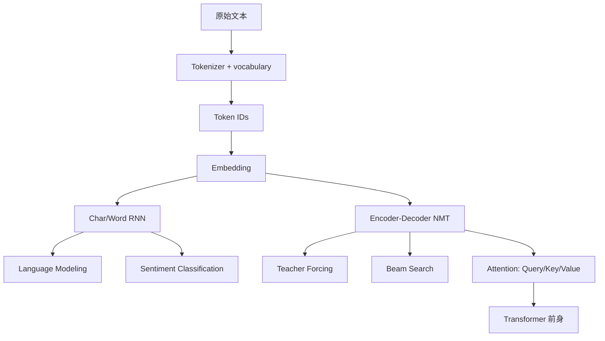

> 书目：*Hands-On Machine Learning with Scikit-Learn and PyTorch*<br>
> 章节：Chapter 14, Natural Language Processing with RNNs and Attention<br>
> 章节文件：14. Natural Language Processing with RNNs and Attention.md<br>
> 配套 Notebook：<https://homl.info/colab-p>

---

## 阅读导引

### 本章的三条主线

1. **语言建模**：字符序列预测下一个字符，并自回归生成文本；
2. **文本分类**：subword tokenizer、padding/mask、双向 RNN 与预训练 BERT；
3. **机器翻译**：encoder-decoder、teacher forcing、beam search 与 attention。



### 一句话概括

$$
\boxed{
\text{NLP 把离散文本变为 token 与向量，}
\text{再用序列模型学习条件概率、上下文表示和跨序列对齐。}
}
$$

### 重要边界

- Tokenizer 是模型输入契约的一部分，不能随意更换。
- 生成模型学习的是训练分布的条件概率，不等于理解或事实正确。
- Bidirectional encoder 可看完整输入，causal decoder 不能看未来输出。
- Padding 必须在 RNN、loss 和 attention 中被正确 mask。
- Beam search 优化模型概率，不保证事实性、多样性或人类偏好。
- 预训练模型可能携带偏见、隐私、版权和供应链风险。

本文纯 PyTorch 示例已在 Python 3.12、PyTorch 2.11.0 CPU 环境验证。Hugging Face Datasets/Tokenizers/Transformers 当前未安装；相应代码注明安装与联网条件，数值引用官方 Notebook。

---

## 0. 必要基础

### 0.1 Token、Vocabulary 与 ID

Token 是模型处理的离散单位，可为字符、byte、word 或 subword。Vocabulary 是 token 到整数 ID 的有限映射：

$$
V=\{t_0,t_1,\ldots,t_{|V|-1}\}
$$

常见特殊 token：`<pad>`、`<unk>`、`<s>/<bos>`、`</s>/<eos>`、`[CLS]`、`[SEP]`。ID 大小没有语义距离，不能直接当连续数值输入。

### 0.2 Language Model

自回归语言模型分解 sequence 概率：

$$
\boxed{
p(x_{1:T})
=\prod_{t=1}^{T}p(x_t\mid x_{<t})
}
$$

训练最小化 negative log-likelihood：

$$
L=-\frac1T\sum_{t=1}^{T}\log p_\theta(x_t\mid x_{<t})
$$

Perplexity：

$$
\boxed{PPL=e^L}
$$

若平均正确 token 概率恒为 $p$，则 $PPL=1/p$；可直观理解为模型每步面对的有效候选数。只有 tokenizer、数据和归一化一致时才可公平比较 perplexity。

### 0.3 Cross-Entropy Shape

PyTorch token classification 常用 logits `[B,V,T]`、targets `[B,T]`：

```python
loss = nn.CrossEntropyLoss(ignore_index=pad_id)(logits, targets)
```

模型内部常自然输出 `[B,T,V]`，需 transpose/permute，或 flatten 为 `[BT,V]` 与 `[BT]`。

---

## 1. Generating Shakespearean Text Using a Character RNN

Char-RNN 只学习 next-character prediction，却必须间接学习拼写、标点、局部语法和文体。优点是无 OOV，词表小；缺点是序列很长，长期语义困难，生成慢。

---

## 2. Creating the Training Dataset

### 2.1 字符 Vocabulary 与可逆编码

```python
import torch

text = "To be, or not to be!"
vocab = sorted(set(text.lower()))
char_to_id = {char: index for index, char in enumerate(vocab)}
id_to_char = {index: char for char, index in char_to_id.items()}


def encode_text(value):
    return torch.tensor(
        [char_to_id[char] for char in value.lower()],
        dtype=torch.long,
    )


def decode_text(token_ids):
    return "".join(id_to_char[int(token_id)] for token_id in token_ids)


encoded = encode_text("To be!")
print(encoded)
print(decode_text(encoded))
```

Lowercase 减小 vocabulary，却丢失大小写信息；是否合理取决于任务。生产 tokenizer 还要固定 Unicode normalization 和 unknown handling。

### 2.2 Shifted Window Dataset

输入 `to be or not to b`，target 是右移一字符的 `o be or not to be`。形式：

$$
X_i=x_{i:i+W},
\qquad Y_i=x_{i+1:i+W+1}
$$

```python
from torch.utils.data import Dataset


class CharDataset(Dataset):
    def __init__(self, token_ids, window_length):
        self.token_ids = token_ids
        self.window_length = window_length

    def __len__(self):
        return max(0, len(self.token_ids) - self.window_length)

    def __getitem__(self, index):
        if not 0 <= index < len(self):
            raise IndexError("dataset index out of range")
        end = index + self.window_length
        return self.token_ids[index:end], self.token_ids[index + 1:end + 1]


dataset = CharDataset(torch.arange(8), window_length=4)
print(dataset[0])
print(dataset[3])
```

相邻 windows 高度重叠；shuffle 只改善 SGD batch 顺序。原书按前 1,000,000 chars 训练、后续各约 60,000 验证/测试，避免随机字符切分导致未来文本片段泄漏。

Window 太短看不到长模式，太长增加 BPTT 难度和内存。Stateless windows 的 hidden 每样本重置；stateful RNN 可跨连续 chunks 保留 state，但要求 batch 中每条 stream 顺序连续并正确 detach。

---

## 3. Embeddings

### 3.1 定义与参数量

Embedding matrix：

$$
E\in\mathbb R^{|V|\times d}
$$

Token ID $i$ 的表示是第 $i$ 行 $E_i$。参数量 $|V|d$。Embedding size $d$ 是超参数；“约 $\sqrt{|V|}$”只是粗启发式，不适用于所有任务/预算。

```python
import torch.nn as nn

torch.manual_seed(42)
embedding = nn.Embedding(num_embeddings=5, embedding_dim=3)
ids = torch.tensor([[3, 2], [0, 2]])
vectors = embedding(ids)
print(vectors.shape)
print(torch.equal(vectors[0, 1], vectors[1, 1]))
```

输出 `[2,2,3]`，同一 ID 2 查到完全相同 row。

### 3.2 与 One-Hot + Linear 的等价性

One-hot $\mathbf e_i\in\mathbb R^{|V|}$：

$$
\mathbf e_i^TE=E_i
$$

所以 Embedding 等价于无 bias Linear，但 lookup 不创建巨大 sparse one-hot，也不做大量乘零运算。

```python
one_hot = torch.nn.functional.one_hot(ids, num_classes=5).float()
via_matrix = one_hot @ embedding.weight
print(torch.allclose(vectors, via_matrix))
```

### 3.3 Representation Learning 与偏见

梯度只更新 batch 中出现 token 的 rows（除 optimizer decay 等影响）。任务会把有助于预测的 tokens 拉到有用几何结构，但距离/方向不是天然可解释语义。`king-man+woman≈queen` 是某些 embedding 的近似现象，不是普遍代数定律。

Embedding 会复制 corpus 中的社会偏见。去偏、分组评估和 counterfactual testing 必须结合具体用途；几何去偏不保证下游公平。

---

## 4. Building and Training the Char-RNN Model

```python
class ShakespeareModel(nn.Module):
    def __init__(self, vocab_size, n_layers=2,
                 embed_dim=10, hidden_dim=128, dropout=0.1):
        super().__init__()
        self.embedding = nn.Embedding(vocab_size, embed_dim)
        self.gru = nn.GRU(
            embed_dim,
            hidden_dim,
            num_layers=n_layers,
            batch_first=True,
            dropout=dropout,
        )
        self.output = nn.Linear(hidden_dim, vocab_size)

    def forward(self, token_ids):
        embeddings = self.embedding(token_ids)       # [B,T,E]
        sequence, final_hidden = self.gru(embeddings) # [B,T,H]
        logits = self.output(sequence)                # [B,T,V]
        return logits.transpose(1, 2)                 # [B,V,T]


model = ShakespeareModel(vocab_size=39)
logits = model(torch.randint(0, 39, (4, 50)))
print(logits.shape)
```

输出 `[4,39,50]`。训练：

```python
targets = torch.randint(0, 39, (4, 50))
criterion = nn.CrossEntropyLoss()
loss = criterion(logits, targets)
print(loss.ndim)
```

随机均匀模型 loss 约 $\log39\approx3.664$、perplexity 约 39。Accuracy 易理解但不评价概率校准；LM 主要看 NLL/perplexity 和生成质量。

---

## 5. Generating Fake Shakespearean Text

### 5.1 Greedy 与 Sampling

Greedy 每步 argmax，确定但易重复，且局部最优不保证整个 sequence 概率最大。Sampling 按模型分布抽取，增加多样性。

Temperature $\tau>0$：

$$
p_i(\tau)
=\frac{e^{z_i/\tau}}{\sum_je^{z_j/\tau}}
$$

$\tau\to0$ 趋近 argmax；$\tau\to\infty$ 趋近均匀。Temperature 不改变 logits 排名，只改变分布锐度。

### 5.2 Top-k 与 Top-p

- Top-k：只保留概率最高 $k$ 个，再归一化；
- Top-p/nucleus：保留累计概率刚达到 $p$ 的最小 token 集，集合大小随不确定性变化。

```python
import torch.nn.functional as F


def sample_next_token(logits, temperature=1.0, top_k=None):
    scaled = logits / max(temperature, 1e-6)
    if top_k is not None:
        values, indices = scaled.topk(top_k)
        probabilities = F.softmax(values, dim=-1)
        sampled_local = torch.multinomial(probabilities, 1)
        return indices.gather(-1, sampled_local)
    probabilities = F.softmax(scaled, dim=-1)
    return torch.multinomial(probabilities, 1)


torch.manual_seed(42)
print(sample_next_token(torch.tensor([[2.0, 1.0, 0.0]]), top_k=2))
```

### 5.3 生成效率与 Exposure Bias

原书 helper 每生成一个字符都把整个 growing prefix 重新送入模型，复杂度浪费。高效做法是缓存 GRU hidden，每步只输入新 token。

训练用真实 prefix，推理用自身生成 prefix，错误会改变后续输入分布，这叫 exposure bias。Scheduled sampling 可逐渐混入模型输出，但也有优化偏差；现代生成仍广泛采用 teacher-forced LM training 配合更强模型/解码。

生成文本可能看似流畅但事实错误、重复训练片段或携带偏见；不能以语言流畅度推断真实性。

---

## 6. Sentiment Analysis Using Hugging Face Libraries

IMDb 有 50,000 条英文影评，正负各半。情感分类是 sequence-to-vector：输入变长 token sequence，输出一个 binary label。难点包括否定、转折、讽刺、长距离结论和主观标签噪声。

Hugging Face Datasets 可下载并切分：

```python
from datasets import load_dataset

imdb = load_dataset("imdb")
split = imdb["train"].train_test_split(train_size=0.8, seed=42)
train_set, valid_set = split["train"], split["test"]
test_set = imdb["test"]
```

测试集不能参与 tokenizer/model selection；Tokenizer 只在训练 corpus 训练，避免词频结构泄漏。

---

## 7. Tokenization Using Hugging Face Tokenizers

### 7.1 为什么使用 Subword

Word tokenizer 词表大且 OOV；character/byte 无 OOV 但 sequence 长。Subword 在二者间折中：常见词单 token，稀有词拆成可复用词素/片段。

### 7.2 BPE

训练流程：

1. 初始 token 为字符/byte；
2. 统计所有相邻 token pairs；
3. 合并频率最高 pair 并加入 vocabulary；
4. 重复至目标 vocabulary size。

BPE 是贪心压缩，不保证 linguistically meaningful。Whitespace pre-tokenizer 提供英语词边界但丢失空格；Byte-level BPE 把 Unicode 转 UTF-8 bytes，只要覆盖 256 bytes 就无 `<unk>`，适合多语言/emoji，但可能产生难读片段。

```python
import tokenizers

model = tokenizers.models.BPE(unk_token="<unk>")
tokenizer = tokenizers.Tokenizer(model)
tokenizer.pre_tokenizer = tokenizers.pre_tokenizers.ByteLevel()
trainer = tokenizers.trainers.BpeTrainer(
    vocab_size=1_000,
    special_tokens=["<pad>", "<unk>"],
)
tokenizer.train_from_iterator(train_texts, trainer)
```

### 7.3 公式 14-1：WordPiece Pair Score

$$
\boxed{
score(AB)
=\frac{freq(AB)}{freq(A)freq(B)}|V|
}
$$

$|V|$ 对同一轮所有 pair 是常数，不改变排名。分母惩罚本身极常见的 A/B，偏好“共同出现超出独立预期”的 pair。若用 corpus token 总数 $N$ 代替常数，log score 近似 pointwise mutual information：

$$
PMI(A,B)
=\log\frac{P(AB)}{P(A)P(B)}
\approx\log\frac{freq(AB)N}{freq(A)freq(B)}
$$

因此 WordPiece 不只追求绝对频率，也追求组合凝聚性。Continuation prefix（如 `##esome`）帮助恢复词内结构。

### 7.4 Unigram Language Model

Unigram 从大候选 vocabulary 开始，假设 token 独立生成文本：

$$
p(x)=\sum_{s\in Seg(x)}\prod_{t\in s}p(t)
$$

逐步删除对 corpus likelihood 影响最小的 tokens，直到目标大小。一个字符串可有多个 segmentation，适合 subword regularization：训练模型时随机采样 segmentation，提高鲁棒性。SentencePiece 支持该方法和无空格语言。

### 7.5 Tokenizer 比较（表 14-1）

| 方法 | 核心操作 | 优势 | 局限/常见模型 |
| --- | --- | --- | --- |
| BBPE | 合并最频繁 byte pairs | 快、无 OOV、多语言 | split 可能怪；GPT/Llama/RoBERTa |
| WordPiece | 合并高凝聚 score pairs | token 质量/长度平衡 | multilingual 鲁棒性较弱；BERT |
| Unigram LM | 从大词表删除低贡献 token | segmentation 灵活、序列短 | 较慢；T5/ALBERT/mBART |

Tokenizer 的 vocabulary、normalizer、pre-tokenizer、special IDs 和 postprocessor 都必须版本化。

### 7.6 Padding、Truncation 与 Mask

Batch 需同长度：短序列 pad、长序列 truncate。Attention mask：真实 token 1、padding 0；lengths 是 mask 行和。

截断可能删掉影评结论，造成信息偏差。可采用 head+tail、分段聚合或长文本模型，而不只是增大 max length。

---

## 8. Reusing Pretrained Tokenizers

Tokenizer 必须与 pretrained model checkpoint 配套：ID 17 在两个 tokenizer 中可能是完全不同 token。

```python
import transformers

bert_tokenizer = transformers.AutoTokenizer.from_pretrained(
    "bert-base-uncased"
)
encoding = bert_tokenizer(
    ["A great movie!", "Not good."],
    padding=True,
    truncation=True,
    max_length=200,
    return_tensors="pt",
)
print(encoding["input_ids"].shape)
print(encoding["attention_mask"])
```

BERT 通常加入 `[CLS]=101` 和 `[SEP]=102`；若自定义 RNN 不需要它们，可 `add_special_tokens=False`，但若之后送 BERT 则必须保留模型契约。

GPT-2 原始 tokenizer 无 pad token，因为 causal LM 常不需 batch padding；直接要求 padding 会报错，需显式指定 pad policy，不能随意假设 ID 0 是 pad。

---

## 9. Building and Training a Sentiment Analysis Model

### 9.1 Collate-time Tokenization

`collate_fn` 接收 samples list，批量 tokenize 比逐条快，并动态 pad 到当前 batch 最大长度，减少浪费。

### 9.2 Padding-safe GRU Model

仅设置 `padding_idx` 让 pad embedding 为 0，不足以完全忽略 padding：GRU 继续执行 state transition，最终 state 可能遗忘正文。应 pack sequences。

```python
import torch
import torch.nn as nn
from torch.nn.utils.rnn import pack_padded_sequence


class SentimentGRU(nn.Module):
    def __init__(self, vocab_size, pad_id=0,
                 embed_dim=128, hidden_dim=64,
                 n_layers=2, dropout=0.2):
        super().__init__()
        self.embedding = nn.Embedding(
            vocab_size,
            embed_dim,
            padding_idx=pad_id,
        )
        self.gru = nn.GRU(
            embed_dim,
            hidden_dim,
            num_layers=n_layers,
            batch_first=True,
            dropout=dropout,
        )
        self.output = nn.Linear(hidden_dim, 1)

    def forward(self, input_ids, attention_mask):
        embeddings = self.embedding(input_ids)
        lengths = attention_mask.sum(dim=1).cpu()
        packed = pack_padded_sequence(
            embeddings,
            lengths,
            batch_first=True,
            enforce_sorted=False,
        )
        packed_outputs, hidden_states = self.gru(packed)
        return self.output(hidden_states[-1])


model = SentimentGRU(vocab_size=1000)
ids = torch.tensor([[4, 8, 2, 0], [7, 3, 9, 5]])
mask = (ids != 0).long()
print(model(ids, mask).shape)
```

输出 `[2,1]`，配 `BCEWithLogitsLoss`。官方未 pack 基础模型验证 accuracy 接近 85%。

### 9.3 Bidirectional RNNs

分类/encoder 可同时读左右上下文；forecast/autoregressive decoder 不可用 bidirectional，否则偷看未来。

PyTorch bidirectional final states shape `[2L,B,H]`，顺序是每层 forward/backward。取顶层：

```python
class BidirectionalSentimentGRU(SentimentGRU):
    def __init__(self, vocab_size, **kwargs):
        super().__init__(vocab_size, **kwargs)
        embed_dim = self.embedding.embedding_dim
        hidden_dim = self.gru.hidden_size
        n_layers = self.gru.num_layers
        dropout = self.gru.dropout
        self.gru = nn.GRU(
            embed_dim,
            hidden_dim,
            num_layers=n_layers,
            batch_first=True,
            dropout=dropout,
            bidirectional=True,
        )
        self.output = nn.Linear(2 * hidden_dim, 1)

    def forward(self, input_ids, attention_mask):
        embeddings = self.embedding(input_ids)
        lengths = attention_mask.sum(1).cpu()
        packed = pack_padded_sequence(
            embeddings, lengths,
            batch_first=True, enforce_sorted=False,
        )
        _, states = self.gru(packed)
        top_forward, top_backward = states[-2], states[-1]
        return self.output(torch.cat([top_forward, top_backward], dim=1))
```

容量翻倍可能加剧 overfitting。原书参考 train >99%、valid 约84%，说明 bidirectionality 不是免费提升。

---

## 10. Reusing Pretrained Embeddings and Language Models

### 10.1 Static vs Contextual Embeddings

Word2Vec/GloVe/FastText 每 token 一个静态向量，“right”在不同句义仍相同。ELMo/BERT 根据上下文产生每次出现不同的 contextual embedding。

可复制 pretrained embedding 并先 freeze：

```python
pretrained = torch.randn(30_522, 768)  # 示意权重
embedding = nn.Embedding.from_pretrained(
    pretrained,
    freeze=True,
    padding_idx=0,
)
```

必须 tokenizer vocabulary 完全对齐。先冻结避免随机分类头大梯度破坏表示，再小 LR 微调。

### 10.2 Reusing BERT

BERT output `last_hidden_state:[B,T,768]`；`[CLS]` 的 contextual representation 或 `pooler_output` 可接分类头。冻结 BERT + GRU 官方参考 >88% validation accuracy；直接使用 task-specific head 并全量微调通常更强。

ULMFiT 证明“先大 corpus 自监督 LM，再少标签 fine-tune”可大幅降低标注需求，推动 NLP 从只复用 word embedding 转向复用整个 LM。

### 10.3 Weight Tying 的准确理解

若 embedding dim 等于 decoder hidden dim，可设置：

```python
output = nn.Linear(hidden_dim, vocab_size, bias=False)
output.weight = embedding.weight
```

这让输入 token 表示和输出 class prototypes 共享语义空间，参数从两份 $Vd$ 降为一份。它不要求 embedding matrix 的转置等于逆矩阵；原章节用“若正交则无需单独权重”只是直觉，不是 weight tying 成立条件。

---

## 11. Task-Specific Classes, Trainer, and Pipelines

### 11.1 Task-Specific Model

`AutoModelForSequenceClassification` 根据 checkpoint 选择模型类。`num_labels=2` 输出两个 logits，用 CrossEntropy；单 logit 自定义模型则用 BCEWithLogits。随机初始化的新 head 未 fine-tune 前输出没有任务意义。

### 11.2 Trainer API

Trainer 负责 batch、padding、checkpoint、distributed training、logging 和 evaluation。数据需先 tokenize；`DataCollatorWithPadding` 动态 padding。官方 BERT IMDb 训练 2 epochs validation accuracy 约 90%。

```python
from transformers import (
    AutoModelForSequenceClassification,
    DataCollatorWithPadding,
    Trainer,
    TrainingArguments,
)

model = AutoModelForSequenceClassification.from_pretrained(
    "bert-base-uncased", num_labels=2
)
arguments = TrainingArguments(
    output_dir="imdb_model",
    num_train_epochs=2,
    eval_strategy="epoch",
    save_strategy="epoch",
    load_best_model_at_end=True,
    report_to="none",
)
trainer = Trainer(
    model=model,
    args=arguments,
    train_dataset=tokenized_train,
    eval_dataset=tokenized_valid,
    data_collator=DataCollatorWithPadding(bert_tokenizer),
)
```

API 参数会随 Transformers 版本变化，应查当前文档；保存 checkpoint 必须包含 tokenizer/config。

### 11.3 Pipelines

Pipeline 把 tokenizer、model、postprocessing 封装：

```python
from transformers import pipeline

classifier = pipeline(
    "sentiment-analysis",
    model="distilbert-base-uncased-finetuned-sst-2-english",
    truncation=True,
    max_length=512,
)
```

官方在 IMDb validation accuracy 约 88.2%。返回 score 是所选 label 的概率，binary top label score 通常 $\ge0.5$，不是固定 positive probability。

### 11.4 Bias, Fairness, and Security

模型可能把国家、性别、职业等与 sentiment 错误关联。平均 accuracy 会隐藏 subgroup harm，应：

- 按群体/语言/长度/主题报告指标；
- 做只替换敏感属性的 counterfactual tests；
- 检查 calibration、false positive/negative disparity；
- 评估 neutral/abstain 类是否更适合；
- 记录训练数据、model card 和用途边界。

只加载可信作者和平台的模型；`trust_remote_code=True` 可能执行仓库代码。还需考虑 poisoned weights、隐私记忆和训练数据许可。模型本身公平也可能被选择性、歧视性使用。

---

## 12. An Encoder-Decoder Network for Neural Machine Translation

### 12.1 Architecture

Encoder 把 source sequence 编码为 states；decoder 根据 encoder state 与已生成 target prefix 预测下一 token：

$$
p(y_{1:M}\mid x_{1:N})
=\prod_{t=1}^{M}
p(y_t\mid y_{<t},x_{1:N})
$$

简单无 attention 模型只把 encoder final hidden 传给 decoder，形成固定长度信息瓶颈，长句易遗忘。

### 12.2 Teacher Forcing

训练 decoder input：`<s>, y_1,...,y_{M-1}`；targets：`y_1,...,y_M,</s>`。每步输入真实上一 token，而非模型预测，能并行计算整段 decoder outputs、稳定训练。

推理时没有 target，只能把自身输出回馈，形成 train-inference mismatch/exposure bias。Scheduled sampling 逐步混入预测 token，但会改变训练目标，也不是完美解法。

### 12.3 Shared Tokenizer 与 Collation

英西有共享 subwords，可用共同 BPE vocabulary；语言差异大时独立 tokenizer 也可。Batch 必须：

- source/target 分别 padding 和 mask；
- target 加 SoS/EoS；
- decoder input 去掉末尾 EoS；
- labels 去掉开头 SoS；
- loss `ignore_index=pad_id`。

### 12.4 可运行的 Toy Encoder-Decoder

```python
import torch
import torch.nn as nn
from torch.nn.utils.rnn import pack_padded_sequence


class EncoderDecoder(nn.Module):
    def __init__(self, vocab_size, embed_dim=32,
                 hidden_dim=64, n_layers=2, pad_id=0):
        super().__init__()
        self.embedding = nn.Embedding(
            vocab_size, embed_dim, padding_idx=pad_id
        )
        self.encoder = nn.GRU(
            embed_dim, hidden_dim,
            num_layers=n_layers, batch_first=True,
        )
        self.decoder = nn.GRU(
            embed_dim, hidden_dim,
            num_layers=n_layers, batch_first=True,
        )
        self.output = nn.Linear(hidden_dim, vocab_size)

    def forward(self, source_ids, source_mask, decoder_ids):
        source_embeddings = self.embedding(source_ids)
        source_lengths = source_mask.sum(1).cpu()
        packed = pack_padded_sequence(
            source_embeddings,
            source_lengths,
            batch_first=True,
            enforce_sorted=False,
        )
        _, encoder_states = self.encoder(packed)
        decoder_embeddings = self.embedding(decoder_ids)
        decoder_outputs, _ = self.decoder(
            decoder_embeddings, encoder_states
        )
        return self.output(decoder_outputs).transpose(1, 2)


model = EncoderDecoder(vocab_size=100)
source = torch.tensor([[4, 8, 9, 0], [3, 7, 6, 5]])
source_mask = (source != 0).long()
decoder_input = torch.tensor([[1, 20, 21], [1, 30, 31]])
print(model(source, source_mask, decoder_input).shape)
```

输出 `[2,100,3]`，可直接与 target `[2,3]` 做 CrossEntropy。

### 12.5 BLEU

BLEU 用 clipped n-gram precision 与 brevity penalty：

$$
BP=\begin{cases}
1,&c>r\\
e^{1-r/c},&c\le r
\end{cases}
$$

$$
BLEU=BP\exp\left(
\sum_{n=1}^{N}w_n\log p_n
\right)
$$

$c$ 是 candidate 长度，$r$ 是 reference 有效长度，$p_n$ 是 clipped n-gram precision。BLEU 可自动比较 corpus，但对同义改写、语义和事实有限，句级 BLEU 尤其不稳定。

---

## 13. Model Optimizations

### 13.1 Sampled Softmax

完整 output softmax 成本 $O(VH)$。Vocabulary 极大时，训练可只计算正确 class 和采样 negative classes，并修正 sampling distribution，近似 NLL。它需要 target，只适用于训练；推理仍需所需候选分数。PyTorch 无直接 sampled softmax。

### 13.2 Adaptive Softmax

按 token frequency 分 clusters：高频词完整计算，低频词先预测 cluster，再只计算目标 cluster。训练和推理都可省计算；PyTorch `nn.AdaptiveLogSoftmaxWithLoss`。

### 13.3 Weight Tying

Embedding 与 output projection 共享 `[V,H]` 权重，要求维度相容，减少约 $VH$ 参数并增强输入/输出语义一致。若 embed dim 与 hidden dim 不同需额外 projection。

---

## 14. Beam Search

Greedy 每步只保留一个 prefix，一旦局部选错无法恢复。Beam width $K$ 保留累计 score 最高的 $K$ 个 hypotheses；每步扩展为 $K\times V$，再选 top-$K$。

Sequence log probability：

$$
\log p(y_{1:t}\mid x)
=\sum_{j=1}^{t}
\log p(y_j\mid y_{<j},x)
$$

用 log 避免概率连乘下溢。Raw sum 偏爱短句，因为每项 log probability 非正；常用 length penalty：

$$
score(y)=\frac{\log p(y\mid x)}{LP(|y|)}
$$

EOS hypothesis 移入 finished set，不再扩展。Beam search 复杂度约 $O(MKV)$（不计模型 forward），宽度大收益递减且输出更保守。

```python
def beam_step(log_probs, beam_scores, beam_width):
    # log_probs: [K,V]；beam_scores: [K]
    candidate_scores = beam_scores[:, None] + log_probs
    flat_scores = candidate_scores.flatten()
    top_scores, flat_indices = flat_scores.topk(beam_width)
    vocab_size = log_probs.shape[1]
    parent_beams = flat_indices // vocab_size
    next_tokens = flat_indices % vocab_size
    return top_scores, parent_beams, next_tokens


scores, parents, tokens = beam_step(
    torch.log(torch.tensor([[0.6, 0.3, 0.1], [0.2, 0.7, 0.1]])),
    torch.log(torch.tensor([0.75, 0.25])),
    beam_width=2,
)
print(parents, tokens)
```

Transformers `generate(num_beams=K)` 提供成熟实现，还支持 sampling、top-k/top-p、length penalty 和 stopping criteria。Beam 优化模型 likelihood，不保证更准确或更多样。

---

## 15. Attention Mechanisms

固定 final state 让每个 source token 到远端 translation 的路径很长。Attention 在每个 decoder step 直接访问全部 encoder outputs，形成可微内容寻址 memory。

### 15.1 Query、Key、Value

- Query $q_t$：decoder 当前需要什么；
- Keys $k_i$：每个 source position 可匹配的地址；
- Values $v_i$：匹配后取回的内容。

Score 经 softmax 得非负、和为 1 的 weights，再加权求 context。

### 15.2 公式 14-2：Attention

$$
\boxed{
e_{t,i}=score(q_t,k_i)
}
$$

$$
\boxed{
\alpha_{t,i}
=\frac{\exp(e_{t,i})}
{\sum_{i'}\exp(e_{t,i'})}
}
$$

$$
\boxed{
c_t=\sum_i\alpha_{t,i}v_i
}
$$

三种 score：

$$
score_{dot}(q,k)=q^Tk
$$

$$
score_{general}(q,k)=q^TWk
$$

$$
score_{add}(q,k)
=v^T\tanh(W[q;k])
$$

Dot 要求 $d_q=d_k$，计算高效；general 学线性对齐；Bahdanau additive 更灵活但较贵。

### 15.3 Masked Dot Attention

原章节简版没有 mask padding，模型只能自己学会忽略。正确实现将 padding key scores 设为 $-\infty$，softmax 后权重为 0：

```python
def attention(query, key, value, key_mask=None):
    # query [B,Lq,D], key [B,Lk,D], value [B,Lk,Dv]
    scores = query @ key.transpose(1, 2)
    if key_mask is not None:
        scores = scores.masked_fill(
            ~key_mask[:, None, :].bool(),
            float("-inf"),
        )
    weights = torch.softmax(scores, dim=-1)
    context = weights @ value
    return context, weights


query = torch.tensor([[[1., 0.]]])
key = torch.tensor([[[1., 0.], [0., 1.], [9., 9.]]])
value = torch.tensor([[[10.], [20.], [999.]]])
context, weights = attention(
    query, key, value,
    key_mask=torch.tensor([[1, 1, 0]]),
)
print(weights)
print(context)
```

Padding 第三项权重严格 0。若一行全部被 mask，softmax 会 NaN，数据管道必须至少保留一个有效 token或专门处理。

### 15.4 Attention NMT Integration

Encoder 必须返回所有 outputs（packed 后需 `pad_packed_sequence`）；decoder outputs 作 queries，encoder outputs 作 keys/values。Context 与 decoder outputs concat 后送 output projection：

$$
logits_t=W_o[c_t;h_t]+b_o
$$

若 bidirectional encoder 输出 $2H$、decoder query $H$，dot attention 维不等，需 Linear projection 到共同 key dimension。

### 15.5 Complexity 与解释边界

Source 长 $N$、target 长 $M$，cross-attention weights 数 $MN$；若相近为 $n$，即 $O(n^2)$。RNN recurrence 仍限制 decoder 并行，Transformer 下一章移除 recurrence。

Attention weights 展示模型读取位置，但不是可靠因果解释：改变 weights 未必按直觉改变预测，且信息可能已混入 hidden states。

---

## 16. 章末练习与参考答案

### 练习 1：Stateful vs Stateless RNN

Stateful 跨 batch/chunk 保留 hidden，能处理超长 stream、减少重复 context；但 batch 中 stream 身份和顺序必须固定，epoch 边界/reset/detach 复杂，不易 shuffle，并可能跨独立文档泄漏状态。Stateless 每样本清零，简单、可 shuffle/并行，但依赖限于 window。现代通常 stateless + 足够 context/packing，或显式管理 cache。

### 练习 2：为什么翻译使用 Encoder-Decoder

Source/target 长度和词序不同，输出 token 需考虑完整 source；plain 同步 seq2seq 会过早翻译。Encoder 先编码完整 source，decoder causal 自回归生成。固定 context 仍是瓶颈，attention 让 decoder 每步访问所有 source states。

### 练习 3：变长输入与输出

输入：padding + mask，RNN 用 pack sequence，attention mask padding；也可 bucket 相近长度。输出：teacher forcing 时 target padding + `ignore_index`；推理逐 token 直到 EOS/max length，每个样本可不同结束，beam 管理 finished hypotheses。

### 练习 4：Beam Search

保留 top-$K$ prefixes，扩展后按累计 log probability/length penalty 重排，允许早期次优选项后来翻盘。比 greedy 质量常高但计算约增 $K$ 倍、可能降低多样性。使用 Transformers `GenerationMixin.generate(num_beams=K)`。

### 练习 5：Attention

根据 query-key similarity 生成 weights，对 values 加权读取；缩短 source token 到 decoder 的路径，缓解固定 context 和长记忆问题，并提供软对齐。代价是 $O(MN)$、mask/内存开销，weights 也不是完整解释。

### 练习 6：何时使用 Sampled Softmax

训练时 vocabulary 极大、完整 $O(VH)$ projection/softmax 成为瓶颈时。它用 target + sampled negatives 近似 loss，只适合训练；中小词表或硬件能高效矩阵乘时完整 softmax 更准确简单。也可 adaptive softmax、hierarchical softmax、weight tying。

### 练习 7：Embedded Reber Grammar Classifier

用有限状态图生成合法字符串；负样本应通过受控 mutation 生成，避免仅凭长度/字符集合识别。

```python
import random

TRANSITIONS = {
    0: [("T", 1), ("P", 2)],
    1: [("S", 1), ("X", 3)],
    2: [("T", 2), ("V", 4)],
    3: [("X", 2), ("S", 5)],
    4: [("P", 3), ("V", 5)],
    5: [("E", 6)],
}


def generate_reber():
    state = 0
    chars = ["B"]
    while state != 6:
        char, state = random.choice(TRANSITIONS[state])
        chars.append(char)
    return "".join(chars)


def corrupt(value):
    alphabet = "BTSXPVE"
    index = random.randrange(1, len(value) - 1)
    alternatives = [char for char in alphabet if char != value[index]]
    return value[:index] + random.choice(alternatives) + value[index + 1:]


print(generate_reber())
```

将字符 encode、pad/pack，GRU final state 接 binary logit。训练集 50% 合法/非法，测试需独立随机种子，并检查 negative 是否偶然仍合法（应用 grammar parser 过滤）。Embedded Reber 再在外层加入分支约束，方法相同。

### 练习 8：日期格式转换

可生成无限监督 pairs，避免标注成本。Source 字符/subword，target 固定 ISO `YYYY-MM-DD`；encoder-decoder + attention。

```python
from datetime import date, timedelta
import random

MONTHS = [
    "January", "February", "March", "April", "May", "June",
    "July", "August", "September", "October", "November", "December",
]


def make_date_pair():
    start = date(1950, 1, 1)
    value = start + timedelta(days=random.randrange(365 * 150))
    source = f"{MONTHS[value.month - 1]} {value.day}, {value.year}"
    return source, value.isoformat()


print(make_date_pair())
```

按 date 而非格式字符串划分，确保同一天不跨集合；加入多种 source formats 做泛化。ISO target 长度固定，可 seq2seq teacher forcing；评估 exact-match 和各字段 accuracy。约束 decoding（数字、连字符、合法月份/日期）可显著减少无效输出。

---

## 17. 公式速查

| 公式 | 含义 |
| --- | --- |
| $p(x_{1:T})=\prod_tp(x_t\mid x_{<t})$ | 自回归 LM |
| $PPL=e^{NLL}$ | 困惑度 |
| 14-1 | WordPiece pair 凝聚 score |
| Teacher forcing shift | decoder input `<s>,y_{<t}` |
| $\log p(y)=\sum_t\log p(y_t\mid y_{<t})$ | Beam 累积 score |
| 14-2 | score→softmax weights→value sum |
| BLEU | clipped n-gram precision + brevity penalty |

## 18. API 速查

| API | 用途 | 注意点 |
| --- | --- | --- |
| `nn.Embedding` | ID→dense vector | `padding_idx` |
| `pack_padded_sequence` | RNN 跳过 padding | lengths CPU |
| `AutoTokenizer` | checkpoint tokenizer | 必须与模型匹配 |
| `AutoModel` | pretrained backbone | output contract |
| `AutoModelFor...` | task head | num_labels/loss |
| `Trainer` | fine-tuning loop | 版本化 args |
| `pipeline` | end-to-end inference | score 语义 |
| `generate` | decoding | beams/sampling/stopping |
| `AdaptiveLogSoftmaxWithLoss` | 大词表分层 softmax | API 与 CE 不同 |

---

## 19. 易混淆概念与常见误解

| 误解 | 正确理解 |
| --- | --- |
| Token 等于单词 | 可为 byte/字符/subword/词 |
| Token ID 大小有语义 | ID 只是索引 |
| Embedding 天然表达语义 | 由训练目标/数据塑造 |
| One-hot 比 Embedding 信息更多 | Embedding 是可学习压缩/lookup |
| PPL 可跨 tokenizer 直接比较 | Token 粒度不同不可直接比 |
| padding_idx 已让 GRU 忽略 padding | 仍需 packing/masking |
| attention_mask 只供 Transformer | RNN lengths/loss/attention 都需 |
| Bidirectional 可用于 causal decoder | 会偷看未来 target |
| 预训练 tokenizer 可配任意模型 | vocabulary/IDs 必须匹配 |
| 预训练 task head 无需训练 | 新 head 通常随机 |
| Pipeline score 总是 positive 概率 | 是所选 top label 概率 |
| Teacher forcing 推理也有 target | 推理只能反馈自身 token |
| Beam 一定胜 greedy | 可能偏短/保守，且更慢 |
| Weight tying 需要正交矩阵 | 只需维度相容并共享语义空间 |
| Attention weights 是因果解释 | 只是内部软读取权重 |
| Attention 自动忽略 pad | 必须显式 mask |
| 流畅文本一定真实 | LM 可流畅地生成错误内容 |

---

## 20. 学习检查清单

- [ ] 能构造 shifted char/token Dataset
- [ ] 能推导 LM NLL 与 perplexity
- [ ] 能证明 Embedding 等价 one-hot×matrix
- [ ] 能解释 temperature/top-k/top-p
- [ ] 能比较 BPE/BBPE/WordPiece/Unigram
- [ ] 能解释 WordPiece score 的 PMI 直觉
- [ ] 能正确 pad、mask、pack 变长文本
- [ ] 能读出 bidirectional final states
- [ ] 能区分 static/contextual embeddings
- [ ] 能安全复用 tokenizer/model/task head
- [ ] 能实现 teacher-forced encoder-decoder
- [ ] 能解释 sampled/adaptive softmax 与 weight tying
- [ ] 能用 log probability 实现 beam search
- [ ] 能推导 Bahdanau/Luong attention
- [ ] 能实现 padding-safe attention
- [ ] 能评估 subgroup fairness 和模型供应链风险

---

## 21. 本章知识压缩

```text
文本 -> tokenizer -> IDs -> embedding -> sequence model

Char-RNN:
每步预测下一字符，交叉熵训练，自回归生成
temperature 控锐度，top-k/top-p 控候选集合

Subword:
BBPE 频率合并且无 OOV
WordPiece 偏好超出独立预期的组合
Unigram 从大词表删除低贡献 token

分类:
动态 padding + attention mask
GRU 用 pack sequence 真正跳过 padding
Bidirectional 适合完整输入，不适合 causal 输出
优先复用匹配 tokenizer 的 pretrained LM

NMT:
Encoder 编 source；decoder 自回归生成 target
Teacher forcing 加速训练但产生 exposure bias
Beam 保留多个 prefix，用累计 log probability 搜索

Attention:
query 表示需求，key 表示地址，value 表示内容
score -> masked softmax -> weighted sum
缩短长距离路径，解决固定 context 瓶颈
代价是 O(source_len × target_len) 和 mask/内存

部署:
流畅不等于真实，平均准确不等于公平
固定 tokenizer/config/checkpoint，审计数据、偏见和远程代码
```
