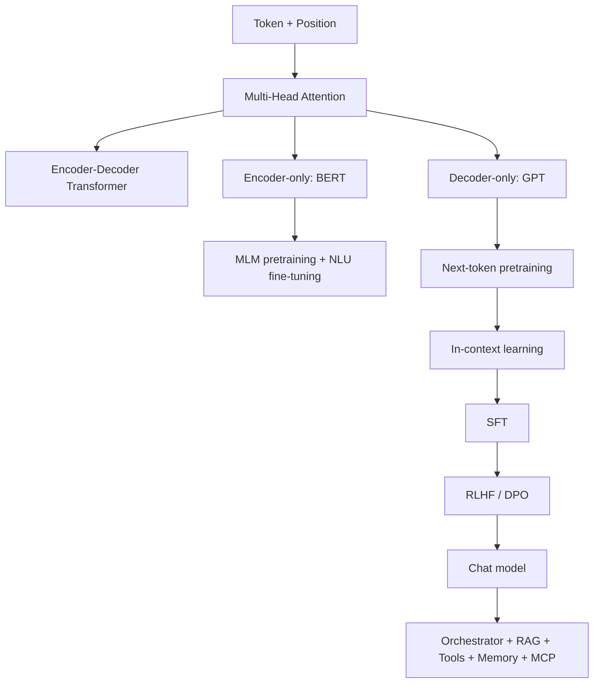
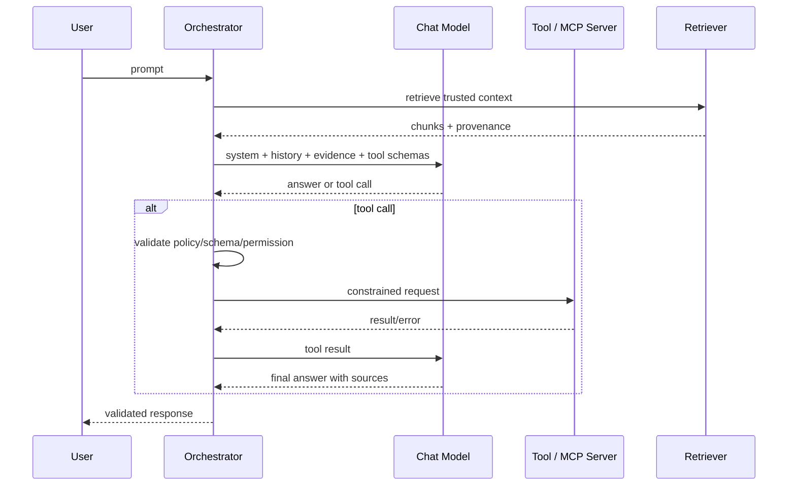

> 书目：*Hands-On Machine Learning with Scikit-Learn and PyTorch*<br>
> 章节：Chapter 15, Transformers for Natural Language Processing and Chatbots<br>
> 章节文件：15. Transformers for Natural Language Processing and Chatbots.md<br>
> 配套 Notebook：<https://homl.info/colab-p>

---

## 阅读导引

### 本章要回答什么问题

RNN 必须按时间顺序计算，远距离信息要穿过很多 recurrent steps。Transformer 用 attention 让任意 token 直接读取其他 token，并让训练阶段的所有位置并行计算。本章沿三类架构展开：

1. **Encoder-only**：双向理解，代表 BERT；
2. **Decoder-only**：因果生成，代表 GPT/Mistral；
3. **Encoder-decoder**：先理解 source，再生成 target，代表原始 Transformer/T5/BART。

随后从 base model 走向完整 chatbot：预训练、SFT、RLHF/DPO、prompt/RAG、工具、memory、MCP 与 structured generation。



### 一句话概括

$$
\boxed{
\text{Transformer 用内容寻址 attention 建模 token 间关系，}
\text{再通过预训练、适配与系统编排形成可用的语言产品。}
}
$$

### 重要边界

- Attention 缩短信息路径，但标准实现的时间/内存对 sequence length 为二次复杂度。
- 模型规模提升能力，也提升训练、推理、治理和安全成本。
- In-context learning 不更新参数，不等于模型真正“学会并持久记住”。
- Chat model 不是完整 chatbot；工具执行、权限、检索、memory 和审计属于系统层。
- 流畅与自信不等于事实正确；偏见、隐私、版权、prompt injection 和供应链风险必须独立治理。

本文纯 PyTorch 示例已在 Python 3.12、PyTorch 2.11.0 CPU 环境验证。Transformers/Datasets/PEFT/TRL 当前未安装；相关代码注明安装和联网条件，保存输出引用官方 Notebook。

---

## 0. 必要基础与符号

### 0.1 Tensor Shapes

$$
X\in\mathbb R^{B\times L\times d_{model}}
$$

- $B$：batch；
- $L$：sequence length；
- $d_{model}$：token representation dimension。

Multi-head 中 $h$ 个 heads，通常：

$$
d_k=d_v=d_{model}/h
$$

因此要求 $d_{model}$ 能被 $h$ 整除。

### 0.2 三种 Attention

| 类型 | Query | Key/Value | Mask |
| --- | --- | --- | --- |
| Encoder self-attention | encoder states | 同一 encoder states | padding |
| Decoder masked self-attention | target states | 同一 target states | causal + padding |
| Cross-attention | decoder states | encoder outputs | source padding |

### 0.3 Autoregressive Factorization

Decoder-only 和 decoder 输出概率：

$$
p(y_{1:T}\mid x)
=\prod_{t=1}^{T}p(y_t\mid y_{<t},x)
$$

训练 teacher forcing 可并行计算所有 positions；推理仍必须逐 token，并依赖 KV cache 减少重复计算。

---

## 1. Attention Is All You Need: Original Transformer

原始 Transformer 是 6-layer encoder + 6-layer decoder，约 65M 参数。它没有 recurrence/convolution：token mixing 完全由 attention 完成，per-token feature transformation 由 position-wise feedforward network 完成。

Encoder block：

```text
Self-Attention -> Add & Norm -> FFN -> Add & Norm
```

Decoder block：

```text
Masked Self-Attention -> Add & Norm
Cross-Attention -> Add & Norm
FFN -> Add & Norm
```

每个 sublayer 输入输出 shape 都是 `[B,L,d_model]`，便于 residual addition 和堆叠。

### 1.1 Position-wise FFN

每个 token 独立应用相同两层 MLP：

$$
\operatorname{FFN}(x)
=W_2\phi(W_1x+b_1)+b_2
$$

通常 $d_{ff}>d_{model}$，先扩维让非线性组合更丰富，再投影回来。它不混合 positions；attention 才负责 token 间通信。

### 1.2 Residual 与 LayerNorm

Post-LN 原始形式：

$$
y=LN(x+Sublayer(x))
$$

Pre-LN 现代常见形式：

$$
y=x+Sublayer(LN(x))
$$

Pre-LN 的 identity gradient 路径更直接，深层训练通常更稳定；Post-LN 有不同表示统计和最终 normalization 需求，不存在所有场景绝对优者。

---

## 2. Positional Encodings

### 2.1 为什么必须显式提供位置

无位置的 self-attention 对输入 permutation 是等变的。若 $P$ 是 permutation matrix：

$$
Q'=PQ,\quad K'=PK,\quad V'=PV
$$

$$
Q'K'^T=P(QK^T)P^T
$$

row-wise softmax 同样被置换，因此：

$$
Attention(PX)=P\,Attention(X)
$$

模型知道 token 集合和关系，却无法区分“dog bites man”和“man bites dog”的原始顺序，必须加入 position signal。

### 2.2 Trainable Absolute Position

```python
import torch
import torch.nn as nn


class PositionalEmbedding(nn.Module):
    def __init__(self, max_length, embed_dim, dropout=0.1):
        super().__init__()
        self.position = nn.Parameter(
            torch.randn(max_length, embed_dim) * 0.02
        )
        self.dropout = nn.Dropout(dropout)

    def forward(self, inputs):
        if inputs.shape[1] > len(self.position):
            raise ValueError("sequence exceeds max_length")
        return self.dropout(
            inputs + self.position[:inputs.shape[1]]
        )


layer = PositionalEmbedding(100, 16, dropout=0)
print(layer(torch.zeros(2, 7, 16)).shape)
```

Broadcast 将 `[L,d]` 加到每个 batch。缺点是 max length 固定，未训练 positions 外不能直接外推。

### 2.3 Sinusoidal Position

原论文：

$$
PE(pos,2i)=\sin\left(
\frac{pos}{10000^{2i/d}}
\right)
$$

$$
PE(pos,2i+1)=\cos\left(
\frac{pos}{10000^{2i/d}}
\right)
$$

不同维度使用不同频率。由三角恒等式：

$$
\sin(pos+\Delta)
=\sin(pos)\cos\Delta+\cos(pos)\sin\Delta
$$

相对位移可由当前位置 sin/cos 的线性组合表示，为学习 relative relation 提供便利。它无参数且可生成更长位置，但实践中 RoPE、relative bias、ALiBi 等通常更强。

---

## 3. Multi-Head Attention

### 3.1 公式 15-1：Scaled Dot-Product Attention

$$
\boxed{
Attention(Q,K,V)
=\operatorname{softmax}
\left(\frac{QK^T}{\sqrt{d_k}}+M\right)V
}
$$

Shapes：

$$
Q:[L_q,d_k],\quad
K:[L_k,d_k],\quad
V:[L_k,d_v]
$$

$$
QK^T:[L_q,L_k],\quad
Attention:[L_q,d_v]
$$

$M$ 是 mask additive bias：合法位置 0，非法位置 $-\infty$。

### 3.2 为什么除以 $\sqrt{d_k}$

假设 query/key 各分量独立、均值 0、方差 1：

$$
q^Tk=\sum_{j=1}^{d_k}q_jk_j
$$

每项方差 1，故：

$$
\operatorname{Var}(q^Tk)=d_k
$$

标准差为 $\sqrt{d_k}$。不缩放时，维度越大 logits 越极端，softmax 接近 one-hot，Jacobian 很小、训练不稳定。除后 variance 约 1。

### 3.3 Mask 语义

Causal bool mask `[L,L]` 上三角为 `True`（禁止看未来）；key padding mask `[B,Lk]` 中 pad 为 `True`。Masked score softmax 后权重 0。

这里说的是自定义实现、`nn.MultiheadAttention` 和 `nn.Transformer` 的 bool mask 约定。`F.scaled_dot_product_attention` 恰好相反：bool mask 中 `True` 表示**允许**参与 attention；在这些 API 间切换时必须显式取反并写测试。

若某 query 的所有 keys 都被 mask，softmax 全 $-\infty$ 会 NaN；数据/实现必须保证至少一个合法 key 或专门处理。

### 3.4 Multi-Head 公式

$$
head_i=Attention(QW_i^Q,KW_i^K,VW_i^V)
$$

$$
\boxed{
MHA(Q,K,V)
=Concat(head_1,\ldots,head_h)W^O
}
$$

各 head 学不同 projection subspaces，可同时关注语法、指代、位置和语义关系。不能假设某 head 必然具有人类命名的功能；模型内部表示是涌现且可冗余。

### 3.5 参数量

标准 $d_k=d_v=d/h$，Q/K/V/O 四个 $d\times d$ projections：

$$
P\approx4d^2+4d\text{（含 bias）}
$$

Head 数改变计算分解和每 head 维度，通常不改变 projection 总参数量。

### 3.6 可运行的 Masked MHA

```python
import torch.nn.functional as F


class MultiHeadAttention(nn.Module):
    def __init__(self, embed_dim, num_heads, dropout=0.0):
        super().__init__()
        if embed_dim % num_heads:
            raise ValueError("embed_dim must be divisible by num_heads")
        self.num_heads = num_heads
        self.head_dim = embed_dim // num_heads
        self.q_proj = nn.Linear(embed_dim, embed_dim)
        self.k_proj = nn.Linear(embed_dim, embed_dim)
        self.v_proj = nn.Linear(embed_dim, embed_dim)
        self.out_proj = nn.Linear(embed_dim, embed_dim)
        self.dropout = dropout

    def _split(self, values):
        batch, length, embed_dim = values.shape
        return values.reshape(
            batch, length, self.num_heads, self.head_dim
        ).transpose(1, 2)

    def forward(self, query, key, value,
                causal=False, key_padding_mask=None):
        q = self._split(self.q_proj(query))
        k = self._split(self.k_proj(key))
        v = self._split(self.v_proj(value))

        scores = q @ k.transpose(-2, -1) / self.head_dim**0.5
        if causal:
            causal_mask = torch.triu(
                torch.ones(
                    query.shape[1], key.shape[1],
                    dtype=torch.bool, device=query.device,
                ),
                diagonal=1,
            )
            scores = scores.masked_fill(causal_mask, float("-inf"))
        if key_padding_mask is not None:
            scores = scores.masked_fill(
                key_padding_mask[:, None, None, :],
                float("-inf"),
            )

        weights = F.softmax(scores, dim=-1)
        weights = F.dropout(
            weights, p=self.dropout, training=self.training
        )
        context = weights @ v
        context = context.transpose(1, 2).reshape(
            query.shape[0], query.shape[1], -1
        )
        return self.out_proj(context), weights


torch.manual_seed(42)
mha = MultiHeadAttention(16, 4)
inputs = torch.randn(2, 5, 16)
output, weights = mha(inputs, inputs, inputs, causal=True)
print(output.shape, weights.shape)
print(weights[0, 0].triu(diagonal=1).abs().max().item())
```

输出 `[2,5,16]`、weights `[2,4,5,5]`，未来位置最大权重为 0。

### 3.7 Complexity

Scores/weights 内存 $O(BhL_qL_k)$，self-attention 计算约 $O(BL^2d)$；FFN 约 $O(BLd d_{ff})$。长上下文时 attention 二次项成为瓶颈。

---

## 4. Building the Rest of the Transformer

### 4.1 Encoder Layer

```python
class EncoderLayer(nn.Module):
    def __init__(self, d_model, n_heads, d_ff=128, dropout=0.1):
        super().__init__()
        self.attention = MultiHeadAttention(d_model, n_heads, dropout)
        self.ffn = nn.Sequential(
            nn.Linear(d_model, d_ff),
            nn.GELU(),
            nn.Dropout(dropout),
            nn.Linear(d_ff, d_model),
        )
        self.norm1 = nn.LayerNorm(d_model)
        self.norm2 = nn.LayerNorm(d_model)
        self.dropout = nn.Dropout(dropout)

    def forward(self, inputs, padding_mask=None):
        # pre-LN
        normalized = self.norm1(inputs)
        attended, _ = self.attention(
            normalized, normalized, normalized,
            key_padding_mask=padding_mask,
        )
        hidden = inputs + self.dropout(attended)
        return hidden + self.dropout(self.ffn(self.norm2(hidden)))
```

### 4.2 Decoder Layer

Masked self-attention 建 target context；cross-attention 从 encoder memory 取 source 信息；FFN 逐 token 变换。Target padding mask 与 source memory padding mask 必须分别传入。

PyTorch 提供 `nn.TransformerEncoderLayer/DecoderLayer/Transformer`。`batch_first=True` 适配 `[B,L,d]`；`norm_first=True` 使用 pre-LN；不需要 attention weights 时 optimized kernels 更容易启用。

---

## 5. Building an English-to-Spanish Transformer

```python
class NmtTransformer(nn.Module):
    def __init__(self, vocab_size, max_length,
                 d_model=64, n_heads=4,
                 n_layers=2, pad_id=0, dropout=0.1):
        super().__init__()
        self.pad_id = pad_id
        self.embedding = nn.Embedding(
            vocab_size, d_model, padding_idx=pad_id
        )
        self.position = PositionalEmbedding(
            max_length, d_model, dropout
        )
        self.transformer = nn.Transformer(
            d_model=d_model,
            nhead=n_heads,
            num_encoder_layers=n_layers,
            num_decoder_layers=n_layers,
            dim_feedforward=4 * d_model,
            dropout=dropout,
            batch_first=True,
            norm_first=True,
        )
        self.output = nn.Linear(d_model, vocab_size)

    def forward(self, source_ids, target_ids):
        source_padding = source_ids.eq(self.pad_id)
        target_padding = target_ids.eq(self.pad_id)
        target_length = target_ids.shape[1]
        causal_mask = nn.Transformer.generate_square_subsequent_mask(
            target_length,
            device=target_ids.device,
            dtype=torch.bool,
        )
        source = self.position(self.embedding(source_ids))
        target = self.position(self.embedding(target_ids))
        decoded = self.transformer(
            source,
            target,
            src_key_padding_mask=source_padding,
            memory_key_padding_mask=source_padding,
            tgt_key_padding_mask=target_padding,
            tgt_mask=causal_mask,
            tgt_is_causal=True,
        )
        return self.output(decoded).transpose(1, 2)


model = NmtTransformer(vocab_size=100, max_length=20)
source = torch.tensor([[4, 5, 6, 0], [7, 8, 9, 3]])
target = torch.tensor([[1, 20, 21], [1, 30, 31]])
print(model(source, target).shape)
```

输出 `[2,100,3]`。训练时 decoder input 是 target 右移一位（前置 BOS），labels 是对应的 next-token sequence，也就是相对 decoder input 左移一位；loss 使用 `CrossEntropyLoss(ignore_index=pad_id)`。原书小型 2-layer、4-head、128-dim 模型训练 20 epochs 可正确翻译示例长句，但单例输出不能替代 BLEU/COMET 和人工评估。

### 5.1 GPU Memory Cleanup

删除模型变量只减少 Python 引用；CUDA cache 仍由 allocator 保留供复用。需要时：`del model, optimizer; gc.collect(); torch.cuda.empty_cache()`。`empty_cache()` 不释放仍被 tensor 引用的内存，也不会增加 PyTorch 自身可用显存上限。

---

## 6. Encoder-Only Transformers: BERT

BERT（Bidirectional Encoder Representations from Transformers）删除 decoder，仅保留双向 encoder。每个 token 能同时看到左右 context，因此特别适合 NLU、分类、抽取和 embedding；它不能像 GPT 那样直接逐 token 生成任意长文本。

### 6.1 BERT Architecture

| Model | Layers | Hidden | Heads | Parameters |
| --- | ---: | ---: | ---: | ---: |
| BERT-base | 12 | 768 | 12 | 110M |
| BERT-large | 24 | 1024 | 16 | 340M |

输入 embedding 是三者之和：

$$
e_i=e_i^{token}+e_i^{position}+e_i^{segment}
$$

- `[CLS]` 放开头，最终 state 用于 sequence classification；
- `[SEP]` 分隔两个 segments，也放在结尾；
- segment A/B embeddings 告诉模型 token 属于哪个 sentence；
- padding 由 attention mask 排除。

BERT 的 WordPiece tokenizer 和词表是模型 contract 的一部分，不能随意换 tokenizer，否则 token IDs 与 embedding rows 失配。

### 6.2 BERT Pretraining: MLM

#### Motivation

双向 encoder 若直接预测当前 token，会看到答案本身。Masked Language Modeling（MLM）隐藏部分 token，再根据双向 context 恢复。

Mask positions 集合为 $\mathcal M$：

$$
\boxed{
\mathcal L_{MLM}
=-\sum_{i\in\mathcal M}\log
p_\theta(x_i\mid x_{\setminus\mathcal M})
}
$$

原始 BERT 选择 15% token，其中 80% 换 `[MASK]`、10% 换 random token、10% 不变。后二者缓解 pretrain 中存在 `[MASK]`、fine-tune 中不存在的 distribution gap。Loss 只在 selected positions 计算；padding 和未选 positions labels 设为 `-100`。

```python
def mask_for_mlm(input_ids, mask_id, vocab_size,
                 special_mask, probability=0.15):
    """返回 corrupted inputs 和 labels；-100 表示不计 loss。"""
    labels = input_ids.clone()
    selected = (
        torch.rand(input_ids.shape, device=input_ids.device)
        < probability
    ) & ~special_mask
    labels[~selected] = -100

    corrupted = input_ids.clone()
    choices = torch.rand(input_ids.shape, device=input_ids.device)
    replace_mask = selected & (choices < 0.8)
    random_mask = selected & (choices >= 0.8) & (choices < 0.9)
    corrupted[replace_mask] = mask_id
    random_tokens = torch.randint(
        vocab_size, input_ids.shape, device=input_ids.device
    )
    corrupted[random_mask] = random_tokens[random_mask]
    return corrupted, labels


torch.manual_seed(42)
ids = torch.tensor([[101, 11, 12, 13, 14, 102]])
special = ids.eq(101) | ids.eq(102)
masked, labels = mask_for_mlm(ids, 103, 200, special, 0.5)
print(masked.tolist())
print(labels.tolist())
```

Dynamic masking 每个 epoch 重新 sample masks，比静态 mask 提供更多 corruption variants。

### 6.3 Next Sentence Prediction

NSP 输入两个 segments，50% 是真实相邻句，50% 是随机句，使用 `[CLS]` state 做 binary classification：

$$
\mathcal L=\mathcal L_{MLM}+\mathcal L_{NSP}
$$

NSP 原意是学习 sentence relation，但 random negative 太容易。RoBERTa 删除 NSP 反而更好；ALBERT 改用更困难的 Sentence Order Prediction。结论不是“sentence-level objective 都没用”，而是 negative construction 决定 objective 是否有效。

### 6.4 Hugging Face 中从配置构建 BERT

以下需要 `pip install transformers datasets` 和联网下载 tokenizer/dataset：

```python
from transformers import AutoTokenizer, BertConfig, BertForPreTraining

tokenizer = AutoTokenizer.from_pretrained("bert-base-uncased")
config = BertConfig(
    vocab_size=tokenizer.vocab_size,
    hidden_size=128,
    num_hidden_layers=2,
    num_attention_heads=4,
    intermediate_size=512,
)
bert = BertForPreTraining(config)
batch = tokenizer(
    "Transformers read both sides of context.",
    return_tensors="pt",
)
outputs = bert(**batch)
print(outputs.prediction_logits.shape)
print(outputs.seq_relationship_logits.shape)
```

从 scratch 训练一轮只能证明 pipeline 通；原书示例 top prediction 把 “The capital of `[MASK]` is Rome.” 的 mask 预测成逗号，score 约 0.049。BERT 原训练使用大语料和 16 TPU 约 4 天，现实中优先选择 domain 接近的 pretrained checkpoint 再 fine-tune。

### 6.5 BERT Fine-Tuning Heads

| Task | Model output used | Head / loss |
| --- | --- | --- |
| Sentence classification | `[CLS]` | Linear + CE/BCE |
| Token classification/NER | 每个 token | Shared linear + CE，忽略 pad/subword |
| Sentence pair/NLI | `[CLS]` | 3-class CE 等 |
| Multiple choice | 每个 candidate 的 `[CLS]` | scalar scores + CE |
| Extractive QA | 每 token | start/end logits |
| Similarity regression | `[CLS]` | scalar + MSE |

Extractive QA 选择：

$$
(i^*,j^*)=
\arg\max_{i\le j,\ j-i+1\le L_{max}}
\left(s_i^{start}+s_j^{end}\right)
$$

它只能抽取 context 中连续 span，不能生成 context 中没有的答案。Fine-tuning 可先冻结 encoder 只训练 head，再全量解冻；也可给 lower layers 更小 learning rate。小数据时继续加入加权 MLM loss 可减轻 overfitting。

### 6.6 Sentence-BERT

Cross-encoder 对每对 sentences 联合编码，$N$ 句全 pair 是 $O(N^2)$ 次昂贵 forward。SBERT 分别编码成 vectors，之后只算廉价 cosine：

$$
\operatorname{cos}(u,v)
=\frac{u^Tv}{\|u\|_2\|v\|_2}
$$

适合 semantic search、clustering、deduplication 和 retrieval first-stage；cross-encoder 通常更准，适合对少量 candidates rerank。

```python
from sentence_transformers import SentenceTransformer

sbert = SentenceTransformer("all-MiniLM-L6-v2")
sentences = ["She's shopping", "She bought some shoes", "She's working"]
embeddings = sbert.encode(sentences, convert_to_tensor=True)
print(sbert.similarity(embeddings, embeddings))
```

官方保存输出主要 off-diagonal similarities 为 0.6328、0.5841、0.3831。Cosine 是 ranking signal，不是 calibrated probability；embedding model/domain、chunking 和 query/document asymmetry 都影响 retrieval quality。

### 6.7 Other Encoder-Only Models

#### RoBERTa

更大语料、更久训练、dynamic masking，删除 NSP。核心启示：training recipe 与 data 往往和 architecture innovation 同样重要。

#### DistilBERT

约小 40%、快 60%，保留约 97% BERT performance。Student 学 teacher 的 softened distribution：

$$
p_i^{(T)}=\frac{\exp(z_i/T)}{\sum_j\exp(z_j/T)},\quad T>1
$$

温度展开次优 classes 的概率，暴露“dark knowledge”。一般 distillation term 乘 $T^2$ 补偿 gradient scale。DistilBERT 的组合目标：

$$
\mathcal L
=\alpha\mathcal L_{distill}
{}+\beta\mathcal L_{MLM}
{}+\gamma\mathcal L_{cosine}
$$

原作者 weights 为 5、2、1。Cosine loss 对齐 hidden representations；“相同 output”之外还鼓励相似内部 geometry。

#### ALBERT

跨 layers parameter sharing 大幅省内存但不减少 sequential compute；factorized embedding：

$$
E_{V\times d}\approx
E_{V\times e}W_{e\times d},\quad e\ll d
$$

30k × 1024 约 30.7M 参数，拆为 30k × 128 + 128 × 1024 约 4M。另以 SOP 替代 NSP。

#### ELECTRA

小 generator 用 MLM 生成 replacements，大 discriminator 对每 token 做 Replaced Token Detection。MLM 只从约 15% positions 获得监督，RTD 几乎从所有 positions 获得监督，sample efficiency 更高；代价是双模型 joint training 更复杂。

#### DeBERTa

用 relative position $i-j$ 和 disentangled attention 分离 content/position interactions。DeBERTaV3 再结合 ELECTRA-style RTD，NLU 很强但 compute/implementation 更复杂。

Hub 上还可按 language、domain、task、compression、adapter 选择。临床、法律、金融等领域模型可能更贴近语料，但必须检查 model card、license、benchmark protocol、训练数据和安全风险。

---

## 7. Decoder-Only Transformers

Decoder-only 删除 encoder 和 cross-attention，只堆叠 causal self-attention + FFN。它以 next-token prediction（NTP）预训练：

$$
\boxed{
\mathcal L_{NTP}(\theta)
=-\sum_{t=1}^{T-1}
\log p_\theta(x_{t+1}\mid x_{\le t})
}
$$

一条长度 $T$ sequence 同时产生 $T-1$ 个 training labels；causal mask 防止答案泄漏。训练可并行，generation 因 factorization 必须 sequential。

### 7.1 GPT-1

GPT-1 有 12 layers、768 hidden、12 heads、约 117M parameters，context 512。与原始 decoder 相比没有 cross-attention，规模更大。PyTorch 的 `nn.TransformerDecoder` 固定包含 cross-attention，不适合直接构建 decoder-only；可用 `nn.TransformerEncoder` 配 causal mask，或自行堆 blocks。

预训练后加很小 task heads：last token classification、sentence-pair delimiter、symmetric pair scoring、multiple-choice candidate scoring。它证明 generative pretraining 能有效 transfer 到 NLU。

### 7.2 GPT-2 and Zero-Shot Learning

GPT-2 最大 1.5B，48 layers、20 heads、hidden 1600、context 1024，以较高质量 WebText 训练。仅靠 task instruction 就能 zero-shot QA/summary；书中的 translation prompt 含少量示例，严格说是 few-shot ICL。能力随 model size 近似 log-linear 增长，但 scaling trend 不能外推为必然可靠或无限能力。

### 7.3 GPT-3 and In-Context Learning

公开论文中的 GPT-3 最大模型为 175B parameters；本章原始 Markdown 写成约 40B，应视为原文笔误。其训练语料约 570GB。它把 examples 放进 prompt 实现：

- zero-shot：无 example；
- one-shot：一个 example；
- few-shot：少量 examples；
- in-context learning（ICL）：由 context 指示 task，而不更新 parameters。

ICL 依赖 wording、example order/quality 和 context window；session 结束后通常不持久化，也不会自动修正 model weights。

### 7.4 Generation and KV Cache

无 cache 时，第 $t$ 步重新处理长度 $t$ prefix，总 attention 工作量近似：

$$
\sum_{t=1}^{T}O(t^2d)=O(T^3d)
$$

KV cache 保存每层 past keys/values，每步只计算新 token 的 Q/K/V，并让新 query 读取 cache，attention 部分累计约 $O(T^2d)$。代价是每 sequence 的 cache memory 近似 $O(n_{layers}T d)$；batch/concurrency 越大，显存压力越大。

### 7.5 Loading GPT-2

需要 `pip install transformers accelerate` 和联网下载模型：

```python
from transformers import AutoModelForCausalLM, AutoTokenizer

model_id = "gpt2"
gpt2_tokenizer = AutoTokenizer.from_pretrained(model_id)
gpt2 = AutoModelForCausalLM.from_pretrained(
    model_id, device_map="auto", dtype="auto"
)


def generate(model, tokenizer, prompt, max_new_tokens=50, **kwargs):
    inputs = tokenizer(prompt, return_tensors="pt").to(model.device)
    outputs = model.generate(
        **inputs,
        max_new_tokens=max_new_tokens,
        pad_token_id=tokenizer.eos_token_id,
        **kwargs,
    )
    return tokenizer.decode(outputs[0], skip_special_tokens=True)
```

`device_map="auto"` 可 placement/sharding；`dtype="auto"` 根据 checkpoint/hardware 选择 dtype。GPT-2 无 padding token，single prompt 可用 EOS 避免 warning；batched decoder generation 常采用 left padding，且 attention mask 必须正确。

### 7.6 Decoding Strategies

#### Greedy

$$
y_t=\arg\max_v p(v\mid y_{<t},x)
$$

确定、快，适合结构明确任务；不是 global optimum，creative text 容易重复。

#### Temperature

$$
p_i(T)=\frac{\exp(z_i/T)}{\sum_j\exp(z_j/T)}
$$

$T<1$ 更尖锐保守，$T>1$ 更平坦多样；$T\to0$ 接近 argmax。Temperature 不能提高事实性，只改变随机性。

#### Top-k

仅保留概率最大的 $k$ 个 token 再 renormalize。固定 $k$ 不适应 distribution confidence：事实问题可能候选太多，开放问题可能候选太少。

#### Top-p / Nucleus

按概率降序选择最小集合 $S$ 满足：

$$
\sum_{v\in S}p(v)\ge p_{threshold}
$$

候选集动态适应 entropy，creative generation 常比 fixed top-k 自然。

#### Beam Search

每步保留 cumulative log probability 最优的 `num_beams` 条 sequences。适合 translation 等有较明确 target 的任务；open-ended text 容易 generic/repetitive，且 compute/memory 近似随 beam width 增长。Length penalty 避免偏好短输出。

```python
torch.manual_seed(42)
prompt = "Scientists found a talking unicorn today. Here's the full story:"
text = generate(
    gpt2,
    gpt2_tokenizer,
    prompt,
    do_sample=True,
    top_p=0.6,
    temperature=0.9,
)
print(text)
```

官方保存结果中 greedy 很快重复 “The unicorn was found in a field”；sampling 减轻重复，`top_p=0.6` 生成了更连贯的独角兽发现报道。Sampling 输出依赖 library version、hardware kernels 和 random seed，不应把某次文本当作固定 expected output。

### 7.7 GPT-2 Question Answering by Prompting

```python
CAPITAL_TEMPLATE = (
    "Capital city of France = Paris\n"
    "Capital city of {country} ="
)


def get_capital_city(model, tokenizer, country):
    prompt = CAPITAL_TEMPLATE.format(country=country)
    result = generate(model, tokenizer, prompt, max_new_tokens=10)
    answer = result[len(prompt):]
    return answer.strip().splitlines()[0].strip()
```

官方示例对 UK/Mexico 返回 London/Mexico City，但会把 Canada 回答成 Toronto，不确定时还可能重复 country。Few-shot formatting 能引导 task，不能保证 knowledge correctness；production 应加 retrieval/tool、validation、abstention 和 citations。

### 7.8 Mistral-7B

Mistral-7B 是 7B decoder-only open-weight model，使用 Grouped-Query Attention 和 Sliding-Window Attention 提高效率。书中 checkpoint 在 Hugging Face gated，需要接受条款和 access token。Secret 不应写入 notebook/source control，应使用 secret manager、最小权限和 rotation。

```python
model_id = "mistralai/Mistral-7B-v0.3"
mistral_tokenizer = AutoTokenizer.from_pretrained(model_id, token=True)
mistral = AutoModelForCausalLM.from_pretrained(
    model_id,
    device_map="auto",
    dtype="auto",
    token=True,
)
```

运行前必须检查 model card 中的当前 repository ID、license、gating 和 API 参数。7B 不是“任何 CPU 都轻松运行”；实际 memory 取决于 precision/quantization、context、KV cache 和 concurrency。

---

## 8. Turning an LLM into a Chatbot

Base LM 学的是“续写最可能文本”，不天然等价于“回答用户”。对 “List some places...” 它可能继续编写一个论坛提问。Chat behavior 来自 prompt protocol 和 post-training。

### 8.1 Conversation Template and State

```python
class SimpleChatbot:
    def __init__(self, model, tokenizer, system_message,
                 max_new_tokens=200):
        self.model = model
        self.tokenizer = tokenizer
        self.messages = [
            {"role": "system", "content": system_message}
        ]
        self.max_new_tokens = max_new_tokens

    def chat(self, user_text):
        self.messages.append({"role": "user", "content": user_text})
        prompt = self.tokenizer.apply_chat_template(
            self.messages,
            tokenize=False,
            add_generation_prompt=True,
        )
        answer_with_prompt = generate(
            self.model,
            self.tokenizer,
            prompt,
            max_new_tokens=self.max_new_tokens,
        )
        answer = answer_with_prompt[len(prompt):].strip()
        self.messages.append({"role": "assistant", "content": answer})
        return answer
```

应使用 checkpoint 自带 `chat_template`，不能假设 `Me:/Bob:`、ChatML、`Human:/Assistant:` 可互换。String slicing 还可能被 normalization/decoding 差异破坏；production 更稳妥地截取新生成 token IDs。History 超 context window 时需 truncate、summarize 或 retrieval memory，并保留 system policy 与最近 turns。

上一节加载的 `Mistral-7B-v0.3` 是 base checkpoint，并不提供可直接依赖的 chat template。要使用上面的 class，应换成 `mistralai/Mistral-7B-Instruct-v0.3` 等 chat/instruct checkpoint，并采用该 checkpoint 自带模板；否则必须自行定义、训练时对齐并验证模板与 special tokens。

### 8.2 Prompt Engineering

Prompt engineering 是设计 instructions/context/examples/output constraints，使已有模型更稳定地执行 task；它不更新 model weights。

1. **明确 role/task/audience**：说明目标、输入边界和成功标准；
2. **提供 context**：给可靠资料，并要求仅依据资料、证据不足则 abstain；
3. **Few-shot examples**：展示输入输出格式和 edge cases；
4. **Specify structure**：JSON schema、table columns、长度和语言；
5. **Prompt chaining**：outline → critique → final，每步可独立验证；
6. **Stepwise reasoning**：鼓励分解并给 concise rationale；不要依赖或要求暴露私有 chain-of-thought；
7. **Self-consistency**：多次 sample 再投票，提升部分 reasoning tasks 的 reliability，成本线性增加；
8. **Tree of Thoughts / debate / self-refine**：搜索多个 candidates 或互评，质量与 latency/cost 交换；
9. **RAG**：动态加入可信 evidence，减少 outdated knowledge 和 hallucination；
10. **Automatic prompt optimization / prompt tuning**：搜索 discrete prompt 或学习 soft prompt embeddings。

Prompt 不是安全边界。Jailbreak、indirect prompt injection、data exfiltration 无法仅靠“忽略恶意指令”解决；需要 trust boundary、least privilege、tool confirmation、content filtering、sandbox、output validation 与 audit。

---

## 9. SFT and RLHF

### 9.1 Base, Foundation, Instruct, Chat

- **Base model**：只完成 broad pretraining；
- **Foundation model**：可通过 prompting/fine-tuning 适配多任务，可能已部分 post-trained；
- **Instruct model**：强化 instruction following；
- **Conversational model**：强化 multi-turn dialogue；
- **Chat model**：通常同时做 instruction + conversation + safety alignment。

### 9.2 Supervised Fine-Tuning

SFT dataset 包含 prompt $x$ 和 ideal answer $y$。仍然做 NTP，但通常只在 answer tokens 计算 loss：

$$
\boxed{
\mathcal L_{SFT}
=-\sum_{t\in\text{answer}}
\log p_\theta(y_t\mid x,y_{<t})
}
$$

Prompt token labels 设 `-100`。这样 capacity 用于生成 answer，而非模仿 user；但某些 setup 会保留 system/format tokens 的 loss。Dataset quality、diversity、deduplication、license、安全响应和 contamination 比单纯增大数据量更重要。

Parameter-efficient fine-tuning（LoRA/adapters）冻结大部分 base weights，只训练少量 parameters；它降低 optimizer/gradient memory，不等于 inference 时模型主体消失。Quantization + LoRA 可进一步降显存，但训练 stability 和 final quality 需实测。

### 9.3 RLHF

典型流程：

1. 对同一 prompt sample 多个 responses；
2. 人类 rank/prefer responses；
3. 训练 reward model $r_\phi(x,y)$；
4. 用 PPO 优化 policy，同时用 KL penalty 约束它不要偏离 reference/SFT model。

抽象 objective：

$$
\max_\pi
\mathbb E_{x,y\sim\pi}[r(x,y)]
-\beta D_{KL}(\pi(\cdot\mid x)\|\pi_{ref}(\cdot\mid x))
$$

没有 KL constraint，policy 会利用 reward model 漏洞，即 reward hacking。RLHF 能工作，但要同时训练 reward model、rollout、PPO，昂贵且不稳定；human preference 也可能有偏见、低 agreement 或只反映短期表面质量。

---

## 10. Direct Preference Optimization

### 10.1 Data and Goal

每个 sample：prompt $x$、chosen answer $y_c$、rejected answer $y_r$。目标不是无约束地提高 chosen 概率，而是让 current policy 相对于 reference 更偏好 chosen。

### 10.2 从 KL-Regularized RL 到式 15-2

对固定 $x$，上一节 objective 的 optimal policy 满足：

$$
\pi^*(y\mid x)
=\frac{1}{Z(x)}\pi_{ref}(y\mid x)
\exp\left(\frac{r(x,y)}{\beta}\right)
$$

整理 reward：

$$
r(x,y)=\beta\left[
\log\frac{\pi^*(y\mid x)}{\pi_{ref}(y\mid x)}
{}+\log Z(x)
\right]
$$

Bradley-Terry preference model 假设：

$$
P(y_c\succ y_r\mid x)
=\sigma(r(x,y_c)-r(x,y_r))
$$

代入 reward，因同一 prompt 的 $\log Z(x)$ 相消；用当前 $\pi_\theta$ 近似 $\pi^*$，定义：

$$
\delta_\theta(y)
=\log\pi_\theta(y\mid x)
-\log\pi_{ref}(y\mid x)
$$

得到公式 15-2：

$$
\boxed{
\mathcal L_{DPO}
=-\log\sigma\left(
\beta[\delta_\theta(y_c)-\delta_\theta(y_r)]
\right)
}
$$

$\beta$ 源自 KL regularization coefficient，也缩放 preference logits。较大 $\beta$ 通常意味着更强的 reference constraint；但固定 batch 上它也改变 sigmoid steepness，最终 drift 必须通过 KL、win rate 和 held-out evaluation 实测，不能只凭一句“越大越保守”。常见值约 0.1–0.5。

### 10.3 Sequence Log Probability

$$
\log\pi_\theta(y\mid x)
=\sum_{t=1}^{|y|}
\log\pi_\theta(y_t\mid x,y_{<t})
$$

Logits 在 position $t$ 预测 token $t+1$，所以 labels 左移一位。要 mask padding，最好也明确 mask prompt，只累加 answer tokens。若 chosen/rejected 是完全相同 prompt，且 position IDs、padding 处理一致，全序列 log probability 中 prompt terms 在 chosen-rejected 差分中相消；answer-only mask 更透明，也避免 left-padding/模板差异破坏假设。

```python
def sequence_log_probability(logits, input_ids,
                             attention_mask, answer_mask):
    """logits [B,L,V]；mask [B,L] 标记 input token。"""
    next_ids = input_ids[:, 1:]
    token_logps = -F.cross_entropy(
        logits[:, :-1].transpose(1, 2),
        next_ids,
        reduction="none",
    )
    valid = attention_mask[:, 1:] * answer_mask[:, 1:]
    return (token_logps * valid).sum(dim=1)


def dpo_loss_from_logps(policy_chosen, policy_rejected,
                        reference_chosen, reference_rejected,
                        beta=0.1):
    chosen_ratio = policy_chosen - reference_chosen
    rejected_ratio = policy_rejected - reference_rejected
    preference_logits = beta * (chosen_ratio - rejected_ratio)
    return -F.logsigmoid(preference_logits).mean()


good = dpo_loss_from_logps(
    torch.tensor([-2.0]), torch.tensor([-5.0]),
    torch.tensor([-3.0]), torch.tensor([-4.0]), beta=0.5,
)
bad = dpo_loss_from_logps(
    torch.tensor([-4.0]), torch.tensor([-4.0]),
    torch.tensor([-3.0]), torch.tensor([-4.0]), beta=0.5,
)
print(round(good.item(), 4), round(bad.item(), 4))
```

输出 `0.3133 0.9741`：current policy 相对 reference 更支持 chosen 时 loss 更小。计算时用 `F.logsigmoid` 避免 `log(sigmoid())` underflow；reference 应 `eval()`、冻结 parameters，并在 `torch.no_grad()` 下 forward。

### 10.4 DPO Is Not Magic

- 依赖 pairwise preference quality；chosen/rejected 太容易会缺乏信号；
- Label noise、position bias、verbosity bias 会被模型学到；
- Sequence log-probability sum 对 length 有隐含影响；
- Reference 太弱或 domain 不合适会限制目标；
- DPO 省掉 explicit reward model 和 online RL，但仍需防 overoptimization、mode collapse 和 safety regression。

### 10.5 TRL: SFT then DPO

需要 `pip install transformers datasets trl accelerate`。API 随版本变化，先核对 TRL 文档：

```python
from datasets import load_dataset
from trl import DPOConfig, DPOTrainer, SFTConfig, SFTTrainer

sft_dataset = load_dataset("tatsu-lab/alpaca", split="train")


def to_prompt_completion(example):
    prompt = f"Human: {example['instruction']}\n"
    if example["input"]:
        prompt += f"Input: {example['input']}\n"
    prompt += "\nAssistant:"
    return {"prompt": prompt, "completion": " " + example["output"]}


sft_dataset = sft_dataset.map(
    to_prompt_completion,
    remove_columns=sft_dataset.column_names,
)
sft_args = SFTConfig(
    output_dir="./gpt2-sft",
    max_length=512,
    per_device_train_batch_size=4,
    num_train_epochs=1,
    learning_rate=5e-5,
    completion_only_loss=True,
)
sft_trainer = SFTTrainer(
    "gpt2", train_dataset=sft_dataset, args=sft_args
)
sft_trainer.train()
sft_trainer.save_model()

preference_dataset = load_dataset(
    "Anthropic/hh-rlhf", split="train"
)
gpt2_tokenizer.pad_token = gpt2_tokenizer.eos_token
gpt2_tokenizer.padding_side = "left"
dpo_args = DPOConfig(
    output_dir="./gpt2-sft-dpo",
    max_length=512,
    per_device_train_batch_size=4,
    num_train_epochs=1,
    learning_rate=2e-5,
)
dpo_trainer = DPOTrainer(
    "./gpt2-sft",
    args=dpo_args,
    train_dataset=preference_dataset,
    processing_class=gpt2_tokenizer,
)
dpo_trainer.train()
dpo_trainer.save_model()
```

Alpaca 约 52k instruction/demonstration samples，适合起步，但 single-turn、synthetic data 有明显局限；还应加入高质量 multi-turn/domain/safety data。HH-RLHF 包含 chosen/rejected helpful/harmless conversations。Train/validation split、held-out human evaluation、toxicity/factuality/task metrics 和 base capability regression 都不可省。

---

## 11. From Chat Model to Full Chatbot System

Chat model 只是概率生成器。完整系统通常包含 UI/API、identity/session、orchestrator、model gateway、retrieval/tools、memory、guardrails、observability 和 human escalation。



### 11.1 Calculator and Function Calling

两种路径：orchestrator 先识别 expression；或 model 输出 structured tool call。绝不能对不可信字符串直接 Python `eval()`。应使用 parser + allowlist，限制 operators、numeric magnitude、runtime 和 nesting。所有 side-effect tools 要 authorization、confirmation、idempotency key 和 audit log。

### 11.2 Web Search and RAG

RAG pipeline：

1. ingest + parse documents；
2. chunk，并保留 title/source/time/ACL metadata；
3. embedding + vector/BM25 index；
4. query rewrite/filter；
5. retrieve candidates；
6. rerank；
7. 将最相关且不过期的 chunks 注入 context；
8. 生成带 citations 的 answer；
9. 验证 citation 是否真的支持 claim。

Retriever 失败时 generator 无法凭空修复。应分别评估 Recall@k/MRR/nDCG、answer correctness/faithfulness、citation precision、latency 和 cost。Retrieved document 是不可信数据，不应覆盖 system instructions；这是 indirect prompt injection 的核心防线。

### 11.3 Persistent Memory

Memory 可保存稳定 preference/profile，或按 similarity 取 relevant prior facts。必须区分：

- conversation buffer：当前窗口内 turns；
- summary memory：压缩历史，可能产生错误；
- semantic memory：抽取的 facts/preferences；
- episodic memory：过去事件和 task outcomes。

用户应能查看、更正、删除 memory；敏感信息需 consent、encryption、retention policy 和 tenant isolation。不要把模型推断当作事实自动永久存储。

### 11.4 Agents

Agent 循环通常是 plan → act/tool → observe → update → stop。适合 multi-step research/workflow，但步骤越多，error propagation、cost、latency 和 attack surface 越大。应设置 max steps/budget、typed state、tool scope、timeouts/retries、checkpoints、human approval，以及可验证 stop condition。Reasoning model 不必调用工具；agent 也不等于自主可靠。

---

## 12. Model Context Protocol

MCP 是 AI application（host）通过 MCP clients 连接 MCP servers 的开放协议。Server 可暴露 tools、resources、prompts 等能力；协议不规定底层 LLM，也不自动决定何时调用工具，decision/policy 仍由 host/orchestrator 负责。

MCP 相比为每个 integration 手写 glue code 的价值：

- standard messages 与 capability negotiation；
- server discovery，提供 AI-friendly tool descriptions 和 JSON schemas；
- 支持长期、stateful、bidirectional connections 和 streaming；
- host 能统一管理多个 servers。

但“能 discover”不等于“有权执行”。Host 必须验证 schema、server identity、user authorization、workspace boundary 和 returned content；高风险调用需确认。第三方 server 是 supply-chain boundary，应 pin/version、sandbox、最小权限、日志和 revoke。

### 12.1 Structured Generation

事后修 JSON 不可靠。Constrained decoding 在每个 step 根据 grammar/schema 得到合法 token 集 $A_t$：

$$
z'_{t,v}=
\begin{cases}
z_{t,v}, & v\in A_t\\
-\infty, & v\notin A_t
\end{cases}
$$

再 softmax/sample，就能保证 syntax/部分 schema validity。Transformers 可实现 custom `LogitsProcessor`，Outlines/Guidance 等库提供高层 grammar/schema 支持。

边界：tokenizer token 可能横跨多个 characters；schema validity 不保证 semantic validity，例如合法 JSON 仍可能包含不存在的 file path 或越权 amount。因此执行前仍须 business validation 和 authorization。

### 12.2 Ecosystem

| Tool | Strength |
| --- | --- |
| LangChain | components/chains/tool orchestration |
| LangGraph | stateful long-running agent graphs |
| Smolagents | compact agent framework |
| Haystack | retrieval/RAG pipelines |
| LlamaIndex | data ingestion/index/query |
| LM Studio | local model GUI |
| Ollama | local CLI/API serving |
| text-generation-webui | flexible local web UI/backends |
| llama.cpp | optimized C/C++ local inference backend |

选择依据应是 deployment target、model/backend compatibility、structured/tool support、observability、security、latency 和 maintenance，而不是框架热度。

---

## 13. Encoder-Decoder Models

Encoder bidirectionally 表示完整 source，decoder autoregressively 生成 target 并 cross-attend source。对 translation、summarization、source-grounded generation，同规模下往往比把 source/target 全塞入 decoder-only 更 data/parameter efficient；但 deployment ecosystem 和 general-purpose capabilities 也影响选型。

### 13.1 T5

T5 将所有 NLP tasks 统一为 text-to-text：

```text
translate English to Spanish: I like soccer -> me gusta el fútbol
summarize: <document> -> <summary>
classify: <text> -> <label text>
```

Pretraining 使用 masked span corruption：连续 spans 被 sentinel tokens 代替，decoder 依次生成被删除 spans。相比 independent MLM，模型学习 span-level reconstruction 和 generation。

Variants：

- mT5：100+ languages；
- ByT5：byte-level，避免 tokenizer 但 sequence 更长；
- FLAN-T5：instruction-tuned，增强 ZSL/FSL；
- UL2：混合 span denoising、NTP 等 objectives；
- FLAN-UL2：UL2 + instruction tuning。

### 13.2 BART

BART 是 denoising encoder-decoder：输入可被 mask/delete/insert 或 sentence shuffle，目标恢复原文。它对 generation/summarization 很有效；mBART 扩展到 multilingual。

Encoder-decoder 也常见于 detection、segmentation 和 multimodal systems：encoder 表示输入，decoder 输出 object queries、masks 或另一 modality sequence。

---

## 14. Exercises: Questions 1–15

### 14.1 最重要的 Transformer Layer 是什么？

Multi-head attention。它让每个 query 按 content-dependent weights 聚合所有可见 values，直接建立任意 token 间关系；多个 heads 在不同 projection subspaces 并行建模。FFN 负责每 token feature transformation，position encoding 提供 order，residual/norm 保证可训练，因此“最重要”不表示其余可删。

### 14.2 为什么需要 Positional Encodings？

Self-attention 本身对 input permutation equivariant，不知道 absolute/relative order。Position signal 让模型区分相同 tokens 的不同排列。可用 learned absolute、sinusoidal、relative position、RoPE 或 ALiBi，各自在训练长度外推、参数、长 context 和 implementation 上有取舍。

### 14.3 三类 Transformer 分别适合什么任务？

- Encoder-only：bidirectional understanding；classification、NER、extractive QA、embedding/retrieval；
- Decoder-only：autoregressive generation；completion、open QA、chat、code/reasoning；
- Encoder-decoder：source-conditioned generation；translation、summary、structured transformation。

边界会重叠。选择还要看 model size、data、latency、deployment 和 benchmark，而不是仅看 taxonomy。

### 14.4 BERT 最重要的 Pretraining Technique

MLM：随机 corrupt tokens，让双向 encoder 根据左右 context 恢复，并只对 selected positions 计算 loss。原始 BERT 另有 NSP，但后续模型证明 MLM recipe 更核心，NSP 可删或换成 SOP。

### 14.5 四个 BERT Variants 及收益

1. RoBERTa：更强 training recipe、dynamic masking、去 NSP；
2. DistilBERT：knowledge distillation，约小 40%、快 60%；
3. ALBERT：layer sharing + factorized embeddings，显著省 parameter memory；
4. ELECTRA：RTD 给几乎所有 tokens 监督，sample-efficient；
5. DeBERTa：relative/disentangled attention，增强 content-position modeling。

题目只需四个；第五个用于对比。

### 14.6 GPT 的主要 Pretraining Task

NTP/causal language modeling：预测每个 prefix 的 next token，最小化 causal cross-entropy。它与 generation factorization 一致，不需要 mask token 或 NSP。

### 14.7 `generate()` 五个参数

- `do_sample=False`：greedy/beam 的 deterministic expansion；`True`：按 distribution sample；
- `top_k=k`：只在概率最大 $k$ 个 tokens 中 sample；
- `top_p=p`：只在累计概率至少 $p$ 的最小动态集合中 sample；
- `temperature=T`：logits 除以 $T$；低温保守，高温多样；
- `num_beams=b`：beam width；$b>1$ 同时保留多条高分 hypotheses。

Sampling 通常和 beam search 是不同 modes；参数组合是否合法取决于 generation API。还要设置 EOS/PAD、repetition/length constraints 和 max tokens。

### 14.8 什么是 Prompt Engineering？列举五种技术

它是在不更新 weights 时设计 prompt 以稳定模型 behavior。可用：明确 instruction/role、提供 grounded context、few-shot examples、指定 schema/style、prompt chaining、stepwise decomposition/self-consistency、RAG、self-critique。它不能取代 authorization、validation 和 fine-tuning。

### 14.9 从 Pretrained Decoder 到 Chatbot 的步骤

1. Base model 已通过 NTP pretraining；
2. 用 conversation/instruction/safety data 做 SFT，通常 answer-only loss；
3. 收集 preference pairs；
4. RLHF（reward model + PPO）或 DPO alignment；
5. Offline/online evaluation 与 red teaming；
6. 部署 chat template、generation、session/history；
7. 接入 retrieval/tools/memory/guardrails/monitoring；
8. 持续 feedback、incident response 和版本治理。

### 14.10 Chatbot 如何使用 Calculator/Web Search？

Orchestrator 可先分类 query，也可让 model 输出 typed tool call。它验证 schema、policy 和 permission 后执行 calculator/search，再把 result + provenance 回填 model 生成 final answer。工具返回内容不可信；math parser 禁止任意 `eval`，web text 防 indirect injection，side effects 需 human confirmation。

### 14.11 MCP 用于什么？

MCP 标准化 AI host/client 与 tool/resource servers 的 discovery 和 communication，使新 service 能描述 capabilities/schema 并被统一连接。它不负责 LLM reasoning，不自动授权调用，也不保证 server/result 安全。

### 14.12 Fine-Tune BERT on IMDb

需要 `transformers datasets accelerate` 和联网。IMDb 是 binary sentiment；tokenizer 动态 padding，BERT classification head，validation accuracy/F1 之外还应看 class-specific errors。

```python
import numpy as np
from datasets import load_dataset
from transformers import (
    AutoModelForSequenceClassification,
    AutoTokenizer,
    DataCollatorWithPadding,
    Trainer,
    TrainingArguments,
)

checkpoint = "bert-base-uncased"
imdb = load_dataset("imdb")
tokenizer = AutoTokenizer.from_pretrained(checkpoint)


def tokenize_imdb(batch):
    return tokenizer(batch["text"], truncation=True, max_length=256)


train_valid = imdb["train"].train_test_split(test_size=0.1, seed=42)
train_data = train_valid["train"].map(
    tokenize_imdb, batched=True, remove_columns=["text"]
)
valid_data = train_valid["test"].map(
    tokenize_imdb, batched=True, remove_columns=["text"]
)
test_data = imdb["test"].map(
    tokenize_imdb, batched=True, remove_columns=["text"]
)
model = AutoModelForSequenceClassification.from_pretrained(
    checkpoint, num_labels=2
)


def compute_metrics(prediction):
    predicted = np.argmax(prediction.predictions, axis=-1)
    labels = prediction.label_ids
    return {"accuracy": float((predicted == labels).mean())}


args = TrainingArguments(
    output_dir="./bert-imdb",
    learning_rate=2e-5,
    per_device_train_batch_size=8,
    per_device_eval_batch_size=16,
    num_train_epochs=2,
    weight_decay=0.01,
    eval_strategy="epoch",
    save_strategy="epoch",
    load_best_model_at_end=True,
    report_to="none",
)
trainer = Trainer(
    model=model,
    args=args,
    train_dataset=train_data,
    eval_dataset=valid_data,
    data_collator=DataCollatorWithPadding(tokenizer),
    processing_class=tokenizer,
    compute_metrics=compute_metrics,
)
trainer.train()
print(trainer.evaluate())
print(trainer.predict(test_data).metrics)
```

代码从原 train 划出 validation 做 model selection，只在训练完成后运行一次 test。2 epochs 的 `bert-base-uncased` 通常能得到约 90% 左右 accuracy，但结果依版本、seed、max length 和 hardware 而变，必须记录自己的实际 output。

### 14.13 Fine-Tune GPT-2 on Shakespeare

将 Shakespeare text tokenized 后切成 fixed blocks；每个 block `labels=input_ids`，causal shift 由 model 内部完成。

```python
from pathlib import Path
from urllib.request import urlretrieve

from torch.utils.data import Dataset
from transformers import (
    AutoModelForCausalLM,
    AutoTokenizer,
    Trainer,
    TrainingArguments,
    default_data_collator,
)

path = Path("datasets/shakespeare/shakespeare.txt")
path.parent.mkdir(parents=True, exist_ok=True)
if not path.exists():
    urlretrieve("https://homl.info/shakespeare", path)
text = path.read_text(encoding="utf-8")

tokenizer = AutoTokenizer.from_pretrained("gpt2")
token_ids = tokenizer(text, return_tensors="pt").input_ids[0]


class TokenBlocks(Dataset):
    def __init__(self, ids, block_size=128):
        usable = len(ids) // block_size * block_size
        self.blocks = ids[:usable].reshape(-1, block_size)

    def __len__(self):
        return len(self.blocks)

    def __getitem__(self, index):
        block = self.blocks[index]
        return {"input_ids": block, "labels": block.clone()}


split = int(0.9 * len(token_ids))
train_set = TokenBlocks(token_ids[:split])
valid_set = TokenBlocks(token_ids[split:])
model = AutoModelForCausalLM.from_pretrained("gpt2")
args = TrainingArguments(
    output_dir="./gpt2-shakespeare",
    per_device_train_batch_size=2,
    per_device_eval_batch_size=4,
    gradient_accumulation_steps=8,
    learning_rate=5e-5,
    num_train_epochs=1,
    eval_strategy="epoch",
    save_strategy="epoch",
    report_to="none",
)
trainer = Trainer(
    model=model,
    args=args,
    train_dataset=train_set,
    eval_dataset=valid_set,
    data_collator=default_data_collator,
    processing_class=tokenizer,
)
trainer.train()

prompt_ids = tokenizer("ROMEO:", return_tensors="pt").to(model.device)
generated = model.generate(
    **prompt_ids,
    max_new_tokens=100,
    do_sample=True,
    top_p=0.9,
    temperature=0.8,
    pad_token_id=tokenizer.eos_token_id,
)
print(tokenizer.decode(generated[0], skip_special_tokens=True))
```

检查 validation perplexity $\exp(\text{loss})$、memorization 和 held-out overlap。GPT-2 fine-tuning 在当前 CPU 环境很慢；先用 text subset、`distilgpt2` 做 smoke test，再在 GPU 跑完整实验。

### 14.14 SBERT Semantic Movie Search

Kaggle dataset columns 包括 `Title`、`Plot`、`Release Year` 等。Embedding 预先 normalize 后，dot product 就等于 cosine；对大数据应使用 FAISS/vector DB 而非每 query 全矩阵扫描。

```python
from pathlib import Path

import kagglehub
import pandas as pd
import torch
from sentence_transformers import SentenceTransformer

dataset_dir = Path(kagglehub.dataset_download(
    "jrobischon/wikipedia-movie-plots"
))
csv_path = next(dataset_dir.glob("*.csv"))
movies = pd.read_csv(csv_path).dropna(subset=["Title", "Plot"])
movies = movies.reset_index(drop=True)

sbert = SentenceTransformer("all-MiniLM-L6-v2")
plot_embeddings = sbert.encode(
    movies["Plot"].tolist(),
    batch_size=64,
    convert_to_tensor=True,
    normalize_embeddings=True,
    show_progress_bar=True,
)


def search_movies(query, k=5):
    query_embedding = sbert.encode(
        query,
        convert_to_tensor=True,
        normalize_embeddings=True,
    )
    scores = plot_embeddings @ query_embedding
    top = torch.topk(scores, k=min(k, len(scores)))
    columns = ["Title", "Release Year", "Plot"]
    result = movies.iloc[top.indices.cpu().tolist()][columns].copy()
    result.insert(0, "score", top.values.cpu().tolist())
    return result


print(search_movies("a voyage through space to save humanity", k=5))
```

用人工标注 queries 评估 Recall@k/nDCG。Plot 很长时可 chunk → embed → movie-level max/aggregation；跨语言 query 要换 multilingual embedding model。不要把 cosine 当 probability。

### 14.15 Instruction Model + Movie RAG Chatbot

复用上一题 `movies/plot_embeddings/sbert`，先 retrieve，再把 evidence 和 source metadata 放进 user message。Qwen2.5-7B-Instruct 需要足够 GPU memory，或 4-bit quantization/hosted endpoint；模型 license 和 model card 需单独核对。

```python
from transformers import AutoModelForCausalLM, AutoTokenizer

model_id = "Qwen/Qwen2.5-7B-Instruct"
chat_tokenizer = AutoTokenizer.from_pretrained(model_id)
chat_model = AutoModelForCausalLM.from_pretrained(
    model_id,
    device_map="auto",
    dtype="auto",
)


def movie_expert_chat(question, k=3):
    hits = search_movies(question, k=k)
    evidence = "\n\n".join(
        f"[Movie {index + 1}] {row.Title} ({row['Release Year']})\n"
        f"{row.Plot[:1800]}"
        for index, (_, row) in enumerate(hits.iterrows())
    )
    messages = [
        {
            "role": "system",
            "content": (
                "You are a movie expert. Use only the supplied movie records "
                "for factual plot claims. Cite records as [Movie N]. "
                "If evidence is insufficient, say so."
            ),
        },
        {
            "role": "user",
            "content": f"Movie records:\n{evidence}\n\nQuestion: {question}",
        },
    ]
    model_inputs = chat_tokenizer.apply_chat_template(
        messages,
        add_generation_prompt=True,
        return_tensors="pt",
        return_dict=True,
    ).to(chat_model.device)
    generated = chat_model.generate(
        **model_inputs,
        max_new_tokens=300,
        do_sample=False,
    )
    new_tokens = generated[0, model_inputs.input_ids.shape[1]:]
    return chat_tokenizer.decode(new_tokens, skip_special_tokens=True), hits


answer, sources = movie_expert_chat(
    "Recommend a film about memory and identity, and explain why."
)
print(answer)
print(sources[["Title", "Release Year", "score"]])
```

进一步改进：hybrid retrieval、reranker、context token budget、citation verifier、multi-turn state、prompt-injection isolation。评估需把 retrieval relevance 与 answer faithfulness 分开；让 model 显示 citation 不代表 citation 真的支持 claim。

---

## 15. Formula and API Quick Reference

### 15.1 Core Formulas

| Concept | Formula |
| --- | --- |
| Attention | $softmax((QK^T/\sqrt{d_k})+M)V$ |
| MHA | $Concat(head_1,\ldots,head_h)W^O$ |
| NTP | $-\sum_t\log p(x_{t+1}\mid x_{\le t})$ |
| MLM | $-\sum_{i\in\mathcal M}\log p(x_i\mid x_{\setminus\mathcal M})$ |
| Cosine | $u^Tv/(\|u\|\|v\|)$ |
| SFT answer mask | $-\sum_{t\in answer}\log p(y_t\mid x,y_{<t})$ |
| DPO | $-\log\sigma(\beta[\delta(y_c)-\delta(y_r)])$ |
| Temperature | $softmax(z/T)$ |

### 15.2 PyTorch / Hugging Face APIs

| API | Purpose | Common trap |
| --- | --- | --- |
| `nn.MultiheadAttention` | MHA | bool/float mask semantics、`batch_first` |
| `nn.Transformer` | encoder-decoder | causal 与 padding masks 分开 |
| `F.cross_entropy` | token/class loss | class dimension、shift、`ignore_index` |
| `F.logsigmoid` | stable DPO log-sigmoid | 不要手写 `log(sigmoid())` |
| `AutoTokenizer` | checkpoint tokenizer | 必须与 model contract 匹配 |
| `AutoModelForCausalLM` | decoder generation | left padding、PAD/EOS、KV cache |
| `AutoModelForSequenceClassification` | encoder classifier | `num_labels`、label mapping |
| `generate` | decoding | max new vs total tokens、sampling config |
| `apply_chat_template` | role protocol | template 必须与 checkpoint 对齐 |
| `Trainer` / TRL | training loop | API/version、mask、evaluation leakage |

---

## 16. Common Misconceptions

1. **“Attention 就是 explanation。”** Weight 只是模型计算的一部分，不等于 causal explanation。
2. **“Transformer training/inference 都完全 parallel。”** Training positions 可并行；autoregressive decoding 仍 sequential。
3. **“位置编码只有 absolute embedding。”** Relative、RoPE、ALiBi 都是重要 alternatives。
4. **“更多 heads 必然更强。”** Head dimension、redundancy、hardware efficiency 和 data 同样关键。
5. **“BERT 不能处理生成所以落后。”** 对低 latency NLU/embedding，encoder-only 仍非常高效。
6. **“GPT 记得 prompt 中学到的东西。”** ICL 通常不更新 weights，也不跨 session 持久化。
7. **“低 temperature 就不会 hallucinate。”** 它只降低随机性，可稳定地产生同一错误。
8. **“RAG 会消除 hallucination。”** Retrieval miss、过期文档和 unsupported synthesis 仍会失败。
9. **“DPO 不需要 reward，因此没有 preference bias。”** Bias 直接存在于 preference pairs 和 annotation process。
10. **“Chat model 就是 chatbot。”** 产品还需 orchestration、tools、security、memory、monitoring。
11. **“Structured JSON 就是安全调用。”** Syntax/schema valid 不代表 authorized 或 semantically safe。
12. **“MCP 自动让 LLM 会用所有工具。”** MCP 提供 protocol/discovery，selection 和 policy 仍由 host/model 负责。
13. **“Open weights 等于 open source 且无许可限制。”** Weights、code、data 和 license 是不同维度。
14. **“大 benchmark 分数保证 production quality。”** Domain shift、latency、cost、safety 和 tail failures 必须单测。

---

## 17. Engineering Checklist

- [ ] 明确 encoder-only、decoder-only 或 encoder-decoder 的任务依据；
- [ ] Version-lock model、tokenizer、chat template 和 preprocessing；
- [ ] 验证 causal/padding/answer masks，无 leakage/NaN；
- [ ] 分开 train/validation/test，检查 contamination；
- [ ] 记录 seed、dtype、hardware、library versions 和 actual outputs；
- [ ] 同时评估 quality、latency、throughput、memory 和 cost；
- [ ] Generation 设置 stop/EOS、token budget、sampling 和 timeout；
- [ ] RAG 分别评 retrieval、generation、citation faithfulness；
- [ ] Tool calls 有 schema、allowlist、authorization、sandbox 和 audit；
- [ ] Memory 有 consent、edit/delete、retention 和 tenant isolation；
- [ ] 对 prompt injection/jailbreak/data exfiltration 做 red-team；
- [ ] 高风险 side effects 保留 human-in-the-loop；
- [ ] 持续监控 drift、abuse、incidents 和 rollback readiness。

---

## 18. Chapter Summary

1. Transformer 以 scaled dot-product attention 进行 content-addressed token mixing，以 FFN 进行逐 token nonlinear transformation。
2. Position signal 打破 attention 的 order ambiguity；mask 定义每个 query 可见的 keys。
3. Encoder-only BERT 用 MLM 学双向表示，擅长 NLU/embedding；RoBERTa、DistilBERT、ALBERT、ELECTRA、DeBERTa 分别改进 recipe、压缩、sharing、objective 和 position modeling。
4. Decoder-only GPT 用 NTP 学 autoregressive generation；ICL 通过 prompt examples 适配任务，不更新 parameters。
5. Greedy、temperature、top-k/top-p、beam search 在 determinism、diversity、quality 和 cost 间权衡；KV cache 以 memory 换 decoding speed。
6. Chat model 通常经历 SFT，再通过 RLHF/DPO 学 human preferences；DPO 将 KL-regularized reward optimization 化为 reference-relative pairwise classification。
7. 完整 chatbot 是系统工程：model + orchestrator + RAG + tools + memory + agents + guardrails + observability。
8. MCP 标准化 AI host 与 tool/resource servers 的 discovery/communication；structured generation 保证结构，不保证权限和语义正确。
9. T5/BART 证明 encoder-decoder 对 translation、summary 和 source-grounded generation 仍然重要。

最终主线可以压缩为：

$$
\boxed{
	ext{Attention Architecture}
\rightarrow\text{Self-Supervised Pretraining}
\rightarrow\text{Task/Preference Adaptation}
\rightarrow\text{Grounded and Governed System}
}
$$
