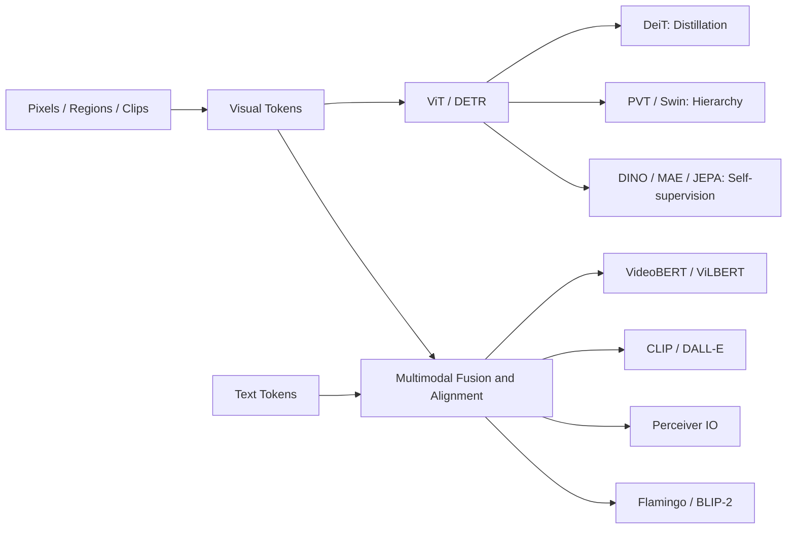

> 书目：*Hands-On Machine Learning with Scikit-Learn and PyTorch*<br>
> 章节：Chapter 16, Vision and Multimodal Transformers<br>
> 章节文件：16. Vision and Multimodal Transformers.md<br>
> 配套 Notebook：<https://homl.info/colab-p>

---

## 阅读导引

### 本章要解决什么问题

上一章的 Transformer 处理离散文本 token。本章追问：图像、视频、音频和传感器信号既连续又高分辨率，怎样把它们变成 Transformer 可处理的 token？多种模态又怎样组合并对齐？

全章沿两条主线展开：

1. **视觉 Transformer**：从 CNN + attention 过渡到纯 ViT，再解决数据效率、高分辨率、密集预测与无标签预训练；
2. **多模态 Transformer**：解决异构模态的 fusion 和 alignment，并发展出检索、生成、视觉对话与通用输入输出架构。



### 一句话概括

$$
\boxed{
\text{先把任意模态表示成 token，再用 attention 学习模态内与模态间关系；}
\text{高分辨率问题则通过层次化、局部化或 latent bottleneck 降低复杂度。}
}
$$

### 运行环境与证据边界

本文的纯 PyTorch 示例已在 VS Code/Pylance 选中的 `.venv` 中验证：Python 3.12、PyTorch 2.11.0 CPU、无 CUDA。当前环境没有安装 `torchvision`、`transformers` 和 `datasets`，所以依赖预训练模型、Food-101 或 Hugging Face Hub 的代码只做语法检查，并明确标注依赖；模型结果引用原书或官方 Notebook 的保存输出，不宣称为本机运行结果。

### 重要边界

- Attention map 是模型内部权重，不自动等于因果解释；
- Patch 越小，空间信息越细，但 token 数和 attention 成本会急剧增加；
- Multimodal fusion 不自动产生正确 alignment，网络可能利用数据偏差；
- Zero-shot score 是候选集合上的相对概率，不是现实世界中的校准置信度；
- 开放网络上的图文预训练会继承偏见、隐私、版权和有害内容风险。

---

## 0. 前置知识、符号与统一视角

### 0.1 从图像到 Token Sequence

一批 RGB 图像记为：

$$
X\in\mathbb R^{B\times C\times H\times W},\qquad C=3
$$

- $B$：batch size；
- $C$：channel 数；
- $H,W$：图像高和宽；
- $P$：正方形 patch 边长；
- $N=HW/P^2$：不重叠 patches 数；
- $D$：Transformer embedding dimension。

假设 $H,W$ 都可被 $P$ 整除。每个 patch 展平后维度为 $P^2C$，线性投影为：

$$
z_i=x_iE+b,
\qquad
x_i\in\mathbb R^{P^2C},
\quad E\in\mathbb R^{P^2C\times D}
$$

于是图像变成 $N$ 个 $D$ 维 tokens。若尺寸不能整除，必须 resize、pad、crop，或设计可处理边界 patch 的实现。

### 0.2 Attention 复杂度为何成为视觉瓶颈

Self-attention score matrix 为 $QK^T\in\mathbb R^{N\times N}$。忽略 heads 和常数后：

$$
T_{attn}=O(N^2D),\qquad M_{attn}=O(N^2)
$$

而 $N=HW/P^2$，所以：

$$
T_{attn}=O\left(\frac{H^2W^2}{P^4}D\right)
$$

图像高宽都扩大 2 倍，$N$ 扩大 4 倍，全局 attention 的 score 计算扩大 $4^2=16$ 倍。这是 PVT、Swin 和 Perceiver 要解决的共同难题。

### 0.3 Classification 与 Dense Prediction

| 任务 | 输出粒度 | 典型例子 | 需要保留的空间信息 |
| --- | --- | --- | --- |
| Classification | 整图一个 label | 猫/狗分类 | 较低 |
| Object detection | 每个 object | class + bounding box | 高 |
| Semantic segmentation | 每个 pixel | pixel class | 很高 |
| Instance segmentation | 每个 object 的 mask | 独立实例 | 很高 |
| Optical flow | 每个 pixel 的位移 | $(\Delta x,\Delta y)$ | 很高 |

Nonhierarchical ViT 最自然地输出整图 representation；dense prediction 更需要多尺度 feature maps。

---

## 1. Vision Transformers 的前身

### 1.1 RNNs with Visual Attention

早期 image captioning 常用 CNN encoder + RNN decoder：CNN 输出 $L$ 个区域特征 $a_1,\ldots,a_L$，RNN 在生成第 $t$ 个词时，根据上一 hidden state $h_{t-1}$ 计算每个区域的 relevance：

$$
e_{t,i}=v^T\tanh(W_a a_i+W_hh_{t-1}+b)
$$

$$
\alpha_{t,i}=\frac{\exp(e_{t,i})}
{\sum_{j=1}^{L}\exp(e_{t,j})},
\qquad
c_t=\sum_{i=1}^{L}\alpha_{t,i}a_i
$$

$c_t$ 是当前生成步骤读取的视觉 context。例如生成 “Frisbee” 前，权重应集中在飞盘区域。与固定全图向量相比，attention 让 decoder 每一步动态读取不同位置，缓解单一 bottleneck。

#### Soft 与 Hard Attention

- **Soft attention**：对所有区域加权求和，可微，可直接 backprop；
- **Hard attention**：sample/选择少数区域，计算省但离散选择不可直接求导，通常需要 REINFORCE、Gumbel-Softmax 或 straight-through estimator。

### 1.2 Explainability 的价值与边界

Attention heatmap 可提示模型在生成某个词时读取了哪里，适合发现 shortcut。例如把雪地里的狗判成狼，模型可能同时关注动物和雪，暗示数据中的背景偏差。

但严格地说，attention weight 只描述某层的 value mixing coefficient：

$$
o_i=\sum_j\alpha_{ij}v_j
$$

最终预测还受 value vectors、residual paths、FFN、后续 layers 影响。高权重不保证该 token 对输出有最大的因果贡献，低权重也不代表无影响。应结合 occlusion、counterfactual data、integrated gradients、LIME/SHAP 和真实干预实验；在贷款、医疗等高风险场景，漂亮的热图不能替代可审计的因果证据。

---

## 2. DETR：CNN-Transformer 混合目标检测器

### 2.1 它要解决什么问题

传统 detector 常依赖 anchors、proposal generation、IoU threshold 和 non-maximum suppression（NMS）。这些模块有效，却引入大量手工规则。DETR 将 detection 改写成**集合预测**：固定输出 $M$ 个 object slots，每个 slot 直接预测一个 class 和一个 box，未使用的 slot 预测 “no object”。

流程：

1. CNN backbone 生成 feature map $F\in\mathbb R^{C\times H'\times W'}$；
2. 用 $1\times1$ convolution 投影到 $D$ 维，展平为 $H'W'$ 个视觉 tokens，加 2D position encoding；
3. Transformer encoder 建模全局图像关系；
4. Decoder 接收 $M$ 个可学习 object queries，通过 cross-attention 读取图像；
5. 每个 query 输出 class logits 和 normalized box $(c_x,c_y,w,h)$。

Object query 不是预先绑定“第一个人”或“左上角目标”，而是可学习的 output slot。

### 2.2 为什么需要 Bipartite Matching

Ground truth 是无序集合 $Y=\{y_1,\ldots,y_n\}$，prediction slots 是 $\hat Y=\{\hat y_1,\ldots,\hat y_M\}$，通常 $n\le M$。若直接按 index 比较，同一组 boxes 仅因排列不同就会被错误惩罚。

Hungarian algorithm 在 $n$ 个真实目标与 $M$ 个 predictions 之间寻找最小成本的一一注入映射：

$$
\hat\sigma=
\arg\min_{\sigma\in\operatorname{Inj}(n,M)}
\sum_{i=1}^{n}
\mathcal C_{match}(y_i,\hat y_{\sigma(i)})
$$

- $\operatorname{Inj}(n,M)$：从 $n$ 个真实目标到 $M$ 个 prediction slots 的所有一一映射；
- $\sigma(i)$：ground-truth slot $i$ 匹配的 prediction index；
- matching cost 只针对真实目标，同时考虑 class probability、L1 box distance 和 generalized IoU：

$$
\mathcal C_{match}(y_i,\hat y_j)
=-\hat p_j(c_i)
{}+\lambda_1\|b_i-\hat b_j\|_1
{}+\lambda_{giou}\mathcal L_{GIoU}(b_i,\hat b_j)
$$

完成匹配后，令匹配到真实目标 $i$ 的 slot 标签为 $c_i$，其余 $M-n$ 个 slots 标签为 $\varnothing$。分类 loss 覆盖全部 slots，但 no-object 类通常用 `eos_coef` 降权；box loss 只覆盖 $n$ 个真实匹配：

$$
\mathcal L_{DETR}
=-\sum_{j=1}^{M}w(c_j^*)\log\hat p_j(c_j^*)
{}+\sum_{i=1}^{n}
\mathcal L_{box}(b_i,\hat b_{\hat\sigma(i)})
$$

其中 $w(\varnothing)=\lambda_{eos}<1$，真实 classes 的权重通常为 1。

$$
\mathcal L_{box}(b,\hat b)
=\lambda_1\|b-\hat b\|_1
{}+\lambda_{giou}\mathcal L_{GIoU}(b,\hat b)
$$

一一匹配迫使不同 queries 负责不同 objects，因此无需 NMS。Hungarian matching 本身是离散的，但只用来确定 target assignment；选定 assignment 后，各 prediction loss 对网络参数仍可微。

### 2.3 为什么有效，局限在哪里

Self-attention 看全局场景，object queries 可协同避免重复预测；end-to-end objective 减少手工 components。原始 DETR 的局限是训练收敛慢、小目标表现较弱、仍依赖 CNN backbone，并且 encoder 对高分辨率 feature tokens 仍有二次复杂度。Deformable DETR 等后续方法只采样少量 reference points，改善了训练速度和小目标检测。

---

## 3. Original Vision Transformer

### 3.1 核心思想与完整数据流

ViT 不用 CNN 提取视觉特征，而把 $P\times P$ patches 当作 text tokens：

$$
Z_0=
\left[x_{class};x_1E;\ldots;x_NE\right]
{}+E_{pos}
$$

其中：

- $x_{class}\in\mathbb R^D$：可学习 class token；
- $x_i\in\mathbb R^{P^2C}$：第 $i$ 个 flattened patch；
- $E\in\mathbb R^{P^2C\times D}$：patch projection；
- $E_{pos}\in\mathbb R^{(N+1)\times D}$：learned position embeddings。

经过 $L$ 个 pre-LN encoder blocks：

$$
Z'_\ell=Z_{\ell-1}+MSA(LN(Z_{\ell-1}))
$$

$$
Z_\ell=Z'_\ell+MLP(LN(Z'_\ell)),
\qquad \ell=1,\ldots,L
$$

最后用 class token 表示整图：

$$
\hat y=W_{head}LN(Z_L^{(0)})+b_{head}
$$

训练时将 logits 交给 cross-entropy；不需要显式 softmax：

$$
\mathcal L_{CE}
=-\frac1B\sum_{i=1}^{B}
\log\frac{\exp(z_{i,y_i})}
{\sum_{c=1}^{K}\exp(z_{i,c})}
$$

### 3.2 16×16 Patch 的数值例子

对 $224\times224$ RGB image、$P=16$：

$$
N=(224/16)^2=14^2=196
$$

每个 patch 展平为：

$$
16\times16\times3=768
$$

若 $D=768$，加入 class token 后 encoder input shape 是 `[B,197,768]`。Patch size 改成 8，token 数变为 $28^2=784$，是原来的 4 倍；attention score 数从 $197^2$ 约 3.9 万上升到 $785^2$ 约 61.6 万，约 15.9 倍。

### 3.3 Conv2d 为什么等价于 Patch Linear Projection

令 convolution kernel size = stride = $P$，无 padding。每个 output spatial position 覆盖一个互不重叠 patch。对输出 channel $d$：

$$
y_{d,r,s}
=b_d+\sum_{c=1}^{C}\sum_{u=1}^{P}\sum_{v=1}^{P}
W_{d,c,u,v}X_{c,rP+u,sP+v}
$$

将 kernel 和 patch 按同一顺序 flatten，这正是一个 $P^2C\to D$ linear layer。Conv2d 只是高效地对所有 patches 共享并批量执行该线性映射。

### 3.4 Inductive Bias：ViT 为什么需要更多数据

CNN 自带：

- locality：小 kernel 先组合邻近 pixels；
- translation equivariance：同一 kernel 在所有位置共享；
- hierarchy：逐层下采样形成多尺度 features。

标准 ViT 的 global attention 更灵活，但这些偏置更弱，需要从数据中学到局部性和平移规律。偏置正确时，CNN 少量数据更高效；数据极大时，较弱偏置允许 ViT 学到更自由的关系。原始 ViT 的领先结果依赖约 300M 额外训练图像，不能只归因于 architecture。

### 3.5 可运行的 Patch Embedding 与 Mini-ViT

```python
import torch
import torch.nn as nn


class PatchEmbedding(nn.Module):
    def __init__(self, in_channels, embed_dim, patch_size=16):
        super().__init__()
        self.patch_size = patch_size
        # kernel_size=stride=P，等价于对不重叠 patch 做共享线性投影
        self.projection = nn.Conv2d(
            in_channels,
            embed_dim,
            kernel_size=patch_size,
            stride=patch_size,
        )

    def forward(self, images):
        height, width = images.shape[-2:]
        if height % self.patch_size or width % self.patch_size:
            raise ValueError("图像高宽必须能被 patch_size 整除")
        features = self.projection(images)  # [B,D,H/P,W/P]
        return features.flatten(2).transpose(1, 2)  # [B,N,D]


class VisionTransformer(nn.Module):
    def __init__(self, image_size=32, patch_size=8, in_channels=3,
                 num_classes=10, embed_dim=64, depth=2,
                 num_heads=4, ff_dim=128, dropout=0.0):
        super().__init__()
        if image_size % patch_size:
            raise ValueError("image_size 必须能被 patch_size 整除")
        self.image_size = image_size
        self.patch_embedding = PatchEmbedding(
            in_channels, embed_dim, patch_size
        )
        num_patches = (image_size // patch_size) ** 2
        self.class_token = nn.Parameter(torch.zeros(1, 1, embed_dim))
        self.position = nn.Parameter(
            torch.zeros(1, num_patches + 1, embed_dim)
        )
        self.dropout = nn.Dropout(dropout)
        encoder_layer = nn.TransformerEncoderLayer(
            d_model=embed_dim,
            nhead=num_heads,
            dim_feedforward=ff_dim,
            dropout=dropout,
            activation="gelu",
            batch_first=True,
            norm_first=True,  # 原始 ViT 使用 pre-LN
        )
        self.encoder = nn.TransformerEncoder(
            encoder_layer, num_layers=depth
        )
        self.final_norm = nn.LayerNorm(embed_dim)
        self.head = nn.Linear(embed_dim, num_classes)
        nn.init.normal_(self.class_token, std=0.02)
        nn.init.normal_(self.position, std=0.02)

    def forward(self, images):
        if images.shape[-2:] != (self.image_size, self.image_size):
            raise ValueError("输入尺寸必须与 position embedding 对应")
        patches = self.patch_embedding(images)
        class_tokens = self.class_token.expand(images.shape[0], -1, -1)
        tokens = torch.cat([class_tokens, patches], dim=1)
        tokens = self.dropout(tokens + self.position)
        encoded = self.encoder(tokens)
        class_state = self.final_norm(encoded[:, 0])
        return self.head(class_state)


torch.manual_seed(42)
model = VisionTransformer()
images = torch.randn(4, 3, 32, 32)
patches = model.patch_embedding(images)
logits = model(images)
print("patch tokens:", patches.shape)
print("class logits:", logits.shape)
```

输出：

```text
patch tokens: torch.Size([4, 16, 64])
class logits: torch.Size([4, 10])
```

书中使用 ViT-Base 规模测试随机 `[4,3,224,224]` batch，官方 Notebook 保存输出为 `[4,1000]`。这里缩小模型以便 CPU 快速验证，公式和 shape 逻辑完全相同。

### 3.6 Conv 与手工 Patch Linear 的等价性验证

```python
def conv_as_manual_linear(images, conv):
    """把 Conv2d 权重展开，手工执行同一 patch projection。"""
    patch_size = conv.kernel_size[0]
    patches = images.unfold(2, patch_size, patch_size)
    patches = patches.unfold(3, patch_size, patch_size)
    # [B,C,grid_h,grid_w,P,P] -> [B,N,C*P*P]
    patches = patches.permute(0, 2, 3, 1, 4, 5).flatten(3)
    patches = patches.flatten(1, 2)
    weight = conv.weight.flatten(1)  # [D,C*P*P]
    return patches @ weight.T + conv.bias


with torch.no_grad():
    by_conv = model.patch_embedding(images)
    by_linear = conv_as_manual_linear(
        images, model.patch_embedding.projection
    )
print("最大绝对误差:", (by_conv - by_linear).abs().max().item())
```

本机输出为 `8.940696716308594e-07`；非零微小误差来自 floating-point 运算顺序，不是算法差异。

### 3.7 固定 Resolution 与 Position Interpolation

Learned absolute position embedding 的长度固定。Fine-tune 到更高 resolution 时，patch 数改变，不能直接相加。常见做法：保留 class-token embedding，把二维 patch position grid 用 bicubic interpolation 放大，再展平。Interpolation 是工程近似，不保证训练外 resolution 完全泛化；relative position bias、RoPE 等是替代方案。

---

## 4. Fine-Tuning a Pretrained ViT

从 scratch 训练 ViT 数据和算力成本很高。常规流程是加载与目标域接近的 checkpoint，替换 classification head，使用较小 learning rate fine-tune；小数据时可先冻结 backbone。

Oxford-IIIT Pet 有 37 类、约 7,000 张图。下面代码需要 `pip install transformers datasets accelerate torchvision` 和联网：

```python
from datasets import load_dataset
from transformers import (
    AutoImageProcessor,
    Trainer,
    TrainingArguments,
    ViTForImageClassification,
)

pets = load_dataset("timm/oxford-iiit-pet")
pet_train_valid = pets["train"].train_test_split(
    test_size=0.1, seed=42
)
model_id = "google/vit-base-patch16-224-in21k"
processor = AutoImageProcessor.from_pretrained(model_id, use_fast=True)
pretrained_vit = ViTForImageClassification.from_pretrained(
    model_id,
    num_labels=37,
)


def collate_pet_images(batch):
    # 有些图片带 alpha channel，统一转为 RGB
    images = [item["image"].convert("RGB") for item in batch]
    inputs = processor(images=images, return_tensors="pt")
    inputs["labels"] = torch.tensor([item["label"] for item in batch])
    return inputs


def compute_pet_metrics(evaluation):
    predictions = evaluation.predictions.argmax(axis=-1)
    return {
        "accuracy": float((predictions == evaluation.label_ids).mean())
    }


training_args = TrainingArguments(
    output_dir="./vit-pets",
    per_device_train_batch_size=16,
    num_train_epochs=3,
    eval_strategy="epoch",
    save_strategy="epoch",
    load_best_model_at_end=True,
    remove_unused_columns=False,
    report_to="none",
)
trainer = Trainer(
    model=pretrained_vit,
    args=training_args,
    data_collator=collate_pet_images,
    train_dataset=pet_train_valid["train"],
    eval_dataset=pet_train_valid["test"],
    compute_metrics=compute_pet_metrics,
)
trainer.train()
print(trainer.predict(pets["test"]).metrics)
```

`remove_unused_columns=False` 很关键：否则 Trainer 会在 collator 之前删除 model `forward()` 不直接接收的 `image` 字段。书中 3 epochs 约 91.8% accuracy；augmentation 和更久训练可到约 93%–95%。严格实验不应反复用 test set 选模型，应从 train 划 validation，最终只在 test 评一次。

### 4.1 Fine-Tuning 的常见策略

| 策略 | Trainable parameters | 优点 | 局限 |
| --- | ---: | --- | --- |
| Linear probe | 只有 head | 快、检验 representation | 上限较低 |
| Full fine-tuning | 全部 | 适应能力强 | 显存大、易过拟合 |
| Layer-wise LR decay | 全部但底层 LR 小 | 保留通用低层特征 | 调参更多 |
| Adapters/LoRA | 少量新增参数 | 省显存、便于多任务 | 可能不及 full FT |

Image processor、resize/crop、normalization、label mapping 与 checkpoint 是一个整体 contract，不能随意替换。

---

## 5. Data-Efficient Image Transformer

### 5.1 问题：ViT 太依赖大规模预训练数据

DeiT 的 architecture 几乎仍是 ViT，关键创新在 training recipe 和 distillation：用已经具有良好视觉归纳偏置的 CNN teacher 指导 ViT student，使 student 不必仅靠 ImageNet-1k labels 从头发现局部性等规律。

在 class token 之外加入 trainable **distillation token**。两个 token 的 final states 分别经过 class head 和 distillation head：

$$
z_{cls}=h_{cls}(Z_L^{cls}),
\qquad
z_{dist}=h_{dist}(Z_L^{dist})
$$

### 5.2 Soft 与 Hard Distillation

Soft distillation 用 teacher distribution 作为 target：

$$
p_T^{(\tau)}=softmax(z_T/\tau),
\quad
p_S^{(\tau)}=softmax(z_{dist}/\tau)
$$

$$
\mathcal L_{soft}
=(1-\lambda)CE(y,z_{cls})
{}+\lambda\tau^2 KL(p_T^{(\tau)}\|p_S^{(\tau)})
$$

- $\tau>1$ 展平 teacher distribution，暴露次优类别之间的 “dark knowledge”；
- $\tau^2$ 补偿 temperature 导致的 gradient scale 变化；
- teacher 冻结，gradient 只更新 student。

DeiT 论文发现 hard distillation 很有效：

$$
y_T=\arg\max_c z_{T,c}
$$

$$
\mathcal L_{hard}
=\frac12 CE(y,z_{cls})
{}+\frac12 CE(y_T,z_{dist})
$$

Teacher 错误会被 student 学到，所以真实 label 与 teacher target 同时保留。CNN teacher 的 inductive bias 和 ViT student 不同，异构 teacher 往往比同构 teacher 提供更互补的信号。

```python
import torch.nn.functional as F


def deit_distillation_loss(class_logits, distill_logits,
                           teacher_logits, labels,
                           alpha=0.5, temperature=2.0):
    """Soft DeiT loss：真实标签 CE + teacher KL。"""
    hard_loss = F.cross_entropy(class_logits, labels)
    teacher_probability = F.softmax(
        teacher_logits.detach() / temperature, dim=-1
    )
    student_log_probability = F.log_softmax(
        distill_logits / temperature, dim=-1
    )
    soft_loss = F.kl_div(
        student_log_probability,
        teacher_probability,
        reduction="batchmean",
    ) * temperature**2
    return (1 - alpha) * hard_loss + alpha * soft_loss


torch.manual_seed(42)
class_logits = torch.randn(3, 5, requires_grad=True)
distill_logits = torch.randn(3, 5, requires_grad=True)
teacher_logits = torch.randn(3, 5)
labels = torch.tensor([0, 2, 4])
loss = deit_distillation_loss(
    class_logits, distill_logits, teacher_logits, labels
)
loss.backward()
print("DeiT loss:", round(loss.item(), 4))
print("两个 head 都有梯度:",
      class_logits.grad is not None,
      distill_logits.grad is not None)
```

本机输出：

```text
DeiT loss: 1.4795
两个 head 都有梯度: True True
```

原书把 inference 简化为丢弃 distillation token/head；原始 distilled DeiT 通常保留两个 heads，并平均两者 logits/predictions。具体行为应以 checkpoint implementation 为准。书中相同宠物任务的参考 accuracy 约 94.4%。

### 5.3 是否能推广

能。Distillation 不要求 student 是 ViT，也不要求 teacher 是 CNN；可用于 detection、segmentation、language model 和 multimodal model。成立条件是 teacher 在目标分布上提供有信息量且相对可靠的 signal。Domain shift 严重、teacher 有系统性偏见或 student capacity 太小时，蒸馏可能伤害性能。

---

## 6. Pyramid Vision Transformer

### 6.1 为什么 Regular ViT 不适合 Dense Prediction

Regular ViT 从头到尾保持单一 token resolution，且 $16\times16$ patch 对小物体和精细边界太粗。CNN detector/segmenter 通常需要由高分辨率浅层到低分辨率深层的 feature pyramid。PVT 将这种 hierarchy 引入 Transformer。

书中例子把 $256\times192\times3$ 输入依次变成：

| Stage | Spatial grid | Channels | Patch/downsample |
| --- | ---: | ---: | ---: |
| 1 | $64\times48$ | 64 | $4\times4$ |
| 2 | $32\times24$ | 128 | $2\times2$ |
| 3 | $16\times12$ | 320 | $2\times2$ |
| 4 | $8\times6$ | 512 | $2\times2$ |

每 stage 将 sequence reshape 回 feature grid，再交给下一 stage。越深 spatial resolution 越低、semantic channels 越多；四级输出可替换 CNN backbone，接入 FCN、FPN、Mask R-CNN 等 heads。

### 6.2 Spatial Reduction Attention

Stage 1 有 $N=64\times48=3072$ tokens。Global attention 要 $N^2=9,437,184$ scores。PVT 保留 queries 的完整分辨率，但对 keys/values 以 spatial reduction ratio $R$ 下采样：

$$
Q=XW_Q
$$

$$
    ilde X=LN(SR_R(X)),
\qquad
K=\tilde XW_K,
\quad V=\tilde XW_V
$$

$$
SRA(X)=softmax\left(
\frac{QK^T}{\sqrt{d_k}}
\right)V
$$

若高宽都缩小 $R$ 倍，key/value token 数变为 $N/R^2$，scores 数为：

$$
N\cdot\frac{N}{R^2}=\frac{N^2}{R^2}
$$

Stage 1 用 $R=8$：keys/values 只有 $8\times6=48$ tokens，因此 scores 为 $3072\times48=147,456$，恰好少 64 倍。Queries 未降采样，所以输出仍有 3,072 tokens，dense resolution 不变。

```python
def attention_score_count(height, width, reduction=1):
    queries = height * width
    keys = (height // reduction) * (width // reduction)
    return queries * keys


full_scores = attention_score_count(64, 48)
reduced_scores = attention_score_count(64, 48, reduction=8)
print(full_scores, reduced_scores, full_scores // reduced_scores)
```

输出：`9437184 147456 64`。

### 6.3 局限

SRA 会压缩 keys/values，可能损失小目标信息；queries 仍多，projection/FFN 也不免费。PVT 仍比 local-window architecture 昂贵，且 reduction ratio 是需调节的 inductive bias。PVTv2 后续引入 overlapping patch embedding、linear SRA 等改进。

---

## 7. Swin Transformer

### 7.1 Window-Based MSA

把 $N=HW$ 个 patch tokens 分成不重叠 $w\times w$ windows。每个 token 只和同窗 $w^2$ 个 tokens attention：

$$
T_{W\text{-}MSA}=O(Nw^2D)
$$

$w$ 固定时，复杂度对图像面积 $N$ 线性。书中 $28\times28$ grid、$w=7$：

$$
Nw^2=784\times49=38,416
$$

Global MSA 则是：

$$
N^2=784^2=614,656
$$

高宽都加倍时，W-MSA 成本约 4 倍，而 global MSA 约 16 倍。

### 7.2 Shifted Windows 为什么能跨窗通信

仅使用固定 windows 会把图像分成彼此隔离的 islands。Swin 交替使用：

1. W-MSA：正常 windows；
2. SW-MSA：窗口沿高宽各 shift $\lfloor w/2\rfloor$。

原本处于相邻窗口的 patches 在 shifted layer 进入同一个 window，从而交换信息。多层后信息逐步扩散；patch merging 又让高层 token 覆盖更大 receptive field。

高效实现不是创建更多边缘小窗，而是对 feature grid 做 cyclic `torch.roll`，仍切成相同数量 windows。Wrap-around 会让原图两端不相邻的 patches 落入同窗，因此必须用 attention mask 将这些伪邻接 logits 设为 $-\infty$。

### 7.3 Patch Merging 与 Hierarchy

相邻 $2\times2$ tokens concatenation 后线性投影：

$$
[x_{00};x_{01};x_{10};x_{11}]
\in\mathbb R^{4D}
\longrightarrow \mathbb R^{2D}
$$

空间高宽减半，token 数变为 $1/4$，channels 通常翻倍，形成 CNN-like feature pyramid。

```python
def partition_windows(features, window_size):
    """features: [B,H,W,C] -> [num_windows*B,w*w,C]。"""
    batch, height, width, channels = features.shape
    if height % window_size or width % window_size:
        raise ValueError("feature grid 必须能被 window_size 整除")
    windows = features.reshape(
        batch,
        height // window_size,
        window_size,
        width // window_size,
        window_size,
        channels,
    )
    windows = windows.permute(0, 1, 3, 2, 4, 5)
    return windows.reshape(-1, window_size**2, channels)


grid = torch.arange(8 * 8).reshape(1, 8, 8, 1).float()
normal = partition_windows(grid, window_size=4)
shifted_grid = torch.roll(grid, shifts=(-2, -2), dims=(1, 2))
shifted = partition_windows(shifted_grid, window_size=4)
print("windows:", normal.shape)
print("普通首窗前四项:", normal[0, :4, 0].tolist())
print("移位首窗前四项:", shifted[0, :4, 0].tolist())
```

输出：

```text
windows: torch.Size([4, 16, 1])
普通首窗前四项: [0.0, 1.0, 2.0, 3.0]
移位首窗前四项: [18.0, 19.0, 20.0, 21.0]
```

示例只验证 partition/shift；真实 SW-MSA 还必须构造上述 wrap-around mask。

### 7.4 Swin v2

Swin v2 主要改善大模型和高 resolution transfer 的稳定性，包括 scaled cosine attention、continuous relative position bias 和 normalization placement 等调整。Swin 实现复杂于 PVT，但线性 spatial scaling 和多尺度输出使它长期适合作为 detection/segmentation backbone。

---

## 8. DINO：无标签 Self-Distillation

### 8.1 问题与训练结构

监督学习需要昂贵 labels；pixel reconstruction 又可能浪费 capacity 学纹理细节。DINO 希望仅凭不同 augmentations 属于同一原图，学习 invariant semantic representation。

复制两套同 architecture networks：

- student 参数 $\theta_s$：gradient descent 更新；
- teacher 参数 $\theta_t$：student 的 exponential moving average（momentum teacher），不接收 gradient。

$$
\boxed{
    heta_t\leftarrow m\theta_t+(1-m)\theta_s
}
$$

$m$ 通常接近 1，并逐步增大。EMA teacher 相当于近期 students 的 temporal ensemble，target 比瞬时 student 更稳定。

### 8.2 Multi-Crop 与 Cross-View Loss

Teacher 看两个轻度增强 global crops；student 看 global crops 加多个强增强 local crops。对 teacher view $u$ 和不同的 student view $v$：

$$
p_t^{(u)}=softmax\left(
\frac{z_t^{(u)}-c}{\tau_t}
\right)
$$

$$
p_s^{(v)}=softmax\left(
\frac{z_s^{(v)}}{\tau_s}
\right)
$$

$$
\mathcal L_{DINO}
=\frac{1}{|\mathcal P|}
\sum_{(u,v)\in\mathcal P}
H\left(p_t^{(u)},p_s^{(v)}\right)
$$

$$
H(p_t,p_s)=-\sum_k p_{t,k}\log p_{s,k}
$$

$\mathcal P$ 排除同一个 global crop 与自身的 pair，避免最简单的 identical-view shortcut。Local student 必须从局部预测 global teacher representation，因此被迫学习 object-level semantics。

### 8.3 Mode Collapse、Centering 与 Sharpening

若所有图片都输出同一 distribution，student 与 teacher 可以达到退化的 stationary solution，representation 却没有信息，这叫 collapse。若共同输出 uniform distribution，cross-entropy 是 $\log K$ 而不是 0；只有共同趋近同一个 one-hot distribution 时该项才趋近 0。因此 collapse 描述的是表示退化，不等同于任意形式下 loss 必为零。

Teacher center 用 batch teacher logits 的 EMA 更新：

$$
c\leftarrow \mu c+(1-\mu)
\frac{1}{B}\sum_{i=1}^{B}z_{t,i}
$$

- **Centering** 减去 $c$，抑制少数维度永远占优，鼓励 batch-level output diversity；
- **Sharpening** 使用较低 teacher temperature $\tau_t<\tau_s$，避免每张图都输出 uniform distribution。

二者互相制衡：只 sharpening 容易所有样本集中到同一 prototype；只 centering 可能全部 uniform。再加稳定 EMA teacher 和 multi-crop，才形成有效的防坍塌系统，而不是某一技巧单独提供数学保证。

```python
def dino_cross_view_loss(student_logits, teacher_logits,
                         center, student_temp=0.1,
                         teacher_temp=0.04):
    """teacher 有两个 global views，student 还可包含 local views。"""
    teacher_probabilities = [
        F.softmax((logits.detach() - center) / teacher_temp, dim=-1)
        for logits in teacher_logits
    ]
    student_log_probabilities = [
        F.log_softmax(logits / student_temp, dim=-1)
        for logits in student_logits
    ]
    losses = []
    for teacher_index, teacher_probability in enumerate(
            teacher_probabilities):
        for student_index, student_log_probability in enumerate(
                student_log_probabilities):
            if student_index == teacher_index:
                continue  # 排除相同 global crop
            losses.append(
                -(teacher_probability * student_log_probability)
                .sum(dim=-1)
                .mean()
            )
    return torch.stack(losses).mean()


torch.manual_seed(7)
student_views = [torch.randn(4, 8, requires_grad=True) for _ in range(4)]
teacher_views = [torch.randn(4, 8) for _ in range(2)]
center = torch.zeros(1, 8)
dino_loss = dino_cross_view_loss(
    student_views, teacher_views, center
)
dino_loss.backward()
print("cross-view pairs:", 2 * 4 - 2)
print("DINO loss:", round(dino_loss.item(), 4))
print("student local view 有梯度:", student_views[-1].grad is not None)
```

本机输出：

```text
cross-view pairs: 6
DINO loss: 16.7117
student local view 有梯度: True
```

### 8.4 学到的 Representation 如何使用

可冻结 backbone 训练 linear probe；也可计算 class prototypes：

$$
\mu_c=\frac{1}{|S_c|}\sum_{i\in S_c}f(x_i)
$$

对新图选择 cosine 最近的 $\mu_c$。书中报告这种 nearest-mean 思路可达 ImageNet 78.3% top-1。Patch features 和 class-token attention 常自然突出 object，但 attention map 仍不等于可靠 segmentation label。

训练后 student 与 EMA teacher 都能作为 encoder；实践中 EMA teacher 往往更平滑、常被用于评估和发布，不能机械地认为 teacher 必须丢弃。

### 8.5 DINOv2

DINOv2 的关键不只是“更大”：

- 自动构建并去重、平衡的大规模高质量 LVD-142M 数据；
- 结合 DINO image-level objective 与 iBOT masked patch objective，并使用独立 heads；
- 使用 Sinkhorn-Knopp centering 改善 teacher assignment；
- 加入 KoLeo 等 regularization，改善 feature distribution；
- 训练末期加入短暂的高分辨率 adaptation；
- 用最大的 ViT-g teacher distill 较小 variants；
- 扩展 model/data/training recipe，得到更稳定的通用 patch features。

因此 DINOv2 适合 labels 很少、需要 transfer 的 classification、depth、segmentation、retrieval 等场景。若任务有大量高质量 labels、严格 latency 限制或 domain 与自然图像差异极大，专用 supervised/smaller model 可能更合适。

---

## 9. Other Major Vision Models and Techniques

### 9.1 Scaling Vision Transformers

Scaling 不是盲目加参数：model capacity 必须与 data size、regularization 和 compute 匹配。书中列举的工作从少量数据的小模型到 2B 参数 ViT，分别达到 84.8% 和 90.4% ImageNet top-1，说明 recipe 和 data regime 决定最优规模。

### 9.2 BEiT：预测离散视觉 Token

BEiT 模仿 BERT MLM：随机 mask patches，但 target 不是 raw pixel，而是 dVAE tokenizer 生成的 discrete visual token ID：

$$
\mathcal L_{BEiT}
=-\sum_{i\in\mathcal M}
\log p_\theta(q_i\mid x_{\setminus\mathcal M})
$$

$q_i$ 是 visual vocabulary 中的 code。离散 semantic target 避免模型把大量 capacity 用于精确恢复噪声和微小颜色，但引入额外 dVAE、codebook bottleneck 和 tokenizer bias。

### 9.3 MAE：Asymmetric Masked Autoencoder

MAE 直接回归 normalized pixels，却通过非对称 architecture 降低成本：mask 约 75% patches，large encoder **只处理可见 patches**，small decoder 接收 encoded visible tokens 和 mask tokens，重建所有/被 mask patches。

$$
\mathcal L_{MAE}
=\frac{1}{|\mathcal M|}
\sum_{i\in\mathcal M}
\|\hat x_i-x_i\|_2^2
$$

Encoder token 数仅原来的 25%，其 self-attention score 数约变为 $0.25^2=6.25\%$。High mask ratio 对图像有效，因为邻近 pixels 冗余高；对信息密度更高的 modality 不一定适用。

### 9.4 Model Soups

对相同 pretrained initialization、相同 architecture、不同 hyperparameters fine-tuned 的 $K$ 个 models：

$$
\bar\theta=\frac1K\sum_{k=1}^{K}\theta_k
$$

若 solutions 位于相连的低损失 basin，weight average 可像 ensemble 一样改善 generalization，却只保留一个 model 的 inference cost。若 models 来自不同 permutations、不同 architectures 或遥远 basins，直接 averaging 会破坏功能。

### 9.5 EVA

EVA 系列将 masked visual representation learning、强 augmentation 和大规模 data/model 结合。EVA-02 以更高效 recipe 在较少参数下达到很强结果，说明 pretraining target 与 optimization 质量可比单纯 scaling 更重要。

### 9.6 JEPA 与 I-JEPA

Pixel prediction 要重建不可预测细节；JEPA 只在 representation space 预测缺失区域的抽象表征。设 context blocks 为 $x_C$、target blocks 为 $x_T$：

$$
h_C=f_{\theta}(x_C),
\qquad
h_T=stopgrad(f_{\bar\theta}(x_T))
$$

$$
\hat h_T=g_\phi(h_C,pos_T)
$$

$$
\boxed{
\mathcal L_{JEPA}
=\sum_T d(\hat h_T,h_T)
}
$$

- $f_\theta$：student/context encoder；
- $f_{\bar\theta}$：EMA teacher/target encoder；
- $g_\phi$：predictor；
- $pos_T$：target location 信息；
- $d$：L1、smooth-L1 或其他 representation distance。

Teacher 看完整 target，student 只看 context；predictor 学“在该 context 下缺失区域应有怎样的 semantic embedding”。训练后只保留 context encoder。I-JEPA 用于图像，V-JEPA/V-JEPA 2 扩展视频与 world-model learning。

JEPA 不生成精确 pixels，也不是 generative likelihood model；优势是忽略不可预测细节、提高 semantic efficiency，局限是 representation collapse 仍需 architecture/EMA/masking recipe 防范，且 embedding prediction 难以直接可视化审计。

### 9.7 模型与加速技术地图

| 目标 | 代表模型/技术 |
| --- | --- |
| Classification | NesT、DeiT-III |
| Mobile/efficient | MobileViT、EfficientFormer、EfficientViT、TinyViT |
| Hierarchical backbone | Twins-SVT、FocalNet、MaxViT、InternImage |
| Segmentation | Mask2Former、OneFormer、SEEM、SAM、MobileSAM |
| Detection | ViTDet、RT-DETR |
| Video | TimeSformer、VideoMAE、OmniMAE |
| Self-supervision | SimMIM、iBOT、CAE、DINOv2 |
| Dynamic efficiency | token merging、pruning、early exiting、patch selection |

Token merging 合并相似 tokens，pruning 删除低价值 tokens，early exiting 让部分 tokens 提前停止，patch selection 在入口只选信息量高的区域。它们以 speed 换 approximation error，必须分别评估 accuracy、latency、hardware utilization，而不能只报告理论 FLOPs。

---

## 10. Multimodal Transformers：统一问题定义

### 10.1 什么是 Modality

Modality 是信息的呈现或感知形式，如 text、image、audio、video、depth、thermal、IMU、robot state/action。它们具有不同结构：

| 模态 | 常见数值类型 | 原始结构 | 典型采样密度 |
| --- | --- | --- | --- |
| Text | 离散 IDs | 1D sequence | 低 |
| Image | 连续 pixels | 2D grid | 高 |
| Audio | 连续 waveform | 高频 1D time | 极高 |
| Video | 连续 pixels | 3D space-time | 极高 |
| IMU | 连续 sensors | multivariate time | 中高 |

Multimodal model 同时消费或生成至少两种 modalities。困难不只是 tensor shapes 不同，还包括时间不同步、空间粒度不同、noise 不同、某一模态缺失，以及同一语义在各模态中表达方式不同。

### 10.2 Fusion Problem

Fusion 是“怎样把各模态的信息组合成联合 representation”。

- **Early fusion / single stream**：先把 tokens concatenation，再由同一 Transformer 处理；interaction 早而充分，但 compute 大，强模态可能压制弱模态；
- **Late fusion / dual encoder**：各自编码成 global vectors，最后算 similarity/组合；可独立缓存，适合 retrieval，但细粒度 token interaction 弱；
- **Intermediate fusion / cross-attention**：先单模态编码，再让一方 queries 读取另一方 keys/values；兼顾专用表示和交互，architecture 更复杂；
- **Shared latent space**：让所有输入通过少量 latent tokens，例如 Perceiver。

Concatenation 只是 fusion 操作，不保证模型真正使用了所有 modalities。应做 modality ablation、missing-modality test 和 counterfactual evaluation。

### 10.3 Alignment Problem

Alignment 是“不同模态的哪些部分相互对应”。可有不同粒度：

- global：一张图是否对应一段 caption；
- region-word：图中的 dog 对应文本 “dog”；
- temporal：spoken word 对应 audio/video timestamp；
- action-state：robot command 对应 sensor state 和 motor action。

给定图像 tokens $V=(v_1,\ldots,v_M)$ 与文本 tokens $T=(t_1,\ldots,t_N)$，cross-attention：

$$
A_{text\leftarrow image}
=softmax\left(\frac{Q_TK_V^T}{\sqrt{d_k}}\right)
$$

其 shape 为 $N\times M$，允许每个 text query 动态聚合 visual values。Attention 提供 alignment 的计算机制，但若 training objective 只要求 global classification，细粒度 alignment 不一定自然正确。

### 10.4 为什么 Transformer 适合多模态

只要将输入转为 embeddings sequence，attention 不要求 token 原本是 word、patch 还是 audio frame；position、time、modality/type embeddings 提供结构信息。Self-attention 建模模态内关系，cross-attention 建模模态间关系，mask 可表达 causality 和可见范围。

限制仍然存在：长序列二次成本、paired data 稀缺且 noisy、modalities 不同步、training objective 存在 shortcut。Transformer 是灵活接口，不是自动解决数据问题的魔法。

---

## 11. VideoBERT：Text + Video 的 Single-Stream BERT

### 11.1 为什么 Video 需要离散化

BERT MLM 预测固定 vocabulary 中的 token ID。文本已有 WordPiece vocabulary，连续 video feature 却没有离散 labels。VideoBERT 先把视频 clip 转成 high-level vector，再 vector quantization 成 visual token ID，才能复用 MLM classification objective。

处理流程：

1. 每个 nonoverlapping clip 长 1.5 s，以 20 fps 采样，共 30 frames；
2. 预训练 S3D 3D CNN + average pooling 输出 1,024 维 vector；
3. 对所有 vectors 做 hierarchical $k$-means，branching factor 12、4 levels，得到 $12^4=20,736$ 个 clusters；
4. 每个 clip 替换为最近 centroid 的 ID；
5. YouTube speech-to-text 产生 transcript，再按 BERT 方式 tokenize。

Vector quantization 是：

$$
q(x)=\arg\min_{k\in\{1,\ldots,K\}}
\|x-\mu_k\|_2^2
$$

它把连续 1,024 维空间压成有限 vocabulary。优点是能用 cross-entropy MLM；代价是 cluster 内差异全部丢失，quantization error 和 S3D bias 成为上限。

### 11.2 三种 Pretraining Regimes

1. **Text-only masked language modeling**：预测 masked text tokens；
2. **Video-only masked token modeling**：预测 masked visual cluster IDs；
3. **Text-video alignment**：拼接 text/video sequences，用 `[CLS]` binary head 判断是否来自同一视频片段。

总目标可抽象为：

$$
\mathcal L
=\lambda_T\mathcal L_{text\text{-}MLM}
{}+\lambda_V\mathcal L_{video\text{-}MLM}
{}+\lambda_A\mathcal L_{align}
$$

实际三种 modes 分开 sample，不是一次 forward 同时完成全部任务。Narration 与动作常有时间偏移，所以训练会拼接邻近 sentences 增加 context，并随机改变 sampling rate 以适应动作速度。

### 11.3 能做什么，局限是什么

- Zero-shot action classification：给 video 加 “Now let me show you how to `[MASK]` the `[MASK]`”，比较 verb-noun pair probability；
- Video captioning：用 VideoBERT features 替换 captioning encoder inputs；
- Multiple-choice VQA：逐 candidate 计算 visual-language alignment score。

局限包括 S3D/CNN 依赖、离散化信息损失、random negative alignment 太容易、视频与 narration 非严格同步，以及 single-stream 对所有 modality 使用相同深度处理。

---

## 12. ViLBERT：Dual-Stream 与 Co-Attention

### 12.1 为什么不把所有 Tokens 直接拼起来

Text tokens 需要多层处理才能形成语义；Faster R-CNN region features 已经很 high-level。Single-stream 强迫两者使用相同 processing schedule，可能破坏 pretrained BERT representation。ViLBERT 因而先使用两个 specialized streams，再在高层交换信息。

Text stream 的低 12 层初始化自 BERT-base；vision stream 输入冻结 Faster R-CNN 提取的 10–36 个 region vectors。上层包含 6 对 co-attention layers。

### 12.2 Co-Attention 的严格含义

Text 读取 image：

$$
H_T'=MHA(Q=H_TW_Q^T,
K=H_VW_K^V,V=H_VW_V^V)
$$

Image 同时读取 text：

$$
H_V'=MHA(Q=H_VW_Q^V,
K=H_TW_K^T,V=H_TW_V^T)
$$

这是 bidirectional cross-attention；与 late-fusion cosine 不同，它能学习 region-word interaction。

### 12.3 Region Spatial Encoding

Regions 没有 word order，但有 2D geometry。Bounding box 编为：

$$
s_i=\left[
\frac{x_1}{W},\frac{y_1}{H},
\frac{x_2}{W},\frac{y_2}{H},
\frac{(x_2-x_1)(y_2-y_1)}{WH}
\right]
$$

再线性投影并加到 region feature。`[IMG]` token 用所有 region features 的平均值，加覆盖整图 box 的 spatial encoding；它类似视觉 class token，却不是完全从随机 trainable vector 开始。

### 12.4 Pretraining Objectives

- Text MLM：预测 masked words；
- Masked region modeling：不回归 pixels，而拟合 Faster R-CNN 对该 region 的 soft class distribution；
- Image-text alignment：将 `[IMG]` 和 `[CLS]` representations 逐元素相乘，再 binary classify match/mismatch。

逐元素乘法 $h_I\odot h_T$ 强调两边同时大的 dimensions，类似 soft AND；它不是唯一选择，也可使用 concatenation/bilinear layer。ViLBERT 在 visual grounding、image retrieval、VQA 和 visual commonsense reasoning 上表现强，但 region proposal bottleneck 会漏掉 detector 不认识的 objects，双流 co-attention 也比 CLIP dual encoder 更难缓存和扩展。

---

## 13. CLIP：Contrastive Language-Image Pretraining

### 13.1 架构与目标

CLIP 用独立 image encoder $f_I$ 与 text encoder $f_T$，再各自线性投影到相同 $d$ 维空间。对 batch 中第 $i$ 对 image-caption：

$$
u_i=\frac{W_If_I(I_i)}{\|W_If_I(I_i)\|_2},
\qquad
v_i=\frac{W_Tf_T(T_i)}{\|W_Tf_T(T_i)\|_2}
$$

L2 normalization 后 dot product 就是 cosine similarity。Batch size 为 $m$ 时：

$$
s_{ij}=\frac{u_i^Tv_j}{\tau}
$$

$s\in\mathbb R^{m\times m}$；diagonal 是正 pairs，其余 $m(m-1)$ 个是 in-batch negatives。CLIP 实际学习 logit scale $a=\log(1/\tau)$，于是 $s_{ij}=\exp(a)u_i^Tv_j$。

### 13.2 双向 InfoNCE 的完整推导

固定 image $i$，把 batch 中 $m$ 个 captions 看成 $m$ 个 classes，正确 class 是 $i$：

$$
p(T_j\mid I_i)
=\frac{\exp(s_{ij})}
{\sum_{k=1}^{m}\exp(s_{ik})}
$$

Image-to-text cross-entropy：

$$
\mathcal L_{I\to T}
=-\frac1m\sum_{i=1}^{m}
\log\frac{\exp(s_{ii})}
{\sum_{j=1}^{m}\exp(s_{ij})}
$$

对每个 text column 反过来分类 images：

$$
\mathcal L_{T\to I}
=-\frac1m\sum_{i=1}^{m}
\log\frac{\exp(s_{ii})}
{\sum_{j=1}^{m}\exp(s_{ji})}
$$

最终对称 loss：

$$
\boxed{
\mathcal L_{CLIP}
=\frac12(\mathcal L_{I\to T}+\mathcal L_{T\to I})
}
$$

若某 off-diagonal caption 其实也描述该 image，它会成为 false negative。更大 batch 提供更多 negatives，提升任务难度，却也提高 false-negative chance 和显存/communication 成本。Original CLIP 使用约 400M web image-text pairs 和 batch 32,768，能力既来自 objective，也来自数据和规模。

### 13.3 可运行的 CLIP Loss

```python
def clip_contrastive_loss(image_features, text_features,
                          logit_scale):
    image_features = F.normalize(image_features, dim=-1)
    text_features = F.normalize(text_features, dim=-1)
    logits = logit_scale.exp() * image_features @ text_features.T
    targets = torch.arange(logits.shape[0], device=logits.device)
    image_loss = F.cross_entropy(logits, targets)
    text_loss = F.cross_entropy(logits.T, targets)
    return (image_loss + text_loss) / 2, logits


torch.manual_seed(11)
image_features = F.normalize(torch.randn(4, 6), dim=-1)
text_features = image_features + 0.03 * torch.randn(4, 6)
logit_scale = torch.tensor(10.0).log()
contrastive_loss, similarity_logits = clip_contrastive_loss(
    image_features, text_features, logit_scale
)
print("similarity matrix:", similarity_logits.shape)
print("matching indices:", similarity_logits.argmax(dim=1).tolist())
print("CLIP loss:", round(contrastive_loss.item(), 4))
```

这个构造让 matching vectors 仅有小扰动，因此每行最大值应位于 diagonal；loss 越小表示正 pair 相对 batch negatives 越突出。

```text
similarity matrix: torch.Size([4, 4])
matching indices: [0, 1, 2, 3]
CLIP loss: 0.0017
```

### 13.4 Zero-Shot Classification 是怎样变成分类器的

对每个 class $c$ 构造 prompt，如 “This is a photo of a {class}.”，编码并 normalization 得 $v_c$。新图得 $u$，在当前 candidate labels 上计算：

$$
p(c\mid I,\mathcal C)
=\frac{\exp(u^Tv_c/\tau)}
{\sum_{k\in\mathcal C}\exp(u^Tv_k/\tau)}
$$

这是**条件于候选集合 $\mathcal C$** 的相对分布。若把正确类从 candidates 删除，模型仍必须给剩余错误类分配 100%；99% 不是开放世界 calibrated confidence。Prompt wording 影响结果，可对多个 templates 的 text embeddings/probabilities ensemble。

```python
from transformers import pipeline

clip_classifier = pipeline(
    task="zero-shot-image-classification",
    model="openai/clip-vit-base-patch32",
    device_map="auto",
    dtype="auto",
)
results = clip_classifier(
    "https://homl.info/ladybug",
    candidate_labels=["cricket", "ladybug", "spider"],
    hypothesis_template="This is a photo of a {}.",
)
print(results)
```

官方 Notebook 保存结果：ladybug `0.997285`、spider `0.001651`、cricket `0.001063`。这只说明在三个 candidates 中 ladybug 最匹配，不是普适概率校准。

### 13.5 Feature Extraction 与 Retrieval

```python
import urllib.request
from PIL import Image
from transformers import CLIPModel, CLIPProcessor

model_id = "openai/clip-vit-base-patch32"
clip_model = CLIPModel.from_pretrained(model_id)
clip_processor = CLIPProcessor.from_pretrained(model_id)
image = Image.open(
    urllib.request.urlopen("https://homl.info/ladybug")
).convert("RGB")
captions = [
    "This is a photo of a cricket.",
    "This is a photo of a ladybug.",
    "This is a photo of a spider.",
]
inputs = clip_processor(
    text=captions, images=image, return_tensors="pt", padding=True
)
with torch.no_grad():
    outputs = clip_model(**inputs)

image_embeddings = outputs.image_embeds   # [1,512]
text_embeddings = outputs.text_embeds     # [3,512]
cosine_scores = image_embeddings @ text_embeddings.T
probabilities = F.softmax(
    cosine_scores * clip_model.logit_scale.exp(), dim=-1
)
print(cosine_scores)
print(probabilities)
```

官方保存 cosine scores 为 `[0.2337, 0.3021, 0.2381]`，rescale 后 probabilities 为 `[0.0011,0.9973,0.0017]`。`CLIPModel.forward()` 的 projected embeddings 已 normalization；单独调用某些版本的 `get_image_features()` / `get_text_features()` 时应显式 `F.normalize`，以当前 library 文档和运行结果为准。

CLIP 特别适合 image/text retrieval 和少样本 everyday imagery；medical、satellite 等 domain-specific images 可能严重 domain shift。Web data 也会编码 stereotype 和不当 associations。

---

## 14. DALL·E：从文本生成图像

### 14.1 DALL·E 1：Autoregressive Visual Tokens

dVAE 先把 image 压成离散 visual token sequence $i_{1:M}$。GPT-like causal Transformer 接收 text tokens $t_{1:N}$ 后逐 visual token 生成：

$$
p(i_{1:M}\mid t_{1:N})
=\prod_{k=1}^{M}
p(i_k\mid t_{1:N},i_{<k})
$$

生成结束后 dVAE decoder 将 tokens 还原成 pixels。优势是 text/image 统一为离散 sequence，训练仍是 NTP；局限是 image token sequence 长、generation 串行，dVAE quantization 限制细节，autoregressive sampling 慢。

### 14.2 DALL·E 2：CLIP Space + Diffusion

DALL·E 2 architecture 与第一代不同：CLIP text encoder 得 text representation，prior 学习从 text representation 预测 CLIP image representation，diffusion decoder 再以该 image representation 为条件生成图像，并用 upsamplers 提高 resolution。它不再逐 dVAE token 生成。

Diffusion 的核心直觉是从 noise 逐步 denoise；详细公式在第 18 章。CLIP space 提供 semantic target，但 image details 和 composition 仍由 diffusion process 建模。

### 14.3 DALL·E 3 与适用边界

公开信息显示 DALL·E 3 是 diffusion-based，并由 GPT-4 重写/扩展 prompt，显著改善 compositional instruction following；完整 architecture、weights 和 data 未公开，不能对内部机制做超出证据的断言。

Text-to-image model 可能生成错误文字、违反物理/数量关系、复制训练风格或反映社会偏见。Prompt adherence、aesthetic quality、copyright/safety 和 provenance 应分开评估。

---

## 15. Perceiver：Latent Bottleneck 处理高分辨率模态

### 15.1 为什么不做 Modality-Specific Tokenization

Characters、pixels、audio samples 都可直接成为 low-level tokens，但 sequence 太长。Regular self-attention 对 $N$ 个输入需要 $N^2$ scores。Perceiver 让固定 $M\ll N$ 个 learned latent tokens 通过 cross-attention 读取输入，把大部分处理放在短 latent sequence 上。

### 15.2 Fourier Position Encoding

对 $d$ 维 coordinate $x=(x_1,\ldots,x_d)$，先 normalization 到 $[-1,1]$。选 $K$ 个 frequencies $f_k$：

$$
PE(x)=\operatorname{concat}_{j=1}^{d}
\left[
x_j,
\{\sin(\pi f_kx_j)\}_{k=1}^{K},
\{\cos(\pi f_kx_j)\}_{k=1}^{K}
\right]
$$

维度是：

$$
d(2K+1)
$$

原 Perceiver 将 $K$ 个 frequencies 从 1 线性取到目标 resolution $\mu$ 的 Nyquist limit $\mu/2$。Image 的 $d=2$、$K=6$，position encoding 为 $2(12+1)=26$ 维；加 RGB 3 维得到 29 维 pixel token。多频率允许模型同时表示 coarse 和 fine spatial variations。示例把 `max_frequency` 暴露为参数，实际应按 resolution 设定。

```python
def fourier_position_encoding(coordinates, num_bands=3,
                              max_frequency=4.0):
    """coordinates [...,d] 已缩放到 [-1,1]。"""
    frequencies = torch.linspace(
        1.0, max_frequency, num_bands,
        device=coordinates.device,
    )
    angles = torch.pi * coordinates.unsqueeze(-1) * frequencies
    encoded = torch.cat(
        [coordinates.unsqueeze(-1), angles.sin(), angles.cos()], dim=-1
    )
    return encoded.flatten(start_dim=-2)


coordinates = torch.tensor([[-1.0, -1.0], [0.0, 0.0], [1.0, 1.0]])
position_features = fourier_position_encoding(coordinates, num_bands=3)
print(position_features.shape)  # 2 * (2*3 + 1) = 14
```

本机输出：`torch.Size([3, 14])`。

### 15.3 Architecture 与 Complexity

令输入 tokens $X\in\mathbb R^{N\times D_x}$，learned latents $L_0\in\mathbb R^{M\times D}$。每个 block 先 cross-attention：

$$
L'=L+Attention(Q=L W_Q,K=XW_K,V=XW_V)
$$

再对 latents 做若干 self-attention/FFN layers：

$$
L_{next}=TransformerEncoder(L')
$$

复杂度主要是：

$$
O(NMD)+O(M^2D)
$$

对 224×224 individual pixels，$N=50,176$。Regular attention scores 约 $2.52$ billion；$M=512$ 时 cross-attention 约 $25.69$ million，接近少 100 倍。$N$ 增长时，$M$ 固定，所以 input 相关成本线性。

```python
class TinyPerceiver(nn.Module):
    def __init__(self, input_dim, latent_dim=32,
                 num_latents=16, num_heads=4):
        super().__init__()
        self.input_projection = nn.Linear(input_dim, latent_dim)
        self.latents = nn.Parameter(
            torch.randn(1, num_latents, latent_dim) * 0.02
        )
        self.cross_attention = nn.MultiheadAttention(
            latent_dim, num_heads, batch_first=True
        )
        layer = nn.TransformerEncoderLayer(
            latent_dim,
            num_heads,
            dim_feedforward=2 * latent_dim,
            batch_first=True,
            norm_first=True,
        )
        self.latent_encoder = nn.TransformerEncoder(layer, 1)

    def forward(self, inputs):
        key_values = self.input_projection(inputs)
        latents = self.latents.expand(inputs.shape[0], -1, -1)
        update, _ = self.cross_attention(
            query=latents, key=key_values, value=key_values,
            need_weights=False,
        )
        return self.latent_encoder(latents + update)


perceiver = TinyPerceiver(input_dim=29)
pixel_tokens = torch.randn(2, 1000, 29)
latent_output = perceiver(pixel_tokens)
print("input/latent:", pixel_tokens.shape, latent_output.shape)
print("score ratio:", round(1000**2 / (1000 * 16), 1))
```

本机输出：

```text
input/latent: torch.Size([2, 1000, 29]) torch.Size([2, 16, 32])
score ratio: 62.5
```

每个 block 可重新读取原 input，多个 blocks 可共享 weights；共享时结构类似 recurrent refinement，latents 类似 hidden state。

### 15.4 Multimodal Input

Audio/video tokens 各加自己的 coordinates 和 modality embedding，再 concatenation：

$$
X=[X_{video};X_{audio}]
$$

原论文为 AudioSet 将 video 切为 $2\times8\times8$ patches，32 frames 产生 12,544 video tokens；audio 每 128 samples/frames 成 token，或使用 mel spectrogram。Raw audio 与 spectrogram 性能接近，说明 Perceiver 能从低层数据学习 features，但这不代表任何任务都不需要 domain preprocessing。

Perceiver 最初主要面向 classification。固定 latent bottleneck 也可能压掉 fine details；$M$ 越大 capacity 越强，但 $M^2$ latent self-attention 成本也上升。

---

## 16. Perceiver IO 与 Perceiver AR

### 16.1 Flexible Output Queries

Perceiver IO 保留 input-to-latent encoder，再加 output cross-attention decoder。给定 $O$ 个 task-specific query tokens $Q_{out}$：

$$
Y=Attention(Q=Q_{out}W_Q,K=LW_K,V=LW_V)
$$

- Classification：一个 learned output query；
- MLM：每个 masked position 一个 positional query；
- Optical flow：每个 pixel 一个带 Fourier position 的 query；
- Multitask：不同 queries 接不同 heads。

总 attention complexity 近似：

$$
T(N,M,O)
=O(NM)+O(M^2)+O(OM)
$$

同时把 input length $N$ 和 output length $O$ 加倍、$M$ 固定：

$$
\frac{T(2N,M,2O)}{T(N,M,O)}
\approx
\frac{2NM+M^2+2OM}{NM+M^2+OM}
$$

结果介于 1 和 2 之间；当 input/output cross-attention 主导时接近 2 倍，而不是 regular Transformer 的约 4 倍。

### 16.2 为什么不适合 Autoregressive Generation

Perceiver IO 是 bidirectional，没有 causal cache。若每次在末尾加 `[MASK]` 再完整重算来生成下一 token，会重复编码所有 inputs/outputs。Perceiver AR 改用 input sequence 末尾 tokens 作为 latents，对 latents 加 causal mask，并用 NTP 训练，专门处理长 autoregressive sequences。

---

## 17. Flamingo：冻结大模型之间的轻量桥梁

### 17.1 核心设计

Flamingo 不从头训练全部网络，而复用 frozen CLIP-like vision encoder 和 frozen Chinchilla decoder-only LLM。Image features 经 Perceiver-style **Resampler** 压成固定数量 visual latents，再由插入 LLM blocks 前的 gated cross-attention-dense modules 让 text 读取 visual latents。

这解决两个问题：

1. Vision encoder 输出 token 数随 resolution 变化，Resampler 压成固定长度；
2. 直接 fine-tune LLM 容易破坏语言能力，冻结 bases 只训练 bridges 更稳定、更省参数。

### 17.2 Tanh Gate 为什么从 0 初始化

对 cross-attention update $F(x,v)$：

$$
y=x+\tanh(\alpha)F(x,v),
\qquad \alpha_0=0
$$

初始 $\tanh(0)=0$，新随机模块不影响 frozen LLM，forward 等于原模型。训练中 $\alpha$ 渐渐偏离 0，视觉信息平滑注入，避免一开始的大扰动。FFN update 也有独立 gate。

### 17.3 Interleaved Image-Text Mask

输入可交替包含多张 images 和 texts。每个 text token 只直接 cross-attend 它前面最近一张 image 的 visual tokens，防止 pair assignment 混乱；更早 images 的信息可通过 previous text states 和 LLM self-attention 间接传播。Special image/end-of-chunk tokens 标记边界。

Flamingo 凭少量 in-context examples 可做 caption、VQA、图像比较、视频帧描述等开放式任务。局限是 bases 的偏见仍保留、训练桥梁仍需海量 interleaved data，nearest-image mask 对复杂跨图 reasoning 是限制。

OpenFlamingo、IDEFICS、AudioFlamingo 和 Med-Flamingo 提供开放或领域 variants；“open source”要分别检查 code、weights、base model license 和 training data license。

---

## 18. BLIP 与 BLIP-2

### 18.1 BLIP：Mixture of Encoder-Decoder

BLIP 的 MED 共享部分 layers，同时支持：

- text-only encoder；
- vision encoder；
- image-grounded text encoder；
- image-grounded causal text decoder。

三种 objectives：

1. **ITC**：CLIP-like image-text contrastive alignment；
2. **ITM**：jointly encoded image-text match binary classification；
3. **LM**：给 image 生成 caption 的 NTP。

### 18.2 CapFilt 为什么是 Bootstrapping

Web captions 很 noisy。BLIP 先训练 captioner 生成 synthetic captions，同时训练 filter 删除不匹配的原始/合成 pairs；再用清洗扩充后的 data 训练最终 model。Data producer 和 filter 由初始数据启动，故称 bootstrapping。

风险是 self-training feedback loop：captioner 的错误和偏见可能被放大，filter 也可能删掉少见但正确的 pairs。需要 held-out 人工审计和 diversity monitoring。

### 18.3 BLIP-2 Stage 1：训练 Q-Former

BLIP-2 冻结 pretrained vision encoder；Q-Former 初始化自 BERT-base，在每隔一个 block 插入随机初始化 cross-attention，另有 $Q$ 个 trainable query tokens 读取 visual features。

#### Image-Text Contrastive（ITC）

Query tokens 与 text tokens 相互不可见，得到 visual-only queries $q_{i,r}$ 和 text `[CLS]` $t_j$：

$$
s_{ij}=\max_{r=1,\ldots,Q}
\frac{q_{i,r}^Tt_j}
{\|q_{i,r}\|\|t_j\|\tau}
$$

再像 CLIP 一样对 $s$ 的 rows/columns 做 symmetric CE。`max` 允许某个 query 专门捕获与 caption 最相关的 region/aspect。

#### Image-Text Matching（ITM）

Query 和 text 可 bidirectionally self-attend，query 输出成为 text-grounded visual features。每个 query 产生 match/mismatch logits，先跨 queries 平均，再 binary CE。ITC similarity 用于 hard-negative mining，例如 chimpanzee image 更常配 “gorilla” 而非 “spacecraft”，让 ITM 学细微区别。

#### Image-Grounded Text Generation（ITG/LM）

Query tokens 不看 text；causal text tokens 可读取所有 queries 和先前 text：

$$
\mathcal L_{ITG}
=-\sum_t\log p(w_t\mid w_{<t},q_{1:Q})
$$

Q-Former 初始化自双向 BERT，因而用专门的 decode token 替换 class token，显式提示当前任务是 causal generation，而不是 text encoding。

Stage 1 后，Q-Former 同时具备 alignment、matching 和对 generation 有用的视觉压缩能力。

### 18.4 BLIP-2 Stage 2：连接 Frozen LLM

保留 frozen vision encoder 和已训练 Q-Former，新增 linear projection $W$，把 query outputs 映射到 frozen LLM embedding dimension：

$$
e_r=Wq_r
$$

对 OPT 等 decoder-only LLM，把 $e_{1:Q}$ 当作 visual prefix，与 caption text embeddings 拼接，训练 caption NTP。对 Flan-T5 等 encoder-decoder LLM，则把 visual prefix 与 prefix text 送入 encoder，并让 decoder 生成 suffix text。两种分支都主要更新 projection/Q-Former，vision model 和 LLM 保持冻结，因此比端到端训练大 VLM 省得多。

```python
import urllib.request
from PIL import Image
from transformers import Blip2ForConditionalGeneration, Blip2Processor

device = "cuda"
model_id = "Salesforce/blip2-opt-2.7b"
blip_processor = Blip2Processor.from_pretrained(model_id)
blip_model = Blip2ForConditionalGeneration.from_pretrained(
    model_id,
    device_map="auto",
    dtype=torch.float16,
)
image_url = "http://images.cocodataset.org/val2017/000000039769.jpg"
image = Image.open(urllib.request.urlopen(image_url)).convert("RGB")
inputs = blip_processor(images=image, return_tensors="pt")
inputs = inputs.to(device, dtype=torch.float16)
with torch.no_grad():
    generated_ids = blip_model.generate(**inputs)
caption = blip_processor.batch_decode(
    generated_ids, skip_special_tokens=True
)
print(caption)
```

官方 Notebook 保存输出：`['two cats laying on a couch\n']`。2.7B checkpoint 不适合当前 CPU 环境；实际运行应核对 device placement、model dtype、memory 和当前 model card。InstructBLIP 进一步加入 vision-language instruction tuning。

### 18.5 Flamingo 与 BLIP-2 对比

| 维度 | Flamingo | BLIP-2 |
| --- | --- | --- |
| Visual compressor | Perceiver Resampler | Q-Former queries |
| 注入 LLM | 多层 gated cross-attention | Visual prefix embeddings |
| Base models | Frozen vision + LLM | Frozen vision + LLM |
| 训练重点 | Interleaved few-shot dialogue | 两阶段 alignment + generation |
| 优势 | 多图交错 context | 参数高效、目标设计清晰 |

---

## 19. Other Multimodal Models

| Model | 时间 | 核心用途/思想 |
| --- | --- | --- |
| LayoutLM | 2019 | text + image + 2D layout 的 document understanding |
| GLIP | 2021 | language-guided detection/grounding |
| Stable Diffusion | 2021 | latent diffusion text-to-image |
| OFA | 2022 | one-for-all unified vision-language tasks |
| CoCa | 2022 | contrastive + captioning objectives |
| PaLI / PaliGemma | 2022–2024 | multilingual vision-language generation |
| Kosmos | 2023 | visual grounding 与 multimodal generation |
| PaLM-E | 2023 | vision/sensor-conditioned embodied LLM |
| LLaVA | 2023 | 开放 vision-language assistant |
| ImageBind | 2023 | 统一 image/text/audio/IMU/depth/thermal 六模态 |
| RT-2 | 2023 | vision-language-action robotic control |
| SeamlessM4T | 2023 | multilingual speech/text translation |
| Qwen-VL 系列 | 2023–2025 | image/video/audio multimodal family |
| Fuyu | 2023 | interleaved image-text unified transformer |
| EMO | 2024 | image + audio 生成 talking/singing video |
| GLaMM | 2024 | dialogue 中混合 text 与 segmentation masks |
| LaViDa | 2025 | diffusion-based vision-language model |

目录具有时效性，选型应看 task、license、model card、evaluation、latency 和 deployment，而不是年份或参数量。原书还列出未公开完整 architecture 的商业模型，如 GPT-4.1、Sora、Gemini 2.5 Pro、Veo-3 和 Claude 4 Opus；API 能力不能当作其内部结构证据。

### 19.1 Commercial Multimodal APIs

GPT、Gemini、Veo、Claude、Sora 等商业模型的完整 architectures 往往未披露。API 使用代码只能证明 interface behavior，不能反推出内部网络。Secret 应放环境变量或 secret manager，不应硬编码：

```python
import os
from google import genai

api_key = os.environ["GEMINI_API_KEY"]
client = genai.Client(api_key=api_key)
uploaded_photo = client.files.upload(file="my_cats_photo.jpg")
response = client.models.generate_content(
    model="gemini-2.5-flash",
    contents=[
        uploaded_photo,
        "What animal and how many? Format: [animal, number]",
    ],
)
print(response.text)
```

官方 Notebook 保存输出为 `[cat, 2]`。Production 还需处理 data retention、regional compliance、rate limits、model version drift、structured validation、cost 和 fallback。

---

## 20. Exercises：问题 1–14 逐题解答与实验方案

官方 Notebook 的 exercise solutions 区目前仍标记为 “Work in progress”，以下答案和实验实现均依据本章原理独立完成。

### 20.1 描述 Original ViT Architecture；它为什么重要？

ViT 将 image 切成不重叠 patches；每个 patch flatten + linear projection；prepend trainable class token；加 learned position embeddings；送入普通 pre-LN Transformer encoder；用 final class-token state 分类。

它的重要性不只是达到高 accuracy，而是证明 CNN 不是 vision 的必要条件：只要把 image 转为 token sequence，通用 Transformer 可在大数据下学到视觉规律。这统一了 text/vision architecture，也为多模态模型共享组件铺路。代价是弱视觉归纳偏置导致 data hunger，全局 attention 还受 $O(N^2)$ 限制。

### 20.2 Regular Nonhierarchical ViT 最适合什么任务？局限是什么？

最自然的是 fixed-resolution whole-image classification、global embedding 和 retrieval，因为 class token 提供整图 representation。也可改造成其他任务，但单尺度 coarse patch sequence 不天然提供 feature pyramid。

局限：

- 小数据不如强 locality 的 CNN data-efficient；
- 高 resolution 时 global attention 二次增长；
- $16\times16$ patch 可能丢小目标和边界；
- learned position 长度绑定 resolution；
- dense prediction 需要额外 decoder/multiscale adaptation。

### 20.3 DeiT 的主要创新是什么？能否推广？

核心是用 frozen CNN teacher 蒸馏 ViT，并加入 distillation token/head，同时学习真实 hard labels 与 teacher targets。它将 CNN inductive bias 转给 ViT，使 ImageNet-1k 内训练也能有竞争力。

Knowledge distillation 与 architecture 无关，可用于 CNN、Transformer、detection、language/multimodal models。前提是 teacher 在目标 domain 足够可靠且输出含额外信息；否则会传递错误和偏见。

### 20.4 Hierarchical ViT 有哪些？适合什么任务？

PVT、Swin、Twins-SVT、FocalNet、MaxViT 等。它们逐 stage 降低 spatial resolution、增加 channels，输出 multiscale feature maps，尤其适合 detection、semantic/instance segmentation、pose、dense depth 等。Classification 也能用，但 hierarchy 的最大价值是高 resolution 与 dense prediction。

### 20.5 PVT 与 Swin 如何降低高分辨率成本？

PVT SRA 保留 $N$ queries，将 keys/values 降到 $N/R^2$，score 数由 $N^2$ 降到 $N^2/R^2$。Swin 把每个 token 的 attention 限在固定 $w\times w$ window，score 数从 $N^2$ 降到 $Nw^2$；交替 shifted windows 恢复跨窗传播。PVT 通过压缩读取对象近似 global context，Swin 通过 local windows + depth 逐步传播，两者信息损失模式不同。

### 20.6 DINO 怎样工作？DINOv2 改了什么？何时用？

DINO 对同一 image 生成多种 crops，student 匹配 EMA teacher 的 cross-view probability；centering 促进 batch diversity，teacher low temperature sharpening 避免 uniform output，EMA/multi-crop 稳定 target。全程无需 class labels。

DINOv2 重点改进 data curation/scale，并组合 DINO global objective、iBOT masked patch objective 和 regularization，获得更通用的 patch features。其改进还包括 Sinkhorn-Knopp centering、DINO/iBOT 独立 heads、末期高分辨率 adaptation，以及由 ViT-g 向小模型 distillation。当 labels 少、下游任务多、需要 classification/dense representation/retrieval backbone 时适合使用。Domain 极专、实时资源紧、已有大量 labels 时应与专用 supervised model 实测比较。

### 20.7 JEPA 的目标与工作方式是什么？

目标是在 abstract representation space 预测被遮区域，而非重建所有 pixels。Student/context encoder 看 visible blocks；EMA teacher 看 target blocks；predictor 根据 context representation 和 target position 预测 teacher target representation。最小化两者 embedding distance，stop-gradient 防 teacher 被 predictor 直接拖动。

它有效的直觉是 semantic content 比 pixels 中的纹理/noise 更可预测。它不是 likelihood model，不直接生成像素；防 collapse 和 target masking 设计仍是成立条件。

### 20.8 什么是 Multimodal Model？举五个任务

同时处理或生成至少两种 modalities 的模型。例子：

1. Image captioning：image → text；
2. Visual question answering：image + question → answer；
3. Text-to-image：text → image；
4. Speech recognition：audio → text；
5. Visual grounding：image + phrase → region；
6. Robot control：vision + language + proprioception → action。

题目要求五个，第六个展示可扩展到 embodied AI。

### 20.9 Fusion 与 Alignment 是什么？Transformer 为什么适合？

Fusion 决定怎样组合 modalities 的 representations；alignment 决定不同 modalities 中哪些元素彼此对应。Early concatenation、dual encoder、cross-attention 和 latent bottleneck 是不同 fusion choices；contrastive global matching、region-word attention、timestamp supervision 是不同 alignment mechanisms/objectives。

Transformer 接收任意 embedding sequence，self/cross-attention 能动态学习 token interactions，position/modality embeddings 又能保留结构，因此适合异构输入。但正确 alignment 取决于 paired data 和 objective，attention 本身不提供保证。

### 20.10 七种架构的一句话总结

- **VideoBERT**：把 video clips 聚类为 visual token IDs，与 text 拼接后用 BERT-style masking/alignment 训练；
- **ViLBERT**：text/region 双流先独立处理，再通过 bidirectional co-attention 交互；
- **CLIP**：dual encoders 用 symmetric contrastive loss 将 matching image/text 拉到共同空间；
- **DALL·E**：第一代将 text + discrete image tokens 自回归生成，后代改用 diffusion；
- **Perceiver IO**：learned latents 线性读取超长输入，再由 task queries 线性解码任意输出；
- **Flamingo**：用 Resampler 和 gated cross-attention 连接 frozen vision encoder 与 frozen LLM；
- **BLIP-2**：两阶段训练 Q-Former，将 frozen vision model 的 features 映射成 frozen LLM 可消费的 visual prefix。

### 20.11 Perceiver IO 输入输出长度都加倍，计算量增加多少？

$$
T(N,M,O)\approx aNM+bM^2+cOM
$$

加倍后：

$$
T(2N,M,2O)\approx2aNM+bM^2+2cOM
$$

若 input/output cross-attention 主导，约 2 倍；latent self-attention 项不变，所以严格比值通常略低于 2。若 $M^2$ 反而主导，增长可远低于 2。不能回答 4 倍，那是直接对 doubled sequence 做 self-attention 的直觉。

### 20.12 Fine-Tune ViT on Food-101；再做 CLIP Zero-Shot

官方 Notebook 的 exercise solutions 仍标为 work in progress，本机又缺少 `torchvision/transformers` 和 GPU，因此本题的两个 accuracy 是**待 GPU 实跑的实验结果**，不能虚构。下面给出无 test leakage 的完整可复现实验；运行后应回填 package version、seed、hardware、epochs、best validation checkpoint、ViT test accuracy 和 CLIP zero-shot test accuracy。

#### A. Pretrained ViT Fine-Tuning

需要 `pip install torchvision`。从 official train split 再划 validation，test 只在最后使用：

```python
from pathlib import Path

import torch
from torch.utils.data import DataLoader, Subset
from torchvision import transforms
from torchvision.datasets import Food101
from torchvision.models import ViT_B_16_Weights, vit_b_16

data_root = Path("datasets/food101")
weights = ViT_B_16_Weights.IMAGENET1K_V1
image_mean = (0.485, 0.456, 0.406)
image_std = (0.229, 0.224, 0.225)
train_transform = transforms.Compose([
    transforms.RandomResizedCrop(224),
    transforms.RandomHorizontalFlip(),
    transforms.ToTensor(),
    transforms.Normalize(image_mean, image_std),
])
eval_transform = transforms.Compose([
    transforms.Resize(256),
    transforms.CenterCrop(224),
    transforms.ToTensor(),
    transforms.Normalize(image_mean, image_std),
])

train_augmented = Food101(
    data_root, split="train", download=True, transform=train_transform
)
train_evaluated = Food101(
    data_root, split="train", download=False, transform=eval_transform
)
test_set = Food101(
    data_root, split="test", download=True, transform=eval_transform
)

generator = torch.Generator().manual_seed(42)
indices = torch.randperm(len(train_augmented), generator=generator)
valid_size = int(0.1 * len(indices))
valid_indices = indices[:valid_size].tolist()
train_indices = indices[valid_size:].tolist()
train_set = Subset(train_augmented, train_indices)
valid_set = Subset(train_evaluated, valid_indices)

loaders = {
    "train": DataLoader(
        train_set, batch_size=32, shuffle=True, num_workers=0,
        pin_memory=True,
    ),
    "valid": DataLoader(
        valid_set, batch_size=64, shuffle=False, num_workers=0,
        pin_memory=True,
    ),
    "test": DataLoader(
        test_set, batch_size=64, shuffle=False, num_workers=0,
        pin_memory=True,
    ),
}

device = torch.device("cuda" if torch.cuda.is_available() else "cpu")
food_vit = vit_b_16(weights=weights)
food_vit.heads.head = torch.nn.Linear(
    food_vit.heads.head.in_features, len(train_augmented.classes)
)
food_vit.to(device)


def run_classification_epoch(model, loader, optimizer=None):
    training = optimizer is not None
    model.train(training)
    total_loss = 0.0
    total_correct = 0
    total_examples = 0
    for images, labels in loader:
        images = images.to(device, non_blocking=True)
        labels = labels.to(device, non_blocking=True)
        with torch.set_grad_enabled(training):
            logits = model(images)
            loss = torch.nn.functional.cross_entropy(logits, labels)
        if training:
            optimizer.zero_grad(set_to_none=True)
            loss.backward()
            optimizer.step()
        total_loss += loss.item() * len(labels)
        total_correct += (logits.argmax(dim=1) == labels).sum().item()
        total_examples += len(labels)
    return {
        "loss": total_loss / total_examples,
        "accuracy": total_correct / total_examples,
    }


optimizer = torch.optim.AdamW(
    food_vit.parameters(), lr=3e-5, weight_decay=0.05
)
best_validation_accuracy = -1.0
best_state = None
for epoch in range(5):
    train_metrics = run_classification_epoch(
        food_vit, loaders["train"], optimizer
    )
    valid_metrics = run_classification_epoch(food_vit, loaders["valid"])
    print(epoch + 1, train_metrics, valid_metrics)
    if valid_metrics["accuracy"] > best_validation_accuracy:
        best_validation_accuracy = valid_metrics["accuracy"]
        best_state = {
            key: value.detach().cpu().clone()
            for key, value in food_vit.state_dict().items()
        }

food_vit.load_state_dict(best_state)
food_vit.to(device)
print("final test:", run_classification_epoch(food_vit, loaders["test"]))
```

先用 1 epoch/small subset smoke test；GPU 上再完整训练。可比较 linear probe、full fine-tuning、augmentation、layer-wise LR decay。Accuracy 之外记录 macro-F1 和 per-class confusion，Food-101 类别相似且 class-balanced，top-k accuracy 也有参考价值。

#### B. CLIP Zero-Shot

需要 `pip install transformers accelerate torchvision`。使用所有 101 class names；prompt ensemble 往往优于单模板：

```python
from transformers import CLIPModel, CLIPProcessor

clip_id = "openai/clip-vit-base-patch32"
food_clip = CLIPModel.from_pretrained(clip_id).to(device).eval()
food_processor = CLIPProcessor.from_pretrained(clip_id)
class_names = [name.replace("_", " ") for name in test_set.classes]
templates = [
    "a photo of {}, a type of food.",
    "a close-up photo of {}.",
    "a plate of {}.",
]


def unwrap_clip_features(output):
    """兼容返回 Tensor 的旧版和返回 model output 的新版 API。"""
    return output.pooler_output if hasattr(output, "pooler_output") else output

with torch.no_grad():
    per_template = []
    for template in templates:
        prompts = [template.format(name) for name in class_names]
        text_inputs = food_processor(
            text=prompts, return_tensors="pt", padding=True
        ).to(device)
        features = unwrap_clip_features(
            food_clip.get_text_features(**text_inputs)
        )
        per_template.append(F.normalize(features, dim=-1))
    # 对模板 embeddings 平均后再次 normalization
    text_features = F.normalize(
        torch.stack(per_template).mean(dim=0), dim=-1
    )


def pil_collate(batch):
    return [image for image, _ in batch], torch.tensor(
        [label for _, label in batch]
    )


raw_test = Food101(data_root, split="test", download=False)
clip_loader = DataLoader(
    raw_test, batch_size=64, shuffle=False,
    num_workers=0, collate_fn=pil_collate,
)
correct = 0
count = 0
with torch.no_grad():
    for images, labels in clip_loader:
        image_inputs = food_processor(
            images=images, return_tensors="pt"
        ).to(device)
        image_features = unwrap_clip_features(
            food_clip.get_image_features(**image_inputs)
        )
        image_features = F.normalize(image_features, dim=-1)
        predictions = (image_features @ text_features.T).argmax(dim=1).cpu()
        correct += (predictions == labels).sum().item()
        count += len(labels)
print("CLIP zero-shot accuracy:", correct / count)
```

比较必须使用同一 test split，并明确 zero-shot 未看 Food-101 train labels。CLIP 可能已在 web data 见过相似图片/名称，“zero-shot”指未在该 benchmark 上 task-specific training，不等于完全无相关 pretraining data。

### 20.13 为个人照片建立 CLIP Search Engine

设计分两步：离线计算 normalized image embeddings 并持久化；在线将 text/image query 编码到同一空间，用 cosine top-k 检索。下面用 JSON 保存 paths、tensor 文件保存 embeddings，避免 pickle metadata 风险。

```python
import json
from pathlib import Path

import matplotlib.pyplot as plt
from PIL import Image
from transformers import CLIPModel, CLIPProcessor

IMAGE_SUFFIXES = {".jpg", ".jpeg", ".png", ".webp", ".bmp"}


def unwrap_clip_features(output):
    """兼容返回 Tensor 的旧版和返回 model output 的新版 API。"""
    return output.pooler_output if hasattr(output, "pooler_output") else output


def list_photos(photo_dir):
    return sorted(
        path for path in Path(photo_dir).rglob("*")
        if path.suffix.lower() in IMAGE_SUFFIXES
    )


def build_photo_index(photo_dir, index_dir, model, processor,
                      device, batch_size=32):
    paths = list_photos(photo_dir)
    if not paths:
        raise ValueError("照片目录中没有支持的图片")
    all_features = []
    model.eval()
    with torch.no_grad():
        for start in range(0, len(paths), batch_size):
            batch_paths = paths[start:start + batch_size]
            images = [Image.open(path).convert("RGB") for path in batch_paths]
            inputs = processor(images=images, return_tensors="pt").to(device)
            features = unwrap_clip_features(
                model.get_image_features(**inputs)
            )
            all_features.append(F.normalize(features, dim=-1).cpu())
    index_dir = Path(index_dir)
    index_dir.mkdir(parents=True, exist_ok=True)
    torch.save(torch.cat(all_features), index_dir / "embeddings.pt")
    relative_paths = [str(path.resolve()) for path in paths]
    (index_dir / "paths.json").write_text(
        json.dumps(relative_paths, ensure_ascii=False, indent=2),
        encoding="utf-8",
    )
    return len(paths)


def encode_photo_query(query, model, processor, device):
    possible_path = Path(query) if isinstance(query, (str, Path)) else None
    with torch.no_grad():
        if possible_path is not None and possible_path.is_file():
            image = Image.open(possible_path).convert("RGB")
            inputs = processor(images=image, return_tensors="pt").to(device)
            features = unwrap_clip_features(
                model.get_image_features(**inputs)
            )
        else:
            inputs = processor(
                text=[str(query)], return_tensors="pt", padding=True
            ).to(device)
            features = unwrap_clip_features(
                model.get_text_features(**inputs)
            )
    return F.normalize(features, dim=-1).cpu()


def search_photos(query, index_dir, model, processor, device, k=5):
    index_dir = Path(index_dir)
    embeddings = torch.load(
        index_dir / "embeddings.pt", map_location="cpu",
        weights_only=True,
    )
    paths = json.loads(
        (index_dir / "paths.json").read_text(encoding="utf-8")
    )
    query_feature = encode_photo_query(
        query, model, processor, device
    )
    scores = embeddings @ query_feature[0]
    values, indices = torch.topk(scores, k=min(k, len(paths)))
    return [
        {"path": paths[index], "score": float(score)}
        for score, index in zip(values.tolist(), indices.tolist())
    ]


def show_photo_results(results):
    figure, axes = plt.subplots(1, len(results), figsize=(4 * len(results), 4))
    axes = [axes] if len(results) == 1 else axes
    for axis, result in zip(axes, results):
        axis.imshow(Image.open(result["path"]).convert("RGB"))
        axis.set_title(f'{result["score"]:.3f}\n{Path(result["path"]).name}')
        axis.axis("off")
    figure.tight_layout()
    return figure


device = torch.device("cuda" if torch.cuda.is_available() else "cpu")
search_model = CLIPModel.from_pretrained(
    "openai/clip-vit-base-patch32"
).to(device)
search_processor = CLIPProcessor.from_pretrained(
    "openai/clip-vit-base-patch32"
)
print(build_photo_index(
    "my_photos", "photo_index", search_model, search_processor, device
))
results = search_photos(
    "sunset at the beach", "photo_index",
    search_model, search_processor, device,
)
print(results)
show_photo_results(results)
```

Matrix scan 是 $O(nd)$，几万张照片仍可用；百万级应使用 FAISS/HNSW/vector database，并评估 Recall@k。照片变更后应增量更新 index；删除照片时同步清除 metadata/embedding。Personal photos 涉及人脸、位置等敏感信息，索引应本地加密并限制访问。

### 20.14 用 BLIP-2 批量 Caption 个人照片

复用前面 BLIP-2 model/processor，批量生成并将 caption 写入 JSON。2.7B model 通常需要 GPU；CPU 可改用较小 BLIP caption model，但那就不再是本题指定的 BLIP-2。

```python
import json
from pathlib import Path

from PIL import Image
from transformers import Blip2ForConditionalGeneration, Blip2Processor

device = torch.device("cuda")
caption_model_id = "Salesforce/blip2-opt-2.7b"
caption_processor = Blip2Processor.from_pretrained(caption_model_id)
caption_model = Blip2ForConditionalGeneration.from_pretrained(
    caption_model_id,
    device_map="auto",
    dtype=torch.float16,
).eval()


def caption_photo_folder(photo_dir, output_json,
                         model, processor, max_new_tokens=50):
    paths = list_photos(photo_dir)
    captions = {}
    for path in paths:
        image = Image.open(path).convert("RGB")
        inputs = processor(images=image, return_tensors="pt")
        inputs = inputs.to(device, dtype=torch.float16)
        with torch.no_grad():
            generated = model.generate(
                **inputs, max_new_tokens=max_new_tokens
            )
        text = processor.batch_decode(
            generated, skip_special_tokens=True
        )[0].strip()
        captions[str(path.resolve())] = text
        print(path.name, "->", text)
    Path(output_json).write_text(
        json.dumps(captions, ensure_ascii=False, indent=2),
        encoding="utf-8",
    )
    return captions


caption_photo_folder(
    "my_photos", "photo_captions.json",
    caption_model, caption_processor,
)
```

Caption evaluation 不能只看语法流畅度，应人工检查 object count、identity、action、spatial relation 和 hallucination。若 caption 用于无障碍 alt text，还要避免推断敏感属性，并让用户可编辑。

---

## 21. 公式与 API 速查

### 21.1 核心公式

| 概念 | 公式 | 复杂度/作用 |
| --- | --- | --- |
| Patch 数 | $N=HW/P^2$ | Patch 越小，$N$ 越大 |
| Global attention | $softmax(QK^T/\sqrt d)V$ | $O(N^2D)$ |
| PVT SRA | $Q$ full，$K,V$ 降至 $N/R^2$ | $O(N^2D/R^2)$ |
| Swin W-MSA | 每 token 看 $w^2$ tokens | $O(Nw^2D)$ |
| DINO teacher | $\theta_t\leftarrow m\theta_t+(1-m)\theta_s$ | 稳定 target |
| MAE | masked-patch MSE | 只编码 visible patches |
| CLIP | $\frac12(CE(S,I)+CE(S^T,I))$ | 双向 batch contrast |
| Perceiver | input cross + latent self | $O(NM+M^2)$ |
| Perceiver IO | 再加 output cross | $O(NM+M^2+OM)$ |
| Flamingo gate | $x+\tanh(\alpha)F(x,v)$ | $\alpha_0=0$ 稳定接入 |
| JEPA | $d(g(f(x_C)),stopgrad(f_t(x_T)))$ | 预测 representation |

### 21.2 常用 API

| API | 作用 | 常见陷阱 |
| --- | --- | --- |
| `nn.Conv2d(kernel=P,stride=P)` | Patch projection | 输入尺寸整除、weight layout |
| `nn.TransformerEncoder` | ViT encoder | 原始 ViT 是 pre-LN |
| `ViTForImageClassification` | HF ViT classifier | processor/label mapping 对齐 |
| `AutoImageProcessor` | resize/normalize/channel order | 不要重复 normalize |
| `CLIPModel` | image/text embeddings | 显式确认 L2 normalization |
| `CLIPProcessor` | 双模态 preprocessing | text padding、RGB conversion |
| `get_image_features` | 独立图像索引 | 版本差异，建议 `F.normalize` |
| `Blip2ForConditionalGeneration` | Image-conditioned text | dtype/device/显存 |
| `Trainer` | Fine-tuning loop | `remove_unused_columns`、test leakage |

---

## 22. 易混概念与常见误解

1. **“ViT 完全没有 convolution。”** Patch projection 常用 Conv2d 实现，但它只做不重叠 linear projection，不是深层 CNN feature extractor。
2. **“Attention map 就是解释。”** 它是信息混合权重，不等于因果贡献或法律意义上的解释。
3. **“Patch 越小一定越好。”** Resolution 提高，但 attention、memory 和 overfitting 成本急增。
4. **“ViT 天生 translation invariant。”** Learned absolute positions 反而对位置敏感；invariance 需 data augmentation/architecture 学得。
5. **“DeiT 只是更小的 ViT。”** 核心是 distillation token 和 training recipe，而非单纯缩放。
6. **“DINO 没有 supervision。”** 没有人工 labels，但 augmentation consistency、EMA teacher 和 crop design 提供 self-supervised signal。
7. **“PVT 与 Swin 都是同一种 local attention。”** PVT 压缩 keys/values；Swin 限制到 local windows。
8. **“Multimodal 就是把 tokens 拼接。”** 拼接是 fusion 选择，不保证 alignment 或真正利用各模态。
9. **“CLIP zero-shot 概率是模型对现实类别的信心。”** 它只在给定 candidates 中 normalization。
10. **“CLIP 相似度越高就一定语义正确。”** Web bias、domain shift、prompt 和 spurious correlation 都会影响。
11. **“Perceiver 对输入是线性的，所以没有瓶颈。”** $NM$ 仍可能很大，latent $M$ 也限制信息容量。
12. **“Frozen bases 保证不会遗忘也不会有偏见。”** 原能力较稳定，但原偏见仍在，bridge 还会学新偏差。
13. **“BLIP-2 在第二阶段训练 LLM。”** 核心设定中 vision encoder 和 LLM 冻结，Q-Former/projection 架桥。
14. **“图像生成质量高说明模型理解物理世界。”** Visual plausibility、prompt matching 与 causal/world understanding 是不同标准。
15. **“Open weights 就等于完全 open source。”** Code、weights、data、license 和 commercial rights 要分别检查。

---

## 23. 工程实践检查清单

- [ ] 明确任务需要 global representation 还是 dense multiscale features；
- [ ] 计算 resolution、patch/window size 对 token 数和 memory 的影响；
- [ ] 锁定 model、processor、normalization、label mapping 和版本；
- [ ] 训练/validation/test 严格分离，最终才使用 test；
- [ ] 记录 seed、hardware、dtype、batch、augmentation 和实际输出；
- [ ] Distillation 同时审计 teacher accuracy、bias 和 domain shift；
- [ ] Self-supervised model 检查 collapse、feature variance 和 linear probe；
- [ ] CLIP 评估 prompt sensitivity、candidate-set sensitivity 和 calibration；
- [ ] Retrieval 分开评 embedding Recall@k 与 ANN index Recall@k；
- [ ] Multimodal 系统做 modality ablation、missing/noisy modality tests；
- [ ] Caption/VQA 检查 hallucination、count、relation 和 grounding；
- [ ] 个人/医疗影像落实 consent、encryption、retention 和 access control；
- [ ] API secret 不入代码，监控版本漂移、成本、rate limits 和 data policy；
- [ ] 报告实际 latency/throughput/memory，不只报告理论 FLOPs。

---

## 24. 本章总结

1. 视觉 attention 让生成模型动态读取图像区域，但 attention weight 不是完整因果解释。
2. DETR 将 detection 改写为带 Hungarian matching 的集合预测，以 object queries 取代 anchors/NMS 手工流程。
3. ViT 将 patches 当 tokens；灵活性来自弱 inductive bias，代价是 data hunger 和 quadratic attention。
4. DeiT 用 CNN teacher 蒸馏提升数据效率；PVT 用 spatial reduction，Swin 用 shifted local windows 支撑 dense/high-resolution vision。
5. DINO 用 multi-crop self-distillation、EMA teacher、centering 和 sharpening 学无标签表示；MAE、BEiT、JEPA 则选择不同 reconstruction/prediction space。
6. 多模态学习的两个核心问题是 fusion 与 alignment；tokenization + self/cross-attention 提供统一工具，但目标和数据决定是否真正对齐。
7. VideoBERT 把视频离散化后复用 BERT；ViLBERT 用双流 co-attention；CLIP 用大批量双向 contrastive learning 建共同 embedding space。
8. DALL·E 从 autoregressive visual tokens 演进到 diffusion；生成质量不等于事实、物理或版权安全。
9. Perceiver 用固定 latent bottleneck 将输入/输出复杂度降为线性；Flamingo 与 BLIP-2 则用小桥梁连接 frozen vision/language foundation models。

全章主线可压缩为：

$$
\boxed{
    ext{Raw Modalities}
\rightarrow\text{Tokens and Coordinates}
\rightarrow\text{Efficient Intra-Modal Modeling}
\rightarrow\text{Cross-Modal Fusion and Alignment}
\rightarrow\text{Retrieval, Generation, Dialogue and Action}
}
$$
