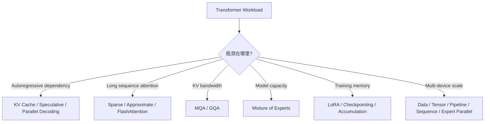

> 书目：*Hands-On Machine Learning with Scikit-Learn and PyTorch*<br>
> 章节：Chapter 17, Speeding Up Transformers<br>
> 本地章节导言：17. Speeding Up Transformers.md<br>
> 官方在线 Notebook：<https://github.com/ageron/handson-mlp/blob/main/17_speeding_up_transformers.ipynb>

---

## 阅读导引

### 本章为什么存在

Transformer 的能力来自大规模参数、长上下文和全局 attention，但这三点也分别带来模型内存、序列计算和通信瓶颈。本章不寻找单一“加速按钮”，而是先定位瓶颈，再按推理、attention、模型容量和训练四个层面处理：

1. **Faster decoding**：KV cache、speculative decoding、并行/批处理生成；
2. **Boosting MHA**：sparse/approximate attention、MQA/GQA、FlashAttention；
3. **Scaling with MoE**：参数量增长但每 token 只激活少量 experts；
4. **Faster training**：PEFT/LoRA、activation checkpointing、packing、gradient accumulation 和多维 parallelism。



### 证据与运行边界

第 17 章是 online-only：本地 Markdown 只有 10 行导言；作者官方 Notebook 包含示例代码，但 MoE、部分训练技术和 exercise solutions 尚未完成。因此本文以本地导言规定的技术顺序为主线，以官方 Notebook 的代码和保存输出校准示例，并将必要理论完整补齐。

当前 VS Code/Pylance 解释器为 `.venv`，Python 3.12、PyTorch 2.11.0 CPU、无 CUDA；当前没有 `transformers`、`datasets`、`peft`。纯 PyTorch 代码本地执行，依赖大型 checkpoint/GPU 的示例只做语法检查并明确标注，不把官方输出冒充本机结果。

### 一句话概括

$$
\boxed{
\text{加速 Transformer 的本质是减少重复计算、避免二次中间量、降低数据搬运，}
\text{并在计算、内存、通信、精度和工程复杂度之间做显式交换。}
}
$$

---

## 0. 性能分析前置知识

### 0.1 Latency、Throughput 与用户体验

| 指标 | 定义 | 主要影响因素 |
| --- | --- | --- |
| TTFT | Time To First Token | prompt 长度、prefill、queue |
| TPOT / ITL | 每个后续 token 时间 | decode、KV bandwidth、batch |
| End-to-end latency | 请求到完整响应 | TTFT + generated tokens × TPOT |
| Throughput | 每秒处理 tokens/requests | batching、device utilization |
| Memory footprint | weights + KV + activations | dtype、context、batch |

优化 throughput 可能损害 latency：增大 batch 能提高 GPU utilization，却让请求排队更久。必须先确定 service-level objective，而不是只报告“快了几倍”。

### 0.2 Prefill 与 Decode 是两种不同 Workload

对长度 $S$ 的 prompt：

- **Prefill**：一次处理全部 prompt tokens，矩阵较大，容易 compute-bound；
- **Decode**：每一步只产生一个 token，却要读取全部 model weights 和过去 KV，矩阵很“瘦”，常 memory-bandwidth-bound。

所以让 prefill 更快的技术未必改善 TPOT；KV cache 主要消除 decode 的重复 projection，而不会让首次 prompt processing 消失。

### 0.3 FLOPs 不等于 Wall Time

简化 roofline model：

$$
T\gtrsim\max\left(
\frac{\text{FLOPs}}{\text{peak FLOPs/s}},
\frac{\text{bytes moved}}{\text{memory bandwidth}}
\right)
$$

Arithmetic intensity：

$$
I=\frac{\text{FLOPs}}{\text{bytes moved}}
$$

$I$ 低时 memory-bound，减少 FLOPs 未必明显加速；FlashAttention 的关键就是减少 HBM traffic，而不是改变 exact attention 的渐近 FLOPs。

### 0.4 参数、训练状态和 KV 内存

仅 weights 的内存：

$$
M_{weights}=P\cdot b_w
$$

$P$ 是参数数，$b_w$ 是每参数 bytes。FP16/BF16 为 2 bytes，FP32 为 4 bytes。Mixed-precision Adam 粗略还可能保存 gradients、FP32 master weights、两组 FP32 moments，总量常接近 16 bytes/parameter，但具体取决于 optimizer、sharding 和 implementation。

Decoder KV cache（不计 allocator overhead）：

$$
\boxed{
M_{KV}=2LBTn_{kv}d_hb
}
$$

- 2：K 和 V；
- $L$：layers；
- $B$：active sequences；
- $T$：已缓存 tokens；
- $n_{kv}$：key/value heads；
- $d_h$：head dimension；
- $b$：每元素 bytes。

这个公式解释了为什么长 context/high concurrency 下，KV cache 而非 weights 可能成为 serving bottleneck。

```python
def kv_cache_megabytes(layers, batch, tokens, kv_heads,
                       head_dim, bytes_per_value=2):
    total_bytes = (
        2 * layers * batch * tokens * kv_heads
        * head_dim * bytes_per_value
    )
    return total_bytes / 1024**2


standard = kv_cache_megabytes(
    layers=32, batch=1, tokens=4096,
    kv_heads=32, head_dim=128,
)
grouped = kv_cache_megabytes(
    layers=32, batch=1, tokens=4096,
    kv_heads=8, head_dim=128,
)
print(f"标准 MHA KV: {standard:.0f} MiB")
print(f"8 个 KV heads: {grouped:.0f} MiB")
```

输出：

```text
标准 MHA KV: 2048 MiB
8 个 KV heads: 512 MiB
```

### 0.5 公平 Benchmark 的最低要求

- 固定 model、prompt/output lengths、batch/concurrency、sampling 和 dtype；
- warm up kernels，分开记录 cold start 与 steady state；
- 同时测 TTFT、TPOT、throughput、peak memory 和 output quality；
- GPU benchmark 前后 `torch.cuda.synchronize()`；
- 报告 hardware、software versions、quantization、cache 和 compiler settings；
- 近似算法必须同时报告 quality degradation，而非只报速度。

---

## 1. Faster Decoding at Inference Time

### 1.1 Key/Value Caching

### 1.1.1 重复计算从哪里来

第 $t$ 个 decode step 的 self-attention：

$$
q_t=x_tW_Q,
\quad
K_{1:t}=X_{1:t}W_K,
\quad
V_{1:t}=X_{1:t}W_V
$$

$$
o_t=softmax\left(
\frac{q_tK_{1:t}^T}{\sqrt{d_h}}
\right)V_{1:t}
$$

过去 token 的 hidden states 在该 layer 已经固定，因此过去 $K,V$ 每步重算毫无必要。KV cache 保存 $K_{1:t-1},V_{1:t-1}$，新一步只投影 $k_t,v_t$ 并 append：

$$
K_{1:t}=[K_{1:t-1};k_t],
\qquad
V_{1:t}=[V_{1:t-1};v_t]
$$

### 1.1.2 复杂度变化

只看 attention scores。若每一步对完整长度 $t$ 的 sequence 重新做 causal attention，累计成本：

$$
\sum_{t=1}^{G}O(t^2d_h)=O(G^3d_h)
$$

使用 cache 后，第 $t$ 步只有一个新 query 读取 $t$ 个 keys：

$$
\sum_{t=1}^{G}O(td_h)=O(G^2d_h)
$$

此外，过去 tokens 的 Q/K/V、FFN 和其他 layer 运算也不再重算。实际 generation 还包含 prompt 长度 $S$，第 $g$ 步读取 $S+g$ 个 cached keys。Cache 不改变 autoregressive dependency：仍要顺序产生 token。

### 1.1.3 输出等价性验证

下面省略 output projection，只验证同一 Q/K/V projections 下，全序列 causal attention 与逐 token cached attention 等价：

```python
import torch
import torch.nn.functional as F


def split_heads(values, num_heads):
    batch, length, model_dim = values.shape
    head_dim = model_dim // num_heads
    return values.reshape(
        batch, length, num_heads, head_dim
    ).transpose(1, 2)


def merge_heads(values):
    batch, num_heads, length, head_dim = values.shape
    return values.transpose(1, 2).reshape(
        batch, length, num_heads * head_dim
    )


def full_causal_attention(inputs, weights, num_heads):
    query = split_heads(inputs @ weights[0], num_heads)
    key = split_heads(inputs @ weights[1], num_heads)
    value = split_heads(inputs @ weights[2], num_heads)
    output = F.scaled_dot_product_attention(
        query, key, value, is_causal=True
    )
    return merge_heads(output)


def cached_causal_attention(inputs, weights, num_heads):
    cached_keys = []
    cached_values = []
    outputs = []
    for token_index in range(inputs.shape[1]):
        token = inputs[:, token_index:token_index + 1]
        query = split_heads(token @ weights[0], num_heads)
        key = split_heads(token @ weights[1], num_heads)
        value = split_heads(token @ weights[2], num_heads)
        cached_keys.append(key)
        cached_values.append(value)
        all_keys = torch.cat(cached_keys, dim=2)
        all_values = torch.cat(cached_values, dim=2)
        # 当前 token 可读取 cache 中全部过去和当前位置，无需 causal mask
        output = F.scaled_dot_product_attention(
            query, all_keys, all_values
        )
        outputs.append(merge_heads(output))
    return torch.cat(outputs, dim=1)


torch.manual_seed(42)
inputs = torch.randn(2, 6, 16)
weights = tuple(torch.randn(16, 16) for _ in range(3))
full_output = full_causal_attention(inputs, weights, num_heads=4)
cached_output = cached_causal_attention(inputs, weights, num_heads=4)
print("输出 shape:", cached_output.shape)
print("最大绝对误差:",
      (full_output - cached_output).abs().max().item())
```

本机输出：

```text
输出 shape: torch.Size([2, 6, 16])
最大绝对误差: 3.814697265625e-06
```

误差应在浮点舍入范围内。此测试也避免一个常见陷阱：对单个新 query 直接设置 `is_causal=True` 时，不同 API 对非方形 causal alignment 的语义可能不同；显式传入“只有合法历史”的 cache 更清楚。

### 1.1.4 官方示例与适用边界

官方 Notebook 用 OPT-125M greedy 生成 500 tokens：

```text
use_cache=True  -> wall time 4.62 s
use_cache=False -> wall time 10.7 s
```

这是特定 Colab/GPU run，不是通用倍数。Cache 的代价：

- 显存按 layers × batch × context 线性增长；
- request 长度不同会造成 fragmentation；
- beam search 为每条 beam 保存/reorder cache；
- sliding-window attention 只需保留窗口内 KV，但会丢远程直接访问；
- PagedAttention 将 KV 分页管理，减少连续大块分配与 fragmentation；
- prefix caching 可让共享 system prompt 的请求复用 KV，但需严格按 model/token sequence/version 隔离，避免串扰。

```python
from transformers import AutoModelForCausalLM, AutoTokenizer

model_id = "facebook/opt-125m"
tokenizer = AutoTokenizer.from_pretrained(model_id)
language_model = AutoModelForCausalLM.from_pretrained(
    model_id, device_map="auto"
)
model_inputs = tokenizer(
    "Once upon a time there lived", return_tensors="pt"
).to(language_model.device)
generated = language_model.generate(
    **model_inputs,
    max_new_tokens=100,
    do_sample=False,
    use_cache=True,
)
print(tokenizer.decode(generated[0], skip_special_tokens=True))
```

### 1.2 Speculative Decoding

### 1.2.1 为什么一个小 Draft Model 能加速大模型

Autoregressive target model $p$ 每步只产生一个 token，GPU 对单 token decode utilization 较低。较小 draft model $q$ 快速提出 $K$ 个 tokens；target 用一次并行 forward 同时验证整段。若大部分 proposals 被接受，一次昂贵 target call 可推进多个 tokens。

要求通常包括：相同 tokenizer/vocabulary，draft 足够快且与 target 分布接近。Draft 太弱则 acceptance rate 低；太大则 proposal 本身太贵。

### 1.2.2 保持 Target Distribution 不变的接受规则

Draft 采样候选 $x\sim q$，接受概率：

$$
a(x)=\min\left(1,\frac{p(x)}{q(x)}\right)
$$

若拒绝，则从 residual distribution 采样：

$$
r(x)=\frac{[p(x)-q(x)]_+}
{\sum_y[p(y)-q(y)]_+}
$$

其中 $[z]_+=\max(z,0)$。为什么最终仍精确服从 $p$？

接受路径输出 $x$ 的 probability mass：

$$
q(x)a(x)=\min(q(x),p(x))
$$

总拒绝概率：

$$
P(R)=1-\sum_y\min(q(y),p(y))
=\sum_y[p(y)-q(y)]_+
$$

拒绝后输出 $x$ 的 mass：

$$
P(R)r(x)=[p(x)-q(x)]_+
$$

两条路径相加：

$$
\min(q(x),p(x))+[p(x)-q(x)]_+=p(x)
$$

所以单步 distribution 完全等于 target。多 token algorithm 从左到右验证；一旦拒绝，在该位置用 residual 重采样并丢弃之后 draft tokens；若整段全接受，还可从 target 多采一个 token。

```python
target = torch.tensor([0.55, 0.30, 0.15])
draft = torch.tensor([0.40, 0.40, 0.20])
accepted_mass = torch.minimum(target, draft)
rejected_probability = 1 - accepted_mass.sum()
residual = (target - draft).clamp_min(0)
residual = residual / residual.sum()
reconstructed = accepted_mass + rejected_probability * residual
print("接受路径:", accepted_mass.tolist())
print("拒绝概率:", round(rejected_probability.item(), 4))
print("最终分布:", reconstructed.tolist())
print("等于 target:", torch.allclose(reconstructed, target))
```

本机输出的最终分布约为 `[0.55,0.30,0.15]`，`等于 target: True`。

### 1.2.3 Greedy Assisted Generation 与 Sampling

Greedy 模式只需 target 检查 draft token 是否等于 target argmax；不等时采用 target token。Sampling 模式必须使用上面的 acceptance/residual correction，不能简单“target 不喜欢就重采”，否则会改变 distribution。

```python
from transformers import set_seed

set_seed(42)
target_model = AutoModelForCausalLM.from_pretrained(
    "facebook/opt-350m", device_map="auto"
)
draft_model = AutoModelForCausalLM.from_pretrained(
    "facebook/opt-125m", device_map="auto"
)
tokenizer = AutoTokenizer.from_pretrained("facebook/opt-350m")
inputs = tokenizer(
    "Once upon a time there lived", return_tensors="pt"
).to(target_model.device)
outputs = target_model.generate(
    **inputs,
    max_new_tokens=100,
    do_sample=True,
    temperature=1.0,
    assistant_model=draft_model,
)
print(tokenizer.decode(outputs[0], skip_special_tokens=True))
```

收益取决于 acceptance length、target parallel verification efficiency、draft cost 和额外 KV memory。两个 models 都要驻留内存；高 batch serving 中，speculation 还可能增加 scheduling complexity。

### 1.3 Parallelizing Text Generation

Autoregressive factorization：

$$
p(y_{1:G}\mid x)=\prod_{t=1}^{G}p(y_t\mid x,y_{<t})
$$

意味着单条 sequence 的精确 ancestral sampling 存在先后依赖，不能像 training 一样一次得到所有 tokens。所谓 parallel generation 有几种不同含义：

### 1.3.1 Request-Level Parallelism

- **Static batching**：同一时刻处理一批 requests，padding 到统一长度；
- **Continuous batching**：完成的 sequence 立即移出，新请求持续插入，减少 padding/空槽；
- **Chunked prefill**：长 prompt 分块，避免其 prefill 阻塞短 decode requests；
- **Beam parallelism**：同一请求的多条 beams 并行，但 KV memory 随 beams 增长。

这些方法提高 aggregate throughput，不消除单序列 token dependency。

### 1.3.2 一次提出多个 Token Candidates

- **Speculative tree / multi-token heads**：小 heads（如 Medusa-style）并行提出多分支，target 一次验证 tree；
- **Blockwise parallel decoding**：并行预测未来多个 positions，再由 target 接受最长正确 prefix；
- **Lookahead/Jacobi decoding**：把 sequence 看成 fixed-point problem，对多个 positions 迭代更新；
- **Non-autoregressive/iterative masked generation**：一次预测所有 positions，再多轮 refine，常用于 translation/image tokens。

它们以额外 proposals、训练 heads 或近似假设换更少 sequential target calls。必须区分：是否严格保持 target distribution、是否只保持 greedy output、是否牺牲 quality。

### 1.3.3 Stop Conditions 与实际限制

EOS、不同 output lengths、sampling randomness 和 tool calls 会造成 control-flow divergence。GPU 上“并行更多”也不保证更快：如果 memory bandwidth、KV capacity 或 scheduler 已饱和，额外 branches 可能降低 throughput。

---

## 2. Boosting Multi-Head Attention

### 2.1 Baseline：成本到底在哪里

单个 head：

$$
Attention(Q,K,V)
=softmax\left(\frac{QK^T}{\sqrt{d_h}}+M\right)V
$$

若 query/key length 都为 $N$：

- 计算 $QK^T$：$O(N^2d_h)$；
- 保存 score/probability matrix：$O(N^2)$；
- probability 乘 $V$：$O(N^2d_v)$。

长 sequence 的优化路线不同：

| 路线 | 是否改变数学结果 | 核心办法 |
| --- | --- | --- |
| Sparse attention | 改变可见连接 | 只算选定 token pairs |
| Approximate attention | 近似 dense softmax | LSH / random features |
| MQA/GQA | 主要共享 K/V | 减少 projection/cache/bandwidth |
| FlashAttention | 理论上 exact | Tiling + online softmax，减少 HBM I/O |

### 2.2 Sparse Attention 与 BigBird

#### 2.2.1 从 Full Graph 到 Sparse Graph

Dense attention 把每个 token 当 graph node，并连接所有 ordered pairs。BigBird 保留三类 edges：

1. **Local/sliding-window**：读取邻近 $w$ 个 tokens；
2. **Global tokens**：少量 $g$ 个 tokens 与所有 tokens 双向连接；
3. **Random links**：每个 token/block 额外连接 $r$ 个随机远程位置。

复杂度约：

$$
O\left(N(w+g+r)d_h\right)
$$

$w,g,r$ 固定时对 $N$ 线性。Local edges 保留邻近语法，global edges 聚合全局任务信息，random edges 缩短 sparse graph 的长距离路径。理论 universal approximation/Turing-completeness 结论依赖特定 global/random connectivity 和足够层数，不代表任意 sparse mask 都等价于 dense attention。

BigBird 常以 blocks 为单位稀疏，方便 kernel 形成规则矩阵块。若 sequence 太短，sparse kernel overhead 不划算，implementation 会退回 full attention。官方 14-token fill-mask 示例低于其 sparse threshold 704，因此实际 fallback 为 full attention。

```python
from transformers import pipeline

fill_mask = pipeline(
    task="fill-mask", model="google/bigbird-roberta-base"
)
print(fill_mask(
    "She was feeling unwell so she took some [MASK] medicine."
))
```

官方保存 top prediction 是 `pain medicine`，score 约 0.2819。这个短样本只能验证 API，不能 benchmark sparse scaling。

#### 2.2.2 局限与替代

- Task 需要任意 token pair 直接交互时，固定 sparse pattern 可能漏信息；
- Random pattern 会增加 reproducibility/kernel complexity；
- 理论 FLOPs 降低只有在硬件支持 block-sparse kernel 时才转化为 wall-time；
- Longformer 使用 sliding window + global tokens；Routing Transformer 学习内容路由；Swin 在视觉中用规则 windows。

### 2.3 Reformer：LSH Approximate Attention

#### 2.3.1 直觉

Attention 最大权重通常来自 query/key 方向相近的 pairs。Locality-Sensitive Hashing（LSH）把相似 vectors 以较高概率分入同 bucket，只在同/邻 bucket 内计算 attention，从而避免完整 $N^2$ pairs。

Angular LSH 的一个简单版本：随机矩阵 $R\in\mathbb R^{d\times k/2}$，对 normalization vector $x$ 计算：

$$
h(x)=\arg\max\left([x^TR;-x^TR]\right)
$$

随机 hyperplanes 将方向空间分区。两个 vectors 夹角越小，投影 signs/extrema 越可能相同。实际 Reformer 使用多轮 hashing、sort by bucket、chunk 内 attention，并让相邻 chunks 交互以降低 bucket boundary error。

```python
def angular_lsh(vectors, num_buckets):
    if num_buckets % 2:
        raise ValueError("num_buckets 必须是偶数")
    random_planes = torch.randn(
        vectors.shape[-1], num_buckets // 2,
        device=vectors.device,
    )
    normalized = F.normalize(vectors, p=2.0, dim=-1)
    projections = normalized @ random_planes
    signed_projections = torch.cat(
        [projections, -projections], dim=-1
    )
    return signed_projections.argmax(dim=-1)


torch.manual_seed(42)
vectors = torch.rand(16, 512)
print(angular_lsh(vectors, num_buckets=4).tolist())
```

官方 Notebook 输出 buckets：

```text
[2, 2, 0, 3, 0, 2, 2, 2, 2, 1, 1, 3, 3, 1, 2, 1]
```

#### 2.3.2 Complexity 与误差来源

Hash/sort 通常约 $O(N\log N)$，bucket attention 约 $O(Nbd_h)$，$b$ 是 bucket/chunk size。多 hash rounds 提高 recall，但成比例增加 compute。

局限：hash 是随机离散操作；相似但跨 bucket 的 pairs 会丢失；causal masking、padding 和不同长度增加实现难度；短 sequence 未必比 optimized dense kernel 快。Reformer 还用 reversible layers 降 activation memory，但这是与 LSH attention 独立的另一技巧。

### 2.4 Performer：FAVOR+ Linear Attention

#### 2.4.1 Softmax Kernel 的 Random-Feature 恒等式

忽略 mask，softmax attention 第 $i$ 行：

$$
o_i=
\frac{\sum_j\exp(q_i^Tk_j/\sqrt d)v_j}
{\sum_j\exp(q_i^Tk_j/\sqrt d)}
$$

定义缩放 $q'=q/d^{1/4}$、$k'=k/d^{1/4}$，则 $q'^Tk'=q^Tk/\sqrt d$。

取 $w\sim\mathcal N(0,I)$。Gaussian moment-generating function：

$$
\mathbb E_w[\exp(w^Tx)]
=\exp\left(\frac12\|x\|^2\right)
$$

定义正 random feature：

$$
\phi_w(x)=\exp\left(w^Tx-\frac12\|x\|^2\right)
$$

于是：

$$
\begin{aligned}
\mathbb E[\phi_w(q')\phi_w(k')]
&=\exp\left(-\frac{\|q'\|^2+\|k'\|^2}{2}\right)
\mathbb E\left[\exp(w^T(q'+k'))\right]\\
&=\exp\left(-\frac{\|q'\|^2+\|k'\|^2}{2}
{}+\frac{\|q'+k'\|^2}{2}\right)\\
&=\exp(q'^Tk')\\
&=\exp(q^Tk/\sqrt d)
\end{aligned}
$$

用 $m$ 个 samples 做 Monte Carlo：

$$
\phi(x)=\frac{1}{\sqrt m}
\left[\phi_{w_1}(x),\ldots,\phi_{w_m}(x)\right]
$$

则 $\phi(q)^T\phi(k)$ 无偏近似 exponential kernel。

#### 2.4.2 利用 Associativity 变成 Linear Attention

令 $Q'=\phi(Q),K'=\phi(K)$：

$$
O\approx D^{-1}Q'(K'^TV)
$$

$$
D=\operatorname{diag}\left(Q'(K'^T\mathbf1)\right)
$$

关键是先算 $K'^TV$，而不是先 materialize $Q'K'^T$：

- Dense：$O(N^2d)$；
- FAVOR+：约 $O(Nmd+Nmd_v)$；
- 当 random-feature 数 $m\ll N$ 时，对 sequence length 线性。

Causal 情况可维护 prefix sums $\sum_{j\le i}\phi(k_j)v_j^T$ 和 $\sum_{j\le i}\phi(k_j)$，仍然线性。

#### 2.4.3 可运行的 FAVOR+ 近似

```python
import torch.nn as nn


def positive_random_features(values, projection):
    squared_norm = values.square().sum(dim=-1, keepdim=True) / 2
    projected = values @ projection
    # 输入规模较小时可直接按定义计算；生产实现需更完整的数值稳定化
    return torch.exp(projected - squared_norm) / projection.shape[-1]**0.5


def orthogonal_random_matrix(dimension, num_features):
    chunks = []
    remaining = num_features
    while remaining > 0:
        gaussian = torch.randn(dimension, dimension)
        orthogonal, _ = torch.linalg.qr(gaussian)
        take = min(remaining, dimension)
        chunks.append(orthogonal[:, :take])
        remaining -= take
    return torch.cat(chunks, dim=1) * dimension**0.5


def favor_attention(query, key, value, projection):
    head_dim = query.shape[-1]
    scale = head_dim**-0.25
    query_features = positive_random_features(
        query * scale, projection
    )
    key_features = positive_random_features(
        key * scale, projection
    )
    key_value_summary = key_features.transpose(-2, -1) @ value
    denominator = query_features @ key_features.sum(
        dim=-2, keepdim=True
    ).transpose(-2, -1)
    numerator = query_features @ key_value_summary
    return numerator / denominator.clamp_min(1e-6)


torch.manual_seed(42)
batch_size, sequence_length, head_dim = 2, 64, 32
query = torch.randn(batch_size, sequence_length, head_dim) * 0.3
key = torch.randn(batch_size, sequence_length, head_dim) * 0.3
value = torch.randn(batch_size, sequence_length, head_dim)
projection = orthogonal_random_matrix(head_dim, num_features=256)
approximate = favor_attention(query, key, value, projection)
exact = F.scaled_dot_product_attention(
    query[:, None], key[:, None], value[:, None]
)[:, 0]
rmse = F.mse_loss(approximate, exact).sqrt()
print("输出 shape:", approximate.shape)
print("FAVOR+ RMSE:", round(rmse.item(), 4))
```

本机输出：`torch.Size([2,64,32])`，RMSE `0.0072`。

Official Notebook 在更大的 random example 中，attention matrix approximation RMSE 从 `0.0171` 降到 `0.0160`（orthogonal features），最终 attention output RMSE 为 `0.1599`。误差依 data scale、$m$、stabilization 和 random seed 而变。

#### 2.4.4 边界

Random features 越多，variance 越低但速度/内存越差；orthogonal features 只是降 variance，不消除 approximation。Numerical overflow/underflow 需要 max subtraction 等稳定技巧。对现代 GPU 上中等 sequence，FlashAttention exact kernel 可能更快；Performer 更适合极长 sequence 且可接受近似误差的场景。

### 2.5 Sharing Projections：MHA、MQA 与 GQA

#### 2.5.1 三种结构

设 query heads 为 $h$，KV groups 为 $g$：

- **MHA**：$g=h$，每个 query head 有独立 K/V；
- **MQA**：$g=1$，所有 query heads 共用一组 K/V；
- **GQA**：$1<g<h$，每 $h/g$ 个 query heads 共用一组 K/V。

Q projection 仍输出 $h d_h=d_{model}$ 维；K/V 只输出 $g d_h$ 维。K/V projection 参数从 MHA 的：

$$
2d_{model}(hd_h)=2d_{model}^2
$$

降到：

$$
2d_{model}(gd_h)
$$

KV cache 和 decode 时 K/V bandwidth 同样按 $h/g$ 倍缩小。MQA 最省但可能降低质量；GQA 在 quality 与 serving efficiency 之间折中。

```python
torch.manual_seed(42)
batch_size, query_length, key_length = 2, 5, 7
query_heads, kv_heads, head_dim = 8, 2, 16
query = torch.randn(
    batch_size, query_heads, query_length, head_dim
)
key = torch.randn(batch_size, kv_heads, key_length, head_dim)
value = torch.randn(batch_size, kv_heads, key_length, head_dim)
grouped_output = F.scaled_dot_product_attention(
    query, key, value, enable_gqa=True
)
print("GQA 输出:", grouped_output.shape)
print("KV cache 缩减倍数:", query_heads // kv_heads)
```

本机输出：`torch.Size([2,8,5,16])`，KV cache 缩减 4 倍。

`enable_gqa=True` 要求 query heads 可被 KV heads 整除，K/V head 数相同；backend/device 支持范围随 PyTorch 版本变化，需用目标 hardware benchmark。PyTorch 可能内部 repeat K/V；语义正确不代表一定获得理想 memory saving。

### 2.6 FlashAttention

#### 2.6.1 它解决的是 I/O，而不是数学近似

Standard implementation 往往把 $S=QK^T$ 和 $P=softmax(S)$ 的 $N\times N$ 中间矩阵写入高带宽显存（HBM），再读回计算 $PV$。HBM 容量大但远慢于 on-chip SRAM。

FlashAttention 将 Q/K/V 分块搬入 SRAM，边计算边维护 softmax statistics，不把完整 $S,P$ materialize 到 HBM。结果与 dense attention 数学等价（浮点运算顺序不同），渐近 FLOPs 仍是 $O(N^2d)$，但 HBM traffic 和 peak memory 显著降低。

#### 2.6.2 Online Softmax 推导

对一个 query row，已处理旧 blocks，维护：

$$
m=\max_j s_j,
\quad
\ell=\sum_j e^{s_j-m},
\quad
o=\sum_j e^{s_j-m}v_j
$$

新 block 的 statistics 为 $m_b,\ell_b,o_b$。合并最大值：

$$
m'=\max(m,m_b)
$$

旧指数以 $m$ 为基准，换到 $m'$ 要乘 $e^{m-m'}$；新 block 同理：

$$
\ell'=e^{m-m'}\ell+e^{m_b-m'}\ell_b
$$

$$
o'=e^{m-m'}o+e^{m_b-m'}o_b
$$

全部 blocks 处理后：

$$
Attention=o/\ell
$$

这就是不保存整行 scores 仍能精确 normalization 的依据。

#### 2.6.3 教学版 Tiled Exact Attention

```python
def tiled_exact_attention(query, key, value,
                          query_block_size=32,
                          key_block_size=32):
    query_length, head_dim = query.shape
    key_length = key.shape[0]
    output = torch.empty(
        query_length, value.shape[-1],
        device=query.device, dtype=query.dtype,
    )
    scale = head_dim**-0.5

    for query_start in range(0, query_length, query_block_size):
        query_end = min(query_start + query_block_size, query_length)
        query_block = query[query_start:query_end]
        rows = query_block.shape[0]
        row_max = torch.full(
            (rows, 1), -torch.inf,
            device=query.device, dtype=query.dtype,
        )
        row_sum = torch.zeros(
            rows, 1, device=query.device, dtype=query.dtype
        )
        row_accumulator = torch.zeros(
            rows, value.shape[-1],
            device=query.device, dtype=query.dtype,
        )

        for key_start in range(0, key_length, key_block_size):
            key_end = min(key_start + key_block_size, key_length)
            key_block = key[key_start:key_end]
            value_block = value[key_start:key_end]
            scores = query_block @ key_block.T * scale
            new_max = torch.maximum(
                row_max, scores.max(dim=-1, keepdim=True).values
            )
            old_correction = torch.exp(row_max - new_max)
            block_weights = torch.exp(scores - new_max)
            row_sum = (
                row_sum * old_correction
                + block_weights.sum(dim=-1, keepdim=True)
            )
            row_accumulator = (
                row_accumulator * old_correction
                + block_weights @ value_block
            )
            row_max = new_max

        output[query_start:query_end] = row_accumulator / row_sum
    return output


torch.manual_seed(42)
query = torch.randn(70, 32)
key = torch.randn(83, 32)
value = torch.randn(83, 24)
tiled = tiled_exact_attention(
    query, key, value,
    query_block_size=16, key_block_size=20,
)
dense = F.softmax(query @ key.T / 32**0.5, dim=-1) @ value
print("非整除 block 也可运行:", tiled.shape)
print("MSE:", F.mse_loss(tiled, dense).item())
```

本机输出：shape `[70,24]`，MSE `1.5291022046243262e-15`。

官方教学实现只处理 lengths 恰好整除 block size，保存 MSE 为 `8.0755e-16`；这里的版本同时处理尾部 blocks，但未实现 batch、heads、mask、dropout 和 backward，不能替代 optimized kernel。

#### 2.6.4 Backward 与 PyTorch SDPA

Backward 可从保存的 row statistics 重算局部 probabilities，减少 activation memory，以额外 FLOPs 换显存/I/O。FlashAttention-2 改善 work partitioning，后续版本利用新 GPU instructions；实际支持依赖 dtype、head dimension、mask、device 和 library version。

```python
attention_output = F.scaled_dot_product_attention(
    query[None, None],
    key[None, None],
    value[None, None],
)
print(attention_output.shape)
```

不要根据 API 名字断言正在使用 Flash kernel；应查看 profiler/backend 日志，并在目标 hardware 实测。

---

## 3. Scaling Up with Mixture of Experts

### 3.1 为什么 Dense FFN 限制模型容量

Transformer block 中 FFN：

$$
FFN(x)=W_2\sigma(W_1x+b_1)+b_2
$$

若 $d_{ff}\approx4d_{model}$，两矩阵参数约：

$$
d_{model}d_{ff}+d_{ff}d_{model}
\approx8d_{model}^2
$$

通常多于 attention projections。Dense model 对每个 token 激活全部 FFN 参数；参数量和每-token FLOPs 同步增长。Mixture of Experts（MoE）把一个 FFN 替换为 $E$ 个 experts，但每 token 只选择 $k\ll E$ 个，实现**条件计算**：总容量可以很大，active compute 仍接近 $k$ 个 FFN。

### 3.2 Router 与 Top-k Experts

对 token representation $x\in\mathbb R^d$，router logits/probabilities：

$$
r=W_rx+b_r,
\qquad
p_e(x)=\frac{e^{r_e}}{\sum_{j=1}^{E}e^{r_j}}
$$

选 top-$k$ 集合 $S(x)$，在选中 experts 内重新 normalization：

$$
    ilde p_e(x)=
\frac{p_e(x)}{\sum_{j\in S(x)}p_j(x)},
\qquad e\in S(x)
$$

输出：

$$
\boxed{
y=\sum_{e\in S(x)}\tilde p_e(x)f_e(x)
}
$$

Switch Transformer 常用 top-1，routing 简单；top-2（如 Mixtral-style）冗余和质量通常更好，但 expert compute/communication 约翻倍。

Top-k index 是离散选择，gradient 只经过选中的 gate weights/experts；未选 experts 没有主任务 gradient。Noisy routing、auxiliary loss 和更大 token batches 帮助探索与均衡。

### 3.3 Expert Capacity 与 Token Overflow

一批共有 $N$ tokens，top-$k$ 共产生 $kN$ 次 assignments。理想每 expert 负载 $kN/E$。Capacity 常设为：

$$
C=\left\lceil
c_{factor}\frac{kN}{E}
\right\rceil
$$

$c_{factor}>1$ 留出不均衡余量。超过 $C$ 的 tokens 可能被丢弃、送次优 expert、留在 residual path 或延迟处理。Capacity 太小会损 quality，太大则 padding/idle compute 增多。

### 3.4 为什么需要 Load-Balancing Loss

若 router 把所有 tokens 送一个 expert，其他 experts 闲置，热门 expert overflow。定义：

- $f_e$：实际分给 expert $e$ 的 assignment fraction；
- $P_e=\frac1N\sum_xp_e(x)$：平均 router probability。

常见辅助项：

$$
\mathcal L_{balance}
=\alpha E\sum_{e=1}^{E}f_eP_e
$$

均匀时 $f_e=P_e=1/E$，未乘 $\alpha$ 的值为 1。若 hard load 和 probability 同时集中，内积增大。这个 loss 不是严格保证：task/domain 本身可能使专家需求不均，过强均衡会阻止 specialization。

Router z-loss：

$$
\mathcal L_z
=\beta\frac1N\sum_x
\left(\log\sum_e e^{r_e(x)}\right)^2
$$

限制 router logits 尺度，改善 low-precision numerical stability。

### 3.5 可运行的 Top-2 MoE

```python
class TopKMoE(nn.Module):
    def __init__(self, model_dim, hidden_dim,
                 num_experts=4, top_k=2):
        super().__init__()
        if not 1 <= top_k <= num_experts:
            raise ValueError("top_k 必须位于 [1, num_experts]")
        self.num_experts = num_experts
        self.top_k = top_k
        self.router = nn.Linear(model_dim, num_experts, bias=False)
        self.experts = nn.ModuleList([
            nn.Sequential(
                nn.Linear(model_dim, hidden_dim),
                nn.GELU(),
                nn.Linear(hidden_dim, model_dim),
            )
            for _ in range(num_experts)
        ])

    def forward(self, inputs):
        original_shape = inputs.shape
        tokens = inputs.reshape(-1, original_shape[-1])
        router_probabilities = F.softmax(self.router(tokens), dim=-1)
        top_weights, top_indices = torch.topk(
            router_probabilities, self.top_k, dim=-1
        )
        top_weights = top_weights / top_weights.sum(
            dim=-1, keepdim=True
        )

        outputs = torch.zeros_like(tokens)
        loads = torch.zeros(
            self.num_experts, device=inputs.device
        )
        for route in range(self.top_k):
            route_experts = top_indices[:, route]
            for expert_index, expert in enumerate(self.experts):
                token_indices = torch.nonzero(
                    route_experts == expert_index,
                    as_tuple=False,
                ).flatten()
                if token_indices.numel() == 0:
                    continue
                expert_output = expert(tokens[token_indices])
                weighted_output = expert_output * top_weights[
                    token_indices, route, None
                ]
                outputs.index_add_(0, token_indices, weighted_output)
                loads[expert_index] += token_indices.numel()

        dispatch_fraction = loads / (len(tokens) * self.top_k)
        mean_probability = router_probabilities.mean(dim=0)
        balance_loss = self.num_experts * (
            dispatch_fraction * mean_probability
        ).sum()
        return outputs.reshape(original_shape), balance_loss, loads


torch.manual_seed(42)
moe = TopKMoE(
    model_dim=16, hidden_dim=32,
    num_experts=4, top_k=2,
)
moe_inputs = torch.randn(2, 6, 16)
moe_output, balance_loss, loads = moe(moe_inputs)
loss = moe_output.square().mean() + 0.01 * balance_loss
loss.backward()
print("输出 shape:", moe_output.shape)
print("expert loads:", loads.int().tolist())
print("balance loss:", round(balance_loss.item(), 4))
print("router 有梯度:", moe.router.weight.grad is not None)
print("expert 有梯度:",
      any(parameter.grad is not None
          for expert in moe.experts
          for parameter in expert.parameters()))
```

本机输出：

```text
输出 shape: torch.Size([2, 6, 16])
expert loads: [6, 7, 4, 7]
balance loss: 1.0171
router 有梯度: True
expert 有梯度: True
```

该教学实现没有 capacity limit，也用 Python loops，目的是验证公式，不是高性能 kernel。Production 会先按 expert 对 tokens 排序/dispatch，批量执行 expert GEMMs，再 combine outputs。

### 3.6 参数、计算与内存的真实关系

设每个 expert FFN 参数为 $P_f$：

- 总 expert 参数：$EP_f$；
- 每 token active FFN 参数/FLOPs：约 $kP_f$；
- 但 inference memory 通常仍需容纳全部 $E$ experts，除非 offload/shard；
- 小 batch 时每 expert token 很少，GEMM 过小，hardware utilization 差。

所以 MoE 的主要承诺是“以相近 FLOPs 增加容量”，不是“同一模型必然低 latency”。与小 dense model 比，MoE 可能更慢。

### 3.7 Expert Parallelism 与 All-to-All

不同 experts 分布到不同 devices：

1. 每个 device 计算本地 tokens 的 routes；
2. all-to-all 将 token representations 发给拥有目标 expert 的 device；
3. experts 计算；
4. 第二次 all-to-all 将 outputs 送回原 device。

通信时间可粗略表示：

$$
T_{comm}\approx\alpha+\frac{\text{bytes}}{\text{bandwidth}}
$$

$\alpha$ 是启动 latency。Load imbalance 会让所有 devices 等最慢 expert；跨节点带宽比 GPU 内存带宽低很多，routing locality 和 topology 极其重要。

### 3.8 失败模式与适用边界

- **Expert collapse**：少数 experts 垄断 tokens；
- **Overflow/token dropping**：capacity 不足造成信息损失；
- **Communication-bound**：FLOPs 少了，all-to-all 反而主导；
- **Memory-heavy**：总参数、checkpoint 和 serving residency 仍大；
- **Fine-tuning instability**：新 domain 改变 routing/load；
- **Interpretability overclaim**：expert specialization 可能是统计分工，不一定对应人类概念。

替代方案包括增大 dense model、增加 depth/width、parameter sharing、retrieval augmentation，或只在部分 layers 使用 MoE。

---

## 4. Faster Training

### 4.1 Parameter-Efficient Fine-Tuning

#### 4.1.1 为什么 Full Fine-Tuning 昂贵

Full fine-tuning 不只存 weights，还要为所有参数存 gradients 和 optimizer states。多任务/客户场景还要复制完整 checkpoint。PEFT 冻结 base model，只训练少量参数：

- trainable parameter/optimizer memory 显著下降；
- 每个任务只保存小 adapter；
- 但 forward/backward 仍穿过 base activations，计算和 activation memory 不会按参数比例同样下降。

#### 4.1.2 Bottleneck Adapters

在 frozen block 中加入小 residual module：

$$
h'=h+W_{up}\sigma(W_{down}h)
$$

$W_{down}\in\mathbb R^{r\times d}$、$W_{up}\in\mathbb R^{d\times r}$，$r\ll d$，每层约 $2dr$ trainable parameters。Adapters 增加 inference layers/latency，但可按任务热插拔。

其他 PEFT 包括 prompt tuning（学习 input soft tokens）、prefix tuning（每层学习 KV prefix）、IA3（学习 channel-wise scales）和 BitFit（只训练 biases）。

### 4.2 LoRA：Low-Rank Adaptation

#### 4.2.1 Low-Rank 假设与参数化

假设 task adaptation 所需 weight update $\Delta W$ 具有低 intrinsic rank。冻结：

$$
W_0\in\mathbb R^{d_{out}\times d_{in}}
$$

学习两个小矩阵：

$$
\Delta W=\frac{\alpha}{r}BA,
\quad
A\in\mathbb R^{r\times d_{in}},
\quad
B\in\mathbb R^{d_{out}\times r}
$$

Forward：

$$
y=W_0x+\frac{\alpha}{r}BAx
$$

Trainable parameters：

$$
r(d_{in}+d_{out})
$$

而 full matrix 有 $d_{in}d_{out}$。当 $r\ll\min(d_{in},d_{out})$，节省巨大。常见初始化让 $A$ random、$B=0$，因此初始 $\Delta W=0$，模型一开始与 base 完全相同。

$\alpha/r$ 控制 update scale；LoRA dropout 只用于训练 branch。训练后可把 $\Delta W$ merge 到 $W_0$，不增加 inference matmul；多个 adapters 也可不 merge，以便切换任务。

#### 4.2.2 可运行 LoRA Linear 与 Merge 验证

```python
class LoRALinear(nn.Module):
    def __init__(self, in_features, out_features,
                 rank=4, alpha=8.0, dropout=0.0):
        super().__init__()
        self.base = nn.Linear(in_features, out_features)
        self.base.weight.requires_grad_(False)
        self.base.bias.requires_grad_(False)
        self.lora_a = nn.Linear(in_features, rank, bias=False)
        self.lora_b = nn.Linear(rank, out_features, bias=False)
        self.scale = alpha / rank
        self.dropout = nn.Dropout(dropout)
        nn.init.kaiming_uniform_(self.lora_a.weight, a=5**0.5)
        nn.init.zeros_(self.lora_b.weight)

    def forward(self, inputs):
        adaptation = self.lora_b(
            self.lora_a(self.dropout(inputs))
        )
        return self.base(inputs) + self.scale * adaptation

    def merged_weight(self):
        update = self.lora_b.weight @ self.lora_a.weight
        return self.base.weight + self.scale * update


torch.manual_seed(42)
lora_layer = LoRALinear(16, 12, rank=2, alpha=4, dropout=0)
sample = torch.randn(5, 16)
initial_error = (
    lora_layer(sample) - lora_layer.base(sample)
).abs().max()
nn.init.normal_(lora_layer.lora_b.weight, std=0.02)
unmerged = lora_layer(sample)
merged = F.linear(
    sample, lora_layer.merged_weight(), lora_layer.base.bias
)
trainable = sum(
    parameter.numel() for parameter in lora_layer.parameters()
    if parameter.requires_grad
)
print("初始化与 base 最大误差:", initial_error.item())
print("merge 最大误差:", (unmerged - merged).abs().max().item())
print("LoRA trainable parameters:", trainable)
```

本机输出：初始化误差 `0.0`，merge 误差 `2.384185791015625e-07`，trainable parameters `56`。

此例 full weight 有 $16\times12=192$ 个权重，LoRA 有 $2(16+12)=56$ 个 trainable weights。大矩阵、低 rank 时比例才会非常小。

#### 4.2.3 PEFT Library 示例

```python
from peft import LoraConfig, get_peft_model
from transformers import AutoModelForCausalLM

base_model = AutoModelForCausalLM.from_pretrained(
    "EleutherAI/gpt-neo-125M",
    device_map="auto",
    dtype=torch.float16,
)
configuration = LoraConfig(
    r=16,
    lora_alpha=32,
    target_modules=["q_proj", "v_proj"],
    lora_dropout=0.05,
    bias="none",
    task_type="CAUSAL_LM",
)
peft_model = get_peft_model(base_model, configuration)
peft_model.print_trainable_parameters()
```

官方保存输出：589,824 / 125,788,416 trainable，即约 0.4689%。`target_modules` 名称依 architecture/version，必须检查 `named_modules()`，不能盲目复制。

#### 4.2.4 QLoRA 与边界

QLoRA 将 frozen base weights 量化到 4-bit（常用 NF4），计算时反量化到 compute dtype，并训练 LoRA；double quantization 再压缩 quantization constants，paged optimizers 缓解 memory spikes。

量化减少 base residency，不代表 LoRA weights/activations 都是 4-bit。低 rank 可能 capacity 不足；rank 太高又失去效率。Adapter 质量受 target layers、rank、alpha、data 和 base quantization 共同影响。

### 4.3 Activation Checkpointing

#### 4.3.1 用计算换 Activation Memory

Backprop 需要 forward 中间 activations。普通 $L$ 层网络大致保存 $O(L)$ 层 activations。Checkpointing 只保存部分 boundaries，backward 到某段时重跑该段 forward，恢复内部 activations。

若每 $s$ 层保存一个 checkpoint：

$$
M_{act}=O\left(\frac{L}{s}+s\right)
$$

第一项是 boundaries，第二项是当前重算 segment。令两项平衡：

$$
\frac{L}{s}=s
\Rightarrow s=\sqrt L
$$

得到约 $O(\sqrt L)$ activation scaling。实际框架策略、tensor sizes 和 attention/FFN 差异会改变最优切分。

#### 4.3.2 Gradient 等价性验证

```python
import copy
from torch.utils.checkpoint import checkpoint


torch.manual_seed(42)
plain_block = nn.Sequential(
    nn.Linear(32, 64), nn.GELU(), nn.Linear(64, 32)
)
checkpointed_block = copy.deepcopy(plain_block)
plain_input = torch.randn(8, 32, requires_grad=True)
checkpointed_input = plain_input.detach().clone().requires_grad_(True)

plain_block(plain_input).square().mean().backward()
checkpoint(
    checkpointed_block,
    checkpointed_input,
    use_reentrant=False,
).square().mean().backward()

gradient_error = max(
    (left.grad - right.grad).abs().max().item()
    for left, right in zip(
        plain_block.parameters(),
        checkpointed_block.parameters(),
    )
)
print("参数梯度最大误差:", gradient_error)
print("输入梯度最大误差:",
      (plain_input.grad - checkpointed_input.grad).abs().max().item())
```

本机两项梯度最大误差均为 `0.0`。

无随机层时应只差浮点误差。含 dropout 时 checkpoint 必须正确保存/恢复 RNG state；含 stateful side effects、global counters 或随机外部操作时，recompute 可能改变语义。Checkpointing 增加 forward compute，不能降低 weight/optimizer/KV memory。

### 4.4 Sequence Packing

#### 4.4.1 Padding Waste 从哪里来

一批 sequence lengths $\ell_1,\ldots,\ell_B$，padding 到 $L_{max}$：

$$
U_{padding}=\frac{\sum_i\ell_i}{B L_{max}}
$$

$U$ 是 token utilization。Lengths 差异大时，大量 attention/FFN 算在 padding 上。Bucketing 将相近 lengths 分批；packing 则把多个短 documents 填入同一固定 block。

#### 4.4.2 Packing 不是直接 Concatenation

若把 document B 接在 A 后面，普通 causal mask 会让 B 读取 A，产生跨样本 leakage。正确 packed mask 同时要求：

$$
allowed(i,j)
=\mathbf1[doc_i=doc_j]\mathbf1[j\le i]
$$

Document boundary 的 next-token label 也要 mask，position IDs 可按 document 重置（是否重置须与 model recipe 对齐）。支持 variable-length attention 的 kernels 可使用 cumulative lengths，避免显式 block mask。

```python
def packed_causal_mask(document_ids):
    """True 表示 scaled_dot_product_attention 中允许读取。"""
    positions = torch.arange(len(document_ids))
    same_document = document_ids[:, None] == document_ids[None, :]
    causal = positions[None, :] <= positions[:, None]
    return same_document & causal


document_ids = torch.tensor([0, 0, 0, 1, 1, 2])
mask = packed_causal_mask(document_ids)
print(mask.to(torch.int8))

lengths = torch.tensor([5, 3, 6])
padded_utilization = lengths.sum() / (len(lengths) * lengths.max())
packed_utilization = lengths.sum() / (2 * 8)  # 两个长度 8 的 blocks
print("padding utilization:", round(padded_utilization.item(), 3))
print("packing utilization:", round(packed_utilization.item(), 3))
```

输出的 mask 是三个互不连通的 lower-triangular blocks；padding utilization `0.778`，packing utilization `0.875`。

Packing algorithm 可用 first-fit decreasing/bin packing，提高 fill rate；但过度离线排序可能降低 data randomness，distributed workers 还要避免 duplicate/drop samples。

### 4.5 Gradient Accumulation

#### 4.5.1 为什么除以 Accumulation Steps

目标 effective batch 含 $K$ 个等大 microbatches，每个有 $B$ examples。Full-batch mean gradient：

$$
g=\frac{1}{KB}\sum_{k=1}^{K}\sum_{i=1}^{B}
\nabla_\theta\ell_{k,i}
$$

每个 microbatch mean loss 的 gradient 是 $\frac1B\sum_i\nabla\ell_{k,i}$。累积前除以 $K$：

$$
\sum_{k=1}^{K}\frac1K
\nabla\left(\frac1B\sum_i\ell_{k,i}\right)=g
$$

若 microbatch sizes 不等，不能简单除固定 $K$，应按 example/token count 加权。

#### 4.5.2 与 Full Batch Gradient 对比

```python
torch.manual_seed(42)
full_model = nn.Linear(10, 1)
accumulated_model = copy.deepcopy(full_model)
features = torch.randn(32, 10)
targets = torch.randn(32, 1)

F.mse_loss(full_model(features), targets).backward()

microbatch_size = 8
num_microbatches = len(features) // microbatch_size
for start in range(0, len(features), microbatch_size):
    end = start + microbatch_size
    micro_loss = F.mse_loss(
        accumulated_model(features[start:end]),
        targets[start:end],
    ) / num_microbatches
    micro_loss.backward()

max_gradient_error = max(
    (left.grad - right.grad).abs().max().item()
    for left, right in zip(
        full_model.parameters(), accumulated_model.parameters()
    )
)
print("full vs accumulated gradient 最大误差:", max_gradient_error)
```

本机输出：`1.1920928955078125e-07`。

#### 4.5.3 正确 Training Loop

```python
accumulation_steps = 4
optimizer.zero_grad(set_to_none=True)
total_batches = len(data_loader)
for batch_index, (batch_inputs, batch_targets) in enumerate(data_loader):
    predictions = model(batch_inputs.to(device))
    loss = criterion(predictions, batch_targets.to(device))
    window_start = (batch_index // accumulation_steps) * accumulation_steps
    window_size = min(accumulation_steps, total_batches - window_start)
    (loss / window_size).backward()

    reached_boundary = batch_index - window_start + 1 == window_size
    if reached_boundary:
        torch.nn.utils.clip_grad_norm_(model.parameters(), max_norm=1.0)
        optimizer.step()
        optimizer.zero_grad(set_to_none=True)
```

Effective batch：

$$
B_{effective}=B_{micro}\times K\times N_{data\ parallel}
$$

边界：

- 只降低 microbatch activations，不降低 model/optimizer state；
- optimizer/scheduler 应按 **optimizer steps** 而非 microsteps 计数；
- gradient clipping 在完整 accumulation 后；AMP 时先 unscale；
- DDP 可在非边界 microsteps 使用 `no_sync()` 避免每次 all-reduce；
- BatchNorm statistics、dropout sequence 与真正大 batch 不完全相同，Transformer 的 LayerNorm 不依赖 batch statistics。

### 4.6 Distributed and Model Parallelism

单 device 放不下 model/training state，或一张卡 throughput 不够时，需要把 data、parameters、layers、sequence 或 experts 沿不同维度切分。没有一种 parallelism 在所有硬件上最优；关键是让每次通信携带足够多计算。

#### 4.6.1 Data Parallelism / DDP

每个 rank 保留完整 model replica，处理不同 data shard。Backward 后 all-reduce gradients：

$$
g=\frac1P\sum_{p=1}^{P}g_p
$$

$P$ 是 data-parallel ranks。优点是实现简单、compute scaling 好；缺点是每卡仍保存完整 weights/gradients/optimizer，model 必须单卡可容纳。

```python
def ddp_main():
    import os
    import torch
    import torch.distributed as dist
    from torch.utils.data import DataLoader, TensorDataset
    from torch.utils.data.distributed import DistributedSampler
    from torch.nn.parallel import DistributedDataParallel as DDP

    dist.init_process_group(backend="nccl")
    local_rank = int(os.environ["LOCAL_RANK"])
    torch.cuda.set_device(local_rank)
    local_model = torch.nn.Linear(10, 1).to(local_rank)
    distributed_model = DDP(local_model, device_ids=[local_rank])
    dataset = TensorDataset(torch.randn(128, 10), torch.randn(128, 1))
    sampler = DistributedSampler(dataset, shuffle=True)
    loader = DataLoader(dataset, batch_size=8, sampler=sampler)
    optimizer = torch.optim.SGD(distributed_model.parameters(), lr=0.01)
    sampler.set_epoch(0)
    for features, targets in loader:
        predictions = distributed_model(features.to(local_rank))
        loss = torch.nn.functional.mse_loss(
            predictions, targets.to(local_rank)
        )
        optimizer.zero_grad(set_to_none=True)
        loss.backward()  # DDP 在 backward hooks 中 all-reduce gradients
        optimizer.step()
    dist.destroy_process_group()


if __name__ == "__main__" and torch.cuda.is_available():
    ddp_main()
```

Production 要处理 seed、sampler `set_epoch()`、checkpoint rank、gradient accumulation `no_sync()` 和 failure recovery。

#### 4.6.2 ZeRO 与 Fully Sharded Data Parallel

Data parallel 的冗余 state 可分片：

| 级别 | 分片对象 | 每卡主要仍复制什么 |
| --- | --- | --- |
| ZeRO-1 | optimizer states | params + grads |
| ZeRO-2 | optimizer + grads | params |
| ZeRO-3 / FSDP full shard | optimizer + grads + params | 当前计算所需 parameter shards 临时 all-gather |

理想情况下 model-state memory 约除以 data-parallel world size，但 forward/backward 需要 all-gather parameters、reduce-scatter gradients。Activation memory 不会自动消失，仍需 checkpointing/sequence parallel。

FSDP wrapping granularity 太细会产生大量小 collectives，太粗则 peak all-gather memory 高。Mixed precision、CPU/NVMe offload 可进一步省显存，但 PCIe/storage bandwidth 可能让训练变慢。

#### 4.6.3 Tensor Parallelism

对 $Y=XW$ 沿 output columns 切：

$$
W=[W_1;\ldots;W_P]_{columns},
\qquad
Y_i=XW_i
$$

每卡计算部分 output features。下一层可沿 input rows 切，每卡产生 partial sum，再 all-reduce。Attention 可按 heads 分卡，FFN intermediate dimension 也可切。

Tensor parallel 让单 layer 的大 GEMM 跨 devices，但几乎每层通信，适合 NVLink/NVSwitch 等高带宽同节点拓扑；跨慢网络容易 communication-bound。

#### 4.6.4 Pipeline Parallelism

把连续 layers 分成 $P$ 个 stages，不同 microbatches 同时位于不同 stages。Simple pipeline 的 utilization 粗略：

$$
U\approx\frac{m}{m+P-1}
$$

$m$ 是 microbatches 数；$P-1$ 是 fill/drain bubble。增大 $m$ 减少 bubble，却增加 activation queues/scheduling。1F1B schedule、interleaved stages 可改善 memory/bubble；stage compute 不均会让所有设备等最慢 stage。

#### 4.6.5 Sequence / Context Parallelism

沿 sequence dimension 分 tokens。LayerNorm/dropout 等 token-wise operations 易切；global attention 则必须交换 K/V 或 partial statistics。

Ring attention 让每个 device 保留一段 queries，并让 K/V blocks 沿 ring 传递；结合 online softmax，可 exact 地累积所有 blocks，单卡不保存完整 sequence。它降低单卡 activation/KV memory，但通信量大，适合超长 context 和高带宽 interconnect。

#### 4.6.6 Expert Parallelism

MoE experts 分布到设备，token 通过 all-to-all 路由。它与 tensor/data parallel 可组合；关键风险是 expert imbalance 和跨节点 all-to-all。

#### 4.6.7 Hybrid Parallelism

大训练常组合：

$$
P_{total}
=P_{data}\times P_{tensor}\times P_{pipeline}
    imes P_{context}\times P_{expert}
$$

选择原则：高速节点内做 tensor parallel，节点间做 data/pipeline parallel；超长 context 加 context parallel；MoE 加 expert parallel。实际 topology、model shape 和 batch 决定最佳映射。

### 4.7 Communication、Overlap 与 Scaling Efficiency

Collective 通信粗略模型：

$$
T_{comm}=\alpha n_{messages}+\frac{V}{BW}
$$

- $\alpha$：每条消息启动 latency；
- $V$：通信 bytes；
- $BW$：有效 bandwidth。

大量小 collectives 被 latency 支配；大 collectives 被 bandwidth 支配。Gradient bucketing、prefetch、overlap communication with compute、拓扑感知 placement 可隐藏部分成本。

Strong-scaling efficiency：

$$
\eta(P)=\frac{T(1)}{P\,T(P)}
$$

设备越多，local work 变小而 communication 不按同速下降，$\eta$ 通常降低。报告总 speedup 时必须同时报告 efficiency 和 cost。

---

## 5. Additional Speed and Memory Levers

### 5.1 Reduced Precision 与 Quantization

本章导言将细节放在 Appendix B，但它是关键手段：

- FP16/BF16 mixed precision：Tensor Core 加速并减半多数 tensors；BF16 exponent range 更大，通常更稳；
- INT8/FP8：训练或 inference 的 weights/activations；
- INT4/NF4 weight-only：显著减少 decode weight bandwidth；
- KV-cache quantization：长 context/high concurrency 下进一步省显存。

Affine quantization：

$$
q=clip\left(round\left(\frac{x}{s}\right)+z,
q_{min},q_{max}\right)
$$

$$
\hat x=s(q-z)
$$

$s$ 是 scale，$z$ 是 zero point。Symmetric quantization 常取 $z=0$。Quantization error 来自 rounding/clipping；outliers、per-channel scales、calibration data 决定质量。

```python
def symmetric_quantize(values, bits=4):
    qmax = 2 ** (bits - 1) - 1
    scale = values.abs().max() / qmax
    quantized = torch.round(values / scale).clamp(-qmax, qmax)
    return quantized.to(torch.int8), scale


torch.manual_seed(42)
weights = torch.randn(128) * 0.2
quantized, scale = symmetric_quantize(weights, bits=4)
dequantized = quantized.float() * scale
print("4-bit levels used:", quantized.unique().numel())
print("量化 RMSE:",
      round(F.mse_loss(dequantized, weights).sqrt().item(), 4))
```

本机输出：使用 14 个量化 levels，RMSE `0.0204`。

量化通常降低 memory/bandwidth，但若硬件没有对应 fast kernels，packed/unpack overhead 可能不加速。Quality 必须在真实 downstream tasks 和长 generation 上评估。

### 5.2 Kernel Fusion 与 `torch.compile`

Eager execution 会为 LayerNorm、bias、activation、dropout 等启动多个 kernels，并反复读写 HBM。Fusion 将连续 elementwise operations 合成一个 kernel，减少 launch overhead 和 memory traffic。

`torch.compile()` 可 capture graph、specialize shapes 和生成 fused kernels：

```python
if hasattr(torch, "compile"):
    compiled_model = torch.compile(model)
```

Dynamic shapes、Python side effects、graph breaks 和小 workload 可能让 compile 无收益甚至更慢。Benchmark 必须排除首次 compilation，并检查 correctness。

### 5.3 Fused Optimizers 与 Data Pipeline

- Fused AdamW 将多个 elementwise updates 合并；
- Foreach/multi-tensor kernels 减少 kernel launches；
- Pinned memory、async H2D、prefetch、persistent workers 避免 GPU 等 data；
- Tokenization/cache 在 CPU/offline 完成；
- Data loading 加速只有在 profiler 显示 input stalls 时有意义。

### 5.4 Distillation、Pruning 与 Smaller Models

减少模型本身通常是最可靠的总成本优化：

- Knowledge distillation：student 拟合 teacher distribution/representations；
- Structured pruning：删除 heads、neurons、layers，较易获得真实 kernel speedup；
- Unstructured sparsity：参数为零不等于 hardware 跳过，需专用 sparse kernels；
- Early exit：简单样本提前输出；
- Vocabulary/context/task-specific architecture 优化。

这些方法会改变 capacity/quality，与 FlashAttention 这种 exact implementation optimization 不同。

---

## 6. 如何选择优化技术

| 观测瓶颈 | 首选候选 | 先检查什么 |
| --- | --- | --- |
| Decode TPOT 高、KV 尚可 | KV cache、Flash、quantized weights | memory bandwidth、batch |
| KV OOM | GQA/MQA、KV quantization、paged/sliding cache | context、concurrency |
| Long prefill OOM | Flash、sparse/linear/context parallel | 是否需 exact global attention |
| Target decode 串行 | Speculative/multi-token decoding | acceptance、draft cost |
| Full FT optimizer OOM | LoRA/QLoRA、ZeRO/FSDP | activations 是否仍 OOM |
| Activation OOM | Checkpointing、microbatch、sequence parallel | recompute budget |
| Padding 浪费 | Bucketing、packing、varlen kernels | boundary mask/labels |
| 想增容量但 FLOPs 不变 | MoE | all-to-all、load balance、residency |
| 单卡放不下 model | FSDP、tensor/pipeline parallel | topology 和 collectives |
| GPU utilization 低 | Larger/continuous batch、fusion、compile | latency SLO、data stalls |

推荐流程：

1. 定义 workload 和 SLO；
2. 用 profiler 判断 compute、memory、communication 或 input bottleneck；
3. 先用 exact/低风险优化（cache、batch、Flash、fusion）；
4. 再用结构性/近似技术（GQA、sparse、Performer、MoE、quantization）；
5. 每次只改变一个因素，验证 quality 和数值一致性；
6. 在 production shape/concurrency 上复测，并估算总成本而非单卡 tokens/s。

---

## 7. 自测与实践题

> 作者官方 Notebook 的 “Exercise Solutions” 仍标记为 Work in progress，且没有发布题目。以下是依据本章核心内容补充的自测，不冒充原书练习。

### 7.1 计算一个 GQA 模型的 KV Cache

40 layers、batch 8、context 8192、8 KV heads、head dimension 128、BF16：

$$
M=2\times40\times8\times8192\times8\times128\times2
=10,737,418,240\text{ bytes}=10\text{ GiB}
$$

这还不包括 allocator/block metadata。若并发翻倍，KV 也近似翻倍。

### 7.2 为什么 KV Cache 不会让生成完全并行？

它消除过去 K/V 和 hidden states 的重复计算，但 $y_t$ 仍是预测 $y_{t+1}$ 的输入。数据依赖链未改变，所以 exact autoregressive generation 仍逐 token；speculation 只是让一次 target call 验证多个 candidates。

### 7.3 Sparse、Approximate 与 FlashAttention 的区别

- BigBird：只允许 sparse edges，改变函数族；
- Performer：random features 近似 dense softmax kernel，存在 approximation error；
- FlashAttention：计算同一个 dense attention，改变 tiling/softmax 顺序，只有浮点舍入差异。

### 7.4 MHA 改为 GQA 后 Cache 减少多少？

Query heads 32、KV heads 8，其他不变：KV cache 和 K/V projection output 宽度约减少 $32/8=4$ 倍。Q projection 和 output projection 不按此比例下降。

### 7.5 Performer 的 Random Features 越多越好吗？

$m$ 增加通常降低 Monte Carlo variance，但 compute/memory 从 $O(Nm)$ 同步增加；当 $m$ 接近 $N$，linear advantage 变弱。还要考虑 numerical stability 和 hardware kernel，不能只看 approximation RMSE。

### 7.6 MoE Capacity 数值题

$N=4096$ tokens、top-2、$E=8$、capacity factor 1.25：

$$
C=\left\lceil1.25\times\frac{2\times4096}{8}\right\rceil
=1280
$$

每 expert 最多 1,280 assignments；若 routing 很不均，仍可能 overflow。

### 7.7 LoRA 参数数值题

对 $4096\times4096$ matrix，rank 16：

$$
P_{LoRA}=16(4096+4096)=131,072
$$

Full matrix 16,777,216 parameters，LoRA 为约 0.78125%。这只计算该 matrix 的 adapter，不是全模型比例。

### 7.8 Packing 为什么要 Block-Diagonal Causal Mask？

普通 causal mask 只禁止看未来，却允许 document B 读取更早的 document A。Block-diagonal mask 还要求 document IDs 相同，才能保持不同 training examples 条件独立；边界 label 也必须忽略。

### 7.9 Gradient Accumulation 是否等于更大 Batch？

对等大 microbatches、正确 loss scaling、无 batch-dependent layer 时，参数 gradient 数学等价到浮点误差。但 dropout random sequence、optimizer/scheduler step 数、gradient clipping 和 BatchNorm statistics 可不同；它也不会获得一次大 GEMM 的硬件效率。

### 7.10 怎样组合 Parallelism？

示例：64 GPUs，每节点 8 GPUs，可先设 tensor parallel 8（节点内高速互连），跨 8 节点 data parallel 8。若 model 仍放不下，可改为 tensor 4 × pipeline 2 × data 8。最优组合必须由 layer shape、network topology、global batch 和 profiler 决定。

### 7.11 实践：建立 Optimization Report

对同一 model/workload 分别运行 baseline、KV cache、GQA/quantized checkpoint、Flash/SDPA、speculative。表格至少包含：

| Variant | TTFT | TPOT | tok/s | Peak memory | Quality | Cost |
| --- | ---: | ---: | ---: | ---: | ---: | ---: |
| Baseline | | | | | | |
| Optimized | | | | | | |

没有 quality、memory 和 cost 的“加速”报告是不完整的。

---

## 8. 公式与 API 速查

### 8.1 核心公式

| 技术 | 核心公式 | 主要收益 |
| --- | --- | --- |
| KV cache | $M=2LBTn_{kv}d_hb$ | 消除过去状态重算 |
| Speculative accept | $a=\min(1,p/q)$ | 保持 target distribution |
| BigBird | $O(N(w+g+r)d)$ | Sparse linear scaling |
| Performer | $D^{-1}\phi(Q)(\phi(K)^TV)$ | Approximate $O(Nm)$ |
| GQA cache ratio | $h/g$ | 减少 KV bandwidth/memory |
| Flash online sum | $\ell'=e^{m-m'}\ell+e^{m_b-m'}\ell_b$ | Exact, low HBM I/O |
| MoE | $y=\sum_{e\in topk}\tilde p_ef_e(x)$ | 条件计算扩容量 |
| Expert capacity | $\lceil c_f kN/E\rceil$ | 控制 per-expert batch |
| LoRA | $\Delta W=(\alpha/r)BA$ | 少量 trainable states |
| Checkpoint memory | $O(L/s+s)$ | Recompute 换 memory |
| Packing utilization | $\sum\ell_i/(BL_{max})$ | 减少 padding compute |
| Effective batch | $B_{micro}K P_{data}$ | Microbatch 换 memory |
| Pipeline utilization | $m/(m+P-1)$ | 描述 bubble |
| Scaling efficiency | $T(1)/(PT(P))$ | 衡量多卡收益 |

### 8.2 PyTorch / Hugging Face APIs

| API | 用途 | 常见陷阱 |
| --- | --- | --- |
| `generate(use_cache=True)` | KV caching | Cache OOM、beam reorder |
| `generate(assistant_model=...)` | Speculative decoding | Tokenizer/模型兼容、双模型内存 |
| `F.scaled_dot_product_attention` | 自动 SDPA backend | Mask bool 语义、未必使用 Flash |
| `enable_gqa=True` | GQA/MQA semantics | Heads 整除与 backend 支持 |
| `torch.utils.checkpoint` | Activation recompute | RNG/side effects、`use_reentrant` |
| `peft.get_peft_model` | LoRA/adapters | `target_modules` architecture-specific |
| `torch.compile` | Graph/kernel fusion | Warmup、graph break、dynamic shapes |
| `DistributedDataParallel` | Gradient all-reduce | Sampler、rank checkpoint、`no_sync` |
| FSDP / ZeRO | Shard model states | Wrap granularity、collective overhead |
| Profiler / memory stats | 找瓶颈 | 必须 warmup/synchronize |

---

## 9. 常见误解辨析

1. **“FLOPs 少就一定更快。”** Memory traffic、kernel launches 和 communication 常主导。
2. **“KV cache 降低显存。”** 它用更多显存换更少重复计算。
3. **“有 KV cache 后 attention 是 $O(1)$。”** 每个新 query 仍读取随 context 增长的 keys/values。
4. **“Speculative decoding 会改变输出分布。”** 正确 acceptance/residual sampling 保持 target distribution；简化实现可能改变。
5. **“Draft 越大越好。”** Acceptance 提升，但 draft latency/memory 也上升。
6. **“Sparse attention 就是 approximate attention。”** Sparse 改连接，Performer 才是 kernel approximation。
7. **“FlashAttention 是 sparse/linear attention。”** 它是 dense exact attention，渐近 FLOPs 仍二次。
8. **“PyTorch SDPA 一定调用 Flash。”** Backend 由 device、dtype、shape、mask 等决定。
9. **“MQA 把全部 attention 参数缩小 $h$ 倍。”** 只共享 K/V，Q/O 不同。
10. **“GQA 只在训练时有用。”** 主要 serving 收益正是更小 KV cache/bandwidth。
11. **“MoE 有 trillion parameters，所以每 token 计算 trillion parameters。”** 每 token 只激活 top-k experts。
12. **“MoE 一定比 dense 快。”** All-to-all、小 expert batches、总 weights memory 可能更慢。
13. **“LoRA 将整个训练内存降到 1%。”** 只大幅减少 trainable/optimizer states，activations 仍在。
14. **“LoRA merge 是近似。”** 在无 adapter dropout 的 inference 下，$W_0+BA$ algebraically exact。
15. **“Checkpointing 会减少 FLOPs。”** 它重算 forward，通常增加 FLOPs。
16. **“Gradient accumulation 提高 GPU 并行度。”** 它主要降低 microbatch memory；小 GEMM 甚至 utilization 更低。
17. **“Packing 只需拼 token IDs。”** 必须隔离 attention、labels，必要时重置 positions。
18. **“DDP 让更大模型自动放得下。”** 每 rank 仍复制模型；需 FSDP/tensor/pipeline。
19. **“增加 GPUs 就线性加速。”** Communication 和 bubbles 让 scaling efficiency 下降。
20. **“Quantization 只影响大小，不影响结果。”** Rounding/clipping 可改变 logits、routing 和长序列生成。

---

## 10. 工程实践检查清单

- [ ] 明确 workload：prefill/decode、length distribution、batch/concurrency；
- [ ] 定义 TTFT、TPOT、throughput、memory、quality 和 cost SLO；
- [ ] Warmup、synchronize，并固定 model/dtype/sampling/lengths；
- [ ] Profiler 确认 compute、memory、communication 或 input bottleneck；
- [ ] KV cache 预算包含 layers、KV heads、context 和 concurrency；
- [ ] Speculation 报告 acceptance length、draft cost 与 target calls；
- [ ] Sparse/approximate attention 同时评 long-context quality；
- [ ] 确认 SDPA 实际 backend，不凭 API 名称猜测；
- [ ] GQA/MQA 评估 quality regression 和真实 cache bytes；
- [ ] MoE 监控 per-expert load、overflow、aux loss 和 all-to-all；
- [ ] LoRA 记录 target modules、rank、alpha、base quantization；
- [ ] Checkpointing 验证 RNG、side effects 和 recompute overhead；
- [ ] Packing 隔离 documents，并 mask boundary labels；
- [ ] Accumulation 正确处理最后 partial window 和 scheduler steps；
- [ ] Distributed training 记录 topology、parallel dimensions 和 efficiency；
- [ ] Quantization 在真实 tasks/长 generation 上做回归测试；
- [ ] 对每个优化保留 baseline、rollback 和可复现配置。

---

## 11. 本章总结

1. 性能优化先区分 prefill/decode，并同时看 compute、memory bandwidth、communication 和 queueing。
2. KV cache 把过去 K/V 重算变成线性增长的显存；speculative decoding 用小模型 proposals 减少 target sequential calls，并可严格保持 target distribution。
3. BigBird 通过 sparse graph 降复杂度；Reformer 用 LSH 找候选；Performer 用 positive random features 近似 softmax kernel。
4. MQA/GQA 共享 K/V，直接减少 cache 和 decode bandwidth；FlashAttention 以 online softmax/tiling 避免 $N^2$ 中间量写入 HBM，同时保持 exact attention。
5. MoE 用 top-k routing 让总参数容量与每-token active compute 解耦，但引入 load balance、capacity、all-to-all 和总内存问题。
6. LoRA 降低 trainable states，checkpointing 降 activation memory，packing 降 padding waste，accumulation 降 microbatch memory；它们作用于不同资源。
7. DDP、FSDP/ZeRO、tensor、pipeline、context 和 expert parallel 沿不同维度切分，最优组合取决于模型 shape 与硬件 topology。
8. Reduced precision、quantization、fusion、compile 和 smaller models 是同等重要的补充手段；任何速度收益都必须与 quality、memory 和 cost 一起报告。

最终可将全章浓缩为：

$$
\boxed{
    ext{Measure}
\rightarrow\text{Locate the Bottleneck}
\rightarrow\text{Remove Redundancy / Data Movement}
\rightarrow\text{Trade Compute, Memory, Communication and Quality}
\rightarrow\text{Validate on the Real Workload}
}
$$
