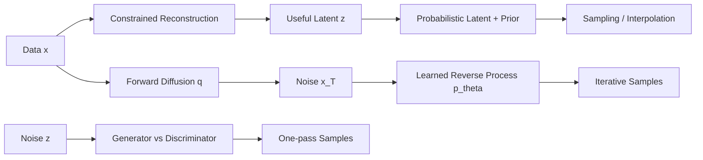

> 书目：*Hands-On Machine Learning with Scikit-Learn and PyTorch*<br>
> 章节：Chapter 18, Autoencoders, GANs, and Diffusion Models<br>
> 章节文件：18. Autoencoders, GANs, and Diffusion Models.md<br>
> 配套 Notebook：<https://homl.info/colab-p>

---

## 阅读导引

### 本章的问题链

本章研究“没有人工标签时，怎样学习数据分布与表示”：

1. **Autoencoder**：在复制输入的任务上施加 bottleneck/noise/sparsity，迫使网络学习有用 latent representation；
2. **VAE**：把 deterministic coding 变成受 prior 约束的随机变量，使 latent space 可采样、可生成；
3. **GAN**：不显式写 likelihood，由 discriminator 提供学习信号，generator 一步生成高质量样本；
4. **Diffusion**：定义可控的加噪过程，再学习逐步逆转，换取更稳定、更多样的生成。



### 三类模型的根本区别

| 模型 | 训练信号 | 是否显式 encoder | 生成速度 | 主要风险 |
| --- | --- | --- | --- | --- |
| AE | Reconstruction | 是 | Decoder 一次 | 学 identity/memorize |
| VAE | ELBO = reconstruction + KL | 是 | Decoder 一次 | 模糊、posterior collapse |
| GAN | Adversarial game | 通常否 | Generator 一次 | 不稳定、mode collapse |
| Diffusion | Denoising/noise prediction | Denoiser | 多步、较慢 | Sampling 成本高 |

### 运行边界

本文纯 PyTorch 示例在当前 `.venv`（Python 3.12、PyTorch 2.11 CPU）验证。当前没有 `torchvision`、`diffusers`、`transformers`，所以 Fashion-MNIST/Flowers102/Stable Diffusion 等完整数据实验提供可运行代码与依赖说明，但不虚构本机训练结果。

---

## 0. 概率与生成建模前置知识

### 0.1 Representation、Latent Variable 与 Manifold

观测 $x\in\mathbb R^D$ 可能集中在低维 manifold 附近。Encoder：

$$
z=f_\phi(x),\qquad z\in\mathbb R^d
$$

Decoder：

$$
\hat x=g_\theta(z)
$$

$z$ 是 latent representation/coding，$\phi,\theta$ 是参数。$d<D$ 只是最直接的约束；即使 $d\ge D$，noise、sparsity、regularization 也可防止 trivial copy。

### 0.2 Reconstruction Loss 是观测模型的负对数似然

若假设：

$$
p_\theta(x\mid z)=\mathcal N(g_\theta(z),\sigma_x^2I)
$$

则忽略常数：

$$
-\log p_\theta(x\mid z)
=\frac{1}{2\sigma_x^2}\|x-g_\theta(z)\|_2^2+C
$$

所以 MSE 对应固定方差 Gaussian likelihood。若 pixels 被视为 Bernoulli variables，则 BCE 更自然。Loss 选择隐含 data distribution 假设，不只是习惯。

### 0.3 Generative Model 的定义

Generative model 学习 $p_{data}(x)$ 或 conditional $p(x\mid c)$，可 sampling、density estimation 或两者。普通 deterministic AE 只学习 $x\to z\to\hat x$，没有规定 latent 的 sampling distribution，不能仅靠“随机取一个 $z$”可靠生成；VAE 才显式把 aggregate latent 推向 prior。

---

## 1. Efficient Data Representations

### 1.1 为什么约束会逼出模式

“50、48、46、…、14”虽比随机 10 个数长，却能用“从 50 开始递减偶数到 14”压缩。若记忆无限，直接背诵即可，不需要发现规律。

Autoencoder 同理：若 network capacity 过强且没有约束，可记住训练样本或学 identity。Bottleneck/noise/sparsity 相当于限制 communication channel，只有复用数据中的规律才能低 reconstruction error。

一般目标：

$$
\min_{\phi,\theta}
\frac1N\sum_{i=1}^{N}
\ell\left(x_i,g_\theta(f_\phi(x_i))\right)
{}+\lambda R
$$

$R$ 可以约束 weights、activations、Jacobian、latent distribution 或 corrupted-input invariance。

### 1.2 Undercomplete 与 Overcomplete

- **Undercomplete**：$d<D$，channel capacity 受维度限制；过小会丢任务相关信息、underfit；
- **Overcomplete**：$d\ge D$，可表示丰富 sparse/disentangled features；无额外约束时容易 identity/memorization。

维度本身不是 information capacity 的完整度量：高精度 real number 理论上可编码大量信息，network continuity、noise、regularization 和 finite data 才决定实际能力。

---

## 2. Performing PCA with an Undercomplete Linear Autoencoder

### 2.1 为什么 Linear AE 找到 PCA Subspace

假设 data 已中心化，矩阵 $X\in\mathbb R^{N\times D}$。Linear encoder/decoder 无 bias：

$$
Z=XW_e,\qquad \hat X=ZW_d=XW_eW_d
$$

其中 $W_e\in\mathbb R^{D\times d}$、$W_d\in\mathbb R^{d\times D}$。最小化：

$$
\min_{W_e,W_d}\|X-XW_eW_d\|_F^2
$$

令 $M=W_eW_d$，则 $rank(M)\le d$，因此 $XM$ 是 $X$ 的 rank-$d$ reconstruction。由 Eckart-Young-Mirsky theorem，若：

$$
X=U\Sigma V^T
$$

最佳 rank-$d$ approximation 是：

$$
X_d=U_d\Sigma_dV_d^T=XV_dV_d^T
$$

所以 global optimum 的 reconstruction subspace 是 top-$d$ principal subspace。可取 $W_e=V_d$、$W_d=V_d^T$。

但 factorization 不唯一：任意 invertible $R\in\mathbb R^{d\times d}$：

$$
W_e=V_dR,\qquad W_d=R^{-1}V_d^T
$$

有相同 $W_eW_d=V_dV_d^T$。因此 linear AE 通常找对 PCA **子空间**，coding axes 未必是 orthonormal principal components；要获得 PCA 坐标还需正交/权重绑定等约束。

成立条件：linear activations、squared reconstruction loss、足够优化到 global optimum、data 中心化（或 bias 学均值）。加入 nonlinearity/regularization 后不再严格等价 PCA。

### 2.2 可运行的 3D→2D Linear AE

```python
import torch
import torch.nn as nn
import torch.nn.functional as F

torch.manual_seed(42)
n_samples = 1200
latent = torch.randn(n_samples, 2)
mixing = torch.tensor([
    [1.0, 0.2, 0.8],
    [-0.3, 1.2, 0.5],
])
data = latent @ mixing + 0.03 * torch.randn(n_samples, 3)
data = data - data.mean(dim=0, keepdim=True)

encoder = nn.Linear(3, 2, bias=False)
decoder = nn.Linear(2, 3, bias=False)
autoencoder = nn.Sequential(encoder, decoder)
optimizer = torch.optim.Adam(autoencoder.parameters(), lr=0.03)

for _ in range(500):
    reconstruction = autoencoder(data)
    loss = F.mse_loss(reconstruction, data)
    optimizer.zero_grad()
    loss.backward()
    optimizer.step()

_, _, right_vectors = torch.linalg.svd(data, full_matrices=False)
pca_basis = right_vectors[:2].T
pca_reconstruction = data @ pca_basis @ pca_basis.T
with torch.no_grad():
    ae_reconstruction = autoencoder(data)
print("AE MSE:", round(F.mse_loss(ae_reconstruction, data).item(), 6))
print("PCA MSE:", round(F.mse_loss(pca_reconstruction, data).item(), 6))
print("coding shape:", encoder(data).shape)
```

Inputs 同时作为 targets，因此是 self-supervised learning：labels 自动来自 data，而不是“完全没有 supervision signal”。

---

## 3. Stacked Autoencoders

Stacked/deep AE 用多层 nonlinear encoder/decoder 学 nonlinear manifold。常见 symmetry：

```text
784 -> 128 -> 32 -> 128 -> 784
```

Symmetry 是有用先验，不是定理。Decoder 可以比 encoder 更强/弱；关键是 output shape 与 reconstruction distribution 匹配。

### 3.1 Implementing a Stacked Autoencoder

```python
class StackedAutoencoder(nn.Module):
    def __init__(self, input_dim=784, coding_dim=32):
        super().__init__()
        self.encoder = nn.Sequential(
            nn.Flatten(),
            nn.Linear(input_dim, 128), nn.ReLU(),
            nn.Linear(128, coding_dim), nn.ReLU(),
        )
        self.decoder = nn.Sequential(
            nn.Linear(coding_dim, 128), nn.ReLU(),
            nn.Linear(128, input_dim), nn.Sigmoid(),
            nn.Unflatten(1, (1, 28, 28)),
        )

    def forward(self, images):
        return self.decoder(self.encoder(images))


stacked_ae = StackedAutoencoder()
dummy_images = torch.rand(8, 1, 28, 28)
dummy_output = stacked_ae(dummy_images)
print(dummy_output.shape, stacked_ae.encoder(dummy_images).shape)
```

Sigmoid output 假设 pixels 在 $[0,1]$。若 normalized 到 $[-1,1]$，更适合 Tanh；若直接预测 unbounded continuous values，可省 output activation。

### 3.2 Visualizing Reconstructions

Validation reconstruction 是最低限度 sanity check。只看平均 MSE 会隐藏：

- blur 但 pixel error 小；
- minority/anomaly class error 大；
- memorization 导致 train 好、validation 差；
- perceptual structure 不符合人眼。

应同时报告 validation loss、per-sample distribution、SSIM/LPIPS（图像）、downstream linear probe，并可视化 best/median/worst samples。

### 3.3 Anomaly Detection

Per-sample anomaly score：

$$
s(x)=\frac1D\|x-g(f(x))\|_2^2
$$

阈值 $\tau$ 应在正常 validation data 或带少量 labels 的 calibration set 上选，例如正常 score 的 99th percentile：

$$
\hat y_{anom}=\mathbf1[s(x)>\tau]
$$

```python
def reconstruction_scores(model, samples):
    with torch.no_grad():
        reconstruction = model(samples)
    return (reconstruction - samples).square().flatten(1).mean(dim=1)


normal = torch.rand(64, 1, 28, 28)
scores = reconstruction_scores(stacked_ae, normal)
threshold = torch.quantile(scores, 0.99)
print("scores shape:", scores.shape)
print("99% threshold:", round(threshold.item(), 6))
```

重要边界：强 AE 也可能很好地重构异常；某些 OOD 样本比 in-distribution 更容易重构。Threshold 还受 input scale/domain drift 影响。需要与 one-class SVM、isolation forest、density/feature-distance 方法比较。

### 3.4 Visualizing Fashion-MNIST

先用 AE 将 784 降到 32，再以 t-SNE/UMAP 降到 2：AE 负责 scalable nonlinear feature extraction，t-SNE 负责 local-neighborhood visualization。t-SNE axes/global distances 没有直接语义，结果依 seed/perplexity，不能把 cluster separation 当作 classifier accuracy。

### 3.5 Unsupervised Pretraining

流程：

1. 用全部 unlabeled + labeled inputs 训练 AE；
2. 复用 encoder 初始化 classifier backbone；
3. 小 labeled set 上先冻结 encoder 训练 head；
4. 再以较小 learning rate 解冻 fine-tune；
5. 与 random initialization 在相同 split/seeds 下比较。

若 pretraining data 与 target domain 不同，或 reconstruction 学到背景/低层纹理而非 class features，negative transfer 可能发生。现代图像任务常用 contrastive learning、MAE/DINO 等更强 self-supervised objectives。

### 3.6 Tying Weights

对称 AE 第 $L$ 个 decoder weight 设为对应 encoder weight transpose：

$$
W_L^{dec}=(W_{N-L+1}^{enc})^T
$$

Bias 不绑定。参数减少近一半，并约束 decoder 使用 encoder dictionary 的 transpose，降低 overfit。

```python
class TiedAutoencoder(nn.Module):
    def __init__(self):
        super().__init__()
        self.enc1 = nn.Linear(784, 128)
        self.enc2 = nn.Linear(128, 32)
        self.dec1_bias = nn.Parameter(torch.zeros(128))
        self.dec2_bias = nn.Parameter(torch.zeros(784))

    def encode(self, images):
        hidden = F.relu(self.enc1(images.flatten(1)))
        return F.relu(self.enc2(hidden))

    def decode(self, codings):
        hidden = F.relu(F.linear(
            codings, self.enc2.weight.T, self.dec1_bias
        ))
        pixels = torch.sigmoid(F.linear(
            hidden, self.enc1.weight.T, self.dec2_bias
        ))
        return pixels.reshape(-1, 1, 28, 28)

    def forward(self, images):
        return self.decode(self.encode(images))


tied = TiedAutoencoder()
print("output:", tied(dummy_images).shape)
print("decoder weight is transpose:",
      torch.allclose(tied.enc2.weight.T, tied.enc2.weight.T))
```

不要创建独立 decoder `Parameter` 再每步复制，否则 optimizer state/gradient 容易错误；直接 `F.linear(..., encoder.weight.T)` 保证真正共享。

### 3.7 Greedy Layerwise Training

先训练 $x\leftrightarrow h_1$，冻结/编码整个 dataset 得 $h_1$；再训练 $h_1\leftrightarrow h_2$；最终按 encoder 正序、decoder 逆序堆叠并全局 fine-tune。

它缓解早期深网 optimization，历史上很重要。现代 initialization、normalization、residual、optimizers 已让 end-to-end training 更可行；逐层贪心也可能使局部 reconstruction objective 与最终任务不一致。

---

## 4. Convolutional Autoencoders

Dense AE 忽略 image locality，参数多。Conv encoder 逐步减小 $H,W$、增加 channels；decoder 用 transpose convolution 或 upsample + convolution 恢复。

ConvTranspose2d output size：

$$
H_{out}=(H_{in}-1)s-2p+d(k-1)+o_p+1
$$

$s$ stride、$p$ padding、$d$ dilation、$k$ kernel、$o_p$ output padding。`output_padding` 只解决多个 input sizes 映射同一 output size 的歧义，不是真的在图像边缘填值。

```python
conv_encoder = nn.Sequential(
    nn.Conv2d(1, 16, 3, stride=2, padding=1), nn.ReLU(),  # 14x14
    nn.Conv2d(16, 32, 3, stride=2, padding=1), nn.ReLU(), # 7x7
    nn.Flatten(), nn.Linear(32 * 7 * 7, 32),
)
conv_decoder = nn.Sequential(
    nn.Linear(32, 32 * 7 * 7), nn.ReLU(),
    nn.Unflatten(1, (32, 7, 7)),
    nn.ConvTranspose2d(32, 16, 4, stride=2, padding=1), nn.ReLU(),
    nn.ConvTranspose2d(16, 1, 4, stride=2, padding=1), nn.Sigmoid(),
)
conv_ae = nn.Sequential(conv_encoder, conv_decoder)
print(conv_encoder(dummy_images).shape, conv_ae(dummy_images).shape)
```

Transpose convolution 可能产生 checkerboard artifacts；nearest/bilinear upsampling + regular convolution 是替代。RNN/Transformer AE 可用于 sequences。

---

## 5. Denoising Autoencoders

给 clean $x$ 采样 corruption $\tilde x\sim q(\tilde x\mid x)$，训练：

$$
\min_{\phi,\theta}
\mathbb E_{x,\tilde x}
\left[\ell(x,g_\theta(f_\phi(\tilde x)))\right]
$$

Target 是 clean $x$，不是 corrupted input。常见 corruption：Gaussian noise、mask/dropout、salt-and-pepper、blur。网络不能逐 pixel copy，只能学习 data manifold 上的条件期望；对 MSE：

$$
g(f(\tilde x))\approx\mathbb E[x\mid\tilde x]
$$

这解释了为什么 ambiguous details 会平均化/模糊，也解释了模型会“猜出”被 mask 的鞋尖。

```python
class DenoisingAutoencoder(nn.Module):
    def __init__(self, noise_std=0.25):
        super().__init__()
        self.noise_std = noise_std
        self.core = StackedAutoencoder(coding_dim=128)

    def forward(self, clean_images):
        model_input = clean_images
        if self.training:
            model_input = clean_images + self.noise_std * torch.randn_like(
                clean_images
            )
            model_input = model_input.clamp(0, 1)
        return self.core(model_input)


denoising_ae = DenoisingAutoencoder()
denoising_ae.train()
denoised = denoising_ae(dummy_images)
print(denoised.shape)
```

Dropout corruption 只在 train mode 生效；评估真实 noisy images 时应显式加噪或直接将 noise input 传入 clean core。Noise distribution 若与实际 corruption 不匹配，泛化会差。

---

## 6. Sparse Autoencoders

Overcomplete coding 通过每样本只激活少量 units 学 dictionary-like features。

### 6.1 L1 Activation Penalty

$$
\mathcal L=\mathcal L_{rec}+\lambda\|z\|_1
$$

L1 在 0 附近有固定 shrink pressure，倾向将不重要 activations 压到零；L2 更倾向均匀缩小所有 activations。若 activation 是 ReLU，实际零值可直接衡量；Sigmoid 永不严格为零，常以平均 activation 表示 firing probability。

### 6.2 公式 18-1：KL Divergence

$$
\boxed{
D_{KL}(P\|Q)=\sum_iP(i)\log\frac{P(i)}{Q(i)}
}
$$

由 cross-entropy $H(P,Q)=-\sum P\log Q$ 与 entropy $H(P)=-\sum P\log P$：

$$
D_{KL}(P\|Q)=H(P,Q)-H(P)\ge0
$$

非负性来自 Gibbs inequality；当且仅当 $P=Q$（$P$ 支持集上）时为 0。它非对称、不是 distance，不满足 triangle inequality。若存在 $P(i)>0,Q(i)=0$，divergence 为无穷。

### 6.3 公式 18-2：Bernoulli Sparsity KL

目标 unit firing probability $p$，batch mean activation $q$。Bernoulli distribution 有 active/inactive 两项，代入式 18-1：

$$
\boxed{
D_{KL}(p\|q)
=p\log\frac pq+(1-p)\log\frac{1-p}{1-q}
}
$$

Derivative：

$$
\frac{\partial D}{\partial q}
=-\frac pq+\frac{1-p}{1-q}
=\frac{q-p}{q(1-q)}
$$

$q=p$ 时 derivative 0；靠近 0/1 时 denominator 小，penalty gradient 强于 MSE。需 clamp $q\in[\epsilon,1-\epsilon]$ 防 log/division overflow。Batch 太小使 $q$ estimate noisy；distributed training 若只用 local batch，global sparsity 不一定正确。

```python
def sparsity_kl(codings, target=0.1, eps=1e-6):
    target_probability = codings.new_tensor(target)
    actual = codings.mean(dim=0).clamp(eps, 1 - eps)
    divergence = (
        target_probability * torch.log(target_probability / actual)
        + (1 - target_probability)
        * torch.log((1 - target_probability) / (1 - actual))
    )
    return divergence.sum(), actual


torch.manual_seed(42)
codings = torch.sigmoid(torch.randn(64, 12) - 2)
kl_loss, mean_activation = sparsity_kl(codings, target=0.1)
print("mean activation:", round(mean_activation.mean().item(), 4))
print("sparsity KL:", round(kl_loss.item(), 4))
```

Full objective：

$$
\mathcal L=\mathcal L_{rec}+\beta\sum_jD_{KL}(p\|q_j)
$$

$\beta$ 太大则只顾 sparsity、重构失败；太小则退化为普通 AE。Sparse codings 可能更 interpretable，但 unit 对人类概念的一一对应不是保证。

---

## 7. Variational Autoencoders

### 7.1 从普通 AE 到 Probabilistic Generative Model

普通 AE 的 codings 分布可能有 holes 和复杂形状，随意从 $\mathcal N(0,I)$ sampling 后 decoder 未见过该区域。VAE 建模：

$$
p(z)=\mathcal N(0,I),
\qquad
p_\theta(x\mid z)
$$

并用 encoder 近似真实 posterior：

$$
q_\phi(z\mid x)
=\mathcal N\left(
\mu_\phi(x),
\operatorname{diag}(\sigma_\phi^2(x))
\right)
$$

Encoder 输出 distribution parameters，而非单一点；decoder 输入 sample $z$。训练同时要求重构好、posterior 不偏离 prior 太远，因此 prior samples 落入 decoder 熟悉区域。

### 7.2 为什么需要 Variational Inference

我们想 maximize marginal likelihood：

$$
\log p_\theta(x)
=\log\int p_\theta(x,z)\,dz
$$

Neural decoder 使 integral 和真实 posterior：

$$
p_\theta(z\mid x)
=\frac{p_\theta(x,z)}{p_\theta(x)}
$$

通常不可解析。引入 tractable $q_\phi(z\mid x)$：

$$
\begin{aligned}
\log p_\theta(x)
&=\mathbb E_q\left[
\log\frac{p_\theta(x,z)}{q_\phi(z\mid x)}
\right]
{}+D_{KL}\left(q_\phi(z\mid x)\|p_\theta(z\mid x)\right)
\end{aligned}
$$

KL 非负，所以第一项是 evidence lower bound（ELBO）：

$$
\log p_\theta(x)\ge
\mathcal E(x)
=\mathbb E_{q_\phi(z\mid x)}[\log p_\theta(x\mid z)]
-D_{KL}(q_\phi(z\mid x)\|p(z))
$$

也可由 Jensen inequality 推导：

$$
\begin{aligned}
\log p(x)
&=\log\int q(z\mid x)
\frac{p(x,z)}{q(z\mid x)}dz\\
&=\log\mathbb E_q\left[\frac{p(x,z)}{q(z\mid x)}\right]\\
&\ge\mathbb E_q\left[\log\frac{p(x,z)}{q(z\mid x)}\right]
\end{aligned}
$$

训练 minimize negative ELBO：

$$
\boxed{
\mathcal L_{VAE}
=\underbrace{-\mathbb E_q\log p_\theta(x\mid z)}
_{reconstruction}
{}+\underbrace{D_{KL}(q_\phi(z\mid x)\|p(z))}
_{latent\ regularization}
}
$$

ELBO gap 正是 $D_{KL}(q(z\mid x)\|p(z\mid x))$。Encoder family 越受限，approximation gap 可能越大。

### 7.3 Reparameterization Trick

直接写 $z\sim\mathcal N(\mu,\sigma^2)$ 会把 sampling node 与 $\phi$ 混在一起。改写：

$$
\epsilon\sim\mathcal N(0,I),
\qquad
z=\mu+\sigma\odot\epsilon
$$

随机性移到与参数无关的 $\epsilon$；对固定 sample：

$$
\frac{\partial z}{\partial\mu}=I,
\qquad
\frac{\partial z}{\partial\sigma}
=\operatorname{diag}(\epsilon)
$$

因此可 pathwise backprop。Monte Carlo gradient 在 regularity conditions 下是无偏/一致 estimator；常用每个 $x$ 一个 $\epsilon$ 即可，batch averaging 降 variance。

### 7.4 公式 18-3：Diagonal Gaussian KL 完整推导

一维 $q=\mathcal N(\mu,\sigma^2)$、$p=\mathcal N(0,1)$：

$$
\log\frac{q(z)}{p(z)}
=-\log\sigma
{}-\frac{(z-\mu)^2}{2\sigma^2}
{}+\frac{z^2}{2}
$$

对 $q$ 取期望，使用：

$$
\mathbb E_q[(z-\mu)^2]=\sigma^2,
\qquad
\mathbb E_q[z^2]=\mu^2+\sigma^2
$$

得到：

$$
D_{KL}(q\|p)
=\frac12(\mu^2+\sigma^2-1-\log\sigma^2)
$$

Diagonal dimensions independent，KL 相加：

$$
\boxed{
\mathcal L_{latent}
=-\frac12\sum_{i=1}^{n}
\left[1+\log\sigma_i^2-\sigma_i^2-\mu_i^2\right]
}
$$

这就是式 18-3。它只在 $q$ diagonal Gaussian、prior standard Gaussian 时有该 closed form。

### 7.5 公式 18-4：使用 Log-Variance

令：

$$
\gamma_i=\log\sigma_i^2
$$

则：

$$
\sigma_i^2=e^{\gamma_i},
\qquad
\sigma_i=e^{\gamma_i/2}
$$

代入式 18-3：

$$
\boxed{
\mathcal L_{latent}
=-\frac12\sum_{i=1}^{n}
\left[1+\gamma_i-e^{\gamma_i}-\mu_i^2\right]
}
$$

Network 可输出任意 real $\gamma$，对应 variance 自动为正，比直接预测 $\sigma$ 更稳定。

### 7.6 可运行 VAE 与 Gradient Check

```python
from collections import namedtuple

VAEOutput = namedtuple(
    "VAEOutput", ["reconstruction", "mean", "log_variance", "coding"]
)


class VariationalAutoencoder(nn.Module):
    def __init__(self, input_dim=64, coding_dim=8):
        super().__init__()
        self.coding_dim = coding_dim
        self.encoder = nn.Sequential(
            nn.Linear(input_dim, 32), nn.ReLU(),
            nn.Linear(32, 2 * coding_dim),
        )
        self.decoder = nn.Sequential(
            nn.Linear(coding_dim, 32), nn.ReLU(),
            nn.Linear(32, input_dim), nn.Sigmoid(),
        )

    def encode(self, inputs):
        return self.encoder(inputs).chunk(2, dim=-1)

    @staticmethod
    def reparameterize(mean, log_variance):
        standard_deviation = torch.exp(0.5 * log_variance)
        noise = torch.randn_like(standard_deviation)
        return mean + standard_deviation * noise

    def decode(self, codings):
        return self.decoder(codings)

    def forward(self, inputs):
        mean, log_variance = self.encode(inputs)
        coding = self.reparameterize(mean, log_variance)
        reconstruction = self.decode(coding)
        return VAEOutput(reconstruction, mean, log_variance, coding)


def variational_loss(prediction, target, beta=1.0):
    reconstruction_loss = F.binary_cross_entropy(
        prediction.reconstruction, target, reduction="sum"
    ) / len(target)
    kl_per_sample = -0.5 * (
        1 + prediction.log_variance
        - prediction.log_variance.exp()
        - prediction.mean.square()
    ).sum(dim=-1)
    return reconstruction_loss + beta * kl_per_sample.mean(), kl_per_sample


torch.manual_seed(42)
vae = VariationalAutoencoder()
vae_inputs = torch.rand(16, 64)
prediction = vae(vae_inputs)
vae_loss, kl_values = variational_loss(prediction, vae_inputs)
vae_loss.backward()
print("reconstruction/coding:",
      prediction.reconstruction.shape, prediction.coding.shape)
print("mean KL:", round(kl_values.mean().item(), 4))
print("encoder 有梯度:", vae.encoder[0].weight.grad is not None)
```

书中用 pixel-mean MSE，所以把 KL mean 再除 784 以匹配 scale；这里 BCE 对 pixels 求和再 batch mean，因此不除 input dimension。Reduction convention 会改变 $\beta$ 的数值含义，必须写清。

### 7.7 $\beta$-VAE、KL Annealing 与 Posterior Collapse

$$
\mathcal L=\mathcal L_{rec}+\beta D_{KL}
$$

$\beta>1$ 强化 factorized prior，可能提高 disentanglement 但损 reconstruction；$\beta<1$ 更重 reconstruction。强 decoder 可能忽略 $z$，让 $q(z\mid x)\approx p(z)$、KL 接近 0，称 posterior collapse。KL warmup/cyclical annealing、free bits、减弱 decoder 可缓解。

---

## 8. Generating Fashion-MNIST Images

训练后从 prior sample：

$$
z\sim\mathcal N(0,I),
\qquad
x\sim p_\theta(x\mid z)
$$

若 decoder 只输出 mean image，通常直接取 $\hat x=g_\theta(z)$。VAE 生成偏模糊，部分原因是 pixel-wise Gaussian/MSE 或 Bernoulli likelihood 在多种 plausible outputs 上倾向平均；更强 decoder/perceptual/adversarial likelihood 可改善。

```python
vae.eval()
torch.manual_seed(7)
random_codings = torch.randn(6, vae.coding_dim)
with torch.no_grad():
    generated_vectors = vae.decode(random_codings)
print("generated:", generated_vectors.shape,
      "range:", (generated_vectors.min().item(), generated_vectors.max().item()))
```

### 8.1 Semantic Interpolation

Linear interpolation：

$$
z(\lambda)=(1-\lambda)z_a+\lambda z_b
$$

Decode 中间 points 通常产生 gradual semantic changes，而 pixel interpolation 只是图像叠加。Standard Gaussian latent 更适合 spherical interpolation（slerp），因为 linear midpoint 的 norm 变小，可能穿过 prior 低概率区域；低维/短距离时 linear 常足够。

### 8.2 Discrete Variational Autoencoders

#### 8.2.1 Categorical Latent

Coding length $d$，每 position 有 $k$ categories。Encoder 输出 logits $\ell\in\mathbb R^{d\times k}$：

$$
\pi_{j,c}=softmax(\ell_j)_c
$$

Discrete code $c_j\sim Categorical(\pi_j)$。总组合数 $k^d$。它把连续 image 压成 tokens，供 BEiT/DALL·E 等 Transformer 使用。

#### 8.2.2 Gumbel-Max 与 Gumbel-Softmax

若 $u_c\sim Uniform(0,1)$，Gumbel noise：

$$
g_c=-\log(-\log u_c)
$$

则：

$$
\arg\max_c(\ell_c+g_c)
\sim Categorical(softmax(\ell))
$$

Argmax 不可导，以 temperature $\tau$ soft relaxation：

$$
y_c=\frac{\exp((\ell_c+g_c)/\tau)}
{\sum_j\exp((\ell_j+g_j)/\tau)}
$$

$\tau\to0$ 接近 one-hot，但 gradients 变尖锐/high variance；训练从 1 逐渐 anneal 到约 0.1。`hard=True` forward 用 one-hot，backward 用 soft gradient，即 straight-through trick，gradient 是 biased approximation。

#### 8.2.3 Categorical KL

Prior uniform $p(c)=1/k$：

$$
\begin{aligned}
D_{KL}(q\|p)
&=\sum_{c=1}^{k}\pi_c
\log\frac{\pi_c}{1/k}\\
&=\sum_c\pi_c(\log\pi_c+\log k)
\end{aligned}
$$

对 $d$ positions 再求和。直接 `prob.log()` 要 clamp 或使用 `log_softmax` 避免 zero probabilities。

```python
class TinyDiscreteVAE(nn.Module):
    def __init__(self, input_dim=20, coding_length=4,
                 num_codes=8, temperature=1.0):
        super().__init__()
        self.coding_length = coding_length
        self.num_codes = num_codes
        self.temperature = temperature
        self.encoder = nn.Linear(
            input_dim, coding_length * num_codes
        )
        self.decoder = nn.Linear(
            coding_length * num_codes, input_dim
        )

    def forward(self, inputs):
        logits = self.encoder(inputs).reshape(
            -1, self.coding_length, self.num_codes
        )
        coding = F.gumbel_softmax(
            logits, tau=self.temperature, hard=True, dim=-1
        )
        reconstruction = torch.sigmoid(
            self.decoder(coding.flatten(1))
        )
        return reconstruction, logits, coding


torch.manual_seed(42)
discrete_vae = TinyDiscreteVAE()
discrete_inputs = torch.rand(10, 20)
reconstruction, logits, coding = discrete_vae(discrete_inputs)
log_probability = F.log_softmax(logits, dim=-1)
probability = log_probability.exp()
categorical_kl = (
    probability * (log_probability + torch.log(
        logits.new_tensor(discrete_vae.num_codes)
    ))
).sum(dim=(-1, -2)).mean()
loss = F.binary_cross_entropy(reconstruction, discrete_inputs) + 0.01 * categorical_kl
loss.backward()
print("coding shape:", coding.shape)
print("forward one-hot:",
      torch.allclose(coding.sum(dim=-1), torch.ones(10, 4)))
print("encoder 有梯度:", discrete_vae.encoder.weight.grad is not None)
```

### 8.3 VQ-VAE

Encoder 输出 embeddings $z_e(x)$，codebook $e_1,\ldots,e_k\in\mathbb R^m$。Quantization：

$$
j^*=\arg\min_j\|z_e(x)-e_j\|_2,
\qquad z_q=e_{j^*}
$$

Nearest-neighbor 不可导，STE 在 backward 假装 quantization 是 identity。典型 loss：

$$
\mathcal L
=\mathcal L_{rec}
{}+\|sg[z_e]-e\|_2^2
{}+\beta\|z_e-sg[e]\|_2^2
$$

`sg` 是 stop-gradient。第二项移动 codebook 到 encoder outputs，第三项 commitment loss 防 encoder embeddings 任意漂移。Codebook collapse/dead codes 需要 EMA updates、restart 或 usage regularization。

### 8.4 dVAE + Transformer：Vocabulary 与 Grammar

dVAE/VQ-VAE 学视觉 vocabulary（局部 codes），autoregressive Transformer 学 code sequence grammar（全局 consistency）：

$$
p(c_{1:L}\mid text)
=\prod_{t=1}^{L}p(c_t\mid c_{<t},text)
$$

生成 codes → reshape latent grid → codebook lookup → decoder。Text prefix 实现 conditional generation。大型图像仍可能有 long-range inconsistency；hierarchical VAE 用多个尺度 latents，loss 是一个 reconstruction + 每层 KL。

---

## 9. Generative Adversarial Networks

### 9.1 Generator 与 Discriminator

Generator：

$$
z\sim p_z(z),\qquad x_{fake}=G_\theta(z)
$$

它把 simple prior push forward 成 implicit distribution $p_g$。通常不能直接计算 $p_g(x)$，但能快速 sampling。Discriminator $D_\phi(x)\in(0,1)$ 估计样本来自 real data 的概率。两者 objective：

$$
\boxed{
\min_G\max_D V(D,G)
=\mathbb E_{x\sim p_{data}}\log D(x)
{}+\mathbb E_{z\sim p_z}\log(1-D(G(z)))
}
$$

### 9.2 Optimal Discriminator 与 Equilibrium

固定 G，将第二项改写为 $x\sim p_g$：

$$
V=\int\left[
p_{data}(x)\log D(x)+p_g(x)\log(1-D(x))
\right]dx
$$

每个 $x$ 独立 maximize。令 $a=p_{data}(x),b=p_g(x)$：

$$
f'(D)=\frac aD-\frac b{1-D}=0
\Rightarrow
\boxed{D^*(x)=\frac{p_{data}(x)}{p_{data}(x)+p_g(x)}}
$$

二阶导为负，确为 maximum。令 $m=(p_{data}+p_g)/2$，代入：

$$
\begin{aligned}
V(D^*,G)
&=-2\log2
{}+D_{KL}(p_{data}\|m)
{}+D_{KL}(p_g\|m)\\
&=-\log4+2D_{JS}(p_{data}\|p_g)
\end{aligned}
$$

JS divergence 非负，且仅当 distributions 相等时为 0，因此 global optimum：

$$
p_g=p_{data},\qquad D^*(x)=1/2
$$

这个结论不保证 alternating gradient descent 收敛。Neural game 非凸非凹，players 同时变化，可振荡/循环。

### 9.3 Saturating 与 Non-Saturating Generator Loss

原 minimax 让 G minimize：

$$
\mathcal L_G^{sat}=\mathbb E_z\log(1-D(G(z)))
$$

训练初期 D 很强，$D(G(z))\approx0$，sigmoid gradient 可能饱和。实践常改为：

$$
\boxed{
\mathcal L_G^{NS}=-\mathbb E_z\log D(G(z))
}
$$

它与原 objective 有相同 fixed point，但给 bad fake 更强 gradient。用 logits + `BCEWithLogitsLoss` 比 sigmoid + `BCELoss` 数值更稳定。

### 9.4 Two-Phase Training

Discriminator：

$$
\mathcal L_D
=-\mathbb E_{x\sim p_{data}}\log D(x)
-\mathbb E_z\log(1-D(G(z)))
$$

Fake 必须 `detach()`，否则会无用地为 G 建 graph。Generator phase 冻结 D parameters，但不能 detach fake，因为 gradient 必须经 D input 回到 G。

```python
class TinyGenerator(nn.Module):
    def __init__(self, latent_dim=4):
        super().__init__()
        self.network = nn.Sequential(
            nn.Linear(latent_dim, 16), nn.ReLU(), nn.Linear(16, 2)
        )

    def forward(self, noise):
        return self.network(noise)


class TinyDiscriminator(nn.Module):
    def __init__(self):
        super().__init__()
        self.network = nn.Sequential(
            nn.Linear(2, 16), nn.LeakyReLU(0.2), nn.Linear(16, 1)
        )

    def forward(self, samples):
        return self.network(samples)


torch.manual_seed(42)
generator = TinyGenerator()
discriminator = TinyDiscriminator()
g_optimizer = torch.optim.Adam(generator.parameters(), lr=1e-3)
d_optimizer = torch.optim.Adam(discriminator.parameters(), lr=1e-3)
binary_loss = nn.BCEWithLogitsLoss()

for _ in range(200):
    batch_size = 64
    real = torch.randn(batch_size, 2) * 0.3 + 2.0

    # Phase 1：只更新 discriminator
    fake = generator(torch.randn(batch_size, 4)).detach()
    real_logits = discriminator(real)
    fake_logits = discriminator(fake)
    d_loss = (
        binary_loss(real_logits, torch.ones_like(real_logits))
        + binary_loss(fake_logits, torch.zeros_like(fake_logits))
    )
    d_optimizer.zero_grad()
    d_loss.backward()
    d_optimizer.step()

    # Phase 2：冻结 D 参数，但保留 D 对输入的导数
    discriminator.requires_grad_(False)
    generated = generator(torch.randn(batch_size, 4))
    generated_logits = discriminator(generated)
    g_loss = binary_loss(
        generated_logits, torch.ones_like(generated_logits)
    )
    g_optimizer.zero_grad()
    g_loss.backward()
    g_optimizer.step()
    discriminator.requires_grad_(True)

with torch.no_grad():
    generated_mean = generator(torch.randn(2000, 4)).mean(dim=0)
print("generated mean:", generated_mean.tolist())
print("final losses:", round(d_loss.item(), 4), round(g_loss.item(), 4))
```

Toy target 是 near $(2,2)$ Gaussian。GAN loss 不单调，结果随 seed/hyperparameters 变化；代码主要验证 training mechanics。

### 9.5 DCGAN

对 images，DCGAN 使用 ConvTranspose generator 和 strided Conv discriminator：G 逐步上采样，BatchNorm + ReLU，最后 Tanh；D 用 LeakyReLU 下采样。Input images 应 scale 到 $[-1,1]$ 与 Tanh 对齐。

```python
class SmallDCGANGenerator(nn.Module):
    def __init__(self, latent_dim=64):
        super().__init__()
        self.network = nn.Sequential(
            nn.ConvTranspose2d(latent_dim, 128, 7, 1, 0, bias=False),
            nn.BatchNorm2d(128), nn.ReLU(),
            nn.ConvTranspose2d(128, 64, 4, 2, 1, bias=False),
            nn.BatchNorm2d(64), nn.ReLU(),
            nn.ConvTranspose2d(64, 1, 4, 2, 1), nn.Tanh(),
        )

    def forward(self, noise):
        return self.network(noise)


dcgan_generator = SmallDCGANGenerator()
fake_images = dcgan_generator(torch.randn(8, 64, 1, 1))
print("DCGAN output:", fake_images.shape)
```

### 9.6 The Difficulties of Training GANs

#### Mode Collapse

许多 $z$ 映射到少数 modes。D 只看到当前 fake modes 后也会遗忘其他 failures，G 再跳 mode，形成 cycling。平均视觉质量不能衡量 coverage。

#### Vanishing/Uninformative Gradients

当 real/fake supports 几乎不重叠，optimal D 接近 perfect，JS objective 局部不提供有用几何方向。Non-saturating loss 只部分缓解。WGAN 使用 Wasserstein-1 与 1-Lipschitz critic；WGAN-GP penalty：

WGAN critic 不使用 sigmoid，最小化：

$$
\mathcal L_C
=\mathbb E_z[C(G(z))]
-\mathbb E_{x\sim p_{data}}[C(x)]
{}+\lambda\mathbb E_{\hat x}
\left(\|\nabla_{\hat x}C(\hat x)\|_2-1\right)^2
$$

Generator 最小化：

$$
\mathcal L_G=-\mathbb E_z[C(G(z))]
$$

Interpolation points：

$$
\hat x=\epsilon x+(1-\epsilon)G(z),
\qquad\epsilon\sim Uniform(0,1)
$$

Gradient penalty 只在 real/fake 连线附近鼓励 1-Lipschitz：

$$
\lambda\mathbb E_{\hat x}
\left(\|\nabla_{\hat x}D(\hat x)\|_2-1\right)^2
$$

#### Oscillation 与 Sensitivity

Game gradients 可围绕 equilibrium 旋转；D/G learning rates、update ratio、normalization、optimizer 和 architecture 都影响 dynamics。D 太强或太弱都可能使 G 学不到。

### 9.7 Stabilization

Experience replay 保存历史 fakes，训练 D 时混入，减少只追逐当前 G 的遗忘，但会引入 stale samples。

```python
from collections import deque
import random


class ImageReplayBuffer:
    def __init__(self, capacity=256):
        self.items = deque(maxlen=capacity)

    def add(self, images):
        self.items.extend(image.detach().cpu() for image in images)

    def sample(self, count, device="cpu"):
        count = min(count, len(self.items))
        selected = random.sample(list(self.items), count)
        return torch.stack(selected).to(device) if selected else None


buffer = ImageReplayBuffer(capacity=20)
buffer.add(torch.randn(12, 1, 8, 8))
print("replay sample:", buffer.sample(5).shape)
```

Mini-batch discrimination 给 D batch 内相似度，使其识别缺乏 diversity 的 fake batch。其他手段：spectral normalization、label smoothing/noise、DiffAugment/ADA、feature matching、unrolled GAN、two-time-scale updates。

### 9.8 GAN 的应用、演进与评估

应用：super-resolution、colorization、image editing、sketch-to-image、video prediction、data augmentation、audio/time-series generation、adversarial hard-example generation。DCGAN → Progressive GAN → StyleGAN 提升 resolution/control。

Diffusion 通常训练更稳、coverage 更好；GAN 仍适合低 latency、real-time generation 和部分 image-to-image 任务。

评估：FID、KID、precision/recall、class coverage、memorization/privacy、human study。FID 将 feature distributions 近似 Gaussian，依 extractor/sample count/preprocessing，不能跨不一致设置比较。

---

## 10. Diffusion Models

### 10.1 为什么从“加噪”开始

直接把 simple noise 映射到复杂 image distribution 很难。Diffusion 构造一个已知 Markov forward process $q$，逐步将 data 变成近似 standard Gaussian；每一步变化很小，其 reverse conditional 也近似 Gaussian，神经网络只需学习局部 denoising。

训练可随机选一个 time step 一步完成；生成却要从 $T$ 到 0 多次调用 model，这是稳定性/coverage 换 sampling latency。

### 10.2 公式 18-5：Forward Markov Transition

定义 noise schedule $0<\beta_t<1$，$\alpha_t=1-\beta_t$：

$$
\boxed{
q(x_t\mid x_{t-1})
=\mathcal N(\sqrt{\alpha_t}x_{t-1},\beta_tI)
}
$$

等价 reparameterization：

$$
x_t=\sqrt{\alpha_t}x_{t-1}
{}+\sqrt{\beta_t}\epsilon_t,
\qquad\epsilon_t\sim\mathcal N(0,I)
$$

若 $Var(x_{t-1})=I$：

$$
Var(x_t)=\alpha_tI+\beta_tI=I
$$

Mean 被反复乘小于 1 的 $\sqrt{\alpha_t}$，趋向 0；variance 稳定在 1。Noise isotropic 意味 covariance $\beta_tI$，pixels/channels 独立同方差。

### 10.3 公式 18-6：任意时刻的一步采样

定义 cumulative product：

$$
\bar\alpha_t=\prod_{s=1}^{t}\alpha_s
$$

展开两步：

$$
\begin{aligned}
x_t
&=\sqrt{\alpha_t}(
\sqrt{\bar\alpha_{t-1}}x_0
{}+\sqrt{1-\bar\alpha_{t-1}}\epsilon_{t-1})
{}+\sqrt{\beta_t}\epsilon_t\\
&=\sqrt{\bar\alpha_t}x_0
{}+\underbrace{
\sqrt{\alpha_t(1-\bar\alpha_{t-1})}\epsilon_{t-1}
{}+\sqrt{\beta_t}\epsilon_t
}_{Gaussian\ with\ variance\ 1-\bar\alpha_t}
\end{aligned}
$$

因为 independent Gaussians 的 variance 相加：

$$
\alpha_t(1-\bar\alpha_{t-1})+\beta_t
=1-\alpha_t\bar\alpha_{t-1}
=1-\bar\alpha_t
$$

所以归并成一个 standard Gaussian $\epsilon$：

$$
\boxed{
q(x_t\mid x_0)
=\mathcal N(
\sqrt{\bar\alpha_t}x_0,
(1-\bar\alpha_t)I)
}
$$

$$
\boxed{
x_t=\sqrt{\bar\alpha_t}x_0
{}+\sqrt{1-\bar\alpha_t}\epsilon
}
$$

这使训练无需顺序计算 $x_1,\ldots,x_{t-1}$。

### 10.4 公式 18-7：Cosine Variance Schedule

Improved DDPM 先指定 retained-signal curve：

$$
f(t)=\cos^2\left(
\frac{t/T+s}{1+s}\frac{\pi}{2}
\right)
$$

$$
\bar\alpha_t=\frac{f(t)}{f(0)}
$$

由 $\bar\alpha_t=\bar\alpha_{t-1}\alpha_t$：

$$
\alpha_t=\frac{\bar\alpha_t}{\bar\alpha_{t-1}}
$$

因此：

$$
\boxed{
\beta_t=1-\frac{\bar\alpha_t}{\bar\alpha_{t-1}}
}
$$

$s=0.008$ 避免起点 $\beta$ 太小，$\beta_t\le0.999$ 防末端 numerical instability。Cosine schedule 在两端变化慢，比简单 linear beta 更均匀分配 signal-to-noise levels。

```python
def cosine_variance_schedule(num_steps, offset=0.008,
                             max_beta=0.999):
    times = torch.linspace(0, num_steps, num_steps + 1)
    signal_curve = torch.cos(
        (times / num_steps + offset) / (1 + offset)
        * torch.pi / 2
    ).square()
    alpha_bars = signal_curve / signal_curve[0]
    betas = (1 - alpha_bars[1:] / alpha_bars[:-1]).clamp(
        max=max_beta
    )
    betas = torch.cat([torch.zeros(1), betas])
    alphas = 1 - betas
    # Clip 改变了最后的 alpha，必须重算 cumulative product 保持恒等式
    alpha_bars = torch.cumprod(alphas, dim=0)
    return alphas, betas, alpha_bars


alphas, betas, alpha_bars = cosine_variance_schedule(1000)
print("end signal:", alpha_bars[-1].item())
print("beta range:", betas[1:].min().item(), betas[1:].max().item())
print("identity check:",
      torch.allclose(alpha_bars[1:], alpha_bars[:-1] * alphas[1:]))
```

### 10.5 Forward Diffusion 与 Noise-Prediction Training

```python
def extract(schedule, time_steps, sample_shape):
    values = schedule.to(time_steps.device)[time_steps]
    return values.reshape(
        len(time_steps), *([1] * (len(sample_shape) - 1))
    )


def forward_diffusion(clean_images, time_steps, alpha_bars):
    noise = torch.randn_like(clean_images)
    retained = extract(alpha_bars, time_steps, clean_images.shape).sqrt()
    destroyed = (1 - extract(
        alpha_bars, time_steps, clean_images.shape
    )).sqrt()
    noisy_images = retained * clean_images + destroyed * noise
    return noisy_images, noise


torch.manual_seed(42)
clean = torch.ones(4, 1, 8, 8) * 0.5
time_steps = torch.tensor([1, 100, 500, 999])
noisy, target_noise = forward_diffusion(clean, time_steps, alpha_bars)
print("noisy shape:", noisy.shape)
print("sample means:", noisy.mean(dim=(1, 2, 3)).tolist())
```

Training sample $t\sim Uniform\{1,\ldots,T\}$，target 是生成 $x_t$ 时的 unscaled noise：

$$
\boxed{
\mathcal L_{simple}
=\mathbb E_{x_0,t,\epsilon}
\left[\|\epsilon-\epsilon_\theta(x_t,t)\|_2^2\right]
}
$$

它来自 variational bound 中 Gaussian reverse terms 的 weighted MSE simplification。不同 parameterizations 可预测 $x_0$、noise $\epsilon$ 或 velocity $v$；权重/SNR 不同。书中小模型发现 MAE/Huber 更好，这是 empirical choice，不改变 forward process。

### 10.6 为什么 Denoiser 必须知道 Time

同一个 pixel pattern 在低 noise/high noise 下应采取不同 denoising strength。将 $t$ 用 sinusoidal embedding：

$$
PE(t)_{2i}=\sin(t/\omega_i),
\qquad
PE(t)_{2i+1}=\cos(t/\omega_i)
$$

经 MLP 后注入 U-Net 每个 resolution block。U-Net downsample 获取 global context，upsample 恢复 spatial detail，skip connections 保留 high-resolution features；attention blocks 建模 long-range relations。

```python
class SinusoidalTimeEmbedding(nn.Module):
    def __init__(self, dimension):
        super().__init__()
        if dimension % 2:
            raise ValueError("dimension 必须是偶数")
        self.dimension = dimension

    def forward(self, time_steps):
        half = self.dimension // 2
        frequencies = torch.exp(
            -torch.log(torch.tensor(10_000.0, device=time_steps.device))
            * torch.arange(half, device=time_steps.device) / (half - 1)
        )
        angles = time_steps.float()[:, None] * frequencies[None, :]
        return torch.cat([angles.sin(), angles.cos()], dim=-1)


time_encoder = SinusoidalTimeEmbedding(16)
print(time_encoder(torch.tensor([0, 10, 999])).shape)
```

### 10.7 公式 18-8：Reverse Posterior 与 DDPM Step

Forward 已知：

$$
q(x_{t-1}\mid x_0)
=\mathcal N(\sqrt{\bar\alpha_{t-1}}x_0,
(1-\bar\alpha_{t-1})I)
$$

$$
q(x_t\mid x_{t-1})
=\mathcal N(\sqrt{\alpha_t}x_{t-1},\beta_tI)
$$

由 Bayes，忽略与 $x_{t-1}$ 无关常数，两个 Gaussian exponents 相加；配方可得：

$$
q(x_{t-1}\mid x_t,x_0)
=\mathcal N(\tilde\mu_t(x_t,x_0),\tilde\beta_tI)
$$

$$
\widetilde{\beta}_t
=\frac{1-\bar\alpha_{t-1}}
{1-\bar\alpha_t}\beta_t
$$

$$
\widetilde{\mu}_t
=\frac{\sqrt{\bar\alpha_{t-1}}\beta_t}
{1-\bar\alpha_t}x_0
{}+\frac{\sqrt{\alpha_t}(1-\bar\alpha_{t-1})}
{1-\bar\alpha_t}x_t
$$

真实 $x_0$ 在 generation 时未知。由 forward shortcut：

$$
\hat x_0
=\frac{x_t-\sqrt{1-\bar\alpha_t}
\epsilon_\theta(x_t,t)}
{\sqrt{\bar\alpha_t}}
$$

代入并化简：

$$
\boxed{
\mu_\theta(x_t,t)
=\frac1{\sqrt{\alpha_t}}
\left(x_t-
\frac{\beta_t}{\sqrt{1-\bar\alpha_t}}
\epsilon_\theta(x_t,t)
\right)
}
$$

标准 reverse sample：

$$
\boxed{
x_{t-1}=\mu_\theta(x_t,t)+\sigma_tz,
\quad z\sim\mathcal N(0,I)
}
$$

可取 $\sigma_t^2=\tilde\beta_t$、$\beta_t$，或 learn variance；$t=1$ 时通常设 $z=0$。

#### 对原书式 18-8 的重要校正

原文式 18-8 在 noise coefficient 分母写 $\sqrt{1-\alpha_t}$，但其实现/标准 DDPM 应为 $\sqrt{1-\bar\alpha_t}$；否则等于 $\sqrt{\beta_t}$，与 cumulative noise 不符。原文最后用 $\sqrt{\beta_t}z$ 是一种 fixed variance 选择；posterior variance 更精确写法是 $\sqrt{\tilde\beta_t}z$。

```python
def ddpm_reverse_step(noisy, predicted_noise, time_steps,
                      alphas, betas, alpha_bars):
    alpha_t = extract(alphas, time_steps, noisy.shape)
    beta_t = extract(betas, time_steps, noisy.shape)
    alpha_bar_t = extract(alpha_bars, time_steps, noisy.shape)
    previous_steps = (time_steps - 1).clamp_min(0)
    alpha_bar_previous = extract(
        alpha_bars, previous_steps, noisy.shape
    )
    mean = (
        noisy - beta_t / (1 - alpha_bar_t).sqrt()
        * predicted_noise
    ) / alpha_t.sqrt()
    posterior_variance = (
        beta_t * (1 - alpha_bar_previous) / (1 - alpha_bar_t)
    ).clamp_min(0)
    noise = torch.randn_like(noisy)
    nonzero = (time_steps > 1).reshape(
        len(time_steps), *([1] * (noisy.ndim - 1))
    )
    return mean + nonzero * posterior_variance.sqrt() * noise
```

### 10.8 公式 18-9：DDIM 跳步采样

DDIM 使用同一个 trained noise predictor，允许从 $t$ 跳到任意 earlier $p<t$。先估计 clean image：

$$
\hat x_0
=\frac{x_t-\sqrt{1-\bar\alpha_t}
\epsilon_\theta(x_t,t)}{\sqrt{\bar\alpha_t}}
$$

再更新：

$$
\boxed{
x_p=\sqrt{\bar\alpha_p}\hat x_0
{}+\sqrt{1-\bar\alpha_p-\sigma_{t\to p}^2}
\epsilon_\theta(x_t,t)
{}+\sigma_{t\to p}z
}
$$

标准 DDIM：

$$
\boxed{
\sigma_{t\to p}^2
=\eta^2
\frac{1-\bar\alpha_p}{1-\bar\alpha_t}
\left(1-\frac{\bar\alpha_t}{\bar\alpha_p}\right)
}
$$

$\eta=0$ deterministic，可复现且通常用较少 steps；当 $p=t-1$ 且 $\eta=1$ 时对应 DDPM posterior variance。对 arbitrary jump 不能直接使用单步 $\beta_t$：标准项是 $1-\bar\alpha_t/\bar\alpha_p$，它只在相邻 steps 时等于 $\beta_t$。原书式 18-9 还用 $\alpha$ 表示 cumulative signal，并将 $\eta$ 直接乘方差项；标准写法应明确是 $\bar\alpha$ 且 variance 与 $\eta^2$ 成正比。其 Notebook 代码 `variance = eta * ... * betas[t]` 对跳步和常用 $\eta$ convention 都只是近似/不一致实现。

```python
def ddim_step(noisy, predicted_noise, time_step, previous_step,
              alpha_bars, eta=0.0):
    alpha_bar_t = alpha_bars[time_step].to(noisy.device)
    alpha_bar_previous = alpha_bars[previous_step].to(noisy.device)
    clean_estimate = (
        noisy - (1 - alpha_bar_t).sqrt() * predicted_noise
    ) / alpha_bar_t.sqrt()
    variance = (
        eta**2 * (1 - alpha_bar_previous) / (1 - alpha_bar_t)
        * (1 - alpha_bar_t / alpha_bar_previous)
    ).clamp_min(0)
    direction = (1 - alpha_bar_previous - variance).clamp_min(0).sqrt()
    return (
        alpha_bar_previous.sqrt() * clean_estimate
        + direction * predicted_noise
        + variance.sqrt() * torch.randn_like(noisy)
    )


torch.manual_seed(9)
clean_vector = torch.randn(3, 5)
noise = torch.randn_like(clean_vector)
t = 700
noisy_vector = (
    alpha_bars[t].sqrt() * clean_vector
    + (1 - alpha_bars[t]).sqrt() * noise
)
recovered = ddim_step(
    noisy_vector, noise, t, 0, alpha_bars, eta=0.0
)
print("oracle recovery max error:",
      (recovered - clean_vector).abs().max().item())
```

实际 model noise prediction 有误差，steps 太少会放大 discretization/model error。DDIM、DPM-Solver、Euler/Heun、consistency/distillation 等 sampler 在 speed/quality 上各有取舍。

### 10.9 Conditional Diffusion 与 Classifier-Free Guidance

Class condition $c$ 通过 embedding 注入 U-Net。Classifier-free guidance 训练时随机 drop condition，模型同时学 conditional/unconditional noise。Inference：

$$
\hat\epsilon
=\epsilon_\theta(x_t,t,\varnothing)
{}+w\left[
\epsilon_\theta(x_t,t,c)
-\epsilon_\theta(x_t,t,\varnothing)
\right]
$$

$w>1$ 提高 prompt/class adherence，却常降低 diversity、导致 oversaturation。它不需要外部 classifier；classifier guidance 则用 $\nabla_{x_t}\log p(c\mid x_t)$ 修正 score。

### 10.10 Latent Diffusion 与 Stable Diffusion

Pixel-space U-Net 对高 resolution 昂贵。Latent diffusion：

1. Powerful autoencoder 将 image 压为 spatial latent $z=E(x)$；
2. 在 latent 上 forward/reverse diffusion；
3. Decoder $D(z_0)$ 还原 image；
4. Cross-attention 注入 text/image conditions。

Latent grid 小，训练/采样显著加速；上限受 autoencoder reconstruction，细节可能丢失。Stable Diffusion 是公开 latent diffusion family。

```python
from diffusers import AutoPipelineForText2Image

pipeline = AutoPipelineForText2Image.from_pretrained(
    "stabilityai/sd-turbo",
    variant="fp16",
    torch_dtype=torch.float16,
).to("cuda")
image = pipeline(
    prompt="A closeup photo of an orangutan reading a book",
    num_inference_steps=1,
    guidance_scale=0.0,
).images[0]
image.save("orangutan_reading.png")
```

API 参数随 `diffusers` 版本变化。Generated media 还需处理版权、隐私、偏见、deepfake、watermark/provenance 与 safety filtering。

### 10.11 Diffusion 的优势与局限

优势：训练 objective 稳定、mode coverage 好、quality 高、conditioning 灵活、editing/inpainting/outpainting 强。局限：多次 model evaluations 导致慢/耗能；guidance 和 sampler 调参；训练 data/licensing 风险；likelihood/quality 指标与人类偏好不完全一致。

### 10.12 Extra Material：Flow Matching

官方 Notebook 额外介绍 Flow Matching。对 data $x_1$ 与 noise $x_0\sim\mathcal N(0,I)$，定义直线路径：

$$
x_t=(1-t)x_0+tx_1,
\qquad t\in[0,1]
$$

路径 velocity：

$$
\frac{dx_t}{dt}=x_1-x_0
$$

训练 $v_\theta(x_t,t)$ 拟合该 velocity：

$$
\mathcal L_{FM}
=\mathbb E\|v_\theta(x_t,t)-(x_1-x_0)\|_2^2
$$

生成从 noise 出发，积分 ODE：

$$
\frac{dx}{dt}=v_\theta(x,t),
\quad x(0)\sim\mathcal N(0,I)
$$

Euler step：$x_{k+1}=x_k+\Delta t\,v_\theta(x_k,t_k)$。给定初始 noise 后 ODE integration 是 deterministic，但每次 generation 的初始 $x_0\sim\mathcal N(0,I)$ 仍是随机的。路径可更直、常以更少 function evaluations 生成，但仍受 vector-field error 与 ODE solver discretization 影响。

---

## 11. Exercises：问题 1–13

### 11.1 Autoencoder 的主要用途

Dimensionality reduction/visualization、feature extraction、unsupervised pretraining、anomaly detection、denoising/compression；VAE/dVAE 等还可 generation、semantic interpolation、continuous data tokenization。普通 deterministic AE 不自动是 generative model。

### 11.2 大量 Unlabeled、少量 Labeled 时怎样帮助分类

用全部 training inputs 训练 AE/denoising AE；复制 encoder 到 classifier；先冻结 encoder 训练 head，再逐层解冻小 LR fine-tune。Validation 比较 random initialization，test 最后一次评估。Pretraining data 不能包含 test；domain mismatch 可能 negative transfer。现代 alternative 是 contrastive/MAE/DINO pretraining。

### 11.3 Perfect Reconstruction 是否必然是好 AE

不是。可能 memorization/identity，latent 对新样本、下游任务无用。评估：held-out reconstruction、train-validation gap、corruption robustness、latent linear probe、nearest-neighbor/retrieval、generation quality/coverage、anomaly ROC/PR，以及 coding dimensionality/sparsity。还应检查 decoder 是否只记住 train samples。

### 11.4 Undercomplete 与 Overcomplete 的风险

Undercomplete $d<D$；过度压缩导致 information loss/underfit。Overcomplete $d\ge D$；无 noise/sparsity/regularization 时容易 identity/memorization。Overcomplete 本身不是坏事，sparse dictionary learning 常故意 overcomplete。

### 11.5 怎样 Tie Weights？目的是什么？

$W_L^{dec}=(W_{N-L+1}^{enc})^T$，bias 独立。用 encoder weight transpose 直接做 `F.linear`，不创建复制参数。收益：约减半 weights、加速/降 overfit，并加入对称 inductive bias；若 optimal decoder 不应是 transpose，会限制 capacity。

### 11.6 什么是 Generative Model？Generative AE 示例

学习 data distribution 或 sampling mechanism、可生成新样本的模型。VAE/dVAE 有显式 prior；VQ-VAE 只有 quantizer/decoder 时还不能可靠生成，必须另学 code prior（如 autoregressive Transformer）。普通 AE 同样无 prior，不保证 random latent 可生成。

### 11.7 什么是 GAN？适用任务

Generator 与 discriminator 对抗训练。适合一步快速 image generation、super-resolution、colorization、image-to-image translation/editing、video prediction、data augmentation、StyleGAN latent editing、audio/time-series synthesis。

### 11.8 GAN 训练的主要困难

Mode collapse、D 过强导致 gradient 不佳、non-convex game oscillation/divergence、hyperparameter sensitivity、难用 loss 判断 quality、coverage/memorization 难评估。Replay、mini-batch discrimination、WGAN-GP、spectral norm、ADA 等只能缓解，不保证收敛。

### 11.9 Diffusion 擅长什么？主要限制

高质量、多样、可条件控制的 image/audio/video generation，以及 inpainting/outpainting/editing/super-resolution。训练较稳定。主要限制是 iterative sampling 慢、compute/energy 大；accelerated samplers、distillation、latent diffusion、flow matching 可缓解。

### 11.10 Denoising AE 预训练 Image Classifier

下面使用 MNIST，需要 `pip install torchvision`。保持 official test 隔离，仅用 train 划 validation；分类只取 500 labeled images，多 seeds 比较 pretrained/random。

```python
import copy
from pathlib import Path
from torch.utils.data import DataLoader, Dataset, Subset, random_split
from torchvision import datasets, transforms


class ReconstructionDataset(Dataset):
    def __init__(self, dataset):
        self.dataset = dataset

    def __len__(self):
        return len(self.dataset)

    def __getitem__(self, index):
        image, _ = self.dataset[index]
        return image, image


def train_epoch(model, loader, optimizer, loss_function, device):
    model.train()
    total = 0.0
    for inputs, targets in loader:
        inputs, targets = inputs.to(device), targets.to(device)
        predictions = model(inputs)
        loss = loss_function(predictions, targets)
        optimizer.zero_grad(set_to_none=True)
        loss.backward()
        optimizer.step()
        total += loss.item() * len(inputs)
    return total / len(loader.dataset)


device = torch.device("cuda" if torch.cuda.is_available() else "cpu")
root = Path("datasets")
full_train = datasets.MNIST(
    root, train=True, download=True, transform=transforms.ToTensor()
)
test_data = datasets.MNIST(
    root, train=False, download=True, transform=transforms.ToTensor()
)
generator_seed = torch.Generator().manual_seed(42)
train_data, valid_data = random_split(
    full_train, [55_000, 5_000], generator=generator_seed
)

denoising_model = DenoisingAutoencoder(noise_std=0.3).to(device)
ae_loader = DataLoader(
    ReconstructionDataset(train_data), batch_size=128,
    shuffle=True, num_workers=0,
)
ae_optimizer = torch.optim.Adam(denoising_model.parameters(), lr=1e-3)
for epoch in range(10):
    loss = train_epoch(
        denoising_model, ae_loader, ae_optimizer, F.mse_loss, device
    )
    print("AE", epoch + 1, loss)

labeled_indices = torch.randperm(
    len(train_data), generator=torch.Generator().manual_seed(7)
)[:500].tolist()
labeled_data = Subset(train_data, labeled_indices)
labeled_loader = DataLoader(
    labeled_data, batch_size=64, shuffle=True, num_workers=0
)
valid_loader = DataLoader(valid_data, batch_size=256, num_workers=0)
test_loader = DataLoader(test_data, batch_size=256, num_workers=0)


class EncoderClassifier(nn.Module):
    def __init__(self, encoder, coding_dim=128):
        super().__init__()
        self.encoder = encoder
        self.head = nn.Linear(coding_dim, 10)

    def forward(self, images):
        return self.head(self.encoder(images))


pretrained_classifier = EncoderClassifier(
    denoising_model.core.encoder, coding_dim=128
).to(device)
random_classifier = EncoderClassifier(
    StackedAutoencoder(coding_dim=128).encoder, coding_dim=128
).to(device)


@torch.no_grad()
def classification_accuracy(model, loader):
    model.eval()
    correct = 0
    total = 0
    for images, labels in loader:
        logits = model(images.to(device))
        correct += (logits.argmax(dim=1).cpu() == labels).sum().item()
        total += len(labels)
    return correct / total


def fit_classifier(model, epochs=20, freeze_epochs=0):
    best_accuracy = -1.0
    best_state = None
    for epoch in range(epochs):
        frozen = epoch < freeze_epochs
        model.encoder.requires_grad_(not frozen)
        parameters = model.head.parameters() if frozen else model.parameters()
        optimizer = torch.optim.Adam(parameters, lr=1e-3 if frozen else 2e-4)
        train_epoch(
            model, labeled_loader, optimizer, F.cross_entropy, device
        )
        accuracy = classification_accuracy(model, valid_loader)
        if accuracy > best_accuracy:
            best_accuracy = accuracy
            best_state = copy.deepcopy(model.state_dict())
    model.load_state_dict(best_state)
    model.encoder.requires_grad_(True)
    return model


fit_classifier(pretrained_classifier, freeze_epochs=5)
fit_classifier(random_classifier)
print("pretrained test accuracy:",
      classification_accuracy(pretrained_classifier, test_loader))
print("random-init test accuracy:",
      classification_accuracy(random_classifier, test_loader))
```

题目要求的“每个 coding neuron 最激活图片”：批量计算 codings，对每列 `topk` indices 取图可视化。不能只比较一次 run；应对多个 labeled subsets/seeds 报告 mean±std 或置信区间。当前本机缺 `torchvision`，未实跑 accuracy，因此不虚构“是否提高”的结论；运行脚本后由两行 test accuracy 回答。

### 11.11 训练 VAE 并生成

下面复用第 10 题加载的 MNIST，给出完整 convolutional VAE。训练记录 reconstruction/KL 分项，检查 posterior collapse；生成时从 prior sampling。

```python
class ConvVAE(nn.Module):
    def __init__(self, coding_dim=16):
        super().__init__()
        self.coding_dim = coding_dim
        self.encoder_conv = nn.Sequential(
            nn.Conv2d(1, 32, 4, 2, 1), nn.ReLU(),
            nn.Conv2d(32, 64, 4, 2, 1), nn.ReLU(),
            nn.Flatten(),
        )
        self.encoder_head = nn.Linear(64 * 7 * 7, 2 * coding_dim)
        self.decoder_input = nn.Linear(coding_dim, 64 * 7 * 7)
        self.decoder_conv = nn.Sequential(
            nn.Unflatten(1, (64, 7, 7)),
            nn.ConvTranspose2d(64, 32, 4, 2, 1), nn.ReLU(),
            nn.ConvTranspose2d(32, 1, 4, 2, 1), nn.Sigmoid(),
        )

    def encode(self, images):
        return self.encoder_head(self.encoder_conv(images)).chunk(2, dim=-1)

    def decode(self, codings):
        return self.decoder_conv(self.decoder_input(codings))

    def forward(self, images):
        mean, log_variance = self.encode(images)
        coding = mean + torch.exp(0.5 * log_variance) * torch.randn_like(mean)
        return self.decode(coding), mean, log_variance


def conv_vae_loss(prediction, target, beta=1.0):
    reconstruction, mean, log_variance = prediction
    reconstruction_loss = F.binary_cross_entropy(
        reconstruction, target, reduction="sum"
    ) / len(target)
    kl = -0.5 * (
        1 + log_variance - log_variance.exp() - mean.square()
    ).sum(dim=-1).mean()
    return reconstruction_loss + beta * kl, reconstruction_loss, kl


image_vae = ConvVAE(coding_dim=16).to(device)
vae_optimizer = torch.optim.Adam(image_vae.parameters(), lr=1e-3)
vae_loader = DataLoader(full_train, batch_size=128, shuffle=True, num_workers=0)
for epoch in range(10):
    image_vae.train()
    reconstruction_total = 0.0
    kl_total = 0.0
    for images, _ in vae_loader:
        images = images.to(device)
        prediction = image_vae(images)
        loss, reconstruction_loss, kl = conv_vae_loss(prediction, images)
        vae_optimizer.zero_grad(set_to_none=True)
        loss.backward()
        vae_optimizer.step()
        reconstruction_total += reconstruction_loss.item()
        kl_total += kl.item()
    print(epoch + 1, reconstruction_total / len(vae_loader),
          kl_total / len(vae_loader))

image_vae.eval()
with torch.no_grad():
    samples = image_vae.decode(
        torch.randn(64, image_vae.coding_dim, device=device)
    ).cpu()
torch.save(samples, "mnist_vae_samples.pt")
print("generated samples:", samples.shape)
```

若 BCE 改用 pixel mean，KL scale 必须对应调整。评估 FID/KID、coverage、nearest train images，而非只挑好图；KL 长期接近 0 提示 posterior collapse。

### 11.12 DCGAN + Experience Replay

复用正文 DCGAN generator，增加 convolutional discriminator，并从同一 initialization 分别训练 replay/no-replay variants：

```python
def make_discriminator():
    return nn.Sequential(
        nn.Conv2d(1, 64, 4, 2, 1), nn.LeakyReLU(0.2),
        nn.Conv2d(64, 128, 4, 2, 1),
        nn.BatchNorm2d(128), nn.LeakyReLU(0.2),
        nn.Flatten(), nn.Linear(128 * 7 * 7, 1),
    )


def train_dcgan(generator, discriminator, loader,
                use_replay=False, epochs=5):
    generator, discriminator = generator.to(device), discriminator.to(device)
    generator_optimizer = torch.optim.Adam(
        generator.parameters(), lr=2e-4, betas=(0.5, 0.999)
    )
    discriminator_optimizer = torch.optim.Adam(
        discriminator.parameters(), lr=2e-4, betas=(0.5, 0.999)
    )
    replay = ImageReplayBuffer(capacity=10_000)
    criterion = nn.BCEWithLogitsLoss()
    for epoch in range(epochs):
        for real_images, _ in loader:
            real_images = real_images.to(device) * 2 - 1
            batch_size = len(real_images)

            # Discriminator phase
            current_fake = generator(
                torch.randn(batch_size, 64, 1, 1, device=device)
            ).detach()
            fake_for_discriminator = current_fake
            if use_replay:
                historical = replay.sample(batch_size // 2, device=device)
                if historical is not None:
                    fake_for_discriminator = torch.cat([
                        current_fake[:batch_size - len(historical)], historical
                    ])
                replay.add(current_fake)
            real_logits = discriminator(real_images)
            fake_logits = discriminator(fake_for_discriminator)
            discriminator_loss = (
                criterion(real_logits, torch.ones_like(real_logits))
                + criterion(fake_logits, torch.zeros_like(fake_logits))
            )
            discriminator_optimizer.zero_grad(set_to_none=True)
            discriminator_loss.backward()
            discriminator_optimizer.step()

            # Generator phase
            discriminator.requires_grad_(False)
            generated = generator(
                torch.randn(batch_size, 64, 1, 1, device=device)
            )
            generated_logits = discriminator(generated)
            generator_loss = criterion(
                generated_logits, torch.ones_like(generated_logits)
            )
            generator_optimizer.zero_grad(set_to_none=True)
            generator_loss.backward()
            generator_optimizer.step()
            discriminator.requires_grad_(True)
        print(epoch + 1, discriminator_loss.item(), generator_loss.item())
    return generator.eval(), discriminator.eval()


def make_gan_loader(seed):
    return DataLoader(
        full_train,
        batch_size=128,
        shuffle=True,
        num_workers=0,
        generator=torch.Generator().manual_seed(seed),
    )


torch.manual_seed(42)
initial_generator = SmallDCGANGenerator()
initial_discriminator = make_discriminator()
torch.manual_seed(123)
plain_generator, _ = train_dcgan(
    copy.deepcopy(initial_generator), copy.deepcopy(initial_discriminator),
    make_gan_loader(99), use_replay=False,
)
torch.manual_seed(123)
replay_generator, _ = train_dcgan(
    copy.deepcopy(initial_generator), copy.deepcopy(initial_discriminator),
    make_gan_loader(99), use_replay=True,
)

fixed_noise = torch.randn(64, 64, 1, 1, device=device)
with torch.no_grad():
    plain_samples = plain_generator(fixed_noise).cpu()
    replay_samples = replay_generator(fixed_noise).cpu()
torch.save(
    {"plain": plain_samples, "replay": replay_samples},
    "dcgan_replay_comparison.pt",
)
```

A/B test 使用相同 initialization、fixed noise 和 updates；还应固定 data order，比较 FID/KID、precision/recall、class coverage 与 loss curves。Replay 可能稳定 D，也可能因 stale samples 降低适应速度，因此必须由指标回答“是否有帮助”。

### 11.13 Class-Conditional Diffusion

用 label embedding 与 time embedding 一起注入 denoiser。为使实验完整且可在较小 GPU 上运行，下面使用 MNIST + MLP denoiser；高分辨率 Flowers102 应替换为 U-Net/latent diffusion。

```python
class ConditionalNoiseMLP(nn.Module):
    def __init__(self, num_classes=10, time_dim=32, class_dim=32):
        super().__init__()
        self.null_class = num_classes
        self.time_embedding = SinusoidalTimeEmbedding(time_dim)
        self.class_embedding = nn.Embedding(num_classes + 1, class_dim)
        self.network = nn.Sequential(
            nn.Linear(28 * 28 + time_dim + class_dim, 512), nn.SiLU(),
            nn.Linear(512, 512), nn.SiLU(),
            nn.Linear(512, 28 * 28),
        )

    def forward(self, noisy_images, time_steps, labels):
        features = torch.cat([
            noisy_images.flatten(1),
            self.time_embedding(time_steps),
            self.class_embedding(labels),
        ], dim=-1)
        return self.network(features).reshape_as(noisy_images)


def guided_noise(model, noisy, time_steps, labels,
                 null_labels, guidance_scale=4.0):
    conditional = model(noisy, time_steps, labels)
    unconditional = model(noisy, time_steps, null_labels)
    return unconditional + guidance_scale * (
        conditional - unconditional
    )


conditional_steps = 200
conditional_alphas, conditional_betas, conditional_alpha_bars = (
    cosine_variance_schedule(conditional_steps)
)
conditional_model = ConditionalNoiseMLP().to(device)
conditional_optimizer = torch.optim.Adam(
    conditional_model.parameters(), lr=2e-4
)
conditional_loader = DataLoader(
    full_train, batch_size=128, shuffle=True, num_workers=0
)

for epoch in range(10):
    conditional_model.train()
    epoch_loss = 0.0
    for clean_images, labels in conditional_loader:
        clean_images = clean_images.to(device) * 2 - 1
        labels = labels.to(device)
        time_steps = torch.randint(
            1, conditional_steps + 1,
            (len(clean_images),), device=device,
        )
        noisy_images, target_noise = forward_diffusion(
            clean_images, time_steps,
            conditional_alpha_bars.to(device),
        )
        # 10% condition dropout：训练同一模型的 unconditional branch
        drop_condition = torch.rand(len(labels), device=device) < 0.1
        training_labels = torch.where(
            drop_condition,
            labels.new_full(labels.shape, conditional_model.null_class),
            labels,
        )
        predicted_noise = conditional_model(
            noisy_images, time_steps, training_labels
        )
        loss = F.mse_loss(predicted_noise, target_noise)
        conditional_optimizer.zero_grad(set_to_none=True)
        loss.backward()
        conditional_optimizer.step()
        epoch_loss += loss.item()
    print("conditional diffusion", epoch + 1,
          epoch_loss / len(conditional_loader))


@torch.no_grad()
def sample_conditional_digits(model, labels, num_sampling_steps=50,
                              guidance_scale=4.0):
    model.eval()
    labels = labels.to(device)
    noisy = torch.randn(len(labels), 1, 28, 28, device=device)
    null_labels = labels.new_full(labels.shape, model.null_class)
    times = torch.linspace(
        conditional_steps, 0, num_sampling_steps + 1
    ).long().tolist()
    for time_step, previous_step in zip(times[:-1], times[1:]):
        time_batch = torch.full(
            (len(labels),), time_step,
            dtype=torch.long, device=device,
        )
        predicted_noise = guided_noise(
            model, noisy, time_batch, labels, null_labels,
            guidance_scale=guidance_scale,
        )
        noisy = ddim_step(
            noisy, predicted_noise, time_step, previous_step,
            conditional_alpha_bars, eta=0.0,
        )
    return ((noisy + 1) / 2).clamp(0, 1).cpu()


requested_labels = torch.arange(10).repeat_interleave(4)
class_samples = sample_conditional_digits(
    conditional_model, requested_labels
)
torch.save(
    {"images": class_samples, "labels": requested_labels},
    "conditional_mnist_diffusion.pt",
)
print("conditional samples:", class_samples.shape)
```

MLP 是教学 baseline；实际 U-Net block 将 projected time/class embeddings broadcast 到 feature maps。Flowers102 分辨率高，优先 latent diffusion/更强 U-Net/GPU。需按 class 评 quality/coverage，确认模型真的服从 class 而非只输出常见类别。当前本机缺 `torchvision` 且无 GPU，未执行这四个完整数据实验。

---

## 12. 公式与 API 速查

### 12.1 核心公式

| 概念 | 公式 |
| --- | --- |
| AE | $\min\ell(x,g(f(x)))+\lambda R$ |
| Sparse KL | $p\log(p/q)+(1-p)\log((1-p)/(1-q))$ |
| ELBO loss | $-E_q\log p(x\mid z)+D_{KL}(q\|p)$ |
| Gaussian KL | $-\frac12\sum(1+\log\sigma^2-\sigma^2-\mu^2)$ |
| Reparameterization | $z=\mu+\sigma\odot\epsilon$ |
| GAN | $\min_G\max_D E\log D+E\log(1-D(G))$ |
| Optimal D | $p_{data}/(p_{data}+p_g)$ |
| Forward diffusion | $x_t=\sqrt{\bar\alpha_t}x_0+\sqrt{1-\bar\alpha_t}\epsilon$ |
| Noise loss | $E\|\epsilon-\epsilon_\theta(x_t,t)\|^2$ |
| DDPM mean | $\alpha_t^{-1/2}(x_t-\beta_t\epsilon_\theta/\sqrt{1-\bar\alpha_t})$ |
| DDIM | $\sqrt{\bar\alpha_p}\hat x_0+\sqrt{1-\bar\alpha_p-\sigma^2}\epsilon_\theta+\sigma z$ |

### 12.2 PyTorch APIs

| API | 用途 | 常见陷阱 |
| --- | --- | --- |
| `F.linear(x, weight.T)` | Tied decoder | 不要复制 Parameter |
| `ConvTranspose2d` | Learned upsampling | output size/checkerboard |
| `F.gumbel_softmax` | Discrete latent STE | temperature、biased gradient |
| `BCEWithLogitsLoss` | Stable GAN loss | D 不要再 sigmoid |
| `.detach()` | 阻断 G gradient in D step | G step 不能 detach |
| `torch.randn_like` | Reparameter/noise | dtype/device 自动匹配 |
| `torch.no_grad()` | Sampling/evaluation | 训练不可包住 |
| Diffusers pipeline | Pretrained diffusion | model license/device/dtype |

---

## 13. 常见误解

1. **“AE 只是复制，没有学习。”** 约束使 identity 不易实现，representation 才是目标。
2. **“Coding dimension 小就一定有语义。”** 可旋转/纠缠，downstream usefulness 需评估。
3. **“Linear AE 的 coding 就等于 PCA components。”** 它识别主子空间，坐标可 invertibly 旋转。
4. **“Perfect reconstruction 证明 AE 好。”** 可能 memorization/identity。
5. **“Reconstruction error 总能检测 OOD。”** 强 AE 可能也重构异常。
6. **“Overcomplete AE 没用。”** 配合 sparsity/noise 可学丰富 dictionary。
7. **“KL divergence 是距离。”** 非对称且不满足 triangle inequality。
8. **“VAE 直接最大化 reconstruction。”** 它 maximize ELBO，兼顾 likelihood 与 prior KL。
9. **“Reparameterization 让 sampling 变 deterministic。”** 随机性仍在，只与 parameters 分离。
10. **“VAE prior matching 保证完全 disentangled。”** 不保证；还可能 posterior collapse。
11. **“Gumbel hard sample 的 gradient 是精确的。”** Straight-through gradient 有 bias。
12. **“GAN loss 越低图越好。”** 两玩家 loss 动态不能单独衡量 quality/coverage。
13. **“GAN equilibrium 存在就一定能到达。”** Gradient dynamics 无收敛保证。
14. **“Diffusion 每一步加的 noise 最后 variance 会爆炸。”** Signal scaling 使 variance 稳定到 1。
15. **“训练扩散必须逐步加噪。”** 式 18-6 可直接 sample 任意 $x_t$。
16. **“DDIM 是另一套训练模型。”** 可复用同一个 DDPM noise predictor。
17. **“原书式 18-8 分母的 $\alpha_t$ 无歧义。”** 标准公式需要 cumulative $\bar\alpha_t$。
18. **“Diffusion quality 高，所以生成便宜。”** 通常需多次 model evaluations。
19. **“Latent diffusion 不损信息。”** 受 autoencoder bottleneck 上限限制。
20. **“生成图不需要检查训练数据记忆。”** 隐私/copyright memorization 必须审计。

---

## 14. 工程检查清单

- [ ] 明确 reconstruction likelihood 与 input scaling；
- [ ] Train/validation/test 严格隔离，pretraining 不看 test；
- [ ] AE 同时报 train/validation、worst reconstructions 和 downstream probe；
- [ ] Anomaly threshold 用独立 calibration set，报告 ROC/PR；
- [ ] Sparse AE 监控每 unit activation 与 dead units；
- [ ] VAE 分别记录 reconstruction/KL，检测 posterior collapse；
- [ ] dVAE 监控 code usage/perplexity 和 dead codes；
- [ ] GAN 固定 sample grid，同时评 quality、coverage、memorization；
- [ ] D/G update/freeze/detach 边界写测试；
- [ ] Diffusion 验证 schedule index、$\alpha$ 与 $\bar\alpha$；
- [ ] Sampling 固定 seed，记录 sampler、steps、eta/guidance；
- [ ] Conditional model 按 class 检查 coverage/adherence；
- [ ] 报告 hardware、dtype、epochs、seed、实际 outputs；
- [ ] 审计 data license、隐私、偏见、deepfake 与 provenance。

---

## 15. 本章总结

1. AE 通过 bottleneck/noise/sparsity 限制 identity，学习 reusable representation。
2. Linear undercomplete AE + MSE 找 PCA principal subspace；nonlinear stacked/conv AE 学 manifold。
3. Denoising 学条件期望，sparse AE 用 L1/KL 控制少量 feature activation。
4. VAE 从 marginal likelihood 推出 ELBO，以 reparameterization 训练 stochastic encoder；Gaussian KL 让 prior sampling 可行。
5. dVAE/Gumbel 与 VQ-VAE 将连续数据变 discrete tokens，Transformer 再学习 global grammar。
6. GAN 的 optimal D 给出 JS objective，但 adversarial dynamics 会 mode collapse、振荡和超参敏感。
7. DDPM forward 是解析 Gaussian Markov chain，任意 $x_t$ 可一步采样；网络通常预测 noise。
8. Reverse posterior 给出 DDPM mean/variance；DDIM 允许跳步并以 $\eta$ 控制 stochasticity。
9. Latent diffusion 在 compressed spatial space 运行，显著降低高分辨率成本；Flow Matching 是更直接的 velocity-field alternative。

全章主线：

$$
\boxed{
    ext{Constrain Reconstruction}
\rightarrow\text{Regularize a Sampleable Latent Space}
\rightarrow\text{Learn by Adversarial Feedback}
\rightarrow\text{Learn to Reverse Noise}
}
$$
