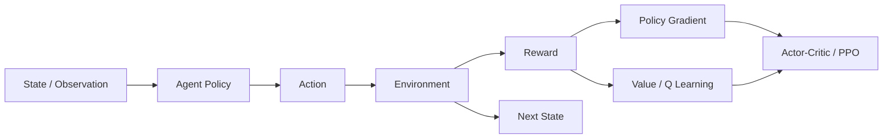

> 书目：*Hands-On Machine Learning with Scikit-Learn and PyTorch*<br>
> 章节：Chapter 19, Reinforcement Learning<br>
> 章节文件：19. Reinforcement Learning.md<br>
> 配套 Notebook：<https://homl.info/colab-p>

---

## 阅读导引

### 本章的问题链

监督学习给出“正确答案”，强化学习（RL）只给延迟、稀疏、带噪的 reward。Agent 的 actions 又会改变未来 data distribution，因此不能简单把历史数据当 IID labels。

本章按三大家族推进：

1. **Policy gradients**：直接让高回报 actions 更可能；
2. **Value-based methods / DQN**：先学 state/action 的长期价值，再 greedy 行动；
3. **Actor-Critic / PPO**：actor 学 policy，critic 降低 policy-gradient variance，PPO 限制更新幅度。



### 运行边界

当前 `.venv` 有 Python 3.12、PyTorch 2.11 CPU，无 `gymnasium`、`stable_baselines3`、`ale_py`。本文自包含 MDP/PyTorch 代码在本机执行；CartPole/LunarLander/BipedalWalker/Atari 代码提供完整依赖和实验方案，但不虚构训练结果。

### 一句话概括

$$
\boxed{
\text{RL 用与环境交互产生的数据，估计 action 对长期回报的因果贡献，}
\text{并在 exploration、bootstrapping 与 function approximation 的不稳定性中改进 policy。}
}
$$

---

## 0. 数学建模与术语

### 0.1 Agent-Environment Loop

时间 $t$：agent 看到 observation $o_t$（完全可观测时等于 state $s_t$），从 policy：

$$
a_t\sim\pi_\theta(a\mid o_t)
$$

Environment 返回：

$$
s_{t+1}\sim P(\cdot\mid s_t,a_t),
\qquad r_{t+1}=R(s_t,a_t,s_{t+1})
$$

Episode trajectory：

$$
\tau=(s_0,a_0,r_1,s_1,a_1,r_2,\ldots,s_T)
$$

注意 reward index conventions 不统一；本文用 $r_{t+1}$ 表示执行 $a_t$ 后获得的 reward，原书部分公式简写为 $r_t$。

### 0.2 Return 与 Discount Factor

从时刻 $t$ 的 discounted return：

$$
\boxed{
G_t=\sum_{k=0}^{T-t-1}\gamma^k r_{t+k+1}
}
$$

$0\le\gamma\le1$。Continuing infinite horizon 通常要求 $\gamma<1$ 且 rewards bounded，使 sum 有限。Effective horizon 约 $1/(1-\gamma)$；reward 半衰期满足：

$$
\gamma^h=1/2
\Rightarrow
h=\frac{\log(1/2)}{\log\gamma}
$$

$\gamma$ 既是数值/variance 控制，也改变 optimization objective，所以可改变 optimal policy：高 $\gamma$ 更愿承担短期代价换长期 reward。

### 0.3 State Value、Action Value 与 Advantage

Policy $\pi$ 下：

$$
V^\pi(s)=\mathbb E_\pi[G_t\mid S_t=s]
$$

$$
Q^\pi(s,a)=\mathbb E_\pi[G_t\mid S_t=s,A_t=a]
$$

$$
A^\pi(s,a)=Q^\pi(s,a)-V^\pi(s)
$$

Advantage 表示 action 比该 state 的 policy 平均表现好多少。按 policy 平均：

$$
\mathbb E_{a\sim\pi}[A^\pi(s,a)]=0
$$

### 0.4 RL 与 Supervised/Unsupervised 的区别

| 维度 | Supervised | Unsupervised/Self-supervised | RL |
| --- | --- | --- | --- |
| Signal | 每样本 target | data structure/pretext target | reward |
| Data | 通常固定 IID dataset | 通常固定 dataset | policy-dependent trajectories |
| Feedback | 即时 | 即时 objective | 稀疏/延迟 |
| Decision effect | 不改变 labels | 不改变 data source | action 改变未来 states/data |
| 核心难点 | Generalization | Representation/distribution | Credit + exploration + stability |

Offline RL 可使用固定 logged data，但仍需处理 counterfactual actions 与 behavior-policy coverage。

---

## 1. What Is Reinforcement Learning?

RL agent 通过 trial and error maximize expected cumulative reward，而不是每一步 reward。Examples：robot motors、Atari joystick、Go moves、thermostat settings、trading positions、recommendations/ads、attention control。

Reward 可以全为负：maze 每步 -1 会鼓励尽快离开。Reward design 决定 agent 真正优化什么，而不是设计者心里想什么；错误 proxy 会 reward hacking。

### 1.1 Markov 与 Partial Observability

Markov property：

$$
P(s_{t+1}\mid s_0,a_0,\ldots,s_t,a_t)
=P(s_{t+1}\mid s_t,a_t)
$$

State 必须包含预测未来所需信息。Observation 缺 velocity/noisy 时不是 Markov，形成 POMDP；可 stack history、RNN/Transformer memory 或 belief state。

### 1.2 Online Evaluation 的陷阱

性能应以独立 evaluation episodes 的 undiscounted/discounted return distribution 衡量：mean、median、std、quantiles、success rate、safety violations 和 sample efficiency。Training loss 不是 agent performance。要多个 seeds 和 confidence intervals，且 eval policy 常 deterministic/no exploration。

---

## 2. Policy Gradients

Policy 是从 state/observation 到 action distribution 的规则。Deterministic policy $\mu(s)$ 直接选 action；stochastic policy $\pi(a\mid s)$ 保留 exploration，在 multi-modal/partial observability 下也可能本质需要随机。

Policy search 可 brute force、evolution strategies/genetic algorithms；policy gradient 利用 expected return 对 parameters 的 gradient。

### 2.1 Introduction to Gymnasium

Gymnasium 统一 environment interface：

```python
import gymnasium as gym

environment = gym.make(
    "CartPole-v1", render_mode="rgb_array", max_episode_steps=1000
)
observation, info = environment.reset(seed=42)
action = environment.action_space.sample()
next_observation, reward, terminated, truncated, info = environment.step(
    action
)
environment.close()
```

- `terminated=True`：MDP terminal（失败/成功），未来 value 为 0；
- `truncated=True`：外部 time limit 等截断，不一定 terminal，value target 通常应 bootstrap；
- 原书为简化把两者都当结束，但 modern implementations 应区分。

CartPole observation：cart position/velocity、pole angle/angular velocity；action 0/1；每存活一步 reward 1。Basic angle-sign policy 官方 500 episodes：mean `41.698`、std `8.389`、range 24–63。

### 2.2 Neural Network Policies

Discrete actions：network 输出 logits，构造 Categorical/Bernoulli；continuous actions：输出 Gaussian mean/log-std，动作若有 bounds 可经 Tanh transform 并修正 log probability。

```python
import torch
import torch.nn as nn
import torch.nn.functional as F


class PolicyNetwork(nn.Module):
    def __init__(self, state_dim=4, action_count=2):
        super().__init__()
        self.network = nn.Sequential(
            nn.Linear(state_dim, 32), nn.Tanh(),
            nn.Linear(32, action_count),
        )

    def distribution(self, states):
        return torch.distributions.Categorical(logits=self.network(states))


torch.manual_seed(42)
policy = PolicyNetwork()
states = torch.randn(5, 4)
distribution = policy.distribution(states)
actions = distribution.sample()
log_probabilities = distribution.log_prob(actions)
print(actions.shape, log_probabilities.shape)
print("probability sums:", distribution.probs.sum(dim=-1))
```

Sampling 而非 argmax 形成 exploration；evaluation 可 argmax，但 training 要保持与 policy gradient log-prob 对应的 stochastic sampling。

### 2.3 Credit Assignment Problem

Delayed reward 无法直接说明之前哪些 actions 好。Monte Carlo return 把 action 后所有 rewards 归因给它：

$$
G_t=r_{t+1}+\gamma G_{t+1}
$$

```python
def compute_returns(rewards, discount_factor):
    returns = torch.empty(len(rewards), dtype=torch.float32)
    running_return = 0.0
    for index in range(len(rewards) - 1, -1, -1):
        running_return = rewards[index] + discount_factor * running_return
        returns[index] = running_return
    return returns


print(compute_returns([10, 0, -50], 0.8).tolist())
```

输出 `[-22,-40,-50]`。低 $\gamma$ 缩短 credit path/variance，却引入 myopia；高 $\gamma$ 更贴近 long-term objective，但 variance 大。

### 2.4 Policy Gradient Theorem 的核心推导

目标：

$$
J(\theta)=\mathbb E_{\tau\sim p_\theta(\tau)}[R(\tau)]
$$

Trajectory probability：

$$
p_\theta(\tau)
=\rho_0(s_0)
\prod_t\pi_\theta(a_t\mid s_t)
P(s_{t+1}\mid s_t,a_t)
$$

Environment dynamics 不依赖 $\theta$。用 log-derivative trick $\nabla p=p\nabla\log p$：

$$
\begin{aligned}
\nabla_\theta J
&=\int R(\tau)\nabla_\theta p_\theta(\tau)d\tau\\
&=\mathbb E_\tau\left[
R(\tau)\nabla_\theta\log p_\theta(\tau)
\right]\\
&=\mathbb E_\tau\left[
R(\tau)\sum_t
\nabla_\theta\log\pi_\theta(a_t\mid s_t)
\right]
\end{aligned}
$$

过去 rewards 不受当前 action 影响，可用 reward-to-go $G_t$ 替代 total trajectory return，保持期望不变并降 variance：

$$
\boxed{
\nabla_\theta J
=\mathbb E\left[
\sum_tG_t\nabla_\theta\log\pi_\theta(a_t\mid s_t)
\right]
}
$$

Reward 不可导也没关系：gradient 通过 action log probability，environment 只提供 scalar sample。

### 2.5 Baseline 为什么不引入 Bias

减去只依赖 state 的 baseline $b(s_t)$：

$$
\mathbb E_{a\sim\pi}
[b(s)\nabla_\theta\log\pi_\theta(a\mid s)]
=b(s)\nabla_\theta\sum_a\pi_\theta(a\mid s)=0
$$

所以 $G_t-b(s_t)$ 仍无偏，且恰当 baseline 大幅降 variance。Actor-Critic 用 learned $V(s)$，得到 advantage estimate。Batch 内 return standardization 也常用，但 finite-batch normalization 严格说会改变 estimator/scaling，实践上稳定。

### 2.6 公式 19-1：REINFORCE Loss

Gradient ascent $J$ 等价 minimize：

$$
\boxed{
\mathcal L(\theta)
=-\sum_t\log\pi_\theta(a_t\mid s_t)
\,\hat A_t
}
$$

原书用 return $r_t$（更准确记作 $G_t$）；$\hat A_t$ 可为 standardized return 或 return-baseline。Positive advantage 增大 action probability，negative 则减小。

```python
def reinforce_loss(log_probabilities, rewards,
                   discount_factor=0.95):
    returns = compute_returns(rewards, discount_factor)
    advantages = (returns - returns.mean()) / (
        returns.std(unbiased=False) + 1e-8
    )
    return -(torch.stack(log_probabilities) * advantages).sum(), returns


torch.manual_seed(7)
toy_policy = PolicyNetwork(state_dim=3, action_count=2)
toy_states = torch.randn(4, 3)
toy_dist = toy_policy.distribution(toy_states)
toy_actions = toy_dist.sample()
toy_logs = list(toy_dist.log_prob(toy_actions).unbind())
loss, returns = reinforce_loss(toy_logs, [1.0, 0.0, 2.0, -1.0], 0.9)
loss.backward()
print("returns:", returns.tolist())
print("policy gradient exists:",
      toy_policy.network[0].weight.grad is not None)
```

### 2.7 CartPole REINFORCE 完整训练接口

```python
def run_episode(model, environment, seed=None):
    observation, _ = environment.reset(seed=seed)
    log_probabilities, rewards = [], []
    while True:
        state = torch.as_tensor(observation, dtype=torch.float32)
        distribution = model.distribution(state)
        action = distribution.sample()
        observation, reward, terminated, truncated, _ = environment.step(
            action.item()
        )
        log_probabilities.append(distribution.log_prob(action))
        rewards.append(reward)
        if terminated or truncated:
            return log_probabilities, rewards


def train_reinforce(model, environment, episodes=200, gamma=0.95):
    optimizer = torch.optim.NAdam(model.parameters(), lr=0.01)
    totals = []
    for episode in range(episodes):
        logs, rewards = run_episode(model, environment, seed=episode)
        loss, _ = reinforce_loss(logs, rewards, gamma)
        optimizer.zero_grad(set_to_none=True)
        loss.backward()
        optimizer.step()
        totals.append(sum(rewards))
    return totals
```

REINFORCE 用完整 episodes 才更新，unbiased 但 high variance、sample inefficient；on-policy data 不能反复无限复用。Reward shaping、demonstration pretraining 可注入 prior knowledge，但 shaping 若改变 optimal policy 会优化错目标。

---

## 3. Value-Based Methods

Policy-gradient 直接更新 policy；value-based 先估计“长期好坏”，再选 value 最大 action。Tabular methods 适合小 state/action，DQN 用 neural function approximation 泛化到巨大 state space。

### 3.1 Markov Decision Processes

Finite discounted MDP：

$$
\mathcal M=(\mathcal S,\mathcal A,P,R,\gamma)
$$

- $\mathcal S$：states；
- $\mathcal A(s)$：state 可选 actions；
- $P(s'\mid s,a)$：transition probability；
- $R(s,a,s')$：transition reward；
- $\gamma$：discount。

Policy-induced Bellman expectation equations：

$$
V^\pi(s)
=\sum_a\pi(a\mid s)
\sum_{s'}P(s'\mid s,a)
[R(s,a,s')+\gamma V^\pi(s')]
$$

$$
Q^\pi(s,a)
=\sum_{s'}P(s'\mid s,a)
[R(s,a,s')+\gamma\sum_{a'}\pi(a'\mid s')Q^\pi(s',a')]
$$

这些公式来自 return recursion $G_t=r_{t+1}+\gamma G_{t+1}$ 的 conditional expectation。

### 3.2 公式 19-2：Bellman Optimality

最优 value：

$$
V^*(s)=\max_\pi V^\pi(s)
$$

第一步选 action，之后仍最优（principle of optimality）：

$$
\boxed{
V^*(s)=\max_a\sum_{s'}P(s'\mid s,a)
[R(s,a,s')+\gamma V^*(s')]
}
$$

定义 Bellman optimality operator：

$$
(\mathcal TV)(s)=\max_a\sum_{s'}P(s'\mid s,a)
[R+\gamma V(s')]
$$

对 sup norm，利用 `max` 非扩张和 probabilities sum 1：

$$
\|\mathcal TV-\mathcal TU\|_\infty
\le\gamma\|V-U\|_\infty
$$

$\gamma<1$ 时是 contraction。Banach fixed-point theorem 保证唯一 fixed point $V^*$，迭代收敛，误差上界：

$$
\|V_k-V^*\|_\infty
\le\gamma^k\|V_0-V^*\|_\infty
$$

Finite episodic undiscounted MDP 也可收敛，但需要 proper termination 等额外条件；不能盲目把 continuing $\gamma=1$ 套入 contraction proof。

### 3.3 公式 19-3：Value Iteration

$$
\boxed{
V_{k+1}(s)
=\max_a\sum_{s'}P(s'\mid s,a)
[R(s,a,s')+\gamma V_k(s')]
}
$$

每轮应用一次 Bellman operator。收敛后 greedy policy：

$$
\pi^*(s)\in\arg\max_a
\sum_{s'}P(s'\mid s,a)[R+\gamma V^*(s')]
$$

Value iteration 是 model-based dynamic programming：需要已知完整 $P,R$，每轮遍历 states/actions/next states。

### 3.4 公式 19-4：Q-Value Iteration

$$
\boxed{
Q_{k+1}(s,a)
=\sum_{s'}P(s'\mid s,a)
[R(s,a,s')+\gamma\max_{a'}Q_k(s',a')]
}
$$

$$
\pi^*(s)\in\arg\max_aQ^*(s,a)
$$

Q 直接编码 action choice，不需再用 known transition model 提取 policy。

### 3.5 书中三状态 MDP 可运行验证

```python
import numpy as np

transition_probabilities = [
    [[0.7, 0.3, 0.0], [1.0, 0.0, 0.0], [0.8, 0.2, 0.0]],
    [[0.0, 1.0, 0.0], None, [0.0, 0.0, 1.0]],
    [None, [0.8, 0.1, 0.1], None],
]
rewards = [
    [[10, 0, 0], [0, 0, 0], [0, 0, 0]],
    [[0, 0, 0], None, [0, 0, -50]],
    [None, [40, 0, 0], None],
]
possible_actions = [[0, 1, 2], [0, 2], [1]]


def q_value_iteration(discount_factor, iterations=100):
    q_values = np.full((3, 3), -np.inf)
    for state, actions in enumerate(possible_actions):
        q_values[state, actions] = 0.0
    for _ in range(iterations):
        previous = q_values.copy()
        for state, actions in enumerate(possible_actions):
            for action in actions:
                q_values[state, action] = sum(
                    transition_probabilities[state][action][next_state]
                    * (rewards[state][action][next_state]
                       + discount_factor * previous[next_state].max())
                    for next_state in range(3)
                )
    return q_values


q_090 = q_value_iteration(0.90)
q_095 = q_value_iteration(0.95)
print(np.round(q_090, 3))
print("policy gamma=.90:", q_090.argmax(axis=1).tolist())
print("policy gamma=.95:", q_095.argmax(axis=1).tolist())
```

书中 $\gamma=.90$ Q-values 约：`[[18.919,17.027,13.622],[0,-inf,-4.880],[-inf,50.134,-inf]]`，policy `[0,0,1]`；$\gamma=.95$ 时 state 1 改选 action 2，证明 discount 改变 optimal policy。

### 3.6 Temporal Difference Learning

Unknown $P,R$ 时，TD(0) 用 observed transition bootstrap：

### 3.6.1 公式 19-5

$$
\boxed{
V(s)\leftarrow V(s)+\alpha\delta_t
}
$$

$$
\boxed{
\delta_t=r_{t+1}+\gamma V(s_{t+1})-V(s_t)
}
$$

TD target $r+\gamma V(s')$ 同时含 sample reward 和当前 estimate。相比 Monte Carlo：

| 方法 | 等 episode 结束？ | Bootstrap | Bias | Variance |
| --- | --- | --- | --- | --- |
| MC | 是 | 否 | 低/无 | 高 |
| TD(0) | 否 | 是 | 初期有 | 较低 |

TD update 等价对 semi-gradient squared TD error 做 step：target 被 stop-gradient。严格 convergence 需 Markov sampling、sufficient visitation、tabular/合适 function approximation，以及 Robbins-Monro learning rates $\sum\alpha_t=\infty,\sum\alpha_t^2<\infty$ 等。

### 3.7 Q-Learning

### 3.7.1 公式 19-6

$$
\boxed{
Q(s,a)\leftarrow Q(s,a)
{}+\alpha\left[r+\gamma\max_{a'}Q(s',a')-Q(s,a)
\right]
}
$$

TD error：

$$
\delta=r+\gamma\max_{a'}Q(s',a')-Q(s,a)
$$

Behavior policy 可 random/epsilon-greedy，target policy 是 greedy，故 Q-learning 是 **off-policy**。Tabular convergence 要所有 $(s,a)$ 无限访问、learning rate 衰减、stationary finite MDP；function approximation 下不保证。

```python
def sample_mdp_step(state, action, rng):
    probabilities = transition_probabilities[state][action]
    next_state = rng.choice(3, p=probabilities)
    return next_state, rewards[state][action][next_state]


def tabular_q_learning(iterations=60_000, gamma=0.90, seed=42):
    rng = np.random.default_rng(seed)
    q_values = np.full((3, 3), -np.inf)
    visit_counts = np.zeros((3, 3), dtype=int)
    for state, actions in enumerate(possible_actions):
        q_values[state, actions] = 0.0
    state = 0
    for _ in range(iterations):
        action = rng.choice(possible_actions[state])
        next_state, reward = sample_mdp_step(state, action, rng)
        visit_counts[state, action] += 1
        learning_rate = 1.0 / visit_counts[state, action] ** 0.6
        td_target = reward + gamma * q_values[next_state].max()
        q_values[state, action] += learning_rate * (
            td_target - q_values[state, action]
        )
        state = next_state
    return q_values


learned_q = tabular_q_learning()
print(np.round(learned_q, 2))
print("learned policy:", learned_q.argmax(axis=1).tolist())
```

### 3.8 Exploration Policies

Epsilon-greedy：

$$
a=\begin{cases}
random,&\text{probability }\epsilon\\
\arg\max_aQ(s,a),&\text{probability }1-\epsilon
\end{cases}
$$

常从 1 anneal 到 0.01–0.05。过快衰减会锁定次优；固定非零 $\epsilon$ 持续探索但降低 eval performance。

### 3.8.1 公式 19-7：Exploration Bonus

$$
\boxed{
Q(s,a)\leftarrow_\alpha
r+\gamma\max_{a'}f(Q(s',a'),N(s',a'))
}
$$

如：

$$
f(Q,N)=Q+\frac{\kappa}{1+N}
$$

少访问 action 获 bonus。Count-based 对巨大/continuous states 难；可用 pseudo-count、prediction error/curiosity、UCB/Thompson sampling。

### 3.9 Approximate Q-Learning and DQN

Table 无法覆盖图像状态，学习 $Q_\theta(s,a)$。Discrete action 下 network 输入 state，一次输出所有 action Q-values。

### 3.9.1 公式 19-8：DQN Target

$$
\boxed{
y=r+\gamma(1-d)
\max_{a'}Q_{\theta^-}(s',a')
}
$$

$d$ 表示 true terminal；$\theta^-$ 是 target parameters。原书初始实现同一 network 同时 prediction/target，易形成 moving-target feedback；现代 DQN 使用 target network。Loss：

$$
\mathcal L(\theta)
=\mathbb E[\operatorname{Huber}(Q_\theta(s,a)-y)]
$$

Target 必须 detach。Time-limit truncation 若 underlying state nonterminal，应 bootstrap，而不是将 `(terminated or truncated)` 都设 $d=1$。

### 3.10 Replay Buffer 为什么有效

Online consecutive transitions 强相关且 distribution 随 policy 快变。Uniform replay randomizes batches、复用 data、平滑 distribution，使 off-policy DQN 更 sample-efficient/stable。代价：old/stale policy data、内存大；on-policy REINFORCE/PPO 不可无 importance correction 随意 replay。

```python
from collections import deque, namedtuple
import random

Transition = namedtuple(
    "Transition", "state action reward next_state terminated"
)


class ReplayBuffer:
    def __init__(self, capacity=100_000):
        self.memory = deque(maxlen=capacity)

    def append(self, *transition):
        self.memory.append(Transition(*transition))

    def sample(self, batch_size):
        batch = random.sample(self.memory, batch_size)
        states = torch.tensor(np.stack([item.state for item in batch]),
                              dtype=torch.float32)
        actions = torch.tensor([item.action for item in batch])
        rewards_tensor = torch.tensor([item.reward for item in batch])
        next_states = torch.tensor(
            np.stack([item.next_state for item in batch]),
            dtype=torch.float32,
        )
        terminated = torch.tensor([item.terminated for item in batch])
        return states, actions, rewards_tensor, next_states, terminated
```

### 3.11 Implementing a DQN Training Step

```python
class DQN(nn.Module):
    def __init__(self, state_dim=4, action_count=2):
        super().__init__()
        self.network = nn.Sequential(
            nn.Linear(state_dim, 32), nn.ReLU(),
            nn.Linear(32, 32), nn.ReLU(),
            nn.Linear(32, action_count),
        )

    def forward(self, states):
        return self.network(states)


def dqn_training_step(online, target, optimizer, batch, gamma=0.99):
    states, actions, rewards_batch, next_states, terminated = batch
    predicted = online(states).gather(1, actions[:, None]).squeeze(1)
    with torch.no_grad():
        next_values = target(next_states).max(dim=1).values
        targets = rewards_batch + gamma * (~terminated).float() * next_values
    loss = F.smooth_l1_loss(predicted, targets)
    optimizer.zero_grad(set_to_none=True)
    loss.backward()
    torch.nn.utils.clip_grad_norm_(online.parameters(), 10.0)
    optimizer.step()
    return loss.item()
```

Agent performance 应画 episode return，不是 DQN loss；target 变高时 loss 可升但 policy 更好。

### 3.11.1 完整 CartPole DQN Loop

```python
def train_cartpole_dqn(environment, episodes=600, seed=42):
    torch.manual_seed(seed)
    random.seed(seed)
    online = DQN()
    target = DQN()
    target.load_state_dict(online.state_dict())
    target.eval()
    optimizer = torch.optim.Adam(online.parameters(), lr=1e-3)
    replay = ReplayBuffer(capacity=100_000)
    episode_returns = []
    environment_steps = 0

    for episode in range(episodes):
        observation, _ = environment.reset(seed=seed + episode)
        total_reward = 0.0
        epsilon = max(1.0 - episode / 400, 0.02)
        while True:
            if random.random() < epsilon:
                action = environment.action_space.sample()
            else:
                with torch.no_grad():
                    state = torch.as_tensor(observation, dtype=torch.float32)
                    action = online(state).argmax().item()
            next_observation, reward, terminated, truncated, _ = (
                environment.step(action)
            )
            # Replay 保留 true terminal；truncation 的 next state 仍可 bootstrap
            replay.append(
                observation, action, reward, next_observation, terminated
            )
            observation = next_observation
            total_reward += reward
            environment_steps += 1

            if len(replay.memory) >= 1_000:
                dqn_training_step(
                    online, target, optimizer, replay.sample(64), gamma=0.99
                )
            if environment_steps % 500 == 0:
                target.load_state_dict(online.state_dict())
            if terminated or truncated:
                break
        episode_returns.append(total_reward)
    return online, episode_returns
```

若 vector wrapper 在 truncation 后自动 reset，replay 的 `next_state` 必须使用 info 中的 final/terminal observation，而不是 reset 后 observation。

### 3.12 DQN Improvements

#### Target Network

Online 每步更新，target 每 $C$ steps hard copy：$\vartheta^-\leftarrow\vartheta$，或 soft Polyak（$\vartheta$ 表示 online parameters）：

$$
\vartheta^-\leftarrow\tau\vartheta+(1-\tau)\vartheta^-
$$

降低 moving target，但 target 太旧会慢。

#### Double DQN

Max noisy estimates 有 upward bias。Online 选 action，target 估值：

$$
a^*=\arg\max_aQ_\theta(s',a)
$$

$$
y=r+\gamma Q_{\theta^-}(s',a^*)
$$

Selection/evaluation noise 解耦，减少 overestimation。

#### Prioritized Experience Replay

Priority $p_i=|\delta_i|+\epsilon$，sampling：

$$
P(i)=\frac{p_i^\zeta}{\sum_jp_j^\zeta}
$$

Importance weight：

$$
w_i=(N P(i))^{-\beta},
\quad\text{通常 normalization 到 }\max_iw_i=1
$$

$\zeta=0$ uniform；$\beta\to1$ 渐进纠正 bias。新 transitions 给 max priority 保证至少 sample 一次。

#### Dueling DQN

分 value/advantage heads，但 decomposition 不可识别：$V+c,A-c$ 给同 Q。约束 mean advantage 0：

$$
\boxed{
Q(s,a)=V(s)+A(s,a)-\frac1{|\mathcal A|}
\sum_{a'}A(s,a')
}
$$

原书描述 subtract maximum 也可确保 best advantage 0；mean aggregation 更常见、gradient 更平滑。Dueling（architecture）不同于 Double（target）。Rainbow 组合 Double、PER、Dueling 等六种改进。

### 3.13 Deadly Triad

Function approximation + bootstrapping + off-policy 三者并存可 divergence，DQN 正好全有。Replay/target network/Double/Huber/clipping 缓解但无通用保证。这是深度 RL 不稳定的核心背景。

---

## 4. Actor-Critic Algorithms

Actor $\pi_\theta(a\mid s)$ 直接产生 actions；critic $V_\phi(s)$ 或 $Q_\phi(s,a)$ 估值，提供低 variance advantage。二者可共享 body 提高 representation efficiency，但 gradients 相互干扰，独立 networks 更稳定但参数/compute 多。

### 4.1 One-Step Actor-Critic

TD target：

$$
y_t=r_{t+1}+\gamma(1-d_t)V_\phi(s_{t+1})
$$

TD error/advantage estimate：

$$
\delta_t=y_t-V_\phi(s_t)
$$

Actor loss：

$$
\mathcal L_{actor}
=-\log\pi_\theta(a_t\mid s_t)
\,stopgrad(\delta_t)
$$

Critic loss：

$$
\mathcal L_{critic}
=\frac12(V_\phi(s_t)-stopgrad(y_t))^2
$$

Entropy bonus 鼓励 exploration：

$$
H(\pi(\cdot\mid s))
=-\sum_a\pi(a\mid s)\log\pi(a\mid s)
$$

总 loss：

$$
\mathcal L
=\mathcal L_{actor}
{}+c_v\mathcal L_{critic}
-c_eH
$$

必须 detach advantage/target，避免 actor loss 通过 critic“作弊”改变 baseline，而不是改变 policy。

```python
class ActorCritic(nn.Module):
    def __init__(self, state_dim=4, action_count=2):
        super().__init__()
        self.body = nn.Sequential(
            nn.Linear(state_dim, 32), nn.ReLU(),
            nn.Linear(32, 32), nn.ReLU(),
        )
        self.actor = nn.Linear(32, action_count)
        self.critic = nn.Linear(32, 1)

    def forward(self, states):
        features = self.body(states)
        return self.actor(features), self.critic(features).squeeze(-1)


def actor_critic_loss(model, states, actions, rewards,
                      next_states, terminated, gamma=0.99,
                      value_coefficient=0.5,
                      entropy_coefficient=0.01):
    logits, values = model(states)
    distribution = torch.distributions.Categorical(logits=logits)
    with torch.no_grad():
        _, next_values = model(next_states)
        targets = rewards + gamma * (~terminated).float() * next_values
        advantages = targets - values
    actor_loss = -(distribution.log_prob(actions) * advantages).mean()
    critic_loss = F.mse_loss(values, targets)
    entropy = distribution.entropy().mean()
    total = (
        actor_loss + value_coefficient * critic_loss
        - entropy_coefficient * entropy
    )
    return total, actor_loss, critic_loss, entropy


torch.manual_seed(42)
actor_critic = ActorCritic()
batch = 12
ac_loss = actor_critic_loss(
    actor_critic,
    torch.randn(batch, 4),
    torch.randint(0, 2, (batch,)),
    torch.randn(batch),
    torch.randn(batch, 4),
    torch.zeros(batch, dtype=torch.bool),
)[0]
ac_loss.backward()
print("actor-critic loss:", round(ac_loss.item(), 4))
print("actor/critic gradients:",
      actor_critic.actor.weight.grad is not None,
      actor_critic.critic.weight.grad is not None)
```

One-step bootstrap variance 低但 bias 高；Monte Carlo 相反。n-step return 在中间折中：

$$
G_t^{(n)}=\sum_{l=0}^{n-1}\gamma^lr_{t+l+1}
{}+\gamma^nV(s_{t+n})
$$

### 4.2 Generalized Advantage Estimation

TD residual：

$$
\delta_t=r_{t+1}+\gamma V(s_{t+1})-V(s_t)
$$

GAE：

$$
\boxed{
\hat A_t^{GAE(\gamma,\lambda)}
=\sum_{l=0}^{\infty}(\gamma\lambda)^l\delta_{t+l}
}
$$

Backward recursion：

$$
\hat A_t=\delta_t+\gamma\lambda(1-d_t)\hat A_{t+1}
$$

$\lambda=0$ 接近 one-step TD（低 variance/high bias），$\lambda=1$ 接近 Monte Carlo advantage（低 bias/high variance）。Critic target 常为 $\hat R_t=\hat A_t+V(s_t)$。

```python
@torch.no_grad()
def generalized_advantage_estimation(rewards, values, next_value,
                                     terminated, truncated, gamma=0.99,
                                     gae_lambda=0.95):
    advantages = torch.empty_like(rewards)
    running = torch.tensor(0.0, dtype=rewards.dtype)
    following_value = next_value
    for index in range(len(rewards) - 1, -1, -1):
        # Time-limit truncation 可以 bootstrap，但 rollout trace 到此必须结束
        bootstrap = 1.0 - terminated[index].float()
        trace_continuation = 1.0 - (
            terminated[index] | truncated[index]
        ).float()
        td_error = (
            rewards[index] + gamma * bootstrap * following_value
            - values[index]
        )
        running = (
            td_error + gamma * gae_lambda
            * trace_continuation * running
        )
        advantages[index] = running
        following_value = values[index]
    return advantages, advantages + values


advantages, value_targets = generalized_advantage_estimation(
    torch.tensor([1.0, 0.0, 2.0]),
    torch.tensor([0.4, 0.3, 0.2]),
    torch.tensor(0.0),
    torch.tensor([False, False, True]),
    torch.tensor([False, False, False]),
)
print("GAE:", advantages.tolist())
```

### 4.3 A3C、A2C 与 SAC

- **A3C**：多个 workers 异步探索，各自把 gradients push 到 shared model；decorrelated data，但 stale gradients/nondeterminism；
- **A2C**：vectorized environments 同步 rollout/update，GPU batching 更好；
- **SAC**：off-policy continuous control，maximize reward + entropy：

$$
J(\pi)=
\mathbb E\sum_t\gamma^t
[r_{t+1}+\alpha H(\pi(\cdot\mid s_t))]
$$

SAC 学 stochastic actor、双 Q critics 和 temperature，sample-efficient，适合 robotics/continuous actions；DQN 更适合 discrete，PPO 通用稳健但 on-policy sample efficiency 较低。

### 4.4 PPO 为什么限制 Policy Update

同一 rollout 多 epochs 更新 policy 后，data 来自 old policy $\pi_{old}$。Importance ratio：

$$
r_t(\theta)=
\frac{\pi_\theta(a_t\mid s_t)}
{\pi_{\theta_{old}}(a_t\mid s_t)}
=\exp(\log\pi_\theta-\log\pi_{old})
$$

Unclipped surrogate：

$$
L^{PG}=\mathbb E[r_t(\theta)\hat A_t]
$$

若 ratio 远离 1，一批 noisy advantages 可让 policy 巨变。PPO clipped objective maximize：

$$
\boxed{
L^{CLIP}(\theta)=
\mathbb E_t\left[
\min\left(
r_t(\theta)\hat A_t,
clip(r_t(\theta),1-\epsilon,1+\epsilon)\hat A_t
\right)
\right]
}
$$

分情况理解：

- $\hat A>0$：希望 ratio 增大，但超过 $1+\epsilon$ 不再奖励；
- $\hat A<0$：希望 ratio 减小，但低于 $1-\epsilon$ 不再奖励；
- `min` 取悲观 lower bound，防止 exploiting clipping。

Clipping 不严格保证 KL trust region，只是 practical approximation。还会监控 approximate KL、clip fraction，并可 early stop。

### 4.5 可运行 PPO Loss

```python
def ppo_loss(new_log_probabilities, old_log_probabilities,
             advantages, new_values, value_targets,
             entropy, clip_range=0.2,
             value_coefficient=0.5,
             entropy_coefficient=0.01):
    old_log_probabilities = old_log_probabilities.detach()
    advantages = advantages.detach()
    value_targets = value_targets.detach()
    probability_ratio = torch.exp(
        new_log_probabilities - old_log_probabilities
    )
    unclipped = probability_ratio * advantages
    clipped = probability_ratio.clamp(
        1 - clip_range, 1 + clip_range
    ) * advantages
    policy_loss = -torch.minimum(unclipped, clipped).mean()
    value_loss = F.mse_loss(new_values, value_targets)
    total = (
        policy_loss + value_coefficient * value_loss
        - entropy_coefficient * entropy.mean()
    )
    return total, policy_loss, value_loss, probability_ratio


old_logs = torch.log(torch.tensor([0.5, 0.5, 0.5, 0.5]))
new_logs = torch.log(torch.tensor([0.8, 0.2, 0.55, 0.45]))
ppo_result = ppo_loss(
    new_logs, old_logs,
    torch.tensor([1.0, 1.0, -1.0, -1.0]),
    torch.zeros(4), torch.ones(4), torch.ones(4) * 0.5,
)
print("ratios:", ppo_result[3].tolist())
print("PPO total loss:", round(ppo_result[0].item(), 4))
```

PPO training cycle：collect $N$ steps from parallel envs → compute GAE/targets → normalize advantages → shuffle minibatches → optimize actor/critic for several epochs → discard rollout and collect fresh on-policy data。

---

## 5. Mastering Atari Breakout with Stable-Baselines3 PPO

需要：

```text
pip install "stable-baselines3[extra]" "gymnasium[atari,accept-rom-license]" ale-py
```

Atari preprocess：210×160 RGB → 84×84 grayscale；多个 environments parallel。`NoFrameskip` 避免 environment 自己重复 action，再由 `VecFrameStack` 堆 4 frames，使 agent 看出 ball velocity。

```python
import ale_py
from stable_baselines3 import PPO
from stable_baselines3.common.callbacks import CheckpointCallback
from stable_baselines3.common.env_util import make_atari_env
from stable_baselines3.common.vec_env import VecFrameStack

training_env = make_atari_env(
    "BreakoutNoFrameskip-v4", n_envs=4, seed=42
)
stacked_env = VecFrameStack(training_env, n_stack=4)
ppo_model = PPO(
    "CnnPolicy",
    stacked_env,
    device="auto",
    learning_rate=2.5e-4,
    batch_size=256,
    n_steps=256,
    n_epochs=4,
    clip_range=0.1,
    vf_coef=0.5,
    ent_coef=0.01,
    gamma=0.99,
    tensorboard_log="ppo_breakout_logs",
    verbose=1,
)
checkpoint = CheckpointCallback(
    save_freq=max(100_000 // 4, 1),
    save_path="ppo_breakout_checkpoints",
)
ppo_model.learn(
    total_timesteps=30_000_000,
    progress_bar=True,
    callback=checkpoint,
)
ppo_model.save("ppo_breakout_final")
stacked_env.close()
```

`n_steps=256` 是每 env steps，所以 rollout size $4×256=1024$；`batch_size=256`，每 epoch 4 minibatches，共 `n_epochs=4` passes。`save_freq` 计 callback calls，vector env 每 call 推进 4 transitions，故除 4。

Hyperparameters：clip range 限 policy change；`vf_coef` value loss；`ent_coef` exploration entropy；short horizon gamma ~.95，long horizon .995–.999。训练不稳定时降 LR/clip、增 rollout/batch；探索不足增 entropy。

Evaluation 必须单独 env、deterministic policy、多个 episodes/seeds，不用训练 reward normalization statistics 错配。官方叙述：约 1M steps mean reward ~20，10M 近 human，50M 常 superhuman；这依版本/hardware/seed，不是保证。

```python
evaluation_env = make_atari_env(
    "BreakoutNoFrameskip-v4",
    n_envs=1,
    seed=123,
    wrapper_kwargs={
        "clip_reward": False,
        "terminal_on_life_loss": False,
    },
)
evaluation_env = VecFrameStack(evaluation_env, n_stack=4)
agent = PPO.load("ppo_breakout_final", env=evaluation_env)
observation = evaluation_env.reset()
episode_reward = 0.0
for _ in range(5000):
    action, _ = agent.predict(observation, deterministic=True)
    observation, reward, done, info = evaluation_env.step(action)
    episode_reward += float(reward[0])
    if done[0]:
        break
print("evaluation reward:", episode_reward)
evaluation_env.close()
```

关闭 reward clipping 和 life-loss terminal 后，evaluation reward 才是完整游戏 raw score，才能与 human score 比较。Atari sticky actions、no-op reset 等 protocol 仍会改变 scores，benchmark 必须注明环境版本和 wrappers。

---

## 6. Overview of Popular RL Algorithms

### 6.1 Model-Free 与 Model-Based

- Model-free：直接学 policy/value，不建环境 dynamics，如 REINFORCE、DQN、PPO、SAC；
- Model-based：已知或学习 $\hat P,\hat R$，可 planning/simulated rollouts，如 MCTS、AlphaZero、MuZero。

“有 neural network”不等于 model-based：value model 预测 return，不是环境 transition model。

### 6.2 AlphaGo、AlphaZero、MuZero

MCTS 重复 selection → expansion → simulation/evaluation → backup。UCT-style selection 平衡 value 与 visit uncertainty。AlphaGo 用 policy/value nets 辅助 search；AlphaGo Zero 单 network 输出 policy prior + state value，从 self-play 学；AlphaZero 泛化到 chess/shogi。

MuZero 不直接重建 observation，而学习 planning 所需 latent dynamics：

$$
h_t=h_\theta(o_{\le t}),
\quad
(r_{t+1},h_{t+1})=g_\theta(h_t,a_t),
\quad
(p_t,v_t)=f_\theta(h_t)
$$

它学 reward/value/policy-relevant model，不必预测所有 pixels/rules。Model bias 会让 planning exploitation model errors；real data/reanalysis 校正。

### 6.3 Curiosity-Based Exploration

Intrinsic reward 可取 forward-model prediction error：

$$
r_t^{int}=\eta
\|f_\phi(s_t,a_t)-\psi(s_{t+1})\|_2^2
$$

总 reward $r^{ext}+\beta r^{int}$。Agent 寻找“可学习但当前惊讶”的 states。Noisy-TV problem：不可控随机噪声永远难预测，会吸引 agent；用 controllable features、episodic novelty、RND 等缓解。

### 6.4 Open-Ended Learning

POET 同时 evolve environments 与 agents，环境逐渐加难（curriculum），agents 跨环境竞争/迁移。目标不是单一 task optimum，而是持续产生新 challenge/skill。难点：质量-多样性、资源无限增长、安全和评估没有固定终点。

### 6.5 算法选型速览

| 算法 | Action | On/Off-policy | Model | 特点 |
| --- | --- | --- | --- | --- |
| REINFORCE | Discrete/continuous | On | Free | 简单，高 variance |
| DQN | Discrete | Off | Free | Replay、高 sample efficiency、易不稳 |
| PPO | Both | On | Free | 通用、稳健、易并行 |
| SAC | Continuous | Off | Free | 最大熵、sample-efficient |
| TD3/DDPG | Continuous | Off | Free | Deterministic actor-critic |
| AlphaZero/MuZero | Discrete planning | Self-play | Based | Search + networks |

---

## 7. Exercises：问题 1–11

### 7.1 定义 RL；与监督/无监督区别

RL agent 在 environment 中 sequential decision，通过 actions 影响未来 states/data，目标 maximize expected cumulative reward。没有逐 action 正确 label，reward 可延迟/稀疏；data 非 IID 且由 policy 生成。监督学习从 fixed labeled examples 预测 targets；无监督/self-supervised 从 fixed data structure 学 representation/distribution。

### 7.2 三个新应用

| 应用 | Environment | Agent | Actions | Reward |
| --- | --- | --- | --- | --- |
| 数据中心冷却 | Thermal/servers simulator | Cooling controller | Fan/chiller setpoints | -energy -overheat penalty |
| 编译器优化 | Program/compiler/runtime | Optimization-pass policy | 选择 pass/order | -runtime -code size |
| 临床给药辅助 | Patient simulator/strict offline data | Dose policy | Dose/monitor/abstain | outcome -toxicity -cost |

医疗不能直接 online trial-and-error；需 causal/offline RL、simulator validation、constraints 和 human approval。

### 7.3 Discount Factor；会改变 Optimal Policy 吗？

$\gamma$ 将 $k$ 步后 reward 乘 $\gamma^k$。会改变：书中 MDP 在 .90 时 state 1 选 stay，.95 时愿承受 -50 换未来 +40 loop。Episodic evaluation 常看 undiscounted return，但 training 用近 1 的 $\gamma$ 控制 variance/bootstrapping。

### 7.4 怎样衡量 Agent Performance

在独立 eval episodes、固定 protocol 上报告 return mean/median/std/CI、success/safety rate、worst-tail、sample efficiency、wall-clock/compute。多个 seeds。训练 loss、单条最佳视频不能作为主要指标；与 random/heuristic/expert baselines 比。

### 7.5 Credit Assignment：何时发生、怎样缓解

Delayed/sparse reward 时，不知之前 actions 谁应得 credit。用 discounted reward-to-go、TD/n-step、critic baseline、GAE、eligibility traces、reward shaping（保持 policy invariance 的 potential-based shaping）、hierarchical RL/demonstrations。低 variance 往往以 bias 为代价。

### 7.6 Replay Buffer 的作用

打散 temporal correlation、平滑 nonstationary distribution、重复利用 expensive experience，支持 off-policy learning。代价是 stale data/内存/coverage bias。PER 聚焦大 TD errors，需 importance weights。On-policy PPO 不能任意长期 replay。

### 7.7 什么是 Off-Policy？好处是什么？

Behavior policy $\mu$ 生成 data，target policy $\pi$ 被学习，二者可不同。Q-learning/DQN/SAC 是 off-policy；可复用 old logs、expert/random data，sample-efficient，支持 replay/offline RL。风险是 distribution shift/extrapolation error；policy-gradient correction 常需 importance ratio $\pi/\mu$。

### 7.8 什么是 Model-Based？举例

使用已知/学习的 environment dynamics/reward 来 plan。Examples：dynamic programming（known MDP）、Dyna-Q、MCTS+AlphaGo/AlphaZero、MuZero、model-predictive control、Dreamer。优势可 imaginary rollouts/高 sample efficiency；风险 model bias compounding。

### 7.9 Policy Gradient Solve LunarLander

LunarLander-v2 在新 Gymnasium versions 可能改为 `LunarLander-v3`；运行前查 registry。下面实现 one-episode Monte Carlo actor-critic（policy gradient + value baseline）；若要更低 variance，可同时收集多 episodes 后更新。

```python
import gymnasium as gym


class LunarActorCritic(nn.Module):
    def __init__(self, state_dim=8, action_count=4):
        super().__init__()
        self.body = nn.Sequential(
            nn.Linear(state_dim, 128), nn.Tanh(),
            nn.Linear(128, 128), nn.Tanh(),
        )
        self.actor = nn.Linear(128, action_count)
        self.critic = nn.Linear(128, 1)

    def forward(self, states):
        features = self.body(states)
        return self.actor(features), self.critic(features).squeeze(-1)


def collect_lunar_episode(model, environment, seed):
    observation, _ = environment.reset(seed=seed)
    states, actions, rewards = [], [], []
    while True:
        state = torch.as_tensor(observation, dtype=torch.float32)
        logits, _ = model(state)
        distribution = torch.distributions.Categorical(logits=logits)
        action = distribution.sample()
        next_observation, reward, terminated, truncated, _ = (
            environment.step(action.item())
        )
        states.append(state)
        actions.append(action)
        rewards.append(reward)
        observation = next_observation
        if terminated or truncated:
            final_state = torch.as_tensor(
                next_observation, dtype=torch.float32
            )
            return (
                torch.stack(states), torch.stack(actions), rewards,
                final_state, terminated, truncated,
            )


environment = gym.make("LunarLander-v3")
lunar_agent = LunarActorCritic()
optimizer = torch.optim.Adam(lunar_agent.parameters(), lr=3e-4)
for update in range(2000):
    states, actions, rewards, final_state, terminated, truncated = (
        collect_lunar_episode(
        lunar_agent, environment, seed=update
        )
    )
    returns = compute_returns(rewards, 0.99)
    if truncated and not terminated:
        with torch.no_grad():
            _, bootstrap_value = lunar_agent(final_state)
        powers = torch.pow(
            torch.tensor(0.99),
            torch.arange(len(returns), 0, -1, dtype=torch.float32),
        )
        returns = returns + powers * bootstrap_value
    logits, values = lunar_agent(states)
    distribution = torch.distributions.Categorical(logits=logits)
    advantages = returns - values.detach()
    actor_loss = -(distribution.log_prob(actions) * advantages).mean()
    critic_loss = F.mse_loss(values, returns)
    entropy = distribution.entropy().mean()
    loss = actor_loss + 0.5 * critic_loss - 0.01 * entropy
    optimizer.zero_grad(set_to_none=True)
    loss.backward()
    torch.nn.utils.clip_grad_norm_(lunar_agent.parameters(), 1.0)
    optimizer.step()
    if (update + 1) % 100 == 0:
        print(update + 1, sum(rewards))
environment.close()


@torch.no_grad()
def evaluate_lunar(model, episodes=100):
    evaluation_env = gym.make("LunarLander-v3")
    totals = []
    model.eval()
    for episode in range(episodes):
        observation, _ = evaluation_env.reset(seed=10_000 + episode)
        total = 0.0
        while True:
            state = torch.as_tensor(observation, dtype=torch.float32)
            logits, _ = model(state)
            action = logits.argmax().item()
            observation, reward, terminated, truncated, _ = (
                evaluation_env.step(action)
            )
            total += reward
            if terminated or truncated:
                break
        totals.append(total)
    evaluation_env.close()
    return np.mean(totals), np.std(totals)


print("Lunar eval mean/std:", evaluate_lunar(lunar_agent))
```

任务通常以 100 episodes average reward ≥200 视为 solved（以当前 env spec 为准）。必须多 seeds、独立 deterministic/stochastic eval。当前本机未安装 Box2D/Gym，未实跑结果。

### 7.10 Solve BipedalWalker

Continuous 4D actions，SAC 通常比 vanilla PG sample-efficient。Stable-Baselines3：

```python
from stable_baselines3 import SAC
from stable_baselines3.common.callbacks import EvalCallback
from stable_baselines3.common.evaluation import evaluate_policy
from stable_baselines3.common.env_util import make_vec_env

training_environment = make_vec_env("BipedalWalker-v3", n_envs=1, seed=42)
evaluation_environment = make_vec_env("BipedalWalker-v3", n_envs=1, seed=123)
evaluation_callback = EvalCallback(
    evaluation_environment,
    best_model_save_path="best_bipedal_sac",
    eval_freq=10_000,
    n_eval_episodes=10,
    deterministic=True,
)
sac_agent = SAC(
    "MlpPolicy",
    training_environment,
    learning_rate=3e-4,
    buffer_size=1_000_000,
    learning_starts=10_000,
    batch_size=256,
    gamma=0.99,
    tau=0.005,
    train_freq=1,
    gradient_steps=1,
    verbose=1,
    seed=42,
)
sac_agent.learn(total_timesteps=1_000_000, callback=evaluation_callback)
sac_agent.save("bipedal_sac_final")
best_agent = SAC.load(
    "best_bipedal_sac/best_model", env=evaluation_environment
)
episode_returns, episode_lengths = evaluate_policy(
    best_agent,
    evaluation_environment,
    n_eval_episodes=20,
    deterministic=True,
    return_episode_rewards=True,
)
print("Bipedal eval mean/std:",
      float(np.mean(episode_returns)), float(np.std(episode_returns)))
training_environment.close()
evaluation_environment.close()
```

Classic BipedalWalker 通常以 100 consecutive episodes average ≥300 为 solved criterion（核对当前 spec）；20 episodes 只做快速评估，正式结论应至少 100。若使用 Hardcore variant 难度显著增加。当前依赖缺失，未实跑。

### 7.11 Raspberry Pi Robot

安全路线：

1. 先手写 controller 与 emergency stop；
2. Simulator/digital twin 训练，加入 sensor/action latency/noise/domain randomization；
3. Behavioral cloning 初始化；
4. 低速、软边界、有人监管的 real-world fine-tune；
5. Reward 同时含目标、能耗、碰撞/速度/距离 constraints；
6. Shield/safety controller 覆盖危险 RL action；
7. 日志、限时、断电保护。

不要让真实机器人从随机 policy 无约束探索。Raspberry Pi 可 inference，小模型 training 更适合外部机器；相机 object detection 与 motor RL 应先模块化验证。

---

## 8. 公式与 API 速查

### 8.1 核心公式

| 概念 | 公式 |
| --- | --- |
| Return | $G_t=\sum_k\gamma^kr_{t+k+1}$ |
| REINFORCE | $-\sum_t\log\pi_\theta(a_t\mid s_t)\hat A_t$ |
| Bellman optimal | $V^*=\max_aE[R+\gamma V^*]$ |
| TD error | $\delta=r+\gamma V(s')-V(s)$ |
| Q-learning | $Q\leftarrow Q+\alpha[r+\gamma\max Q'-Q]$ |
| DQN target | $y=r+\gamma(1-d)\max Q_{\theta^-}(s',a')$ |
| GAE | $\hat A_t=\sum_l(\gamma\lambda)^l\delta_{t+l}$ |
| PPO ratio | $r_t=\pi_\theta/\pi_{old}$ |
| PPO clip | $E[\min(rA,clip(r,1-\epsilon,1+\epsilon)A)]$ |
| SAC objective | $E\sum\gamma^t[r+\alpha H]$ |

### 8.2 APIs

| API | 用途 | 陷阱 |
| --- | --- | --- |
| `env.reset(seed=...)` | New episode | 返回 `(obs, info)` |
| `env.step(action)` | Transition | 区分 terminated/truncated |
| `Categorical(logits=...)` | Discrete stochastic policy | 不要先 softmax 再当 logits |
| `distribution.log_prob` | Policy gradient | action 必须来自对应 policy |
| `torch.no_grad()` | TD targets/eval | Actor training 不可包住 |
| `deque` replay | Small buffer | 大 buffer random access 慢 |
| SB3 `PPO`/`SAC` | Production-grade baseline | Env/wrapper/API versions |

---

## 9. 常见误解

1. **“Reward 就是监督 label。”** 它通常延迟且只评价 trajectory outcome。
2. **“Agent maximize 每步 reward。”** 目标是 expected cumulative return。
3. **“Observation 总是 Markov state。”** Partial/noisy observation 需 memory/belief。
4. **“高 gamma 只是训练慢，不改答案。”** 会改变 objective/optimal policy。
5. **“Policy gradient 要对 environment 求导。”** Log-derivative 只对 policy 求导。
6. **“Baseline 会改变目标。”** Action-independent baseline expectation gradient 为 0。
7. **“REINFORCE loss 下降代表 agent 更好。”** 必须看 eval return。
8. **“TD target 是真实 label。”** 它包含当前 bootstrap estimate，会移动/有 bias。
9. **“Off-policy 可从任意 data 学任意 policy。”** 仍需 action/state coverage，存在 extrapolation error。
10. **“Replay 越大越好。”** Old data stale，random access/memory 成本增加。
11. **“DQN 可直接连续动作 argmax。”** Continuous argmax 本身是 optimization problem。
12. **“Dueling DQN 就是 Double DQN。”** 前者 architecture，后者 target selection。
13. **“Target network 消除不稳定。”** 只是缓解 deadly triad。
14. **“Actor-Critic 一定比 REINFORCE 无偏。”** Critic bootstrap 引入 bias、降低 variance。
15. **“PPO clipping 保证 KL bound。”** 它只是 surrogate heuristic，仍需监控 KL。
16. **“Truncation 与 terminal 相同。”** Time limit 通常应 bootstrap。
17. **“同一 seed 成功说明算法稳定。”** RL 对 seeds 极敏感，需分布统计。
18. **“Simulator 成功即可部署机器人。”** Sim-to-real gap 与安全 constraints 必须处理。

---

## 10. 工程与安全检查清单

- [ ] 明确 state/observation、action、transition、reward、termination；
- [ ] 检查 reward hacking 与 unintended incentives；
- [ ] 区分 terminated/truncated，正确 bootstrap；
- [ ] 多 seeds 报 mean/std/CI、success 和 tail safety；
- [ ] Evaluation env 与 training 隔离，关闭 exploration；
- [ ] 记录 env/version/wrappers、frameskip、normalization；
- [ ] Replay 检查 coverage、age、priority bias；
- [ ] DQN 使用 target/Double/Huber/clipping 等稳定手段；
- [ ] PPO 监控 KL、clip fraction、entropy、value explained variance；
- [ ] Offline RL 避免超出 behavior support；
- [ ] Real-world actions 有 bounds、shield、emergency stop 和 human approval；
- [ ] 保存 checkpoints、replay/config、seed 和实际 evaluation videos；
- [ ] 不用 training loss 或单次最佳 return 作为结论。

---

## 11. 本章总结

1. RL 的核心是 policy-dependent sequential data、delayed credit 和 exploration。
2. REINFORCE 用 likelihood-ratio 将 return 转为 policy gradient，无需 environment differentiable；baseline 降 variance。
3. Bellman recursion 把长期 return 分解为 immediate reward + next value；discounted Bellman operator 是 contraction。
4. TD/Q-learning 在 unknown MDP 上 bootstrap；Q-learning off-policy，但需充分 exploration。
5. DQN 以 neural Q 泛化，replay 降 correlation，target/Double/PER/Dueling 改善稳定性与效率。
6. Actor-Critic 用 critic advantage 指导 actor；GAE 以 $\lambda$ 控制 bias-variance。
7. PPO 通过 clipped importance ratio 限制 destructive policy updates；SAC 以最大熵提升 continuous-control sample efficiency。
8. AlphaZero/MuZero 将 learned models/values/policies 与 search 结合；curiosity/OEL 扩展 sparse reward 和持续学习。
9. RL 结果必须多 seeds、独立评估和安全约束；真实系统不能无保护 trial-and-error。

$$
\boxed{
\operatorname{Interact}
\rightarrow\text{Estimate Long-Term Credit}
\rightarrow\text{Improve Policy}
\rightarrow\text{Explore Safely}
\rightarrow\text{Evaluate Across Seeds and Environments}
}
$$
