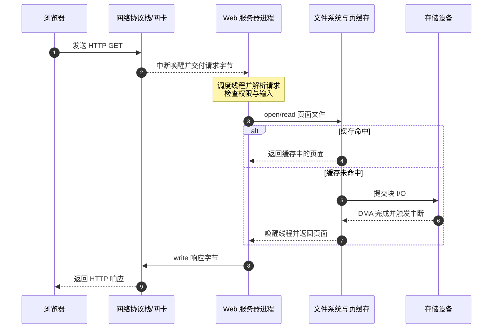
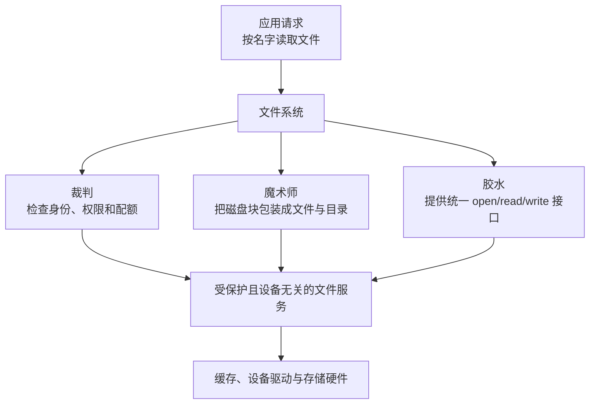

> 书名：*Operating Systems: Principles and Practice*（第二版）<br>
> 卷名：Volume I: *Kernels and Processes*<br>
> 作者：Thomas Anderson、Michael Dahlin<br>
> 笔记范围：第 1 章 `Introduction`，包括 1.1～1.3 节及章末练习<br>
> 原文位置：osppv1.md 的 “1 Introduction” 部分

## 全章主线

### 本章要回答的总问题

作者以一个贯穿全章的问题开场：

> 怎样构造可靠、可移植、高效且安全的计算机系统？

操作系统是答案中的关键部分，因为它位于应用与硬件之间，既管理资源，也规定应用能看到什么、能做什么。困难在于，一个现代通用操作系统可能超过五千万行代码，无法靠逐行阅读建立整体认识。作者因此不从某个具体内核的源码或 API 清单开始，而是抽取所有计算机专业学生都需要掌握的基本问题。

本章的推理路线是：

```text
从 Web 服务器的具体工作流发现问题
        ↓
定义操作系统及其三个角色
        ↓
建立评价操作系统的五个维度
        ↓
分析维度之间不可避免的权衡
        ↓
用硬件趋势解释操作系统的历史与未来
```

### 为什么操作系统既复杂又容易形成直觉

操作系统复杂，是因为它必须同时处理：

- 多个程序争用有限资源；
- 程序错误与恶意攻击；
- 处理器、内存、网络和存储设备的差异；
- 并发执行中大量可能的时序；
- 断电、崩溃和设备故障；
- 性能、兼容性与安全性的长期权衡。

但它又有生活化的类比：同时做多件事类似并发；排错队类似调度；保护个人物品类似隔离；用障眼法隐藏真实状态类似虚拟化。类比能建立直觉，但不能替代严格定义。后文会在每个概念下明确指出类比在哪里成立、在哪里失效。

### 阅读方式

笔记沿 `1.1 → 1.2 → 1.3 → Exercises` 的原书顺序推进。定义、公式推导、现代背景和 C 实验直接放在相应概念之后：先说明问题与直觉，再给严格表达、成立条件和适用边界，避免把同一知识点拆成两套叙述。

---

## 开篇：从一个 Web 服务器看见整个操作系统

### 看似简单的请求路径

图 1.1 描述了一个最小 Web 服务过程：

1. 客户端发送包含页面名称的 HTTP GET 请求；
2. 服务器从网络收到数据包并解析请求；
3. 服务器从磁盘读取对应文件；
4. 服务器把文件内容经网络发回客户端。

表面上看，应用只是在“收请求、读文件、发响应”。作者选择这个例子，是因为它足够熟悉，却能自然暴露几乎所有操作系统主题。每个简单动词背后都依赖操作系统：网络接收需要设备驱动和中断，读文件需要文件系统和缓存，同时服务多个用户需要并发与调度，执行外部代码需要保护。



图中一次“读网页”已经出现三种控制流：浏览器与服务器之间的网络消息、服务器线程等待 I/O 时的阻塞/唤醒、设备完成后的异步中断。它们能同时推进，正是后续进程、线程、调度、缓存和设备管理要共同解释的现象。

### 从简单流程引出的八类问题

**问题一：多应用协作，怎样通信？**

现实搜索服务往往由多个辅助程序共同完成。主 Web 服务器需要把任务交给搜索、广告、缓存或存储程序，并取回结果。

要解决的问题是：隔离的应用如何交换数据？如果完全不隔离，一个程序能随意改写另一个程序的内存；如果完全封闭，它们又无法协作。操作系统必须提供受控通信，如文件、消息、管道、套接字或共享内存。

**问题二：大量并发请求，怎样同时推进？**

若服务器严格串行处理请求，一个慢请求会让后面的所有请求等待。多任务允许多个请求交错推进，多核还允许它们真正并行执行。

难点不是“启动很多任务”，而是：

- 谁先运行、运行多久；
- 一个任务等待磁盘或网络时，CPU 应交给谁；
- 多个任务访问共享数据时，如何避免破坏状态；
- 负载超过容量时，系统怎样退化而不是崩溃。

**问题三：共享缓存，怎样同步？**

缓存保存近期页面，可以避免重复读盘和计算。但数千个请求可能同时查询、插入或淘汰缓存项。若操作交错不当，可能出现丢失更新、读取半成品或内部结构损坏。

因此，“缓存提高性能”同时引出“共享状态需要同步”。优化不是免费的，它会增加一致性与并发控制的复杂度。

**问题四：执行网页脚本，怎样保护主机？**

浏览网页意味着在本机执行别人提供的脚本。脚本需要一定能力才能绘制界面、处理输入和访问网络，但不应任意读取密码、修改内核或控制其他应用。

这要求系统建立权限边界：只给代码完成任务所必需的能力，并让敏感操作经过受信任组件检查。

**问题五：保存网页，怎样组织持久数据？**

编辑器写出的文件必须能被 Web 服务器按名称找到和读取。物理磁盘只认识设备和块，应用却希望看到命名文件、目录、权限和字节流。文件系统负责把方便的逻辑抽象映射到物理存储。

**问题六：成组更新，怎样保持一致性？**

网站更新可能同时修改多个页面和链接。若机器在中途崩溃，用户不应看到一半旧、一半新的状态。

问题的本质是原子性：一组逻辑操作要么全部可见，要么都不可见。后续可靠存储会借助日志、检查点、写时复制或事务处理这类问题。

**问题七：生产者与消费者速度不同，怎样解耦？**

服务器发送数据的速度可能高于浏览器渲染速度。系统需要在两者之间暂存数据，并施加流量控制。缓冲区解耦短期速度波动；若长期生产速度高于消费速度，则必须阻塞、丢弃、扩容或反向施压。

> **背压（backpressure）**是下游处理不过来时向上游传播减速信号。缓冲只能吸收有限突发，不能从根本上解决长期输入率大于处理率的问题。

**问题八：更换硬件，怎样保持可移植？**

服务器扩容后可能获得更多内存、处理器和不同型号的网卡、磁盘。若应用直接依赖设备细节，每次升级都要重写。操作系统用稳定接口隐藏差异，使应用与硬件可以相对独立演化。

### 八个问题对应的全书主题

| Web 服务器问题 | 主要系统主题 |
|---|---|
| 辅助程序之间交换结果 | 进程间通信、网络 |
| 同时处理大量请求 | 并发、线程、调度 |
| 多请求共享缓存 | 同步、锁、条件变量 |
| 安全执行外部脚本 | 保护、隔离、沙箱 |
| 按名称读写网页 | 文件与目录 |
| 网站成组更新 | 事务、日志、可靠存储 |
| 两端速度不匹配 | 缓冲、排队、流量控制 |
| 升级服务器硬件 | 抽象、可移植性、设备驱动 |

作者的关键方法是从应用需求倒推系统机制。这样学习时不会把“进程”“虚拟内存”“文件系统”看成孤立名词，而会知道每个抽象为何出现。

### 本章路线图

本章余下内容分为三部分：

1. **1.1 操作系统定义**：操作系统是什么、做什么；
2. **1.2 操作系统评价**：应以哪些目标比较不同设计；
3. **1.3 过去、现在与未来**：技术变化如何塑造操作系统。

---

## 1.1 什么是操作系统（What Is an Operating System）

### 操作系统的定义

操作系统（operating system, OS）是为用户及其应用管理计算机资源的软件层。

这个定义包含三个对象：

- **资源**：处理器时间、内存、存储空间、网络带宽和设备；
- **使用者**：人类用户与应用程序；
- **管理层**：位于应用和硬件之间、负责分配与控制的软件。

> **接口视角的定义。** 设硬件状态与操作集合为 $H$，应用可见的抽象状态与操作集合为 $A$。操作系统实现一个受控映射 $M: A \leftrightarrow H$：向上提供稳定抽象，向下管理真实资源，同时检查从 $A$ 发起的操作是否符合隔离和授权规则。

### 操作系统存在于哪些设备中

操作系统不只存在于桌面电脑和服务器，也可能隐藏在烤面包机、游戏机、汽车、飞机和手机中。作者重点讨论通用操作系统，因为通用系统面对的技术问题通常覆盖嵌入式系统所需问题。

早期手机只运行少量固定应用，系统较简单；智能手机允许第三方应用，立刻需要更复杂的资源管理、多任务、安全与故障隔离。汽车也从机械设备变成由多个计算机控制的系统，软件错误或入侵可能直接影响人身安全。原书提到研究人员曾经通过被攻击的车载收音机进入汽车计算系统并远程关闭制动功能，用来说明保护问题并非抽象担忧。

### 通用操作系统的分层结构

图 1.2 和图 1.3 表达的结构可概括为：

```text
用户
  ↓
应用程序
  ↓  API、系统调用、库
设备无关的操作系统服务
  ↓
设备相关层与设备驱动
  ↓
处理器、内存、存储、网络和其他设备
```

硬件除提供计算和存储资源外，还提供隔离与同步所需的基本能力。操作系统位于最低软件层，其中大部分在应用不能直接进入的受保护执行环境中运行；一部分服务也可表现为链接进应用的系统库。

应用看到的并不是裸硬件的简单翻版，而是一个：

- **更受限制**的环境：禁止危险操作，防止伤害系统；
- **表面更强大**的环境：用虚拟内存等机制掩盖物理限制；
- **更容易使用**的环境：提供文件、网络字节流和图形界面等公共服务。

### 操作系统的三个角色

**裁判（Referee）。**

操作系统管理多个应用共享的资源，决定谁在何时获得什么资源；同时隔离程序和用户，阻止错误或恶意行为扩散。

直觉上，裁判不替运动员完成比赛，而是维持规则、处理冲突并保证参与者可以共同使用场地。

**魔术师（Illusionist）。**

操作系统把有限、复杂、不断变化的物理硬件包装成更简单的抽象。每个程序仿佛独占处理器，仿佛拥有巨大的连续内存，仿佛网络是可靠字节流。

“幻象”不等于欺骗用户，而是保持可观察接口稳定，同时在内部复用、转换或补偿真实资源。

**胶水（Glue）。**

操作系统提供公共且标准的服务，使不同应用能够互操作。例如，一个应用写出的文件能被另一个应用读取，复制粘贴在不同应用间保持一致，应用通过统一接口使用不同型号设备。

三种角色不是三个互斥模块。同一个文件系统同时涉及：权限检查是裁判，命名文件隐藏磁盘块是魔术师，统一文件格式和 API 是胶水。



读这张图时不要把三种角色想成三层串行代码。它们是观察同一机制的三个角度：一次 `read` 可以同时完成授权、抽象和互操作。

---

### 1.1.1 资源共享：操作系统作为裁判

**为什么共享不可避免。**

一台电脑通常同时运行浏览器、编辑器、邮件、媒体播放器等多个程序。操作系统既要保持它们相互独立，又应在其他程序空闲时让当前程序充分使用机器。

单个应用内部也需要共享。例如：

- Web 服务器并发处理多个请求以提高响应性；
- 浏览器边下载边渲染页面；
- 并行程序把计算拆到多个处理器；
- 操作系统自身也同时处理中断、I/O 和应用请求。

作者特别指出，操作系统也是自己所提供抽象的使用者：内核同样需要并发、同步、资源分配和错误处理。

**裁判面临的三个核心问题。**

原书把挑战归纳为资源分配、隔离和通信。三者构成张力：资源必须共享，错误必须隔离，合法协作又必须穿过边界。

#### 资源分配（Resource Allocation）

**要解决的问题。**

处理器数量、内存、网络带宽和磁盘空间都有限，而同时活动可能很多。操作系统必须决定：

- 哪个任务先使用 CPU；
- 每个程序获得多少内存；
- 带宽如何分配；
- 谁能占用多少持久存储。

看似微小的分配差异会显著影响用户体验。例如，给一个程序的内存过少可能导致频繁换页，不仅拖慢它自己，还会增加磁盘负载并拖慢其他程序。

**严格定义。**

> **容量约束模型。** 设资源总量为 $C$，系统中有 $n$ 个活动，第 $i$ 个活动获得资源量 $x_i$。在不可超额分配的简单模型中，分配必须满足
>
> $$x_i \ge 0, \qquad \sum_{i=1}^{n}x_i \le C.$$
>
> 调度或分配策略是在这些约束下，根据公平性、优先级、响应时间或吞吐量等目标选择 $x_1,\ldots,x_n$。

符号含义：

- $C$：某类物理资源的可用总量；
- $n$：竞争该资源的活动数；
- $x_i$：分配给活动 $i$ 的资源量。

该模型的边界是：CPU 时间可按时间片复用，内存有时可借助换页“超额承诺”，网络和存储也有突发、缓存等动态行为。因此它只表达最基本的容量约束，不是完整调度算法。

**一个具体例子：无限循环的应用。**

考虑下面这个无限循环：

```c
while (true) {
    ;
}
```

若程序直接独占裸机，这个循环可能让系统无法响应。操作系统通过定时器中断和抢占式调度，周期性收回 CPU，把时间分给其他程序；用户还可以请求系统终止失控进程。

推理链为：

1. 应用不会主动放弃 CPU，因此不能依赖应用合作；
2. 定时器必须由应用不能关闭的硬件/内核机制控制；
3. 定时器到期触发内核，保存当前执行状态；
4. 调度器选择另一个可运行任务并恢复其状态；
5. 因此单个程序失控不等于整台机器失去控制。

边界：如果内核本身进入关闭中断的死循环，普通进程级抢占就可能失效；若系统资源被耗尽，其他程序也可能受到间接影响。

#### 隔离（Isolation）

**故障隔离的定义。**

故障隔离（fault isolation）要求一个应用的错误不应破坏其他应用或操作系统本身。它同时服务于：

- **可靠性**：普通 bug 的影响被限制；
- **安全性**：恶意代码不能越权控制系统；
- **可调试性**：一个程序的状态不会被无关程序任意改写。

> **保护域模型。** 设应用 $P_i$ 的私有状态为 $S_i$，内核受保护状态为 $S_K$。除非通过明确授权的接口，$P_i$ 的普通指令不能读取或修改 $S_j\;(j\ne i)$ 和 $S_K$。这要求机密性、完整性和故障遏制，但不禁止受控共享。

**为什么不能给应用完整硬件能力。**

若任意应用拥有硬件全部能力，它就可能：

- 修改操作系统并安装键盘记录器；
- 读取浏览器密码和其他用户文件；
- 破坏磁盘上的唯一数据；
- 控制设备或让整机崩溃。

所以应用环境必须比硬件能力更受限。敏感指令、内核内存和设备控制只能由受信任代码访问，应用通过受检查的系统调用请求服务。

**隔离的局限。**

隔离不是绝对安全：

- 内核实现可能有漏洞；
- 合法共享接口可能配置错误；
- 进程可能通过资源使用时间等侧信道泄露信息；
- 共享资源耗尽会造成拒绝服务；
- 用户主动授予权限后，系统不能替用户判断所有意图。

因此，隔离是安全的必要基础，但不是充分条件。

#### 通信（Communication）

**为什么隔离之后还要通信。**

大型服务常由广告、缓存、索引、存储等多个程序组成。若保护边界完全不可穿越，系统无法分解和组合功能。操作系统必须提供“默认隔离、按规则开放”的通信方式。

**受控跨越边界。**

通信接口通常要明确：

- 谁能连接；
- 能传什么数据；
- 数据如何命名和验证；
- 缓冲区满时怎样处理；
- 对方失败时调用者看到什么；
- 是否需要保密、认证和完整性保护。

常见机制包括文件、消息队列、管道、套接字、共享内存和远程过程调用。不存在对所有场景都最优的机制：共享内存速度高但同步困难，消息传递边界清晰但有复制和序列化成本，文件便于持久共享但延迟较高。

**三者为何必须一起考虑。**

| 只强调某一目标 | 可能后果 |
|---|---|
| 只追求资源利用率 | 一个任务可能垄断系统，或关键交互任务长期等待 |
| 只追求隔离 | 程序无法协作，系统失去实用性 |
| 只追求通信便利 | 权限边界变弱，错误和攻击容易扩散 |

作者用“耐心的幼儿园老师”比喻裁判角色：平衡需求、隔开冲突并促进分享。类比的边界是，操作系统需要把规则落实为可执行的硬件与软件机制，而不只是口头协调。

---

### 1.1.2 掩盖限制：操作系统作为魔术师

**问题从哪里来。**

物理硬件具有不可消除的限制：处理器、内存、磁盘和带宽都有限，设备接口彼此不同，资源分配还会随其他应用的活动动态变化。若每个应用都直接适配这些细节，程序会难写、难移植且难以共享资源。

操作系统因此提供比物理硬件更高层、更稳定的抽象。

#### 虚拟化（Virtualization）的定义

虚拟化的直觉是：向应用提供物理上并不存在的资源幻象。例如，只有一个处理器，却让每个程序仿佛拥有专用处理器。

> **严格定义。** 虚拟化是由一层受控软件或软硬件机制，把一个或多个物理资源映射成若干逻辑资源，并使使用者主要依赖逻辑接口而不是物理实现。映射必须维持所承诺的语义，但不要求逻辑资源在容量、时序和故障行为上与真实独占硬件完全相同。

关键不在“看起来一样”，而在应用能否只依据抽象接口正确运行。

#### 各类资源怎样被虚拟化

**处理器。**

操作系统快速切换多个程序，保存和恢复各自状态，使每个程序在运行时像拥有连续执行流。幻象的边界是可观察到调度延迟，实时程序不能假设自己随时运行。

**内存。**

有限物理内存被包装为每进程独立、巨大且通常连续的虚拟地址空间。地址转换决定虚拟地址对应哪个物理位置，并附带权限。

“近乎无限”是相对于单个程序直接看到的物理内存而言，不是真正无穷。地址空间大小、物理内存、交换空间和性能仍有限。

**网络。**

无线链路会丢包或损坏数据，上层协议与操作系统网络栈可通过校验、确认、重传和排序，向应用提供较可靠的字节流。

这种可靠性有边界：网络永久断开时无法保证送达；重传会增加延迟；连接中断后应用仍需处理错误。

**持久存储。**

磁盘和闪存按设备特定块号读写，文件系统向程序提供按名称组织、按字节访问的文件和层次目录。文件抽象隐藏了块大小、空闲空间位置和设备类型。

**处理器类型。**

通过解释、二进制翻译或虚拟机，同一应用有时能跨不同设备运行。但指令集、系统调用和性能差异不一定能被完全透明地隐藏。

#### 虚拟机（Virtual Machine）

虚拟机把整个计算机接口虚拟化，使一个操作系统能像普通应用一样运行在另一个系统之上。

术语关系：

- **宿主/虚拟机监控器**：真正控制物理资源并提供虚拟硬件；
- **客户操作系统（guest OS）**：在虚拟硬件上运行，以为自己面对真实机器；
- **虚拟机**：客户系统所看到的完整逻辑计算机。

#### 虚拟机为什么有用

**向后兼容。**

只能在旧操作系统运行的应用，可以连同旧系统一起放入虚拟机，在新机器上继续使用。这样把遗留依赖封装起来，不必立即重写应用。

**调试操作系统。**

直接调试内核很困难：停止内核也会停止调试工具依赖的系统。客户内核作为虚拟机中的“应用”时，外层监控器仍在运行，开发者可设置断点、暂停和单步执行。

**隔离与部署。**

> **隔离边界。** 多个服务可运行在不同虚拟机中，各自选择系统版本。一个客户崩溃通常不会直接改写另一个客户内存，但监控器漏洞、共享硬件侧信道和资源争用仍是边界。

**魔术师角色的方法与局限。**

作者强调，操作系统应提供比底层硬件更方便、灵活的编程抽象。其有效性来自“间接层”：应用只面向逻辑接口，操作系统可以在背后重新分配、转换或恢复资源。

代价包括：

- 地址转换、上下文切换和设备模拟带来开销；
- 抽象可能隐藏对性能至关重要的硬件特征；
- 虚拟资源过度承诺会在高负载下暴露真实容量限制；
- 多一层实现也多一层故障和攻击面。

因此，好的抽象不是隐藏一切，而是隐藏应用通常不应依赖的细节，同时保留必要的性能与控制接口。

---

### 1.1.3 提供公共服务：操作系统作为胶水

**为什么需要公共服务。**

若每个应用都自行控制网卡、磁盘和显示设备，开发者要重复处理包格式、磁盘块、设备型号和错误恢复。更严重的是，不同应用产生的数据和交互方式可能彼此不兼容。

操作系统把常见能力实现为标准服务，让应用专注于自身核心逻辑。例如，Web 服务器处理 HTTP 请求，而把可靠字节收发和命名文件读写交给操作系统。

**胶水角色的严格含义。**

> **互操作性的严格含义。** “胶水”是指操作系统定义并实现共享协议、数据格式或服务接口，使独立开发的应用和设备能够互操作。互操作成立依赖双方遵守同一接口语义，而不要求它们了解彼此内部实现。

这里包含两种独立性：

- 应用 A 与应用 B 可通过标准文件或消息交换数据；
- 应用与设备可分别演化，只要设备驱动继续实现标准接口。

**文件与进程间共享。**

编辑器写出的文件要被 Web 服务器读取，双方必须同意文件命名、目录组织、权限和读写语义。操作系统还提供标准消息传递与共享内存机制，使应用不必各自发明通信协议的底层载体。

公共机制不自动保证应用层数据格式兼容。例如，两个程序都能读取同一文件，不代表它们都理解文件中的 JSON、图片或数据库格式。

**设备无关接口。**

现实设备种类繁多：不同图形处理器、像素格式、WiFi/以太网/蓝牙、SCSI/IDE、USB/FireWire、GPS 和加速度计。设备驱动把设备特定操作适配到较通用接口，让多数应用不必随硬件变化。

但抽象层次是设计判断：

- 普通应用通常只需要“读写文件”；
- 数据库可能关心刷盘语义、队列深度和随机访问延迟；
- 图形程序可能需要设备专有加速能力。

过低层接口损害可移植性，过高层接口可能限制性能或特殊能力。因此系统往往提供通用路径，同时允许受控的高级/专用接口。

**统一用户界面服务。**

现代操作系统通常提供标准 GUI 控件和交互约定，使菜单、复制、粘贴等操作在应用间保持类似体验。价值不仅是美观，还包括降低学习成本、支持无障碍功能和统一输入事件处理。

**为什么本书更侧重裁判和魔术师。**

操作系统多数代码可能在实现公共服务，但主要复杂性来自资源共享和硬件限制。公共服务本身又建立在隔离、调度、虚拟内存和设备抽象上，因此后续重点研究裁判与魔术师角色。

这不是说胶水不重要，而是说其正确和高效实现依赖前两者。例如，文件 API 很简单，但并发读写、权限、缓存和崩溃恢复都需要更深机制。

---

### 1.1.4 操作系统设计模式

**为什么操作系统原理可以迁移。**

操作系统的问题并不独有。任何具有多用户、第三方代码、共享资源或大量并发活动的复杂系统，都要处理：

- 资源分配；
- 故障隔离；
- 受控通信；
- 对底层细节的抽象；
- 公共开发服务。

作者用多个领域展示同一“裁判—魔术师—胶水”框架。重点不是说这些系统都是传统内核，而是说明问题结构和解决模式相似。

**云计算。**

云计算让应用运行在大型数据中心的共享计算与存储基础设施上，而不是只运行在用户自己的电脑上。

- **裁判**：在竞争应用间分配 CPU、内存、网络和存储，并阻止一个租户的错误或攻击影响其他租户。
- **魔术师**：用虚拟机、容器和资源 API 隐藏服务器型号与基础设施更新。
- **胶水**：为跨机器任务提供协调、发现、消息和共享数据服务。

难点是规模和故障常态化：单机上罕见的故障，在数十万台机器中会经常发生。单机操作系统模式仍有效，但还需分布式一致性、容错和跨网络安全等机制。

**Web 浏览器。**

浏览器加载并执行不同网站提供的脚本与插件，因此像操作系统一样运行不可信代码。

- **裁判**：保持多个标签页的响应性，限制脚本与插件访问敏感数据和宿主资源。
- **魔术师**：服务器故障或切换时，尽量让用户仍看到连续会话和一致购物车。
- **胶水**：提供跨操作系统和硬件一致的脚本执行环境与 Web API。

浏览器通常同时利用语言级检查、沙箱和操作系统进程保护。保护不是单层完成的，任一层漏洞都可能削弱整体边界。

**媒体播放器。**

以 Flash、Silverlight 等浏览器插件式媒体环境为例：它们也执行脚本、管理前后台活动并适配快速变化的图形硬件。

- **裁判**：把恶意或有缺陷的媒体脚本限制在沙箱内；
- **魔术师**：协调高计算量后台工作和交互前台工作，维持响应性；
- **胶水**：用标准 API 屏蔽不同图形加速器。

这里“协调活动”更接近调度抽象，不是凭空创造算力。若计算需求超过硬件能力，系统只能降级质量、延迟任务或拒绝工作。

**多人游戏。**

游戏常提供第三方扩展 API，但扩展不能破坏公平规则。

- **裁判**：限制客户端扩展，防止作弊和篡改权威状态；
- **魔术师**：隐藏对象究竟位于客户端还是服务器，提供统一游戏对象接口；
- **胶水**：设计稳定易用的扩展 API，形成开发者生态。

替代方案是在服务器端执行所有权威逻辑，安全边界更清晰，但会增加网络延迟和服务器负载。现实系统常把预测放客户端、裁决放服务器，在响应性与可信性间权衡。

**多用户数据库。**

数据库被许多用户同时查询和更新，也必须管理资源、权限和持久一致性。

- **裁判**：在查询之间分配资源，隔离并发更新并执行访问控制；
- **魔术师**：用事务与恢复机制掩盖部分机器故障，保持数据一致；
- **胶水**：提供 SQL、事务和索引等公共应用服务。

第 14 章的一些可靠存储技术最初来自数据库领域。这说明设计模式会跨领域双向迁移，并非总是由操作系统发明后向外传播。

**并行应用及其运行时。**

并行应用把工作分配给多个处理器，并协调共享数据。有些应用在操作系统之上增加用户级运行时，形成“小型操作系统”。

- **裁判**：任务多于处理器时决定执行顺序；
- **魔术师**：隐藏处理器数量、拓扑和通信延迟等物理细节；
- **胶水**：提供可并发访问的树、哈希表、列表和任务系统。

运行时比通用操作系统更了解应用结构，可能做出更优调度；但它仍依赖底层内核提供线程、内存和设备资源，两层调度若缺乏协调也可能相互干扰。

**互联网。**

互联网由大量用户共享异构链路和设备，还长期面对拒绝服务、垃圾邮件与钓鱼攻击。

- **裁判**：处理链路竞争、公平与优先级，并限制恶意流量；
- **魔术师**：把有限距离、有限包长且可能损坏数据的链路，组合成全球通信网络；
- **胶水**：协议栈作为互操作层，让网络应用与底层网络硬件独立演化。

互联网的“可靠传输任意长度数据”通常由端系统协议提供，不代表 IP 层本身保证每个包可靠到达。原书这里强调的是整体网络向应用呈现的更高层能力。

**相同目标可以有不同机制。**

浏览器传统上较多使用编译期或语言检查限制脚本，操作系统较多依赖硬件保护。边界正在模糊：部分智能手机系统引入语言级检查，浏览器也使用操作系统进程和硬件隔离。

这揭示一个重要原则：

```text
先定义目标（例如不可信代码不能控制宿主）
        ↓
再根据威胁模型、性能和平台选择机制
```

不能把某种机制误当成目标本身。硬件隔离、类型安全、能力系统、进程沙箱都可能服务于保护，但依赖假设和适用边界不同。

**为什么本书仍聚焦传统操作系统。**

若同时深入所有领域，讨论会过于分散。作者类比学习编程语言：先在一个上下文中熟练掌握原则，再迁移到第二个上下文，比同时浅尝多个领域更有效。

因此，本书聚焦操作系统不是因为其他领域不重要，而是把操作系统当作学习复杂系统设计的主训练场。

---

## 1.2 操作系统评价（Operating System Evaluation）

### 为什么定义之后还要建立评价标准

知道操作系统“做什么”，不能直接告诉我们哪种设计更好。两个系统都能运行应用、管理文件和访问网络，但可能在故障频率、攻击面、硬件支持、响应速度和软件生态上差异巨大。

评价操作系统可从五个维度展开：

1. **可靠性与可用性**：系统是否按设计工作，能否持续提供服务；
2. **安全性**：攻击者能否破坏系统，隐私数据能否只被授权者访问；
3. **可移植性**：应用和操作系统能否适应新硬件；
4. **性能**：抽象开销、响应时间、吞吐量、公平性和可预测性如何；
5. **采用度**：是否拥有足够多的用户、应用和硬件支持。

这些维度不能简单加成一个“总分”，因为目标和场景不同。心脏起搏器首先关心可靠与实时，云服务器关心吞吐、安全与可用，个人电脑还高度依赖应用生态。更重要的是，一个维度的改进可能损害另一个维度。

---

### 1.2.1 可靠性与可用性

**可靠性（Reliability）。**

可靠性表示系统准确完成其设计要做的事情。

这个定义隐含一个前提：必须先写清“设计要做什么”。如果接口语义模糊，就无法判断行为是实现错误还是设计允许。因此，作者强调精确且看似刻板的抽象是故意的，它们为可靠系统提供可检验的契约。

> **契约式表达。** 对操作 $f$，可用前置条件 $P$、后置条件 $Q$ 与不变量 $I$ 描述正确性：若调用前 $P\land I$ 成立，且执行期间环境满足故障模型，则操作返回后应有 $Q\land I$。可靠实现要求所有允许路径，包括错误路径和罕见路径，都维护契约。

**为什么操作系统故障格外严重。**

操作系统是最低软件层之一。应用崩溃时，内核可以清理资源并重新启动应用；内核崩溃时，所有应用都可能停止，内存中未保存工作会丢失，错误写盘还可能破坏过去的数据。

换言之，操作系统既是故障隔离者，也可能成为单点故障。它拥有更高权限，所以同样的 bug 往往具有更大破坏半径。

**为什么普通测试不足以证明可靠。**

操作系统运行在敌对环境中，攻击者会故意寻找测试很少覆盖的路径。即使没有攻击，大规模用户也会放大罕见事件。

假设某错误在一次操作中发生概率为 $p=10^{-9}$。若系统每天执行 $N=10^9$ 次相关操作，则一天完全不触发错误的概率近似为

$$
P(0)=(1-p)^N \approx e^{-Np}=e^{-1}\approx 0.368.
$$

因此一天至少触发一次的概率约为

$$
P(\ge 1)=1-P(0)\approx 1-0.368=0.632.
$$

> **成立条件。** 上述泊松近似假设每次事件独立且概率相同，用来量化“大规模下极罕见事件也会经常出现”的直觉。现实错误往往相关，概率也随负载和状态变化。

可靠性验证通常需要组合测试、静态分析、形式化验证、故障注入、模糊测试、代码审查和生产监控。任何单一方法都难以覆盖完整状态空间。

**可用性（Availability）。**

可用性是系统处于可使用状态的时间比例。

可靠性问“行为对不对”，可用性问“服务在不在”。两者相关但不相同：

| 情形 | 可靠性 | 可用性 | 原因 |
|---|---|---|---|
| 经常崩溃且丢数据 | 低 | 低 | 行为错误且服务中断 |
| 经常崩溃，但不丢数据、重启后状态正确 | 可保持较高 | 低 | 正确但经常不可服务 |
| 被键盘记录器控制但界面照常运行 | 低 | 表面高 | 服务在线但违反安全与设计目标 |

#### MTTF、MTTR 与可用性公式

决定可用性的两个关键量是：

- **MTTF（Mean Time To Failure）**：平均无故障运行时间；
- **MTTR（Mean Time To Repair）**：故障后恢复到可工作状态的平均时间。

提高 MTTF 或降低 MTTR 都能提高可用性。下面给出这一关系的完整推导。

> **稳态可用性推导。** 假设系统长期重复经历“正常运行 → 故障 → 修复”周期，并满足：
>
> 1. 每个周期平均正常时间为 $\mathrm{MTTF}$；
> 2. 每个周期平均修复时间为 $\mathrm{MTTR}$；
> 3. 观察时间足够长，周期平均具有代表性；
> 4. 修复完成后可视为重新进入正常状态。

一个平均周期的总时长为

$$
T_{\text{cycle}}=\mathrm{MTTF}+\mathrm{MTTR}.
$$

其中可服务时间为 $\mathrm{MTTF}$，所以长期可用时间占比为

$$
A=\frac{\text{平均可服务时间}}{\text{平均周期总时间}}
=\frac{\mathrm{MTTF}}{\mathrm{MTTF}+\mathrm{MTTR}}.
$$

不可用时间占比为

$$
U=1-A
=\frac{\mathrm{MTTR}}{\mathrm{MTTF}+\mathrm{MTTR}}.
$$

**数值演算。**

若系统平均运行 $1000$ 小时故障一次，平均修复需要 $1$ 小时：

$$
A=\frac{1000}{1000+1}\approx 0.999001=99.9001\%.
$$

一年按 $8760$ 小时估算，期望不可用时间为

$$
8760\times(1-A)\approx 8.75\text{ 小时}.
$$

若 MTTF 不变而把 MTTR 降至 $0.1$ 小时：

$$
A=\frac{1000}{1000+0.1}\approx 99.9900\%,
$$

期望年停机时间约为 $0.876$ 小时。可见快速恢复可以显著提升可用性，即使故障频率没有变化。

**成立条件与边界。**

这个简单公式不直接处理：

- 相关故障和灾难性永久故障；
- 降级服务，即系统只提供部分能力；
- 计划维护是否计入停机；
- 多组件串并联系统；
- 故障期间的数据错误但服务仍“在线”；
- 修复后需要数据追赶的时间。

因此，可用性数字必须附带服务定义、统计窗口和故障模型。只报告“几个 9”而不说明这些条件，信息并不完整。

**为什么精确抽象有助于可靠。**

精确抽象限制可观察行为，减少调用者必须考虑的情况，也使实现可以围绕不变量检查所有路径。看似灵活的模糊接口可能把异常条件推给每个应用分别处理，反而增加系统整体错误。

局限是：过于僵硬的抽象可能不适应新需求或损害性能。因此设计者要在可验证性、表达能力和演化能力之间权衡。

---

### 1.2.2 安全性

**安全性与隐私的定义。**

安全性与隐私分别定义为：

- **安全性（security）**：计算机的运行不能被恶意攻击者破坏或控制；
- **隐私（privacy）**：存储的数据只能由经过授权的用户访问，是安全性的一个方面。

> **安全目标的常用分类。** 常用安全模型把目标分为机密性（Confidentiality）、完整性（Integrity）和可用性（Availability）。隐私主要涉及机密性，但还包括数据收集、用途和保留范围等更广问题。

**为什么不存在绝对安全的实用计算机。**

作者列出多个信任链薄弱点：

- 复杂软件不可避免地可能含有 bug；
- 硬件可能被篡改；
- 管理员可能滥用合法凭据；
- 操作系统开发者可能植入后门；
- 看似无害的错误可能被组合成控制系统的漏洞。

如果一台机器完全不接收输入、不运行外部代码、不共享数据，比较容易隔离，但也几乎没有用途。安全的核心困难是：系统必须允许有价值的交互，同时禁止越权交互。

**病毒与键盘记录器例子。**

原书把计算机病毒描述为：未经所有者许可或知情，通过修改操作系统或应用而复制到其他计算机的程序。病毒安装后常为攻击者提供资源或数据控制权。

键盘记录器会记录用户输入并发送给攻击者，从而窃取密码、银行账户等信息。恶意屏幕保护程序也可能扫描私人文件或把机器变成垃圾邮件发送节点。

这些例子说明，第三方应用不应因“被安装”就获得系统全部权限。强故障隔离能缩小应用的默认能力和被攻陷后的破坏范围。

**为什么内核隔离仍不够。**

即使操作系统正确隔离进程，应用协议也可能不安全。以电子邮件为例：传统邮件的 `From` 字段不能强证明发件人身份，攻击者可伪装成可信联系人，引诱用户打开恶意附件。

作者进一步提出系统性思路：若操作系统能廉价地在能力受限的隔离环境中打开附件，即使附件含恶意代码，也难以造成伤害。

这体现纵深防御：

```text
身份验证减少伪造
        +
用户界面减少误导
        +
附件沙箱限制执行能力
        +
文件和网络权限限制影响范围
```

任一层都可能失败，多层独立约束能降低单点突破的后果。

#### 安全策略与执行机制

原书区分两个关键概念：

- **安全策略（security policy）**：规定什么行为被允许，即谁能访问什么数据、执行什么操作；
- **执行机制（enforcement mechanism）**：保证只有策略允许的行为才会发生的方法。

**用访问控制关系严格表达。**

> **访问控制关系。** 设主体集合为 $S$（用户、进程），对象集合为 $O$（文件、设备、套接字），操作集合为 $R$（读、写、执行）。策略可表示为允许关系
>
> $$P\subseteq S\times O\times R.$$
>
> 请求 $(s,o,r)$ 只有在 $(s,o,r)\in P$ 时才应获准。执行机制负责不可绕过地检查这个关系。

符号含义：

- $s\in S$：发起请求的主体；
- $o\in O$：被访问对象；
- $r\in R$：请求的操作；
- $P$：所有被允许三元组的集合。

策略错误与机制错误不同：

- 若策略错误地允许普通用户读取工资文件，机制即使完美执行，系统仍不安全；
- 若策略正确禁止，但路径遍历漏洞绕过检查，则是机制错误。

**为什么二者必须分离思考。**

分离后可以分别回答：规则是否符合需求？实现是否完整且不可绕过？混在一起容易把“程序按配置工作”误认为“配置本身安全”。

**隔离与共享的矛盾。**

用户需要在应用之间复制粘贴、共享文件和通过网络协作。完全隔离会消灭这些能力。因此安全系统不是“禁止一切”，而是提供最小权限、明确授权和可审计的共享路径。

相关机制包括能力系统、访问控制列表、沙箱、虚拟机、语言类型安全、加密和进程分权。没有单一机制能覆盖所有威胁。

---

### 1.2.3 可移植性

**应用可移植性。**

可移植抽象在硬件变化时保持接口语义稳定。一个 Windows 应用不应因显卡、闪存/磁盘或 WiFi/以太网变化就重写核心逻辑。

可移植不等于二进制在所有平台无条件运行。它可能依赖相同指令集、ABI、系统 API、运行库或重新编译。关键目标是用操作系统抽象隔离底层变化。

**操作系统自身的可移植性。**

操作系统规模巨大，不可能每出现一种硬件就从零重写。成功系统通常持续数十年：

- iOS 派生自 Mac OS X 代码基础；
- Windows 8 的谱系可追溯到 1988 年开始开发的 Windows NT；
- MS-DOS 从 1981 年延续并影响早期 Windows，约到 2000 年才退出；
- UNIX 在 20 世纪 70 年代形成，后来影响 Linux 等系统。

这意味着系统必须面对开发时尚不存在的应用和硬件。未来适应性不是锦上添花，而是长期存活条件。

**“640 KB 足够”带来的教训。**

MS-DOS 设计时假定个人电脑不会超过 640 KB 内存，在当时似乎合理，后来却成为沉重限制。

作者借此说明：把当前规模写死进接口，会让短期实现假设变成长期兼容义务。内部实现可以替换，公开接口和数据格式一旦被大量应用依赖，就很难撤回。

> **避免未来锁死的常见方法。** 使用宽度明确的类型、版本化接口、保留扩展字段、能力查询和不透明句柄，可以减少当前实现细节泄漏。但过度设计也会增加复杂性，无法真正预测所有未来需求。

#### 抽象虚拟机（AVM）

原书把操作系统提供给应用的整体接口称为抽象虚拟机（abstract virtual machine, AVM），包括：

1. **API**：操作系统向应用提供的函数调用列表及语义；
2. **内存访问模型**：应用能看到怎样的地址空间、共享和一致性规则；
3. **合法指令集合**：哪些指令应用可执行，哪些仅操作系统可执行。

AVM 是应用与系统之间的“固定点”：

```text
应用不断演化
       ↓ 依赖稳定 AVM
操作系统实现不断演化
       ↓ 适配硬件
硬件不断演化
```

只要 AVM 语义保持兼容，上下两侧可以相对独立变化。这类似 IP 协议让电子邮件、Web 等应用与以太网、WiFi、光纤相对独立演化。

**API 与 AVM 的区别。**

API 只是 AVM 的一部分。即使两个系统函数名称相同，若指针宽度、进程内存模型、线程一致性或可执行指令不同，应用仍可能不兼容。

| 概念 | 覆盖范围 | 例子 |
|---|---|---|
| API | 可调用函数及参数、返回值、错误 | `open`、`read`、创建线程 |
| AVM | API + 内存模型 + 合法指令及完整执行环境 | 进程看到的整台逻辑机器 |

#### 硬件抽象层（HAL）

操作系统内部也需要隔离硬件差异。硬件抽象层（hardware abstraction layer, HAL）向内核其余部分提供较统一的处理器、中断、时钟和设备访问接口。

HAL 与 AVM 都隐藏硬件，但服务对象和抽象层次不同：

| 对比 | AVM | HAL |
|---|---|---|
| 服务对象 | 应用程序 | 操作系统内部组件 |
| 权限 | 受限、虚拟化 | 更接近硬件、可执行特权操作 |
| 服务层次 | 高层公共服务 + 执行环境 | 较低层过程接口 |
| 主要目标 | 应用兼容、保护与易用 | 内核移植、隔离设备差异 |

不能把两者合并，因为应用不应获得 HAL 暴露的特权能力，而内核也需要比应用 API 更直接地控制硬件。

**Linux/UNIX 的可移植性案例。**

Linux 被用于服务器、个人电脑、平板、上网本、电子书、手机、机顶盒、路由器、无线接入点和游戏机。其 UNIX 传统强调紧凑、易编程与可移植，尽管早期可能以部分性能为代价。

案例说明，可移植性和方便的编程抽象能形成长期生态优势。局限是，抽象不能消除所有硬件差异；设备驱动、启动代码、原子指令和内存模型仍需平台适配。

---

### 1.2.4 性能

**为什么操作系统影响应用性能。**

操作系统决定应用何时运行、获得多少内存、文件是否缓存在内存、磁盘布局是否高效，并中介内存、网络和磁盘访问。它必须在关键路径上尽量少增加成本，同时维持隔离与共享。

性能不是单一数字。原书讨论开销、效率、公平性、响应时间、吞吐量和可预测性。

#### 开销（Overhead）与效率（Efficiency）

开销是为实现某项抽象而额外消耗的资源；效率表示抽象缺少不必要开销的程度。

> **时间开销的两种常用表达。** 设应用直接在理想裸硬件上的时间为 $T_{\text{base}}$，通过操作系统抽象后的时间为 $T_{\text{os}}$。
>
> 绝对开销：
> $$O_{\text{abs}}=T_{\text{os}}-T_{\text{base}}.$$
>
> 相对开销率：
> $$O_{\text{rel}}=\frac{T_{\text{os}}-T_{\text{base}}}{T_{\text{base}}}.$$

例如裸执行需 $100$ ms，经过抽象需 $108$ ms：

$$
O_{\text{abs}}=8\text{ ms},\qquad
O_{\text{rel}}=\frac{8}{100}=8\%.
$$

成立条件是两次测量完成相同工作、输入与硬件条件可比。现实中“直接裸硬件”可能不可实现，且操作系统缓存会使某些任务更快，所以基线选择必须说明。

开销不仅是时间，还可能是额外内存、能耗、网络流量和实现复杂度。

#### 公平性（Fairness）

多个用户或应用共享机器时，系统要决定是否平均分配资源，还是给交互、实时或高优先级任务更多资源。

“公平”不必等于平均：

- 每个用户相等与每个进程相等会产生不同结果；
- 付费云租户可能按配额获得不同份额；
- 实时控制任务可能应优先于后台索引；
- 长任务若一直被短任务插队会发生饥饿。

因此公平性必须先定义分配单位、权重和时间窗口。

#### 响应时间（Response Time）

响应时间又称延迟，是单个任务从开始到完成所经历的时间。

> **基本定义。** 若任务 $i$ 到达或开始时刻为 $a_i$，完成时刻为 $c_i$，则
>
> $$R_i=c_i-a_i.$$

其中 $R_i$ 是任务 $i$ 的响应时间。某些调度教材把“响应时间”定义为到首次响应的时间，把到完成的时间称为周转时间；本书本节使用从开始到完成的含义。阅读不同资料时要先核对术语。

桌面系统中，鼠标移动到屏幕指针更新的时间非常显眼。响应太慢会使系统即使最终吞吐量很高也不可用。

#### 吞吐量（Throughput）

吞吐量是单位时间内完成任务的速率，衡量一组任务而非单个任务。

> **吞吐量的量化。** 在观察区间长度 $\Delta t$ 内完成 $N$ 个任务，则
>
> $$X=\frac{N}{\Delta t},$$
>
> 其中 $X$ 为吞吐量，单位可为请求/秒、作业/小时等。

假设服务器 10 秒完成 2500 个请求，则

$$X=\frac{2500}{10}=250\text{ 请求/秒}.$$

提高吞吐量不必降低每个任务延迟。例如批量处理能摊薄固定成本，提高总吞吐，却可能让第一个任务等待批次凑齐。反过来，频繁抢占可改善交互响应，却增加上下文切换开销并降低吞吐。

#### 性能可预测性（Predictability）

可预测性表示响应时间等指标是否随时间保持稳定，而且可能比平均性能更重要。

原书比较两个键盘系统：

- 系统 A：99% 的按键立即显示，1% 延迟 10 秒；
- 系统 B：每次都延迟 0.1 秒。

设“立即”为 0 秒，系统 A 的平均响应时间为

$$
\bar R_A=0.99\times 0+0.01\times 10=0.1\text{ 秒}.
$$

系统 B 为

$$
\bar R_B=1.00\times 0.1=0.1\text{ 秒}.
$$

两者平均值相同，但系统 A 每百次约有一次 10 秒卡顿，用户难以适应；系统 B 虽始终有轻微延迟，却更稳定。

> **尾延迟。** 平均值会掩盖少量极慢请求，实践中常报告第 95、99 或 99.9 百分位。若系统 A 恰有 1% 请求为 10 秒，其 99 百分位的具体值取决于百分位定义和样本排列，但高分位会暴露平均值隐藏的长尾风险。

**交通系统类比。**

汽车到达目的地的类比可以串起多个性能概念：

- 没有其他车辆时可直接行驶，类似无抽象开销的独占执行；
- 红绿灯和停车标志让道路可共享，却增加单车开销与延迟；
- 拥堵使到达时间更不可预测；
- 拼车提高单位车辆承载的吞吐量；
- 拼车专用道可能在协调接人后仍减少延迟；
- 公共交通可能同时改善吞吐、公平和可预测性。

类比的局限是计算任务可复制、暂停、迁移，资源类型也比道路复杂。它主要说明评价指标可能互相冲突，改变系统组织方式又可能同时改善多个指标。

---

### 1.2.5 采用度

**为什么技术上优秀仍可能失败。**

操作系统的成功还依赖其外部生态：有多少应用被移植到该平台，以及有多少硬件得到支持。没有预装软件和应用商店内容，智能手机的价值会大幅下降。

#### 网络效应（Network Effect）

网络效应指一种技术的价值不仅由自身能力决定，还取决于采用它的其他人数量。

操作系统生态存在正反馈：

```text
用户更多
  → 开发者更愿意提供应用
  → 硬件厂商更愿意支持，规模降低成本
  → 平台对新用户更有价值
  → 用户继续增加
```

这也形成新平台的冷启动难题：用户少导致应用少，应用少又导致用户不愿加入。技术指标领先不一定足以打破循环。

> **网络效应的简化模型。** 可把用户感知价值写成
> $$V(n)=V_0+\alpha n-C,$$
> 其中 $V_0$ 是平台内在价值，$n$ 是采用者或互补产品规模，$\alpha>0$ 表示网络效应强度，$C$ 是迁移成本。该线性模型只表达方向，现实价值可能饱和、分群或取决于关键应用，并非原书公式。

**设计怎样促进采用。**

直接措施包括：

- 让应用容易跨版本移植；
- 让系统容易支持新硬件；
- 保持 API 稳定；
- 提供开发工具和兼容层；
- 降低用户迁移数据和学习成本。

这与可移植性紧密相连：兼容性扩大应用和硬件供给，从而增强网络效应。

**开放系统与专有系统。**

两种系统模式定义如下：

- **专有系统（proprietary system）**：由单一公司控制，可由提供者根据客户需要改变；
- **开放系统（open system）**：源代码公开，任何人可以检查和修改；其 API 往往由公共标准组织协商变更。

标准让应用开发者相信接口不会被单方面改变，但标准协商也可能减慢新功能加入。

**哪一种更利于采用。**

两者没有内在绝对优劣。Windows、Mac OS 属于专有系统，Linux 属于开放系统，三者都被广泛使用。

| 模式 | 潜在优势 | 潜在风险 |
|---|---|---|
| 开放 | 易检查、修改和适配多种硬件；多方可贡献 | 分叉成不兼容版本，削弱统一生态 |
| 专有 | 决策集中；软硬件统一控制可减少互操作问题 | 硬件范围受限；用户依赖单一供应者 |

“开源”与“API 标准化”也不是同一概念。源代码公开不保证不同发行版接口完全一致；专有实现也可以遵守开放标准。

**商业压力为何影响技术接口。**

新系统可通过兼容旧平台应用降低进入门槛；已有平台也可能设计难以迁出的专有 API 来提高竞争者门槛。因此，接口不总是由纯技术最优决定，还受商业利益和历史兼容影响。

作者提醒读者：本书在概念层讨论问题，具体系统的细节可能因商业因素而显得混乱。理解现实设计时，不能把所有不一致都归因于工程无知。

---

### 1.2.6 设计权衡

**为什么不存在所有维度都最优的设计。**

现实系统必须平衡可靠性、安全性、可移植性、性能和采用度：

- 保留遗留接口有利于采用和兼容，却可能保留不安全设计；
- 打破抽象可走更快的专用路径，却降低可移植性并增加复杂度；
- 更多安全检查提高保护，却增加延迟与实现成本；
- 复杂优化提高平均性能，却扩大验证状态空间；
- 集中控制减少碎片化，却可能限制开放适配。

权衡不是随意折中。设计者应先明确场景、威胁模型、工作负载和不可违反的约束，再比较方案。

**一个真实的汇编优化事故。**

20 世纪 80 年代末的一个研究操作系统使用类型安全语言减少编程错误，但为提高速度，把最频繁的核心例程改用汇编。团队又省去高频路径中的一条指令，代价是：当操作系统大小超过某个上限时，这段代码偶尔会失效。当时系统远未达到上限，于是优化被接受。

几年后系统增长越过该隐含上限，开始在运行多日后随机崩溃。团队花数周才找到原因，修复本身却很简单。

**问题为何难发现。**

1. 假设没有写进类型或显式检查，而藏在汇编技巧中；
2. 失效条件在开发初期永远不触发；
3. 系统增长是缓慢的，故障与最初改动相隔多年；
4. 崩溃只在特定状态出现，看起来随机；
5. 高权限核心代码错误会污染整个系统。

**一条指令是否值得。**

不能只比较“一条指令”与“零条指令”，完整成本应包括：

$$
	ext{净收益}
=\text{运行期累计节省}
-\text{开发与审查成本}
-\text{调试与停机风险}
-\text{未来维护成本}.
$$

> **决策边界。** 上式各项未必能准确货币化，但它提醒我们评估完整生命周期。若这条路径每秒执行数十亿次且能严格证明边界，优化可能合理；若收益不可测而假设脆弱，则不值得。

更稳妥的替代方案包括：保留类型安全实现、用编译器内联、增加边界断言、把上限编码为静态检查、建立性能基准后再优化。

**本节的方法论。**

作者用事故说明：

1. 性能优化必须量化，而不能凭“少一条指令”判断；
2. 局部更快可能让全局更不可靠；
3. 当前成立的规模假设会被系统演化打破；
4. 抽象和安全语言的价值包含长期维护，而不仅是眼前速度；
5. 设计评价必须跨越系统生命周期。

---

## 1.3 操作系统的过去、现在与未来

作者回顾历史不是为了背年代，而是要说明：操作系统始终处在硬件之上，硬件成本与能力变化会改变“什么值得优化”，但资源分配、隔离、通信、抽象和公共服务等基本问题长期存在。

历史分析的因果链是：

```text
硬件能力和相对成本变化
        ↓
用户与应用的使用方式变化
        ↓
原有设计的主要瓶颈变化
        ↓
操作系统引入新的抽象与机制
```

---

### 1.3.1 技术趋势的影响

**图 1.8 的数据。**

三个年代的典型服务器近似展示了这种变化：1981 年小型机、1997 年高端工作站、2014 年机架式多核服务器。

| 指标 | 1981 | 1997 | 2014 | 约数变化（2014/1981） |
|---|---:|---:|---:|---:|
| 单处理器速度 | 1 MIPS | 200 MIPS | 2500 MIPS | $2.5\times 10^3$ |
| 每台机器 CPU 数 | 1 | 1 | 10+ | 10+ |
| 每 MIP 成本 | 100,000 美元 | 25 美元 | 0.20 美元 | 成本改善约 $5\times 10^5$ |
| 每美元 DRAM 容量 | 0.002 MiB | 2 MiB | 1000 MiB | $5\times 10^5$ |
| 每美元磁盘容量 | 0.003 GiB | 7 GiB | 25,000 GiB | 约 $10^7$ |
| 家庭网络 | 300 bps | 256 Kbps | 20 Mbps | 约 $10^5$ |
| 机房网络 | 10 Mbps 共享 | 100 Mbps 交换 | 10 Gbps 交换 | 1000+ |
| 用户与计算机之比 | 100:1 | 1:1 | 1:多台 | 100+ |

MIPS 是每秒百万条指令，只是粗略处理器性能指标。不同指令集、工作负载和存储层次下，一条“指令”的工作量不同，不能把 MIPS 当作跨架构的精确性能结论。

#### 变化倍数怎样计算

若某指标“越大越好”，改善倍数通常为

$$
F=\frac{V_{2014}}{V_{1981}}.
$$

例如 DRAM 每美元容量：

$$
F_{\text{DRAM}}
=\frac{1000\ \text{MiB/美元}}{0.002\ \text{MiB/美元}}
=500000.
$$

若指标是单位性能成本，“越小越好”，成本改善倍数应反向计算：

$$
F_{\text{cost/MIP}}
=\frac{100000}{0.20}
=500000.
$$

磁盘每美元容量：

$$
F_{\text{disk}}
=\frac{25000}{0.003}
\approx 8.33\times10^6,
$$

原书按数量级写作约一千万倍。

这些数字是时代快照和近似值，不应用来预测今天的具体设备，也不能说明所有指标都按同一速度改善。

#### 摩尔定律的含义

摩尔定律描述晶体管密度随时间呈指数增长，相关部件技术也出现类似指数改善。

> **指数模型。** 若晶体管密度每 $T_d$ 年翻倍，初始密度为 $D_0$，经过 $t$ 年可近似为
>
> $$D(t)=D_0\cdot 2^{t/T_d}.$$

这个模型说明“固定时间乘以固定倍数”，而不是每年增加固定数量。它是经验趋势，不是物理定律；功耗、散热、制造成本和器件尺度会改变实际增长速度。晶体管更多也不等于单核速度按同样倍数增长，后来大量晶体管被用于多核与缓存。

**相对速度变化比绝对变化更重要。**

处理、内存容量和磁盘容量提升巨大，但磁盘访问延迟改善慢得多。系统设计取决于这些比率：

- 容量很大但随机访问仍慢，促使缓存、顺序布局和批量 I/O；
- 单核增速放缓但核心数增加，迫使程序处理并发；
- 网络更快但跨数据中心延迟受距离约束，带宽不能消除传播时间；
- 存储便宜后，人们倾向保留更多数据，可靠管理需求反而增加。

因此不能只说“硬件越来越快，所以操作系统不再重要”。硬件不均衡发展会产生新的瓶颈和权衡。

**从昂贵机器到廉价机器。**

早期计算机价格高于操作人员工资，用户排队数天等待运行程序；今天个人设备常在口袋中闲置，大量服务器等待偶尔到来的查询。作者用电话作类比：昂贵时整条街共享一条线，便宜后每个人拥有多台终端。

优化目标随之改变：

- 早期：让昂贵 CPU 一刻也不要闲置；
- 后来：即使 CPU 稍有空闲，也要让用户快速获得响应；
- 现代数据中心：再次重视总体利用率，但同时要求低尾延迟和故障容忍。

**不变的概念问题。**

尽管硬件变化巨大，操作系统仍需：

- 在应用间分配资源；
- 隔离错误与攻击；
- 支持受控通信；
- 抽象硬件限制；
- 提供公共服务。

具体机制会变，问题结构持续存在。这也是作者以原理而非产品版本组织教材的理由。

---

### 1.3.2 早期操作系统

**最早的使用方式。**

早期计算机占据整个房间、价格高昂，却一次只能由一人使用。用户需要重置机器，逐位装入程序，然后启动运行。若程序有 bug，可能只能等到下一天再次排队尝试。

乍看之下，单人独占机器似乎不需要操作系统，因为没有多用户调度和隔离。但高昂机器时间使减少人为错误极其重要。

**最早的操作系统是运行时库。**

最初的操作系统以运行时库形式提供标准公共服务，尤其是输入输出例程。用户把这些例程链接进自己的程序，不必每次重新编写设备控制代码。

这首先体现的是“胶水”角色：

- 统一重复操作；
- 降低程序员出错概率；
- 提高一次昂贵运行产生有效结果的可能性。

它还不是现代意义上持续驻留、隔离多个进程的完整内核。把它称为操作系统，是从“为程序提供公共运行服务”的历史连续性出发。

**成效与局限。**

标准 I/O 是巨大进步，但单人轮流使用仍很低效：装载程序和操作设备时 CPU 大量闲置。早期系统主要优化“程序更容易正确运行”，下一阶段才转向“让昂贵处理器保持忙碌”。

原书借 IBM 领导人“世界只需要五台计算机”的著名预测说明：如果计算机永远如此昂贵且低效，这个判断或许并不荒谬。技术预测必须放在当时成本结构中理解。

---

### 1.3.3 多用户操作系统

**为什么从单用户转向共享。**

当处理器时间极其昂贵时，一名用户装载程序期间让 CPU 空闲是巨大浪费。只要还有排队作业，系统就应自动衔接工作并让 I/O 与计算重叠。

共享带来更高利用率，也立即带来隔离、调度和通信问题。效率提升与系统复杂性增长同时发生。

#### 批处理操作系统（Batch Operating System）

批处理系统维护作业队列，基本循环为：

```text
while 作业队列非空:
    装入下一个作业
    运行作业
    收集输出并卸载作业
```

用户不与运行中的程序实时交互，而是预先提交作业，之后取回结果。优点是减少人工切换机器的空闲时间；缺点是调试反馈周期长，一个小错误也可能等很久才看到。

#### 直接内存访问（DMA）

**DMA 要解决什么问题。**

若 CPU 亲自搬运每个 I/O 字节，慢速设备会占用大量处理器时间。DMA（direct memory access）允许设备控制器直接在设备和内存之间传输数据，CPU 只负责设置和完成处理。

**完整工作过程。**

1. 操作系统分配一块合法内存缓冲区；
2. 内核向设备控制器写入方向、设备位置、内存地址和长度；
3. 设备控制器直接传输数据，CPU 可执行其他指令；
4. 传输完成或出错时，设备触发硬件中断；
5. 处理器保存必要状态并转入内核中断处理程序；
6. 内核检查结果、启动下一次传输并唤醒等待任务；
7. 处理器恢复被中断应用，应用只观察到两条指令间多了一段延迟。

**所依赖的假设。**

- 设备只能 DMA 到内核授权的内存，否则可能绕过进程隔离；
- 传输期间缓冲区不能被错误释放或用于冲突用途；
- CPU 缓存与 DMA 看到的内存必须保持一致；
- 中断处理要正确应对失败、重复或竞态。

> **DMA 的保护边界。** 现代系统常借助 IOMMU 限制设备可访问的物理地址范围。DMA 减少 CPU 搬运工作，但不等于“零成本”：设置描述符、处理中断、缓存一致性和总线竞争仍有开销。

#### 多任务/多道程序设计

批处理很快扩展为同时把多个程序装入内存。当当前程序等待输入输出时，操作系统让另一个就绪程序使用 CPU。这称为多任务（multitasking）或多道程序设计（multiprogramming）。

**为什么能提高利用率。**

假设一个程序有比例 $p$ 的时间等待 I/O，只有比例 $1-p$ 使用 CPU。若 $n$ 个程序的等待相互独立，所有程序同时等待的概率约为 $p^n$，CPU 有工作的概率约为

$$
U\approx 1-p^n.
$$

例如每个程序 80% 时间等待 I/O（$p=0.8$）：

- 一个程序：$U\approx1-0.8=20\%$；
- 四个程序：$U\approx1-0.8^4=59.04\%$；
- 十个程序：$U\approx1-0.8^{10}\approx89.26\%$。

> **模型边界。** 该经典近似依赖等待独立、程序始终在内存、切换无开销且 CPU/I/O 需求相似等强假设。现实作业的等待可能相关，内存和设备也会成为瓶颈，因此不能据此保证接近 100% 利用率。

直觉结论是：只要作业队列足够长且 I/O 设备能持续供给任务，处理器几乎不必等待。

**共享处理器为何要求硬件保护。**

多个程序同时驻留内存后，一个程序的错误地址可能覆盖另一个程序或操作系统。计算机设计者因此加入硬件内存保护，以较低开销限制每个程序可访问的范围。

仅靠程序员约定不够，因为 bug 正是对约定的意外违反，恶意程序则会主动绕过。保护机制必须位于被约束应用无法自行关闭的层次。

**调试批处理操作系统的困难。**

批处理内核以为自己直接控制硬件。测试新内核通常需要停止所有应用并重启整台机器，相当于暂时退回单用户模式，代价高且只能安排在低峰时段。

这里的问题具有自指性：调试工具通常依赖操作系统，但被调试对象正是操作系统本身。

**虚拟机如何解决调试问题。**

虚拟机监控器向测试操作系统提供与底层硬件相同的 AVM，使测试系统可作为“应用”运行。客户系统执行指令、访问虚拟设备、处理中断并恢复应用状态，通常无需知道自己不在真实硬件上。

外层监控器仍控制机器，因此可以暂停客户内核、检查状态和恢复快照，而不停止其他工作。

**虚拟机的其他用途。**

- **操作系统开发**：安全、可重复地测试新内核；
- **向后兼容**：旧系统和旧应用与新系统共享同一硬件；
- **跨平台支持**：例如在 Mac 上运行 Windows 或 Linux 环境；
- **服务隔离**：不同服务拥有独立客户系统。

虚拟机的局限是额外资源开销、双层资源管理和监控器攻击面。硬件辅助虚拟化能降低成本，但不能让成本完全消失。

---

### 1.3.4 分时操作系统

**优化目标从机器转向用户。**

随着计算成本下降，系统不必只追求处理器满载，而可优化用户交互。UNIX 在 20 世纪 70 年代诞生于一台当时闲置的机器，后来影响 Mac OS X、Linux、VMware 和 Android 等系统谱系。

分时系统（time-sharing operating system）支持交互式使用，与预先提交、事后取结果的批处理形成对比。Windows、Mac OS 和 Linux 都属于这一传统。

**一次按键如何被处理。**

1. 用户按下键盘或移动鼠标；
2. 设备产生事件并向处理器发出中断；
3. 内核中断处理程序从设备读取事件；
4. 内核把事件放入队列；
5. 文字处理器、游戏等应用恢复运行后获取事件；
6. 应用更新自身状态和显示；
7. 应用继续等待下一事件。

每秒可能处理数百乃至数千个短事件。因此系统和应用都要适应“频繁、短暂、等待驱动”的活动，而不是批处理中的长时间连续计算。

**分时与多任务的关系。**

多任务的首要历史目标是让 CPU 在一个任务等待 I/O 时运行另一个任务，提高利用率；分时进一步强调许多交互用户都要快速获得短时间片。

两者都需要上下文切换和调度，但评价重点不同：

| 模式 | 主要目标 | 典型工作负载 |
|---|---|---|
| 批处理/多道程序 | 吞吐量、设备利用率 | 长作业、非交互计算 |
| 分时 | 响应时间、公平与交互体验 | 键盘、鼠标、终端会话 |

现代系统通常同时支持二者，后台批任务和前台交互任务共享机器。

**Web 服务器为什么像分时系统。**

Web 服务器等待网络包到达，网卡通过 DMA 把包放入内存并中断 CPU，服务器处理请求；读取网页的磁盘块完成时也触发中断。

它与交互系统共同具有：

- 大量短事件；
- 事件之间等待 I/O；
- 需要快速调度相应处理；
- 单个慢活动不应阻塞所有活动。

区别是服务器事件来自远程网络用户，规模可能更大，吞吐和攻击防护更加突出。

**从共享主机到个人电脑，再到客户端—服务器。**

早期分时系统让许多用户同时使用昂贵主机。后来电脑便宜到每个人可以拥有一台，大量时间甚至闲置。此时，共享的重点从“多人共享 CPU”转向“个人电脑访问共享数据和服务”，推动客户端—服务器模式。

历史不是简单线性替代：云计算又让大量用户共享数据中心，只是资源规模、网络位置和抽象方式不同。

---

### 1.3.5 现代操作系统

现代设备种类繁多，设计目标取决于硬件能力、应用需求和用户环境。下面比较六类系统。

**桌面、笔记本与上网本。**

例子包括 Windows 8、Mac OS X 和 Linux。它们通常只有一个直接用户，却运行许多应用并连接多种 I/O 设备。

早期个人电脑误以为单用户就不需要强隔离，结果系统组件相互影响严重。后来病毒和可靠性问题证明，即使只有一名人类用户，第三方应用之间以及应用与内核之间仍需保护。

主要目标：

- 交互响应；
- 应用生态与采用度；
- 故障隔离；
- 设备兼容。

**智能手机。**

智能手机允许第三方应用，当时的代表平台包括 iOS、Android、Symbian、WebOS、BlackBerry OS 和 Windows Phone。

主要目标：

- 界面响应；
- 广泛应用支持；
- 电池高效使用；
- 用户隐私。

手机持有联系人、位置和传感器数据，第三方应用可能暗中收集这些信息。因此系统需要权限控制和受限后台执行。与桌面相比，能耗和传感器隐私更突出。

**服务器操作系统。**

搜索、媒体、电商和邮件服务运行在数据中心。每台机器有时只运行一个主要服务，但需协调成千上万个并发连接。

主要目标：

- 高请求吞吐量；
- 低响应延迟，尤其是尾延迟；
- 抵抗入侵与拒绝服务；
- 长时间稳定运行。

Amazon 和 Google 都报告过：每个请求增加约 100 ms 延迟就可能显著影响收入。这说明性能是产品行为的一部分，而不只是基准分数。

**虚拟机监控器。**

VMware、Xen、Windows Virtual PC 等监控器把其他操作系统作为应用运行。它们面对普通操作系统的资源分配和隔离问题，又多一层“协调多个协调者”的挑战。

客户操作系统以为自己完全控制 CPU 和内存，也会自行调度应用；外层监控器却必须在多个客户之间再次分配资源。这可能产生双层调度不一致，例如客户认为某线程正在运行，实际其虚拟 CPU 已被外层暂停。

商业上，虚拟机允许一台服务器运行多个独立服务，每个服务配置自己的系统环境。主要目标因此是高效率和低虚拟化开销，同时保持强隔离。

**嵌入式系统。**

计算机被嵌入机顶盒、微波炉、汽车、飞机、乐高机器人和医疗设备。嵌入式系统通常把定制操作系统与特定任务软件一起交付。

设备可能界面简单，后果却不简单。Therac-25 放射治疗设备的控制软件错误曾导致设备故障并造成患者死亡，说明安全关键系统必须把软件可靠性作为生命安全要求。

嵌入式系统可能还需要实时性、低能耗、有限内存和认证。通用系统的机制可迁移，但不能忽略这些专用约束。

**服务器集群。**

网站为容错、规模和响应速度，运行在一个或多个地理分布的数据中心集群上：

- 一台机器因硬件、软件或供电失败时，其他机器接管；
- 单机容量不足时，请求被分到多台机器；
- 数据中心靠近用户可降低网络延迟；
- 同一集群可同时托管多个应用或多个客户网站。

集群向应用提供抽象集群接口，隐藏硬件变化并隔离应用故障，类似单机操作系统的 AVM。资源既在同一网站的多个服务间共享，也在云平台上的不同租户间共享。

但网络分区、跨机一致性和部分故障是单机模型中较少出现的新难题，不能简单把单机机制原样放大。

#### 六类系统的目标对比

| 系统类型 | 最突出的目标 | 典型额外约束 |
|---|---|---|
| 桌面/笔记本 | 响应、兼容、应用生态 | 多设备、第三方软件 |
| 智能手机 | 响应、隐私、能效 | 电池、传感器、移动网络 |
| 服务器 | 吞吐、低延迟、安全 | 海量并发、持续攻击 |
| 虚拟机监控器 | 隔离、低开销 | 双层资源管理 |
| 嵌入式系统 | 任务可靠、实时 | 资源受限、物理安全后果 |
| 服务器集群 | 扩展、容错、可用 | 部分故障、网络分区 |

没有一种统一排序适用于所有系统，但五项评价维度仍提供共同语言。

---

### 1.3.6 未来操作系统

**首要前提：更高安全与可靠保证。**

操作系统抵抗攻击的能力已经显著改善，但距离关键基础设施所需保证仍很远。若安全与可靠问题能解决，计算机可以更深地协调电网、电话网络、医疗设备、病历系统和汽车，潜在地挽救生命。

反过来，控制范围越大，错误和攻击的后果越严重。未来系统不能只追求增加功能，还要提供可论证、可审计和可恢复的保证。

**超大规模数据中心。**

操作系统和相关系统软件要协调数十万乃至数百万台计算机，支撑关键在线服务。

难点包括：

- 故障持续发生而非例外；
- 全局资源调度规模巨大；
- 软件升级不能整体停机；
- 跨地域复制要平衡一致性与延迟；
- 能耗和散热成为系统资源。

传统单机操作系统抽象会向集群级控制面延伸。

**超大规模多核。**

每颗芯片已包含多个处理器，趋势可能走向数百乃至数千核心。核心增多并不会自动加速顺序程序。

系统必须处理：

- 并行任务划分；
- 锁竞争和缓存一致性；
- 非统一内存访问；
- 调度亲和性；
- 部分核心或内存控制器故障。

替代粗粒度共享锁的方法可能包括消息传递、分区数据结构、无锁算法和任务运行时，但选择取决于工作负载。

**无处不在的便携计算。**

智能手机、平板和电子书使计算脱离固定键盘与屏幕，交互扩展到语音、手势，原书还设想脑电等形式。

操作系统需要统一管理更多传感器、上下文和隐私权限，同时面对间歇网络、有限电池与设备丢失风险。感知越丰富，隐私策略越不能只靠一次性的“允许/拒绝”。

**高度异构系统。**

从超级计算机到冰箱、灯开关都变得可编程。不同设备在指令集、功耗、内存、实时要求和故障后果上差异巨大。

统一抽象促进软件复用，但过度统一可能掩盖关键能力；专用接口能发挥硬件性能，却增加生态碎片。HAL、可移植运行时和能力查询会继续承担平衡角色。

**超大规模存储。**

存储成本下降使“能保存的数据都会被保存”。操作系统要可靠管理巨量数据，并支持几十年后检索。

长期保存不只是容量问题，还包括：

- 介质老化和校验；
- 格式与软件版本迁移；
- 索引和元数据扩展；
- 隐私、删除权与合规；
- 多副本一致性；
- 灾难恢复。

“保存成功”必须包含未来仍能解释数据，而不仅是今天写入了比特。

**小结。**

硬件和应用将继续变化，但协调这些资源与风险仍是操作系统的工作。未来主题本质上把本章三个角色放大：更大规模的裁判、更复杂的幻象，以及跨设备和跨年代的公共胶水。

---

## 用 C 语言验证关键概念

下面用两个 C 实验把可用性指标和分时调度直觉转化为可计算结果，便于把定义、公式和运行行为对应起来。

### 实验一：由 MTTF 和 MTTR 计算可用性

```c
#include <stdio.h>
#include <stdlib.h>

struct AvailabilityResult {
        double availability;
        double annual_downtime;
};

static struct AvailabilityResult calculate_availability(
        double mttf_hours,
        double mttr_hours
) {
        struct AvailabilityResult result;
        result.availability = mttf_hours / (mttf_hours + mttr_hours);
        result.annual_downtime = 8760.0 * (1.0 - result.availability);
        return result;
}

int main(void) {
        double mttf_hours;
        double mttr_hours;

        printf("请输入 MTTF（小时）：");
        if (scanf("%lf", &mttf_hours) != 1 || mttf_hours <= 0.0) {
                fprintf(stderr, "MTTF 必须大于 0\n");
                return EXIT_FAILURE;
        }

        printf("请输入 MTTR（小时）：");
        if (scanf("%lf", &mttr_hours) != 1 || mttr_hours < 0.0) {
                fprintf(stderr, "MTTR 不能小于 0\n");
                return EXIT_FAILURE;
        }

        struct AvailabilityResult result =
                calculate_availability(mttf_hours, mttr_hours);
        printf("可用性：%.6f%%\n", result.availability * 100.0);
        printf("预计每年停机：%.3f 小时\n", result.annual_downtime);
        return EXIT_SUCCESS;
}
```

示例输入输出：

```text
请输入 MTTF（小时）：1000
请输入 MTTR（小时）：1
可用性：99.900100%
预计每年停机：8.751 小时
```

代码与公式对应：

- `mttf_hours` 对应 $\mathrm{MTTF}$；
- `mttr_hours` 对应 $\mathrm{MTTR}$；
- `availability` 对应
  $A=\mathrm{MTTF}/(\mathrm{MTTF}+\mathrm{MTTR})$；
- `annual_downtime` 对应 $8760(1-A)$。

输入检查体现公式成立条件：MTTF 必须为正，MTTR 不能为负。程序仍使用简单稳态模型，没有模拟相关故障、降级服务或冗余组件。

可使用 `cc availability.c -o availability` 编译。

### 实验二：先来先服务与时间片轮转

实验设三个 CPU 任务同时到达，所需处理时间分别为 8、1、1 个时间单位。先来先服务（FCFS）让第一个任务一直运行到完成；时间片轮转（round-robin）每次最多运行一个时间单位，再把未完成任务放回队尾。

> **阅读目的。** 这里暂借 FCFS 与时间片轮转说明 1.2.4 的响应时间、吞吐量，以及 1.3.4 的分时直觉；调度算法将在后续章节系统展开。

```c
#include <stdio.h>

#define TASK_COUNT 3

struct Task {
        char name;
        int cpu_time;
        int remaining_time;
        int completion_time;
};

static void run_fcfs(struct Task tasks[]) {
        int current_time = 0;
        for (int index = 0; index < TASK_COUNT; index++) {
                current_time += tasks[index].cpu_time;
                tasks[index].completion_time = current_time;
        }
}

static void run_round_robin(struct Task tasks[], int quantum) {
        int queue[TASK_COUNT] = {0, 1, 2};
        int head = 0;
        int tail = 0;
        int queue_size = TASK_COUNT;
        int current_time = 0;

        while (queue_size > 0) {
                int task_index = queue[head];
                head = (head + 1) % TASK_COUNT;
                queue_size--;

                int running_time = tasks[task_index].remaining_time < quantum
                        ? tasks[task_index].remaining_time
                        : quantum;
                current_time += running_time;
                tasks[task_index].remaining_time -= running_time;

                if (tasks[task_index].remaining_time == 0) {
                        tasks[task_index].completion_time = current_time;
                } else {
                        queue[tail] = task_index;
                        tail = (tail + 1) % TASK_COUNT;
                        queue_size++;
                }
        }
}

static void print_metrics(const char *label, const struct Task tasks[]) {
        int total_time = 0;
        double response_sum = 0.0;

        printf("%s：\n  完成时刻：{", label);
        for (int index = 0; index < TASK_COUNT; index++) {
                printf("%c: %d%s", tasks[index].name,
                           tasks[index].completion_time,
                           index + 1 == TASK_COUNT ? "" : ", ");
                response_sum += tasks[index].completion_time;
                if (tasks[index].completion_time > total_time) {
                        total_time = tasks[index].completion_time;
                }
        }
        printf("}\n");
        printf("  平均响应时间：%.3f\n", response_sum / TASK_COUNT);
        printf("  吞吐量：%.3f 个任务/时间单位\n",
                   (double)TASK_COUNT / total_time);
}

int main(void) {
        struct Task fcfs_tasks[TASK_COUNT] = {
                {'A', 8, 8, 0}, {'B', 1, 1, 0}, {'C', 1, 1, 0}
        };
        struct Task rr_tasks[TASK_COUNT] = {
                {'A', 8, 8, 0}, {'B', 1, 1, 0}, {'C', 1, 1, 0}
        };

        run_fcfs(fcfs_tasks);
        run_round_robin(rr_tasks, 1);
        print_metrics("FCFS", fcfs_tasks);
        print_metrics("时间片轮转", rr_tasks);
        return 0;
}
```

示例输出：

```text
FCFS：
        完成时刻：{A: 8, B: 9, C: 10}
  平均响应时间：9.000
  吞吐量：0.300 个任务/时间单位
时间片轮转：
        完成时刻：{A: 10, B: 2, C: 3}
  平均响应时间：5.000
  吞吐量：0.300 个任务/时间单位
```

**数值推导。**

所有任务到达时刻 $a_i=0$，按本书本节“开始到完成”的定义，响应时间 $R_i=c_i-a_i=c_i$。

FCFS：

$$
\bar R_{\text{FCFS}}=\frac{8+9+10}{3}=9.
$$

时间片轮转：第 1 单位运行 A，第 2 单位 B 完成，第 3 单位 C 完成，之后 A 运行至第 10 单位：

$$
\bar R_{\text{RR}}=\frac{2+3+10}{3}=5.
$$

两种算法都在 10 个时间单位完成 3 个任务，忽略切换成本时：

$$
X=\frac{3}{10}=0.3\text{ 个任务/时间单位}.
$$

**为什么轮转不是无条件更好。**

本例把上下文切换设为零成本。现实中时间片越短，交互任务越快获得机会，但保存/恢复状态和缓存扰动越频繁，吞吐量可能下降。若任务有不同到达时间、优先级或 I/O 行为，结论也会改变。

可使用 `cc scheduling.c -o scheduling` 编译。

---

## 章末练习详解

> 以下按章末题目顺序给出解答、推导与延伸。第 4 题以后允许多种合理设计，分析重点是明确假设、推理过程和权衡。

### 练习 1：操作系统三种角色的例子

**a. 裁判**

CPU 调度器通过时间片让多个进程共享处理器，并阻止一个无限循环应用永久垄断 CPU。它同时完成资源分配和故障遏制。

**b. 魔术师**

虚拟内存让每个进程看到独立、连续且可能大于物理内存的地址空间。真实页面可分散在不同物理位置，甚至暂时不驻留内存。

**c. 胶水**

文件系统提供统一的命名、目录与读写接口，使编辑器写出的文件可被 Web 服务器读取，并让应用不依赖具体磁盘块接口。

同一机制可以扮演多个角色。例如文件权限是裁判，命名文件是魔术师，统一格式是胶水。

### 练习 2：术语辨析

**a. 可靠性与可用性**

- 可靠性：系统是否按照设计正确工作；
- 可用性：系统可提供服务的时间比例。

系统可频繁重启但不丢数据，表现为可靠但低可用；也可被攻击者暗中控制而持续在线，表现为高表面可用但不可靠。

**b. 安全性与隐私**

- 安全性：防止恶意攻击破坏系统操作；
- 隐私：确保数据只被授权者访问，是安全性的一个方面。

安全还涉及数据完整性、服务可用性和控制权限，范围大于隐私。

**c. 安全执行机制与安全策略**

- 策略决定“允许什么”；
- 执行机制保证“不允许的做不到”。

策略可错误授权，机制也可因漏洞被绕过；两者任一出错都不安全。

**d. 吞吐量与响应时间**

- 响应时间 $R_i=c_i-a_i$ 描述单个任务经历多久；
- 吞吐量 $X=N/\Delta t$ 描述单位时间完成多少任务。

批处理可能提高吞吐却增加等待；频繁抢占可能改善交互响应却降低吞吐。

**e. 效率与开销**

- 开销是实现抽象额外消耗的时间、空间、能量等资源；
- 效率表示有用工作占资源消耗的程度，即开销较少。

二者大致呈反向关系，但“有用工作”和基线必须先定义。

**f. API 与 AVM**

- API 是应用可调用的函数接口；
- AVM 是操作系统呈现给应用的完整逻辑机器，包括 API、内存模型和合法指令。

API 是 AVM 的子集。

**g. AVM 与 HAL**

- AVM 面向应用，提供受限、虚拟化且较高层的环境；
- HAL 面向内核内部，提供接近真实硬件的可移植过程接口。

两者都隐藏硬件，但权限和使用者不同。

**h. 专有与开放操作系统**

- 专有系统由单一公司控制；
- 开放系统公开源代码，允许公众检查与修改，API 常受公共标准约束。

开放不自动保证统一，专有也不自动保证质量；两种模式都可能广泛采用。

**i. 批处理与交互式操作系统**

- 批处理预先提交作业，由系统依次执行，侧重吞吐和利用率；
- 交互式/分时系统持续响应输入事件，侧重低延迟与公平。

现代系统通常同时支持两类工作负载。

**j. 宿主与客户操作系统**

- 宿主或虚拟机监控器真正控制物理硬件并导出虚拟机器；
- 客户操作系统运行在虚拟机中，以为自己控制硬件。

客户中的应用还会再经过客户内核，形成嵌套资源管理。

### 练习 3：定义 DMA

DMA 是设备控制器在操作系统配置后，直接在设备和内存之间传输一块数据，而不要求 CPU 执行每个字节搬运指令的机制。

关键步骤是：内核准备缓冲区和描述符 → 设备传输 → 完成后中断 CPU → 内核处理结果。DMA 释放 CPU 参与其他计算，但必须限制设备地址、维护缓存一致性并处理传输错误。

### 练习 4：在完全无 bug、所有人可信时分配资源

题设排除了故障隔离需求，但没有消除资源稀缺、响应需求和公平问题。

**a. 怎样分配处理器时间**

不宜无条件让每个应用运行到“主动结束”：一个正确的长期科学计算可能运行数天，使交互任务无法响应。

若所有任务同时到达、处理时间已知、不能抢占，最短作业优先可最小化平均完成时间。交换论证如下：

设相邻两个作业处理时间为 $x>y$，先运行 $x$ 时二者完成时间贡献为

$$x+(x+y)=2x+y.$$

先运行 $y$ 时贡献为

$$y+(y+x)=x+2y.$$

两者之差为

$$
(2x+y)-(x+2y)=x-y>0.
$$

所以把较短作业放前面会降低这两个作业的完成时间总和；反复交换逆序对即可得到按长度升序。

成立条件：作业长度已知、目标是平均完成时间、没有优先级和到达时间差。若长度未知或要保证交互公平，时间片轮转更稳妥；若有截止时间，还需实时调度策略。最长作业优先通常增大平均等待，但可能在特定优先级或资源管线中合理。

**b. 怎样分配物理内存**

应根据应用工作集和优先级分配，并保留内核所需内存。若所有应用不能同时放入：

- 暂停部分应用并把其页面换出到存储；
- 拒绝或延迟新任务；
- 压缩内存；
- 要求应用释放缓存；
- 在可扩展环境中增加物理资源。

即使没有 bug，分配过少也会导致频繁换页和系统抖动。因此目标不是平均切分，而是让活跃工作集尽量驻留，并防止一个任务吞噬全部内存。

**c. 怎样分配磁盘空间**

不应把全部空闲空间永久交给第一个请求者，否则后续用户无法保存任何数据，系统公共服务也可能因日志或临时文件无空间而失败。

可采用每用户/服务配额、预留系统空间、按需增长和管理员优先级。可信用户不会故意滥用，但其合法大文件仍可能无意中耗尽共享容量，所以诚实不能替代资源政策。

### 练习 5：支持故障隔离需要什么

**a. 保护应用内存**

需要软硬件协作：

1. 处理器区分用户态与内核态；
2. MMU 根据当前进程页表转换地址并检查读/写/执行权限；
3. 进程不能直接修改页表或切换到内核态；
4. 非法访问触发异常进入内核；
5. 上下文切换时内核切换地址空间；
6. 内核验证系统调用中的用户指针。

仅在高级语言中检查数组边界不一定保护不同语言或本地代码；仅靠页表也不能防内核 bug。可结合类型安全、沙箱和最小权限。

**b. 保护用户磁盘文件**

需要身份认证、文件所有者与访问控制策略，以及不可绕过的文件系统权限检查。应用不能直接读写原始磁盘块绕过文件系统；敏感数据还可加密，以降低设备丢失或离线读取风险。

备份和日志保护完整性与恢复，但不替代授权。管理员权限、密钥管理和共享配置仍是边界。

**c. 防止病毒利用本机发送垃圾邮件**

可组合：

- 进程沙箱和最小网络权限；
- 出站防火墙与端口策略；
- 每应用/用户发送速率限制和配额；
- 邮件服务器身份认证；
- 异常流量检测与审计；
- 安全更新和代码签名。

只封锁某个端口不充分，恶意程序可使用其他协议；只依赖杀毒特征也无法覆盖新攻击。控制能力和限制资源消耗更通用。

### 练习 6：应用之间应如何通信

答案是 **d. 以上全部**，但应按需求选择，而不是所有场景同时使用。

**a. 文件系统**

适合持久、异步、跨时间共享。发送者写完即可退出，接收者以后读取。缺点是延迟较高、并发协调与临时文件清理麻烦。

**b. 消息传递**

适合边界清晰、事件驱动或分布式通信。内核/运行时可检查端点和复制数据，隔离较好。缺点是序列化、复制、队列容量和失败语义复杂。

**c. 共享内存**

适合同机大数据量和低延迟通信，双方直接访问同一物理页面，减少复制。缺点是必须自行同步，错误写入可破坏双方共享状态，接口耦合更强。

选择依据可总结为：

| 需求 | 更合适的起点 |
|---|---|
| 持久、松耦合 | 文件 |
| 权限边界清晰、事件交换 | 消息 |
| 同机高吞吐、低复制 | 共享内存 |

操作系统应提供多种机制和统一权限模型，而不是强迫所有通信使用一种抽象。

### 练习 7：怎样用有限物理内存提供近乎无限的虚拟内存

需要地址转换、按需装入和受控换出共同工作。

**地址空间与分页。**

把虚拟地址拆成虚拟页号 $v$ 和页内偏移 $d$：

$$
	ext{VA}=(v,d).
$$

页表把虚拟页号映射到物理页框号 $p$ 并附带权限：

$$
	ext{PageTable}[v]=(p,\text{permission},\text{present},\ldots).
$$

若页面驻留内存，则物理地址为

$$
	ext{PA}=(p,d).
$$

页内偏移保持不变，因为虚拟页和物理页框大小相同。

**缺页处理。**

1. MMU 发现页表项标记为“不在内存”；
2. 处理器触发缺页异常并进入内核；
3. 内核检查虚拟地址是否合法；
4. 找空闲页框，或选择一个牺牲页面；
5. 若牺牲页已修改，把它写回存储；
6. 从文件或交换区读入所需页面；
7. 更新页表和 TLB 状态；
8. 重新执行导致缺页的指令。

应用因此不必知道页面何时实际驻留物理内存。

**为什么“近乎无限”仍有边界。**

- 虚拟地址位数限制地址空间；
- 物理内存和后备存储容量有限；
- 缺页需要慢速 I/O，工作集过大时会抖动；
- 内核元数据也占内存；
- 某些页面必须锁定在内存，不能换出；
- 存储故障会让页面无法恢复。

设计上还需要 TLB 加速常见转换、页面替换策略、脏页跟踪和进程隔离。虚拟内存提供大而稀疏的抽象，不是创造真正无限且等速的内存。

### 练习 8：怎样让完整操作系统作为应用运行

核心是虚拟机监控器导出与真实硬件足够一致的 AVM。

**CPU 虚拟化。**

客户操作系统的普通指令可直接执行；敏感或特权操作必须陷入监控器，由监控器检查并模拟。若硬件提供虚拟化扩展，可用客户模式运行内核并在特权事件时自动退出到监控器。

**内存虚拟化。**

客户页表把客户虚拟地址映射到“客户物理地址”，监控器还要把客户物理地址映射到真实机器地址：

$$
	ext{GVA}\xrightarrow{\text{guest page table}}\text{GPA}
\xrightarrow{\text{monitor mapping}}\text{HPA}.
$$

其中 GVA、GPA、HPA 分别是客户虚拟、客户物理和宿主物理地址。现代硬件可用嵌套页表完成两级转换。

**设备和中断虚拟化。**

监控器可模拟标准设备、把真实设备分时共享，或在 IOMMU 支持下安全直通设备。真实中断由监控器接收，再在合适时机向客户注入虚拟中断。

**资源调度和隔离。**

监控器为每个虚拟 CPU 分配真实 CPU 时间，为每个客户限制内存和 I/O，保存/恢复客户状态，并阻止客户访问其他虚拟机或监控器内存。

**成立条件与局限。**

- 客户可观察的硬件语义必须足够完整；
- 特权行为必须可拦截或安全模拟；
- 时间、设备和并发行为很难完全与裸机相同；
- 双层调度可能影响性能；
- 监控器成为高价值可信计算基；
- 侧信道可能穿过逻辑隔离。

容器是替代方案之一：多个环境共享宿主内核，启动快、开销低，但不能像完整虚拟机那样自由选择客户内核，隔离边界也不同。

### 练习 9：怎样在崩溃下保持磁盘复杂结构一致

问题是磁盘一次通常只能原子写有限块，而一次逻辑更新可能涉及多个块。例如创建文件可能要更新目录、空闲空间位图和 inode。若写到一半断电，就会留下互相矛盾的状态。

一种通用设计是预写日志事务。

**定义事务边界。**

把必须一起生效的修改组成事务 $T$，列出所有预期块更新。系统承诺原子性：恢复后看到事务前状态或事务后状态，不看到中间状态。

**写入日志。**

先把更新描述和必要数据写到日志区，然后等待日志稳定持久化。关键顺序约束为：

$$
	ext{log records durable}
\prec
	ext{commit record durable}
\prec
	ext{home locations reusable/visible under the protocol}.
$$

符号 $\prec$ 表示“必须先于”。仅调用普通写操作不一定保证物理顺序，还需刷盘、屏障或设备提供的持久化语义。

**提交与安装。**

日志完整后写入提交记录。提交记录持久化表示事务逻辑完成。之后可把更新复制到正式位置；即使此时再次崩溃，也可根据日志重做。

**恢复。**

启动时扫描日志：

- 没有完整提交记录的事务视为未提交，忽略或撤销；
- 有提交记录但正式块未全部更新的事务重做；
- 校验和与序号用于识别撕裂写、旧记录和损坏。

**为什么有效。**

所有恢复决定都依赖先持久化的单一证据：提交记录。通过强制写入顺序，把任意崩溃时刻归约为“提交前”或“提交后”。

局限包括日志额外写放大、设备谎报刷盘完成、日志自身损坏和跨设备事务。替代方案有写时复制：从旧结构出发把修改写到新位置，最后原子切换根指针；也可结合检查点、双写和复制。

### 练习 10：社会怎样分配资源、隔离滥用并促进共享

**资源分配。**

- 市场价格按支付意愿分配稀缺资源；
- 税收和公共预算按政策分配；
- 配额限制单个主体占用量；
- 排队采用先来先服务；
- 急诊按紧迫程度而非到达顺序；
- 抽签在难以排序时提供程序公平。

对应操作系统：价格类似动态优先级，配额类似磁盘/CPU 限额，排队类似 FCFS，急诊类似优先级或实时调度。

**隔离滥用。**

法律、许可证、监管、审计和法院建立允许行为与执行机制；建筑防火分区、银行存款保险等限制局部事故扩散。

对应操作系统：法律类似安全策略，警察和法院类似执行机制，审计记录类似系统日志，防火分区类似进程隔离。

**促进共享。**

公共道路、图书馆、标准合同、货币和通信标准降低不同主体合作成本。对应系统中的公共 API、文件格式和网络协议。

类比边界：社会参与者具有复杂动机、权利和伦理地位，不能只按机器优化目标管理；操作系统规则则通常更形式化、可自动执行。类比用于启发机制，不应用来直接证明政策正确。

### 练习 11：设计超高可靠、超高可用操作系统

可靠性与可用性要分别设计。前者减少错误行为，后者减少服务中断。

**缩小可信计算基。**

- 使用小内核或微内核，把驱动和服务隔离；
- 最小权限与能力控制；
- 内存安全、类型安全语言；
- 明确接口契约和状态机；
- 避免未检查的特权汇编优化。

可信代码越少，审查和验证越可行，但组件通信可能增加复杂度和开销。

**防止和检测错误。**

- 静态类型、编译器检查和静态分析；
- 代码审查与变更隔离；
- 断言、不变量和运行时检查；
- 地址/未定义行为检测器；
- 模糊测试、属性测试和模型检查；
- 对关键协议进行形式化规范与证明。

形式证明只覆盖模型和假设中的性质，编译器、硬件和规范错误仍可能存在。

**遏制与恢复。**

- 进程、驱动和虚拟机隔离；
- 冗余组件与故障转移；
- 写前日志、检查点和快照；
- 看门狗检测挂死；
- 自动重启和滚动升级；
- 校验和、复制和定期恢复演练；
- 降级模式保留关键功能。

冗余只有在故障不完全相关时有效。同一 bug 同时存在于所有副本，复制不会修复它。

**怎样测试，什么算“足够”。**

可建立分层证据：

1. 单元、集成、系统和长期压力测试；
2. 随机调度与并发竞态检测；
3. 在每个持久化步骤注入崩溃；
4. 模拟磁盘损坏、网络分区、内存不足和时钟异常；
5. 模糊所有外部输入与系统调用；
6. 对关键状态空间做模型检查；
7. 对小型关键组件做机器可检验证明；
8. 独立安全审计和红队测试；
9. 小范围发布、遥测和可回滚部署。

有限测试不能证明不存在 bug。应根据明确故障模型和目标风险等级给出证据，例如“在任意单机故障下不丢失已确认数据”，而不是笼统宣称“绝对可靠”。安全关键系统还需要开发流程、工具链和硬件层面的认证证据。

### 练习 12：怎样通过加快启动降低 MTTR

可采用：

- 并行初始化互不依赖的设备和服务；
- 延迟启动非关键服务，先恢复最小可用功能；
- 保存休眠镜像或内存检查点；
- 使用预构建缓存，减少启动时扫描；
- 缩短硬件自检，在有其他完整性机制时跳过重复检查；
- 让服务从日志快速重放，而非全盘检查；
- A/B 系统分区，失败时快速回退已知良好版本；
- 集群故障转移，让备用实例立即接管，而故障机后台修复。

这些方法并非故障后总能工作：

- 检查点可能包含导致崩溃的错误状态；
- 文件系统或缓存可能损坏，必须完整校验；
- 硬件故障不能靠软件快速重启解决；
- 跳过自检可能把潜在损坏带回服务；
- 日志过长或损坏会拖慢恢复；
- 备用实例可能遭受同一共因故障。

因此可设计两条路径：正常更新后的快速启动，以及检测到异常时更慢但更彻底的恢复启动。降低 MTTR 不能以恢复错误状态为代价，否则可用性数字上升而可靠性下降。

### 练习 13：当前计算机应怎样排序设计目标

以下假设当前设备是一台联网的个人开发电脑，运行大量第三方工具并保存学习资料。不同用途会改变排序。

**第一优先：可靠性与安全性。**

学习资料和凭据不能因崩溃、恶意依赖或浏览器攻击而丢失/泄露。需要进程隔离、自动更新、文件权限、全盘加密、备份和恢复。二者很难绝对排序：不安全会破坏可靠性，频繁丢数据的“安全系统”也不可用。

**第二优先：采用度与兼容性。**

开发电脑依赖编辑器、编译器、驱动、浏览器和课程工具。庞大生态能减少格式与协作摩擦。采用度不是纯技术质量，但直接决定机器是否能完成工作。

**第三优先：性能与可预测性。**

交互编辑、构建和测试需要低延迟；后台索引不能周期性冻结界面。稳定的尾延迟通常比追求最高基准吞吐更重要。性能优化不能削弱数据安全和隔离。

**第四优先：操作系统本身的可移植性。**

对普通用户，应用和数据可迁移比“同一个内核能否移植到许多处理器”更直接。但对系统供应者，可移植性仍很重要，因为它扩大硬件选择、延长系统寿命，并降低未来迁移成本。

这不是说第四项不重要，而是针对当前工作负载的边际优先级。若设备是医疗控制器，可靠性、实时可预测性和安全认证会远高于采用度；若是云宿主，隔离、吞吐和可用性又会提高。

---

## 易混淆概念与常见误解

**操作系统不只是内核。**

内核是受保护的核心，但操作系统还可包括系统库、设备服务和公共界面。具体边界因系统结构而异。本章定义关注“管理资源的软件层”，不是限定某个发行版的打包范围。

**单用户不等于不需要隔离。**

一名人类用户会运行许多来源不同的应用。bug、恶意附件和浏览器脚本仍需相互隔离，系统数据也要与普通应用隔离。

**虚拟化不等于虚拟机。**

虚拟机是虚拟化整台计算机；虚拟处理器、虚拟内存、文件和可靠字节流也都是不同粒度的虚拟化。

**“无限虚拟内存”不是真的无限。**

它是相对物理内存更大、更方便的抽象。地址位数、存储容量和缺页性能仍构成硬边界，工作集过大时系统会严重变慢。

**DMA 不等于设备可任意访问内存。**

DMA 的“直接”指不由 CPU 搬运每个字节，不表示绕过操作系统授权。安全系统必须限制设备地址并维护一致性。

**多任务、并发和并行不是同义词。**

- 多任务：系统在多个任务间切换；
- 并发：多个活动在重叠时间段推进；
- 并行：多个活动在同一时刻真正执行。

单核可以并发但不能同时执行多条普通指令流，多核提供并行机会但程序仍需正确划分与同步。

**开放系统不等于标准接口。**

源代码开放、接口由标准组织治理、实现可免费使用是不同属性。开放代码可以分叉并不兼容，专有系统也可以实现公开标准。

**平均性能好不等于体验好。**

1% 的十秒卡顿可与稳定 0.1 秒拥有相同平均值。交互和大型服务必须关注方差与尾延迟。

**可用不等于正确或安全。**

被入侵的系统可以持续响应请求，数据却已泄露或结果被篡改。可用性必须与可靠性和安全性一起评价。

**抽象不是越厚越好。**

抽象提高可移植性和易用性，却有性能、表达能力和实现复杂度成本。好的抽象隐藏不应依赖的细节，同时允许必要的专用优化。

---

## 全章总结：本章教了什么分析方法

本章真正建立的不是术语表，而是一套系统思考方式。

**从具体工作流发现隐藏机制。**

作者不先给出内核模块图，而从 Web 请求出发，连续追问通信、并发、同步、保护、存储、一致性、缓冲和可移植性。这样每个机制都有明确需求来源。

**用三个角色统一不同机制。**

- **裁判**解决共享中的分配、隔离和受控通信；
- **魔术师**用虚拟化和抽象掩盖物理限制；
- **胶水**提供标准公共服务，促进互操作。

三个角色还能迁移到云、浏览器、数据库、游戏、并行运行时和互联网，说明操作系统是复杂系统设计的训练场。

**用多维指标代替单一“更好”。**

可靠性、安全性、可移植性、性能和采用度分别观察不同目标。任何设计判断都应写清工作负载、威胁模型、硬件条件和生命周期，不能只用一个基准分数。

**用历史理解权衡为何改变。**

早期运行库减少昂贵试错，批处理和 DMA 提高昂贵 CPU 利用率，多任务引出隔离，分时把目标转向交互，个人电脑和网络把共享转向客户端—服务器，现代集群又把共享放大到数据中心。

变化的是成本结构和机制重点，不变的是资源管理、保护、通信与抽象。

**可以带走的设计原则。**

可以把本章方法归纳为八步：

1. 明确用户或应用真正需要的结果；
2. 找出有限资源、并发、故障和攻击带来的难点；
3. 定义应用可观察的抽象和语义；
4. 写出必须始终成立的不变量；
5. 选择应用无法绕过的软硬件机制；
6. 量化开销、响应、吞吐和尾部行为；
7. 检查规模增长和未来演化是否会打破假设；
8. 用替代方案和真实故障检验权衡。

---

## 复习检查清单

读完本章后，应能不看原文解释：

- [ ] Web 服务器例子如何引出全书主要问题；
- [ ] 操作系统作为裁判、魔术师和胶水分别解决什么问题；
- [ ] 资源分配、隔离与通信为何互相制约；
- [ ] 虚拟化与虚拟机的区别；
- [ ] 云、浏览器、数据库等系统如何复用三个角色；
- [ ] 可靠性与可用性的区别，以及 MTTF/MTTR 公式的条件；
- [ ] 安全策略与执行机制为何必须分别正确；
- [ ] API、AVM 和 HAL 的边界；
- [ ] 开销、效率、响应时间、吞吐量和可预测性的区别；
- [ ] 网络效应怎样影响操作系统采用；
- [ ] 为什么局部性能优化可能损害长期可靠性；
- [ ] 摩尔定律和不均衡硬件进步怎样改变设计重点；
- [ ] 运行时库、批处理、多任务、分时系统的演进逻辑；
- [ ] DMA 的完整路径和安全前提；
- [ ] 现代六类操作系统各自最突出的目标；
- [ ] 未来数据中心、多核、便携、异构和存储带来的挑战。
