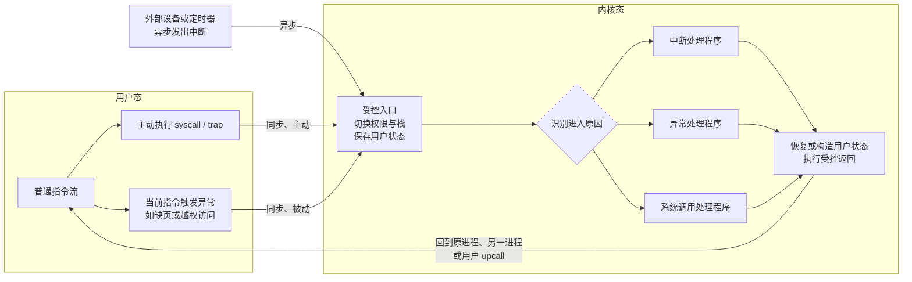

> 书名：*Operating Systems: Principles and Practice*（第二版）<br>
> 卷名：Volume I: *Kernels and Processes*<br>
> 作者：Thomas Anderson、Michael Dahlin<br>
> 笔记范围：第 2 章 `The Kernel Abstraction`，包括 2.1～2.11 节及 17 道章末练习
> 原文位置：osppv1.md 的 “2 The Kernel Abstraction” 部分

## 全章主线

### 本章要解决的根本矛盾

应用必须直接使用处理器才能高效运行，但应用可能有 bug，甚至故意攻击系统。若内核解释并检查应用的每一条指令，保护容易实现，性能却很差；若应用不受限制地直接运行，性能高，却能改写内核、其他进程和设备。

本章的核心问题因此是：

> 怎样让不可信应用的大多数指令直接在硬件上高速执行，同时保证所有危险操作都必须由可信内核检查？

作者的答案是软硬件共同构造**受保护执行（protected execution）**：应用在用户态直接执行安全指令；硬件禁止危险指令和越界内存访问；中断、异常和系统调用通过受控入口把执行权交给内核；内核完成检查后再精确恢复用户状态。

### 全章因果链

```text
可靠、安全、隐私与公平需要保护
        ↓
进程把“执行实例”放入保护域
        ↓
双模式硬件区分可信内核与不可信应用
        ↓
特权指令 + 内存保护 + 定时器保证内核可控
        ↓
中断、异常、系统调用触发受控模式切换
        ↓
向量表、内核栈、屏蔽和寄存器保存保证切换安全
        ↓
系统调用、新进程、upcall 复用同一套机制
        ↓
启动过程建立可信内核，虚拟机再嵌套一层保护
```

### 阅读方式

笔记按 `2.1 → 2.11 → Exercises` 的原书顺序组织。x86 步骤、伪代码、形式化模型、现代硬件说明和 C 实验直接嵌入相应概念：先建立保护目标，再逐层解释硬件条件、模式转移与内核实现，并在出现公式时给出推导和适用边界。

---

## 开篇：为什么保护是内核的核心职责

### 保护要支撑哪些系统目标

原书从第一章的评价标准出发，说明保护至少支撑四个目标。

**可靠性。**

一个应用的 bug 不应让其他应用或内核崩溃。用户看到整机崩溃时通常会认为是操作系统失败，即使根因来自应用。因此内核必须在应用做出任何意外行为时仍保持正确。

**安全性。**

不可信程序不能修改系统状态。若应用可直接写磁盘，它可以替换内核映像；下次启动后，恶意内核便可安装间谍软件并关闭病毒防护。

**隐私。**

用户和应用只能读取获准访问的数据。游戏、屏幕保护程序等流行应用可能被伪装成窃取邮件、联系人和信用卡资料的工具。

**公平资源分配。**

内核必须限制应用获得的 CPU、内存和磁盘空间。否则单用户系统中的 bug 会让其他应用停滞，多用户系统中的某个用户则可抢走全部资源。

### 内核与用户软件的信任边界

内核是运行在系统最底层、可完全访问硬件的软件。它必须被信任，因为它能执行硬件允许的任何操作。其他软件默认不可信，只在能力受限的环境中运行。

> **可信计算基（TCB）。** 为某项安全性质必须正确工作的全部软硬件构成可信计算基。内核通常是 TCB 的主要部分，但处理器、启动固件和关键驱动也可能属于 TCB。缩小 TCB 能减少必须审查和验证的代码量。

应用也会嵌套相同问题。浏览器执行第三方 JavaScript，数据库执行存储过程，编辑器运行插件。扩展提高功能，却要求宿主应用像小型内核一样限制扩展。

### 进程的章首定义

**进程是以受限权限执行的应用程序实例，是内核提供的受保护执行抽象。**

进程在读取其他进程内存、访问磁盘或更改硬件设置前，必须得到内核许可。换言之，内核中介并检查进程对硬件的访问。

### 为什么需要少量硬件支持

内核自己直接运行且权力完整；应用也应直接运行，但危险操作必须失效。仅靠软件约定无法约束恶意机器码，因此硬件要提供：权限级别、内存访问检查、定时器、受控陷入和精确状态恢复。

这里体现贯穿全书的设计模式：少量精心设计的硬件机制，可以让操作系统高效实现强抽象。

---

## 2.1 进程抽象（The Process Abstraction）

### 从源代码到运行实例

程序员编写高级语言源代码，编译器将其转换成机器指令，并把指令、静态数据及初值存入**可执行映像（executable image）**。

运行时，操作系统：

1. 把代码和静态数据从可执行文件装入内存；
2. 建立执行栈，保存过程调用中的局部变量和返回状态；
3. 建立堆，容纳动态分配对象；
4. 设置栈指针；
5. 从程序入口开始执行。

操作系统自身也已驻留内存，并有自己的代码、数据、堆和栈。编译器也只是另一个由内核装载并执行的程序。

### 程序与进程的严格区别

- **程序（program）**：磁盘上的静态代码和初始数据，是一种描述或模板；
- **进程（process）**：程序的一次动态执行实例，带有当前寄存器、内存、权限和资源状态。

原书类比：程序类似类，进程类似对象实例。一个程序可对应零个、一个或多个进程。

> **进程状态模型。** 可把进程状态抽象为
>
> $$P=(I,R,M,K,C),$$
>
> 其中 $I$ 是程序指令，$R$ 是寄存器状态（含程序计数器和栈指针），$M$ 是用户地址空间，$K$ 是内核维护的权限与资源状态，$C$ 是调度状态。仅有可执行文件 $I$ 不足以恢复正在运行的进程。

### 多个实例怎样共享与隔离

简化模型为每个进程复制完整代码、数据、堆和栈。现代系统通常只保留一份只读代码物理页，让多个进程映射共享；但可变数据、堆和栈仍需逻辑独立。

共享只读代码不会让进程互相改写状态。若需要写共享内存，内核必须显式建立共同映射并规定权限。

### 进程控制块（PCB）

内核用 PCB 跟踪每个进程，其中包括：

- 进程位于何处；
- 可执行映像在磁盘上的位置；
- 发起执行的用户；
- 进程权限；
- 其他运行与管理状态。

> **现代 PCB 常见字段。** 进程标识、调度状态、已保存寄存器、地址空间引用、打开文件表、凭据、统计信息和父子关系。具体布局属于实现细节。

PCB 是内核可信数据，用户不能任意修改。上下文切换时，当前执行状态会保存到 PCB 或与其关联的内核栈中。

### 代码、静态数据、堆与栈

| 区域 | 主要内容 | 生命周期/增长方式 |
|---|---|---|
| 代码 | 机器指令 | 通常只读，可由进程共享物理页 |
| 静态数据 | 全局/静态变量 | 与进程生命周期相同 |
| 堆 | 动态对象 | 由分配器按程序需求增长/回收 |
| 用户栈 | 调用帧、局部变量、返回地址 | 随调用深度增长/收缩 |

“栈”和“堆”是进程地址空间区域；PCB 位于内核受保护内存中，不属于应用可自由写入的数据。

### 进程与线程

本章先讨论只有一个程序计数器、代码、数据、堆和栈的简单进程。多线程程序则在同一保护域中有多个并发活动：

- 每个线程有自己的程序计数器和栈；
- 同一进程中的线程共享代码、全局数据和堆；
- 进程主要表示资源与保护边界，线程主要表示执行流。

当前主流术语是：一个进程执行一个程序，进程内包含一个或多个线程。

### 术语的历史演化

“process”最初更接近今天的“thread”，表示一条逻辑指令序列。早期内核用协作进程组织并发，但应用通常单线程，于是执行流和保护边界没有歧义。

并行程序出现后，同一保护域需要多个执行流，一度称“轻量级进程”，后来“线程”成为主流。阅读旧系统资料时，必须依据上下文判断 process 指执行流还是保护域。

---

## 2.2 双模式运行（Dual-Mode Operation）

### 从软件解释器到硬件检查

最安全但低效的假想方案是：内核逐条解释应用指令，每次都检查内存地址、跳转目标和设备访问是否合法。其正确性直觉清晰，因为所有操作都经过检查；代价是每条用户指令都要由多条解释器指令模拟。

优化观察是：寄存器加法等绝大多数指令本身安全。若把解释器的关键检查做进硬件，安全指令可原生执行，只有危险事件才进入内核。

### 双模式的定义

处理器状态中有模式信息：

- **用户模式（user mode）**：硬件检查并禁止进程无权执行的操作；
- **内核模式（kernel mode）**：保护检查对内核放开，内核可控制全部硬件。

概念上可用一位表示，但真实处理器可能有多个特权级。模式位通常位于应用不能直接写的处理器状态寄存器中，只能通过特定受控事件改变。

> **安全不变量。** 任意时刻若处理器处于内核模式，则当前程序计数器必须位于内核认可的代码入口或其可达控制流中，当前栈必须是可信内核栈。仅改变模式位而不同时改变 PC、SP 和内存权限并不安全。

### 内核不等于整个操作系统

操作系统的 UI 控件库可链接进应用并在用户态运行；窗口管理器也可作为独立用户进程。它们提供操作系统功能，却不必拥有完整硬件权限。

这样做有两点收益：

1. 用户态代码更容易调试；
2. bug 的破坏范围更小，窗口系统崩溃不应顺便破坏磁盘。

这体现**最小权限原则**：每个组件只拥有完成工作必需的权限，不多给。

> **最小权限的严格表述。** 若组件完成任务所需能力集合为 $N$，实际授予能力为 $G$，理想状态是 $G=N$；至少应满足 $N\subseteq G$ 且尽量最小化 $G\setminus N$。权限不足会失去功能，权限过多会扩大被攻陷后的损害。

### 处理器状态寄存器与多特权级

处理器状态寄存器还含算术条件码、地址宽度和中断开关等标志。中断发生时硬件必须自动保存它，否则处理程序的算术操作会覆盖原程序的条件码，使返回后的分支行为错误。

x86 传统上有四个特权环，但当时的 macOS、Windows 和 Linux 没有利用中间两级，通常使用内核/用户两级。多级权限理论上可服务嵌套虚拟化，但固定四级无法支持任意深度嵌套。现代虚拟化通常依赖额外硬件模式，而非简单消耗特权环。

### 双模式至少需要三项机制

1. **特权指令**：用户态不能直接执行危险操作；
2. **内存保护**：用户态只能访问获准地址；
3. **定时器中断**：无论应用是否合作，内核都能重新获得 CPU。

此外还必须安全地在两种模式间来回转换，这正是 2.3～2.5 的主题。

---

### 2.2.1 特权指令

**定义与目标。**

**特权指令（privileged instruction）**是只能在内核模式执行的指令。它们用于改变权限级别、内存保护配置、中断状态和设备控制。

应用只能使用完整指令集的安全子集；内核能使用全部指令。若应用能执行这些指令，双模式边界便形同虚设。

**为什么用户不能直接提升权限。**

用户程序只能通过系统调用等特殊指令，进入内核预先设定的入口；不能任意设置模式位，也不能跳到任意内核地址。

原因是内核服务通常先检查权限。若攻击者能跳到检查之后，就能读取原本无权访问的文件。限制入口不仅要保证“进入的是内核代码”，还要保证“从该服务的验证起点进入”。

**违规时发生什么。**

用户态执行特权指令或非法内存访问会引发**处理器异常**。硬件切换到内核异常处理程序，内核通常终止违规进程并报告错误。

这不同于语言异常：语言异常通常仍由用户态运行库处理；处理器异常首先由硬件和内核接管，内核可以选择终止、模拟或转交给用户处理程序。

**必须特权化的典型操作。**

- 修改模式/状态控制位；
- 设置页表、基址/界限或地址空间；
- 屏蔽和启用硬件中断；
- 配置定时器；
- 控制设备和 DMA；
- 设置中断向量表地址；
- 从中断返回并恢复特权状态。

并非所有 I/O 指令在所有架构上都采用同一形式；若设备是内存映射 I/O，则内存保护负责阻止用户访问设备地址。

---

### 2.2.2 内存保护

**为什么读和写都必须限制。**

内核和多个应用同时驻留内存。若进程能写内核代码或登录程序，它可取得系统控制；即使只读也不安全，因为内核缓冲区可能含其他用户文件，验证期间还可能暂存密码。

因此每个用户态内存访问，包括取指、读数据和写数据，都必须受硬件检查。

**MS-DOS 的反例。**

MS-DOS 不提供内存保护，应用可读写任意内存。后果包括：

- 应用 bug 经常让系统和其他应用崩溃；
- 病毒更容易控制系统；
- 应用开始直接依赖并修改内部数据结构；
- 新版系统为兼容旧应用不得不保持内部布局，演化困难。

所以内存保护不仅提高可靠和安全，也强制应用通过稳定接口使用内核，有利于可移植性和长期演化。

#### 基址—界限保护

早期硬件使用两个只能由内核修改的寄存器：

- `base`：进程物理内存区域起点；
- `bound`：原书图示中为区域终点。

对于每次访问物理地址 $a$，硬件允许条件为

$$
\text{base}\le a<\text{bound}.
$$

这里采用半开区间 $[\text{base},\text{bound})$，避免终点地址既表示长度又表示可访问字节的歧义。若特定机器把 bound 定义为“最后合法地址”，条件则是 $a\le\text{bound}$；实现必须明确约定。

取指时检查 PC，读写数据时检查有效地址。若失败，硬件引发异常而不是完成访问。

#### 范围访问的完整边界检查

块复制等一条指令可能触及多个字节。设起始地址为 $a$，长度为 $n$ 字节，合法条件应是：

$$
n\ge0,\qquad \text{base}\le a,
\qquad a+n\le\text{bound}.
$$

但直接计算 $a+n$ 可能整数溢出。更稳健的无溢出检查是：

$$
\text{base}\le a<\text{bound},
\qquad n\le\text{bound}-a.
$$

若允许零长度访问，还要单独定义 $a=\text{bound}, n=0$ 是否合法。

> **边界漏洞。** 只检查首地址合法是不够的。缓冲区可从用户区最后几个字节开始，却延伸到内核区；这也是系统调用复制用户缓冲区时必须检查完整范围的原因。

**内核如何与用户内存交换数据。**

内核模式不受用户基址—界限限制，可访问任意内存。应用打印 “hello world” 时，内核必须把字符串从用户区域安全复制到受保护的屏幕缓冲区。

复制必须处理：地址无效、跨边界、复制途中映射变化和设备错误。不能直接信任用户传入指针。

**内存映射设备。**

许多设备通过特殊物理地址控制。设备监视内存总线，看到分配给自己的地址便执行 I/O。内存保护阻止用户进程访问这些地址，从而迫使磁盘、网络和键盘操作经过内核权限检查。

否则应用可直接改写磁盘内核映像、绕过文件权限或干扰其他用户设备请求。

#### 物理基址—界限的四项局限

**堆和栈难以独立增长。**

单个连续区域在启动时固定。堆和栈从不同方向增长，需求直到运行时才知道，单对寄存器难以灵活扩容。

**难以共享内存。**

一个连续私有区域不能自然表达多个进程共享同一代码库或共享数据页。

**需要物理地址重定位。**

编译链接时全局地址通常相对映像起点。若程序装入不同物理位置，简单物理寻址需要修改引用地址，装载成本高且复杂。

**外部碎片。**

进程不规则启动与退出后，空闲空间分散。即使空闲总量足够，也可能没有足够大的连续块。移动运行进程又必须修正寄存器和栈中的所有物理指针，几乎不可行。

#### 虚拟地址这一层间接性

现代系统让每个进程从相似虚拟地址开始，由硬件转换到不同物理位置。最简单的重定位模型为

$$
p=\text{base}+v,
$$

其中 $v$ 是进程生成的虚拟地址，$p$ 是物理地址。若进程区域长度为 $L$，还需检查

$$
0\le v<L.
$$

这与前述物理边界检查等价：令 `bound = base + L`，则 $base\le p<bound$。

现代分页更复杂，但间接层带来的核心收益不变：虚拟布局保持稳定，物理页可移动、离散分配或共享。

**堆栈增长与共享。**

堆和栈可位于虚拟空间两端，分别增长。需要扩容时，内核可给它们映射新的物理页，甚至移动已有物理存储，而不改变用户指针。

固定大小页框还减少外部碎片；不同进程也可把同一只读物理代码页映射到各自虚拟空间。

**一个虚拟地址测试程序。**

一个简单测试程序让静态变量加一、休眠并打印地址和值。多份程序同时运行时，每份都打印相同虚拟地址和 `1`，说明：

- 相同虚拟地址可在不同进程映射到不同物理存储；
- 每个进程修改自己的静态变量副本；
- 仅凭自己的虚拟地址无法引用另一进程的私有内存。

地址相同不是“共享变量”的证据，恰恰说明虚拟地址的含义取决于当前地址空间。

**地址空间布局随机化（ASLR）。**

缓冲区越界可能覆盖栈上的返回地址，使攻击者把控制流指向恶意代码。若每次运行的地址固定，攻击者更容易预测目标。

ASLR 每次运行随机改变栈、堆，乃至代码和静态数据的位置，使地址猜测更困难。

局限：

- 随机熵有限时可反复猜测；
- 地址泄漏会削弱随机化；
- ASLR 不修复越界 bug，只增加利用难度；
- 需配合不可执行内存、栈保护、控制流保护等机制。

**语言保护能否替代硬件保护。**

理论上，完美的类型安全语言和编译器可保证对象外内存不可访问；运行时还必须正确垃圾回收，防止释放后继续持有指针。

实践中，编译器、运行时和用 C 编写的高性能库都可能有 bug。若只依赖语言，它们全部进入 TCB。Chrome 等系统同时使用语言检查和进程隔离，让攻击者必须连续突破两层。

这叫纵深防御：机制看似重复，实际降低单一漏洞导致完全失陷的概率。

---

### 2.2.3 定时器中断

**为什么内核必须不依赖应用合作。**

应用进入无限循环后不会主动调用内核。若 CPU 完全归应用控制，内核没有机会判断是否切换任务、响应用户终止请求或播放音频。

因此必须有应用无法关闭的外部机制，周期性把控制权交还内核。

**协作式与抢占式调度。**

早期 Mac OS 要求应用定期主动进入内核，让系统检查其他任务。应用若忘记让出或进入死循环，用户只能重启，出现所谓“死亡旋转光标”。

抢占式系统依赖硬件定时器：内核设置若干毫秒后中断，定时器到期时硬件自动进入内核。配置/关闭定时器必须是特权操作。

**定时器工作流程。**

1. 内核设置当前 CPU 的定时器；
2. 用户进程直接运行；
3. 到期后硬件中断当前指令流；
4. 保存用户状态并进入内核处理程序；
5. 内核重设定时器并决定继续当前进程还是切换；
6. 恢复选中进程状态并返回用户态。

多处理器通常每个 CPU 有独立定时器，因为每个处理器都必须能从其当前用户代码中被夺回。

**内核如何识别无限循环。**

内核通常**不知道**应用是否处于无限循环，因为长时间计算与死循环从外部可能相同。内核保证自己能重新获得控制，并在用户或管理员请求、应用长期无响应时终止进程。

这一区分很重要：定时器提供控制权，不自动提供程序意图识别。

#### 时间片与响应性的量化分析

设时间片长度为 $q$，一次切换固定成本为 $s$。若 CPU 密集任务总是用完整时间片，切换开销占比近似为
>
> $$O=\frac{s}{q+s}.$$

例如 $q=5\text{ ms}$、$s=10\text{ μs}=0.01\text{ ms}$：

$$
O=\frac{0.01}{5.01}\approx0.1996\%.
$$

减小 $q$ 可让任务更快获得运行机会，却提高切换比例；增大 $q$ 降低开销，却可能恶化交互响应。该模型忽略缓存污染、I/O 阻塞和多核迁移，不能单独决定实际时间片。

---

## 2.3 模式转移的类型（Types of Mode Transfer）

### 为什么模式转移既要快又要安全

内核把进程放进受限沙箱后，必须允许合法请求进入内核，也必须处理外部设备和执行错误。高性能服务器每秒可能跨越边界数千次，所以切换若太慢会成为瓶颈；若入口和状态保存稍有漏洞，应用就可能控制内核。

模式转移不是普通函数调用，因为它同时改变权限、地址访问能力、栈和控制流。

下面这张图把三类进入原因与共同的底层路径放在一起。关键不是记住三条孤立定义，而是看出：**触发原因不同，但都只能汇入硬件和内核预先规定的受控入口。**



读图时沿两个方向看：横向看一次完整的权限边界往返；纵向看三种事件如何在入口后分流。系统安全依赖图中的“漏斗”结构——用户可以选择发起系统调用，却不能选择任意内核 PC 或跳过参数检查。

---

### 2.3.1 用户态到内核态

用户态进入内核态有三类原因：中断、处理器异常和系统调用。

**同步与异步。**

- **异步事件**与当前指令语义无直接因果关系，可发生在任意指令之间；中断属于此类。
- **同步事件**由当前指令执行触发；异常和系统调用属于此类。
- 本章用 **trap** 指任何同步的用户态到内核态转移；部分系统把该词泛指所有低到高权限转移。

“同步”不表示可预测或正常，只表示能归因到特定指令。

#### 中断（Interrupt）

中断是外部事件发给处理器的异步信号。处理器检测到中断时，完成或暂停在途指令，保存执行状态，并从内核指定的处理程序开始执行。

常见来源包括硬件定时器、键盘鼠标、网络输入、磁盘或网络 I/O 完成，以及核间中断。多处理器中，中断通常只交给一个 CPU，其他 CPU 继续执行；内核可再发送核间中断协调其他处理器。

**中断与轮询。**

| 方法 | 优势 | 局限 |
|---|---|---|
| 中断 | 空闲时 CPU 可运行应用；适合稀疏事件 | 高频事件下切换成本高，可能形成中断风暴 |
| 轮询 | 批量处理高频事件，时序可控 | 无事件时浪费 CPU，轮询期间不能运行普通用户代码 |

现代高性能系统常混合使用：低负载中断唤醒，高负载短时轮询批量收包。

**缓冲区描述符与高性能 I/O。**

若设备一次只接收一个请求，完成后中断内核，内核再提交下一个请求，则内核处理中断期间设备空闲。更高效的方法是建立循环请求队列。每个**缓冲区描述符**说明操作类型、数据缓冲区地址/长度及完成状态。

设备通过 DMA 读取描述符、传输数据并写回结果。只要环中持续有请求，设备可立即开始下一项，与内核并行。一个逻辑 I/O 可能包含多次 DMA：取描述符、搬数据、写回状态。网卡常分别维护收包和发包环。

> **环形队列条件。** 大小为 $N$ 的环可用生产索引 $tail$ 和消费索引 $head$ 管理。若保留一个空槽区分满/空，则空条件为 $head=tail$，满条件为 $(tail+1)\bmod N=head$，最多存 $N-1$ 项。真实设备还需内存屏障确保先写描述符内容，再公开 $tail$。

#### 处理器异常（Processor Exception）

处理器异常由用户程序行为触发。错误类例子有特权指令、越界内存、整数除零、非对齐访问和写只读内存。内核通常终止进程，但异常也有良性用途：

- 调试器用 trap 指令设置断点；
- 内核用软件模拟缺失的浮点指令；
- 宿主用异常模拟客户内核的特权指令；
- 缺页异常让内核按需把页面从磁盘装入。

异常把罕见慢路径移出常见执行路径，使正常指令直接运行。

#### 系统调用（System Call）

系统调用是用户进程主动请求内核执行特权操作的受保护过程调用。多数处理器提供 `trap`/`syscall` 指令；也可约定特定非法操作码触发异常。

用户看来它像普通函数。实际还包含模式切换、参数复制与验证、权限检查和状态恢复。硬件必须转到预定义入口，不能接受用户提供任意内核地址。

**三者对比。**

| 属性 | 中断 | 处理器异常 | 系统调用 |
|---|---|---|---|
| 来源 | 外部设备/其他 CPU | 当前指令的异常条件 | 当前进程主动执行 trap |
| 时序 | 异步 | 同步 | 同步 |
| 是否通常表示错误 | 否 | 可能 | 否 |
| 返回位置 | 通常原执行点 | 重试当前或跳过，依语义 | trap 后一条指令 |
| 典型用途 | 定时器、I/O 完成 | 保护、缺页、调试 | 请求内核服务 |

---

### 2.3.2 内核态到用户态

内核态返回用户态有四种情形。

**启动新进程。**

内核装入程序，设置用户 PC、用户栈和用户模式，从入口开始执行。新进程没有旧状态，内核会人工构造一份看似“刚被中断”的状态复用返回路径。

**从事件或系统调用恢复。**

内核恢复保存的 PC、寄存器、SP 和状态字并切回用户模式。系统调用通常从 trap 后继续；可重启异常可能回到原指令。

**切换到另一进程。**

内核保存当前进程状态到 PCB/内核栈，加载另一进程状态并返回用户态。原进程以后再从保存点继续。

**用户级 upcall。**

内核把异步事件投递给用户处理程序。返回用户态时先运行 upcall；处理程序结束后再恢复原计算。

---

## 2.4 实现安全模式转移

### 三项最低要求

1. **有限内核入口**：只能进入内核指定的处理程序起点，不能跳过权限检查。
2. **处理器状态原子改变**：模式、PC、SP 和内存权限必须整体切换。已经获得内核权力却仍执行用户 PC，是致命中间态。
3. **透明、可重启执行**：内核必须精确恢复所有可观察状态，应用除时间延迟外不知道中断发生。

中断、异常和系统调用原因不同，却都需要保存状态、切栈、选择处理程序和恢复。共享通用汇编序列可减少重复和出错概率。

---

### 2.4.1 中断向量表

**定义与索引。**

中断向量表是位于受保护内核内存中的处理程序入口数组。若事件编号为 $k$，表为 $V$，则：

$$
PC_{kernel}=V[k].
$$

$k$ 来自硬件事件或受限 trap，表内容和基址只能由内核修改。

书中 x86 约定：0～31 为异常，32～255 为硬件中断，64 为系统调用入口。具体操作系统可能不同，64 不是永久架构规定。

**为什么表必须受保护。**

应用若能改表，可把网卡中断重定向到自己代码，或替换系统调用入口。向量表及其基址寄存器都必须在用户态不可写。

**多核中断路由。**

早期系统让 CPU 0 处理全部外部中断，简单却可能成为瓶颈。现代内核可编程路由：每 CPU 定时器、磁盘完成送回请求 CPU、网卡按连接头部哈希选择描述符环与 CPU。送到已有相关缓存的 CPU 可减少跨核传输，但还要兼顾负载均衡。

---

### 2.4.2 中断栈

**为什么不能使用用户栈。**

进入内核时，硬件切到受保护内核栈并保存部分寄存器，处理程序再保存其余状态。不能信任用户栈：

- 用户 SP 可能无效，内核仍必须可靠工作；
- 同进程另一线程可修改用户栈，篡改内核局部变量或返回地址。

即使发起系统调用的线程被阻塞，其他线程仍可能运行。多处理器至少每 CPU 有独立中断栈，否则同时进入会互相覆盖。

**保存与恢复。**

进入时：硬件切栈并压入最小状态，汇编入口保存其余寄存器，再调用高级处理程序。退出时严格反向恢复，最后由特殊返回指令原子恢复用户 SP、PC 和权限。

---

### 2.4.3 每进程两套栈

**用户栈与内核栈。**

多数内核为每个可进入内核的线程分配用户栈和内核栈。用户态运行时内核栈为空；陷入内核后，用户状态位于内核栈底部，内核调用帧继续增长。

**为什么便于阻塞和切换。**

系统调用等待 I/O 时，内核调用链本身也要暂停。内核只需把 SP 保存到 PCB，再切到另一线程的内核栈。I/O 完成后恢复 SP，原内核函数继续。

| 状态 | 用户栈 | 内核栈 |
|---|---|---|
| 用户态运行 | 用户调用链 | 空 |
| 内核态处理 | 保持用户调用链 | 用户寄存器 + 内核处理链 |
| 就绪未运行 | 保持用户状态 | 含恢复上下文 |
| 等待 I/O | 系统调用前用户状态 | 含等待点内核上下文 |

早期 UNIX 内存昂贵，只在 PCB 保存最小寄存器并保留少量内核栈；现代系统常以每线程内核栈换取简单性。

---

### 2.4.4 中断屏蔽

**为什么要暂缓中断。**

第一次处理尚未保存完整状态时，第二次处理若把 SP 重设到栈底会覆盖状态。调度器更新数据结构时重入也可能看到不一致中间态。

所谓 `disable interrupts` 实际是屏蔽/延迟，不是永久忽略；重新启用后投递待处理中断。该操作必须特权化，否则用户可关闭定时器并垄断 CPU。

硬件待处理容量有限，同类多个事件可能合并；处理程序必须检查设备队列，且屏蔽区应尽量短。

**上半部与下半部。**

按本书术语（Linux 名称方向可能相反）：下半部由硬件立即触发，在中断屏蔽下快速保存/复位设备并安排后续；上半部在中断开启后解析包、投递进程等。核心目标是缩短屏蔽时间。

> **多核边界。** 关闭当前 CPU 中断不能阻止其他 CPU 访问共享数据。多核共享结构仍需锁或原子操作；关中断不是全局互斥锁。

---

### 2.4.5 保存与恢复寄存器的硬件支持

**保存时机。**

处理程序会修改寄存器，所以硬件必须在第一条处理指令前保存 PC、SP 和状态字；软件入口再立即保存通用寄存器。

**32 位 x86 的做法。**

硬件在来自用户态时保存用户 SP、PC 和状态字并切内核栈；处理程序用 `pushad` 保存八个 32 位整数寄存器。返回时 `popad` 恢复通用寄存器，`iret` 恢复 SP、PC 和状态字。

内核通常不使用浮点寄存器，因此只在切换进程等必要时保存。现代扩展状态更多，真实实现会不同。

**寄存器窗口与精确中断。**

SPARC 用硬件寄存器窗口加速调用和模式切换，但切换进程可能要保存多个窗口，成本被转移而非消失。

现代深流水处理器通常提供**精确中断**：程序顺序上早于中断点的指令都完成，晚于中断点的效果都撤销，架构状态像在两条指令之间停止。内核无需保存内部流水线阶段，复杂度由硬件提交/回滚机制承担。

---

## 2.5 综合案例：x86 模式转移

### 32 位分段背景

本节使用书中的 32 位模型：`cs:eip` 表示代码位置，`ss:esp` 表示栈位置，特权级在 `cs` 低位，`eflags` 含条件码和中断标志。现代 x86-64 细节不同，安全目标相同。

### 硬件进入内核的六步

1. **屏蔽中断**：防止切换半途被打断。
2. **暂存关键状态**：用户 `ss:esp`、`eflags`、`cs:eip`。
3. **切到内核栈**：从受保护配置取得内核 `ss:esp`。
4. **压入关键状态**：把用户返回上下文写入内核栈。
5. **统一错误码槽**：页错误等由硬件压错误码；其他事件由软件压占位值。
6. **调用处理程序**：按事件号查询内核向量表并设置新 `cs:eip`。

处理程序随后立即执行 `pushad` 保存八个通用寄存器。栈中同时有用户 `esp` 和 `pushad` 记录的内核 `esp`。

### trapframe 与 56 字节推导

trapframe 是硬件和入口代码保存在内核栈底部、描述被中断用户上下文的数据结构。

书中 32 位例子：硬件/统一错误槽共保存 6 个 32 位值，`pushad` 保存 8 个，故：

$$
	ext{size}=(6+8)\times4=56\text{ bytes}.
$$

该结论依赖这里采用的简化布局，不含对齐、向量号、浮点/SIMD 状态等；真实 trapframe 可不同。

### 返回路径与 PC 语义

处理程序执行 `popad`，移除错误码，再用 `iret` 原子恢复 `cs:eip`、`eflags`、`ss:esp` 和用户权限。

- 异步中断恢复原执行流；
- 缺页修复后通常重试原指令；
- 模拟完成的缺失指令必须把保存 PC 改到下一条，否则会再次异常；
- 书中 x86 系统调用 trap 保存 trap 后的 PC。

返回位置由事件语义决定，不能一律“PC 加一”；变长指令也未必只占一字节。

---

## 2.6 实现安全系统调用

### 系统调用要解决的问题

进程若要创建进程、读键盘、访问文件或控制设备，必须跨出自己的保护域。内核代它执行这些操作，同时保证错误参数不会让内核崩溃，恶意参数不能绕过权限。

系统调用给用户“内核像一组普通库函数”的幻象，但实现必须采用极端防御性编程：假定每一位参数都由攻击者精心构造。

### 调用约定

操作系统规定：

- 怎样标识系统调用编号；
- 参数放寄存器还是用户栈；
- 返回值与错误码放在哪里；
- 哪些寄存器由调用者/被调用者保存。

书中 x86 示例把 `SysCallOpen` 编号放入 `%eax`，参数按普通约定放用户栈，执行 `int #TrapCode`，返回值也放 `%eax`。

调用约定本身是协议，不具有天然唯一性。用户可绕过库 stub 直接 trap，所以内核不能因“官方库会正确格式化”而省略验证。

### 双 stub 的六步路径

**stub** 是连接两个调用环境的适配过程。系统调用有用户 stub 和内核 stub：

1. 用户程序像普通函数一样调用用户 stub；
2. 用户 stub 放置调用编号/参数并执行 trap；
3. 硬件进入通用内核 handler，内核 stub 复制和检查参数，再调用真正实现；
4. 实现完成并返回内核 stub；
5. handler 把结果放入用户可见位置，恢复到 trap 后的用户 stub；
6. 用户 stub 像普通函数一样返回调用者。

同样的 stub 思想也用于远程过程调用，只是边界从用户/内核变成网络两端。

### 内核 stub 的四项任务

**一、定位参数。**

参数常位于用户栈，是虚拟地址且可能损坏。内核先验证用户 SP 和整个参数范围，再安全读取其中的指针。若参数本身指向文件名/缓冲区，还要继续验证第二层范围。

不能只检查指针非空；地址必须属于当前进程、权限正确、长度不溢出，且访问过程中可能发生缺页。

**二、验证参数和权限。**

文件名可能没有 NUL 终止、跨出用户区、过长；文件可能不存在；当前用户也可能无权限。内核应返回错误，而不是越界读取或崩溃。

验证分为两层：输入结构是否合法，以及请求动作是否被安全策略允许。

**三、先复制再检查（Copy Before Check）。**

若内核直接检查用户内存，检查结束后另一线程可在实际使用前修改内容，形成 **TOCTOU（time of check to time of use）** 攻击。

错误顺序：

```text
检查 user_filename 是允许文件
        ↓ 另一线程改写 user_filename
用 user_filename 打开敏感文件
```

安全顺序是把有界输入复制到内核私有缓冲区，再在同一不可被用户修改的副本上验证和使用：

```text
安全复制 user_filename → kernel_copy
检查 kernel_copy
使用 kernel_copy
```

为什么进程陷入内核后用户仍能修改？多线程进程可在另一 CPU 上运行；两个进程也可能共享该内存。内核每次都必须正确，攻击者可重复尝试竞态。

> **复制并非万能。** 路径名复制后，文件系统命名空间本身仍可能变化，例如符号链接被替换。更强方案是获取稳定对象句柄、在同一锁/事务下检查并使用，或使用目录句柄与禁止跟随链接等接口。

**四、复制结果回用户区。**

文件读取等结果要写入用户缓冲区。内核再次验证目标范围和写权限，并处理部分复制、缺页或进程映射变化。小整数返回值可直接放寄存器。

### `open` 内核 stub 的论证

书中伪代码依次执行：

1. 验证用户栈参数范围；
2. 取得文件名用户指针；
3. 最多复制 `MaxFileNameSize` 字节到内核缓冲区；
4. 强制末尾 NUL，防止字符串函数越界；
5. 按当前进程凭据检查文件权限；
6. 调用真正 `Kernel_Open`，返回句柄或错误。

若本地数组容量是 `MaxFileNameSize + 1`，最后一个元素用于强制终止。复制函数必须逐段验证地址，不能因为首字节合法就假设整个字符串合法。

### 适用边界

安全系统调用还需考虑整数溢出、重复句柄、资源配额、取消、信号打断、并发关闭、内核对象生命周期和侧信道。本章给出的是跨边界验证的通用骨架，不是某个真实系统调用的完整规范。

---

## 2.7 启动新进程

**创建资源。**

内核先：

1. 分配并初始化 PCB；
2. 分配进程地址空间；
3. 从磁盘装入程序代码和数据；
4. 分配用户栈；
5. 分配处理系统调用/中断/异常的内核栈。

实际系统还会建立凭据、打开文件、页表和调度状态，但原书本节强调最小机制。

**复制启动参数。**

用户点击文件图标时，窗口管理器请求内核启动关联程序并传文件名。内核不能让新进程直接引用窗口管理器私有指针，而要把参数复制到新进程用户内存，通常放在用户栈底部，再调整 SP 避免覆盖。

跨进程复制必须验证源，正确构造目标格式，并定义参数大小上限。

**复用中断返回路径。**

新进程没有“先前用户状态”，但内核可在新内核栈底部人工构造初始 trapframe：

- PC = 用户启动 stub；
- SP = 已放置参数的用户栈；
- 状态字 = 用户模式与合法初值；
- 通用寄存器 = 约定初值。

然后切到该内核栈，跳到通用 handler 尾部。`popad`/`iret` 以为自己在“恢复”用户程序，实际第一次启动它。

这是优秀复用：安全出口只有一条，减少新进程专用汇编路径。

**为什么真正入口不是 `main`。**

编译器/运行库插入 `start` stub：

```c
start(arg1, arg2) {
    main(arg1, arg2);
    exit();
}
```

它还可能初始化运行库。若内核直接跳到 `main`，`main` 返回时栈上没有合法调用者返回地址，CPU 会把随机数据当 PC。启动 stub 明确把 `main` 的返回转成 `exit` 系统调用。

---

## 2.8 实现 upcall

### 为什么系统调用还不够

系统调用由应用主动发起。但内核有时需要立即通知应用：I/O 完成、调试器要求暂停、处理器异常、资源配额改变。仅让应用不断轮询会浪费 CPU 或增加延迟。

**upcall** 是内核向用户进程投递异步事件的机制，可视为虚拟化到用户层的中断/异常。UNIX 称 signal，Windows 有异步事件机制。

### 五类用途

1. **抢占式用户级线程**：周期定时 upcall 触发用户线程切换或停止失控脚本；
2. **异步 I/O 通知**：请求立即返回，完成后 upcall，而非阻塞或轮询；
3. **进程间紧急通知**：调试暂停、恢复或注销前清理；
4. **用户级异常处理**：运行库在除零等事件后保存数据或抛语言异常；
5. **用户级资源自适应**：内存配额变化时，垃圾回收器调整频率。

### upcall 与事件循环

并非所有应用都需要立即异步打断。事件循环从队列取事件逐一处理，控制流更简单、共享状态更少。upcall 延迟低，却可在任意点重入程序，增加可重入性与同步风险。

选择取决于事件紧迫性、应用结构和可接受延迟。

### UNIX signal 的五个组成部分

**信号类型。**

内核定义有限信号编号；每种表示一种事件。

**处理程序。**

进程可为信号安装 handler；未安装时使用默认动作，如忽略、终止或停止。

**信号栈。**

handler 可用普通用户栈或专门的用户态 signal stack。若普通栈本身损坏/溢出，替代栈更可靠；运行库要操纵异常帧时也更清晰。

它仍是用户内存，不等同于受保护内核栈。

**信号屏蔽。**

同类 handler 运行时通常暂缓再次投递，应用也可系统调用屏蔽信号。标准信号可能合并，不能把每次信号当可靠计数队列。

**用户处理器状态。**

内核把原 PC、SP 和通用寄存器复制到信号栈。handler 返回后，内核从中恢复。handler 也可修改保存状态，例如让运行库切换用户线程。

### signal 投递算法

以用户计算被定时器打断为例：

1. 硬件与内核先按普通中断保存用户状态；
2. 内核发现应投递 signal；
3. 把原用户状态复制到 signal stack；
4. 修改内核中的返回 trapframe：PC 指向 signal handler，SP 指向 signal stack；
5. `iret` 返回用户态，实际进入 handler；
6. handler 完成后通过受控返回进入内核；
7. 内核验证并恢复 signal frame；
8. 再次返回原用户计算。

安全边界：不能盲信用户可修改的 signal frame 来恢复内核权限。内核必须清理/验证状态字和返回地址，确保只回到合法用户态。

### 异步信号的局限

handler 可在普通代码持锁或修改数据结构时运行。许多库函数不是异步信号安全的；handler 中调用它们可能死锁或破坏状态。稳妥做法是 handler 只设置原子标志或写入专用管道，把复杂工作交给事件循环。

---

## 2.9 案例：启动操作系统内核

**“第一条指令”问题。**

开机时 DRAM 和操作系统尚未初始化，处理器把 PC 设置到预定地址，从只读启动存储器（Boot ROM）取指。传统 x86 PC 的启动程序称 BIOS。

**为什么不把整个内核放 ROM。**

- ROM 慢且昂贵；
- 内核需要频繁修复漏洞与更新；
- 固件更新中断可能让机器无法再次启动；
- 大内核会扩大不可更新的早期可信代码。

因此 ROM 只保留小启动阶段，通过间接层装载可更新软件。

**BIOS → bootloader → kernel。**

1. BIOS 从磁盘/闪存固定位置读取固定大小块到内存；
2. 该块是 bootloader，BIOS 跳到其第一条指令；
3. bootloader 理解文件系统，找到内核映像并装入内存；
4. bootloader 跳转到内核入口；
5. 内核初始化数据结构和中断向量表；
6. 内核创建第一个用户进程，通常是登录界面/初始化进程；
7. 用户进程通过系统调用获得服务。

BIOS 只需懂原始固定块，bootloader 则需懂文件系统；分层让固件保持小而稳定，内核可独立更新。

**签名验证与可信启动链。**

若病毒替换 bootloader，之后一切检查都可被绕过。原书说明 BIOS 可用公钥验证 bootloader 的密码学签名，bootloader 再验证内核。

> **签名验证的边界。** 发布者用私钥对映像摘要签名，固件用内置公钥验证。安全依赖私钥保密、验证代码正确、公钥可信、算法安全以及防止回滚到有已知漏洞的旧版本。签名证明“由持钥者授权且内容未改”，不证明代码无 bug。

可信链逐级验证下一阶段：ROM/固件 → bootloader → kernel → 可选的驱动与用户组件。任何未验证可执行阶段都可能断开链。

---

## 2.10 案例：虚拟机

### 术语与资源虚拟化

- **宿主操作系统/监控器（host）**：真正运行在硬件特权模式；
- **客户操作系统（guest）**：在虚拟机内，以为自己控制硬件。

宿主可把物理磁盘上的文件模拟成客户磁盘，把物理网络包模拟成虚拟网卡，把宿主内存映射成客户“物理”内存。

### 客户启动的六步

1. 宿主从虚拟磁盘装入客户 bootloader；
2. 客户 bootloader 装入客户内核；
3. 客户内核建立自己的向量表；
4. 客户内核从虚拟磁盘装入客户进程；
5. 客户执行 `iret` 试图进入客户用户态，因真实用户态不能执行而陷入宿主；
6. 宿主验证请求，按客户意图恢复 PC/SP/状态，模拟模式切换。

宿主不能盲目执行客户给出的状态，否则恶意客户可能诱导宿主跳进宿主内核任意位置。

### 客户系统调用的嵌套路径

硬件只认识真实宿主内核，所以客户用户进程执行 trap 时首先进入宿主：

1. 宿主把客户用户 PC、状态字和 SP 保存到客户虚拟中断栈；
2. 宿主让客户内核入口以真实用户权限运行；
3. 客户内核保存状态、验证参数并实现系统调用；
4. 客户 `iret` 再次因特权指令陷入宿主；
5. 宿主恢复客户用户进程。

客户内核“逻辑上特权、物理上不特权”。宿主跟踪虚拟用户态/虚拟内核态，决定异常应转交客户还是由宿主模拟。

### 异常与中断虚拟化

- 客户用户程序除零等异常应转交客户内核；
- 客户内核执行真实特权指令产生的异常由宿主模拟；
- 真实硬件中断先到宿主；
- 宿主根据虚拟时间决定是否向客户注入定时器；
- 虚拟设备完成后，宿主向客户注入对应虚拟设备中断。

真实时间与客户虚拟时间可能不同：客户暂停时宿主时间继续。定时器虚拟化必须定义客户看到的时钟语义。

### 虚拟 I/O

客户向虚拟磁盘描述符环写请求，宿主把它翻译为对宿主文件的读写，再把数据复制/映射进客户内存，仿真 DMA 和完成中断。

模拟设备不必内部像物理设备，只需满足客户可见接口。半虚拟化驱动可让客户使用专门高效接口，减少模拟开销，但要求修改/安装客户驱动。

### 双层地址转换

> **双层地址转换。** 客户虚拟地址到真实物理地址通常经历：
>
> $$GVA\xrightarrow{\text{guest page table}}GPA
> \xrightarrow{\text{host/nested page table}}HPA.$$

GVA、GPA、HPA 分别为客户虚拟、客户物理和宿主物理地址。硬件嵌套页表可加速并确保客户不能映射宿主或其他虚拟机内存。

### 本章硬件机制总表

支撑上述机制的硬件能力包括：

- 用户/内核权限级；
- 特权指令；
- 内存转换与保护；
- 处理器异常；
- 定时器中断；
- 设备中断；
- 核间中断；
- 中断屏蔽；
- 系统调用 trap；
- 中断返回；
- Boot ROM。

后续线程同步还需要原子读—改—写指令。

---

## 2.11 总结与未来方向

### 进程隔离为何成功

除只运行单一应用的某些嵌入式设备/游戏机外，成功通用操作系统普遍提供进程隔离。它让用户不必信任每个应用，也使应用复杂度增加的同时，单个 bug 不再轻易拖垮整机。

隔离提升了个人电脑长期运行能力，但并非唯一因素；硬件可靠性、自动错误追踪和软件工程也有贡献。

### 为什么现实隔离仍不完整

内核系统调用接口复杂，任意一个内核漏洞都可能让恶意应用突破进程边界。及时补丁降低已知风险，但不能证明运行未知软件安全。

进程通常继承用户的大部分权限，因此不需攻破内核也可能读取该用户所有文件。这推动更细粒度授权。

### 三项互补趋势

**操作系统细粒度保护。**

按应用“需要知道”授予位置、联系人等权限，而不是让所有应用拥有用户全部能力。局限是权限提示可能让用户疲劳，粒度过粗或用途不透明仍会误授权。

**应用层沙箱。**

浏览器、数据库和桌面发布系统成为小型操作系统，安全执行第三方代码。原书举 Google Native Client 和 Microsoft Application Domains。语言/编译检查可降低每次操作陷入内核的成本，但运行时本身必须可信。

**虚拟化硬件支持。**

虚拟机在内核之下再加隔离。即使客户内核被攻破，影响通常限于该 VM。虚拟硬件接口比完整系统调用接口更简单，宿主隔离更容易审查。

处理器和设备逐步支持客户直接处理部分中断、异常、系统调用和 I/O，减少宿主介入。直接访问必须由嵌套页表/IOMMU 等硬件限制，不能牺牲隔离。

### 三层保护不是互相替代

```text
应用层沙箱：限制脚本/插件
        ↓
进程与细粒度 OS 权限：限制应用
        ↓
虚拟机：限制整个客户内核
        ↓
硬件：执行最终权限与地址检查
```

每层有不同接口和 TCB。纵深防御使单层漏洞不必直接导致物理机器完全失陷，但也增加配置与性能复杂度。

---

## 用 C 语言验证关键机制

这些程序是概念模拟，不是实际内核代码。程序本身运行在用户态，真正的权限检查仍由宿主操作系统完成。

### 实验一：基址—界限的安全范围检查

```c
#include <stdbool.h>
#include <stddef.h>
#include <stdio.h>

static bool validate_range(
    size_t address,
    size_t length,
    size_t base,
    size_t bound
) {
    /* 先比较 address，再做减法，避免 address + length 溢出。 */
    return address >= base &&
           address <= bound &&
           length <= bound - address;
}

static bool protected_read(
    const unsigned char physical_memory[],
    size_t address,
    size_t length,
    size_t base,
    size_t bound
) {
    if (!validate_range(address, length, base, bound)) {
        printf("已阻止：越界访问：地址=%zu，长度=%zu，合法区域=[%zu, %zu)\n",
               address, length, base, bound);
        return false;
    }

    printf("合法读取：[");
    for (size_t index = 0; index < length; index++) {
        printf("%u%s", physical_memory[address + index],
               index + 1 == length ? "" : ", ");
    }
    printf("]\n");
    return true;
}

int main(void) {
    unsigned char memory[100];
    for (size_t index = 0; index < 100; index++) {
        memory[index] = (unsigned char)index;
    }

    const size_t process_base = 20;
    const size_t process_bound = 40;
    protected_read(memory, 35, 5, process_base, process_bound);

    /* 首地址 38 合法，但 5 字节范围延伸到了 bound 之外。 */
    protected_read(memory, 38, 5, process_base, process_bound);
    return 0;
}
```

示例输出：

```text
合法读取： [35, 36, 37, 38, 39]
已阻止： 越界访问：地址=38，长度=5，合法区域=[20, 40)
```

代码与公式对应：

$$
base\le address,\qquad length\le bound-address.
$$

第二次访问只检查首地址会被错误放行；完整范围检查发现 $5>40-38=2$。代码没有计算可能溢出的 `address + length`，而是在确认 `address <= bound` 后检查 `length <= bound - address`。

可使用 `cc range_check.c -o range_check` 编译。

### 实验二：用快照阻止 TOCTOU

```c
#include <stdbool.h>
#include <stdio.h>
#include <string.h>

#define PATH_CAPACITY 32

struct UserBuffer {
        char value[PATH_CAPACITY];
};

static bool insecure_open(
        struct UserBuffer *user_buffer,
        char used_name[PATH_CAPACITY]
) {
        if (strcmp(user_buffer->value, "public.txt") != 0) {
                return false;
        }

        /* 模拟另一线程在检查后、使用前改写用户内存。 */
        strcpy(user_buffer->value, "private.txt");
        strcpy(used_name, user_buffer->value);
        return true;
}

static bool secure_open(
        struct UserBuffer *user_buffer,
        char used_name[PATH_CAPACITY]
) {
        /* 先复制到内核私有快照，再检查和使用同一份数据。 */
        char kernel_copy[PATH_CAPACITY];
        memcpy(kernel_copy, user_buffer->value, PATH_CAPACITY);
        kernel_copy[PATH_CAPACITY - 1] = '\0';

        if (strcmp(kernel_copy, "public.txt") != 0) {
                return false;
        }

        strcpy(user_buffer->value, "private.txt");
        strcpy(used_name, kernel_copy);
        return true;
}

int main(void) {
        struct UserBuffer insecure_buffer = {"public.txt"};
        struct UserBuffer secure_buffer = {"public.txt"};
        char used_name[PATH_CAPACITY];

        insecure_open(&insecure_buffer, used_name);
        printf("不安全实现最终使用：%s\n", used_name);

        secure_open(&secure_buffer, used_name);
        printf("安全实现最终使用：%s\n", used_name);
        return 0;
}
```

示例输出：

```text
不安全实现最终使用： private.txt
安全实现最终使用： public.txt
```

对应书中原则：用户内存 $U(t)$ 可随时间变化。错误实现检查 $U(t_1)$ 却使用 $U(t_2)$；安全实现令 $K=copy(U(t_0))$，随后检查和使用同一个不可由用户修改的 $K$。

边界：真实内核复制还要处理无效指针、缺页、字符串长度和命名空间竞态。本实验只隔离“同一缓冲区内容被改写”这一种 TOCTOU。

可使用 `cc toctou.c -o toctou` 编译。

---

## 章末练习详解

> 以下按章末题目顺序给出分析、证明与实现；开放设计题会明确采用的假设与边界。

### 练习 1：为什么 x86 先切内核栈再保存用户状态

若先压到用户栈，会有三个问题：

1. 用户 SP 可能无效，导致内核尚未保存状态就再次异常；
2. 用户栈空间不足或只读，保存失败；
3. 同进程其他线程可修改用户内存，伪造保存的 PC/状态字，诱导 `iret` 恢复危险状态。

先原子切到内核配置的受保护栈，再保存返回上下文，才能保证保存位置有效、不可被用户并发篡改。切栈本身必须由硬件完成，因为第一条内核软件指令运行前还没有可信工作栈。

### 练习 2：为什么屏幕缓冲区必须受保护

屏幕是安全界面的一部分。恶意程序若能改任意像素，可：

- 伪造与系统完全相同的登录/提权提示，窃取密码；
- 覆盖浏览器地址栏或证书警告，制造钓鱼界面；
- 修改其他应用显示的银行账号、确认金额；
- 隐藏安全软件告警；
- 持续闪烁或覆盖画面，造成拒绝服务。

所以窗口系统必须限制应用只能绘制获准表面，并由可信合成器控制最终显示和系统保留区域。只保护内存数据而不保护输出路径，用户仍可能被欺骗。

现代 GPU 还需限制命令缓冲和显存映射，否则应用可绕过窗口管理器。

### 练习 3：缺少双模式三机制之一会怎样

**a. 没有特权指令限制，但有内存保护和定时器**

应用可修改内存保护寄存器，随后读取/写入内核和其他进程；也可关闭/重配中断和设备。其余两项可被直接取消，保护失效。

**b. 没有内存保护，但有特权指令和定时器**

应用虽不能执行特权指令，却可直接改写内核代码、向量表、PCB 或其他进程数据；还可能读密码。定时器能夺回 CPU，但内核状态已经被篡改。

**c. 没有定时器中断，但有特权指令和内存保护**

应用不能越权读写，却可在无限循环中永久占据 CPU。只要它不主动系统调用，内核无法调度其他任务或响应终止请求。协作式系统可要求应用主动让出，但不能约束 bug/恶意代码。

结论：三者不是可互换冗余，而是分别封住“改变规则”“越界访问”和“拒不交还 CPU”三条路径。

### 练习 4：浏览器脚本沙箱要做哪些检查

**内存与类型安全。**

脚本不能生成任意本地指针、执行任意机器码或越界访问浏览器对象。采用内存安全语言运行时，验证字节码/即时编译结果，并把渲染器放入独立 OS 进程作为第二层保护。

**能力和同源检查。**

网络、文件、剪贴板、摄像头、位置等 API 默认受限；跨站数据访问遵守同源策略/CORS 等规则。权限应按来源和能力授予，并可撤销。

**输入和对象边界。**

所有脚本传给本地组件的长度、索引、句柄和对象生命周期都要验证；序列化消息不能包含越权对象引用。

**资源限制。**

限制 CPU 时间、内存、DOM 节点、递归、网络请求和存储配额；失控脚本可被抢占/终止，不能冻结整个浏览器。

**UI 完整性。**

脚本不能伪造浏览器安全栏、系统权限提示或无边界覆盖其他窗口；敏感提示由可信 UI 绘制。

**并发与扩展。**

线程/worker 间共享需同步；插件和扩展按最小权限隔离，不能因扩展签名就获得全部用户数据。

**防御纵深与边界。**

运行时检查、进程沙箱、内核隔离、站点隔离和权限 UI 共同工作。仅靠脚本语言不够，因为 JIT、图形库、媒体解码器和浏览器内核都可能有本地漏洞。侧信道和社会工程也不能靠内存检查完全消除。

### 练习 5：三类用户态到内核态转移

1. **中断**：外部异步事件，如定时器或 I/O 完成；
2. **处理器异常**：当前指令同步触发，如除零、缺页、保护违规；
3. **系统调用**：进程主动执行 trap，请求内核服务。

三者最终可复用同一安全入口框架，但事件来源和恢复 PC 语义不同。

### 练习 6：四类内核态到用户态转移

1. 第一次启动新进程；
2. 恢复中断、异常或系统调用前的同一进程；
3. 调度并切换到另一个进程；
4. 投递用户级 upcall/signal，先运行用户 handler。

### 练习 7：`iret` 在哪里使用，用户执行会怎样

**a. 内核中的使用位置**

中断/异常/系统调用公共出口，在恢复通用寄存器和清理错误码后执行 `iret`；新进程也通过构造 trapframe 复用它；signal 投递则修改返回 frame 后执行。

**b. 应用执行 `iret`**

改变特权级和恢复控制状态属于特权行为。用户执行时应产生处理器异常，进入内核；内核通常终止进程或返回非法指令/权限错误。若用户能任意执行并恢复内核状态，就可伪造 `cs`、PC 和中断标志取得权限。

某些架构可能允许受限形式只恢复用户态状态，但绝不能允许用户恢复更高权限。

### 练习 8：大量寄存器与 16 级流水线

**a. 1024 整数寄存器和 512 浮点寄存器对内核的影响**

若上下文切换必须保存全部寄存器，状态量巨大。假设每个寄存器 64 位（8 字节）：

$$
S=(1024+512)\times8=12288\text{ bytes}=12\text{ KiB}.
$$

这还不含 PC、状态字和向量扩展。每次切换保存再恢复至少搬运约 24 KiB，增加延迟、内存带宽和缓存污染。中断若也必须急切保存全部状态，成本更高。

大量寄存器还扩大 PCB/内核栈与芯片面积，增加寄存器文件访问延迟和功耗；“编译器少用栈”未必抵消系统代价。

**b. 建议的硬件功能**

- 脏位/使用位，只保存实际写过的寄存器；
- 寄存器窗口或重命名状态快速切换；
- 多套寄存器组，用户/内核入口切换 bank；
- 块保存/恢复指令和 DMA 式状态搬运；
- 延迟保存浮点/向量状态；
- 精确中断，让内核只看架构状态；
- 可按需暴露较小架构寄存器集，把更多物理寄存器用于内部重命名。

最后一种通常更合理：物理寄存器可多，没必要让全部成为进程上下文可见状态。

**c. 16 级流水线且要求精确异常**

精确异常要求硬件在逻辑中断点提交之前指令、撤销之后指令。流水越深、在途指令越多，排空/回滚和重新填充成本通常越高，因此模式切换延迟增加。

但内核不必保存 16 个流水阶段；精确异常正是把复杂性封装在硬件内。实际成本取决于提交宽度、分支预测、缓存和异常检测位置，不能只由“16 级”算出固定周期数。

### 练习 9：旧 x86 `popf` 为何阻碍透明虚拟化

**a. 问题在哪里**

透明 trap-and-emulate 虚拟化要求：客户内核执行任何敏感指令时，要么直接得到与真实特权运行相同的效果，要么陷入宿主让其模拟。

旧 x86 的 `popf` 在特权态会同时修改算术标志和系统标志（如中断屏蔽），在用户态却静默地只改算术标志，不陷入宿主。

客户内核真实运行时预期关闭中断，但在虚拟机真实用户态执行后，操作表面成功，系统标志却未改变，宿主也没有获得 trap 去更新“虚拟中断屏蔽状态”。客户观察到的行为与真机不同，可能在它认为中断关闭的临界区收到虚拟中断，导致错误。

关键不是“指令被禁止”，而是**敏感指令静默呈现不同语义却不陷入**，宿主无法透明拦截。

**b. 怎样修改硬件**

可选方案：

1. 用户态 `popf` 试图改系统标志时产生异常，宿主据此模拟；
2. 增加专用客户模式和虚拟控制状态，让客户修改虚拟标志，危险效果仍由宿主控制；
3. 提供 VM-exit 配置，使指定敏感指令自动退出到监控器；
4. 让硬件维护客户中断屏蔽影子位，并安全决定虚拟中断投递。

现代硬件虚拟化采用额外执行模式和可配置退出机制，避免只靠旧特权环。

### 练习 10：谁装入应用初始 PC

直接负责在应用开始运行前把初始 PC 装入处理器的是**内核**。

各组件角色：

- 编译器产生机器代码和符号；
- 链接器确定可执行映像入口地址、解析引用；
- 内核读取可执行头中的入口，建立初始 trapframe，并用 `iret`/等价机制装入 PC；
- Boot ROM 只负责机器启动早期装入 bootloader，最终使内核运行，不直接启动普通应用。

所以入口值通常由链接器写入文件，但在运行时把它装入 CPU 的是内核。

### 练习 11：怎样安全地让用户/客户直接访问虚拟化 I/O 设备

设备需要类似内核的权限、地址保护和中断虚拟化机制。

**独立虚拟功能与队列。**

设备为每个客户提供独立命令队列、描述符环、寄存器窗口和完成队列。客户只能访问分配给自己的虚拟功能，不能改全局设备配置。

**DMA 地址保护。**

IOMMU 维护每个设备/虚拟功能的地址转换表：

$$
IOVA\xrightarrow{\text{IOMMU table for device/domain}}HPA.
$$

设备提交的 I/O 虚拟地址 `IOVA` 只能映射到该客户获准的宿主页。非法 DMA 被阻止并报告，不能写宿主或其他 VM 内存。

**受控配置。**

宿主先认证客户、分配队列和页、钉住 DMA 缓冲、配置 IOMMU，再把设备寄存器页映射给客户。重置、固件更新和全局带宽控制仍由宿主掌握。

**中断重映射。**

设备完成中断携带虚拟功能标识，硬件中断重映射把它送到正确客户虚拟 CPU，且客户不能伪造中断攻击宿主。

**资源与故障隔离。**

设备必须限制每客户队列数、带宽和缓存，防止一个客户耗尽设备。错误虚拟功能应可单独复位。宿主还要撤销映射后等待在途 DMA 完成，避免释放后写入。

这类设计的代表思想是 SR-IOV + IOMMU。直接访问降低宿主拷贝和 VM-exit 开销，但设备/驱动进入更大的可信边界，迁移和快照也更困难。

### 练习 12：过程调用与系统调用开销

**测量设计。**

应测大量重复调用并扣除空循环/计时开销：

$$
t_{call}=\frac{T_{loop+call}-T_{empty}}{N}.
$$

其中：

- $N$ 是迭代次数；
- $T_{loop+call}$ 是含调用循环总时间；
- $T_{empty}$ 是结构相同空循环时间；
- $t_{call}$ 是估计单次增量成本。

要预热缓存、多次重复并报告中位数/分布；编译器优化应关闭或通过 `noinline` 和可观察结果防止删除。计时器分辨率不足时增大 $N$。

**Linux C 基准程序。**

> **测量说明。** 下列程序使用 `syscall(SYS_getpid)` 强制执行真实 Linux 系统调用，避免 C 库缓存或用户态快速路径。结果依处理器、内核、安全缓解与计时环境而异。

```c
#define _GNU_SOURCE

#include <stdio.h>
#include <sys/syscall.h>
#include <time.h>
#include <unistd.h>

#define ITERATIONS 10000000L

static volatile long sink;

__attribute__((noinline))
static long simple_procedure(long value) {
        return value & 1L;
}

static long long elapsed_ns(struct timespec start, struct timespec end) {
        return (end.tv_sec - start.tv_sec) * 1000000000LL +
                   (end.tv_nsec - start.tv_nsec);
}

static long long measure_baseline(void) {
        struct timespec start;
        struct timespec end;
        clock_gettime(CLOCK_MONOTONIC, &start);
        for (long index = 0; index < ITERATIONS; index++) {
                sink += index & 1L;
        }
        clock_gettime(CLOCK_MONOTONIC, &end);
        return elapsed_ns(start, end);
}

static long long measure_procedure(void) {
        struct timespec start;
        struct timespec end;
        clock_gettime(CLOCK_MONOTONIC, &start);
        for (long index = 0; index < ITERATIONS; index++) {
                sink += simple_procedure(index);
        }
        clock_gettime(CLOCK_MONOTONIC, &end);
        return elapsed_ns(start, end);
}

static long long measure_syscall(void) {
        struct timespec start;
        struct timespec end;
        clock_gettime(CLOCK_MONOTONIC, &start);
        for (long index = 0; index < ITERATIONS; index++) {
                sink += syscall(SYS_getpid) != 0;
        }
        clock_gettime(CLOCK_MONOTONIC, &end);
        return elapsed_ns(start, end);
}

int main(void) {
        long long baseline = measure_baseline();
        long long procedure = measure_procedure();
        long long system_call = measure_syscall();

        double procedure_ns =
                (double)(procedure - baseline) / ITERATIONS;
        double syscall_ns =
                (double)(system_call - baseline) / ITERATIONS;

        printf("C 过程调用估计成本：%.1f ns/次\n", procedure_ns);
        printf("getpid 系统调用估计成本：%.1f ns/次\n", syscall_ns);
        printf("观测比值：%.2f 倍\n", syscall_ns / procedure_ns);
        return 0;
}
```

使用 `cc -O0 syscall_benchmark.c -o syscall_benchmark` 编译。`-O0` 与 `noinline` 防止过程调用被内联或删除。输出数值不应预填固定结果，例如：

```text
C 过程调用估计成本：<本机测量值> ns/次
getpid 系统调用估计成本：<本机测量值> ns/次
观测比值：<本机测量值> 倍
```

**为什么真实系统调用通常更贵。**

普通过程调用主要保存返回地址、按 ABI 保存少量寄存器、跳转并返回；系统调用还需：

- 受控权限转换；
- 切内核栈并保存/恢复更多状态；
- 分派系统调用号；
- 验证和复制用户参数；
- 执行权限与内核对象操作；
- 可能引起缓存/TLB、调度或安全缓解成本。

但简单系统调用可用专用快速指令优化；某些“系统 API”甚至由 vDSO/共享页在用户态完成，不发生模式切换。所以必须测量指定平台和具体路径，不能给通用倍数。

### 练习 13：没有 trap 指令时怎样实现系统调用

可以用**故意触发、可唯一识别的同步异常**替代。约定应用执行一个保留非法操作码：

1. 硬件因非法指令异常进入固定内核 handler；
2. handler 检查异常 PC 处确实是约定编码；
3. 从寄存器读取系统调用号和参数；
4. 完成验证与服务；
5. 把保存 PC 移到非法指令之后并返回。

这与原书所说部分系统用特定非法 opcode 实现系统调用一致。

满意替代所需条件：异常精确、入口受控、用户可稳定触发、能区分普通非法指令、内核能安全推进 PC。异步硬件中断不适合直接代替，因为应用不能精确选择何时触发且参数与某条指令无同步关联；软件可触发中断若硬件支持，本质上就是 trap。

### 练习 14：没有中断时能否用异常/trap 替代

对完全不合作的用户程序，**不能满意替代**异步中断。

异常和 trap 都由当前程序执行触发。恶意/死循环程序可以只执行永不异常的普通指令，内核永远无法夺回 CPU；异步设备完成也无法在恰当时刻通知 CPU。

可用但不等价的折中：

- 编译器在每隔若干指令插入 trap（需要信任代码或验证插桩）；
- 让应用主动轮询/系统调用（协作式）；
- 用另一处理器轮询设备并修改共享状态（仍需让目标 CPU 感知）；
- 硬件把“指令计数到期”表现为异常，但这实质上重新发明定时器中断。

因此要隔离任意本地机器码，必须有某种执行流外部的异步控制转移机制。

### 练习 15：CPU 收到中断后的完整步骤

1. 设备/定时器向中断控制器发信号；
2. 控制器按屏蔽、优先级和路由选择目标 CPU；
3. CPU 在精确指令边界接受中断，保证此前指令完成、之后效果不可见；
4. 硬件暂缓新的中断；
5. 暂存用户 `SP/PC/status`；
6. 若跨权限，切到受保护内核栈；
7. 把返回状态和可选错误/向量信息压入内核栈；
8. 从向量表取得处理入口并进入内核模式；
9. 汇编入口保存其余寄存器，形成 trapframe；
10. 快速确认/复位设备并安排延迟工作；
11. 内核处理中断，可能唤醒任务并调用调度器；
12. 若切进程，保存旧内核 SP/上下文并加载新上下文；
13. 恢复通用寄存器和错误槽；
14. `iret`/等价指令原子恢复 PC、SP、状态和用户权限；
15. 原进程或新进程在用户态继续。

不同架构对第 5～9 步软硬件分工不同，但有限入口、可信栈、完整状态和原子返回不变。

### 练习 16：系统调用能否使用应用栈

即使题设说发起应用被阻塞，也应使用独立内核栈。

原因：

- 应用 SP 可无效或指向边界外；
- 栈可能太小、只读或故意映射到设备；
- 多线程进程的其他线程未必被阻塞，可并发篡改；
- 用户能修改内核返回地址和局部变量；
- 内核调用深度与用户栈容量不应互相依赖；
- 内核等待 I/O 并切换任务时，需要保存可信内核调用链。

内核可以把参数从用户栈复制到内核栈/对象，但不能把内核控制数据继续放在用户栈。若硬件极简，至少要先验证并固定用户页且禁止用户修改，但这比专用内核栈复杂、脆弱。

### 练习 17：怎样测试内核抵御恶意系统调用

**测试目标与安全前提。**

应在虚拟机快照、非生产账号和无重要数据环境中测试。成功标准是：恶意进程收到明确错误、信号或被终止；内核、其他进程和文件系统保持正常。

**测试矩阵。**

以 `open` 为例：

- 不存在/超范围系统调用号；
- 空指针、未映射指针、内核地址；
- 指向只读/不可访问页的参数；
- 字符串从合法页跨入非法页；
- 无 NUL 的超长字符串；
- 地址加长度整数溢出；
- 用户 SP 无效或未对齐（需受控汇编构造）；
- TOCTOU：另一线程反复改路径；
- 无权限路径、符号链接竞态；
- 文件描述符/内存等资源耗尽；
- 多线程同时关闭和使用句柄。

**期望行为。**

内核应返回 `EINVAL`、`EFAULT`、`ENOSYS`、`EACCES` 等平台错误，或向进程发送非法指令/段错误信号。不得发生内核崩溃、越权文件打开、内存泄漏、死锁或其他进程状态变化。

**为什么“遍历所有非法调用”不可行。**

64 位指针、任意长度字节串和并发时序构成近乎无限空间。更现实的方法是：

- 按参数类型做边界/等价类测试；
- 基于系统调用描述生成模糊输入；
- 覆盖页边界、整数极值和对象生命周期；
- 并发调度扰动与故障注入；
- 配合内核内存检测器、锁检测器和覆盖率。

一次测试通过不能证明安全，只能提供针对所覆盖输入和状态的证据。

---

## 易混淆概念与常见误解

**程序不等于进程，进程不等于线程。**

程序是静态映像；进程是带保护域和资源的执行实例；线程是进程内一条执行流。一个程序可有多个进程，一个进程可有多个线程。

**用户态不表示代码来自普通用户。**

许多操作系统服务、窗口管理器和库也在用户态。用户态只表示当前硬件权限受限，不表示代码不重要或不可信。

**内核态不表示代码自动正确。**

内核态只是拥有权力。内核 bug 破坏范围更大，因此应缩小内核并使用最小权限。

**trap、异常和中断术语因系统而异。**

本书用 trap 指同步转移；其他资料可能泛指所有陷入内核。判断时应看事件来源和同步性，而非只看名称。

**模式切换不等于进程切换。**

系统调用进入内核后通常仍代表同一进程，并可立即返回；进程切换需要保存一个进程并加载另一个。模式切换可能触发进程切换，但两者不是同一事件。

**中断不意味着程序出错。**

定时器和 I/O 完成是正常事件。处理器异常也不总是错误，缺页、断点和指令模拟都可利用异常。

**屏蔽中断不等于丢弃，也不等于锁住其他 CPU。**

屏蔽通常延迟当前 CPU 的投递；硬件缓冲有限，太久仍可能丢事件。其他 CPU 不受影响，共享数据仍需同步。

**虚拟地址相同不表示共享物理内存。**

两个进程的相同虚拟地址通常映射不同物理页。共享必须由内核显式建立映射。

**ASLR 不修复内存错误。**

它只提高地址预测难度。越界 bug 仍存在，地址泄漏会绕过随机化。

**检查用户指针一次不够。**

必须验证整个范围、权限、长度算术和嵌套指针，并处理检查后修改。必要时复制到内核快照或取得稳定对象引用。

**signal handler 不是普通函数环境。**

它可在任意点打断代码，许多锁和库处于中间状态。只能调用异步信号安全操作，复杂工作应延后。

**安全启动不证明软件无漏洞。**

密码学签名证明来源授权与内容未被改动；签名者也可能签署有 bug 的代码。

**虚拟机不是无开销的绝对隔离。**

VM-exit、双层转换和虚拟 I/O 有成本；宿主漏洞和硬件侧信道仍可能跨 VM。它是强保护层，不是完美边界。

---

## 全章总结：本章的解题思路

**先定义威胁，再选择机制。**

威胁是任意不可信机器码可能改规则、越界访问或拒不交权。对应机制是特权指令、内存保护和定时器；三者分别封堵不同能力。

**让常见路径快，让罕见路径受控。**

安全算术和本进程内存访问直接在硬件执行；只有系统调用、异常和中断进入内核。这比逐条软件解释快，又保留检查点。

**把边界切换设计为事务式原子过程。**

模式、PC、SP、状态和地址权限必须一致改变；先进入可信栈，完整保存状态，使用有限入口，最后精确恢复。任何中间态暴露都可能被利用。

**复用同一状态变换。**

中断、异常、系统调用共享 trapframe；新进程通过伪造初始 frame 复用 `iret`；upcall 修改返回 frame；虚拟机由宿主模拟同样的状态机。少数正确原语组合出更多功能。

**永远把跨信任边界输入视为恶意。**

系统调用需要完整范围检查、参数复制、权限判断和安全回写。验证不仅是值检查，还包括并发时序和对象生命周期。

**用纵深防御弥补单层不完美。**

语言沙箱、进程保护、细粒度权限、虚拟机和硬件地址检查彼此叠加。每层缩小下一层漏洞的影响范围。

---

## 复习检查清单

- [ ] 能区分程序、进程、线程和 PCB；
- [ ] 能解释双模式为何从“逐条解释”演化而来；
- [ ] 能分别说明特权指令、内存保护和定时器不可缺少的原因；
- [ ] 能推导基址—界限及完整缓冲区范围条件；
- [ ] 能说明虚拟地址怎样解决重定位、碎片、共享和堆栈增长；
- [ ] 能区分中断、处理器异常、系统调用和 trap；
- [ ] 能列出四种内核态到用户态转移；
- [ ] 能解释有限入口、原子状态改变和透明恢复；
- [ ] 能说明向量表、内核栈、双栈与中断屏蔽的作用；
- [ ] 能按顺序复述 x86 六步进入和 `popad/iret` 返回；
- [ ] 能推导书中 32 位 trapframe 为 56 字节的假设；
- [ ] 能说明系统调用双 stub 和内核 stub 四项任务；
- [ ] 能用 TOCTOU 例子解释为什么先复制再检查；
- [ ] 能解释新进程如何伪造初始 trapframe 复用返回路径；
- [ ] 能说明 upcall/signal 的投递和异步安全限制；
- [ ] 能复述 BIOS、bootloader、kernel、首进程的启动链；
- [ ] 能解释客户系统调用为何两次进入宿主；
- [ ] 能说明细粒度权限、应用沙箱和虚拟机三项未来趋势。
