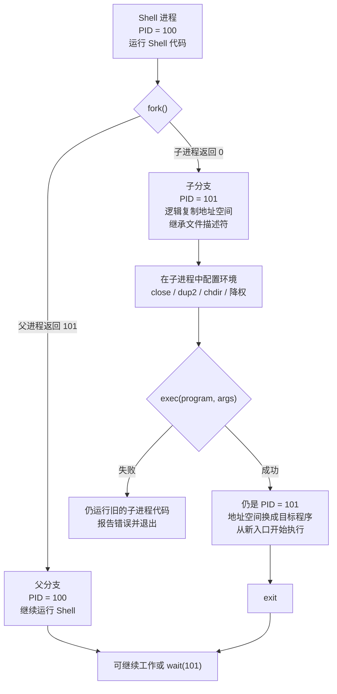
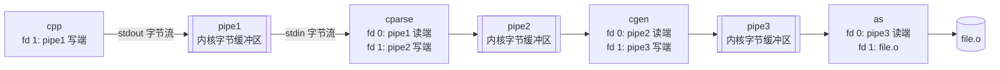

> 书名：*Operating Systems: Principles and Practice*（第二版）<br>
> 卷名：Volume I: *Kernels and Processes*<br>
> 作者：Thomas Anderson、Michael Dahlin<br>
> 笔记范围：第 3 章 `The Programming Interface`，包括 3.1～3.6 节及 12 道章末练习<br>
> 原文位置：osppv1.md 的 “3 The Programming Interface” 部分

## 全章主线

### 从“内核如何保护”转向“程序如何使用”

第 2 章回答内核怎样提供受限执行；本章进一步问：操作系统应向应用提供哪些功能，这些功能应放在内核、用户库、普通用户程序，还是独立服务进程中？

作者不试图穷举某个系统的全部 API，而以 UNIX 为主、Windows 为对照，研究两个问题：

1. **What：接口提供什么能力？**
2. **Where：能力在哪里实现？**

全章论证链为：

```text
应用需要进程管理与 I/O
        ↓
稳定、精简的系统调用形成“细腰”
        ↓
fork/exec/wait 让用户程序组合程序
        ↓
统一 open/read/write/close 抽象设备、文件和通道
        ↓
Shell 用重定向和管道组合普通程序
        ↓
IPC 把组合推广到生产者—消费者和客户端—服务器
        ↓
同样的进程边界可用于组织操作系统自身
```

### 本章覆盖与暂缓的功能

操作系统通常还需提供线程、内存、文件系统、网络、图形和认证。本章重点只讲进程管理与 I/O；线程、内存和持久存储留到后续章节。

约十二个系统调用即可描述实用的进程管理与 I/O 接口，其他主要能力也只需另一小组调用。这些 UNIX 接口从 20 世纪 70 年代延续至今，说明简单而可组合的抽象具有很长寿命。

### 阅读方式

笔记按 `3.1 → 3.6 → Exercises` 的原书顺序展开。进程数量、引用计数、缓冲区和调用成本的推导，以及 C 接口示例，直接放在相关系统调用与案例之后；平台差异则在对应接口处说明，使抽象、实现和使用方式连续衔接。

---

## 开篇：功能放在哪里？四种实现位置

**位置一：用户级程序。**

登录管理器、Shell 和进程管理工具可以是普通进程。优点是容易替换、调试和创新；缺点是不能直接执行必须可信且不可绕过的保护检查。

**位置二：用户级库。**

UI 控件等功能可链接到每个应用。函数调用便宜，不需跨权限边界，不同应用还可选择不同版本。缺点是库与应用共享命运，恶意应用可绕过库检查。

**位置三：内核系统调用。**

低层进程管理、文件系统和网络栈通常由内核实现。内核能控制硬件并强制执行保护，代价是 bug 影响大、升级兼容困难、边界切换有开销。

**位置四：用户级服务器。**

应用通过系统调用/IPC 请求独立服务进程，例如窗口管理器。服务可隔离崩溃和独立升级，但请求需要应用→内核→服务器→内核→应用等额外切换。

### 四个选择标准

**灵活性。**

用户代码和库容易演化。系统调用一旦发布，第三方程序长期依赖；改变接口要么同步更新所有应用，要么内核长期兼容多版本。

**安全性。**

资源管理和权限检查必须位于应用无法绕过的可信层。把检查只写在用户库中无效，恶意程序可直接发出系统调用或机器指令。

**可靠性。**

内核模块通常互不隔离，一个驱动 bug 可破坏整个系统。能移到用户态的代码移出内核，可缩小可信计算基和故障半径。

**性能。**

普通函数调用最便宜，进入内核更贵，经内核转发到服务器又增加 IPC 和调度成本。Windows NT 最初偏微内核，后来因性能把不少功能移回内核。

### “细腰”（Thin Waist）

UNIX 用少量简单而强大的系统调用连接大量应用与多种硬件：

```text
大量、快速演化的应用
          ↓
少量稳定系统调用接口  ← 细腰
          ↓
多种内核实现与硬件
```

只要细腰稳定，应用和硬件可独立演化。互联网 IP 层类似：Web 出现无需修改分组转发机制，WiFi 出现也无需重写网络应用。

细腰局限是通用接口可能牺牲专用性能；但它显著降低协同升级成本，促进上下两端创新。

### 应用级沙箱也面临同一选择

浏览器 HTML5、媒体播放器等要决定脚本能否创建任务、I/O、后台运行、持久存储、联网和认证。接口越强，开发越方便，攻击面也越大。早期邮件脚本可读取联系人并自动发送邮件，导致病毒一键传播。

因此接口设计不能只看功能：每个能力都要有权限模型、资源上限和安全失败方式。

---

## 3.1 进程管理（Process Management）

### 为什么把进程创建交给用户程序

早期批处理内核决定何时创建作业。现代系统让普通进程创建和管理其他进程，由此产生窗口管理器、Web 服务器、浏览器、Shell、编译器和数据库等大量工具。

关键收益是**策略可编程**：内核只提供创建原语，谁在何时创建什么、怎样组合，由用户程序决定，无需重编内核或强迫所有用户采用同一策略。

### Shell 是早期脚本系统

Shell 是用户级作业控制系统。编译多个 C 文件可表示为命令序列：分别编译源文件，再链接目标文件。把命令写入文件，Shell 就能读取并逐步创建进程。

UNIX C 编译器自身也可组合预处理、解析、代码生成和汇编等独立程序。这体现“小工具 + 通用组合机制”：专门程序各自做好一件事，Shell 决定流水线。

### 组合优于把所有功能塞进一个程序

原书举教材排版使用五十多个程序、Web 页面聚合多个服务。进程创建让新格式和功能可先由外部程序原型化，之后再决定是否标准化。

局限是跨进程数据转换和启动有成本，错误处理也更复杂。高频细粒度操作可能更适合库或线程。

---

### 3.1.1 Windows 进程管理

**`CreateProcess` 的直觉。**

Windows 采用“一个操作直接创建并装入新程序”的接口。简化形式：

```c
boolean CreateProcess(char *prog, char *args);
```

创建者称父进程，新进程称子进程。

**内核必须完成的步骤。**

1. 创建并初始化 PCB；
2. 创建新地址空间；
3. 把 `prog` 装入该空间；
4. 把 `args` 复制到新进程内存；
5. 构造硬件上下文，从运行库 `start` 入口开始；
6. 通知调度器新进程已就绪。

**为什么真实接口参数很多。**

父进程还要控制：

- 权限和句柄继承；
- 标准输入输出；
- 当前目录和环境变量；
- 创建标志和优先级；
- 返回的进程/线程句柄。

不能让子进程随意提高自己的权限或优先级；也不应要求每个新程序自己猜测启动环境。因此真实 `CreateProcess` 需要大量参数和结构体。

**优势与局限。**

优势是语义直接、创建与装入一次完成，不产生即将被覆盖的父进程副本。局限是参数面广，接口随新环境需求扩展会复杂。

---

### 3.1.2 UNIX 进程管理

UNIX 把“创建进程”与“装入程序”拆成 `fork` 和 `exec`：理论上较奇特，实践中却形成简单、可组合的接口。

#### `fork`：复制当前进程

`fork()` 不接收启动环境参数。内核：

1. 建立子 PCB；
2. 建立新地址空间；
3. 初始化为父地址空间内容的逻辑副本；
4. 继承打开文件等执行上下文；
5. 把子进程加入就绪队列。

现代实现通常用写时复制，不立即复制所有物理页；父子先共享只读页，任一方写时才复制。这是后续章节内容。

**为什么 `fork` 返回两次。**

同一系统调用在两个执行实例中恢复：

- 父进程获得子 PID（正整数）；
- 子进程获得 0；
- 失败时父进程获得错误（实际 UNIX 通常为 -1 并设置错误码）。

返回值让两份相同代码区分身份：

```c
int child_pid = fork();

if (child_pid == 0) {
    // 子进程路径
} else {
    // 父进程路径
}
```



图中的身份变化是理解 UNIX 接口的关键：`fork` 新增一个 PID 和执行流；`exec` 只替换子进程的程序映像，PID、已保留的文件描述符等进程身份仍然延续。

父子谁先运行没有保证。单核可能在任意时刻被定时器抢占，多核还可真正同时运行。因此输出顺序不能由源代码中父分支写在前面推断。

**父子地址空间的含义。**

`fork` 返回瞬间，父子变量值相同，但随后修改彼此不可见。它们是两个虚拟地址空间，即使同名变量的虚拟地址一致，逻辑对象也有两份。

打开文件描述符则被继承，并引用同一内核打开文件对象；这使重定向和管道自然工作。地址空间复制与内核对象共享必须区分。

**子进程为什么能配置环境。**

子进程运行父进程可信的同一代码，可在 `exec` 前：

- 关闭/复制文件描述符；
- 设置 stdin/stdout；
- 降低权限或优先级；
- 改当前目录与环境。

配置完成后再装入目标程序。于是大量 `CreateProcess` 参数变成普通系统调用序列，接口更正交。

#### `exec`：替换当前程序

`exec(prog,args)`：

1. 将 `prog` 装入**当前进程**地址空间；
2. 把参数复制到新地址空间；
3. 初始化上下文，从 `start` 执行。

**`exec` 不创建进程。** 成功后旧代码、堆栈被替换，PID 和部分继承资源仍属于同一进程；成功的 `exec` 不会返回旧程序。失败时旧映像仍运行并收到错误。

**`fork` + `exec` 为什么不必浪费。**

表面上复制父地址空间后立刻覆盖很浪费。写时复制只复制页表和引用；子进程很快 `exec` 时，未写共享页直接丢弃。接口保持简洁，实际数据复制可很少。

局限：多线程大进程 `fork` 后，子进程只保留调用线程，而锁可能停在复杂状态；现代系统常限制 fork 后到 exec 前可调用的函数，或提供 `posix_spawn` 等替代。

**Chrome 案例。**

Chrome 可用进程隔离标签页：子进程运行同一浏览器代码但处于独立保护域，关闭感染页面可清理该进程。更强方案是每链接一个虚拟机，连客户内核被攻破也限制在 VM。

Windows Chrome 不简单用 `CreateProcess` 按需复制，因为运行中升级可能启动新版辅助进程，与旧版主进程协议不兼容；它预建辅助进程池。这个案例说明 API 选择还受版本一致性影响。

#### `wait`：建立父子完成依赖

父进程若下一步依赖子结果，可调用 `wait(child_pid)`，直到子正常退出、崩溃或被终止。Shell 编译流程必须等编译完成后再链接。

`wait` 可选：浏览器无需阻塞等标签页结束；Shell 在命令末尾 `&` 时也让任务后台运行。

> **退出状态与僵尸进程。** 子退出后若父尚未收集状态，内核需保留 PID、退出码和少量 PCB 信息，形成“僵尸”状态；父 `wait` 后才可回收。引用计数解释的是同一个生命周期问题。

**内核句柄与引用计数。**

PID、文件描述符等句柄不是内核指针，而是每进程命名空间中的受检查标识。若允许用户传任意内核地址，伪造句柄会破坏内核。

内核对象常采用引用计数：

$$
R_{new}=R_{old}+\text{新增引用}-\text{释放引用}.
$$

当 $R=0$ 时对象才可回收。`fork` 继承打开文件会增加引用；`close`/进程退出减少引用。

对于退出子进程，内核必须保留足够状态，直到父收集或父自身结束，否则后续 `wait` 会引用不存在对象。

引用计数局限：循环引用不会自然归零；进程与文件对象通常由内核设计为可避免/单独处理这种环。

#### signal

UNIX 还允许进程向另一进程发即时通知，用于终止、暂停、恢复、定时器等。接收者未安装 handler 时，内核执行默认动作。这里沿用第 2 章 upcall 机制。

---

## 3.2 输入/输出（Input/Output）

### 设备多样性造成的接口问题

磁盘按块寻址，网络收发变长包，键盘产生字符；有些设备仅在请求后返回，有些主动产生输入。若每类设备都有专用系统调用，新设备出现就要修改内核接口和应用。

UNIX 的关键创新是用同一 I/O 接口处理设备、文件和进程间通信。抽象牺牲部分设备专属性，却获得可移植与组合能力。

**设计一：统一性。**

主要系统调用为 `open`、`close`、`read`、`write`。应用不必知道描述符背后是键盘、磁盘文件、管道还是网络通道。

统一不表示所有设备行为完全相同：可否定位、是否双向、是否阻塞、错误语义仍不同；统一的是基本字节流操作形状。

**设计二：使用前先打开。**

`open` 给内核机会：

- 检查权限；
- 定位对象并建立内核状态；
- 执行独占约束（如打印机忙）；
- 返回后续调用使用的句柄。

句柄称**文件描述符（file descriptor, fd）**，即使对象不是文件。Shell 启动应用时通常已打开标准输入、输出和错误描述符。

**设计三：面向字节。**

所有对象以字节数组读写，即使底层磁盘按块、网络按包。文件中的结构体和协议消息需要应用自行编码/解码。

优点是接口小且通用；局限是字节流不保留消息边界，也不处理字节序、版本和数据模式。

**设计四：内核缓冲读取。**

键盘/网络输入先进入内核缓冲。应用 `read(fd,buffer,size)` 最多取 `size` 字节；若无数据，调用通常阻塞，CPU 可运行其他任务。

`read` 返回实际字节数，可能少于请求量。调用者必须循环处理短读；0 通常表示流结束，负值/异常表示错误（具体约定依 API）。

**设计五：内核缓冲写入。**

`write` 通常先把用户数据复制进内核输出缓冲后返回，设备稍后发送。应用和设备可按不同速度运行。

若生产长期快于设备，缓冲最终填满，`write` 阻塞形成背压。缓冲只能吸收突发，不能解决平均输入速率大于输出速率。

> **有界缓冲的增长模型。** 设容量 $C$，当前占用 $B(t)$，生产/消费速率为 $\lambda_p,\lambda_c$。忽略离散性时：
>
> $$\frac{dB}{dt}=\lambda_p-\lambda_c,\qquad 0\le B(t)\le C.$$
>
> 若长期 $\lambda_p>\lambda_c$，填满时间近似
> $$t_{full}=\frac{C-B(0)}{\lambda_p-\lambda_c}.$$
>
> 该连续模型用于说明长期速率差；真实系统按离散读写，且速率会随时间变化。

**设计六：显式关闭。**

`close(fd)` 表示进程不再使用对象，内核减少引用计数；最后引用消失后可回收对象、刷新状态或通知对端 EOF。进程退出时内核也会关闭其描述符，但显式关闭能及时释放稀缺资源并正确结束管道。

**原子 `open` 与 TOCTOU。**

若接口分为 `exists`、`create`、`open`：

```c
if (!exists(file)) {
    create(file);
}
open(file);
```

检查与创建之间，另一进程可能创建该名字；创建与打开之间，又可能删除或替换它。每一步单独正确，组合却有竞态。

UNIX `open` 可原子执行“检查存在 → 按选项创建 → 打开”，使同一名字上的冲突操作不能插入关键区间。返回 fd 后，即使目录项被删除，已打开对象仍有效，直到最后引用关闭后才回收磁盘块。

严格说，原子性是相对同一文件系统命名操作和接口语义而言；网络文件系统、符号链接和崩溃持久性还有额外规则。

### 管道（Pipe）

UNIX pipe 是临时内核字节缓冲，返回两个 fd：读端和写端。数据按写入顺序读出，通常单向。

性质：

- 生产者只写、消费者只读；
- 写入分块和读取分块不必相同；
- 缓冲使双方可暂时独立运行；
- 写端全部关闭且缓冲读空后，读者获得 EOF；
- 读端关闭后继续写通常产生错误/信号。

原书说管道在任一端关闭或退出时终止，实践中的精确 EOF 取决于**所有**写端引用都关闭；fork 后忘关多余 fd 会使消费者永远等不到 EOF。

TCP 类似跨机器双向可靠字节流，但包含网络故障、连接建立和双向通道；不能把本地 pipe 的全部语义直接等同 TCP。

### `dup2`：替换描述符

`dup2(from,to)` 让 `to` 成为 `from` 所指内核对象的新引用。Shell 在子进程 `exec` 前：

- 把文件 fd 复制到 stdin，实现 `<`；
- 把文件 fd 复制到 stdout，实现 `>`；
- 把管道读/写端复制到 stdin/stdout，实现 `|`。

目标程序仍只读 fd 0、写 fd 1，不需知道数据真实来源和去向。这是“机制与策略分离”的经典例子。

### `select`：等待多个输入

服务器若依次阻塞读取多个客户端，第一个无数据就会挡住后续客户端；反复轮询又浪费 CPU。

`select(fd[],number)` 让进程睡眠，直到集合中至少一个 fd 可读，并返回就绪项；它不替调用者读取数据。Windows 对应思想是 `WaitForMultipleObjects`。

> **接口边界。** 真实 POSIX `select` 的参数和返回形式比这里的简化签名复杂，并有 fd 数量和每次扫描集合的成本。大规模服务器常用 `poll`、`epoll`、`kqueue` 或完成端口。

### 本章十二个 UNIX 调用

| 类别 | 调用 | 核心语义 |
|---|---|---|
| 进程 | `fork()` | 克隆当前进程 |
| 进程 | `exec(prog,args)` | 用新程序替换当前映像 |
| 进程 | `exit()` | 结束当前进程 |
| 进程 | `wait(pid)` | 等待指定子进程结束 |
| 通知 | `signal(pid,type)` | 向进程发送异步通知（概念化命名） |
| I/O | `open(name)` | 打开对象并返回 fd |
| I/O | `pipe(fd[2])` | 创建单向内核通道 |
| I/O | `dup2(from,to)` | 复制/替换描述符引用 |
| I/O | `read(fd,buf,size)` | 读取至多 size 字节 |
| I/O | `write(fd,buf,size)` | 写入至多 size 字节 |
| I/O | `select(fds,n)` | 等待任一 fd 就绪 |
| I/O | `close(fd)` | 释放当前描述符引用 |

> **真实 POSIX 接口辨析。** 现代 POSIX 通常用 `kill(pid, sig)` 发送信号，`signal(sig, handler)` 安装处理函数；图 3.7 的 `signal(processID,type)` 是概念化签名，编程时应以平台手册为准。

---

## 3.3 案例：实现 Shell

### Shell 为什么可以完全运行在用户态

内核只需提供进程和 I/O 原语，Shell 自己负责读取命令、解析语法、创建进程、设置描述符和等待任务。它不需要特权，也不需要为每种组合修改内核。

Shell 启动时通常已继承：

- `stdin`：读取键盘或脚本；
- `stdout`：写屏幕或上层管道；
- 常见系统还有 `stderr`：单独输出诊断。

### 基本执行循环

原书图 3.8 的意图是：

```text
循环读取并解析命令
        fork 子进程
        子进程 exec 目标程序
        父进程 wait 子进程
```

`fork` 自动复制父进程的打开描述符并增加内核引用计数，所以不做重定向时，子进程自然使用与 Shell 相同的终端。

`exec` 成功后不返回；若返回说明失败，子进程必须报告错误并退出，不能继续执行父 Shell 逻辑。

**Shell 脚本与 `#!`。**

UNIX 程序不只可为机器码文件，也可为命令文本。首行：

```text
#! interpreter
```

告诉系统使用哪个解释器。内核/启动机制执行解释器，并把脚本文件作为参数。于是 Shell 从文件读命令，行为与从键盘读取一致。

C 编译器驱动脚本可以依次执行预处理器、解析器、代码生成器和汇编器；最后一步结束后解释器调用 `exit`。

> **Shebang 的平台边界。** 真实 shebang 常写 `#!/bin/sh` 或 `#!/usr/bin/env bash`。可移植性、参数解析和最大行长依系统而异。

### 输出重定向 `>`

命令 `ls > tmp` 的逻辑：

1. Shell `fork`；
2. 子进程打开/创建 `tmp`；
3. `dup2(file_fd, STDOUT_FILENO)`；
4. 关闭不再需要的原始 `file_fd`；
5. `exec("ls",...)`。

新程序写 fd 1，内核把字节送到文件。父 Shell 的 stdout 未变，因为 `fork` 后描述符表是独立副本。

### 输入重定向 `<`

`zork < solution` 在子进程把文件 fd 复制到 stdin（fd 0），再 `exec`。游戏仍调用普通 `read(stdin,...)`，不知道输入来自键盘还是文件。

### 管道 `|`

`cpp file.c | cparse | cgen | as > file.o` 创建四个子进程和三条管道：



每个阶段可并行运行。Shell 等待所有阶段完成，而非每创建一个就立即等待，否则流水线会退化为串行，甚至因管道填满而死锁。

**为什么必须关闭多余管道端。**

每个子进程只保留需要的读/写端，父进程设置完后也关闭自身副本。否则：

- 某个隐藏写端仍有引用，消费者永远收不到 EOF；
- 描述符泄漏，长时间 Shell 最终耗尽 fd；
- 不必要的进程可访问通道，扩大权限。

这体现句柄引用计数：EOF 条件是所有写端引用归零，而不是某一个生产者调用了 `close`。

**Shell 组合为何有效。**

统一字节流接口提供低耦合：程序只声明输入与输出，不需要知道相邻程序身份。Shell 在外部编排拓扑。

局限：字节流缺少类型和模式；不同工具格式不兼容时需转换程序；错误状态不能只靠 stdout 传递，通常依靠退出码和 stderr。

---

## 3.4 案例：进程间通信

### 为什么模块化应用需要 IPC

打印服务、编译器阶段和 Web 系统把复杂任务拆成专门进程。隔离提高可靠性和独立演化，但进程地址空间分离，必须通过内核建立受控通信。

进程间通信有三种广泛使用的模型。

**模型一：生产者—消费者。**

数据单向流动：生产者写，消费者读。消费者还可成为下一阶段生产者，从而形成流水线。UNIX 小工具组合成功很大程度来自这种模式。

**模型二：客户端—服务器。**

双向交互：客户端发请求，服务器执行专门任务并回响应。例如打印服务器、窗口服务器。服务器必须认证客户端并检查每个请求权限。

**模型三：文件系统通信。**

写者和读者不必同时运行，数据持久存储并有名字。编辑器保存 HTML，Web 服务器以后读取。与 pipe/socket 相比，它解耦时间，但引入命名、权限、一致性和持久故障问题。

**三种模型对比。**

| 模型 | 方向 | 是否要求同时运行 | 典型用途 |
|---|---|---|---|
| 生产者—消费者 | 单向流 | 通常是 | 流水线、MapReduce 阶段 |
| 客户端—服务器 | 请求/响应双向 | 通常是 | Web、打印、窗口服务 |
| 文件系统 | 通过持久对象 | 否 | 文档交换、构建产物 |

三者可用于本机或网络。Google MapReduce 是网络生产者—消费者，Web 是客户端—服务器，文件服务器把持久文件跨机器共享。

---

### 3.4.1 生产者—消费者通信

**数据路径。**

1. Shell 创建 pipe 并把写端给生产者、读端给消费者；
2. 生产者计算后 `write` 变长数据块；
3. 内核有空间时复制并立即返回；
4. 消费者被调度后 `read` 下一段字节；
5. 消费者处理后写屏幕、文件或下一条 pipe。

pipe 是字节流，写 4 KiB 不保证读一次正好得到 4 KiB；消费者可按 1 KiB 等任意方便分块读取。应用协议若需要消息边界，必须自行编码长度或分隔符。

**有界缓冲怎样同步速率。**

- 生产者快：缓冲逐渐满，满后 `write` 阻塞；
- 消费者快：缓冲逐渐空，空后 `read` 阻塞；
- 数据和空间出现时，内核唤醒相应进程。

阻塞天然形成背压，使内存占用有界。它不保证公平：多个写者/读者的唤醒顺序取决于内核。

**EOF 语义。**

生产者完成后关闭所有写端。消费者先读完内核剩余数据，随后 `read` 返回 EOF。因而消费者可用同一循环读取文件或 pipe：

```text
while read 返回正数:
        处理字节
read 返回 0:
        输入结束
```

**缓冲为何减少上下文切换。**

若每生产一个小块就必须立即切消费者，两个工作集不断替换，缓存利用差。内核缓冲允许生产者连续运行一段、消费者再批量处理，减少切换并提高代码/数据缓存复用。

但缓冲过大增加内存和延迟，过小增加阻塞与切换；实际大小是吞吐、延迟和内存的权衡。

> **Little 定律的直觉。** 稳定系统中平均在途数据量 $L$、平均吞吐率 $\lambda$ 和平均停留时间 $W$ 满足
> $$L=\lambda W.$$
> 它说明在吞吐固定时，更大排队量通常意味着更长等待。成立条件是长期稳定、平均量定义一致。

---

### 3.4.2 客户端—服务器通信

**两条单向 pipe 组成双向通道。**

建立：

- 请求 pipe：客户端写、服务器读；
- 回复 pipe：服务器写、客户端读。

客户端写请求后阻塞读回复；服务器循环读请求、验证权限、执行操作并写结果。书中为简化假定请求和响应固定大小。

**固定大小读写仍需循环。**

> **固定消息的短读与短写。** 字节流 `read(fd,buf,N)` 可能只返回 $k<N$ 字节，`write` 也可能部分完成。要传固定大小消息，需循环直到累计 $N$、EOF 或错误：
>
> $$remaining_{i+1}=remaining_i-transferred_i.$$

收到完整头部后，变长协议可从长度字段确定后续字节数。还必须设置最大消息长度，防止内存耗尽。

**合并 write + read。**

客户端和服务器常“写后立即读”。若分别系统调用，每轮往返多次跨内核边界。可提供组合 IPC 调用：发送请求并原子等待回复，减少两次边界切换。

**处理器捐赠。**

客户端发送后必然等待服务器，可把剩余时间片直接交给服务器，减少调度延迟。Windows 在微内核设计中采用过类似优化。

局限是服务器与客户端代码/数据若不能同时驻留缓存，直接切换会污染缓存；服务器还可能需要按优先级和多个客户端公平调度。

**共享内存快速路径。**

多核下客户端和服务器可各占一核。内核只在建立阶段映射双方共享、其他进程不可见的内存；之后请求/回复可不陷入内核。

性能接近内存系统，但正确性更难：

- 需要原子操作和内存顺序；
- 要防止覆盖未消费消息；
- 客户端崩溃时服务器要回收槽位；
- 共享内存不自动认证消息来源；
- 通知对方仍可能需要 futex、事件或轮询。

因此共享内存是 IPC 传输机制，不是完整协议。

**多客户端服务器与 `select`。**

服务器维护每个客户端的输入/输出 fd，调用 `select` 等待任一输入就绪：

```text
循环:
        fd = select(所有客户端输入)
        read(fd, request)
        验证并处理
        write(该客户端输出, reply)
```

书中伪代码表达概念，真实服务还要处理断开、短读写、慢客户端、请求超时和部分消息。

**IPC 性能成本分解。**

> **请求—响应延迟分解。** 一次请求—响应延迟可粗略写为：
>
> $$T=T_{copy}+T_{cross}+T_{schedule}+T_{service}+T_{queue}+T_{reply},$$
>
> 分别表示数据复制、边界切换、调度、服务计算、排队与回复成本。合并调用减少 $T_{cross}$，处理器捐赠减少 $T_{schedule}$，共享内存减少 $T_{copy}$；没有一种优化能消除服务计算和过载排队。

---

## 3.5 操作系统结构

### 模块之间为何耦合

- 多模块依赖同步原语保护共享内核结构；
- 虚拟内存依赖处理器特定地址转换；
- 文件系统与虚拟内存共享物理页并依赖磁盘驱动；
- 远程文件系统还依赖网络栈。

集中到内核便于直接调用和共享状态、性能高；拆到用户进程则模块化、可替换和故障隔离更好。结构选择就是性能与复杂性/可靠性的权衡。

---

### 3.5.1 宏内核（Monolithic Kernels）

**定义。**

宏内核把大部分核心操作系统功能链接在同一内核保护域中，模块可直接函数调用。Windows、macOS、Linux 都主要采用这种结构。

“宏内核”不表示整个用户看到的 OS 都在内核；Shell、工具和 UI 库仍可在用户态。它描述核心服务之间的保护边界。

**优势与风险。**

优势：

- 直接函数调用和共享内存，开销低；
- 模块紧密协作容易；
- 跨文件系统、VM、网络优化方便。

风险：

- 模块之间通常无硬件隔离；
- 任一驱动越界可破坏全内核；
- 内部接口耦合，维护和验证困难；
- 可信计算基大。

**硬件抽象层（HAL）。**

HAL 是内核内部面向机器配置和处理器特定操作的可移植接口。它封装：

- 中断控制器与定时器；
- 上下文切换；
- trap/异常入口；
- 地址空间管理；
- 用户/内核内存复制。

移植到新平台时重新实现底层 HAL，大部分内核保持不变。

Windows 的策略：同一处理器架构下，启动时动态链接主板专用 HAL；跨处理器架构通常编译不同内核二进制，近似型号有时用条件路径共享。

HAL 不是应用 AVM：HAL 面向高权限内核，接口更接近硬件；AVM 面向受限应用。

**动态设备驱动。**

设备种类远多于指令集，原书引用调查称 Linux 内核约 70% 代码属于设备特定软件。动态驱动让设备厂商按标准内核接口提供模块，系统启动后只加载实际设备所需代码。

启动时：少量磁盘等驱动随内核可用；系统查询总线识别设备，再从磁盘加载对应驱动；网络设备驱动还可在线取得。

**驱动为何危险。**

内核驱动拥有完整权限。普通 bug 可静默改写用户/内核数据，恶意驱动可直接植入内核病毒。原书引用研究称约 90% 系统崩溃来自驱动 bug，突出驱动隔离价值；该比例是书中时代研究，不应视为今天所有系统的恒定统计。

#### 五种应对方法

**代码审查。**

厂商要求驱动预先提交、检查和测试。能发现已知模式，但无法证明无 bug，闭源/规模也增加审查难度。

**崩溃追踪。**

崩溃时收集配置和内核栈，匿名汇总分析。某驱动出现与故障高度相关，或新版本发布后故障上升，可定位来源。

相关性不是绝对因果，但大规模遥测能发现实验室难复现的稀有错误。

**用户级驱动。**

每个驱动在独立用户进程，通过受控系统调用访问设备。崩溃只破坏自身，可重启恢复。

迁移旧驱动困难，因为大量代码直接引用内核内部结构；频繁 IPC 也可能增加性能成本。

**虚拟机驱动。**

把遗留驱动和客户 OS 放入 VM。驱动以为直接使用硬件，监控器拦截设备访问保证安全。bug 可破坏客户内核，但不影响宿主/其他 VM。

代价是额外客户系统、设备虚拟化和资源开销。

**内核内驱动沙箱。**

在内核中为驱动建立轻量受限环境，试图兼顾直接交互性能与隔离。需要软件故障隔离、语言安全或硬件域等机制；复杂度和兼容性是挑战。

---

### 3.5.2 微内核（Microkernel）

**微内核的定义。**

微内核只保留最基础的保护、调度、地址空间和 IPC 等机制，把网络栈、文件系统、驱动、窗口系统等尽量放在用户级服务器。

应用调用可由库隐藏：同一 API 在宏内核中发系统调用，在微内核中编码为发给服务器的消息。内核也可把看似普通系统调用转发给服务器，因此位置对应用大体透明。

**优势。**

- 服务独立地址空间，故障隔离更强；
- 用户态调试工具丰富；
- 服务可独立替换和升级；
- 接口明确，模块化更好；
- 内核 TCB 较小，更适合验证。

**性能代价。**

一次文件请求可能经历：

```text
应用 → 微内核 → 文件服务器 → 微内核 → 驱动服务器
         → 微内核 → 文件服务器 → 微内核 → 应用
```

额外模式切换、调度、消息复制和缓存扰动都增加延迟。高效 IPC、共享内存、处理器捐赠和批处理可缓解但不自动消除。

**为什么现实多为混合结构。**

微内核的开发与可靠性收益对用户不总是直接可见，性能下降却容易感知。多数系统按具体权衡把部分服务放用户态、部分保留内核，形成混合结构。

宏内核/微内核不是简单好坏二选一，而是每项服务的故障风险、调用频率、数据共享、兼容性和验证需求共同决定边界。

---

## 3.6 总结与未来方向

**本章两个 UNIX 关键设计。**

1. `fork` 把创建进程与 `exec` 装入程序分开；
2. 内核缓冲和统一 fd 接口解耦读写双方。

少量调用支持进程创建、I/O、重定向、Shell、生产者流水线和客户端服务器，体现正交组合的力量。

**系统调用也组织操作系统自身。**

Shell、窗口管理器、打印服务和部分文件/网络/驱动功能可作为用户服务，利用进程隔离与 pipe。进程抽象不仅供应用，也帮助构造 OS。

**应用成为“元操作系统”。**

浏览器等应用内部有多用户、第三方代码、资源分配、任务和持久存储。传统 Windows/UNIX API 并非为这类嵌套资源管理设计，未来接口可能需要更细粒度沙箱和显式资源控制。

**从透明分配走向显式资源授权。**

传统内核透明决定何时调度、给多少内存、何时写盘和发包；应用仿佛独占虚拟机器。问题是应用内部也做资源管理，却不知道外层配额变化。

垃圾回收器若假定固定内存，而内核暗中缩减配额，就无法及时调整回收频率。替代模型是内核先分配明确资源份额，再让应用内部自行决策。

作者类比联邦制：内核和应用像两级政府。若双方都独立分配同一资源且不沟通，会相互干扰；接口应让配额和变化可见，同时由内核保持全局隔离与公平。

局限是显式资源接口更复杂，应用可能做出更差决策；内核也不能把所有硬件细节泄漏给应用。合适边界仍是未来设计问题。

---

## 用 C 语言理解管道组合

下面用 POSIX C 建立两个独立进程：生产者输出三个文件名，消费者逐行读取并计数。该示例适用于 Linux、macOS 或 WSL。

```c
#define _POSIX_C_SOURCE 200809L

#include <stdio.h>
#include <stdlib.h>
#include <string.h>
#include <sys/types.h>
#include <sys/wait.h>
#include <unistd.h>

static int run_producer(void) {
        puts("main.c");
        puts("util.c");
        puts("README.md");
        return EXIT_SUCCESS;
}

static int run_consumer(void) {
        char line[256];
        int count = 0;

        while (fgets(line, sizeof(line), stdin) != NULL) {
                if (line[0] != '\n' && line[0] != '\0') {
                        count++;
                }
        }
        printf("消费者统计到 %d 个文件\n", count);
        return EXIT_SUCCESS;
}

int main(int argc, char *argv[]) {
        /* exec 后同一可执行文件分别进入生产者或消费者模式。 */
        if (argc == 2 && strcmp(argv[1], "--producer") == 0) {
                return run_producer();
        }
        if (argc == 2 && strcmp(argv[1], "--consumer") == 0) {
                return run_consumer();
        }

        int channel[2];
        if (pipe(channel) == -1) {
                perror("pipe");
                return EXIT_FAILURE;
        }

        pid_t producer_pid = fork();
        if (producer_pid == -1) {
                perror("fork producer");
                return EXIT_FAILURE;
        }
        if (producer_pid == 0) {
                /* 生产者的标准输出连接到管道写端。 */
                close(channel[0]);
                if (dup2(channel[1], STDOUT_FILENO) == -1) {
                        _exit(126);
                }
                close(channel[1]);
                execlp(argv[0], argv[0], "--producer", (char *)NULL);
                _exit(127);
        }

        pid_t consumer_pid = fork();
        if (consumer_pid == -1) {
                perror("fork consumer");
                return EXIT_FAILURE;
        }
        if (consumer_pid == 0) {
                /* 消费者的标准输入连接到管道读端。 */
                close(channel[1]);
                if (dup2(channel[0], STDIN_FILENO) == -1) {
                        _exit(126);
                }
                close(channel[0]);
                execlp(argv[0], argv[0], "--consumer", (char *)NULL);
                _exit(127);
        }

        /* 父进程不传输数据，必须关闭两个端点。 */
        close(channel[0]);
        close(channel[1]);

        int producer_status;
        int consumer_status;
        waitpid(producer_pid, &producer_status, 0);
        waitpid(consumer_pid, &consumer_status, 0);

        return WIFEXITED(producer_status) &&
                   WEXITSTATUS(producer_status) == 0 &&
                   WIFEXITED(consumer_status) &&
                   WEXITSTATUS(consumer_status) == 0
                ? EXIT_SUCCESS
                : EXIT_FAILURE;
}
```

示例输出：

```text
消费者统计到 3 个文件
```

可使用 `cc pipeline.c -o pipeline` 编译。

### 与书中接口的对应关系

| C 操作 | 书中概念 |
|---|---|
| `fork` | 创建生产者和消费者进程 |
| `exec` | 用同一可执行文件的对应模式替换子进程映像 |
| `pipe` | 建立内核字节通道 |
| `dup2` | 把生产者 stdout、消费者 stdin 接到管道端点 |
| `close()` | 父进程释放多余描述符引用 |
| `waitpid()` | 等待并回收两个子进程 |

生产者每次 `puts` 的分块不构成消费者消息边界；消费者按行解析，是应用协议选择。若生产者速度长期高于消费者，内核 pipe 填满后生产者写入会阻塞。

---

## 章末练习详解

> 以下按章末题目顺序给出分析、推导与实现。第 3 题描述的是 fork bomb，请只做静态推理，不要实际运行。

### 练习 1：UNIX `fork` 能否返回错误

能。`fork` 要分配 PCB/PID、页表或地址空间元数据、内核栈、句柄引用和调度状态，任何资源不足都可能失败。

典型原因：

- 系统或用户进程数上限；
- 可用内存/内核对象不足；
- PID 或其他实现资源暂时不足；
- 安全策略/容器配额禁止创建。

接口必须允许错误，否则内核只能崩溃、无限阻塞或破坏资源限制。失败时只有原父进程继续，实际 POSIX 通常返回 `-1` 并设置 `errno`；不会产生一个“半创建”的可见子进程。

### 练习 2：UNIX `exec` 能否返回错误

能。失败原因包括：文件不存在、无执行权限、格式非法、解释器不存在、参数/环境过大、装入资源不足等。

若 `exec` 成功，旧程序映像已被替换，控制从新程序入口开始，因此**不会返回旧调用点**。若它返回，说明替换未成功，旧程序仍应报告错误并决定退出或恢复。

实现要尽量在破坏旧地址空间前完成检查，或能在后续失败时安全终止；具体原子承诺依系统。

### 练习 3：无限 `fork` 程序会怎样

```c
while (fork() >= 0)
        ;
```

每个成功 fork 后父子都回到循环并继续 fork。若第 $k$ 轮所有进程都成功复制，进程数为：

$$
P_k=2P_{k-1},\qquad P_0=1,
$$

所以：

$$
P_k=2^k,
$$

累计新建进程为 $2^k-1$。增长为指数级，迅速耗尽 PID、内存和调度能力，称 **fork bomb**。

达到资源限制后 `fork` 返回负值，该特定进程退出循环；但其他进程仍各自尝试，系统可能长期过载。用户进程限额、cgroup/container 配额和管理员终止进程组可限制损害。

### 练习 4：`wait` 何时立即成功返回

目标必须是调用者可等待的子进程，且其终止状态已经可用：子进程已正常退出、崩溃或被信号终止，并处于等待父收集的状态。

此时内核无需阻塞，只复制退出状态、回收残余 PCB/PID 信息并返回。若子仍运行，阻塞；若 PID 不是子进程或状态已被其他 wait 收集，通常立即返回错误而不是成功。

### 练习 5：自动测试大量学生作业

一个安全测试控制器可按以下流程：

1. 为每份提交创建临时工作目录和低权限身份；
2. `fork` 子进程；
3. 子进程用 `dup2` 把测试输入文件接到 stdin，把 stdout/stderr 接到独立结果文件；
4. 设置 CPU 时间、内存、进程数、文件大小和网络限制；
5. `exec` 编译器或学生程序；
6. 父进程 `wait`，同时设置超时；超时则向进程组发送终止信号；
7. 检查退出码、输出、运行时间和内存；
8. 针对多个公开/隐藏输入重复；
9. 清理进程组和临时文件，汇总评分。

不能仅以父子进程隔离作为安全沙箱：恶意作业仍继承用户权限，可能 fork bomb、联网或读取同用户文件。应结合容器/VM、只读基础镜像、无网络、最小权限和资源配额。

并行测试可提高吞吐，但必须限制并发数，避免测试基础设施自身过载。

### 练习 6：在 Shell 中运行 `exec csh`

Shell 的 `exec` 内建命令不 fork，而让当前 Shell 进程直接执行 `exec("csh")`。成功后：

- 当前 Shell 的程序映像被 C Shell 替换；
- PID 和终端描述符通常不变；
- 用户开始与 csh 交互；
- 退出 csh 后，原 Shell 不会恢复，因为其映像已消失。

若这是终端中的子 Shell，外层父进程可能接管；若它是登录 Shell，会话可能结束或由登录管理器重建。

### 练习 7：运行 `exec ls`

当前 Shell 被 `ls` 替换。`ls` 列出目录后退出；原 Shell 不再存在，所以不会出现原提示符。终端会返回给更外层父进程，或会话结束。

普通输入 `ls` 则是 Shell `fork` 子进程执行 `ls` 并等待，完成后 Shell 仍在。这正说明 fork 与 exec 分离的作用。

### 练习 8：递归 `forkthem(5)` 创建多少进程

每层中，当前所有进程执行一次 `fork`，随后父子都递归下一层：

| 完成的 fork 层数 | 总进程数 |
|---:|---:|
| 0 | 1 |
| 1 | 2 |
| 2 | 4 |
| 3 | 8 |
| 4 | 16 |
| 5 | 32 |

递推：

$$P(n)=2P(n-1),\quad P(0)=1\Rightarrow P(n)=2^n.$$

因此最终共有 $2^5=32$ 个进程，其中新创建 31 个。假设每次 `fork` 都成功；若失败，实际数量较少。

### 练习 9：变量 `x` 有多少份、最终值是什么

第一次 `fork` 后：

- 子进程 A：`child==0`，`x=5+5=10`；
- 父进程继续 `else`。

父进程在 `else` 中第二次 fork，产生 B：

- 第二次 fork 的父进程：先 `x=5+10=15`，`child>0`，再 `+5`，最终 20；
- 第二次 fork 的子进程 B：先 `x=5+10=15`，`child==0`，不再加 5，最终 15。

所以共 3 个进程、3 份独立 `x`，最终值为：

$$\{10,15,20\}.$$

变量声明在第一次 fork 之后，但父子都从 fork 返回点继续执行并各自创建 `x`；它们的地址空间独立。

### 练习 10：两段程序输出

**程序 1。**

子进程中 `pid=0`，不进入 `if`，把私有 `val` 从 5 加到 6，打印 6 并退出。父进程中 `pid>0`，先 `wait(pid)`，因此必须等子结束，再把自己的 `val` 加到 6 并打印。

确定输出顺序：

```text
6
6
```

两个 6 来自不同地址空间。父等待使子行在前；若 stdout 缓冲/外部重定向有特殊行为，显示细节可能受环境影响，但程序语义顺序如上。

**程序 2。**

子进程进入 `else`，执行 `exit(5)`，不执行打印。父等待子结束后 `val++` 并打印：

```text
6
```

子退出状态为 5，父程序示例未读取该状态。父最后返回 6；Shell 通常只保留低位退出状态，具体范围依系统。

### 练习 11：支持多级管道的简单 Linux C Shell

下面程序支持交互输入 `ls | wc -l` 这类多级管道和 `exit`。它使用 `fork`、`execvp`、`close`、`pipe`、`dup2` 和 `waitpid`。纯管道不需要 `open`；若增加 `<`/`>`，按 6.4/6.5 节用 `open` 后 `dup2` 即可。

```c
#define _POSIX_C_SOURCE 200809L

#include <errno.h>
#include <stdio.h>
#include <stdlib.h>
#include <string.h>
#include <sys/types.h>
#include <sys/wait.h>
#include <unistd.h>

#define MAX_LINE 1024
#define MAX_STAGES 16
#define MAX_ARGS 64

/*
 * 把输入行原地解析成多个 argv 数组。
 * 例如 "ls -l | wc -l" 变成 {"ls", "-l", NULL} 和
 * {"wc", "-l", NULL}。
 */
static int parse_pipeline(char *line, char *commands[][MAX_ARGS]) {
        char *stage_context = NULL;
        char *stage = strtok_r(line, "|", &stage_context);
        int stage_count = 0;

        while (stage != NULL) {
                if (stage_count >= MAX_STAGES) {
                        fprintf(stderr, "管道阶段过多，最多支持 %d 个\n", MAX_STAGES);
                        return -1;
                }

                char *argument_context = NULL;
                char *argument = strtok_r(stage, " \t\r\n", &argument_context);
                int argument_count = 0;

                while (argument != NULL) {
                        if (argument_count >= MAX_ARGS - 1) {
                                fprintf(stderr, "单条命令参数过多\n");
                                return -1;
                        }
                        commands[stage_count][argument_count++] = argument;
                        argument = strtok_r(NULL, " \t\r\n", &argument_context);
                }

                if (argument_count == 0) {
                        fprintf(stderr, "管道中存在空命令\n");
                        return -1;
                }

                commands[stage_count][argument_count] = NULL;
                stage_count++;
                stage = strtok_r(NULL, "|", &stage_context);
        }

        return stage_count;
}

static int run_pipeline(char *commands[][MAX_ARGS], int stage_count) {
        pid_t children[MAX_STAGES];
        int previous_read = -1;

        for (int stage = 0; stage < stage_count; stage++) {
                int next_pipe[2] = {-1, -1};

                if (stage + 1 < stage_count && pipe(next_pipe) == -1) {
                        perror("pipe");
                        if (previous_read != -1) {
                                close(previous_read);
                        }
                        return -1;
                }

                pid_t child = fork();
                if (child == -1) {
                        perror("fork");
                        if (previous_read != -1) {
                                close(previous_read);
                        }
                        if (next_pipe[0] != -1) {
                                close(next_pipe[0]);
                                close(next_pipe[1]);
                        }
                        return -1;
                }

                if (child == 0) {
                        /* 上一条管道的读端成为本阶段标准输入。 */
                        if (previous_read != -1 &&
                                dup2(previous_read, STDIN_FILENO) == -1) {
                                perror("dup2 stdin");
                                _exit(126);
                        }

                        /* 下一条管道的写端成为本阶段标准输出。 */
                        if (next_pipe[1] != -1 &&
                                dup2(next_pipe[1], STDOUT_FILENO) == -1) {
                                perror("dup2 stdout");
                                _exit(126);
                        }

                        /* dup2 后关闭所有原始描述符，避免引用阻止 EOF。 */
                        if (previous_read != -1) {
                                close(previous_read);
                        }
                        if (next_pipe[0] != -1) {
                                close(next_pipe[0]);
                                close(next_pipe[1]);
                        }

                        execvp(commands[stage][0], commands[stage]);
                        perror(commands[stage][0]);
                        _exit(127);
                }

                children[stage] = child;

                /* 父进程不参与传输，及时关闭已交给子进程的端点。 */
                if (previous_read != -1) {
                        close(previous_read);
                }
                if (next_pipe[1] != -1) {
                        close(next_pipe[1]);
                }
                previous_read = next_pipe[0];
        }

        int last_status = 0;
        for (int stage = 0; stage < stage_count; stage++) {
                int status = 0;
                while (waitpid(children[stage], &status, 0) == -1) {
                        if (errno != EINTR) {
                                perror("waitpid");
                                return -1;
                        }
                }
                if (stage + 1 == stage_count) {
                        last_status = status;
                }
        }

        return last_status;
}

int main(void) {
        char line[MAX_LINE];

        while (1) {
                char *commands[MAX_STAGES][MAX_ARGS] = {{NULL}};

                printf("mini-shell$ ");
                fflush(stdout);

                if (fgets(line, sizeof(line), stdin) == NULL) {
                        putchar('\n');
                        break;
                }

                if (strcmp(line, "exit\n") == 0 || strcmp(line, "exit") == 0) {
                        break;
                }

                int stage_count = parse_pipeline(line, commands);
                if (stage_count > 0) {
                        run_pipeline(commands, stage_count);
                }
        }

        return 0;
}
```

在 Linux/macOS/WSL 中编译运行：

```text
cc -Wall -Wextra -std=c11 mini_shell.c -o mini_shell
./mini_shell
mini-shell$ printf "a\nb\nc\n" | wc -l
3
mini-shell$ exit
```

**算法为什么正确。**

对于 $m$ 个阶段需要 $m-1$ 条 pipe。第 $i$ 个阶段：

- 若 $i>0$，stdin 接第 $i-1$ 条 pipe 读端；
- 若 $i<m-1$，stdout 接第 $i$ 条 pipe 写端；
- 第一阶段继承 Shell stdin；
- 最后一阶段继承 Shell stdout。

父进程创建完所有阶段后才等待，因此生产者和消费者能并发；若逐个等待，第一个生产者可能写满无人读取的 pipe 而死锁。

**代码边界。**

这是教学 Shell，没有引号、转义、变量、通配符、重定向和作业控制；`strtok_r` 也不能正确解析带空格引号参数。生产 Shell 需要词法/语法分析器。fork 中途失败时还应终止并回收已创建子进程，这里只返回错误。

### 练习 12：扩展前后台与作业控制

作业控制的核心不是单个 PID，而是**进程组（process group）**：一条流水线中的全部进程属于同一个 PGID，终端信号一次发送给整组。

**作业表。**

Shell 维护：

```c
enum JobState { RUNNING, STOPPED, DONE };

struct Job {
        int job_id;          /* Shell 显示的 %1、%2 等编号 */
        pid_t pgid;          /* 整条流水线的进程组 */
        enum JobState state;
        char command[1024];
};
```

还需记录组内各 PID 是否结束，只有全部结束作业才为 `DONE`。

**创建进程组。**

第一名子进程 PID 作为 PGID。每个子进程在 `exec` 前调用：

```c
if (first_child) {
        pgid = getpid();
}
setpgid(0, pgid);
```

父进程也立即 `setpgid(child, pgid)`，避免子进程先 `exec` 带来的竞态。流水线所有阶段使用同一 PGID。

**前台作业。**

交互式 Shell 把终端控制权交给作业：

```c
tcsetpgrp(STDIN_FILENO, job_pgid);
```

然后用 `waitpid(-job_pgid, ..., WUNTRACED)` 等待组内进程结束或停止。负 PID 表示等待整个进程组。完成/停止后恢复 Shell 自己的终端前台组：

```c
tcsetpgrp(STDIN_FILENO, shell_pgid);
```

终端产生的 `Ctrl-C`（SIGINT）和 `Ctrl-Z`（SIGTSTP）会发送给当前前台进程组，而不是 Shell 手工逐进程转发。

**后台作业 `&`。**

解析器识别行尾 `&`，创建进程组但不调用 `tcsetpgrp`，也不阻塞等待；记录作业并打印 `[job_id] pgid`，立即读下一命令。

后台进程若尝试直接读控制终端，通常被 SIGTTIN 停止，防止与 Shell 抢输入。输出是否允许由终端设置决定。

**SIGCHLD 与回收。**

子进程结束、停止或继续时，Shell 收到 SIGCHLD。信号 handler 应只设置一个原子标志；主循环安全位置反复执行：

```c
while ((pid = waitpid(-1, &status,
                                          WNOHANG | WUNTRACED | WCONTINUED)) > 0) {
        update_job_state(pid, status);
}
```

- `WNOHANG`：没有变化时不阻塞；
- `WUNTRACED`：报告被停止子进程；
- `WCONTINUED`：报告恢复运行。

若 handler 内执行复杂内存分配/打印，可能违反异步信号安全，故应延后。

**`jobs`、`fg`、`bg`、`kill`。**

- `jobs`：列出作业 ID、PGID 和状态；
- `bg %n`：`kill(-pgid, SIGCONT)`，标记 RUNNING，不移交终端；
- `fg %n`：先 `tcsetpgrp`，若停止则发 SIGCONT，再前台等待；
- `kill %n`：向负 PGID 发 SIGTERM；宽限后必要时 SIGKILL；
- `stop %n`：向组发送 SIGTSTP 或不可捕获的 SIGSTOP。

负 PGID 很关键：只杀流水线某一个进程会留下其余阶段阻塞或孤立。

**Shell 自身信号策略。**

Shell 在读命令时通常忽略 SIGINT、SIGTSTP、SIGTTIN、SIGTTOU，避免自己被终端操作停止；子进程在 `exec` 前把这些信号恢复默认动作。Shell 还保存/恢复终端属性，防止前台程序改变回显后退出，导致终端不可用。

**状态机。**

```text
创建 ──→ RUNNING(background)
  │             │ fg
  └─→ RUNNING(foreground)
                                │ SIGTSTP
                                ↓
                         STOPPED
                                │ SIGCONT (fg/bg)
                                └────────→ RUNNING

RUNNING/STOPPED ── exit/signal ──→ DONE ── wait/reap ──→ 删除作业
```

竞态边界：创建作业和加入作业表期间应暂时屏蔽 SIGCHLD，否则极短任务可能在 Shell 记录 PID 前已经结束。记录完成后解除屏蔽并处理待决 SIGCHLD。

---

## 易混淆概念与常见误解

**`fork` 创建进程，`exec` 不创建进程。**

`fork` 增加进程实例；`exec` 只替换当前实例的程序映像。常见的“启动程序”是二者组合，不应把组合语义归给任一单独调用。

**`fork` 后变量地址相同不表示同一变量。**

父子虚拟地址可能一致，但映射到逻辑独立内存。文件描述符则可能引用同一内核打开对象，偏移和状态共享程度依对象语义。

**`exec` 成功后不会返回。**

返回意味着失败。子进程必须用 `_exit` 结束错误路径，避免继续执行 Shell 代码或重复刷新父进程继承的用户态缓冲。

**文件描述符不是文件，也不是内核指针。**

fd 是进程内的小整数句柄，可指文件、设备、pipe 或 socket。内核每次查表验证；同一数字在不同进程可指不同对象。

**字节流不保留写入边界。**

一次 `write(4096)` 可被多次 `read` 取出，多次小写也可能一次读回。应用必须自行处理短读写和消息分帧。

**`close` 不一定立即删除对象。**

它只释放当前引用。文件、pipe 写端或 PCB 要等所有引用消失才能回收；已删除但仍打开的文件仍可由持有 fd 的进程使用。

**缓冲不会解决持续过载。**

缓冲吸收短期速率差。若长期生产速率大于消费速率，最终仍阻塞、丢弃、扩容或失败。

**`select` 只报告就绪，不完成协议。**

就绪后仍可能短读、断开或只收到半条消息。服务器必须维护每连接解析状态和输出队列。

**微内核不等于所有功能都在用户态。**

至少保护、调度、地址空间和 IPC 等基础机制仍在内核。现实系统多为混合设计，边界也随版本变化。

**宏内核不等于没有模块。**

Linux 等宏内核内部高度模块化并支持动态加载；“宏”指模块共享内核保护域和可直接调用，不表示代码毫无结构。

**用户级服务不自动安全。**

服务仍需验证 IPC 请求、执行权限和限制资源。进程隔离缩小 bug 后果，但逻辑授权错误仍可泄露数据。

**统一接口不是所有对象语义相同。**

普通文件可定位，pipe 通常不可定位；终端有行规程；设备支持控制命令。`read/write` 提供共同基础，专有操作仍可能通过其他接口暴露。

---

## 全章总结：本章的分析方法

**区分接口与实现位置。**

应用需要稳定、方便的接口；功能放库、内核还是服务器，可在保持接口时调整。这样设计才能随可靠性和性能需求演化。

**用少量正交原语代替庞大专用接口。**

`fork` 负责复制，`exec` 负责替换，`dup2` 负责重绑定，pipe 负责字节传输。每个原语简单，组合后却能构造 Shell、编译器流水线和服务器。

**把策略推到用户态，把不可绕过机制留在内核。**

Shell 决定任务顺序和重定向，内核只保证创建、保护、权限和句柄正确。这提高创新速度，又不牺牲安全边界。

**用统一 I/O 解耦生产者与消费者。**

程序只读写 fd，不依赖键盘、文件还是 pipe。内核缓冲同时完成数据暂存、速率解耦和阻塞同步。

**用同一进程抽象组织应用和操作系统。**

打印、窗口、驱动和文件服务都可成为独立进程。微内核把这一思想推向极端，宏内核则优先直接调用性能；混合系统按调用频率和故障风险选边界。

**未来要协调嵌套资源管理者。**

应用越来越像小型 OS。内核若完全隐藏资源变化，应用内部 GC、任务调度和缓存无法适应；未来接口需要在抽象稳定与资源可见之间重新平衡。

---

## 复习检查清单

- [ ] 能列出功能的四种实现位置及灵活性、安全、可靠和性能权衡；
- [ ] 能解释系统调用“细腰”怎样让应用与硬件独立演化；
- [ ] 能比较 Windows `CreateProcess` 与 UNIX `fork+exec`；
- [ ] 能解释 fork 返回两次、父子顺序不确定和写时复制直觉；
- [ ] 能说明 `exec` 为什么不创建进程且成功不返回；
- [ ] 能解释 `wait`、僵尸状态、句柄与引用计数；
- [ ] 能说明统一 I/O、先 open、字节流、内核缓冲和显式 close；
- [ ] 能用 TOCTOU 说明为什么 `open` 需要原子创建选项；
- [ ] 能解释 pipe 的 EOF 条件及为什么必须关闭多余端点；
- [ ] 能用 `dup2` 推导 `<`、`>`、`|`；
- [ ] 能说明生产者快/消费者快时各自在哪里阻塞；
- [ ] 能比较生产者—消费者、客户端—服务器和文件通信；
- [ ] 能分解 IPC 延迟并理解合并调用、处理器捐赠和共享内存优化；
- [ ] 能比较宏内核、微内核与混合内核；
- [ ] 能解释 HAL 与动态驱动为何提高可移植性；
- [ ] 能列出驱动审查、遥测、用户态、VM 和沙箱五种隔离路线；
- [ ] 能推导递归 fork 的 $2^n$ 进程数；
- [ ] 能说明作业控制为何需要进程组、终端前台组和 SIGCHLD。
