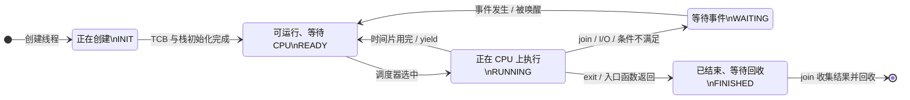

> 书名：*Operating Systems: Principles and Practice*（第二版）<br>
> 卷名：Volume II: *Concurrency*<br>
> 作者：Thomas Anderson、Michael Dahlin<br>
> 笔记范围：第 4 章 `Concurrency and Threads`，包括 4.1～4.10 节及章末练习<br>
> 原文位置：osppv2.md 的 “4 Concurrency and Threads” 部分

## 全章主线

### 本章解决什么问题

现实世界和现代计算机内部都有许多同时推进的活动：服务器有多个处理器、磁盘与网卡，桌面系统同时处理屏幕、键盘、网络和存储，手机也普遍采用多核。

操作系统和应用都面临同一矛盾：

- 系统必须同时管理许多活动，才能响应用户、隐藏 I/O 延迟并利用多核；
- 人更擅长沿一条控制流逐句推理，很难直接追踪几十种同时变化的状态。

作者的解决思路是：把一个并发程序写成若干条内部仍然顺序执行的**线程**，再用明确机制协调线程间共享。

```text
现实中存在多个并发任务
        ↓
每个任务表示为一条顺序线程
        ↓
操作系统把线程复用到有限物理处理器
        ↓
TCB 与栈保存每条线程的独立执行状态
        ↓
调度器任意暂停和恢复线程
        ↓
共享数据必须用显式同步保证任意交错下正确
```

本章回答线程“是什么、为何需要、怎样使用、怎样实现”；第 5 章处理共享数据同步，第 6 章讨论高级并发，第 7 章讨论选择下一线程的调度策略。

### 阅读方式

笔记按 `4.1 → 4.10 → Exercises` 的原书顺序组织。简化线程 API、形式化模型、性能推导、现代实现与 POSIX C 示例直接放在对应概念之后，依次回答“为什么需要、抽象是什么、怎样实现、成本和边界在哪里”。编译命令适用于 Linux、macOS 或 WSL；当前环境没有 C/C++ 编译器，因此未做本地运行验证。

### 并发与并行先辨析

- **并发（concurrency）**：多个活动在重叠时间段内推进，关注任务的组织与交错；单核也能并发。
- **并行（parallelism）**：多个活动在同一时刻由不同硬件执行，关注同时计算；需要多核或多处理单元。

并行蕴含并发执行情形，但并发不必并行。线程既可在单核上交错以隐藏 I/O，也可在多核上真正同时运行。

---

## 开篇：为什么线程是一种关键抽象

### 并发为何遍布操作系统和应用

操作系统需要并发来管理硬件、保持响应并同时运行多个应用。应用也有同样需要：

- 网络服务要同时处理许多客户；
- GUI 要在执行逻辑时继续响应用户；
- 并行程序要把工作映射到多个处理器；
- 数据系统要用其他工作覆盖磁盘和网络等待时间。

若 Google 一次只能处理一次搜索，或 Amazon 一次只能处理一笔购买，功能虽“正确”却没有实用吞吐能力。

### 线程的核心直觉

线程是程序中的一条顺序执行流。每条线程内部仍可按普通方式理解：赋值、分支、循环、调用和返回按顺序发生；多条线程之间则可以并发。

操作系统向程序员提供一种幻象：每条线程仿佛拥有自己的专用虚拟处理器。真实机器只有有限 CPU，内核通过暂停和恢复线程，把任意多条线程透明复用到这些 CPU 上。

### 线程抽象隐藏什么、不隐藏什么

它隐藏：

- 线程此刻在哪个物理 CPU；
- 何时被暂停、何时恢复；
- 实际处理器数量；
- 每条线程获得多少运行时间。

它不隐藏：

- 线程共享同一进程的内存；
- 不同交错会改变共享数据结果；
- 创建、切换和同步有成本；
- 物理 CPU 数限制真正并行度。

线程把“每个任务的控制流”变简单，却没有自动解决“任务之间怎样安全共享”。

---

## 4.1 线程使用场景（Thread Use Cases）

### 从单线程程序推广到多线程程序

传统单线程程序只有一条逻辑步骤序列。多线程程序包含多条这样的序列，每一条内部仍是顺序程序，彼此可在时间上交错或在多核上并行。

线程适合表示逻辑上可独立推进的任务，而不是为了“使用新技术”盲目拆分。拆分后若任务持续争用同一共享状态，复杂度和同步成本可能超过收益。

### Earth Visualizer 案例

本节用类似 Google Earth 的地球可视化程序贯穿线程的使用场景。程序需要：

- 绘制屏幕的不同区域；
- 显示和更新 UI 控件；
- 接收鼠标、搜索等输入；
- 从远程服务器获取更高分辨率影像。

顺序程序若下载高分辨率图像后才处理输入，界面会冻结。多线程可让两个线程绘制场景，另一个线程管理 UI，再用一个线程下载数据。用户可继续操作，图像逐步改善。

---

### 4.1.1 使用线程的四个理由

#### 理由一：用程序结构表达逻辑并发任务

**要解决的问题。**

应用天然包含同时发生的活动。手工事件交错会迫使程序员把每项任务切成小片：画几个像素、检查鼠标、检查网络，再重复。控制状态散落在一个巨大循环中。

**线程为何有效。**

每个活动写成完整顺序过程，线程系统负责交错。Earth Visualizer 的绘制、输入与网络代码各自保持自然控制流。

服务器也常为每个客户建立一条线程。不同链路速度差异很大；若完整处理一个客户后才处理下一个，慢客户会阻塞所有人。线程让某客户等待网络时，其他客户继续。

**局限与替代方案。**

“每客户一线程”在线程数极大时会增加栈内存、调度和同步开销。事件循环、异步 I/O、线程池和协程是替代方案，原书在 4.9 节比较事件驱动模型。

#### 理由二：把慢工作移到后台以保持响应

**问题从哪里来。**

典型事件循环是“取命令 → 完整执行 → 取下一命令”。若命令运行很久，取消按钮等新输入得不到处理。

**拆分方法。**

把命令分成：

1. 主事件线程立即完成的快速部分；
2. 后台线程完成的耗时部分。

浏览器即使在下载巨大页面或执行脚本时，也应让取消按钮继续工作。Earth Visualizer 将渲染移出 UI 主循环。

**操作系统例子。**

- 文件写入先复制到内核缓冲并快速返回，后台线程稍后刷盘；
- 预读线程预测应用接下来要读的块，提前从磁盘取回。

**正确性边界。**

后台工作仍需定义取消、错误报告、完成通知和对象生命周期。UI 若释放对象，后台线程继续写它，就会产生悬空访问。线程提高响应性，不自动保证操作已持久化；“write 返回”也可能只表示进入缓冲区。

#### 理由三：利用多个处理器

**为什么需要线程。**

单条顺序执行流同一时刻通常只能占用一个核心。把可独立工作拆成多线程，调度器可放到不同处理器并行执行。

Earth Visualizer 在 8 核机器上可用 6 条线程渲染不同画面区域，另外 2 核处理 UI、网络消息和响应解析。线程数不必等于核心数，内核负责映射。

**理想与实际加速。**

设单线程时间为 $T_1$，使用 $p$ 个处理器的时间为 $T_p$，加速比：

$$
S(p)=\frac{T_1}{T_p}.
$$

若工作完全独立、均匀且无额外成本，理想 $S(p)=p$。现实中有串行部分、创建/同步、缓存和带宽成本。

若可并行比例为 $f$，串行比例为 $1-f$，Amdahl 定律为：

$$
T_p=T_1\left((1-f)+\frac{f}{p}\right),
$$

所以：

$$
S(p)=\frac{1}{(1-f)+f/p}.
$$

推导依据：串行部分仍耗时 $(1-f)T_1$；可并行部分理想均分为 $fT_1/p$；两者相加。它假设问题规模固定、并行部分完美均衡且忽略额外成本，因此给出的是乐观上界。

例如 $f=0.9,p=8$：

$$
S(8)=\frac{1}{0.1+0.9/8}\approx4.71,
$$

并非 8 倍。串行的 10% 限制总体收益。

#### 理由四：在等待 I/O 时推进其他工作

**为什么等待 I/O 时应运行别的任务。**

磁盘读取可耗费数十毫秒，足够现代 CPU 执行上千万条指令。请求 I/O 后若 CPU 空等，会浪费巨大算力；把等待线程置为 WAITING，运行另一线程即可覆盖延迟。

**外部事件不可预测。**

键盘输入和网络包到达时间不受程序控制。线程使系统在等待事件时继续工作，事件到达后又能快速恢复对应任务。

Earth Visualizer 先下载低分辨率图并渲染，同时后台下载高分辨率版本，逐步更新画面。

**并发不等于设备更快。**

线程只让计算与等待重叠，不会降低单次物理 I/O 延迟。若所有线程争用同一饱和磁盘，总吞吐甚至可能因随机访问和队列开销下降。

#### 线程与进程的四种组合

**每进程一线程。**

简单应用只有一条用户执行流，在进程保护域内运行，通过系统调用请求内核服务。

**每进程多线程。**

多条线程共享进程权限和地址空间。某线程阻塞在系统调用时，其他线程仍可运行；中断可抢占当前线程后再恢复。

**多个单线程进程。**

早期系统只支持每进程一线程，但内核同时运行多个进程。对内核而言，每个进程也包含一条可调度执行流；多个进程可同时进入内核，形成内核并发。

**多个内核线程。**

内核自身用线程组织后台工作、I/O、并行和复杂控制。内核线程拥有内核权限，可访问系统内存与设备。

现代通用系统通常同时支持内核线程和多线程进程。

---

## 4.2 线程抽象（Thread Abstraction）

### 严格定义

线程的严格定义是：

> 线程是表示一个可独立调度任务的单一执行序列。

它包含两个不可缺少的部分：

1. **单一执行序列**：线程内部按顺序执行语句、循环和调用；
2. **可独立调度**：系统可在任意时刻运行、暂停或恢复该线程。

只有顺序序列而不可独立调度，只是普通函数调用；只有调度单位而没有可恢复控制状态，也不能称为线程。

> **线程状态表示。** 可把线程 $i$ 的执行状态抽象为
> $$
> 	au_i=(PC_i,SP_i,R_i,Stack_i,Meta_i),
> $$
> 其中 $PC$ 是下一指令位置，$SP$ 是栈指针，$R$ 是其他寄存器，$Stack$ 保存调用链，$Meta$ 是 ID、优先级和生命周期状态。恢复这些状态后，线程应从暂停点继续。

---

### 4.2.1 运行、暂停与恢复

**调度器怎样制造“无限处理器”幻象。**

线程数可远多于物理 CPU。调度器维护 READY 线程集合：暂停 CPU 上的线程，保存状态并移入 READY；再选择另一 READY 线程，把保存状态加载到 CPU，转为 RUNNING。

暂停和恢复对线程代码透明。线程观察到的只是两条相邻指令之间可能经过很长现实时间。

**不可预测、可变速度的虚拟处理器。**

每条线程应被视为运行在自己的虚拟处理器上：指令顺序保持不变，但速度随时可能变慢甚至暂时为零。

同一线程可有许多等价执行方式：连续运行、频繁被暂停、迁移到另一核心。只要其私有状态精确恢复，区别应只影响性能。

#### 交错（Interleaving）

多条线程的指令可按大量顺序交错。若线程 A 有 $m$ 个步骤，线程 B 有 $n$ 个步骤，且各自内部顺序固定，则仅两线程的可能交错数量为：

$$
\binom{m+n}{m}=\frac{(m+n)!}{m!n!}.
$$

> **交错数量推导。** 在总共 $m+n$ 个位置中选择 $m$ 个放 A，其余放 B；线程内部次序已固定。该公式未计抢占发生在机器指令内部、三条以上线程或循环，真实状态空间更大。

因此不能靠“列举几个常见时序”证明并发程序正确。

**协作式多线程。**

协作式系统让线程持续运行，直到它主动让出 CPU。

优势：单核中当前线程运行期间其他线程不会改变状态，交错较可控，切换位置少。

缺点：

- 长任务或 bug 可垄断 CPU；
- UI 可能无响应；
- 多核仍有线程真正并行，不能免除同步推理；
- 所有库代码都必须遵守让出约定。

早期 Mac OS 使用过协作方式，现代系统较少采用它作为通用线程模型。

**抢占式多线程。**

抢占式系统可在任意时刻切换 RUNNING 线程。本书后续若无特别说明，“多线程”均指抢占式。

它提供公平和响应性，却要求程序对任何合法交错都正确。共享数据必须使用锁、条件变量等显式同步，而不能假设某段代码“应该来得及执行完”。

---

### 4.2.2 为什么速度必须视为不可预测

**这是正确性模型，不是性能预测。**

作者要求程序员不假设线程相对速度，是为了把正确性与调度策略解耦。若程序只有在线程 A 比 B 快时正确，换调度器、硬件或负载就可能失败。

反之，若程序对任意交错正确，内核可以自由优化何时抢占和把线程放在哪个 CPU，而不改变语义。

**即使每线程独占核心，速度也不确定。**

原因包括：

- 调试器单步某线程，其他线程全速运行；
- 缓存未命中可停顿数百到数千周期；
- CPU 数量、缓存大小和内存速度不同；
- 动态调频和节能固件改变时钟；
- 网络和用户输入不可预测；
- 同机其他负载争用共享资源。

因此“我测试了一万次都是这个顺序”不是正确性证明。

**独立线程与共享线程。**

若线程完全不共享内存、文件或其他资源，调度顺序通常只影响完成时间。只要共享可变状态，程序必须显式同步，使结果与不允许的交错隔离。

**中断处理程序不是线程。**

中断处理程序虽是一条从头到尾的顺序指令流，却不是独立可调度任务：它由硬件事件触发，而非调度器选择；通常运行至完成或被更高优先级中断。因此不满足线程定义的第二部分。

---

## 4.3 简单线程 API

下面使用一组简化的 POSIX 风格 API：

| 调用 | 语义 |
|---|---|
| `thread_create(thread, func, arg)` | 创建线程，并发执行 `func(arg)` |
| `thread_yield()` | 当前线程主动让出 CPU，何时恢复由调度器决定 |
| `thread_join(thread)` | 等待目标完成并取得其 `thread_exit` 返回值；每线程只 join 一次 |
| `thread_exit(ret)` | 结束当前线程、保存返回值并唤醒等待者 |

### 异步过程调用

普通函数调用立即在调用者栈上执行，被调用函数返回后调用者继续。`thread_create` 把“调用”和“返回”分离：

```text
普通调用：call → 被调用函数执行 → return → 调用者继续

异步调用：create → 调用者继续
                 ↘ 新线程执行 → exit
                    join ← 调用者稍后等待/取结果
```

`thread_create` 类似 UNIX `fork+exec`，`thread_join` 类似 `wait`。差别是线程共享地址空间，进程通常隔离内存。

### POSIX C 对应关系

| 简化 API | POSIX pthread |
|---|---|
| `thread_create` | `pthread_create` |
| `thread_yield` | `sched_yield`（实际使用应谨慎） |
| `thread_join` | `pthread_join` |
| `thread_exit` | `pthread_exit` 或线程函数 `return` |

POSIX 线程入口签名为 `void *func(void *)`，参数与返回值通过 `void *` 传递；程序要保证指针指向对象的生命周期足够长。

---

### 4.3.1 多线程 Hello World

#### POSIX C 实现

```c
#include <pthread.h>
#include <stdint.h>
#include <stdio.h>
#include <stdlib.h>

#define NTHREADS 10

static pthread_t threads[NTHREADS];

static void *go(void *argument) {
    intptr_t number = (intptr_t)argument;
    printf("Hello from thread %ld\n", (long)number);

    /* 把 100 + number 编码为线程返回值。 */
    return (void *)(100 + number);
}

int main(void) {
    for (intptr_t index = 0; index < NTHREADS; index++) {
        int error = pthread_create(
            &threads[index], NULL, go, (void *)index
        );
        if (error != 0) {
            fprintf(stderr, "创建线程 %ld 失败，错误码 %d\n",
                    (long)index, error);
            return EXIT_FAILURE;
        }
    }

    for (int index = 0; index < NTHREADS; index++) {
        void *result = NULL;
        int error = pthread_join(threads[index], &result);
        if (error != 0) {
            fprintf(stderr, "等待线程 %d 失败，错误码 %d\n", index, error);
            return EXIT_FAILURE;
        }
        printf("Thread %d returned with %ld\n",
               index, (long)(intptr_t)result);
    }

    printf("Main thread done.\n");
    return EXIT_SUCCESS;
}
```

在 Linux、macOS 或 WSL 中可用：

```text
cc thread_hello.c -pthread -o thread_hello
./thread_hello
```

**与简化线程 API 的对应关系。**

- `pthread_create` 初始化第 $i$ 条线程，使它从 `go(i)` 开始；
- `go` 打印后返回 $100+i$，等价于简化 API 中的 `thread_exit(100+i)`；
- 主线程按索引顺序 `pthread_join`，逐一取得返回值；
- `intptr_t` 是能安全往返转换对象指针的整数类型；此技巧只适用于可表示的小整数。

**哪些输出顺序确定，哪些不确定。**

`Hello` 的顺序不确定。线程 2 即使先创建，也可能晚于线程 5 获得 CPU，或先运行后在 `printf` 前被抢占。

“Thread i returned” 行按 $0,1,\ldots,9$ 顺序，因为主线程串行地先 join 0，再 join 1。目标线程的真实完成顺序仍可任意；join 只约束观察顺序。

`Main thread done` 必须最后，因为它位于全部 join 之后。

**线程 5 打印时的线程数边界。**

最少 2 条：主线程和线程 5。其他已创建线程可全部运行结束并被主线程 join/回收；线程 5 最后才打印。

最多 11 条：主线程已创建 10 条子线程，线程 5 第一个运行到打印，其余尚未结束。

这里“存在”按原书把尚未回收主/子线程计入；具体运行库何时释放已完成线程资源会影响实现层计数，但不改变逻辑上下界。

---

### 4.3.2 Fork-Join 并行

**模式定义。**

父线程创建若干子线程执行工作（fork/create），随后等待结果（join）。在满足下列数据约束时，不需要额外同步：

1. 父线程在创建子线程**之前**写入的数据，子线程只读或按约定访问；
2. 子线程写入的数据，父线程只在 join **之后**读取；
3. 并行子线程写入互不重叠的区域，或只读共享数据。

`create` 建立“父线程此前写入对新线程可见”，`join` 建立“子线程结束前写入对父线程可见”的顺序边界。具体内存模型由线程标准定义。

**并行清零的现实动机。**

进程退出后，内核重新分配其物理内存前必须清零，否则新进程可能读取前一用户密码等敏感数据。大内存清零可并行。

用本章给出的数量级估算：清零 1 GiB 约 50 ms，而创建线程约几十微秒。对于大任务，创建成本相对很小；对于几 KiB 小块，创建线程可能比工作本身更贵。

#### POSIX C 并行清零

```c
#include <assert.h>
#include <pthread.h>
#include <stddef.h>
#include <stdlib.h>
#include <string.h>

#define NTHREADS 10

struct ZeroParameters {
    unsigned char *buffer;
    size_t length;
};

static void *zero_region(void *argument) {
    struct ZeroParameters *parameters = argument;
    memset(parameters->buffer, 0, parameters->length);
    return NULL;
}

int block_zero(unsigned char *buffer, size_t length) {
    pthread_t threads[NTHREADS];
    struct ZeroParameters parameters[NTHREADS];

    assert(length % NTHREADS == 0);
    size_t chunk_size = length / NTHREADS;

    for (size_t index = 0; index < NTHREADS; index++) {
        parameters[index].buffer = buffer + index * chunk_size;
        parameters[index].length = chunk_size;
        if (pthread_create(&threads[index], NULL, zero_region,
                           &parameters[index]) != 0) {
            return -1;
        }
    }

    for (size_t index = 0; index < NTHREADS; index++) {
        if (pthread_join(threads[index], NULL) != 0) {
            return -1;
        }
    }
    return 0;
}
```

各线程写区间：

$$
I_i=[i\cdot c,(i+1)\cdot c),\qquad c=\frac{length}{NTHREADS}.
$$

当 $i\ne j$ 时，$I_i\cap I_j=\varnothing$；全部区间并集为 $[0,length)$。因此没有两个线程写同一字节，join 后整个缓冲区为零。

**为何参数数组必须活到 join 后。**

`parameters` 位于父线程栈上，但父线程在所有 join 返回前不会离开 `block_zero`，所以子线程使用期间对象仍存在。若函数创建线程后立即返回，这些指针会悬空。

循环变量也不能只把同一个 `index` 地址传给所有线程，否则各线程读取时它可能已改变。这里为每条线程准备独立结构体。

**后台清零与延迟 join。**

内核可创建低优先级线程后台清零后立即返回去运行应用；真正需要重用内存时再 join。若已清零，join 立即返回；否则等待完成。

这同时利用：

- 响应性：退出路径快速完成；
- 并行性：多个核心清零；
- 空闲时间：低优先级后台工作利用剩余 CPU。

**任务粒度的盈亏平衡。**

设串行工作时间 $W$，创建/回收每线程固定成本近似 $c$，使用 $p$ 条线程，理想并行时间：

$$
T_p\approx\frac{W}{p}+pc.
$$

并行有收益要求 $T_p<W$：

$$
\frac{W}{p}+pc<W
\Rightarrow pc<W\left(1-\frac1p\right)
\Rightarrow W>\frac{p^2c}{p-1}.
$$

该模型假设完美均衡、每线程固定成本相同，忽略内存带宽。清零通常受内存带宽限制，线程增加到一定数量后不再加速。

---

## 4.4 线程数据结构与生命周期

线程系统要制造“暂停后像什么都没发生一样继续”的幻象，必须精确区分：

- **每线程状态**：切换线程时必须保存/恢复；
- **共享状态**：同进程线程共同访问，切换时不复制。

若把应独立的栈误共享，函数调用会互相覆盖；若把应共享的堆错误复制，线程就无法高效交换结果。

---

### 4.4.1 每线程状态与线程控制块（TCB）

**TCB 的定义。**

线程控制块（Thread Control Block, TCB）是线程系统表示一条线程的内核/运行库对象。每创建一条线程，就创建一个 TCB。

TCB 保存两类信息：

1. 当前计算状态；
2. 管理线程所需的元数据。

> **简化 TCB 结构。** 字段随架构和系统而异：

```c
enum ThreadState {
    THREAD_INIT,
    THREAD_READY,
    THREAD_RUNNING,
    THREAD_WAITING,
    THREAD_FINISHED
};

struct ThreadControlBlock {
    unsigned long thread_id;
    enum ThreadState state;
    int priority;

    void *stack_base;
    size_t stack_size;
    void *saved_stack_pointer;
    void *saved_program_counter;
    unsigned long saved_registers[16];

    void *owner_process;
    void *join_waiters;
    void *exit_value;
    struct ThreadControlBlock *next;
};
```

真实 x86-64 通用寄存器数量、浮点/SIMD 状态、调试寄存器和调度字段更多；有些系统把大多数寄存器压在栈上，TCB 只保存栈指针。

#### 每线程计算状态：栈

每条线程需要独立栈。若调用链为 `foo → bar → bas`，栈中有三个调用帧，每帧保存参数、局部变量、保存的寄存器和返回地址。

不同线程可能：

- 位于不同函数；
- 同一函数但参数不同；
- 调用深度不同；
- 暂停在不同机器指令。

因此共享一个栈无法表达这些独立调用链。

#### 每线程计算状态：寄存器

寄存器包含通用中间值，也包含 PC 和 SP。RUNNING 线程的最新寄存器在物理 CPU 中；线程暂停后，它们必须存进 TCB 或栈。

保存状态必须覆盖程序可观察的全部架构状态。漏掉条件码可能改变后续分支；漏掉 SIMD 寄存器可能破坏计算；漏掉 SP 则无法找回调用链。

**每线程元数据。**

常见字段：线程 ID、调度优先级、状态、资源消耗、所属进程、CPU 亲和性、等待对象和退出值。这些不直接表示程序计算，却是调度、统计和生命周期管理所需。

#### 栈应该多大

栈必须容纳最深调用链，但预留过多会浪费空间，尤其当系统有成千上万线程。

**内核栈。**

内核栈通常使用物理内存且固定较小。以当时的 x86 Linux 默认约 8 KiB 为例，内核编码惯例是：大缓冲和大结构放堆上，不作为局部变量；递归也应受严格限制。

固定小栈优势是内存可预测；风险是溢出后可能覆盖内核数据，后果严重。具体大小随架构和版本变化，不能把 8 KiB 当成普遍常数。

**单线程用户栈。**

可位于虚拟地址空间高端，按需映射页面并向下增长。快速、异常增长通常意味着无限递归，系统可用保护页捕获。

**多线程用户栈。**

多个栈必须在同一地址空间共存，不能都无限增长。POSIX 允许实现选择默认大小，也允许应用通过线程属性设置。

有些语言运行时（如 Go）支持可增长/搬迁栈，但普通 POSIX C 线程常预留固定虚拟区域并放置不可访问 guard page。原书教材库默认 1 MiB。

**Guard 值与 Guard Page。**

原书描述可在栈边界放已知值并在切换时检查；值变化提示越界。更强的现代做法是放不可访问保护页，越界立即产生异常。

已知值只能事后发现，且大步越界可能跨过它；保护页也不能阻止一次跳跃直接越过 guard 区域，布局仍需谨慎。

---

### 4.4.2 共享状态

**同进程线程共享什么。**

- 程序代码；
- 全局/静态变量；
- 动态分配的堆对象；
- 通常还共享文件描述符、进程权限和地址空间配置。

每条线程可在代码的不同位置执行，但取指来自同一代码映像。堆对象可由线程 A 分配，再把指针交给线程 B。

#### 线程局部变量（TLS）

线程局部变量的作用域像全局变量，可跨函数访问；但每条线程有独立副本。

**`errno`。**

早期 UNIX 每进程一线程，全局 `errno` 足够。多线程中两个系统调用可并发失败，如果共享同一个 `errno`，一个线程会覆盖另一个。现代 `errno` 宏映射到当前线程的 TLS。

**堆分配器的线程局部区域。**

逻辑堆共享，但分配器可给每线程局部 arena/cache：多数分配无需争用全局锁，同一线程对象靠近也改善缓存局部性。局部区域空时再向共享堆批量取空间。

#### C 中的线程局部存储

> **C11 的线程局部存储。** C11 可声明：

```c
#include <stdio.h>
#include <threads.h>

static _Thread_local int request_count;

int worker(void *argument) {
    request_count++;
    printf("当前线程计数：%d\n", request_count);
    return 0;
}
```

POSIX 还提供 `pthread_key_create`、`pthread_setspecific` 和 `pthread_getspecific`，适合运行时动态分配 TLS 槽。

**“私有”只是逻辑约定。**

同一进程线程共享地址空间，硬件通常不阻止线程 A 访问线程 B 的栈。坏指针可破坏其他线程调用帧。

特别危险的是把局部变量地址传给另一线程：

- 原线程继续调用函数后，该栈位置内容可能变化；
- 原线程退出后，整块栈被回收；
- 接收线程再解引用就形成悬空指针。

所以共享对象应有明确生命周期，通常放在堆上，并在所有使用线程结束后释放。

---

## 4.5 线程生命周期

### 五种状态

**INIT。**

正在创建，分配和初始化 TCB、栈及初始寄存器。完成后加入 ready 集合，转为 READY。

**READY。**

具备运行条件但尚未占用 CPU。寄存器保存在 TCB/栈，TCB 位于 ready 数据结构。原书沿用“ready list”名称，实际常是优先队列或多级队列。

**RUNNING。**

正在某个处理器执行。寄存器最新值在 CPU 中，不必每条指令同步回 TCB。

RUNNING → READY 有两种路径：定时器等抢占；线程主动 `yield`。

**WAITING。**

等待某事件，当前无法取得进展，因此不应放在 ready 集合浪费调度机会。例如主线程 `join` 尚未结束的子线程。

TCB 放在同步对象的等待队列。事件发生后，由其他线程/中断把它移到 ready 集合，状态变为 READY；不能直接假定立即 RUNNING。

**FINISHED。**

执行永久结束，不再调度。为了让 join 取得退出值，TCB 可能暂留 finished 集合；结果被收集后再回收。

### 状态转移图



最容易读错的是 `WAITING --> READY`：事件发生只说明线程重新具备运行条件，并不表示它立即占有 CPU。它还必须经过调度，才能进入 RUNNING。

**TCB 与寄存器在哪里。**

| 状态 | TCB 所在位置 | 最新寄存器位置 |
|---|---|---|
| INIT | 创建代码持有 | TCB/构造中的初始帧 |
| READY | ready 集合 | TCB 或线程栈 |
| RUNNING | running 集合/每 CPU 指针 | 处理器寄存器 |
| WAITING | 同步对象等待队列 | TCB 或线程栈 |
| FINISHED | finished 集合，随后删除 | TCB 或不再需要 |

原书约定 RUNNING 线程不在 ready list；Linux 等实现可用不同约定。只要状态不变量一致，表示方法等价。

**idle 线程。**

有 $k$ 个处理器时，系统常为每 CPU 准备最低优先级 idle 线程，确保概念上始终有 $k$ 条 RUNNING 线程。

旧机器 idle 线程空转；现代 idle 循环执行特权低功耗睡眠指令，等待中断唤醒。中断处理后若有线程转 READY，调度它；否则继续 idle。

在虚拟机内，客户执行睡眠指令会陷入宿主，宿主可把物理 CPU 给另一 VM，避免客户空转浪费资源。

**Hello 程序的状态问题。**

当 `thread_join(i)` 返回时，线程 $i$ 已 FINISHED；其退出值至少保留到 join 读取。

单核中主线程进入 READY 的最少次数为 2：初始创建后一次；让子线程运行而被抢占/让出后再次进入一次。所有子线程可一次性全部完成，再恢复主线程。

最大次数近乎无界：调度器理论上可在几乎每条指令后抢占，再把主线程转 READY。正确性不能依赖次数上限。

### 如何找到当前 TCB

**单核全局指针。**

只有一个 RUNNING 线程时，全局 `current_tcb` 可在切换时更新。

**多核每 CPU 指针数组。**

若硬件可读取 CPU ID，使用 `current_tcb[cpu_id]`。每 CPU 同时有一条当前线程。

**从栈指针定位。**

每线程栈按 $2^k$ 大小和边界对齐，在栈底存 TCB 指针。当前 SP 向下清除低 $k$ 位即可找到栈基址：

$$
base=SP\ \&\ \sim(2^k-1).
$$

例如栈大小 8192=$2^{13}$ 字节，则清除 SP 低 13 位。成立条件是栈固定大小、按同样边界对齐且 SP 始终在该栈内。可增长栈或独立中断栈需要其他机制。

---

## 4.6 实现内核线程

本章先实现最基础的内核线程：线程执行内核代码、共享内核地址空间和物理 CPU。随后再扩展到用户进程。

### 四种实现上下文

1. 纯内核线程；
2. 内核线程 + 单线程用户进程；
3. 用内核线程支持多线程进程；
4. 用户态库实现线程。

核心原语始终是保存一条线程状态并恢复另一条；差别在于状态放在哪里、内核知道多少，以及切换是否还需更换地址空间。

---

### 4.6.1 创建线程

**创建的目标。**

`thread_create(thread,func,arg)` 要实现异步调用：未来某次调度时，新线程像正常调用 `func(arg)` 一样开始执行。

难点是它此前从未运行，根本没有真实“暂停现场”可恢复。实现必须人工构造一个看起来像曾被切出的初始栈帧。

#### 三个步骤

**一、分配每线程状态。**

分配 TCB 与栈，记录栈基址和大小。分配失败必须返回错误，不能把半初始化 TCB 放入 ready 集合。

**二、初始化每线程状态。**

以书中向低地址增长的 x86 栈为例：SP 初始位于栈顶；初始 PC 指向 `stub`；栈上准备 `stub(func,arg)` 的参数和上下文切换恢复所需的假帧。

不直接从 `func` 开始，是因为用户函数可能普通 `return`。若没有合法返回地址，会跳到随机位置。`stub` 调用 `func`，返回后统一调用 `thread_exit`。

```c
static void thread_stub(void *(*function)(void *), void *argument) {
    void *result = function(argument);
    thread_exit(result);
    /* 不应到达这里。 */
}
```

**三、加入 ready 集合。**

只有全部初始化完成后，设置 READY 并发布到调度器。从这一刻起，新线程可能立即在另一 CPU 运行，所以构造代码不能再无同步修改其初始状态。

**调用约定依赖。**

参数可能放栈或寄存器，栈可能向上或向下增长，ABI 还规定对齐要求。线程库的初始帧必须完全匹配目标架构调用约定，否则函数入口读取到错误参数，或 SIMD 指令因栈未对齐失败。

---

### 4.6.2 删除线程

**为什么线程不能释放自己的栈。**

线程正在 `thread_exit` 中执行，当前函数局部变量、返回地址和 SP 都位于自己的栈。若先释放栈：

- 后续退出代码没有有效调用帧；
- 此时中断会把状态压入已释放内存；
- 分配器可能已把同一内存给其他对象，造成静默破坏。

若先把自己从 ready/running 管理中移除，再在释放前被中断，它可能永远无法恢复完成释放，形成泄漏。

#### 安全删除协议

1. 当前线程保存退出值；
2. 状态变 FINISHED，放入 finished 集合；
3. 切换到另一线程的栈；
4. 由另一线程确认它不再运行后，释放旧栈和 TCB。

通用原则是：**对象不能在仍使用其执行上下文时自毁**。类似技术也见于延迟回收、垃圾回收和 RCU。

---

### 4.6.3 线程上下文切换

**定义。**

上下文切换暂停当前 RUNNING 线程，保存其寄存器到 TCB/栈；再从另一线程 TCB/栈恢复寄存器，让其 RUNNING。

需要回答：谁触发、怎样自愿切换、非自愿切换有何差异、下一条线程是谁。前三项是机制，本节讨论；最后一项是调度策略，留到第 7 章。

**机制与策略分离。**

- **机制**：如何保存/恢复线程；
- **策略**：从 ready 集合选择谁。

同一个切换机制可配 FIFO、轮转、优先级或实时调度。分离后可替换策略而不重写汇编切换代码。

该原则也适用于页面映射机制 vs. 物理页分配策略、文件块定位机制 vs. 磁盘放置策略。

**自愿触发。**

`yield`、`join`、`exit` 或阻塞同步调用主动进入线程库/内核。它们改变当前状态后调用共同 `thread_switch`。

**非自愿触发。**

定时器、I/O 中断或异常先保存当前状态并运行 handler。handler 可恢复原线程，也可因时间片结束或更高优先级线程就绪而选择另一线程。

无论何种触发，恢复后线程只应观察到现实时间流逝。

**为什么切换期间要屏蔽中断。**

假设低优先级线程已从 ready 队列取出高优先级线程，但尚未完成切换；此刻中断使中优先级线程 READY。中断 handler 看到 CPU 仍属于低优先级线程，于是切到中优先级线程。

高优先级线程已经不在 ready 队列，又尚未 RUNNING，被卡在“中间态”，只有低优先级线程日后恢复并完成切换才能运行。这是极难复现的优先级反转/状态丢失。

因此从选中下一线程、更新队列到完成 SP 切换的关键区必须原子化。单核内核可短暂屏蔽中断；多核还必须锁住共享调度队列，因为屏蔽本 CPU 不阻止其他 CPU。

#### x86 风格自愿切换

书中核心逻辑：

```text
pushad                     保存旧线程通用寄存器到旧栈
old_tcb->sp = esp          保存旧栈指针
esp = new_tcb->sp          切换到新栈
popad                      从新栈恢复新线程寄存器
return                     从新栈保存的返回地址继续
```

最关键的一行是改变 `esp`。此前所有压栈/局部变量属于旧线程；此后 `popad` 和 `return` 读取新线程栈。函数由旧线程调用，却在新线程上下文中返回。

**为什么返回位置不一定是 `thread_yield`。**

新线程可能：

- 曾在 `yield` 中暂停；
- 曾在 `join`/同步调用中 WAITING，现被唤醒；
- 是刚创建、从未运行的线程。

所以 `return` 目标由新栈顶部决定。所有会阻塞/让出的例程必须使用兼容栈帧；新线程也要伪造同样布局，使第一次恢复“返回”到 `stub`。

#### `thread_yield` 的完整逻辑

1. 屏蔽中断；
2. 从 ready 集合选下一 TCB；
3. 若为空，继续当前线程；
4. 否则把当前线程变 READY 并入队；
5. 切换到新线程；
6. 当前线程未来恢复时，从 `thread_switch` 返回；
7. 清理 finished 集合中的其他线程；
8. 重新启用中断。

清理发生在切换后，恰好保证被清理线程不再使用自己的栈。

**新线程的 dummy switch frame。**

创建代码在新栈放入：

- `popad` 将消费的寄存器槽；
- `return` 将消费的地址 `stub`；
- `stub` 的参数 `func,arg`（具体按 ABI）。

恢复时 `popad; return` 像恢复旧线程一样工作，只是返回到线程的第一段代码。

**两线程不断 yield 的双重视角。**

物理 CPU 看到：线程 1 调用 yield → 保存 1 → 加载 2 → 从线程 2 先前切换点返回 → 线程 2 调用 yield → 保存 2 → 加载 1。

每条线程逻辑上只看到自己的循环：

```c
while (1) {
    thread_yield();
}
```

`thread_switch` 故意打破普通 C 函数“谁调用就返回给谁”的约定，因此通常用架构相关汇编实现，不能由优化编译器随意改写。

**零线程内核。**

早期内核甚至可没有自己的持续线程。启动后所有工作都由中断、异常和系统调用事件触发：硬件切到中断栈和 handler，处理后返回某个用户进程。

没有持续内核计算，就不需要独立内核 TCB。现代内核使用后台线程是为了延迟工作、并行和组织复杂状态，不是内核存在的逻辑必要条件。

#### 非自愿内核线程切换

若中断发生时已在内核态：

1. 保存当前内核线程寄存器；
2. 在当前内核栈运行 handler，无需切权限或切用户/内核栈；
3. 恢复原线程或另一 ready 线程。

简单实现可在 handler 返回前调用 `thread_switch`。原线程未来恢复时，从 switch 返回，再弹出中断帧。

优化实现统一软件切换帧与硬件中断帧格式。x86 风格下，软件模拟保存 PC、flags 和通用寄存器，恢复统一使用 `iret`。这样“从中断返回”和“恢复线程”成为同一操作，减少重复保存。

**切换成本组成。**

上下文切换成本不只是保存寄存器：

$$
T_{switch}=T_{entry}+T_{save}+T_{schedule}+T_{restore}+T_{cache}.
$$

- $T_{entry}$：进入内核/线程库；
- $T_{save},T_{restore}$：寄存器与栈操作；
- $T_{schedule}$：选择下一线程；
- $T_{cache}$：新线程工作集造成的缓存、TLB 和预测器损失。

最后一项可能比汇编保存成本更大，且依工作负载，不能用固定指令数概括。

---

## 4.7 结合内核线程与单线程用户进程

### 进程比线程多了什么

单线程进程也包含一条可调度执行流，所以 PCB 必须像 TCB 一样保存寄存器。进程还拥有独立保护域，PCB 额外保存：

- 地址空间/页表；
- 权限与身份；
- 打开文件和其他进程资源；
- 与内核栈的关联。

线程回答“执行到哪里”，进程回答“在哪个资源和保护环境中执行”。

**混合 ready 集合。**

内核 ready 集合可同时放：

- 纯内核线程 TCB；
- 单线程用户进程 PCB（其中含一条线程状态）。

调度器选择任一项。寄存器切换机制类似；切到不同用户进程还需切换虚拟内存映射和可能的地址空间标识。

**用户进程进入内核后像内核线程。**

每个进程有内核中断栈。系统调用、中断或异常发生时，硬件把用户状态压到该栈，进入 handler。

此后这条执行流可以：

- 在内核中调用函数；
- 等待 I/O；
- 创建线程/进程；
- 被更高优先级线程抢占；
- 退出。

PCB 与内核栈同时保存内核调用链，以及最底部的用户返回现场。恢复到内核可用 `thread_switch`；最终返回用户态还要恢复用户寄存器、模式和地址空间。

**浮点与协处理器状态。**

内核代码通常避免浮点运算，因此纯内核线程切换可不保存浮点寄存器。不同用户进程/线程可能使用浮点与 SIMD，切换用户执行流时必须保存/恢复其完整状态。

> **实现变体。** 历史系统曾使用“惰性浮点保存”：先不保存，下一线程首次用浮点时异常，再切状态。现代安全和侧信道考虑、扩展状态复杂度会影响具体策略。

### x86 同权限与跨权限中断的差异

**已在内核态。**

硬件在当前栈压入 PC 和 flags，不需保存/更换 SP，因为 handler 继续使用当前内核栈。

**从用户态进入内核。**

必须切换到内核中断栈，并额外保存原用户 SP，才能返回用户栈。

**`iret` 如何决定恢复哪些字段。**

若返回前后权限级相同，只恢复 PC/flags 并继续当前栈；若权限不同，还恢复保存的 SP，切回用户栈。

具体字段由 x86 模式和门描述符决定；原书提供的是理解性模型，现代 x86-64 细节更多。

---

## 4.8 实现多线程进程

现代系统既需内核线程，也需一个进程内多条用户线程。实现有三条主要路线：全部由内核感知、全部由用户库管理、内核与用户库协作。

### 三种映射先总览

| 模型 | 用户线程 : 内核线程 | 优势 | 主要问题 |
|---|---:|---|---|
| 内核支持线程 | 1:1 | 阻塞不拖累其他线程；自然多核 | 每次管理操作可能系统调用，成本较高 |
| 纯用户级线程 | N:1 | 创建/切换快、可移植、策略自定义 | 一个阻塞系统调用阻塞整个进程；不能多核并行 |
| 混合/M:N | M:N | 兼顾轻量操作与多核/阻塞感知 | 两级调度协议复杂，状态一致性难 |

---

### 4.8.1 用内核线程实现多线程进程

**每条用户线程需要的状态。**

1. **用户栈**：执行用户函数；
2. **内核中断栈**：该线程系统调用、中断或异常时执行内核；
3. **内核 TCB**：保存调度和寄存器状态；
4. 所属进程指针：共享地址空间和资源。

一条线程进入内核阻塞时，另一条同进程线程可继续；多核上多条线程可同时运行。

**创建流程。**

1. 用户库分配/配置用户栈；
2. 系统调用请求创建；
3. 内核分配 TCB 与内核栈；
4. 构造初始状态，使返回用户态后从指定函数/用户栈开始；
5. 把 TCB 关联到 PCB；
6. 加入 ready 集合；
7. 返回用户可用的线程 ID。

进程退出时，内核必须终止/回收同进程其他线程，不能让它们继续在已销毁地址空间运行。

**join、yield、exit。**

用户库通过系统调用让内核执行。join 可能把当前线程置 WAITING；yield 调度别的线程；exit 保存结果并延迟回收。

**1:1 模型的成本。**

- 创建涉及系统调用、内核对象和两套栈；
- 每条线程占内核资源，数量受系统限制；
- 内核调度策略不一定了解应用任务语义。

优势是语义直接、阻塞 I/O 与多核自然工作，因此现代通用 POSIX/Windows 线程多采用 1:1 基础。

---

### 4.8.2 无内核支持的用户级线程

**Green Threads 的基本思想。**

线程库在进程地址空间内维护 TCB、ready/finished/waiting 集合和栈。`create/yield/join/exit` 都是普通函数调用，不进入内核。

内核只看见一个单线程进程；用户库在这条内核可调度执行流上复用许多 green threads。

早期系统因内核不支持线程而采用它；早期 JVM 也用 green threads 提高可移植性。

**优势。**

- 创建和切换可只保存必要寄存器，无系统调用；
- 线程数量可很大；
- 应用自定义调度，如优先运行关键图节点；
- 运行库可跨不支持线程的操作系统移植。

**一个阻塞调用为何阻塞全部线程。**

green thread A 调用阻塞 `read`。内核不知道进程内还有 B、C，只知道该进程唯一内核执行流 WAITING，于是整个进程不再调度。用户库也无法运行，因为它本身没有 CPU。

可用非阻塞/异步 I/O 规避，但所有库调用都要配合，普通阻塞 API 会破坏模型。

**为什么无法利用多核。**

内核只为进程安排一条执行流，因此同一时刻最多占一个物理 CPU。用户库再多 ready 线程也只能在该 CPU 上交错。

**整进程被时间片抢占。**

内核抢占的是唯一内核执行流，所以当前 green thread 与用户调度器一起暂停。用户库无法把其中另一条线程迁移到别的 CPU。

**用 signal 实现用户级抢占。**

纯用户库仍可借操作系统 upcall/signal 定时抢占：

1. 注册定时 signal handler 和独立 signal stack；
2. 硬件定时中断进入内核，保存进程状态；
3. 内核把保存状态复制到用户 signal stack；
4. 返回用户态 handler；
5. handler 把被抢占 green thread 寄存器存入其 TCB；
6. 选择下一 green thread，把其状态放到可恢复位置；
7. 恢复新线程。

这相当于把中断虚拟化给用户线程库。

**signal 抢占的风险。**

handler 可在运行库修改 ready 队列一半时到达，必须像内核屏蔽中断一样暂时屏蔽 signal；还要遵守异步信号安全，正确处理嵌套信号、系统调用重启和 FPU 状态。

这些细节使可靠用户级抢占远比简单协作式切换困难。

---

### 4.8.3 有内核支持的用户级线程

混合模型希望保留用户级创建/切换速度和应用调度能力，同时避免阻塞整个进程并利用多核。

**混合 join 快速路径。**

目标线程把退出值写在用户内存。join 时：

- 若已结束，直接读取并返回，无系统调用；
- 若未结束，进入内核把调用者 WAITING；
- 多核上可先短暂自旋，赌目标几微秒内完成，再决定睡眠。

自旋适合等待极短且有空闲 CPU；单核或长等待只浪费时间。正确实现需要原子状态和内存顺序，避免“检查未完成后，目标退出，但调用者尚未登记等待”造成丢失唤醒。

#### 每处理器一个内核线程的 M:N 模型

应用启动时创建约等于可用处理器数的内核线程。每个内核线程运行用户调度器：从共享用户 ready 集合取 green thread 并执行。

优势：

- 用户线程操作仍是函数调用；
- 多个内核线程让用户线程并行；
- 调度策略可根据应用算法定制。

**M:N 仍有的两个问题。**

1. 用户线程阻塞系统调用时，其承载内核线程阻塞，该 CPU 上用户并行度减少；
2. 内核抢占承载线程时，其中用户线程也暂停，用户调度器不知道可用虚拟处理器减少。

本质是两级调度器缺乏事件沟通。

#### Scheduler Activations

Scheduler activation 是内核在影响用户线程调度的事件发生时，主动 upcall 用户调度器。upcall 不像普通 signal handler 最终返回原点，而是直接完成用户线程挂起/恢复。

**五类 activation。**

1. **增加虚拟处理器**

程序启动或获得更多 CPU 时，内核在新处理器上 upcall；用户调度器从 ready 集合选线程运行。

2. **减少虚拟处理器**

内核要把 CPU 给别的进程时，在该程序仍拥有的另一处理器上通知；用户库把被抢占线程重新放入 ready 集合。

3. **RUNNING → WAITING**

用户线程在内核阻塞时，内核 activation 通知用户调度器该虚拟 CPU 可运行别的用户线程。

4. **WAITING → READY**

I/O 完成后 activation 告诉用户库，原线程可重新入 ready 集合。

5. **RUNNING → idle**

用户 ready 集合为空时，activation 向内核归还虚拟处理器，供其他进程使用。

**达成的效果。**

`create/yield/exit/join` 和同步操作大多是用户函数调用；同时用户调度器准确知道拥有多少虚拟 CPU、哪些线程因内核事件阻塞或恢复。

**为什么这种模型复杂。**

- activation 本身可与用户调度器并发；
- 内核和用户库必须对线程状态达成一致；
- upcall 时用户栈/锁可能处在敏感状态；
- 处理器增减、阻塞和唤醒事件可能竞态；
- 调试跨两级调度决策困难。

它展示了一般原则：若内核与应用都管理同一资源，必须明确交流资源数量和状态变化，否则两级策略互相干扰。

#### 模型选择总结

| 需求 | 更合适的起点 |
|---|---|
| 通用应用、阻塞系统调用、多核 | 1:1 内核支持线程 |
| 大量极轻任务、无阻塞、单核/协作 | 用户级线程/协程 |
| 科学并行、需应用调度和极低操作成本 | M:N 或专用任务运行时 |
| 强可移植与简单实现 | 依平台权衡，现代通常直接用标准内核线程 |

不存在无条件最优映射。调用频率、阻塞行为、任务数量、核心数和运行库复杂度共同决定。

---

## 4.9 替代抽象

线程是通用并发工具，但不是唯一选择。原书介绍两种面向特定领域的替代方案：

1. 异步 I/O 与事件驱动：用单线程重叠许多高延迟 I/O；
2. 数据并行：把相同计算同时应用到大量独立数据。

共同目标是用更确定、易理解的模型替代任意共享内存交错。

---

### 4.9.1 异步 I/O 与事件驱动编程

**同步阻塞 I/O 的问题。**

普通 `read` 在数据到达前阻塞调用线程。线程模型通过运行别的线程覆盖等待；异步 I/O 则让同一线程发起请求后立即返回，稍后取结果。

**异步 I/O 的定义。**

调用只启动 I/O，不等待完成。结果可通过：

1. signal/upcall handler；
2. 进程内完成队列；
3. 内核保存，应用稍后系统调用查询。

以 Linux POSIX AIO 为例：`aio_read` 启动磁盘读并返回；应用做其他计算；磁盘中断通知内核完成；应用用 `aio_error` 查询，再用 `aio_return` 取得结果。

#### `select` 事件循环

有 10 个客户端时，不必创建 10 线程。单线程调用 `select` 等待任一连接可读；返回后读取所有就绪连接，处理完再等待。

```c
while (1) {
    fd_set readable = all_clients;
    int ready = select(max_fd + 1, &readable, NULL, NULL, NULL);
    if (ready < 0) {
        /* 处理 EINTR 或错误。 */
        continue;
    }

    for (int fd = 0; fd <= max_fd; fd++) {
        if (FD_ISSET(fd, &readable)) {
            handle_available_input(fd);
        }
    }
}
```

`select` 返回“现在读取不会因无数据阻塞”，不保证完整应用消息已到达。处理函数必须接受短读和半包。

#### continuation：显式保存任务状态

一个 Web 请求可能经历：连接 → 读请求 → 读磁盘 → 写响应。事件循环同时管理多个客户时，要为每个客户保存：

- 当前步骤；
- 请求缓冲；
- 期望和已接收字节数；
- 文件/I/O 句柄；
- 下一事件的回调。

这组状态称 continuation。连接 ID/端口用于在哈希表中找到对应 continuation。

> **请求处理状态机。**

```c
enum RequestState {
    CONNECTING,
    READING_REQUEST,
    READING_FILE,
    WRITING_REPLY,
    COMPLETE
};

struct Continuation {
    enum RequestState state;
    int socket_fd;
    int file_fd;
    size_t expected;
    size_t received;
    char request[4096];
};
```

线程模型把同样状态隐式保存在 PC、寄存器、栈和局部变量；事件模型由应用显式保存。

**事件与线程本质上做相似工作。**

两者都反复：

1. 等待某任务可继续；
2. 恢复任务状态；
3. 执行下一步；
4. 保存状态并再次等待。

区别：

| 维度 | 事件驱动 | 每客户一线程 |
|---|---|---|
| 状态存储 | continuation/哈希表 | TCB、栈、局部变量 |
| 保存/恢复 | 应用显式 | 线程系统自动 |
| 控制流 | 状态机/回调 | 自然顺序代码 |
| 阻塞 API | 必须避免 | 可直接使用 |
| 共享状态 | 单事件线程内较少竞态 | 多线程需同步 |

**I/O 性能比较。**

事件驱动传统优势：

- 只保存任务实际需要的状态；
- 无每任务通用栈；
- 避免通用寄存器切换；
- 早期 OS 大量线程实现低效。

现代差距缩小：内存更大、线程库更高效，同步 I/O 快路径可能比未优化异步框架更快。代码可维护性常比微小性能差异重要；关键系统应基准测试真实负载。

**1000 条线程的栈成本。**

若每线程栈为 8 KiB，1000 条线程占：

$$
1000\times8\text{ KiB}=8000\text{ KiB}\approx7.8125\text{ MiB}.
$$

相对 1 GiB 内存：

$$
\frac{7.8125}{1024}\times100\%\approx0.763\%,
$$

小于 1%。但若每线程预留 1 MiB，则虚拟空间约 1 GiB；是否实际占物理内存取决于按需映射。32 位地址空间或百万级任务仍不适合每任务一大栈。

**多核能力。**

单事件循环本身只用一个 CPU。实际常采用 $n$ 个线程分别绑定/分配到 $n$ 个核心，每线程内部再用事件循环管理许多 I/O 任务，即“线程 × 事件”的混合架构。

**响应性。**

短事件任务适合事件循环。长计算必须切成小块，每块结束主动保存 continuation，让高优先级事件插入；这增加手工状态管理。

线程可由调度器抢占，前后台混合更自然，但共享数据同步更难。

**程序结构争论。**

事件支持者认为单线程避免大量锁和竞态；线程支持者认为顺序控制流比回调/状态机自然。

作者的结论不是绝对：两者都适用；对多数 I/O 密集程序，线程通常自然、效率足够且多核更简单。具体项目仍应考虑生态、团队能力和基准结果。

---

### 4.9.2 数据并行编程

**定义。**

数据并行又称 SIMD 或批量同步并行。程序员描述对整个数据集独立元素执行的同一计算；运行时决定怎样映射到处理器。

所有元素完成当前阶段后，才进入下一阶段；一个处理器只能在后续阶段使用其他处理器本阶段结果。阶段屏障带来确定性。

**并行清零。**

并行清零可表示为：

```text
forall i in 0:N-1
    array[i] = 0;
```

程序员不创建线程、不手工切块；运行时把 $N$ 个独立元素分配到硬件。底层仍可用线程实现，但对程序员隐藏。

**正确性的条件。**

同一阶段中，第 $i$ 个操作应只写自己的输出元素，且读取不会被同阶段其他操作以未定义顺序修改的数据。

若各元素更新函数为：

$$
y_i=f(x_i),\quad i=0,\ldots,N-1,
$$

且 $y_i$ 互不重叠，则执行顺序不影响结果。若 $y_i$ 依赖同阶段正在更新的 $y_j$，就需要额外归约、扫描或同步语义。

**Hadoop。**

Hadoop 在数百/数千服务器处理 TB 级数据，把计算应用于各数据元素，再聚合。以网页重要性迭代为例：每轮并行更新，轮与轮之间交换结果，直到收敛。

此处重点是批量阶段和运行时分配，不是说所有 Hadoop 任务都严格 SIMD 指令。

**SQL。**

程序员声明要查询什么，数据库优化器决定扫描、连接、索引、线程和磁盘操作。声明式接口把并行执行计划隐藏在运行时。

**多媒体与 GPU。**

音频、视频、图形对大量像素/样本执行类似操作，适合数据并行。GPU 用大量执行单元提高吞吐，但分支发散、随机内存访问和强串行依赖会降低效率。

原书 2013 年数量级：Radeon 7850 双精度约 1.69 TFLOPS，六核 Intel i7 3960 约 0.19 TFLOPS，峰值比约：

$$
\frac{1.69}{0.19}\approx8.89.
$$

这是特定时代峰值指标，不等于任意程序 8.89 倍。实际还受传输、内存带宽、精度、利用率和算法可映射性限制。

**与线程的关系。**

线程让程序员显式表达不同控制流；数据并行让程序员表达同一操作覆盖数据，运行时创建/管理线程。

数据规则整齐时，数据并行更确定、更易扩展；不规则图算法、复杂 I/O 与异构任务可能需要线程、任务或混合模型。

---

## 4.10 总结与未来方向

### 本章核心结论

1. 并发无处不在：多核、UI、I/O 和服务器请求都要求并发；
2. 线程把并发活动表示为多条顺序、速度不可预测的执行流；
3. 线程 API 实现异步过程调用；
4. 线程实现的核心是保存旧状态、恢复新状态；
5. TCB/栈保存非运行线程，调度器在 READY/RUNNING 间切换；
6. 线程可由内核、用户库或二者协作实现；
7. 事件驱动和数据并行是两个重要替代模型。

**为什么并发只会更重要。**

用户期待持续响应；I/O 延迟相对 CPU 周期巨大；服务器面对海量并发请求；单核频率提升趋缓，性能增长更多依赖并行核心。

线程不一定是最终唯一模型，但很可能长期作为通用工具存在。作者认为专业程序员必须掌握多线程编程及其纪律。

**未来可能同时存在两层线程系统。**

作者预期系统同时具有：

- 内核级线程：管理 OS 并发和阻塞事件；
- 轻量应用线程/任务：表达细粒度并行和应用自定义调度。

这与今天的线程池、协程、语言运行时任务和内核线程混合方向一致，但具体映射会随平台变化。

**正确性方法比 API 更重要。**

无论 API 是 pthread、Java thread、任务还是协程，若存在共享可变状态，都必须明确同步和生命周期。速度不可预测假设迫使设计摆脱偶然时序依赖。

---

### 4.10.1 历史注记

**从 1960 年代复杂性危机到软件工程。**

早期商业 OS 极其复杂且 bug 众多，推动模块测试、断言、功能控制等现代软件工程方法，也促使研究者寻找结构化管理并发的抽象。

**Dijkstra 的 THE 系统。**

Dijkstra 提倡把 OS 建成分层抽象，每层由通信线程实现。这篇工作影响深远，使研究界在十年内普遍接受线程化构造系统。

**Xerox Alto。**

70 年代末 Alto OS 从头以线程构建，并展示位图显示、菜单、窗口、鼠标、以太网与电子邮件等现代个人计算技术。本书线程方法大量借鉴该项目经验。

**商业普及。**

90 年代客户端—服务器推动 Windows NT、Solaris、Linux 等以线程为基础的新系统。到 90 年代末 OS X 出现后，主要商业 OS 均基于线程。POSIX 线程从 1995 年开始标准化，Java 等语言也内建线程构造。

**轻量用户线程与 scheduler activations。**

并行若被线程管理成本抵消就失去意义，因此 90 年代发展出极轻用户线程和 scheduler activations，尝试协调内核与用户调度。

**线程争论仍未结束。**

一些著名研究者认为普通程序员应尽量避免线程：共享内存线程太难正确，而多数场景有更安全替代方案。即使不同意，也应认真吸收其警告：减少共享、使用结构化并发、消息传递、事件或数据并行，往往比裸线程更易维护。

---

## 章末练习详解

> 以下按章末题目顺序给出分析、程序和推导。示例使用 POSIX C，可在 Linux、macOS 或 WSL 编译；当前环境没有 C 编译器，因此未做本地运行验证。

### 练习 1：多次运行 `threadHello` 会发生什么

每次运行都应满足：

- 每条成功创建的子线程打印一次自己的 `Hello`；
- 主线程按 0～9 顺序打印 join 返回值；
- 每个返回值为 $100+i$；
- `Main thread done` 在全部 join 之后。

但 `Hello` 行可按任意顺序出现，并可穿插在“Thread returned”行之间。多次运行不保证相同，因为定时中断、核心分配、缓存、系统负载和 I/O 锁竞争不同。

同时编译大型程序、播放视频等会：

- 增加线程被抢占次数；
- 改变每条线程获得 CPU 的时刻；
- 增加输出交错差异；
- 增加总运行时间。

它不应改变由 create/join 建立的正确性约束。若输出值或 join 顺序错误，说明程序/线程库有 bug，而不是“负载太高”。

终端 `printf` 本身通常内部加锁，使单次调用的文本不被任意字节撕裂，但 C/POSIX 不应被误解为保证不同调用的全局顺序；重定向和缓冲也会改变观察方式。

### 练习 2：删除 join 循环后的输出

主线程创建 10 条线程后立刻打印：

```text
Main thread done.
```

然后 `main` 返回，整个进程退出。进程退出会终止尚未完成的其他线程。因此：

- 可有 0～10 条 `Hello` 行在退出前完成；
- `Main thread done` 与已运行子线程的 `Hello` 可交错，但它在“创建调用全部返回”之后；
- 不再有任何 “Thread i returned” 行，因为 join 循环被删除；
- 主线程返回后尚未运行/打印的子线程被进程终止。

一种可能输出只有：

```text
Main thread done.
```

另一种可能有 10 条乱序 `Hello`，再有主线程行，或主线程行夹在 `Hello` 中。具体 stdout 缓冲可能影响最终可见行；若要求可靠等待所有工作，必须 join 或使用等价结构化并发作用域。

### 练习 3：测量创建并 join 1000 条线程

```c
#define _POSIX_C_SOURCE 200809L

#include <pthread.h>
#include <stdio.h>
#include <stdlib.h>
#include <time.h>

#define THREAD_COUNT 1000

static void *exit_immediately(void *argument) {
    (void)argument;
    return NULL;
}

static long long elapsed_ns(struct timespec start, struct timespec end) {
    return (end.tv_sec - start.tv_sec) * 1000000000LL +
           (end.tv_nsec - start.tv_nsec);
}

int main(void) {
    pthread_t threads[THREAD_COUNT];
    struct timespec start;
    struct timespec end;

    clock_gettime(CLOCK_MONOTONIC, &start);

    for (int index = 0; index < THREAD_COUNT; index++) {
        int error = pthread_create(
            &threads[index], NULL, exit_immediately, NULL
        );
        if (error != 0) {
            fprintf(stderr, "创建第 %d 条线程失败，错误码 %d\n",
                    index, error);
            return EXIT_FAILURE;
        }
    }

    for (int index = 0; index < THREAD_COUNT; index++) {
        int error = pthread_join(threads[index], NULL);
        if (error != 0) {
            fprintf(stderr, "join 第 %d 条线程失败，错误码 %d\n",
                    index, error);
            return EXIT_FAILURE;
        }
    }

    clock_gettime(CLOCK_MONOTONIC, &end);
    long long total_ns = elapsed_ns(start, end);

    printf("创建并 join %d 条线程：%.3f ms\n",
           THREAD_COUNT, total_ns / 1000000.0);
    printf("平均每条 create+join：%.3f us\n",
           total_ns / (1000.0 * THREAD_COUNT));
    return EXIT_SUCCESS;
}
```

编译：

```text
cc thread_cost.c -pthread -O2 -o thread_cost
```

计算关系：

$$
t_{avg}=\frac{T_{end}-T_{start}}{1000}.
$$

程序先创建全部线程再 join，测得的是批量创建、调度、退出与回收的平均组合成本，不等于纯 `pthread_create` 延迟。线程会并行退出，结果还受 CPU 数、默认栈、运行库缓存、系统负载影响。

更严谨应预热、多轮测量并报告中位数/分位数；也可测空计时开销。若系统限制不足以同时创建 1000 线程，应分批，但那会改变并发压力。

### 练习 4：计算线程与输入线程的响应性

```c
#include <pthread.h>
#include <stdatomic.h>
#include <stdio.h>
#include <stdlib.h>

static atomic_bool should_stop = false;

static void *counter_thread(void *argument) {
    (void)argument;
    unsigned long long counter = 0;

    while (!atomic_load_explicit(&should_stop, memory_order_relaxed)) {
        counter++;
        if (counter % 10000000ULL == 0) {
            putchar('.');
            fflush(stdout);
        }
    }
    printf("\n计数线程停止，counter=%llu\n", counter);
    return NULL;
}

static void *input_thread(void *argument) {
    (void)argument;
    char line[256];

    while (fgets(line, sizeof(line), stdin) != NULL) {
        puts("Thank you for your input.");
    }

    /* 输入 EOF（终端中通常是 Ctrl-D）后通知计算线程退出。 */
    atomic_store_explicit(&should_stop, true, memory_order_relaxed);
    return NULL;
}

int main(void) {
    pthread_t counter;
    pthread_t input;

    if (pthread_create(&counter, NULL, counter_thread, NULL) != 0 ||
        pthread_create(&input, NULL, input_thread, NULL) != 0) {
        fprintf(stderr, "创建线程失败\n");
        return EXIT_FAILURE;
    }

    pthread_join(input, NULL);
    pthread_join(counter, NULL);
    return EXIT_SUCCESS;
}
```

编译：

```text
cc responsiveness.c -pthread -std=c11 -O2 -o responsiveness
```

预期：输入线程阻塞在 `fgets` 时，计数线程仍快速前进并打印点；用户输入一行后应很快得到感谢。单核由抢占调度交错，多核可并行。

`should_stop` 是跨线程共享状态，使用 C11 原子变量避免数据竞争。计数器只由计数线程访问，是其私有状态，不需锁。

如果输入响应很慢，可能原因包括 CPU 调度策略、计数线程实时优先级、stdout 锁竞争或机器过载。普通优先级线程不应永久饿死输入线程，但响应时间没有严格实时上限。

### 练习 5：并行矩阵乘法

矩阵 $A$ 为 $M\times K$，$B$ 为 $K\times N$，结果 $C$ 为 $M\times N$：

$$
C_{i,j}=\sum_{k=0}^{K-1}A_{i,k}B_{k,j}.
$$

下面每条线程计算 $C$ 的一整行，避免为每个元素创建过细线程。

```c
#include <pthread.h>
#include <stdio.h>
#include <stdlib.h>

#define M 3
#define K 3
#define N 3

static const int matrix_a[M][K] = {
    {1, 2, 3},
    {4, 5, 6},
    {7, 8, 9}
};

static const int matrix_b[K][N] = {
    {9, 8, 7},
    {6, 5, 4},
    {3, 2, 1}
};

static int matrix_c[M][N];

struct RowTask {
    int row;
};

static void *multiply_row(void *argument) {
    const struct RowTask *task = argument;
    int row = task->row;

    for (int column = 0; column < N; column++) {
        int sum = 0;
        for (int index = 0; index < K; index++) {
            sum += matrix_a[row][index] * matrix_b[index][column];
        }
        matrix_c[row][column] = sum;
    }
    return NULL;
}

int main(void) {
    pthread_t threads[M];
    struct RowTask tasks[M];

    for (int row = 0; row < M; row++) {
        tasks[row].row = row;
        if (pthread_create(&threads[row], NULL,
                           multiply_row, &tasks[row]) != 0) {
            fprintf(stderr, "创建第 %d 行线程失败\n", row);
            return EXIT_FAILURE;
        }
    }

    for (int row = 0; row < M; row++) {
        pthread_join(threads[row], NULL);
    }

    for (int row = 0; row < M; row++) {
        for (int column = 0; column < N; column++) {
            printf("%4d", matrix_c[row][column]);
        }
        putchar('\n');
    }
    return EXIT_SUCCESS;
}
```

示例输出：

```text
  30  24  18
  84  69  54
 138 114  90
```

以 $C_{0,0}$ 为例：

$$
C_{0,0}=1\times9+2\times6+3\times3=9+12+9=30.
$$

正确性：所有线程只读 $A,B$；第 $i$ 条线程只写 $C$ 第 $i$ 行，各写集合不相交。主线程在全部 join 后读取 $C$。

复杂度仍为 $O(MKN)$ 次乘加；理想情况下 $M$ 行均分到核心。若 $M$ 很大，不宜每行新建线程，可使用固定线程池动态领取行；矩阵布局和缓存分块也会显著影响性能。

### 练习 6：并行归并排序

归并排序把区间分成左右两半，分别排序后线性合并。两半排序互不写重叠区域，可并行；合并必须等两半完成。

递推工作量：

$$
W(n)=2W(n/2)+\Theta(n)=\Theta(n\log n).
$$

若无限递归创建线程，小数组也承担巨大创建成本。下面只在前 `MAX_PARALLEL_DEPTH` 层创建线程，之后顺序递归。

```c
#include <pthread.h>
#include <stddef.h>
#include <stdio.h>
#include <stdlib.h>

#define ARRAY_LENGTH 16
#define MAX_PARALLEL_DEPTH 3

struct SortTask {
    int *values;
    int *scratch;
    size_t begin;
    size_t end;
    int depth;
};

static void merge_range(
    int values[],
    int scratch[],
    size_t begin,
    size_t middle,
    size_t end
) {
    size_t left = begin;
    size_t right = middle;
    size_t output = begin;

    while (left < middle && right < end) {
        scratch[output++] = values[left] <= values[right]
            ? values[left++]
            : values[right++];
    }
    while (left < middle) {
        scratch[output++] = values[left++];
    }
    while (right < end) {
        scratch[output++] = values[right++];
    }
    for (size_t index = begin; index < end; index++) {
        values[index] = scratch[index];
    }
}

static void sequential_merge_sort(
    int values[],
    int scratch[],
    size_t begin,
    size_t end
) {
    if (end - begin <= 1) {
        return;
    }

    size_t middle = begin + (end - begin) / 2;
    sequential_merge_sort(values, scratch, begin, middle);
    sequential_merge_sort(values, scratch, middle, end);
    merge_range(values, scratch, begin, middle, end);
}

static void *parallel_merge_sort(void *argument) {
    struct SortTask *task = argument;
    size_t length = task->end - task->begin;

    if (length <= 1) {
        return NULL;
    }
    if (task->depth >= MAX_PARALLEL_DEPTH) {
        sequential_merge_sort(
            task->values, task->scratch, task->begin, task->end
        );
        return NULL;
    }

    size_t middle = task->begin + length / 2;
    struct SortTask left_task = {
        task->values, task->scratch,
        task->begin, middle, task->depth + 1
    };
    struct SortTask right_task = {
        task->values, task->scratch,
        middle, task->end, task->depth + 1
    };

    pthread_t left_thread;
    int created = pthread_create(
        &left_thread, NULL, parallel_merge_sort, &left_task
    ) == 0;

    /* 当前线程同时处理右半区间。 */
    parallel_merge_sort(&right_task);

    if (created) {
        pthread_join(left_thread, NULL);
    } else {
        /* 资源不足时退化为顺序执行，不牺牲正确性。 */
        parallel_merge_sort(&left_task);
    }

    merge_range(task->values, task->scratch,
                task->begin, middle, task->end);
    return NULL;
}

int main(void) {
    int values[ARRAY_LENGTH] = {
        38, 27, 43, 3, 9, 82, 10, 1,
        55, 16, 7, 31, 22, 5, 14, 2
    };
    int scratch[ARRAY_LENGTH];
    struct SortTask root = {
        values, scratch, 0, ARRAY_LENGTH, 0
    };

    parallel_merge_sort(&root);

    for (size_t index = 0; index < ARRAY_LENGTH; index++) {
        printf("%d%s", values[index],
               index + 1 == ARRAY_LENGTH ? "\n" : " ");
    }
    return EXIT_SUCCESS;
}
```

输出：

```text
1 2 3 5 7 9 10 14 16 22 27 31 38 43 55 82
```

编译：

```text
cc parallel_merge_sort.c -pthread -O2 -o parallel_merge_sort
```

正确性论证：

1. 归纳基：长度 0/1 已排序；
2. 归纳假设：左右子区间完成后各自有序；
3. join 保证左区间完成，当前线程已完成右区间；
4. `merge_range` 每次取两边最小剩余元素，输出有序；
5. 左右线程只写不交叠区间及对应 scratch 区间；父合并在 join 后才开始，无数据竞争。

最大并行叶任务约为 $2^{MAX\_PARALLEL\_DEPTH}=8$，避免随数组长度无限创建。实际高性能实现还使用插入排序阈值、线程池、任务窃取和缓存友好分块。

### 练习 7：`go` 的参数和局部变量属于谁

`go` 的形参（题目称 `np`）以及函数内局部变量 `n` 都是**每线程状态**。每次线程调用 `go` 都有独立调用帧。

编译器可把它们放在：

- 当前线程栈帧；
- 寄存器；
- 优化后完全消除/常量传播。

即使变量位于寄存器，线程暂停时其值也会保存到该线程 TCB/栈，仍是逻辑私有。只有把变量地址发布给其他线程后，其他线程才可能通过共享地址空间访问它；这会引入生命周期风险。

### 练习 8：`main` 的 `i` 和 `exitValue` 属于谁

它们是主线程 `main` 调用帧的局部变量，属于主线程的每线程状态，通常放主线程栈或寄存器。

子线程没有这些变量的独立副本，也不会因共享代码自动访问它们。主线程通过 `thread_create` 把 `i` 的**值**作为参数传给子线程；若传的是 `&i`，所有子线程会访问同一主线程栈位置，并可能看到不断变化的值，形成竞态。

主线程必须在子线程不再使用其局部地址前保持调用帧存在；join 是常见生命周期边界。

### 练习 9：实现 1024 个线程局部变量指针

**a. TCB 增加什么**

```c
#define TLS_SLOT_COUNT 1024

struct ThreadControlBlock {
    /* 原有字段…… */
    void *thread_local[TLS_SLOT_COUNT];
};
```

每个 TLS key 是 0～1023 的索引。同一 key 在不同 TCB 指向不同对象。

**b. 创建线程怎样改变**

分配 TCB 后、发布到 ready 集合前：

```c
for (size_t index = 0; index < TLS_SLOT_COUNT; index++) {
    new_tcb->thread_local[index] = NULL;
}
```

发布前初始化可避免新线程在另一 CPU 看到半初始化数组。

**c. 怎样分配新 TLS 变量**

这里要区分 **key** 与 **当前线程的值**：

1. 运行库维护进程级 1024 位 key 位图；
2. 创建一种 TLS 变量时，在锁保护下找到未用 key 并标记；
3. 每条线程需要该变量时，从堆分配对象，把指针写入自己 TCB 的该 key 槽；
4. 线程退出时调用可选析构函数，释放非空对象；
5. 删除 key 时清除位图，但必须定义现有各线程值怎样回收。

若“新变量”只对当前线程有意义，也可直接在其数组找空槽，但不同线程无法用统一 key 访问同一逻辑 TLS 声明。

**d. 运行线程怎样访问**

```c
void *tls_get(size_t key) {
    struct ThreadControlBlock *current = current_tcb();
    if (key >= TLS_SLOT_COUNT) {
        return NULL;
    }
    return current->thread_local[key];
}

int tls_set(size_t key, void *value) {
    struct ThreadControlBlock *current = current_tcb();
    if (key >= TLS_SLOT_COUNT) {
        return -1;
    }
    current->thread_local[key] = value;
    return 0;
}
```

`current_tcb()` 可用每 CPU 指针、专用线程指针寄存器或由栈定位。访问为 $O(1)$ 数组索引。多线程访问各自 TCB 槽不需共享锁；全局 key 分配仍需同步。

空间成本：每指针 8 字节时，每线程固定：

$$
1024\times8=8192\text{ bytes}=8\text{ KiB}.
$$

十万线程仅空 TLS 数组就约 781.25 MiB，因此真实实现常使用稀疏结构、动态扩展或较少静态槽。

### 练习 10：主线程进入 WAITING 的最少与最多次数

最少为 **0**：主线程创建完子线程后，在第一次 join 前被抢占；所有子线程全部结束；主线程恢复后，每次 join 都立即返回，不进入 WAITING。

最多为 **10**：主线程每次调用 `join(i)` 时，线程 $i$ 都尚未结束，因此主线程分别等待一次；每个目标结束后唤醒主线程，再继续 join 下一条。

在本章的简化 API 中，每线程只 join 一次，且一次 join 只因该目标未结束而进入一次 WAITING，所以最大为 `NTHREADS=10`。普通时间片抢占只使主线程进入 READY，不计 WAITING。

### 练习 11：判断线程栈固定还是动态增长

下面是 Linux 专用探测程序。它：

- 用 `pthread_getattr_np` 报告每线程虚拟栈范围；
- 递归地每层触碰约 4 KiB 栈空间；
- 打印顶层与最深层地址差；
- 保持进程 10 秒，便于另一个终端用 `top`/`ps` 观察虚拟内存和 RSS。

```c
#define _GNU_SOURCE

#include <pthread.h>
#include <stdint.h>
#include <stdio.h>
#include <stdlib.h>
#include <unistd.h>

#define THREAD_COUNT 4
#define BYTES_PER_LEVEL 4096

struct ProbeTask {
    int thread_id;
    int recursion_depth;
    uintptr_t shallow_address;
    uintptr_t deep_address;
    unsigned long checksum;
};

__attribute__((noinline))
static unsigned long consume_stack(
    struct ProbeTask *task,
    int remaining_depth
) {
    volatile unsigned char frame[BYTES_PER_LEVEL];

    /* 触碰本层首尾，促使对应虚拟页实际分配。 */
    frame[0] = (unsigned char)remaining_depth;
    frame[BYTES_PER_LEVEL - 1] = (unsigned char)(remaining_depth + 1);

    if (remaining_depth == task->recursion_depth) {
        task->shallow_address = (uintptr_t)&frame[0];
    }
    if (remaining_depth == 0) {
        task->deep_address = (uintptr_t)&frame[0];
        return frame[0] + frame[BYTES_PER_LEVEL - 1];
    }

    unsigned long child = consume_stack(task, remaining_depth - 1);
    return child + frame[0] + frame[BYTES_PER_LEVEL - 1];
}

static void *probe_stack(void *argument) {
    struct ProbeTask *task = argument;
    pthread_attr_t attributes;
    void *stack_address = NULL;
    size_t stack_size = 0;

    if (pthread_getattr_np(pthread_self(), &attributes) != 0 ||
        pthread_attr_getstack(&attributes, &stack_address, &stack_size) != 0) {
        fprintf(stderr, "线程 %d 无法读取栈属性\n", task->thread_id);
        return NULL;
    }

    task->checksum = consume_stack(task, task->recursion_depth);
    uintptr_t distance = task->shallow_address > task->deep_address
        ? task->shallow_address - task->deep_address
        : task->deep_address - task->shallow_address;

    printf("线程 %d: stack=%p, size=%zu KiB, touched≈%zu KiB, checksum=%lu\n",
           task->thread_id,
           stack_address,
           stack_size / 1024,
           (size_t)distance / 1024,
           task->checksum);

    pthread_attr_destroy(&attributes);
    return NULL;
}

int main(int argc, char *argv[]) {
    int depth = argc == 2 ? atoi(argv[1]) : 64;
    if (depth < 1) {
        fprintf(stderr, "递归深度必须为正数\n");
        return EXIT_FAILURE;
    }

    pthread_t threads[THREAD_COUNT];
    struct ProbeTask tasks[THREAD_COUNT];

    printf("PID=%ld；可在另一终端观察内存。\n", (long)getpid());
    for (int index = 0; index < THREAD_COUNT; index++) {
        tasks[index] = (struct ProbeTask){index, depth, 0, 0, 0};
        if (pthread_create(&threads[index], NULL,
                           probe_stack, &tasks[index]) != 0) {
            fprintf(stderr, "创建线程失败\n");
            return EXIT_FAILURE;
        }
    }
    for (int index = 0; index < THREAD_COUNT; index++) {
        pthread_join(threads[index], NULL);
    }

    puts("保持进程 10 秒以便观察 RSS/VIRT……");
    sleep(10);
    return EXIT_SUCCESS;
}
```

编译与分级测试：

```text
cc stack_probe.c -pthread -O0 -o stack_probe
./stack_probe 8
./stack_probe 64
./stack_probe 128
```

另一个终端可运行：

```text
ps -o pid,vsz,rss,cmd -p <PID>
```

**怎样解释结果。**

- 若 `size` 从创建起就是固定大值，而递归越深 RSS/触碰距离增加，说明虚拟栈固定预留、物理页按需提交；这是常见 POSIX 实现。
- 若报告的栈范围随需求移动/扩大，运行时实现动态增长栈。
- 增大深度最终触发 guard page 并终止，说明超过固定上限。

不要在含重要数据的生产进程故意溢出栈。逐步增大深度；每层实际占用可能大于 4096 字节（返回地址、对齐和编译器帧），所以不能用深度精确预测崩溃点。

地址和 RSS 还受 ASLR、线程库、优化级别和按需分页影响。仅比较虚拟地址间距不能证明物理内存已分配，必须结合 RSS/页错误观察。

---

## 易混淆概念与常见误解

**并发不等于并行。**

单核可交错并发，多核才可真正同时执行。线程对两者都适用，但性能目标不同。

**线程不等于进程。**

线程是调度/执行单位；进程是资源与保护域。同进程线程共享内存，一个线程的坏指针可破坏其他线程。

**RUNNING 不等于一直占有 CPU。**

RUNNING 表示此刻在 CPU；下一条指令前就可能被抢占。线程代码应把速度视为不可预测。

**READY 与 WAITING 不同。**

READY 只缺 CPU，调度即可运行；WAITING 缺事件，即使 CPU 空闲也不能前进。事件先把它变 READY。

**`yield` 不保证另一特定线程运行。**

它只把调度机会交还系统；若无其他 ready 线程可能立即继续，调度器也可选择任意合法线程。不能用 yield 代替同步。

**`join` 不只是等待。**

它还建立生命周期和内存可见性边界，允许安全读取子线程结果并回收资源。缺少 join 可能让进程过早退出或泄漏 joinable 线程资源。

**局部变量不受硬件隔离。**

局部变量逻辑上每线程私有，但同进程其他线程可通过指针访问其栈。不要发布寿命不足的栈地址。

**线程越多不一定越快。**

超过核心数后仍可用于隐藏 I/O，但 CPU 密集任务会增加调度、缓存和同步开销。并行度还受串行部分和内存带宽限制。

**事件驱动不等于没有状态切换。**

它把 TCB/栈中的隐式状态变成 continuation 中的显式状态。工作仍需保存、查找和恢复，只是由应用完成。

**用户级线程不等于用户态 1:1 线程。**

普通 pthread 代码主要在用户态执行，但每条线程通常仍有内核调度实体。纯 green thread 则对内核不可见。

**中断处理程序不是线程。**

它由硬件事件触发，不是调度器可独立选择的任务。可把较重中断工作移交给内核线程，但 handler 本身不因此成为线程。

**屏蔽中断不能保护多核共享队列。**

它只阻止本 CPU 被中断。其他 CPU 仍可并发访问，必须再用锁/原子操作。

---

## 全章方法论总结

**用顺序抽象驯服并发控制流。**

每个任务写成顺序线程，避免手工把所有任务步骤揉进单一循环。线程系统管理暂停与恢复。

**把正确性建立在任意速度假设上。**

调度、硬件、缓存和调试都会改变相对速度。只接受对所有合法交错正确的程序，禁止用睡眠或“通常顺序”协调共享状态。

**明确每线程与共享状态。**

PC、寄存器、栈和 TCB 元数据随线程保存；代码、全局和堆共享。设计前必须标注每个对象的所有权、生命周期和同步规则。

**用统一状态机解释 API 与实现。**

create：INIT→READY；调度：READY→RUNNING；yield/抢占：RUNNING→READY；join/I/O：RUNNING→WAITING；事件：WAITING→READY；exit：RUNNING→FINISHED。

**机制与策略分离。**

上下文切换只负责保存/恢复；调度策略决定选谁。线程表示任务，映射到内核线程/CPU 的策略可按场景替换。

**根据领域选择抽象。**

- 复杂顺序控制流、阻塞 I/O、前后台任务：线程自然；
- 海量短 I/O 状态机：事件驱动可能更节省；
- 同一计算覆盖规则数据：数据并行更确定；
- 现实系统常混合线程池、事件循环和数据并行。

---

## 复习检查清单

- [ ] 能区分并发与并行，并说明单核为何也需要线程；
- [ ] 能解释使用线程的四个理由及各自局限；
- [ ] 能严格定义线程的“单一执行序列”和“独立可调度”；
- [ ] 能说明为什么线程速度必须视为不可预测；
- [ ] 能比较协作式与抢占式多线程；
- [ ] 能解释 create/yield/join/exit 作为异步过程调用 API；
- [ ] 能判断 Hello 程序中确定和不确定的输出顺序；
- [ ] 能说明 fork-join 无需额外同步的数据条件；
- [ ] 能区分 TCB/栈/寄存器/TLS 与共享代码/全局/堆；
- [ ] 能画出 INIT、READY、RUNNING、WAITING、FINISHED 状态图；
- [ ] 能解释 idle 线程和三种 current TCB 定位方法；
- [ ] 能说明新线程为什么需要 stub 和 dummy switch frame；
- [ ] 能说明线程为什么不能释放自己的栈；
- [ ] 能逐步解释 x86 风格 `thread_switch` 的栈切换；
- [ ] 能区分自愿和非自愿上下文切换；
- [ ] 能说明切换期间为何屏蔽中断，以及多核为何还需锁；
- [ ] 能比较 1:1、N:1、M:N 线程映射；
- [ ] 能复述 scheduler activations 的五种事件；
- [ ] 能比较 continuation 与 TCB 的状态保存方式；
- [ ] 能说明数据并行的阶段确定性与适用边界；
- [ ] 能推导矩阵乘法和归并排序并行程序的无数据竞争条件。
